# 🌳 Decision Tree Regression

<div align="center">


*Non-Parametric Regression with Binary Tree Structure*

</div>

---

## 📚 Table of Contents

- [What is Decision Tree Regression?](#what-is-decision-tree-regression)
- [How Decision Trees Work](#how-decision-trees-work)
- [Mathematical Foundation](#mathematical-foundation)
- [Implementation Guide](#implementation-guide)
- [Tree Parameters and Pruning](#tree-parameters-and-pruning)
- [Feature Importance](#feature-importance)
- [Strengths and Weaknesses](#strengths-and-weaknesses)
- [Real-World Examples](#real-world-examples)
- [Advanced Topics](#advanced-topics)
- [FAQ](#faq)

---

## 🎯 What is Decision Tree Regression?

**Decision Tree Regression** is a non-parametric supervised learning algorithm that predicts a continuous target variable by learning simple decision rules inferred from data features. The algorithm creates a tree-like model where each internal node represents a "test" on a feature, each branch represents the outcome of that test, and each leaf node represents a prediction value.

### Key Characteristics:
- **Hierarchical Structure**: Creates a tree of decisions based on feature values
- **Non-Parametric**: Makes no assumptions about underlying data distribution
- **Feature Space Partitioning**: Divides input space into regions with similar target values
- **Greedy Algorithm**: Makes locally optimal decisions at each step
- **Interpretable**: Results can be visualized and explained easily
- **Handles Non-Linear Relationships**: Naturally captures complex patterns

### The Goal:
Create a model that predicts the value of a target variable by learning simple decision rules derived from data features.

---

## 🌲 How Decision Trees Work

### Tree Structure Components:

1. **Root Node**: The topmost node that represents the entire population or sample
2. **Decision Nodes**: Internal nodes where the dataset is split based on feature values
3. **Leaf/Terminal Nodes**: Final nodes that provide the prediction value (average of samples in that leaf)
4. **Branches**: Connections between nodes representing the different possible scenarios

### Step-by-Step Process:

```mermaid
graph TD
    A[Root: All Data] --> B{Split on Feature X₁ < value?}
    B -- Yes --> C{Split on Feature X₂ < value?}
    B -- No --> D{Split on Feature X₃ < value?}
    C -- Yes --> E[Prediction: Value 1]
    C -- No --> F[Prediction: Value 2]
    D -- Yes --> G[Prediction: Value 3]
    D -- No --> H[Prediction: Value 4]
```

<div align="center">



</div>

### Decision Tree Growth Algorithm:

1. **Start** with the entire dataset at the root node
2. **Find the best feature and split point** that minimizes the chosen error criterion (e.g., MSE)
3. **Split** the node into two child nodes based on this feature/value
4. **Recursively repeat** steps 2 and 3 for each child node
5. **Stop** when a stopping condition is met (max depth, min samples, no improvement)
6. **Assign prediction values** to leaf nodes (typically the mean of samples in each leaf)

### Prediction Process:
- Start at the root node
- Follow the path down the tree based on feature values
- Arrive at a leaf node
- Return the prediction value stored in that leaf

---

## 🧮 Mathematical Foundation

### Split Selection Criteria

Decision trees aim to create homogeneous groups in the leaf nodes. For regression trees, we use criteria that minimize prediction error:

#### 1. **Mean Squared Error (MSE)**

The most common splitting criterion for regression trees:

```
MSE = (1/n) * Σ(yᵢ - ŷ)²
```

Where:
- n is the number of samples
- yᵢ is the actual value
- ŷ is the predicted value (typically the mean of samples in the node)

#### 2. **Mean Absolute Error (MAE)**

```
MAE = (1/n) * Σ|yᵢ - ŷ|
```

#### 3. **Reduction in Variance**

For a given split, we want to maximize the reduction in variance:

```
Variance Reduction = Variance(parent) - [Weighted Sum of Variance(children)]
```

Where:
```
Variance(node) = (1/n) * Σ(yᵢ - ȳ)²
```

### Split Point Determination

For each feature, the algorithm:
1. Sorts the values of the feature
2. Evaluates all possible split points
3. Calculates error criterion for each split
4. Selects the split that minimizes the error

### Mathematical Example

Consider a simple dataset with one feature X and target y:
```
X = [1, 2, 3, 4, 5, 6, 7, 8, 9, 10]
y = [5, 7, 9, 11, 13, 8, 10, 12, 14, 16]
```

For a potential split at X ≤ 5:
- Left group: X = [1, 2, 3, 4, 5], y = [5, 7, 9, 11, 13]
- Right group: X = [6, 7, 8, 9, 10], y = [8, 10, 12, 14, 16]

Calculations:
- Mean of left group: (5 + 7 + 9 + 11 + 13) / 5 = 9
- Mean of right group: (8 + 10 + 12 + 14 + 16) / 5 = 12
- Variance of left group: [(5-9)² + (7-9)² + (9-9)² + (11-9)² + (13-9)²] / 5 = 8
- Variance of right group: [(8-12)² + (10-12)² + (12-12)² + (14-12)² + (16-12)²] / 5 = 8
- Variance of parent: Calculate similarly = 12.1

Variance Reduction = 12.1 - (0.5 * 8 + 0.5 * 8) = 12.1 - 8 = 4.1

The algorithm would try all possible split points and choose the one with the highest variance reduction.

---

## 💻 Implementation Guide

### Using scikit-learn

```python
import numpy as np
import matplotlib.pyplot as plt
from sklearn.tree import DecisionTreeRegressor
from sklearn.model_selection import train_test_split
from sklearn.metrics import mean_squared_error, r2_score

def decision_tree_regression_example():
    # Generate sample data
    np.random.seed(42)
    X = np.sort(5 * np.random.rand(100, 1), axis=0)
    y = np.sin(X).ravel() + np.random.normal(0, 0.1, X.shape[0])
    
    # Split the data into training and testing sets
    X_train, X_test, y_train, y_test = train_test_split(X, y, test_size=0.25, random_state=42)
    
    # Create and train the decision tree regressor
    regressor = DecisionTreeRegressor(max_depth=5, random_state=42)
    regressor.fit(X_train, y_train)
    
    # Make predictions
    y_pred = regressor.predict(X_test)
    
    # Calculate metrics
    mse = mean_squared_error(y_test, y_pred)
    r2 = r2_score(y_test, y_pred)
    
    print(f"Decision Tree Regression Results:")
    print(f"Mean Squared Error: {mse:.4f}")
    print(f"R² Score: {r2:.4f}")
    
    # Plot the results
    # Create a dense grid for visualization
    X_grid = np.arange(0.0, 5.0, 0.01).reshape(-1, 1)
    y_grid = regressor.predict(X_grid)
    
    plt.figure(figsize=(10, 6))
    plt.scatter(X, y, color='darkorange', label='Data')
    plt.plot(X_grid, y_grid, color='cornflowerblue', linewidth=2, label='Decision Tree')
    plt.xlabel('X')
    plt.ylabel('y')
    plt.title('Decision Tree Regression')
    plt.legend()
    plt.grid(alpha=0.3)
    plt.show()
    
    return regressor, X, y, X_test, y_test, y_pred

# Run example
model, X, y, X_test, y_test, y_pred = decision_tree_regression_example()
```

### Visualizing the Tree Structure

```python
from sklearn.tree import plot_tree
import matplotlib.pyplot as plt

def visualize_tree(model, feature_names=None, class_names=None):
    plt.figure(figsize=(20, 10))
    plot_tree(model, filled=True, feature_names=feature_names, rounded=True, fontsize=10)
    plt.title("Decision Tree Visualization")
    plt.show()

# Visualize our example tree
visualize_tree(model, feature_names=["X"])
```

### From Scratch Implementation

```python
import numpy as np

class Node:
    def __init__(self, predicted_value=None, feature_index=None, threshold=None, left=None, right=None, mse=None, samples=None):
        # Node value for prediction (if leaf node)
        self.predicted_value = predicted_value
        # Feature index used for splitting
        self.feature_index = feature_index
        # Threshold value for the split
        self.threshold = threshold
        # Left child node
        self.left = left
        # Right child node
        self.right = right
        # MSE at this node
        self.mse = mse
        # Number of samples at this node
        self.samples = samples

class DecisionTreeRegressorFromScratch:
    def __init__(self, max_depth=None, min_samples_split=2, min_samples_leaf=1, min_impurity_decrease=0.0):
        # Maximum depth of the tree
        self.max_depth = max_depth
        # Minimum samples required to split
        self.min_samples_split = min_samples_split
        # Minimum samples required at a leaf node
        self.min_samples_leaf = min_samples_leaf
        # Minimum impurity decrease required for splitting
        self.min_impurity_decrease = min_impurity_decrease
        # Root node of the tree
        self.root = None

    def fit(self, X, y):
        """Build the decision tree regressor."""
        self.n_features_ = X.shape[1]
        self.root = self._grow_tree(X, y)
        return self

    def _grow_tree(self, X, y, depth=0):
        """Recursively grow the tree."""
        n_samples, n_features = X.shape
        
        # Calculate the mean value and MSE of the current node
        node_value = np.mean(y)
        node_mse = np.mean((y - node_value) ** 2)
        
        # Create a leaf node if stopping criteria are met
        if (self.max_depth is not None and depth >= self.max_depth) or \
           (n_samples < self.min_samples_split) or \
           (n_samples <= self.min_samples_leaf):
            return Node(predicted_value=node_value, mse=node_mse, samples=n_samples)
        
        best_feature, best_threshold = self._find_best_split(X, y, n_samples, n_features)
        
        # If no improvement, make a leaf node
        if best_feature is None:
            return Node(predicted_value=node_value, mse=node_mse, samples=n_samples)
        
        # Split data based on the best feature and threshold
        left_idx = X[:, best_feature] <= best_threshold
        right_idx = ~left_idx
        
        # Ensure minimum samples in each leaf
        if np.sum(left_idx) < self.min_samples_leaf or np.sum(right_idx) < self.min_samples_leaf:
            return Node(predicted_value=node_value, mse=node_mse, samples=n_samples)
        
        # Recursively build the left and right subtrees
        left_subtree = self._grow_tree(X[left_idx], y[left_idx], depth + 1)
        right_subtree = self._grow_tree(X[right_idx], y[right_idx], depth + 1)
        
        return Node(
            predicted_value=node_value,
            feature_index=best_feature,
            threshold=best_threshold,
            left=left_subtree,
            right=right_subtree,
            mse=node_mse,
            samples=n_samples
        )

    def _find_best_split(self, X, y, n_samples, n_features):
        """Find the best feature and threshold for splitting."""
        best_feature, best_threshold = None, None
        best_reduction = -float("inf")
        current_variance = np.var(y) * n_samples
        
        # Iterate through each feature
        for feature_idx in range(n_features):
            # Get unique values for the feature
            thresholds = np.unique(X[:, feature_idx])
            
            # Try each threshold
            for threshold in thresholds:
                # Split data
                left_idx = X[:, feature_idx] <= threshold
                right_idx = ~left_idx
                
                # Ensure minimum samples in each child
                if np.sum(left_idx) < self.min_samples_leaf or np.sum(right_idx) < self.min_samples_leaf:
                    continue
                
                # Calculate variance reduction
                left_variance = np.var(y[left_idx]) * np.sum(left_idx)
                right_variance = np.var(y[right_idx]) * np.sum(right_idx)
                
                # Calculate variance reduction
                variance_reduction = current_variance - (left_variance + right_variance)
                
                # Check if this split is better
                if variance_reduction > best_reduction:
                    best_reduction = variance_reduction
                    best_feature = feature_idx
                    best_threshold = threshold
        
        # Check if the best split gives enough improvement
        if best_reduction < self.min_impurity_decrease:
            return None, None
        
        return best_feature, best_threshold

    def predict(self, X):
        """Predict target values."""
        return np.array([self._traverse_tree(x, self.root) for x in X])

    def _traverse_tree(self, x, node):
        """Traverse the tree to make a prediction."""
        # If leaf node, return the predicted value
        if node.left is None and node.right is None:
            return node.predicted_value
        
        # Otherwise, go left or right based on the feature value
        if x[node.feature_index] <= node.threshold:
            return self._traverse_tree(x, node.left)
        else:
            return self._traverse_tree(x, node.right)

    def get_depth(self):
        """Get the maximum depth of the tree."""
        return self._get_depth(self.root)
    
    def _get_depth(self, node):
        """Recursively calculate the depth of the tree."""
        if node.left is None and node.right is None:
            return 0
        
        left_depth = self._get_depth(node.left) if node.left else 0
        right_depth = self._get_depth(node.right) if node.right else 0
        
        return max(left_depth, right_depth) + 1

# Example usage
def test_custom_decision_tree():
    # Generate sample data
    np.random.seed(42)
    X = np.sort(5 * np.random.rand(100, 1), axis=0)
    y = np.sin(X).ravel() + np.random.normal(0, 0.1, X.shape[0])
    
    # Create and train our custom decision tree
    custom_dt = DecisionTreeRegressorFromScratch(max_depth=3)
    custom_dt.fit(X, y)
    
    # Make predictions
    X_grid = np.arange(0.0, 5.0, 0.01).reshape(-1, 1)
    y_pred = custom_dt.predict(X_grid)
    
    # Plot the results
    plt.figure(figsize=(10, 6))
    plt.scatter(X, y, color='darkorange', label='Data')
    plt.plot(X_grid, y_pred, color='forestgreen', linewidth=2, label='Custom Decision Tree')
    plt.xlabel('X')
    plt.ylabel('y')
    plt.title('Custom Decision Tree Regression')
    plt.legend()
    plt.grid(alpha=0.3)
    plt.show()
    
    print(f"Maximum tree depth: {custom_dt.get_depth()}")

# Run custom tree example
test_custom_decision_tree()
```

### Complete Example with Evaluation

```python
import numpy as np
import matplotlib.pyplot as plt
from sklearn.tree import DecisionTreeRegressor
from sklearn.model_selection import train_test_split, cross_val_score, KFold
from sklearn.metrics import mean_squared_error, r2_score, mean_absolute_error
import pandas as pd

def comprehensive_dt_analysis(X, y, max_depths=None, min_samples_splits=None, random_state=42):
    """
    Perform comprehensive analysis of Decision Tree Regressor with different parameters.
    
    Parameters:
    X (array-like): Features
    y (array-like): Target values
    max_depths (list): List of max_depth values to try
    min_samples_splits (list): List of min_samples_split values to try
    random_state (int): Random state for reproducibility
    
    Returns:
    tuple: (best_model, results)
    """
    # Default parameter ranges if not provided
    if max_depths is None:
        max_depths = [None, 2, 3, 5, 10, 15]
    if min_samples_splits is None:
        min_samples_splits = [2, 5, 10, 20]
    
    # Split data
    X_train, X_test, y_train, y_test = train_test_split(X, y, test_size=0.25, random_state=random_state)
    
    # Store results
    results = []
    best_test_score = -float('inf')
    best_model = None
    
    # Cross-validation setup
    kf = KFold(n_splits=5, shuffle=True, random_state=random_state)
    
    # Test different parameter combinations
    for max_depth in max_depths:
        for min_samples_split in min_samples_splits:
            # Create model
            dt = DecisionTreeRegressor(
                max_depth=max_depth,
                min_samples_split=min_samples_split,
                random_state=random_state
            )
            
            # Train model
            dt.fit(X_train, y_train)
            
            # Cross-validation
            cv_scores = cross_val_score(dt, X_train, y_train, cv=kf, scoring='r2')
            
            # Test set evaluation
            y_pred = dt.predict(X_test)
            test_mse = mean_squared_error(y_test, y_pred)
            test_rmse = np.sqrt(test_mse)
            test_mae = mean_absolute_error(y_test, y_pred)
            test_r2 = r2_score(y_test, y_pred)
            
            # Store results
            result = {
                'max_depth': 'None' if max_depth is None else max_depth,
                'min_samples_split': min_samples_split,
                'train_r2': dt.score(X_train, y_train),
                'test_r2': test_r2,
                'cv_r2_mean': cv_scores.mean(),
                'cv_r2_std': cv_scores.std(),
                'test_rmse': test_rmse,
                'test_mae': test_mae,
                'n_nodes': dt.tree_.node_count,
                'n_leaves': dt.get_n_leaves()
            }
            results.append(result)
            
            # Track best model
            if test_r2 > best_test_score:
                best_test_score = test_r2
                best_model = dt
    
    # Convert results to DataFrame for easier analysis
    results_df = pd.DataFrame(results)
    
    # Sort by test R²
    results_df = results_df.sort_values('test_r2', ascending=False).reset_index(drop=True)
    
    # Print top 5 models
    print("Top 5 Models by Test R²:")
    print(results_df.head().to_string(index=False))
    
    # Plot results
    plt.figure(figsize=(15, 10))
    
    # Plot 1: Max Depth vs R²
    plt.subplot(2, 2, 1)
    
    # Group by max_depth and calculate mean test_r2
    depth_r2 = results_df.groupby('max_depth')['test_r2'].mean().reset_index()
    depth_r2['max_depth'] = pd.to_numeric(depth_r2['max_depth'], errors='coerce')
    depth_r2 = depth_r2.sort_values('max_depth')
    
    plt.plot(depth_r2['max_depth'], depth_r2['test_r2'], 'o-', linewidth=2)
    plt.xlabel('Max Depth')
    plt.ylabel('Average Test R²')
    plt.title('Max Depth vs Performance')
    plt.grid(alpha=0.3)
    
    # Plot 2: Min Samples Split vs R²
    plt.subplot(2, 2, 2)
    
    # Group by min_samples_split and calculate mean test_r2
    mss_r2 = results_df.groupby('min_samples_split')['test_r2'].mean().reset_index()
    
    plt.plot(mss_r2['min_samples_split'], mss_r2['test_r2'], 'o-', linewidth=2)
    plt.xlabel('Min Samples Split')
    plt.ylabel('Average Test R²')
    plt.title('Min Samples Split vs Performance')
    plt.grid(alpha=0.3)
    
    # Plot 3: Train vs Test R²
    plt.subplot(2, 2, 3)
    plt.scatter(results_df['train_r2'], results_df['test_r2'], alpha=0.7)
    plt.plot([0, 1], [0, 1], 'r--')
    plt.xlabel('Train R²')
    plt.ylabel('Test R²')
    plt.title('Train vs Test Performance')
    plt.axis('equal')
    plt.axis([0, 1, 0, 1])
    plt.grid(alpha=0.3)
    
    # Plot 4: Tree Size vs Performance
    plt.subplot(2, 2, 4)
    plt.scatter(results_df['n_nodes'], results_df['test_r2'], alpha=0.7)
    plt.xscale('log')
    plt.xlabel('Number of Nodes')
    plt.ylabel('Test R²')
    plt.title('Tree Size vs Performance')
    plt.grid(alpha=0.3)
    
    plt.tight_layout()
    plt.show()
    
    # Visualize the best model
    if best_model is not None:
        visualize_tree(best_model)
        
        # Feature importance if there are multiple features
        if X.shape[1] > 1:
            feature_names = [f"Feature {i}" for i in range(X.shape[1])]
            feature_importances = pd.DataFrame({
                'Feature': feature_names,
                'Importance': best_model.feature_importances_
            }).sort_values('Importance', ascending=False)
            
            plt.figure(figsize=(10, 6))
            plt.barh(feature_importances['Feature'], feature_importances['Importance'])
            plt.xlabel('Importance')
            plt.ylabel('Feature')
            plt.title('Feature Importance')
            plt.grid(alpha=0.3)
            plt.show()
    
    return best_model, results_df

# Example usage with a slightly more complex dataset
def run_comprehensive_example():
    from sklearn.datasets import make_regression
    
    # Create a regression dataset with some noise
    X, y = make_regression(n_samples=200, n_features=5, noise=20, random_state=42)
    
    best_model, results = comprehensive_dt_analysis(X, y)
    
    return best_model, results

# Run comprehensive example
best_model, results = run_comprehensive_example()
```

---

## 🔧 Tree Parameters and Pruning

### Key Parameters

#### 1. **max_depth**
Controls the maximum depth of the tree.
- Smaller values prevent overfitting but might underfit
- Larger values can capture more complex patterns but risk overfitting
- Setting to `None` allows unlimited growth until other criteria are met

```python
def visualize_max_depth_effect(X, y):
    """Visualize the effect of max_depth parameter."""
    depths = [1, 2, 3, 5, 10, None]
    
    plt.figure(figsize=(20, 10))
    
    for i, depth in enumerate(depths, 1):
        # Create and train model
        dt = DecisionTreeRegressor(max_depth=depth, random_state=42)
        dt.fit(X, y)
        
        # Make predictions on a grid
        if X.ndim == 1 or X.shape[1] == 1:
            X_input = X.reshape(-1, 1) if X.ndim == 1 else X
            X_grid = np.linspace(X_input.min(), X_input.max(), 100).reshape(-1, 1)
            y_pred = dt.predict(X_grid)
            
            # Plot
            plt.subplot(2, 3, i)
            plt.scatter(X_input, y, s=20, edgecolor="black", c="darkorange", label="data")
            plt.plot(X_grid, y_pred, color="cornflowerblue", label="prediction", linewidth=2)
            plt.xlabel("data")
            plt.ylabel("target")
            plt.title(f"max_depth={depth}")
            plt.legend()
            plt.grid(alpha=0.3)
        else:
            # For higher dimensions, just print metrics
            y_pred = dt.predict(X)
            r2 = r2_score(y, y_pred)
            mse = mean_squared_error(y, y_pred)
            plt.subplot(2, 3, i)
            plt.text(0.5, 0.5, f"Max Depth: {depth}\nR²: {r2:.3f}\nMSE: {mse:.3f}\nNodes: {dt.tree_.node_count}",
                    horizontalalignment='center', verticalalignment='center', fontsize=12)
            plt.axis('off')
    
    plt.tight_layout()
    plt.show()
```

#### 2. **min_samples_split**
Minimum number of samples required to split an internal node.
- Higher values prevent creating nodes with few samples
- Helps control tree complexity and overfitting

#### 3. **min_samples_leaf**
Minimum number of samples required to be at a leaf node.
- Ensures each leaf has sufficient data for stable predictions
- Acts as a smoothing parameter

#### 4. **max_features**
Number of features to consider when looking for the best split.
- Controls randomness in the feature selection process
- Can help create more diverse trees when building ensembles

#### 5. **min_impurity_decrease**
Split only if it leads to a decrease in impurity greater than this value.
- Controls the minimum improvement required to make a split
- Helps remove splits that provide minimal benefit

### Pre-pruning vs Post-pruning

#### Pre-pruning
Stopping the tree growth early by setting constraints.
- Implemented via parameters like `max_depth`, `min_samples_split`, etc.
- Computationally efficient
- May stop too early (underfitting)

#### Post-pruning (Cost-Complexity Pruning)
Growing a full tree and then pruning back to find the optimal subtree.

```python
from sklearn.tree import DecisionTreeRegressor
from sklearn.model_selection import train_test_split
import numpy as np
import matplotlib.pyplot as plt

def cost_complexity_pruning_example(X, y):
    """Demonstrate cost complexity pruning."""
    # Split data
    X_train, X_test, y_train, y_test = train_test_split(X, y, random_state=42)
    
    # Grow a full tree
    dt = DecisionTreeRegressor(random_state=42)
    dt.fit(X_train, y_train)
    
    # Get the path for the tree with various alphas
    path = dt.cost_complexity_pruning_path(X_train, y_train)
    ccp_alphas, impurities = path.ccp_alphas, path.impurities
    
    # Keep only a subset of alphas to avoid too many trees
    if len(ccp_alphas) > 20:
        indices = np.linspace(0, len(ccp_alphas) - 1, 20, dtype=int)
        ccp_alphas = ccp_alphas[indices]
    
    # Train trees with different values of alpha
    dt_list = []
    for alpha in ccp_alphas:
        dt_pruned = DecisionTreeRegressor(random_state=42, ccp_alpha=alpha)
        dt_pruned.fit(X_train, y_train)
        dt_list.append(dt_pruned)
    
    # Evaluate models
    train_scores = [dt.score(X_train, y_train) for dt in dt_list]
    test_scores = [dt.score(X_test, y_test) for dt in dt_list]
    node_counts = [dt.tree_.node_count for dt in dt_list]
    
    # Plot results
    fig, ax = plt.subplots(2, 2, figsize=(15, 10))
    
    # Plot 1: Alpha vs R²
    ax[0, 0].plot(ccp_alphas, train_scores, 'o-', label='Train')
    ax[0, 0].plot(ccp_alphas, test_scores, 's-', label='Test')
    ax[0, 0].set_xlabel('Alpha')
    ax[0, 0].set_ylabel('R²')
    ax[0, 0].set_title('Alpha vs Performance')
    ax[0, 0].legend()
    ax[0, 0].grid(alpha=0.3)
    
    # Plot 2: Number of nodes vs R²
    ax[0, 1].plot(node_counts, train_scores, 'o-', label='Train')
    ax[0, 1].plot(node_counts, test_scores, 's-', label='Test')
    ax[0, 1].set_xlabel('Number of Nodes')
    ax[0, 1].set_ylabel('R²')
    ax[0, 1].set_title('Tree Size vs Performance')
    ax[0, 1].legend()
    ax[0, 1].grid(alpha=0.3)
    
    # Plot 3: Alpha vs Number of nodes
    ax[1, 0].plot(ccp_alphas, node_counts, 'o-')
    ax[1, 0].set_xlabel('Alpha')
    ax[1, 0].set_ylabel('Number of Nodes')
    ax[1, 0].set_title('Alpha vs Tree Size')
    ax[1, 0].grid(alpha=0.3)
    
    # Plot 4: Find optimal alpha
    differences = np.array(test_scores) - np.array(train_scores)
    best_alpha_idx = np.argmin(np.abs(differences))
    best_alpha = ccp_alphas[best_alpha_idx]
    
    ax[1, 1].scatter(train_scores, test_scores)
    ax[1, 1].plot([0, 1], [0, 1], 'k--')
    ax[1, 1].scatter([train_scores[best_alpha_idx]], [test_scores[best_alpha_idx]], 
                     color='red', s=100, marker='*', label=f'Optimal (α={best_alpha:.4f})')
    ax[1, 1].set_xlabel('Train R²')
    ax[1, 1].set_ylabel('Test R²')
    ax[1, 1].set_title('Train vs Test Performance')
    ax[1, 1].legend()
    ax[1, 1].grid(alpha=0.3)
    
    plt.tight_layout()
    plt.show()
    
    # Show optimal tree
    best_dt = dt_list[best_alpha_idx]
    print(f"Optimal Alpha: {best_alpha:.6f}")
    print(f"Tree Nodes: {best_dt.tree_.node_count}")
    print(f"Train R²: {train_scores[best_alpha_idx]:.4f}")
    print(f"Test R²: {test_scores[best_alpha_idx]:.4f}")
    
    return best_dt, ccp_alphas, train_scores, test_scores, node_counts
```

---

## 🔍 Feature Importance

Decision trees provide a natural way to measure feature importance based on how much each feature contributes to reducing the prediction error.

### Calculating Feature Importance

```python
def visualize_feature_importance(model, feature_names=None):
    """Visualize feature importances from a decision tree model."""
    importances = model.feature_importances_
    
    if feature_names is None:
        feature_names = [f"Feature {i}" for i in range(len(importances))]
        
    # Sort features by importance
    indices = np.argsort(importances)[::-1]
    sorted_importances = importances[indices]
    sorted_feature_names = [feature_names[i] for i in indices]
    
    # Plot
    plt.figure(figsize=(12, 6))
    plt.bar(range(len(importances)), sorted_importances, align='center')
    plt.xticks(range(len(importances)), sorted_feature_names, rotation=90)
    plt.xlabel('Features')
    plt.ylabel('Importance')
    plt.title('Feature Importance')
    plt.tight_layout()
    plt.show()
    
    # Print feature importances
    print("Feature Importances:")
    for i, idx in enumerate(indices):
        print(f"{feature_names[idx]}: {importances[idx]:.4f}")

# Example with multiple features
def feature_importance_example():
    from sklearn.datasets import load_boston
    boston = load_boston()
    X, y = boston.data, boston.target
    
    # Train model
    model = DecisionTreeRegressor(max_depth=4, random_state=42)
    model.fit(X, y)
    
    # Visualize feature importance
    visualize_feature_importance(model, boston.feature_names)
    
    return model
```

### Permutation Importance

A more robust measure of feature importance:

```python
from sklearn.inspection import permutation_importance

def calculate_permutation_importance(model, X, y, n_repeats=10, random_state=42):
    """Calculate permutation importance for a trained model."""
    perm_importance = permutation_importance(model, X, y, n_repeats=n_repeats,
                                            random_state=random_state)
    
    return perm_importance

def compare_importance_methods(X, y, feature_names=None):
    """Compare built-in and permutation importance."""
    if feature_names is None:
        feature_names = [f"Feature {i}" for i in range(X.shape[1])]
    
    # Split data
    X_train, X_test, y_train, y_test = train_test_split(X, y, random_state=42)
    
    # Train model
    model = DecisionTreeRegressor(max_depth=4, random_state=42)
    model.fit(X_train, y_train)
    
    # Built-in importance
    builtin_imp = model.feature_importances_
    
    # Permutation importance
    perm_imp = permutation_importance(model, X_test, y_test, n_repeats=10, random_state=42)
    perm_imp_mean = perm_imp.importances_mean
    
    # Create comparison DataFrame
    comparison = pd.DataFrame({
        'Feature': feature_names,
        'Built-in Importance': builtin_imp,
        'Permutation Importance': perm_imp_mean
    })
    
    # Sort by permutation importance
    comparison = comparison.sort_values('Permutation Importance', ascending=False)
    
    # Plot comparison
    plt.figure(figsize=(12, 6))
    
    x = np.arange(len(feature_names))
    width = 0.35
    
    plt.bar(x - width/2, comparison['Built-in Importance'], width, label='Built-in')
    plt.bar(x + width/2, comparison['Permutation Importance'], width, label='Permutation')
    
    plt.xlabel('Features')
    plt.ylabel('Importance')
    plt.title('Feature Importance: Built-in vs Permutation')
    plt.xticks(x, comparison['Feature'], rotation=90)
    plt.legend()
    plt.tight_layout()
    plt.show()
    
    return comparison
```

---

## ✅ Strengths and Weaknesses

<div align="center">

| ✅ **Advantages** | ❌ **Disadvantages** |
|-------------------|---------------------|
| **Interpretable** | **Prone to Overfitting** |
| Easy to understand and visualize | Can create overly complex trees |
| **Handles Non-Linear Data** | **Unstable** |
| Naturally captures complex patterns | Small changes in data can cause large tree changes |
| **No Data Preprocessing** | **Biased to Dominant Classes** |
| Can handle mixed data types | May be biased toward features with more levels |
| **Automatic Feature Selection** | **Greedy Algorithm** |
| Selects important features naturally | Makes locally optimal decisions, not globally optimal |
| **Handles Missing Values** | **Limited Extrapolation** |
| Can work with incomplete datasets | Cannot predict beyond the range of training data |
| **Non-Parametric** | **Lower Accuracy for Regression** |
| Makes no assumptions about data distribution | Often outperformed by other regression algorithms |

</div>

### When to Use Decision Tree Regression:

✅ **Good Choice When:**
- Interpretability is important
- Data has complex non-linear patterns
- Mixed data types are present
- Feature importance is needed
- Preprocessing should be minimal
- Model explanation is crucial

❌ **Avoid When:**
- Highest possible accuracy is the only goal
- Data is noisy or has many outliers
- Dataset is very small
- Smooth prediction functions are required
- Stable predictions are essential

---

## 🌍 Real-World Examples

### Example 1: Housing Price Prediction

```python
from sklearn.datasets import fetch_california_housing
from sklearn.preprocessing import StandardScaler
from sklearn.pipeline import Pipeline
from sklearn.model_selection import train_test_split, cross_val_score
from sklearn.tree import DecisionTreeRegressor
from sklearn.metrics import mean_squared_error, r2_score
import numpy as np
import pandas as pd
import matplotlib.pyplot as plt

# Load California housing dataset
housing = fetch_california_housing()
X, y = housing.data, housing.target

# Get feature names
feature_names = housing.feature_names

print("Housing Price Prediction with Decision Trees")
print("=" * 50)
print(f"Dataset Shape: {X.shape}")
print(f"Features: {feature_names}")

# Split data into training and testing sets
X_train, X_test, y_train, y_test = train_test_split(X, y, test_size=0.2, random_state=42)

# Create decision tree regressor
dt = DecisionTreeRegressor(max_depth=5, min_samples_split=10, random_state=42)

# Train the model
dt.fit(X_train, y_train)

# Make predictions
y_pred = dt.predict(X_test)

# Calculate metrics
mse = mean_squared_error(y_test, y_pred)
rmse = np.sqrt(mse)
r2 = r2_score(y_test, y_pred)

print("\nModel Performance:")
print(f"MSE: {mse:.4f}")
print(f"RMSE: {rmse:.4f}")
print(f"R²: {r2:.4f}")

# Feature importance
importances = dt.feature_importances_
indices = np.argsort(importances)[::-1]

print("\nFeature Importance:")
for i in range(len(indices)):
    print(f"{feature_names[indices[i]]}: {importances[indices[i]]:.4f}")

# Visualize feature importances
plt.figure(figsize=(12, 6))
plt.title("Feature Importance for Housing Price Prediction")
plt.bar(range(X.shape[1]), importances[indices], align="center")
plt.xticks(range(X.shape[1]), [feature_names[i] for i in indices], rotation=90)
plt.tight_layout()
plt.show()

# Scatter plot of predicted vs actual values
plt.figure(figsize=(10, 6))
plt.scatter(y_test, y_pred, alpha=0.5)
plt.plot([y_test.min(), y_test.max()], [y_test.min(), y_test.max()], 'r--')
plt.xlabel('Actual Prices')
plt.ylabel('Predicted Prices')
plt.title('Decision Tree Regression: Actual vs Predicted Prices')
plt.grid(alpha=0.3)
plt.show()

# Try different max_depth values
depths = [1, 2, 3, 5, 10, 15, 20, None]
train_scores = []
test_scores = []

for depth in depths:
    # Create and train model
    dt = DecisionTreeRegressor(max_depth=depth, random_state=42)
    dt.fit(X_train, y_train)
    
    # Calculate scores
    train_score = dt.score(X_train, y_train)
    test_score = dt.score(X_test, y_test)
    
    train_scores.append(train_score)
    test_scores.append(test_score)

# Visualize the effect of max_depth
plt.figure(figsize=(10, 6))
plt.plot(train_scores, 'o-', label='Training R²')
plt.plot(test_scores, 's-', label='Testing R²')
plt.xlabel('max_depth')
plt.ylabel('R²')
plt.title('Effect of Tree Depth on Performance')
plt.xticks(range(len(depths)), [str(d) for d in depths])
plt.legend()
plt.grid(alpha=0.3)
plt.show()
```

### Example 2: Automobile Fuel Efficiency

```python
import pandas as pd
import numpy as np
import matplotlib.pyplot as plt
from sklearn.tree import DecisionTreeRegressor
from sklearn.model_selection import train_test_split, cross_val_score
from sklearn.metrics import mean_squared_error, r2_score
from sklearn.preprocessing import OneHotEncoder
from sklearn.compose import ColumnTransformer
from sklearn.pipeline import Pipeline

# Load auto MPG dataset
url = "https://archive.ics.uci.edu/ml/machine-learning-databases/auto-mpg/auto-mpg.data"
column_names = ['mpg', 'cylinders', 'displacement', 'horsepower', 'weight',
               'acceleration', 'model_year', 'origin', 'car_name']

try:
    df = pd.read_csv(url, names=column_names, na_values='?', comment='\t',
                    sep=' ', skipinitialspace=True)
except:
    print("Could not download data. Using synthetic data instead.")
    # Create synthetic data if download fails
    np.random.seed(42)
    n = 400
    df = pd.DataFrame({
        'mpg': 25 + np.random.normal(0, 5, n),
        'cylinders': np.random.choice([4, 6, 8], n),
        'displacement': 200 + np.random.normal(0, 50, n),
        'horsepower': 100 + np.random.normal(0, 30, n),
        'weight': 3000 + np.random.normal(0, 500, n),
        'acceleration': 15 + np.random.normal(0, 3, n),
        'model_year': np.random.choice(range(70, 85), n),
        'origin': np.random.choice([1, 2, 3], n),
        'car_name': [f"car_{i}" for i in range(n)]
    })

print("Auto MPG Prediction with Decision Trees")
print("=" * 50)

# Clean data
df = df.dropna()

# Separate features and target
X = df.drop(['mpg', 'car_name'], axis=1)
y = df['mpg']

# Define numeric and categorical features
numeric_features = ['displacement', 'horsepower', 'weight', 'acceleration', 'model_year']
categorical_features = ['cylinders', 'origin']

# Create preprocessor
preprocessor = ColumnTransformer(
    transformers=[
        ('num', 'passthrough', numeric_features),
        ('cat', OneHotEncoder(handle_unknown='ignore'), categorical_features)
    ])

# Create pipeline with preprocessor and decision tree
pipeline = Pipeline([
    ('preprocessor', preprocessor),
    ('regressor', DecisionTreeRegressor(random_state=42))
])

# Split data
X_train, X_test, y_train, y_test = train_test_split(X, y, test_size=0.2, random_state=42)

# Define parameter grid for max_depth
depth_params = [2, 3, 5, 10, 15, None]
train_scores = []
test_scores = []
cv_scores = []

for depth in depth_params:
    # Update regressor in pipeline
    pipeline.set_params(regressor__max_depth=depth)
    
    # Fit model
    pipeline.fit(X_train, y_train)
    
    # Calculate scores
    train_score = pipeline.score(X_train, y_train)
    test_score = pipeline.score(X_test, y_test)
    cv_score = cross_val_score(pipeline, X_train, y_train, cv=5).mean()
    
    train_scores.append(train_score)
    test_scores.append(test_score)
    cv_scores.append(cv_score)

# Find best max_depth
best_idx = np.argmax(test_scores)
best_depth = depth_params[best_idx]

print(f"Best max_depth: {best_depth}")
print(f"Best test R²: {test_scores[best_idx]:.4f}")

# Train final model with best parameters
final_model = Pipeline([
    ('preprocessor', preprocessor),
    ('regressor', DecisionTreeRegressor(max_depth=best_depth, random_state=42))
])

final_model.fit(X_train, y_train)
y_pred = final_model.predict(X_test)

# Calculate metrics
mse = mean_squared_error(y_test, y_pred)
rmse = np.sqrt(mse)
r2 = r2_score(y_test, y_pred)

print("\nFinal Model Performance:")
print(f"RMSE: {rmse:.4f}")
print(f"R²: {r2:.4f}")

# Plot depth parameter tuning results
plt.figure(figsize=(10, 6))
plt.plot(depth_params, train_scores, 'o-', label='Training')
plt.plot(depth_params, test_scores, 's-', label='Testing')
plt.plot(depth_params, cv_scores, '^-', label='Cross-Validation')
plt.xlabel('max_depth')
plt.ylabel('R² Score')
plt.title('Effect of Tree Depth on Fuel Efficiency Prediction')
plt.axvline(x=best_idx, color='r', linestyle='--', 
            label=f'Best depth={best_depth}')
plt.xticks(range(len(depth_params)), [str(d) for d in depth_params])
plt.legend()
plt.grid(alpha=0.3)
plt.show()

# Analyze feature importance
tree_model = final_model.named_steps['regressor']

# Get feature names after one-hot encoding
ohe = final_model.named_steps['preprocessor'].transformers_[1][1]
cat_feature_names = []
for i, feature in enumerate(categorical_features):
    categories = ohe.categories_[i]
    for category in categories:
        cat_feature_names.append(f"{feature}_{category}")

all_feature_names = numeric_features + cat_feature_names

# Extract feature importance
feature_importance = tree_model.feature_importances_

# Create DataFrame for feature importance
importance_df = pd.DataFrame({
    'Feature': all_feature_names,
    'Importance': feature_importance
}).sort_values('Importance', ascending=False)

# Visualize feature importance
plt.figure(figsize=(12, 6))
plt.bar(importance_df['Feature'], importance_df['Importance'])
plt.xticks(rotation=90)
plt.xlabel('Features')
plt.ylabel('Importance')
plt.title('Feature Importance for Fuel Efficiency Prediction')
plt.tight_layout()
plt.show()

# Actual vs Predicted plot
plt.figure(figsize=(10, 6))
plt.scatter(y_test, y_pred, alpha=0.5)
plt.plot([y.min(), y.max()], [y.min(), y.max()], 'r--')
plt.xlabel('Actual MPG')
plt.ylabel('Predicted MPG')
plt.title('Decision Tree Regression: Actual vs Predicted MPG')
plt.grid(alpha=0.3)
plt.tight_layout()
plt.show()

# Prediction errors analysis
errors = y_test - y_pred
plt.figure(figsize=(10, 6))
plt.hist(errors, bins=20, alpha=0.7, edgecolor='black')
plt.xlabel('Prediction Error')
plt.ylabel('Frequency')
plt.title('Distribution of Prediction Errors')
plt.grid(alpha=0.3)
plt.axvline(x=0, color='r', linestyle='--')
plt.tight_layout()
plt.show()
```

### Example 3: Sales Forecasting

```python
import numpy as np
import pandas as pd
import matplotlib.pyplot as plt
from sklearn.tree import DecisionTreeRegressor
from sklearn.preprocessing import StandardScaler
from sklearn.pipeline import Pipeline
from sklearn.model_selection import train_test_split, cross_val_score
from sklearn.metrics import mean_squared_error, r2_score
import datetime as dt

# Generate synthetic sales data
np.random.seed(42)
n_days = 730  # 2 years

# Create date range
dates = pd.date_range(start='2021-01-01', periods=n_days, freq='D')

# Base sales pattern with weekly seasonality
weekday_effect = np.array([0.8, 1.0, 1.1, 1.2, 1.3, 1.5, 1.0])  # Mon-Sun
weekdays = np.array([d.weekday() for d in dates])
base_sales = 100 * weekday_effect[weekdays]

# Add monthly seasonality
month_effect = np.array([0.8, 0.9, 1.0, 1.1, 1.2, 1.3, 1.2, 1.1, 1.0, 0.9, 1.0, 1.5])  # Jan-Dec
months = np.array([d.month - 1 for d in dates])
monthly_sales = base_sales * month_effect[months]

# Add holidays effect
holiday_dates = ['2021-01-01', '2021-12-25', '2022-01-01', '2022-12-25']
holiday_indices = [dates.get_loc(holiday) for holiday in holiday_dates if holiday in dates]
holiday_effect = np.ones(n_days)
holiday_effect[holiday_indices] = 1.5  # 50% increase on holidays

# Add promotions
promo_starts = [dt.datetime(2021, 3, 15), dt.datetime(2021, 7, 10), 
                dt.datetime(2021, 11, 20), dt.datetime(2022, 3, 15), 
                dt.datetime(2022, 7, 10), dt.datetime(2022, 11, 20)]
promo_durations = [7, 10, 14, 7, 10, 14]  # days
promo_effect = np.ones(n_days)

for start, duration in zip(promo_starts, promo_durations):
    if start in dates:
        idx = dates.get_loc(start)
        promo_effect[idx:idx+duration] = 1.3  # 30% increase during promotion

# Add weather effect (temperature)
avg_temps = []
for d in dates:
    # Synthetic temperature with seasonal pattern
    day_of_year = d.dayofyear
    temp = 15 + 15 * np.sin((day_of_year - 15) / 365 * 2 * np.pi) + np.random.normal(0, 3)
    avg_temps.append(temp)

avg_temps = np.array(avg_temps)
# Temperature has non-linear effect: sales increase with moderate temperatures
temp_effect = 1 + 0.01 * (avg_temps - avg_temps.min()) - 0.01 * ((avg_temps - 20) ** 2) / 100

# Combine all effects and add noise
sales = monthly_sales * holiday_effect * promo_effect * temp_effect
sales = sales + np.random.normal(0, sales * 0.1)  # Add 10% random noise
sales = np.maximum(0, sales)  # Ensure non-negative sales

# Create features dataframe
sales_data = pd.DataFrame({
    'date': dates,
    'sales': sales,
    'weekday': weekdays,
    'month': months,
    'is_holiday': holiday_effect > 1,
    'is_promo': promo_effect > 1,
    'temperature': avg_temps,
    'day_of_year': [d.dayofyear for d in dates]
})

# Add lag features
for lag in [1, 2, 3, 7]:  # Previous days and previous week
    sales_data[f'sales_lag_{lag}'] = sales_data['sales'].shift(lag)

# Add rolling average
for window in [7, 14, 28]:
    sales_data[f'sales_rolling_{window}d'] = sales_data['sales'].rolling(window=window).mean()

# Drop NA values (from lag features)
sales_data = sales_data.dropna()

print("Sales Forecasting with Decision Trees")
print("=" * 50)
print(f"Dataset Shape: {sales_data.shape}")
print(f"Date Range: {sales_data['date'].min()} to {sales_data['date'].max()}")

# Split features and target
X = sales_data.drop(['date', 'sales'], axis=1)
y = sales_data['sales']

# Split into train and test (last 60 days for testing)
X_train, X_test, y_train, y_test = train_test_split(
    X, y, test_size=60, shuffle=False
)

# Create pipeline with scaling and decision tree
pipeline = Pipeline([
    ('scaler', StandardScaler()),
    ('tree', DecisionTreeRegressor(random_state=42))
])

# Train model
pipeline.fit(X_train, y_train)

# Predict
y_train_pred = pipeline.predict(X_train)
y_test_pred = pipeline.predict(X_test)

# Calculate metrics
train_mse = mean_squared_error(y_train, y_train_pred)
test_mse = mean_squared_error(y_test, y_test_pred)
train_r2 = r2_score(y_train, y_train_pred)
test_r2 = r2_score(y_test, y_test_pred)

print("\nBasic Model Performance:")
print(f"Training MSE: {train_mse:.2f}, R²: {train_r2:.4f}")
print(f"Testing MSE: {test_mse:.2f}, R²: {test_r2:.4f}")

# Tune max_depth and min_samples_leaf
param_combinations = [
    (3, 5), (3, 10), (5, 5), (5, 10), 
    (8, 5), (8, 10), (10, 5), (10, 10)
]

results = []

for depth, min_samples in param_combinations:
    # Create model with parameters
    model = Pipeline([
        ('scaler', StandardScaler()),
        ('tree', DecisionTreeRegressor(
            max_depth=depth,
            min_samples_leaf=min_samples,
            random_state=42
        ))
    ])
    
    # Train model
    model.fit(X_train, y_train)
    
    # Predict
    y_pred = model.predict(X_test)
    
    # Calculate metrics
    mse = mean_squared_error(y_test, y_pred)
    r2 = r2_score(y_test, y_pred)
    
    # Store results
    results.append({
        'max_depth': depth,
        'min_samples_leaf': min_samples,
        'mse': mse,
        'rmse': np.sqrt(mse),
        'r2': r2
    })

# Convert results to DataFrame and find best model
results_df = pd.DataFrame(results)
best_idx = results_df['r2'].idxmax()
best_params = results_df.iloc[best_idx]

print("\nParameter Tuning Results:")
print(results_df.sort_values('r2', ascending=False))

print(f"\nBest Parameters:")
print(f"max_depth: {best_params['max_depth']}")
print(f"min_samples_leaf: {best_params['min_samples_leaf']}")
print(f"RMSE: {best_params['rmse']:.2f}")
print(f"R²: {best_params['r2']:.4f}")

# Train final model with best parameters
final_model = Pipeline([
    ('scaler', StandardScaler()),
    ('tree', DecisionTreeRegressor(
        max_depth=int(best_params['max_depth']),
        min_samples_leaf=int(best_params['min_samples_leaf']),
        random_state=42
    ))
])

final_model.fit(X_train, y_train)
y_test_pred_final = final_model.predict(X_test)

# Get feature importance
tree_model = final_model.named_steps['tree']
feature_importance = pd.DataFrame({
    'Feature': X.columns,
    'Importance': tree_model.feature_importances_
}).sort_values('Importance', ascending=False)

print("\nFeature Importance:")
print(feature_importance.head(10))

# Plot feature importance
plt.figure(figsize=(12, 6))
plt.bar(feature_importance['Feature'], feature_importance['Importance'])
plt.xticks(rotation=90)
plt.xlabel('Features')
plt.ylabel('Importance')
plt.title('Feature Importance for Sales Forecasting')
plt.tight_layout()
plt.show()

# Plot actual vs predicted
test_dates = sales_data['date'].iloc[-len(y_test):].reset_index(drop=True)

plt.figure(figsize=(15, 7))
plt.plot(test_dates, y_test.values, 'b-', label='Actual Sales')
plt.plot(test_dates, y_test_pred_final, 'r--', label='Predicted Sales')
plt.xlabel('Date')
plt.ylabel('Sales')
plt.title('Sales Forecasting: Actual vs Predicted')
plt.legend()
plt.grid(alpha=0.3)
plt.xticks(rotation=45)
plt.tight_layout()
plt.show()

# Plot entire sales history with test predictions
all_dates = sales_data['date'].reset_index(drop=True)
train_dates = all_dates.iloc[:-len(y_test)]
train_sales = y_train
test_sales = y_test

plt.figure(figsize=(15, 7))
plt.plot(train_dates, train_sales, 'b-', label='Training Data')
plt.plot(test_dates, test_sales, 'g-', label='Actual Test Data')
plt.plot(test_dates, y_test_pred_final, 'r--', label='Predicted Test Data')
plt.xlabel('Date')
plt.ylabel('Sales')
plt.title('Complete Sales History with Forecasts')
plt.legend()
plt.grid(alpha=0.3)
plt.tight_layout()
plt.show()

# Error analysis
errors = y_test - y_test_pred_final
plt.figure(figsize=(15, 7))

# Plot 1: Errors over time
plt.subplot(1, 2, 1)
plt.plot(test_dates, errors, 'o-')
plt.axhline(y=0, color='r', linestyle='-')
plt.xlabel('Date')
plt.ylabel('Error (Actual - Predicted)')
plt.title('Prediction Errors Over Time')
plt.grid(alpha=0.3)

# Plot 2: Error distribution
plt.subplot(1, 2, 2)
plt.hist(errors, bins=20, edgecolor='black')
plt.axvline(x=0, color='r', linestyle='-')
plt.xlabel('Error')
plt.ylabel('Frequency')
plt.title(f'Error Distribution\nMean Error: {errors.mean():.2f}, RMSE: {np.sqrt(mean_squared_error(y_test, y_test_pred_final)):.2f}')

plt.tight_layout()
plt.show()
```

---

## 🔬 Advanced Topics

# Decision Tree Regression - Advanced Topics & FAQ

## 🔬 Advanced Topics

### 1. **Multi-Output Decision Trees**

Decision trees can predict multiple outputs simultaneously:

```python
from sklearn.tree import DecisionTreeRegressor
from sklearn.model_selection import train_test_split
import numpy as np

# Generate multi-output data
X = np.random.rand(100, 2)   # 2 features
y = np.zeros((100, 2))       # 2 outputs
y[:, 0] = np.sin(X[:, 0]) + np.cos(X[:, 1])
y[:, 1] = np.sin(X[:, 0]) * np.cos(X[:, 1])

# Train multi-output model
regr_multi = DecisionTreeRegressor(max_depth=5)
regr_multi.fit(X, y)

# Predict both outputs simultaneously
y_pred = regr_multi.predict(X)
```

### 2. Decision Trees vs Linear Models for Different Data Patterns

Decision trees excel at capturing non-linear patterns:

```python
from sklearn.tree import DecisionTreeRegressor
from sklearn.linear_model import LinearRegression
import numpy as np
import matplotlib.pyplot as plt

# Generate data with non-linear pattern
X = np.sort(np.random.rand(100, 1) * 6 - 3, axis=0)
y = np.sin(X).ravel() + np.random.normal(0, 0.1, X.shape[0])

# Train both models
tree_model = DecisionTreeRegressor(max_depth=3).fit(X, y)
linear_model = LinearRegression().fit(X, y)

# Compare predictions
X_test = np.arange(-3, 3, 0.01).reshape(-1, 1)
y_tree = tree_model.predict(X_test)
y_linear = linear_model.predict(X_test)

# Visualize
plt.figure(figsize=(10, 6))
plt.scatter(X, y, s=20, edgecolor="black", c="darkorange", label="data")
plt.plot(X_test, y_tree, color="cornflowerblue", label="tree", linewidth=2)
plt.plot(X_test, y_linear, color="tomato", label="linear", linewidth=2)
plt.xlabel("data")
plt.ylabel("target")
plt.title("Decision Tree vs Linear Model")
plt.legend()
```

### 3. Combining Trees with Domain Knowledge

Enhance trees with feature engineering:

```python
# For time series data
df['day_of_week'] = df['date'].dt.dayofweek
df['is_weekend'] = df['day_of_week'].isin([5, 6]).astype(int)
df['month'] = df['date'].dt.month
df['quarter'] = df['date'].dt.quarter

# For cyclical features
df['hour_sin'] = np.sin(2 * np.pi * df['hour']/24)
df['hour_cos'] = np.cos(2 * np.pi * df['hour']/24)
```

### 4. Missing Value Handling

Decision trees have built-in strategies for missing values:

```python
from sklearn.experimental import enable_iterative_imputer  # Required import
from sklearn.impute import IterativeImputer
from sklearn.tree import DecisionTreeRegressor

# Create imputer based on decision trees
tree_imputer = IterativeImputer(
    estimator=DecisionTreeRegressor(max_depth=3),
    max_iter=10,
    random_state=42
)

# Fill in missing values
X_imputed = tree_imputer.fit_transform(X_with_missing)
```

### 5. Quantile Regression Trees

Predict intervals rather than point estimates:

```python
from sklearn.ensemble import GradientBoostingRegressor

quantiles = [0.05, 0.5, 0.95]  # 90% prediction interval
models = {}

for q in quantiles:
    gbr = GradientBoostingRegressor(
        loss='quantile', 
        alpha=q,
        max_depth=4,
        n_estimators=100
    )
    models[q] = gbr.fit(X_train, y_train)

# Predict with all quantiles
predictions = {q: models[q].predict(X_test) for q in quantiles}

# Plot results
plt.fill_between(range(len(X_test)), 
                predictions[0.05], 
                predictions[0.95], 
                alpha=0.2, 
                color='blue',
                label='90% prediction interval')
plt.plot(range(len(X_test)), predictions[0.5], 'r-', label='median prediction')
plt.plot(range(len(X_test)), y_test, 'ko', label='actual values')
```

### 6. Tree Ensembles for Improved Performance

While single decision trees have limitations, they form the building blocks for powerful ensemble methods:

```python
from sklearn.ensemble import RandomForestRegressor, GradientBoostingRegressor

# Random Forest
rf_model = RandomForestRegressor(
    n_estimators=100,
    max_depth=5,
    random_state=42
)

# Gradient Boosting
gb_model = GradientBoostingRegressor(
    n_estimators=100,
    max_depth=4,
    learning_rate=0.1,
    random_state=42
)

# Compare models
models = {
    "Decision Tree": DecisionTreeRegressor(max_depth=5),
    "Random Forest": rf_model,
    "Gradient Boosting": gb_model
}

for name, model in models.items():
    model.fit(X_train, y_train)
    score = model.score(X_test, y_test)
    print(f"{name} R² score: {score:.4f}")
```

### 7. Handling High Cardinality Categorical Features

For categorical features with many unique values:

```python
from category_encoders import TargetEncoder

# Target encoding transforms categories based on the mean target value
encoder = TargetEncoder()
X_encoded = encoder.fit_transform(X_cat, y)

# Then use in decision tree
model = DecisionTreeRegressor()
model.fit(X_encoded, y)
```

## ❓ FAQ

### Q1: When should I use Decision Tree Regression instead of other regression models?

**A:** Use Decision Tree Regression when:

- You need an interpretable model that's easy to explain
- Your data has non-linear relationships
- You have a mix of numerical and categorical features
- There may be complex interactions between features
- You want to visualize the decision-making process
- Feature importance is needed
- Minimal preprocessing is preferred

Decision trees work well when relationships in the data aren't linear and when you need to understand exactly how predictions are made.

### Q2: How do I prevent a decision tree from overfitting?

**A:** Several approaches to prevent overfitting:

- **Limit tree depth:** Set max_depth parameter (usually 3-10)
- **Require minimum samples:** Use min_samples_split and min_samples_leaf parameters
- **Pruning:** Apply cost-complexity pruning (ccp_alpha parameter)
- **Minimum impurity decrease:** Set min_impurity_decrease to ensure splits are meaningful
- **Cross-validation:** Use CV to select optimal hyperparameters
- **Ensemble methods:** Consider random forests or gradient boosting instead

Example:
```python
dt = DecisionTreeRegressor(
    max_depth=4,
    min_samples_split=10,
    min_samples_leaf=5,
    random_state=42
)
```

### Q3: How do I interpret feature importance in a decision tree?

**A:** Feature importance in decision trees:

- Based on total reduction in impurity (like MSE) contributed by each feature
- Higher values = more important features
- Sum of all importance values equals 1

```python
importances = model.feature_importances_
feature_importance = pd.DataFrame({
    'Feature': feature_names,
    'Importance': importances
}).sort_values('Importance', ascending=False)
```

For more robust feature importance, consider:
- Permutation importance
- SHAP values
- Drop-column importance

### Q4: Why do decision trees create "step-like" predictions? Is that a problem?

**A:** The step-like predictions (also called "piecewise constant") occur because:

- Decision trees divide the feature space into discrete regions
- All samples in a leaf node get the same prediction value
- This creates discontinuities at decision boundaries

This can be problematic when:
- You need smooth prediction functions
- Small changes in input should result in small changes in output
- Interpolation between points is important

**Solutions:**
- Increase tree depth (carefully, to avoid overfitting)
- Use ensemble methods like Random Forests for smoother predictions
- Consider using Gradient Boosting, which can produce more continuous predictions
- For the smoothest predictions, use algorithms like SVR with appropriate kernels

### Q5: My decision tree performs well on training data but poorly on test data. What's going on?

**A:** This is classic overfitting. Decision trees can memorize training data instead of learning generalizable patterns.

**Solutions:**
- **Reduce complexity:** Decrease max_depth, increase min_samples_split
- **Pruning:** Use post-pruning techniques or cost-complexity pruning
- **Cross-validation:** Use cross-validation to tune hyperparameters
- **Ensemble methods:** Switch to Random Forests or Gradient Boosting
- **Feature selection:** Remove noisy or irrelevant features
- **More data:** Collect additional training examples if possible

Example of grid search for optimal parameters:
```python
from sklearn.model_selection import GridSearchCV

param_grid = {
    'max_depth': [3, 5, 7, 9],
    'min_samples_split': [5, 10, 20],
    'min_samples_leaf': [2, 5, 10]
}

grid_search = GridSearchCV(
    DecisionTreeRegressor(random_state=42),
    param_grid,
    cv=5,
    scoring='neg_mean_squared_error'
)

grid_search.fit(X_train, y_train)
best_params = grid_search.best_params_
```

### Q6: How do decision trees handle categorical features?

**A:** Decision trees can handle categorical features through:

**One-hot encoding:** Creates binary features for each category
```python
from sklearn.preprocessing import OneHotEncoder
categorical_features = ['color', 'size', 'brand']
encoder = OneHotEncoder()
X_encoded = encoder.fit_transform(X[categorical_features])
```

**Ordinal encoding:** For categories with a natural order
```python
from sklearn.preprocessing import OrdinalEncoder
ordinal_features = ['size']  # small, medium, large
encoder = OrdinalEncoder(categories=[['small', 'medium', 'large']])
```

**Native categorical support:** Some implementations can handle categories directly
```python
# Using scikit-learn's experimental categorical support
from sklearn.preprocessing import OneHotEncoder
from sklearn.compose import ColumnTransformer

preprocessor = ColumnTransformer(
    transformers=[
        ('cat', OneHotEncoder(), categorical_cols),
        ('num', 'passthrough', numerical_cols)
    ])
```

Decision trees are well-suited for categorical data since they naturally create splits based on category membership.

### Q7: Can decision trees handle imbalanced data or outliers?

**A:** Decision trees handle imbalanced data and outliers relatively well:

**For imbalanced regression targets:**
- Trees are less affected than many other algorithms
- Consider weighted samples to prioritize rare values:
```python
sample_weights = compute_sample_weight('balanced', y)
model = DecisionTreeRegressor()
model.fit(X, y, sample_weight=sample_weights)
```

**For outliers:**
- Decision trees are robust to outliers since they use splitting rules rather than distances
- Outliers in the target variable might create their own leaves
- MSE splitting criterion is somewhat sensitive to outliers; consider MAE instead:
```python
model = DecisionTreeRegressor(criterion='absolute_error')
```

### Q8: How can I visualize a decision tree to interpret it better?

**A:** Visualize decision trees using:

**scikit-learn's plot_tree function:**
```python
from sklearn.tree import plot_tree
import matplotlib.pyplot as plt

plt.figure(figsize=(20, 10))
plot_tree(model, filled=True, feature_names=feature_names, rounded=True, fontsize=10)
plt.show()
```

**Export to graphviz:**
```python
from sklearn.tree import export_graphviz
import graphviz

dot_data = export_graphviz(
    model, 
    out_file=None, 
    feature_names=feature_names,
    filled=True, 
    rounded=True
)
graph = graphviz.Source(dot_data)
graph.render("decision_tree")
```

**dtreeviz library for more attractive visualizations:**
```python
from dtreeviz.trees import dtreeviz

viz = dtreeviz(
    model,
    X_train,
    y_train,
    target_name="price",
    feature_names=feature_names,
    title="Decision Tree for House Price"
)
viz.save("tree.svg")
```

### Q9: How do I handle regression problems with decision trees when the target range is very wide?

**A:** For wide target ranges:

**Transform the target variable:**
```python
# Log transform for right-skewed data
y_train_log = np.log1p(y_train)
model.fit(X_train, y_train_log)
y_pred_log = model.predict(X_test)
y_pred = np.expm1(y_pred_log)
```

**Normalize the target:**
```python
from sklearn.preprocessing import StandardScaler

scaler = StandardScaler()
y_train_scaled = scaler.fit_transform(y_train.reshape(-1, 1)).ravel()
model.fit(X_train, y_train_scaled)
y_pred_scaled = model.predict(X_test)
y_pred = scaler.inverse_transform(y_pred_scaled.reshape(-1, 1)).ravel()
```

**Separate models for different ranges:**
```python
# Train different models for different value ranges
threshold = y.median()
model_low = DecisionTreeRegressor().fit(X[y <= threshold], y[y <= threshold])
model_high = DecisionTreeRegressor().fit(X[y > threshold], y[y > threshold])
```

### Q10: What's the difference between MSE and MAE splitting criteria in decision trees?

**A:** The splitting criterion determines how the tree chooses the best split:

**Mean Squared Error (MSE) - default:**
- Minimizes the variance in each node
- Gives more weight to large errors
- Better when outliers are true data points that should influence the model
- Formula: MSE = (1/n) * Σ(yᵢ - ȳ)²

**Mean Absolute Error (MAE):**
- Minimizes the absolute difference in each node
- Less sensitive to outliers
- Creates more robust trees
- Formula: MAE = (1/n) * Σ|yᵢ - ȳ|

**How to choose:**
- Use MSE (default) when outliers are meaningful and you want them to influence predictions
- Use MAE when outliers should have less impact on your model

Example:
```python
# Using MAE criterion
model = DecisionTreeRegressor(criterion='absolute_error')
```

## 📚 Additional Resources

### Books:
- **"The Elements of Statistical Learning"** by Hastie, Tibshirani, and Friedman - Chapter 9 covers decision trees in depth
- **"Applied Predictive Modeling"** by Kuhn and Johnson - Practical applications of tree-based methods
- **"Introduction to Machine Learning with Python"** by Müller and Guido - Beginner-friendly introduction to decision trees
- **"Machine Learning: A Probabilistic Perspective"** by Kevin Murphy - Theoretical foundations

### Online Courses:
- **Coursera: Machine Learning by Andrew Ng** - Covers decision trees and ensemble methods
- **Fast.ai: Machine Learning for Coders** - Practical implementation with real-world examples
- **Kaggle: Decision Trees Course** - Hands-on tutorial with exercises

### Articles and Tutorials:
- scikit-learn Decision Trees Documentation
- Towards Data Science: Decision Trees in Machine Learning
- StatQuest: Decision Trees - Excellent video explanations

### Python Libraries:
- **scikit-learn:** Primary library for decision trees in Python
- **dtreeviz:** Enhanced visualization for decision trees
- **xgboost:** Gradient boosting with decision trees
- **lightgbm:** Light Gradient Boosting Machine, efficient tree-based learning
- **SHAP:** Library for explaining tree-based models

### R Packages:
- **rpart:** Standard R package for decision trees
- **tree:** Alternative implementation with different options
- **randomForest:** Forest-based extensions of decision trees
- **gbm:** Gradient boosting implementation

## 🌟 Key Takeaways

### Decision Tree Regression in a Nutshell:
- Non-parametric algorithm that recursively partitions the feature space
- Creates hierarchical if-then rules that are easy to understand
- Naturally handles non-linear relationships and feature interactions
- Automatically performs feature selection by prioritizing important variables
- Requires minimal data preprocessing compared to other algorithms
- Forms the foundation for powerful ensemble methods like Random Forests

### Best Practices:
- Start simple with shallow trees (max_depth=3 or 4)
- Use cross-validation to tune hyperparameters
- Consider cost-complexity pruning to reduce overfitting
- Visualize the tree to gain insights into the model's decision process
- Examine feature importances to understand key drivers
- Compare with linear models to assess non-linearity in your data
- For critical applications, use ensemble methods for better performance

### When to Use:
- Exploratory data analysis to understand feature relationships
- Problems where interpretability is more important than raw performance
- Applications requiring transparent decision rules
- As a baseline model before trying more complex approaches
- When dealing with mixed data types (categorical and numerical)
- As building blocks for more powerful ensemble methods

### Limitations to Remember:
- Prone to overfitting without proper regularization
- Creates axis-parallel decision boundaries
- Unstable (small data changes can result in very different trees)
- Step-like predictions rather than smooth functions
- Generally lower accuracy than ensemble methods
- Poor extrapolation beyond the training data range

---

*Created by @danialasim | Last updated: 2025-07-04*