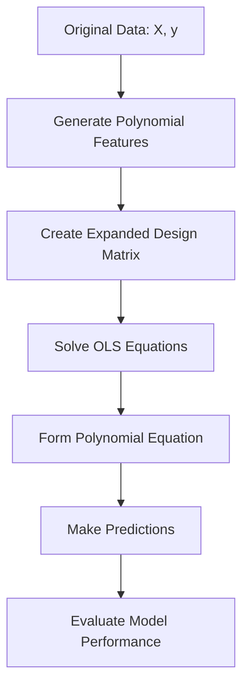

# 🌊 Polynomial Regression

<div align="center">


*Capturing Non-Linear Relationships with Polynomial Features*

</div>

---

## 📚 Table of Contents

- [What is Polynomial Regression?](#what-is-polynomial-regression)
- [Mathematical Foundation](#mathematical-foundation)
- [How It Works](#how-it-works)
- [Polynomial Degrees](#polynomial-degrees)
- [Implementation Guide](#implementation-guide)
- [Model Selection](#model-selection)
- [Overfitting and Regularization](#overfitting-and-regularization)
- [Pros and Cons](#pros-and-cons)
- [Real-World Examples](#real-world-examples)
- [Advanced Topics](#advanced-topics)
- [FAQ](#faq)

---

## 🎯 What is Polynomial Regression?

**Polynomial Regression** is an extension of linear regression that models the relationship between a dependent variable and independent variables as an nth degree polynomial. It captures non-linear relationships by adding polynomial terms to the regression equation.

### Key Characteristics:
- **Non-Linear Modeling**: Can fit curved relationships in data
- **Polynomial Features**: Uses powers of original features (x², x³, etc.)
- **Linear Model Framework**: Still a linear model in terms of parameters
- **Flexible Complexity**: Adjustable via polynomial degree

### The Goal:
Find the **best-fitting curve** that describes the non-linear relationship between variables.

---

## 🧮 Mathematical Foundation

### The Polynomial Regression Equation

For a single independent variable x, a polynomial regression model of degree n is:

```
y = β₀ + β₁x + β₂x² + β₃x³ + ... + βₙxⁿ + ε
```

**For multiple independent variables:**
```
y = β₀ + β₁x₁ + β₂x₂ + ... + βₚxₚ + β₍ₚ₊₁₎x₁² + β₍ₚ₊₂₎x₁x₂ + ... + ε
```

Where:
- **y**: Dependent variable
- **x₁, x₂, ..., xₚ**: Independent variables
- **β₀, β₁, β₂, ...**: Regression coefficients
- **ε**: Error term

### Parameter Estimation

Despite the non-linear appearance, polynomial regression is still a **linear model in its parameters**. We can transform the original features into polynomial features and use Ordinary Least Squares (OLS) to estimate the parameters:

```
β = (XᵀX)⁻¹XᵀY
```

Where X now contains the polynomial features.

### Design Matrix Structure

For a polynomial regression of degree 2 with one predictor:
```
X = [1  x₁   x₁²]
    [1  x₂   x₂²]
    [⋮   ⋮    ⋮ ]
    [1  xₙ   xₙ²]
```

For multiple predictors and degree 2, we include interaction terms:
```
X = [1  x₁₁  x₁₂  x₁₁²  x₁₁x₁₂  x₁₂²]
    [1  x₂₁  x₂₂  x₂₁²  x₂₁x₂₂  x₂₂²]
    [⋮   ⋮    ⋮    ⋮      ⋮      ⋮  ]
    [1  xₙ₁  xₙ₂  xₙ₁²  xₙ₁xₙ₂  xₙ₂²]
```

---

## ⚙️ How It Works

### Step-by-Step Process:

<div align="center">



</div>

### 1. **Feature Transformation**
- Convert original features into polynomial features (x, x², x³, ...)
- For multiple features, include interaction terms (x₁x₂, x₁x₃, ...)

### 2. **Model Fitting**
- Use the transformed features matrix
- Apply standard linear regression techniques (OLS)

### 3. **Prediction**
- Transform new data points into polynomial features
- Apply the fitted model to make predictions

---

## 📈 Polynomial Degrees

### Degree Selection and Effects

<div align="center">

| Degree | Flexibility | Complexity | Common Applications |
|--------|-------------|------------|---------------------|
| **1**  | None        | Lowest     | Linear trends       |
| **2**  | Low         | Low        | Single curve, parabolas |
| **3**  | Medium      | Medium     | S-curves, inflection points |
| **4+** | High        | High       | Complex patterns, oscillations |

</div>

### Visual Comparison:

```
Degree 1 (Linear): y = β₀ + β₁x
        |
        |      *
        |    *
        |  *
        |*
        +------------

Degree 2 (Quadratic): y = β₀ + β₁x + β₂x²
        |
        |  *       *
        | *         *
        |*           *
        +----------------

Degree 3 (Cubic): y = β₀ + β₁x + β₂x² + β₃x³
        |      *
        |    *   *
        |  *       *
        |*           *
        +----------------

Degree 4 (Quartic): y = β₀ + β₁x + β₂x² + β₃x³ + β₄x⁴
        |    *       *
        |   *         *
        |  *           *
        |*               *
        +------------------
```

### Impact of Degree on Model Behavior:

1. **Too Low**: Underfitting (can't capture true pattern)
2. **Just Right**: Good fit (captures important patterns)
3. **Too High**: Overfitting (fits noise, poor generalization)

---

## 💻 Implementation Guide

### From Scratch Implementation

```python
import numpy as np
import matplotlib.pyplot as plt
from typing import Tuple, Optional

class PolynomialRegression:
    def __init__(self, degree: int = 2, include_bias: bool = True):
        """
        Polynomial Regression implementation from scratch.
        
        Parameters:
        degree (int): The degree of the polynomial
        include_bias (bool): Whether to include bias term (intercept)
        """
        self.degree = degree
        self.include_bias = include_bias
        self.coefficients = None
        self.fitted = False
    
    def _polynomial_features(self, X: np.ndarray) -> np.ndarray:
        """
        Generate polynomial features up to the specified degree.
        
        Parameters:
        X (array-like): Features array of shape (n_samples, n_features)
        
        Returns:
        array: Transformed features of shape (n_samples, n_features_new)
        """
        if X.ndim == 1:
            X = X.reshape(-1, 1)
            
        n_samples, n_features = X.shape
        
        # Initialize with first degree features
        X_poly = X.copy()
        
        # Add higher degree features
        for d in range(2, self.degree + 1):
            # Add x^d features for each original feature
            X_degree = np.power(X, d)
            X_poly = np.column_stack([X_poly, X_degree])
            
            # Add interaction terms for higher degrees if multiple features
            if n_features > 1:
                # This is simplified - for a complete implementation, 
                # we need to include all combinations of features
                # that sum to degree d
                pass
        
        # Add bias term if needed
        if self.include_bias:
            X_poly = np.column_stack([np.ones(n_samples), X_poly])
            
        return X_poly
    
    def fit(self, X: np.ndarray, y: np.ndarray) -> 'PolynomialRegression':
        """
        Fit polynomial regression model.
        
        Parameters:
        X (array-like): Training features
        y (array-like): Target values
        
        Returns:
        self: Returns instance of self
        """
        X = np.array(X)
        y = np.array(y)
        
        # Generate polynomial features
        X_poly = self._polynomial_features(X)
        
        # Solve normal equations: β = (X'X)^(-1)X'y
        try:
            XtX = X_poly.T @ X_poly
            XtY = X_poly.T @ y
            
            # Check for numerical stability
            if np.linalg.cond(XtX) > 1e12:
                print("Warning: Design matrix is ill-conditioned. Consider regularization.")
            
            # Solve linear system
            self.coefficients = np.linalg.solve(XtX, XtY)
            
        except np.linalg.LinAlgError:
            raise ValueError("Failed to solve normal equations. Matrix may be singular.")
        
        self.fitted = True
        return self
    
    def predict(self, X: np.ndarray) -> np.ndarray:
        """
        Make predictions using the fitted model.
        
        Parameters:
        X (array-like): Features to predict
        
        Returns:
        array: Predicted values
        """
        if not self.fitted:
            raise ValueError("Model must be fitted before making predictions")
        
        # Generate polynomial features
        X_poly = self._polynomial_features(np.array(X))
        
        # Make predictions
        return X_poly @ self.coefficients
    
    def score(self, X: np.ndarray, y: np.ndarray) -> float:
        """
        Calculate R² score.
        
        Parameters:
        X (array-like): Test features
        y (array-like): True values
        
        Returns:
        float: R² score
        """
        y_pred = self.predict(X)
        ss_res = np.sum((y - y_pred) ** 2)
        ss_tot = np.sum((y - np.mean(y)) ** 2)
        
        return 1 - (ss_res / ss_tot)
    
    def __str__(self) -> str:
        if not self.fitted:
            return f"PolynomialRegression(degree={self.degree}, not fitted)"
        
        if self.include_bias:
            equation = f"ŷ = {self.coefficients[0]:.3f}"
            start_idx = 1
        else:
            equation = f"ŷ = "
            start_idx = 0
            
        feature_idx = 0
        term_idx = start_idx
        
        # Linear terms first
        for i in range(feature_idx, feature_idx + 1):
            if term_idx < len(self.coefficients):
                equation += f" + {self.coefficients[term_idx]:.3f}x"
                term_idx += 1
        
        # Then quadratic, cubic, etc.
        for d in range(2, self.degree + 1):
            for i in range(feature_idx, feature_idx + 1):
                if term_idx < len(self.coefficients):
                    equation += f" + {self.coefficients[term_idx]:.3f}x^{d}"
                    term_idx += 1
        
        return f"PolynomialRegression({equation})"
```

### Using Scikit-learn

```python
import numpy as np
import matplotlib.pyplot as plt
from sklearn.preprocessing import PolynomialFeatures
from sklearn.linear_model import LinearRegression
from sklearn.pipeline import Pipeline
from sklearn.metrics import mean_squared_error, r2_score

def polynomial_regression_sklearn(X, y, degree=2, test_size=0.2, random_state=42):
    """
    Fit polynomial regression using scikit-learn.
    
    Parameters:
    X (array-like): Features
    y (array-like): Target values
    degree (int): Polynomial degree
    test_size (float): Proportion of data for testing
    random_state (int): Random seed for reproducibility
    
    Returns:
    tuple: (model, X_test, y_test, y_pred)
    """
    # Reshape X if it's 1D
    if X.ndim == 1:
        X = X.reshape(-1, 1)
    
    # Split data
    from sklearn.model_selection import train_test_split
    X_train, X_test, y_train, y_test = train_test_split(
        X, y, test_size=test_size, random_state=random_state
    )
    
    # Create polynomial regression pipeline
    model = Pipeline([
        ('poly', PolynomialFeatures(degree=degree)),
        ('linear', LinearRegression())
    ])
    
    # Fit model
    model.fit(X_train, y_train)
    
    # Make predictions
    y_pred = model.predict(X_test)
    
    # Evaluate
    r2 = r2_score(y_test, y_pred)
    rmse = np.sqrt(mean_squared_error(y_test, y_pred))
    
    print(f"Polynomial Regression (Degree {degree}):")
    print(f"R² Score: {r2:.3f}")
    print(f"RMSE: {rmse:.3f}")
    
    # Extract and print coefficients
    coefficients = model.named_steps['linear'].coef_
    intercept = model.named_steps['linear'].intercept_
    
    print(f"Intercept: {intercept:.3f}")
    print(f"Coefficients: {coefficients}")
    
    return model, X_test, y_test, y_pred

# Example usage
def visualize_polynomial_fit(X, y, degrees=[1, 2, 3, 4]):
    """
    Visualize polynomial regression fits with different degrees.
    
    Parameters:
    X (array-like): Features
    y (array-like): Target values
    degrees (list): List of polynomial degrees to try
    """
    # Create figure
    plt.figure(figsize=(15, 10))
    
    # Generate a dense grid for smooth curves
    X_grid = np.linspace(min(X), max(X), 100).reshape(-1, 1)
    
    for i, degree in enumerate(degrees, 1):
        # Create subplot
        plt.subplot(2, 2, i)
        
        # Fit model
        model = Pipeline([
            ('poly', PolynomialFeatures(degree=degree)),
            ('linear', LinearRegression())
        ])
        model.fit(X.reshape(-1, 1), y)
        
        # Predict on grid
        y_grid = model.predict(X_grid)
        
        # Plot data and fit
        plt.scatter(X, y, alpha=0.7, label='Data points')
        plt.plot(X_grid, y_grid, 'r-', label=f'Degree {degree} fit')
        
        # Calculate metrics
        r2 = model.score(X.reshape(-1, 1), y)
        y_pred = model.predict(X.reshape(-1, 1))
        rmse = np.sqrt(mean_squared_error(y, y_pred))
        
        plt.title(f"Polynomial Regression (Degree {degree})\nR² = {r2:.3f}, RMSE = {rmse:.3f}")
        plt.xlabel("X")
        plt.ylabel("y")
        plt.legend()
        plt.grid(alpha=0.3)
    
    plt.tight_layout()
    plt.show()

# Generate sample data for demonstration
np.random.seed(42)
X = np.sort(np.random.uniform(-3, 3, 100))
y = 1 + 2*X + 1.5*X**2 - 0.5*X**3 + np.random.normal(0, 2, 100)  # Cubic relationship with noise

# Visualize
visualize_polynomial_fit(X, y, degrees=[1, 2, 3, 4])
```

### Complete Example with Regularization

```python
from sklearn.linear_model import Ridge, Lasso
from sklearn.model_selection import train_test_split, cross_val_score, KFold
from sklearn.preprocessing import PolynomialFeatures, StandardScaler
from sklearn.pipeline import Pipeline
from sklearn.metrics import mean_squared_error, r2_score
import matplotlib.pyplot as plt
import numpy as np

def comprehensive_polynomial_analysis(X, y, max_degree=5, cv_folds=5):
    """
    Comprehensive analysis of polynomial regression with different degrees and regularization.
    
    Parameters:
    X (array-like): Features
    y (array-like): Target values
    max_degree (int): Maximum polynomial degree to try
    cv_folds (int): Number of cross-validation folds
    """
    # Ensure X is 2D
    if X.ndim == 1:
        X = X.reshape(-1, 1)
    
    # Split data
    X_train, X_test, y_train, y_test = train_test_split(
        X, y, test_size=0.2, random_state=42
    )
    
    # Initialize results storage
    degrees = list(range(1, max_degree + 1))
    train_r2 = []
    test_r2 = []
    cv_r2 = []
    test_rmse = []
    
    # Create cross-validation object
    kf = KFold(n_splits=cv_folds, shuffle=True, random_state=42)
    
    # Fit models with different degrees
    for degree in degrees:
        # Regular Polynomial Regression
        poly_model = Pipeline([
            ('poly', PolynomialFeatures(degree=degree)),
            ('scaler', StandardScaler()),
            ('linear', LinearRegression())
        ])
        
        # Fit on training data
        poly_model.fit(X_train, y_train)
        
        # Calculate scores
        train_score = poly_model.score(X_train, y_train)
        test_score = poly_model.score(X_test, y_test)
        
        # Cross-validation
        cv_scores = cross_val_score(poly_model, X, y, cv=kf, scoring='r2')
        
        # Calculate RMSE on test data
        y_pred = poly_model.predict(X_test)
        rmse = np.sqrt(mean_squared_error(y_test, y_pred))
        
        # Store results
        train_r2.append(train_score)
        test_r2.append(test_score)
        cv_r2.append(cv_scores.mean())
        test_rmse.append(rmse)
    
    # Plot results
    plt.figure(figsize=(15, 10))
    
    # Plot 1: R² scores
    plt.subplot(2, 2, 1)
    plt.plot(degrees, train_r2, 'o-', label='Training R²')
    plt.plot(degrees, test_r2, 's-', label='Test R²')
    plt.plot(degrees, cv_r2, '^-', label='Cross-Val R²')
    plt.xlabel('Polynomial Degree')
    plt.ylabel('R² Score')
    plt.title('R² vs. Polynomial Degree')
    plt.legend()
    plt.grid(alpha=0.3)
    
    # Plot 2: RMSE
    plt.subplot(2, 2, 2)
    plt.plot(degrees, test_rmse, 'o-')
    plt.xlabel('Polynomial Degree')
    plt.ylabel('Test RMSE')
    plt.title('Test RMSE vs. Polynomial Degree')
    plt.grid(alpha=0.3)
    
    # Plot 3: Best model fit
    best_degree = degrees[np.argmax(cv_r2)]
    best_model = Pipeline([
        ('poly', PolynomialFeatures(degree=best_degree)),
        ('scaler', StandardScaler()),
        ('linear', LinearRegression())
    ])
    best_model.fit(X_train, y_train)
    
    plt.subplot(2, 2, 3)
    
    # If X is 1D, we can visualize the fit
    if X.shape[1] == 1:
        # Sort X for clean visualization
        X_sorted = np.sort(X, axis=0)
        # Generate predictions on sorted data
        y_pred_sorted = best_model.predict(X_sorted)
        
        plt.scatter(X, y, alpha=0.5, label='Data')
        plt.plot(X_sorted, y_pred_sorted, 'r-', linewidth=2, label=f'Degree {best_degree} fit')
        plt.xlabel('X')
        plt.ylabel('y')
        plt.title(f'Best Model: Degree {best_degree}')
        plt.legend()
        plt.grid(alpha=0.3)
    else:
        # For higher dimensions, show residuals
        y_pred = best_model.predict(X)
        residuals = y - y_pred
        plt.scatter(y_pred, residuals)
        plt.axhline(y=0, color='r', linestyle='-')
        plt.xlabel('Predicted values')
        plt.ylabel('Residuals')
        plt.title('Residuals vs. Fitted (Best Model)')
        plt.grid(alpha=0.3)
    
    # Plot 4: Regularization comparison
    plt.subplot(2, 2, 4)
    
    # Try different alpha values for Ridge
    alphas = [0.001, 0.01, 0.1, 1.0, 10.0, 100.0]
    ridge_scores = []
    lasso_scores = []
    
    for alpha in alphas:
        # Ridge
        ridge_model = Pipeline([
            ('poly', PolynomialFeatures(degree=best_degree)),
            ('scaler', StandardScaler()),
            ('ridge', Ridge(alpha=alpha))
        ])
        ridge_cv = cross_val_score(ridge_model, X, y, cv=kf, scoring='r2')
        ridge_scores.append(ridge_cv.mean())
        
        # Lasso
        lasso_model = Pipeline([
            ('poly', PolynomialFeatures(degree=best_degree)),
            ('scaler', StandardScaler()),
            ('lasso', Lasso(alpha=alpha))
        ])
        lasso_cv = cross_val_score(lasso_model, X, y, cv=kf, scoring='r2')
        lasso_scores.append(lasso_cv.mean())
    
    plt.semilogx(alphas, ridge_scores, 'o-', label='Ridge')
    plt.semilogx(alphas, lasso_scores, 's-', label='Lasso')
    plt.xlabel('Regularization Strength (alpha)')
    plt.ylabel('Cross-Val R²')
    plt.title('Regularization Comparison')
    plt.legend()
    plt.grid(alpha=0.3)
    
    plt.tight_layout()
    plt.show()
    
    # Print results summary
    print("=" * 50)
    print("POLYNOMIAL REGRESSION ANALYSIS")
    print("=" * 50)
    print(f"Best Degree: {best_degree}")
    print(f"Best Cross-Val R²: {max(cv_r2):.3f}")
    print(f"Test R² at best degree: {test_r2[best_degree-1]:.3f}")
    print(f"Test RMSE at best degree: {test_rmse[best_degree-1]:.3f}")
    
    # Find best regularization
    ridge_best_alpha = alphas[np.argmax(ridge_scores)]
    lasso_best_alpha = alphas[np.argmax(lasso_scores)]
    
    print("\nRegularization Results:")
    print(f"Best Ridge alpha: {ridge_best_alpha}")
    print(f"Best Ridge R²: {max(ridge_scores):.3f}")
    print(f"Best Lasso alpha: {lasso_best_alpha}")
    print(f"Best Lasso R²: {max(lasso_scores):.3f}")
    
    # Return best model and degree
    return {
        'best_degree': best_degree,
        'best_model': best_model,
        'cv_scores': cv_r2,
        'test_r2': test_r2[best_degree-1],
        'test_rmse': test_rmse[best_degree-1]
    }

# Example usage
np.random.seed(42)
X = np.sort(np.random.uniform(-3, 3, 100)).reshape(-1, 1)
y = 1 + 2*X.flatten() + 1.5*X.flatten()**2 - 0.5*X.flatten()**3 + np.random.normal(0, 2, 100)

results = comprehensive_polynomial_analysis(X, y, max_degree=10)
```

---

## 🔎 Model Selection

### Cross-Validation for Degree Selection

```python
from sklearn.model_selection import GridSearchCV

def select_optimal_degree(X, y, max_degree=10, cv=5):
    """
    Select the optimal polynomial degree using cross-validation.
    
    Parameters:
    X (array-like): Features
    y (array-like): Target values
    max_degree (int): Maximum degree to consider
    cv (int): Number of cross-validation folds
    
    Returns:
    tuple: (best_degree, best_model)
    """
    # Set up parameter grid
    param_grid = {
        'poly__degree': range(1, max_degree + 1)
    }
    
    # Create pipeline
    pipeline = Pipeline([
        ('poly', PolynomialFeatures()),
        ('scaler', StandardScaler()),  # Scaling is important for higher-degree terms
        ('linear', LinearRegression())
    ])
    
    # Grid search
    grid_search = GridSearchCV(
        pipeline, param_grid, cv=cv, scoring='r2',
        return_train_score=True
    )
    
    # Fit grid search
    grid_search.fit(X, y)
    
    # Get results
    cv_results = grid_search.cv_results_
    
    # Plot results
    plt.figure(figsize=(10, 6))
    plt.plot(
        cv_results['param_poly__degree'], 
        cv_results['mean_train_score'], 
        'o-', label='Training Score'
    )
    plt.plot(
        cv_results['param_poly__degree'], 
        cv_results['mean_test_score'], 
        's-', label='CV Score'
    )
    plt.xlabel('Polynomial Degree')
    plt.ylabel('R² Score')
    plt.title('Polynomial Degree Selection')
    plt.legend()
    plt.grid(alpha=0.3)
    plt.show()
    
    # Return best parameters and model
    best_degree = grid_search.best_params_['poly__degree']
    best_model = grid_search.best_estimator_
    
    print(f"Best Polynomial Degree: {best_degree}")
    print(f"Best CV Score: {grid_search.best_score_:.3f}")
    
    return best_degree, best_model
```

### Information Criteria (AIC/BIC)

```python
def calculate_information_criteria(X, y, max_degree=10):
    """
    Calculate AIC and BIC for polynomial models of different degrees.
    
    Parameters:
    X (array-like): Features
    y (array-like): Target values
    max_degree (int): Maximum degree to consider
    
    Returns:
    tuple: (aic_values, bic_values, best_aic_degree, best_bic_degree)
    """
    n = len(y)
    degrees = range(1, max_degree + 1)
    aic_values = []
    bic_values = []
    
    for degree in degrees:
        # Create polynomial features
        poly = PolynomialFeatures(degree=degree)
        X_poly = poly.fit_transform(X)
        
        # Number of parameters (including intercept)
        k = X_poly.shape[1]
        
        # Fit model
        model = LinearRegression()
        model.fit(X_poly, y)
        
        # Calculate predictions and RSS
        y_pred = model.predict(X_poly)
        rss = np.sum((y - y_pred) ** 2)
        
        # Calculate AIC and BIC
        # AIC = n * log(RSS/n) + 2k
        aic = n * np.log(rss/n) + 2 * k
        
        # BIC = n * log(RSS/n) + k * log(n)
        bic = n * np.log(rss/n) + k * np.log(n)
        
        aic_values.append(aic)
        bic_values.append(bic)
    
    # Find best degrees
    best_aic_degree = degrees[np.argmin(aic_values)]
    best_bic_degree = degrees[np.argmin(bic_values)]
    
    # Plot results
    plt.figure(figsize=(10, 6))
    plt.plot(degrees, aic_values, 'o-', label='AIC')
    plt.plot(degrees, bic_values, 's-', label='BIC')
    plt.axvline(x=best_aic_degree, color='r', linestyle='--', label=f'Best AIC (degree={best_aic_degree})')
    plt.axvline(x=best_bic_degree, color='g', linestyle='--', label=f'Best BIC (degree={best_bic_degree})')
    plt.xlabel('Polynomial Degree')
    plt.ylabel('Information Criterion Value')
    plt.title('Model Selection by Information Criteria')
    plt.legend()
    plt.grid(alpha=0.3)
    plt.show()
    
    print(f"Best Degree by AIC: {best_aic_degree}")
    print(f"Best Degree by BIC: {best_bic_degree} (BIC tends to favor simpler models)")
    
    return aic_values, bic_values, best_aic_degree, best_bic_degree
```

---

## 🛡️ Overfitting and Regularization

### Detecting Overfitting

```python
def detect_overfitting(X, y, degrees=[1, 2, 3, 5, 10], test_size=0.3):
    """
    Detect overfitting in polynomial regression by comparing training and test errors.
    
    Parameters:
    X (array-like): Features
    y (array-like): Target values
    degrees (list): List of polynomial degrees to try
    test_size (float): Proportion of data for testing
    
    Returns:
    tuple: (train_errors, test_errors)
    """
    # Split data
    X_train, X_test, y_train, y_test = train_test_split(X, y, test_size=test_size, random_state=42)
    
    train_errors = []
    test_errors = []
    
    for degree in degrees:
        # Create and fit model
        poly = PolynomialFeatures(degree=degree)
        X_train_poly = poly.fit_transform(X_train)
        X_test_poly = poly.transform(X_test)
        
        model = LinearRegression()
        model.fit(X_train_poly, y_train)
        
        # Calculate errors
        train_pred = model.predict(X_train_poly)
        test_pred = model.predict(X_test_poly)
        
        train_error = mean_squared_error(y_train, train_pred)
        test_error = mean_squared_error(y_test, test_pred)
        
        train_errors.append(train_error)
        test_errors.append(test_error)
    
    # Plot results
    plt.figure(figsize=(10, 6))
    plt.plot(degrees, train_errors, 'o-', label='Training Error')
    plt.plot(degrees, test_errors, 's-', label='Test Error')
    plt.yscale('log')
    plt.xlabel('Polynomial Degree')
    plt.ylabel('MSE (log scale)')
    plt.title('Detecting Overfitting in Polynomial Regression')
    plt.legend()
    plt.grid(alpha=0.3)
    plt.show()
    
    # Identify overfitting point
    for i in range(1, len(degrees)):
        if train_errors[i] < train_errors[i-1] and test_errors[i] > test_errors[i-1]:
            print(f"Overfitting detected at degree {degrees[i]}")
            print(f"Training error decreases but test error increases")
            break
    
    return train_errors, test_errors
```

### Regularized Polynomial Regression

```python
def compare_regularization_methods(X, y, degree=3, alphas=[0.001, 0.01, 0.1, 1.0, 10.0]):
    """
    Compare different regularization methods for polynomial regression.
    
    Parameters:
    X (array-like): Features
    y (array-like): Target values
    degree (int): Polynomial degree
    alphas (list): Regularization strengths to try
    
    Returns:
    dict: Dictionary of model results
    """
    # Split data
    X_train, X_test, y_train, y_test = train_test_split(X, y, test_size=0.3, random_state=42)
    
    # Initialize results
    results = {
        'standard': {},
        'ridge': {},
        'lasso': {}
    }
    
    # Standard Polynomial Regression
    standard_model = Pipeline([
        ('poly', PolynomialFeatures(degree=degree)),
        ('scaler', StandardScaler()),
        ('linear', LinearRegression())
    ])
    standard_model.fit(X_train, y_train)
    
    y_train_pred_std = standard_model.predict(X_train)
    y_test_pred_std = standard_model.predict(X_test)
    
    results['standard']['train_r2'] = r2_score(y_train, y_train_pred_std)
    results['standard']['test_r2'] = r2_score(y_test, y_test_pred_std)
    results['standard']['test_rmse'] = np.sqrt(mean_squared_error(y_test, y_test_pred_std))
    
    # Extract coefficients (excluding intercept)
    coeffs_std = standard_model.named_steps['linear'].coef_
    results['standard']['coeffs'] = coeffs_std
    
    # Ridge and Lasso for different alphas
    ridge_scores = []
    lasso_scores = []
    ridge_coeffs = []
    lasso_coeffs = []
    
    for alpha in alphas:
        # Ridge
        ridge_model = Pipeline([
            ('poly', PolynomialFeatures(degree=degree)),
            ('scaler', StandardScaler()),
            ('ridge', Ridge(alpha=alpha))
        ])
        ridge_model.fit(X_train, y_train)
        
        ridge_score = ridge_model.score(X_test, y_test)
        ridge_scores.append(ridge_score)
        
        ridge_coeffs.append(ridge_model.named_steps['ridge'].coef_)
        
        # Lasso
        lasso_model = Pipeline([
            ('poly', PolynomialFeatures(degree=degree)),
            ('scaler', StandardScaler()),
            ('lasso', Lasso(alpha=alpha))
        ])
        lasso_model.fit(X_train, y_train)
        
        lasso_score = lasso_model.score(X_test, y_test)
        lasso_scores.append(lasso_score)
        
        lasso_coeffs.append(lasso_model.named_steps['lasso'].coef_)
    
    results['ridge']['alphas'] = alphas
    results['ridge']['scores'] = ridge_scores
    results['ridge']['coeffs'] = ridge_coeffs
    
    results['lasso']['alphas'] = alphas
    results['lasso']['scores'] = lasso_scores
    results['lasso']['coeffs'] = lasso_coeffs
    
    # Plot results
    plt.figure(figsize=(15, 10))
    
    # Plot 1: R² vs Alpha
    plt.subplot(2, 2, 1)
    plt.semilogx(alphas, ridge_scores, 'o-', label='Ridge')
    plt.semilogx(alphas, lasso_scores, 's-', label='Lasso')
    plt.axhline(y=results['standard']['test_r2'], color='r', linestyle='--', 
                label=f'Standard (R²={results["standard"]["test_r2"]:.3f})')
    plt.xlabel('Regularization Strength (alpha)')
    plt.ylabel('Test R²')
    plt.title('R² vs. Regularization Strength')
    plt.legend()
    plt.grid(alpha=0.3)
    
    # Plot 2: Ridge coefficients
    plt.subplot(2, 2, 2)
    for i, coef in enumerate(zip(*ridge_coeffs)):
        plt.semilogx(alphas, coef, '.-', label=f'Coef {i+1}')
    plt.xlabel('Alpha')
    plt.ylabel('Coefficient Value')
    plt.title('Ridge Coefficients vs. Alpha')
    plt.grid(alpha=0.3)
    if len(ridge_coeffs[0]) <= 10:  # Only show legend if not too many coefficients
        plt.legend()
    
    # Plot 3: Lasso coefficients
    plt.subplot(2, 2, 3)
    for i, coef in enumerate(zip(*lasso_coeffs)):
        plt.semilogx(alphas, coef, '.-', label=f'Coef {i+1}')
    plt.xlabel('Alpha')
    plt.ylabel('Coefficient Value')
    plt.title('Lasso Coefficients vs. Alpha')
    plt.grid(alpha=0.3)
    if len(lasso_coeffs[0]) <= 10:  # Only show legend if not too many coefficients
        plt.legend()
    
    # Plot 4: Sparsity comparison
    plt.subplot(2, 2, 4)
    
    # Count non-zero coefficients for Lasso
    lasso_nonzeros = [np.sum(np.abs(coefs) > 1e-5) for coefs in lasso_coeffs]
    
    # Count coefficients with absolute value > 0.01 * max_coef for Ridge
    ridge_significant = []
    for coefs in ridge_coeffs:
        max_coef = np.max(np.abs(coefs))
        ridge_significant.append(np.sum(np.abs(coefs) > 0.01 * max_coef))
    
    plt.semilogx(alphas, lasso_nonzeros, 's-', label='Lasso Non-Zero')
    plt.semilogx(alphas, ridge_significant, 'o-', label='Ridge Significant')
    plt.axhline(y=len(coeffs_std), color='r', linestyle='--', 
                label=f'Standard (all coeffs)')
    plt.xlabel('Alpha')
    plt.ylabel('Number of Coefficients')
    plt.title('Feature Selection Effect')
    plt.legend()
    plt.grid(alpha=0.3)
    
    plt.tight_layout()
    plt.show()
    
    # Print summary
    print("=" * 50)
    print("REGULARIZATION COMPARISON")
    print("=" * 50)
    
    print(f"Standard Polynomial (Degree {degree}):")
    print(f"  Train R²: {results['standard']['train_r2']:.3f}")
    print(f"  Test R²: {results['standard']['test_r2']:.3f}")
    print(f"  Test RMSE: {results['standard']['test_rmse']:.3f}")
    
    best_ridge_idx = np.argmax(ridge_scores)
    best_lasso_idx = np.argmax(lasso_scores)
    
    print(f"\nBest Ridge (alpha={alphas[best_ridge_idx]}):")
    print(f"  Test R²: {ridge_scores[best_ridge_idx]:.3f}")
    
    print(f"\nBest Lasso (alpha={alphas[best_lasso_idx]}):")
    print(f"  Test R²: {lasso_scores[best_lasso_idx]:.3f}")
    print(f"  Non-zero coefficients: {lasso_nonzeros[best_lasso_idx]} of {len(lasso_coeffs[best_lasso_idx])}")
    
    return results
```

---

## ✅ Pros and Cons

<div align="center">

| ✅ **Advantages** | ❌ **Disadvantages** |
|-------------------|---------------------|
| **Captures Non-Linear Relationships** | **Prone to Overfitting** |
| Models curved patterns in data | High degrees fit noise |
| **Uses Linear Regression Framework** | **Sensitive to Outliers** |
| Easy to implement and interpret | Extreme values heavily influence fit |
| **Versatile Complexity** | **Extrapolation Issues** |
| Adjustable via polynomial degree | Poor predictions outside data range |
| **Feature Engineering Basis** | **Multicollinearity** |
| Demonstrates polynomial feature creation | Higher degree terms are correlated |
| **Interpretable Coefficients** | **Computational Complexity** |
| Each term has physical meaning | Many features for high degrees |

</div>

### When to Use Polynomial Regression:

✅ **Good Choice When:**
- Data shows clear non-linear patterns
- Relationship can be modeled with a reasonable polynomial degree
- You need interpretable results
- You understand the domain to select appropriate degree
- Data covers a continuous range

❌ **Avoid When:**
- Data has very complex non-linear patterns
- Relationship is periodic or exponential
- You have very high-dimensional data
- Extrapolation beyond data range is needed
- Data has many outliers

---

## 🌍 Real-World Examples

### Example 1: Growth Curve Modeling

```python
import numpy as np
import pandas as pd
import matplotlib.pyplot as plt
from sklearn.preprocessing import PolynomialFeatures
from sklearn.linear_model import LinearRegression
from sklearn.metrics import mean_squared_error, r2_score
from sklearn.pipeline import Pipeline
from sklearn.model_selection import train_test_split

# Generate plant growth data
np.random.seed(42)

# Time points (days)
days = np.linspace(0, 30, 40)

# S-shaped growth curve with noise
growth = 2 / (1 + np.exp(-0.4 * (days - 15))) + np.random.normal(0, 0.05, size=len(days))

# Create DataFrame
growth_data = pd.DataFrame({
    'day': days,
    'height': growth
})

print("Plant Growth Modeling")
print("=" * 40)

# Split data
X = growth_data[['day']].values
y = growth_data['height'].values
X_train, X_test, y_train, y_test = train_test_split(X, y, test_size=0.25, random_state=42)

# Try different polynomial degrees
max_degree = 6
results = []

plt.figure(figsize=(15, 10))

for degree in range(1, max_degree + 1):
    # Create model
    model = Pipeline([
        ('poly', PolynomialFeatures(degree=degree)),
        ('linear', LinearRegression())
    ])
    
    # Fit model
    model.fit(X_train, y_train)
    
    # Make predictions
    y_pred = model.predict(X_test)
    
    # Calculate metrics
    r2 = r2_score(y_test, y_pred)
    rmse = np.sqrt(mean_squared_error(y_test, y_pred))
    
    results.append({
        'degree': degree,
        'r2': r2,
        'rmse': rmse
    })
    
    # Plot this model's predictions over full range
    X_full_range = days.reshape(-1, 1)
    y_pred_full = model.predict(X_full_range)
    
    plt.subplot(2, 3, degree)
    plt.scatter(days, growth, alpha=0.6, label='Data')
    plt.plot(days, y_pred_full, 'r-', label=f'Degree {degree}')
    plt.title(f"Polynomial Degree {degree}\nR² = {r2:.3f}, RMSE = {rmse:.3f}")
    plt.xlabel('Days')
    plt.ylabel('Plant Height (cm)')
    plt.legend()
    plt.grid(alpha=0.3)
    
plt.tight_layout()
plt.show()

# Find best model
best_result = max(results, key=lambda x: x['r2'])
print(f"Best Model: Polynomial Degree {best_result['degree']}")
print(f"R² Score: {best_result['r2']:.3f}")
print(f"RMSE: {best_result['rmse']:.3f}")

# Use best model to make predictions
best_degree = best_result['degree']
best_model = Pipeline([
    ('poly', PolynomialFeatures(degree=best_degree)),
    ('linear', LinearRegression())
])
best_model.fit(X, y)

# Predict growth at specific time points
prediction_days = [5, 10, 15, 20, 25]
predictions = best_model.predict(np.array(prediction_days).reshape(-1, 1))

print("\nGrowth Predictions:")
for day, pred in zip(prediction_days, predictions):
    print(f"Day {day}: {pred:.2f} cm")

# Predict future growth
future_days = np.linspace(30, 45, 15).reshape(-1, 1)
future_growth = best_model.predict(future_days)

plt.figure(figsize=(10, 6))
plt.scatter(days, growth, alpha=0.6, label='Original Data')
plt.plot(days, best_model.predict(X), 'r-', label=f'Polynomial Fit (Degree {best_degree})')
plt.plot(future_days, future_growth, 'g--', label='Future Predictions')
plt.axvline(x=30, color='k', linestyle='--', alpha=0.3)
plt.text(31, min(growth), 'Extrapolation →', va='bottom')
plt.xlabel('Days')
plt.ylabel('Plant Height (cm)')
plt.title('Plant Growth Model with Future Predictions')
plt.legend()
plt.grid(alpha=0.3)
plt.show()

print("\nWarning: Extrapolation with polynomial models can be unreliable!")
print("The predictions beyond the data range should be interpreted with caution.")
```

### Example 2: Temperature vs. Power Efficiency

```python
# Thermal efficiency example
np.random.seed(123)

# Generate temperature data (°C)
temperatures = np.linspace(0, 100, 50)

# Generate efficiency data with optimal temperature around 65°C
efficiency = -0.01 * (temperatures - 65)**2 + 85 + np.random.normal(0, 3, size=len(temperatures))
efficiency = np.clip(efficiency, 0, 100)  # Clip to valid percentage

# Create DataFrame
thermal_data = pd.DataFrame({
    'temperature': temperatures,
    'efficiency': efficiency
})

print("Power Plant Thermal Efficiency Analysis")
print("=" * 50)

# Plot raw data
plt.figure(figsize=(10, 6))
plt.scatter(thermal_data['temperature'], thermal_data['efficiency'], alpha=0.7)
plt.xlabel('Temperature (°C)')
plt.ylabel('Efficiency (%)')
plt.title('Power Plant Efficiency vs. Temperature')
plt.grid(alpha=0.3)
plt.show()

# Split data
X = thermal_data[['temperature']].values
y = thermal_data['efficiency'].values

# Compare polynomial models
degrees = [1, 2, 3, 4]
models = {}

plt.figure(figsize=(15, 10))

for i, degree in enumerate(degrees, 1):
    # Create and fit model
    model = Pipeline([
        ('poly', PolynomialFeatures(degree=degree)),
        ('linear', LinearRegression())
    ])
    model.fit(X, y)
    
    # Store model
    models[degree] = model
    
    # Make predictions on a fine grid for smooth curve
    X_grid = np.linspace(min(temperatures), max(temperatures), 100).reshape(-1, 1)
    y_pred = model.predict(X_grid)
    
    # Plot
    plt.subplot(2, 2, i)
    plt.scatter(X, y, alpha=0.6, label='Data')
    plt.plot(X_grid, y_pred, 'r-', linewidth=2, label=f'Degree {degree}')
    
    # Calculate R²
    r2 = model.score(X, y)
    plt.title(f"Polynomial Degree {degree}, R² = {r2:.3f}")
    
    plt.xlabel('Temperature (°C)')
    plt.ylabel('Efficiency (%)')
    plt.legend()
    plt.grid(alpha=0.3)

plt.tight_layout()
plt.show()

# Select the quadratic model (degree 2)
quadratic_model = models[2]
X_grid = np.linspace(min(temperatures), max(temperatures), 100).reshape(-1, 1)
y_pred = quadratic_model.predict(X_grid)

# Find optimal temperature
optimal_temp_idx = np.argmax(y_pred)
optimal_temp = X_grid[optimal_temp_idx][0]
max_efficiency = y_pred[optimal_temp_idx]

print(f"Optimal Temperature: {optimal_temp:.1f}°C")
print(f"Maximum Efficiency: {max_efficiency:.1f}%")

# Plot optimum
plt.figure(figsize=(10, 6))
plt.scatter(X, y, alpha=0.6, label='Data')
plt.plot(X_grid, y_pred, 'r-', linewidth=2, label='Quadratic Model')
plt.axvline(x=optimal_temp, color='g', linestyle='--', label=f'Optimal Temp: {optimal_temp:.1f}°C')
plt.axhline(y=max_efficiency, color='g', linestyle='--')
plt.scatter([optimal_temp], [max_efficiency], color='g', s=100, marker='*', label=f'Maximum: {max_efficiency:.1f}%')
plt.xlabel('Temperature (°C)')
plt.ylabel('Efficiency (%)')
plt.title('Power Plant Efficiency Optimization')
plt.legend()
plt.grid(alpha=0.3)
plt.show()

# Calculate efficiency at various temperatures
test_temps = [20, 40, 60, 80]
efficiencies = quadratic_model.predict(np.array(test_temps).reshape(-1, 1))

print("\nEfficiency at various temperatures:")
for temp, eff in zip(test_temps, efficiencies):
    print(f"Temperature {temp}°C: {eff:.1f}% efficiency")

# Calculate the temperature range for >90% of max efficiency
threshold = 0.9 * max_efficiency
valid_indices = np.where(y_pred >= threshold)[0]
temp_range = (X_grid[valid_indices[0]][0], X_grid[valid_indices[-1]][0])

print(f"\nRecommended operating temperature range (>90% max efficiency):")
print(f"{temp_range[0]:.1f}°C to {temp_range[1]:.1f}°C")
```

### Example 3: Relationship Between Study Time and Test Score

```python
# Student study time vs. test score
np.random.seed(456)

# Generate study time data (hours)
n_students = 80
study_times = np.random.gamma(shape=2, scale=2, size=n_students)

# Generate test scores with diminishing returns
base_score = 40
max_improvement = 55
diminishing_returns_factor = 0.7

scores = base_score + max_improvement * (1 - np.exp(-diminishing_returns_factor * study_times))
scores += np.random.normal(0, 5, size=n_students)
scores = np.clip(scores, 0, 100)

# Create DataFrame
study_data = pd.DataFrame({
    'study_hours': study_times,
    'test_score': scores
})

print("Study Time vs. Test Score Analysis")
print("=" * 40)

# Plot raw data
plt.figure(figsize=(10, 6))
plt.scatter(study_data['study_hours'], study_data['test_score'], alpha=0.7)
plt.xlabel('Study Time (hours)')
plt.ylabel('Test Score (%)')
plt.title('Test Score vs. Study Time')
plt.grid(alpha=0.3)
plt.show()

# Split data
X = study_data[['study_hours']].values
y = study_data['test_score'].values
X_train, X_test, y_train, y_test = train_test_split(X, y, test_size=0.25, random_state=42)

# Compare models
models = {
    'Linear': LinearRegression(),
    'Quadratic': Pipeline([
        ('poly', PolynomialFeatures(degree=2)),
        ('linear', LinearRegression())
    ]),
    'Cubic': Pipeline([
        ('poly', PolynomialFeatures(degree=3)),
        ('linear', LinearRegression())
    ])
}

plt.figure(figsize=(15, 5))

for i, (name, model) in enumerate(models.items(), 1):
    # Fit model
    model.fit(X_train, y_train)
    
    # Evaluate on test data
    y_pred = model.predict(X_test)
    r2 = r2_score(y_test, y_pred)
    rmse = np.sqrt(mean_squared_error(y_test, y_pred))
    
    # Create predictions on a smooth grid
    X_grid = np.linspace(0, max(study_times) + 1, 100).reshape(-1, 1)
    y_grid = model.predict(X_grid)
    
    # Plot
    plt.subplot(1, 3, i)
    plt.scatter(X_test, y_test, alpha=0.6, label='Test Data')
    plt.plot(X_grid, y_grid, 'r-', linewidth=2, label=f'{name} Model')
    plt.title(f"{name} Model\nR² = {r2:.3f}, RMSE = {rmse:.1f}")
    plt.xlabel('Study Time (hours)')
    plt.ylabel('Test Score (%)')
    plt.legend()
    plt.grid(alpha=0.3)

plt.tight_layout()
plt.show()

# Select the quadratic model for analysis
quad_model = models['Quadratic']
quad_model.fit(X, y)  # Fit on all data for final model

# Generate a smooth prediction curve
X_smooth = np.linspace(0, 10, 100).reshape(-1, 1)
y_smooth = quad_model.predict(X_smooth)

# Calculate diminishing returns
# First derivative = rate of score improvement per additional hour
if isinstance(quad_model, Pipeline):
    # Extract coefficients for quadratic model
    coeffs = quad_model.named_steps['linear'].coef_
    poly_features = quad_model.named_steps['poly']
    powers = poly_features.powers_
    
    # For a quadratic model with one variable, we have [1, x, x^2]
    # First derivative = coeffs[1] + 2*coeffs[2]*x
    derivative = np.zeros_like(X_smooth)
    for i, x in enumerate(X_smooth):
        derivative[i] = coeffs[1] + 2 * coeffs[2] * x

# Plot final model with diminishing returns analysis
plt.figure(figsize=(12, 10))

# Plot 1: Model fit
plt.subplot(2, 1, 1)
plt.scatter(study_times, scores, alpha=0.6, label='Student Data')
plt.plot(X_smooth, y_smooth, 'r-', linewidth=2, label='Quadratic Model')
plt.xlabel('Study Time (hours)')
plt.ylabel('Test Score (%)')
plt.title('Study Time vs. Test Score: Quadratic Model')
plt.legend()
plt.grid(alpha=0.3)

# Plot 2: Diminishing returns
plt.subplot(2, 1, 2)
plt.plot(X_smooth, derivative, 'b-', linewidth=2)
plt.axhline(y=0, color='r', linestyle='--')
plt.xlabel('Study Time (hours)')
plt.ylabel('Score Improvement Rate (points/hour)')
plt.title('Diminishing Returns: Rate of Score Improvement')
plt.grid(alpha=0.3)

plt.tight_layout()
plt.show()

# Find optimal study time (where derivative drops below a threshold)
threshold = 2  # Points per hour
optimal_idx = np.where(derivative < threshold)[0]
if len(optimal_idx) > 0:
    optimal_hours = X_smooth[optimal_idx[0]][0]
    expected_score = float(quad_model.predict([[optimal_hours]]))
    print(f"Optimal study time: {optimal_hours:.1f} hours")
    print(f"Expected score at optimal time: {expected_score:.1f}%")
    print(f"At this point, each additional hour yields less than {threshold} points improvement")
else:
    print("No optimal study time found within the range")

# Calculate expected scores for different study durations
study_durations = [1, 2, 4, 6, 8]
expected_scores = quad_model.predict(np.array(study_durations).reshape(-1, 1))

print("\nExpected scores by study time:")
for hours, score in zip(study_durations, expected_scores):
    print(f"{hours} hour(s): {score:.1f}%")

# Calculate hours needed for a target score
target_score = 80
# Solve the quadratic equation: ax^2 + bx + c - target = 0
if isinstance(quad_model, Pipeline):
    intercept = quad_model.named_steps['linear'].intercept_
    coeffs = quad_model.named_steps['linear'].coef_
    
    # For quadratic model with one variable: coef[0] is for constant term (should be 1)
    # coef[1] is for x, coef[2] is for x^2
    a = coeffs[2]
    b = coeffs[1]
    c = intercept - target_score
    
    # Quadratic formula: x = (-b ± sqrt(b^2 - 4ac)) / 2a
    discriminant = b**2 - 4*a*c
    
    if discriminant >= 0:
        x1 = (-b + np.sqrt(discriminant)) / (2*a)
        x2 = (-b - np.sqrt(discriminant)) / (2*a)
        
        # We want the positive solution within reasonable range
        solutions = sorted([x for x in [x1, x2] if x > 0])
        
        if solutions:
            hours_needed = solutions[0]
            print(f"\nHours needed to achieve {target_score}% score: {hours_needed:.1f}")
        else:
            print(f"\nTarget score of {target_score}% may not be achievable with this model")
    else:
        print(f"\nTarget score of {target_score}% may not be achievable with this model")
```

---

## 🔬 Advanced Topics

### 1. **Orthogonal Polynomials**

```python
from numpy.polynomial.chebyshev import chebfit, chebval

def orthogonal_polynomial_regression(X, y, degree=3):
    """
    Fit polynomial regression using orthogonal polynomials (Chebyshev).
    
    Parameters:
    X (array-like): Features (1D)
    y (array-like): Target values
    degree (int): Polynomial degree
    
    Returns:
    tuple: (coefficients, model)
    """
    # Ensure X is 1D
    X = X.flatten()
    
    # Fit Chebyshev polynomial
    coeffs = chebfit(X, y, degree)
    
    # Create prediction function
    def model(x):
        return chebval(x.flatten(), coeffs)
    
    # Plot results
    plt.figure(figsize=(10, 6))
    
    # Data points
    plt.scatter(X, y, alpha=0.6, label='Data')
    
    # Fitted curve
    X_grid = np.linspace(min(X), max(X), 100)
    y_pred = model(X_grid)
    plt.plot(X_grid, y_pred, 'r-', linewidth=2, label=f'Orthogonal Polynomial (Degree {degree})')
    
    # Calculate R²
    y_pred_data = model(X)
    r2 = r2_score(y, y_pred_data)
    
    plt.title(f"Orthogonal Polynomial Regression (Degree {degree}), R² = {r2:.3f}")
    plt.xlabel('X')
    plt.ylabel('y')
    plt.legend()
    plt.grid(alpha=0.3)
    plt.show()
    
    print("Orthogonal polynomials help with numerical stability")
    print(f"R² Score: {r2:.3f}")
    
    return coeffs, model
```
## ❓ FAQ

### Q1: When should I use Polynomial Regression instead of Linear Regression?

**A:** Use Polynomial Regression when:
- Your data shows a clear curved pattern
- A scatter plot reveals non-linear relationships
- Linear models have high error or poor fit
- Domain knowledge suggests non-linear behavior
- You need to model peaks, valleys, or inflection points

### Q2: How do I choose the right polynomial degree?

**A:** Consider these approaches:
- **Cross-validation**: Split data and find degree with best validation performance
- **Information criteria**: Use AIC or BIC to balance fit and complexity
- **Visualization**: Plot different degrees and check for overfitting
- **Domain knowledge**: Use field expertise to guide selection
- **Residual analysis**: Choose degree that minimizes pattern in residuals

### Q3: How can I prevent overfitting with higher-degree polynomials?

**A:** Try these strategies:
- **Regularization**: Use Ridge or Lasso regression
- **Cross-validation**: Ensure model performs well on unseen data
- **Feature selection**: Remove unnecessary polynomial terms
- **Limit degree**: Keep polynomial degree as low as possible
- **Increase sample size**: Collect more training data
- **Early stopping**: Monitor validation error during training

### Q4: When is Polynomial Regression not appropriate?

**A:** Avoid it when:
- Data has periodic patterns (use trigonometric functions)
- Relationship is exponential or logarithmic (use other transformations)
- Data is highly scattered with no clear pattern
- You need to extrapolate far beyond training data
- Features are already numerous (curse of dimensionality)
- You need a simple, highly interpretable model

### Q5: My polynomial model fits well within data range but predicts poorly outside it. Why?

**A:** This is due to:
- **Inherent limitations**: Polynomials tend to diverge outside training range
- **High sensitivity**: Small coefficient changes cause large output variations
- **Mathematical behavior**: High-degree polynomials can oscillate wildly
- **Lack of constraints**: No boundary conditions to control behavior

Solutions:
- Use domain-specific models for extrapolation
- Restrict predictions to within or near training data range
- Consider spline methods for better boundary behavior
- Add physical constraints if applicable

### Q6: How does Polynomial Regression compare to other non-linear models?

**A:** Comparisons with alternatives:

| Model | Advantages vs. Poly Reg | Disadvantages vs. Poly Reg |
|-------|-------------------------|----------------------------|
| **Splines** | Better local flexibility, controlled boundary behavior | More complex, less interpretable |
| **GAMs** | Can mix different non-linear functions | Require more expertise to implement |
| **Decision Trees** | Handle non-numeric features, capture interactions | Less smooth predictions, prone to overfitting |
| **Neural Networks** | Can model extremely complex patterns | Black-box, require more data, harder to train |
| **SVR** | Better with high-dimensional data | Less interpretable, more parameters to tune |

### Q7: Can I use Polynomial Regression with multiple predictors?

**A:** Yes, but be cautious:
- **Feature explosion**: With p features and degree d, you get O(p^d) terms
- **Interpretation complexity**: Interaction terms become difficult to interpret
- **Increased overfitting risk**: More parameters mean higher variance
- **Computational cost**: Training and prediction become more expensive

Best practices:
- Start with lower degrees (2-3) when using multiple predictors
- Consider regularization to control complexity
- Use feature selection to remove unnecessary terms
- Try interaction terms selectively based on domain knowledge

### Q8: How do I interpret the coefficients in a polynomial model?

**A:** Interpretation guidelines:
- **Intercept (β₀)**: Predicted y-value when x = 0 (if within data range)
- **Linear term (β₁)**: No longer simple slope; represents rate of change at x = 0
- **Quadratic term (β₂)**: Controls concavity (positive = upward, negative = downward)
- **Higher terms**: Control inflection points and more complex curve features
- **Overall**: Examine the entire curve rather than individual coefficients
- **Derivatives**: Consider 1st derivative to understand rate of change at any point

### Q9: What preprocessing steps are important for Polynomial Regression?

**A:** Key preprocessing steps:
- **Scaling**: Center and scale features to improve numerical stability
- **Outlier handling**: Remove or transform outliers that could distort the curve
- **Check data range**: Ensure adequate coverage across the range of interest
- **Explore transformations**: Sometimes log or other transforms before polynomials work better
- **Orthogonal polynomials**: Consider using them for better numerical stability

### Q10: How do I know if Polynomial Regression is better than a more complex model?

**A:** Evaluation criteria:
- **Parsimony principle**: If accuracy is similar, choose the simpler model
- **Interpretability needs**: Polynomial models are more interpretable than many alternatives
- **Data size**: For small datasets, polynomial models may avoid overfitting
- **Domain knowledge**: Does the polynomial form match the expected relationship?
- **Statistical tests**: Use likelihood ratio tests or information criteria for formal comparison
- **Cross-validation**: Compare predictive performance on unseen data

## 📚 Additional Resources

### Books:
- **"Applied Regression Analysis"** by Norman Draper & Harry Smith
- **"Polynomial Regression"** by Xin Yan & Xiao Gang Su
- **"Regression Modeling Strategies"** by Frank Harrell
- **"Statistical Learning with Sparsity"** by Hastie, Tibshirani & Wainwright

### Online Resources:
- [StatQuest: Polynomial Regression](https://www.youtube.com/watch?v=Bw4NTgWMlYw)
- [DataCamp: Introduction to Regression in Python](https://www.datacamp.com/courses/introduction-to-regression-in-python)
- [Towards Data Science: Understanding Polynomial Regression](https://towardsdatascience.com/understanding-polynomial-regression-1f1c3d9757c)
- [MIT OpenCourseWare: Linear Regression](https://ocw.mit.edu/courses/mathematics/18-05-introduction-to-probability-and-statistics-spring-2014/readings/MIT18_05S14_Reading10b.pdf)

### Python Libraries:
- **scikit-learn**: `PolynomialFeatures` and regression models
- **numpy**: `np.polynomial` package for orthogonal polynomials
- **statsmodels**: Detailed statistical output and diagnostics
- **patsy**: Formula-based feature construction
- **yellowbrick**: Visualization for model selection and evaluation

## 🏗️ Project Structure

```
Simple-Linear-Regression/
│
├── README.md                     # This comprehensive guide
├── polynomial_regression.ipynb  # Implementation from scratch
├── Position_Salaries.csv           # Position_Salaries
```

---

<div align="center">


## 🌟 Key Takeaways

**Polynomial Regression:**
- Extends linear regression to model curved relationships
- Balances flexibility with interpretability
- Prone to overfitting at higher degrees
- Excellent for moderate non-linearity
- Poor extrapolation behavior outside data range

**Best Practices:**
- Always visualize data before selecting degree
- Use cross-validation for degree selection
- Consider regularization for higher degrees
- Be cautious with extrapolation
- Remember it's still a linear model in parameters

---

### 📖 Master Non-Linear Modeling with Polynomial Regression! 🚀

*Created by [@danialasim](https://github.com/danialasim) | Last updated: July 3, 2025*