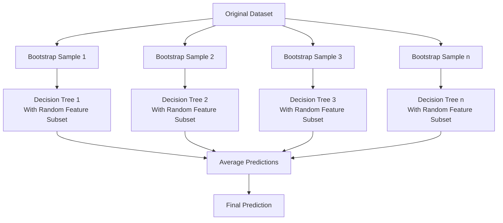

# 🌲 Random Forest Regression

<div align="center">


*Ensemble Learning Through Multiple Decision Trees*

</div>

---

## 📚 Table of Contents

- [What is Random Forest Regression?](#what-is-random-forest-regression)
- [How Random Forests Work](#how-random-forests-work)
- [Mathematical Foundation](#mathematical-foundation)
- [Implementation Guide](#implementation-guide)
- [Tuning Parameters](#tuning-parameters)
- [Feature Importance](#feature-importance)
- [Strengths and Weaknesses](#strengths-and-weaknesses)
- [Real-World Examples](#real-world-examples)
- [Advanced Topics](#advanced-topics)
- [FAQ](#faq)
- [Additional Resources](#additional-resources)
- [Key Takeaways](#key-takeaways)

---

## 🎯 What is Random Forest Regression?

**Random Forest Regression** is an ensemble learning method that combines multiple decision trees to create a more powerful and stable prediction model. By training many trees on random subsets of data and features, then averaging their predictions, random forests overcome many limitations of individual decision trees while maintaining their strengths.

### Key Characteristics:
- **Ensemble Method**: Combines many decision trees into a unified model
- **Bagging Technique**: Uses bootstrap aggregating (bagging) to create diverse trees
- **Feature Randomization**: Considers random subsets of features at each split
- **Parallel Processing**: Trees can be built independently in parallel
- **Reduced Overfitting**: Aggregation reduces variance compared to single trees
- **Non-Parametric**: Makes no assumptions about the underlying data distribution

### The Goal:
Create a model that offers higher prediction accuracy and better generalization than individual decision trees by leveraging the wisdom of many trees while controlling for their tendency to overfit.

---

## 🌲 How Random Forests Work

### Core Components:

1. **Bootstrap Sampling**: Randomly sample the training data with replacement to create diverse subsets
2. **Decision Trees**: Build a decision tree on each bootstrap sample
3. **Feature Randomization**: At each split, consider only a random subset of features
4. **Aggregation**: Average predictions from all trees for the final output

### Step-by-Step Process:

<div align="center">



</div>

### Randomization Elements:

- **Random Sampling with Replacement (Bagging)**:
  - Each tree is trained on a bootstrap sample of approximately 63% of the original data
  - The remaining 37% ("out-of-bag" data) can be used for validation

- **Random Feature Selection**:
  - At each node, only a random subset of features is considered for splitting
  - For regression, typically max_features = n_features/3 or sqrt(n_features)
  - This decorrelates trees, improving ensemble performance

### Making Predictions:

- For a new data point, pass it through all trees in the forest
- Each tree makes its own prediction
- The final prediction is the average of all individual tree predictions

## 🧮 Mathematical Foundation

### Forest Prediction

For a given input x, the prediction of a random forest with T trees is:

$$f_{RF}(x) = \frac{1}{T}\sum_{t=1}^{T}f_t(x)$$

Where $f_t(x)$ is the prediction of the $t$-th tree.

### Bootstrap Sampling

The probability that a sample is not selected in a bootstrap sample is:

$$P(not\ selected) = (1 - \frac{1}{n})^n \approx e^{-1} \approx 0.368$$

Thus, each bootstrap sample contains about 63.2% of unique samples from the original dataset.

### Random Feature Selection

For regression tasks, at each split, only a subset of features is considered:

$$m_{try} = max(1, round(p/3))$$

Where $p$ is the total number of features and $m_{try}$ is the number of features considered at each split.

### Variance Reduction

The variance of the average of T independent random variables, each with variance $\sigma^2$, is:

$$Var(\frac{1}{T}\sum_{t=1}^{T}X_t) = \frac{\sigma^2}{T}$$

This shows how combining multiple trees reduces prediction variance.

### Out-of-Bag Error Estimation

For each observation $z_i = (x_i, y_i)$, we can compute the out-of-bag (OOB) prediction by averaging only the trees for which $z_i$ was not used in training:

$$\hat{f}_{\text{oob}}(x_i) = \frac{1}{|\{t: z_i \notin B_t\}|} \sum_{t: z_i \notin B_t} f_t(x_i)$$

Where $B_t$ is the bootstrap sample for tree $t$.

## 💻 Implementation Guide

### Using scikit-learn

```python
import numpy as np
import matplotlib.pyplot as plt
from sklearn.ensemble import RandomForestRegressor
from sklearn.model_selection import train_test_split
from sklearn.metrics import mean_squared_error, r2_score

def random_forest_regression_example():
    # Generate sample data
    np.random.seed(42)
    X = np.sort(5 * np.random.rand(100, 1), axis=0)
    y = np.sin(X).ravel() + np.random.normal(0, 0.1, X.shape[0])
    
    # Split the data into training and testing sets
    X_train, X_test, y_train, y_test = train_test_split(X, y, test_size=0.25, random_state=42)
    
    # Create and train the random forest regressor
    regressor = RandomForestRegressor(
        n_estimators=100,  # Number of trees
        max_depth=5,       # Maximum depth of each tree
        min_samples_split=2,
        random_state=42
    )
    regressor.fit(X_train, y_train)
    
    # Make predictions
    y_pred = regressor.predict(X_test)
    
    # Calculate metrics
    mse = mean_squared_error(y_test, y_pred)
    r2 = r2_score(y_test, y_pred)
    
    print(f"Random Forest Regression Results:")
    print(f"Mean Squared Error: {mse:.4f}")
    print(f"R² Score: {r2:.4f}")
    
    # Plot the results
    # Create a dense grid for visualization
    X_grid = np.arange(0.0, 5.0, 0.01).reshape(-1, 1)
    y_grid = regressor.predict(X_grid)
    
    plt.figure(figsize=(10, 6))
    plt.scatter(X, y, color='darkorange', label='Data')
    plt.plot(X_grid, y_grid, color='forestgreen', linewidth=2, label='Random Forest')
    plt.xlabel('X')
    plt.ylabel('y')
    plt.title('Random Forest Regression')
    plt.legend()
    plt.grid(alpha=0.3)
    plt.show()
    
    return regressor, X, y, X_test, y_test, y_pred

# Run example
model, X, y, X_test, y_test, y_pred = random_forest_regression_example()
```

### Comparing to a Single Decision Tree

```python
from sklearn.tree import DecisionTreeRegressor
import matplotlib.pyplot as plt
import numpy as np

def compare_rf_to_dt(X, y):
    """Compare Random Forest to a single Decision Tree."""
    # Split data
    X_train, X_test, y_train, y_test = train_test_split(X, y, test_size=0.25, random_state=42)
    
    # Create models
    dt = DecisionTreeRegressor(max_depth=5, random_state=42)
    rf = RandomForestRegressor(n_estimators=100, max_depth=5, random_state=42)
    
    # Train models
    dt.fit(X_train, y_train)
    rf.fit(X_train, y_train)
    
    # Create a dense grid for visualization
    X_grid = np.arange(0.0, 5.0, 0.01).reshape(-1, 1)
    
    # Make predictions
    dt_pred = dt.predict(X_grid)
    rf_pred = rf.predict(X_grid)
    
    # Calculate metrics
    dt_mse = mean_squared_error(y_test, dt.predict(X_test))
    rf_mse = mean_squared_error(y_test, rf.predict(X_test))
    dt_r2 = r2_score(y_test, dt.predict(X_test))
    rf_r2 = r2_score(y_test, rf.predict(X_test))
    
    # Plot the results
    plt.figure(figsize=(12, 6))
    
    # Plot data points
    plt.scatter(X, y, color='darkorange', label='Data')
    
    # Plot predictions
    plt.plot(X_grid, dt_pred, color='cornflowerblue', linewidth=2, label=f'Decision Tree (R²={dt_r2:.4f})')
    plt.plot(X_grid, rf_pred, color='forestgreen', linewidth=2, label=f'Random Forest (R²={rf_r2:.4f})')
    
    plt.xlabel('X')
    plt.ylabel('y')
    plt.title('Random Forest vs Decision Tree')
    plt.legend()
    plt.grid(alpha=0.3)
    plt.show()
    
    # Print comparison
    print("Model Comparison:")
    print(f"Decision Tree - MSE: {dt_mse:.4f}, R²: {dt_r2:.4f}")
    print(f"Random Forest - MSE: {rf_mse:.4f}, R²: {rf_r2:.4f}")
    print(f"Improvement: {((dt_mse - rf_mse) / dt_mse * 100):.2f}% reduction in MSE")
    
    return dt, rf

# Run comparison
dt_model, rf_model = compare_rf_to_dt(X, y)
```

### Complete Example with Multiple Features

```python
from sklearn.datasets import make_regression
from sklearn.ensemble import RandomForestRegressor
from sklearn.model_selection import train_test_split, cross_val_score
from sklearn.metrics import mean_squared_error, r2_score
from sklearn.inspection import permutation_importance
import numpy as np
import matplotlib.pyplot as plt
import pandas as pd

# Generate synthetic dataset with multiple features
X, y = make_regression(n_samples=1000, n_features=10, n_informative=5, 
                      noise=0.1, random_state=42)

# Split data
X_train, X_test, y_train, y_test = train_test_split(X, y, test_size=0.2, random_state=42)

# Create model with default parameters
rf_default = RandomForestRegressor(random_state=42)
rf_default.fit(X_train, y_train)

# Create model with tuned parameters
rf_tuned = RandomForestRegressor(
    n_estimators=100,
    max_depth=10,
    min_samples_split=5,
    max_features='sqrt',
    random_state=42
)
rf_tuned.fit(X_train, y_train)

# Evaluate both models
models = {
    "Default Random Forest": rf_default,
    "Tuned Random Forest": rf_tuned
}

for name, model in models.items():
    # Training performance
    train_pred = model.predict(X_train)
    train_mse = mean_squared_error(y_train, train_pred)
    train_r2 = r2_score(y_train, train_pred)
    
    # Testing performance
    test_pred = model.predict(X_test)
    test_mse = mean_squared_error(y_test, test_pred)
    test_r2 = r2_score(y_test, test_pred)
    
    # Cross-validation
    cv_scores = cross_val_score(model, X_train, y_train, cv=5, scoring='neg_mean_squared_error')
    cv_rmse = np.sqrt(-cv_scores)
    
    print(f"\n{name} Performance:")
    print(f"Training - MSE: {train_mse:.4f}, R²: {train_r2:.4f}")
    print(f"Testing  - MSE: {test_mse:.4f}, R²: {test_r2:.4f}")
    print(f"5-Fold CV - RMSE: {cv_rmse.mean():.4f} ± {cv_rmse.std():.4f}")

# Feature importance analysis
feature_names = [f"X{i+1}" for i in range(X.shape[1])]

# Calculate both types of feature importance
importances = rf_tuned.feature_importances_
std = np.std([tree.feature_importances_ for tree in rf_tuned.estimators_], axis=0)

# Permutation importance (more reliable)
perm_importance = permutation_importance(rf_tuned, X_test, y_test, n_repeats=10)

# Create DataFrame for both metrics
importance_df = pd.DataFrame({
    'Feature': feature_names,
    'Built-in Importance': importances,
    'Importance Std Dev': std,
    'Permutation Importance': perm_importance.importances_mean,
    'Permutation Std Dev': perm_importance.importances_std
})

# Sort by permutation importance
importance_df = importance_df.sort_values('Permutation Importance', ascending=False)
print("\nFeature Importances:")
print(importance_df)

# Visualize feature importance
plt.figure(figsize=(12, 8))

# Plot built-in importance
plt.subplot(2, 1, 1)
plt.bar(importance_df['Feature'], importance_df['Built-in Importance'], 
        yerr=importance_df['Importance Std Dev'], capsize=5)
plt.title("Built-in Feature Importance")
plt.xticks(rotation=45)
plt.ylabel("Importance")
plt.grid(alpha=0.3)

# Plot permutation importance
plt.subplot(2, 1, 2)
plt.bar(importance_df['Feature'], importance_df['Permutation Importance'], 
        yerr=importance_df['Permutation Std Dev'], capsize=5)
plt.title("Permutation Feature Importance (More Reliable)")
plt.xticks(rotation=45)
plt.ylabel("Importance")
plt.grid(alpha=0.3)

plt.tight_layout()
plt.show()

# Visualize predictions vs actual values
plt.figure(figsize=(10, 6))
plt.scatter(y_test, test_pred, alpha=0.5)
plt.plot([y_test.min(), y_test.max()], [y_test.min(), y_test.max()], 'r--')
plt.xlabel("Actual Values")
plt.ylabel("Predicted Values")
plt.title("Random Forest: Predicted vs Actual Values")
plt.grid(alpha=0.3)
plt.show()
```

## 🔧 Tuning Parameters

### Key Parameters

#### 1. n_estimators

The number of trees in the forest.

- **Impact**: More trees generally lead to better performance but with diminishing returns
- **Trade-off**: Higher values increase computation time linearly
- **Typical range**: 100-1000
- **Rule of thumb**: Start with 100 and increase until performance plateaus

```python
def visualize_n_estimators_effect(X, y):
    """Visualize the effect of n_estimators parameter."""
    X_train, X_test, y_train, y_test = train_test_split(X, y, test_size=0.25, random_state=42)
    
    n_estimators_range = [1, 5, 10, 50, 100, 200]
    test_scores = []
    
    for n_estimators in n_estimators_range:
        model = RandomForestRegressor(n_estimators=n_estimators, random_state=42)
        model.fit(X_train, y_train)
        test_scores.append(model.score(X_test, y_test))
    
    plt.figure(figsize=(10, 6))
    plt.plot(n_estimators_range, test_scores, 'o-', linewidth=2)
    plt.xlabel('Number of Trees (n_estimators)')
    plt.ylabel('R² Score')
    plt.title('Effect of Number of Trees on Performance')
    plt.grid(alpha=0.3)
    plt.show()
```

#### 2. max_features

The number of features to consider when looking for the best split.

- **Impact**: Controls the randomness/diversity of trees
- **Options**:
  - 'auto'/'sqrt': sqrt(n_features)
  - 'log2': log2(n_features)
  - float value between 0 and 1: that fraction of features
  - integer: that number of features
- **Typical values for regression**: max_features=n_features/3
- **Rule of thumb**: Try 'sqrt', 'log2', and 1/3

#### 3. max_depth

The maximum depth of each tree.

- **Impact**: Controls model complexity and potential for overfitting
- **Trade-off**: Deeper trees can capture more complex patterns but may overfit
- **Options**: integer or None (unlimited until other criteria are met)
- **Typical range**: 5-30 or None

#### 4. min_samples_split and min_samples_leaf

Minimum samples required to split a node and minimum samples required at a leaf node.

- **Impact**: Controls overfitting and tree size
- **Typical range for min_samples_split**: 2-20
- **Typical range for min_samples_leaf**: 1-10

#### 5. bootstrap

Whether to use bootstrap samples when building trees.

- **Default**: True (use bootstrap samples)
- **False**: Use the whole dataset to build each tree

### Parameter Tuning Code Example

```python
from sklearn.model_selection import GridSearchCV

def tune_random_forest_parameters(X, y):
    """Tune parameters for Random Forest using Grid Search."""
    # Split data
    X_train, X_test, y_train, y_test = train_test_split(X, y, test_size=0.25, random_state=42)
    
    # Parameter grid
    param_grid = {
        'n_estimators': [50, 100, 200],
        'max_features': ['sqrt', 'log2', 0.33],
        'max_depth': [None, 10, 20, 30],
        'min_samples_split': [2, 5, 10],
        'min_samples_leaf': [1, 2, 4],
        'bootstrap': [True, False]
    }
    
    # Base model
    rf = RandomForestRegressor(random_state=42)
    
    # Grid search with cross-validation
    grid_search = GridSearchCV(
        estimator=rf, 
        param_grid=param_grid,
        cv=5,
        scoring='neg_mean_squared_error',
        n_jobs=-1,
        verbose=1
    )
    
    grid_search.fit(X_train, y_train)
    
    # Best parameters and score
    best_params = grid_search.best_params_
    best_score = np.sqrt(-grid_search.best_score_)
    
    print("Best Parameters:")
    for param, value in best_params.items():
        print(f"{param}: {value}")
    print(f"Best CV RMSE: {best_score:.4f}")
    
    # Test best model
    best_model = grid_search.best_estimator_
    test_score = best_model.score(X_test, y_test)
    test_mse = mean_squared_error(y_test, best_model.predict(X_test))
    test_rmse = np.sqrt(test_mse)
    
    print(f"Test R²: {test_score:.4f}")
    print(f"Test RMSE: {test_rmse:.4f}")
    
    return best_model, grid_search.cv_results_

# Example usage
best_rf_model, cv_results = tune_random_forest_parameters(X, y)
```

## 🔍 Feature Importance

Random Forests provide two primary ways to assess feature importance:

### 1. Built-in Feature Importance

Based on the total reduction in impurity (e.g., MSE) brought by each feature:

```python
def plot_feature_importance(model, feature_names=None):
    """Plot the built-in feature importance from a Random Forest model."""
    importances = model.feature_importances_
    std = np.std([tree.feature_importances_ for tree in model.estimators_], axis=0)
    
    if feature_names is None:
        feature_names = [f"Feature {i}" for i in range(len(importances))]
    
    # Sort features by importance
    indices = np.argsort(importances)[::-1]
    sorted_importances = importances[indices]
    sorted_std = std[indices]
    sorted_feature_names = [feature_names[i] for i in indices]
    
    # Plot
    plt.figure(figsize=(12, 6))
    plt.bar(range(len(importances)), sorted_importances, yerr=sorted_std, align='center')
    plt.xticks(range(len(importances)), sorted_feature_names, rotation=90)
    plt.xlabel('Features')
    plt.ylabel('Importance')
    plt.title('Feature Importance from Random Forest')
    plt.tight_layout()
    plt.show()
```

### 2. Permutation Importance

A more reliable method that measures the increase in prediction error after feature values are permuted:

```python
from sklearn.inspection import permutation_importance

def plot_permutation_importance(model, X, y, feature_names=None):
    """Calculate and plot permutation feature importance."""
    result = permutation_importance(model, X, y, n_repeats=10, random_state=42)
    importances = result.importances_mean
    std = result.importances_std
    
    if feature_names is None:
        feature_names = [f"Feature {i}" for i in range(X.shape[1])]
    
    # Sort features by importance
    indices = np.argsort(importances)[::-1]
    sorted_importances = importances[indices]
    sorted_std = std[indices]
    sorted_feature_names = [feature_names[i] for i in indices]
    
    # Plot
    plt.figure(figsize=(12, 6))
    plt.bar(range(len(importances)), sorted_importances, yerr=sorted_std, align='center')
    plt.xticks(range(len(importances)), sorted_feature_names, rotation=90)
    plt.xlabel('Features')
    plt.ylabel('Importance (Increase in MSE)')
    plt.title('Permutation Feature Importance')
    plt.tight_layout()
    plt.show()
```

### 3. Partial Dependence Plots

Visualize how predictions change as a function of feature values:

```python
from sklearn.inspection import partial_dependence, plot_partial_dependence

def create_partial_dependence_plot(model, X, feature_indices, feature_names=None):
    """Create partial dependence plots for specified features."""
    if feature_names is None:
        feature_names = [f"Feature {i}" for i in feature_indices]
    
    plt.figure(figsize=(12, 6))
    plot_partial_dependence(model, X, feature_indices, feature_names=feature_names)
    plt.tight_layout()
    plt.show()
```

## ✅ Strengths and Weaknesses

<div align="center">

| ✅ Advantages | ❌ Disadvantages |
|--------------|-----------------|
| **High Accuracy** | **Computationally Intensive** |
| Generally outperforms single decision trees | Training many trees requires more time and resources |
| **Reduced Overfitting** | **Black Box Nature** |
| Averaging predictions reduces variance | Less interpretable than a single decision tree |
| **Handles Non-Linear Data** | **Large Memory Footprint** |
| Captures complex patterns without transformations | Storing many trees requires significant memory |
| **Built-in Feature Importance** | **Less Efficient for Linear Problems** |
| Provides measures of variable importance | Simpler models may be faster for linear relationships |
| **Handles Missing Values** | **Potential for Bias with Categorical Features** |
| Works well with imputation techniques | Can favor features with more categories |
| **Parallel Processing** | **Lacks Smoothness** |
| Trees can be built in parallel | Predictions are still step-like, not continuous |

</div>

### When to Use Random Forest Regression:

#### ✅ Good Choice When:

- High prediction accuracy is more important than interpretability
- Dataset has a mix of categorical and numerical features
- Relationships in the data are likely non-linear and complex
- Feature importance information is needed
- Dataset contains outliers or noisy data
- Some data values are missing
- You need a robust out-of-the-box algorithm

#### ❌ Avoid When:

- Model interpretability is the highest priority
- Computational resources are limited and the dataset is large
- The problem has a known simple linear structure
- Real-time prediction speed is critical
- Memory constraints are tight

## 🌍 Real-World Examples

### Example 1: House Price Prediction

```python
import pandas as pd
import numpy as np
from sklearn.ensemble import RandomForestRegressor
from sklearn.model_selection import train_test_split
from sklearn.metrics import mean_squared_error, r2_score
from sklearn.preprocessing import StandardScaler
import matplotlib.pyplot as plt
from sklearn.inspection import permutation_importance

# Load housing dataset (Boston or California housing)
from sklearn.datasets import fetch_california_housing
housing = fetch_california_housing()
X = housing.data
y = housing.target
feature_names = housing.feature_names

print("Housing Price Prediction with Random Forest")
print("=" * 40)
print(f"Dataset Shape: {X.shape}")
print(f"Features: {feature_names}")

# Split data
X_train, X_test, y_train, y_test = train_test_split(X, y, test_size=0.2, random_state=42)

# Scale features
scaler = StandardScaler()
X_train_scaled = scaler.fit_transform(X_train)
X_test_scaled = scaler.transform(X_test)

# Create and train the model
rf = RandomForestRegressor(
    n_estimators=100,
    max_depth=15,
    min_samples_split=5,
    random_state=42
)
rf.fit(X_train_scaled, y_train)

# Make predictions
y_train_pred = rf.predict(X_train_scaled)
y_test_pred = rf.predict(X_test_scaled)

# Calculate metrics
train_mse = mean_squared_error(y_train, y_train_pred)
test_mse = mean_squared_error(y_test, y_test_pred)
train_rmse = np.sqrt(train_mse)
test_rmse = np.sqrt(test_mse)
train_r2 = r2_score(y_train, y_train_pred)
test_r2 = r2_score(y_test, y_test_pred)

print("\nModel Performance:")
print(f"Training - RMSE: {train_rmse:.4f}, R²: {train_r2:.4f}")
print(f"Testing  - RMSE: {test_rmse:.4f}, R²: {test_r2:.4f}")

# Feature importance
perm_importance = permutation_importance(rf, X_test_scaled, y_test, n_repeats=10, random_state=42)

# Create dataframe with feature importances
importance_df = pd.DataFrame({
    'Feature': feature_names,
    'Built-in Importance': rf.feature_importances_,
    'Permutation Importance': perm_importance.importances_mean
}).sort_values('Permutation Importance', ascending=False)

print("\nFeature Importance:")
print(importance_df)

# Visualize feature importances
plt.figure(figsize=(12, 10))

# Plot built-in importance
plt.subplot(2, 1, 1)
plt.bar(importance_df['Feature'], importance_df['Built-in Importance'])
plt.title('Built-in Feature Importance')
plt.xticks(rotation=45)
plt.grid(alpha=0.3)

# Plot permutation importance
plt.subplot(2, 1, 2)
plt.bar(importance_df['Feature'], importance_df['Permutation Importance'])
plt.title('Permutation Feature Importance')
plt.xticks(rotation=45)
plt.grid(alpha=0.3)

plt.tight_layout()
plt.show()

# Scatter plot of actual vs predicted values
plt.figure(figsize=(10, 6))
plt.scatter(y_test, y_test_pred, alpha=0.5)
plt.plot([y_test.min(), y_test.max()], [y_test.min(), y_test.max()], 'r--')
plt.xlabel('Actual House Price')
plt.ylabel('Predicted House Price')
plt.title('Random Forest: Actual vs Predicted House Prices')
plt.grid(alpha=0.3)
plt.show()

# Plot residuals
residuals = y_test - y_test_pred
plt.figure(figsize=(10, 6))
plt.scatter(y_test_pred, residuals, alpha=0.5)
plt.axhline(y=0, color='r', linestyle='--')
plt.xlabel('Predicted House Price')
plt.ylabel('Residuals')
plt.title('Residual Plot')
plt.grid(alpha=0.3)
plt.show()

# Histogram of residuals
plt.figure(figsize=(10, 6))
plt.hist(residuals, bins=30, alpha=0.7, edgecolor='black')
plt.axvline(x=0, color='r', linestyle='--')
plt.xlabel('Residual Value')
plt.ylabel('Frequency')
plt.title('Distribution of Residuals')
plt.grid(alpha=0.3)
plt.show()
```

### Example 2: Energy Consumption Forecasting

```python
import numpy as np
import pandas as pd
import matplotlib.pyplot as plt
from sklearn.ensemble import RandomForestRegressor
from sklearn.preprocessing import StandardScaler
from sklearn.model_selection import train_test_split, TimeSeriesSplit
from sklearn.metrics import mean_squared_error, r2_score
import datetime as dt

# Generate synthetic energy consumption data
np.random.seed(42)
n_days = 730  # 2 years of data

# Create date range
dates = pd.date_range(start='2021-01-01', periods=n_days, freq='D')

# Base consumption with weekly seasonality
weekday_effect = np.array([0.8, 1.0, 1.1, 1.2, 1.1, 0.9, 0.7])  # Mon-Sun
weekdays = np.array([d.weekday() for d in dates])
base_consumption = 100 * weekday_effect[weekdays]

# Add monthly seasonality
month_effect = np.array([1.2, 1.1, 1.0, 0.9, 0.8, 0.7, 0.8, 0.9, 0.95, 1.0, 1.1, 1.2])  # Jan-Dec
months = np.array([d.month - 1 for d in dates])
monthly_consumption = base_consumption * month_effect[months]

# Add temperature effect
temp_base = 15  # Base temperature
temp_amplitude = 15  # Temperature range
temps = temp_base + temp_amplitude * np.sin(np.linspace(0, 2*np.pi, 365))
temps = np.concatenate([temps, temps])  # Repeat for second year
temps += np.random.normal(0, 2, n_days)  # Add noise

# Energy increases when too cold or too hot (U-shaped relationship)
temp_effect = 1.0 + 0.01 * np.abs(temps - 20) ** 1.5
energy = monthly_consumption * temp_effect

# Add holidays (increased consumption)
holidays = ['2021-01-01', '2021-12-25', '2021-07-04', 
            '2022-01-01', '2022-12-25', '2022-07-04']
for holiday in holidays:
    if holiday in dates:
        idx = np.where(dates == holiday)[0][0]
        energy[idx] *= 1.2  # 20% increase on holidays

# Add random noise
energy += np.random.normal(0, 5, n_days)
energy = np.maximum(0, energy)  # Ensure non-negative

# Create DataFrame
energy_df = pd.DataFrame({
    'date': dates,
    'energy': energy,
    'temp': temps,
    'weekday': weekdays,
    'month': months,
    'is_holiday': [1 if d.strftime('%Y-%m-%d') in holidays else 0 for d in dates],
    'day_of_year': [d.dayofyear for d in dates]
})

# Add lagged features
for lag in [1, 2, 3, 7]:  # Previous days and previous week
    energy_df[f'energy_lag_{lag}'] = energy_df['energy'].shift(lag)

# Add rolling average
for window in [7, 14, 30]:
    energy_df[f'energy_rolling_{window}d'] = energy_df['energy'].rolling(window=window).mean()

# Drop rows with NaN from lag/rolling features
energy_df = energy_df.dropna()

print("Energy Consumption Forecasting with Random Forest")
print("=" * 50)
print(f"Dataset Shape: {energy_df.shape}")

# Define features and target
X = energy_df.drop(['date', 'energy'], axis=1)
y = energy_df['energy']

# Time series split to maintain temporal order
# Use last 60 days for testing
train_size = len(X) - 60
X_train, X_test = X.iloc[:train_size], X.iloc[train_size:]
y_train, y_test = y.iloc[:train_size], y.iloc[train_size:]
dates_train, dates_test = energy_df['date'].iloc[:train_size], energy_df['date'].iloc[train_size:]

# Scale features
scaler = StandardScaler()
X_train_scaled = scaler.fit_transform(X_train)
X_test_scaled = scaler.transform(X_test)

# Create and train the model
rf = RandomForestRegressor(
    n_estimators=100,
    max_depth=10,
    min_samples_split=5,
    random_state=42
)
rf.fit(X_train_scaled, y_train)

# Make predictions
y_train_pred = rf.predict(X_train_scaled)
y_test_pred = rf.predict(X_test_scaled)

# Calculate metrics
train_mse = mean_squared_error(y_train, y_train_pred)
test_mse = mean_squared_error(y_test, y_test_pred)
train_rmse = np.sqrt(train_mse)
test_rmse = np.sqrt(test_mse)
train_r2 = r2_score(y_train, y_train_pred)
test_r2 = r2_score(y_test, y_test_pred)

print("\nModel Performance:")
print(f"Training - RMSE: {train_rmse:.4f}, R²: {train_r2:.4f}")
print(f"Testing  - RMSE: {test_rmse:.4f}, R²: {test_r2:.4f}")

# Feature importance
feature_importance = pd.DataFrame({
    'Feature': X.columns,
    'Importance': rf.feature_importances_
}).sort_values('Importance', ascending=False)

print("\nTop 10 Feature Importances:")
print(feature_importance.head(10))

# Visualize feature importance
plt.figure(figsize=(12, 6))
plt.bar(feature_importance['Feature'][:10], feature_importance['Importance'][:10])
plt.xticks(rotation=45)
plt.title('Top 10 Feature Importances')
plt.tight_layout()
plt.show()

# Plot time series prediction
plt.figure(figsize=(15, 7))
plt.plot(dates_train[-100:], y_train[-100:], 'b-', label='Training Data')
plt.plot(dates_test, y_test, 'g-', label='Actual Energy Consumption')
plt.plot(dates_test, y_test_pred, 'r--', label='Predicted Energy Consumption')
plt.xlabel('Date')
plt.ylabel('Energy Consumption')
plt.title('Random Forest: Energy Consumption Forecast')
plt.legend()
plt.grid(alpha=0.3)
plt.show()

# Actual vs Predicted plot
plt.figure(figsize=(10, 6))
plt.scatter(y_test, y_test_pred, alpha=0.6)
plt.plot([min(y_test), max(y_test)], [min(y_test), max(y_test)], 'r--')
plt.xlabel('Actual Energy Consumption')
plt.ylabel('Predicted Energy Consumption')
plt.title('Random Forest: Actual vs Predicted Energy Consumption')
plt.grid(alpha=0.3)
plt.show()

# Residual analysis
residuals = y_test - y_test_pred
plt.figure(figsize=(12, 6))

plt.subplot(1, 2, 1)
plt.scatter(y_test_pred, residuals, alpha=0.6)
plt.axhline(y=0, color='r', linestyle='--')
plt.xlabel('Predicted Energy Consumption')
plt.ylabel('Residuals')
plt.title('Residual Plot')
plt.grid(alpha=0.3)

plt.subplot(1, 2, 2)
plt.hist(residuals, bins=20, alpha=0.7, edgecolor='black')
plt.axvline(x=0, color='r', linestyle='--')
plt.xlabel('Residual Value')
plt.ylabel('Frequency')
plt.title(f'Residual Distribution (Mean: {residuals.mean():.2f})')
plt.grid(alpha=0.3)

plt.tight_layout()
plt.show()
```

### Example 3: Predictive Maintenance

```python
import pandas as pd
import numpy as np
import matplotlib.pyplot as plt
from sklearn.ensemble import RandomForestRegressor
from sklearn.model_selection import train_test_split
from sklearn.metrics import mean_squared_error, r2_score
from sklearn.preprocessing import StandardScaler
from sklearn.inspection import permutation_importance

# Generate synthetic machine maintenance dataset
np.random.seed(42)
n_samples = 1000

# Create features
operating_hours = np.random.uniform(100, 10000, n_samples)
temperature = 70 + 30 * np.random.random(n_samples)
vibration = 0.1 + 0.3 * np.random.random(n_samples)
pressure = 100 + 50 * np.random.random(n_samples)
humidity = 30 + 50 * np.random.random(n_samples)

# Maintenance cycles
maintenance_cycles = np.floor(operating_hours / 2000)

# Create target: remaining useful life
# Complex non-linear relationship with multiple factors
base_life = 500 + 0.1 * operating_hours - 100 * maintenance_cycles
temp_effect = -5 * np.maximum(0, temperature - 85)**1.5
vibration_effect = -1000 * np.maximum(0, vibration - 0.2)**2
pressure_effect = -0.5 * np.abs(pressure - 125)
humidity_effect = -0.2 * np.maximum(0, humidity - 60)

# Combine effects with some interaction terms
useful_life = (base_life + temp_effect + vibration_effect + pressure_effect + humidity_effect + 
              -10 * vibration * temperature / 100 + np.random.normal(0, 50, n_samples))
useful_life = np.maximum(0, useful_life)  # Cannot be negative

# Create DataFrame
maintenance_df = pd.DataFrame({
    'operating_hours': operating_hours,
    'temperature': temperature,
    'vibration': vibration,
    'pressure': pressure,
    'humidity': humidity,
    'maintenance_cycles': maintenance_cycles,
    'useful_life': useful_life
})

print("Predictive Maintenance with Random Forest")
print("=" * 50)
print(f"Dataset Shape: {maintenance_df.shape}")
print("\nData Sample:")
print(maintenance_df.head())

# Define features and target
X = maintenance_df.drop('useful_life', axis=1)
y = maintenance_df['useful_life']

# Split data
X_train, X_test, y_train, y_test = train_test_split(X, y, test_size=0.2, random_state=42)

# Scale features
scaler = StandardScaler()
X_train_scaled = scaler.fit_transform(X_train)
X_test_scaled = scaler.transform(X_test)

# Create and train the model
rf = RandomForestRegressor(
    n_estimators=100,
    max_depth=15,
    min_samples_split=5,
    random_state=42
)
rf.fit(X_train_scaled, y_train)

# Make predictions
y_train_pred = rf.predict(X_train_scaled)
y_test_pred = rf.predict(X_test_scaled)

# Calculate metrics
train_mse = mean_squared_error(y_train, y_train_pred)
test_mse = mean_squared_error(y_test, y_test_pred)
train_rmse = np.sqrt(train_mse)
test_rmse = np.sqrt(test_mse)
train_r2 = r2_score(y_train, y_train_pred)
test_r2 = r2_score(y_test, y_test_pred)

print("\nModel Performance:")
print(f"Training - RMSE: {train_rmse:.4f}, R²: {train_r2:.4f}")
print(f"Testing  - RMSE: {test_rmse:.4f}, R²: {test_r2:.4f}")

# Calculate permutation importance
perm_importance = permutation_importance(rf, X_test_scaled, y_test, n_repeats=10, random_state=42)

# Create dataframe with feature importances
importance_df = pd.DataFrame({
    'Feature': X.columns,
    'Built-in Importance': rf.feature_importances_,
    'Permutation Importance': perm_importance.importances_mean
}).sort_values('Permutation Importance', ascending=False)

print("\nFeature Importance:")
print(importance_df)

# Visualize feature importances
plt.figure(figsize=(10, 6))
plt.bar(importance_df['Feature'], importance_df['Permutation Importance'])
plt.xticks(rotation=45)
plt.title('Feature Importance for Remaining Useful Life Prediction')
plt.tight_layout()
plt.show()

# Actual vs Predicted plot
plt.figure(figsize=(10, 6))
plt.scatter(y_test, y_test_pred, alpha=0.5)
plt.plot([min(y_test), max(y_test)], [min(y_test), max(y_test)], 'r--')
plt.xlabel('Actual Remaining Useful Life')
plt.ylabel('Predicted Remaining Useful Life')
plt.title('Random Forest: Actual vs Predicted Remaining Useful Life')
plt.grid(alpha=0.3)
plt.show()

# Plot partial dependence for top 2 features
from sklearn.inspection import partial_dependence, plot_partial_dependence

top_features = importance_df['Feature'].iloc[:2].tolist()
feature_indices = [list(X.columns).index(feature) for feature in top_features]

plt.figure(figsize=(12, 6))
plot_partial_dependence(
    rf, X_train, feature_indices, 
    feature_names=X.columns.tolist(),
    n_jobs=-1,
    grid_resolution=50
)
plt.suptitle('Partial Dependence of Top Features')
plt.tight_layout(rect=[0, 0, 1, 0.95])
plt.show()

# Example maintenance decision threshold
threshold = 200  # Hours before maintenance needed

# Calculate precision at identifying machines needing maintenance soon
actual_maintenance_needed = y_test < threshold
predicted_maintenance_needed = y_test_pred < threshold
true_positives = np.sum(predicted_maintenance_needed & actual_maintenance_needed)
false_positives = np.sum(predicted_maintenance_needed & ~actual_maintenance_needed)
false_negatives = np.sum(~predicted_maintenance_needed & actual_maintenance_needed)

precision = true_positives / (true_positives + false_positives) if (true_positives + false_positives) > 0 else 0
recall = true_positives / (true_positives + false_negatives) if (true_positives + false_negatives) > 0 else 0
f1 = 2 * precision * recall / (precision + recall) if (precision + recall) > 0 else 0

print(f"\nMaintenance Decision Performance (Threshold = {threshold} hours):")
print(f"Precision: {precision:.4f}")
print(f"Recall: {recall:.4f}")
print(f"F1 Score: {f1:.4f}")
```

## 🔬 Advanced Topics

### 1. Out-of-Bag (OOB) Error Estimation

Out-of-bag samples provide an unbiased estimate of the model's error without needing a separate validation set:

```python
from sklearn.ensemble import RandomForestRegressor

# Create model with OOB score enabled
rf = RandomForestRegressor(
    n_estimators=100,
    oob_score=True,
    random_state=42
)

# Train model
rf.fit(X, y)

# Get OOB score
oob_score = rf.oob_score_
print(f"Out-of-Bag R² Score: {oob_score:.4f}")
```

### 2. Feature Interaction Analysis

Identify and visualize interactions between features:

```python
from sklearn.inspection import plot_partial_dependence
import matplotlib.pyplot as plt

def plot_feature_interactions(model, X, features, feature_names=None):
    """Plot 2D partial dependence to show feature interactions."""
    if feature_names is None:
        feature_names = [f"Feature {i}" for i in range(X.shape[1])]
    
    # Prepare feature pairs for interaction plots
    feature_pairs = [(features[i], features[j]) 
                    for i in range(len(features)) 
                    for j in range(i+1, len(features))]
    
    # Plot 2D partial dependence
    plt.figure(figsize=(15, 10))
    plot_partial_dependence(
        model, X, feature_pairs, 
        feature_names=feature_names,
        n_jobs=-1,
        grid_resolution=20
    )
    plt.suptitle('Feature Interaction Effects', fontsize=16)
    plt.tight_layout(rect=[0, 0, 1, 0.95])
    plt.show()
```

### 3. Quantile Regression Forests

Predict confidence intervals instead of just point estimates:

```python
from sklearn.ensemble import RandomForestRegressor
import numpy as np

def quantile_regression_forest(X_train, y_train, X_test, quantiles=[0.05, 0.5, 0.95]):
    """
    Implement quantile regression using Random Forests.
    Returns predictions at specified quantiles.
    """
    # Train the forest
    rf = RandomForestRegressor(n_estimators=500, min_samples_leaf=5, random_state=42)
    rf.fit(X_train, y_train)
    
    # Get all predictions from all trees
    predictions = []
    for tree in rf.estimators_:
        predictions.append(tree.predict(X_test))
    
    # Stack predictions - shape will be (n_trees, n_samples)
    tree_preds = np.stack(predictions, axis=0)
    
    # Calculate quantiles for each sample
    quantile_preds = {}
    for q in quantiles:
        quantile_preds[q] = np.quantile(tree_preds, q, axis=0)
    
    return quantile_preds

# Example usage
quantile_predictions = quantile_regression_forest(X_train, y_train, X_test)

# Plot predictions with confidence intervals
plt.figure(figsize=(12, 6))
plt.fill_between(range(len(X_test)), 
                quantile_predictions[0.05], 
                quantile_predictions[0.95], 
                alpha=0.3, color='blue', 
                label='90% Prediction Interval')
plt.plot(range(len(X_test)), quantile_predictions[0.5], 'r-', 
         label='Median Prediction')
plt.plot(range(len(X_test)), y_test, 'ko', label='Actual Values')
plt.xlabel('Sample Index')
plt.ylabel('Target Value')
plt.title('Random Forest with Prediction Intervals')
plt.legend()
plt.show()
```

### 4. Dynamic Feature Selection

Recursively select the most important features:

```python
from sklearn.feature_selection import RFE
from sklearn.ensemble import RandomForestRegressor

def recursive_feature_selection(X, y, n_features_to_select=None):
    """Select features using Recursive Feature Elimination with Random Forest."""
    if n_features_to_select is None:
        n_features_to_select = X.shape[1] // 2
    
    # Create base model
    rf = RandomForestRegressor(n_estimators=100, random_state=42)
    
    # Create RFE selector
    selector = RFE(
        estimator=rf,
        n_features_to_select=n_features_to_select,
        step=1,
        verbose=1
    )
    
    # Fit the selector
    selector.fit(X, y)
    
    # Get selected features
    selected_features = np.where(selector.support_)[0]
    if hasattr(X, 'columns'):
        selected_feature_names = X.columns[selected_features].tolist()
        print(f"Selected features: {selected_feature_names}")
    
    return selector, selected_features
```

### 5. Handling Categorical Variables

Random forests can handle categorical variables with one-hot encoding or specialized implementations:

```python
from sklearn.preprocessing import OneHotEncoder
from sklearn.compose import ColumnTransformer
from sklearn.pipeline import Pipeline
from sklearn.ensemble import RandomForestRegressor

def build_categorical_rf_pipeline(X, categorical_features, numerical_features):
    """Build a pipeline that properly handles categorical features."""
    # Create preprocessing for categorical features
    categorical_transformer = OneHotEncoder(handle_unknown='ignore')
    
    # Create column transformer
    preprocessor = ColumnTransformer(
        transformers=[
            ('cat', categorical_transformer, categorical_features),
            ('num', 'passthrough', numerical_features)
        ]
    )
    
    # Create pipeline with preprocessor and random forest
    pipeline = Pipeline(steps=[
        ('preprocessor', preprocessor),
        ('regressor', RandomForestRegressor(n_estimators=100, random_state=42))
    ])
    
    return pipeline
```

## ❓ FAQ

### Q1: How many trees should I use in my Random Forest model?

**A**: The number of trees (n_estimators) affects both model performance and computational cost:

- More trees generally lead to better performance but with diminishing returns
- For most problems, 100-500 trees is a good starting point
- Performance typically plateaus after a certain number of trees
- Training time increases linearly with the number of trees
- Use OOB error to determine the optimal number:

```python
# Check error rate vs number of trees
n_estimators_range = [10, 50, 100, 200, 500, 1000]
oob_errors = []

for n_estimators in n_estimators_range:
    rf = RandomForestRegressor(n_estimators=n_estimators, oob_score=True, random_state=42)
    rf.fit(X_train, y_train)
    oob_errors.append(1 - rf.oob_score_)

plt.figure(figsize=(10, 6))
plt.plot(n_estimators_range, oob_errors, 'o-')
plt.xlabel('Number of Trees')
plt.ylabel('Out-of-Bag Error')
plt.title('Error vs Number of Trees')
plt.grid(True)
```

### Q2: How does Random Forest avoid overfitting compared to a single Decision Tree?

**A**: Random Forest uses multiple techniques to prevent overfitting:

- **Bagging (Bootstrap Aggregation)**:
  - Each tree trains on a different bootstrap sample
  - Introduces randomness in the training data
  - Reduces variance by averaging predictions

- **Feature Randomization**:
  - Only considers a subset of features at each split
  - Creates diverse trees that focus on different aspects of the data
  - Reduces correlation between trees

- **Averaging Predictions**:
  - Combines multiple high-variance models (trees)
  - Final prediction is more stable and generalizable
  - Smooths out individual tree errors

Unlike single decision trees which may fit noise in the data, random forests ensure that no single pattern or outlier dominates the model.

### Q3: When should I use Random Forest vs Gradient Boosting?

**A**: Both are powerful ensemble methods, but have different strengths:

**Use Random Forest when**:

- You need a robust "out-of-the-box" algorithm
- Parallel processing is important (trees can be built independently)
- You have noisy data with potential outliers
- You want good performance with minimal hyperparameter tuning
- Memory consumption during training is not a concern

**Use Gradient Boosting when**:

- You need the highest possible predictive accuracy
- You can invest time in hyperparameter tuning
- You have relatively clean data
- You're willing to accept longer training times
- Your dataset isn't extremely large

In practice, try both and compare performance through cross-validation.

### Q4: How do I handle missing values in Random Forest?

**A**: You have several options for handling missing values:

- **Imputation before training**:
```python
from sklearn.impute import SimpleImputer

imputer = SimpleImputer(strategy='mean')  # or median, most_frequent
X_imputed = imputer.fit_transform(X)
```

- **Using surrogate splits** (not directly in scikit-learn):
  - Available in other implementations like R's randomForest
  - Uses alternative splitting rules when values are missing

- **Using MissForest algorithm for imputation**:
```python
from missingpy import MissForest

imputer = MissForest(random_state=42)
X_imputed = imputer.fit_transform(X)
```

- **Adding missingness indicators**:
```python
# Add binary indicators for missing values
X_with_indicators = X.copy()
for col in X.columns:
    if X[col].isnull().any():
        X_with_indicators[f'{col}_missing'] = X[col].isnull().astype(int)

# Then impute the original features
X_with_indicators[X.columns] = imputer.fit_transform(X)
```

### Q5: Why is my Random Forest predicting the same values for similar inputs?

**A**: Random Forests inherit the step-like prediction pattern of decision trees:

- Predictions are averages of tree outputs
- Each tree makes constant predictions within leaf regions
- This creates a "stairstep" pattern despite averaging

**Solutions**:

- Increase the number of trees to smooth predictions
- Decrease the minimum samples per leaf to allow for finer-grained predictions
- Use deeper trees (carefully, to avoid overfitting)
- Consider Gradient Boosting which can produce smoother responses

### Q6: How do I interpret Random Forest results beyond feature importance?

**A**: Beyond feature importance, you can use:

- **Partial Dependence Plots (PDP)**:
  - Show the marginal effect of a feature on predictions
```python
from sklearn.inspection import plot_partial_dependence
plot_partial_dependence(model, X, features=[0, 1], feature_names=feature_names)
```

- **Individual Conditional Expectation (ICE) plots**:
  - Like PDPs but for individual instances
  - Shows heterogeneity in feature effects

- **SHAP (SHapley Additive exPlanations) values**:
  - Provide unified framework for interpreting predictions
```python
import shap
explainer = shap.TreeExplainer(model)
shap_values = explainer.shap_values(X)
shap.summary_plot(shap_values, X, feature_names=feature_names)
```

- **Proximity analysis**:
  - Identifies similar instances by how often they end up in the same leaf node
  - Helps detect clusters and outliers

### Q7: How does Random Forest select the best features at each split?

**A**: The feature selection process works as follows:

- At each node, only a random subset of max_features features are considered
- For each candidate feature, all possible splits are evaluated
- For regression, the feature/split that minimizes the variance of the child nodes is chosen:
  - Variance before split: Var(parent)
  - Weighted variance after split: (n_left/n)*Var(left) + (n_right/n)*Var(right)
  - Choose the split that maximizes the reduction in variance
- The tree continues growing until stopping criteria are met

This randomized feature selection process is key to decorrelating the trees and improving the ensemble's performance.

### Q8: Can Random Forest handle imbalanced regression problems?

**A**: Yes, you can adapt Random Forest for imbalanced regression:

- **Use sample weights**:
```python
# Give higher weights to rare values
weights = compute_sample_weight(class_weight='balanced', y=y)
model = RandomForestRegressor()
model.fit(X, y, sample_weight=weights)
```

- **Stratified sampling**:
```python
# Create bins for continuous target
y_binned = pd.qcut(y, q=5, labels=False)
X_train, X_test, y_train, y_test = train_test_split(
    X, y, stratify=y_binned, random_state=42
)
```

- **Adjust evaluation metrics**:
  - Use metrics less sensitive to common values (e.g., MAPE instead of MSE)
  - Consider custom evaluation that emphasizes important ranges

- **Different loss functions**:
  - Use quantile regression forests for different error penalties

### Q9: How do I optimize Random Forest hyperparameters efficiently?

**A**: Use these strategies for efficient hyperparameter tuning:

- **Start with defaults**:
  - n_estimators=100
  - max_features='auto' (sqrt(n_features) for classification, n_features/3 for regression)
  - max_depth=None (unlimited depth)

- **Use RandomizedSearchCV instead of GridSearchCV**:
```python
from sklearn.model_selection import RandomizedSearchCV

param_dist = {
    'n_estimators': [100, 200, 300, 500],
    'max_features': ['sqrt', 'log2', 0.33],
    'max_depth': [None, 10, 20, 30],
    'min_samples_split': [2, 5, 10],
    'min_samples_leaf': [1, 2, 4]
}

random_search = RandomizedSearchCV(
    RandomForestRegressor(random_state=42),
    param_distributions=param_dist,
    n_iter=20,  # number of parameter settings sampled
    cv=5,
    random_state=42
)
random_search.fit(X_train, y_train)
```

- **Use Bayesian optimization for more efficient search**:
```python
# Using scikit-optimize
from skopt import BayesSearchCV

bayes_search = BayesSearchCV(
    RandomForestRegressor(random_state=42),
    param_dist,
    n_iter=20,
    cv=5,
    random_state=42
)
bayes_search.fit(X_train, y_train)
```

- **Focus on the most important parameters**:
  - n_estimators: More is generally better (to a point)
  - max_depth: Controls overfitting/underfitting
  - max_features: Controls tree diversity

### Q10: How can I make my Random Forest models run faster?

**A**: To improve Random Forest efficiency:

- **Limit tree depth**:
```python
rf = RandomForestRegressor(max_depth=10)
```

- **Use fewer trees if accuracy impact is acceptable**:
```python
rf = RandomForestRegressor(n_estimators=50)
```

- **Increase min_samples_split and min_samples_leaf**:
```python
rf = RandomForestRegressor(min_samples_split=10, min_samples_leaf=4)
```

- **Utilize parallel processing**:
```python
rf = RandomForestRegressor(n_jobs=-1)  # Use all available cores
```

- **Feature selection to reduce dimensionality**:
```python
from sklearn.feature_selection import SelectFromModel

selector = SelectFromModel(RandomForestRegressor(n_estimators=50))
X_reduced = selector.fit_transform(X, y)
```

- **Consider subsampling for large datasets**:
  - Train on a representative subset
  - Use stratified sampling if appropriate

- **Use a more efficient implementation like XGBoost or LightGBM's random forest mode**:
```python
import lightgbm as lgb

rf_params = {
    'boosting_type': 'rf',  # Use random forest mode
    'bagging_fraction': 0.8,
}
```

## 📚 Additional Resources

- [scikit-learn Random Forest Documentation](https://scikit-learn.org/stable/modules/ensemble.html#forest)
- [Elements of Statistical Learning](https://web.stanford.edu/~hastie/ElemStatLearn/)
- [Random Forests - Original Paper by Leo Breiman](https://link.springer.com/article/10.1023/A:1010933404324)
- [Understanding Random Forests - A Comprehensive Guide](https://www.analyticsvidhya.com/blog/2021/06/understanding-random-forest/)
- [Interpreting Random Forests with SHAP](https://towardsdatascience.com/interpreting-random-forest-models-with-shap-5a6d2a7bf5c3)