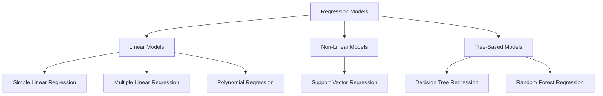

# 🔮 Regression Analysis in Machine Learning

<div align="center">


*A comprehensive guide to understanding and implementing regression algorithms*

</div>

---

## 📚 Table of Contents

- [What is Regression?](#what-is-regression)
- [Types of Regression Problems](#types-of-regression-problems)
- [Regression Models Overview](#regression-models-overview)
- [Model Implementations](#model-implementations)
- [Performance Metrics](#performance-metrics)
- [Getting Started](#getting-started)
- [Contributing](#contributing)

---

## 🎯 What is Regression?

**Regression** is a fundamental supervised learning technique in machine learning used to predict continuous numerical values. Unlike classification, which predicts discrete categories, regression aims to establish a relationship between input features (independent variables) and a continuous target variable (dependent variable).

### Key Characteristics:
- **Continuous Output**: Predicts numerical values (e.g., price, temperature, age)
- **Relationship Modeling**: Finds patterns between input features and target variables
- **Predictive Analysis**: Used for forecasting and trend analysis

### Real-World Applications:
- 🏠 **Real Estate**: Predicting house prices based on size, location, amenities
- 📈 **Finance**: Stock price prediction, risk assessment
- 🌡️ **Weather**: Temperature and precipitation forecasting
- 🚗 **Automotive**: Fuel efficiency prediction
- 📊 **Sales**: Revenue forecasting based on marketing spend

---

## 🔄 Types of Regression Problems

| Type | Description | Example |
|------|-------------|---------|
| **Simple Regression** | One independent variable | Price vs. Size |
| **Multiple Regression** | Multiple independent variables | Price vs. Size, Location, Age |
| **Polynomial Regression** | Non-linear relationships | Growth curves |
| **Time Series Regression** | Time-dependent data | Stock prices over time |

---

## 🧠 Regression Models Overview

This repository contains implementations of six powerful regression algorithms:

<div align="center">



</div>

---

## 🚀 Model Implementations

### 📈 Simple Linear Regression
```
📁 Simple-Linear-Regression/
```

**Overview**: The foundation of regression analysis, modeling the relationship between a single independent variable and a dependent variable using a straight line.

**Formula**: `y = mx + b`

**When to Use**:
- Single predictor variable
- Linear relationship between variables
- Baseline model for comparison

**Pros**: Simple, interpretable, fast
**Cons**: Limited to linear relationships, single variable

---

### 📊 Multiple Linear Regression
```
📁 Multiple-Linear-Regression/
```

**Overview**: Extension of simple linear regression that uses multiple independent variables to predict the target variable.

**Formula**: `y = β₀ + β₁x₁ + β₂x₂ + ... + βₙxₙ`

**When to Use**:
- Multiple predictor variables
- Linear relationships
- Feature importance analysis

**Pros**: Handles multiple features, good interpretability
**Cons**: Assumes linear relationships, sensitive to multicollinearity

---

### 🌊 Polynomial Regression
```
📁 Polynomial-Regression/
```

**Overview**: Captures non-linear relationships by using polynomial terms of the input features.

**Formula**: `y = β₀ + β₁x + β₂x² + β₃x³ + ... + βₙxⁿ`

**When to Use**:
- Non-linear relationships
- Curved data patterns
- When linear models underfit

**Pros**: Captures non-linearity, flexible
**Cons**: Prone to overfitting, requires careful degree selection

---

### 🎯 Support Vector Regression (SVR)
```
📁 SVR/
```

**Overview**: Uses support vector machine principles for regression, finding the optimal hyperplane that best fits the data within a margin of tolerance.

**Key Concepts**:
- **Epsilon-insensitive loss**: Ignores errors within ε-tube
- **Kernel trick**: Handles non-linear relationships
- **Support vectors**: Data points that define the decision boundary

**When to Use**:
- High-dimensional data
- Non-linear relationships
- Robust to outliers

**Pros**: Handles non-linearity, memory efficient, robust
**Cons**: Sensitive to hyperparameters, less interpretable

---

### 🌳 Decision Tree Regression
```
📁 Decision-Tree-Regression/
```

**Overview**: Creates a tree-like model of decisions by recursively splitting the data based on feature values to minimize prediction error.

**How it Works**:
1. Start with entire dataset
2. Find best feature and split point
3. Recursively split subsets
4. Stop when criteria met

**When to Use**:
- Non-linear relationships
- Feature interactions important
- Interpretability needed

**Pros**: Highly interpretable, handles non-linearity, no assumptions about data distribution
**Cons**: Prone to overfitting, unstable

---

### 🌲 Random Forest Regression
```
📁 Random-Forest-Regression/
```

**Overview**: Ensemble method that combines multiple decision trees, using voting to make final predictions. Reduces overfitting through randomness and averaging.

**Key Features**:
- **Bootstrap Aggregating**: Random sampling with replacement
- **Random Feature Selection**: Subset of features at each split
- **Ensemble Averaging**: Combines predictions from all trees

**When to Use**:
- Large datasets
- Complex relationships
- When accuracy is priority
- Need feature importance

**Pros**: Reduces overfitting, handles missing values, provides feature importance
**Cons**: Less interpretable, can overfit with very noisy data

---

## 📊 Performance Metrics

### Common Regression Metrics:

| Metric | Formula | Description | Best Value |
|--------|---------|-------------|------------|
| **MAE** | `Σ|yᵢ - ŷᵢ|/n` | Mean Absolute Error | 0 |
| **MSE** | `Σ(yᵢ - ŷᵢ)²/n` | Mean Squared Error | 0 |
| **RMSE** | `√(MSE)` | Root Mean Squared Error | 0 |
| **R²** | `1 - SS_res/SS_tot` | Coefficient of Determination | 1 |

### Choosing the Right Metric:
- **MAE**: Less sensitive to outliers
- **MSE/RMSE**: Penalizes large errors more heavily
- **R²**: Explains variance in the data (0-1 scale)

---

## 🛠️ Getting Started

### Prerequisites
```bash
pip install numpy pandas scikit-learn matplotlib seaborn
```

### Basic Usage Example
```python
import pandas as pd
from sklearn.model_selection import train_test_split
from sklearn.linear_model import LinearRegression
from sklearn.metrics import mean_squared_error, r2_score

# Load your data
data = pd.read_csv('your_dataset.csv')
X = data[['feature1', 'feature2']]
y = data['target']

# Split the data
X_train, X_test, y_train, y_test = train_test_split(X, y, test_size=0.2, random_state=42)

# Train the model
model = LinearRegression()
model.fit(X_train, y_train)

# Make predictions
y_pred = model.predict(X_test)

# Evaluate
mse = mean_squared_error(y_test, y_pred)
r2 = r2_score(y_test, y_pred)

print(f"MSE: {mse:.2f}")
print(f"R²: {r2:.2f}")
```

### Model Selection Guide

```python
# Decision flowchart for model selection
def choose_regression_model(data_size, linearity, interpretability_need):
    if interpretability_need == "high":
        if linearity == "linear":
            return "Linear Regression"
        else:
            return "Decision Tree"
    elif data_size == "small":
        return "Polynomial Regression"
    elif linearity == "non-linear":
        return "SVR or Random Forest"
    else:
        return "Random Forest"
```

---

## 📈 Model Comparison

| Model | Interpretability | Training Speed | Prediction Speed | Handles Non-linearity | Overfitting Risk |
|-------|------------------|----------------|------------------|----------------------|------------------|
| Simple Linear | ⭐⭐⭐⭐⭐ | ⭐⭐⭐⭐⭐ | ⭐⭐⭐⭐⭐ | ❌ | Low |
| Multiple Linear | ⭐⭐⭐⭐ | ⭐⭐⭐⭐ | ⭐⭐⭐⭐⭐ | ❌ | Low |
| Polynomial | ⭐⭐⭐ | ⭐⭐⭐ | ⭐⭐⭐⭐ | ✅ | High |
| SVR | ⭐⭐ | ⭐⭐ | ⭐⭐⭐ | ✅ | Medium |
| Decision Tree | ⭐⭐⭐⭐⭐ | ⭐⭐⭐ | ⭐⭐⭐⭐ | ✅ | High |
| Random Forest | ⭐⭐ | ⭐⭐ | ⭐⭐⭐ | ✅ | Low |

---

## 🎓 Best Practices

### 1. Data Preprocessing
- **Handle missing values** appropriately
- **Scale features** for SVR and polynomial regression
- **Check for outliers** and handle them
- **Feature engineering** can improve model performance

### 2. Model Selection
- Start with **simple models** (Linear Regression)
- Use **cross-validation** for model comparison
- Consider **ensemble methods** for better performance
- **Domain knowledge** should guide feature selection

### 3. Avoiding Common Pitfalls
- **Overfitting**: Use regularization, cross-validation
- **Underfitting**: Try more complex models or feature engineering
- **Data leakage**: Ensure proper train/test splits
- **Multicollinearity**: Check correlation between features

---

## 📁 Repository Structure

```
Regression-Models/
│
├── Simple-Linear-Regression/
│   ├── simple_linear_regression.py
│   ├── example_notebook.ipynb
│   └── README.md
│
├── Multiple-Linear-Regression/
│   ├── multiple_linear_regression.py
│   ├── example_notebook.ipynb
│   └── README.md
│
├── Polynomial-Regression/
│   ├── polynomial_regression.py
│   ├── example_notebook.ipynb
│   └── README.md
│
├── SVR/
│   ├── support_vector_regression.py
│   ├── example_notebook.ipynb
│   └── README.md
│
├── Decision-Tree-Regression/
│   ├── decision_tree_regression.py
│   ├── example_notebook.ipynb
│   └── README.md
│
└── Random-Forest-Regression/
    ├── random_forest_regression.py
    ├── example_notebook.ipynb
    └── README.md
```

---

## 🤝 Contributing

We welcome contributions! Please see our [Contributing Guidelines](CONTRIBUTING.md) for details.

### How to Contribute:
1. Fork the repository
2. Create a feature branch
3. Make your changes
4. Add tests and documentation
5. Submit a pull request

---

## 📝 License

This project is licensed under the MIT License - see the [LICENSE](LICENSE) file for details.

---

## 🙏 Acknowledgments

- **Scikit-learn** for providing excellent ML implementations
- **Python community** for amazing data science libraries
- **Contributors** who help improve this repository

---

<div align="center">

### 🌟 Star this repository if you found it helpful!

**Happy Learning! 🚀**

</div>

---

*Last updated: July 2025*