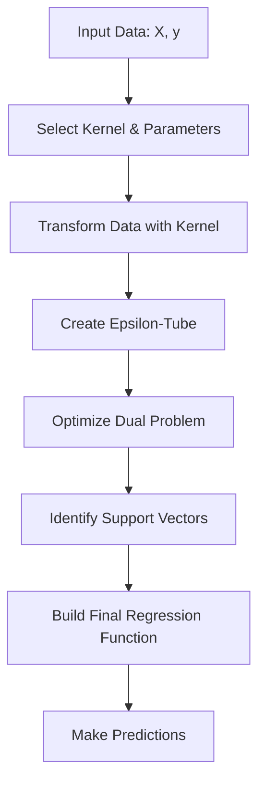

# 🎯 Support Vector Regression (SVR)

<div align="center">


*Robust Regression Using Support Vectors and Kernel Methods*

</div>

---

## 📚 Table of Contents

- [What is Support Vector Regression?](#what-is-support-vector-regression)
- [Mathematical Foundation](#mathematical-foundation)
- [How It Works](#how-it-works)
- [Kernel Functions](#kernel-functions)
- [Implementation Guide](#implementation-guide)
- [Parameter Tuning](#parameter-tuning)
- [Strengths and Weaknesses](#strengths-and-weaknesses)
- [Real-World Examples](#real-world-examples)
- [Advanced Topics](#advanced-topics)
- [FAQ](#faq)

---

## 🎯 What is Support Vector Regression?

**Support Vector Regression (SVR)** is a machine learning technique that applies the principles of Support Vector Machines (SVM) to regression problems. Unlike standard regression which minimizes the error of each training example, SVR attempts to fit as many instances as possible within a tube while minimizing the prediction error.

### Key Characteristics:
- **Margin-Based Approach**: Focuses on the margin rather than the entire dataset
- **Epsilon-Tube**: Creates a tube where errors are tolerated
- **Support Vectors**: Only a subset of training points affect the model
- **Kernel Trick**: Can capture non-linear relationships using kernel functions
- **Outlier Resistance**: Less sensitive to outliers than other regression methods

### The Goal:
Find a function that deviates from the observed values by no more than ε (epsilon) while remaining as flat as possible.

---

## 🧮 Mathematical Foundation

### The SVR Optimization Problem

The primal form of the SVR optimization problem is:

```
minimize     (1/2)||w||² + C∑(ξᵢ + ξᵢ*)
subject to   yᵢ - ⟨w, xᵢ⟩ - b ≤ ε + ξᵢ
             ⟨w, xᵢ⟩ + b - yᵢ ≤ ε + ξᵢ*
             ξᵢ, ξᵢ* ≥ 0
```

Where:
- **w**: Weight vector
- **b**: Bias term
- **C**: Regularization parameter (penalty for errors)
- **ε**: Epsilon-tube width (errors within tube are ignored)
- **ξᵢ, ξᵢ***: Slack variables for points outside the tube

### Dual Formulation

The dual optimization problem becomes:

```
maximize     -0.5∑∑(αᵢ - αᵢ*)(αⱼ - αⱼ*)⟨xᵢ, xⱼ⟩ - ε∑(αᵢ + αᵢ*) + ∑yᵢ(αᵢ - αᵢ*)
subject to   ∑(αᵢ - αᵢ*) = 0
             0 ≤ αᵢ, αᵢ* ≤ C
```

Where:
- **αᵢ, αᵢ***: Lagrange multipliers
- **⟨xᵢ, xⱼ⟩**: Inner product between inputs (or kernel function)

### Prediction Function

The final regression function is:

```
f(x) = ∑(αᵢ - αᵢ*)⟨x, xᵢ⟩ + b
```

With kernel functions, this becomes:
```
f(x) = ∑(αᵢ - αᵢ*)K(x, xᵢ) + b
```

Where **K(x, xᵢ)** is the kernel function.

---

## ⚙️ How It Works

### Step-by-Step Process:

<div align="center">



</div>

### Key Concepts Explained:

#### 1. **Epsilon (ε) Tube**
- SVR creates a tube of width ε around the true function
- Points inside this tube contribute zero error
- Only points outside this tube become support vectors

#### 2. **Support Vectors**
- Training points that lie on or outside the ε-tube
- These are the only points that influence the regression line
- Typically a small subset of the training data

#### 3. **C Parameter**
- Controls the tradeoff between smoothness of the function and errors
- Larger C values penalize errors more strongly (less regularization)
- Smaller C values allow more errors for a smoother function

#### 4. **Kernel Trick**
- Implicitly maps data into higher dimensional space
- Enables modeling of non-linear relationships
- Avoids explicit computation of coordinates in high-dimensional space

---

## 🔄 Kernel Functions

### Common Kernel Functions

| Kernel | Formula | Characteristics |
|--------|---------|-----------------|
| **Linear** | K(x, y) = x^T y | Simple, fast, works well for linearly separable data |
| **Polynomial** | K(x, y) = (γx^T y + r)^d | Models polynomial relationships, degree d controls complexity |
| **RBF (Gaussian)** | K(x, y) = exp(-γ‖x - y‖²) | Most versatile, handles non-linear data well |
| **Sigmoid** | K(x, y) = tanh(γx^T y + r) | Similar to neural network activation |

### Kernel Selection Guidelines

**Linear Kernel**:
- Use when data is linearly separable
- High-dimensional data with many features
- When computational efficiency is critical

**Polynomial Kernel**:
- When moderate non-linearity is needed
- Image processing applications
- Parameter d controls the flexibility

**RBF Kernel**:
- Most commonly used general-purpose kernel
- Works well for most datasets
- Good default choice when unsure
- Parameter γ controls the influence reach

**Sigmoid Kernel**:
- Similar to neural networks
- Specialized applications
- Often outperformed by RBF

---

## 💻 Implementation Guide

### Using Scikit-learn

```python
import numpy as np
import matplotlib.pyplot as plt
from sklearn.svm import SVR
from sklearn.preprocessing import StandardScaler
from sklearn.model_selection import train_test_split, GridSearchCV
from sklearn.metrics import mean_squared_error, r2_score

def svr_example():
    # Generate sample data
    np.random.seed(42)
    X = np.sort(5 * np.random.rand(100, 1), axis=0)
    y = np.sin(X).ravel() + np.random.normal(0, 0.1, X.shape[0])
    
    # Split the data
    X_train, X_test, y_train, y_test = train_test_split(X, y, test_size=0.2, random_state=42)
    
    # Scale the data
    scaler_X = StandardScaler()
    scaler_y = StandardScaler()
    
    X_train_scaled = scaler_X.fit_transform(X_train)
    y_train_scaled = scaler_y.fit_transform(y_train.reshape(-1, 1)).ravel()
    X_test_scaled = scaler_X.transform(X_test)
    
    # Create SVR models with different kernels
    svr_models = {
        'Linear': SVR(kernel='linear', C=100, epsilon=0.1),
        'Polynomial': SVR(kernel='poly', C=100, degree=3, epsilon=0.1),
        'RBF': SVR(kernel='rbf', C=100, gamma=0.1, epsilon=0.1)
    }
    
    # Fit and evaluate models
    plt.figure(figsize=(15, 10))
    
    for i, (name, model) in enumerate(svr_models.items(), 1):
        # Train model
        model.fit(X_train_scaled, y_train_scaled)
        
        # Make predictions
        y_pred_scaled = model.predict(X_test_scaled)
        y_pred = scaler_y.inverse_transform(y_pred_scaled.reshape(-1, 1)).ravel()
        
        # Calculate metrics
        mse = mean_squared_error(y_test, y_pred)
        r2 = r2_score(y_test, y_pred)
        
        # Plot results
        plt.subplot(2, 2, i)
        
        # Create a smooth line for visualization
        X_plot = np.linspace(0, 5, 100).reshape(-1, 1)
        X_plot_scaled = scaler_X.transform(X_plot)
        y_plot_scaled = model.predict(X_plot_scaled)
        y_plot = scaler_y.inverse_transform(y_plot_scaled.reshape(-1, 1)).ravel()
        
        plt.scatter(X, y, color='darkorange', label='data')
        plt.plot(X_plot, y_plot, color='navy', label=f'{name} model')
        plt.xlabel('X')
        plt.ylabel('y')
        plt.title(f'{name} SVR\nMSE: {mse:.4f}, R²: {r2:.4f}')
        plt.legend()
        
        print(f"{name} SVR - MSE: {mse:.4f}, R²: {r2:.4f}")
        
    # Add a plot for support vectors
    plt.subplot(2, 2, 4)
    model = SVR(kernel='rbf', C=100, gamma=0.1, epsilon=0.1)
    model.fit(X_train_scaled, y_train_scaled)
    
    # Plot data points
    plt.scatter(X, y, color='darkorange', label='Data points')
    
    # Plot support vectors
    support_vectors_idx = model.support_
    X_sv = X_train[support_vectors_idx]
    y_sv = y_train[support_vectors_idx]
    plt.scatter(X_sv, y_sv, color='green', s=100, marker='*', label='Support vectors')
    
    # Plot prediction line
    X_plot = np.linspace(0, 5, 100).reshape(-1, 1)
    X_plot_scaled = scaler_X.transform(X_plot)
    y_plot_scaled = model.predict(X_plot_scaled)
    y_plot = scaler_y.inverse_transform(y_plot_scaled.reshape(-1, 1)).ravel()
    plt.plot(X_plot, y_plot, color='navy', label='RBF model')
    
    # Plot epsilon tube
    epsilon = 0.1
    plt.fill_between(X_plot.ravel(),
                     y_plot - epsilon * scaler_y.scale_,
                     y_plot + epsilon * scaler_y.scale_,
                     alpha=0.2, color='navy', label='ε-tube')
    
    plt.xlabel('X')
    plt.ylabel('y')
    plt.title(f'SVR with Support Vectors\nSupport vectors: {len(support_vectors_idx)} of {len(X_train)}')
    plt.legend()
    
    plt.tight_layout()
    plt.show()

# Run the example
svr_example()
```

### Complete Example with Parameter Tuning

```python
import numpy as np
import matplotlib.pyplot as plt
from sklearn.svm import SVR
from sklearn.preprocessing import StandardScaler
from sklearn.model_selection import train_test_split, GridSearchCV
from sklearn.metrics import mean_squared_error, r2_score
from sklearn.pipeline import Pipeline
import pandas as pd
import seaborn as sns

def comprehensive_svr_analysis(X, y, test_size=0.2, random_state=42):
    """
    Comprehensive SVR analysis with parameter tuning and visualization.
    
    Parameters:
    X (array-like): Features
    y (array-like): Target variable
    test_size (float): Proportion of data to use for testing
    random_state (int): Random seed for reproducibility
    
    Returns:
    tuple: (best_model, results)
    """
    # Ensure numpy arrays
    X = np.array(X)
    y = np.array(y)
    
    # Reshape X if it's 1D
    if X.ndim == 1:
        X = X.reshape(-1, 1)
    
    # Split the data
    X_train, X_test, y_train, y_test = train_test_split(X, y, test_size=test_size, random_state=random_state)
    
    # Create pipeline with scaling
    svr_pipeline = Pipeline([
        ('scaler', StandardScaler()),
        ('svr', SVR())
    ])
    
    # Parameter grid for grid search
    param_grid = {
        'svr__kernel': ['linear', 'poly', 'rbf'],
        'svr__C': [0.1, 1, 10, 100],
        'svr__epsilon': [0.01, 0.1, 0.2],
        'svr__gamma': ['scale', 'auto', 0.1, 1]
    }
    
    # Grid search with cross-validation
    grid_search = GridSearchCV(
        svr_pipeline, param_grid, cv=5, scoring='neg_mean_squared_error',
        verbose=1, n_jobs=-1
    )
    
    # Fit the model
    grid_search.fit(X_train, y_train)
    
    # Best model
    best_model = grid_search.best_estimator_
    
    # Best parameters
    print("Best Parameters:")
    print(grid_search.best_params_)
    
    # Evaluate on test set
    y_pred = best_model.predict(X_test)
    mse = mean_squared_error(y_test, y_pred)
    r2 = r2_score(y_test, y_pred)
    
    print(f"Test MSE: {mse:.4f}")
    print(f"Test R²: {r2:.4f}")
    
    # Get cross-validation results
    cv_results = pd.DataFrame(grid_search.cv_results_)
    
    # Create visualization
    plt.figure(figsize=(15, 10))
    
    # Plot 1: Data and prediction
    plt.subplot(2, 2, 1)
    
    if X.shape[1] == 1:
        # 1D data visualization
        # Sort for smooth line
        X_sorted = np.sort(X, axis=0)
        y_pred_sorted = best_model.predict(X_sorted)
        
        plt.scatter(X, y, alpha=0.6, label='Data')
        plt.plot(X_sorted, y_pred_sorted, 'r-', linewidth=2, label='SVR Prediction')
        plt.xlabel('X')
        plt.ylabel('y')
        plt.title('SVR Fit')
        plt.legend()
        
    else:
        # For 2D+ data, show predicted vs actual
        plt.scatter(y_test, y_pred, alpha=0.6)
        plt.plot([min(y_test), max(y_test)], [min(y_test), max(y_test)], 'r--', linewidth=2)
        plt.xlabel('Actual values')
        plt.ylabel('Predicted values')
        plt.title('Actual vs. Predicted')
    
    # Plot 2: Parameter heatmap for C and epsilon (for best kernel)
    plt.subplot(2, 2, 2)
    best_kernel = grid_search.best_params_['svr__kernel']
    best_gamma = grid_search.best_params_['svr__gamma']
    
    # Filter results for the best kernel and gamma
    if isinstance(best_gamma, str):
        gamma_filter = cv_results['param_svr__gamma'].astype(str) == str(best_gamma)
    else:
        gamma_filter = cv_results['param_svr__gamma'].astype(float) == float(best_gamma)
    
    kernel_filter = cv_results['param_svr__kernel'] == best_kernel
    filtered_results = cv_results[kernel_filter & gamma_filter]
    
    # Create pivot table for heatmap
    try:
        pivot_table = filtered_results.pivot_table(
            index='param_svr__C',
            columns='param_svr__epsilon',
            values='mean_test_score'
        )
        
        # Plot heatmap
        sns.heatmap(pivot_table, annot=True, cmap='viridis', fmt='.3f')
        plt.title(f'Parameter Tuning Heatmap\nKernel: {best_kernel}, Gamma: {best_gamma}')
        plt.ylabel('C (Regularization)')
        plt.xlabel('Epsilon (Tube Width)')
    except:
        plt.text(0.5, 0.5, 'Insufficient data for heatmap', ha='center', va='center')
    
    # Plot 3: Residuals
    plt.subplot(2, 2, 3)
    residuals = y_test - y_pred
    plt.scatter(y_pred, residuals, alpha=0.6)
    plt.axhline(y=0, color='r', linestyle='--')
    plt.xlabel('Predicted values')
    plt.ylabel('Residuals')
    plt.title('Residual Plot')
    
    # Plot 4: Support vectors visualization (if 1D or 2D)
    plt.subplot(2, 2, 4)
    
    if X.shape[1] <= 2:
        # Get support vectors
        support_vectors = best_model.named_steps['svr'].support_vectors_
        
        # Transform support vectors back to original space
        scaler = best_model.named_steps['scaler']
        support_vectors_original = scaler.inverse_transform(support_vectors)
        
        if X.shape[1] == 1:
            # 1D visualization
            plt.scatter(X, y, alpha=0.6, label='Data points')
            plt.scatter(support_vectors_original, 
                        best_model.predict(support_vectors_original.reshape(-1, 1)),
                        color='red', s=100, marker='*', label='Support vectors')
            plt.xlabel('X')
            plt.ylabel('y')
        else:
            # 2D visualization
            plt.scatter(X[:, 0], X[:, 1], c=y, cmap='viridis', alpha=0.6, label='Data points')
            plt.scatter(support_vectors_original[:, 0], support_vectors_original[:, 1], 
                        color='red', s=100, marker='*', label='Support vectors')
            plt.xlabel('Feature 1')
            plt.ylabel('Feature 2')
        
        plt.title(f'Support Vectors\n{len(support_vectors)} of {len(X_train)} points')
        plt.legend()
    else:
        # For higher dimensions, show feature importance if available
        plt.text(0.5, 0.5, 'Support vector visualization\nnot available for high dimensions',
                 ha='center', va='center')
    
    plt.tight_layout()
    plt.show()
    
    # Return the best model and results
    return best_model, {
        'best_params': grid_search.best_params_,
        'mse': mse,
        'r2': r2,
        'cv_results': cv_results
    }

# Example usage
np.random.seed(42)
X = np.sort(5 * np.random.rand(100, 1), axis=0)
y = np.sin(X).ravel() + np.random.normal(0, 0.1, X.shape[0])

best_model, results = comprehensive_svr_analysis(X, y)
```

---

## 🔍 Parameter Tuning

### Critical Parameters

#### 1. **Regularization Parameter (C)**

```python
def visualize_C_effect(X, y, epsilon=0.1, gamma='scale'):
    """Visualize the effect of C parameter in SVR."""
    C_values = [0.1, 1, 10, 100, 1000]
    
    plt.figure(figsize=(15, 10))
    
    for i, C in enumerate(C_values, 1):
        # Create SVR model
        model = Pipeline([
            ('scaler', StandardScaler()),
            ('svr', SVR(kernel='rbf', C=C, epsilon=epsilon, gamma=gamma))
        ])
        
        # Train model
        model.fit(X, y)
        
        # Create prediction grid
        X_grid = np.linspace(min(X), max(X), 100).reshape(-1, 1)
        y_pred = model.predict(X_grid)
        
        # Calculate support vector percentage
        n_sv = model.named_steps['svr'].n_support_
        sv_percentage = 100 * sum(n_sv) / len(X)
        
        # Plot
        plt.subplot(2, 3, i)
        plt.scatter(X, y, alpha=0.6, label='Data')
        plt.plot(X_grid, y_pred, 'r-', linewidth=2, label='SVR')
        plt.title(f'C = {C}\nSupport Vectors: {sv_percentage:.1f}%')
        plt.xlabel('X')
        plt.ylabel('y')
        plt.legend()
    
    plt.tight_layout()
    plt.show()
```

#### 2. **Epsilon (ε)**

```python
def visualize_epsilon_effect(X, y, C=1.0, gamma='scale'):
    """Visualize the effect of epsilon parameter in SVR."""
    epsilon_values = [0.01, 0.05, 0.1, 0.2, 0.5]
    
    plt.figure(figsize=(15, 10))
    
    for i, epsilon in enumerate(epsilon_values, 1):
        # Create SVR model
        model = Pipeline([
            ('scaler', StandardScaler()),
            ('svr', SVR(kernel='rbf', C=C, epsilon=epsilon, gamma=gamma))
        ])
        
        # Train model
        model.fit(X, y)
        
        # Create prediction grid
        X_grid = np.linspace(min(X), max(X), 100).reshape(-1, 1)
        y_pred = model.predict(X_grid)
        
        # Calculate support vector percentage
        n_sv = model.named_steps['svr'].n_support_
        sv_percentage = 100 * sum(n_sv) / len(X)
        
        # Plot
        plt.subplot(2, 3, i)
        plt.scatter(X, y, alpha=0.6, label='Data')
        plt.plot(X_grid, y_pred, 'r-', linewidth=2, label='SVR')
        
        # Plot epsilon tube
        plt.fill_between(
            X_grid.ravel(),
            y_pred - epsilon,
            y_pred + epsilon,
            alpha=0.2,
            label=f'ε = {epsilon}'
        )
        
        plt.title(f'Epsilon = {epsilon}\nSupport Vectors: {sv_percentage:.1f}%')
        plt.xlabel('X')
        plt.ylabel('y')
        plt.legend()
    
    plt.tight_layout()
    plt.show()
```

#### 3. **Gamma (for RBF, Polynomial, and Sigmoid kernels)**

```python
def visualize_gamma_effect(X, y, C=1.0, epsilon=0.1):
    """Visualize the effect of gamma parameter in SVR with RBF kernel."""
    gamma_values = [0.001, 0.01, 0.1, 1, 10]
    
    plt.figure(figsize=(15, 10))
    
    for i, gamma in enumerate(gamma_values, 1):
        # Create SVR model
        model = Pipeline([
            ('scaler', StandardScaler()),
            ('svr', SVR(kernel='rbf', C=C, epsilon=epsilon, gamma=gamma))
        ])
        
        # Train model
        model.fit(X, y)
        
        # Create prediction grid
        X_grid = np.linspace(min(X), max(X), 100).reshape(-1, 1)
        y_pred = model.predict(X_grid)
        
        # Calculate support vector percentage
        n_sv = model.named_steps['svr'].n_support_
        sv_percentage = 100 * sum(n_sv) / len(X)
        
        # Plot
        plt.subplot(2, 3, i)
        plt.scatter(X, y, alpha=0.6, label='Data')
        plt.plot(X_grid, y_pred, 'r-', linewidth=2, label='SVR')
        plt.title(f'Gamma = {gamma}\nSupport Vectors: {sv_percentage:.1f}%')
        plt.xlabel('X')
        plt.ylabel('y')
        plt.legend()
    
    plt.tight_layout()
    plt.show()
```

### Parameter Selection Guidelines

| Parameter | Small Values | Large Values | Guidelines |
|-----------|--------------|--------------|------------|
| **C** | More regularization, smoother fit | Less regularization, can overfit | Start with C=1, increase if underfitting |
| **Epsilon** | Tighter tube, more SVs, precise fit | Wider tube, fewer SVs, smoother fit | Start with ε=0.1, adjust based on acceptable error margin |
| **Gamma** | Broader influence, smoother fit | Narrower influence, more complex fit | Start with 'scale', decrease if underfitting |
| **Degree** | Simpler polynomial curve | More complex polynomial fit | For poly kernel, start with degree=3 |

---

## ✅ Strengths and Weaknesses

<div align="center">

| ✅ **Advantages** | ❌ **Disadvantages** |
|-------------------|---------------------|
| **Robust to Outliers** | **Computationally Intensive** |
| ε-insensitive loss function ignores small errors | O(n²) to O(n³) complexity, doesn't scale well |
| **Effective for Non-Linear Data** | **Parameter Tuning Required** |
| Kernel trick captures complex patterns | Finding optimal C, ε, and gamma can be challenging |
| **Avoids Overfitting** | **Black Box Model** |
| Regularization and margin control generalization | Less interpretable than linear models |
| **Sparse Solution** | **Memory Intensive** |
| Only support vectors needed for prediction | Kernel matrix can grow large with many samples |
| **Versatile Kernel Options** | **Data Preprocessing Dependent** |
| Adapt to different data distributions | Sensitive to feature scaling |

</div>

### When to Use SVR:

✅ **Good Choice When:**
- Data contains outliers
- Relationship is non-linear
- Dataset is small to medium sized
- Generalization is important
- Exact precision isn't required
- High-dimensional features are present

❌ **Avoid When:**
- Dataset is very large (>10,000 samples)
- Linear relationship is evident (simpler models work)
- Interpretability is critical
- Real-time predictions with limited resources are needed
- Data has significant noise or missing values

---

## 🌍 Real-World Examples

### Example 1: Housing Price Prediction

```python
from sklearn.datasets import fetch_california_housing
from sklearn.model_selection import train_test_split, GridSearchCV
from sklearn.svm import SVR
from sklearn.preprocessing import StandardScaler
from sklearn.pipeline import Pipeline
from sklearn.metrics import mean_squared_error, r2_score
import numpy as np
import pandas as pd
import matplotlib.pyplot as plt

# Load housing dataset
housing = fetch_california_housing()
X, y = housing.data, housing.target

# Take a subset for demonstration (SVR can be slow on large datasets)
X, _, y, _ = train_test_split(X, y, test_size=0.95, random_state=42)

# Split data
X_train, X_test, y_train, y_test = train_test_split(X, y, test_size=0.2, random_state=42)

print("Housing Price Prediction")
print("=" * 40)
print(f"Training samples: {X_train.shape[0]}")
print(f"Test samples: {X_test.shape[0]}")
print(f"Features: {X_train.shape[1]}")
print(f"Feature names: {housing.feature_names}")

# Create SVR pipeline
svr_pipeline = Pipeline([
    ('scaler', StandardScaler()),
    ('svr', SVR())
])

# Define parameter grid
param_grid = {
    'svr__kernel': ['linear', 'rbf'],
    'svr__C': [0.1, 1, 10],
    'svr__epsilon': [0.1, 0.2, 0.5],
    'svr__gamma': ['scale', 'auto']
}

# Grid search
grid_search = GridSearchCV(
    svr_pipeline, param_grid, cv=3, scoring='neg_mean_squared_error',
    verbose=1, n_jobs=-1
)

# Fit model
print("\nTraining models...")
grid_search.fit(X_train, y_train)

# Best parameters
print("\nBest Parameters:")
for param, value in grid_search.best_params_.items():
    print(f"{param}: {value}")

# Evaluate best model
best_model = grid_search.best_estimator_
y_pred = best_model.predict(X_test)

mse = mean_squared_error(y_test, y_pred)
rmse = np.sqrt(mse)
r2 = r2_score(y_test, y_pred)

print("\nModel Performance:")
print(f"MSE: {mse:.4f}")
print(f"RMSE: {rmse:.4f}")
print(f"R²: {r2:.4f}")

# Create visualizations
plt.figure(figsize=(12, 8))

# 1. Actual vs Predicted
plt.subplot(2, 2, 1)
plt.scatter(y_test, y_pred, alpha=0.6)
plt.plot([y_test.min(), y_test.max()], [y_test.min(), y_test.max()], 'r--')
plt.xlabel('Actual Housing Price')
plt.ylabel('Predicted Housing Price')
plt.title('Actual vs. Predicted Housing Prices')
plt.grid(alpha=0.3)

# 2. Residuals
plt.subplot(2, 2, 2)
residuals = y_test - y_pred
plt.scatter(y_pred, residuals, alpha=0.6)
plt.axhline(y=0, color='r', linestyle='--')
plt.xlabel('Predicted Housing Price')
plt.ylabel('Residuals')
plt.title('Residual Plot')
plt.grid(alpha=0.3)

# 3. Residual distribution
plt.subplot(2, 2, 3)
plt.hist(residuals, bins=30, alpha=0.7, edgecolor='black')
plt.xlabel('Residual Value')
plt.ylabel('Frequency')
plt.title('Residual Distribution')
plt.grid(alpha=0.3)

# 4. Feature importance analysis (using correlation)
plt.subplot(2, 2, 4)

# Calculate error magnitude
error_mag = np.abs(residuals)

# Calculate correlation of features with error
feature_error_corr = []
for i in range(X_test.shape[1]):
    corr = np.corrcoef(X_test[:, i], error_mag)[0, 1]
    feature_error_corr.append(corr)

# Plot feature vs error correlation
plt.bar(housing.feature_names, feature_error_corr)
plt.xlabel('Features')
plt.ylabel('Correlation with Error Magnitude')
plt.title('Feature Correlation with Prediction Error')
plt.xticks(rotation=45, ha='right')
plt.tight_layout()
plt.grid(alpha=0.3)

plt.tight_layout()
plt.show()

# Compare with simpler models
from sklearn.linear_model import LinearRegression

# Create and train a linear regression model
lr_model = Pipeline([
    ('scaler', StandardScaler()),
    ('lr', LinearRegression())
])
lr_model.fit(X_train, y_train)
lr_pred = lr_model.predict(X_test)
lr_r2 = r2_score(y_test, lr_pred)
lr_rmse = np.sqrt(mean_squared_error(y_test, lr_pred))

print("\nModel Comparison:")
print(f"Linear Regression - RMSE: {lr_rmse:.4f}, R²: {lr_r2:.4f}")
print(f"SVR - RMSE: {rmse:.4f}, R²: {r2:.4f}")
```

### Example 2: Stock Price Forecasting

```python
import pandas as pd
import numpy as np
import matplotlib.pyplot as plt
from sklearn.preprocessing import StandardScaler
from sklearn.svm import SVR
from sklearn.model_selection import train_test_split, TimeSeriesSplit
from sklearn.pipeline import Pipeline
from sklearn.metrics import mean_squared_error, r2_score

# Generate stock price data
np.random.seed(42)
dates = pd.date_range(start='2020-01-01', end='2022-01-01', freq='B')
n_samples = len(dates)

# Create a somewhat realistic price series with trend, seasonality and noise
trend = np.linspace(0, 10, n_samples)
seasonality = 5 * np.sin(np.linspace(0, 15*np.pi, n_samples))
noise = np.random.normal(0, 3, n_samples)

prices = 100 + trend + seasonality + noise
prices = np.cumsum(np.random.normal(0, 1, n_samples) / 100 + 0.001) + prices

# Create DataFrame
stock_data = pd.DataFrame({
    'date': dates,
    'price': prices
})

print("Stock Price Forecasting with SVR")
print("=" * 40)

# Feature engineering for time series
def create_features(df, window_size=5):
    """Create features for time series prediction."""
    df = df.copy()
    
    # Add lag features
    for i in range(1, window_size + 1):
        df[f'lag_{i}'] = df['price'].shift(i)
    
    # Add day of week
    df['day_of_week'] = df['date'].dt.dayofweek
    
    # Add month
    df['month'] = df['date'].dt.month
    
    # Add technical indicators
    # Moving averages
    df['ma_5'] = df['price'].rolling(window=5).mean()
    df['ma_20'] = df['price'].rolling(window=20).mean()
    
    # Return dataframe without NaN rows
    return df.dropna()

# Create features
features_df = create_features(stock_data)

# Define features and target
X = features_df[['lag_1', 'lag_2', 'lag_3', 'lag_4', 'lag_5', 
                'day_of_week', 'month', 'ma_5', 'ma_20']].values
y = features_df['price'].values

# Use TimeSeriesSplit for validation
tscv = TimeSeriesSplit(n_splits=5)

# Split data into training and test sets
# Use last 20% for testing to maintain temporal order
train_size = int(len(X) * 0.8)
X_train, X_test = X[:train_size], X[train_size:]
y_train, y_test = y[:train_size], y[train_size:]

# Create SVR model with parameter tuning
svr_pipeline = Pipeline([
    ('scaler', StandardScaler()),
    ('svr', SVR(kernel='rbf', C=100, gamma=0.1, epsilon=0.1))
])

# Train model
svr_pipeline.fit(X_train, y_train)

# Make predictions
y_pred = svr_pipeline.predict(X_test)

# Calculate metrics
mse = mean_squared_error(y_test, y_pred)
rmse = np.sqrt(mse)
r2 = r2_score(y_test, y_pred)

print("Model Performance:")
print(f"MSE: {mse:.4f}")
print(f"RMSE: {rmse:.4f}")
print(f"R²: {r2:.4f}")

# Visualization
plt.figure(figsize=(15, 10))

# Plot 1: Full price history with prediction
plt.subplot(2, 2, 1)
plt.plot(stock_data['date'][:train_size], y[:train_size], 'b-', label='Training data')
plt.plot(stock_data['date'][train_size:], y[train_size:], 'g-', label='Actual price')
plt.plot(stock_data['date'][train_size:], y_pred, 'r--', label='Predicted price')
plt.xlabel('Date')
plt.ylabel('Stock Price')
plt.title('Stock Price Prediction with SVR')
plt.legend()
plt.grid(alpha=0.3)

# Plot 2: Zoom on test period
plt.subplot(2, 2, 2)
plt.plot(stock_data['date'][train_size:], y[train_size:], 'g-', label='Actual price')
plt.plot(stock_data['date'][train_size:], y_pred, 'r--', label='Predicted price')
plt.xlabel('Date')
plt.ylabel('Stock Price')
plt.title('Test Period Prediction Detail')
plt.legend()
plt.grid(alpha=0.3)

# Plot 3: Actual vs Predicted
plt.subplot(2, 2, 3)
plt.scatter(y_test, y_pred, alpha=0.6)
plt.plot([min(y_test), max(y_test)], [min(y_test), max(y_test)], 'r--')
plt.xlabel('Actual Price')
plt.ylabel('Predicted Price')
plt.title('Actual vs. Predicted Prices')
plt.grid(alpha=0.3)

# Plot 4: Error distribution
plt.subplot(2, 2, 4)
errors = y_test - y_pred
plt.hist(errors, bins=30, alpha=0.7, edgecolor='black')
plt.axvline(x=0, color='r', linestyle='--')
plt.xlabel('Prediction Error')
plt.ylabel('Frequency')
plt.title(f'Error Distribution\nMean Error: {np.mean(errors):.2f}')
plt.grid(alpha=0.3)

plt.tight_layout()
plt.show()

# Compare with simpler model - Linear Regression
from sklearn.linear_model import LinearRegression

lr_pipeline = Pipeline([
    ('scaler', StandardScaler()),
    ('lr', LinearRegression())
])
lr_pipeline.fit(X_train, y_train)
lr_pred = lr_pipeline.predict(X_test)
lr_rmse = np.sqrt(mean_squared_error(y_test, lr_pred))
lr_r2 = r2_score(y_test, lr_pred)

print("\nModel Comparison:")
print(f"Linear Regression - RMSE: {lr_rmse:.4f}, R²: {lr_r2:.4f}")
print(f"SVR - RMSE: {rmse:.4f}, R²: {r2:.4f}")

# Trading strategy simulation based on predictions
def simulate_trading_strategy(actual_prices, predicted_prices, initial_capital=10000):
    """Simple trading strategy: Buy if predicted > actual, Sell if predicted < actual."""
    capital = initial_capital
    position = 0  # Number of shares
    trades = []
    portfolio_values = [initial_capital]
    
    for i in range(1, len(actual_prices)):
        # Yesterday's actual and prediction for today
        price_yesterday = actual_prices[i-1]
        prediction_today = predicted_prices[i]
        price_today = actual_prices[i]
        
        # Trading logic
        if prediction_today > price_yesterday * 1.01 and position == 0:
            # Buy signal
            shares_to_buy = capital / price_today
            position = shares_to_buy
            capital = 0
            trades.append(('buy', price_today, shares_to_buy))
        elif prediction_today < price_yesterday * 0.99 and position > 0:
            # Sell signal
            capital = position * price_today
            position = 0
            trades.append(('sell', price_today, capital))
        
        # Portfolio value
        portfolio_value = capital + (position * price_today)
        portfolio_values.append(portfolio_value)
    
    # Final return
    final_return = (portfolio_values[-1] / initial_capital - 1) * 100
    
    return {
        'portfolio_values': portfolio_values,
        'trades': trades,
        'final_value': portfolio_values[-1],
        'return_percent': final_return,
        'n_trades': len(trades)
    }

# Run simulation
trading_results = simulate_trading_strategy(y_test, y_pred)

print("\nTrading Strategy Results:")
print(f"Initial Capital: $10,000")
print(f"Final Portfolio Value: ${trading_results['final_value']:.2f}")
print(f"Return: {trading_results['return_percent']:.2f}%")
print(f"Number of Trades: {trading_results['n_trades']}")

# Plot trading performance
plt.figure(figsize=(12, 6))
plt.plot(stock_data['date'][train_size:], trading_results['portfolio_values'], 'b-')
plt.xlabel('Date')
plt.ylabel('Portfolio Value ($)')
plt.title('SVR Trading Strategy Performance')
plt.grid(alpha=0.3)
plt.show()
```

### Example 3: Energy Consumption Prediction

```python
import numpy as np
import pandas as pd
import matplotlib.pyplot as plt
from sklearn.svm import SVR
from sklearn.preprocessing import StandardScaler, OneHotEncoder
from sklearn.compose import ColumnTransformer
from sklearn.pipeline import Pipeline
from sklearn.metrics import mean_squared_error, r2_score
from sklearn.model_selection import train_test_split, TimeSeriesSplit
import seaborn as sns

# Generate synthetic energy consumption data
np.random.seed(42)

# Date range
dates = pd.date_range(start='2021-01-01', end='2021-12-31', freq='D')
n_days = len(dates)

# Create features
temperatures = 20 + 15 * np.sin(np.linspace(0, 2*np.pi, n_days)) + np.random.normal(0, 3, n_days)
is_weekend = (pd.Series(dates).dt.dayofweek >= 5).astype(int)
is_holiday = np.random.choice([0, 1], size=n_days, p=[0.97, 0.03])

# Create target variable: energy consumption
base_consumption = 100
temp_effect = 3 * np.abs(temperatures - 20)  # More energy when too cold or too hot
weekend_effect = -20 * is_weekend  # Less consumption on weekends
holiday_effect = -15 * is_holiday  # Less consumption on holidays
random_effect = np.random.normal(0, 10, n_days)  # Random variations
time_trend = np.linspace(0, 20, n_days)  # Increasing consumption over time

energy_consumption = base_consumption + temp_effect + weekend_effect + holiday_effect + random_effect + time_trend

# Create dataframe
energy_data = pd.DataFrame({
    'date': dates,
    'temperature': temperatures,
    'is_weekend': is_weekend,
    'is_holiday': is_holiday,
    'energy_consumption': energy_consumption
})

# Add more features
energy_data['month'] = energy_data['date'].dt.month
energy_data['day_of_week'] = energy_data['date'].dt.dayofweek
energy_data['day_of_year'] = energy_data['date'].dt.dayofyear

print("Energy Consumption Prediction with SVR")
print("=" * 40)
print(f"Data Range: {energy_data['date'].min().date()} to {energy_data['date'].max().date()}")
print(f"Total Days: {len(energy_data)}")

# Display sample of the data
print("\nData Sample:")
print(energy_data.head())

# Prepare the data for modeling
X = energy_data[['temperature', 'is_weekend', 'is_holiday', 'month', 'day_of_week', 'day_of_year']]
y = energy_data['energy_consumption']

# Split the data
X_train, X_test, y_train, y_test = train_test_split(X, y, test_size=0.2, random_state=42, shuffle=False)

# Create preprocessing pipeline
numeric_features = ['temperature', 'day_of_year']
categorical_features = ['is_weekend', 'is_holiday', 'month', 'day_of_week']

preprocessor = ColumnTransformer(
    transformers=[
        ('num', StandardScaler(), numeric_features),
        ('cat', OneHotEncoder(drop='first'), categorical_features)
    ]
)

# Create SVR pipeline
svr_pipeline = Pipeline([
    ('preprocessor', preprocessor),
    ('svr', SVR(kernel='rbf', C=100, gamma=0.1, epsilon=1.0))
])

# Train the model
svr_pipeline.fit(X_train, y_train)

# Make predictions
y_train_pred = svr_pipeline.predict(X_train)
y_test_pred = svr_pipeline.predict(X_test)

# Calculate metrics
train_rmse = np.sqrt(mean_squared_error(y_train, y_train_pred))
test_rmse = np.sqrt(mean_squared_error(y_test, y_test_pred))
train_r2 = r2_score(y_train, y_train_pred)
test_r2 = r2_score(y_test, y_test_pred)

print("\nModel Performance:")
print(f"Training RMSE: {train_rmse:.2f}")
print(f"Testing RMSE: {test_rmse:.2f}")
print(f"Training R²: {train_r2:.4f}")
print(f"Testing R²: {test_r2:.4f}")

# Visualizations
plt.figure(figsize=(15, 10))

# Plot 1: Actual vs Predicted over time
plt.subplot(2, 2, 1)
train_dates = energy_data['date'][:len(y_train)]
test_dates = energy_data['date'][len(y_train):]

plt.plot(train_dates, y_train, 'b-', alpha=0.5, label='Actual (Training)')
plt.plot(train_dates, y_train_pred, 'b--', label='Predicted (Training)')
plt.plot(test_dates, y_test, 'g-', alpha=0.5, label='Actual (Test)')
plt.plot(test_dates, y_test_pred, 'r--', label='Predicted (Test)')
plt.xlabel('Date')
plt.ylabel('Energy Consumption')
plt.title('Energy Consumption: Actual vs Predicted')
plt.legend()
plt.grid(alpha=0.3)

# Plot 2: Scatter plot of actual vs predicted
plt.subplot(2, 2, 2)
plt.scatter(y_train, y_train_pred, alpha=0.5, label='Training')
plt.scatter(y_test, y_test_pred, alpha=0.5, label='Test')
plt.plot([min(y), max(y)], [min(y), max(y)], 'r--')
plt.xlabel('Actual Energy Consumption')
plt.ylabel('Predicted Energy Consumption')
plt.title('Actual vs. Predicted Values')
plt.legend()
plt.grid(alpha=0.3)

# Plot 3: Feature importance (for analysis)
# Create a simple feature importance by correlating features with prediction errors
plt.subplot(2, 2, 3)

# Combine train and test errors
test_errors = np.abs(y_test - y_test_pred)
full_X = pd.DataFrame({
    'temperature': X_test['temperature'],
    'is_weekend': X_test['is_weekend'],
    'is_holiday': X_test['is_holiday'],
    'month': X_test['month'],
    'day_of_week': X_test['day_of_week'],
    'error': test_errors
})

# Plot correlation between features and errors
error_corr = full_X.corr()['error'].sort_values(ascending=False)
error_corr = error_corr.drop('error')
error_corr.plot(kind='bar')
plt.title('Feature Correlation with Prediction Error')
plt.xlabel('Feature')
plt.ylabel('Correlation with Error')
plt.grid(alpha=0.3)

# Plot 4: Error distribution
plt.subplot(2, 2, 4)
plt.hist(test_errors, bins=20, alpha=0.7, edgecolor='black')
plt.axvline(test_errors.mean(), color='r', linestyle='--', label=f'Mean Error: {test_errors.mean():.2f}')
plt.xlabel('Absolute Prediction Error')
plt.ylabel('Frequency')
plt.title('Error Distribution')
plt.legend()
plt.grid(alpha=0.3)

plt.tight_layout()
plt.show()

# Additional analysis: Energy consumption by temperature
plt.figure(figsize=(10, 6))
plt.scatter(X_test['temperature'], y_test, alpha=0.5, label='Actual')
plt.scatter(X_test['temperature'], y_test_pred, alpha=0.5, label='Predicted')
plt.xlabel('Temperature')
plt.ylabel('Energy Consumption')
plt.title('Energy Consumption vs. Temperature')
plt.legend()
plt.grid(alpha=0.3)
plt.show()

# Weekday vs Weekend consumption
plt.figure(figsize=(10, 6))
weekday_actual = y_test[X_test['is_weekend'] == 0].mean()
weekend_actual = y_test[X_test['is_weekend'] == 1].mean()
weekday_pred = y_test_pred[X_test['is_weekend'] == 0].mean()
weekend_pred = y_test_pred[X_test['is_weekend'] == 1].mean()

x = ['Weekday', 'Weekend']
actual_vals = [weekday_actual, weekend_actual]
pred_vals = [weekday_pred, weekend_pred]

width = 0.35
fig, ax = plt.subplots(figsize=(10, 6))
rects1 = ax.bar(np.arange(len(x)) - width/2, actual_vals, width, label='Actual')
rects2 = ax.bar(np.arange(len(x)) + width/2, pred_vals, width, label='Predicted')

ax.set_ylabel('Average Energy Consumption')
ax.set_title('Average Energy Consumption: Weekday vs Weekend')
ax.set_xticks(np.arange(len(x)))
ax.set_xticklabels(x)
ax.legend()
ax.grid(alpha=0.3, axis='y')

plt.show()
```

---

## 🔬 Advanced Topics

### 1. **Custom Kernels**

```python
from sklearn.svm import SVR
from sklearn.base import BaseEstimator, TransformerMixin
from sklearn.pipeline import Pipeline
import numpy as np

class CustomKernel(BaseEstimator, TransformerMixin):
    """
    Custom kernel transformer for SVR.
    This creates a kernel matrix using a custom function.
    """
    def __init__(self, kernel_func=None):
        self.kernel_func = kernel_func or self._default_kernel
        
    def fit(self, X, y=None):
        """Nothing to fit for a simple kernel."""
        self.X_train_ = X
        return self
    
    def transform(self, X):
        """Compute kernel matrix between X and training data."""
        K = np.zeros((X.shape[0], self.X_train_.shape[0]))
        for i in range(X.shape[0]):
            for j in range(self.X_train_.shape[0]):
                K[i, j] = self.kernel_func(X[i], self.X_train_[j])
        return K
    
    def _default_kernel(self, x, y):
        """Default exponential kernel."""
        return np.exp(-0.1 * np.sum((x - y) ** 2))

# Example usage with a custom kernel
def custom_kernel_example():
    """Demonstrate using SVR with a custom kernel."""
    # Generate sample data
    np.random.seed(42)
    X = np.sort(5 * np.random.rand(100, 1), axis=0)
    y = np.sin(X).ravel() + np.random.normal(0, 0.1, X.shape[0])
    
    # Split data
    X_train, X_test = X[:80], X[80:]
    y_train, y_test = y[:80], y[80:]
    
    # Define a custom kernel
    def my_custom_kernel(x, y):
        """A kernel that emphasizes similarity in certain ranges."""
        # Exponential kernel with custom weighting
        diff = x - y
        if np.all(x > 2.5) and np.all(y > 2.5):
            # Stronger similarity for inputs > 2.5
            return np.exp(-0.05 * np.sum(diff ** 2))
        else:
            # Regular similarity for other ranges
            return np.exp(-0.2 * np.sum(diff ** 2))
    
    # Create pipeline with custom kernel
    kernel_pipeline = Pipeline([
        ('custom_kernel', CustomKernel(kernel_func=my_custom_kernel)),
        ('svr', SVR(kernel='precomputed', C=100, epsilon=0.1))
    ])
    
    # Train model
    kernel_pipeline.fit(X_train, y_train)
    
    # Predict using test data
    y_pred = kernel_pipeline.predict(X_test)
    
    # Calculate metrics
    from sklearn.metrics import mean_squared_error, r2_score
    mse = mean_squared_error(y_test, y_pred)
    r2 = r2_score(y_test, y_pred)
    
    print(f"Custom Kernel SVR - MSE: {mse:.4f}, R²: {r2:.4f}")
    
    # Compare with standard RBF kernel
    standard_svr = SVR(kernel='rbf', C=100, gamma=0.1, epsilon=0.1)
    standard_svr.fit(X_train, y_train)
    y_pred_std = standard_svr.predict(X_test)
    
    mse_std = mean_squared_error(y_test, y_pred_std)
    r2_std = r2_score(y_test, y_pred_std)
    
    print(f"Standard RBF SVR - MSE: {mse_std:.4f}, R²: {r2_std:.4f}")
    
    # Plot results
    import matplotlib.pyplot as plt
    
    plt.figure(figsize=(12, 6))
    
    # Generate a smooth line for visualization
    X_plot = np.linspace(0, 5, 100).reshape(-1, 1)
    y_plot_custom = kernel_pipeline.predict(X_plot)
    y_plot_std = standard_svr.predict(X_plot)
    
    plt.scatter(X, y, color='darkorange', label='Data')
    plt.plot(X_plot, y_plot_custom, color='navy', label='Custom Kernel')
    plt.plot(X_plot, y_plot_std, color='red', linestyle='--', label='Standard RBF')
    plt.xlabel('X')
    plt.ylabel('y')
    plt.title('SVR with Custom vs. Standard Kernel')
    plt.legend()
    plt.grid(alpha=0.3)
    
    plt.show()
```

### 2. **ν-SVR (Nu-SVR)**

```python
from sklearn.svm import NuSVR

def nu_svr_comparison():
    """Compare SVR with Nu-SVR."""
    # Generate sample data
    np.random.seed(42)
    X = np.sort(5 * np.random.rand(100, 1), axis=0)
    y = np.sin(X).ravel() + np.random.normal(0, 0.1, X.shape[0])
    
    # Split data
    X_train, X_test = X[:80], X[80:]
    y_train, y_test = y[:80], y[80:]
    
    # Create models
    svr = SVR(kernel='rbf', C=100, gamma=0.1, epsilon=0.1)
    nu_svr = NuSVR(kernel='rbf', C=100, gamma=0.1, nu=0.2)
    
    # Train models
    svr.fit(X_train, y_train)
    nu_svr.fit(X_train, y_train)
    
    # Predict
    y_pred_svr = svr.predict(X_test)
    y_pred_nu = nu_svr.predict(X_test)
    
    # Calculate metrics
    mse_svr = mean_squared_error(y_test, y_pred_svr)
    mse_nu = mean_squared_error(y_test, y_pred_nu)
    r2_svr = r2_score(y_test, y_pred_svr)
    r2_nu = r2_score(y_test, y_pred_nu)
    
    print(f"SVR - MSE: {mse_svr:.4f}, R²: {r2_svr:.4f}")
    print(f"Nu-SVR - MSE: {mse_nu:.4f}, R²: {r2_nu:.4f}")
    print(f"SVR Support Vectors: {svr.n_support_}")
    print(f"Nu-SVR Support Vectors: {nu_svr.n_support_}")
    
    # Plot results
    plt.figure(figsize=(12, 6))
    
    # Generate a smooth line for visualization
    X_plot = np.linspace(0, 5, 100).reshape(-1, 1)
    y_plot_svr = svr.predict(X_plot)
    y_plot_nu = nu_svr.predict(X_plot)
    
    plt.scatter(X, y, color='darkorange', label='Data')
    plt.plot(X_plot, y_plot_svr, color='navy', label='SVR (epsilon=0.1)')
    plt.plot(X_plot, y_plot_nu, color='red', linestyle='--', label='Nu-SVR (nu=0.2)')
    plt.xlabel('X')
    plt.ylabel('y')
    plt.title('SVR vs. Nu-SVR')
    plt.legend()
    plt.grid(alpha=0.3)
    
    plt.show()
    
    # Try different nu values
    nu_values = [0.1, 0.3, 0.5, 0.7, 0.9]
    nu_results = []
    
    plt.figure(figsize=(15, 10))
    
    for i, nu in enumerate(nu_values, 1):
        # Create model
        nu_svr = NuSVR(kernel='rbf', C=100, gamma=0.1, nu=nu)
        nu_svr.fit(X_train, y_train)
        
        # Make predictions
        y_pred = nu_svr.predict(X_test)
        mse = mean_squared_error(y_test, y_pred)
        r2 = r2_score(y_test, y_pred)
        sv_percent = 100 * nu_svr.n_support_ / len(X_train)
        
        nu_results.append({
            'nu': nu,
            'mse': mse,
            'r2': r2,
            'sv_percent': sv_percent
        })
        
        # Plot
        plt.subplot(2, 3, i)
        
        # Create a smooth line for visualization
        y_plot = nu_svr.predict(X_plot)
        
        plt.scatter(X, y, color='darkorange', alpha=0.5, label='Data')
        plt.plot(X_plot, y_plot, color='navy', label=f'Nu-SVR (nu={nu})')
        plt.xlabel('X')
        plt.ylabel('y')
        plt.title(f'Nu={nu}\nMSE={mse:.4f}, SV={sv_percent[0]:.1f}%')
        plt.legend()
        plt.grid(alpha=0.3)
    
    plt.tight_layout()
    plt.show()
    
    # Summary of nu values
    print("\nNu-SVR Parameter Comparison:")
    for result in nu_results:
        print(f"Nu={result['nu']:.1f}, MSE={result['mse']:.4f}, R²={result['r2']:.4f}, SV={result['sv_percent'][0]:.1f}%")
```
## ❓ FAQ

### Q1: What exactly is Support Vector Regression (SVR) and how does it differ from standard regression methods?

**A:** Support Vector Regression (SVR) is a machine learning technique that:
- Applies Support Vector Machine principles to regression problems
- Creates an "ε-tube" around the regression line where errors are tolerated
- Only penalizes predictions that fall outside this tube
- Focuses on finding the flattest function that fits most data points
- Uses kernel functions to handle non-linear relationships

Unlike traditional regression methods:
- SVR focuses on the margin rather than minimizing all errors
- SVR is more robust to outliers
- SVR can easily model non-linear patterns through kernels
- SVR produces sparse solutions (only support vectors matter)
- SVR has better generalization for unseen data in many cases

### Q2: When should I use SVR instead of other regression techniques?

**A:** SVR is particularly effective when:
- Your data contains outliers that would skew traditional regression
- You're dealing with non-linear relationships
- Your dataset is small to medium-sized (SVR can generalize well with limited data)
- You need a model that's resistant to overfitting
- Exact precision isn't required (due to the ε-tube)
- You're working with high-dimensional data
- You need good predictive performance but care less about interpretability

### Q3: How do I choose the right kernel for my SVR model?

**A:** Kernel selection depends on your data characteristics:

| Kernel | Best For | When to Use |
|--------|----------|-------------|
| **Linear** | Simple relationships | When relationship appears linear; high-dimensional data |
| **Polynomial** | Moderate complexity | When data shows curved patterns; degree controls flexibility |
| **RBF (Gaussian)** | Complex, non-linear patterns | Most common default; works well for most datasets |
| **Sigmoid** | Neural network-like models | Specialized applications; similar to neural net activation |

Best practices:
- Start with linear kernel for a baseline
- Try RBF kernel for most applications
- Use cross-validation to compare different kernels
- Consider polynomial for intermediate complexity
- Examine data visualization to guide your choice

### Q4: What are C, epsilon (ε), and gamma parameters, and how do I tune them?

**A:** These critical parameters control SVR behavior:

**C (regularization parameter):**
- Controls tradeoff between function flatness and error tolerance
- Small C: more regularization, smoother function
- Large C: less regularization, may overfit
- Typical range: 0.1 to 100

**Epsilon (ε):**
- Defines the width of the tube where errors are ignored
- Small ε: fewer support vectors, more precise but may overfit
- Large ε: more support vectors, less precise but more generalized
- Typical range: 0.01 to 1.0

**Gamma:**
- For RBF, polynomial, and sigmoid kernels
- Controls influence reach of each training example
- Small gamma: far reach, smoother boundary
- Large gamma: close reach, more complex boundary
- Typical range: 0.001 to 10

Tuning approaches:
- Grid search with cross-validation (most common)
- Randomized search for larger parameter spaces
- Bayesian optimization for efficient searching
- Start with C=1.0, ε=0.1, gamma='scale' as defaults

### Q5: How does SVR handle outliers compared to other regression models?

**A:** SVR's resistance to outliers comes from:
- **ε-insensitive loss function**: Ignores errors smaller than ε
- **Support vector focus**: Only points near or outside the tube influence the model
- **Bounded influence**: C parameter limits the impact of any single point
- **Dual formulation**: Focus on support vectors, not all data points

This provides several advantages:
- Outliers have limited influence on the regression line
- The model focuses on the general pattern rather than fitting all points
- Large errors are penalized linearly rather than quadratically (unlike OLS)
- The tube width can be adjusted to control sensitivity

In contrast, OLS regression minimizes the square of all errors, making it highly sensitive to outliers.

### Q6: How does the size of my dataset affect SVR performance?

**A:** SVR's performance varies with dataset size:

**Small datasets (n < 1,000):**
- SVR often performs well due to good generalization
- Kernel trick helps capture complex patterns with limited data
- Training is computationally feasible
- May outperform other models

**Medium datasets (1,000 < n < 10,000):**
- Still practical but computational cost increases
- Parameter tuning becomes more important
- Consider using LinearSVR for better scaling

**Large datasets (n > 10,000):**
- Training becomes computationally expensive (O(n²) to O(n³))
- Consider using:
  - LinearSVR (scales better)
  - Random sub-sampling
  - Stochastic gradient-based alternatives
  - Distributed computing implementations

### Q7: How do I interpret an SVR model?

**A:** SVR models are less interpretable than linear models, but you can:

1. **For Linear Kernel:**
   - Examine feature coefficients (similar to linear regression)
   - Higher magnitude coefficients indicate stronger influence

2. **For Non-linear Kernels:**
   - Use partial dependence plots to show relationship between each feature and target
   - Analyze support vectors to understand decision boundary
   - Use SHAP values or LIME for local interpretability
   - Create sensitivity analysis by varying one feature while holding others constant

3. **General Approaches:**
   - Analyze feature importance indirectly via permutation importance
   - Compare predictions across different input ranges
   - Visualize the model's behavior in feature space if possible

### Q8: How does SVR compare to neural networks for regression?

**A:** SVR vs Neural Networks comparison:

| Aspect | SVR | Neural Networks |
|--------|-----|-----------------|
| **Dataset Size** | Better for small-medium data | Better for large datasets |
| **Training Speed** | Slower for large datasets | Can be faster with GPU acceleration |
| **Hyperparameters** | Fewer parameters to tune | Many parameters and architectures |
| **Overfitting Risk** | Built-in regularization | Requires explicit regularization |
| **Non-linearity** | Handled via kernels | Handled via activation functions and layers |
| **Interpretability** | Limited (especially with kernels) | Even more limited ("black box") |
| **Global Optimum** | Guaranteed to find global minimum | May get stuck in local minima |
| **Memory Usage** | Requires kernel matrix storage | Can be more memory efficient |

Choose SVR when:
- You have limited data
- You need a mathematically well-understood model
- You don't want to tune many parameters
- You need guaranteed convergence

### Q9: What preprocessing steps are important for SVR?

**A:** Critical preprocessing steps:

1. **Feature scaling is essential:**
   - Use StandardScaler or MinMaxScaler
   - SVR is sensitive to feature scales
   - Kernel calculations are distance-based

2. **Outlier handling:**
   - While SVR handles outliers better than OLS, extreme outliers can still impact performance
   - Consider removing or transforming extreme outliers

3. **Feature selection:**
   - Removing irrelevant features can improve performance
   - SVR can struggle with too many features (curse of dimensionality)

4. **Missing data:**
   - SVR can't handle missing values directly
   - Impute missing values before training

5. **Feature engineering:**
   - Domain-specific features can help
   - SVR doesn't automatically learn feature interactions

### Q10: How can I speed up SVR training for larger datasets?

**A:** Methods to improve SVR performance:

1. **Use LinearSVR:**
   - Scales better than kernel-based SVR
   - Suitable for high-dimensional data

2. **Data reduction techniques:**
   - Random sampling of training data
   - Clustering to select representative points
   - Feature selection or dimensionality reduction

3. **Parameter adjustments:**
   - Increase epsilon to reduce support vectors
   - Reduce tolerance for faster convergence
   - Use warm_start when available

4. **Implementation choices:**
   - ThunderSVM for GPU acceleration
   - LIBSVM for efficient implementations
   - Distributed computing frameworks

5. **Approximation methods:**
   - Nyström approximation for kernel matrix
   - Random Fourier features
   - Low-rank approximations

## 📚 Additional Resources

### Books:
- **"Learning with Kernels: Support Vector Machines, Regularization, Optimization, and Beyond"** by Bernhard Schölkopf and Alexander J. Smola
- **"Support Vector Machines for Pattern Classification"** by Shigeo Abe
- **"Introduction to Statistical Learning"** by James, Witten, Hastie, and Tibshirani
- **"Kernel Methods for Pattern Analysis"** by John Shawe-Taylor and Nello Cristianini

### Online Resources:
- [OpenML: Practical Guide to SVMs](https://www.openml.org/guide/svm)
- [scikit-learn SVR Documentation](https://scikit-learn.org/stable/modules/generated/sklearn.svm.SVR.html)
- [Coursera: Machine Learning by Andrew Ng](https://www.coursera.org/learn/machine-learning)
- [StatQuest: Support Vector Machines](https://www.youtube.com/watch?v=efR1C6CvhmE)

### Python Libraries:
- **scikit-learn**: `sklearn.svm.SVR` and `sklearn.svm.LinearSVR`
- **LIBSVM**: Original C++ library with Python bindings
- **ThunderSVM**: GPU-accelerated SVR implementation
- **PyTorch**: Custom SVR implementations for deep learning integration
- **SHAP**: For model interpretability

## 🏗️ Project Structure

```
Simple-Linear-Regression/
│
├── README.md                     # This comprehensive guide
├── support_vector_regression.ipynb # Implementation from scratch
├── Position_Salaries.csv          # Salary Dataset
```

---

<div align="center">


## 🌟 Key Takeaways

**Support Vector Regression:**
- Powerful regression technique using support vectors and kernel methods
- Creates a margin of tolerance (ε-tube) around predictions
- Excellent for handling outliers and non-linear relationships
- Parameter tuning is critical for good performance
- Best for small to medium datasets with complex patterns

**Best Practices:**
- Always scale your features before applying SVR
- Start with a linear kernel as a baseline
- Use RBF kernel for non-linear relationships
- Tune C, ε and gamma parameters with cross-validation
- Consider computational constraints for larger datasets
- Visualize predictions and residuals to assess model quality

---

### 📖 Master Non-Linear Regression with SVR! 🚀

*Created by [@danialasim](https://github.com/danialasim) | Last updated: July 4, 2025*