# 📈 Simple Linear Regression

<div align="center">


*The Foundation of Predictive Modeling*

</div>

---

## 📚 Table of Contents

- [What is Simple Linear Regression?](#what-is-simple-linear-regression)
- [Mathematical Foundation](#mathematical-foundation)
- [How It Works](#how-it-works)
- [Assumptions](#assumptions)
- [Implementation Guide](#implementation-guide)
- [Model Evaluation](#model-evaluation)
- [Pros and Cons](#pros-and-cons)
- [Real-World Examples](#real-world-examples)
- [Advanced Topics](#advanced-topics)
- [FAQ](#faq)

---

## 🎯 What is Simple Linear Regression?

**Simple Linear Regression** is the most fundamental supervised learning algorithm in machine learning and statistics. It models the relationship between a single independent variable (predictor) and a dependent variable (target) by fitting a linear equation to observed data.

### Key Characteristics:
- **Linear Relationship**: Assumes a straight-line relationship between variables
- **Single Predictor**: Uses only one independent variable
- **Continuous Output**: Predicts continuous numerical values
- **Parametric Model**: Has fixed parameters (slope and intercept)

### The Goal:
Find the **best-fitting line** through a set of data points that minimizes the prediction error.

---

## 🧮 Mathematical Foundation

### The Linear Equation

The simple linear regression model is represented by:

```
y = β₀ + β₁x + ε
```

Where:
- **y** = Dependent variable (target/output)
- **x** = Independent variable (predictor/input)
- **β₀** = Y-intercept (bias term)
- **β₁** = Slope (coefficient)
- **ε** = Error term (residual)

### Prediction Formula

For making predictions, we use:

```
ŷ = β₀ + β₁x
```

Where **ŷ** (y-hat) is the predicted value.

### Parameter Estimation (Ordinary Least Squares)

To find the best-fitting line, we minimize the **Sum of Squared Errors (SSE)**:

```
SSE = Σᵢ₌₁ⁿ (yᵢ - ŷᵢ)²
```

#### Deriving the Optimal Parameters:

**Slope (β₁):**
```
β₁ = Σ(xᵢ - x̄)(yᵢ - ȳ) / Σ(xᵢ - x̄)²
```

**Alternative formula:**
```
β₁ = (n·Σxᵢyᵢ - Σxᵢ·Σyᵢ) / (n·Σxᵢ² - (Σxᵢ)²)
```

**Intercept (β₀):**
```
β₀ = ȳ - β₁·x̄
```

Where:
- **x̄** = Mean of x values
- **ȳ** = Mean of y values
- **n** = Number of data points

---

## ⚙️ How It Works

### Step-by-Step Process:

```mermaid
graph TD
    A[Input Data: x, y] --> B[Calculate Means: x̄, ȳ]
    B --> C[Calculate Slope: β₁]
    C --> D[Calculate Intercept: β₀]
    D --> E[Form Equation: ŷ = β₀ + β₁x]
    E --> F[Make Predictions]
    F --> G[Evaluate Model]
```

<div align="center">



</div>

### 1. **Data Collection**
```python
# Example dataset
x = [1, 2, 3, 4, 5]  # Hours studied
y = [2, 4, 6, 8, 10] # Test scores
```

### 2. **Calculate Means**
```python
x_mean = sum(x) / len(x)  # x̄ = 3
y_mean = sum(y) / len(y)  # ȳ = 6
```

### 3. **Calculate Slope (β₁)**
```python
numerator = sum((x[i] - x_mean) * (y[i] - y_mean) for i in range(len(x)))
denominator = sum((x[i] - x_mean)**2 for i in range(len(x)))
slope = numerator / denominator  # β₁ = 2
```

### 4. **Calculate Intercept (β₀)**
```python
intercept = y_mean - slope * x_mean  # β₀ = 0
```

### 5. **Final Equation**
```
ŷ = 0 + 2x = 2x
```

---

## 📋 Assumptions

Simple Linear Regression relies on several key assumptions:

### 1. **Linearity** 🔵
- The relationship between x and y is linear
- **Check**: Scatter plot should show roughly linear pattern

### 2. **Independence** 🟢
- Observations are independent of each other
- **Check**: Domain knowledge and data collection method

### 3. **Homoscedasticity** 🟡
- Constant variance of residuals across all levels of x
- **Check**: Residual plot should show random scatter

### 4. **Normality of Residuals** 🟠
- Residuals are normally distributed
- **Check**: Q-Q plot or histogram of residuals

### 5. **No Outliers** 🔴
- Extreme values can heavily influence the model
- **Check**: Scatter plot and residual analysis

---

## 💻 Implementation Guide

### From Scratch Implementation

```python
import numpy as np
import matplotlib.pyplot as plt
from typing import Tuple

class SimpleLinearRegression:
    def __init__(self):
        self.slope = None
        self.intercept = None
        self.fitted = False
    
    def fit(self, x: np.ndarray, y: np.ndarray) -> 'SimpleLinearRegression':
        """
        Fit the simple linear regression model.
        
        Parameters:
        x (array-like): Independent variable
        y (array-like): Dependent variable
        
        Returns:
        self: Returns the instance itself
        """
        x = np.array(x)
        y = np.array(y)
        
        # Calculate means
        x_mean = np.mean(x)
        y_mean = np.mean(y)
        
        # Calculate slope (β₁)
        numerator = np.sum((x - x_mean) * (y - y_mean))
        denominator = np.sum((x - x_mean) ** 2)
        
        if denominator == 0:
            raise ValueError("Cannot fit model: all x values are identical")
        
        self.slope = numerator / denominator
        
        # Calculate intercept (β₀)
        self.intercept = y_mean - self.slope * x_mean
        
        self.fitted = True
        return self
    
    def predict(self, x: np.ndarray) -> np.ndarray:
        """
        Make predictions using the fitted model.
        
        Parameters:
        x (array-like): Input values for prediction
        
        Returns:
        array: Predicted values
        """
        if not self.fitted:
            raise ValueError("Model must be fitted before making predictions")
        
        x = np.array(x)
        return self.intercept + self.slope * x
    
    def score(self, x: np.ndarray, y: np.ndarray) -> float:
        """
        Calculate R² score.
        
        Parameters:
        x (array-like): Independent variable
        y (array-like): True values
        
        Returns:
        float: R² score
        """
        y = np.array(y)
        y_pred = self.predict(x)
        
        ss_res = np.sum((y - y_pred) ** 2)
        ss_tot = np.sum((y - np.mean(y)) ** 2)
        
        return 1 - (ss_res / ss_tot)
    
    def get_residuals(self, x: np.ndarray, y: np.ndarray) -> np.ndarray:
        """
        Calculate residuals.
        
        Parameters:
        x (array-like): Independent variable
        y (array-like): True values
        
        Returns:
        array: Residuals (y_true - y_pred)
        """
        y = np.array(y)
        y_pred = self.predict(x)
        return y - y_pred
    
    def __str__(self) -> str:
        if not self.fitted:
            return "SimpleLinearRegression(not fitted)"
        return f"SimpleLinearRegression(ŷ = {self.intercept:.3f} + {self.slope:.3f}x)"
```

### Using Scikit-learn

```python
from sklearn.linear_model import LinearRegression
from sklearn.metrics import mean_squared_error, r2_score
import numpy as np

# Sample data
X = np.array([1, 2, 3, 4, 5]).reshape(-1, 1)  # Must be 2D for sklearn
y = np.array([2, 4, 6, 8, 10])

# Create and fit model
model = LinearRegression()
model.fit(X, y)

# Make predictions
y_pred = model.predict(X)

# Get parameters
slope = model.coef_[0]
intercept = model.intercept_

print(f"Equation: y = {intercept:.3f} + {slope:.3f}x")
print(f"R² Score: {r2_score(y, y_pred):.3f}")
```

### Complete Example with Visualization

```python
import numpy as np
import matplotlib.pyplot as plt
from sklearn.linear_model import LinearRegression
from sklearn.metrics import mean_squared_error, r2_score

# Generate sample data
np.random.seed(42)
x = np.linspace(0, 10, 50)
y = 2 * x + 1 + np.random.normal(0, 2, 50)  # y = 2x + 1 + noise

# Reshape for sklearn
X = x.reshape(-1, 1)

# Fit model
model = LinearRegression()
model.fit(X, y)

# Make predictions
y_pred = model.predict(X)

# Calculate metrics
mse = mean_squared_error(y, y_pred)
r2 = r2_score(y, y_pred)

# Create visualization
fig, ((ax1, ax2), (ax3, ax4)) = plt.subplots(2, 2, figsize=(12, 10))

# 1. Scatter plot with regression line
ax1.scatter(x, y, alpha=0.6, color='blue', label='Data points')
ax1.plot(x, y_pred, color='red', linewidth=2, label='Regression line')
ax1.set_xlabel('X')
ax1.set_ylabel('Y')
ax1.set_title('Simple Linear Regression')
ax1.legend()
ax1.grid(True, alpha=0.3)

# 2. Residuals plot
residuals = y - y_pred
ax2.scatter(y_pred, residuals, alpha=0.6, color='green')
ax2.axhline(y=0, color='red', linestyle='--')
ax2.set_xlabel('Predicted Values')
ax2.set_ylabel('Residuals')
ax2.set_title('Residuals Plot')
ax2.grid(True, alpha=0.3)

# 3. Q-Q plot for residuals
from scipy import stats
stats.probplot(residuals, dist="norm", plot=ax3)
ax3.set_title('Q-Q Plot of Residuals')

# 4. Histogram of residuals
ax4.hist(residuals, bins=15, alpha=0.7, color='purple', edgecolor='black')
ax4.set_xlabel('Residuals')
ax4.set_ylabel('Frequency')
ax4.set_title('Distribution of Residuals')
ax4.grid(True, alpha=0.3)

plt.tight_layout()
plt.show()

print(f"Equation: y = {model.intercept_:.3f} + {model.coef_[0]:.3f}x")
print(f"Mean Squared Error: {mse:.3f}")
print(f"R² Score: {r2:.3f}")
```

---

## 📊 Model Evaluation

### Key Metrics

#### 1. **R² (Coefficient of Determination)**
```python
# Formula: R² = 1 - (SS_res / SS_tot)
def r_squared(y_true, y_pred):
    ss_res = np.sum((y_true - y_pred) ** 2)
    ss_tot = np.sum((y_true - np.mean(y_true)) ** 2)
    return 1 - (ss_res / ss_tot)
```

**Interpretation:**
- **R² = 1**: Perfect fit
- **R² = 0**: Model performs as well as predicting the mean
- **R² < 0**: Model performs worse than predicting the mean

#### 2. **Mean Squared Error (MSE)**
```python
def mse(y_true, y_pred):
    return np.mean((y_true - y_pred) ** 2)
```

#### 3. **Root Mean Squared Error (RMSE)**
```python
def rmse(y_true, y_pred):
    return np.sqrt(np.mean((y_true - y_pred) ** 2))
```

#### 4. **Mean Absolute Error (MAE)**
```python
def mae(y_true, y_pred):
    return np.mean(np.abs(y_true - y_pred))
```

### Diagnostic Plots

```python
def diagnostic_plots(x, y, model):
    """Create diagnostic plots for linear regression."""
    y_pred = model.predict(x.reshape(-1, 1))
    residuals = y - y_pred
    
    fig, axes = plt.subplots(2, 2, figsize=(12, 10))
    
    # 1. Residuals vs Fitted
    axes[0, 0].scatter(y_pred, residuals)
    axes[0, 0].axhline(y=0, color='red', linestyle='--')
    axes[0, 0].set_xlabel('Fitted Values')
    axes[0, 0].set_ylabel('Residuals')
    axes[0, 0].set_title('Residuals vs Fitted')
    
    # 2. Normal Q-Q plot
    from scipy import stats
    stats.probplot(residuals, dist="norm", plot=axes[0, 1])
    axes[0, 1].set_title('Normal Q-Q Plot')
    
    # 3. Scale-Location plot
    standardized_residuals = residuals / np.std(residuals)
    axes[1, 0].scatter(y_pred, np.sqrt(np.abs(standardized_residuals)))
    axes[1, 0].set_xlabel('Fitted Values')
    axes[1, 0].set_ylabel('√|Standardized Residuals|')
    axes[1, 0].set_title('Scale-Location Plot')
    
    # 4. Cook's Distance
    n = len(x)
    p = 2  # number of parameters
    leverage = 1/n + (x - np.mean(x))**2 / np.sum((x - np.mean(x))**2)
    cooks_d = (residuals**2 / (p * np.var(residuals))) * (leverage / (1 - leverage)**2)
    
    axes[1, 1].scatter(range(n), cooks_d)
    axes[1, 1].axhline(y=4/n, color='red', linestyle='--', label='Threshold')
    axes[1, 1].set_xlabel('Observation Index')
    axes[1, 1].set_ylabel("Cook's Distance")
    axes[1, 1].set_title("Cook's Distance")
    axes[1, 1].legend()
    
    plt.tight_layout()
    plt.show()
```

---

## ✅ Pros and Cons

<div align="center">

| ✅ **Advantages** | ❌ **Disadvantages** |
|-------------------|---------------------|
| **Simple and Interpretable** | **Limited to Linear Relationships** |
| Easy to understand and explain | Cannot capture non-linear patterns |
| **Fast Training and Prediction** | **Sensitive to Outliers** |
| Computationally efficient | Extreme values can skew the line |
| **No Hyperparameters** | **Assumes Linear Relationship** |
| No need for parameter tuning | May underfit complex data |
| **Good Baseline Model** | **Single Feature Limitation** |
| Great starting point for analysis | Cannot handle multiple predictors |
| **Probabilistic Interpretation** | **Assumes Normality** |
| Provides confidence intervals | Residuals should be normally distributed |

</div>

### When to Use Simple Linear Regression:

✅ **Good Choice When:**
- Relationship between variables appears linear
- You need an interpretable model
- You have a single predictor variable
- You want a quick baseline model
- Sample size is small
- You need to understand the relationship between variables

❌ **Avoid When:**
- Relationship is clearly non-linear
- You have multiple important predictors
- Data has many outliers
- You need the highest possible accuracy
- Assumptions are severely violated

---

## 🌍 Real-World Examples

### Example 1: House Price Prediction
```python
# Predicting house price based on size
import pandas as pd
import matplotlib.pyplot as plt
from sklearn.linear_model import LinearRegression

# Sample data
data = {
    'size_sqft': [1200, 1500, 1800, 2000, 2200, 2500, 2800, 3000],
    'price': [150000, 200000, 250000, 280000, 320000, 380000, 420000, 450000]
}

df = pd.DataFrame(data)

# Fit model
X = df[['size_sqft']]
y = df['price']

model = LinearRegression()
model.fit(X, y)

# Results
print(f"Price = ${model.intercept_:.0f} + ${model.coef_[0]:.0f} × Size")
print(f"For every additional sqft, price increases by ${model.coef_[0]:.0f}")

# Prediction
new_size = 2300
predicted_price = model.predict([[new_size]])[0]
print(f"Predicted price for {new_size} sqft house: ${predicted_price:,.0f}")
```

### Example 2: Sales Forecasting
```python
# Predicting sales based on advertising spend
import numpy as np

# Monthly data
months = np.array([1, 2, 3, 4, 5, 6, 7, 8, 9, 10, 11, 12])
ad_spend = np.array([1000, 1200, 800, 1500, 1800, 2000, 1600, 2200, 2500, 1900, 2300, 2600])
sales = np.array([15000, 18000, 12000, 22000, 26000, 28000, 24000, 31000, 35000, 27000, 32000, 36000])

# Fit model
X = ad_spend.reshape(-1, 1)
model = LinearRegression()
model.fit(X, sales)

# ROI Analysis
roi_per_dollar = model.coef_[0]
print(f"For every $1 spent on advertising, sales increase by ${roi_per_dollar:.2f}")

# Break-even analysis
fixed_costs = -model.intercept_
break_even_ad_spend = fixed_costs / model.coef_[0]
print(f"Break-even advertising spend: ${break_even_ad_spend:.0f}")
```

### Example 3: Temperature Conversion
```python
# Converting Celsius to Fahrenheit
celsius = np.array([0, 10, 20, 30, 40, 50, 60, 70, 80, 90, 100])
fahrenheit = np.array([32, 50, 68, 86, 104, 122, 140, 158, 176, 194, 212])

X = celsius.reshape(-1, 1)
model = LinearRegression()
model.fit(X, fahrenheit)

print(f"Formula: F = {model.intercept_:.1f} + {model.coef_[0]:.1f}C")
print(f"Theoretical formula: F = 32 + 1.8C")
print(f"Our model matches the theoretical conversion!")
```

---

## 🔬 Advanced Topics

### 1. **Confidence Intervals**

```python
import scipy.stats as stats

def prediction_intervals(model, X, y, x_new, confidence=0.95):
    """Calculate prediction intervals for new observations."""
    n = len(y)
    x_mean = np.mean(X.flatten())
    
    # Prediction
    y_pred = model.predict([[x_new]])[0]
    
    # Calculate MSE
    y_pred_all = model.predict(X)
    mse = np.mean((y - y_pred_all) ** 2)
    
    # Standard error of prediction
    se_pred = np.sqrt(mse * (1 + 1/n + (x_new - x_mean)**2 / np.sum((X.flatten() - x_mean)**2)))
    
    # t-value for confidence level
    alpha = 1 - confidence
    t_val = stats.t.ppf(1 - alpha/2, n - 2)
    
    # Prediction interval
    margin = t_val * se_pred
    lower = y_pred - margin
    upper = y_pred + margin
    
    return y_pred, lower, upper

# Example usage
x_new = 25
pred, lower, upper = prediction_intervals(model, X, y, x_new)
print(f"Prediction for x={x_new}: {pred:.2f}")
print(f"{confidence*100}% Prediction Interval: [{lower:.2f}, {upper:.2f}]")
```

### 2. **Hypothesis Testing**

```python
def hypothesis_test_slope(model, X, y, alpha=0.05):
    """Test if slope is significantly different from zero."""
    n = len(y)
    
    # Calculate standard error of slope
    y_pred = model.predict(X)
    mse = np.mean((y - y_pred) ** 2)
    x_mean = np.mean(X.flatten())
    se_slope = np.sqrt(mse / np.sum((X.flatten() - x_mean)**2))
    
    # t-statistic
    t_stat = model.coef_[0] / se_slope
    
    # p-value (two-tailed test)
    p_value = 2 * (1 - stats.t.cdf(abs(t_stat), n - 2))
    
    # Critical value
    t_critical = stats.t.ppf(1 - alpha/2, n - 2)
    
    print(f"Slope: {model.coef_[0]:.4f}")
    print(f"Standard Error: {se_slope:.4f}")
    print(f"t-statistic: {t_stat:.4f}")
    print(f"p-value: {p_value:.4f}")
    print(f"Critical value (α={alpha}): ±{t_critical:.4f}")
    
    if abs(t_stat) > t_critical:
        print("✅ Reject H₀: Slope is significantly different from zero")
    else:
        print("❌ Fail to reject H₀: Slope is not significantly different from zero")
    
    return t_stat, p_value
```

### 3. **Leverage and Influence**

```python
def calculate_leverage_influence(X, y, model):
    """Calculate leverage and influence measures."""
    n = len(y)
    x = X.flatten()
    x_mean = np.mean(x)
    
    # Leverage (hat values)
    leverage = 1/n + (x - x_mean)**2 / np.sum((x - x_mean)**2)
    
    # Residuals
    y_pred = model.predict(X)
    residuals = y - y_pred
    
    # Standardized residuals
    mse = np.mean(residuals**2)
    std_residuals = residuals / np.sqrt(mse * (1 - leverage))
    
    # Cook's Distance
    cooks_d = (std_residuals**2 / 2) * (leverage / (1 - leverage))
    
    # DFFITS
    dffits = std_residuals * np.sqrt(leverage / (1 - leverage))
    
    return {
        'leverage': leverage,
        'standardized_residuals': std_residuals,
        'cooks_distance': cooks_d,
        'dffits': dffits
    }

# Identify influential points
def identify_outliers(influence_measures, n):
    """Identify potential outliers and influential points."""
    leverage = influence_measures['leverage']
    cooks_d = influence_measures['cooks_distance']
    dffits = influence_measures['dffits']
    
    # Thresholds
    leverage_threshold = 2 * 2 / n  # 2p/n where p=2 (intercept + slope)
    cooks_threshold = 4 / n
    dffits_threshold = 2 * np.sqrt(2 / n)
    
    outliers = []
    for i in range(n):
        if (leverage[i] > leverage_threshold or 
            cooks_d[i] > cooks_threshold or 
            abs(dffits[i]) > dffits_threshold):
            outliers.append(i)
    
    return outliers
```

---

## ❓ FAQ

### Q1: When should I use Simple Linear Regression over Multiple Linear Regression?

**A:** Use Simple Linear Regression when:
- You have only one predictor variable
- You want to understand the relationship between two specific variables
- You need maximum interpretability
- You're doing exploratory data analysis

### Q2: What if my data doesn't look linear?

**A:** Consider these options:
1. **Transform variables** (log, square root, polynomial)
2. **Use polynomial regression** for curved relationships
3. **Try non-linear models** (decision trees, neural networks)
4. **Check for outliers** that might be affecting the relationship

### Q3: How do I handle outliers?

**A:** Several approaches:
1. **Investigate**: Are they data entry errors?
2. **Transform**: Use log transformation to reduce impact
3. **Remove**: If they're clearly erroneous
4. **Robust methods**: Use algorithms less sensitive to outliers
5. **Report**: Include analysis with and without outliers

### Q4: What's a good R² value?

**A:** It depends on the field:
- **Physics/Engineering**: R² > 0.9 (high precision expected)
- **Social Sciences**: R² > 0.5 (human behavior is complex)
- **Business**: R² > 0.7 (depends on application)
- **Biology**: R² > 0.6 (biological systems are complex)

### Q5: How do I improve my model's performance?

**A:** Try these strategies:
1. **Feature engineering**: Create new variables
2. **Data cleaning**: Handle outliers and missing values
3. **Transform variables**: Log, polynomial, etc.
4. **Collect more data**: More observations can help
5. **Check assumptions**: Ensure they're met
6. **Consider other models**: Maybe linear isn't appropriate

### Q6: Can I use Simple Linear Regression for classification?

**A:** Not directly. Simple Linear Regression is for continuous outcomes. For binary classification, consider:
- **Logistic Regression**: For binary outcomes
- **Linear Discriminant Analysis**: For classification
- **Threshold-based approach**: Convert regression output to classes (not recommended)

---

## 📚 Additional Resources

### Books:
- **"An Introduction to Statistical Learning"** by James, Witten, Hastie, and Tibshirani
- **"The Elements of Statistical Learning"** by Hastie, Tibshirani, and Friedman
- **"Applied Linear Statistical Models"** by Kutner, Nachtsheim, and Neter

### Online Resources:
- [Khan Academy: Regression](https://www.khanacademy.org/math/statistics-probability/describing-relationships-quantitative-data)
- [Coursera: Machine Learning Course by Andrew Ng](https://www.coursera.org/learn/machine-learning)
- [edX: MIT Introduction to Probability and Data](https://www.edx.org/course/introduction-to-probability)

### Python Libraries:
- **scikit-learn**: `sklearn.linear_model.LinearRegression`
- **statsmodels**: More detailed statistical output
- **scipy**: Statistical functions and tests
- **matplotlib/seaborn**: Visualization

---

## 🏗️ Project Structure

```
Simple-Linear-Regression/
│
├── README.md                     # This comprehensive guide
├── simple_linear_regression.ipynb  # Implementation from scratch
├── Salary_Data.CSV           # Salary Dataset
```

---

<div align="center">

## 🌟 Key Takeaways

**Simple Linear Regression is:**
- The foundation of predictive modeling
- Highly interpretable and fast
- Perfect for understanding relationships
- Limited to linear, single-variable relationships

**Remember:**
- Always check assumptions
- Visualize your data first
- Simple models are often better
- Understanding beats complexity

---

### 📖 Happy Learning with Simple Linear Regression! 🚀

*Created by [@danialasim](https://github.com/danialasim) | Last updated: July 1, 2025*

</div>