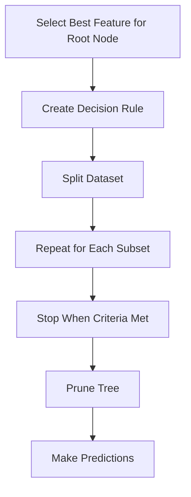

# 🌳 Decision Tree Classification

<div align="center">


*A Powerful and Interpretable Tree-Based Learning Algorithm*

</div>

---

## 📚 Table of Contents

- [What is Decision Tree Classification?](#what-is-decision-tree-classification)
- [Mathematical Foundation](#mathematical-foundation)
- [How It Works](#how-it-works)
- [Tree Growing Algorithms](#tree-growing-algorithms)
- [Pruning Techniques](#pruning-techniques)
- [Implementation Guide](#implementation-guide)
- [Model Evaluation](#model-evaluation)
- [Pros and Cons](#pros-and-cons)
- [Real-World Examples](#real-world-examples)
- [Advanced Topics](#advanced-topics)
- [FAQ](#faq)

---

## 🎯 What is Decision Tree Classification?

**Decision Tree Classification** is a supervised learning algorithm that uses a tree-like model of decisions to predict the class of a target variable. It breaks down a dataset into smaller subsets while simultaneously developing a decision tree, with each internal node representing a feature, each branch representing a decision rule, and each leaf node representing an outcome (a class label).

### Key Characteristics:
- **Hierarchical Structure**: Organizes decisions in a top-down, tree-like flowchart
- **Non-parametric**: Makes no assumptions about the underlying data distribution
- **Handles Mixed Data**: Works with both categorical and numerical features
- **Interpretable**: Easy to understand and visualize decision rules
- **Feature Importance**: Naturally ranks which features are most influential
- **No Preprocessing Required**: Insensitive to feature scaling or normalization

### The Goal:
Create a tree-based model that uses simple decision rules derived from data features to make accurate predictions while remaining interpretable and avoiding overfitting.

---

## 🧮 Mathematical Foundation

### Splitting Criteria

Decision trees use different metrics to determine the best feature to split on at each node:

#### 1. **Gini Impurity**
Measures the probability of incorrect classification if a random sample is classified according to the distribution of class labels in the node.

```
Gini(D) = 1 - Σ(pᵢ²)
```

Where pᵢ is the probability of class i in the dataset D.

For a binary classification problem:
```
Gini(D) = 1 - (p₁² + p₂²) = 2p₁p₂
```

#### 2. **Entropy**
Measures the level of disorder or uncertainty in the dataset.

```
Entropy(D) = -Σ(pᵢ × log₂(pᵢ))
```

Where pᵢ is the probability of class i in the dataset D.

For a binary classification problem:
```
Entropy(D) = -(p₁ × log₂(p₁) + p₂ × log₂(p₂))
```

#### 3. **Information Gain**
Measures the reduction in entropy or disorder after a dataset is split on an attribute.

```
IG(D, A) = Entropy(D) - Σ((|Dᵥ|/|D|) × Entropy(Dᵥ))
```

Where:
- A is the attribute to split on
- Dᵥ is the subset of D where attribute A has value v
- |D| is the size of dataset D

#### 4. **Gain Ratio**
Normalizes information gain by the entropy of the attribute itself to avoid bias towards attributes with many values.

```
GainRatio(D, A) = IG(D, A) / SplitInfo(D, A)
```

Where:
```
SplitInfo(D, A) = -Σ((|Dᵥ|/|D|) × log₂(|Dᵥ|/|D|))
```

#### 5. **Classification Error**
Measures the misclassification rate at a node.

```
Error(D) = 1 - max(pᵢ)
```

Where pᵢ is the probability of class i in the dataset D.

### Cost Complexity Pruning

A way to control tree complexity and prevent overfitting by penalizing the tree size:

```
R_α(T) = R(T) + α × |T|
```

Where:
- R(T) is the misclassification rate of the tree
- |T| is the number of terminal nodes
- α is the complexity parameter that controls the trade-off between tree size and misclassification rate

---

## ⚙️ How It Works

### Step-by-Step Process:

<div align="center">



</div>

### 1. **Start with the Entire Dataset**
```python
def fit(X, y):
    """Build decision tree from training data."""
    # Initialize root node with all data
    root = Node(X, y)
    
    # Build tree recursively
    _build_tree(root)
    
    return root
```

### 2. **Find the Best Split**
```python
def _find_best_split(X, y):
    """Find the best feature and threshold to split on."""
    m, n = X.shape
    best_gain = 0
    best_feature = None
    best_threshold = None
    
    # Calculate parent entropy
    parent_entropy = _calculate_entropy(y)
    
    # Try each feature
    for feature in range(n):
        # Get unique values for this feature
        thresholds = np.unique(X[:, feature])
        
        # Try each threshold
        for threshold in thresholds:
            # Split based on threshold
            left_indices = X[:, feature] <= threshold
            right_indices = X[:, feature] > threshold
            
            # Skip if split doesn't divide the dataset
            if np.sum(left_indices) == 0 or np.sum(right_indices) == 0:
                continue
            
            # Calculate weighted entropy after split
            n_left = np.sum(left_indices)
            n_right = np.sum(right_indices)
            
            left_entropy = _calculate_entropy(y[left_indices])
            right_entropy = _calculate_entropy(y[right_indices])
            
            weighted_entropy = (n_left / m) * left_entropy + (n_right / m) * right_entropy
            
            # Calculate information gain
            info_gain = parent_entropy - weighted_entropy
            
            # Update best split if better
            if info_gain > best_gain:
                best_gain = info_gain
                best_feature = feature
                best_threshold = threshold
    
    return best_feature, best_threshold, best_gain
```

### 3. **Split the Dataset**
```python
def _split_data(X, y, feature, threshold):
    """Split the dataset based on feature and threshold."""
    left_indices = X[:, feature] <= threshold
    right_indices = X[:, feature] > threshold
    
    X_left, y_left = X[left_indices], y[left_indices]
    X_right, y_right = X[right_indices], y[right_indices]
    
    return X_left, y_left, X_right, y_right
```

### 4. **Recursively Build Subtrees**
```python
def _build_tree(node, max_depth=None, min_samples_split=2, min_gain=0, depth=0):
    """Recursively build decision tree."""
    X, y = node.X, node.y
    
    # Check stopping criteria
    if (max_depth is not None and depth >= max_depth) or \
       len(y) < min_samples_split or \
       len(np.unique(y)) == 1:
        node.is_leaf = True
        node.prediction = _most_common_label(y)
        return
    
    # Find best split
    feature, threshold, gain = _find_best_split(X, y)
    
    # If gain is too small, make this a leaf node
    if gain <= min_gain:
        node.is_leaf = True
        node.prediction = _most_common_label(y)
        return
    
    # Split data
    X_left, y_left, X_right, y_right = _split_data(X, y, feature, threshold)
    
    # Create child nodes
    node.feature = feature
    node.threshold = threshold
    node.left = Node(X_left, y_left)
    node.right = Node(X_right, y_right)
    
    # Recursively build subtrees
    _build_tree(node.left, max_depth, min_samples_split, min_gain, depth + 1)
    _build_tree(node.right, max_depth, min_samples_split, min_gain, depth + 1)
```

### 5. **Make Predictions**
```python
def predict(X, tree):
    """Predict class labels for samples in X."""
    return np.array([_predict_sample(x, tree) for x in X])

def _predict_sample(x, node):
    """Predict class for a single sample."""
    # If we're at a leaf node, return the prediction
    if node.is_leaf:
        return node.prediction
    
    # Otherwise, continue down the tree
    if x[node.feature] <= node.threshold:
        return _predict_sample(x, node.left)
    else:
        return _predict_sample(x, node.right)
```

---

## 🌱 Tree Growing Algorithms

Several algorithms exist for growing decision trees, each with its own approach and characteristics:

### 1. **ID3 (Iterative Dichotomiser 3)**
- **Split Criterion**: Information Gain
- **Features**: Works with categorical attributes
- **Limitations**: Doesn't handle numeric attributes or missing values
- **Bias**: Biased towards attributes with many values

```python
def id3(examples, target_attribute, attributes):
    """ID3 algorithm for decision tree induction."""
    # Create a root node
    root = Node()
    
    # If all examples have the same class, return leaf node with that class
    if len(np.unique(examples[target_attribute])) == 1:
        root.label = examples[target_attribute].iloc[0]
        return root
    
    # If no attributes to split on, return leaf node with most common class
    if len(attributes) == 0:
        root.label = examples[target_attribute].value_counts().idxmax()
        return root
    
    # Select best attribute to split on
    best_attr = None
    max_info_gain = -1
    
    for attr in attributes:
        info_gain = calculate_information_gain(examples, attr, target_attribute)
        if info_gain > max_info_gain:
            max_info_gain = info_gain
            best_attr = attr
    
    # Set root node's split attribute
    root.attribute = best_attr
    
    # Create child nodes for each value of the best attribute
    for value in np.unique(examples[best_attr]):
        # Create a subset of examples with this attribute value
        subset = examples[examples[best_attr] == value]
        
        # If subset is empty, create leaf node with most common class
        if len(subset) == 0:
            child = Node()
            child.label = examples[target_attribute].value_counts().idxmax()
            root.children[value] = child
        else:
            # Recursively build the subtree
            new_attributes = attributes.copy()
            new_attributes.remove(best_attr)
            root.children[value] = id3(subset, target_attribute, new_attributes)
    
    return root
```

### 2. **C4.5**
- **Split Criterion**: Gain Ratio
- **Features**: Handles both continuous and categorical attributes
- **Improvements**: Addresses bias in ID3, handles missing values
- **Pruning**: Uses error-based pruning

```python
def calculate_gain_ratio(data, feature, target):
    """Calculate gain ratio for a feature."""
    information_gain = calculate_information_gain(data, feature, target)
    
    # Calculate split information
    split_info = 0
    feature_values = np.unique(data[feature])
    
    for value in feature_values:
        subset = data[data[feature] == value]
        proportion = len(subset) / len(data)
        split_info -= proportion * np.log2(proportion)
    
    # Avoid division by zero
    if split_info == 0:
        return 0
    
    return information_gain / split_info
```

### 3. **CART (Classification and Regression Trees)**
- **Split Criterion**: Gini Impurity
- **Features**: Binary splits, handles both classification and regression
- **Pruning**: Cost-complexity pruning

```python
def calculate_gini(data, target):
    """Calculate Gini impurity for a dataset."""
    classes = np.unique(data[target])
    gini = 1.0
    
    for cls in classes:
        p_cls = len(data[data[target] == cls]) / len(data)
        gini -= p_cls ** 2
    
    return gini

def find_best_split_cart(data, feature, target):
    """Find the best split for CART algorithm."""
    best_gini = float('inf')
    best_threshold = None
    
    if data[feature].dtype in ['int64', 'float64']:
        # Handle numeric feature
        thresholds = sorted(set(data[feature]))
        
        for i in range(len(thresholds) - 1):
            threshold = (thresholds[i] + thresholds[i + 1]) / 2
            
            left = data[data[feature] <= threshold]
            right = data[data[feature] > threshold]
            
            if len(left) == 0 or len(right) == 0:
                continue
            
            gini_left = calculate_gini(left, target)
            gini_right = calculate_gini(right, target)
            
            weighted_gini = (len(left) / len(data)) * gini_left + (len(right) / len(data)) * gini_right
            
            if weighted_gini < best_gini:
                best_gini = weighted_gini
                best_threshold = threshold
    else:
        # Handle categorical feature
        # For CART, we try all possible binary splits of categories
        categories = set(data[feature])
        
        for cat in categories:
            left = data[data[feature] == cat]
            right = data[data[feature] != cat]
            
            gini_left = calculate_gini(left, target)
            gini_right = calculate_gini(right, target)
            
            weighted_gini = (len(left) / len(data)) * gini_left + (len(right) / len(data)) * gini_right
            
            if weighted_gini < best_gini:
                best_gini = weighted_gini
                best_threshold = cat
    
    return best_threshold, best_gini
```

### 4. **CHAID (Chi-squared Automatic Interaction Detection)**
- **Split Criterion**: Chi-squared test
- **Features**: Multi-way splits, good for categorical predictors
- **Application**: Market segmentation, survey analysis

```python
def chi_square_test(data, feature, target):
    """Calculate chi-square statistic for a feature."""
    feature_values = np.unique(data[feature])
    target_values = np.unique(data[target])
    
    # Create contingency table
    contingency_table = np.zeros((len(feature_values), len(target_values)))
    
    for i, f_val in enumerate(feature_values):
        for j, t_val in enumerate(target_values):
            contingency_table[i, j] = len(data[(data[feature] == f_val) & (data[target] == t_val)])
    
    # Calculate chi-square statistic
    from scipy.stats import chi2_contingency
    chi2, p, dof, expected = chi2_contingency(contingency_table)
    
    return chi2, p
```

### 5. **Conditional Inference Trees**
- **Split Criterion**: Statistical hypothesis tests
- **Features**: Unbiased feature selection, handles various data types
- **Application**: Scientific research, statistical analysis

```python
def conditional_inference_split(data, feature, target):
    """Find the best split using conditional inference approach."""
    # For numeric features, use a permutation test
    if data[feature].dtype in ['int64', 'float64']:
        from scipy.stats import pearsonr
        correlation, p_value = pearsonr(data[feature], data[target])
        return p_value
    else:
        # For categorical features, use chi-square test
        _, p_value = chi_square_test(data, feature, target)
        return p_value
```

---

## ✂️ Pruning Techniques

Pruning helps reduce overfitting by simplifying the decision tree:

### 1. **Pre-pruning**

Stop tree growth before it perfectly fits the training data:

```python
def build_tree_with_prepruning(X, y, max_depth=None, min_samples_split=2, min_gain=0.01):
    """Build a decision tree with pre-pruning."""
    def _build_tree(X, y, depth=0):
        # Check stopping criteria
        if (max_depth is not None and depth >= max_depth) or \
           len(y) < min_samples_split or \
           len(np.unique(y)) == 1:
            return {"type": "leaf", "prediction": most_common_class(y)}
        
        # Find best split
        feature, threshold, gain = find_best_split(X, y)
        
        # Stop if information gain is too small
        if gain < min_gain:
            return {"type": "leaf", "prediction": most_common_class(y)}
        
        # Split data
        left_idx = X[:, feature] <= threshold
        right_idx = ~left_idx
        
        # Create node
        node = {
            "type": "node",
            "feature": feature,
            "threshold": threshold,
            "left": _build_tree(X[left_idx], y[left_idx], depth + 1),
            "right": _build_tree(X[right_idx], y[right_idx], depth + 1)
        }
        
        return node
    
    return _build_tree(X, y)
```

### 2. **Post-pruning**

Build the full tree first, then simplify:

```python
def prune_tree(tree, X_val, y_val):
    """Prune a decision tree based on validation performance."""
    if tree["type"] == "leaf":
        return tree
    
    # Recursively prune subtrees
    tree["left"] = prune_tree(tree["left"], X_val, y_val)
    tree["right"] = prune_tree(tree["right"], X_val, y_val)
    
    # If both children are leaves, consider merging them
    if tree["left"]["type"] == "leaf" and tree["right"]["type"] == "leaf"]:
        # Calculate accuracy before merging
        original_pred = predict_with_tree(X_val, tree)
        original_accuracy = np.mean(original_pred == y_val)
        
        # Create leaf node with majority class
        leaf_node = {"type": "leaf", "prediction": most_common_class(y_val)}
        
        # Calculate accuracy with leaf node
        leaf_pred = np.full(len(y_val), leaf_node["prediction"])
        leaf_accuracy = np.mean(leaf_pred == y_val)
        
        # If leaf node performs better, replace subtree with leaf
        if leaf_accuracy >= original_accuracy:
            return leaf_node
    
    return tree
```

### 3. **Cost-Complexity Pruning (Minimal Cost-Complexity Pruning)**

Progressively remove subtrees that provide the smallest increase in error rate per node:

```python
def cost_complexity_pruning(tree, X, y, alpha=0.01):
    """Prune tree based on cost-complexity measure."""
    def _calculate_error(node, X, y):
        """Calculate error (misclassification rate) at a node."""
        if node["type"] == "leaf":
            return np.mean(y != node["prediction"])
        
        # For internal nodes, calculate weighted error of subtrees
        left_mask = X[:, node["feature"]] <= node["threshold"]
        right_mask = ~left_mask
        
        left_error = _calculate_error(node["left"], X[left_mask], y[left_mask]) if any(left_mask) else 0
        right_error = _calculate_error(node["right"], X[right_mask], y[right_mask]) if any(right_mask) else 0
        
        weighted_error = (np.sum(left_mask) / len(y)) * left_error + (np.sum(right_mask) / len(y)) * right_error
        
        return weighted_error
    
    def _count_leaves(node):
        """Count the number of leaf nodes in the tree."""
        if node["type"] == "leaf":
            return 1
        return _count_leaves(node["left"]) + _count_leaves(node["right"])
    
    def _prune(node, X, y, alpha):
        """Recursively prune the tree based on cost-complexity."""
        if node["type"] == "leaf":
            return node
        
        # Recursively prune subtrees
        node["left"] = _prune(node["left"], X[X[:, node["feature"]] <= node["threshold"]], 
                            y[X[:, node["feature"]] <= node["threshold"]], alpha)
        node["right"] = _prune(node["right"], X[X[:, node["feature"]] > node["threshold"]], 
                             y[X[:, node["feature"]] > node["threshold"]], alpha)
        
        # Calculate error if we keep the subtree
        subtree_error = _calculate_error(node, X, y)
        subtree_leaves = _count_leaves(node)
        subtree_cost = subtree_error + alpha * subtree_leaves
        
        # Calculate error if we replace with a leaf
        leaf_node = {"type": "leaf", "prediction": most_common_class(y)}
        leaf_error = _calculate_error(leaf_node, X, y)
        leaf_cost = leaf_error + alpha * 1  # A leaf node has complexity of 1
        
        # If leaf has lower cost, replace subtree with leaf
        if leaf_cost <= subtree_cost:
            return leaf_node
        
        return node
    
    # Start pruning
    return _prune(tree, X, y, alpha)
```

### 4. **Reduced Error Pruning**

Simplify each node and evaluate if the pruning reduces error on a validation set:

```python
def reduced_error_pruning(tree, X_val, y_val):
    """Prune tree using reduced error pruning."""
    def _prune(node, X, y):
        """Recursively prune the tree to reduce validation error."""
        if node["type"] == "leaf":
            return node
        
        # Recursively prune subtrees
        if "left" in node:
            left_mask = X[:, node["feature"]] <= node["threshold"]
            if np.any(left_mask):
                node["left"] = _prune(node["left"], X[left_mask], y[left_mask])
        
        if "right" in node:
            right_mask = X[:, node["feature"]] > node["threshold"]
            if np.any(right_mask):
                node["right"] = _prune(node["right"], X[right_mask], y[right_mask])
        
        # Calculate validation error with current subtree
        original_pred = predict_with_tree(X, node)
        original_error = np.mean(original_pred != y)
        
        # Calculate validation error if we replace with a leaf
        majority_class = most_common_class(y)
        leaf_error = np.mean(y != majority_class)
        
        # If leaf reduces or maintains error, prune
        if leaf_error <= original_error:
            return {"type": "leaf", "prediction": majority_class}
        
        return node
    
    # Start pruning
    return _prune(tree, X_val, y_val)
```

---

## 💻 Implementation Guide

### From Scratch Implementation

```python
import numpy as np
from collections import Counter
from typing import List, Dict, Union, Tuple, Optional

class DecisionTreeClassifier:
    def __init__(self, max_depth: Optional[int] = None, 
                 min_samples_split: int = 2,
                 min_impurity_decrease: float = 0.0,
                 criterion: str = 'gini'):
        """
        Initialize Decision Tree Classifier.
        
        Parameters:
        max_depth (int): Maximum depth of the tree
        min_samples_split (int): Minimum samples required to split a node
        min_impurity_decrease (float): Minimum decrease in impurity to split
        criterion (str): Function to measure quality of split ('gini' or 'entropy')
        """
        self.max_depth = max_depth
        self.min_samples_split = min_samples_split
        self.min_impurity_decrease = min_impurity_decrease
        self.criterion = criterion
        self.tree = None
    
    def fit(self, X: np.ndarray, y: np.ndarray) -> 'DecisionTreeClassifier':
        """
        Build decision tree from training data.
        
        Parameters:
        X (array-like): Feature matrix
        y (array-like): Target values
        
        Returns:
        self: Decision tree model
        """
        # Convert to numpy arrays
        X = np.array(X)
        y = np.array(y)
        
        # Get feature names for visualization
        self.n_features_ = X.shape[1]
        self.n_classes_ = len(np.unique(y))
        
        # Build the tree recursively
        self.tree = self._build_tree(X, y, depth=0)
        
        return self
    
    def _calculate_impurity(self, y: np.ndarray) -> float:
        """Calculate impurity (Gini or Entropy) for a node."""
        # Calculate class probabilities
        m = len(y)
        if m == 0:
            return 0
        
        counts = np.bincount(y)
        probabilities = counts / m
        
        # Remove zero probabilities to avoid log(0)
        probabilities = probabilities[probabilities > 0]
        
        if self.criterion == 'gini':
            return 1 - np.sum(probabilities ** 2)
        else:  # 'entropy'
            return -np.sum(probabilities * np.log2(probabilities))
    
    def _split_dataset(self, X: np.ndarray, y: np.ndarray, feature_idx: int, 
                     threshold: float) -> Tuple[np.ndarray, np.ndarray, np.ndarray, np.ndarray]:
        """Split dataset based on feature and threshold."""
        left_mask = X[:, feature_idx] <= threshold
        right_mask = ~left_mask
        
        return X[left_mask], y[left_mask], X[right_mask], y[right_mask]
    
    def _calculate_information_gain(self, y: np.ndarray, y_left: np.ndarray, 
                                  y_right: np.ndarray) -> float:
        """Calculate information gain or impurity reduction."""
        # Parent impurity
        impurity = self._calculate_impurity(y)
        
        # Weighted child impurity
        n = len(y)
        n_left = len(y_left)
        n_right = len(y_right)
        
        if n == 0:
            return 0
        
        weighted_impurity = (n_left / n) * self._calculate_impurity(y_left) + \
                           (n_right / n) * self._calculate_impurity(y_right)
        
        # Information gain is the reduction in impurity
        return impurity - weighted_impurity
    
    def _find_best_split(self, X: np.ndarray, y: np.ndarray) -> Tuple[Optional[int], Optional[float], float]:
        """Find the best feature and threshold to split on."""
        m, n = X.shape
        
        if m <= 1:
            return None, None, 0
        
        # Initialize with worst possible gain
        best_gain = -1
        best_feature = None
        best_threshold = None
        
        # Try each feature
        for feature_idx in range(n):
            # Get unique values for the feature
            thresholds = sorted(set(X[:, feature_idx]))
            
            # Try each threshold
            for i in range(len(thresholds) - 1):
                threshold = (thresholds[i] + thresholds[i + 1]) / 2
                
                # Split dataset
                _, y_left, _, y_right = self._split_dataset(X, y, feature_idx, threshold)
                
                # Skip if split doesn't create two groups
                if len(y_left) == 0 or len(y_right) == 0:
                    continue
                
                # Calculate information gain
                gain = self._calculate_information_gain(y, y_left, y_right)
                
                # Update best split if better
                if gain > best_gain:
                    best_gain = gain
                    best_feature = feature_idx
                    best_threshold = threshold
        
        return best_feature, best_threshold, best_gain
    
    def _build_tree(self, X: np.ndarray, y: np.ndarray, depth: int = 0) -> Dict:
        """
        Recursively build the decision tree.
        
        Returns a node, which is a dictionary with the following keys:
        - type: 'leaf' or 'internal'
        - value: class prediction (for leaf nodes)
        - feature_idx: feature to split on (for internal nodes)
        - threshold: threshold for the split (for internal nodes)
        - left: left subtree (for internal nodes)
        - right: right subtree (for internal nodes)
        """
        # Count samples per class
        counter = Counter(y)
        majority_class = counter.most_common(1)[0][0]
        
        # Create a leaf node if stopping criteria are met
        if (self.max_depth is not None and depth >= self.max_depth) or \
           len(y) < self.min_samples_split or \
           len(counter) == 1:
            return {'type': 'leaf', 'value': majority_class}
        
        # Find the best split
        feature_idx, threshold, gain = self._find_best_split(X, y)
        
        # Create leaf node if no good split found or gain is too small
        if feature_idx is None or gain < self.min_impurity_decrease:
            return {'type': 'leaf', 'value': majority_class}
        
        # Split the dataset
        X_left, y_left, X_right, y_right = self._split_dataset(X, y, feature_idx, threshold)
        
        # Build subtrees recursively
        left_subtree = self._build_tree(X_left, y_left, depth + 1)
        right_subtree = self._build_tree(X_right, y_right, depth + 1)
        
        # Create internal node
        return {
            'type': 'internal',
            'feature_idx': feature_idx,
            'threshold': threshold,
            'left': left_subtree,
            'right': right_subtree,
            'value': majority_class  # For cases where we stop at this node during pruning
        }
    
    def predict(self, X: np.ndarray) -> np.ndarray:
        """
        Predict class labels for samples in X.
        
        Parameters:
        X (array-like): Feature matrix
        
        Returns:
        array: Predicted class labels
        """
        X = np.array(X)
        return np.array([self._traverse_tree(x, self.tree) for x in X])
    
    def _traverse_tree(self, x: np.ndarray, node: Dict) -> int:
        """Traverse tree to make prediction for a single sample."""
        if node['type'] == 'leaf':
            return node['value']
        
        if x[node['feature_idx']] <= node['threshold']:
            return self._traverse_tree(x, node['left'])
        else:
            return self._traverse_tree(x, node['right'])
    
    def print_tree(self, feature_names: Optional[List[str]] = None) -> None:
        """Print the decision tree structure."""
        if feature_names is None:
            feature_names = [f"Feature {i}" for i in range(self.n_features_)]
        
        def print_node(node, indent=""):
            if node['type'] == 'leaf':
                print(f"{indent}Predict: Class {node['value']}")
            else:
                feature_name = feature_names[node['feature_idx']]
                print(f"{indent}{feature_name} <= {node['threshold']:.3f}")
                print_node(node['left'], indent + "  ")
                print(f"{indent}{feature_name} > {node['threshold']:.3f}")
                print_node(node['right'], indent + "  ")
        
        print("Decision Tree Structure:")
        print_node(self.tree)
    
    def visualize(self) -> None:
        """Visualize the decision tree using matplotlib."""
        import matplotlib.pyplot as plt
        import matplotlib.patches as patches
        
        def count_nodes(node):
            if node['type'] == 'leaf':
                return 1
            return 1 + count_nodes(node['left']) + count_nodes(node['right'])
        
        def get_tree_depth(node):
            if node['type'] == 'leaf':
                return 0
            return 1 + max(get_tree_depth(node['left']), get_tree_depth(node['right']))
        
        def draw_tree(node, ax, x, y, width, depth, feature_names=None):
            if feature_names is None:
                feature_names = [f"Feature {i}" for i in range(self.n_features_)]
            
            # Node dimensions
            node_width = 0.2
            node_height = 0.1
            
            if node['type'] == 'leaf':
                # Draw leaf node
                rect = patches.Rectangle((x - node_width/2, y - node_height/2), node_width, node_height, 
                                        linewidth=1, edgecolor='green', facecolor='lightgreen')
                ax.add_patch(rect)
                ax.text(x, y, f"Class: {node['value']}", ha='center', va='center', fontsize=8)
            else:
                # Draw internal node
                rect = patches.Rectangle((x - node_width/2, y - node_height/2), node_width, node_height, 
                                        linewidth=1, edgecolor='blue', facecolor='lightblue')
                ax.add_patch(rect)
                feature_name = feature_names[node['feature_idx']]
                ax.text(x, y, f"{feature_name}\n<= {node['threshold']:.3f}", ha='center', va='center', fontsize=8)
                
                # Calculate positions for child nodes
                left_x = x - width/4
                right_x = x + width/4
                child_y = y - 0.2
                
                # Draw edges to children
                ax.plot([x, left_x], [y - node_height/2, child_y + node_height/2], 'k-')
                ax.plot([x, right_x], [y - node_height/2, child_y + node_height/2], 'k-')
                
                # Draw child nodes
                draw_tree(node['left'], ax, left_x, child_y, width/2, depth-1, feature_names)
                draw_tree(node['right'], ax, right_x, child_y, width/2, depth-1, feature_names)
        
        # Create figure
        tree_depth = get_tree_depth(self.tree)
        fig, ax = plt.subplots(figsize=(12, 8))
        
        # Draw tree
        ax.set_xlim(-1, 1)
        ax.set_ylim(-tree_depth * 0.3, 0.1)
        draw_tree(self.tree, ax, 0, 0, 2, tree_depth)
        
        # Remove axes
        ax.axis('off')
        
        plt.title('Decision Tree Visualization')
        plt.tight_layout()
        plt.show()
```

### Using Scikit-learn

```python
from sklearn.tree import DecisionTreeClassifier, plot_tree
from sklearn.metrics import accuracy_score, classification_report
import numpy as np
import matplotlib.pyplot as plt

# Sample data
from sklearn.datasets import load_iris
from sklearn.model_selection import train_test_split

iris = load_iris()
X, y = iris.data, iris.target

# Split data
X_train, X_test, y_train, y_test = train_test_split(X, y, test_size=0.2, random_state=42)

# Create and train model
dt_clf = DecisionTreeClassifier(
    max_depth=3,           # Maximum depth of the tree
    min_samples_split=5,   # Minimum samples required to split a node
    min_samples_leaf=2,    # Minimum samples required in a leaf node
    criterion='entropy',   # Split criterion: 'gini' or 'entropy'
    random_state=42        # Random state for reproducibility
)
dt_clf.fit(X_train, y_train)

# Make predictions
y_pred = dt_clf.predict(X_test)
print(f"Accuracy: {accuracy_score(y_test, y_pred):.4f}")
print("\nClassification Report:")
print(classification_report(y_test, y_pred, target_names=iris.target_names))

# Visualize the tree
plt.figure(figsize=(15, 10))
plot_tree(dt_clf, filled=True, feature_names=iris.feature_names, class_names=iris.target_names)
plt.title("Decision Tree for Iris Dataset")
plt.show()

# Feature importance
feature_importance = dt_clf.feature_importances_
feature_names = iris.feature_names

# Sort features by importance
sorted_idx = np.argsort(feature_importance)
plt.figure(figsize=(10, 6))
plt.barh(range(len(sorted_idx)), feature_importance[sorted_idx])
plt.yticks(range(len(sorted_idx)), [feature_names[i] for i in sorted_idx])
plt.xlabel('Feature Importance')
plt.title('Feature Importance in Decision Tree')
plt.tight_layout()
plt.show()
```

### Complete Example with Visualization

```python
import numpy as np
import matplotlib.pyplot as plt
from sklearn.datasets import make_classification
from sklearn.model_selection import train_test_split, cross_val_score, GridSearchCV
from sklearn.tree import DecisionTreeClassifier, plot_tree
from sklearn.metrics import accuracy_score, classification_report, confusion_matrix, roc_curve, auc
import seaborn as sns

# Generate synthetic classification dataset
X, y = make_classification(
    n_samples=1000,
    n_features=10,
    n_informative=5,
    n_redundant=2,
    n_repeated=0,
    n_classes=2,
    random_state=42
)

# Split data into train and test sets
X_train, X_test, y_train, y_test = train_test_split(X, y, test_size=0.3, random_state=42)

# Create and train model
dt_clf = DecisionTreeClassifier(random_state=42)
dt_clf.fit(X_train, y_train)

# Make predictions
y_pred = dt_clf.predict(X_test)
y_prob = dt_clf.predict_proba(X_test)[:, 1]  # Probability for the positive class

# Create visualization
fig, ((ax1, ax2), (ax3, ax4)) = plt.subplots(2, 2, figsize=(15, 12))

# 1. Simplified Tree Visualization
plot_tree(
    dt_clf, 
    max_depth=3,  # Limit depth for clarity
    filled=True, 
    feature_names=[f"Feature {i}" for i in range(10)],
    class_names=["Class 0", "Class 1"],
    rounded=True,
    ax=ax1
)
ax1.set_title("Decision Tree Structure (Max Depth 3)")

# 2. Feature Importance
feature_importance = dt_clf.feature_importances_
indices = np.argsort(feature_importance)[::-1]

ax2.bar(range(10), feature_importance[indices], align='center')
ax2.set_xticks(range(10))
ax2.set_xticklabels([f"Feature {i}" for i in indices])
ax2.set_xlabel('Features')
ax2.set_ylabel('Importance')
ax2.set_title('Feature Importance')
plt.setp(ax2.get_xticklabels(), rotation=45, ha='right')

# 3. Confusion Matrix
cm = confusion_matrix(y_test, y_pred)
sns.heatmap(cm, annot=True, fmt='d', cmap='Blues', ax=ax3)
ax3.set_xlabel('Predicted Label')
ax3.set_ylabel('True Label')
ax3.set_title('Confusion Matrix')

# 4. ROC Curve
fpr, tpr, _ = roc_curve(y_test, y_prob)
roc_auc = auc(fpr, tpr)

ax4.plot(fpr, tpr, color='darkorange', lw=2, label=f'ROC curve (area = {roc_auc:.2f})')
ax4.plot([0, 1], [0, 1], color='navy', lw=2, linestyle='--')
ax4.set_xlim([0.0, 1.0])
ax4.set_ylim([0.0, 1.05])
ax4.set_xlabel('False Positive Rate')
ax4.set_ylabel('True Positive Rate')
ax4.set_title('Receiver Operating Characteristic (ROC)')
ax4.legend(loc="lower right")
ax4.grid(True, alpha=0.3)

plt.tight_layout()
plt.show()

# Print model performance
print(f"Decision Tree Performance Metrics:")
print(f"Accuracy: {accuracy_score(y_test, y_pred):.4f}")
print("\nClassification Report:")
print(classification_report(y_test, y_pred))

# Hyperparameter Tuning
print("\nPerforming hyperparameter tuning...")

# Define parameter grid
param_grid = {
    'max_depth': [3, 5, 7, 10, None],
    'min_samples_split': [2, 5, 10],
    'min_samples_leaf': [1, 2, 4],
    'criterion': ['gini', 'entropy']
}

# Grid search with cross-validation
grid_search = GridSearchCV(
    DecisionTreeClassifier(random_state=42),
    param_grid=param_grid,
    cv=5,
    scoring='accuracy',
    verbose=1,
    n_jobs=-1
)

grid_search.fit(X_train, y_train)

# Print best parameters
print(f"\nBest parameters: {grid_search.best_params_}")
print(f"Best cross-validation score: {grid_search.best_score_:.4f}")

# Evaluate optimized model
best_dt = grid_search.best_estimator_
y_pred_best = best_dt.predict(X_test)

print(f"\nOptimized Model Accuracy: {accuracy_score(y_test, y_pred_best):.4f}")
print("\nOptimized Classification Report:")
print(classification_report(y_test, y_pred_best))

# Pruning comparison
plt.figure(figsize=(12, 6))

# Compare different max_depth values
depths = [1, 2, 3, 5, 7, 10, 15, 20, None]
train_scores = []
test_scores = []

for depth in depths:
    dt = DecisionTreeClassifier(max_depth=depth, random_state=42)
    dt.fit(X_train, y_train)
    
    train_scores.append(accuracy_score(y_train, dt.predict(X_train)))
    test_scores.append(accuracy_score(y_test, dt.predict(X_test)))

# Convert None to a numeric value for plotting
depth_values = [d if d is not None else 25 for d in depths]
depth_labels = [str(d) for d in depths]

plt.plot(depth_values, train_scores, 'o-', color='blue', label='Training Accuracy')
plt.plot(depth_values, test_scores, 'o-', color='orange', label='Testing Accuracy')
plt.axvline(x=grid_search.best_params_['max_depth'] if grid_search.best_params_['max_depth'] is not None else 25, 
           color='red', linestyle='--', label='Best Depth')
plt.xticks(depth_values, depth_labels)
plt.xlabel('Max Depth')
plt.ylabel('Accuracy')
plt.title('Effect of Tree Depth on Performance')
plt.legend()
plt.grid(True, alpha=0.3)
plt.show()
```

---

## 📊 Model Evaluation

### Key Metrics for Classification

#### 1. **Accuracy**
```python
def accuracy(y_true, y_pred):
    """Proportion of correct predictions."""
    return np.mean(y_true == y_pred)
```

#### 2. **Precision, Recall, F1-score**
```python
def precision_recall_f1(y_true, y_pred, pos_label=1):
    """Calculate precision, recall, and F1-score."""
    tp = sum((y_true == pos_label) & (y_pred == pos_label))
    fp = sum((y_true != pos_label) & (y_pred == pos_label))
    fn = sum((y_true == pos_label) & (y_pred != pos_label))
    
    precision = tp / (tp + fp) if (tp + fp) > 0 else 0
    recall = tp / (tp + fn) if (tp + fn) > 0 else 0
    f1 = 2 * precision * recall / (precision + recall) if (precision + recall) > 0 else 0
    
    return precision, recall, f1
```

#### 3. **ROC AUC**
```python
def roc_auc(y_true, y_prob):
    """Calculate ROC AUC score."""
    # Sort by probability
    sorted_indices = np.argsort(y_prob)[::-1]
    y_true_sorted = y_true[sorted_indices]
    
    # Count positive and negative examples
    n_pos = sum(y_true == 1)
    n_neg = sum(y_true == 0)
    
    # Calculate TPR and FPR at each threshold
    tpr = np.cumsum(y_true_sorted) / n_pos
    fpr = np.cumsum(1 - y_true_sorted) / n_neg
    
    # Calculate AUC using trapezoidal rule
    auc = np.trapz(tpr, fpr)
    
    return auc
```

### Tree-specific Metrics

#### 1. **Tree Depth**
```python
def tree_depth(tree):
    """Calculate maximum depth of the tree."""
    if tree['type'] == 'leaf':
        return 0
    return 1 + max(tree_depth(tree['left']), tree_depth(tree['right']))
```

#### 2. **Number of Nodes**
```python
def count_nodes(tree):
    """Count total number of nodes in the tree."""
    if tree['type'] == 'leaf':
        return 1
    return 1 + count_nodes(tree['left']) + count_nodes(tree['right'])
```

#### 3. **Number of Leaves**
```python
def count_leaves(tree):
    """Count number of leaf nodes in the tree."""
    if tree['type'] == 'leaf':
        return 1
    return count_leaves(tree['left']) + count_leaves(tree['right'])
```

### Decision Tree Visualization Tools

```python
def text_representation(tree, feature_names=None, indent=""):
    """Generate text representation of the decision tree."""
    if feature_names is None:
        feature_names = [f"Feature {i}" for i in range(100)]
    
    if tree['type'] == 'leaf':
        return f"{indent}Predict: Class {tree['value']}"
    
    feature_name = feature_names[tree['feature_idx']]
    
    left_text = text_representation(tree['left'], feature_names, indent + "  ")
    right_text = text_representation(tree['right'], feature_names, indent + "  ")
    
    return (f"{indent}{feature_name} <= {tree['threshold']:.3f}\n" + 
            left_text + "\n" + 
            f"{indent}{feature_name} > {tree['threshold']:.3f}\n" + 
            right_text)

def plot_tree_custom(tree, feature_names=None):
    """Plot decision tree using matplotlib."""
    import matplotlib.pyplot as plt
    
    def get_tree_bounds(node):
        """Get the bounding box coordinates for a tree."""
        if node['type'] == 'leaf':
            return {'width': 1, 'height': 1, 'depth': 0}
        
        left_bounds = get_tree_bounds(node['left'])
        right_bounds = get_tree_bounds(node['right'])
        
        width = left_bounds['width'] + right_bounds['width']
        height = 1 + max(left_bounds['height'], right_bounds['height'])
        depth = 1 + max(left_bounds['depth'], right_bounds['depth'])
        
        return {'width': width, 'height': height, 'depth': depth}
    
    def plot_node(node, x, y, x_parent=None, y_parent=None, direction=None):
        """Plot a node and its connections."""
        if x_parent is not None and y_parent is not None:
            plt.plot([x_parent, x], [y_parent, y], 'k-')
            plt.text((x_parent + x) / 2, (y_parent + y) / 2, direction, fontsize=8)
        
        if node['type'] == 'leaf':
            # Draw leaf node
            circle = plt.Circle((x, y), 0.5, fill=True, color='lightgreen', alpha=0.7)
            plt.gca().add_patch(circle)
            plt.text(x, y, f"Class: {node['value']}", ha='center', va='center')
        else:
            # Draw internal node
            circle = plt.Circle((x, y), 0.5, fill=True, color='lightblue', alpha=0.7)
            plt.gca().add_patch(circle)
            
            feature_name = feature_names[node['feature_idx']] if feature_names else f"F{node['feature_idx']}"
            plt.text(x, y, f"{feature_name}\n<= {node['threshold']:.2f}", ha='center', va='center', fontsize=8)
            
            # Calculate positions for children
            bounds = get_tree_bounds(node)
            left_bounds = get_tree_bounds(node['left'])
            right_bounds = get_tree_bounds(node['right'])
            
            left_width = left_bounds['width'] / bounds['width']
            
            # Plot left child
            x_left = x - (bounds['width'] / 4)
            y_left = y - 1.5
            plot_node(node['left'], x_left, y_left, x, y, "≤")
            
            # Plot right child
            x_right = x + (bounds['width'] / 4)
            y_right = y - 1.5
            plot_node(node['right'], x_right, y_right, x, y, ">")
    
    # Calculate tree dimensions
    bounds = get_tree_bounds(tree)
    width = bounds['width'] * 2.5
    height = bounds['depth'] * 2.5
    
    plt.figure(figsize=(width, height))
    plt.axis('off')
    
    # Plot the tree starting at the root
    plot_node(tree, width / 2, height - 0.5)
    
    plt.xlim(0, width)
    plt.ylim(0, height)
    plt.title('Decision Tree Visualization')
    plt.tight_layout()
    plt.show()
```

---

## ✅ Pros and Cons

<div align="center">

| ✅ **Advantages** | ❌ **Disadvantages** |
|-------------------|---------------------|
| **Easy to Understand and Interpret** | **Prone to Overfitting** |
| Visual representation is intuitive | Can create complex trees that generalize poorly |
| **Handles Both Numerical & Categorical Data** | **Instability** |
| No preprocessing needed for different data types | Small changes in data can result in very different trees |
| **Minimal Data Preparation** | **Biased Toward Features with Many Levels** |
| No normalization or scaling required | Can favor attributes with more values |
| **Automatic Feature Selection** | **Difficulty with Diagonal Decision Boundaries** |
| Identifies most important attributes | Requires multiple splits for diagonal patterns |
| **Non-parametric** | **Cannot Extrapolate Well** |
| Makes no assumptions about data distribution | Can only make predictions within range of training data |
| **Handles Missing Values** | **May Create Biased Trees** |
| Can work with incomplete data | If some classes dominate, tree can be biased |
| **White Box Model** | **Computationally Expensive for Large Datasets** |
| Decision process is completely transparent | Finding optimal splits can be slow on big data |
| **Performs Well on Mixed-Type Data** | **Greedy Approach** |
| Can handle numerical and categorical features together | Uses locally optimal decisions, not globally optimal |

</div>

### When to Use Decision Trees:

✅ **Good Choice When:**
- Interpretability is a priority
- You need to visualize decision-making process
- Dataset includes mixed data types (numerical and categorical)
- Feature importance information is needed
- Quick development and deployment required
- Non-linear relationships exist in the data
- Missing values are present in the dataset

❌ **Avoid When:**
- Maximum predictive accuracy is the only goal
- Very complex relationships exist that require smooth boundaries
- Data has high noise-to-signal ratio
- Dataset is very small (risk of overfitting)
- You need stable models that don't change drastically with small data changes
- Extrapolation beyond training data range is required

---

## 🌍 Real-World Examples

### Example 1: Customer Churn Prediction
```python
# Predicting customer churn with decision trees
import pandas as pd
import numpy as np
from sklearn.tree import DecisionTreeClassifier, plot_tree
from sklearn.model_selection import train_test_split, GridSearchCV
from sklearn.metrics import classification_report, confusion_matrix, accuracy_score
from sklearn.preprocessing import OneHotEncoder
import matplotlib.pyplot as plt
import seaborn as sns

# Load customer churn dataset
# Create synthetic dataset for this example
np.random.seed(42)
n_customers = 1000

# Generate features
tenure = np.random.gamma(shape=2, scale=20, size=n_customers)  # Customer tenure in months
monthly_charge = 30 + 100 * np.random.beta(2, 5, size=n_customers)  # Monthly bill
total_charges = tenure * monthly_charge * (0.9 + 0.2 * np.random.random(n_customers))  # Total charges
contract_type = np.random.choice(['Month-to-month', 'One year', 'Two year'], 
                               size=n_customers, 
                               p=[0.6, 0.3, 0.1])
payment_method = np.random.choice(['Electronic check', 'Mailed check', 'Bank transfer', 'Credit card'],
                                size=n_customers)
online_security = np.random.choice(['No', 'Yes'], size=n_customers, p=[0.7, 0.3])
tech_support = np.random.choice(['No', 'Yes'], size=n_customers, p=[0.6, 0.4])

# Generate churn probability based on features
churn_prob = 0.5 - 0.03 * (tenure / 10) + 0.005 * (monthly_charge / 10)
churn_prob += 0.2 * (contract_type == 'Month-to-month')
churn_prob -= 0.1 * (contract_type == 'Two year')
churn_prob += 0.1 * (online_security == 'No')
churn_prob += 0.05 * (tech_support == 'No')
churn_prob += 0.1 * (payment_method == 'Electronic check')
churn_prob = np.clip(churn_prob, 0.01, 0.99)  # Clip to valid probability range

# Generate churn outcome
churn = np.random.binomial(n=1, p=churn_prob)

# Create DataFrame
churn_df = pd.DataFrame({
    'tenure': tenure,
    'MonthlyCharges': monthly_charge,
    'TotalCharges': total_charges,
    'Contract': contract_type,
    'PaymentMethod': payment_method,
    'OnlineSecurity': online_security,
    'TechSupport': tech_support,
    'Churn': churn
})

# Display first few rows
print("Customer Churn Dataset (First 5 rows):")
print(churn_df.head())

# Split features and target
X = churn_df.drop('Churn', axis=1)
y = churn_df['Churn']

# Handle categorical features
categorical_cols = ['Contract', 'PaymentMethod', 'OnlineSecurity', 'TechSupport']
encoder = OneHotEncoder(sparse=False, drop='first')
X_cat = encoder.fit_transform(X[categorical_cols])
X_cat_cols = encoder.get_feature_names_out(categorical_cols)

# Combine numerical and encoded categorical features
X_num = X[['tenure', 'MonthlyCharges', 'TotalCharges']].values
X_processed = np.hstack([X_num, X_cat])

feature_names = list(X[['tenure', 'MonthlyCharges', 'TotalCharges']].columns) + list(X_cat_cols)

# Split data
X_train, X_test, y_train, y_test = train_test_split(X_processed, y, test_size=0.25, random_state=42, stratify=y)

# Create and train baseline model
dt = DecisionTreeClassifier(random_state=42)
dt.fit(X_train, y_train)

# Evaluate baseline model
y_pred = dt.predict(X_test)
print("\nBaseline Decision Tree Performance:")
print(f"Accuracy: {accuracy_score(y_test, y_pred):.4f}")
print("\nClassification Report:")
print(classification_report(y_test, y_pred))

# Create confusion matrix
plt.figure(figsize=(8, 6))
cm = confusion_matrix(y_test, y_pred)
sns.heatmap(cm, annot=True, fmt='d', cmap='Blues')
plt.title('Confusion Matrix')
plt.xlabel('Predicted Label')
plt.ylabel('True Label')
plt.show()

# Hyperparameter tuning
param_grid = {
    'max_depth': [3, 5, 7, 10, None],
    'min_samples_split': [2, 5, 10, 20],
    'min_samples_leaf': [1, 2, 5, 10],
    'criterion': ['gini', 'entropy']
}

grid_search = GridSearchCV(DecisionTreeClassifier(random_state=42), 
                          param_grid=param_grid, 
                          cv=5, 
                          scoring='f1', 
                          n_jobs=-1)
grid_search.fit(X_train, y_train)

print(f"\nBest parameters: {grid_search.best_params_}")
print(f"Best cross-validation F1-score: {grid_search.best_score_:.4f}")

# Train optimized model
best_dt = grid_search.best_estimator_
best_dt.fit(X_train, y_train)

# Evaluate optimized model
y_pred_best = best_dt.predict(X_test)
print("\nOptimized Decision Tree Performance:")
print(f"Accuracy: {accuracy_score(y_test, y_pred_best):.4f}")
print("\nClassification Report:")
print(classification_report(y_test, y_pred_best))

# Visualize optimized tree (limit depth for clarity)
plt.figure(figsize=(20, 10))
plot_tree(best_dt, max_depth=3, feature_names=feature_names, class_names=['No Churn', 'Churn'],
         filled=True, rounded=True, fontsize=10)
plt.title('Decision Tree for Customer Churn Prediction (Depth Limited to 3)')
plt.tight_layout()
plt.show()

# Feature importance
feature_importance = pd.DataFrame({
    'Feature': feature_names,
    'Importance': best_dt.feature_importances_
}).sort_values('Importance', ascending=False)

plt.figure(figsize=(12, 6))
sns.barplot(x='Importance', y='Feature', data=feature_importance.head(10))
plt.title('Top 10 Features by Importance')
plt.xlabel('Importance')
plt.ylabel('Feature')
plt.tight_layout()
plt.show()

# Generate customer churn insights
print("\nKey Insights from Decision Tree Model:")

# Identify paths with highest churn probability
def extract_rules(tree, feature_names, class_names):
    """Extract decision rules from a decision tree."""
    tree_ = tree.tree_
    
    def recurse(node, depth, path):
        if tree_.feature[node] != -2:  # Not a leaf node
            name = feature_names[tree_.feature[node]]
            threshold = tree_.threshold[node]
            
            # Left path (<=)
            left_path = path.copy()
            left_path.append(f"{name} <= {threshold:.2f}")
            recurse(tree_.children_left[node], depth + 1, left_path)
            
            # Right path (>)
            right_path = path.copy()
            right_path.append(f"{name} > {threshold:.2f}")
            recurse(tree_.children_right[node], depth + 1, right_path)
        else:  # Leaf node
            class_prob = tree_.value[node][0] / tree_.value[node][0].sum()
            class_idx = np.argmax(class_prob)
            pred_class = class_names[class_idx]
            
            if pred_class == 'Churn' and class_prob[class_idx] > 0.7:
                rules.append((path, class_prob[class_idx], tree_.n_node_samples[node]))
    
    rules = []
    recurse(0, 1, [])
    return rules

# Extract high churn probability rules
churn_rules = extract_rules(best_dt, feature_names, ['No Churn', 'Churn'])
churn_rules.sort(key=lambda x: (-x[1], -x[2]))  # Sort by probability and then by sample size

print("\nHigh Churn Risk Customer Segments:")
for i, (path, prob, samples) in enumerate(churn_rules[:3], 1):
    print(f"\nSegment {i}:")
    print(f"Rules: {' AND '.join(path)}")
    print(f"Churn Probability: {prob:.2%}")
    print(f"Segment Size: {samples} customers ({samples/len(X_train):.2%} of training data)")

# Visualize customer segments by tenure and monthly charges
plt.figure(figsize=(12, 8))
scatter = plt.scatter(X_test[:, 0], X_test[:, 1], c=y_test, cmap='coolwarm', alpha=0.7, s=50)
plt.colorbar(scatter, label='Churn Status')
plt.xlabel('Tenure (months)')
plt.ylabel('Monthly Charges ($)')
plt.title('Customer Segments by Tenure and Monthly Charges')

# Add decision boundaries based on top features
if 'tenure' in feature_importance['Feature'].values[:2] and 'MonthlyCharges' in feature_importance['Feature'].values[:2]:
    # Get indices of these features
    tenure_idx = list(feature_names).index('tenure')
    charge_idx = list(feature_names).index('MonthlyCharges')
    
    # Get decision boundaries from tree
    for node in range(best_dt.tree_.node_count):
        if best_dt.tree_.feature[node] == tenure_idx:
            plt.axvline(x=best_dt.tree_.threshold[node], color='green', linestyle='--', alpha=0.5)
        elif best_dt.tree_.feature[node] == charge_idx:
            plt.axhline(y=best_dt.tree_.threshold[node], color='purple', linestyle='--', alpha=0.5)

plt.grid(True, alpha=0.3)
plt.tight_layout()
plt.show()

# Recommendations based on insights
print("\nRecommendations to Reduce Customer Churn:")
print("1. Target customers with month-to-month contracts for loyalty incentives")
print("2. Offer online security and tech support at discounted rates")
print("3. Introduce alternative payment methods to electronic checks")
print("4. Develop special retention programs for customers in early months of service")
print("5. Review pricing strategy for high monthly charge customers")
```

### Example 2: Medical Diagnosis
```python
# Medical diagnosis using decision trees
import pandas as pd
import numpy as np
from sklearn.tree import DecisionTreeClassifier, plot_tree
from sklearn.model_selection import train_test_split, cross_val_score
from sklearn.metrics import accuracy_score, confusion_matrix, classification_report
from sklearn.preprocessing import StandardScaler
import matplotlib.pyplot as plt
import seaborn as sns

# Load breast cancer dataset (built-in dataset from sklearn)
from sklearn.datasets import load_breast_cancer

# Load dataset
cancer = load_breast_cancer()
X = cancer.data
y = cancer.target
feature_names = cancer.feature_names
target_names = cancer.target_names

# Create DataFrame for exploration
cancer_df = pd.DataFrame(data=X, columns=feature_names)
cancer_df['diagnosis'] = y

print("Medical Dataset Information:")
print(f"Number of samples: {X.shape[0]}")
print(f"Number of features: {X.shape[1]}")
print(f"Classes: {target_names}")
print(f"Class distribution: {np.bincount(y)}")

# Data exploration
plt.figure(figsize=(14, 6))
sns.countplot(x='diagnosis', data=cancer_df)
plt.title('Distribution of Diagnosis')
plt.xlabel('Diagnosis (0=Malignant, 1=Benign)')
plt.ylabel('Count')
plt.show()

# Feature correlation with target
correlations = cancer_df.corr()['diagnosis'].sort_values(ascending=False)
plt.figure(figsize=(12, 8))
correlations.drop('diagnosis').plot(kind='bar')
plt.title('Feature Correlation with Diagnosis')
plt.xlabel('Features')
plt.ylabel('Correlation Coefficient')
plt.xticks(rotation=90)
plt.grid(axis='y', alpha=0.3)
plt.tight_layout()
plt.show()

# Prepare data for training
X_train, X_test, y_train, y_test = train_test_split(X, y, test_size=0.3, random_state=42, stratify=y)

# Standardize features
scaler = StandardScaler()
X_train_scaled = scaler.fit_transform(X_train)
X_test_scaled = scaler.transform(X_test)

# Create and train decision tree
dt_clf = DecisionTreeClassifier(random_state=42)
dt_clf.fit(X_train_scaled, y_train)

# Evaluate model
y_pred = dt_clf.predict(X_test_scaled)
accuracy = accuracy_score(y_test, y_pred)
print(f"\nModel Accuracy: {accuracy:.4f}")
print("\nClassification Report:")
print(classification_report(y_test, y_pred, target_names=target_names))

# Confusion matrix
plt.figure(figsize=(8, 6))
cm = confusion_matrix(y_test, y_pred)
sns.heatmap(cm, annot=True, fmt='d', cmap='Blues',
           xticklabels=target_names, yticklabels=target_names)
plt.xlabel('Predicted')
plt.ylabel('True')
plt.title('Confusion Matrix')
plt.show()

# Cross-validation for model stability
cv_scores = cross_val_score(dt_clf, X, y, cv=10)
print(f"\n10-fold Cross-validation Accuracy: {cv_scores.mean():.4f} ± {cv_scores.std():.4f}")

# Feature importance
feature_importance = pd.DataFrame({
    'Feature': feature_names,
    'Importance': dt_clf.feature_importances_
}).sort_values('Importance', ascending=False)

plt.figure(figsize=(12, 6))
sns.barplot(x='Importance', y='Feature', data=feature_importance.head(10))
plt.title('Top 10 Features for Diagnosis')
plt.xlabel('Importance')
plt.ylabel('Feature')
plt.tight_layout()
plt.show()

# Pruning analysis
max_depths = range(1, 15)
train_scores = []
test_scores = []

for depth in max_depths:
    dt = DecisionTreeClassifier(max_depth=depth, random_state=42)
    dt.fit(X_train_scaled, y_train)
    
    train_scores.append(accuracy_score(y_train, dt.predict(X_train_scaled)))
    test_scores.append(accuracy_score(y_test, dt.predict(X_test_scaled)))

plt.figure(figsize=(10, 6))
plt.plot(max_depths, train_scores, 'o-', color='blue', label='Training Accuracy')
plt.plot(max_depths, test_scores, 'o-', color='green', label='Testing Accuracy')
plt.axvline(x=test_scores.index(max(test_scores)) + 1, color='red', linestyle='--',
           label=f'Best depth: {test_scores.index(max(test_scores)) + 1}')
plt.xlabel('Max Depth')
plt.ylabel('Accuracy')
plt.title('Effect of Tree Depth on Performance')
plt.legend()
plt.grid(True, alpha=0.3)
plt.show()

# Optimal tree model
optimal_depth = test_scores.index(max(test_scores)) + 1
optimal_tree = DecisionTreeClassifier(max_depth=optimal_depth, random_state=42)
optimal_tree.fit(X_train_scaled, y_train)

# Visualize the optimal tree (limit depth for clarity)
plt.figure(figsize=(20, 10))
plot_tree(optimal_tree, max_depth=3, feature_names=feature_names, class_names=target_names,
         filled=True, rounded=True, fontsize=10)
plt.title(f'Optimal Decision Tree for Cancer Diagnosis (Depth={optimal_depth})')
plt.tight_layout()
plt.show()

# Extract decision rules for practical use
def get_decision_path(tree, feature_names, class_names):
    """Extract key decision paths from the tree."""
    tree_ = tree.tree_
    
    def recurse(node, depth, path):
        if tree_.feature[node] != -2:  # Not a leaf node
            name = feature_names[tree_.feature[node]]
            threshold = tree_.threshold[node]
            
            # Left path (<=)
            left_path = path.copy()
            left_path.append(f"{name} <= {threshold:.4f}")
            recurse(tree_.children_left[node], depth + 1, left_path)
            
            # Right path (>)
            right_path = path.copy()
            right_path.append(f"{name} > {threshold:.4f}")
            recurse(tree_.children_right[node], depth + 1, right_path)
        else:  # Leaf node
            class_prob = tree_.value[node][0] / tree_.value[node][0].sum()
            class_idx = np.argmax(class_prob)
            pred_class = class_names[class_idx]
            
            # Only include paths with high confidence
            if class_prob[class_idx] > 0.9:
                paths.append((path, pred_class, class_prob[class_idx], tree_.n_node_samples[node]))
    
    paths = []
    recurse(0, 1, [])
    return paths

# Get key diagnostic rules
diagnostic_rules = get_decision_path(optimal_tree, feature_names, target_names)
diagnostic_rules.sort(key=lambda x: (-x[2], -x[3]))  # Sort by confidence and then sample size

print("\nKey Diagnostic Rules:")
for i, (path, pred_class, confidence, samples) in enumerate(diagnostic_rules[:5], 1):
    print(f"\nRule {i}:")
    print(f"Conditions: {' AND '.join(path)}")
    print(f"Diagnosis: {pred_class}")
    print(f"Confidence: {confidence:.2%}")
    print(f"Applies to {samples} patients ({samples/len(X_train):.2%} of training data)")

# Evaluate the model on test data
y_pred_optimal = optimal_tree.predict(X_test_scaled)
print(f"\nOptimal Model Accuracy: {accuracy_score(y_test, y_pred_optimal):.4f}")
print("\nClassification Report:")
print(classification_report(y_test, y_pred_optimal, target_names=target_names))

# Calculate probability predictions
y_prob_optimal = optimal_tree.predict_proba(X_test_scaled)[:, 1]

# Plot ROC curve
from sklearn.metrics import roc_curve, roc_auc_score

fpr, tpr, _ = roc_curve(y_test, y_prob_optimal)
roc_auc = roc_auc_score(y_test, y_prob_optimal)

plt.figure(figsize=(8, 6))
plt.plot(fpr, tpr, color='darkorange', lw=2, label=f'ROC curve (area = {roc_auc:.2f})')
plt.plot([0, 1], [0, 1], color='navy', lw=2, linestyle='--')
plt.xlim([0.0, 1.0])
plt.ylim([0.0, 1.05])
plt.xlabel('False Positive Rate')
plt.ylabel('True Positive Rate')
plt.title('Receiver Operating Characteristic (ROC)')
plt.legend(loc="lower right")
plt.grid(True, alpha=0.3)
plt.show()
```

### Example 3: Credit Risk Assessment
```python
# Credit risk assessment using decision trees
import pandas as pd
import numpy as np
from sklearn.tree import DecisionTreeClassifier, plot_tree, export_text
from sklearn.model_selection import train_test_split, StratifiedKFold, GridSearchCV
from sklearn.metrics import accuracy_score, classification_report, confusion_matrix, roc_auc_score
from sklearn.preprocessing import StandardScaler, OneHotEncoder
from sklearn.compose import ColumnTransformer
from sklearn.pipeline import Pipeline
import matplotlib.pyplot as plt
import seaborn as sns

# Generate synthetic credit risk dataset
np.random.seed(42)
n_applicants = 1500

# Numerical features
age = np.random.normal(35, 10, n_applicants).clip(18, 75)
income = np.random.gamma(shape=5, scale=10000, size=n_applicants)
loan_amount = np.random.gamma(shape=5, scale=5000, size=n_applicants)
debt_to_income = np.random.beta(2, 6, n_applicants)
credit_score = np.random.normal(650, 100, n_applicants).clip(300, 850)

# Categorical features
education = np.random.choice(['High School', 'Bachelor', 'Master', 'PhD'], size=n_applicants, 
                          p=[0.4, 0.4, 0.15, 0.05])
employment = np.random.choice(['Unemployed', 'Part-time', 'Full-time', 'Self-employed'], 
                           size=n_applicants, p=[0.1, 0.2, 0.6, 0.1])
loan_purpose = np.random.choice(['Home', 'Auto', 'Education', 'Medical', 'Personal'], 
                             size=n_applicants)

# Generate default risk based on features
default_prob = 0.3 - 0.0005 * (credit_score - 650) + 0.2 * debt_to_income - 0.000005 * income
default_prob += 0.1 * (employment == 'Unemployed')
default_prob -= 0.05 * (education == 'PhD')
default_prob -= 0.03 * (education == 'Master')
default_prob += 0.02 * (loan_purpose == 'Personal')
default_prob += 0.01 * (loan_amount / income)
default_prob = np.clip(default_prob, 0.01, 0.99)

# Generate default outcome
default = np.random.binomial(n=1, p=default_prob)

# Create DataFrame
credit_df = pd.DataFrame({
    'age': age,
    'income': income,
    'loan_amount': loan_amount,
    'debt_to_income': debt_to_income,
    'credit_score': credit_score,
    'education': education,
    'employment': employment,
    'loan_purpose': loan_purpose,
    'default': default
})

print("Credit Risk Dataset (First 5 rows):")
print(credit_df.head())
print(f"\nDefault Rate: {credit_df['default'].mean():.2%}")

# Explore target distribution
plt.figure(figsize=(8, 6))
sns.countplot(x='default', data=credit_df)
plt.title('Distribution of Default Status')
plt.xlabel('Default Status (0=Good, 1=Default)')
plt.ylabel('Count')
plt.show()

# Feature correlations with default
plt.figure(figsize=(14, 6))
numeric_corr = credit_df[['age', 'income', 'loan_amount', 'debt_to_income', 
                        'credit_score', 'default']].corr()['default'].sort_values()
numeric_corr.drop('default').plot(kind='bar')
plt.title('Correlation of Numeric Features with Default')
plt.ylabel('Correlation Coefficient')
plt.grid(axis='y', alpha=0.3)
plt.tight_layout()
plt.show()

# Prepare data for modeling
X = credit_df.drop('default', axis=1)
y = credit_df['default']

# Define feature types
numeric_features = ['age', 'income', 'loan_amount', 'debt_to_income', 'credit_score']
categorical_features = ['education', 'employment', 'loan_purpose']

# Create preprocessor
preprocessor = ColumnTransformer(
    transformers=[
        ('num', StandardScaler(), numeric_features),
        ('cat', OneHotEncoder(drop='first'), categorical_features)
    ])

# Create pipeline with preprocessing and model
pipeline = Pipeline(steps=[
    ('preprocessor', preprocessor),
    ('classifier', DecisionTreeClassifier(random_state=42))
])

# Split data
X_train, X_test, y_train, y_test = train_test_split(X, y, test_size=0.25, random_state=42, stratify=y)

# Train baseline model
pipeline.fit(X_train, y_train)

# Evaluate baseline model
y_pred = pipeline.predict(X_test)
print("\nBaseline Model Performance:")
print(f"Accuracy: {accuracy_score(y_test, y_pred):.4f}")
print(f"ROC AUC: {roc_auc_score(y_test, pipeline.predict_proba(X_test)[:, 1]):.4f}")
print("\nClassification Report:")
print(classification_report(y_test, y_pred))

# Hyperparameter tuning
param_grid = {
    'classifier__max_depth': [3, 5, 7, 10, None],
    'classifier__min_samples_split': [2, 5, 10],
    'classifier__min_samples_leaf': [1, 2, 5],
    'classifier__criterion': ['gini', 'entropy']
}

cv = StratifiedKFold(n_splits=5, shuffle=True, random_state=42)
grid_search = GridSearchCV(
    pipeline, param_grid, cv=cv,
    scoring='roc_auc', n_jobs=-1
)

grid_search.fit(X_train, y_train)

print(f"\nBest parameters: {grid_search.best_params_}")
print(f"Best cross-validation ROC AUC: {grid_search.best_score_:.4f}")

# Get best model
best_pipeline = grid_search.best_estimator_

# Evaluate best model
y_pred_best = best_pipeline.predict(X_test)
y_prob_best = best_pipeline.predict_proba(X_test)[:, 1]

print("\nOptimized Model Performance:")
print(f"Accuracy: {accuracy_score(y_test, y_pred_best):.4f}")
print(f"ROC AUC: {roc_auc_score(y_test, y_prob_best):.4f}")
print("\nClassification Report:")
print(classification_report(y_test, y_pred_best))

# Confusion matrix
plt.figure(figsize=(8, 6))
cm = confusion_matrix(y_test, y_pred_best)
sns.heatmap(cm, annot=True, fmt='d', cmap='Blues')
plt.title('Confusion Matrix (Optimized Model)')
plt.xlabel('Predicted')
plt.ylabel('Actual')
plt.show()

# Extract the optimized decision tree
best_dt = best_pipeline.named_steps['classifier']

# Feature names after one-hot encoding
ohe = best_pipeline.named_steps['preprocessor'].transformers_[1][1]
cat_feature_names = ohe.get_feature_names_out(categorical_features)
all_feature_names = numeric_features + list(cat_feature_names)

# Feature importance after preprocessing
feature_importance = pd.DataFrame({
    'Feature': all_feature_names,
    'Importance': best_dt.feature_importances_
}).sort_values('Importance', ascending=False)

plt.figure(figsize=(12, 8))
sns.barplot(x='Importance', y='Feature', data=feature_importance.head(15))
plt.title('Top 15 Features by Importance')
plt.xlabel('Importance')
plt.ylabel('Feature')
plt.tight_layout()
plt.show()

# Print tree rules in text format
tree_rules = export_text(best_dt, feature_names=all_feature_names)
print("\nDecision Tree Rules:")
print(tree_rules[:1000] + "...\n(truncated)")

# Plot ROC curve
fpr, tpr, _ = roc_curve(y_test, y_prob_best)
roc_auc = roc_auc_score(y_test, y_prob_best)

plt.figure(figsize=(8, 6))
plt.plot(fpr, tpr, color='darkorange', lw=2, label=f'ROC curve (area = {roc_auc:.2f})')
plt.plot([0, 1], [0, 1], color='navy', lw=2, linestyle='--')
plt.xlim([0.0, 1.0])
plt.ylim([0.0, 1.05])
plt.xlabel('False Positive Rate')
plt.ylabel('True Positive Rate')
plt.title('Receiver Operating Characteristic (ROC)')
plt.legend(loc="lower right")
plt.grid(True, alpha=0.3)
plt.show()

# Create a business-friendly risk scorecard based on the tree
def create_risk_scorecard(tree, feature_names):
    """Extract key risk factors from the decision tree."""
    tree_ = tree.tree_
    
    # Calculate feature importance
    importances = tree.feature_importances_
    indices = np.argsort(importances)[::-1]
    
    top_features = [feature_names[i] for i in indices[:5]]
    
    risk_factors = []
    
    # Extract thresholds for top features
    for feature in top_features:
        feature_idx = feature_names.index(feature)
        
        # Find nodes that split on this feature
        for node in range(tree_.node_count):
            if tree_.feature[node] == feature_idx:
                threshold = tree_.threshold[node]
                
                # Calculate class distributions
                left_samples = tree_.value[tree_.children_left[node]][0]
                right_samples = tree_.value[tree_.children_right[node]][0]
                
                # Calculate default probabilities
                left_prob = left_samples[1] / left_samples.sum() if left_samples.sum() > 0 else 0
                right_prob = right_samples[1] / right_samples.sum() if right_samples.sum() > 0 else 0
                
                # Determine high risk direction
                if right_prob > left_prob:
                    risk_direction = ">"
                    risk_prob = right_prob
                else:
                    risk_direction = "<="
                    risk_prob = left_prob
                
                risk_factors.append((feature, threshold, risk_direction, risk_prob))
    
    # Sort by risk probability
    risk_factors.sort(key=lambda x: -x[3])
    
    return risk_factors

# Create risk scorecard
risk_scorecard = create_risk_scorecard(best_dt, all_feature_names)

print("\nCredit Risk Scorecard:")
print("High Risk Indicators:")
for feature, threshold, direction, prob in risk_scorecard[:10]:
    if direction == ">":
        condition = f"{feature} greater than {threshold:.2f}"
    else:
        condition = f"{feature} less than or equal to {threshold:.2f}"
    
    print(f"- {condition}: {prob:.2%} default probability")

# Decision paths analysis for risk assessment
def get_decision_path_for_sample(tree, X_sample, feature_names):
    """Get the decision path for a specific sample."""
    feature = tree.tree_.feature
    threshold = tree.tree_.threshold
    
    node = 0  # Root node
    path = []
    
    while feature[node] != -2:  # -2 indicates leaf node
        if X_sample[feature[node]] <= threshold[node]:
            path.append(f"{feature_names[feature[node]]} <= {threshold[node]:.2f}")
            node = tree.tree_.children_left[node]
        else:
            path.append(f"{feature_names[feature[node]]} > {threshold[node]:.2f}")
            node = tree.tree_.children_right[node]
    
    # Get the probability at the leaf node
    leaf_value = tree.tree_.value[node][0]
    leaf_prob = leaf_value / leaf_value.sum()
    
    return path, leaf_prob[1]  # Return path and probability of default

# Example applications: high risk and low risk samples
# Transform test samples
X_test_transformed = best_pipeline.named_steps['preprocessor'].transform(X_test)

# Get indices of high risk and low risk samples
high_risk_idx = np.argmax(y_prob_best)
low_risk_idx = np.argmin(y_prob_best)

# Get decision paths
high_risk_path, high_risk_prob = get_decision_path_for_sample(
    best_dt, X_test_transformed[high_risk_idx], all_feature_names)
low_risk_path, low_risk_prob = get_decision_path_for_sample(
    best_dt, X_test_transformed[low_risk_idx], all_feature_names)

print("\nExample Risk Assessments:")
print("\nHigh Risk Application:")
print(f"Original features: {X_test.iloc[high_risk_idx].to_dict()}")
print(f"Decision path: {' → '.join(high_risk_path)}")
print(f"Default probability: {high_risk_prob:.2%}")
print(f"Actual outcome: {'Default' if y_test.iloc[high_risk_idx] == 1 else 'No Default'}")

print("\nLow Risk Application:")
print(f"Original features: {X_test.iloc[low_risk_idx].to_dict()}")
print(f"Decision path: {' → '.join(low_risk_path)}")
print(f"Default probability: {low_risk_prob:.2%}")
print(f"Actual outcome: {'Default' if y_test.iloc[low_risk_idx] == 1 else 'No Default'}")
```

---

## 🔬 Advanced Topics

### 1. **Cost-Sensitive Learning**

Incorporating different misclassification costs:

```python
import numpy as np
from sklearn.tree import DecisionTreeClassifier
from sklearn.metrics import confusion_matrix

# Define cost matrix where rows=actual, columns=predicted
# E.g., for medical diagnosis: cost[0,1] = false positive cost, cost[1,0] = false negative cost
cost_matrix = np.array([[0, 10],   # cost of classifying negative as negative (0) or positive (10)
                       [50, 0]])  # cost of classifying positive as negative (50) or positive (0)

# Class weights approach
# Convert cost matrix to class weights
n_classes = 2
weights = {
    0: cost_matrix[1, 0] / (cost_matrix[0, 1] + cost_matrix[1, 0]),  # weight for negative class
    1: cost_matrix[0, 1] / (cost_matrix[0, 1] + cost_matrix[1, 0])   # weight for positive class
}

# Train cost-sensitive tree
dt_cost = DecisionTreeClassifier(class_weight=weights, random_state=42)
dt_cost.fit(X_train, y_train)

# Predict and evaluate
y_pred_cost = dt_cost.predict(X_test)
cm = confusion_matrix(y_test, y_pred_cost)

# Calculate total cost
total_cost = np.sum(cm * cost_matrix)
print(f"Total misclassification cost: {total_cost}")

# Sampling approach
def sample_by_cost(X, y, cost_matrix):
    """Resample data based on costs."""
    n_samples = len(y)
    sample_weights = np.ones(n_samples)
    
    # Assign weights based on costs
    for i in range(len(y)):
        class_idx = y[i]
        # Weight based on cost of misclassifying this sample
        sample_weights[i] = cost_matrix[class_idx, 1-class_idx]
    
    # Normalize weights
    sample_weights = sample_weights / np.sum(sample_weights) * n_samples
    
    # Sample with replacement based on weights
    indices = np.random.choice(n_samples, size=n_samples, replace=True, p=sample_weights/np.sum(sample_weights))
    
    return X[indices], y[indices]
```

### 2. **Missing Value Handling**

Strategies for handling missing values in decision trees:

```python
import numpy as np
import pandas as pd
from sklearn.tree import DecisionTreeClassifier
from sklearn.base import clone
from sklearn.metrics import accuracy_score

# Generate data with missing values
np.random.seed(42)
n_samples = 1000
n_features = 5
X = np.random.randn(n_samples, n_features)
y = (X[:, 0] + X[:, 1] > 0).astype(int)

# Introduce missing values (about 10%)
mask = np.random.rand(n_samples, n_features) < 0.1
X_missing = X.copy()
X_missing[mask] = np.nan

# 1. Simple imputation (mean/mode)
from sklearn.impute import SimpleImputer

imputer = SimpleImputer(strategy='mean')
X_imputed = imputer.fit_transform(X_missing)

# Train on imputed data
dt_imputed = DecisionTreeClassifier(random_state=42)
dt_imputed.fit(X_imputed, y)

# 2. Surrogate splits
# Custom implementation
def fit_with_surrogates(X_missing, y):
    """Fit decision tree with surrogate splits for missing values."""
    # Create a baseline model
    dt_base = DecisionTreeClassifier(random_state=42)
    
    # Identify features with missing values
    missing_features = np.any(np.isnan(X_missing), axis=0)
    
    # For each feature with missing values, train surrogate models
    surrogate_models = {}
    for feature_idx in np.where(missing_features)[0]:
        # Identify samples where this feature is not missing
        valid_mask = ~np.isnan(X_missing[:, feature_idx])
        X_valid = X_missing[valid_mask]
        y_valid = y[valid_mask]
        
        # Train a model to predict this feature from other features
        surrogate = clone(dt_base)
        surrogate_X = np.hstack([X_valid[:, :feature_idx], X_valid[:, feature_idx+1:]])
        surrogate_y = X_valid[:, feature_idx]
        surrogate.fit(surrogate_X, surrogate_y)
        
        surrogate_models[feature_idx] = surrogate
    
    # Create a complete dataset using surrogate predictions
    X_complete = X_missing.copy()
    
    for feature_idx, surrogate in surrogate_models.items():
        # Find samples with missing values for this feature
        missing_mask = np.isnan(X_missing[:, feature_idx])
        
        if np.any(missing_mask):
            # Prepare input for surrogate model
            surrogate_input = np.hstack([X_missing[missing_mask][:, :feature_idx], 
                                       X_missing[missing_mask][:, feature_idx+1:]])
            
            # Predict missing values
            X_complete[missing_mask, feature_idx] = surrogate.predict(surrogate_input)
    
    # Train final model on completed data
    dt_final = clone(dt_base)
    dt_final.fit(X_complete, y)
    
    return dt_final, surrogate_models, X_complete

# Train with surrogates
dt_surrogate, surrogate_models, X_completed = fit_with_surrogates(X_missing, y)

# 3. Separate trees for each pattern of missingness
def missingness_pattern_trees(X_missing, y):
    """Create separate trees for different missingness patterns."""
    # Identify missingness patterns
    pattern_matrix = np.isnan(X_missing).astype(int)
    unique_patterns, pattern_indices = np.unique(pattern_matrix, axis=0, return_inverse=True)
    
    # Create a tree for each common pattern
    pattern_trees = {}
    pattern_counts = {}
    
    for i, pattern in enumerate(unique_patterns):
        # Get samples with this pattern
        pattern_mask = (pattern_indices == i)
        pattern_count = np.sum(pattern_mask)
        pattern_counts[i] = pattern_count
        
        # Only create trees for patterns with sufficient samples
        if pattern_count > 50:  # Arbitrary threshold
            X_pattern = X_missing[pattern_mask].copy()
            y_pattern = y[pattern_mask]
            
            # Replace missing values with mean (or any imputation)
            for feature_idx in np.where(pattern)[0]:
                # Calculate mean from non-missing values
                feature_mean = np.nanmean(X_missing[:, feature_idx])
                X_pattern[:, feature_idx] = feature_mean
            
            # Train tree for this pattern
            dt_pattern = DecisionTreeClassifier(random_state=42)
            dt_pattern.fit(X_pattern, y_pattern)
            
            pattern_trees[i] = dt_pattern
    
    return pattern_trees, unique_patterns, pattern_counts

# Train pattern-specific trees
pattern_trees, unique_patterns, pattern_counts = missingness_pattern_trees(X_missing, y)

# Evaluate different approaches
X_test_missing = X_missing[:200]  # Use subset for testing
y_test = y[:200]

# Imputation approach
y_pred_imputed = dt_imputed.predict(imputer.transform(X_test_missing))
acc_imputed = accuracy_score(y_test, y_pred_imputed)

# Surrogate approach - need to apply same surrogate process to test data
X_test_completed = X_test_missing.copy()
for feature_idx, surrogate in surrogate_models.items():
    missing_mask = np.isnan(X_test_missing[:, feature_idx])
    if np.any(missing_mask):
        surrogate_input = np.hstack([X_test_missing[missing_mask][:, :feature_idx], 
                                   X_test_missing[missing_mask][:, feature_idx+1:]])
        X_test_completed[missing_mask, feature_idx] = surrogate.predict(surrogate_input)

y_pred_surrogate = dt_surrogate.predict(X_test_completed)
acc_surrogate = accuracy_score(y_test, y_pred_surrogate)

# Pattern approach
y_pred_pattern = np.zeros(len(y_test))
pattern_matrix_test = np.isnan(X_test_missing).astype(int)

for i in range(len(y_test)):
    # Find matching pattern
    pattern = pattern_matrix_test[i]
    pattern_match = None
    
    # Find exact pattern match
    for j, unique_pattern in enumerate(unique_patterns):
        if np.array_equal(pattern, unique_pattern) and j in pattern_trees:
            pattern_match = j
            break
    
    # If no exact match, find closest pattern
    if pattern_match is None:
        min_diff = float('inf')
        for j, unique_pattern in enumerate(unique_patterns):
            if j in pattern_trees:
                diff = np.sum(np.abs(pattern - unique_pattern))
                if diff < min_diff:
                    min_diff = diff
                    pattern_match = j
    
    # If we found a matching pattern, use its tree
    if pattern_match is not None:
        # Prepare data by filling missing values with means
        X_i = X_test_missing[i:i+1].copy()
        for feature_idx in np.where(pattern)[0]:
            X_i[0, feature_idx] = np.nanmean(X_missing[:, feature_idx])
        
        y_pred_pattern[i] = pattern_trees[pattern_match].predict(X_i)[0]
    else:
        # Fallback to majority class
        y_pred_pattern[i] = np.bincount(y).argmax()

acc_pattern = accuracy_score(y_test, y_pred_pattern)

print("Missing Value Handling Accuracy:")
print(f"Simple Imputation: {acc_imputed:.4f}")
print(f"Surrogate Splits: {acc_surrogate:.4f}")
print(f"Pattern-Specific Trees: {acc_pattern:.4f}")
```

### 3. **Multi-output Decision Trees**

Trees for multiple target variables simultaneously:

```python
import numpy as np
from sklearn.tree import DecisionTreeRegressor, DecisionTreeClassifier
from sklearn.multioutput import MultiOutputRegressor, MultiOutputClassifier
from sklearn.datasets import make_regression, make_classification
from sklearn.metrics import mean_squared_error, accuracy_score

# Generate multi-output regression data
X_reg, y_reg = make_regression(n_samples=1000, n_features=10, n_targets=3, random_state=42)

# Train multi-output regression tree
multi_reg_tree = MultiOutputRegressor(DecisionTreeRegressor(random_state=42))
multi_reg_tree.fit(X_reg, y_reg)

# Predict multiple outputs
y_reg_pred = multi_reg_tree.predict(X_reg[:10])
print("Multi-output Regression Predictions:")
print(y_reg_pred)
print(f"MSE: {mean_squared_error(y_reg[:10], y_reg_pred):.4f}")

# Generate multi-output classification data
X_clf, y_clf = make_classification(n_samples=1000, n_features=10, n_classes=2, n_informative=5,
                                random_state=42)
# Create second target by flipping some values
y_clf2 = (y_clf + np.random.binomial(n=1, p=0.3, size=len(y_clf))) % 2
Y_clf = np.column_stack((y_clf, y_clf2))

# Train multi-output classification tree
multi_clf_tree = MultiOutputClassifier(DecisionTreeClassifier(random_state=42))
multi_clf_tree.fit(X_clf, Y_clf)

# Predict multiple classes
Y_clf_pred = multi_clf_tree.predict(X_clf[:10])
print("\nMulti-output Classification Predictions:")
print(Y_clf_pred)
for i in range(Y_clf.shape[1]):
    acc = accuracy_score(Y_clf[:10, i], Y_clf_pred[:, i])
    print(f"Target {i+1} Accuracy: {acc:.4f}")

# Custom multi-output decision tree for mixed targets (classification + regression)
class MixedOutputDecisionTree:
    def __init__(self, max_depth=None, random_state=None):
        self.max_depth = max_depth
        self.random_state = random_state
        self.classifiers = []
        self.regressors = []
        self.target_types = []
    
    def fit(self, X, Y, target_types):
        """
        Fit decision trees for each target.
        
        Parameters:
        X: Features
        Y: Multi-output targets
        target_types: List of 'classification' or 'regression' for each target
        """
        self.target_types = target_types
        n_targets = Y.shape[1]
        
        for i in range(n_targets):
            y_i = Y[:, i]
            
            if target_types[i] == 'classification':
                model = DecisionTreeClassifier(max_depth=self.max_depth, random_state=self.random_state)
                self.classifiers.append(model)
                self.regressors.append(None)
            else:  # regression
                model = DecisionTreeRegressor(max_depth=self.max_depth, random_state=self.random_state)
                self.regressors.append(model)
                self.classifiers.append(None)
            
            model.fit(X, y_i)
        
        return self
    
    def predict(self, X):
        """Predict for all targets."""
        n_samples = X.shape[0]
        n_targets = len(self.target_types)
        Y_pred = np.zeros((n_samples, n_targets))
        
        for i in range(n_targets):
            if self.target_types[i] == 'classification':
                Y_pred[:, i] = self.classifiers[i].predict(X)
            else:  # regression
                Y_pred[:, i] = self.regressors[i].predict(X)
        
        return Y_pred

# Generate mixed-output data
X_mixed = np.random.randn(500, 5)
y_mixed_reg = X_mixed.sum(axis=1) + np.random.randn(500) * 0.5
y_mixed_clf = (X_mixed[:, 0] + X_mixed[:, 1] > 0).astype(int)
Y_mixed = np.column_stack((y_mixed_clf, y_mixed_reg))

# Train mixed-output model
mixed_tree = MixedOutputDecisionTree(random_state=42)
mixed_tree.fit(X_mixed, Y_mixed, target_types=['classification', 'regression'])

# Predict with mixed-output model
Y_mixed_pred = mixed_tree.predict(X_mixed[:5])
print("\nMixed Output Predictions:")
print("Classification target predictions:", Y_mixed_pred[:, 0])
print("Regression target predictions:", Y_mixed_pred[:, 1])

# Evaluate
clf_acc = accuracy_score(Y_mixed[:5, 0], Y_mixed_pred[:, 0])
reg_mse = mean_squared_error(Y_mixed[:5, 1], Y_mixed_pred[:, 1])
print(f"Classification Accuracy: {clf_acc:.4f}")
print(f"Regression MSE: {reg_mse:.4f}")
```

### 4. **Oblique Decision Trees**

Trees with non-axis-parallel decision boundaries:

```python
import numpy as np
from sklearn.linear_model import LogisticRegression
from sklearn.metrics import accuracy_score

class ObliqueDecisionTree:
    def __init__(self, max_depth=None, min_samples_split=2, random_state=None):
        self.max_depth = max_depth
        self.min_samples_split = min_samples_split
        self.random_state = random_state
        self.tree = None
    
    def fit(self, X, y):
        """Build an oblique decision tree."""
        np.random.seed(self.random_state)
        self.n_classes = len(np.unique(y))
        self.tree = self._grow_tree(X, y, depth=0)
        return self
    
    def _grow_tree(self, X, y, depth):
        """Recursively grow tree nodes."""
        n_samples, n_features = X.shape
        
        # Check stopping criteria
        if (self.max_depth is not None and depth >= self.max_depth) or \
           n_samples < self.min_samples_split or \
           len(np.unique(y)) == 1:
            # Create leaf node
            return {
                'type': 'leaf',
                'class': np.bincount(y).argmax(),
                'n_samples': n_samples,
                'class_distribution': np.bincount(y, minlength=self.n_classes)
            }
        
        # Try to find best oblique split
        best_split = self._find_best_oblique_split(X, y)
        
        if best_split is None:
            # If no good split found, create leaf node
            return {
                'type': 'leaf',
                'class': np.bincount(y).argmax(),
                'n_samples': n_samples,
                'class_distribution': np.bincount(y, minlength=self.n_classes)
            }
        
        # Get left and right datasets
        left_indices = X.dot(best_split['coefficients']) + best_split['intercept'] <= 0
        right_indices = ~left_indices
        
        # Continue growing the tree
        left_subtree = self._grow_tree(X[left_indices], y[left_indices], depth + 1)
        right_subtree = self._grow_tree(X[right_indices], y[right_indices], depth + 1)
        
        # Create internal node
        return {
            'type': 'internal',
            'coefficients': best_split['coefficients'],
            'intercept': best_split['intercept'],
            'gini_improvement': best_split['gini_improvement'],
            'left': left_subtree,
            'right': right_subtree,
            'n_samples': n_samples
        }
    
    def _find_best_oblique_split(self, X, y):
        """Find the best oblique split using logistic regression."""
        n_samples = X.shape[0]
        
        # Calculate parent node's gini impurity
        parent_gini = self._calculate_gini(y)
        
        # If parent gini is 0, no improvement possible
        if parent_gini == 0:
            return None
        
        try:
            # Try to fit logistic regression to get linear coefficients
            lr = LogisticRegression(penalty=None, solver='lbfgs', random_state=self.random_state)
            lr.fit(X, y)
            
            # Use coefficients as oblique split
            coefficients = lr.coef_[0] if self.n_classes == 2 else lr.coef_[0]
            intercept = lr.intercept_[0]
            
            # Calculate split quality
            left_indices = X.dot(coefficients) + intercept <= 0
            right_indices = ~left_indices
            
            # If split doesn't divide data, return None
            if np.sum(left_indices) == 0 or np.sum(right_indices) == 0:
                return None
            
            # Calculate weighted gini impurity after split
            left_gini = self._calculate_gini(y[left_indices])
            right_gini = self._calculate_gini(y[right_indices])
            
            weighted_gini = (np.sum(left_indices) / n_samples) * left_gini + \
                            (np.sum(right_indices) / n_samples) * right_gini
            
            # Calculate gini improvement
            gini_improvement = parent_gini - weighted_gini
            
            return {
                'coefficients': coefficients,
                'intercept': intercept,
                'gini_improvement': gini_improvement
            }
            
        except:
            # If logistic regression fails, return None
            return None
    
    def _calculate_gini(self, y):
        """Calculate Gini impurity."""
        n_samples = len(y)
        if n_samples == 0:
            return 0
        
        proportions = np.bincount(y) / n_samples
        return 1 - np.sum(proportions ** 2)
    
    def predict(self, X):
        """Predict classes for samples in X."""
        return np.array([self._predict_single(x, self.tree) for x in X])
    
    def _predict_single(self, x, node):
        """Predict class for a single sample."""
        if node['type'] == 'leaf':
            return node['class']
        
        # Calculate oblique split decision
        if x.dot(node['coefficients']) + node['intercept'] <= 0:
            return self._predict_single(x, node['left'])
        else:
            return self._predict_single(x, node['right'])

# Example usage
from sklearn.datasets import make_classification
from sklearn.model_selection import train_test_split

# Generate a dataset with non-axis-aligned decision boundary
X, y = make_classification(n_samples=1000, n_features=2, n_informative=2, 
                         n_redundant=0, n_repeated=0, n_clusters_per_class=1, 
                         random_state=42)

# Split data
X_train, X_test, y_train, y_test = train_test_split(X, y, test_size=0.3, random_state=42)

# Train standard decision tree
from sklearn.tree import DecisionTreeClassifier
std_tree = DecisionTreeClassifier(random_state=42)
std_tree.fit(X_train, y_train)
y_std_pred = std_tree.predict(X_test)
std_accuracy = accuracy_score(y_test, y_std_pred)

# Train oblique decision tree
oblique_tree = ObliqueDecisionTree(max_depth=5, random_state=42)
oblique_tree.fit(X_train, y_train)
y_obl_pred = oblique_tree.predict(X_test)
obl_accuracy = accuracy_score(y_test, y_obl_pred)

print("Standard vs. Oblique Decision Tree:")
print(f"Standard Tree Accuracy: {std_accuracy:.4f}")
print(f"Oblique Tree Accuracy: {obl_accuracy:.4f}")

# Visualize the decision boundaries
import matplotlib.pyplot as plt

def plot_decision_boundary(X, y, model, model_type, ax=None):
    """Plot decision boundary for a model."""
    if ax is None:
        ax = plt.gca()
    
    # Plot the data
    ax.scatter(X[:, 0], X[:, 1], c=y, cmap=plt.cm.RdBu, edgecolor='k', alpha=0.7)
    
    # Create mesh grid
    h = 0.02  # Step size
    x_min, x_max = X[:, 0].min() - 1, X[:, 0].max() + 1
    y_min, y_max = X[:, 1].min() - 1, X[:, 1].max() + 1
    xx, yy = np.meshgrid(np.arange(x_min, x_max, h), np.arange(y_min, y_max, h))
    
    # Predict on mesh grid
    Z = model.predict(np.c_[xx.ravel(), yy.ravel()])
    Z = Z.reshape(xx.shape)
    
    # Plot decision boundary
    ax.contourf(xx, yy, Z, cmap=plt.cm.RdBu, alpha=0.3)
    ax.set_xlabel('Feature 1')
    ax.set_ylabel('Feature 2')
    ax.set_title(f'{model_type} Decision Tree Boundary')
    
    return ax

# Plot both decision boundaries
fig, (ax1, ax2) = plt.subplots(1, 2, figsize=(14, 6))

plot_decision_boundary(X, y, std_tree, "Standard", ax=ax1)
plot_decision_boundary(X, y, oblique_tree, "Oblique", ax=ax2)

plt.tight_layout()
plt.show()
```

### 5. **Incremental Learning with Hoeffding Trees**

Trees that can learn incrementally from data streams:

```python
import numpy as np
from collections import defaultdict

class HoeffdingTreeNode:
    def __init__(self, n_features, n_classes):
        self.is_leaf = True
        self.prediction = None
        self.feature_idx = None
        self.threshold = None
        self.left = None
        self.right = None
        
        # Statistics for incremental learning
        self.n_samples = 0
        self.class_counts = np.zeros(n_classes, dtype=int)
        
        # Feature statistics
        self.feature_stats = [defaultdict(lambda: np.zeros(n_classes, dtype=int)) for _ in range(n_features)]
    
    def update_stats(self, x, y):
        """Update node statistics with a new sample."""
        self.n_samples += 1
        self.class_counts[y] += 1
        
        # Update feature statistics
        for i, value in enumerate(x):
            # Discretize continuous values for statistics
            discretized = round(value, 1)  # Simple discretization
            self.feature_stats[i][discretized][y] += 1

    def get_best_split(self, delta):
        """Find the best feature/threshold split using Hoeffding bound."""
        if self.n_samples < 10:  # Need minimum samples to consider splitting
            return None, None, False
        
        # Calculate Hoeffding bound
        R = 1.0  # Range of information gain (assuming entropy)
        epsilon = np.sqrt(R * R * np.log(1.0 / delta) / (2.0 * self.n_samples))
        
        # Calculate class entropy before split
        total_samples = self.class_counts.sum()
        if total_samples == 0:
            return None, None, False
        
        class_proportions = self.class_counts / total_samples
        class_proportions = class_proportions[class_proportions > 0]  # Avoid log(0)
        entropy_before = -np.sum(class_proportions * np.log2(class_proportions))
        
        # Initialize best split information
        best_gain = -np.inf
        second_best_gain = -np.inf
        best_feature = None
        best_threshold = None
        
        # Evaluate each feature
        for feature_idx, feature_values in enumerate(self.feature_stats):
            for value, class_counts in feature_values.items():
                # Calculate information gain for this split
                left_counts = class_counts
                right_counts = self.class_counts - left_counts
                
                left_total = left_counts.sum()
                right_total = right_counts.sum()
                
                if left_total == 0 or right_total == 0:
                    continue
                
                # Calculate entropy after split
                left_proportions = left_counts / left_total
                left_proportions = left_proportions[left_proportions > 0]
                left_entropy = -np.sum(left_proportions * np.log2(left_proportions)) if len(left_proportions) > 0 else 0
                
                right_proportions = right_counts / right_total
                right_proportions = right_proportions[right_proportions > 0]
                right_entropy = -np.sum(right_proportions * np.log2(right_proportions)) if len(right_proportions) > 0 else 0
                
                # Weighted entropy after split
                entropy_after = (left_total / total_samples) * left_entropy + \
                               (right_total / total_samples) * right_entropy
                
                # Calculate information gain
                gain = entropy_before - entropy_after
                
                # Update best split
                if gain > best_gain:
                    second_best_gain = best_gain
                    best_gain = gain
                    best_feature = feature_idx
                    best_threshold = value
                elif gain > second_best_gain:
                    second_best_gain = gain
        
        # Check if split is confident enough according to Hoeffding bound
        if best_gain - second_best_gain > epsilon or epsilon < 0.05:  # Second condition is a tie-breaking mechanism
            return best_feature, best_threshold, True
        else:
            return None, None, False
    
    def predict_proba(self, x):
        """Predict class probabilities."""
        if self.is_leaf:
            total = np.sum(self.class_counts)
            if total == 0:
                return np.ones(len(self.class_counts)) / len(self.class_counts)
            return self.class_counts / total
        else:
            if x[self.feature_idx] <= self.threshold:
                return self.left.predict_proba(x)
            else:
                return self.right.predict_proba(x)
    
    def predict(self, x):
        """Predict class label."""
        proba = self.predict_proba(x)
        return np.argmax(proba)

class HoeffdingTree:
    def __init__(self, delta=1e-7):
        """
        Initialize Hoeffding Tree for incremental learning.
        
        Parameters:
        delta: Confidence parameter for the Hoeffding bound
        """
        self.delta = delta
        self.root = None
        self.n_features = None
        self.n_classes = None
    
    def partial_fit(self, X, y, classes=None):
        """
        Update the model with new samples.
        
        Parameters:
        X: Features of new samples
        y: Labels of new samples
        classes: Array of all possible class labels
        """
        X = np.atleast_2d(X)
        y = np.atleast_1d(y)
        
        if self.root is None:
            self.n_features = X.shape[1]
            self.n_classes = len(np.unique(y)) if classes is None else len(classes)
            self.root = HoeffdingTreeNode(self.n_features, self.n_classes)
        
        # Process each sample
        for i in range(len(X)):
            self._update_tree(self.root, X[i], y[i])
        
        return self
    
    def _update_tree(self, node, x, y):
        """Update tree with a single sample."""
        # Update node statistics
        node.update_stats(x, y)
        
        # Check if node is a leaf
        if node.is_leaf:
            # Try to split the node
            feature_idx, threshold, should_split = node.get_best_split(self.delta)
            
            if should_split:
                # Create new children
                node.is_leaf = False
                node.feature_idx = feature_idx
                node.threshold = threshold
                
                node.left = HoeffdingTreeNode(self.n_features, self.n_classes)
                node.right = HoeffdingTreeNode(self.n_features, self.n_classes)
                
                # Update prediction for the node
                node.prediction = np.argmax(node.class_counts)
        else:
            # Route sample to appropriate child
            if x[node.feature_idx] <= node.threshold:
                self._update_tree(node.left, x, y)
            else:
                self._update_tree(node.right, x, y)
    
    def predict(self, X):
        """Predict class labels for samples in X."""
        X = np.atleast_2d(X)
        return np.array([self.root.predict(x) for x in X])
    
    def predict_proba(self, X):
        """Predict class probabilities for samples in X."""
        X = np.atleast_2d(X)
        return np.array([self.root.predict_proba(x) for x in X])

# Example: Incremental learning from a data stream
from sklearn.datasets import make_circles
from sklearn.metrics import accuracy_score

# Generate synthetic data
X, y = make_circles(n_samples=1000, noise=0.2, factor=0.5, random_state=42)

# Simulate data stream (batches of data)
batch_size = 10
n_batches = len(X) // batch_size

# Initialize Hoeffding Tree
ht = HoeffdingTree(delta=1e-5)

# Incremental learning and evaluation
accuracies = []
samples_seen = []

test_size = 200
X_test, y_test = X[-test_size:], y[-test_size:]
X_train, y_train = X[:-test_size], y[:-test_size]

for i in range(n_batches - test_size // batch_size):
    # Get next batch
    start_idx = i * batch_size
    end_idx = start_idx + batch_size
    X_batch = X_train[start_idx:end_idx]
    y_batch = y_train[start_idx:end_idx]
    
    # Update model with new batch
    ht.partial_fit(X_batch, y_batch, classes=np.unique(y))
    
    # Evaluate every 10 batches
    if i % 10 == 0:
        y_pred = ht.predict(X_test)
        accuracy = accuracy_score(y_test, y_pred)
        accuracies.append(accuracy)
        samples_seen.append((i + 1) * batch_size)
        
        print(f"Processed {samples_seen[-1]} samples, Accuracy: {accuracy:.4f}")

# Plot learning curve
plt.figure(figsize=(10, 6))
plt.plot(samples_seen, accuracies, 'o-', linewidth=2)
plt.xlabel('Number of Training Samples')
plt.ylabel('Test Accuracy')
plt.title('Hoeffding Tree Learning Curve')
plt.grid(True, alpha=0.3)
plt.tight_layout()
plt.show()
```

---

## ❓ FAQ

### Q1: When should I use a decision tree versus other ML algorithms?

**A:** Decision trees are particularly well-suited for:

1. **Interpretability Requirements**: When you need to explain the decision-making process to stakeholders or regulators, trees provide clear, understandable rules.

2. **Mixed Data Types**: When your dataset contains both numerical and categorical features without requiring extensive preprocessing.

3. **Non-linear Relationships**: When relationships between features and target are complex and non-linear.

4. **Feature Importance Analysis**: When you need to understand which features drive the predictions most.

5. **Handling Missing Values**: When your data has missing values that you want the algorithm to handle naturally.

Consider alternatives when:
- You need maximum predictive accuracy (try ensemble methods like Random Forests)
- Your dataset is very small (try algorithms with lower variance)
- You have high-dimensional data with complex interactions (try kernel methods or neural networks)
- You need smooth probability estimates (trees produce "stepwise" probabilities)

### Q2: How do I prevent my decision tree from overfitting?

**A:** Several techniques can help control overfitting in decision trees:

1. **Limit Tree Depth**: Set a maximum depth to prevent the tree from becoming too complex.
   ```python
   DecisionTreeClassifier(max_depth=5)
   ```

2. **Require Minimum Samples**: Set minimum samples required at a node before splitting.
   ```python
   DecisionTreeClassifier(min_samples_split=10, min_samples_leaf=5)
   ```

3. **Pruning**: Use cost-complexity pruning to remove branches that don't provide sufficient information gain.
   ```python
   # In scikit-learn, use ccp_alpha parameter
   DecisionTreeClassifier(ccp_alpha=0.01)
   ```

4. **Cross-Validation**: Use cross-validation to find optimal hyperparameters.
   ```python
   from sklearn.model_selection import GridSearchCV
   
   param_grid = {
       'max_depth': [3, 5, 7, 9],
       'min_samples_split': [2, 5, 10],
       'min_samples_leaf': [1, 2, 5]
   }
   
   grid_search = GridSearchCV(DecisionTreeClassifier(), param_grid, cv=5)
   grid_search.fit(X, y)
   ```

5. **Feature Bagging**: Train on random subsets of features (this is what Random Forests do).

6. **Minimum Impurity Decrease**: Set a threshold for the minimum improvement needed to make a split.
   ```python
   DecisionTreeClassifier(min_impurity_decrease=0.01)
   ```

### Q3: How do I interpret feature importance from decision trees?

**A:** Decision trees offer several ways to understand feature importance:

1. **Feature Importance Scores**: Measures how much each feature contributes to decreasing impurity across all nodes in the tree.
   ```python
   # Get feature importance
   importances = model.feature_importances_
   feature_importance = pd.DataFrame({
       'Feature': feature_names,
       'Importance': importances
   }).sort_values('Importance', ascending=False)
   ```

2. **Node Position**: Features that appear closer to the root of the tree are generally more important as they affect more samples and have higher information gain.

3. **Usage Count**: The number of times a feature is used for splitting across the tree can indicate importance.
   ```python
   def count_feature_usage(tree, feature_names):
       usage_count = {feature: 0 for feature in feature_names}
       
       def traverse(node):
           if node['type'] == 'internal':
               feature = feature_names[node['feature_idx']]
               usage_count[feature] += 1
               traverse(node['left'])
               traverse(node['right'])
       
       traverse(tree)
       return usage_count
   ```

4. **Permutation Importance**: Measures how accuracy decreases when a feature is randomly shuffled.
   ```python
   from sklearn.inspection import permutation_importance
   
   result = permutation_importance(model, X_test, y_test, n_repeats=10, random_state=42)
   permutation_importances = pd.DataFrame({
       'Feature': feature_names,
       'Importance': result.importances_mean
   }).sort_values('Importance', ascending=False)
   ```

5. **Decision Path Analysis**: Examine the paths through the tree to understand feature interactions.
   ```python
   # For a specific sample
   from sklearn.tree import _tree
   
   def get_decision_path(model, sample, feature_names):
       tree = model.tree_
       feature = tree.feature
       threshold = tree.threshold
       
       node = 0  # Root node
       path = []
       
       while feature[node] != _tree.TREE_UNDEFINED:
           if sample[feature[node]] <= threshold[node]:
               path.append(f"{feature_names[feature[node]]} <= {threshold[node]:.3f}")
               node = tree.children_left[node]
           else:
               path.append(f"{feature_names[feature[node]]} > {threshold[node]:.3f}")
               node = tree.children_right[node]
       
       return path
   ```

### Q4: What's the difference between 'gini' and 'entropy' criteria?

**A:** Both are measures of impurity used to decide splits in decision trees, but they differ slightly in behavior:

1. **Gini Impurity**:
   - Formula: 1 - Σ(pᵢ²), where pᵢ is the proportion of samples belonging to class i
   - Ranges from 0 (pure node) to 0.5 (maximum impurity for binary classification)
   - Computationally more efficient (no logarithms)
   - Tends to isolate the most frequent class in its own branch

2. **Entropy**:
   - Formula: -Σ(pᵢ × log₂(pᵢ))
   - Ranges from 0 (pure node) to 1 (maximum impurity for balanced binary classification)
   - More sensitive to changes in node probabilities
   - May produce more balanced trees

3. **Practical Differences**:
   - Both usually yield similar trees and performance
   - Gini tends to be slightly faster to compute
   - Entropy might be more sensitive to impurity differences
   - Gini might favor majority classes slightly more

Example comparing both:
```python
from sklearn.tree import DecisionTreeClassifier
from sklearn.metrics import accuracy_score

# Using Gini
dt_gini = DecisionTreeClassifier(criterion='gini', random_state=42)
dt_gini.fit(X_train, y_train)
y_pred_gini = dt_gini.predict(X_test)

# Using Entropy
dt_entropy = DecisionTreeClassifier(criterion='entropy', random_state=42)
dt_entropy.fit(X_train, y_train)
y_pred_entropy = dt_entropy.predict(X_test)

print(f"Gini accuracy: {accuracy_score(y_test, y_pred_gini):.4f}")
print(f"Entropy accuracy: {accuracy_score(y_test, y_pred_entropy):.4f}")
```

### Q5: How do decision trees handle categorical variables?

**A:** Decision trees can handle categorical variables in several ways:

1. **One-Hot Encoding**: Convert categorical variables into binary columns.
   ```python
   from sklearn.preprocessing import OneHotEncoder
   
   encoder = OneHotEncoder(sparse=False, drop='first')
   X_cat_encoded = encoder.fit_transform(X_categorical)
   ```

2. **Label or Ordinal Encoding**: Convert categories to integers (works if there's an inherent order).
   ```python
   from sklearn.preprocessing import LabelEncoder
   
   encoder = LabelEncoder()
   X_cat_encoded = encoder.fit_transform(X_categorical)
   ```

3. **Binary Splits in CART**: For each categorical feature with values {A, B, C, D}, try all possible binary splits: {A} vs {B, C, D}, {A, B} vs {C, D}, etc.

4. **Multi-way Splits**: Some implementations (like ID3 and C4.5) can create a branch for each category value.

When implementing custom decision trees:
```python
def find_best_categorical_split(X, y, feature_idx):
    """Find best split for a categorical feature."""
    categories = np.unique(X[:, feature_idx])
    best_gini = float('inf')
    best_subset = None
    
    # Try all possible binary partitions of categories
    for i in range(1, 2**len(categories) // 2):
        # Create binary representation for subset selection
        binary = bin(i)[2:].zfill(len(categories))
        
        left_categories = {cat for j, cat in enumerate(categories) if binary[j] == '1'}
        
        # Create left/right masks
        left_mask = np.array([x in left_categories for x in X[:, feature_idx]])
        right_mask = ~left_mask
        
        # Calculate weighted gini
        left_gini = calculate_gini(y[left_mask])
        right_gini = calculate_gini(y[right_mask])
        
        weighted_gini = (np.sum(left_mask) / len(y)) * left_gini + \
                        (np.sum(right_mask) / len(y)) * right_gini
        
        if weighted_gini < best_gini:
            best_gini = weighted_gini
            best_subset = left_categories
    
    return best_subset, best_gini
```

### Q6: How do I prune a decision tree using cost-complexity pruning?

**A:** Cost-complexity pruning (also called minimal cost-complexity pruning) balances model complexity against accuracy:

1. **Concept**: Find a sequence of trees with decreasing size/complexity that minimize:
   ```
   R_α(T) = R(T) + α × |T|
   ```
   Where R(T) is the error rate, |T| is the number of leaf nodes, and α is the complexity parameter.

2. **Using scikit-learn**:
   ```python
   from sklearn.tree import DecisionTreeClassifier
   from sklearn.model_selection import train_test_split
   
   # Split data into train, validation, and test
   X_train, X_temp, y_train, y_temp = train_test_split(X, y, test_size=0.4, random_state=42)
   X_val, X_test, y_val, y_test = train_test_split(X_temp, y_temp, test_size=0.5, random_state=42)
   
   # Grow full tree
   tree = DecisionTreeClassifier(random_state=42)
   tree.fit(X_train, y_train)
   
   # Find effective alphas
   path = tree.cost_complexity_pruning_path(X_train, y_train)
   alphas = path.ccp_alphas
   
   # Train trees with different alphas
   trees = []
   for alpha in alphas:
       pruned_tree = DecisionTreeClassifier(random_state=42, ccp_alpha=alpha)
       pruned_tree.fit(X_train, y_train)
       trees.append(pruned_tree)
   
   # Evaluate on validation set
   val_scores = [tree.score(X_val, y_val) for tree in trees]
   
   # Get best alpha
   best_alpha_idx = np.argmax(val_scores)
   best_alpha = alphas[best_alpha_idx]
   
   # Train final tree with best alpha
   final_tree = DecisionTreeClassifier(random_state=42, ccp_alpha=best_alpha)
   final_tree.fit(X_train, y_train)
   
   # Evaluate on test set
   test_score = final_tree.score(X_test, y_test)
   print(f"Best alpha: {best_alpha:.6f}, Test accuracy: {test_score:.4f}")
   ```

3. **Manual Implementation**:
   ```python
   def cost_complexity_sequence(tree):
       """Generate sequence of pruned trees with increasing alpha."""
       
       def compute_leaf_scores(node, alpha):
           """Compute score for leaf vs subtree."""
           if node['type'] == 'leaf':
               return node, 0, 1  # node, error, leaves
           
           # Process subtree
           left_node, left_error, left_leaves = compute_leaf_scores(node['left'], alpha)
           right_node, right_error, right_leaves = compute_leaf_scores(node['right'], alpha)
           
           subtree_error = left_error + right_error
           subtree_leaves = left_leaves + right_leaves
           
           # Create potential leaf (pruned node)
           leaf_node = {'type': 'leaf', 'value': node['value']}
           leaf_error = node['error']  # Pre-computed error if this became a leaf
           
           # Calculate scores
           subtree_score = subtree_error + alpha * subtree_leaves
           leaf_score = leaf_error + alpha * 1
           
           if leaf_score <= subtree_score:
               return leaf_node, leaf_error, 1
           else:
               node['left'] = left_node
               node['right'] = right_node
               return node, subtree_error, subtree_leaves
       
       # Implementation continues with tree sequence generation
       # ...
   ```

### Q7: How to handle imbalanced datasets with decision trees?

**A:** Decision trees can be adjusted for imbalanced datasets:

1. **Class Weights**: Assign higher weights to minority classes.
   ```python
   # Calculate weights inversely proportional to class frequencies
   from sklearn.utils.class_weight import compute_class_weight
   
   class_weights = compute_class_weight('balanced', classes=np.unique(y), y=y)
   weights_dict = dict(zip(np.unique(y), class_weights))
   
   # Apply weights to model
   dt = DecisionTreeClassifier(class_weight=weights_dict, random_state=42)
   ```

2. **Sampling Techniques**:
   - Oversampling minority class:
     ```python
     from imblearn.over_sampling import RandomOverSampler, SMOTE
     
     # Simple random oversampling
     ros = RandomOverSampler(random_state=42)
     X_resampled, y_resampled = ros.fit_resample(X, y)
     
     # Or SMOTE (Synthetic Minority Over-sampling Technique)
     smote = SMOTE(random_state=42)
     X_resampled, y_resampled = smote.fit_resample(X, y)
     ```
     
   - Undersampling majority class:
     ```python
     from imblearn.under_sampling import RandomUnderSampler
     
     rus = RandomUnderSampler(random_state=42)
     X_resampled, y_resampled = rus.fit_resample(X, y)
     ```

3. **Adjusted Threshold**: Change the decision threshold when making predictions.
   ```python
   # Get probabilities
   y_prob = dt.predict_proba(X_test)[:, 1]
   
   # Find optimal threshold using F1 score
   from sklearn.metrics import f1_score
   
   thresholds = np.arange(0.1, 1.0, 0.1)
   best_threshold = 0
   best_f1 = 0
   
   for threshold in thresholds:
       y_pred = (y_prob >= threshold).astype(int)
       f1 = f1_score(y_test, y_pred)
       
       if f1 > best_f1:
           best_f1 = f1
           best_threshold = threshold
   
   # Apply best threshold
   y_pred_optimal = (y_prob >= best_threshold).astype(int)
   ```

4. **Evaluation Metrics**: Use metrics beyond accuracy such as F1-score, precision, recall, or AUC.
   ```python
   from sklearn.metrics import classification_report, roc_auc_score
   
   print(classification_report(y_test, y_pred))
   print(f"ROC AUC: {roc_auc_score(y_test, y_prob):.4f}")
   ```

### Q8: How can I extract and visualize decision rules from a tree?

**A:** Decision rules can be extracted and visualized in several ways:

1. **Text Representation**:
   ```python
   from sklearn.tree import export_text
   
   tree_rules = export_text(dt, feature_names=feature_names)
   print(tree_rules)
   ```

2. **Visual Tree**:
   ```python
   from sklearn.tree import plot_tree
   import matplotlib.pyplot as plt
   
   plt.figure(figsize=(20, 10))
   plot_tree(dt, filled=True, feature_names=feature_names, class_names=class_names, rounded=True)
   plt.title("Decision Tree")
   plt.show()
   ```

3. **Extract Rules Programmatically**:
   ```python
   def extract_rules(tree, feature_names, class_names):
       """Extract decision rules from a tree."""
       tree_ = tree.tree_
       
       def recurse(node, depth, path):
           if tree_.feature[node] != -2:  # Not a leaf node
               name = feature_names[tree_.feature[node]]
               threshold = tree_.threshold[node]
               
               # Left path (<=)
               left_path = path.copy()
               left_path.append(f"{name} <= {threshold:.4f}")
               recurse(tree_.children_left[node], depth + 1, left_path)
               
               # Right path (>)
               right_path = path.copy()
               right_path.append(f"{name} > {threshold:.4f}")
               recurse(tree_.children_right[node], depth + 1, right_path)
           else:  # Leaf node
               class_idx = np.argmax(tree_.value[node][0])
               class_name = class_names[class_idx] if class_names else str(class_idx)
               
               # Get leaf statistics
               samples = tree_.n_node_samples[node]
               value = tree_.value[node][0]
               impurity = tree_.impurity[node]
               
               rules.append({
                   'path': path,
                   'class': class_name,
                   'samples': samples,
                   'value': value,
                   'impurity': impurity
               })
       
       rules = []
       recurse(0, 1, [])
       return rules
   
   # Example usage
   rules = extract_rules(dt, feature_names, class_names)
   for i, rule in enumerate(rules, 1):
       conditions = " AND ".join(rule['path'])
       print(f"Rule {i}: IF {conditions} THEN class = {rule['class']}")
       print(f"  Samples: {rule['samples']}, Impurity: {rule['impurity']:.4f}")
       print()
   ```

4. **Interactive Visualization**:
   ```python
   import dtreeviz
   
   viz = dtreeviz.model(dt, X_train, y_train, target_name="target",
                      feature_names=feature_names, class_names=class_names)
   viz.view()
   ```

5. **Rule Extraction for Specific Samples**:
   ```python
   def get_rule_for_sample(tree, X_sample, feature_names, class_names):
       """Get the decision rule for a specific sample."""
       path = tree.decision_path([X_sample])
       node_indices = path.indices
       
       rules = []
       for node in node_indices:
           if node != 0 and tree.tree_.feature[node] != -2:  # Not root or leaf
               feature = tree.tree_.feature[tree.tree_.children_left[node]]
               threshold = tree.tree_.threshold[tree.tree_.children_left[node]]
               
               if X_sample[feature] <= threshold:
                   rules.append(f"{feature_names[feature]} <= {threshold:.4f}")
               else:
                   rules.append(f"{feature_names[feature]} > {threshold:.4f}")
       
       # Get predicted class
       leaf_node = node_indices[-1]
       class_idx = np.argmax(tree.tree_.value[leaf_node][0])
       class_name = class_names[class_idx] if class_names else str(class_idx)
       
       return rules, class_name
   ```

---

## 📚 Additional Resources

### Books:
- **"The Elements of Statistical Learning"** by Hastie, Tibshirani, and Friedman (Chapter 9.2)
- **"Applied Predictive Modeling"** by Max Kuhn and Kjell Johnson (Chapter 14)
- **"Introduction to Data Mining"** by Tan, Steinbach, and Kumar (Chapter 4.3)

### Online Resources:
- [Scikit-learn Documentation on Decision Trees](https://scikit-learn.org/stable/modules/tree.html)
- [StatQuest: Decision Trees Explained](https://www.youtube.com/watch?v=7VeUPuFGJHk)
- [Stanford CS229 Course Notes on Decision Trees](https://cs229.stanford.edu/notes-spring2019/cs229-notes-dt.pdf)

### Research Papers:
- **"Classification and Regression Trees"** by Breiman, Friedman, Olshen, and Stone (1984)
- **"C4.5: Programs for Machine Learning"** by J. Ross Quinlan (1993)
- **"ID3 Algorithm and Decision Tree"** by J. Ross Quinlan (1979)

### Python Libraries:
- **scikit-learn**: `sklearn.tree` module for standard decision trees
- **dtreeviz**: For enhanced decision tree visualization
- **pydotplus**: For exporting trees to graphviz visualization
- **imblearn**: For handling imbalanced datasets with decision trees

---

## 🏗️ Project Structure

```
Decision-Trees/
│
├── README.md                     # This comprehensive guide
├── decision_tree_from_scratch.py # Implementation from scratch
├── tree_visualization.py         # Tools for visualizing trees
├── tree_evaluation.py            # Metrics and evaluation functions
└── applications/                 # Example applications
    ├── churn_prediction.py       # Customer churn prediction
    ├── medical_diagnosis.py      # Medical diagnostic model
    └── credit_risk.py            # Credit risk assessment
```

---

<div align="center">

## 🌟 Key Takeaways

**Decision Trees are:**
- Intuitive and interpretable models with transparent decision processes
- Versatile algorithms for both classification and regression problems
- Capable of handling mixed data types without extensive preprocessing
- Naturally equipped to rank feature importance and select relevant features
- Foundational building blocks for more advanced ensemble methods

**Remember:**
- Control overfitting through pruning, depth limits, and other regularization techniques
- Consider ensemble methods when maximum prediction accuracy is needed
- Pay attention to feature engineering as trees split on single features at a time
- Validate models using cross-validation to find optimal hyperparameters
- Use cost-sensitive learning for imbalanced datasets or unequal misclassification costs

---

### 📖 Happy Decision Making with Trees! 🚀

*Created by [@danialasim](https://github.com/danialasim) | Last updated: July 14, 2025*

</div>