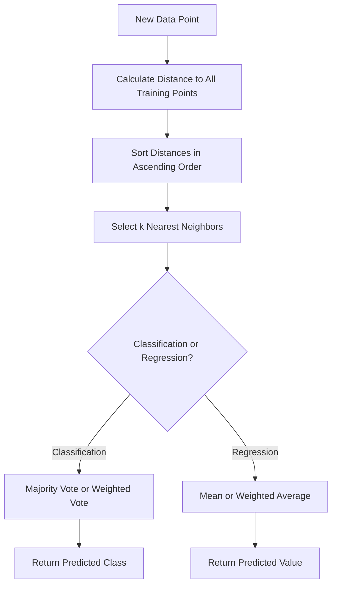

# 🔍 K-Nearest Neighbors (K-NN)

<div align="center">


*A Simple Yet Powerful Instance-Based Learning Algorithm*

</div>

---

## 📚 Table of Contents

- [What is K-Nearest Neighbors?](#what-is-k-nearest-neighbors)
- [Mathematical Foundation](#mathematical-foundation)
- [How It Works](#how-it-works)
- [Assumptions](#assumptions)
- [Implementation Guide](#implementation-guide)
- [Model Evaluation](#model-evaluation)
- [Pros and Cons](#pros-and-cons)
- [Real-World Examples](#real-world-examples)
- [Advanced Topics](#advanced-topics)
- [FAQ](#faq)

---

## 🎯 What is K-Nearest Neighbors?

**K-Nearest Neighbors (K-NN)** is a simple, versatile, and intuitive machine learning algorithm used for both classification and regression. It belongs to the family of instance-based, non-parametric learning algorithms that make decisions based on the entire training dataset rather than learning an explicit model.

### Key Characteristics:
- **Instance-Based Learning**: Stores all training examples instead of creating a generalized model
- **Lazy Learning**: No explicit training phase; computation deferred until prediction time
- **Non-Parametric**: Makes no assumptions about the underlying data distribution
- **Versatile**: Works for both classification and regression problems
- **Intuitive**: Based on the simple concept of similarity between data points

### The Goal:
Predict the class or value of a new data point based on the "k" most similar data points in the training dataset.

---

## 🧮 Mathematical Foundation

### Distance Metrics

The core of K-NN is measuring similarity through distance. Common distance metrics include:

#### 1. Euclidean Distance (L2 norm)
The most common distance metric, representing the straight-line distance between two points:

```
d(p, q) = √(Σᵢ(pᵢ - qᵢ)²)
```

#### 2. Manhattan Distance (L1 norm)
Sum of absolute differences between coordinates:

```
d(p, q) = Σᵢ|pᵢ - qᵢ|
```

#### 3. Minkowski Distance
Generalization of Euclidean and Manhattan distances:

```
d(p, q) = (Σᵢ|pᵢ - qᵢ|ᵖ)^(1/p)
```
- When p=1: Manhattan distance
- When p=2: Euclidean distance

#### 4. Hamming Distance
Counts positions where corresponding symbols differ (useful for categorical features):

```
d(p, q) = (number of positions where pᵢ ≠ qᵢ) / total positions
```

### Voting Mechanisms

#### For Classification
- **Majority Vote**: The most common class among the k neighbors is assigned
- **Weighted Vote**: Neighbors are weighted by their distance (closer neighbors have more influence)

```
Weight = 1 / distance²
```

#### For Regression
- **Mean Value**: Average of the values of k neighbors
- **Weighted Mean**: Distance-weighted average of k neighbors

```
ŷ = Σᵢ(yᵢ × wᵢ) / Σᵢwᵢ
```
where wᵢ is the weight of neighbor i (often the inverse of distance).

---

## ⚙️ How It Works

### Step-by-Step Process:

<div align="center">



</div>

### 1. **Data Preparation**
```python
# Example dataset
X_train = [[2.1, 1.5], [1.5, 2.2], [3.1, 2.1], [2.3, 3.2], [2.9, 3.1]]  # Features
y_train = [0, 0, 1, 1, 1]  # Class labels
```

### 2. **Calculate Distances**
```python
def euclidean_distance(point1, point2):
    """Calculate Euclidean distance between two points."""
    return sum((p1 - p2) ** 2 for p1, p2 in zip(point1, point2)) ** 0.5

def get_distances(X_train, x_test):
    """Calculate distances from test point to all training points."""
    return [euclidean_distance(x_test, x) for x in X_train]
```

### 3. **Find k Nearest Neighbors**
```python
def get_k_neighbors(X_train, y_train, x_test, k):
    """Find k nearest neighbors of test point."""
    # Calculate distances
    distances = get_distances(X_train, x_test)
    
    # Get sorted indices
    sorted_indices = sorted(range(len(distances)), key=lambda i: distances[i])
    
    # Get k nearest neighbors
    k_indices = sorted_indices[:k]
    k_distances = [distances[i] for i in k_indices]
    k_labels = [y_train[i] for i in k_indices]
    
    return k_indices, k_distances, k_labels
```

### 4. **Make Prediction**
```python
def predict_classification(k_labels):
    """Predict class by majority vote."""
    from collections import Counter
    # Count occurrences of each class
    counter = Counter(k_labels)
    # Return most common class
    return counter.most_common(1)[0][0]

def predict_regression(k_labels, k_distances):
    """Predict value by distance-weighted average."""
    # Calculate weights as inverse of distances
    weights = [1.0 / max(d, 1e-10) for d in k_distances]  # Avoid division by zero
    # Calculate weighted average
    weighted_sum = sum(w * y for w, y in zip(weights, k_labels))
    weight_sum = sum(weights)
    return weighted_sum / weight_sum
```

### 5. **Full Example**
```python
def knn_predict(X_train, y_train, x_test, k=3, problem_type='classification'):
    """Predict using k-NN algorithm."""
    # Find k nearest neighbors
    _, k_distances, k_labels = get_k_neighbors(X_train, y_train, x_test, k)
    
    # Make prediction based on problem type
    if problem_type == 'classification':
        return predict_classification(k_labels)
    else:  # regression
        return predict_regression(k_labels, k_distances)
        
# Example prediction
x_test = [2.5, 2.5]
prediction = knn_predict(X_train, y_train, x_test, k=3)
print(f"Predicted class: {prediction}")
```

---

## 📋 Assumptions

K-NN has fewer assumptions compared to many other algorithms, but it still has some key considerations:

### 1. **Feature Similarity is Meaningful** 🔵
- Distance in feature space represents similarity between instances
- **Check**: Domain knowledge validation and feature engineering

### 2. **Equal Feature Importance** 🟢
- All features contribute equally to the distance calculation
- **Check**: Feature importance analysis, feature scaling

### 3. **Local Decision Boundaries** 🟡
- Assumes that data points close to each other in feature space belong to the same class
- **Check**: Neighborhood analysis, local density exploration

### 4. **Sufficient Training Data** 🟠
- Needs enough training examples to represent the problem space
- **Check**: Learning curve analysis, data adequacy tests

### 5. **Balanced Classes** 🔴
- Class imbalance can bias predictions toward majority class
- **Check**: Class distribution analysis, specialized sampling

### 6. **Feature Scale Sensitivity** 🟣
- Features with larger scales will dominate the distance calculation
- **Check**: Scale or normalize features to similar ranges

---

## 💻 Implementation Guide

### From Scratch Implementation

```python
import numpy as np
from collections import Counter
from typing import Tuple, List, Union, Literal

class KNearestNeighbors:
    def __init__(self, k: int = 5, problem_type: Literal['classification', 'regression'] = 'classification', 
                 distance_metric: Literal['euclidean', 'manhattan', 'minkowski'] = 'euclidean',
                 p: float = 2, weighted: bool = False):
        """
        Initialize K-Nearest Neighbors model.
        
        Parameters:
        k (int): Number of neighbors to use
        problem_type (str): Either 'classification' or 'regression'
        distance_metric (str): The distance metric to use ('euclidean', 'manhattan', 'minkowski')
        p (float): Power parameter for Minkowski distance
        weighted (bool): Whether to use distance-weighted voting
        """
        self.k = k
        self.problem_type = problem_type
        self.distance_metric = distance_metric
        self.p = p
        self.weighted = weighted
        self.X_train = None
        self.y_train = None
        self.fitted = False
    
    def fit(self, X: np.ndarray, y: np.ndarray) -> 'KNearestNeighbors':
        """
        Store the training data. No actual training occurs in K-NN.
        
        Parameters:
        X (array-like): Training feature matrix
        y (array-like): Target values
        
        Returns:
        self: Returns the instance itself
        """
        self.X_train = np.array(X)
        self.y_train = np.array(y)
        self.fitted = True
        return self
    
    def _calculate_distance(self, x1: np.ndarray, x2: np.ndarray) -> float:
        """Calculate distance between two points based on the selected metric."""
        if self.distance_metric == 'euclidean':
            return np.sqrt(np.sum((x1 - x2) ** 2))
        elif self.distance_metric == 'manhattan':
            return np.sum(np.abs(x1 - x2))
        elif self.distance_metric == 'minkowski':
            return np.power(np.sum(np.power(np.abs(x1 - x2), self.p)), 1/self.p)
        else:
            raise ValueError(f"Unsupported distance metric: {self.distance_metric}")
    
    def _get_neighbors(self, x: np.ndarray) -> Tuple[np.ndarray, np.ndarray, np.ndarray]:
        """Find k nearest neighbors of a point."""
        # Calculate distances from x to all training points
        distances = np.array([self._calculate_distance(x, x_train) for x_train in self.X_train])
        
        # Get indices of k nearest neighbors
        nearest_indices = np.argsort(distances)[:self.k]
        
        # Get corresponding distances and labels
        nearest_distances = distances[nearest_indices]
        nearest_labels = self.y_train[nearest_indices]
        
        return nearest_indices, nearest_distances, nearest_labels
    
    def _predict_single(self, x: np.ndarray) -> Union[int, float]:
        """Make prediction for a single data point."""
        if not self.fitted:
            raise ValueError("Model must be fitted before making predictions")
        
        # Find k nearest neighbors
        _, distances, labels = self._get_neighbors(x)
        
        if self.problem_type == 'classification':
            if self.weighted:
                # Weighted voting (weights = 1/distance)
                weights = 1.0 / (distances + 1e-10)  # Add small constant to avoid division by zero
                unique_labels = np.unique(labels)
                weighted_votes = {}
                
                for label in unique_labels:
                    weighted_votes[label] = np.sum(weights[labels == label])
                
                # Return label with highest weighted vote
                return max(weighted_votes, key=weighted_votes.get)
            else:
                # Simple majority voting
                return Counter(labels).most_common(1)[0][0]
        else:  # regression
            if self.weighted:
                # Weighted average
                weights = 1.0 / (distances + 1e-10)
                return np.sum(labels * weights) / np.sum(weights)
            else:
                # Simple average
                return np.mean(labels)
    
    def predict(self, X: np.ndarray) -> np.ndarray:
        """
        Make predictions for multiple data points.
        
        Parameters:
        X (array-like): Test feature matrix
        
        Returns:
        array: Predicted values
        """
        X = np.array(X)
        return np.array([self._predict_single(x) for x in X])
    
    def score(self, X: np.ndarray, y: np.ndarray) -> float:
        """
        Calculate accuracy score for classification or R² for regression.
        
        Parameters:
        X (array-like): Test feature matrix
        y (array-like): True target values
        
        Returns:
        float: Performance score
        """
        y_pred = self.predict(X)
        y = np.array(y)
        
        if self.problem_type == 'classification':
            # Accuracy for classification
            return np.mean(y_pred == y)
        else:
            # R² score for regression
            y_mean = np.mean(y)
            ss_total = np.sum((y - y_mean) ** 2)
            ss_residual = np.sum((y - y_pred) ** 2)
            
            if ss_total == 0:
                return 0  # Avoid division by zero
            
            return 1 - (ss_residual / ss_total)
    
    def __str__(self) -> str:
        """Return string representation of the model."""
        return f"KNearestNeighbors(k={self.k}, problem_type='{self.problem_type}', " + \
               f"distance_metric='{self.distance_metric}', weighted={self.weighted})"
```

### Using Scikit-learn

```python
from sklearn.neighbors import KNeighborsClassifier, KNeighborsRegressor
from sklearn.metrics import accuracy_score, r2_score
import numpy as np

# Sample data
X = np.array([[2.1, 1.5], [1.5, 2.2], [3.1, 2.1], [2.3, 3.2], [2.9, 3.1]])
y = np.array([0, 0, 1, 1, 1])  # Class labels

# Create and fit model (for classification)
knn_clf = KNeighborsClassifier(n_neighbors=3, weights='uniform')
knn_clf.fit(X, y)

# Make predictions
x_test = np.array([[2.5, 2.5]])
y_pred = knn_clf.predict(x_test)
y_prob = knn_clf.predict_proba(x_test)  # Class probabilities

print(f"Predicted class: {y_pred[0]}")
print(f"Class probabilities: {y_prob[0]}")

# For regression
y_reg = np.array([2.3, 3.1, 4.2, 5.7, 6.1])  # Continuous values
knn_reg = KNeighborsRegressor(n_neighbors=3, weights='distance')
knn_reg.fit(X, y_reg)

y_reg_pred = knn_reg.predict(x_test)
print(f"Predicted value: {y_reg_pred[0]:.2f}")
```

### Complete Example with Visualization

```python
import numpy as np
import matplotlib.pyplot as plt
from sklearn.neighbors import KNeighborsClassifier
from sklearn.model_selection import train_test_split
from sklearn.datasets import make_classification
from sklearn.preprocessing import StandardScaler
from sklearn.metrics import classification_report, confusion_matrix
from matplotlib.colors import ListedColormap

# Generate sample data
X, y = make_classification(
    n_samples=300,
    n_features=2,  # 2D for visualization
    n_informative=2,
    n_redundant=0,
    n_classes=2,
    random_state=42
)

# Split data into train and test sets
X_train, X_test, y_train, y_test = train_test_split(X, y, test_size=0.3, random_state=42)

# Scale features
scaler = StandardScaler()
X_train_scaled = scaler.fit_transform(X_train)
X_test_scaled = scaler.transform(X_test)

# Test different values of k
k_values = [1, 3, 5, 7, 15, 25]
plt.figure(figsize=(15, 12))

for i, k in enumerate(k_values):
    # Create and train model
    knn = KNeighborsClassifier(n_neighbors=k)
    knn.fit(X_train_scaled, y_train)
    
    # Make predictions
    y_pred = knn.predict(X_test_scaled)
    accuracy = knn.score(X_test_scaled, y_test)
    
    # Plot decision boundaries
    plt.subplot(2, 3, i+1)
    
    # Define mesh grid for visualization
    h = 0.02  # step size in the mesh
    x_min, x_max = X_test_scaled[:, 0].min() - 1, X_test_scaled[:, 0].max() + 1
    y_min, y_max = X_test_scaled[:, 1].min() - 1, X_test_scaled[:, 1].max() + 1
    xx, yy = np.meshgrid(np.arange(x_min, x_max, h),
                         np.arange(y_min, y_max, h))
    
    # Predict on the mesh grid
    Z = knn.predict(np.c_[xx.ravel(), yy.ravel()])
    Z = Z.reshape(xx.shape)
    
    # Create colormap
    cmap_light = ListedColormap(['#FFAAAA', '#AAAAFF'])
    cmap_bold = ListedColormap(['#FF0000', '#0000FF'])
    
    # Plot decision boundaries and testing points
    plt.contourf(xx, yy, Z, alpha=0.3, cmap=cmap_light)
    plt.scatter(X_test_scaled[:, 0], X_test_scaled[:, 1], c=y_test, 
                cmap=cmap_bold, edgecolor='k', s=50, alpha=0.7)
    plt.title(f"k = {k}, Accuracy = {accuracy:.3f}")
    plt.xlabel('Feature 1')
    plt.ylabel('Feature 2')
    plt.tight_layout()

plt.suptitle("K-NN with Different Values of k", fontsize=16)
plt.subplots_adjust(top=0.92)
plt.show()

# Evaluate best model (choosing k=5 based on performance)
best_k = 5
best_knn = KNeighborsClassifier(n_neighbors=best_k)
best_knn.fit(X_train_scaled, y_train)
y_pred = best_knn.predict(X_test_scaled)

# Display evaluation metrics
print(f"Classification Report (k={best_k}):")
print(classification_report(y_test, y_pred))

# Plot confusion matrix
cm = confusion_matrix(y_test, y_pred)
plt.figure(figsize=(8, 6))
plt.imshow(cm, interpolation='nearest', cmap=plt.cm.Blues)
plt.title(f'Confusion Matrix (k={best_k})')
plt.colorbar()

classes = ['Class 0', 'Class 1']
tick_marks = np.arange(len(classes))
plt.xticks(tick_marks, classes)
plt.yticks(tick_marks, classes)

# Add text annotations
thresh = cm.max() / 2
for i in range(cm.shape[0]):
    for j in range(cm.shape[1]):
        plt.text(j, i, format(cm[i, j], 'd'),
                horizontalalignment="center",
                color="white" if cm[i, j] > thresh else "black")

plt.ylabel('True Label')
plt.xlabel('Predicted Label')
plt.tight_layout()
plt.show()

# Example of choosing optimal k using cross-validation
from sklearn.model_selection import cross_val_score
import pandas as pd

# Test different k values
k_range = range(1, 31)
k_scores = []

for k in k_range:
    knn = KNeighborsClassifier(n_neighbors=k)
    scores = cross_val_score(knn, X_train_scaled, y_train, cv=10, scoring='accuracy')
    k_scores.append(scores.mean())

# Plot k vs. cross-validated accuracy
plt.figure(figsize=(10, 6))
plt.plot(k_range, k_scores, 'o-', linewidth=2, markersize=8)
plt.axvline(x=k_scores.index(max(k_scores))+1, color='red', linestyle='--')
plt.xlabel('Number of Neighbors (k)')
plt.ylabel('Cross-Validated Accuracy')
plt.title('Accuracy vs. k for K-NN')
plt.grid(True, alpha=0.3)
plt.show()

print(f"Optimal k: {k_scores.index(max(k_scores))+1}")
print(f"Best cross-validated accuracy: {max(k_scores):.4f}")
```

---

## 📊 Model Evaluation

### Key Metrics for Classification

#### 1. **Accuracy**
```python
def accuracy(y_true, y_pred):
    """Proportion of correct predictions."""
    return np.mean(y_true == y_pred)
```

#### 2. **Confusion Matrix**
```python
def confusion_matrix(y_true, y_pred):
    """Create confusion matrix for binary classification."""
    tp = np.sum((y_true == 1) & (y_pred == 1))
    tn = np.sum((y_true == 0) & (y_pred == 0))
    fp = np.sum((y_true == 0) & (y_pred == 1))
    fn = np.sum((y_true == 1) & (y_pred == 0))
    
    return np.array([[tn, fp], [fn, tp]])
```

#### 3. **Precision, Recall, and F1-Score**
```python
def precision(y_true, y_pred):
    """Precision = TP / (TP + FP)"""
    tp = np.sum((y_true == 1) & (y_pred == 1))
    fp = np.sum((y_true == 0) & (y_pred == 1))
    return tp / (tp + fp) if (tp + fp) > 0 else 0

def recall(y_true, y_pred):
    """Recall = TP / (TP + FN)"""
    tp = np.sum((y_true == 1) & (y_pred == 1))
    fn = np.sum((y_true == 1) & (y_pred == 0))
    return tp / (tp + fn) if (tp + fn) > 0 else 0

def f1_score(y_true, y_pred):
    """F1 Score = 2 * (Precision * Recall) / (Precision + Recall)"""
    prec = precision(y_true, y_pred)
    rec = recall(y_true, y_pred)
    return 2 * prec * rec / (prec + rec) if (prec + rec) > 0 else 0
```

### Key Metrics for Regression

#### 1. **Mean Absolute Error (MAE)**
```python
def mae(y_true, y_pred):
    """Average absolute difference between predictions and actual values."""
    return np.mean(np.abs(y_true - y_pred))
```

#### 2. **Mean Squared Error (MSE)**
```python
def mse(y_true, y_pred):
    """Average squared difference between predictions and actual values."""
    return np.mean((y_true - y_pred) ** 2)
```

#### 3. **R-squared (R²)**
```python
def r2_score(y_true, y_pred):
    """Proportion of variance in the dependent variable predictable from independent variables."""
    y_mean = np.mean(y_true)
    ss_total = np.sum((y_true - y_mean) ** 2)
    ss_residual = np.sum((y_true - y_pred) ** 2)
    
    return 1 - (ss_residual / ss_total)
```

### Cross-Validation for K-NN

```python
def knn_cross_validation(X, y, k_values, n_splits=5, problem_type='classification'):
    """
    Perform cross-validation for K-NN across different values of k.
    
    Parameters:
    X (array-like): Feature matrix
    y (array-like): Target values
    k_values (list): List of k values to test
    n_splits (int): Number of cross-validation splits
    problem_type (str): 'classification' or 'regression'
    
    Returns:
    dict: Mean scores for each k value
    """
    from sklearn.model_selection import KFold
    import numpy as np
    
    # Initialize KFold
    kf = KFold(n_splits=n_splits, shuffle=True, random_state=42)
    
    # Dictionary to store results
    cv_scores = {k: [] for k in k_values}
    
    # Loop through each fold
    for train_idx, test_idx in kf.split(X):
        # Split data for this fold
        X_train_fold, X_test_fold = X[train_idx], X[test_idx]
        y_train_fold, y_test_fold = y[train_idx], y[test_idx]
        
        # Test each k value
        for k in k_values:
            # Create and train model
            model = KNearestNeighbors(k=k, problem_type=problem_type)
            model.fit(X_train_fold, y_train_fold)
            
            # Evaluate
            score = model.score(X_test_fold, y_test_fold)
            cv_scores[k].append(score)
    
    # Calculate mean scores
    mean_scores = {k: np.mean(scores) for k, scores in cv_scores.items()}
    
    return mean_scores
```

### Diagnostic Plots

```python
def knn_diagnostic_plots(X, y, knn_classifier, is_test_data=False):
    """Create diagnostic plots for K-NN classifier."""
    # Make predictions
    y_pred = knn_classifier.predict(X)
    
    if hasattr(knn_classifier, 'predict_proba'):
        y_prob = knn_classifier.predict_proba(X)
    else:
        # If using custom implementation without predict_proba
        y_prob = None
    
    # Create plots
    fig, axes = plt.subplots(2, 2, figsize=(12, 10))
    
    # 1. Decision boundary visualization (works for 2D data)
    if X.shape[1] == 2:
        # Define mesh grid
        h = 0.02  # step size in the mesh
        x_min, x_max = X[:, 0].min() - 1, X[:, 0].max() + 1
        y_min, y_max = X[:, 1].min() - 1, X[:, 1].max() + 1
        xx, yy = np.meshgrid(np.arange(x_min, x_max, h),
                            np.arange(y_min, y_max, h))
        
        # Predict on mesh grid
        Z = knn_classifier.predict(np.c_[xx.ravel(), yy.ravel()])
        Z = Z.reshape(xx.shape)
        
        # Plot decision boundary
        cmap_light = ListedColormap(['#FFAAAA', '#AAAAFF', '#AAFFAA', '#FFFFAA'])
        cmap_bold = ListedColormap(['#FF0000', '#0000FF', '#00FF00', '#FFFF00'])
        
        axes[0, 0].contourf(xx, yy, Z, alpha=0.3, cmap=cmap_light)
        axes[0, 0].scatter(X[:, 0], X[:, 1], c=y, cmap=cmap_bold, edgecolor='k', s=50)
        axes[0, 0].set_title('Decision Boundary Visualization')
        axes[0, 0].set_xlabel('Feature 1')
        axes[0, 0].set_ylabel('Feature 2')
    else:
        axes[0, 0].text(0.5, 0.5, "Decision boundary visualization\nrequires 2D data", 
                       ha='center', va='center', fontsize=12)
        axes[0, 0].set_xticks([])
        axes[0, 0].set_yticks([])
    
    # 2. Confusion Matrix
    cm = confusion_matrix(y, y_pred)
    axes[0, 1].imshow(cm, interpolation='nearest', cmap=plt.cm.Blues)
    axes[0, 1].set_title('Confusion Matrix')
    
    # Add text annotations to confusion matrix
    thresh = cm.max() / 2
    for i in range(cm.shape[0]):
        for j in range(cm.shape[1]):
            axes[0, 1].text(j, i, format(cm[i, j], 'd'),
                          ha="center", va="center",
                          color="white" if cm[i, j] > thresh else "black")
    
    axes[0, 1].set_ylabel('True Label')
    axes[0, 1].set_xlabel('Predicted Label')
    
    # 3. Accuracy vs k plot (if test data)
    if is_test_data:
        k_range = range(1, min(21, len(X)))
        k_scores = []
        
        for k in k_range:
            knn = KNearestNeighbors(k=k)
            knn.fit(X, y)
            score = knn.score(X, y)
            k_scores.append(score)
        
        axes[1, 0].plot(k_range, k_scores, 'o-', linewidth=2)
        axes[1, 0].set_xlabel('Number of Neighbors (k)')
        axes[1, 0].set_ylabel('Accuracy')
        axes[1, 0].set_title('Accuracy vs. k')
        axes[1, 0].grid(True, alpha=0.3)
    else:
        axes[1, 0].text(0.5, 0.5, "Accuracy vs. k plot\nrequires test data", 
                       ha='center', va='center', fontsize=12)
        axes[1, 0].set_xticks([])
        axes[1, 0].set_yticks([])
    
    # 4. Classification Report as Text
    from sklearn.metrics import classification_report
    report = classification_report(y, y_pred)
    axes[1, 1].text(0.1, 0.1, report, fontsize=10, family='monospace')
    axes[1, 1].set_title('Classification Report')
    axes[1, 1].set_xticks([])
    axes[1, 1].set_yticks([])
    
    plt.tight_layout()
    plt.show()
```

---

## ✅ Pros and Cons

<div align="center">

| ✅ **Advantages** | ❌ **Disadvantages** |
|-------------------|---------------------|
| **Simple and Intuitive** | **Computationally Expensive** |
| Easy to understand and implement | Distance calculation for all training points |
| **No Training Phase** | **High Memory Requirements** |
| Quick to "learn" (just stores data) | Must store entire training dataset |
| **Non-Parametric** | **Curse of Dimensionality** |
| No assumptions about data distribution | Performance degrades in high dimensions |
| **Naturally Handles Multi-Class** | **Sensitive to Scale** |
| Extends easily beyond binary classification | Features must be on similar scales |
| **Effective for Small Datasets** | **Imbalanced Data Problems** |
| Works well when data is limited | Biased toward majority class |
| **Dynamic Model** | **Sensitive to Noisy Data** |
| Automatically adapts as training data grows | Outliers can significantly affect predictions |
| **Works for Classification & Regression** | **Optimal k Selection** |
| Versatile algorithm for various tasks | Requires careful tuning of hyperparameters |

</div>

### When to Use K-Nearest Neighbors:

✅ **Good Choice When:**
- Dataset is small to medium-sized
- Relationships between features are complex/non-linear
- Quick implementation is needed
- You need a non-parametric approach
- Features naturally represent similarity
- Low to moderate dimensionality
- Real-time learning needed (can easily add new examples)

❌ **Avoid When:**
- Dataset is very large (slow predictions)
- High-dimensional data (curse of dimensionality)
- Memory is limited (must store all training data)
- Fast prediction speed is required
- Data contains many irrelevant features
- Training dataset is highly imbalanced

---

## 🌍 Real-World Examples

### Example 1: Handwritten Digit Recognition
```python
# Recognizing handwritten digits using K-NN
from sklearn.datasets import load_digits
from sklearn.neighbors import KNeighborsClassifier
from sklearn.model_selection import train_test_split
from sklearn.preprocessing import StandardScaler
from sklearn.metrics import classification_report, confusion_matrix
import matplotlib.pyplot as plt
import numpy as np

# Load digits dataset
digits = load_digits()
X = digits.data
y = digits.target

# Split data
X_train, X_test, y_train, y_test = train_test_split(X, y, test_size=0.3, random_state=42)

# Scale features
scaler = StandardScaler()
X_train_scaled = scaler.fit_transform(X_train)
X_test_scaled = scaler.transform(X_test)

# Create and train model
knn = KNeighborsClassifier(n_neighbors=5)
knn.fit(X_train_scaled, y_train)

# Evaluate model
y_pred = knn.predict(X_test_scaled)
accuracy = knn.score(X_test_scaled, y_test)

print(f"Digit Recognition with K-NN (k=5)")
print(f"Accuracy: {accuracy:.4f}")
print("\nClassification Report:")
print(classification_report(y_test, y_pred))

# Plot confusion matrix
cm = confusion_matrix(y_test, y_pred)
plt.figure(figsize=(10, 8))
plt.imshow(cm, interpolation='nearest', cmap=plt.cm.Blues)
plt.title('Confusion Matrix for Digit Recognition')
plt.colorbar()

# Add labels
digit_classes = np.arange(10)
tick_marks = np.arange(len(digit_classes))
plt.xticks(tick_marks, digit_classes)
plt.yticks(tick_marks, digit_classes)
plt.ylabel('True Digit')
plt.xlabel('Predicted Digit')

# Add text annotations
thresh = cm.max() / 2
for i in range(cm.shape[0]):
    for j in range(cm.shape[1]):
        plt.text(j, i, format(cm[i, j], 'd'),
                ha="center", va="center",
                color="white" if cm[i, j] > thresh else "black")

plt.tight_layout()
plt.show()

# Visualize misclassified examples
misclassified_idx = np.where(y_pred != y_test)[0]
fig, axes = plt.subplots(2, 5, figsize=(12, 5))
axes = axes.flatten()

for i, idx in enumerate(np.random.choice(misclassified_idx, min(10, len(misclassified_idx)), replace=False)):
    img = X_test[idx].reshape(8, 8)
    axes[i].imshow(img, cmap='gray')
    axes[i].set_title(f'True: {y_test[idx]}, Pred: {y_pred[idx]}')
    axes[i].axis('off')

plt.suptitle('Misclassified Digits', fontsize=16)
plt.tight_layout()
plt.subplots_adjust(top=0.88)
plt.show()

# Find optimal k
k_range = range(1, 21)
k_scores = []

for k in k_range:
    knn = KNeighborsClassifier(n_neighbors=k)
    knn.fit(X_train_scaled, y_train)
    k_scores.append(knn.score(X_test_scaled, y_test))

# Plot k vs accuracy
plt.figure(figsize=(10, 6))
plt.plot(k_range, k_scores, 'o-', linewidth=2, markersize=8)
plt.axvline(x=np.argmax(k_scores)+1, color='red', linestyle='--')
plt.xlabel('Number of Neighbors (k)')
plt.ylabel('Accuracy')
plt.title('Accuracy vs. k for Digit Recognition')
plt.grid(True, alpha=0.3)
plt.show()

best_k = np.argmax(k_scores) + 1
print(f"Best k: {best_k}, Accuracy: {max(k_scores):.4f}")
```

### Example 2: Recommender System
```python
# Simple movie recommender system using K-NN
import numpy as np
import pandas as pd
from sklearn.neighbors import NearestNeighbors
import matplotlib.pyplot as plt

# Create synthetic movie rating data
np.random.seed(42)
n_users = 100
n_movies = 20

# Generate synthetic user-movie rating matrix
# 0 means not rated, 1-5 are ratings
ratings = np.zeros((n_users, n_movies))

# Each user rates some movies randomly
for user in range(n_users):
    # Number of movies rated by this user (between 5 and 15)
    n_rated = np.random.randint(5, 16)
    
    # Which movies are rated
    rated_movies = np.random.choice(n_movies, n_rated, replace=False)
    
    # Generate ratings (1-5)
    for movie in rated_movies:
        ratings[user, movie] = np.random.randint(1, 6)

# Create movie names
movies = [f"Movie {i+1}" for i in range(n_movies)]

# Create a user-item DataFrame
ratings_df = pd.DataFrame(ratings, columns=movies)

# Function to get movie recommendations for a user
def get_movie_recommendations(user_id, ratings_matrix, n_neighbors=5, n_recommendations=5):
    """
    Get movie recommendations for a user using K-NN.
    
    Parameters:
    user_id (int): User ID
    ratings_matrix (array): User-movie ratings matrix
    n_neighbors (int): Number of similar users to consider
    n_recommendations (int): Number of movies to recommend
    
    Returns:
    list: Recommended movies with predicted ratings
    """
    # Create a mask for non-zero (rated) entries
    mask = ratings_matrix > 0
    
    # Fill missing values with 0 for distance calculation
    filled_ratings = ratings_matrix.copy()
    
    # Find similar users using K-NN
    model = NearestNeighbors(n_neighbors=n_neighbors+1, algorithm='auto', metric='cosine')
    model.fit(filled_ratings)
    
    # Get distances and indices of k nearest neighbors
    distances, indices = model.kneighbors(filled_ratings[user_id].reshape(1, -1))
    
    # The first neighbor is the user itself, so we exclude it
    similar_users = indices.flatten()[1:]
    user_distances = distances.flatten()[1:]
    
    # Movies rated by target user
    user_rated_movies = np.where(mask[user_id])[0]
    
    # Find movies not rated by the target user
    user_unrated_movies = np.where(~mask[user_id])[0]
    
    # Calculate predicted ratings for unrated movies
    recommendations = []
    
    for movie in user_unrated_movies:
        # Users who rated this movie
        users_rated_movie = np.where(mask[:, movie])[0]
        
        # Find common users (similar users who rated this movie)
        common_users = np.intersect1d(similar_users, users_rated_movie)
        
        # Skip if no similar users rated this movie
        if len(common_users) == 0:
            continue
        
        # Calculate weighted rating based on similarity
        weights = 1 / (user_distances[np.isin(similar_users, common_users)] + 1e-8)
        ratings_for_movie = ratings_matrix[common_users, movie]
        
        predicted_rating = np.sum(ratings_for_movie * weights) / np.sum(weights)
        recommendations.append((movie, predicted_rating))
    
    # Sort recommendations by predicted rating
    recommendations.sort(key=lambda x: x[1], reverse=True)
    
    # Return top N recommendations
    return recommendations[:n_recommendations]

# Select a user for recommendation
target_user = 42

# Get recommended movies
recommendations = get_movie_recommendations(target_user, ratings, n_neighbors=10, n_recommendations=5)

# Display user's existing ratings
user_ratings = ratings[target_user]
rated_indices = np.where(user_ratings > 0)[0]
rated_movies = [(movies[idx], user_ratings[idx]) for idx in rated_indices]

print(f"User {target_user}'s Ratings:")
for movie, rating in rated_movies:
    print(f"{movie}: {rating}")

print("\nRecommended Movies:")
for movie_idx, predicted_rating in recommendations:
    print(f"{movies[movie_idx]}: Predicted Rating = {predicted_rating:.2f}")

# Visualize results
plt.figure(figsize=(12, 8))

# Plot existing ratings
plt.subplot(2, 1, 1)
existing_movies = [movies[idx] for idx in rated_indices]
existing_ratings = user_ratings[rated_indices]
colors = ['green' if r >= 4 else 'orange' if r >= 3 else 'red' for r in existing_ratings]

plt.bar(range(len(existing_movies)), existing_ratings, color=colors)
plt.xticks(range(len(existing_movies)), existing_movies, rotation=45, ha='right')
plt.ylim(0, 5.5)
plt.title(f"User {target_user}'s Movie Ratings")
plt.ylabel('Rating')
plt.grid(axis='y', alpha=0.3)

# Plot recommendations
plt.subplot(2, 1, 2)
recommended_movies = [movies[idx] for idx, _ in recommendations]
predicted_ratings = [rating for _, rating in recommendations]
plt.bar(range(len(recommended_movies)), predicted_ratings, color='blue', alpha=0.7)
plt.xticks(range(len(recommended_movies)), recommended_movies, rotation=45, ha='right')
plt.ylim(0, 5.5)
plt.title('Recommended Movies')
plt.ylabel('Predicted Rating')
plt.grid(axis='y', alpha=0.3)

plt.tight_layout()
plt.show()

# Visualize user similarity matrix
from sklearn.metrics.pairwise import cosine_similarity

# Calculate cosine similarity between users
user_similarity = cosine_similarity(ratings)

# Plot similarity matrix for a subset of users
user_subset = np.arange(max(0, target_user-10), min(n_users, target_user+11))
similarity_subset = user_similarity[user_subset[:, np.newaxis], user_subset]

plt.figure(figsize=(10, 8))
plt.imshow(similarity_subset, cmap='viridis')
plt.colorbar(label='Cosine Similarity')
plt.title(f'User Similarity Matrix Around User {target_user}')
plt.xlabel('User ID')
plt.ylabel('User ID')

# Mark target user
target_idx = np.where(user_subset == target_user)[0][0]
plt.plot(target_idx, target_idx, 'ro', markersize=10)

# Add user IDs as ticks
plt.xticks(range(len(user_subset)), user_subset)
plt.yticks(range(len(user_subset)), user_subset)

plt.grid(False)
plt.show()
```

### Example 3: Housing Price Prediction (Regression)
```python
# House price prediction using K-NN regression
from sklearn.datasets import fetch_california_housing
from sklearn.neighbors import KNeighborsRegressor
from sklearn.model_selection import train_test_split
from sklearn.preprocessing import StandardScaler
from sklearn.metrics import mean_squared_error, r2_score
import matplotlib.pyplot as plt
import numpy as np
import pandas as pd

# Load California housing dataset
housing = fetch_california_housing()
X = housing.data
y = housing.target

# Use a subset of features for demonstration
feature_names = housing.feature_names
X_subset = X[:, [0, 1, 2, 6]]  # MedInc, HouseAge, AveRooms, AveOccup
feature_subset = [feature_names[0], feature_names[1], feature_names[2], feature_names[6]]

# Split data
X_train, X_test, y_train, y_test = train_test_split(X_subset, y, test_size=0.3, random_state=42)

# Scale features
scaler = StandardScaler()
X_train_scaled = scaler.fit_transform(X_train)
X_test_scaled = scaler.transform(X_test)

# Try different values of k
k_values = [1, 3, 5, 7, 9, 11, 13, 15, 17, 19]
mse_scores = []
r2_scores = []

for k in k_values:
    knn_reg = KNeighborsRegressor(n_neighbors=k, weights='distance')
    knn_reg.fit(X_train_scaled, y_train)
    
    # Predict and evaluate
    y_pred = knn_reg.predict(X_test_scaled)
    mse = mean_squared_error(y_test, y_pred)
    r2 = r2_score(y_test, y_pred)
    
    mse_scores.append(mse)
    r2_scores.append(r2)
    
    print(f"k={k}: MSE={mse:.4f}, R²={r2:.4f}")

# Find best k
best_k_idx = np.argmax(r2_scores)
best_k = k_values[best_k_idx]
print(f"\nBest k: {best_k}, R²: {r2_scores[best_k_idx]:.4f}")

# Plot k vs performance
plt.figure(figsize=(12, 5))

plt.subplot(1, 2, 1)
plt.plot(k_values, mse_scores, 'o-', linewidth=2, markersize=8)
plt.xlabel('Number of Neighbors (k)')
plt.ylabel('Mean Squared Error')
plt.title('MSE vs. k')
plt.grid(True, alpha=0.3)

plt.subplot(1, 2, 2)
plt.plot(k_values, r2_scores, 'o-', linewidth=2, markersize=8)
plt.axvline(x=best_k, color='red', linestyle='--')
plt.xlabel('Number of Neighbors (k)')
plt.ylabel('R² Score')
plt.title('R² vs. k')
plt.grid(True, alpha=0.3)

plt.tight_layout()
plt.show()

# Train model with best k
best_knn = KNeighborsRegressor(n_neighbors=best_k, weights='distance')
best_knn.fit(X_train_scaled, y_train)
y_pred = best_knn.predict(X_test_scaled)

# Calculate metrics
mse = mean_squared_error(y_test, y_pred)
rmse = np.sqrt(mse)
r2 = r2_score(y_test, y_pred)
mae = np.mean(np.abs(y_test - y_pred))

print(f"\nModel Performance (k={best_k}):")
print(f"MSE: {mse:.4f}")
print(f"RMSE: {rmse:.4f}")
print(f"MAE: {mae:.4f}")
print(f"R²: {r2:.4f}")

# Visualize predictions vs actual values
plt.figure(figsize=(12, 6))

plt.subplot(1, 2, 1)
plt.scatter(y_test, y_pred, alpha=0.5)
plt.plot([y_test.min(), y_test.max()], [y_test.min(), y_test.max()], 'r--')
plt.xlabel('Actual Price')
plt.ylabel('Predicted Price')
plt.title('Actual vs. Predicted Housing Prices')
plt.grid(True, alpha=0.3)

# Plot residuals
plt.subplot(1, 2, 2)
residuals = y_test - y_pred
plt.scatter(y_pred, residuals, alpha=0.5)
plt.axhline(y=0, color='r', linestyle='--')
plt.xlabel('Predicted Price')
plt.ylabel('Residuals')
plt.title('Residual Plot')
plt.grid(True, alpha=0.3)

plt.tight_layout()
plt.show()

# Feature importance analysis through permutation
from sklearn.inspection import permutation_importance

result = permutation_importance(best_knn, X_test_scaled, y_test, n_repeats=10, random_state=42)
importance = pd.DataFrame({
    'Feature': feature_subset,
    'Importance': result.importances_mean,
    'Std': result.importances_std
}).sort_values('Importance', ascending=False)

plt.figure(figsize=(10, 6))
plt.bar(importance['Feature'], importance['Importance'], yerr=importance['Std'], capsize=10)
plt.xlabel('Feature')
plt.ylabel('Importance (Decrease in R² score)')
plt.title('Feature Importance using Permutation Importance')
plt.xticks(rotation=45)
plt.grid(axis='y', alpha=0.3)
plt.tight_layout()
plt.show()

print("\nFeature Importance:")
print(importance)
```

---

## 🔬 Advanced Topics

### 1. **Distance-Weighted K-NN**

Incorporate weights based on distance to make nearer neighbors more influential:

```python
def weighted_knn_predict(X_train, y_train, x_test, k=5, weight_func=None):
    """
    Make weighted K-NN prediction.
    
    Parameters:
    X_train, y_train: Training data
    x_test: Test point
    k: Number of neighbors
    weight_func: Function to calculate weights (default: inverse squared distance)
    
    Returns:
    Prediction
    """
    # Calculate distances
    distances = np.array([euclidean_distance(x_test, x) for x in X_train])
    
    # Get k nearest indices
    nearest_indices = np.argsort(distances)[:k]
    nearest_distances = distances[nearest_indices]
    nearest_labels = y_train[nearest_indices]
    
    # Default weight function: inverse squared distance
    if weight_func is None:
        def weight_func(d):
            return 1.0 / (d**2 + 1e-10)  # Add small constant to avoid division by zero
    
    # Calculate weights
    weights = np.array([weight_func(d) for d in nearest_distances])
    
    # For classification
    if len(np.unique(y_train)) < 10:  # Arbitrary threshold to detect classification
        # Count weighted votes for each class
        classes = np.unique(nearest_labels)
        class_weights = {c: np.sum(weights[nearest_labels == c]) for c in classes}
        
        # Return class with highest weight
        return max(class_weights, key=class_weights.get)
    # For regression
    else:
        # Weighted average
        return np.sum(weights * nearest_labels) / np.sum(weights)
```

### 2. **Locally Weighted Learning**

K-NN can be extended to locally weighted regression:

```python
def locally_weighted_regression(X_train, y_train, x_test, tau=1.0):
    """
    Perform locally weighted regression.
    
    Parameters:
    X_train, y_train: Training data
    x_test: Test point
    tau: Bandwidth parameter controlling locality
    
    Returns:
    Prediction
    """
    # Calculate distances
    distances = np.array([euclidean_distance(x_test, x) for x in X_train])
    
    # Calculate weights using Gaussian kernel
    weights = np.exp(-distances**2 / (2 * tau**2))
    
    # Add bias term to X
    X = np.hstack([np.ones((len(X_train), 1)), X_train])
    
    # Calculate weighted X^T*X and X^T*y
    W = np.diag(weights)
    XTW = X.T @ W
    XTWX = XTW @ X
    XTWy = XTW @ y_train
    
    # Calculate locally weighted coefficients
    try:
        beta = np.linalg.solve(XTWX, XTWy)
    except np.linalg.LinAlgError:
        # Fall back to pseudo-inverse if matrix is singular
        beta = np.linalg.pinv(XTWX) @ XTWy
    
    # Make prediction
    x_test_with_bias = np.hstack([1, x_test])
    return beta @ x_test_with_bias
```

### 3. **Approximate Nearest Neighbors**

For large datasets, exact K-NN becomes computationally expensive. Approximate methods like KD-Trees and Ball Trees can help:

```python
from sklearn.neighbors import KDTree

def kdtree_knn(X_train, y_train, x_test, k=5):
    """
    Use KD-Tree for efficient K-NN search.
    
    Parameters:
    X_train, y_train: Training data
    x_test: Test point
    k: Number of neighbors
    
    Returns:
    Indices, distances of nearest neighbors
    """
    # Build KD-Tree
    tree = KDTree(X_train)
    
    # Query tree
    distances, indices = tree.query(x_test.reshape(1, -1), k=k)
    
    # Return flattened arrays
    return indices.flatten(), distances.flatten()
```

### 4. **Handling Categorical Features**

K-NN requires distances, which can be tricky for categorical variables:

```python
def mixed_distance(x1, x2, categorical_mask):
    """
    Calculate distance with mixed numerical and categorical features.
    
    Parameters:
    x1, x2: Data points
    categorical_mask: Boolean mask for categorical features
    
    Returns:
    Combined distance
    """
    # Extract numerical and categorical parts
    num_x1 = x1[~categorical_mask]
    num_x2 = x2[~categorical_mask]
    cat_x1 = x1[categorical_mask]
    cat_x2 = x2[categorical_mask]
    
    # Euclidean distance for numerical features
    num_dist = euclidean_distance(num_x1, num_x2)
    
    # Hamming distance for categorical features
    cat_dist = np.sum(cat_x1 != cat_x2) / len(cat_x1) if len(cat_x1) > 0 else 0
    
    # Combine distances (you can adjust weights based on domain knowledge)
    combined_dist = np.sqrt(num_dist**2 + cat_dist**2)
    
    return combined_dist
```

### 5. **Dimensionality Reduction for K-NN**

Addressing the curse of dimensionality:

```python
from sklearn.decomposition import PCA

def pca_knn(X_train, y_train, X_test, n_components=2, k=5):
    """
    Apply PCA before K-NN to handle high-dimensional data.
    
    Parameters:
    X_train, y_train: Training data
    X_test: Test data
    n_components: Number of PCA components
    k: Number of neighbors
    
    Returns:
    Predictions
    """
    # Apply PCA
    pca = PCA(n_components=n_components)
    X_train_reduced = pca.fit_transform(X_train)
    X_test_reduced = pca.transform(X_test)
    
    # Apply K-NN
    knn = KNeighborsClassifier(n_neighbors=k)
    knn.fit(X_train_reduced, y_train)
    
    # Make predictions
    y_pred = knn.predict(X_test_reduced)
    
    # Calculate explained variance
    explained_variance = sum(pca.explained_variance_ratio_)
    print(f"PCA explained variance: {explained_variance:.4f}")
    
    return y_pred
```

---

## ❓ FAQ

### Q1: How do I choose the optimal value for k?

**A:** Choosing k involves balancing bias and variance:
- **Small k** (e.g., 1): Low bias, high variance, sensitive to noise
- **Large k** (e.g., 100): High bias, low variance, smooths out details

Approaches to select k:
1. **Cross-Validation**: The most reliable method
   ```python
   from sklearn.model_selection import cross_val_score
   k_range = range(1, 31, 2)
   cv_scores = [cross_val_score(KNeighborsClassifier(n_neighbors=k), X, y, cv=10).mean() for k in k_range]
   best_k = k_range[np.argmax(cv_scores)]
   ```

2. **Rule of Thumb**: k = sqrt(n), where n is the number of training samples
3. **Odd k for Binary Classification**: Avoids ties in voting

### Q2: How does K-NN handle the "curse of dimensionality"?

**A:** The curse of dimensionality severely affects K-NN:
- In high dimensions, all points become approximately equidistant
- Distance metrics become less meaningful
- Data becomes increasingly sparse

Solutions:
1. **Dimensionality Reduction**: PCA, t-SNE, or UMAP before K-NN
2. **Feature Selection**: Choose only relevant features
3. **Use specialized distance metrics**: Cosine similarity for text data
4. **Increase k**: In higher dimensions, larger k values often work better
5. **Consider other algorithms**: For very high dimensions, other algorithms may be more appropriate

### Q3: What is the difference between K-NN classification and regression?

**A:** The main difference is in how predictions are made:

**K-NN Classification**:
- Uses majority voting or weighted voting
- Returns discrete class labels
- Evaluation: Accuracy, F1-score, etc.

**K-NN Regression**:
- Uses average or weighted average of nearest neighbor values
- Returns continuous predictions
- Evaluation: RMSE, MAE, R², etc.

Implementation differences are minimal—just change how the final prediction is calculated.

### Q4: How can I speed up K-NN for large datasets?

**A:** K-NN can be computationally expensive for large datasets. Optimizations include:

1. **Use Efficient Data Structures**:
   - KD-Trees: Efficient for low to medium dimensions (< 20)
   - Ball Trees: Better for higher dimensions than KD-Trees
   - In scikit-learn: `algorithm='kd_tree'` or `algorithm='ball_tree'`

2. **Approximate Nearest Neighbors (ANN)**:
   - Libraries like Annoy, FAISS, or HNSW for very large datasets
   ```python
   from sklearn.neighbors import KNeighborsClassifier
   ann_model = KNeighborsClassifier(algorithm='kd_tree', leaf_size=30)
   ```

3. **Dimensionality Reduction**:
   - Reduce dimensions before applying K-NN

4. **Data Sampling**:
   - Use a representative subset for very large datasets

5. **Parallelization**:
   - Use `n_jobs=-1` in scikit-learn to utilize all cores

### Q5: How do I handle imbalanced data with K-NN?

**A:** Class imbalance can bias K-NN toward the majority class. Solutions include:

1. **Sampling Techniques**:
   - Undersample the majority class
   - Oversample the minority class
   - SMOTE (Synthetic Minority Over-sampling Technique)

2. **Distance-Weighted Voting**:
   ```python
   knn = KNeighborsClassifier(weights='distance')
   ```

3. **Adjusted Decision Threshold**:
   - Instead of majority vote, use probability estimates and adjust threshold

4. **Class-Weighted Distance**:
   - Modify the distance calculation to give more importance to minority class examples

5. **Anomaly Detection Approach**:
   - For extreme imbalance, treat it as an anomaly detection problem

### Q6: Can K-NN handle missing values?

**A:** K-NN doesn't natively handle missing values. Approaches include:

1. **Imputation**:
   - Mean/median/mode imputation before applying K-NN
   - Using KNN imputation (ironically) to fill missing values
   ```python
   from sklearn.impute import KNNImputer
   imputer = KNNImputer(n_neighbors=5)
   X_imputed = imputer.fit_transform(X)
   ```

2. **Modified Distance Functions**:
   - Adapt distance functions to ignore missing dimensions
   - Weight distances by the number of available features

3. **Indicator Features**:
   - Add binary features indicating whether a value was missing

### Q7: How is K-NN different from other classification algorithms?

**A:** K-NN has several distinctive characteristics:

- **No Training Phase**: K-NN is a lazy learner (stores data instead of learning a model)
- **Non-Parametric**: Makes no assumptions about data distribution
- **Instance-Based**: Decisions based on individual instances, not abstracted patterns
- **Memory-Based**: Requires storing all training data
- **Local Approximation**: Makes decisions based on local neighborhood, not global patterns
- **Decision Boundaries**: Adapts to complex, non-linear decision boundaries

### Q8: Can I use K-NN for time series data?

**A:** Yes, but with adaptations:

1. **Dynamic Time Warping (DTW)**: A specialized distance measure for time series
   ```python
   from dtaidistance import dtw
   
   def dtw_knn(X_train, y_train, x_test, k=3):
       """K-NN for time series using Dynamic Time Warping distance."""
       # Calculate DTW distances
       distances = [dtw.distance(x_test, x) for x in X_train]
       
       # Get k nearest neighbors
       nearest_indices = np.argsort(distances)[:k]
       nearest_labels = y_train[nearest_indices]
       
       # Return majority vote
       from collections import Counter
       return Counter(nearest_labels).most_common(1)[0][0]
   ```

2. **Sliding Window Approach**:
   - Convert time series to feature vectors using sliding windows
   - Apply standard K-NN to these feature vectors

3. **Feature Extraction**:
   - Extract statistical features (mean, variance, etc.) from time windows
   - Use these features with standard K-NN

4. **Specialized Time Series Libraries**:
   - Use libraries like `tslearn` that implement K-NN for time series
   ```python
   from tslearn.neighbors import KNeighborsTimeSeriesClassifier
   knn_ts = KNeighborsTimeSeriesClassifier(n_neighbors=3, metric="dtw")
   ```

5. **Seasonal Adjustment**:
   - Remove seasonality before comparing time series
   - Helps focus on underlying patterns rather than timing differences

---

## 📚 Additional Resources

### Books:
- **"Pattern Recognition and Machine Learning"** by Christopher Bishop
- **"Introduction to Statistical Learning"** by James, Witten, Hastie, and Tibshirani
- **"Data Mining: Concepts and Techniques"** by Han, Kamber, and Pei

### Online Resources:
- [Stanford CS231n: K-Nearest Neighbor Algorithm](https://cs231n.github.io/classification/#k-nearest-neighbor)
- [StatQuest: K-nearest neighbors, Clearly Explained](https://www.youtube.com/watch?v=HVXime0nQeI)
- [Scikit-learn Documentation: Nearest Neighbors](https://scikit-learn.org/stable/modules/neighbors.html)

### Python Libraries:
- **scikit-learn**: `sklearn.neighbors` module for standard K-NN
- **annoy**: Approximate nearest neighbors for large datasets
- **FAISS**: Facebook AI Similarity Search for efficient similarity search
- **tslearn**: Time series specific implementations of K-NN

---

## 🏗️ Project Structure

```
K-Nearest-Neighbors/
│
├── README.md                     # This comprehensive guide     
├── knn_classification.ipynb      # Classification examples
└── social-network-ads.csv         # Social Network dataset
```

---

<div align="center">

## 🌟 Key Takeaways

**K-Nearest Neighbors is:**
- A simple yet powerful non-parametric algorithm
- Effective for both classification and regression
- Intuitive and easy to implement
- Versatile across many different types of data
- A great baseline model for many machine learning tasks

**Remember:**
- Scale your features for best results
- Choose k carefully using cross-validation
- Consider dimensionality reduction for high-dimensional data
- Watch out for computational efficiency on large datasets
- Distance metrics matter—choose ones appropriate for your data

---

### 📖 Happy Learning with K-Nearest Neighbors! 🚀

*Created by [@danialasim](https://github.com/danialasim) | Last updated: July 9, 2025*

</div>