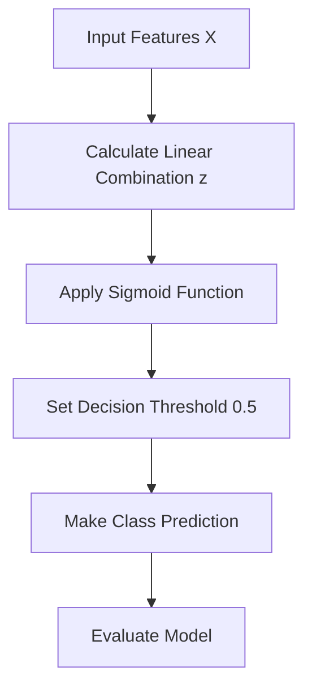

# 🔄 Logistic Regression

<div align="center">


*The Foundation of Classification Modeling*

</div>

---

## 📚 Table of Contents

- [What is Logistic Regression?](#what-is-logistic-regression)
- [Mathematical Foundation](#mathematical-foundation)
- [How It Works](#how-it-works)
- [Assumptions](#assumptions)
- [Implementation Guide](#implementation-guide)
- [Model Evaluation](#model-evaluation)
- [Pros and Cons](#pros-and-cons)
- [Real-World Examples](#real-world-examples)
- [Advanced Topics](#advanced-topics)
- [FAQ](#faq)

---

## 🎯 What is Logistic Regression?

**Logistic Regression** is a fundamental supervised learning algorithm used for binary classification problems. Despite its name, it's a classification algorithm, not a regression algorithm. It models the probability that a given input belongs to a certain class.

### Key Characteristics:
- **Probabilistic Classifier**: Outputs probabilities between 0 and 1
- **Linear Decision Boundary**: Creates a linear boundary between classes
- **Binary Output**: Traditionally used for two-class problems (can be extended)
- **Interpretable Model**: Coefficients have clear meaning

### The Goal:
Find the best-fitting S-shaped curve (logistic function) that maps input features to probability values, which can then be thresholded to make class predictions.

---

## 🧮 Mathematical Foundation

### The Logistic Function (Sigmoid)

The logistic regression model uses the sigmoid function to transform linear predictions into probabilities:

```
P(y=1|X) = σ(z) = 1 / (1 + e^(-z))
```

Where:
- **P(y=1|X)** = Probability that y=1 given features X
- **z** = Linear combination: β₀ + β₁x₁ + β₂x₂ + ... + βₙxₙ
- **σ** = Sigmoid function
- **e** = Euler's number (≈ 2.71828)

### The Linear Component

```
z = β₀ + β₁x₁ + β₂x₂ + ... + βₙxₙ
```

Where:
- **β₀** = Intercept (bias term)
- **β₁, β₂, ..., βₙ** = Coefficients for features
- **x₁, x₂, ..., xₙ** = Feature values

### The Odds and Log-Odds

```
Odds = P(y=1|X) / (1 - P(y=1|X))
```

Taking the natural logarithm:

```
Log-Odds = ln(Odds) = z = β₀ + β₁x₁ + β₂x₂ + ... + βₙxₙ
```

This is why logistic regression is a linear model in terms of log-odds!

### Maximum Likelihood Estimation

Unlike linear regression which uses ordinary least squares, logistic regression uses Maximum Likelihood Estimation (MLE) to find the best parameters:

```
L(β) = ∏ᵢ₌₁ⁿ [P(y=1|Xᵢ)]^yᵢ [1-P(y=1|Xᵢ)]^(1-yᵢ)
```

The log-likelihood is maximized:

```
ln(L(β)) = Σᵢ₌₁ⁿ [yᵢln(P(y=1|Xᵢ)) + (1-yᵢ)ln(1-P(y=1|Xᵢ))]
```

---

## ⚙️ How It Works

### Step-by-Step Process:



</div>

### 1. **Data Collection and Preparation**
```python
# Example dataset
X = [[0, 2], [1, 1], [2, 0], [3, 0], [3, 2]]  # Features: [x1, x2]
y = [0, 0, 0, 1, 1]  # Binary target (0 or 1)
```

### 2. **Initialize Parameters**
```python
# Start with random weights
import numpy as np
np.random.seed(42)
beta = np.random.randn(3)  # [β₀, β₁, β₂]
```

### 3. **Calculate Probabilities**
```python
def add_intercept(X):
    """Add intercept term to feature matrix."""
    intercept = np.ones((X.shape[0], 1))
    return np.concatenate((intercept, X), axis=1)

def sigmoid(z):
    """Apply sigmoid function."""
    return 1 / (1 + np.exp(-z))

def predict_proba(X, beta):
    """Calculate probabilities using sigmoid."""
    X_with_intercept = add_intercept(X)
    z = X_with_intercept.dot(beta)
    return sigmoid(z)
```

### 4. **Loss Function (Negative Log-Likelihood)**
```python
def log_likelihood(X, y, beta):
    """Calculate log-likelihood."""
    X_with_intercept = add_intercept(X)
    z = X_with_intercept.dot(beta)
    
    ll = np.sum(y * np.log(sigmoid(z)) + (1 - y) * np.log(1 - sigmoid(z)))
    return ll
```

### 5. **Gradient Calculation**
```python
def gradient(X, y, beta):
    """Calculate gradient of log-likelihood."""
    X_with_intercept = add_intercept(X)
    error = y - sigmoid(X_with_intercept.dot(beta))
    
    # Gradient is X^T * error
    gradient = X_with_intercept.T.dot(error)
    return gradient
```

### 6. **Parameter Optimization**
```python
def fit(X, y, lr=0.01, num_iterations=1000):
    """Fit logistic regression using gradient ascent."""
    X = np.array(X)
    y = np.array(y)
    
    # Initialize parameters
    beta = np.zeros(X.shape[1] + 1)  # +1 for intercept
    
    # Gradient ascent
    for i in range(num_iterations):
        grad = gradient(X, y, beta)
        beta += lr * grad
        
        # Optional: Print log-likelihood every 100 iterations
        if i % 100 == 0:
            ll = log_likelihood(X, y, beta)
            print(f"Iteration {i}: Log-likelihood = {ll}")
    
    return beta
```

### 7. **Final Model and Predictions**
```python
def predict(X, beta, threshold=0.5):
    """Make binary predictions based on probability threshold."""
    return predict_proba(X, beta) >= threshold
```

---

## 📋 Assumptions

Logistic Regression relies on several key assumptions:

### 1. **Binary Outcome** 🔵
- The dependent variable is binary (0/1, Yes/No, True/False)
- **Extension**: Can be extended to multi-class with strategies like one-vs-rest

### 2. **Independence** 🟢
- Observations are independent of each other
- **Check**: Domain knowledge and data collection method

### 3. **No Multicollinearity** 🟡
- Independent variables should not be highly correlated
- **Check**: Correlation matrix, VIF (Variance Inflation Factor)

### 4. **Linearity of Log-Odds** 🟠
- The log-odds should be linearly related to independent variables
- **Check**: Box-Tidwell test

### 5. **Large Sample Size** 🔴
- Rule of thumb: At least 10 events per predictor variable
- **Check**: Calculate events-per-variable ratio

### 6. **No Outliers** 🟣
- Extreme values can heavily influence the model
- **Check**: Standardized residuals, Cook's distance

---

## 💻 Implementation Guide

### From Scratch Implementation

```python
import numpy as np
import matplotlib.pyplot as plt
from typing import Tuple, List, Optional

class LogisticRegression:
    def __init__(self, learning_rate: float = 0.01, num_iterations: int = 1000):
        """
        Initialize Logistic Regression model.
        
        Parameters:
        learning_rate (float): Learning rate for gradient ascent
        num_iterations (int): Number of iterations for optimization
        """
        self.learning_rate = learning_rate
        self.num_iterations = num_iterations
        self.beta = None
        self.fitted = False
    
    def _add_intercept(self, X: np.ndarray) -> np.ndarray:
        """Add intercept term to feature matrix."""
        intercept = np.ones((X.shape[0], 1))
        return np.hstack((intercept, X))
    
    def _sigmoid(self, z: np.ndarray) -> np.ndarray:
        """Apply sigmoid function."""
        return 1 / (1 + np.exp(-z))
    
    def _log_likelihood(self, X: np.ndarray, y: np.ndarray) -> float:
        """Calculate log-likelihood."""
        z = np.dot(X, self.beta)
        ll = np.sum(y * np.log(self._sigmoid(z)) + 
                   (1 - y) * np.log(1 - self._sigmoid(z)))
        return ll
    
    def fit(self, X: np.ndarray, y: np.ndarray, verbose: bool = False) -> 'LogisticRegression':
        """
        Fit the logistic regression model using gradient ascent.
        
        Parameters:
        X (array-like): Feature matrix
        y (array-like): Binary target vector (0/1)
        verbose (bool): If True, print progress during training
        
        Returns:
        self: Returns the instance itself
        """
        X = np.array(X)
        y = np.array(y)
        
        # Add intercept
        X_with_intercept = self._add_intercept(X)
        
        # Initialize parameters
        self.beta = np.zeros(X_with_intercept.shape[1])
        
        # Gradient ascent
        for i in range(self.num_iterations):
            # Calculate probabilities
            z = np.dot(X_with_intercept, self.beta)
            h = self._sigmoid(z)
            
            # Calculate gradient
            gradient = np.dot(X_with_intercept.T, (y - h))
            
            # Update parameters
            self.beta += self.learning_rate * gradient
            
            # Optional: Print log-likelihood every 100 iterations
            if verbose and i % 100 == 0:
                ll = self._log_likelihood(X_with_intercept, y)
                print(f"Iteration {i}: Log-likelihood = {ll}")
        
        self.fitted = True
        return self
    
    def predict_proba(self, X: np.ndarray) -> np.ndarray:
        """
        Predict probability of the positive class.
        
        Parameters:
        X (array-like): Feature matrix
        
        Returns:
        array: Predicted probabilities
        """
        if not self.fitted:
            raise ValueError("Model must be fitted before making predictions")
        
        X = np.array(X)
        X_with_intercept = self._add_intercept(X)
        
        z = np.dot(X_with_intercept, self.beta)
        return self._sigmoid(z)
    
    def predict(self, X: np.ndarray, threshold: float = 0.5) -> np.ndarray:
        """
        Make binary predictions.
        
        Parameters:
        X (array-like): Feature matrix
        threshold (float): Probability threshold for positive class
        
        Returns:
        array: Binary predictions (0/1)
        """
        probabilities = self.predict_proba(X)
        return (probabilities >= threshold).astype(int)
    
    def score(self, X: np.ndarray, y: np.ndarray) -> float:
        """
        Calculate accuracy score.
        
        Parameters:
        X (array-like): Feature matrix
        y (array-like): True binary labels
        
        Returns:
        float: Accuracy score
        """
        y_pred = self.predict(X)
        return np.mean(y_pred == y)
    
    def __str__(self) -> str:
        """String representation of the model."""
        if not self.fitted:
            return "LogisticRegression(not fitted)"
        
        equation = f"log(p/(1-p)) = {self.beta[0]:.3f}"
        
        for i, coef in enumerate(self.beta[1:], 1):
            if coef >= 0:
                equation += f" + {coef:.3f}x{i}"
            else:
                equation += f" - {abs(coef):.3f}x{i}"
                
        return f"LogisticRegression({equation})"
```

### Using Scikit-learn

```python
from sklearn.linear_model import LogisticRegression
from sklearn.metrics import accuracy_score, classification_report, confusion_matrix
import numpy as np

# Sample data
X = np.array([[0, 2], [1, 1], [2, 0], [3, 0], [3, 2]])
y = np.array([0, 0, 0, 1, 1])

# Create and fit model
model = LogisticRegression(random_state=42)
model.fit(X, y)

# Make predictions
y_pred = model.predict(X)
y_prob = model.predict_proba(X)[:, 1]  # Probability of class 1

# Get parameters
intercept = model.intercept_[0]
coefs = model.coef_[0]

print(f"Equation: log(p/(1-p)) = {intercept:.3f} + {coefs[0]:.3f}x₁ + {coefs[1]:.3f}x₂")
print(f"Accuracy: {accuracy_score(y, y_pred):.3f}")
```

### Complete Example with Visualization

```python
import numpy as np
import matplotlib.pyplot as plt
from sklearn.linear_model import LogisticRegression
from sklearn.metrics import accuracy_score, confusion_matrix, roc_curve, auc
from sklearn.model_selection import train_test_split

# Generate sample data
np.random.seed(42)
n_samples = 100
class0_x = np.random.multivariate_normal([2, 2], [[1, 0.5], [0.5, 1]], n_samples)
class1_x = np.random.multivariate_normal([4, 4], [[1, 0.5], [0.5, 1]], n_samples)

X = np.vstack([class0_x, class1_x])
y = np.hstack([np.zeros(n_samples), np.ones(n_samples)])

# Split data into train and test sets
X_train, X_test, y_train, y_test = train_test_split(X, y, test_size=0.3, random_state=42)

# Fit logistic regression model
model = LogisticRegression()
model.fit(X_train, y_train)

# Make predictions
y_pred = model.predict(X_test)
y_prob = model.predict_proba(X_test)[:, 1]

# Create visualization
fig, ((ax1, ax2), (ax3, ax4)) = plt.subplots(2, 2, figsize=(14, 10))

# 1. Decision boundary visualization
x_min, x_max = X[:, 0].min() - 1, X[:, 0].max() + 1
y_min, y_max = X[:, 1].min() - 1, X[:, 1].max() + 1
xx, yy = np.meshgrid(np.arange(x_min, x_max, 0.1),
                    np.arange(y_min, y_max, 0.1))

Z = model.predict_proba(np.c_[xx.ravel(), yy.ravel()])[:, 1]
Z = Z.reshape(xx.shape)

ax1.contourf(xx, yy, Z, alpha=0.8, cmap=plt.cm.RdBu)
ax1.scatter(X_test[y_test==0, 0], X_test[y_test==0, 1], c='blue', marker='o', label='Class 0')
ax1.scatter(X_test[y_test==1, 0], X_test[y_test==1, 1], c='red', marker='^', label='Class 1')
ax1.set_xlabel('Feature 1')
ax1.set_ylabel('Feature 2')
ax1.set_title('Decision Boundary')
ax1.legend()
ax1.grid(True, alpha=0.3)

# 2. Probability distribution
bins = np.linspace(0, 1, 20)
ax2.hist(y_prob[y_test==0], bins=bins, alpha=0.5, color='blue', label='Class 0')
ax2.hist(y_prob[y_test==1], bins=bins, alpha=0.5, color='red', label='Class 1')
ax2.axvline(x=0.5, color='black', linestyle='--', label='Threshold')
ax2.set_xlabel('Predicted Probability')
ax2.set_ylabel('Count')
ax2.set_title('Probability Distribution')
ax2.legend()
ax2.grid(True, alpha=0.3)

# 3. Confusion matrix
cm = confusion_matrix(y_test, y_pred)
ax3.matshow(cm, cmap=plt.cm.Blues, alpha=0.7)
for i in range(cm.shape[0]):
    for j in range(cm.shape[1]):
        ax3.text(x=j, y=i, s=cm[i, j], va='center', ha='center', size='xx-large')

ax3.set_xlabel('Predicted Label')
ax3.set_ylabel('True Label')
ax3.set_title('Confusion Matrix')
ax3.set_xticks([0, 1])
ax3.set_yticks([0, 1])
ax3.set_xticklabels(['Class 0', 'Class 1'])
ax3.set_yticklabels(['Class 0', 'Class 1'])

# 4. ROC Curve
fpr, tpr, thresholds = roc_curve(y_test, y_prob)
roc_auc = auc(fpr, tpr)

ax4.plot(fpr, tpr, color='darkorange', lw=2, label=f'ROC curve (AUC = {roc_auc:.2f})')
ax4.plot([0, 1], [0, 1], color='navy', lw=2, linestyle='--')
ax4.set_xlabel('False Positive Rate')
ax4.set_ylabel('True Positive Rate')
ax4.set_title('Receiver Operating Characteristic (ROC)')
ax4.legend(loc="lower right")
ax4.grid(True, alpha=0.3)

plt.tight_layout()
plt.show()

# Calculate and print additional metrics
from sklearn.metrics import classification_report, log_loss

# Model coefficients
intercept = model.intercept_[0]
coefs = model.coef_[0]

print(f"Logistic Regression Equation:")
print(f"log(p/(1-p)) = {intercept:.4f} + {coefs[0]:.4f}*x₁ + {coefs[1]:.4f}*x₂")

# Convert log-odds to odds for a unit change in x1
odds_ratio_x1 = np.exp(coefs[0])
odds_ratio_x2 = np.exp(coefs[1])

print(f"\nOdds Ratios:")
print(f"Feature 1: {odds_ratio_x1:.4f} (For each unit increase, odds multiply by {odds_ratio_x1:.4f})")
print(f"Feature 2: {odds_ratio_x2:.4f} (For each unit increase, odds multiply by {odds_ratio_x2:.4f})")

print(f"\nModel Performance:")
print(classification_report(y_test, y_pred))

print(f"Log Loss: {log_loss(y_test, y_prob):.4f}")
```

---

## 📊 Model Evaluation

### Key Metrics

#### 1. **Accuracy**
```python
def accuracy(y_true, y_pred):
    """Proportion of correct predictions."""
    return np.mean(y_true == y_pred)
```

**Interpretation:**
- **Accuracy = 1**: All predictions are correct
- **Accuracy = 0**: All predictions are wrong
- **Caution**: Can be misleading with imbalanced classes

#### 2. **Confusion Matrix**
```python
def confusion_matrix(y_true, y_pred):
    """Create confusion matrix."""
    tp = np.sum((y_true == 1) & (y_pred == 1))
    tn = np.sum((y_true == 0) & (y_pred == 0))
    fp = np.sum((y_true == 0) & (y_pred == 1))
    fn = np.sum((y_true == 1) & (y_pred == 0))
    
    return np.array([[tn, fp], [fn, tp]])
```

#### 3. **Precision and Recall**
```python
def precision(y_true, y_pred):
    """Precision = TP / (TP + FP)"""
    tp = np.sum((y_true == 1) & (y_pred == 1))
    fp = np.sum((y_true == 0) & (y_pred == 1))
    return tp / (tp + fp) if (tp + fp) > 0 else 0

def recall(y_true, y_pred):
    """Recall = TP / (TP + FN)"""
    tp = np.sum((y_true == 1) & (y_pred == 1))
    fn = np.sum((y_true == 1) & (y_pred == 0))
    return tp / (tp + fn) if (tp + fn) > 0 else 0
```

#### 4. **F1 Score**
```python
def f1_score(y_true, y_pred):
    """Harmonic mean of precision and recall."""
    prec = precision(y_true, y_pred)
    rec = recall(y_true, y_pred)
    return 2 * prec * rec / (prec + rec) if (prec + rec) > 0 else 0
```

#### 5. **ROC Curve and AUC**
```python
def roc_curve_and_auc(y_true, y_prob):
    """Calculate ROC curve and AUC."""
    # Sort by probability
    sorted_indices = np.argsort(y_prob)[::-1]
    sorted_y_true = y_true[sorted_indices]
    sorted_y_prob = y_prob[sorted_indices]
    
    # Count positives and negatives
    n_pos = np.sum(y_true == 1)
    n_neg = np.sum(y_true == 0)
    
    # Initialize
    tpr = [0]
    fpr = [0]
    thresholds = [float('inf')]
    
    # Calculate TPR and FPR for different thresholds
    tp = 0
    fp = 0
    prev_prob = float('inf')
    
    for i, (label, prob) in enumerate(zip(sorted_y_true, sorted_y_prob)):
        if prob != prev_prob:
            tpr.append(tp / n_pos if n_pos > 0 else 0)
            fpr.append(fp / n_neg if n_neg > 0 else 0)
            thresholds.append(prob)
            prev_prob = prob
        
        if label == 1:
            tp += 1
        else:
            fp += 1
    
    # Add final point (1, 1)
    tpr.append(1)
    fpr.append(1)
    thresholds.append(0)
    
    # Calculate AUC using trapezoidal rule
    auc = 0
    for i in range(1, len(fpr)):
        auc += (fpr[i] - fpr[i-1]) * (tpr[i] + tpr[i-1]) / 2
    
    return np.array(fpr), np.array(tpr), np.array(thresholds), auc
```

#### 6. **Log Loss**
```python
def log_loss(y_true, y_prob, eps=1e-15):
    """Calculate log loss."""
    # Clip probabilities to prevent log(0)
    y_prob = np.clip(y_prob, eps, 1 - eps)
    
    # Calculate log loss
    loss = -np.mean(y_true * np.log(y_prob) + (1 - y_true) * np.log(1 - y_prob))
    return loss
```

### Diagnostic Plots

```python
def diagnostic_plots(X, y, model, threshold=0.5):
    """Create diagnostic plots for logistic regression."""
    # Make predictions
    y_prob = model.predict_proba(X)[:, 1]
    y_pred = (y_prob >= threshold).astype(int)
    
    # Create plots
    fig, axes = plt.subplots(2, 2, figsize=(12, 10))
    
    # 1. Probability Histogram by Class
    axes[0, 0].hist(y_prob[y==0], bins=20, alpha=0.5, label='Class 0')
    axes[0, 0].hist(y_prob[y==1], bins=20, alpha=0.5, label='Class 1')
    axes[0, 0].axvline(x=threshold, color='red', linestyle='--')
    axes[0, 0].set_xlabel('Predicted Probability')
    axes[0, 0].set_ylabel('Count')
    axes[0, 0].set_title('Probability Distribution by Class')
    axes[0, 0].legend()
    
    # 2. ROC Curve
    fpr, tpr, thresholds, auc_value = roc_curve_and_auc(y, y_prob)
    axes[0, 1].plot(fpr, tpr, label=f'AUC = {auc_value:.3f}')
    axes[0, 1].plot([0, 1], [0, 1], 'k--')
    axes[0, 1].set_xlabel('False Positive Rate')
    axes[0, 1].set_ylabel('True Positive Rate')
    axes[0, 1].set_title('ROC Curve')
    axes[0, 1].legend()
    
    # 3. Precision-Recall Curve
    # Calculate precision and recall at different thresholds
    thresholds = np.linspace(0, 1, 100)
    precisions = []
    recalls = []
    
    for threshold in thresholds:
        y_pred_t = (y_prob >= threshold).astype(int)
        precisions.append(precision(y, y_pred_t))
        recalls.append(recall(y, y_pred_t))
    
    axes[1, 0].plot(recalls, precisions)
    axes[1, 0].set_xlabel('Recall')
    axes[1, 0].set_ylabel('Precision')
    axes[1, 0].set_title('Precision-Recall Curve')
    
    # 4. Confusion Matrix
    cm = confusion_matrix(y, y_pred)
    axes[1, 1].matshow(cm, cmap=plt.cm.Blues, alpha=0.7)
    for i in range(cm.shape[0]):
        for j in range(cm.shape[1]):
            axes[1, 1].text(x=j, y=i, s=cm[i, j], va='center', ha='center', size='xx-large')
    
    axes[1, 1].set_xlabel('Predicted Label')
    axes[1, 1].set_ylabel('True Label')
    axes[1, 1].set_title('Confusion Matrix')
    
    plt.tight_layout()
    plt.show()
```

---

## ✅ Pros and Cons

<div align="center">

| ✅ **Advantages** | ❌ **Disadvantages** |
|-------------------|---------------------|
| **Probabilistic Interpretation** | **Linear Decision Boundary** |
| Outputs well-calibrated probabilities | Cannot capture complex non-linear relationships |
| **Highly Interpretable** | **Assumes Linearity of Log-Odds** |
| Coefficients relate directly to feature importance | May underperform if assumption violated |
| **Efficient and Fast** | **Sensitive to Multicollinearity** |
| Works well with large datasets | Correlated features can cause instability |
| **No Hyperparameters** | **Outliers Can Heavily Influence Model** |
| Simple to implement and use | Extreme values can skew coefficients |
| **Works with Small Datasets** | **Feature Engineering Often Required** |
| Does not need large amount of data | May need transformations for non-linear effects |
| **Handles High-Dimensional Data** | **Class Separation Issues** |
| With regularization, works well with many features | Perfect separation causes convergence problems |

</div>

### When to Use Logistic Regression:

✅ **Good Choice When:**
- You need probability estimates
- You want interpretable results
- Relationship is mostly linear in log-odds scale
- You need a baseline model for comparison
- High-dimensional data (with regularization)
- You need to understand feature importance

❌ **Avoid When:**
- Complex non-linear relationships are present
- There are strong feature interactions
- You need maximum predictive performance
- Multicollinearity is severe
- You have perfect class separation

---

## 🌍 Real-World Examples

### Example 1: Credit Risk Assessment
```python
# Predicting default risk based on financial features
import pandas as pd
import numpy as np
from sklearn.linear_model import LogisticRegression
from sklearn.model_selection import train_test_split
from sklearn.preprocessing import StandardScaler
from sklearn.metrics import classification_report

# Sample data (loan applicant features)
data = {
    'income': [45000, 80000, 32000, 120000, 65000, 58000, 95000, 35000, 42000, 60000],
    'loan_amount': [100000, 240000, 80000, 360000, 180000, 140000, 280000, 90000, 100000, 190000],
    'loan_term': [15, 30, 10, 30, 20, 15, 30, 10, 15, 15],
    'credit_score': [680, 740, 620, 790, 720, 690, 760, 630, 670, 700],
    'debt_to_income': [0.32, 0.28, 0.45, 0.18, 0.36, 0.29, 0.22, 0.42, 0.38, 0.25],
    'default': [0, 0, 1, 0, 0, 0, 0, 1, 1, 0]
}

df = pd.DataFrame(data)

# Split features and target
X = df.drop('default', axis=1)
y = df['default']

# Split into train and test sets
X_train, X_test, y_train, y_test = train_test_split(X, y, test_size=0.3, random_state=42)

# Standardize features
scaler = StandardScaler()
X_train_scaled = scaler.fit_transform(X_train)
X_test_scaled = scaler.transform(X_test)

# Create and train model
model = LogisticRegression(random_state=42)
model.fit(X_train_scaled, y_train)

# Make predictions
y_pred = model.predict(X_test_scaled)
y_proba = model.predict_proba(X_test_scaled)[:, 1]

# Display coefficients
coefs = pd.DataFrame({
    'Feature': X.columns,
    'Coefficient': model.coef_[0],
    'Odds Ratio': np.exp(model.coef_[0])
}).sort_values('Coefficient', ascending=False)

print("Feature Coefficients:")
print(coefs)

# Interpretation of odds ratios
print("\nInterpretation:")
for feature, coef, odds in zip(coefs['Feature'], coefs['Coefficient'], coefs['Odds Ratio']):
    if coef > 0:
        print(f"- For each standard deviation increase in {feature}, the odds of default multiply by {odds:.3f}")
    else:
        print(f"- For each standard deviation increase in {feature}, the odds of default multiply by {odds:.3f}")

# Evaluate model
print("\nModel Evaluation:")
print(classification_report(y_test, y_pred))
```

### Example 2: Medical Diagnosis
```python
# Predicting diabetes based on health metrics
from sklearn.datasets import load_diabetes
from sklearn.linear_model import LogisticRegression
from sklearn.model_selection import train_test_split
from sklearn.preprocessing import StandardScaler
from sklearn.metrics import roc_auc_score, roc_curve, confusion_matrix
import matplotlib.pyplot as plt
import pandas as pd
import numpy as np

# For demonstration, we'll create a binary target from the continuous diabetes dataset
diabetes = load_diabetes()
X = diabetes.data
y_continuous = diabetes.target
y = (y_continuous > np.median(y_continuous)).astype(int)  # Convert to binary target

# Split data
X_train, X_test, y_train, y_test = train_test_split(X, y, test_size=0.3, random_state=42)

# Standardize features
scaler = StandardScaler()
X_train_scaled = scaler.fit_transform(X_train)
X_test_scaled = scaler.transform(X_test)

# Create model with regularization
model = LogisticRegression(C=1.0, random_state=42)  # C is inverse of regularization strength
model.fit(X_train_scaled, y_train)

# Make predictions
y_pred = model.predict(X_test_scaled)
y_prob = model.predict_proba(X_test_scaled)[:, 1]

# Calculate ROC AUC
roc_auc = roc_auc_score(y_test, y_prob)

# Create feature importance dataframe
feature_importance = pd.DataFrame({
    'Feature': diabetes.feature_names,
    'Coefficient': model.coef_[0],
    'Abs_Coefficient': np.abs(model.coef_[0])
}).sort_values('Abs_Coefficient', ascending=False)

# Visualize results
fig, ((ax1, ax2), (ax3, ax4)) = plt.subplots(2, 2, figsize=(14, 10))

# 1. ROC curve
fpr, tpr, _ = roc_curve(y_test, y_prob)
ax1.plot(fpr, tpr, color='darkorange', lw=2, label=f'ROC curve (AUC = {roc_auc:.2f})')
ax1.plot([0, 1], [0, 1], color='navy', lw=2, linestyle='--')
ax1.set_xlabel('False Positive Rate')
ax1.set_ylabel('True Positive Rate')
ax1.set_title('Receiver Operating Characteristic (ROC)')
ax1.legend(loc="lower right")
ax1.grid(True, alpha=0.3)

# 2. Feature importance
ax2.barh(feature_importance['Feature'][:6], feature_importance['Abs_Coefficient'][:6])
ax2.set_xlabel('|Coefficient|')
ax2.set_title('Top 6 Features by Importance')
ax2.grid(True, alpha=0.3)

# 3. Confusion matrix
cm = confusion_matrix(y_test, y_pred)
ax3.matshow(cm, cmap=plt.cm.Blues, alpha=0.7)
for i in range(cm.shape[0]):
    for j in range(cm.shape[1]):
        ax3.text(x=j, y=i, s=cm[i, j], va='center', ha='center', size='xx-large')

ax3.set_xlabel('Predicted Label')
ax3.set_ylabel('True Label')
ax3.set_title('Confusion Matrix')
ax3.set_xticks([0, 1])
ax3.set_yticks([0, 1])
ax3.set_xticklabels(['Non-diabetic', 'Diabetic'])
ax3.set_yticklabels(['Non-diabetic', 'Diabetic'])

# 4. Probability histogram by actual class
ax4.hist(y_prob[y_test==0], bins=20, alpha=0.5, label='Non-diabetic')
ax4.hist(y_prob[y_test==1], bins=20, alpha=0.5, label='Diabetic')
ax4.axvline(x=0.5, color='black', linestyle='--', label='Threshold')
ax4.set_xlabel('Predicted Probability')
ax4.set_ylabel('Count')
ax4.set_title('Predicted Probability by Actual Class')
ax4.legend()
ax4.grid(True, alpha=0.3)

plt.tight_layout()
plt.show()

# Print performance metrics
from sklearn.metrics import classification_report

print("Model Performance:")
print(classification_report(y_test, y_pred, target_names=['Non-diabetic', 'Diabetic']))
```

### Example 3: Customer Churn Prediction
```python
# Predicting customer churn with logistic regression
import numpy as np
import pandas as pd
from sklearn.linear_model import LogisticRegression
from sklearn.model_selection import train_test_split, cross_val_score
from sklearn.preprocessing import StandardScaler, OneHotEncoder
from sklearn.compose import ColumnTransformer
from sklearn.pipeline import Pipeline
from sklearn.metrics import roc_auc_score, precision_recall_curve, average_precision_score
import matplotlib.pyplot as plt

# Create synthetic customer data
np.random.seed(42)
n_samples = 1000

# Features
tenure = np.random.exponential(scale=24, size=n_samples)  # Tenure in months
monthly_charges = 30 + 120 * np.random.beta(2, 5, size=n_samples)  # Monthly charges
total_charges = tenure * monthly_charges  # Total charges
contract_type = np.random.choice(['Month-to-month', 'One year', 'Two year'], size=n_samples, 
                               p=[0.6, 0.3, 0.1])
internet_service = np.random.choice(['DSL', 'Fiber optic', 'No'], size=n_samples, 
                                   p=[0.4, 0.5, 0.1])
payment_method = np.random.choice(['Electronic check', 'Mailed check', 'Bank transfer', 'Credit card'], 
                                size=n_samples)
has_dependents = np.random.choice([True, False], size=n_samples, p=[0.3, 0.7])

# Create churn probability (higher for month-to-month contracts, lower tenure)
base_churn_prob = 0.5 - 0.02 * tenure + 0.01 * monthly_charges
contract_effect = np.zeros(n_samples)
contract_effect[contract_type == 'Month-to-month'] = 0.2
contract_effect[contract_type == 'One year'] = 0
contract_effect[contract_type == 'Two year'] = -0.2

internet_effect = np.zeros(n_samples)
internet_effect[internet_service == 'Fiber optic'] = 0.1
internet_effect[internet_service == 'DSL'] = 0
internet_effect[internet_service == 'No'] = -0.2

churn_prob = base_churn_prob + contract_effect + internet_effect
churn_prob = np.clip(churn_prob, 0.01, 0.99)  # Ensure probabilities are in valid range
churn = np.random.binomial(1, churn_prob)

# Create DataFrame
data = pd.DataFrame({
    'tenure': tenure,
    'monthly_charges': monthly_charges,
    'total_charges': total_charges,
    'contract_type': contract_type,
    'internet_service': internet_service,
    'payment_method': payment_method,
    'has_dependents': has_dependents,
    'churn': churn
})

# Prepare data for modeling
X = data.drop('churn', axis=1)
y = data['churn']

# Identify numeric and categorical columns
numeric_features = ['tenure', 'monthly_charges', 'total_charges']
categorical_features = ['contract_type', 'internet_service', 'payment_method', 'has_dependents']

# Define preprocessing for numeric and categorical data
numeric_transformer = StandardScaler()
categorical_transformer = OneHotEncoder(handle_unknown='ignore')

# Combine preprocessing steps
preprocessor = ColumnTransformer(
    transformers=[
        ('num', numeric_transformer, numeric_features),
        ('cat', categorical_transformer, categorical_features)
    ])

# Create a preprocessing and modeling pipeline
pipeline = Pipeline(steps=[
    ('preprocessor', preprocessor),
    ('classifier', LogisticRegression(random_state=42))
])

# Split data
X_train, X_test, y_train, y_test = train_test_split(X, y, test_size=0.3, random_state=42)

# Train model
pipeline.fit(X_train, y_train)

# Make predictions
y_pred = pipeline.predict(X_test)
y_prob = pipeline.predict_proba(X_test)[:, 1]

# Calculate metrics
from sklearn.metrics import accuracy_score, confusion_matrix, classification_report, roc_auc_score

print(f"Accuracy: {accuracy_score(y_test, y_pred):.3f}")
print(f"ROC AUC: {roc_auc_score(y_test, y_prob):.3f}")
print("\nClassification Report:")
print(classification_report(y_test, y_pred))

# Create visualization
fig, ((ax1, ax2), (ax3, ax4)) = plt.subplots(2, 2, figsize=(14, 10))

# 1. Probability distribution by churn status
ax1.hist(y_prob[y_test==0], bins=20, alpha=0.5, label='Not Churned')
ax1.hist(y_prob[y_test==1], bins=20, alpha=0.5, label='Churned')
ax1.axvline(x=0.5, color='black', linestyle='--', label='Threshold')
ax1.set_xlabel('Predicted Probability of Churn')
ax1.set_ylabel('Count')
ax1.set_title('Churn Probability Distribution')
ax1.legend()
ax1.grid(True, alpha=0.3)

# 2. ROC curve
from sklearn.metrics import roc_curve
fpr, tpr, _ = roc_curve(y_test, y_prob)
roc_auc = roc_auc_score(y_test, y_prob)
ax2.plot(fpr, tpr, color='darkorange', lw=2, label=f'ROC curve (AUC = {roc_auc:.2f})')
ax2.plot([0, 1], [0, 1], color='navy', lw=2, linestyle='--')
ax2.set_xlabel('False Positive Rate')
ax2.set_ylabel('True Positive Rate')
ax2.set_title('ROC Curve')
ax2.legend(loc="lower right")
ax2.grid(True, alpha=0.3)

# 3. Precision-Recall curve
from sklearn.metrics import precision_recall_curve, average_precision_score
precision, recall, _ = precision_recall_curve(y_test, y_prob)
avg_precision = average_precision_score(y_test, y_prob)
ax3.plot(recall, precision, color='blue', lw=2, label=f'PR curve (AP = {avg_precision:.2f})')
ax3.set_xlabel('Recall')
ax3.set_ylabel('Precision')
ax3.set_title('Precision-Recall Curve')
ax3.legend(loc="upper right")
ax3.grid(True, alpha=0.3)

# 4. Tenure vs Churn Probability with coloring by actual churn
sc = ax4.scatter(X_test['tenure'], y_prob, c=y_test, cmap='coolwarm', alpha=0.7)
ax4.set_xlabel('Tenure (months)')
ax4.set_ylabel('Predicted Probability of Churn')
ax4.set_title('Tenure vs Churn Probability')
plt.colorbar(sc, ax=ax4, label='Actual Churn')
ax4.grid(True, alpha=0.3)

plt.tight_layout()
plt.show()
```

---

## 🔬 Advanced Topics

### 1. **Multi-class Logistic Regression**

Logistic regression can be extended to handle multiple classes using strategies like:

#### One-vs-Rest (OvR)
```python
from sklearn.linear_model import LogisticRegression
from sklearn.datasets import load_iris
from sklearn.model_selection import train_test_split
from sklearn.metrics import accuracy_score

# Load multi-class data
iris = load_iris()
X = iris.data
y = iris.target

# Split data
X_train, X_test, y_train, y_test = train_test_split(X, y, test_size=0.3, random_state=42)

# Train multi-class logistic regression with OvR strategy
ovr_model = LogisticRegression(multi_class='ovr', random_state=42)
ovr_model.fit(X_train, y_train)

# Predict
y_pred_ovr = ovr_model.predict(X_test)
print(f"OvR Accuracy: {accuracy_score(y_test, y_pred_ovr):.3f}")
```

#### Multinomial (Softmax Regression)
```python
# Train with multinomial strategy
multinomial_model = LogisticRegression(multi_class='multinomial', solver='lbfgs', random_state=42)
multinomial_model.fit(X_train, y_train)

# Predict
y_pred_multinomial = multinomial_model.predict(X_test)
print(f"Multinomial Accuracy: {accuracy_score(y_test, y_pred_multinomial):.3f}")
```

### 2. **Regularization**

Regularization helps prevent overfitting and handle multicollinearity:

#### L2 Regularization (Ridge)
```python
# Default L2 regularization
ridge_model = LogisticRegression(penalty='l2', C=1.0, random_state=42)
ridge_model.fit(X_train, y_train)

# C is inverse of regularization strength
# Smaller C = stronger regularization
strong_reg_model = LogisticRegression(penalty='l2', C=0.1, random_state=42)
strong_reg_model.fit(X_train, y_train)
```

#### L1 Regularization (Lasso)
```python
# L1 regularization for feature selection
lasso_model = LogisticRegression(penalty='l1', C=1.0, solver='liblinear', random_state=42)
lasso_model.fit(X_train, y_train)

# Count non-zero coefficients
n_features = X_train.shape[1]
n_nonzero = np.sum(lasso_model.coef_ != 0)
print(f"Selected {n_nonzero} features out of {n_features}")
```

### 3. **Handling Class Imbalance**

When classes are imbalanced:

#### Class Weighting
```python
# Automatic class weighting
weighted_model = LogisticRegression(class_weight='balanced', random_state=42)
weighted_model.fit(X_train, y_train)

# Manual class weighting
weight_dict = {0: 1, 1: 10}  # Give more weight to minority class
custom_weighted_model = LogisticRegression(class_weight=weight_dict, random_state=42)
custom_weighted_model.fit(X_train, y_train)
```

#### Threshold Adjustment
```python
def find_optimal_threshold(y_true, y_prob):
    """Find optimal probability threshold that maximizes F1 score."""
    best_threshold = 0.5
    best_f1 = 0
    
    for threshold in np.arange(0.1, 1.0, 0.05):
        y_pred = (y_prob >= threshold).astype(int)
        f1 = f1_score(y_true, y_pred)
        
        if f1 > best_f1:
            best_f1 = f1
            best_threshold = threshold
    
    return best_threshold, best_f1
```

### 4. **Feature Engineering for Logistic Regression**

Enhancing model performance through feature transformations:

#### Log Transformations
```python
# For skewed features
X_train_transformed = X_train.copy()
X_train_transformed['log_feature'] = np.log1p(X_train['skewed_feature'])
```

#### Polynomial Features
```python
from sklearn.preprocessing import PolynomialFeatures

# Add polynomial and interaction terms
poly = PolynomialFeatures(degree=2, include_bias=False)
X_train_poly = poly.fit_transform(X_train)
X_test_poly = poly.transform(X_test)

poly_model = LogisticRegression(random_state=42)
poly_model.fit(X_train_poly, y_train)
```

### 5. **Calibration of Probabilities**

Ensuring probabilities are well-calibrated:

```python
from sklearn.calibration import calibration_curve, CalibratedClassifierCV
import matplotlib.pyplot as plt

# Check calibration
prob_true, prob_pred = calibration_curve(y_test, y_prob, n_bins=10)

plt.figure(figsize=(10, 6))
plt.plot(prob_pred, prob_true, marker='o', label='Logistic Regression')
plt.plot([0, 1], [0, 1], linestyle='--', color='gray', label='Perfectly Calibrated')
plt.xlabel('Mean Predicted Probability')
plt.ylabel('Actual Fraction of Positives')
plt.title('Calibration Curve')
plt.legend()
plt.grid(True, alpha=0.3)
plt.show()

# Calibrate probabilities
calibrated_model = CalibratedClassifierCV(base_estimator=model, method='isotonic', cv=5)
calibrated_model.fit(X_train, y_train)
```

---

## ❓ FAQ

### Q1: What is the difference between Logistic Regression and Linear Regression?

**A:** Despite their similar names, they have fundamental differences:

- **Logistic Regression**: Predicts probabilities between 0 and 1 for classification
- **Linear Regression**: Predicts continuous numerical values
- **Output Range**: Logistic is bounded between 0 and 1; Linear is unbounded
- **Function**: Logistic uses sigmoid function; Linear uses a straight line
- **Estimation**: Logistic uses Maximum Likelihood Estimation; Linear uses Ordinary Least Squares
- **Error Metric**: Logistic uses Log Loss; Linear uses Mean Squared Error

### Q2: Can Logistic Regression handle multi-class classification?

**A:** Yes, through two main strategies:
1. **One-vs-Rest (OvR)**: Trains a separate binary classifier for each class
2. **Multinomial Logistic Regression (Softmax)**: Extends the binary case to multiple classes directly
   
```python
# In scikit-learn:
multiclass_model = LogisticRegression(multi_class='multinomial', solver='lbfgs')
```

### Q3: How do I handle imbalanced classes in Logistic Regression?

**A:** Several techniques are effective:
1. **Class Weights**: Use `class_weight='balanced'` or a custom dictionary
2. **Sampling**: Undersample majority class or oversample minority class
3. **SMOTE**: Generate synthetic samples for minority class
4. **Threshold Adjustment**: Change the classification threshold (default 0.5)
5. **Evaluation**: Use metrics suited for imbalanced data (precision, recall, F1-score, AUC)

### Q4: What kind of regularization should I use?

**A:** Choose based on your goals:
- **L2 (Ridge)**: Default choice that works well in most cases
  - Penalizes large coefficients
  - Handles multicollinearity well
  - Keeps all features, but reduces their impact
  
- **L1 (Lasso)**: For feature selection
  - Can zero out coefficients completely
  - Results in sparse models
  - Useful when you suspect many irrelevant features
  
- **Elastic Net**: Combination of L1 and L2
  - Balances feature selection and coefficient shrinkage
  - Helpful when dealing with correlated features

### Q5: How do I interpret the coefficients in Logistic Regression?

**A:** Coefficients represent the change in log-odds:
- **Raw Coefficient**: For a one-unit increase in the feature, the log-odds increase by the coefficient value
- **Exponentiated Coefficient (Odds Ratio)**: For a one-unit increase in the feature, the odds are multiplied by this value
  - Odds ratio > 1: Feature increases probability of positive class
  - Odds ratio < 1: Feature decreases probability of positive class
  - Odds ratio = 1: Feature has no effect

```python
# Calculating odds ratios
odds_ratios = np.exp(model.coef_[0])
```

### Q6: When would I choose Logistic Regression over other classifiers?

**A:** Consider Logistic Regression when:
- **Interpretability** is important (coefficients have clear meaning)
- You need **probability estimates**, not just class labels
- The relationship between features and log-odds is approximately linear
- You're working with **high-dimensional data** (with regularization)
- You need a **computationally efficient** algorithm
- You're creating a **baseline model** before trying more complex algorithms

### Q7: My Logistic Regression model won't converge. What should I do?

**A:** Common solutions include:
1. **Scale features**: Standardize or normalize features to similar ranges
2. **Add regularization**: Increase regularization strength (decrease C parameter)
3. **Check for perfect separation**: When classes are perfectly separable, try adding small noise
4. **Increase max iterations**: Set `max_iter` to a higher value
5. **Change solver**: Try different solvers like 'liblinear', 'lbfgs', or 'saga'
6. **Check for multicollinearity**: Remove highly correlated features
7. **Reduce learning rate**: If using gradient descent, try a smaller learning rate

### Q8: How do I choose the right threshold for classification?

**A:** It depends on your business objectives:
- **Default**: 0.5 is the standard threshold
- **Precision-focused**: Higher threshold reduces false positives (important for spam detection)
- **Recall-focused**: Lower threshold reduces false negatives (critical for disease detection)
- **Balanced**: F1-score optimizes the precision-recall trade-off
- **ROC curve**: Plot TPR vs. FPR at different thresholds
- **Precision-Recall curve**: Especially useful for imbalanced data

```python
# Finding optimal threshold for F1 score
precisions, recalls, thresholds = precision_recall_curve(y_test, y_prob)
f1_scores = 2 * (precisions * recalls) / (precisions + recalls)
optimal_idx = np.argmax(f1_scores)
optimal_threshold = thresholds[optimal_idx]
```

---

## 📚 Additional Resources

### Books:
- **"An Introduction to Statistical Learning"** by James, Witten, Hastie, and Tibshirani
- **"Pattern Recognition and Machine Learning"** by Christopher Bishop
- **"Applied Logistic Regression"** by Hosmer and Lemeshow

### Online Resources:
- [Stanford CS229 Lecture Notes on Logistic Regression](https://cs229.stanford.edu/notes2021fall/cs229-notes1.pdf)
- [StatQuest: Logistic Regression (YouTube)](https://www.youtube.com/watch?v=yIYKR4sgzI8)
- [Towards Data Science: Logistic Regression Explained](https://towardsdatascience.com/logistic-regression-detailed-overview-46c4da4303bc)

### Python Libraries:
- **scikit-learn**: `sklearn.linear_model.LogisticRegression`
- **statsmodels**: More detailed statistical output, confidence intervals
- **sklearn.calibration**: Tools for probability calibration
- **imbalanced-learn**: Handling class imbalance

---

## 🏗️ Project Structure

```
Logistic-Regression/
│
├── README.md                     # This comprehensive guide
├── logistic_regression.ipynb     # Implementation from scratch
├── Binary_Classification_Data.csv  # Sample dataset
```

---

<div align="center">

## 🌟 Key Takeaways

**Logistic Regression is:**
- A powerful classification algorithm despite its simplicity
- Highly interpretable with meaningful coefficients
- Effective for probability estimation
- The foundation for many advanced techniques
- A great baseline model for any classification task

**Remember:**
- Always check model assumptions
- Scale your features for better convergence
- Consider regularization to prevent overfitting
- Evaluate using appropriate metrics for your problem
- Don't forget to calibrate your probabilities

---

### 📖 Happy Classifying with Logistic Regression! 🚀

*Created by [@danialasim](https://github.com/danialasim) | Last updated: July 9, 2025*

</div>