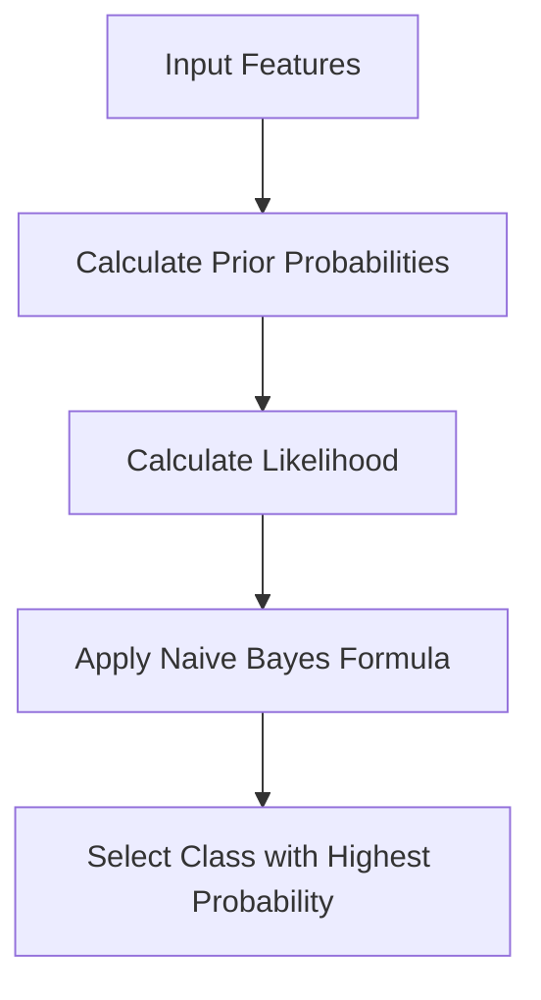

# 🔍 Naive Bayes Classifier

<div align="center">


*Probabilistic Learning Based on Bayes' Theorem*

</div>

---

## 📚 Table of Contents

- [What is Naive Bayes?](#what-is-naive-bayes)
- [Mathematical Foundation](#mathematical-foundation)
- [How It Works](#how-it-works)
- [Types of Naive Bayes](#types-of-naive-bayes)
- [Assumptions](#assumptions)
- [Implementation Guide](#implementation-guide)
- [Model Evaluation](#model-evaluation)
- [Pros and Cons](#pros-and-cons)
- [Real-World Examples](#real-world-examples)
- [Advanced Topics](#advanced-topics)
- [FAQ](#faq)

---

## 🎯 What is Naive Bayes?

**Naive Bayes** is a family of probabilistic classifiers based on applying Bayes' theorem with a "naive" assumption of conditional independence between features. Despite this simplifying assumption, Naive Bayes classifiers work surprisingly well in many real-world situations, especially in document classification and spam filtering.

### Key Characteristics:
- **Probabilistic Classifier**: Returns probability estimates rather than just classifications
- **Independence Assumption**: Assumes features are conditionally independent given the class
- **Low Computational Requirements**: Fast to train and make predictions
- **Scalable**: Can handle large datasets and high-dimensional feature spaces
- **Online Learning**: Can be updated easily with new training data

### The Goal:
Compute the posterior probability of a class given the feature values, and select the class with the highest probability.

---

## 🧮 Mathematical Foundation

### Bayes' Theorem

The core of Naive Bayes is Bayes' theorem, which relates the conditional and marginal probabilities of events A and B:

```
P(A|B) = P(B|A) × P(A) / P(B)
```

Where:
- P(A|B) is the posterior probability of A given B
- P(B|A) is the likelihood of B given A
- P(A) is the prior probability of A
- P(B) is the prior probability of B

### Naive Bayes Classifier Equation

For classification, we want to find the most likely class C given features X:

```
P(C|X) = P(X|C) × P(C) / P(X)
```

Since P(X) is constant for all classes, we can simplify to:

```
P(C|X) ∝ P(X|C) × P(C)
```

### The "Naive" Assumption

The naive part comes from assuming that features are conditionally independent given the class:

```
P(X|C) = P(x₁|C) × P(x₂|C) × ... × P(xₙ|C)
```

### Classification Rule

The final classification is made by selecting the class with the highest posterior probability:

```
ĉ = argmax P(C) × ∏ P(xᵢ|C)
     C
```

### Log Probabilities

In practice, we often compute log probabilities to avoid numerical underflow:

```
ĉ = argmax log(P(C)) + ∑ log(P(xᵢ|C))
     C
```

---

## ⚙️ How It Works

### Step-by-Step Process:

<div align="center">



</div>

### 1. **Data Preparation**
```python
# Example dataset
X = [
    [5.1, 3.5, 1.4, 0.2],  # Features: sepal length, sepal width, petal length, petal width
    [4.9, 3.0, 1.4, 0.2],
    [7.0, 3.2, 4.7, 1.4],
    [6.4, 3.2, 4.5, 1.5],
    [6.3, 3.3, 6.0, 2.5],
    [5.8, 2.7, 5.1, 1.9]
]
y = [0, 0, 1, 1, 2, 2]  # Classes: 0=Setosa, 1=Versicolor, 2=Virginica
```

### 2. **Calculate Prior Probabilities**
```python
def calculate_priors(y):
    """Calculate prior probabilities of classes."""
    n_samples = len(y)
    classes, counts = np.unique(y, return_counts=True)
    priors = {}
    
    for cls, count in zip(classes, counts):
        priors[cls] = count / n_samples
    
    return priors
```

### 3. **Calculate Likelihood**
```python
def calculate_likelihood_gaussian(X, y):
    """Calculate likelihood P(X|C) assuming Gaussian distribution (for continuous features)."""
    n_samples, n_features = X.shape
    classes = np.unique(y)
    likelihoods = {}
    
    for cls in classes:
        # Get samples of current class
        X_cls = X[y == cls]
        
        # Calculate mean and variance for each feature
        means = np.mean(X_cls, axis=0)
        variances = np.var(X_cls, axis=0)
        
        # Store parameters for this class
        likelihoods[cls] = {
            'means': means,
            'variances': variances
        }
    
    return likelihoods
```

### 4. **Calculate Posterior Probabilities**
```python
def calculate_posterior(x, priors, likelihoods):
    """Calculate posterior probability for each class."""
    posteriors = {}
    
    for cls in priors:
        # Start with prior
        posterior = np.log(priors[cls])
        
        # Add log-likelihoods
        means = likelihoods[cls]['means']
        variances = likelihoods[cls]['variances']
        
        for i in range(len(x)):
            # Gaussian probability density function
            likelihood = -0.5 * np.log(2 * np.pi * variances[i])
            likelihood -= 0.5 * ((x[i] - means[i])**2) / variances[i]
            posterior += likelihood
            
        posteriors[cls] = posterior
    
    return posteriors
```

### 5. **Make Predictions**
```python
def predict(X, priors, likelihoods):
    """Predict class for each sample in X."""
    predictions = []
    
    for x in X:
        # Calculate posterior for each class
        posteriors = calculate_posterior(x, priors, likelihoods)
        
        # Select class with highest posterior
        best_class = max(posteriors, key=posteriors.get)
        predictions.append(best_class)
    
    return predictions
```

### 6. **Full Example**
```python
def naive_bayes_gaussian(X_train, y_train, X_test):
    """Implement Gaussian Naive Bayes from scratch."""
    # Calculate prior probabilities
    priors = calculate_priors(y_train)
    
    # Calculate likelihood
    likelihoods = calculate_likelihood_gaussian(X_train, y_train)
    
    # Make predictions
    predictions = predict(X_test, priors, likelihoods)
    
    return predictions

# Train and predict
priors = calculate_priors(y)
likelihoods = calculate_likelihood_gaussian(np.array(X), y)
test_sample = np.array([6.3, 2.5, 4.9, 1.5])
posteriors = calculate_posterior(test_sample, priors, likelihoods)
print(f"Posterior probabilities: {posteriors}")
predicted_class = max(posteriors, key=posteriors.get)
print(f"Predicted class: {predicted_class}")
```

---

## 🔄 Types of Naive Bayes

### 1. **Gaussian Naive Bayes**
- **Use Case**: Continuous data assumed to follow a Gaussian distribution
- **Likelihood**: `P(xᵢ|C) = (1 / √(2πσ²ᵢₖ)) * exp(-(xᵢ - μᵢₖ)² / (2σ²ᵢₖ))`
- **Example Applications**: Image classification, medical diagnosis

```python
from sklearn.naive_bayes import GaussianNB

gnb = GaussianNB()
gnb.fit(X_train, y_train)
y_pred = gnb.predict(X_test)
```

### 2. **Multinomial Naive Bayes**
- **Use Case**: Discrete count data, often used with text (word counts)
- **Likelihood**: `P(xᵢ|C) = (count(xᵢ, C) + α) / (count(C) + α*n)`
- **Example Applications**: Document classification, spam detection

```python
from sklearn.naive_bayes import MultinomialNB

mnb = MultinomialNB(alpha=1.0)  # Laplace smoothing
mnb.fit(X_train, y_train)
y_pred = mnb.predict(X_test)
```

### 3. **Bernoulli Naive Bayes**
- **Use Case**: Binary data (features are binary variables)
- **Likelihood**: `P(xᵢ=1|C) = (count(xᵢ=1, C) + α) / (count(C) + 2α)`
- **Example Applications**: Text classification with binary word occurrence

```python
from sklearn.naive_bayes import BernoulliNB

bnb = BernoulliNB(alpha=1.0)
bnb.fit(X_train, y_train)
y_pred = bnb.predict(X_test)
```

### 4. **Complement Naive Bayes**
- **Use Case**: Text classification with imbalanced datasets
- **Likelihood**: Uses complements of classes to estimate parameters
- **Example Applications**: Imbalanced document classification

```python
from sklearn.naive_bayes import ComplementNB

cnb = ComplementNB(alpha=1.0)
cnb.fit(X_train, y_train)
y_pred = cnb.predict(X_test)
```

### 5. **Categorical Naive Bayes**
- **Use Case**: Categorical (nominal) features
- **Likelihood**: `P(xᵢ=v|C) = (count(xᵢ=v, C) + α) / (count(C) + α*n_values)`
- **Example Applications**: Classification with categorical attributes

```python
from sklearn.naive_bayes import CategoricalNB

cnb = CategoricalNB(alpha=1.0)
cnb.fit(X_train, y_train)
y_pred = cnb.predict(X_test)
```

---

## 📋 Assumptions

Naive Bayes relies on several key assumptions:

### 1. **Feature Independence** 🔵
- Features are conditionally independent given the class
- **Reality**: Often violated but model still performs well
- **Check**: Correlation matrix among features

### 2. **Equal Feature Importance** 🟢
- All features contribute equally to the outcome
- **Reality**: Some features may be more predictive than others
- **Check**: Feature selection or weighting may improve results

### 3. **Sufficient Training Data** 🟡
- Need enough examples of each class to estimate probabilities
- **Check**: Class distribution analysis

### 4. **Distribution Assumptions** 🟠
- Each variant makes specific assumptions about feature distributions
- **Example**: Gaussian NB assumes normal distribution
- **Check**: Histograms of feature distributions

### 5. **No Zero Probabilities** 🔴
- Zero probabilities can be problematic (solved with smoothing)
- **Check**: Apply Laplace or other smoothing techniques

---

## 💻 Implementation Guide

### From Scratch Implementation

```python
import numpy as np
from typing import Dict, List, Tuple, Union

class GaussianNaiveBayes:
    def __init__(self):
        """
        Initialize Gaussian Naive Bayes classifier.
        """
        self.classes = None
        self.priors = {}
        self.means = {}
        self.variances = {}
        self.n_features = None
        self.fitted = False
    
    def fit(self, X: np.ndarray, y: np.ndarray) -> 'GaussianNaiveBayes':
        """
        Fit Gaussian Naive Bayes model.
        
        Parameters:
        X (array-like): Training feature matrix
        y (array-like): Target values
        
        Returns:
        self: Returns the instance itself
        """
        X = np.array(X)
        y = np.array(y)
        
        self.n_features = X.shape[1]
        self.classes = np.unique(y)
        n_samples = X.shape[0]
        
        # Calculate prior probabilities
        for cls in self.classes:
            self.priors[cls] = np.sum(y == cls) / n_samples
        
        # Calculate means and variances for each feature per class
        for cls in self.classes:
            X_cls = X[y == cls]
            self.means[cls] = np.mean(X_cls, axis=0)
            
            # Add small epsilon to avoid zero variance
            self.variances[cls] = np.var(X_cls, axis=0) + 1e-10
        
        self.fitted = True
        return self
    
    def _calculate_likelihood(self, x: np.ndarray, cls: Union[int, str]) -> float:
        """Calculate likelihood of x belonging to class cls."""
        mean = self.means[cls]
        variance = self.variances[cls]
        
        # Gaussian probability density function
        numerator = np.exp(-((x - mean) ** 2) / (2 * variance))
        denominator = np.sqrt(2 * np.pi * variance)
        likelihood = numerator / denominator
        
        # Calculate log likelihood to avoid numerical underflow
        # Return the sum of log likelihoods (product of likelihoods)
        return np.sum(np.log(likelihood))
    
    def _calculate_posterior(self, x: np.ndarray) -> Dict[Union[int, str], float]:
        """Calculate posterior probability for each class."""
        posteriors = {}
        
        for cls in self.classes:
            # Posterior = prior * likelihood
            # Using log probabilities: log(posterior) = log(prior) + log(likelihood)
            prior = np.log(self.priors[cls])
            likelihood = self._calculate_likelihood(x, cls)
            posteriors[cls] = prior + likelihood
        
        return posteriors
    
    def predict(self, X: np.ndarray) -> np.ndarray:
        """
        Predict class labels for samples in X.
        
        Parameters:
        X (array-like): Feature matrix to predict
        
        Returns:
        array: Predicted class labels
        """
        if not self.fitted:
            raise ValueError("Model must be fitted before making predictions")
        
        X = np.array(X)
        if X.ndim == 1:
            X = X.reshape(1, -1)
            
        if X.shape[1] != self.n_features:
            raise ValueError(f"Expected {self.n_features} features, got {X.shape[1]}")
        
        predictions = []
        for x in X:
            posteriors = self._calculate_posterior(x)
            # Choose class with highest posterior probability
            predictions.append(max(posteriors, key=posteriors.get))
        
        return np.array(predictions)
    
    def predict_proba(self, X: np.ndarray) -> np.ndarray:
        """
        Predict class probabilities for samples in X.
        
        Parameters:
        X (array-like): Feature matrix to predict
        
        Returns:
        array: Predicted class probabilities
        """
        if not self.fitted:
            raise ValueError("Model must be fitted before making predictions")
        
        X = np.array(X)
        if X.ndim == 1:
            X = X.reshape(1, -1)
            
        if X.shape[1] != self.n_features:
            raise ValueError(f"Expected {self.n_features} features, got {X.shape[1]}")
        
        probabilities = []
        for x in X:
            posteriors = self._calculate_posterior(x)
            
            # Convert log probabilities to normal probabilities
            log_probs = np.array(list(posteriors.values()))
            # Subtract max for numerical stability
            log_probs -= np.max(log_probs)
            probs = np.exp(log_probs)
            # Normalize to get probabilities
            probs /= np.sum(probs)
            
            # Return probabilities in correct order
            ordered_probs = [probs[np.where(self.classes == cls)[0][0]] for cls in self.classes]
            probabilities.append(ordered_probs)
        
        return np.array(probabilities)
    
    def score(self, X: np.ndarray, y: np.ndarray) -> float:
        """
        Calculate accuracy score.
        
        Parameters:
        X (array-like): Feature matrix
        y (array-like): True labels
        
        Returns:
        float: Accuracy score
        """
        y_pred = self.predict(X)
        return np.mean(y_pred == y)
    
    def __str__(self) -> str:
        """String representation of the model."""
        if not self.fitted:
            return "GaussianNaiveBayes(not fitted)"
        
        return f"GaussianNaiveBayes(classes={self.classes}, features={self.n_features})"
```

### Using Scikit-learn

```python
from sklearn.naive_bayes import GaussianNB, MultinomialNB, BernoulliNB
from sklearn.metrics import accuracy_score, classification_report
import numpy as np

# Sample data
X = np.array([
    [5.1, 3.5, 1.4, 0.2],
    [4.9, 3.0, 1.4, 0.2],
    [7.0, 3.2, 4.7, 1.4],
    [6.4, 3.2, 4.5, 1.5],
    [6.3, 3.3, 6.0, 2.5],
    [5.8, 2.7, 5.1, 1.9]
])
y = np.array([0, 0, 1, 1, 2, 2])

# Create and train model (Gaussian Naive Bayes for continuous features)
gnb = GaussianNB()
gnb.fit(X, y)

# Make predictions
y_pred = gnb.predict(X)
print(f"Accuracy: {accuracy_score(y, y_pred)}")

# Predict probabilities
y_prob = gnb.predict_proba(X)
print(f"Probability estimates:\n{y_prob}")

# For text classification with word counts (Multinomial NB)
from sklearn.feature_extraction.text import CountVectorizer

# Sample text data
texts = [
    "This movie is great", 
    "The film was fantastic", 
    "I hated this show", 
    "Terrible acting and plot"
]
labels = [1, 1, 0, 0]  # 1=positive, 0=negative

# Convert text to word count vectors
vectorizer = CountVectorizer()
X_text = vectorizer.fit_transform(texts)

# Train Multinomial NB
mnb = MultinomialNB()
mnb.fit(X_text, labels)

# Predict
new_text = ["This was a fantastic movie with great actors"]
X_new = vectorizer.transform(new_text)
prediction = mnb.predict(X_new)
print(f"Sentiment prediction: {'Positive' if prediction[0] == 1 else 'Negative'}")
```

### Complete Example with Visualization

```python
import numpy as np
import matplotlib.pyplot as plt
from sklearn.naive_bayes import GaussianNB
from sklearn.datasets import make_classification
from sklearn.model_selection import train_test_split
from sklearn.metrics import accuracy_score, confusion_matrix, roc_curve, auc
from sklearn.preprocessing import StandardScaler

# Generate synthetic dataset for binary classification
X, y = make_classification(n_samples=1000, n_features=2, n_redundant=0, n_informative=2,
                           n_clusters_per_class=1, random_state=42)

# Split data into train and test sets
X_train, X_test, y_train, y_test = train_test_split(X, y, test_size=0.3, random_state=42)

# Standardize features
scaler = StandardScaler()
X_train_scaled = scaler.fit_transform(X_train)
X_test_scaled = scaler.transform(X_test)

# Create and train Gaussian Naive Bayes model
gnb = GaussianNB()
gnb.fit(X_train_scaled, y_train)

# Make predictions
y_pred = gnb.predict(X_test_scaled)
y_prob = gnb.predict_proba(X_test_scaled)[:, 1]  # Probability of class 1

# Calculate accuracy
accuracy = accuracy_score(y_test, y_pred)
print(f"Accuracy: {accuracy:.4f}")

# Create visualization
fig, ((ax1, ax2), (ax3, ax4)) = plt.subplots(2, 2, figsize=(15, 12))

# 1. Decision Boundary Visualization
def plot_decision_boundary(X, y, model, ax):
    # Define grid for plotting decision boundary
    h = 0.02  # Step size
    x_min, x_max = X[:, 0].min() - 1, X[:, 0].max() + 1
    y_min, y_max = X[:, 1].min() - 1, X[:, 1].max() + 1
    xx, yy = np.meshgrid(np.arange(x_min, x_max, h), np.arange(y_min, y_max, h))
    
    # Predict on grid points
    Z = model.predict(np.c_[xx.ravel(), yy.ravel()])
    Z = Z.reshape(xx.shape)
    
    # Plot decision boundary
    ax.contourf(xx, yy, Z, alpha=0.3)
    
    # Plot data points
    scatter = ax.scatter(X[:, 0], X[:, 1], c=y, edgecolor='k')
    ax.set_xlabel('Feature 1')
    ax.set_ylabel('Feature 2')
    ax.set_title('Naive Bayes Decision Boundary')
    
    # Add legend
    handles, labels = scatter.legend_elements()
    ax.legend(handles, ['Class 0', 'Class 1'])

# Plot decision boundary
plot_decision_boundary(X_test_scaled, y_test, gnb, ax1)

# 2. ROC Curve
fpr, tpr, _ = roc_curve(y_test, y_prob)
roc_auc = auc(fpr, tpr)

ax2.plot(fpr, tpr, color='darkorange', lw=2, label=f'ROC curve (AUC = {roc_auc:.2f})')
ax2.plot([0, 1], [0, 1], color='navy', lw=2, linestyle='--')
ax2.set_xlim([0.0, 1.0])
ax2.set_ylim([0.0, 1.05])
ax2.set_xlabel('False Positive Rate')
ax2.set_ylabel('True Positive Rate')
ax2.set_title('Receiver Operating Characteristic (ROC)')
ax2.legend(loc="lower right")
ax2.grid(True, alpha=0.3)

# 3. Confusion Matrix
cm = confusion_matrix(y_test, y_pred)
ax3.matshow(cm, cmap=plt.cm.Blues, alpha=0.7)
for i in range(cm.shape[0]):
    for j in range(cm.shape[1]):
        ax3.text(j, i, str(cm[i, j]), va='center', ha='center', size='xx-large')
ax3.set_xlabel('Predicted Label')
ax3.set_ylabel('True Label')
ax3.set_title('Confusion Matrix')
ax3.set_xticks([0, 1])
ax3.set_yticks([0, 1])
ax3.set_xticklabels(['Class 0', 'Class 1'])
ax3.set_yticklabels(['Class 0', 'Class 1'])

# 4. Probability Distribution
ax4.hist(y_prob[y_test == 0], bins=20, alpha=0.5, color='blue', label='Class 0')
ax4.hist(y_prob[y_test == 1], bins=20, alpha=0.5, color='red', label='Class 1')
ax4.axvline(x=0.5, color='black', linestyle='--', label='Decision Threshold')
ax4.set_xlabel('Predicted Probability for Class 1')
ax4.set_ylabel('Count')
ax4.set_title('Probability Distribution')
ax4.legend()
ax4.grid(True, alpha=0.3)

plt.tight_layout()
plt.show()

# Print additional metrics
from sklearn.metrics import classification_report

print("\nClassification Report:")
print(classification_report(y_test, y_pred))

# Print model parameters
print("\nModel Parameters:")
print(f"Prior probabilities: {gnb.class_prior_}")
print(f"Mean values per class/feature:")
for i, c in enumerate(gnb.classes_):
    print(f"  Class {c}: {gnb.theta_[i]}")
print(f"Variance values per class/feature:")
for i, c in enumerate(gnb.classes_):
    print(f"  Class {c}: {gnb.var_[i]}")
```

---

## 📊 Model Evaluation

### Key Metrics

#### 1. **Accuracy**
```python
def accuracy(y_true, y_pred):
    """Calculate accuracy score."""
    return np.mean(y_true == y_pred)
```

#### 2. **Confusion Matrix**
```python
def confusion_matrix(y_true, y_pred, labels=None):
    """
    Calculate confusion matrix.
    
    Parameters:
    y_true (array-like): True labels
    y_pred (array-like): Predicted labels
    labels (array-like, optional): List of labels to index the matrix
    
    Returns:
    array: Confusion matrix
    """
    if labels is None:
        labels = sorted(set(np.concatenate([y_true, y_pred])))
    
    n_labels = len(labels)
    cm = np.zeros((n_labels, n_labels), dtype=int)
    
    for i, true_label in enumerate(labels):
        for j, pred_label in enumerate(labels):
            cm[i, j] = np.sum((y_true == true_label) & (y_pred == pred_label))
    
    return cm
```

#### 3. **Classification Report**
```python
def classification_report(y_true, y_pred, labels=None):
    """
    Generate classification report with precision, recall and F1-score.
    
    Parameters:
    y_true (array-like): True labels
    y_pred (array-like): Predicted labels
    labels (array-like, optional): List of labels to include in the report
    
    Returns:
    dict: Classification metrics by class
    """
    if labels is None:
        labels = sorted(set(np.concatenate([y_true, y_pred])))
    
    # Calculate confusion matrix
    cm = confusion_matrix(y_true, y_pred, labels)
    
    # Initialize report
    report = {}
    
    # Calculate metrics for each class
    for i, label in enumerate(labels):
        # True positives, false positives, false negatives
        tp = cm[i, i]
        fp = np.sum(cm[:, i]) - tp
        fn = np.sum(cm[i, :]) - tp
        
        # Calculate metrics
        precision = tp / (tp + fp) if (tp + fp) > 0 else 0
        recall = tp / (tp + fn) if (tp + fn) > 0 else 0
        f1 = 2 * precision * recall / (precision + recall) if (precision + recall) > 0 else 0
        
        # Add to report
        report[label] = {
            'precision': precision,
            'recall': recall,
            'f1-score': f1,
            'support': np.sum(y_true == label)
        }
    
    # Calculate averages
    avg_precision = np.mean([report[label]['precision'] for label in labels])
    avg_recall = np.mean([report[label]['recall'] for label in labels])
    avg_f1 = np.mean([report[label]['f1-score'] for label in labels])
    
    report['macro avg'] = {
        'precision': avg_precision,
        'recall': avg_recall,
        'f1-score': avg_f1,
        'support': len(y_true)
    }
    
    return report
```

#### 4. **Log Loss**
```python
def log_loss(y_true, y_prob, eps=1e-15):
    """
    Calculate log loss (cross-entropy loss).
    
    Parameters:
    y_true (array-like): True labels (binary)
    y_prob (array-like): Predicted probabilities for the positive class
    eps (float): Small value to avoid log(0)
    
    Returns:
    float: Log loss value
    """
    # Clip probabilities to avoid log(0) or log(1)
    y_prob = np.clip(y_prob, eps, 1 - eps)
    
    # Calculate log loss
    loss = -np.mean(y_true * np.log(y_prob) + (1 - y_true) * np.log(1 - y_prob))
    return loss
```

#### 5. **ROC AUC**
```python
def roc_auc(y_true, y_prob):
    """
    Calculate area under the ROC curve.
    
    Parameters:
    y_true (array-like): True binary labels
    y_prob (array-like): Predicted probabilities for the positive class
    
    Returns:
    float: AUC value
    """
    # Sort by probability
    sorted_indices = np.argsort(y_prob)[::-1]
    y_true_sorted = y_true[sorted_indices]
    
    # Count positives and negatives
    n_pos = np.sum(y_true == 1)
    n_neg = len(y_true) - n_pos
    
    # Calculate true positive rate and false positive rate
    tp_cumsum = np.cumsum(y_true_sorted)
    fp_cumsum = np.cumsum(1 - y_true_sorted)
    
    tpr = tp_cumsum / n_pos
    fpr = fp_cumsum / n_neg
    
    # Calculate AUC using trapezoidal rule
    auc = np.trapz(tpr, fpr)
    return auc
```

### Diagnostic Plots

```python
def diagnostic_plots(X, y, model):
    """Create diagnostic plots for Naive Bayes classifier."""
    # Make predictions
    y_pred = model.predict(X)
    
    if hasattr(model, 'predict_proba'):
        y_prob = model.predict_proba(X)
    else:
        y_prob = None
    
    # Create plots
    fig, ((ax1, ax2), (ax3, ax4)) = plt.subplots(2, 2, figsize=(15, 12))
    
    # 1. Feature Distribution by Class
    if X.shape[1] >= 2:
        for label in np.unique(y):
            ax1.scatter(X[y == label, 0], X[y == label, 1], 
                      label=f'Class {label}', alpha=0.5, edgecolor='k')
        
        ax1.set_xlabel('Feature 1')
        ax1.set_ylabel('Feature 2')
        ax1.set_title('Feature Distribution by Class')
        ax1.legend()
        ax1.grid(True, alpha=0.3)
    else:
        ax1.hist([X[y == label].flatten() for label in np.unique(y)], 
               bins=20, label=[f'Class {label}' for label in np.unique(y)])
        ax1.set_xlabel('Feature Value')
        ax1.set_ylabel('Count')
        ax1.set_title('Feature Distribution by Class')
        ax1.legend()
        ax1.grid(True, alpha=0.3)
    
    # 2. Decision Boundary (if 2D features)
    if X.shape[1] == 2:
        # Define grid for visualization
        h = 0.02  # step size
        x_min, x_max = X[:, 0].min() - 1, X[:, 0].max() + 1
        y_min, y_max = X[:, 1].min() - 1, X[:, 1].max() + 1
        xx, yy = np.meshgrid(np.arange(x_min, x_max, h),
                            np.arange(y_min, y_max, h))
        
        # Predict on grid points
        Z = model.predict(np.c_[xx.ravel(), yy.ravel()])
        Z = Z.reshape(xx.shape)
        
        # Plot decision boundary
        ax2.contourf(xx, yy, Z, alpha=0.3)
        ax2.scatter(X[:, 0], X[:, 1], c=y, edgecolor='k')
        ax2.set_xlabel('Feature 1')
        ax2.set_ylabel('Feature 2')
        ax2.set_title('Decision Boundary')
    else:
        ax2.text(0.5, 0.5, "Decision boundary visualization\nrequires 2D data", 
                ha='center', va='center', fontsize=12)
        ax2.set_xticks([])
        ax2.set_yticks([])
    
    # 3. Confusion Matrix
    cm = confusion_matrix(y, y_pred)
    ax3.matshow(cm, cmap=plt.cm.Blues, alpha=0.7)
    
    # Add text annotations
    for i in range(cm.shape[0]):
        for j in range(cm.shape[1]):
            ax3.text(j, i, str(cm[i, j]), ha='center', va='center', 
                   color='white' if cm[i, j] > cm.max() / 2 else 'black')
    
    ax3.set_xlabel('Predicted Label')
    ax3.set_ylabel('True Label')
    ax3.set_title('Confusion Matrix')
    ax3.set_xticks(range(len(np.unique(y))))
    ax3.set_yticks(range(len(np.unique(y))))
    
    # 4. ROC Curve (for binary classification) or Probability Distribution
    if len(np.unique(y)) == 2 and y_prob is not None:
        # Binary classification - plot ROC curve
        from sklearn.metrics import roc_curve, auc
        
        fpr, tpr, _ = roc_curve(y, y_prob[:, 1])
        roc_auc = auc(fpr, tpr)
        
        ax4.plot(fpr, tpr, color='darkorange', lw=2, label=f'ROC curve (AUC = {roc_auc:.2f})')
        ax4.plot([0, 1], [0, 1], color='navy', lw=2, linestyle='--')
        ax4.set_xlabel('False Positive Rate')
        ax4.set_ylabel('True Positive Rate')
        ax4.set_title('Receiver Operating Characteristic')
        ax4.legend(loc="lower right")
        ax4.grid(True, alpha=0.3)
    elif y_prob is not None:
        # Multi-class - plot probability distributions
        for i, label in enumerate(np.unique(y)):
            # Get predicted probabilities for this class
            probs = y_prob[:, i]
            ax4.hist(probs[y == label], bins=20, alpha=0.5, label=f'True Class {label}')
        
        ax4.set_xlabel('Predicted Probability')
        ax4.set_ylabel('Count')
        ax4.set_title('Probability Distributions')
        ax4.legend()
        ax4.grid(True, alpha=0.3)
    else:
        ax4.text(0.5, 0.5, "Probability information\nnot available", 
                ha='center', va='center', fontsize=12)
        ax4.set_xticks([])
        ax4.set_yticks([])
    
    plt.tight_layout()
    plt.show()
```

---

## ✅ Pros and Cons

<div align="center">

| ✅ **Advantages** | ❌ **Disadvantages** |
|-------------------|---------------------|
| **Fast Training and Prediction** | **Independence Assumption** |
| Extremely efficient even with large datasets | Feature independence rarely holds in real-world data |
| **Simple Implementation** | **Zero Frequency Problem** |
| Easy to understand and implement from scratch | Requires smoothing to handle unseen features |
| **Works with Small Training Sets** | **Estimation Inaccuracies** |
| Can perform well even with limited data | Naive probability estimates may be imprecise |
| **Handles High-Dimensional Data** | **Continuous Data Limitations** |
| Effective with large feature spaces like text | Gaussian assumption may be inappropriate |
| **Online Learning** | **Doesn't Capture Feature Interactions** |
| Can be updated incrementally | Misses important relationships between features |
| **Inherent Feature Selection** | **Sensitive to Irrelevant Features** |
| Less affected by irrelevant features | Performance can degrade with many irrelevant features |
| **Minimal Hyperparameter Tuning** | **Probability Calibration Issues** |
| Often works well with default settings | Raw probabilities may not be well-calibrated |

</div>

### When to Use Naive Bayes:

✅ **Good Choice When:**
- Text classification (spam detection, sentiment analysis)
- Document categorization (topic modeling)
- Need fast training and prediction
- High-dimensional feature spaces
- Limited training data available
- Real-time prediction requirements
- Understand probability distributions of your data

❌ **Avoid When:**
- Strong feature dependencies exist
- Complex relationships between features are critical
- High precision probability estimates are needed
- Continuous features with non-Gaussian distributions
- Highest possible classification accuracy is essential
- Features have complex interactions that affect the outcome

---

## 🌍 Real-World Examples

### Example 1: Text Classification (Spam Detection)
```python
# Spam detection using Naive Bayes
import numpy as np
import pandas as pd
from sklearn.model_selection import train_test_split
from sklearn.feature_extraction.text import CountVectorizer
from sklearn.naive_bayes import MultinomialNB
from sklearn.metrics import accuracy_score, classification_report, confusion_matrix
import matplotlib.pyplot as plt
import seaborn as sns

# Sample SMS dataset (simplified)
messages = [
    "URGENT! You have won a 1 week FREE membership in our £100,000 Prize Jackpot! Call 08712402050 NOW!",
    "WINNER!! As a valued customer you have been selected to receive a £900 prize reward!",
    "Hi how are you, how was your day? Did you recover from last night?",
    "I'll be late tonight, don't wait up for dinner. I love you.",
    "Congratulations! You've been selected for a free iPhone! Call now!",
    "Hey, can we reschedule our meeting from 10am to 2pm tomorrow?",
    "PRIVATE! Your 2003 Account Statement for shows 800 un-redeemed points. Call 08719899217",
    "I'm going to be home late. I'll call you when I'm leaving.",
    "SIX chances to win CASH! From 100 to 20,000 pounds txt> CSH11 and send to 87575.",
    "Meeting rescheduled to 3pm today, sorry for the short notice."
]

labels = [1, 1, 0, 0, 1, 0, 1, 0, 1, 0]  # 1=spam, 0=ham

# Create DataFrame
df = pd.DataFrame({
    'message': messages,
    'label': labels
})

# Split data
X_train, X_test, y_train, y_test = train_test_split(df['message'], df['label'], 
                                                   test_size=0.3, random_state=42)

# Feature extraction - convert text to word count vectors
vectorizer = CountVectorizer(stop_words='english')
X_train_counts = vectorizer.fit_transform(X_train)
X_test_counts = vectorizer.transform(X_test)

# Train Multinomial Naive Bayes model
nb_classifier = MultinomialNB(alpha=1.0)  # alpha=1.0 is Laplace smoothing
nb_classifier.fit(X_train_counts, y_train)

# Make predictions
y_pred = nb_classifier.predict(X_test_counts)
y_prob = nb_classifier.predict_proba(X_test_counts)[:, 1]  # Probability of spam

# Evaluate model
accuracy = accuracy_score(y_test, y_pred)
print(f"Accuracy: {accuracy:.4f}")
print("\nClassification Report:")
print(classification_report(y_test, y_pred, target_names=['Ham', 'Spam']))

# Confusion Matrix
cm = confusion_matrix(y_test, y_pred)
plt.figure(figsize=(8, 6))
sns.heatmap(cm, annot=True, fmt='d', cmap='Blues', 
           xticklabels=['Ham', 'Spam'], yticklabels=['Ham', 'Spam'])
plt.xlabel('Predicted Label')
plt.ylabel('True Label')
plt.title('Confusion Matrix')
plt.show()

# Feature importance (top words indicating spam or ham)
def plot_important_words(model, vectorizer, class_labels, n_top=20):
    """Plot important features for each class."""
    feature_names = np.array(vectorizer.get_feature_names_out())
    
    fig, axes = plt.subplots(1, 2, figsize=(15, 8))
    
    for i, class_label in enumerate(class_labels):
        # Get the feature importance for the class
        top_features = np.argsort(model.feature_log_prob_[i])[-n_top:]
        top_features_names = feature_names[top_features]
        top_features_weights = model.feature_log_prob_[i][top_features]
        
        # Sort by weight
        sorted_indices = np.argsort(top_features_weights)
        top_features_names = top_features_names[sorted_indices]
        top_features_weights = top_features_weights[sorted_indices]
        
        # Plot horizontal bar chart
        axes[i].barh(range(n_top), top_features_weights, align='center')
        axes[i].set_yticks(range(n_top))
        axes[i].set_yticklabels(top_features_names)
        axes[i].set_title(f'Top words for {class_labels[i]}')
        axes[i].set_xlabel('Log Probability')
    
    plt.tight_layout()
    plt.show()

# Plot important words for ham and spam
plot_important_words(nb_classifier, vectorizer, ['Ham', 'Spam'], n_top=10)

# Test with new messages
new_messages = [
    "Congratulations! You've won a free vacation to the Bahamas!",
    "Hi, can we meet for coffee at 3pm today?"
]

# Transform new messages
new_counts = vectorizer.transform(new_messages)

# Predict
new_pred = nb_classifier.predict(new_counts)
new_prob = nb_classifier.predict_proba(new_counts)[:, 1]

print("\nNew Message Classification:")
for i, message in enumerate(new_messages):
    print(f"Message: {message}")
    print(f"Prediction: {'Spam' if new_pred[i] == 1 else 'Ham'}")
    print(f"Probability of being spam: {new_prob[i]:.4f}")
    print()
```

### Example 2: Medical Diagnosis
```python
# Medical diagnosis using Naive Bayes
import numpy as np
import pandas as pd
import matplotlib.pyplot as plt
from sklearn.model_selection import train_test_split
from sklearn.naive_bayes import GaussianNB
from sklearn.metrics import accuracy_score, confusion_matrix, roc_curve, auc
from sklearn.preprocessing import StandardScaler
from sklearn.model_selection import learning_curve, validation_curve
import seaborn as sns

# Generate synthetic medical data
np.random.seed(42)
n_patients = 200

# Create features: age, body temperature, heart rate, blood pressure, white blood cell count
age = np.random.normal(50, 15, n_patients)
temperature = np.random.normal(98.6, 1.5, n_patients) 
heart_rate = np.random.normal(80, 15, n_patients)
blood_pressure_systolic = np.random.normal(120, 15, n_patients)
wbc_count = np.random.normal(7.5, 2, n_patients)

# Create more pronounced patterns for patients with the condition
condition_indices = np.random.choice(n_patients, size=int(n_patients * 0.4), replace=False)
temperature[condition_indices] += 2  # Higher fever
heart_rate[condition_indices] += 15  # Higher heart rate
wbc_count[condition_indices] += 4  # Higher white blood cell count

# Create label (1 = has condition, 0 = healthy)
condition = np.zeros(n_patients)
condition[condition_indices] = 1

# Create DataFrame
medical_data = pd.DataFrame({
    'age': age,
    'temperature': temperature,
    'heart_rate': heart_rate,
    'blood_pressure': blood_pressure_systolic,
    'wbc_count': wbc_count,
    'condition': condition
})

# Split data
X = medical_data.drop('condition', axis=1)
y = medical_data['condition']
X_train, X_test, y_train, y_test = train_test_split(X, y, test_size=0.3, random_state=42)

# Standardize features
scaler = StandardScaler()
X_train_scaled = scaler.fit_transform(X_train)
X_test_scaled = scaler.transform(X_test)

# Train Gaussian Naive Bayes model
gnb = GaussianNB()
gnb.fit(X_train_scaled, y_train)

# Make predictions
y_pred = gnb.predict(X_test_scaled)
y_prob = gnb.predict_proba(X_test_scaled)[:, 1]

# Calculate accuracy
accuracy = accuracy_score(y_test, y_pred)
print(f"Accuracy: {accuracy:.4f}")

# Plot feature distributions by class
fig, axes = plt.subplots(2, 3, figsize=(18, 10))
axes = axes.flatten()

features = X.columns
for i, feature in enumerate(features):
    if i < len(axes):
        sns.histplot(data=medical_data, x=feature, hue='condition', 
                   kde=True, ax=axes[i], palette=['green', 'red'])
        axes[i].set_title(f'{feature} Distribution by Condition')
        axes[i].grid(True, alpha=0.3)

plt.tight_layout()
plt.show()

# Plot ROC curve
fpr, tpr, _ = roc_curve(y_test, y_prob)
roc_auc = auc(fpr, tpr)

plt.figure(figsize=(10, 8))
plt.plot(fpr, tpr, color='darkorange', lw=2, label=f'ROC curve (AUC = {roc_auc:.2f})')
plt.plot([0, 1], [0, 1], color='navy', lw=2, linestyle='--')
plt.xlim([0.0, 1.0])
plt.ylim([0.0, 1.05])
plt.xlabel('False Positive Rate')
plt.ylabel('True Positive Rate')
plt.title('Receiver Operating Characteristic')
plt.legend(loc="lower right")
plt.grid(True, alpha=0.3)
plt.show()

# Confusion matrix
cm = confusion_matrix(y_test, y_pred)
plt.figure(figsize=(8, 6))
sns.heatmap(cm, annot=True, fmt='d', cmap='Blues',
           xticklabels=['Healthy', 'Condition'], yticklabels=['Healthy', 'Condition'])
plt.xlabel('Predicted Label')
plt.ylabel('True Label')
plt.title('Confusion Matrix')
plt.show()

# Plot learning curve
def plot_learning_curve(estimator, title, X, y, axes=None, ylim=None, cv=5,
                        n_jobs=None, train_sizes=np.linspace(.1, 1.0, 5)):
    if axes is None:
        _, axes = plt.subplots(1, 3, figsize=(20, 5))

    axes[0].set_title(title)
    if ylim is not None:
        axes[0].set_ylim(*ylim)
    axes[0].set_xlabel("Training examples")
    axes[0].set_ylabel("Score")

    train_sizes, train_scores, test_scores, fit_times, _ = \
        learning_curve(estimator, X, y, cv=cv, n_jobs=n_jobs,
                       train_sizes=train_sizes,
                       return_times=True)
    
    train_scores_mean = np.mean(train_scores, axis=1)
    train_scores_std = np.std(train_scores, axis=1)
    test_scores_mean = np.mean(test_scores, axis=1)
    test_scores_std = np.std(test_scores, axis=1)
    fit_times_mean = np.mean(fit_times, axis=1)
    fit_times_std = np.std(fit_times, axis=1)

    # Plot learning curve
    axes[0].grid()
    axes[0].fill_between(train_sizes, train_scores_mean - train_scores_std,
                         train_scores_mean + train_scores_std, alpha=0.1,
                         color="r")
    axes[0].fill_between(train_sizes, test_scores_mean - test_scores_std,
                         test_scores_mean + test_scores_std, alpha=0.1,
                         color="g")
    axes[0].plot(train_sizes, train_scores_mean, 'o-', color="r",
                 label="Training score")
    axes[0].plot(train_sizes, test_scores_mean, 'o-', color="g",
                 label="Cross-validation score")
    axes[0].legend(loc="best")

    # Plot n_samples vs fit_times
    axes[1].grid()
    axes[1].plot(train_sizes, fit_times_mean, 'o-')
    axes[1].fill_between(train_sizes, fit_times_mean - fit_times_std,
                         fit_times_mean + fit_times_std, alpha=0.1)
    axes[1].set_xlabel("Training examples")
    axes[1].set_ylabel("fit_times")
    axes[1].set_title("Scalability of the model")

    # Plot fit_time vs score
    axes[2].grid()
    axes[2].plot(fit_times_mean, test_scores_mean, 'o-')
    axes[2].fill_between(fit_times_mean, test_scores_mean - test_scores_std,
                         test_scores_mean + test_scores_std, alpha=0.1)
    axes[2].set_xlabel("fit_times")
    axes[2].set_ylabel("Score")
    axes[2].set_title("Performance of the model")

    return plt

# Plot learning curve
plot_learning_curve(
    GaussianNB(), "Learning Curve for Gaussian Naive Bayes",
    X_train_scaled, y_train, cv=5
)
plt.show()

# Create a prediction function for new patients
def predict_condition(age, temperature, heart_rate, blood_pressure, wbc_count):
    # Create patient data
    patient = np.array([[age, temperature, heart_rate, blood_pressure, wbc_count]])
    
    # Scale features
    patient_scaled = scaler.transform(patient)
    
    # Predict
    prediction = gnb.predict(patient_scaled)[0]
    probability = gnb.predict_proba(patient_scaled)[0, 1]
    
    return prediction, probability

# Test with new patients
print("\nNew Patient Predictions:")

# Healthy patient
healthy_pred, healthy_prob = predict_condition(
    age=45, temperature=98.4, heart_rate=72, blood_pressure=118, wbc_count=7.2
)
print(f"Healthy Patient - Prediction: {'Condition' if healthy_pred else 'Healthy'}, Probability: {healthy_prob:.4f}")

# Patient with condition
sick_pred, sick_prob = predict_condition(
    age=65, temperature=101.2, heart_rate=105, blood_pressure=135, wbc_count=13.5
)
print(f"Sick Patient - Prediction: {'Condition' if sick_pred else 'Healthy'}, Probability: {sick_prob:.4f}")

# Print model parameters
print("\nModel Parameters:")
print(f"Prior probabilities: {gnb.class_prior_}")
print(f"Mean (θ) values per feature/class:")
features = X.columns
for i, cls in enumerate([0, 1]):
    print(f"\nClass {cls} ({'Healthy' if cls == 0 else 'Condition'}):")
    for j, feature in enumerate(features):
        print(f"  {feature}: {gnb.theta_[i, j]:.4f}")
```

### Example 3: Weather Prediction
```python
# Weather prediction using Naive Bayes
import numpy as np
import pandas as pd
import matplotlib.pyplot as plt
from sklearn.model_selection import train_test_split
from sklearn.naive_bayes import CategoricalNB
from sklearn.preprocessing import OrdinalEncoder
from sklearn.metrics import accuracy_score, classification_report
import seaborn as sns

# Generate synthetic weather data
np.random.seed(42)
n_days = 1000

# Create categorical features
outlook_options = ['Sunny', 'Overcast', 'Rainy']
temperature_options = ['Hot', 'Mild', 'Cool']
humidity_options = ['High', 'Normal']
windy_options = ['Yes', 'No']

# Generate features with weather patterns
outlook = np.random.choice(outlook_options, size=n_days, p=[0.3, 0.3, 0.4])
temperature = np.random.choice(temperature_options, size=n_days)
humidity = np.random.choice(humidity_options, size=n_days)
windy = np.random.choice(windy_options, size=n_days)

# Generate play outcome with conditional probabilities
# More likely to play when:
# - Outlook is Overcast
# - Temperature is Mild or Cool
# - Humidity is Normal
# - Not Windy

play = np.zeros(n_days, dtype=int)

for i in range(n_days):
    # Base probability
    play_prob = 0.5
    
    # Adjust based on features
    if outlook[i] == 'Sunny':
        play_prob += 0.1
    elif outlook[i] == 'Overcast':
        play_prob += 0.4
    else:  # Rainy
        play_prob -= 0.3
        
    if temperature[i] == 'Hot':
        play_prob -= 0.2
    elif temperature[i] == 'Mild':
        play_prob += 0.2
    else:  # Cool
        play_prob += 0.1
        
    if humidity[i] == 'High':
        play_prob -= 0.3
    else:  # Normal
        play_prob += 0.3
        
    if windy[i] == 'Yes':
        play_prob -= 0.2
    else:  # No
        play_prob += 0.2
    
    # Clip probability between 0.1 and 0.9
    play_prob = max(0.1, min(0.9, play_prob))
    
    # Generate outcome
    play[i] = np.random.choice([0, 1], p=[1-play_prob, play_prob])

# Create DataFrame
weather_data = pd.DataFrame({
    'Outlook': outlook,
    'Temperature': temperature,
    'Humidity': humidity,
    'Windy': windy,
    'Play': play
})

print("Weather Data Sample:")
print(weather_data.head())
print("\nClass Distribution:")
print(weather_data['Play'].value_counts())

# Split features and target
X = weather_data.drop('Play', axis=1)
y = weather_data['Play']

# Encode categorical features
encoder = OrdinalEncoder()
X_encoded = encoder.fit_transform(X)

# Split data
X_train, X_test, y_train, y_test = train_test_split(X_encoded, y, test_size=0.3, random_state=42)

# Train Categorical Naive Bayes model
cnb = CategoricalNB()
cnb.fit(X_train, y_train)

# Make predictions
y_pred = cnb.predict(X_test)
y_prob = cnb.predict_proba(X_test)[:, 1]

# Calculate accuracy
accuracy = accuracy_score(y_test, y_pred)
print(f"\nAccuracy: {accuracy:.4f}")
print("\nClassification Report:")
print(classification_report(y_test, y_pred, target_names=['No Play', 'Play']))

# Visualize feature importance
def plot_feature_importance(model, feature_names):
    n_classes = len(model.classes_)
    n_features = len(feature_names)
    
    fig, axes = plt.subplots(1, n_classes, figsize=(16, 6))
    
    for i, ax in enumerate(axes):
        class_name = f"Class {model.classes_[i]} ({'No Play' if model.classes_[i] == 0 else 'Play'})"
        
        # Calculate feature importance from category log probabilities
        feature_importance = []
        
        for j in range(n_features):
            # Calculate the variance of log probabilities across categories
            log_probs = model.feature_log_prob_[i][j]
            importance = np.var(log_probs)
            feature_importance.append(importance)
        
        # Plot
        ax.bar(feature_names, feature_importance)
        ax.set_title(f"Feature Importance for {class_name}")
        ax.set_xticklabels(feature_names, rotation=45)
        ax.grid(True, alpha=0.3)
    
    plt.tight_layout()
    plt.show()

# Plot feature importance
plot_feature_importance(cnb, X.columns)

# Visualize conditional probabilities
def plot_conditional_probabilities(X, y, feature_names):
    fig, axes = plt.subplots(2, 2, figsize=(14, 10))
    axes = axes.flatten()
    
    for i, feature in enumerate(feature_names):
        if i < len(axes):
            # Create contingency table
            ct = pd.crosstab(X[feature], y)
            
            # Convert to probabilities
            ct_pct = ct.div(ct.sum(axis=1), axis=0)
            
            # Plot
            ct_pct.plot(kind='bar', stacked=False, ax=axes[i])
            axes[i].set_title(f'Play Probability by {feature}')
            axes[i].set_xlabel(feature)
            axes[i].set_ylabel('Probability')
            axes[i].legend(['No Play', 'Play'])
            axes[i].grid(True, alpha=0.3)
    
    plt.tight_layout()
    plt.show()

# Plot conditional probabilities
plot_conditional_probabilities(weather_data, weather_data['Play'], X.columns)

# Create a function to predict new examples
def predict_weather(outlook, temperature, humidity, windy):
    # Create data for new example
    new_data = pd.DataFrame({
        'Outlook': [outlook],
        'Temperature': [temperature],
        'Humidity': [humidity],
        'Windy': [windy]
    })
    
    # Encode new data
    new_encoded = encoder.transform(new_data)
    
    # Predict
    prediction = cnb.predict(new_encoded)[0]
    probability = cnb.predict_proba(new_encoded)[0, 1]
    
    return prediction, probability

# Test with new weather conditions
print("\nNew Weather Predictions:")

# Good day for playing
good_pred, good_prob = predict_weather('Overcast', 'Mild', 'Normal', 'No')
print(f"Overcast, Mild, Normal, Not Windy - Prediction: {'Play' if good_pred else 'No Play'}, Probability: {good_prob:.4f}")

# Bad day for playing
bad_pred, bad_prob = predict_weather('Rainy', 'Cool', 'High', 'Yes')
print(f"Rainy, Cool, High Humidity, Windy - Prediction: {'Play' if bad_pred else 'No Play'}, Probability: {bad_prob:.4f}")
```

---

## 🔬 Advanced Topics

### 1. **Bayesian Belief Networks**

Extending Naive Bayes by modeling conditional dependencies between features:

```python
import numpy as np
import pandas as pd
from pgmpy.models import BayesianNetwork
from pgmpy.estimators import MaximumLikelihoodEstimator
from pgmpy.inference import VariableElimination

# Sample data
data = pd.DataFrame({
    'Outlook': ['Sunny', 'Sunny', 'Overcast', 'Rainy', 'Rainy', 'Rainy', 'Overcast', 'Sunny'],
    'Temperature': ['Hot', 'Hot', 'Hot', 'Mild', 'Cool', 'Cool', 'Cool', 'Mild'],
    'Humidity': ['High', 'High', 'High', 'High', 'Normal', 'Normal', '
'Normal', 'Normal'],
    'Windy': ['False', 'True', 'False', 'False', 'False', 'True', 'True', 'False'],
    'Play': ['No', 'No', 'Yes', 'Yes', 'Yes', 'No', 'Yes', 'No']
})

# Define the structure of the Bayesian Network
model = BayesianNetwork([
    ('Outlook', 'Play'),
    ('Temperature', 'Humidity'),
    ('Humidity', 'Play'),
    ('Windy', 'Play')
])

# Fit the parameters of the model using Maximum Likelihood Estimation
model.fit(data, estimator=MaximumLikelihoodEstimator)

# Create an inference object
inference = VariableElimination(model)

# Inference example: Probability of Play given evidence
result = inference.query(variables=['Play'], evidence={'Outlook': 'Sunny', 'Temperature': 'Hot'})
print("Probability of Play given Sunny and Hot:")
print(result)

# Another example
result = inference.query(variables=['Play'], evidence={'Outlook': 'Overcast', 'Windy': 'False'})
print("\nProbability of Play given Overcast and not Windy:")
print(result)

# Advantages over Naive Bayes:
# 1. Models dependencies between features
# 2. More accurate probability estimates
# 3. Can handle missing values more effectively
# 4. Provides causal interpretations
```

### 2. **Laplace Smoothing**

Handling the zero-frequency problem with smoothing techniques:

```python
def naive_bayes_with_smoothing(X_train, y_train, X_test, alpha=1.0):
    """
    Implement Multinomial Naive Bayes with Laplace smoothing.
    
    Parameters:
    X_train: Training features (count/frequency data)
    y_train: Training labels
    X_test: Test features
    alpha: Smoothing parameter (1.0 = Laplace smoothing)
    
    Returns:
    y_pred: Predictions for X_test
    """
    # Get unique classes
    classes = np.unique(y_train)
    n_classes = len(classes)
    n_samples, n_features = X_train.shape
    
    # Calculate prior probabilities
    class_counts = np.zeros(n_classes)
    for i, c in enumerate(classes):
        class_counts[i] = np.sum(y_train == c)
    
    # Apply smoothing to priors (usually not necessary, but for completeness)
    priors = (class_counts + alpha) / (n_samples + alpha * n_classes)
    
    # Calculate likelihoods with smoothing
    likelihoods = np.zeros((n_classes, n_features))
    for i, c in enumerate(classes):
        # Get documents in this class
        X_class = X_train[y_train == c]
        
        # Calculate feature counts for this class
        feature_counts = np.sum(X_class, axis=0)
        
        # Calculate total words in this class
        total_count = np.sum(feature_counts)
        
        # Apply Laplace smoothing
        likelihoods[i] = (feature_counts + alpha) / (total_count + alpha * n_features)
    
    # Make predictions
    y_pred = []
    for x in X_test:
        # Calculate log posterior for each class
        log_posteriors = np.log(priors)
        
        for i, c in enumerate(classes):
            # Add log likelihoods using feature counts
            log_posteriors[i] += np.sum(x * np.log(likelihoods[i]))
        
        # Choose class with highest posterior
        y_pred.append(classes[np.argmax(log_posteriors)])
    
    return np.array(y_pred)

# Effect of alpha parameter on model accuracy
from sklearn.model_selection import cross_val_score
from sklearn.feature_extraction.text import CountVectorizer
from sklearn.naive_bayes import MultinomialNB

# Sample text data
texts = [
    "this movie was great", "excellent film", "amazing acting",
    "terrible movie", "waste of time", "awful experience",
    "mediocre at best", "not worth watching"
]
labels = [1, 1, 1, 0, 0, 0, 0, 0]  # 1=positive, 0=negative

# Convert to word count vectors
vectorizer = CountVectorizer()
X = vectorizer.fit_transform(texts)

# Test different alpha values
alphas = [0.0001, 0.001, 0.01, 0.1, 0.5, 1.0, 2.0, 5.0, 10.0]
mean_scores = []
std_scores = []

for alpha in alphas:
    mnb = MultinomialNB(alpha=alpha)
    scores = cross_val_score(mnb, X, labels, cv=3)  # Use small CV due to small dataset
    mean_scores.append(np.mean(scores))
    std_scores.append(np.std(scores))

# Plot results
plt.figure(figsize=(10, 6))
plt.errorbar(alphas, mean_scores, yerr=std_scores, fmt='o-', capsize=5)
plt.xscale('log')
plt.xlabel('Alpha (smoothing parameter)')
plt.ylabel('Cross-validation accuracy')
plt.title('Effect of Smoothing Parameter on Accuracy')
plt.grid(True, alpha=0.3)
plt.show()
```

### 3. **Semi-Supervised Naive Bayes**

Using unlabeled data to improve Naive Bayes:

```python
from sklearn.semi_supervised import SelfTrainingClassifier
from sklearn.naive_bayes import GaussianNB
import numpy as np
import matplotlib.pyplot as plt
from sklearn.datasets import make_classification

# Generate dataset with labeled and unlabeled points
X, y = make_classification(n_samples=1000, n_features=2, n_informative=2,
                          n_redundant=0, random_state=42)

# Mark 90% of examples as unlabeled (-1)
mask = np.random.rand(len(y)) < 0.9
y_partial = y.copy()
y_partial[mask] = -1

# Plot the data
plt.figure(figsize=(10, 6))
plt.scatter(X[y_partial == -1, 0], X[y_partial == -1, 1], c='grey', marker='.', alpha=0.3,
            label='Unlabeled')
plt.scatter(X[y_partial == 0, 0], X[y_partial == 0, 1], c='blue', marker='o',
            label='Labeled Class 0')
plt.scatter(X[y_partial == 1, 0], X[y_partial == 1, 1], c='red', marker='^',
            label='Labeled Class 1')
plt.legend()
plt.title('Semi-supervised Learning Dataset')
plt.show()

# Create base classifier
base_nb = GaussianNB()

# Create self-training classifier
self_training_model = SelfTrainingClassifier(base_nb)
self_training_model.fit(X, y_partial)

# Compare with supervised model using only labeled data
X_labeled = X[y_partial != -1]
y_labeled = y[y_partial != -1]
supervised_model = GaussianNB()
supervised_model.fit(X_labeled, y_labeled)

# Plot decision boundaries
def plot_decision_boundary(X, y, models, model_names):
    h = 0.02  # Step size
    x_min, x_max = X[:, 0].min() - 1, X[:, 0].max() + 1
    y_min, y_max = X[:, 1].min() - 1, X[:, 1].max() + 1
    xx, yy = np.meshgrid(np.arange(x_min, x_max, h),
                         np.arange(y_min, y_max, h))
    
    plt.figure(figsize=(12, 5))
    
    for i, (model, name) in enumerate(zip(models, model_names)):
        plt.subplot(1, 2, i + 1)
        
        # Plot decision boundary
        Z = model.predict(np.c_[xx.ravel(), yy.ravel()])
        Z = Z.reshape(xx.shape)
        plt.contourf(xx, yy, Z, alpha=0.3)
        
        # Plot data points
        plt.scatter(X[y == 0, 0], X[y == 0, 1], c='blue', marker='o', alpha=0.8)
        plt.scatter(X[y == 1, 0], X[y == 1, 1], c='red', marker='^', alpha=0.8)
        
        # Plot labeled points with larger markers
        plt.scatter(X[y_partial == 0, 0], X[y_partial == 0, 1], c='blue', marker='o', s=100,
                   edgecolor='k')
        plt.scatter(X[y_partial == 1, 0], X[y_partial == 1, 1], c='red', marker='^', s=100,
                   edgecolor='k')
        
        plt.title(f'{name} (Accuracy: {model.score(X, y):.3f})')
        plt.xlabel('Feature 1')
        plt.ylabel('Feature 2')
    
    plt.tight_layout()
    plt.show()

# Plot decision boundaries
plot_decision_boundary(X, y, 
                      [supervised_model, self_training_model], 
                      ['Supervised NB', 'Semi-supervised NB'])
```

### 4. **Online Learning with Naive Bayes**

Updating Naive Bayes with streaming data:

```python
class OnlineGaussianNB:
    def __init__(self):
        """Initialize Online Gaussian Naive Bayes classifier."""
        self.classes = None
        self.class_count = {}  # Count of samples per class
        self.feature_count = {}  # Count of samples per feature per class
        self.feature_sum = {}  # Sum of feature values per class
        self.feature_sum_sq = {}  # Sum of squared feature values per class
        self.n_features = None
        self.fitted = False
    
    def partial_fit(self, X, y, classes=None):
        """
        Update the model with new data.
        
        Parameters:
        X: New features to learn from
        y: New labels to learn from
        classes: List of all possible classes (required on first call)
        
        Returns:
        self: Updated model
        """
        X = np.asarray(X)
        y = np.asarray(y)
        
        # First call to partial_fit
        if not self.fitted:
            self.n_features = X.shape[1]
            self.classes = np.array(classes) if classes is not None else np.unique(y)
            
            # Initialize counters
            for c in self.classes:
                self.class_count[c] = 0
                self.feature_sum[c] = np.zeros(self.n_features)
                self.feature_sum_sq[c] = np.zeros(self.n_features)
            
            self.fitted = True
        
        # Update statistics for each class
        for i, c in enumerate(self.classes):
            # Get samples for this class
            X_c = X[y == c]
            
            # Update class count
            self.class_count[c] += len(X_c)
            
            # Update feature statistics
            if len(X_c) > 0:
                self.feature_sum[c] += np.sum(X_c, axis=0)
                self.feature_sum_sq[c] += np.sum(X_c ** 2, axis=0)
        
        return self
    
    def predict(self, X):
        """
        Predict class labels for samples in X.
        
        Parameters:
        X: Samples to predict
        
        Returns:
        y_pred: Predicted class labels
        """
        if not self.fitted:
            raise ValueError("Model has not been fitted yet.")
        
        X = np.asarray(X)
        return np.array([self._predict_sample(x) for x in X])
    
    def _predict_sample(self, x):
        """Predict class for a single sample."""
        log_probs = self._joint_log_likelihood(x)
        return self.classes[np.argmax(log_probs)]
    
    def _joint_log_likelihood(self, x):
        """Calculate joint log likelihood for all classes."""
        joint_log_likelihood = []
        total_samples = sum(self.class_count.values())
        
        # Calculate for each class
        for i, c in enumerate(self.classes):
            # Prior probability
            prior = self.class_count[c] / total_samples if total_samples > 0 else 0
            if prior == 0:
                # Avoid log(0)
                joint_log_likelihood.append(-np.inf)
                continue
            
            # Calculate mean and variance
            n_samples = self.class_count[c]
            if n_samples > 0:
                mean = self.feature_sum[c] / n_samples
                # Add small epsilon to variance to avoid division by zero
                var = (self.feature_sum_sq[c] / n_samples) - (mean ** 2) + 1e-10
            else:
                # No samples for this class yet
                mean = np.zeros(self.n_features)
                var = np.ones(self.n_features)
            
            # Calculate log likelihood using Gaussian PDF
            log_likelihood = -0.5 * np.sum(np.log(2 * np.pi * var))
            log_likelihood -= 0.5 * np.sum(((x - mean) ** 2) / var)
            
            # Add prior
            log_prob = np.log(prior) + log_likelihood
            joint_log_likelihood.append(log_prob)
        
        return np.array(joint_log_likelihood)
    
    def score(self, X, y):
        """Calculate accuracy score."""
        return np.mean(self.predict(X) == y)

# Example usage with streaming data
from sklearn.datasets import make_blobs

# Generate synthetic streaming data
X, y = make_blobs(n_samples=1000, centers=3, n_features=2, random_state=42)

# Split into chunks to simulate streaming
chunk_size = 100
n_chunks = len(X) // chunk_size

# Initialize online classifier
online_nb = OnlineGaussianNB()
all_classes = np.unique(y)

# Track accuracy over time
accuracies = []
chunk_sizes = []

# Process data in chunks
X_seen = []
y_seen = []

for i in range(n_chunks):
    # Get current chunk
    start_idx = i * chunk_size
    end_idx = start_idx + chunk_size
    
    X_chunk = X[start_idx:end_idx]
    y_chunk = y[start_idx:end_idx]
    
    # Update model with new data
    online_nb.partial_fit(X_chunk, y_chunk, classes=all_classes)
    
    # Keep track of all seen data for evaluation
    X_seen.extend(X_chunk)
    y_seen.extend(y_chunk)
    X_seen_array = np.array(X_seen)
    y_seen_array = np.array(y_seen)
    
    # Calculate accuracy on all seen data
    accuracy = online_nb.score(X_seen_array, y_seen_array)
    accuracies.append(accuracy)
    chunk_sizes.append(len(X_seen))
    
    print(f"Chunk {i+1}/{n_chunks}, Total samples: {len(X_seen)}, Accuracy: {accuracy:.4f}")

# Plot learning curve
plt.figure(figsize=(10, 6))
plt.plot(chunk_sizes, accuracies, 'o-', linewidth=2)
plt.xlabel('Number of Training Samples')
plt.ylabel('Accuracy')
plt.title('Online Naive Bayes Learning Curve')
plt.grid(True, alpha=0.3)
plt.show()

# Compare with batch Naive Bayes
from sklearn.naive_bayes import GaussianNB

batch_nb = GaussianNB()
batch_nb.fit(X, y)
batch_accuracy = batch_nb.score(X, y)

print(f"Final online NB accuracy: {accuracies[-1]:.4f}")
print(f"Batch NB accuracy: {batch_accuracy:.4f}")
```

### 5. **Naive Bayes for Feature Selection**

Using Naive Bayes for identifying important features:

```python
import numpy as np
import pandas as pd
import matplotlib.pyplot as plt
from sklearn.datasets import load_breast_cancer
from sklearn.naive_bayes import GaussianNB
from sklearn.feature_selection import SelectKBest, mutual_info_classif
from sklearn.model_selection import cross_val_score, StratifiedKFold
from sklearn.pipeline import Pipeline

# Load breast cancer dataset
data = load_breast_cancer()
X, y = data.data, data.target
feature_names = data.feature_names

# Calculate mutual information between each feature and the target
mutual_info = mutual_info_classif(X, y)

# Create a DataFrame to display feature importance
feature_importance = pd.DataFrame({
    'Feature': feature_names,
    'Mutual Information': mutual_info
}).sort_values('Mutual Information', ascending=False)

print("Top 10 features by mutual information:")
print(feature_importance.head(10))

# Visualize feature importance
plt.figure(figsize=(12, 6))
plt.barh(feature_importance['Feature'][:15], feature_importance['Mutual Information'][:15])
plt.xlabel('Mutual Information')
plt.title('Top 15 Features by Mutual Information')
plt.gca().invert_yaxis()  # Display highest value at the top
plt.tight_layout()
plt.show()

# Feature selection using SelectKBest with cross-validation
k_range = range(1, 31)  # Try different numbers of features
mean_scores = []
std_scores = []

for k in k_range:
    # Create pipeline with feature selection and Naive Bayes
    pipeline = Pipeline([
        ('feature_selection', SelectKBest(mutual_info_classif, k=k)),
        ('classifier', GaussianNB())
    ])
    
    # Cross-validation
    cv = StratifiedKFold(n_splits=5, shuffle=True, random_state=42)
    scores = cross_val_score(pipeline, X, y, cv=cv, scoring='accuracy')
    
    mean_scores.append(scores.mean())
    std_scores.append(scores.std())

# Plot number of features vs. cross-validation score
plt.figure(figsize=(10, 6))
plt.errorbar(k_range, mean_scores, yerr=std_scores, fmt='o-', capsize=5)
plt.xlabel('Number of Features')
plt.ylabel('Cross-Validation Accuracy')
plt.title('Feature Selection with Naive Bayes')
plt.grid(True, alpha=0.3)
plt.show()

# Find optimal number of features
optimal_k = k_range[np.argmax(mean_scores)]
print(f"Optimal number of features: {optimal_k}")
print(f"Best cross-validation score: {max(mean_scores):.4f}")

# Select top k features
selector = SelectKBest(mutual_info_classif, k=optimal_k)
X_selected = selector.fit_transform(X, y)
selected_indices = selector.get_support(indices=True)
selected_features = [feature_names[i] for i in selected_indices]

print("\nSelected features:")
for i, feature in enumerate(selected_features):
    print(f"{i+1}. {feature}")

# Train final model with selected features
final_model = GaussianNB()
cv_scores = cross_val_score(final_model, X_selected, y, cv=5)
print(f"\nFinal model cross-validation accuracy: {cv_scores.mean():.4f} ± {cv_scores.std():.4f}")
```

---

## ❓ FAQ

### Q1: When should I use Naive Bayes versus other classifiers?

**A:** Naive Bayes is particularly well-suited for:

1. **Text Classification**: It works well with high-dimensional data and sparse feature vectors like word counts.
2. **Small Training Sets**: It can learn effectively from limited training data.
3. **Real-Time Prediction**: It's very fast for prediction, making it suitable for real-time applications.
4. **Multi-class Problems**: It naturally handles multiple classes without modification.
5. **Streaming Data**: It can be incrementally updated with new data.

Use other classifiers when:
- You have strong feature dependencies (Random Forests, Neural Networks)
- You need maximum accuracy and have enough computational resources (Gradient Boosting)
- Your data has complex non-linear relationships (SVMs with kernels)
- You need confident probability estimates (Calibrated models)

### Q2: How does Naive Bayes handle missing values?

**A:** Naive Bayes can handle missing values in several ways:

1. **Ignore Missing Features**: During prediction, simply ignore features with missing values when calculating probabilities.
   ```python
   def predict_with_missing(x, means, variances, priors):
       posteriors = {}
       for cls, prior in priors.items():
           # Start with log prior
           log_posterior = np.log(prior)
           
           # Only calculate likelihood for non-missing features
           for i, x_i in enumerate(x):
               if not np.isnan(x_i):  # Check if feature is not missing
                   # Gaussian PDF
                   mean = means[cls][i]
                   var = variances[cls][i]
                   log_posterior += -0.5 * np.log(2 * np.pi * var) - 0.5 * ((x_i - mean)**2) / var
           
           posteriors[cls] = log_posterior
       
       return max(posteriors, key=posteriors.get)
   ```

2. **Imputation**: Fill missing values before training/prediction.
   - Mean/median imputation
   - Class-conditional imputation (fill with mean of that feature for the given class)

3. **Handling as a Separate Category**: For categorical features, treat "missing" as a separate category.

Naive Bayes is often robust to missing values because each feature contributes independently to the prediction.

### Q3: Why does Naive Bayes perform well despite the "naive" independence assumption?

**A:** The "naive" independence assumption is almost always violated in real-world data, but Naive Bayes still performs surprisingly well for several reasons:

1. **Classification doesn't need accurate probabilities**: Even if the predicted probabilities are inaccurate due to the independence assumption, the class ranking might still be correct.

2. **Optimal Bayes classifier**: When the independence assumption actually holds, Naive Bayes is the optimal classifier (minimizing error rate).

3. **Data efficiency**: The independence assumption drastically reduces the number of parameters to estimate, allowing the model to work well with less data.

4. **Feature dependencies often cancel out**: In practice, dependencies between features may have limited impact on the final classification.

5. **Robustness to irrelevant features**: Independence assumption makes the model less likely to overfit on irrelevant features.

While the probabilities might not be accurate, the classification decisions can still be correct, which is what matters for many applications.

### Q4: How do I choose the right variant of Naive Bayes?

**A:** The choice depends on your data type:

1. **Gaussian Naive Bayes**: For continuous data that follows approximately normal distributions.
   - Example: Physical measurements like height, weight, sensor readings
   ```python
   from sklearn.naive_bayes import GaussianNB
   ```

2. **Multinomial Naive Bayes**: For discrete count data.
   - Example: Word counts in text classification, frequencies
   ```python
   from sklearn.naive_bayes import MultinomialNB
   ```

3. **Bernoulli Naive Bayes**: For binary/boolean features.
   - Example: Word presence/absence in text, binary attributes
   ```python
   from sklearn.naive_bayes import BernoulliNB
   ```

4. **Complement Naive Bayes**: For imbalanced text data.
   - Example: Rare categories in document classification
   ```python
   from sklearn.naive_bayes import ComplementNB
   ```

5. **Categorical Naive Bayes**: For categorical (non-binary) nominal features.
   - Example: Color, type, or other categorical attributes
   ```python
   from sklearn.naive_bayes import CategoricalNB
   ```

### Q5: How can I handle the zero-probability problem?

**A:** The zero-probability problem occurs when a feature value doesn't appear with a particular class in the training data, resulting in zero probabilities that can "eliminate" other evidence. Solutions include:

1. **Laplace (Add-1) Smoothing**: Add a small count to all feature/class combinations.
   ```python
   # For Multinomial NB with smoothing
   from sklearn.naive_bayes import MultinomialNB
   model = MultinomialNB(alpha=1.0)  # alpha is the smoothing parameter
   ```

2. **Lidstone Smoothing**: Generalization of Laplace smoothing with adjustable alpha.
   ```python
   # Using smaller alpha
   model = MultinomialNB(alpha=0.01)
   ```

3. **Use log probabilities**: Helps avoid numerical underflow and turns products into sums.
   ```python
   # Using log probabilities to avoid underflow
   log_prob = np.log(prior) + np.sum(np.log(likelihoods))
   ```

4. **M-Estimate**: More sophisticated smoothing that uses a prior probability.

Smoothing is crucial for robust performance, especially with sparse data like text.

### Q6: Is Naive Bayes sensitive to feature scaling?

**A:** It depends on the variant:

1. **Gaussian Naive Bayes**: Not sensitive to feature scaling because it estimates separate mean and variance for each feature. However, scaling may help with numerical stability.

2. **Multinomial and Bernoulli Naive Bayes**: Designed for count/binary data. Scaling changes the interpretation of the data and should be avoided. These variants expect non-negative values.

3. **General recommendation**: For Gaussian NB, standardization can help with numerical stability but isn't strictly necessary. For Multinomial and Bernoulli NB, use raw counts or normalized frequencies, but don't apply standardization.

Unlike many other algorithms (like SVM, k-NN, or neural networks), Naive Bayes is generally robust to the scale of input features.

### Q7: How can I improve the performance of Naive Bayes?

**A:** Several strategies can enhance Naive Bayes performance:

1. **Feature Engineering**:
   - Remove irrelevant or redundant features
   - Create meaningful combinations of features to capture dependencies
   - Use domain knowledge to design informative features

2. **Parameter Tuning**:
   - Adjust smoothing parameters (alpha in scikit-learn)
   - Try different variants of Naive Bayes

3. **Handling Text Data**:
   - Use TF-IDF instead of raw counts
   - Consider n-grams to capture phrases
   ```python
   from sklearn.feature_extraction.text import TfidfVectorizer
   vectorizer = TfidfVectorizer(ngram_range=(1, 2))
   ```

4. **Ensemble Methods**:
   - Combine Naive Bayes with other classifiers
   ```python
   from sklearn.ensemble import VotingClassifier
   ensemble = VotingClassifier(
       estimators=[('nb', MultinomialNB()), ('svm', LinearSVC())],
       voting='hard'
   )
   ```

5. **Feature Selection**:
   - Use mutual information or chi-squared tests to select most informative features

6. **Probability Calibration**:
   - Apply calibration methods to get better probability estimates
   ```python
   from sklearn.calibration import CalibratedClassifierCV
   calibrated_nb = CalibratedClassifierCV(GaussianNB(), method='sigmoid', cv=5)
   ```

### Q8: Why are my Naive Bayes probability estimates extreme (close to 0 or 1)?

**A:** Naive Bayes often produces overconfident probability estimates due to the independence assumption. When features are actually dependent, multiplying their probabilities compounds the error, leading to extreme values.

Solutions:

1. **Probability Calibration**: Use methods like Platt scaling or isotonic regression.
   ```python
   from sklearn.calibration import CalibratedClassifierCV
   
   base_nb = GaussianNB()
   calibrated_nb = CalibratedClassifierCV(base_nb, method='sigmoid', cv=5)
   calibrated_nb.fit(X_train, y_train)
   
   # Now the probabilities will be better calibrated
   y_prob_calibrated = calibrated_nb.predict_proba(X_test)
   ```

2. **Kernel Density Estimation**: Use KDE to estimate feature distributions more accurately.

3. **Reducing Feature Redundancy**: Remove or combine highly correlated features.

4. **Logarithmic Space**: Work in log-space to avoid numerical issues.

Remember that even with extreme probabilities, the class ranking (which determines the final prediction) may still be correct.

---

## 📚 Additional Resources

### Books:
- **"Machine Learning: A Probabilistic Perspective"** by Kevin Murphy (Chapters on Bayesian methods)
- **"Pattern Recognition and Machine Learning"** by Christopher Bishop (Section 4.2)
- **"Introduction to Statistical Learning"** by James, Witten, Hastie, and Tibshirani (Chapter 4)

### Online Resources:
- [Stanford CS229 Lecture Notes on Generative Learning Algorithms](https://cs229.stanford.edu/notes2022fall/gaussian-discriminant-analysis-and-naive-bayes.pdf)
- [Scikit-learn Documentation on Naive Bayes](https://scikit-learn.org/stable/modules/naive_bayes.html)
- [A Detailed Introduction to K-Nearest Neighbor (KNN) Algorithm](https://www.analyticsvidhya.com/blog/2018/03/introduction-k-neighbours-algorithm-clustering/)

### Research Papers:
- **"A Comparison of Event Models for Naive Bayes Text Classification"** by McCallum and Nigam
- **"On Discriminative vs. Generative Classifiers: A comparison of logistic regression and naive Bayes"** by Ng and Jordan

### Python Libraries:
- **scikit-learn**: Comprehensive implementations of various Naive Bayes variants
- **nltk**: Natural Language Toolkit with Naive Bayes for text classification
- **pgmpy**: Probabilistic Graphical Models in Python (for Bayesian networks)

---

## 🏗️ Project Structure

```
Naive-Bayes/
│
├── README.md                     # This comprehensive guide
├── naive_bayes_from_scratch.ipynb  # Implementation from scratch
├── text_classification.ipynb     # Text classification examples
└── naive_bayes_applications.ipynb  # Various application examples
```

---

<div align="center">

## 🌟 Key Takeaways

**Naive Bayes is:**
- A simple yet effective probabilistic classifier based on Bayes' theorem
- Fast to train and make predictions, even with large datasets
- Particularly well-suited for text classification and high-dimensional data
- Effective with small training sets due to its simplicity
- Robust to irrelevant features

**Remember:**
- Apply appropriate smoothing techniques to handle unseen feature values
- Choose the right variant for your data type (Gaussian, Multinomial, Bernoulli)
- Despite the "naive" assumption, it often works surprisingly well in practice
- Consider feature engineering to improve performance
- Calibrate probabilities if accurate probability estimates are needed

---

### 📖 Happy Classifying with Naive Bayes! 🚀

*Created by [@danialasim](https://github.com/danialasim) | Last updated: July 12, 2025*

</div>