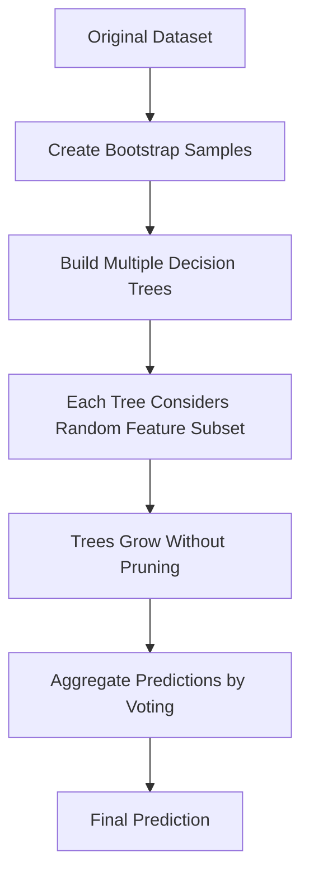

# 🌲 Random Forest Classification

<div align="center">


*A Powerful Ensemble Learning Method Based on Decision Trees*

</div>

---

## 📚 Table of Contents

- [What is Random Forest Classification?](#what-is-random-forest-classification)
- [Mathematical Foundation](#mathematical-foundation)
- [How It Works](#how-it-works)
- [Bias-Variance Tradeoff](#bias-variance-tradeoff)
- [Hyperparameters](#hyperparameters)
- [Implementation Guide](#implementation-guide)
- [Model Evaluation](#model-evaluation)
- [Feature Importance](#feature-importance)
- [Pros and Cons](#pros-and-cons)
- [Real-World Examples](#real-world-examples)
- [Advanced Topics](#advanced-topics)
- [FAQ](#faq)

---

## 🎯 What is Random Forest Classification?

**Random Forest** is an ensemble learning method that constructs a multitude of decision trees during training and outputs the class that is the mode of the classes (classification) or mean prediction (regression) of the individual trees. Random forests correct for decision trees' habit of overfitting to their training set.

### Key Characteristics:
- **Ensemble Method**: Combines multiple decision trees for more robust predictions
- **Bagging Technique**: Uses bootstrap aggregating (bagging) to train each tree on a random subset of the data
- **Feature Randomness**: Considers only a random subset of features when splitting nodes
- **Parallel Processing**: Trees can be built in parallel, making it efficient for large datasets
- **Non-parametric**: Makes no assumptions about the underlying data distribution
- **Handles Mixed Data**: Works well with both categorical and numerical features

### The Goal:
Create a diverse ensemble of decision trees that collectively produce more accurate and stable predictions than any individual tree.

---

## 🧮 Mathematical Foundation

### Bootstrap Aggregating (Bagging)

Random Forest uses bagging to create multiple training sets by sampling with replacement from the original data:

For a dataset with n samples, each bootstrap sample also has n samples, but some may be repeated while others are omitted.

The probability that a particular sample is not chosen in a bootstrap sample is:

```
P(not chosen) = (1 - 1/n)^n ≈ e^(-1) ≈ 0.368
```

This means about 63.2% of the original samples are used in each bootstrap sample, while 36.8% are left out (called "out-of-bag" samples).

### Random Feature Selection

At each node split, only a random subset of features is considered:

```
m = sqrt(p)  # For classification (recommended)
m = p/3      # For regression (recommended)
```

Where:
- m is the number of features to consider for each split
- p is the total number of features

### Voting Mechanism

For classification, each tree casts a vote for a class, and the final prediction is the majority vote:

```
ŷ = mode(h₁(x), h₂(x), ..., hₙ(x))
```

Where h₁, h₂, ..., hₙ are the individual decision tree predictions.

### Gini Impurity / Entropy

Each tree uses standard decision tree splitting criteria:

**Gini Impurity**:
```
Gini(D) = 1 - Σ(pᵢ²)
```

**Entropy**:
```
Entropy(D) = -Σ(pᵢ × log₂(pᵢ))
```

Where pᵢ is the proportion of samples that belong to class i.

### Out-of-Bag (OOB) Error Estimation

An internal validation method using samples not included in a particular tree's bootstrap sample:

```
OOB_error = 1/n × Σ I(ŷᵢ_oob ≠ yᵢ)
```

Where:
- ŷᵢ_oob is the prediction for sample i using only trees where i was out-of-bag
- I is the indicator function that equals 1 when the prediction is wrong

---

## ⚙️ How It Works

### Step-by-Step Process:

<div align="center">



</div>

### 1. **Bootstrap Sampling**
```python
def bootstrap_sample(X, y):
    """Create a bootstrap sample from the data."""
    n_samples = X.shape[0]
    idxs = np.random.choice(n_samples, size=n_samples, replace=True)
    return X[idxs], y[idxs]
```

### 2. **Build Individual Decision Trees**
```python
def build_tree(X, y, max_depth, min_samples_split, n_features):
    """Build a decision tree with limited features at each split."""
    # Base cases
    if len(np.unique(y)) == 1:
        return {'prediction': y[0]}
    
    if len(y) < min_samples_split or max_depth <= 0:
        return {'prediction': np.bincount(y).argmax()}
    
    # Randomly select a subset of features
    feature_idxs = np.random.choice(X.shape[1], n_features, replace=False)
    
    # Find the best split among the selected features
    best_feature, best_threshold = find_best_split(X, y, feature_idxs)
    
    # Split the data
    left_idxs = X[:, best_feature] <= best_threshold
    right_idxs = ~left_idxs
    
    # Recursively build subtrees
    left_subtree = build_tree(X[left_idxs], y[left_idxs], max_depth-1, min_samples_split, n_features)
    right_subtree = build_tree(X[right_idxs], y[right_idxs], max_depth-1, min_samples_split, n_features)
    
    return {
        'feature': best_feature,
        'threshold': best_threshold,
        'left': left_subtree,
        'right': right_subtree
    }
```

### 3. **Finding the Best Split**
```python
def find_best_split(X, y, feature_idxs):
    """Find the best feature and threshold to split on."""
    best_gain = -1
    best_feature = None
    best_threshold = None
    
    # Calculate parent entropy
    parent_entropy = calculate_entropy(y)
    
    # Try each feature in the random subset
    for feature_idx in feature_idxs:
        thresholds = np.unique(X[:, feature_idx])
        
        # Try each threshold
        for threshold in thresholds:
            # Split based on threshold
            left_idxs = X[:, feature_idx] <= threshold
            right_idxs = ~left_idxs
            
            # Skip if split doesn't divide the dataset
            if np.sum(left_idxs) == 0 or np.sum(right_idxs) == 0:
                continue
            
            # Calculate information gain
            n = len(y)
            n_left, n_right = np.sum(left_idxs), np.sum(right_idxs)
            
            left_entropy = calculate_entropy(y[left_idxs])
            right_entropy = calculate_entropy(y[right_idxs])
            
            weighted_entropy = (n_left / n) * left_entropy + (n_right / n) * right_entropy
            information_gain = parent_entropy - weighted_entropy
            
            # Update best split if better
            if information_gain > best_gain:
                best_gain = information_gain
                best_feature = feature_idx
                best_threshold = threshold
    
    return best_feature, best_threshold
```

### 4. **Predicting with a Single Tree**
```python
def predict_tree(x, tree):
    """Make prediction with a single decision tree."""
    if 'prediction' in tree:
        return tree['prediction']
    
    if x[tree['feature']] <= tree['threshold']:
        return predict_tree(x, tree['left'])
    else:
        return predict_tree(x, tree['right'])
```

### 5. **Random Forest Implementation**
```python
class RandomForest:
    def __init__(self, n_trees=100, max_depth=None, min_samples_split=2, n_features=None):
        self.n_trees = n_trees
        self.max_depth = max_depth
        self.min_samples_split = min_samples_split
        self.n_features = n_features
        self.trees = []
    
    def fit(self, X, y):
        """Build a random forest of decision trees."""
        self.trees = []
        self.n_features = self.n_features if self.n_features else int(np.sqrt(X.shape[1]))
        
        for _ in range(self.n_trees):
            # Bootstrap sampling
            X_sample, y_sample = bootstrap_sample(X, y)
            
            # Build a tree
            tree = build_tree(X_sample, y_sample, self.max_depth, self.min_samples_split, self.n_features)
            self.trees.append(tree)
        
        return self
    
    def predict(self, X):
        """Make predictions with the random forest."""
        # Get predictions from all trees
        tree_predictions = np.array([[predict_tree(x, tree) for x in X] for tree in self.trees])
        
        # Take majority vote for each sample
        forest_predictions = stats.mode(tree_predictions, axis=0)[0]
        return forest_predictions.flatten()
```

### 6. **Out-of-Bag (OOB) Error Estimation**
```python
def oob_error(X, y, trees, bootstrap_indices):
    """Calculate out-of-bag error."""
    n_samples = len(y)
    predictions = np.zeros(n_samples)
    prediction_counts = np.zeros(n_samples)
    
    # For each tree, predict on its OOB samples
    for i, (tree, indices) in enumerate(zip(trees, bootstrap_indices)):
        # Find out-of-bag samples for this tree
        oob_mask = np.ones(n_samples, dtype=bool)
        oob_mask[indices] = False
        oob_indices = np.where(oob_mask)[0]
        
        # Make predictions for OOB samples
        for idx in oob_indices:
            predictions[idx] += predict_tree(X[idx], tree)
            prediction_counts[idx] += 1
    
    # Average predictions for each sample
    valid_idx = prediction_counts > 0
    predictions[valid_idx] = np.round(predictions[valid_idx] / prediction_counts[valid_idx])
    
    # Calculate OOB error
    oob_error = np.mean(predictions[valid_idx] != y[valid_idx])
    return oob_error
```

---

## ⚖️ Bias-Variance Tradeoff

Random Forest effectively manages the bias-variance tradeoff by combining multiple high-variance, low-bias models (unpruned decision trees) into a lower-variance ensemble.

### Bias
- Individual decision trees have **low bias** because they can model complex decision boundaries
- Random Forest inherits this low bias while reducing variance

### Variance
- Individual decision trees have **high variance** due to their sensitivity to the training data
- Random Forest reduces variance through:
  1. **Bagging**: Training each tree on different bootstrap samples
  2. **Feature Randomness**: Considering different feature subsets at each split
  3. **Averaging**: Combining predictions from many diverse trees

### Visualization of the Bias-Variance Tradeoff

```python
import numpy as np
import matplotlib.pyplot as plt
from sklearn.tree import DecisionTreeClassifier
from sklearn.ensemble import RandomForestClassifier
from sklearn.datasets import make_moons
from sklearn.model_selection import train_test_split

# Generate synthetic data
X, y = make_moons(n_samples=1000, noise=0.25, random_state=42)
X_train, X_test, y_train, y_test = train_test_split(X, y, test_size=0.3, random_state=42)

# Train a single decision tree and a random forest
tree = DecisionTreeClassifier(max_depth=5, random_state=42)
forest = RandomForestClassifier(n_estimators=100, max_depth=5, random_state=42)

tree.fit(X_train, y_train)
forest.fit(X_train, y_train)

# Create a mesh grid for visualization
h = 0.02
x_min, x_max = X[:, 0].min() - .5, X[:, 0].max() + .5
y_min, y_max = X[:, 1].min() - .5, X[:, 1].max() + .5
xx, yy = np.meshgrid(np.arange(x_min, x_max, h), np.arange(y_min, y_max, h))

# Plot decision boundaries
plt.figure(figsize=(15, 6))

# Decision Tree
plt.subplot(1, 2, 1)
Z = tree.predict(np.c_[xx.ravel(), yy.ravel()])
Z = Z.reshape(xx.shape)
plt.contourf(xx, yy, Z, alpha=0.3)
plt.scatter(X_train[:, 0], X_train[:, 1], c=y_train, edgecolor='k', alpha=0.6)
plt.title(f"Decision Tree (Accuracy: {tree.score(X_test, y_test):.3f})")

# Random Forest
plt.subplot(1, 2, 2)
Z = forest.predict(np.c_[xx.ravel(), yy.ravel()])
Z = Z.reshape(xx.shape)
plt.contourf(xx, yy, Z, alpha=0.3)
plt.scatter(X_train[:, 0], X_train[:, 1], c=y_train, edgecolor='k', alpha=0.6)
plt.title(f"Random Forest (Accuracy: {forest.score(X_test, y_test):.3f})")

plt.tight_layout()
plt.show()
```

---

## 🔧 Hyperparameters

Random Forest has several important hyperparameters that affect its performance:

### 1. **Number of Trees (n_estimators)**
- **Effect**: More trees generally lead to better performance, up to a point of diminishing returns
- **Trade-off**: More trees increase training time and memory usage
- **Recommended Range**: 100-500 trees (often 100 is sufficient)
- **Code**: `RandomForestClassifier(n_estimators=100)`

### 2. **Maximum Depth of Trees (max_depth)**
- **Effect**: Controls how deep each tree can grow
- **Trade-off**: Deeper trees can model more complex relationships but may overfit
- **Recommended Range**: 5-30 or None (unlimited)
- **Code**: `RandomForestClassifier(max_depth=10)`

### 3. **Minimum Samples Split (min_samples_split)**
- **Effect**: Minimum number of samples required to split an internal node
- **Trade-off**: Higher values prevent creating nodes with few samples, reducing overfitting
- **Recommended Range**: 2-20
- **Code**: `RandomForestClassifier(min_samples_split=5)`

### 4. **Minimum Samples Leaf (min_samples_leaf)**
- **Effect**: Minimum number of samples required at a leaf node
- **Trade-off**: Higher values create more balanced trees, reducing overfitting
- **Recommended Range**: 1-10
- **Code**: `RandomForestClassifier(min_samples_leaf=4)`

### 5. **Maximum Features (max_features)**
- **Effect**: Number of features to consider when looking for the best split
- **Trade-off**: Fewer features increase diversity among trees but may reduce individual tree performance
- **Recommended Values**:
  - `sqrt`: Square root of the total number of features (default for classification)
  - `log2`: Log base 2 of the total number of features
  - `1/3`: One third of the total number of features (default for regression)
- **Code**: `RandomForestClassifier(max_features='sqrt')`

### 6. **Bootstrap Sampling (bootstrap)**
- **Effect**: Whether to use bootstrap sampling when building trees
- **Trade-off**: Disabling creates more diverse trees but may not work as well with smaller datasets
- **Recommended Value**: True (default)
- **Code**: `RandomForestClassifier(bootstrap=True)`

### 7. **Class Weight (class_weight)**
- **Effect**: Adjusts weights for different classes to handle imbalanced datasets
- **Options**:
  - `None`: All classes have equal weight
  - `balanced`: Weights are inversely proportional to class frequencies
  - Custom dict: User-specified weights per class
- **Code**: `RandomForestClassifier(class_weight='balanced')`

### Hyperparameter Tuning Example
```python
from sklearn.model_selection import GridSearchCV
from sklearn.ensemble import RandomForestClassifier

# Define parameter grid
param_grid = {
    'n_estimators': [50, 100, 200],
    'max_depth': [None, 10, 20, 30],
    'min_samples_split': [2, 5, 10],
    'min_samples_leaf': [1, 2, 4],
    'max_features': ['sqrt', 'log2']
}

# Create a random forest classifier
rf = RandomForestClassifier(random_state=42)

# Perform grid search with cross-validation
grid_search = GridSearchCV(estimator=rf, param_grid=param_grid, 
                          cv=5, n_jobs=-1, scoring='accuracy', verbose=1)
grid_search.fit(X_train, y_train)

# Print best parameters
print("Best Parameters:", grid_search.best_params_)
print("Best Score:", grid_search.best_score_)

# Use best estimator
best_rf = grid_search.best_estimator_
```

---

## 💻 Implementation Guide

### From Scratch Implementation

```python
import numpy as np
from collections import Counter

class DecisionTree:
    def __init__(self, max_depth=None, min_samples_split=2, n_features=None):
        self.max_depth = max_depth
        self.min_samples_split = min_samples_split
        self.n_features = n_features
        self.tree = None
    
    def fit(self, X, y):
        self.n_features = self.n_features if self.n_features else X.shape[1]
        self.tree = self._grow_tree(X, y)
        return self
    
    def _grow_tree(self, X, y, depth=0):
        n_samples, n_feats = X.shape
        n_classes = len(np.unique(y))
        
        # Stopping criteria
        if (self.max_depth is not None and depth >= self.max_depth) or \
           n_samples < self.min_samples_split or \
           n_classes == 1:
            leaf_value = Counter(y).most_common(1)[0][0]
            return {'value': leaf_value}
        
        # Randomly select features
        feat_idxs = np.random.choice(n_feats, self.n_features, replace=False)
        
        # Find best split
        best_feat, best_thresh = self._best_split(X, y, feat_idxs)
        
        # Split data
        left_idxs, right_idxs = self._split(X[:, best_feat], best_thresh)
        
        # Build subtrees recursively
        left = self._grow_tree(X[left_idxs, :], y[left_idxs], depth+1)
        right = self._grow_tree(X[right_idxs, :], y[right_idxs], depth+1)
        
        return {'feature_idx': best_feat, 'threshold': best_thresh, 'left': left, 'right': right}
    
    def _best_split(self, X, y, feat_idxs):
        best_gain = -1
        best_feat, best_thresh = None, None
        
        for feat_idx in feat_idxs:
            X_column = X[:, feat_idx]
            thresholds = np.unique(X_column)
            
            for threshold in thresholds:
                gain = self._information_gain(y, X_column, threshold)
                
                if gain > best_gain:
                    best_gain = gain
                    best_feat = feat_idx
                    best_thresh = threshold
        
        return best_feat, best_thresh
    
    def _information_gain(self, y, X_column, threshold):
        # Parent entropy
        parent_entropy = self._entropy(y)
        
        # Create children
        left_idxs, right_idxs = self._split(X_column, threshold)
        if len(left_idxs) == 0 or len(right_idxs) == 0:
            return 0
        
        # Calculate weighted entropy of children
        n = len(y)
        n_l, n_r = len(left_idxs), len(right_idxs)
        e_l, e_r = self._entropy(y[left_idxs]), self._entropy(y[right_idxs])
        child_entropy = (n_l/n) * e_l + (n_r/n) * e_r
        
        # Return information gain
        return parent_entropy - child_entropy
    
    def _entropy(self, y):
        hist = np.bincount(y)
        ps = hist / len(y)
        ps = ps[ps > 0]  # Remove zero probabilities
        return -np.sum(ps * np.log2(ps))
    
    def _split(self, X_column, threshold):
        left_idxs = np.argwhere(X_column <= threshold).flatten()
        right_idxs = np.argwhere(X_column > threshold).flatten()
        return left_idxs, right_idxs
    
    def predict(self, X):
        return np.array([self._traverse_tree(x, self.tree) for x in X])
    
    def _traverse_tree(self, x, node):
        if 'value' in node:
            return node['value']
        
        if x[node['feature_idx']] <= node['threshold']:
            return self._traverse_tree(x, node['left'])
        return self._traverse_tree(x, node['right'])

class RandomForest:
    def __init__(self, n_trees=100, max_depth=None, min_samples_split=2, n_features=None):
        self.n_trees = n_trees
        self.max_depth = max_depth
        self.min_samples_split = min_samples_split
        self.n_features = n_features
        self.trees = []
    
    def fit(self, X, y):
        self.trees = []
        
        for _ in range(self.n_trees):
            # Bootstrap sample
            idxs = np.random.choice(len(X), size=len(X), replace=True)
            X_sample, y_sample = X[idxs], y[idxs]
            
            # Train a decision tree
            tree = DecisionTree(
                max_depth=self.max_depth,
                min_samples_split=self.min_samples_split,
                n_features=self.n_features
            )
            tree.fit(X_sample, y_sample)
            self.trees.append(tree)
            
        return self
    
    def predict(self, X):
        # Collect predictions from all trees
        tree_preds = np.array([tree.predict(X) for tree in self.trees])
        
        # Return majority vote for each sample
        return np.array([Counter(tree_preds[:, i]).most_common(1)[0][0] for i in range(len(X))])
    
    def oob_score(self, X, y):
        """Calculate out-of-bag score."""
        n_samples = len(X)
        oob_preds = np.zeros(n_samples)
        oob_counts = np.zeros(n_samples)
        
        for i_tree, tree in enumerate(self.trees):
            # Get OOB samples for this tree
            bootstrap_indices = np.random.choice(n_samples, size=n_samples, replace=True)
            oob_mask = np.ones(n_samples, dtype=bool)
            oob_mask[bootstrap_indices] = False
            oob_indices = np.where(oob_mask)[0]
            
            # Predict on OOB samples
            if len(oob_indices) > 0:
                oob_preds[oob_indices] += tree.predict(X[oob_indices])
                oob_counts[oob_indices] += 1
        
        # Get majority vote for samples with OOB predictions
        valid_indices = oob_counts > 0
        oob_preds[valid_indices] = (oob_preds[valid_indices] / oob_counts[valid_indices]).round()
        
        # Return accuracy
        return np.mean(oob_preds[valid_indices] == y[valid_indices])
```

### Using Scikit-learn

```python
from sklearn.ensemble import RandomForestClassifier
from sklearn.model_selection import train_test_split
from sklearn.metrics import accuracy_score, confusion_matrix, classification_report
from sklearn.datasets import load_breast_cancer
import numpy as np

# Load dataset
data = load_breast_cancer()
X, y = data.data, data.target

# Split data
X_train, X_test, y_train, y_test = train_test_split(X, y, test_size=0.2, random_state=42)

# Initialize and train Random Forest
rf = RandomForestClassifier(
    n_estimators=100,    # Number of trees
    max_depth=10,        # Maximum tree depth
    min_samples_split=5, # Minimum samples to split a node
    min_samples_leaf=2,  # Minimum samples at a leaf
    max_features='sqrt', # Number of features to consider for best split
    bootstrap=True,      # Use bootstrap sampling
    random_state=42,     # For reproducibility
    n_jobs=-1            # Use all available cores
)
rf.fit(X_train, y_train)

# Make predictions
y_pred = rf.predict(X_test)
y_prob = rf.predict_proba(X_test)[:, 1]  # Probability estimates

# Evaluate
accuracy = accuracy_score(y_test, y_pred)
print(f"Accuracy: {accuracy:.4f}")
print("\nClassification Report:")
print(classification_report(y_test, y_pred, target_names=data.target_names))

# Feature importance
feature_importance = pd.DataFrame({
    'Feature': data.feature_names,
    'Importance': rf.feature_importances_
}).sort_values('Importance', ascending=False)

print("\nTop 5 Important Features:")
print(feature_importance.head(5))

# Out-of-bag score (if bootstrap=True)
oob_score = rf.oob_score_ if hasattr(rf, 'oob_score_') else None
print(f"\nOut-of-bag score: {oob_score}")
```

### Complete Example with Visualization

```python
import numpy as np
import pandas as pd
import matplotlib.pyplot as plt
import seaborn as sns
from sklearn.ensemble import RandomForestClassifier
from sklearn.metrics import accuracy_score, roc_curve, auc, confusion_matrix
from sklearn.model_selection import train_test_split, learning_curve
from sklearn.datasets import make_classification
from sklearn.inspection import permutation_importance

# Generate a synthetic dataset
X, y = make_classification(
    n_samples=1000, n_features=20, n_informative=10,
    n_redundant=5, n_classes=2, random_state=42
)

# Split the data
X_train, X_test, y_train, y_test = train_test_split(X, y, test_size=0.3, random_state=42)

# Create and train the model
rf = RandomForestClassifier(n_estimators=100, random_state=42, oob_score=True)
rf.fit(X_train, y_train)

# Make predictions
y_pred = rf.predict(X_test)
y_pred_proba = rf.predict_proba(X_test)[:, 1]

# Plot ROC Curve
fpr, tpr, _ = roc_curve(y_test, y_pred_proba)
roc_auc = auc(fpr, tpr)

plt.figure(figsize=(15, 10))

# 1. ROC Curve
plt.subplot(2, 2, 1)
plt.plot(fpr, tpr, color='darkorange', lw=2, label=f'ROC curve (AUC = {roc_auc:.3f})')
plt.plot([0, 1], [0, 1], color='navy', lw=2, linestyle='--')
plt.xlim([0.0, 1.0])
plt.ylim([0.0, 1.05])
plt.xlabel('False Positive Rate')
plt.ylabel('True Positive Rate')
plt.title('Receiver Operating Characteristic')
plt.legend(loc="lower right")
plt.grid(True, alpha=0.3)

# 2. Feature Importance
feature_names = [f'Feature {i}' for i in range(X.shape[1])]
importances = rf.feature_importances_
indices = np.argsort(importances)[::-1]

plt.subplot(2, 2, 2)
plt.bar(range(10), importances[indices[:10]], align='center')
plt.xticks(range(10), [feature_names[i] for i in indices[:10]], rotation=45)
plt.title('Feature Importance')
plt.tight_layout()

# 3. Confusion Matrix
cm = confusion_matrix(y_test, y_pred)
plt.subplot(2, 2, 3)
sns.heatmap(cm, annot=True, fmt='d', cmap='Blues')
plt.title('Confusion Matrix')
plt.xlabel('Predicted Label')
plt.ylabel('True Label')

# 4. Learning Curve
train_sizes, train_scores, test_scores = learning_curve(
    RandomForestClassifier(n_estimators=100, random_state=42),
    X, y, cv=5, n_jobs=-1,
    train_sizes=np.linspace(0.1, 1.0, 5)
)

plt.subplot(2, 2, 4)
train_scores_mean = np.mean(train_scores, axis=1)
train_scores_std = np.std(train_scores, axis=1)
test_scores_mean = np.mean(test_scores, axis=1)
test_scores_std = np.std(test_scores, axis=1)

plt.fill_between(train_sizes, train_scores_mean - train_scores_std,
                train_scores_mean + train_scores_std, alpha=0.1, color="r")
plt.fill_between(train_sizes, test_scores_mean - test_scores_std,
                test_scores_mean + test_scores_std, alpha=0.1, color="g")
plt.plot(train_sizes, train_scores_mean, 'o-', color="r", label="Training score")
plt.plot(train_sizes, test_scores_mean, 'o-', color="g", label="Cross-validation score")
plt.xlabel("Training examples")
plt.ylabel("Score")
plt.title("Learning Curve")
plt.legend(loc="best")
plt.grid(True, alpha=0.3)

plt.tight_layout()
plt.show()

# Print additional metrics
print(f"Accuracy: {accuracy_score(y_test, y_pred):.4f}")
print(f"Out-of-bag score: {rf.oob_score_:.4f}")

# Calculate and plot permutation feature importance
result = permutation_importance(rf, X_test, y_test, n_repeats=10, random_state=42)
perm_sorted_idx = result.importances_mean.argsort()[::-1]

plt.figure(figsize=(10, 6))
plt.boxplot(result.importances[perm_sorted_idx[:10]].T,
           labels=[feature_names[i] for i in perm_sorted_idx[:10]])
plt.title("Permutation Feature Importance")
plt.xticks(rotation=45)
plt.tight_layout()
plt.show()

# Analyze tree depths
n_nodes = [estimator.tree_.node_count for estimator in rf.estimators_]
max_depths = [estimator.tree_.max_depth for estimator in rf.estimators_]

plt.figure(figsize=(10, 5))

plt.subplot(1, 2, 1)
plt.hist(n_nodes, bins=20)
plt.title(f'Number of Nodes\nAvg: {np.mean(n_nodes):.1f}')
plt.xlabel('Number of Nodes')
plt.ylabel('Frequency')

plt.subplot(1, 2, 2)
plt.hist(max_depths, bins=range(max(max_depths)+2))
plt.title(f'Max Depths\nAvg: {np.mean(max_depths):.1f}')
plt.xlabel('Tree Depth')
plt.ylabel('Frequency')

plt.tight_layout()
plt.show()
```

---

## 📊 Model Evaluation

### Key Metrics for Classification

#### 1. **Accuracy**
```python
def accuracy(y_true, y_pred):
    """Proportion of correct predictions."""
    return np.mean(y_true == y_pred)
```

#### 2. **Precision, Recall, F1-Score**
```python
def precision_recall_f1(y_true, y_pred, positive_class=1):
    """Calculate precision, recall, and F1-score for a binary classifier."""
    # True positives, false positives, false negatives
    tp = np.sum((y_true == positive_class) & (y_pred == positive_class))
    fp = np.sum((y_true != positive_class) & (y_pred == positive_class))
    fn = np.sum((y_true == positive_class) & (y_pred != positive_class))
    
    precision = tp / (tp + fp) if (tp + fp) > 0 else 0
    recall = tp / (tp + fn) if (tp + fn) > 0 else 0
    f1 = 2 * precision * recall / (precision + recall) if (precision + recall) > 0 else 0
    
    return precision, recall, f1
```

#### 3. **Confusion Matrix**
```python
def confusion_matrix(y_true, y_pred, labels=None):
    """Create confusion matrix."""
    if labels is None:
        labels = sorted(set(np.concatenate([y_true, y_pred])))
    
    n_classes = len(labels)
    cm = np.zeros((n_classes, n_classes), dtype=int)
    
    for i, true_label in enumerate(labels):
        for j, pred_label in enumerate(labels):
            cm[i, j] = np.sum((y_true == true_label) & (y_pred == pred_label))
    
    return cm
```

#### 4. **ROC Curve and AUC**
```python
def roc_curve_and_auc(y_true, y_prob):
    """Calculate ROC curve coordinates and AUC."""
    # Sort by probability
    sorted_indices = np.argsort(y_prob)[::-1]
    y_true = y_true[sorted_indices]
    y_prob = y_prob[sorted_indices]
    
    # Calculate TPR and FPR at different thresholds
    n_pos = np.sum(y_true == 1)
    n_neg = np.sum(y_true == 0)
    
    tpr = np.cumsum(y_true) / n_pos
    fpr = np.cumsum(1 - y_true) / n_neg
    
    # Add origin and endpoint
    tpr = np.concatenate([[0], tpr, [1]])
    fpr = np.concatenate([[0], fpr, [1]])
    
    # Calculate AUC using trapezoidal rule
    auc_value = np.trapz(tpr, fpr)
    
    return fpr, tpr, auc_value
```

### Random Forest Specific Evaluation

#### 1. **Out-of-Bag (OOB) Score**
```python
def oob_score(rf, X, y):
    """Calculate out-of-bag score for a random forest."""
    if not hasattr(rf, 'estimators_samples_'):
        raise ValueError("Random forest must be trained with bootstrap=True and oob_score=True")
    
    n_samples = X.shape[0]
    predictions = np.zeros(n_samples)
    n_predictions = np.zeros(n_samples)
    
    for i, estimator in enumerate(rf.estimators_):
        # Get OOB samples for this estimator
        oob_indices = np.setdiff1d(np.arange(n_samples), rf.estimators_samples_[i])
        if len(oob_indices) > 0:
            # Make predictions on OOB samples
            oob_pred = estimator.predict(X[oob_indices, :])
            # Accumulate predictions
            for j, idx in enumerate(oob_indices):
                predictions[idx] += oob_pred[j]
                n_predictions[idx] += 1
    
    # Calculate final predictions (majority vote)
    mask = n_predictions > 0
    predictions[mask] = np.round(predictions[mask] / n_predictions[mask])
    
    # Calculate accuracy on valid predictions
    return np.mean(predictions[mask] == y[mask])
```

#### 2. **Feature Importance Analysis**
```python
def analyze_feature_importance(rf, feature_names, X, y, n_top=10):
    """Analyze feature importance using multiple methods."""
    # Built-in feature importance
    importances = rf.feature_importances_
    std = np.std([tree.feature_importances_ for tree in rf.estimators_], axis=0)
    
    # Permutation importance
    from sklearn.inspection import permutation_importance
    result = permutation_importance(rf, X, y, n_repeats=10, random_state=42)
    perm_importance = result.importances_mean
    
    # Sort feature indices by importance
    indices = np.argsort(importances)[::-1]
    perm_indices = np.argsort(perm_importance)[::-1]
    
    # Create DataFrame for comparison
    import pandas as pd
    feature_importance_df = pd.DataFrame({
        'Feature': feature_names,
        'MDI Importance': importances,
        'MDI Std Dev': std,
        'Permutation Importance': perm_importance,
        'Permutation Std Dev': result.importances_std
    })
    
    # Sort by MDI importance
    feature_importance_df = feature_importance_df.sort_values('MDI Importance', ascending=False)
    
    return feature_importance_df.head(n_top)
```

#### 3. **Learning Curves**
```python
def plot_learning_curves(X, y, cv=5):
    """Plot learning curves for random forest with different parameters."""
    from sklearn.model_selection import learning_curve
    import matplotlib.pyplot as plt
    
    fig, axes = plt.subplots(1, 3, figsize=(18, 5))
    
    # Try different numbers of trees
    n_estimators_list = [10, 50, 100]
    
    for i, n_estimators in enumerate(n_estimators_list):
        rf = RandomForestClassifier(n_estimators=n_estimators, random_state=42)
        
        train_sizes, train_scores, test_scores = learning_curve(
            rf, X, y, cv=cv, n_jobs=-1,
            train_sizes=np.linspace(0.1, 1.0, 10)
        )
        
        train_mean = np.mean(train_scores, axis=1)
        train_std = np.std(train_scores, axis=1)
        test_mean = np.mean(test_scores, axis=1)
        test_std = np.std(test_scores, axis=1)
        
        axes[i].fill_between(train_sizes, train_mean - train_std, train_mean + train_std, alpha=0.1, color='blue')
        axes[i].fill_between(train_sizes, test_mean - test_std, test_mean + test_std, alpha=0.1, color='orange')
        axes[i].plot(train_sizes, train_mean, 'o-', color='blue', label='Training score')
        axes[i].plot(train_sizes, test_mean, 'o-', color='orange', label='Cross-validation score')
        axes[i].set_xlabel("Training examples")
        axes[i].set_ylabel("Score")
        axes[i].set_title(f"n_estimators={n_estimators}")
        axes[i].legend(loc="best")
        axes[i].grid(True, alpha=0.3)
    
    plt.tight_layout()
    plt.show()
```

---

## 🏆 Feature Importance

Random Forest provides several ways to determine feature importance:

### 1. **Mean Decrease in Impurity (MDI)**

This is the built-in feature_importances_ attribute in scikit-learn, calculated based on how much each feature reduces impurity (Gini or entropy) on average across all trees.

```python
def plot_mdi_feature_importance(rf, feature_names, top_n=10):
    """Plot Mean Decrease in Impurity feature importance."""
    importances = rf.feature_importances_
    std = np.std([tree.feature_importances_ for tree in rf.estimators_], axis=0)
    
    # Sort features by importance
    indices = np.argsort(importances)[::-1]
    
    # Plot top N features
    plt.figure(figsize=(10, 6))
    plt.title("Feature Importance (MDI)")
    plt.bar(range(top_n), importances[indices[:top_n]], 
            color="b", yerr=std[indices[:top_n]], align="center")
    plt.xticks(range(top_n), [feature_names[i] for i in indices[:top_n]], rotation=45)
    plt.xlim([-1, top_n])
    plt.tight_layout()
    plt.show()
```

### 2. **Permutation Importance**

Measures the decrease in model performance when a feature's values are randomly shuffled, which breaks the relationship between the feature and the target.

```python
def plot_permutation_importance(rf, X, y, feature_names, top_n=10):
    """Calculate and plot permutation feature importance."""
    from sklearn.inspection import permutation_importance
    
    result = permutation_importance(rf, X, y, n_repeats=10, random_state=42)
    perm_importance = result.importances_mean
    perm_std = result.importances_std
    
    # Sort features by importance
    perm_indices = np.argsort(perm_importance)[::-1]
    
    # Plot top N features
    plt.figure(figsize=(10, 6))
    plt.title("Feature Importance (Permutation)")
    plt.bar(range(top_n), perm_importance[perm_indices[:top_n]], 
            color="r", yerr=perm_std[perm_indices[:top_n]], align="center")
    plt.xticks(range(top_n), [feature_names[i] for i in perm_indices[:top_n]], rotation=45)
    plt.xlim([-1, top_n])
    plt.tight_layout()
    plt.show()
    
    return result
```

### 3. **Drop-Column Importance**

Evaluates how removing a feature affects model performance.

```python
def drop_column_importance(rf, X, y, feature_names):
    """Calculate feature importance by dropping each column and measuring impact."""
    baseline_score = rf.score(X, y)
    importances = []
    
    for i in range(X.shape[1]):
        # Create a copy of the data without the current feature
        X_dropped = np.delete(X, i, axis=1)
        
        # Train a new model
        rf_dropped = RandomForestClassifier(
            n_estimators=rf.n_estimators,
            max_depth=rf.max_depth,
            random_state=rf.random_state
        )
        rf_dropped.fit(X_dropped, y)
        
        # Calculate score drop
        score = rf_dropped.score(X_dropped, y)
        importance = baseline_score - score
        importances.append(importance)
    
    # Create DataFrame with results
    import pandas as pd
    result_df = pd.DataFrame({
        'Feature': feature_names,
        'Importance': importances
    }).sort_values('Importance', ascending=False)
    
    return result_df
```

### 4. **Feature Importance Visualization**

```python
def compare_feature_importance_methods(rf, X, y, feature_names):
    """Compare different feature importance methods."""
    # MDI importance (built-in)
    mdi_importance = rf.feature_importances_
    
    # Permutation importance
    from sklearn.inspection import permutation_importance
    perm_result = permutation_importance(rf, X, y, n_repeats=10, random_state=42)
    perm_importance = perm_result.importances_mean
    
    # Drop-column importance
    drop_importance_df = drop_column_importance(rf, X, y, feature_names)
    drop_importance = np.array([drop_importance_df[drop_importance_df['Feature'] == feat]['Importance'].values[0]
                              for feat in feature_names])
    
    # Create DataFrame for comparison
    import pandas as pd
    comparison_df = pd.DataFrame({
        'Feature': feature_names,
        'MDI Importance': mdi_importance,
        'Permutation Importance': perm_importance,
        'Drop-Column Importance': drop_importance
    })
    
    # Normalize each importance method to sum to 1 for fair comparison
    for col in ['MDI Importance', 'Permutation Importance', 'Drop-Column Importance']:
        comparison_df[col] = comparison_df[col] / comparison_df[col].sum()
    
    # Sort by average importance
    comparison_df['Average Importance'] = comparison_df[['MDI Importance', 
                                                       'Permutation Importance', 
                                                       'Drop-Column Importance']].mean(axis=1)
    comparison_df = comparison_df.sort_values('Average Importance', ascending=False)
    
    # Plot top 10 features with all methods
    top_features = comparison_df.head(10)['Feature'].values
    
    # Create DataFrame in long format for seaborn
    plot_df = pd.melt(
        comparison_df[comparison_df['Feature'].isin(top_features)],
        id_vars='Feature',
        value_vars=['MDI Importance', 'Permutation Importance', 'Drop-Column Importance'],
        var_name='Method',
        value_name='Importance'
    )
    
    # Plot
    plt.figure(figsize=(12, 8))
    sns.barplot(x='Feature', y='Importance', hue='Method', data=plot_df)
    plt.xticks(rotation=45)
    plt.title('Feature Importance Comparison (Top 10 Features)')
    plt.tight_layout()
    plt.show()
    
    return comparison_df
```

---

## ✅ Pros and Cons

<div align="center">

| ✅ **Advantages** | ❌ **Disadvantages** |
|-------------------|---------------------|
| **Excellent Performance** | **Black Box Nature** |
| Often one of the best "off-the-shelf" algorithms | Less interpretable than a single decision tree |
| **Handles Non-Linear Relationships** | **Computationally Intensive** |
| Captures complex interactions between features | Training many deep trees requires significant resources |
| **Feature Importance** | **Large Memory Footprint** |
| Provides reliable feature importance metrics | Storing many trees requires substantial memory |
| **Robust to Overfitting** | **Not Ideal for Linear Problems** |
| Ensemble nature reduces variance and overfitting | Overkill for simple linear relationships |
| **Handles Imbalanced Data Well** | **May Overfit Noisy Datasets** |
| Better than single trees with class weighting | With very noisy data, can still overfit despite ensemble approach |
| **Little Preprocessing Required** | **Biased Towards Categorical Features with Many Categories** |
| No need for feature scaling | May give unfair importance to such features |
| **Built-in Cross-Validation** | **Poor Performance with Sparse Data** |
| Out-of-bag samples provide validation without extra data | Not as effective with high-dimensional sparse data |
| **Handles Missing Values** | **Not Suited for Small Datasets** |
| Can be adapted to work with incomplete data | Benefits of ensemble are limited with very small datasets |
| **Parallel Processing** | **Training Time** |
| Trees can be built in parallel | Slower to train than simpler models like logistic regression |

</div>

### When to Use Random Forest:

✅ **Good Choice When:**
- You need a powerful, generally reliable classifier
- Your data has non-linear relationships and interactions
- Feature importance is needed for interpretation
- Missing values or outliers are present in data
- You have unbalanced classes
- A mix of numerical and categorical features
- Medium to large dataset size
- Parallelization is available

❌ **Avoid When:**
- Maximum interpretability is required (use a single decision tree)
- Data is very high-dimensional and sparse (try linear models)
- Very small dataset (may overfit despite ensemble)
- Limited computational resources and training time
- Problem is clearly linear in nature
- Real-time/low-latency prediction is required

---

## 🌍 Real-World Examples

### Example 1: Credit Risk Assessment
```python
# Credit risk assessment with Random Forest
import numpy as np
import pandas as pd
import matplotlib.pyplot as plt
import seaborn as sns
from sklearn.ensemble import RandomForestClassifier
from sklearn.model_selection import train_test_split, cross_val_score, StratifiedKFold
from sklearn.metrics import classification_report, confusion_matrix, roc_curve, auc, precision_recall_curve
from sklearn.preprocessing import StandardScaler, OneHotEncoder
from sklearn.compose import ColumnTransformer
from sklearn.pipeline import Pipeline
from sklearn.impute import SimpleImputer

# Load or generate credit data (synthetic for this example)
np.random.seed(42)

# Sample size
n_samples = 2000

# Generate features
age = np.random.normal(35, 10, n_samples).clip(18, 75).astype(int)
income = np.random.gamma(shape=5, scale=10000, size=n_samples)
employment_years = np.random.gamma(shape=2, scale=3, size=n_samples).clip(0, 40)
debt_ratio = np.random.beta(2, 5, n_samples)
credit_score = np.random.normal(650, 100, n_samples).clip(300, 850).astype(int)

# Generate categorical features
education = np.random.choice(['High School', 'Bachelor', 'Master', 'PhD'], 
                          size=n_samples, p=[0.5, 0.3, 0.15, 0.05])
employment_type = np.random.choice(['Unemployed', 'Part-time', 'Full-time', 'Self-employed'], 
                                size=n_samples, p=[0.1, 0.2, 0.6, 0.1])
marital_status = np.random.choice(['Single', 'Married', 'Divorced', 'Widowed'], 
                               size=n_samples, p=[0.4, 0.4, 0.15, 0.05])

# Generate some missing values
for col in [income, employment_years, credit_score]:
    mask = np.random.random(n_samples) < 0.05
    col[mask] = np.nan

# Generate default probability based on features
default_prob = 0.3 - 0.0005 * (credit_score - 650) + 0.1 * debt_ratio - 0.03 * (employment_years) + 0.1 * (employment_type == 'Unemployed')
default_prob = np.clip(default_prob, 0.01, 0.99)

# Generate target
default = np.random.binomial(1, default_prob)

# Create DataFrame
credit_data = pd.DataFrame({
    'age': age,
    'income': income,
    'employment_years': employment_years,
    'debt_ratio': debt_ratio,
    'credit_score': credit_score,
    'education': education,
    'employment_type': employment_type,
    'marital_status': marital_status,
    'default': default
})

# Display data info
print("Credit Dataset Info:")
print(f"Shape: {credit_data.shape}")
print(f"Default Rate: {credit_data['default'].mean():.2%}")
print("\nSample Data:")
print(credit_data.head())
print("\nMissing Values:")
print(credit_data.isnull().sum())

# Split features and target
X = credit_data.drop('default', axis=1)
y = credit_data['default']

# Define preprocessing for numeric and categorical features
numeric_features = ['age', 'income', 'employment_years', 'debt_ratio', 'credit_score']
categorical_features = ['education', 'employment_type', 'marital_status']

numeric_transformer = Pipeline(steps=[
    ('imputer', SimpleImputer(strategy='median')),
    ('scaler', StandardScaler())
])

categorical_transformer = Pipeline(steps=[
    ('imputer', SimpleImputer(strategy='most_frequent')),
    ('onehot', OneHotEncoder(handle_unknown='ignore'))
])

preprocessor = ColumnTransformer(
    transformers=[
        ('num', numeric_transformer, numeric_features),
        ('cat', categorical_transformer, categorical_features)
    ])

# Create a preprocessing and modeling pipeline
pipeline = Pipeline(steps=[
    ('preprocessor', preprocessor),
    ('classifier', RandomForestClassifier(n_estimators=100, random_state=42, class_weight='balanced'))
])

# Split the data
X_train, X_test, y_train, y_test = train_test_split(X, y, test_size=0.2, stratify=y, random_state=42)

# Train the model
pipeline.fit(X_train, y_train)

# Make predictions
y_pred = pipeline.predict(X_test)
y_proba = pipeline.predict_proba(X_test)[:, 1]

# Evaluate model performance
print("\nModel Performance:")
print("\nConfusion Matrix:")
cm = confusion_matrix(y_test, y_pred)
print(cm)

print("\nClassification Report:")
print(classification_report(y_test, y_pred))

# Create visualizations
plt.figure(figsize=(15, 12))

# 1. ROC Curve
plt.subplot(2, 2, 1)
fpr, tpr, _ = roc_curve(y_test, y_proba)
roc_auc = auc(fpr, tpr)
plt.plot(fpr, tpr, color='darkorange', lw=2, label=f'ROC curve (AUC = {roc_auc:.3f})')
plt.plot([0, 1], [0, 1], 'k--', lw=2)
plt.xlim([0.0, 1.0])
plt.ylim([0.0, 1.05])
plt.xlabel('False Positive Rate')
plt.ylabel('True Positive Rate')
plt.title('Receiver Operating Characteristic')
plt.legend(loc="lower right")
plt.grid(True, alpha=0.3)

# 2. Precision-Recall Curve
plt.subplot(2, 2, 2)
precision, recall, thresholds = precision_recall_curve(y_test, y_proba)
plt.plot(recall, precision, color='blue', lw=2)
plt.xlabel('Recall')
plt.ylabel('Precision')
plt.title('Precision-Recall Curve')
plt.grid(True, alpha=0.3)

# 3. Feature Importance
rf_model = pipeline.named_steps['classifier']
feature_names = (numeric_features + 
                list(pipeline.named_steps['preprocessor']
                    .named_transformers_['cat']
                    .named_steps['onehot']
                    .get_feature_names_out(categorical_features)))
importances = rf_model.feature_importances_
indices = np.argsort(importances)[::-1]

plt.subplot(2, 2, 3)
plt.bar(range(10), importances[indices[:10]], align='center')
plt.xticks(range(10), [feature_names[i] for i in indices[:10]], rotation=45, ha='right')
plt.title('Top 10 Feature Importances')
plt.tight_layout()

# 4. Default Rate by Credit Score
plt.subplot(2, 2, 4)
# Convert credit scores to bins
credit_data['credit_bin'] = pd.cut(credit_data['credit_score'], bins=10)
default_by_credit = credit_data.groupby('credit_bin')['default'].mean()

default_by_credit.plot(kind='bar', color='teal')
plt.title('Default Rate by Credit Score')
plt.xlabel('Credit Score Range')
plt.ylabel('Default Rate')
plt.xticks(rotation=45, ha='right')
plt.tight_layout()

plt.show()

# Create partial dependence plots
from sklearn.inspection import PartialDependenceDisplay

# Select the most important numerical features
top_numerical_features = [f for f in numeric_features if f in [feature_names[i] for i in indices[:5]]]

# Create partial dependence plots
fig, ax = plt.subplots(figsize=(12, 6))
PartialDependenceDisplay.from_estimator(
    pipeline, X_test, features=top_numerical_features[:2],
    kind="both", subsample=500, grid_resolution=50, random_state=42, ax=ax
)
plt.suptitle('Partial Dependence Plots', fontsize=16)
plt.tight_layout()
plt.subplots_adjust(top=0.9)
plt.show()

# Create a function for classifying new applicants
def predict_default_risk(age, income, employment_years, debt_ratio, credit_score,
                        education, employment_type, marital_status):
    """Predict default risk for a new applicant."""
    # Create a DataFrame with the applicant data
    applicant = pd.DataFrame({
        'age': [age],
        'income': [income],
        'employment_years': [employment_years],
        'debt_ratio': [debt_ratio],
        'credit_score': [credit_score],
        'education': [education],
        'employment_type': [employment_type],
        'marital_status': [marital_status]
    })
    
    # Predict default probability
    default_prob = pipeline.predict_proba(applicant)[0, 1]
    
    # Define risk categories
    if default_prob < 0.2:
        risk_category = "Low Risk"
    elif default_prob < 0.4:
        risk_category = "Medium Risk"
    elif default_prob < 0.6:
        risk_category = "High Risk"
    else:
        risk_category = "Very High Risk"
    
    return {
        'default_probability': default_prob,
        'risk_category': risk_category,
        'approved': default_prob < 0.3  # Example threshold
    }

# Example usage
print("\nExample Risk Assessment:")
result = predict_default_risk(
    age=35,
    income=60000,
    employment_years=5,
    debt_ratio=0.3,
    credit_score=720,
    education='Bachelor',
    employment_type='Full-time',
    marital_status='Married'
)
print(result)

# Find optimal threshold
from sklearn.metrics import f1_score

thresholds = np.linspace(0, 1, 100)
f1_scores = []

for threshold in thresholds:
    y_pred_threshold = (y_proba >= threshold).astype(int)
    f1 = f1_score(y_test, y_pred_threshold)
    f1_scores.append(f1)

best_threshold_idx = np.argmax(f1_scores)
best_threshold = thresholds[best_threshold_idx]
best_f1 = f1_scores[best_threshold_idx]

print(f"\nOptimal Threshold Analysis:")
print(f"Best threshold: {best_threshold:.3f} (F1 Score: {best_f1:.3f})")

# Plot F1 score vs threshold
plt.figure(figsize=(10, 6))
plt.plot(thresholds, f1_scores, 'b-')
plt.axvline(x=best_threshold, color='r', linestyle='--', label=f'Best threshold: {best_threshold:.3f}')
plt.xlabel('Threshold')
plt.ylabel('F1 Score')
plt.title('F1 Score vs. Classification Threshold')
plt.legend()
plt.grid(True, alpha=0.3)
plt.show()
```

### Example 2: Customer Churn Prediction
```python
# Customer churn prediction with Random Forest
import numpy as np
import pandas as pd
import matplotlib.pyplot as plt
import seaborn as sns
from sklearn.ensemble import RandomForestClassifier
from sklearn.model_selection import train_test_split, GridSearchCV
from sklearn.metrics import accuracy_score, precision_recall_fscore_support, roc_auc_score
from sklearn.preprocessing import StandardScaler, OneHotEncoder
from sklearn.compose import ColumnTransformer
from sklearn.pipeline import Pipeline
from sklearn.impute import SimpleImputer
from sklearn.metrics import confusion_matrix, classification_report

# Generate synthetic telecom customer churn data
np.random.seed(42)
n_customers = 2000

# Generate numerical features
tenure_months = np.random.gamma(shape=2, scale=15, size=n_customers).clip(1, 72).astype(int)
monthly_charges = np.random.gamma(shape=4, scale=20, size=n_customers).clip(20, 120)
total_charges = monthly_charges * tenure_months * (0.9 + 0.2 * np.random.random(n_customers))

# Generate categorical features
internet_service = np.random.choice(['DSL', 'Fiber optic', 'No'], size=n_customers, p=[0.4, 0.5, 0.1])
contract = np.random.choice(['Month-to-month', 'One year', 'Two year'], size=n_customers, p=[0.6, 0.3, 0.1])
payment_method = np.random.choice(['Electronic check', 'Mailed check', 'Bank transfer', 'Credit card'], size=n_customers, p=[0.4, 0.2, 0.3, 0.1])
online_security = np.random.choice(['Yes', 'No', 'No internet service'], size=n_customers, p=[0.3, 0.6, 0.1])
tech_support = np.random.choice(['Yes', 'No', 'No internet service'], size=n_customers, p=[0.3, 0.6, 0.1])
streaming_tv = np.random.choice(['Yes', 'No', 'No internet service'], size=n_customers, p=[0.4, 0.5, 0.1])

# Generate churn probability based on features
churn_prob = 0.2  # Base churn rate

# Month-to-month contracts have higher churn
churn_prob += 0.2 * (contract == 'Month-to-month')
churn_prob -= 0.1 * (contract == 'Two year')

# Short tenure has higher churn
churn_prob += 0.3 * np.exp(-tenure_months / 10)

# Higher charges increase churn
churn_prob += 0.1 * (monthly_charges > 80)

# Services affect churn
churn_prob -= 0.1 * (online_security == 'Yes')
churn_prob -= 0.1 * (tech_support == 'Yes')
churn_prob += 0.1 * (internet_service == 'Fiber optic')  # Higher expectations
churn_prob += 0.1 * (payment_method == 'Electronic check')

# Clip to valid probability range
churn_prob = np.clip(churn_prob, 0.01, 0.99)

# Generate churn outcome
churn = np.random.binomial(1, churn_prob)

# Create DataFrame
telco_data = pd.DataFrame({
    'tenure_months': tenure_months,
    'monthly_charges': monthly_charges,
    'total_charges': total_charges,
    'internet_service': internet_service,
    'contract': contract,
    'payment_method': payment_method,
    'online_security': online_security,
    'tech_support': tech_support,
    'streaming_tv': streaming_tv,
    'churn': churn
})

# Print data overview
print("Telco Customer Churn Dataset Overview:")
print(f"Shape: {telco_data.shape}")
print(f"Churn Rate: {telco_data['churn'].mean():.2%}")
print("\nSample Data:")
print(telco_data.head())

# Split features and target
X = telco_data.drop('churn', axis=1)
y = telco_data['churn']

# Define preprocessing for numeric and categorical features
numeric_features = ['tenure_months', 'monthly_charges', 'total_charges']
categorical_features = ['internet_service', 'contract', 'payment_method', 
                       'online_security', 'tech_support', 'streaming_tv']

numeric_transformer = Pipeline(steps=[
    ('imputer', SimpleImputer(strategy='median')),
    ('scaler', StandardScaler())
])

categorical_transformer = Pipeline(steps=[
    ('imputer', SimpleImputer(strategy='most_frequent')),
    ('onehot', OneHotEncoder(handle_unknown='ignore'))
])

preprocessor = ColumnTransformer(
    transformers=[
        ('num', numeric_transformer, numeric_features),
        ('cat', categorical_transformer, categorical_features)
    ])

# Create a preprocessing and modeling pipeline
rf_pipeline = Pipeline(steps=[
    ('preprocessor', preprocessor),
    ('classifier', RandomForestClassifier(n_estimators=100, random_state=42))
])

# Split the data
X_train, X_test, y_train, y_test = train_test_split(X, y, test_size=0.2, 
                                                   stratify=y, random_state=42)

# Train the model
rf_pipeline.fit(X_train, y_train)

# Make predictions
y_pred = rf_pipeline.predict(X_test)
y_proba = rf_pipeline.predict_proba(X_test)[:, 1]

# Evaluate model performance
print("\nModel Performance:")
print(f"Accuracy: {accuracy_score(y_test, y_pred):.4f}")
print(f"ROC AUC: {roc_auc_score(y_test, y_proba):.4f}")

precision, recall, f1, _ = precision_recall_fscore_support(y_test, y_pred, average='binary')
print(f"Precision: {precision:.4f}")
print(f"Recall: {recall:.4f}")
print(f"F1 Score: {f1:.4f}")

print("\nConfusion Matrix:")
cm = confusion_matrix(y_test, y_pred)
print(cm)

print("\nClassification Report:")
print(classification_report(y_test, y_pred))

# Create visualizations
plt.figure(figsize=(15, 12))

# 1. Confusion Matrix
plt.subplot(2, 2, 1)
sns.heatmap(cm, annot=True, fmt='d', cmap='Blues', cbar=False)
plt.xlabel('Predicted')
plt.ylabel('Actual')
plt.title('Confusion Matrix')

# 2. ROC Curve
plt.subplot(2, 2, 2)
fpr, tpr, _ = roc_curve(y_test, y_proba)
roc_auc = auc(fpr, tpr)
plt.plot(fpr, tpr, color='darkorange', lw=2, label=f'ROC curve (AUC = {roc_auc:.3f})')
plt.plot([0, 1], [0, 1], 'k--', lw=2)
plt.xlim([0.0, 1.0])
plt.ylim([0.0, 1.05])
plt.xlabel('False Positive Rate')
plt.ylabel('True Positive Rate')
plt.title('Receiver Operating Characteristic')
plt.legend(loc="lower right")
plt.grid(True, alpha=0.3)

# 3. Feature Importance
rf_model = rf_pipeline.named_steps['classifier']
feature_names = (numeric_features + 
                list(rf_pipeline.named_steps['preprocessor']
                    .named_transformers_['cat']
                    .named_steps['onehot']
                    .get_feature_names_out(categorical_features)))
importances = rf_model.feature_importances_
indices = np.argsort(importances)[::-1]

plt.subplot(2, 2, 3)
plt.bar(range(10), importances[indices[:10]], align='center')
plt.xticks(range(10), [feature_names[i] for i in indices[:10]], rotation=45, ha='right')
plt.title('Top 10 Feature Importances')

# 4. Churn Rate by Tenure
plt.subplot(2, 2, 4)
# Bin tenure into groups
telco_data['tenure_group'] = pd.cut(telco_data['tenure_months'], 
                                  bins=[0, 12, 24, 36, 48, 60, 72], 
                                  labels=['0-12', '13-24', '25-36', '37-48', '49-60', '61-72'])
churn_by_tenure = telco_data.groupby('tenure_group')['churn'].mean()

churn_by_tenure.plot(kind='bar', color='teal')
plt.title('Churn Rate by Tenure')
plt.xlabel('Tenure (months)')
plt.ylabel('Churn Rate')
plt.xticks(rotation=45)
plt.grid(axis='y', alpha=0.3)

plt.tight_layout()
plt.show()

# Hyperparameter tuning
print("\nPerforming hyperparameter tuning...")

# Define parameter grid
param_grid = {
    'classifier__n_estimators': [50, 100, 200],
    'classifier__max_depth': [None, 10, 20, 30],
    'classifier__min_samples_split': [2, 5, 10],
    'classifier__min_samples_leaf': [1, 2, 4],
    'classifier__class_weight': [None, 'balanced']
}

# Perform grid search
grid_search = GridSearchCV(rf_pipeline, param_grid, cv=5, scoring='f1', n_jobs=-1, verbose=1)
grid_search.fit(X_train, y_train)

print(f"\nBest parameters: {grid_search.best_params_}")
print(f"Best cross-validation F1 score: {grid_search.best_score_:.4f}")

# Get best model
best_rf = grid_search.best_estimator_
y_pred_best = best_rf.predict(X_test)
y_proba_best = best_rf.predict_proba(X_test)[:, 1]

# Evaluate best model
print("\nBest Model Performance:")
print(f"Accuracy: {accuracy_score(y_test, y_pred_best):.4f}")
print(f"ROC AUC: {roc_auc_score(y_test, y_proba_best):.4f}")
print(f"Classification Report:")
print(classification_report(y_test, y_pred_best))

# Churn risk segmentation
def segment_customers(model, data):
    """Segment customers by churn risk."""
    # Predict churn probabilities
    churn_probs = model.predict_proba(data)[:, 1]
    
    # Create segments
    segments = pd.cut(churn_probs, 
                     bins=[0, 0.2, 0.4, 0.6, 0.8, 1.0], 
                     labels=['Very Low', 'Low', 'Medium', 'High', 'Very High'])
    
    return pd.Series(segments, index=data.index, name='risk_segment')

# Apply segmentation to test data
risk_segments = segment_customers(best_rf, X_test)

# Join with actual churn data
segmentation_df = pd.DataFrame({
    'risk_segment': risk_segments,
    'actual_churn': y_test.values
})

# Analyze segments
segment_analysis = segmentation_df.groupby('risk_segment').agg(
    count=('actual_churn', 'count'),
    churn_rate=('actual_churn', 'mean')
).reset_index()

print("\nCustomer Risk Segmentation:")
print(segment_analysis)

# Plot segmentation
plt.figure(figsize=(10, 6))
sns.barplot(x='risk_segment', y='churn_rate', data=segment_analysis, palette='YlOrRd')
plt.title('Actual Churn Rate by Risk Segment')
plt.xlabel('Churn Risk Segment')
plt.ylabel('Actual Churn Rate')
plt.ylim(0, 1)
for i, row in enumerate(segment_analysis.itertuples()):
    plt.text(i, row.churn_rate + 0.03, f'n={row.count}', ha='center')
    plt.text(i, row.churn_rate - 0.07, f'{row.churn_rate:.2%}', ha='center', color='white', fontweight='bold')
plt.grid(axis='y', alpha=0.3)
plt.tight_layout()
plt.show()

# Create a function to calculate customer lifetime value and churn risk
def customer_analysis(tenure, monthly_charge, contract, internet_service, 
                     online_security, tech_support, payment_method, streaming_tv):
    """Analyze a customer's churn risk and potential lifetime value."""
    # Create DataFrame for the customer
    customer = pd.DataFrame({
        'tenure_months': [tenure],
        'monthly_charges': [monthly_charge],
        'total_charges': [tenure * monthly_charge],
        'contract': [contract],
        'internet_service': [internet_service],
        'online_security': [online_security],
        'tech_support': [tech_support],
        'payment_method': [payment_method],
        'streaming_tv': [streaming_tv]
    })
    
    # Predict churn probability
    churn_prob = best_rf.predict_proba(customer)[0, 1]
    
    # Calculate expected remaining tenure based on contract and churn probability
    contract_multiplier = {
        'Month-to-month': 1,
        'One year': 12,
        'Two year': 24
    }
    base_tenure = contract_multiplier.get(contract, 1)
    churn_factor = 1 / churn_prob if churn_prob > 0 else 10  # Higher for lower churn probability
    expected_tenure = min(base_tenure * churn_factor, 60)  # Cap at 5 years
    
    # Calculate lifetime value (simple version: monthly_charge * expected_tenure)
    clv = monthly_charge * expected_tenure
    
    # Determine risk category
    if churn_prob < 0.2:
        risk_category = "Very Low Risk"
    elif churn_prob < 0.4:
        risk_category = "Low Risk"
    elif churn_prob < 0.6:
        risk_category = "Medium Risk"
    elif churn_prob < 0.8:
        risk_category = "High Risk"
    else:
        risk_category = "Very High Risk"
    
    return {
        'churn_probability': churn_prob,
        'risk_category': risk_category,
        'expected_tenure_months': expected_tenure,
        'customer_lifetime_value': clv,
        'retention_priority': 'High' if (clv > 1000 and churn_prob > 0.4) else 'Medium' if (clv > 500 and churn_prob > 0.2) else 'Low'
    }

# Example usage
print("\nExample Customer Analysis:")
analysis = customer_analysis(
    tenure=5,
    monthly_charge=80,
    contract='Month-to-month',
    internet_service='Fiber optic',
    online_security='No',
    tech_support='No',
    payment_method='Electronic check',
    streaming_tv='Yes'
)
print(analysis)

# Identify key churn factors
feature_importances = pd.DataFrame({
    'Feature': feature_names,
    'Importance': rf_model.feature_importances_
}).sort_values('Importance', ascending=False)

print("\nTop 10 Churn Factors:")
print(feature_importances.head(10))

# Create retention recommendations based on top features
print("\nKey Retention Recommendations:")
print("1. Focus on extending customer contracts beyond month-to-month")
print("2. Offer incentives for customers in early months of service")
print("3. Provide tech support and online security options")
print("4. Address issues with high-churn payment methods")
print("5. Monitor customers with higher monthly charges")
```

### Example 3: Medical Diagnosis
```python
# Medical diagnosis using Random Forest
import numpy as np
import pandas as pd
import matplotlib.pyplot as plt
import seaborn as sns
from sklearn.ensemble import RandomForestClassifier
from sklearn.model_selection import train_test_split, StratifiedKFold, cross_val_score
from sklearn.metrics import accuracy_score, classification_report, confusion_matrix, roc_curve, auc
from sklearn.preprocessing import StandardScaler
from sklearn.impute import SimpleImputer
from sklearn.inspection import permutation_importance
from sklearn.model_selection import learning_curve

# Load the breast cancer dataset
from sklearn.datasets import load_breast_cancer
data = load_breast_cancer()
X = data.data
y = data.target
feature_names = data.feature_names
target_names = data.target_names

# Create DataFrame for exploration
cancer_df = pd.DataFrame(data=X, columns=feature_names)
cancer_df['diagnosis'] = y

# Print dataset information
print("Breast Cancer Dataset Overview:")
print(f"Number of samples: {X.shape[0]}")
print(f"Number of features: {X.shape[1]}")
print(f"Class distribution: {np.bincount(y)}")
print(f"Features: {', '.join(feature_names[:5])}...")

# Split data into training and testing sets
X_train, X_test, y_train, y_test = train_test_split(X, y, test_size=0.2, random_state=42, stratify=y)

# Preprocess the data
imputer = SimpleImputer(strategy='median')
scaler = StandardScaler()

X_train_processed = scaler.fit_transform(imputer.fit_transform(X_train))
X_test_processed = scaler.transform(imputer.transform(X_test))

# Initialize the Random Forest classifier
rf = RandomForestClassifier(n_estimators=100, max_depth=None, min_samples_split=2, 
                          min_samples_leaf=1, max_features='sqrt', random_state=42, 
                          class_weight='balanced', oob_score=True)

# Train the model
rf.fit(X_train_processed, y_train)

# Make predictions
y_pred = rf.predict(X_test_processed)
y_pred_proba = rf.predict_proba(X_test_processed)[:, 1]

# Calculate performance metrics
accuracy = accuracy_score(y_test, y_pred)
conf_matrix = confusion_matrix(y_test, y_pred)

# Print evaluation metrics
print("\nModel Performance:")
print(f"Accuracy: {accuracy:.4f}")
print(f"Out-of-bag score: {rf.oob_score_:.4f}")
print("\nConfusion Matrix:")
print(conf_matrix)
print("\nClassification Report:")
print(classification_report(y_test, y_pred, target_names=target_names))

# Calculate feature importances
importances = rf.feature_importances_
std = np.std([tree.feature_importances_ for tree in rf.estimators_], axis=0)
indices = np.argsort(importances)[::-1]

# Create visualizations
plt.figure(figsize=(15, 10))

# 1. Feature Importance
plt.subplot(2, 2, 1)
plt.bar(range(10), importances[indices[:10]], color='b', yerr=std[indices[:10]], align='center')
plt.xticks(range(10), [feature_names[i] for i in indices[:10]], rotation=45, ha='right')
plt.title('Top 10 Feature Importances')
plt.tight_layout()

# 2. ROC Curve
plt.subplot(2, 2, 2)
fpr, tpr, _ = roc_curve(y_test, y_pred_proba)
roc_auc = auc(fpr, tpr)
plt.plot(fpr, tpr, color='darkorange', lw=2, label=f'ROC curve (AUC = {roc_auc:.3f})')
plt.plot([0, 1], [0, 1], 'k--', lw=2)
plt.xlim([0.0, 1.0])
plt.ylim([0.0, 1.05])
plt.xlabel('False Positive Rate')
plt.ylabel('True Positive Rate')
plt.title('Receiver Operating Characteristic')
plt.legend(loc="lower right")
plt.grid(True, alpha=0.3)

# 3. Confusion Matrix Heatmap
plt.subplot(2, 2, 3)
sns.heatmap(conf_matrix, annot=True, fmt='d', cmap='Blues',
           xticklabels=target_names, yticklabels=target_names)
plt.xlabel('Predicted Label')
plt.ylabel('True Label')
plt.title('Confusion Matrix')

# 4. Learning Curves
plt.subplot(2, 2, 4)

train_sizes, train_scores, test_scores = learning_curve(
    RandomForestClassifier(n_estimators=100, random_state=42),
    X, y, cv=5, n_jobs=-1,
    train_sizes=np.linspace(0.1, 1.0, 5),
    scoring='accuracy'
)

train_mean = np.mean(train_scores, axis=1)
train_std = np.std(train_scores, axis=1)
test_mean = np.mean(test_scores, axis=1)
test_std = np.std(test_scores, axis=1)

plt.fill_between(train_sizes, train_mean - train_std, train_mean + train_std, alpha=0.1, color="r")
plt.fill_between(train_sizes, test_mean - test_std, test_mean + test_std, alpha=0.1, color="g")
plt.plot(train_sizes, train_mean, 'o-', color="r", label="Training score")
plt.plot(train_sizes, test_mean, 'o-', color="g", label="Cross-validation score")
plt.xlabel("Training examples")
plt.ylabel("Accuracy")
plt.title("Learning Curves")
plt.legend(loc="best")
plt.grid(True, alpha=0.3)

plt.tight_layout()
plt.show()

# Calculate permutation feature importance
result = permutation_importance(rf, X_test_processed, y_test, n_repeats=10, random_state=42)
perm_sorted_idx = result.importances_mean.argsort()[::-1]

# Compare feature importance methods
plt.figure(figsize=(12, 6))

# Create a DataFrame for comparison
feature_importance_comparison = pd.DataFrame({
    'Feature': feature_names,
    'Random Forest Importance': importances,
    'Permutation Importance': result.importances_mean
})

# Sort by Random Forest importance
feature_importance_comparison = feature_importance_comparison.sort_values('Random Forest Importance', ascending=False).head(15)

# Plot comparison
feature_importance_comparison.plot(x='Feature', kind='bar', figsize=(12, 6))
plt.title('Feature Importance Comparison: Random Forest vs Permutation')
plt.ylabel('Importance Score')
plt.xticks(rotation=45, ha='right')
plt.tight_layout()
plt.show()

# Evaluate the effect of number of trees
n_estimators_range = [10, 50, 100, 200, 300]
accuracy_scores = []
oob_scores = []

for n_estimators in n_estimators_range:
    # Train with different number of trees
    rf = RandomForestClassifier(n_estimators=n_estimators, random_state=42, oob_score=True)
    rf.fit(X_train_processed, y_train)
    
    # Record scores
    y_pred = rf.predict(X_test_processed)
    accuracy_scores.append(accuracy_score(y_test, y_pred))
    oob_scores.append(rf.oob_score_)

# Plot results
plt.figure(figsize=(10, 6))
plt.plot(n_estimators_range, accuracy_scores, 'o-', label='Test Accuracy')
plt.plot(n_estimators_range, oob_scores, 'o-', label='OOB Score')
plt.xlabel('Number of Trees')
plt.ylabel('Score')
plt.title('Effect of Number of Trees')
plt.legend()
plt.grid(True, alpha=0.3)
plt.show()

# Create a diagnostic function
def diagnose_patient(patient_features, feature_names=feature_names, scaler=scaler, imputer=imputer, model=rf):
    """
    Diagnose a patient using the trained random forest model.
    
    Parameters:
    patient_features: Array of patient features matching the order of feature_names
    
    Returns:
    Dictionary with diagnosis and probability
    """
    # Ensure the features are in a 2D array
    patient_array = np.array(patient_features).reshape(1, -1)
    
    # Preprocess the data
    patient_processed = scaler.transform(imputer.transform(patient_array))
    
    # Get prediction and probability
    diagnosis = model.predict(patient_processed)[0]
    probability = model.predict_proba(patient_processed)[0, diagnosis]
    
    # Get top contributing features
    # For a positive prediction, look at features that contribute most positively
    # For a negative prediction, look at features that contribute most negatively
    
    # Use permutation importance as a proxy for feature contribution
    feature_contributions = {}
    for i, feature in enumerate(feature_names):
        # Compare prediction with and without this feature
        orig_value = patient_processed[0, i]
        patient_modified = patient_processed.copy()
        
        # Use mean value from training data instead
        patient_modified[0, i] = 0
        
        # Get new prediction
        new_prob = model.predict_proba(patient_modified)[0, 1]
        
        # Calculate contribution
        contribution = model.predict_proba(patient_processed)[0, 1] - new_prob
        feature_contributions[feature] = contribution
    
    # Sort features by contribution
    sorted_contributions = sorted(feature_contributions.items(), key=lambda x: abs(x[1]), reverse=True)
    
    # Create diagnosis result
    result = {
        'diagnosis': 'Malignant' if diagnosis == 0 else 'Benign',
        'probability': probability,
        'top_contributing_features': sorted_contributions[:5],
    }
    
    return result

# Example patient diagnosis (using first test sample as example)
patient_example = X_test[0]
diagnosis_result = diagnose_patient(patient_example)

print("\nExample Patient Diagnosis:")
print(f"Diagnosis: {diagnosis_result['diagnosis']} (Probability: {diagnosis_result['probability']:.4f})")
print("Top Contributing Features:")
for feature, contribution in diagnosis_result['top_contributing_features']:
    print(f"  {feature}: {contribution:.4f}")
print(f"Actual diagnosis: {'Malignant' if y_test[0] == 0 else 'Benign'}")

# Evaluate decision threshold
thresholds = np.linspace(0, 1, 100)
sensitivities = []
specificities = []

for threshold in thresholds:
    y_pred_threshold = (y_pred_proba >= threshold).astype(int)
    
    # Calculate sensitivity (True Positive Rate)
    sensitivity = np.sum((y_test == 1) & (y_pred_threshold == 1)) / np.sum(y_test == 1)
    sensitivities.append(sensitivity)
    
    # Calculate specificity (True Negative Rate)
    specificity = np.sum((y_test == 0) & (y_pred_threshold == 0)) / np.sum(y_test == 0)
    specificities.append(specificity)

# Find optimal threshold (maximize sensitivity + specificity)
optimal_idx = np.argmax(np.array(sensitivities) + np.array(specificities))
optimal_threshold = thresholds[optimal_idx]
optimal_sensitivity = sensitivities[optimal_idx]
optimal_specificity = specificities[optimal_idx]

# Plot sensitivity and specificity vs threshold
plt.figure(figsize=(10, 6))
plt.plot(thresholds, sensitivities, 'b-', label='Sensitivity (TPR)')
plt.plot(thresholds, specificities, 'r-', label='Specificity (TNR)')
plt.axvline(x=optimal_threshold, color='g', linestyle='--', 
           label=f'Optimal threshold: {optimal_threshold:.2f}')
plt.xlabel('Threshold')
plt.ylabel('Score')
plt.title('Sensitivity and Specificity vs. Threshold')
plt.legend()
plt.grid(True, alpha=0.3)
plt.show()

print(f"\nOptimal decision threshold: {optimal_threshold:.4f}")
print(f"At this threshold: Sensitivity = {optimal_sensitivity:.4f}, Specificity = {optimal_specificity:.4f}")
```

---

## 🔬 Advanced Topics

### 1. **Extremely Randomized Trees (Extra-Trees)**

Extra-Trees are an extension of Random Forest that adds another layer of randomization:

```python
from sklearn.ensemble import ExtraTreesClassifier
from sklearn.model_selection import train_test_split
from sklearn.datasets import make_classification
import matplotlib.pyplot as plt
import numpy as np

# Create synthetic dataset
X, y = make_classification(n_samples=1000, n_features=20, n_informative=10, random_state=42)
X_train, X_test, y_train, y_test = train_test_split(X, y, test_size=0.3, random_state=42)

# Train Random Forest and Extra-Trees
rf = RandomForestClassifier(n_estimators=100, random_state=42)
et = ExtraTreesClassifier(n_estimators=100, random_state=42)

rf.fit(X_train, y_train)
et.fit(X_train, y_train)

# Compare performance
rf_score = rf.score(X_test, y_test)
et_score = et.score(X_test, y_test)

print(f"Random Forest accuracy: {rf_score:.4f}")
print(f"Extra-Trees accuracy: {et_score:.4f}")

# Compare feature importance
plt.figure(figsize=(12, 6))
plt.subplot(1, 2, 1)
plt.bar(range(10), rf.feature_importances_[np.argsort(rf.feature_importances_)[::-1][:10]])
plt.title("Random Forest Feature Importance")
plt.xticks(range(10), np.argsort(rf.feature_importances_)[::-1][:10])

plt.subplot(1, 2, 2)
plt.bar(range(10), et.feature_importances_[np.argsort(et.feature_importances_)[::-1][:10]])
plt.title("Extra-Trees Feature Importance")
plt.xticks(range(10), np.argsort(et.feature_importances_)[::-1][:10])

plt.tight_layout()
plt.show()
```

### 2. **Proximal Policy Optimization Trees**

Combining trees with reinforcement learning for optimizing decision policies:

```python
import numpy as np
from sklearn.ensemble import RandomForestRegressor
import gym
import matplotlib.pyplot as plt

# Define a simple policy function using random forest
class RFPolicy:
    def __init__(self, n_estimators=100):
        self.rf = RandomForestRegressor(n_estimators=n_estimators)
        self.fitted = False
        
    def fit(self, states, actions_values):
        """Fit the policy based on states and their action-values."""
        self.rf.fit(states, actions_values)
        self.fitted = True
        
    def predict(self, states):
        """Predict action values for states."""
        if not self.fitted:
            raise ValueError("Policy not fitted yet")
        return self.rf.predict(states)
    
    def act(self, state, action_space, epsilon=0.1):
        """Choose action based on epsilon-greedy policy."""
        if not self.fitted or np.random.random() < epsilon:
            # Exploration: random action
            return action_space.sample()
        else:
            # Exploitation: best action according to model
            if len(state.shape) == 1:
                state = state.reshape(1, -1)
            
            # For discrete action spaces
            if isinstance(action_space, gym.spaces.Discrete):
                action_values = np.array([self.predict(np.hstack([state, [[a]]]).reshape(1, -1))[0]
                                        for a in range(action_space.n)])
                return np.argmax(action_values)
            else:
                # For continuous action spaces (simplified)
                # This is a very simple approach; real-world would use more sophisticated methods
                actions = np.linspace(action_space.low, action_space.high, 10)
                action_values = np.array([self.predict(np.hstack([state, [[a]]]).reshape(1, -1))[0]
                                        for a in actions])
                return actions[np.argmax(action_values)]

# Simple PPO-inspired training for Random Forest
def train_rf_policy(env_name='CartPole-v1', n_episodes=100, gamma=0.99, epsilon_decay=0.995):
    """Train a Random Forest policy using PPO-inspired approach."""
    env = gym.make(env_name)
    policy = RFPolicy()
    
    epsilon = 1.0
    returns = []
    
    # Training buffer
    all_states = []
    all_action_values = []
    
    for episode in range(n_episodes):
        state, _ = env.reset()
        done = False
        episode_reward = 0
        
        episode_states = []
        episode_rewards = []
        episode_actions = []
        
        # Collect episode data
        while not done:
            if not policy.fitted:
                action = env.action_space.sample()
            else:
                action = policy.act(state, env.action_space, epsilon)
                
            episode_states.append(state)
            episode_actions.append(action)
            
            next_state, reward, terminated, truncated, _ = env.step(action)
            done = terminated or truncated
            episode_rewards.append(reward)
            episode_reward += reward
            state = next_state
        
        returns.append(episode_reward)
        
        # Calculate discounted returns
        discounted_returns = []
        cum_return = 0
        
        for r in reversed(episode_rewards):
            cum_return = r + gamma * cum_return
            discounted_returns.insert(0, cum_return)
        
        # Normalize returns
        if len(discounted_returns) > 1:
            discounted_returns = (discounted_returns - np.mean(discounted_returns)) / (np.std(discounted_returns) + 1e-10)
        
        # Prepare data for the policy update
        for i in range(len(episode_states)):
            state = episode_states[i]
            action = episode_actions[i]
            value = discounted_returns[i]
            
            # For discrete action spaces
            if isinstance(env.action_space, gym.spaces.Discrete):
                for a in range(env.action_space.n):
                    # State-action pair
                    sa_pair = np.hstack([state, [a]])
                    
                    # Value is the return if this was the chosen action, otherwise lower
                    if a == action:
                        all_states.append(sa_pair)
                        all_action_values.append(value)
                    else:
                        # Add negative examples with lower values
                        if np.random.random() < 0.3:  # Only add some negative examples
                            all_states.append(sa_pair)
                            all_action_values.append(value * 0.5)  # Lower value for non-chosen actions
        
        # Update policy every 5 episodes
        if episode % 5 == 0 and len(all_states) > 0:
            policy.fit(np.array(all_states), np.array(all_action_values))
        
        # Decay epsilon
        epsilon *= epsilon_decay
        
        if episode % 10 == 0:
            print(f"Episode {episode}, Reward: {episode_reward}, Epsilon: {epsilon:.4f}")
    
    env.close()
    return policy, returns

# Example usage
policy, returns = train_rf_policy(n_episodes=50)

# Plot learning curve
plt.figure(figsize=(10, 6))
plt.plot(returns)
plt.xlabel('Episode')
plt.ylabel('Return')
plt.title('Random Forest RL Learning Curve')
plt.grid(True, alpha=0.3)
plt.show()
```

### 3. **Dynamic Random Forests for Time Series**

Adapting Random Forest for time-dependent data:

```python
import numpy as np
import pandas as pd
from sklearn.ensemble import RandomForestClassifier
from sklearn.model_selection import TimeSeriesSplit
from sklearn.metrics import accuracy_score
import matplotlib.pyplot as plt
from datetime import timedelta

# Generate synthetic time series data
np.random.seed(42)
n_samples = 1000

# Create a time index
dates = pd.date_range(start='2020-01-01', periods=n_samples, freq='D')

# Generate features with time-dependent patterns
X = np.zeros((n_samples, 5))

# Time-varying trend
X[:, 0] = np.linspace(0, 5, n_samples) + np.random.normal(0, 0.5, n_samples)

# Seasonal pattern (yearly)
X[:, 1] = 2 * np.sin(2 * np.pi * np.arange(n_samples) / 365) + np.random.normal(0, 0.3, n_samples)

# Autoregressive component
X[1:, 2] = 0.8 * X[:-1, 0] + np.random.normal(0, 0.4, n_samples-1)
X[0, 2] = 0

# Random features
X[:, 3] = np.random.normal(0, 1, n_samples)
X[:, 4] = np.random.normal(0, 1, n_samples)

# Generate target with time-dependent relationship
y = (X[:, 0] > np.mean(X[:, 0])) & (X[:, 1] > 0) | (X[:, 2] > np.mean(X[:, 2]))
y = y.astype(int)

# Create DataFrame
ts_data = pd.DataFrame(X, columns=['trend', 'seasonal', 'autoregressive', 'random1', 'random2'])
ts_data['date'] = dates
ts_data['target'] = y
ts_data.set_index('date', inplace=True)

# Plot the data
plt.figure(figsize=(15, 10))

plt.subplot(3, 1, 1)
plt.plot(ts_data.index, ts_data['trend'], label='Trend')
plt.title('Feature: Trend')
plt.legend()

plt.subplot(3, 1, 2)
plt.plot(ts_data.index, ts_data['seasonal'], label='Seasonal')
plt.title('Feature: Seasonal')
plt.legend()

plt.subplot(3, 1, 3)
plt.plot(ts_data.index, ts_data['target'], label='Target')
plt.title('Target Variable')
plt.legend()

plt.tight_layout()
plt.show()

# Train a dynamic random forest
class DynamicRandomForest:
    def __init__(self, window_size=90, n_estimators=100, max_features='sqrt', random_state=42):
        self.window_size = window_size
        self.n_estimators = n_estimators
        self.max_features = max_features
        self.random_state = random_state
        self.models = []
    
    def fit(self, X, y, dates):
        """Train a series of models on rolling windows of data."""
        self.models = []
        
        # Convert to pandas Series for easier time manipulation
        if not isinstance(dates, pd.Series):
            dates = pd.Series(dates)
        
        # Get unique dates and sort
        unique_dates = sorted(dates.unique())
        
        # Train a model for each training window
        for i in range(len(unique_dates) - self.window_size):
            # Get window start and end dates
            start_date = unique_dates[i]
            end_date = unique_dates[i + self.window_size - 1]
            
            # Get data in the window
            window_mask = (dates >= start_date) & (dates <= end_date)
            X_window = X[window_mask]
            y_window = y[window_mask]
            
            # Train model on this window
            model = RandomForestClassifier(
                n_estimators=self.n_estimators,
                max_features=self.max_features,
                random_state=self.random_state
            )
            
            # Only train if we have enough samples
            if len(y_window) >= 10 and len(np.unique(y_window)) > 1:
                model.fit(X_window, y_window)
                self.models.append((end_date, model))
        
        return self
    
    def predict(self, X, date):
        """Make prediction using the most recent model before the given date."""
        if not self.models:
            raise ValueError("No models trained yet")
        
        # Find the most recent model before the prediction date
        valid_models = [(d, m) for d, m in self.models if d < date]
        
        if not valid_models:
            # If no valid model, use the earliest one
            _, model = self.models[0]
        else:
            # Use the most recent valid model
            _, model = max(valid_models, key=lambda x: x[0])
        
        return model.predict(X)
    
    def predict_all(self, X, dates):
        """Make predictions for all samples using appropriate models."""
        if not isinstance(dates, pd.Series):
            dates = pd.Series(dates)
        
        predictions = np.zeros(len(X), dtype=int)
        
        for i, date in enumerate(dates):
            try:
                predictions[i] = self.predict([X[i]], date)[0]
            except:
                # If prediction fails, use most common class
                predictions[i] = 0
        
        return predictions

# Time series cross-validation
tscv = TimeSeriesSplit(n_splits=5)
X_data = ts_data.drop(['target'], axis=1).values
y_data = ts_data['target'].values
dates = ts_data.index

# Compare static and dynamic random forests
static_scores = []
dynamic_scores = []

for train_index, test_index in tscv.split(X_data):
    X_train, X_test = X_data[train_index], X_data[test_index]
    y_train, y_test = y_data[train_index], y_data[test_index]
    train_dates = dates[train_index]
    test_dates = dates[test_index]
    
    # Static Random Forest (traditional approach)
    static_rf = RandomForestClassifier(n_estimators=100, random_state=42)
    static_rf.fit(X_train, y_train)
    static_pred = static_rf.predict(X_test)
    static_scores.append(accuracy_score(y_test, static_pred))
    
    # Dynamic Random Forest
    dynamic_rf = DynamicRandomForest(window_size=60, n_estimators=100)
    dynamic_rf.fit(X_train, y_train, train_dates)
    dynamic_pred = dynamic_rf.predict_all(X_test, test_dates)
    dynamic_scores.append(accuracy_score(y_test, dynamic_pred))

print("Static Random Forest mean accuracy:", np.mean(static_scores))
print("Dynamic Random Forest mean accuracy:", np.mean(dynamic_scores))

# Feature importance over time
plt.figure(figsize=(12, 6))

# Train RF on different time periods and extract feature importance
periods = ['2020-01-01', '2020-04-01', '2020-07-01', '2020-10-01', '2021-01-01']
feature_names = ts_data.columns[:-1]  # Exclude target
importance_over_time = pd.DataFrame(index=feature_names)

for i, start_date in enumerate(periods[:-1]):
    end_date = periods[i+1]
    period_data = ts_data.loc[start_date:end_date]
    
    X_period = period_data.drop(['target'], axis=1).values
    y_period = period_data['target'].values
    
    if len(np.unique(y_period)) > 1:  # Ensure we have both classes
        rf = RandomForestClassifier(n_estimators=100, random_state=42)
        rf.fit(X_period, y_period)
        importance_over_time[f'{start_date} to {end_date}'] = rf.feature_importances_

# Plot feature importance over time
importance_over_time.plot(kind='bar', figsize=(12, 6))
plt.title('Feature Importance Evolution Over Time')
plt.ylabel('Importance')
plt.xticks(rotation=45)
plt.tight_layout()
plt.show()
```

### 4. **Random Forest with Class Weight Learning**

Automatically learning optimal class weights:

```python
import numpy as np
from sklearn.ensemble import RandomForestClassifier
from sklearn.model_selection import train_test_split
from sklearn.metrics import f1_score, precision_recall_fscore_support
from imblearn.datasets import make_imbalance
from sklearn.datasets import make_classification
import matplotlib.pyplot as plt

# Create imbalanced dataset
X, y = make_classification(n_samples=1000, n_features=10, n_informative=5,
                          n_redundant=2, random_state=42)
X, y = make_imbalance(X, y, sampling_strategy={0: 900, 1: 100}, random_state=42)

# Split the data
X_train, X_test, y_train, y_test = train_test_split(X, y, test_size=0.3, random_state=42)

# Class Weight Learning Algorithm
def optimize_class_weights(X_train, y_train, X_val, y_val, n_trials=20):
    """Optimize class weights for imbalanced classification."""
    # Get class distribution
    classes = np.unique(y_train)
    class_counts = np.bincount(y_train)
    
    best_f1 = 0
    best_weights = None
    weight_trials = []
    f1_trials = []
    
    # Try different weights
    for _ in range(n_trials):
        # Generate random weights inversely proportional to class frequencies
        # with some randomization
        weights = 1 / (class_counts + np.random.uniform(0, 0.5, len(class_counts)))
        weights = weights / weights.min()  # Normalize so the most frequent class has weight 1
        
        # Create class weight dictionary
        class_weights = {c: w for c, w in zip(classes, weights)}
        
        # Train model with these weights
        rf = RandomForestClassifier(n_estimators=100, class_weight=class_weights, random_state=42)
        rf.fit(X_train, y_train)
        
        # Evaluate
        y_pred = rf.predict(X_val)
        f1 = f1_score(y_val, y_pred)
        
        weight_trials.append(weights[1] / weights[0])  # Ratio of minority to majority weight
        f1_trials.append(f1)
        
        # Update best weights if improvement
        if f1 > best_f1:
            best_f1 = f1
            best_weights = class_weights
    
    return best_weights, weight_trials, f1_trials

# Split training data into train and validation
X_train_internal, X_val, y_train_internal, y_val = train_test_split(
    X_train, y_train, test_size=0.2, random_state=42)

# Optimize class weights
best_weights, weight_trials, f1_trials = optimize_class_weights(
    X_train_internal, y_train_internal, X_val, y_val, n_trials=30)

print(f"Best class weights: {best_weights}")

# Train model with best weights
rf_weighted = RandomForestClassifier(n_estimators=100, class_weight=best_weights, random_state=42)
rf_weighted.fit(X_train, y_train)

# Train model with built-in 'balanced' weights for comparison
rf_balanced = RandomForestClassifier(n_estimators=100, class_weight='balanced', random_state=42)
rf_balanced.fit(X_train, y_train)

# Train model without class weights
rf_standard = RandomForestClassifier(n_estimators=100, class_weight=None, random_state=42)
rf_standard.fit(X_train, y_train)

# Evaluate all models
y_pred_weighted = rf_weighted.predict(X_test)
y_pred_balanced = rf_balanced.predict(X_test)
y_pred_standard = rf_standard.predict(X_test)

# Calculate metrics
metrics_weighted = precision_recall_fscore_support(y_test, y_pred_weighted, average='binary')
metrics_balanced = precision_recall_fscore_support(y_test, y_pred_balanced, average='binary')
metrics_standard = precision_recall_fscore_support(y_test, y_pred_standard, average='binary')

print("\nModel Performance Comparison:")
print(f"Optimized weights - Precision: {metrics_weighted[0]:.4f}, Recall: {metrics_weighted[1]:.4f}, F1: {metrics_weighted[2]:.4f}")
print(f"Balanced weights - Precision: {metrics_balanced[0]:.4f}, Recall: {metrics_balanced[1]:.4f}, F1: {metrics_balanced[2]:.4f}")
print(f"No weights - Precision: {metrics_standard[0]:.4f}, Recall: {metrics_standard[1]:.4f}, F1: {metrics_standard[2]:.4f}")

# Plot relationship between weights and F1 scores
plt.figure(figsize=(10, 6))
plt.scatter(weight_trials, f1_trials, alpha=0.7)
plt.xlabel('Class Weight Ratio (Minority/Majority)')
plt.ylabel('F1 Score')
plt.title('Effect of Class Weight Ratio on F1 Score')
plt.grid(True, alpha=0.3)

# Highlight best weight ratio
best_ratio = list(best_weights.values())[1] / list(best_weights.values())[0]
plt.axvline(x=best_ratio, color='r', linestyle='--', 
           label=f'Best ratio: {best_ratio:.2f}')
plt.legend()
plt.tight_layout()
plt.show()
```

### 5. **Uncertainty Quantification in Random Forests**

Estimating prediction uncertainty:

```python
import numpy as np
import matplotlib.pyplot as plt
from sklearn.ensemble import RandomForestClassifier
from sklearn.model_selection import train_test_split
from sklearn.calibration import calibration_curve
from sklearn.metrics import brier_score_loss
from scipy.stats import entropy

# Generate synthetic data with different difficulty regions
np.random.seed(42)
n_samples = 1000

# Create a mixture of easy and hard to classify regions
X_easy = np.random.randn(n_samples // 2, 2) + np.array([2, 2])
y_easy = np.ones(n_samples // 2)

X_hard = np.random.randn(n_samples // 2, 2)
y_hard = np.random.binomial(1, 0.5, size=n_samples // 2)  # Random labels

X = np.vstack([X_easy, X_hard])
y = np.hstack([y_easy, y_hard])

# Split data
X_train, X_test, y_train, y_test = train_test_split(X, y, test_size=0.3, random_state=42)

# Train Random Forest
rf = RandomForestClassifier(n_estimators=100, random_state=42)
rf.fit(X_train, y_train)

# Get predictions
y_pred = rf.predict(X_test)
y_prob = rf.predict_proba(X_test)[:, 1]

# Calculate tree agreement (variance among trees)
def tree_agreement(forest, X):
    """Calculate agreement between trees in the forest."""
    predictions = np.array([tree.predict(X) for tree in forest.estimators_])
    
    # For each sample, calculate entropy of the distribution of predictions
    agreement_scores = []
    for i in range(X.shape[0]):
        tree_votes = predictions[:, i]
        # Count votes for each class
        vote_counts = np.bincount(tree_votes.astype(int), minlength=2)
        # Convert to probabilities
        vote_probs = vote_counts / len(forest.estimators_)
        # Calculate entropy (lower entropy = higher agreement)
        entropy_val = entropy(vote_probs)
        agreement = 1 - entropy_val / np.log(2)  # Normalize to [0, 1]
        agreement_scores.append(agreement)
    
    return np.array(agreement_scores)

# Calculate uncertainty metrics
agreement = tree_agreement(rf, X_test)

# Plot the decision boundary with uncertainty
def plot_decision_boundary_with_uncertainty(X, y, model):
    # Create a mesh grid for the plot
    h = 0.1  # step size
    x_min, x_max = X[:, 0].min() - 1, X[:, 0].max() + 1
    y_min, y_max = X[:, 1].min() - 1, X[:, 1].max() + 1
    xx, yy = np.meshgrid(np.arange(x_min, x_max, h), np.arange(y_min, y_max, h))
    
    # Predict probabilities on the mesh
    Z_proba = model.predict_proba(np.c_[xx.ravel(), yy.ravel()])[:, 1]
    Z_proba = Z_proba.reshape(xx.shape)
    
    # Calculate tree agreement on the mesh
    Z_agreement = tree_agreement(model, np.c_[xx.ravel(), yy.ravel()])
    Z_agreement = Z_agreement.reshape(xx.shape)
    
    # Plot probability and uncertainty
    fig, axes = plt.subplots(1, 3, figsize=(18, 6))
    
    # Plot decision boundary (probability)
    axes[0].contourf(xx, yy, Z_proba, alpha=0.8, cmap=plt.cm.RdBu_r)
    axes[0].scatter(X[:, 0], X[:, 1], c=y, edgecolor='k', cmap=plt.cm.RdBu_r)
    axes[0].set_title('Decision Boundary (Probability)')
    axes[0].set_xlabel('Feature 1')
    axes[0].set_ylabel('Feature 2')
    
    # Plot uncertainty (tree agreement)
    im = axes[1].contourf(xx, yy, Z_agreement, alpha=0.8, cmap=plt.cm.viridis)
    axes[1].scatter(X[:, 0], X[:, 1], c=y, edgecolor='k', cmap=plt.cm.RdBu_r)
    axes[1].set_title('Model Confidence (Tree Agreement)')
    axes[1].set_xlabel('Feature 1')
    axes[1].set_ylabel('Feature 2')
    plt.colorbar(im, ax=axes[1])
    
    # Plot regions with high uncertainty
    uncertain = Z_agreement < 0.8  # Arbitrary threshold
    axes[2].contourf(xx, yy, uncertain.astype(int), alpha=0.5, cmap=plt.cm.Reds)
    axes[2].scatter(X[:, 0], X[:, 1], c=y, edgecolor='k', cmap=plt.cm.RdBu_r)
    axes[2].set_title('Uncertain Regions (Tree Agreement < 0.8)')
    axes[2].set_xlabel('Feature 1')
    axes[2].set_ylabel('Feature 2')
    
    plt.tight_layout()
    plt.show()

# Plot decision boundary with uncertainty
plot_decision_boundary_with_uncertainty(X_test, y_test, rf)

# Calibration curve
plt.figure(figsize=(10, 6))

# Plot calibration curve
fraction_of_positives, mean_predicted_value = calibration_curve(y_test, y_prob, n_bins=10)
plt.plot(mean_predicted_value, fraction_of_positives, "s-", label="Random Forest")
plt.plot([0, 1], [0, 1], "k--", label="Perfectly Calibrated")

# Calculate Brier score
brier = brier_score_loss(y_test, y_prob)
plt.title(f'Calibration Curve (Brier Score: {brier:.3f})')
plt.xlabel('Mean Predicted Probability')
plt.ylabel('Fraction of Positives')
plt.legend()
plt.grid(True, alpha=0.3)
plt.show()

# Plot relationship between uncertainty and prediction error
errors = (y_pred != y_test).astype(int)

plt.figure(figsize=(10, 6))
plt.scatter(agreement, errors, alpha=0.5)
plt.xlabel('Tree Agreement')
plt.ylabel('Prediction Error (1 = Error)')
plt.title('Relationship Between Model Uncertainty and Prediction Errors')

# Calculate average error rate for different confidence levels
agreement_bins = np.linspace(0, 1, 11)
error_rates = []
bin_counts = []

for i in range(len(agreement_bins)-1):
    mask = (agreement >= agreement_bins[i]) & (agreement < agreement_bins[i+1])
    if np.sum(mask) > 0:
        error_rate = np.mean(errors[mask])
        error_rates.append(error_rate)
        bin_counts.append(np.sum(mask))
    else:
        error_rates.append(0)
        bin_counts.append(0)

# Overlay average error rate by confidence bin
bin_centers = (agreement_bins[:-1] + agreement_bins[1:]) / 2
plt.plot(bin_centers, error_rates, 'ro-', linewidth=2)

# Add count labels
for i, (x, y, count) in enumerate(zip(bin_centers, error_rates, bin_counts)):
    if count > 0:
        plt.text(x, y + 0.03, f"n={count}", ha='center')

plt.grid(True, alpha=0.3)
plt.show()
```

---

## ❓ FAQ

### Q1: How does Random Forest differ from a single Decision Tree?

**A:** Random Forest improves upon decision trees in several important ways:

1. **Ensemble Method**: Random Forest combines predictions from multiple trees (typically 100-500), while a single decision tree makes predictions based on one tree structure.

2. **Training Process**:
   - **Decision Tree**: Uses all training data and considers all features at each split.
   - **Random Forest**: 
     - Uses bootstrap sampling (random sampling with replacement) for each tree.
     - Considers only a random subset of features at each split (typically sqrt(n_features) for classification).

3. **Overfitting Resistance**:
   - **Decision Tree**: Prone to overfitting, especially when grown deep.
   - **Random Forest**: Much more resistant to overfitting due to averaging across many trees trained on different data subsets.

4. **Accuracy**:
   - Random Forest almost always outperforms a single decision tree in terms of prediction accuracy.
   - The ensemble reduces variance while maintaining the low bias of individual trees.

5. **Feature Importance**:
   - Random Forest provides more robust and reliable feature importance scores by averaging across many trees.

6. **Computational Requirements**:
   - Random Forest requires more memory and computation time than a single tree.

7. **Interpretability**:
   - Single decision trees are more interpretable as you can visualize the entire model.
   - Random Forests are less interpretable due to their ensemble nature.

### Q2: How do I choose the optimal number of trees?

**A:** Determining the optimal number of trees (n_estimators) involves these considerations:

1. **Performance vs. Computation Trade-off**:
   - More trees generally lead to better performance up to a point of diminishing returns.
   - The computational cost increases linearly with the number of trees.

2. **Out-of-Bag Error Curve**:
   ```python
   import numpy as np
   import matplotlib.pyplot as plt
   from sklearn.ensemble import RandomForestClassifier
   from sklearn.metrics import accuracy_score
   
   # Train forest with OOB scoring enabled
   rf = RandomForestClassifier(n_estimators=200, oob_score=True, random_state=42)
   rf.fit(X_train, y_train)
   
   # Calculate OOB error for forests with increasing number of trees
   oob_errors = []
   for i in range(1, 201):
       # Get OOB predictions using only first i trees
       oob_preds = rf.estimators_[:i]
       oob_error = 1 - accuracy_score(y_train, oob_preds)
       oob_errors.append(oob_error)
   
   # Plot the error curve
   plt.plot(range(1, 201), oob_errors)
   plt.xlabel('Number of Trees')
   plt.ylabel('OOB Error')
   plt.title('OOB Error vs. Number of Trees')
   plt.grid(True)
   ```

3. **Cross-Validation Approach**:
   ```python
   from sklearn.model_selection import cross_val_score
   
   tree_range = [10, 30, 50, 100, 200, 300, 400, 500]
   cv_scores = []
   
   for n_trees in tree_range:
       rf = RandomForestClassifier(n_estimators=n_trees, random_state=42)
       scores = cross_val_score(rf, X, y, cv=5, scoring='accuracy')
       cv_scores.append(np.mean(scores))
   
   # Find optimal number of trees
   optimal_trees = tree_range[np.argmax(cv_scores)]
   ```

4. **General Guidelines**:
   - Start with 100 trees which is sufficient for many problems.
   - If you have more computational resources, try 200-500 trees.
   - Stop adding trees once performance plateaus on validation data.
   - For large datasets, 100-200 trees are often enough.
   - For high-dimensional or noisy datasets, more trees might help.

5. **Early Stopping**:
   - Modern implementations can use early stopping based on OOB error:
   ```python
   from sklearn.ensemble import RandomForestClassifier
   
   rf = RandomForestClassifier(
       n_estimators=1000,  # Upper limit
       oob_score=True,
       warm_start=True,  # Allows adding more trees incrementally
       random_state=42
   )
   
   min_estimators = 50
   min_oob_improvement = 0.001
   best_oob = -np.inf
   
   for i in range(min_estimators, 1001, 10):  # Add 10 trees at a time
       rf.n_estimators = i
       rf.fit(X_train, y_train)
       oob_score = rf.oob_score_
       improvement = oob_score - best_oob
       
       if oob_score > best_oob:
           best_oob = oob_score
       
       if i > min_estimators and improvement < min_oob_improvement:
           print(f"Early stopping at {i} trees. OOB score: {oob_score:.4f}")
           break
   ```

### Q3: What's the best way to handle imbalanced datasets with Random Forest?

**A:** Random Forest can handle imbalanced datasets through several strategies:

1. **Class Weights**:
   - Assign higher weights to minority classes to increase their importance during training.
   ```python
   # Automatically balance weights inversely proportional to class frequencies
   rf = RandomForestClassifier(class_weight='balanced', random_state=42)
   
   # Or specify custom weights
   rf = RandomForestClassifier(class_weight={0: 1, 1: 10}, random_state=42)
   ```

2. **Sampling Techniques**:
   - **Undersampling**: Reduce samples from majority class
   ```python
      from imblearn.under_sampling import RandomUnderSampler
   
   rus = RandomUnderSampler(random_state=42)
   X_resampled, y_resampled = rus.fit_resample(X, y)
   rf = RandomForestClassifier(random_state=42)
   rf.fit(X_resampled, y_resampled)
   ```
   
   - **Oversampling**: Increase samples from minority class
   ```python
   from imblearn.over_sampling import RandomOverSampler
   
   ros = RandomOverSampler(random_state=42)
   X_resampled, y_resampled = ros.fit_resample(X, y)
   rf = RandomForestClassifier(random_state=42)
   rf.fit(X_resampled, y_resampled)
   ```
   
   - **SMOTE**: Create synthetic samples from the minority class
   ```python
   from imblearn.over_sampling import SMOTE
   
   smote = SMOTE(random_state=42)
   X_resampled, y_resampled = smote.fit_resample(X, y)
   rf = RandomForestClassifier(random_state=42)
   rf.fit(X_resampled, y_resampled)
   ```

3. **Balanced Random Forest**:
   - Sample with replacement from minority class(es) to create balanced bootstrap samples
   ```python
   from imblearn.ensemble import BalancedRandomForestClassifier
   
   brf = BalancedRandomForestClassifier(random_state=42)
   brf.fit(X_train, y_train)
   ```

4. **Adjust Decision Threshold**:
   - Use probability predictions and adjust the decision threshold
   ```python
   rf = RandomForestClassifier(random_state=42)
   rf.fit(X_train, y_train)
   
   # Get probabilities
   y_prob = rf.predict_proba(X_test)[:, 1]
   
   # Find optimal threshold using F1 score or other metric
   from sklearn.metrics import f1_score
   
   thresholds = np.arange(0.1, 0.9, 0.1)
   best_threshold = 0.5
   best_f1 = 0
   
   for threshold in thresholds:
       y_pred = (y_prob >= threshold).astype(int)
       f1 = f1_score(y_test, y_pred)
       if f1 > best_f1:
           best_f1 = f1
           best_threshold = threshold
   
   # Use optimal threshold for final predictions
   y_pred = (y_prob >= best_threshold).astype(int)
   ```

5. **Use Cost-Sensitive Learning**:
   - Combine class weights with other techniques
   - Penalize misclassification of minority class more heavily

6. **Evaluation Metrics**:
   - Use appropriate metrics for imbalanced data like:
     - F1-score
     - Precision-Recall AUC
     - Balanced accuracy
     - Matthews correlation coefficient

7. **Stratification**:
   - Ensure all splits and cross-validation maintain class distribution
   ```python
   from sklearn.model_selection import StratifiedKFold
   
   skf = StratifiedKFold(n_splits=5, shuffle=True, random_state=42)
   for train_idx, val_idx in skf.split(X, y):
       X_train, X_val = X[train_idx], X[val_idx]
       y_train, y_val = y[train_idx], y[val_idx]
   ```

8. **Ensemble Multiple Approaches**:
   - Combine models trained with different imbalance handling techniques
   ```python
   # Train models with different strategies
   rf_balanced = RandomForestClassifier(class_weight='balanced', random_state=42)
   rf_balanced.fit(X_train, y_train)
   
   X_smote, y_smote = SMOTE(random_state=42).fit_resample(X_train, y_train)
   rf_smote = RandomForestClassifier(random_state=42)
   rf_smote.fit(X_smote, y_smote)
   
   # Average or vote on predictions
   y_prob_balanced = rf_balanced.predict_proba(X_test)[:, 1]
   y_prob_smote = rf_smote.predict_proba(X_test)[:, 1]
   y_prob_ensemble = (y_prob_balanced + y_prob_smote) / 2
   y_pred_ensemble = (y_prob_ensemble >= 0.5).astype(int)
   ```

### Q4: How do I interpret feature importance in Random Forest?

**A:** Random Forest provides several methods for feature importance:

1. **Mean Decrease in Impurity (MDI)** (Built-in):
   ```python
   importances = rf.feature_importances_
   std = np.std([tree.feature_importances_ for tree in rf.estimators_], axis=0)
   indices = np.argsort(importances)[::-1]
   
   # Print feature ranking
   print("Feature ranking:")
   for f in range(X.shape[1]):
       print(f"{f + 1}. Feature {indices[f]} ({importances[indices[f]]:.4f})")
   
   # Plot feature importance
   plt.figure(figsize=(10, 6))
   plt.bar(range(X.shape[1]), importances[indices], yerr=std[indices], align='center')
   plt.xticks(range(X.shape[1]), [feature_names[i] for i in indices])
   plt.xlabel('Features')
   plt.ylabel('Importance')
   plt.title('Feature Importance (MDI)')
   plt.tight_layout()
   ```

2. **Permutation Importance**:
   ```python
   from sklearn.inspection import permutation_importance
   
   result = permutation_importance(rf, X_test, y_test, n_repeats=10, random_state=42)
   perm_sorted_idx = result.importances_mean.argsort()[::-1]
   
   plt.figure(figsize=(10, 6))
   plt.boxplot(result.importances[perm_sorted_idx].T, vert=False,
              labels=[feature_names[i] for i in perm_sorted_idx])
   plt.title("Permutation Importance")
   plt.tight_layout()
   ```

3. **Drop-Column Importance**:
   ```python
   def drop_column_importance(model, X, y, feature_names):
       baseline_score = model.score(X, y)
       importances = []
       
       for i in range(X.shape[1]):
           X_dropped = np.delete(X, i, axis=1)
           model_dropped = clone(model)
           model_dropped.fit(np.delete(X_train, i, axis=1), y_train)
           score = model_dropped.score(X_dropped, y)
           importances.append(baseline_score - score)
       
       return importances
   
   drop_importances = drop_column_importance(rf, X_test, y_test, feature_names)
   ```

4. **SHAP Values** (Local Explanations):
   ```python
   import shap
   
   # Create a TreeExplainer for the random forest model
   explainer = shap.TreeExplainer(rf)
   
   # Calculate SHAP values for all samples
   shap_values = explainer.shap_values(X_test)
   
   # Plot summary
   shap.summary_plot(shap_values, X_test, feature_names=feature_names)
   
   # Plot individual explanation
   shap.force_plot(explainer.expected_value[1], shap_values[1][0, :], X_test[0, :],
                 feature_names=feature_names)
   ```

5. **Interpretation Guidelines**:
   - **High importance**: Feature significantly affects predictions
   - **Low importance**: Feature has little impact on predictions
   - **Zero importance**: Feature is not used in any tree
   - **Correlations**: Highly correlated features may "share" importance
   - **Categorical variables**: May get artificially high importance if they have many levels

6. **Partial Dependence Plots** (For feature relationships):
   ```python
   from sklearn.inspection import partial_dependence
   from sklearn.inspection import plot_partial_dependence
   
   features_to_plot = [0, 1]  # Feature indices
   plot_partial_dependence(rf, X_train, features_to_plot, feature_names=feature_names)
   ```

7. **Importance Consistency Check**:
   ```python
   # Compare multiple importance methods
   feature_importance_df = pd.DataFrame({
       'Feature': feature_names,
       'MDI': rf.feature_importances_,
       'Permutation': result.importances_mean,
       'Drop Column': drop_importances
   })
   
   # Calculate ranks for each method
   for method in ['MDI', 'Permutation', 'Drop Column']:
       feature_importance_df[f'{method} Rank'] = feature_importance_df[method].rank(ascending=False)
   
   # Check rank correlation
   from scipy.stats import spearmanr
   
   corr, _ = spearmanr(feature_importance_df['MDI Rank'], feature_importance_df['Permutation Rank'])
   print(f"Rank correlation between MDI and Permutation importance: {corr:.3f}")
   ```

### Q5: What are the hyperparameters to tune for optimal Random Forest performance?

**A:** Key hyperparameters to tune for Random Forest optimization:

1. **Number of Trees (n_estimators)**:
   - **Effect**: More trees generally improve performance but increase training time
   - **Tuning Range**: 100-500 (often 100 is sufficient)
   - **Code**:
     ```python
     param_grid = {'n_estimators': [50, 100, 200, 300, 500]}
     ```

2. **Maximum Depth (max_depth)**:
   - **Effect**: Controls how deep each tree can grow (prevents overfitting)
   - **Tuning Range**: 5-30 or None (unlimited)
   - **Code**:
     ```python
     param_grid = {'max_depth': [5, 10, 15, 20, 25, 30, None]}
     ```

3. **Minimum Samples Split (min_samples_split)**:
   - **Effect**: Minimum number of samples required to split a node
   - **Tuning Range**: 2-20
   - **Code**:
     ```python
     param_grid = {'min_samples_split': [2, 5, 10, 15, 20]}
     ```

4. **Minimum Samples Leaf (min_samples_leaf)**:
   - **Effect**: Minimum number of samples required at a leaf node
   - **Tuning Range**: 1-10
   - **Code**:
     ```python
     param_grid = {'min_samples_leaf': [1, 2, 4, 6, 8, 10]}
     ```

5. **Maximum Features (max_features)**:
   - **Effect**: Number of features to consider for best split
   - **Tuning Options**:
     - `'sqrt'`: Square root of total features (default for classification)
     - `'log2'`: Log base 2 of total features
     - `1/3`: One third of total features (default for regression)
   - **Code**:
     ```python
     param_grid = {'max_features': ['sqrt', 'log2', 0.33, 0.5, 0.7, 1.0]}
     ```

6. **Bootstrap Sampling (bootstrap)**:
   - **Effect**: Whether to use bootstrap samples or use full dataset for each tree
   - **Options**: True/False
   - **Code**:
     ```python
     param_grid = {'bootstrap': [True, False]}
     ```

7. **Class Weight (class_weight)**:
   - **Effect**: Weights for classes (for imbalanced data)
   - **Options**: None, 'balanced', custom dict
   - **Code**:
     ```python
     param_grid = {'class_weight': [None, 'balanced', {0: 1, 1: 5}]}
     ```

8. **Random State (random_state)**:
   - **Effect**: Set for reproducibility
   - **Recommendation**: Fix this parameter (e.g., 42) when tuning others

9. **Cross-Validation Strategy**:
   ```python
   from sklearn.model_selection import RandomizedSearchCV, GridSearchCV
   
   # Define parameter grid
   param_grid = {
       'n_estimators': [100, 200, 300],
       'max_depth': [None, 10, 20, 30],
       'min_samples_split': [2, 5, 10],
       'min_samples_leaf': [1, 2, 4],
       'max_features': ['sqrt', 'log2'],
       'bootstrap': [True, False]
   }
   
   # For large parameter spaces, use RandomizedSearchCV
   random_search = RandomizedSearchCV(
       RandomForestClassifier(random_state=42),
       param_distributions=param_grid,
       n_iter=100,  # Number of parameter settings sampled
       cv=5,
       n_jobs=-1,
       verbose=2,
       random_state=42
   )
   
   # For smaller parameter spaces, use GridSearchCV
   grid_search = GridSearchCV(
       RandomForestClassifier(random_state=42),
       param_grid=param_grid,
       cv=5,
       n_jobs=-1,
       verbose=2
   )
   
   # Fit search
   search = random_search  # or grid_search
   search.fit(X_train, y_train)
   
   # Best parameters and score
   print(f"Best parameters: {search.best_params_}")
   print(f"Best cross-validation score: {search.best_score_:.4f}")
   ```

10. **Practical Tuning Approach**:
    - Start with default parameters and establish a baseline
    - Tune `n_estimators` to find a good balance of performance vs. computational cost
    - Tune tree structure parameters (`max_depth`, `min_samples_split`, `min_samples_leaf`)
    - Fine-tune randomness parameters (`max_features`, `bootstrap`)
    - Address class imbalance if needed (`class_weight`)
    - Consider ensemble pruning to reduce model size

### Q6: How does Random Forest compare to other ensemble methods like Gradient Boosting?

**A:** Random Forest and Gradient Boosting are both powerful ensemble methods, but they differ in several important ways:

1. **Ensemble Building Strategy**:
   - **Random Forest**: Builds trees in parallel (bagging) with random subsets of data and features.
   - **Gradient Boosting**: Builds trees sequentially (boosting), where each tree corrects errors made by previous trees.

2. **Training Process**:
   - **Random Forest**: Trees are independent and can be trained in parallel.
   - **Gradient Boosting**: Each tree depends on previous trees and must be trained sequentially.

3. **Performance**:
   - **Random Forest**: Generally robust with good out-of-the-box performance.
   - **Gradient Boosting**: Often achieves higher accuracy when properly tuned.

4. **Overfitting Risk**:
   - **Random Forest**: More resistant to overfitting.
   - **Gradient Boosting**: More prone to overfitting; requires careful tuning.

5. **Training Speed**:
   - **Random Forest**: Faster training (especially with parallelization).
   - **Gradient Boosting**: Slower training due to sequential nature.

6. **Hyperparameter Sensitivity**:
   - **Random Forest**: Less sensitive to hyperparameter tuning.
   - **Gradient Boosting**: More sensitive; requires careful tuning.

7. **Memory Usage**:
   - **Random Forest**: Generally uses more memory (stores multiple full-sized trees).
   - **Gradient Boosting**: Often uses less memory (can use smaller trees).

8. **Handling of Different Data Types**:
   - **Random Forest**: Handles varied scales and missing data well.
   - **Gradient Boosting**: May require more preprocessing.

9. **Implementation Comparison**:
   ```python
   from sklearn.ensemble import RandomForestClassifier, GradientBoostingClassifier
   from sklearn.model_selection import cross_val_score
   import time
   
   # Random Forest
   start_time = time.time()
   rf = RandomForestClassifier(n_estimators=100, random_state=42)
   rf_scores = cross_val_score(rf, X, y, cv=5, scoring='accuracy')
   rf_time = time.time() - start_time
   
   # Gradient Boosting
   start_time = time.time()
   gb = GradientBoostingClassifier(n_estimators=100, random_state=42)
   gb_scores = cross_val_score(gb, X, y, cv=5, scoring='accuracy')
   gb_time = time.time() - start_time
   
   print(f"Random Forest - Avg Score: {rf_scores.mean():.4f}, Time: {rf_time:.2f}s")
   print(f"Gradient Boosting - Avg Score: {gb_scores.mean():.4f}, Time: {gb_time:.2f}s")
   ```

10. **Use Case Recommendations**:
    - **Use Random Forest when**:
      - You want good performance with minimal tuning
      - Training speed is important
      - You need built-in feature importance
      - Parallelization is available
      - You have high-dimensional data
      - You want to reduce overfitting risk
      
    - **Use Gradient Boosting when**:
      - You can invest time in hyperparameter tuning
      - Maximum predictive performance is the priority
      - You have sufficient computational resources
      - You want state-of-the-art results (XGBoost, LightGBM)

### Q7: How do I handle categorical variables in Random Forest?

**A:** There are several approaches for handling categorical variables in Random Forest:

1. **One-Hot Encoding**:
   - Convert categorical variables into binary columns
   - Best for categories with no ordinal relationship
   ```python
   from sklearn.preprocessing import OneHotEncoder
   from sklearn.compose import ColumnTransformer
   from sklearn.pipeline import Pipeline
   
   # Identify categorical and numerical columns
   categorical_features = ['color', 'size', 'material']
   numerical_features = ['weight', 'price', 'age']
   
   # Create preprocessing for each type
   preprocessor = ColumnTransformer(
       transformers=[
           ('num', 'passthrough', numerical_features),
           ('cat', OneHotEncoder(drop='first'), categorical_features)
       ])
   
   # Create pipeline with preprocessing and model
   pipeline = Pipeline(steps=[
       ('preprocessor', preprocessor),
       ('classifier', RandomForestClassifier(random_state=42))
   ])
   
   # Fit pipeline
   pipeline.fit(X_train, y_train)
   ```

2. **Ordinal Encoding**:
   - Convert categories to integer values (0, 1, 2, etc.)
   - Suitable for categories with a natural order
   ```python
   from sklearn.preprocessing import OrdinalEncoder
   
   # Define categories in order
   size_categories = ['small', 'medium', 'large']
   
   # Create and apply ordinal encoder
   ordinal_encoder = OrdinalEncoder(categories=[size_categories])
   X_encoded = ordinal_encoder.fit_transform(X[['size']])
   ```

3. **Target Encoding**:
   - Replace categories with the mean target value for that category
   - Useful for high-cardinality categorical variables
   ```python
   def target_encode(train_series, test_series, target, min_samples_leaf=1, smoothing=1):
       """Target encode a categorical feature."""
       # Calculate global mean
       mean = target.mean()
       
       # Calculate mean target value per category
       category_means = train_series.groupby(train_series).agg({target.name: ['mean', 'count']})
       category_means.columns = ['mean', 'count']
       
       # Smooth means based on count
       smoothed_means = (category_means['count'] * category_means['mean'] + 
                         smoothing * mean) / (category_means['count'] + smoothing)
       
       # Map means to training and test data
       train_encoded = train_series.map(smoothed_means)
       test_encoded = test_series.map(smoothed_means)
       
       # Fill missing values with global mean (for categories not in training data)
       test_encoded.fillna(mean, inplace=True)
       
       return train_encoded, test_encoded
   ```

4. **Hashing Encoder**:
   - Maps categories to a fixed number of features using a hash function
   - Useful for high-cardinality variables without creating too many new features
   ```python
   from sklearn.feature_extraction import FeatureHasher
   
   # Create hasher with 10 features
   hasher = FeatureHasher(n_features=10, input_type='string')
   
   # Transform categorical column into hashed features
   X_hashed = hasher.transform(X['category_column'].astype(str))
   ```

5. **Embedding Methods**:
   - Learn category embeddings that capture semantic relationships
   - More advanced approach using neural networks
   ```python
   # Using entity embeddings (conceptual example)
   from tensorflow.keras.layers import Input, Embedding, Dense, Flatten, concatenate
   from tensorflow.keras.models import Model
   
   # Create embedding layer for categorical variable
   input_cat = Input(shape=(1,))
   embedding = Embedding(n_categories, 5, input_length=1)(input_cat)
   embedding = Flatten()(embedding)
   
   # Rest of the model...
   ```

6. **Leave As Is**:
   - Some Random Forest implementations can handle categorical features directly
   - Scikit-learn's implementation requires numerical input, but libraries like LightGBM and CatBoost can work with categorical variables natively
   ```python
   import lightgbm as lgb
   
   # Specify categorical features
   cat_features = [1, 2, 4]  # Indices of categorical columns
   
   # Train model with categorical features
   lgb_model = lgb.LGBMClassifier(categorical_feature=cat_features)
   lgb_model.fit(X_train, y_train)
   ```

7. **Considerations**:
   - For **low cardinality** (few categories): One-hot encoding works well
   - For **high cardinality** (many categories): Consider target encoding or hashing
   - For **ordinal categories** (with natural ordering): Use ordinal encoding
   - For **tree-based models**: They can handle ordinal encoding well since splits can group similar categories
   - **Missing values**: Consider treating as a separate category

8. **Complete Pipeline Example**:
   ```python
   from sklearn.compose import make_column_transformer
   from sklearn.preprocessing import OneHotEncoder, StandardScaler
   from sklearn.pipeline import make_pipeline
   
   # Create preprocessing pipeline
   preprocessor = make_column_transformer(
       (StandardScaler(), numerical_features),
       (OneHotEncoder(handle_unknown='ignore'), categorical_features)
   )
   
   # Create model pipeline
   model = make_pipeline(
       preprocessor,
       RandomForestClassifier(n_estimators=100, random_state=42)
   )
   
   # Train model
   model.fit(X_train, y_train)
   
   # Make predictions
   y_pred = model.predict(X_test)
   ```

### Q8: How can I speed up Random Forest training and prediction?

**A:** Several strategies can help accelerate Random Forest:

1. **Parallel Processing**:
   - Use multi-threading/multi-core processing
   ```python
   # Use all available cores
   rf = RandomForestClassifier(n_estimators=100, n_jobs=-1)
   
   # Or specify number of cores
   rf = RandomForestClassifier(n_estimators=100, n_jobs=4)
   ```

2. **Feature Reduction**:
   - Reduce dimensionality before training
   ```python
   from sklearn.feature_selection import SelectFromModel
   
   # Use a preliminary random forest for feature selection
   preliminary_model = RandomForestClassifier(n_estimators=50, random_state=42)
   preliminary_model.fit(X_train, y_train)
   
   # Select top features
   selector = SelectFromModel(preliminary_model, threshold='median')
   X_train_reduced = selector.fit_transform(X_train, y_train)
   X_test_reduced = selector.transform(X_test)
   
   # Train final model with reduced features
   rf_final = RandomForestClassifier(n_estimators=100, random_state=42)
   rf_final.fit(X_train_reduced, y_train)
   ```

3. **Subsampling Training Data**:
   - Use a representative subset for large datasets
   ```python
   from sklearn.model_selection import train_test_split
   
   # Use stratified sampling to maintain class distribution
   X_sample, _, y_sample, _ = train_test_split(X_train, y_train, 
                                           train_size=50000,  # Fixed sample size
                                           stratify=y_train,
                                           random_state=42)
   
   # Train on the subsample
   rf = RandomForestClassifier(random_state=42)
   rf.fit(X_sample, y_sample)
   ```

4. **Reduce Number of Trees**:
   - Find the minimum number of trees needed for good performance
   ```python
   # Test performance with increasing number of trees
   tree_range = [10, 20, 50, 100, 200]
   scores = []
   
   for n_trees in tree_range:
       rf = RandomForestClassifier(n_estimators=n_trees, random_state=42)
       score = cross_val_score(rf, X_train, y_train, cv=3).mean()
       scores.append(score)
       print(f"Trees: {n_trees}, Score: {score:.4f}")
   
   # Find elbow point where adding more trees gives diminishing returns
   ```

5. **Limit Tree Depth**:
   - Restrict tree depth for faster training and prediction
   ```python
   rf = RandomForestClassifier(max_depth=10, random_state=42)
   ```

6. **Use Fewer Features per Split**:
   - Reduce max_features parameter
   ```python
   # Consider fewer features at each split
   rf = RandomForestClassifier(max_features=0.3, random_state=42)  # 30% of features
   ```

7. **Memory-Optimized Implementations**:
   - Use specialized libraries for better performance
   ```python
   import lightgbm as lgb
   
   # LightGBM's Random Forest implementation
   lgb_rf = lgb.LGBMClassifier(boosting_type='rf', n_estimators=100)
   lgb_rf.fit(X_train, y_train)
   ```

8. **GPU Acceleration**:
   - Use GPU-enabled implementations for massive speedups
   ```python
   # Using RAPIDS cuML library (requires NVIDIA GPU)
   from cuml.ensemble import RandomForestClassifier as cuRF
   
   # Create and train GPU-accelerated model
   curf = cuRF(n_estimators=100)
   curf.fit(X_train, y_train)
   ```

9. **Incremental Learning** (for streaming data):
   - Process data in batches
   ```python
   # Using Python's threading for incremental processing
   import threading
   
   # Function to train RF on a batch
   def train_on_batch(X_batch, y_batch, rf, lock):
       # Create a new RF for this batch
       batch_rf = RandomForestClassifier(n_estimators=10, random_state=42)
       batch_rf.fit(X_batch, y_batch)
       
       # Append trees to main forest
       with lock:
           rf.estimators_ += batch_rf.estimators_
           rf.n_estimators += batch_rf.n_estimators
   
   # Create main forest
   main_rf = RandomForestClassifier(n_estimators=0)
   main_rf.fit(X_train[:1], y_train[:1])  # Initial fit with minimal data
   
   # Process data in batches
   lock = threading.Lock()
   batch_size = 1000
   threads = []
   
   for i in range(0, len(X_train), batch_size):
       X_batch = X_train[i:i+batch_size]
       y_batch = y_train[i:i+batch_size]
       
       thread = threading.Thread(
           target=train_on_batch,
           args=(X_batch, y_batch, main_rf, lock)
       )
       threads.append(thread)
       thread.start()
   
   # Wait for all threads to complete
   for thread in threads:
       thread.join()
   ```

10. **Efficient Prediction**:
    - For large test sets, use batching for predictions
    ```python
    # Batch prediction to avoid memory issues
    batch_size = 10000
    all_predictions = []
    
    for i in range(0, len(X_test), batch_size):
        X_batch = X_test[i:i+batch_size]
        batch_pred = rf.predict(X_batch)
        all_predictions.extend(batch_pred)
    
    y_pred = np.array(all_predictions)
    ```

---

## 📚 Additional Resources

### Books:
- **"The Elements of Statistical Learning"** by Hastie, Tibshirani, and Friedman (Chapter 15)
- **"Applied Predictive Modeling"** by Kuhn and Johnson (Chapter 14)
- **"Hands-On Machine Learning with Scikit-Learn & TensorFlow"** by Aurélien Géron (Chapter 7)

### Online Resources:
- [Scikit-learn Documentation on Random Forest](https://scikit-learn.org/stable/modules/ensemble.html#forest)
- [Random Forest Algorithm - Towards Data Science](https://towardsdatascience.com/random-forest-algorithm-for-machine-learning-c4d2caccbe7c)
- [Understanding Random Forest - Medium](https://medium.com/swlh/random-forest-and-its-implementation-71824ced454f)

### Research Papers:
- **"Random Forests"** by Leo Breiman (2001) - The original paper
- **"Consistent feature selection for pattern recognition in polynomial time"** by Strobl et al. (2008)
- **"Do we Need Hundreds of Classifiers to Solve Real World Classification Problems?"** by Fernandez-Delgado et al. (2014)

### Python Libraries:
- **scikit-learn**: Standard implementation of Random Forest
- **lightgbm**: High-performance gradient boosting framework with Random Forest mode
- **xgboost**: Has Random Forest mode (through `booster='gbtree'` and `colsample_bytree`)
- **randomForestSRC**: R package with sophisticated Random Forest implementation
- **RAPIDS cuML**: GPU-accelerated Random Forest

### Tutorials and Courses:
- [Random Forest in Python - DataCamp](https://www.datacamp.com/community/tutorials/random-forests-classifier-python)
- [Hyperparameter Tuning the Random Forest in Python - Towards Data Science](https://towardsdatascience.com/hyperparameter-tuning-the-random-forest-in-python-using-scikit-learn-28d2aa77dd74)
- [Deep dive into Random Forest - YouTube, StatQuest](https://www.youtube.com/watch?v=J4Wdy0Wc_xQ)

---

## 🏗️ Project Structure

```
Random-Forest/
│
├── README.md                     # This comprehensive guide
├── rf_implementation.py          # Basic Random Forest implementation
├── rf_tuning.py                  # Hyperparameter tuning example
├── feature_importance.py         # Feature importance analysis tools
├── rf_visualization.py           # Visualization utilities
└── applications/                 # Example applications
    ├── churn_prediction.py       # Customer churn prediction
    ├── credit_risk.py            # Credit risk assessment
    └── medical_diagnosis.py      # Medical diagnosis example
```

---

<div align="center">

## 🌟 Key Takeaways

**Random Forest is:**
- An ensemble learning method that combines multiple decision trees
- Built using bootstrap sampling and feature randomness
- More stable and accurate than individual decision trees
- Resistant to overfitting while maintaining high predictive power
- Capable of providing feature importance measures
- Versatile across various domains and data types

**Remember:**
- Choose the right number of trees to balance performance and speed
- Control overfitting by adjusting tree size parameters
- Use appropriate preprocessing for categorical features
- Apply suitable sampling strategies for imbalanced datasets
- Extract feature importance for model interpretation
- Consider specialized implementations for large-scale problems

---

### 📖 Happy Forest Growing! 🚀

*Created by [@danialasim](https://github.com/danialasim) | Last updated: July 14, 2025*

</div>