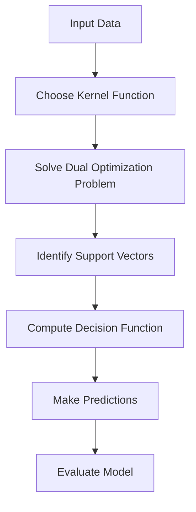

# 🛡️ Kernel Support Vector Machines

<div align="center">


*Advanced Classification Through The Kernel Trick*

</div>

---

## 📚 Table of Contents

- [What is Kernel SVM?](#what-is-kernel-svm)
- [Mathematical Foundation](#mathematical-foundation)
- [How It Works](#how-it-works)
- [Assumptions](#assumptions)
- [Implementation Guide](#implementation-guide)
- [Model Evaluation](#model-evaluation)
- [Pros and Cons](#pros-and-cons)
- [Real-World Examples](#real-world-examples)
- [Advanced Topics](#advanced-topics)
- [FAQ](#faq)

---

## 🎯 What is Kernel SVM?

**Kernel Support Vector Machines** extend the power of standard SVMs by applying the "kernel trick" to implicitly map input data into high-dimensional feature spaces where the data becomes linearly separable. This allows SVMs to create non-linear decision boundaries without explicitly computing the potentially complex transformations.

### Key Characteristics:
- **Non-Linear Classification**: Handles complex, non-linear decision boundaries
- **Kernel Trick**: Performs implicit mapping to higher dimensions
- **Margin Maximization**: Finds the optimal separating hyperplane with maximum margin
- **Support Vectors**: Classification depends only on a subset of training data points
- **Regularization**: Controls model complexity through the C parameter

### The Goal:
Find the optimal hyperplane in a transformed feature space that maximizes the margin between classes while minimizing classification errors.

---

## 🧮 Mathematical Foundation

### The Kernel Trick

The key insight of kernel SVM is that many algorithms can be written solely in terms of dot products between data points. By replacing these dot products with kernel functions, we can operate in higher-dimensional spaces without explicitly computing the transformation.

For a mapping function φ that transforms data from original space to feature space, the kernel function K is defined as:

```
K(x, y) = φ(x) · φ(y)
```

### Common Kernel Functions

#### 1. Linear Kernel
The simplest kernel, equivalent to no transformation:

```
K(x, y) = x · y
```

#### 2. Polynomial Kernel
Creates polynomial decision boundaries:

```
K(x, y) = (γ·x·y + r)^d
```
Where:
- γ (gamma): Controls the influence of individual training examples
- r: Trading term (typically 0 or 1)
- d: Polynomial degree

#### 3. Radial Basis Function (RBF) / Gaussian Kernel
Creates complex, localized decision regions:

```
K(x, y) = exp(-γ||x - y||²)
```
Where:
- γ: Controls the width of the Gaussian (inversely proportional to σ²)

#### 4. Sigmoid Kernel
Similar to a neural network activation:

```
K(x, y) = tanh(γ·x·y + r)
```

### SVM Dual Formulation

The SVM optimization problem in its dual form (which enables kernel substitution):

```
Maximize:
L(α) = Σᵢ αᵢ - ½ Σᵢ Σⱼ αᵢ·αⱼ·yᵢ·yⱼ·K(xᵢ, xⱼ)

Subject to:
0 ≤ αᵢ ≤ C for all i
Σᵢ αᵢ·yᵢ = 0
```

Where:
- αᵢ: Lagrange multipliers
- C: Regularization parameter (penalty for misclassification)
- yᵢ: Class labels (-1 or 1)
- K(xᵢ, xⱼ): Kernel function

### Decision Function

After finding the optimal α values, the decision function for a new data point x is:

```
f(x) = sign(Σᵢ αᵢ·yᵢ·K(xᵢ, x) + b)
```

Where:
- b: Bias term
- xᵢ: Support vectors (training points where αᵢ > 0)

---

## ⚙️ How It Works

### Step-by-Step Process:

<div align="center">



</div>

### 1. **Data Preparation**
```python
# Example dataset (non-linearly separable)
import numpy as np

# Generate synthetic data (two interlocking half moons)
np.random.seed(42)
n_samples = 100
X1 = np.random.randn(n_samples, 2)
X1[:, 0] = X1[:, 0] - 1
X2 = 2 + np.random.randn(n_samples, 2)
X = np.vstack([X1, X2])
y = np.hstack([np.zeros(n_samples), np.ones(n_samples)])
```

### 2. **Choose a Kernel Function**
```python
# Different kernel functions for different data patterns
def linear_kernel(x1, x2):
    """Linear kernel: K(x, y) = x · y"""
    return np.dot(x1, x2)

def polynomial_kernel(x1, x2, degree=3, gamma=1, coef0=1):
    """Polynomial kernel: K(x, y) = (γ·x·y + r)^d"""
    return (gamma * np.dot(x1, x2) + coef0) ** degree

def rbf_kernel(x1, x2, gamma=1.0):
    """RBF kernel: K(x, y) = exp(-γ||x - y||²)"""
    return np.exp(-gamma * np.sum((x1 - x2) ** 2))

def sigmoid_kernel(x1, x2, gamma=1.0, coef0=1.0):
    """Sigmoid kernel: K(x, y) = tanh(γ·x·y + r)"""
    return np.tanh(gamma * np.dot(x1, x2) + coef0)
```

### 3. **Compute the Kernel Matrix**
```python
def compute_kernel_matrix(X, kernel_func, **kernel_params):
    """Compute kernel matrix for a dataset using the given kernel function."""
    n_samples = X.shape[0]
    K = np.zeros((n_samples, n_samples))
    
    for i in range(n_samples):
        for j in range(n_samples):
            K[i, j] = kernel_func(X[i], X[j], **kernel_params)
    
    return K
```

### 4. **Solve the Dual Optimization Problem**
```python
# This is typically done using quadratic programming libraries
# Here's a simplified outline of the concept
from scipy.optimize import minimize

def train_svm_kernel(X, y, kernel_func, C=1.0, **kernel_params):
    n_samples = X.shape[0]
    
    # Compute the kernel matrix
    K = compute_kernel_matrix(X, kernel_func, **kernel_params)
    
    # Define the objective function to minimize (negative of the dual)
    def objective(alpha):
        return 0.5 * np.sum(np.outer(alpha * y, alpha * y) * K) - np.sum(alpha)
    
    # Define the constraints
    constraints = [{'type': 'eq', 'fun': lambda alpha: np.sum(alpha * y)}]
    bounds = [(0, C) for _ in range(n_samples)]
    
    # Initial guess
    alpha0 = np.zeros(n_samples)
    
    # Solve the quadratic programming problem
    result = minimize(objective, alpha0, bounds=bounds, constraints=constraints)
    alpha = result.x
    
    # Find support vectors
    sv_indices = np.where((alpha > 1e-5) & (alpha < C - 1e-5))[0]
    
    # Compute bias term
    b = np.mean(y[sv_indices] - np.sum(K[sv_indices][:, sv_indices] * alpha[sv_indices] * y[sv_indices], axis=1))
    
    return alpha, b, sv_indices
```

### 5. **Make Predictions**
```python
def predict(X, X_train, y_train, alpha, b, kernel_func, **kernel_params):
    """Make predictions for new data points."""
    y_pred = np.zeros(X.shape[0])
    
    # Only use support vectors (where alpha > 0)
    sv_indices = np.where(alpha > 1e-5)[0]
    
    for i in range(X.shape[0]):
        y_pred[i] = np.sum(alpha[sv_indices] * y_train[sv_indices] * 
                           np.array([kernel_func(X[i], X_train[j], **kernel_params) 
                                    for j in sv_indices])) + b
    
    return np.sign(y_pred)
```

### 6. **Full Example with scikit-learn**
```python
from sklearn.svm import SVC
from sklearn.preprocessing import StandardScaler
from sklearn.model_selection import train_test_split

# Split data
X_train, X_test, y_train, y_test = train_test_split(X, y, test_size=0.3, random_state=42)

# Scale features
scaler = StandardScaler()
X_train_scaled = scaler.fit_transform(X_train)
X_test_scaled = scaler.transform(X_test)

# Create and train SVM with RBF kernel
svm_rbf = SVC(kernel='rbf', gamma=0.5, C=1.0, probability=True)
svm_rbf.fit(X_train_scaled, y_train)

# Make predictions
y_pred = svm_rbf.predict(X_test_scaled)
```

---

## 📋 Assumptions

Kernel SVM has relatively few assumptions compared to other algorithms, but still has important considerations:

### 1. **Appropriate Kernel Selection** 🔵
- Different kernels capture different types of relationships
- **Check**: Model performance with different kernels, domain knowledge

### 2. **Feature Scaling** 🟢
- Most kernel functions (especially RBF) are sensitive to feature scales
- **Check**: Standardize or normalize features

### 3. **Regularization Parameter C** 🟡
- Controls trade-off between margin width and misclassification penalty
- **Check**: Cross-validation to find optimal C value

### 4. **Kernel Parameters** 🟠
- Each kernel has specific parameters (e.g., γ for RBF, degree for polynomial)
- **Check**: Cross-validation for parameter tuning

### 5. **Sample Size vs. Dimensions** 🔴
- SVMs can struggle when n_samples << n_features
- **Check**: Use dimensionality reduction or linear kernel

### 6. **Memory and Computation** 🟣
- Kernel SVM scales poorly with large datasets (quadratic complexity)
- **Check**: Monitor training time and memory usage

---

## 💻 Implementation Guide

### From Scratch Implementation

```python
import numpy as np
from typing import Callable, Dict, Tuple, List, Any
import matplotlib.pyplot as plt
from scipy.optimize import minimize

class KernelSVM:
    def __init__(self, kernel: str = 'rbf', C: float = 1.0, gamma: float = 'scale', 
                 degree: int = 3, coef0: float = 0.0, tol: float = 1e-3, max_iter: int = 100):
        """
        Initialize Kernel SVM classifier.
        
        Parameters:
        kernel (str): Kernel type ('linear', 'poly', 'rbf', 'sigmoid')
        C (float): Regularization parameter
        gamma (float or str): Kernel coefficient for 'rbf', 'poly' and 'sigmoid'
        degree (int): Degree of the polynomial kernel
        coef0 (float): Independent term in kernel function
        tol (float): Tolerance for stopping criterion
        max_iter (int): Maximum number of iterations for optimizer
        """
        self.kernel = kernel
        self.C = C
        self.gamma = gamma
        self.degree = degree
        self.coef0 = coef0
        self.tol = tol
        self.max_iter = max_iter
        
        self.kernel_function = self._get_kernel_function()
        self.alpha = None
        self.support_vectors = None
        self.support_vector_labels = None
        self.b = 0
        self.fitted = False
        
    def _get_kernel_function(self) -> Callable:
        """Return the appropriate kernel function."""
        if self.kernel == 'linear':
            return lambda x, y: np.dot(x, y)
        elif self.kernel == 'poly':
            return lambda x, y: (self.gamma * np.dot(x, y) + self.coef0) ** self.degree
        elif self.kernel == 'rbf':
            return lambda x, y: np.exp(-self.gamma * np.sum((x - y) ** 2))
        elif self.kernel == 'sigmoid':
            return lambda x, y: np.tanh(self.gamma * np.dot(x, y) + self.coef0)
        else:
            raise ValueError(f"Unsupported kernel type: {self.kernel}")
    
    def _compute_kernel_matrix(self, X: np.ndarray) -> np.ndarray:
        """Compute kernel matrix for dataset X."""
        n_samples = X.shape[0]
        K = np.zeros((n_samples, n_samples))
        
        for i in range(n_samples):
            for j in range(i, n_samples):  # Exploit symmetry
                K_val = self.kernel_function(X[i], X[j])
                K[i, j] = K_val
                K[j, i] = K_val  # Kernel matrix is symmetric
        
        return K
    
    def _compute_kernel_vector(self, x: np.ndarray, X: np.ndarray) -> np.ndarray:
        """Compute kernel vector between x and all points in X."""
        return np.array([self.kernel_function(x, x_i) for x_i in X])
    
    def fit(self, X: np.ndarray, y: np.ndarray) -> 'KernelSVM':
        """
        Fit the Kernel SVM model.
        
        Parameters:
        X (array-like): Training feature matrix
        y (array-like): Target labels (-1, 1)
        
        Returns:
        self: Returns the instance itself
        """
        X = np.array(X)
        y = np.array(y)
        
        # Convert binary labels to -1, 1 if needed
        if set(np.unique(y)) == {0, 1}:
            y = 2 * y - 1
        
        n_samples = X.shape[0]
        
        # Set gamma if 'scale' or 'auto'
        if self.gamma == 'scale':
            self.gamma = 1.0 / (X.shape[1] * X.var())
        elif self.gamma == 'auto':
            self.gamma = 1.0 / X.shape[1]
        
        # Compute kernel matrix
        K = self._compute_kernel_matrix(X)
        
        # Define the objective function to minimize (negative of the dual)
        def objective(alpha):
            return 0.5 * np.sum(np.outer(alpha * y, alpha * y) * K) - np.sum(alpha)
        
        # Define the gradient of the objective function
        def gradient(alpha):
            return np.sum(np.outer(y, y) * K * alpha, axis=1) - np.ones_like(alpha)
        
        # Define the constraint: sum(alpha_i * y_i) = 0
        constraints = [{'type': 'eq', 'fun': lambda alpha: np.sum(alpha * y)}]
        
        # Box constraints: 0 <= alpha_i <= C
        bounds = [(0, self.C) for _ in range(n_samples)]
        
        # Initial guess
        alpha0 = np.zeros(n_samples)
        
        # Solve the quadratic programming problem
        result = minimize(
            objective, 
            alpha0, 
            method='SLSQP', 
            jac=gradient,
            bounds=bounds,
            constraints=constraints,
            tol=self.tol,
            options={'maxiter': self.max_iter}
        )
        
        self.alpha = result.x
        
        # Identify support vectors (where alpha > 0)
        sv_indices = np.where(self.alpha > 1e-5)[0]
        self.support_vectors = X[sv_indices]
        self.support_vector_labels = y[sv_indices]
        self.support_vector_alphas = self.alpha[sv_indices]
        
        # Compute bias term
        # Use support vectors with 0 < alpha < C
        margin_sv_indices = np.where((self.alpha > 1e-5) & (self.alpha < self.C - 1e-5))[0]
        
        if len(margin_sv_indices) > 0:
            self.b = np.mean(
                y[margin_sv_indices] - 
                np.sum(K[margin_sv_indices][:, sv_indices] * self.alpha[sv_indices] * y[sv_indices], axis=1)
            )
        else:
            # If no margin support vectors, use average of all support vectors
            self.b = np.mean(
                y[sv_indices] - 
                np.sum(K[sv_indices][:, sv_indices] * self.alpha[sv_indices] * y[sv_indices], axis=1)
            )
        
        self.X_train = X  # Store for decision function
        self.y_train = y
        self.fitted = True
        
        return self
    
    def decision_function(self, X: np.ndarray) -> np.ndarray:
        """
        Compute decision function values for samples in X.
        
        Parameters:
        X (array-like): Feature matrix
        
        Returns:
        array: Decision function values
        """
        if not self.fitted:
            raise ValueError("Model must be fitted before making predictions")
        
        X = np.array(X)
        sv_indices = np.where(self.alpha > 1e-5)[0]
        
        decision_values = np.zeros(X.shape[0])
        
        for i in range(X.shape[0]):
            # Compute kernel values between test point and all support vectors
            K_i = np.array([self.kernel_function(X[i], self.X_train[j]) for j in sv_indices])
            
            # Decision function
            decision_values[i] = np.sum(self.alpha[sv_indices] * self.y_train[sv_indices] * K_i) + self.b
        
        return decision_values
    
    def predict(self, X: np.ndarray) -> np.ndarray:
        """
        Make binary predictions.
        
        Parameters:
        X (array-like): Feature matrix
        
        Returns:
        array: Predicted labels (1 or -1)
        """
        decision_values = self.decision_function(X)
        return np.sign(decision_values)
    
    def predict_proba(self, X: np.ndarray) -> np.ndarray:
        """
        Estimate probabilities using Platt scaling.
        
        Parameters:
        X (array-like): Feature matrix
        
        Returns:
        array: Probability estimates
        """
        # Simple sigmoid transformation of decision values
        decision_values = self.decision_function(X)
        
        # Apply sigmoid function to get probabilities
        def sigmoid(x):
            return 1 / (1 + np.exp(-x))
        
        probs = sigmoid(decision_values)
        
        # Return probabilities for both classes
        return np.vstack([1 - probs, probs]).T
    
    def score(self, X: np.ndarray, y: np.ndarray) -> float:
        """
        Calculate accuracy score.
        
        Parameters:
        X (array-like): Feature matrix
        y (array-like): True labels
        
        Returns:
        float: Accuracy score
        """
        y = np.array(y)
        
        # Convert binary labels to -1, 1 if needed
        if set(np.unique(y)) == {0, 1}:
            y = 2 * y - 1
        
        y_pred = self.predict(X)
        return np.mean(y_pred == y)
    
    def __str__(self) -> str:
        """String representation of the model."""
        if not self.fitted:
            return "KernelSVM(not fitted)"
        
        sv_count = len(self.support_vectors)
        return f"KernelSVM(kernel='{self.kernel}', C={self.C}, gamma={self.gamma}, " + \
               f"support vectors: {sv_count})"
    
    def plot_decision_boundary(self, X: np.ndarray, y: np.ndarray, ax=None, h=0.02):
        """
        Plot decision boundary and support vectors.
        
        Parameters:
        X (array-like): Feature matrix (2D only)
        y (array-like): Target labels
        ax: Matplotlib axis (optional)
        h: Step size for mesh grid
        """
        if X.shape[1] != 2:
            raise ValueError("Plotting decision boundary only works for 2D data")
        
        if ax is None:
            fig, ax = plt.subplots(figsize=(10, 8))
        
        # Plot data points
        ax.scatter(X[y == -1, 0], X[y == -1, 1], c='blue', marker='o', label='Class -1')
        ax.scatter(X[y == 1, 0], X[y == 1, 1], c='red', marker='x', label='Class 1')
        
        # Create mesh grid
        x_min, x_max = X[:, 0].min() - 1, X[:, 0].max() + 1
        y_min, y_max = X[:, 1].min() - 1, X[:, 1].max() + 1
        xx, yy = np.meshgrid(np.arange(x_min, x_max, h), np.arange(y_min, y_max, h))
        
        # Predict on mesh grid
        Z = self.decision_function(np.c_[xx.ravel(), yy.ravel()])
        Z = Z.reshape(xx.shape)
        
        # Plot decision boundary and margins
        ax.contour(xx, yy, Z, colors='k', levels=[-1, 0, 1], alpha=0.5, linestyles=['--', '-', '--'])
        ax.contourf(xx, yy, Z, cmap=plt.cm.coolwarm, alpha=0.3, levels=np.linspace(-2, 2, 20))
        
        # Highlight support vectors
        if self.fitted:
            ax.scatter(self.support_vectors[:, 0], self.support_vectors[:, 1],
                      s=100, facecolors='none', edgecolors='k', label='Support Vectors')
        
        ax.set_xlabel('Feature 1')
        ax.set_ylabel('Feature 2')
        ax.set_title(f'Kernel SVM with {self.kernel.upper()} Kernel (C={self.C}, γ={self.gamma})')
        ax.legend()
        
        return ax
```

### Using Scikit-learn

```python
from sklearn.svm import SVC
from sklearn.metrics import accuracy_score, classification_report
from sklearn.preprocessing import StandardScaler
from sklearn.model_selection import train_test_split
import numpy as np

# Sample data (two moons dataset)
from sklearn.datasets import make_moons
X, y = make_moons(n_samples=200, noise=0.15, random_state=42)

# Split data
X_train, X_test, y_train, y_test = train_test_split(X, y, test_size=0.3, random_state=42)

# Scale features
scaler = StandardScaler()
X_train_scaled = scaler.fit_transform(X_train)
X_test_scaled = scaler.transform(X_test)

# Create and train SVM with different kernels
kernels = ['linear', 'poly', 'rbf', 'sigmoid']
svm_models = {}

for kernel in kernels:
    svm = SVC(kernel=kernel, C=1.0, gamma='scale', probability=True)
    svm.fit(X_train_scaled, y_train)
    svm_models[kernel] = svm

# Evaluate and compare kernels
for name, model in svm_models.items():
    y_pred = model.predict(X_test_scaled)
    accuracy = accuracy_score(y_test, y_pred)
    print(f"\nKernel: {name}")
    print(f"Accuracy: {accuracy:.4f}")
    print(f"Support vectors: {model.n_support_}")
    print(classification_report(y_test, y_pred))
```

### Complete Example with Visualization

```python
import numpy as np
import matplotlib.pyplot as plt
from sklearn.svm import SVC
from sklearn.preprocessing import StandardScaler
from sklearn.model_selection import train_test_split, GridSearchCV
from sklearn.datasets import make_circles
from sklearn.metrics import confusion_matrix, classification_report, roc_curve, auc
from matplotlib.colors import ListedColormap

# Generate non-linearly separable data
X, y = make_circles(n_samples=300, noise=0.1, factor=0.2, random_state=42)

# Split into train and test sets
X_train, X_test, y_train, y_test = train_test_split(X, y, test_size=0.3, random_state=42)

# Scale features
scaler = StandardScaler()
X_train_scaled = scaler.fit_transform(X_train)
X_test_scaled = scaler.transform(X_test)

# Create and configure the model
svm_rbf = SVC(kernel='rbf', gamma='scale', C=10.0, probability=True, random_state=42)

# Train the model
svm_rbf.fit(X_train_scaled, y_train)

# Make predictions
y_pred = svm_rbf.predict(X_test_scaled)
y_prob = svm_rbf.predict_proba(X_test_scaled)[:, 1]

# Create visualization
fig, ((ax1, ax2), (ax3, ax4)) = plt.subplots(2, 2, figsize=(15, 12))

# 1. Decision Boundary Visualization
def plot_decision_boundary(X, y, model, ax):
    h = 0.02  # step size in the mesh
    x_min, x_max = X[:, 0].min() - 1, X[:, 0].max() + 1
    y_min, y_max = X[:, 1].min() - 1, X[:, 1].max() + 1
    xx, yy = np.meshgrid(np.arange(x_min, x_max, h), np.arange(y_min, y_max, h))
    
    # Plot the decision boundary
    Z = model.decision_function(np.c_[xx.ravel(), yy.ravel()])
    Z = Z.reshape(xx.shape)
    
    # Plot decision boundary and margins
    ax.contour(xx, yy, Z, colors='k', levels=[-1, 0, 1], alpha=0.5, linestyles=['--', '-', '--'])
    
    # Plot the data with different colors for different classes
    cmap_light = ListedColormap(['#FFAAAA', '#AAAAFF'])
    cmap_bold = ListedColormap(['#FF0000', '#0000FF'])
    
    ax.contourf(xx, yy, Z > 0, alpha=0.3, cmap=cmap_light)
    ax.scatter(X[:, 0], X[:, 1], c=y, cmap=cmap_bold, edgecolors='k', s=50)
    
    # Highlight support vectors
    ax.scatter(model.support_vectors_[:, 0], model.support_vectors_[:, 1],
             s=100, facecolors='none', edgecolors='k')
    
    ax.set_xlabel('Feature 1')
    ax.set_ylabel('Feature 2')
    ax.set_title(f'Decision Boundary (SVM with {model.kernel.upper()} Kernel)')

# Plot decision boundary
plot_decision_boundary(X_train_scaled, y_train, svm_rbf, ax1)

# 2. Kernel Visualization (visualize transformation)
from sklearn.decomposition import KernelPCA

# Apply Kernel PCA with RBF kernel (to approximate the feature space)
kernel_pca = KernelPCA(n_components=2, kernel='rbf', gamma=svm_rbf.gamma)
X_train_pca = kernel_pca.fit_transform(X_train_scaled)

ax2.scatter(X_train_pca[y_train==0, 0], X_train_pca[y_train==0, 1], c='blue', marker='o', label='Class 0')
ax2.scatter(X_train_pca[y_train==1, 0], X_train_pca[y_train==1, 1], c='red', marker='x', label='Class 1')
ax2.set_xlabel('Kernel PCA Feature 1')
ax2.set_ylabel('Kernel PCA Feature 2')
ax2.set_title('Visualization of RBF Kernel Transformation')
ax2.legend()
ax2.grid(True, alpha=0.3)

# 3. Confusion Matrix
cm = confusion_matrix(y_test, y_pred)
ax3.matshow(cm, cmap=plt.cm.Blues, alpha=0.7)
for i in range(cm.shape[0]):
    for j in range(cm.shape[1]):
        ax3.text(j, i, str(cm[i, j]), va='center', ha='center', fontsize=16)
ax3.set_xlabel('Predicted Label')
ax3.set_ylabel('True Label')
ax3.set_title('Confusion Matrix')
ax3.set_xticks([0, 1])
ax3.set_yticks([0, 1])
ax3.set_xticklabels(['Class 0', 'Class 1'])
ax3.set_yticklabels(['Class 0', 'Class 1'])

# 4. ROC Curve
fpr, tpr, _ = roc_curve(y_test, y_prob)
roc_auc = auc(fpr, tpr)

ax4.plot(fpr, tpr, color='darkorange', lw=2, label=f'ROC curve (area = {roc_auc:.2f})')
ax4.plot([0, 1], [0, 1], color='navy', lw=2, linestyle='--')
ax4.set_xlabel('False Positive Rate')
ax4.set_ylabel('True Positive Rate')
ax4.set_title('Receiver Operating Characteristic')
ax4.legend(loc="lower right")
ax4.grid(True, alpha=0.3)

plt.tight_layout()
plt.show()

# Print model details
print(f"SVM with {svm_rbf.kernel.upper()} Kernel")
print(f"Number of support vectors: {svm_rbf.n_support_}")
print(f"Percentage of training data as support vectors: {100 * sum(svm_rbf.n_support_) / len(X_train):.2f}%")
print(f"\nClassification Report:")
print(classification_report(y_test, y_pred))

# Hyperparameter tuning with grid search
param_grid = {
    'C': [0.1, 1, 10, 100],
    'gamma': ['scale', 'auto', 0.1, 1.0, 10.0]
}

grid_search = GridSearchCV(
    SVC(kernel='rbf', probability=True, random_state=42),
    param_grid,
    cv=5,
    scoring='accuracy',
    verbose=1
)

grid_search.fit(X_train_scaled, y_train)

print(f"\nBest Parameters: {grid_search.best_params_}")
print(f"Best Cross-Validation Score: {grid_search.best_score_:.4f}")

# Evaluate the best model
best_svm = grid_search.best_estimator_
y_pred_best = best_svm.predict(X_test_scaled)
print(f"\nBest Model Performance on Test Set:")
print(classification_report(y_test, y_pred_best))
```

---

## 📊 Model Evaluation

### Key Metrics for Classification

#### 1. **Accuracy**
```python
def accuracy(y_true, y_pred):
    """Proportion of correct predictions."""
    return np.mean(y_true == y_pred)
```

#### 2. **Confusion Matrix**
```python
def confusion_matrix(y_true, y_pred):
    """Create confusion matrix for binary classification."""
    tp = np.sum((y_true == 1) & (y_pred == 1))
    tn = np.sum((y_true == 0) & (y_pred == 0))
    fp = np.sum((y_true == 0) & (y_pred == 1))
    fn = np.sum((y_true == 1) & (y_pred == 0))
    
    return np.array([[tn, fp], [fn, tp]])
```

#### 3. **Precision, Recall, and F1-Score**
```python
def precision(y_true, y_pred):
    """Precision = TP / (TP + FP)"""
    tp = np.sum((y_true == 1) & (y_pred == 1))
    fp = np.sum((y_true == 0) & (y_pred == 1))
    return tp / (tp + fp) if (tp + fp) > 0 else 0

def recall(y_true, y_pred):
    """Recall = TP / (TP + FN)"""
    tp = np.sum((y_true == 1) & (y_pred == 1))
    fn = np.sum((y_true == 1) & (y_pred == 0))
    return tp / (tp + fn) if (tp + fn) > 0 else 0

def f1_score(y_true, y_pred):
    """F1 Score = 2 * (Precision * Recall) / (Precision + Recall)"""
    prec = precision(y_true, y_pred)
    rec = recall(y_true, y_pred)
    return 2 * prec * rec / (prec + rec) if (prec + rec) > 0 else 0
```

#### 4. **ROC Curve and AUC**
```python
def roc_curve(y_true, y_score):
    """Calculate ROC curve coordinates."""
    # Sort by decision values
    sorted_indices = np.argsort(y_score)[::-1]
    sorted_y_true = y_true[sorted_indices]
    sorted_y_score = y_score[sorted_indices]
    
    # Count positive and negative instances
    n_pos = np.sum(y_true == 1)
    n_neg = np.sum(y_true == 0)
    
    # Calculate TPR and FPR
    tpr = np.zeros(len(y_true) + 1)
    fpr = np.zeros(len(y_true) + 1)
    thresholds = np.zeros(len(y_true))
    
    for i in range(len(sorted_y_true)):
        if sorted_y_true[i] == 1:
            tpr[i+1] = tpr[i] + 1/n_pos
            fpr[i+1] = fpr[i]
        else:
            tpr[i+1] = tpr[i]
            fpr[i+1] = fpr[i] + 1/n_neg
        
        thresholds[i] = sorted_y_score[i]
    
    return fpr, tpr, thresholds

def auc(fpr, tpr):
    """Calculate area under ROC curve."""
    # Trapezoidal rule
    width = np.diff(fpr)
    height = (tpr[:-1] + tpr[1:]) / 2
    return np.sum(width * height)
```

### Diagnostic Plots

```python
def svm_diagnostic_plots(X, y, svm_model, is_scaled=False):
    """Create diagnostic plots for SVM model."""
    if not is_scaled:
        scaler = StandardScaler()
        X_scaled = scaler.fit_transform(X)
    else:
        X_scaled = X
    
    # Get predictions
    y_pred = svm_model.predict(X_scaled)
    if hasattr(svm_model, 'decision_function'):
        decision_values = svm_model.decision_function(X_scaled)
    else:
        decision_values = None
    
    if hasattr(svm_model, 'predict_proba'):
        y_prob = svm_model.predict_proba(X_scaled)[:, 1]
    else:
        y_prob = None
    
    # Create plots
    fig, ((ax1, ax2), (ax3, ax4)) = plt.subplots(2, 2, figsize=(15, 12))
    
    # 1. Decision Boundary (if 2D data)
    if X.shape[1] == 2:
        h = 0.02  # step size in the mesh
        x_min, x_max = X_scaled[:, 0].min() - 1, X_scaled[:, 0].max() + 1
        y_min, y_max = X_scaled[:, 1].min() - 1, X_scaled[:, 1].max() + 1
        xx, yy = np.meshgrid(np.arange(x_min, x_max, h), np.arange(y_min, y_max, h))
        
        if decision_values is not None:
            Z = svm_model.decision_function(np.c_[xx.ravel(), yy.ravel()])
            Z = Z.reshape(xx.shape)
            
            # Plot decision boundary and margins
            ax1.contour(xx, yy, Z, colors='k', levels=[-1, 0, 1], 
                       alpha=0.5, linestyles=['--', '-', '--'])
            ax1.contourf(xx, yy, Z, cmap=plt.cm.coolwarm, alpha=0.3, 
                        levels=np.linspace(Z.min(), Z.max(), 20))
        else:
            Z = svm_model.predict(np.c_[xx.ravel(), yy.ravel()])
            Z = Z.reshape(xx.shape)
            ax1.contourf(xx, yy, Z, alpha=0.3, cmap=ListedColormap(['#FFAAAA', '#AAAAFF']))
        
        # Plot data points
        ax1.scatter(X_scaled[y==0, 0], X_scaled[y==0, 1], c='blue', marker='o', label='Class 0')
        ax1.scatter(X_scaled[y==1, 0], X_scaled[y==1, 1], c='red', marker='x', label='Class 1')
        
        # Highlight support vectors if available
        if hasattr(svm_model, 'support_vectors_'):
            ax1.scatter(svm_model.support_vectors_[:, 0], svm_model.support_vectors_[:, 1],
                      s=100, facecolors='none', edgecolors='k', label='Support Vectors')
        
        ax1.set_xlabel('Feature 1')
        ax1.set_ylabel('Feature 2')
        ax1.set_title(f'Decision Boundary (SVM with {svm_model.kernel.upper()} Kernel)')
        ax1.legend()
    else:
        ax1.text(0.5, 0.5, "Decision boundary visualization\nrequires 2D data", 
                ha='center', va='center', fontsize=12)
        ax1.set_xticks([])
        ax1.set_yticks([])
    
    # 2. Distribution of Decision Values or Probabilities
    if decision_values is not None:
        ax2.hist(decision_values[y==0], bins=20, alpha=0.5, color='blue', label='Class 0')
        ax2.hist(decision_values[y==1], bins=20, alpha=0.5, color='red', label='Class 1')
        ax2.axvline(x=0, color='k', linestyle='--')
        ax2.set_xlabel('Decision Function Value')
        ax2.set_ylabel('Count')
        ax2.set_title('Distribution of Decision Function Values')
        ax2.legend()
    elif y_prob is not None:
        ax2.hist(y_prob[y==0], bins=20, alpha=0.5, color='blue', label='Class 0')
        ax2.hist(y_prob[y==1], bins=20, alpha=0.5, color='red', label='Class 1')
        ax2.axvline(x=0.5, color='k', linestyle='--')
        ax2.set_xlabel('Predicted Probability (Class 1)')
        ax2.set_ylabel('Count')
        ax2.set_title('Distribution of Predicted Probabilities')
        ax2.legend()
    else:
        ax2.text(0.5, 0.5, "Decision values/probabilities\nnot available", 
                ha='center', va='center', fontsize=12)
        ax2.set_xticks([])
        ax2.set_yticks([])
    
    # 3. Confusion Matrix
    cm = confusion_matrix(y, y_pred)
    ax3.matshow(cm, cmap=plt.cm.Blues, alpha=0.7)
    for i in range(cm.shape[0]):
        for j in range(cm.shape[1]):
            ax3.text(j, i, str(cm[i, j]), va='center', ha='center', fontsize=16)
    ax3.set_xlabel('Predicted Label')
    ax3.set_ylabel('True Label')
    ax3.set_title('Confusion Matrix')
    ax3.set_xticks([0, 1])
    ax3.set_yticks([0, 1])
    ax3.set_xticklabels(['Class 0', 'Class 1'])
    ax3.set_yticklabels(['Class 0', 'Class 1'])
    
    # 4. ROC Curve
    if y_prob is not None:
        fpr, tpr, _ = roc_curve(y, y_prob)
        roc_auc = auc(fpr, tpr)
        
        ax4.plot(fpr, tpr, color='darkorange', lw=2, label=f'ROC curve (area = {roc_auc:.2f})')
        ax4.plot([0, 1], [0, 1], color='navy', lw=2, linestyle='--')
        ax4.set_xlabel('False Positive Rate')
        ax4.set_ylabel('True Positive Rate')
        ax4.set_title('Receiver Operating Characteristic')
        ax4.legend(loc="lower right")
        ax4.grid(True, alpha=0.3)
    else:
        ax4.text(0.5, 0.5, "ROC curve not available\n(probabilities not computed)",
                ha='center', va='center', fontsize=12)
        ax4.set_xticks([])
        ax4.set_yticks([])
    
    plt.tight_layout()
    plt.show()
    
    # Print additional metrics
    from sklearn.metrics import classification_report
    print(classification_report(y, y_pred))
    
    if hasattr(svm_model, 'support_vectors_'):
        print(f"Number of support vectors: {len(svm_model.support_vectors_)}")
        print(f"Percentage of training data as support vectors: {100 * len(svm_model.support_vectors_) / len(X):.2f}%")
```

---

## ✅ Pros and Cons

<div align="center">

| ✅ **Advantages** | ❌ **Disadvantages** |
|-------------------|---------------------|
| **Handles Non-Linear Data** | **Black-Box Nature** |
| Flexible decision boundaries via kernels | Complex models difficult to interpret |
| **Effective in High Dimensions** | **Computationally Intensive** |
| Works well even with many features | Scales poorly with large datasets (O(n²) to O(n³)) |
| **Regularization Built-In** | **Memory Requirements** |
| C parameter controls overfitting | Needs to store kernel matrix or support vectors |
| **Maximum Margin Classifier** | **Kernel Selection Challenges** |
| Optimizes separation between classes | Requires expertise to choose appropriate kernel |
| **Support Vector Focus** | **Parameter Tuning Required** |
| Only depends on subset of training points | C, gamma, and other parameters need optimization |
| **Robust to Outliers** | **Poor Performance with Overlapping Classes** |
| With proper C value can ignore some outliers | Hard to tune when classes have significant overlap |
| **Strong Theoretical Foundation** | **No Native Probability Estimates** |
| Based on statistical learning theory | Requires additional calibration for probabilities |

</div>

### When to Use Kernel SVM:

✅ **Good Choice When:**
- You need to capture complex, non-linear relationships
- Your dataset has moderate size (up to ~10K samples)
- High-dimensional feature spaces (e.g., text, genomics)
- Classification accuracy is critical
- Data has clear separation between classes
- Memory and computation time aren't major constraints

❌ **Avoid When:**
- Dataset is very large (consider linear SVM or deep learning)
- Interpretability is a top priority
- Fast training/prediction is required
- You have limited computational resources
- Classes are heavily overlapping with noise
- You need inherent probability estimates

---

## 🌍 Real-World Examples

### Example 1: Image Classification
```python
# Binary classification of handwritten digits using Kernel SVM
from sklearn.datasets import load_digits
from sklearn.model_selection import train_test_split
from sklearn.preprocessing import StandardScaler
from sklearn.svm import SVC
from sklearn.metrics import accuracy_score, classification_report, confusion_matrix
import matplotlib.pyplot as plt
import numpy as np
import time

# Load a subset of the digits dataset (just digits 0 and 1 for binary classification)
digits = load_digits()
X = digits.data
y = (digits.target == 1).astype(int)  # Convert to binary: 1 vs rest

# Split data
X_train, X_test, y_train, y_test = train_test_split(X, y, test_size=0.2, random_state=42)

# Scale features
scaler = StandardScaler()
X_train_scaled = scaler.fit_transform(X_train)
X_test_scaled = scaler.transform(X_test)

# Create and train model
print("Training SVM with RBF kernel...")
start_time = time.time()
svm = SVC(kernel='rbf', gamma='scale', C=10, probability=True)
svm.fit(X_train_scaled, y_train)
training_time = time.time() - start_time
print(f"Training completed in {training_time:.2f} seconds.")

# Evaluate
y_pred = svm.predict(X_test_scaled)
accuracy = accuracy_score(y_test, y_pred)
print(f"Accuracy: {accuracy:.4f}")
print("\nClassification Report:")
print(classification_report(y_test, y_pred))

# Confusion matrix
cm = confusion_matrix(y_test, y_pred)
plt.figure(figsize=(8, 6))
plt.imshow(cm, interpolation='nearest', cmap=plt.cm.Blues)
plt.title('Confusion Matrix')
plt.colorbar()
tick_marks = np.arange(2)
plt.xticks(tick_marks, ['Class 0', 'Class 1'])
plt.yticks(tick_marks, ['Class 0', 'Class 1'])

# Add text annotations to confusion matrix
thresh = cm.max() / 2
for i in range(cm.shape[0]):
    for j in range(cm.shape[1]):
        plt.text(j, i, format(cm[i, j], 'd'),
                horizontalalignment="center",
                color="white" if cm[i, j] > thresh else "black")

plt.ylabel('True Label')
plt.xlabel('Predicted Label')
plt.tight_layout()
plt.show()

# Display some misclassified examples
y_pred_test = svm.predict(X_test_scaled)
misclassified_indices = np.where(y_pred_test != y_test)[0]

if len(misclassified_indices) > 0:
    fig, axes = plt.subplots(2, 5, figsize=(15, 6))
    axes = axes.ravel()
    
    for i, idx in enumerate(misclassified_indices[:10]):  # Show up to 10 misclassified
        axes[i].imshow(digits.images[y_test.index[idx]], cmap=plt.cm.binary)
        axes[i].set_title(f"True: {digits.target[y_test.index[idx]]}, Pred: {1 if y_pred[idx] else 'Not 1'}")
        axes[i].axis('off')
        
        # If we have fewer than 10 misclassified, hide the extra axes
        if i >= len(misclassified_indices) - 1:
            for j in range(i + 1, 10):
                axes[j].axis('off')
            break
            
    plt.suptitle('Misclassified Digits')
    plt.tight_layout()
    plt.subplots_adjust(top=0.9)
    plt.show()
else:
    print("No misclassified examples!")

# Analyze support vectors
n_support_vectors = len(svm.support_vectors_)
support_vector_indices = svm.support_
print(f"\nSupport Vector Analysis:")
print(f"Total support vectors: {n_support_vectors}")
print(f"Support vectors as % of training data: {100 * n_support_vectors / len(X_train):.2f}%")

# Visualize some support vectors
fig, axes = plt.subplots(2, 5, figsize=(15, 6))
axes = axes.ravel()

for i in range(min(10, len(support_vector_indices))):
    axes[i].imshow(digits.images[support_vector_indices[i]], cmap=plt.cm.binary)
    axes[i].set_title(f"SV {i+1}")
    axes[i].axis('off')
    
plt.suptitle('Sample Support Vectors')
plt.tight_layout()
plt.subplots_adjust(top=0.9)
plt.show()

# Compare different kernels
kernels = ['linear', 'poly', 'rbf', 'sigmoid']
kernel_performances = {}

for kernel in kernels:
    print(f"\nEvaluating {kernel.upper()} kernel...")
    start_time = time.time()
    
    svm_model = SVC(kernel=kernel, gamma='scale')
    svm_model.fit(X_train_scaled, y_train)
    
    train_time = time.time() - start_time
    
    y_pred = svm_model.predict(X_test_scaled)
    accuracy = accuracy_score(y_test, y_pred)
    
    kernel_performances[kernel] = {
        'accuracy': accuracy,
        'training_time': train_time,
        'n_support_vectors': len(svm_model.support_vectors_)
    }
    
    print(f"Accuracy: {accuracy:.4f}")
    print(f"Training time: {train_time:.2f} seconds")
    print(f"Support vectors: {len(svm_model.support_vectors_)}")

# Plot kernel comparison
plt.figure(figsize=(10, 6))
kernels_list = list(kernel_performances.keys())
accuracies = [kernel_performances[k]['accuracy'] for k in kernels_list]

plt.bar(kernels_list, accuracies)
plt.ylim(min(accuracies) - 0.1, 1.0)
plt.xlabel('Kernel')
plt.ylabel('Accuracy')
plt.title('Comparison of Different Kernels')

for i, v in enumerate(accuracies):
    plt.text(i, v + 0.01, f"{v:.3f}", ha='center')

plt.tight_layout()
plt.show()
```

### Example 2: Text Classification
```python
# Text classification using Kernel SVM with TF-IDF features
from sklearn.datasets import fetch_20newsgroups
from sklearn.feature_extraction.text import TfidfVectorizer
from sklearn.svm import SVC
from sklearn.pipeline import Pipeline
from sklearn.model_selection import train_test_split, GridSearchCV
from sklearn.metrics import classification_report, confusion_matrix
import numpy as np
import matplotlib.pyplot as plt
import time
import seaborn as sns

# Load a binary subset of the 20 newsgroups dataset
categories = ['alt.atheism', 'soc.religion.christian']
newsgroups = fetch_20newsgroups(subset='all', categories=categories,
                                remove=('headers', 'footers', 'quotes'))

X = newsgroups.data
y = newsgroups.target

# Split the data
X_train, X_test, y_train, y_test = train_test_split(X, y, test_size=0.3, random_state=42)

# Create a pipeline with TF-IDF and SVM
pipeline = Pipeline([
    ('tfidf', TfidfVectorizer(max_features=5000, stop_words='english')),
    ('svm', SVC(kernel='rbf', gamma='scale', probability=True))
])

# Train the model
print("Training SVM with TF-IDF features...")
start_time = time.time()
pipeline.fit(X_train, y_train)
training_time = time.time() - start_time
print(f"Training completed in {training_time:.2f} seconds.")

# Evaluate
y_pred = pipeline.predict(X_test)
y_prob = pipeline.predict_proba(X_test)[:, 1]

# Print metrics
print(f"\nClassification Report:")
print(classification_report(y_test, y_pred, target_names=categories))

# Plot confusion matrix
cm = confusion_matrix(y_test, y_pred)
plt.figure(figsize=(8, 6))
sns.heatmap(cm, annot=True, fmt='d', cmap='Blues', xticklabels=categories, yticklabels=categories)
plt.title('Confusion Matrix')
plt.ylabel('True Label')
plt.xlabel('Predicted Label')
plt.tight_layout()
plt.show()

# Feature importance through coefficient analysis (for linear kernel)
linear_svm = Pipeline([
    ('tfidf', TfidfVectorizer(max_features=5000, stop_words='english')),
    ('svm', SVC(kernel='linear'))
])
linear_svm.fit(X_train, y_train)

# Get feature names and coefficients
feature_names = linear_svm.named_steps['tfidf'].get_feature_names_out()
coefficients = linear_svm.named_steps['svm'].coef_.toarray()[0]

# Sort features by absolute coefficient value
sorted_indices = np.argsort(np.abs(coefficients))[::-1]
top_features_pos = [(feature_names[i], coefficients[i]) for i in sorted_indices if coefficients[i] > 0][:10]
top_features_neg = [(feature_names[i], coefficients[i]) for i in sorted_indices if coefficients[i] < 0][:10]

# Plot top features
plt.figure(figsize=(14, 8))

# Top positive features (for Christian class)
plt.subplot(1, 2, 1)
plt.barh([feat[0] for feat in reversed(top_features_pos)], 
         [feat[1] for feat in reversed(top_features_pos)], color='green')
plt.title(f"Top Words for '{categories[1]}'")
plt.xlabel('Coefficient Value')

# Top negative features (for Atheism class)
plt.subplot(1, 2, 2)
plt.barh([feat[0] for feat in reversed(top_features_neg)], 
         [feat[1] for feat in reversed(top_features_neg)], color='red')
plt.title(f"Top Words for '{categories[0]}'")
plt.xlabel('Coefficient Value')

plt.tight_layout()
plt.show()

# ROC curve
from sklearn.metrics import roc_curve, auc

fpr, tpr, _ = roc_curve(y_test, y_prob)
roc_auc = auc(fpr, tpr)

plt.figure(figsize=(8, 6))
plt.plot(fpr, tpr, color='darkorange', lw=2, label=f'ROC curve (area = {roc_auc:.2f})')
plt.plot([0, 1], [0, 1], color='navy', lw=2, linestyle='--')
plt.xlim([0.0, 1.0])
plt.ylim([0.0, 1.05])
plt.xlabel('False Positive Rate')
plt.ylabel('True Positive Rate')
plt.title('ROC Curve')
plt.legend(loc="lower right")
plt.grid(True, alpha=0.3)
plt.show()

# Compare different kernels
kernels = ['linear', 'poly', 'rbf', 'sigmoid']
kernel_performances = {}

for kernel in kernels:
    print(f"\nEvaluating {kernel.upper()} kernel...")
    start_time = time.time()
    
    pipeline = Pipeline([
        ('tfidf', TfidfVectorizer(max_features=3000, stop_words='english')),
        ('svm', SVC(kernel=kernel, gamma='scale'))
    ])
    
    pipeline.fit(X_train, y_train)
    train_time = time.time() - start_time
    
    y_pred = pipeline.predict(X_test)
    accuracy = np.mean(y_pred == y_test)
    
    kernel_performances[kernel] = {
        'accuracy': accuracy,
        'training_time': train_time
    }
    
    print(f"Accuracy: {accuracy:.4f}")
    print(f"Training time: {train_time:.2f} seconds")

# Plot kernel comparison
plt.figure(figsize=(12, 6))
kernels_list = list(kernel_performances.keys())

plt.subplot(1, 2, 1)
accuracies = [kernel_performances[k]['accuracy'] for k in kernels_list]
plt.bar(kernels_list, accuracies)
plt.xlabel('Kernel')
plt.ylabel('Accuracy')
plt.title('Accuracy by Kernel Type')
for i, v in enumerate(accuracies):
    plt.text(i, v + 0.01, f"{v:.3f}", ha='center')

plt.subplot(1, 2, 2)
train_times = [kernel_performances[k]['training_time'] for k in kernels_list]
plt.bar(kernels_list, train_times)
plt.xlabel('Kernel')
plt.ylabel('Training Time (seconds)')
plt.title('Training Time by Kernel Type')
for i, v in enumerate(train_times):
    plt.text(i, v + 0.1, f"{v:.1f}s", ha='center')

plt.tight_layout()
plt.show()
```

### Example 3: Biomedical Classification
```python
# Cancer diagnosis using Kernel SVM
from sklearn.datasets import load_breast_cancer
from sklearn.model_selection import train_test_split, StratifiedKFold, GridSearchCV
from sklearn.preprocessing import StandardScaler
from sklearn.svm import SVC
from sklearn.metrics import accuracy_score, roc_auc_score, precision_recall_curve, average_precision_score
from sklearn.decomposition import PCA
import matplotlib.pyplot as plt
import numpy as np
import pandas as pd
import time

# Load the breast cancer dataset
cancer = load_breast_cancer()
X = cancer.data
y = cancer.target

# Split data
X_train, X_test, y_train, y_test = train_test_split(X, y, test_size=0.2, random_state=42)

# Scale features
scaler = StandardScaler()
X_train_scaled = scaler.fit_transform(X_train)
X_test_scaled = scaler.transform(X_test)

# Create and train SVM with RBF kernel
svm = SVC(kernel='rbf', gamma='scale', C=10, probability=True)
start_time = time.time()
svm.fit(X_train_scaled, y_train)
train_time = time.time() - start_time

# Make predictions
y_pred = svm.predict(X_test_scaled)
y_prob = svm.predict_proba(X_test_scaled)[:, 1]

# Calculate metrics
accuracy = accuracy_score(y_test, y_pred)
roc_auc = roc_auc_score(y_test, y_prob)

print(f"Breast Cancer Classification with Kernel SVM")
print(f"Accuracy: {accuracy:.4f}")
print(f"ROC AUC: {roc_auc:.4f}")
print(f"Training time: {train_time:.2f} seconds")
print(f"Support vectors: {len(svm.support_vectors_)} ({100 * len(svm.support_vectors_) / len(X_train):.1f}% of training data)")

# Feature analysis
# First, let's visualize data in reduced dimensions with PCA
pca = PCA(n_components=2)
X_train_pca = pca.fit_transform(X_train_scaled)
X_test_pca = pca.transform(X_test_scaled)

# Train SVM on reduced features
svm_pca = SVC(kernel='rbf', gamma='scale', C=10, probability=True)
svm_pca.fit(X_train_pca, y_train)

# Create visualization with 4 subplots
fig, ((ax1, ax2), (ax3, ax4)) = plt.subplots(2, 2, figsize=(15, 12))

# 1. PCA visualization with decision boundary
def plot_decision_boundary(ax, X, y, model):
    h = 0.02  # step size in the mesh
    x_min, x_max = X[:, 0].min() - 1, X[:, 0].max() + 1
    y_min, y_max = X[:, 1].min() - 1, X[:, 1].max() + 1
    xx, yy = np.meshgrid(np.arange(x_min, x_max, h), np.arange(y_min, y_max, h))
    
    # Plot the decision boundary
    Z = model.decision_function(np.c_[xx.ravel(), yy.ravel()])
    Z = Z.reshape(xx.shape)
    
    # Plot decision boundary and margins
    ax.contour(xx, yy, Z, colors='k', levels=[-1, 0, 1], alpha=0.5, linestyles=['--', '-', '--'])
    
    # Fill areas between boundaries
    ax.contourf(xx, yy, Z > 0, alpha=0.3, cmap=plt.cm.coolwarm)
    
    # Plot the training points
    ax.scatter(X[y == 0, 0], X[y == 0, 1], c='blue', marker='o', edgecolors='k', s=40, label='Benign')
    ax.scatter(X[y == 1, 0], X[y == 1, 1], c='red', marker='^', edgecolors='k', s=40, label='Malignant')
    
    # Highlight support vectors
    ax.scatter(model.support_vectors_[:, 0], model.support_vectors_[:, 1],
              s=120, facecolors='none', edgecolors='green', linewidth=1, label='Support Vectors')
    
    ax.set_xlabel('PCA Feature 1')
    ax.set_ylabel('PCA Feature 2')
    ax.set_title('SVM Decision Boundary (PCA)')
    ax.legend()

# Plot decision boundary
plot_decision_boundary(ax1, X_train_pca, y_train, svm_pca)

# 2. ROC curve
from sklearn.metrics import roc_curve

fpr, tpr, _ = roc_curve(y_test, y_prob)
roc_auc = roc_auc_score(y_test, y_prob)

ax2.plot(fpr, tpr, color='darkorange', lw=2, label=f'ROC curve (area = {roc_auc:.2f})')
ax2.plot([0, 1], [0, 1], color='navy', lw=2, linestyle='--')
ax2.set_xlabel('False Positive Rate')
ax2.set_ylabel('True Positive Rate')
ax2.set_title('Receiver Operating Characteristic')
ax2.legend(loc="lower right")
ax2.grid(True, alpha=0.3)

# 3. Precision-Recall curve
precision, recall, _ = precision_recall_curve(y_test, y_prob)
average_precision = average_precision_score(y_test, y_prob)

ax3.plot(recall, precision, color='green', lw=2, label=f'PR curve (AP = {average_precision:.2f})')
ax3.set_xlabel('Recall')
ax3.set_ylabel('Precision')
ax3.set_title('Precision-Recall Curve')
ax3.legend(loc="lower left")
ax3.grid(True, alpha=0.3)

# 4. Feature importance (using permutation importance)
from sklearn.inspection import permutation_importance

result = permutation_importance(svm, X_test_scaled, y_test, n_repeats=10, random_state=42)

# Sort features by importance
feature_names = cancer.feature_names
sorted_idx = result.importances_mean.argsort()[-10:]  # Top 10 features
sorted_importances = result.importances_mean[sorted_idx]
sorted_features = [feature_names[i] for i in sorted_idx]

# Plot feature importance
ax4.barh(range(len(sorted_features)), sorted_importances, align='center')
ax4.set_yticks(range(len(sorted_features)))
ax4.set_yticklabels(sorted_features)
ax4.set_xlabel('Permutation Importance')
ax4.set_title('Top 10 Features by Importance')
ax4.grid(True, alpha=0.3)

plt.tight_layout()
plt.show()

# Hyperparameter tuning with grid search
print("\nPerforming hyperparameter tuning...")

param_grid = {
    'C': [0.1, 1, 10, 100],
    'gamma': ['scale', 'auto', 0.01, 0.1, 1],
    'kernel': ['rbf', 'poly', 'sigmoid']
}

# Use stratified k-fold cross-validation
cv = StratifiedKFold(n_splits=5, shuffle=True, random_state=42)

# Grid search
grid_search = GridSearchCV(
    SVC(probability=True),
    param_grid=param_grid,
    cv=cv,
    scoring='roc_auc',
    verbose=1,
    n_jobs=-1  # Use all available cores
)

grid_search.fit(X_train_scaled, y_train)

# Best parameters and score
print(f"\nBest parameters: {grid_search.best_params_}")
print(f"Best CV score: {grid_search.best_score_:.4f}")

# Evaluate best model
best_svm = grid_search.best_estimator_
best_y_pred = best_svm.predict(X_test_scaled)
best_y_prob = best_svm.predict_proba(X_test_scaled)[:, 1]

best_accuracy = accuracy_score(y_test, best_y_pred)
best_roc_auc = roc_auc_score(y_test, best_y_prob)

print("\nBest Model Performance:")
print(f"Accuracy: {best_accuracy:.4f}")
print(f"ROC AUC: {best_roc_auc:.4f}")

# Analyze feature importance for each class
from sklearn.inspection import permutation_importance

result_class0 = permutation_importance(best_svm, X_test_scaled[y_test==0], 
                                     y_test[y_test==0], n_repeats=5, random_state=42)
result_class1 = permutation_importance(best_svm, X_test_scaled[y_test==1], 
                                     y_test[y_test==1], n_repeats=5, random_state=42)

# Create DataFrame with feature importances
feature_importance = pd.DataFrame({
    'Feature': feature_names,
    'Benign': result_class0.importances_mean,
    'Malignant': result_class1.importances_mean,
    'Overall': result.importances_mean
})

# Sort by overall importance
feature_importance = feature_importance.sort_values('Overall', ascending=False)

# Display top features
print("\nTop 5 Most Important Features:")
print(feature_importance.head(5))

# Visualize class-specific feature importance
plt.figure(figsize=(12, 8))
top_features = feature_importance.head(10)['Feature'].tolist()
top_features_data = feature_importance[feature_importance['Feature'].isin(top_features)]

ind = np.arange(len(top_features))
width = 0.35

plt.barh(ind, top_features_data['Benign'], width, color='blue', label='Benign')
plt.barh(ind + width, top_features_data['Malignant'], width, color='red', label='Malignant')

plt.yticks(ind + width/2, top_features_data['Feature'])
plt.xlabel('Permutation Importance')
plt.title('Feature Importance by Class')
plt.legend()
plt.tight_layout()
plt.show()
```

---

## 🔬 Advanced Topics

### 1. **Custom Kernels**

SVM allows you to create your own kernel functions:

```python
from sklearn.metrics.pairwise import pairwise_kernels
from sklearn.base import BaseEstimator, ClassifierMixin
import numpy as np

def custom_kernel(X1, X2):
    """Custom kernel example - combining RBF and polynomial."""
    gamma = 0.1
    degree = 2
    
    # RBF component
    K_rbf = np.exp(-gamma * np.sum((X1[:, np.newaxis, :] - X2[np.newaxis, :, :]) ** 2, axis=2))
    
    # Polynomial component
    K_poly = (np.dot(X1, X2.T) + 1) ** degree
    
    # Combined kernel
    return 0.7 * K_rbf + 0.3 * K_poly

# Using custom kernel with scikit-learn
from sklearn.svm import SVC

svm_custom = SVC(kernel=custom_kernel)
```

### 2. **Probabilistic Output Calibration**

SVM doesn't naturally output probabilities, but we can calibrate them:

```python
from sklearn.calibration import CalibratedClassifierCV
import matplotlib.pyplot as plt
import numpy as np

# Create and train base SVM
svm = SVC(kernel='rbf', gamma='scale')
svm.fit(X_train, y_train)

# Create calibrated classifier
calibrated_svm = CalibratedClassifierCV(svm, method='sigmoid', cv=5)
calibrated_svm.fit(X_train, y_train)

# Compare raw SVM vs calibrated SVM
# Create a grid of points to evaluate the models
x_min, x_max = X_train[:, 0].min() - 1, X_train[:, 0].max() + 1
y_min, y_max = X_train[:, 1].min() - 1, X_train[:, 1].max() + 1
xx, yy = np.meshgrid(np.arange(x_min, x_max, 0.1),
                     np.arange(y_min, y_max, 0.1))

# Make predictions
Z_raw = calibrated_svm.base_estimator.decision_function(np.c_[xx.ravel(), yy.ravel()])
Z_raw = Z_raw.reshape(xx.shape)

Z_calibrated = calibrated_svm.predict_proba(np.c_[xx.ravel(), yy.ravel()])[:, 1]
Z_calibrated = Z_calibrated.reshape(xx.shape)

# Plot
fig, (ax1, ax2) = plt.subplots(1, 2, figsize=(14, 6))

# Plot raw decision function
im1 = ax1.contourf(xx, yy, Z_raw, cmap=plt.cm.coolwarm, alpha=0.8)
ax1.scatter(X_train[:, 0], X_train[:, 1], c=y_train, cmap=plt.cm.coolwarm, edgecolors='k')
ax1.set_title("Raw SVM Decision Function")
plt.colorbar(im1, ax=ax1)

# Plot calibrated probabilities
im2 = ax2.contourf(xx, yy, Z_calibrated, cmap=plt.cm.coolwarm, alpha=0.8)
ax2.scatter(X_train[:, 0], X_train[:, 1], c=y_train, cmap=plt.cm.coolwarm, edgecolors='k')
ax2.set_title("Calibrated Probabilities")
plt.colorbar(im2, ax=ax2)

plt.tight_layout()
plt.show()

# Check calibration curve
from sklearn.calibration import calibration_curve

y_prob_raw = calibrated_svm.base_estimator.decision_function(X_test)
y_prob_raw = 1 / (1 + np.exp(-y_prob_raw))  # Sigmoid transform
y_prob_calibrated = calibrated_svm.predict_proba(X_test)[:, 1]

# Create calibration curve
fraction_of_positives_raw, mean_predicted_value_raw = calibration_curve(
    y_test, y_prob_raw, n_bins=10)
fraction_of_positives_cal, mean_predicted_value_cal = calibration_curve(
    y_test, y_prob_calibrated, n_bins=10)

# Plot calibration curve
plt.figure(figsize=(8, 6))
plt.plot(mean_predicted_value_raw, fraction_of_positives_raw, 's-',
         label='Uncalibrated SVM')
plt.plot(mean_predicted_value_cal, fraction_of_positives_cal, 's-',
         label='Calibrated SVM')
plt.plot([0, 1], [0, 1], 'k--', label='Perfectly Calibrated')
plt.xlabel('Mean Predicted Value')
plt.ylabel('Fraction of Positives')
plt.title('Calibration Curve')
plt.legend()
plt.grid(True, alpha=0.3)
plt.show()
```

### 3. **One-Class SVM for Novelty Detection**

One-class SVM can be used for anomaly/novelty detection:

```python
from sklearn.svm import OneClassSVM
import numpy as np
import matplotlib.pyplot as plt

# Generate normal data for training
np.random.seed(42)
X_train = 0.3 * np.random.randn(100, 2)
X_train = np.r_[X_train + 2, X_train - 2]

# Generate test data: normal + outliers
X_test = 0.3 * np.random.randn(20, 2)
X_test = np.r_[X_test + 2, X_test - 2]  # Normal data
X_outliers = np.random.uniform(low=-4, high=4, size=(20, 2))  # Outliers

# Train one-class SVM
one_class_svm = OneClassSVM(nu=0.1, kernel='rbf', gamma=0.1)
one_class_svm.fit(X_train)

# Predict
y_pred_train = one_class_svm.predict(X_train)
y_pred_test = one_class_svm.predict(X_test)
y_pred_outliers = one_class_svm.predict(X_outliers)

# Calculate accuracy
n_error_train = y_pred_train[y_pred_train == -1].size
n_error_test = y_pred_test[y_pred_test == -1].size
n_error_outliers = y_pred_outliers[y_pred_outliers == 1].size

print(f"Error rate on training data: {n_error_train/len(y_pred_train):.4f}")
print(f"Error rate on test data: {n_error_test/len(y_pred_test):.4f}")
print(f"Error rate on outliers: {n_error_outliers/len(y_pred_outliers):.4f}")

# Visualize results
xx, yy = np.meshgrid(np.linspace(-5, 5, 500), np.linspace(-5, 5, 500))
Z = one_class_svm.decision_function(np.c_[xx.ravel(), yy.ravel()])
Z = Z.reshape(xx.shape)

plt.figure(figsize=(10, 8))
plt.contourf(xx, yy, Z, levels=np.linspace(Z.min(), 0, 10), cmap=plt.cm.Blues_r)
plt.contour(xx, yy, Z, levels=[0], linewidths=2, colors='red')

plt.scatter(X_train[:, 0], X_train[:, 1], c='white', edgecolors='k', s=40, label='Training data')
plt.scatter(X_test[:, 0], X_test[:, 1], c='green', edgecolors='k', s=40, label='Normal test data')
plt.scatter(X_outliers[:, 0], X_outliers[:, 1], c='red', edgecolors='k', s=40, label='Outliers')

plt.axis('tight')
plt.legend(loc='upper left')
plt.title('One-Class SVM for Novelty Detection')
plt.show()
```

### 4. **Multi-class SVM Strategies**

SVMs are inherently binary classifiers, but can be extended to multi-class problems:

```python
from sklearn.datasets import load_iris
from sklearn.svm import SVC
from sklearn.model_selection import train_test_split
from sklearn.preprocessing import StandardScaler
from sklearn.metrics import confusion_matrix, accuracy_score
import numpy as np
import matplotlib.pyplot as plt

# Load iris dataset (3 classes)
iris = load_iris()
X = iris.data
y = iris.target

# Scale data
scaler = StandardScaler()
X_scaled = scaler.fit_transform(X)

# Split data
X_train, X_test, y_train, y_test = train_test_split(X_scaled, y, test_size=0.3, random_state=42)

# One-vs-Rest strategy (default)
svm_ovr = SVC(kernel='rbf', decision_function_shape='ovr', probability=True)
svm_ovr.fit(X_train, y_train)
y_pred_ovr = svm_ovr.predict(X_test)
accuracy_ovr = accuracy_score(y_test, y_pred_ovr)

# One-vs-One strategy
svm_ovo = SVC(kernel='rbf', decision_function_shape='ovo', probability=True)
svm_ovo.fit(X_train, y_train)
y_pred_ovo = svm_ovo.predict(X_test)
accuracy_ovo = accuracy_score(y_test, y_pred_ovo)

print(f"One-vs-Rest Accuracy: {accuracy_ovr:.4f}")
print(f"One-vs-One Accuracy: {accuracy_ovo:.4f}")

# Visualize decision boundaries (for 2D projection of data)
from sklearn.decomposition import PCA

# Project to 2D for visualization
pca = PCA(n_components=2)
X_train_2d = pca.fit_transform(X_train)
X_test_2d = pca.transform(X_test)

# Train SVMs on 2D data
svm_ovr_2d = SVC(kernel='rbf', decision_function_shape='ovr')
svm_ovr_2d.fit(X_train_2d, y_train)

svm_ovo_2d = SVC(kernel='rbf', decision_function_shape='ovo')
svm_ovo_2d.fit(X_train_2d, y_train)

# Create meshgrid for decision boundary
h = 0.02  # step size in the mesh
x_min, x_max = X_train_2d[:, 0].min() - 1, X_train_2d[:, 0].max() + 1
y_min, y_max = X_train_2d[:, 1].min() - 1, X_train_2d[:, 1].max() + 1
xx, yy = np.meshgrid(np.arange(x_min, x_max, h),
                     np.arange(y_min, y_max, h))

# Plot decision boundaries
fig, (ax1, ax2) = plt.subplots(1, 2, figsize=(14, 6))

# One-vs-Rest
Z = svm_ovr_2d.predict(np.c_[xx.ravel(), yy.ravel()])
Z = Z.reshape(xx.shape)
ax1.contourf(xx, yy, Z, alpha=0.3)
ax1.scatter(X_train_2d[:, 0], X_train_2d[:, 1], c=y_train, edgecolors='k')
ax1.set_title('One-vs-Rest Decision Boundary')
ax1.set_xlabel('PCA Feature 1')
ax1.set_ylabel('PCA Feature 2')

# One-vs-One
Z = svm_ovo_2d.predict(np.c_[xx.ravel(), yy.ravel()])
Z = Z.reshape(xx.shape)
ax2.contourf(xx, yy, Z, alpha=0.3)
ax2.scatter(X_train_2d[:, 0], X_train_2d[:, 1], c=y_train, edgecolors='k')
ax2.set_title('One-vs-One Decision Boundary')
ax2.set_xlabel('PCA Feature 1')
ax2.set_ylabel('PCA Feature 2')

plt.tight_layout()
plt.show()
```

### 5. **Incremental Learning with Kernel SVM**

For large datasets, incremental learning can be helpful:

```python
import numpy as np
from sklearn.svm import SVC
from sklearn.metrics import accuracy_score
import time

# Generate a large dataset
np.random.seed(42)
n_samples = 10000
X = np.random.randn(n_samples, 10)
y = (X[:, 0] + X[:, 1] > 0).astype(int)

# Split into batches
batch_size = 1000
n_batches = n_samples // batch_size

# Initialize model
svm = SVC(kernel='rbf', gamma='scale', probability=True)

# Train incrementally (warm start simulation)
X_train_incremental = []
y_train_incremental = []
train_times = []
accuracies = []

for i in range(n_batches):
    start_idx = i * batch_size
    end_idx = start_idx + batch_size
    
    # Add new batch to cumulative training data
    X_train_incremental.extend(X[start_idx:end_idx])
    y_train_incremental.extend(y[start_idx:end_idx])
    
    # Train model on cumulative data
    start_time = time.time()
    svm.fit(X_train_incremental, y_train_incremental)
    train_times.append(time.time() - start_time)
    
    # Calculate accuracy on a validation set (using 10% of the data not seen yet)
    if i < n_batches - 1:  # Skip last batch as there's no more data
        val_start = end_idx
        val_end = min(val_start + batch_size // 10, n_samples)
        val_accuracy = accuracy_score(y[val_start:val_end], svm.predict(X[val_start:val_end]))
        accuracies.append(val_accuracy)

# Plot learning curve and training times
import matplotlib.pyplot as plt

plt.figure(figsize=(12, 5))

plt.subplot(1, 2, 1)
plt.plot(range(1, len(accuracies) + 1), accuracies, 'o-', linewidth=2)
plt.xlabel('Number of Batches Processed')
plt.ylabel('Validation Accuracy')
plt.title('Learning Curve')
plt.grid(True, alpha=0.3)

plt.subplot(1, 2, 2)
plt.plot(range(1, len(train_times) + 1), train_times, 'o-', linewidth=2)
plt.xlabel('Number of Batches Processed')
plt.ylabel('Training Time (seconds)')
plt.title('Training Time vs. Data Size')
plt.grid(True, alpha=0.3)

plt.tight_layout()
plt.show()

print(f"Final model trained on {len(X_train_incremental)} samples")
print(f"Final training time: {sum(train_times):.2f} seconds")
print(f"Average validation accuracy: {np.mean(accuracies):.4f}")
```

---

## ❓ FAQ

### Q1: How do I choose the right kernel for my data?

**A:** Kernel selection depends on your data characteristics:

- **Linear Kernel**: Use when your data is linearly separable. It's the fastest kernel and works well with high-dimensional data like text.
  ```python
  svm = SVC(kernel='linear')
  ```

- **Polynomial Kernel**: Good for non-linear data where features interact. Try different degrees (2 or 3 usually works well).
  ```python
  svm = SVC(kernel='poly', degree=3, gamma='scale')
  ```

- **RBF Kernel**: The most versatile and commonly used kernel. Effective for most non-linear problems when you don't have specific domain knowledge.
  ```python
  svm = SVC(kernel='rbf', gamma='scale')
  ```

- **Sigmoid Kernel**: Sometimes works well for binary classification.
  ```python
  svm = SVC(kernel='sigmoid', gamma='scale')
  ```

Best approach: **cross-validation** to compare different kernels:
```python
from sklearn.model_selection import GridSearchCV
param_grid = {'kernel': ['linear', 'poly', 'rbf', 'sigmoid']}
grid_search = GridSearchCV(SVC(), param_grid, cv=5)
grid_search.fit(X_train, y_train)
print(f"Best kernel: {grid_search.best_params_['kernel']}")
```

### Q2: What do the C and gamma parameters control?

**A:** These are the two most important hyperparameters in Kernel SVM:

- **C parameter**: Controls the trade-off between smooth decision boundary and classifying training points correctly.
  - **Small C** (e.g., 0.1): More regularization, smoother decision boundary, may underfit
  - **Large C** (e.g., 100): Less regularization, more complex decision boundary, may overfit
  - Think of C as "error penalty" - how much you penalize misclassifications

- **gamma parameter**: Controls the "reach" or influence of each training example.
  - **Small gamma**: Far reach, smoother decision boundary
  - **Large gamma**: Close reach, more complex decision boundary, may overfit
  - Think of gamma as the inverse of the radius of influence of support vectors

For tuning:
```python
param_grid = {
    'C': [0.1, 1, 10, 100],
    'gamma': ['scale', 'auto', 0.01, 0.1, 1]
}
grid_search = GridSearchCV(SVC(kernel='rbf'), param_grid, cv=5)
```

### Q3: Why is my SVM training so slow?

**A:** SVMs can be computationally intensive due to several reasons:

1. **Large dataset**: SVM training complexity is between O(n²) and O(n³) where n is the number of samples
2. **Many support vectors**: Complex decision boundaries require more support vectors
3. **Non-linear kernels**: Computing kernel functions is expensive

Solutions:
- **Use a smaller subset of data**: Random sampling or stratified sampling
- **Linear SVM for large datasets**: Use `sklearn.svm.LinearSVC` which is more efficient
- **Consider approximate kernels**: Nyström method or Random Fourier Features
- **Increase C parameter**: May reduce number of support vectors
- **Use other algorithms**: For very large datasets, consider Random Forest or Gradient Boosting

### Q4: How do I handle class imbalance with SVM?

**A:** SVMs can be sensitive to class imbalance. Approaches include:

1. **Class weights**: Assign higher penalty to the minority class
```python
svm = SVC(class_weight='balanced')  # Automatically adjusts weights
# OR
svm = SVC(class_weight={0: 1, 1: 10})  # Manual weights
```

2. **Sampling techniques**: 
   - Undersample majority class
   - Oversample minority class
   - SMOTE (Synthetic Minority Over-sampling Technique)

3. **Different evaluation metrics**:
   - ROC AUC instead of accuracy
   - Precision-Recall curves
   - F1-score

4. **Probability threshold adjustment**:
```python
y_prob = svm.predict_proba(X_test)[:, 1]
# Find optimal threshold using precision-recall curve
precision, recall, thresholds = precision_recall_curve(y_test, y_prob)
f1_scores = 2 * (precision * recall) / (precision + recall)
optimal_threshold = thresholds[np.argmax(f1_scores)]
y_pred_optimal = (y_prob >= optimal_threshold).astype(int)
```

### Q5: How can I interpret the results of a Kernel SVM model?

**A:** While SVMs are considered "black box" models, there are several ways to interpret them:

1. **Support Vectors**: Identify which training examples are support vectors
```python
support_vector_indices = svm.support_
print(f"Support vectors: {len(support_vector_indices)}/{len(X_train)}")
```

2. **Feature importance** (for linear kernel):
```python
feature_importance = np.abs(svm.coef_[0])
```

3. **Permutation importance** (works for any kernel):
```python
from sklearn.inspection import permutation_importance
result = permutation_importance(svm, X_test, y_test, n_repeats=10)
feature_importance = result.importances_mean
```

4. **Decision function values** show distance from the decision boundary:
```python
distances = svm.decision_function(X_test)
```

5. **SHAP values** for advanced interpretation:
```python
import shap
explainer = shap.KernelExplainer(svm.predict, X_train_summary)
shap_values = explainer.shap_values(X_test)
shap.summary_plot(shap_values, X_test)
```

### Q6: How does SVM compare to other classification algorithms?

**A:** 

**Compared to Logistic Regression:**
- SVM: Better for non-linear problems (with kernels), maximizes margin
- Logistic Regression: More interpretable, faster, native probability output

**Compared to Decision Trees/Random Forests:**
- SVM: Often better with limited data, effective in high dimensions
- Trees/Forests: Faster, handle mixed data types, easier to interpret

**Compared to Neural Networks:**
- SVM: Better with smaller datasets, fewer hyperparameters, less risk of overfitting
- Neural Networks: Better for very large datasets, automatic feature learning

**General guidelines:**
- **Use SVM when**: You have moderate dataset size, need good performance with non-linear data
- **Consider alternatives when**: Data is very large, interpretability is critical, or data has many missing values

### Q7: Can SVM be used for regression problems?

**A:** Yes, Support Vector Regression (SVR) adapts SVM for continuous targets:

```python
from sklearn.svm import SVR

# Create and train SVR model
svr = SVR(kernel='rbf', C=1.0, epsilon=0.1)
svr.fit(X_train, y_train)
```

**Key differences from classification SVM:**
- Uses epsilon-insensitive loss function
- Tries to fit as many points as possible within epsilon distance of prediction
- epsilon parameter: Controls the width of the insensitive tube

**SVR parameters:**
- **C**: Same as in classification - controls regularization
- **epsilon**: Width of the insensitive tube (tolerance for errors)
- **kernel/gamma**: Same as in classification SVM

### Q8: How do I scale features for Kernel SVM?

**A:** Proper feature scaling is crucial for SVM:

1. **Why scaling matters**:
   - Distance-based calculations are sensitive to feature scales
   - Especially important for RBF kernel
   - Affects convergence speed and performance

2. **Recommended scaling methods**:
   
   **StandardScaler** (most common):
   ```python
   from sklearn.preprocessing import StandardScaler
   scaler = StandardScaler()
   X_train_scaled = scaler.fit_transform(X_train)
   X_test_scaled = scaler.transform(X_test)
   ```
   
   **MinMaxScaler** (alternative):
   ```python
   from sklearn.preprocessing import MinMaxScaler
   scaler = MinMaxScaler()
   X_train_scaled = scaler.fit_transform(X_train)
   X_test_scaled = scaler.transform(X_test)
   ```

3. **Pipeline approach** (recommended):
   ```python
   from sklearn.pipeline import Pipeline
   
   pipeline = Pipeline([
       ('scaler', StandardScaler()),
       ('svm', SVC(kernel='rbf'))
   ])
   
   pipeline.fit(X_train, y_train)
   ```

---

## 📚 Additional Resources

### Books:
- **"Support Vector Machines for Pattern Classification"** by Shigeo Abe
- **"Kernel Methods for Pattern Analysis"** by John Shawe-Taylor and Nello Cristianini
- **"The Elements of Statistical Learning"** by Hastie, Tibshirani, and Friedman (Chapter 12)

### Online Resources:
- [SVM Tutorial by Alexandre Kowalczyk](https://www.svm-tutorial.com/)
- [Stanford CS229 Lecture Notes on SVMs](https://cs229.stanford.edu/notes2022fall/lectures/svm.pdf)
- [scikit-learn Documentation on SVM](https://scikit-learn.org/stable/modules/svm.html)

### Research Papers:
- **"A Tutorial on Support Vector Machines for Pattern Recognition"** by Christopher J.C. Burges
- **"Support Vector Machines"** by Corinna Cortes and Vladimir Vapnik
- **"Training Invariant Support Vector Machines"** by Dennis DeCoste and Bernhard Schölkopf

### Python Libraries:
- **scikit-learn**: `sklearn.svm` module for SVM implementations
- **LIBSVM**: Low-level SVM library with Python bindings
- **ThunderSVM**: GPU-accelerated SVM for large datasets

---

## 🏗️ Project Structure

```
Kernel-SVM/
│
├── README.md                     # This comprehensive guide
├── kernel_svm_from_scratch.ipynb  # Implementation from scratch
├── kernel_comparison.ipynb       # Comparison of different kernels
└── svm_applications.ipynb        # Real-world applications
```

---

<div align="center">

## 🌟 Key Takeaways

**Kernel SVM is:**
- A powerful classifier for linear and non-linear problems
- Based on the elegant mathematical concept of kernel trick
- Effective in high-dimensional spaces
- Memory-based rather than model-based
- A robust algorithm with strong theoretical foundations

**Remember:**
- Choose the right kernel for your data
- Scale your features before training
- Tune C and gamma parameters carefully
- Consider computational constraints for large datasets
- Use probability calibration when needed

---

### 📖 Happy Learning with Kernel SVMs! 🚀

*Created by [@danialasim](https://github.com/danialasim) | Last updated: July 11, 2025*

</div>