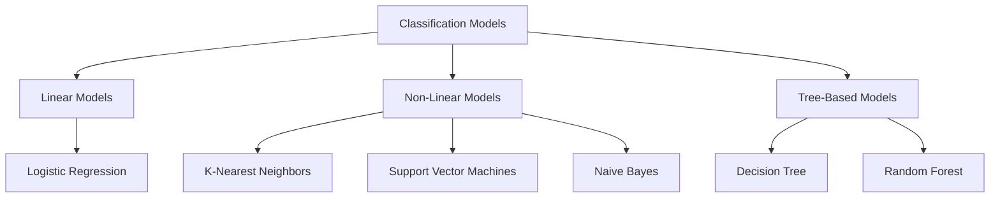

# 🧩 Classification in Machine Learning

<div align="center">


*A comprehensive guide to understanding and implementing classification algorithms*

</div>

---

## 📚 Table of Contents

- [What is Classification?](#what-is-classification)
- [Types of Classification Problems](#types-of-classification-problems)
- [Classification Models Overview](#classification-models-overview)
- [Model Implementations](#model-implementations)
- [Performance Metrics](#performance-metrics)
- [Getting Started](#getting-started)
- [Contributing](#contributing)

---

## 🎯 What is Classification?

**Classification** is a fundamental supervised learning technique in machine learning used to categorize data into discrete classes or labels. Unlike regression, which predicts continuous values, classification aims to identify which category or class a new observation belongs to, based on a training dataset of observations with known categories.

### Key Characteristics:
- **Discrete Output**: Predicts categorical labels (e.g., spam/not spam, disease/no disease)
- **Decision Boundaries**: Creates boundaries to separate different classes
- **Probability Estimation**: Often provides probability of belonging to each class

### Real-World Applications:
- 📧 **Email Filtering**: Spam detection
- 🏥 **Healthcare**: Disease diagnosis based on symptoms
- 🏦 **Banking**: Credit approval and fraud detection
- 👁️ **Computer Vision**: Image recognition and object detection
- 📰 **Text Analysis**: Sentiment analysis and topic categorization

---

## 🔄 Types of Classification Problems

| Type | Description | Example |
|------|-------------|---------|
| **Binary Classification** | Two possible outcomes | Spam/Not Spam |
| **Multi-class Classification** | Multiple classes, one assignment per instance | Animal species identification |
| **Multi-label Classification** | Multiple classes, multiple assignments possible | Movie genre tagging |
| **Imbalanced Classification** | Uneven distribution of classes | Fraud detection (rare events) |

---

## 🧠 Classification Models Overview

This repository contains implementations of six powerful classification algorithms:

<div align="center">



</div>

---

## 🚀 Model Implementations

### 📊 Logistic Regression
```
📁 Logistic-Regression/
```

**Overview**: Despite its name, logistic regression is a classification algorithm that estimates the probability of an instance belonging to a particular class.

**Formula**: `P(y=1) = 1 / (1 + e^(-z))` where `z = β₀ + β₁x₁ + β₂x₂ + ... + βₙxₙ`

**When to Use**:
- Binary classification problems
- When probabilistic interpretation is needed
- When feature relationships are mostly linear
- Baseline model for comparison

**Pros**: Interpretable, efficient, provides probabilities
**Cons**: Limited to linear decision boundaries, may underperform on complex relationships

---

### 🔍 K-Nearest Neighbors (KNN)
```
📁 K-Nearest-Neighbors/
```

**Overview**: A simple, instance-based learning algorithm that classifies a data point based on the majority class among its k nearest neighbors.

**How it Works**:
1. Choose a value for k
2. Find the k closest training examples to the new data point
3. Assign the most common class among those neighbors

**When to Use**:
- Small to medium datasets
- When relationships between features are complex
- When quick implementation is needed

**Pros**: Simple, no training phase, naturally handles multi-class
**Cons**: Computationally expensive for large datasets, sensitive to irrelevant features

---

### 🎯 Support Vector Machines (SVM)
```
📁 SVM/
```

**Overview**: Creates an optimal hyperplane in n-dimensional space to separate different classes, maximizing the margin between the closest points (support vectors).

**Key Concepts**:
- **Margin**: Distance between the hyperplane and the support vectors
- **Kernel trick**: Transforms data to higher dimensions for non-linear separation
- **Support vectors**: Data points that define the decision boundary

**When to Use**:
- High-dimensional data
- Complex decision boundaries
- When accuracy is priority over interpretability

**Pros**: Effective in high-dimensional spaces, memory efficient, versatile through kernels
**Cons**: Not directly probabilistic, sensitive to hyperparameters, slower on large datasets

---

### 📝 Naive Bayes
```
📁 Naive-Bayes/
```

**Overview**: A probabilistic classifier based on Bayes' theorem with an assumption of independence between features.

**Formula**: `P(y|X) ∝ P(y) × ∏ P(xᵢ|y)`

**When to Use**:
- Text classification
- Spam filtering
- Sentiment analysis
- When features are relatively independent
- Very large datasets

**Pros**: Fast, efficient, works well with high dimensionality, needs less training data
**Cons**: "Naive" assumption of independence often violated in real data

---

### 🌳 Decision Tree Classification
```
📁 Decision-Tree-Classification/
```

**Overview**: Creates a tree-like model of decisions by recursively splitting the data based on feature values to maximize class separation.

**How it Works**:
1. Select best feature to split on (using Gini impurity or entropy)
2. Create decision nodes and leaf nodes
3. Recursively split until stopping criteria met

**When to Use**:
- Need interpretable results
- Feature interactions important
- Non-linear relationships
- Mixed data types

**Pros**: Highly interpretable, handles non-linear relationships, no scaling needed
**Cons**: Prone to overfitting, unstable (small changes can result in different trees)

---

### 🌲 Random Forest Classification
```
📁 Random-Forest-Classification/
```

**Overview**: Ensemble method that combines multiple decision trees, using voting to make final predictions. Reduces overfitting through randomness and aggregation.

**Key Features**:
- **Bootstrap Aggregating**: Random sampling with replacement
- **Random Feature Selection**: Subset of features at each split
- **Majority Voting**: Combines decisions from all trees

**When to Use**:
- Large datasets
- Complex relationships
- When accuracy is priority over interpretability
- Need feature importance

**Pros**: Reduces overfitting, handles missing values, provides feature importance
**Cons**: Less interpretable, computationally intensive, may overfit with very noisy data

---

## 📊 Performance Metrics

### Common Classification Metrics:

| Metric | Formula | Description | Best Value |
|--------|---------|-------------|------------|
| **Accuracy** | `(TP + TN) / (TP + TN + FP + FN)` | Overall correctness | 1.0 |
| **Precision** | `TP / (TP + FP)` | Exactness (how many selected items are relevant) | 1.0 |
| **Recall** | `TP / (TP + FN)` | Completeness (how many relevant items are selected) | 1.0 |
| **F1 Score** | `2 * (Precision * Recall) / (Precision + Recall)` | Harmonic mean of precision and recall | 1.0 |
| **AUC-ROC** | Area under ROC curve | Model's ability to discriminate between classes | 1.0 |

### Choosing the Right Metric:
- **Balanced Classes**: Accuracy
- **Imbalanced Classes**: Precision, Recall, F1, AUC-ROC
- **Minimizing False Positives**: Precision
- **Minimizing False Negatives**: Recall
- **Trade-off between Precision/Recall**: F1 Score

### Confusion Matrix Visualization:

<div align="center">

```
              │ Predicted Positive │ Predicted Negative │
─────────────┼───────────────────┼───────────────────┤
Actual       │                   │                   │
Positive     │     True          │     False         │
             │    Positive       │    Negative       │
─────────────┼───────────────────┼───────────────────┤
Actual       │                   │                   │
Negative     │     False         │     True          │
             │    Positive       │    Negative       │
```

</div>

---

## 🛠️ Getting Started

### Prerequisites
```bash
pip install numpy pandas scikit-learn matplotlib seaborn
```

### Basic Usage Example
```python
import pandas as pd
from sklearn.model_selection import train_test_split
from sklearn.ensemble import RandomForestClassifier
from sklearn.metrics import classification_report, confusion_matrix

# Load your data
data = pd.read_csv('your_dataset.csv')
X = data.drop('target', axis=1)
y = data['target']

# Split the data
X_train, X_test, y_train, y_test = train_test_split(X, y, test_size=0.2, random_state=42)

# Train the model
model = RandomForestClassifier(n_estimators=100, random_state=42)
model.fit(X_train, y_train)

# Make predictions
y_pred = model.predict(X_test)

# Evaluate
print(confusion_matrix(y_test, y_pred))
print(classification_report(y_test, y_pred))

# Feature importance
importances = pd.DataFrame({
    'Feature': X.columns,
    'Importance': model.feature_importances_
}).sort_values('Importance', ascending=False)
print(importances.head(10))
```

### Model Selection Guide

```python
# Decision flowchart for model selection
def choose_classification_model(data_size, complexity, interpretability_need, data_type):
    if interpretability_need == "high":
        if complexity == "simple":
            return "Logistic Regression"
        else:
            return "Decision Tree"
    elif data_size == "very large":
        return "Naive Bayes"
    elif data_type == "text":
        return "Naive Bayes or SVM"
    elif complexity == "very complex":
        return "Random Forest or SVM"
    elif data_size == "small":
        return "KNN or SVM"
    else:
        return "Random Forest"
```

---

## 📈 Model Comparison

| Model | Interpretability | Training Speed | Prediction Speed | Handles Non-linearity | Overfitting Risk |
|-------|------------------|----------------|------------------|----------------------|------------------|
| Logistic Regression | ⭐⭐⭐⭐⭐ | ⭐⭐⭐⭐ | ⭐⭐⭐⭐⭐ | ❌ | Low |
| KNN | ⭐⭐⭐ | ⭐⭐⭐⭐⭐ | ⭐⭐ | ✅ | Medium |
| SVM | ⭐⭐ | ⭐⭐⭐ | ⭐⭐⭐ | ✅ | Medium |
| Naive Bayes | ⭐⭐⭐⭐ | ⭐⭐⭐⭐⭐ | ⭐⭐⭐⭐⭐ | ❌ | Low |
| Decision Tree | ⭐⭐⭐⭐⭐ | ⭐⭐⭐⭐ | ⭐⭐⭐⭐ | ✅ | High |
| Random Forest | ⭐⭐⭐ | ⭐⭐⭐ | ⭐⭐⭐ | ✅ | Low |

---

## 🎓 Best Practices

### 1. Data Preprocessing
- **Handle missing values** appropriately
- **Normalize/standardize features** for distance-based algorithms
- **Encode categorical variables** using appropriate techniques
- **Balance imbalanced datasets** using techniques like SMOTE

### 2. Model Selection
- Start with **simple models** (Logistic Regression)
- Use **cross-validation** for model comparison
- Consider **ensemble methods** for better performance
- **Domain knowledge** should guide feature selection

### 3. Avoiding Common Pitfalls
- **Overfitting**: Use regularization, cross-validation, pruning
- **Underfitting**: Try more complex models or feature engineering
- **Class imbalance**: Use appropriate sampling or specialized metrics
- **Feature selection**: Remove irrelevant or redundant features

---

## 📁 Repository Structure

```
Classification-Models/
│
├── Logistic-Regression/
│   ├── logistic_regression.py
│   ├── example_notebook.ipynb
│   └── README.md
│
├── K-Nearest-Neighbors/
│   ├── knn_classifier.py
│   ├── example_notebook.ipynb
│   └── README.md
│
├── SVM/
│   ├── support_vector_machine.py
│   ├── example_notebook.ipynb
│   └── README.md
│
├── Naive-Bayes/
│   ├── naive_bayes_classifier.py
│   ├── example_notebook.ipynb
│   └── README.md
│
├── Decision-Tree-Classification/
│   ├── decision_tree_classifier.py
│   ├── example_notebook.ipynb
│   └── README.md
│
└── Random-Forest-Classification/
    ├── random_forest_classifier.py
    ├── example_notebook.ipynb
    └── README.md
```

---

## 🔍 Advanced Topics

### Ensemble Methods
Beyond Random Forest, explore other ensemble methods:
- **Gradient Boosting Machines (GBM)**: AdaBoost, XGBoost, LightGBM, CatBoost
- **Stacking**: Combining multiple models using a meta-learner
- **Voting Classifiers**: Majority voting among different models

### Neural Networks for Classification
- **Multi-Layer Perceptron (MLP)**: Deep learning approach for complex patterns
- **Convolutional Neural Networks (CNN)**: For image classification tasks
- **Recurrent Neural Networks (RNN)**: For sequential data classification

### Handling Imbalanced Data
- **Resampling**: Over-sampling minority class, under-sampling majority class
- **SMOTE**: Synthetic Minority Over-sampling Technique
- **Cost-Sensitive Learning**: Adjust misclassification costs
- **Anomaly Detection**: For extreme imbalance scenarios

### Explainable AI (XAI)
- **SHAP (SHapley Additive exPlanations)**: Feature attribution values
- **LIME (Local Interpretable Model-agnostic Explanations)**: Explaining individual predictions
- **Partial Dependence Plots**: Visualizing feature effects
- **Rule Extraction**: Converting complex models to interpretable rules

---

## 🤝 Contributing

We welcome contributions! Please see our [Contributing Guidelines](CONTRIBUTING.md) for details.

### How to Contribute:
1. Fork the repository
2. Create a feature branch
3. Make your changes
4. Add tests and documentation
5. Submit a pull request

---

## 📝 License

This project is licensed under the MIT License - see the [LICENSE](LICENSE) file for details.

---

## 🙏 Acknowledgments

- **Scikit-learn** for providing excellent ML implementations
- **Python community** for amazing data science libraries
- **Contributors** who help improve this repository

---

<div align="center">

### 🌟 Star this repository if you found it helpful!

**Happy Classifying! 🚀**

</div>

---

*Last updated: July 2025*