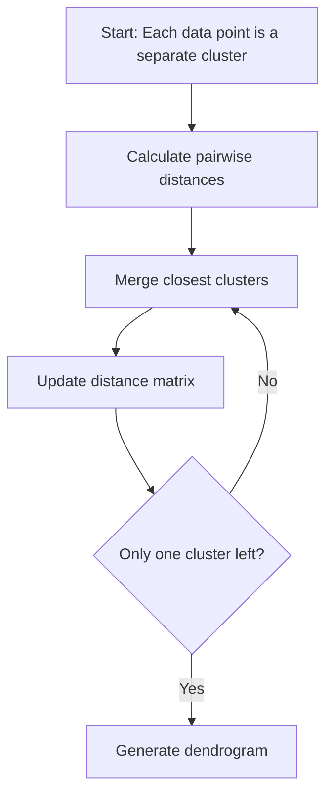
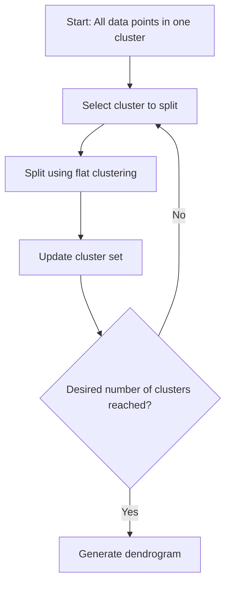

# 🌳 Hierarchical Clustering

<div align="center">


*A Versatile Nested Clustering Algorithm for Discovering Hierarchical Relationships*

</div>

---

## 📚 Table of Contents

- [What is Hierarchical Clustering?](#what-is-hierarchical-clustering)
- [Mathematical Foundation](#mathematical-foundation)
- [How It Works](#how-it-works)
- [Linkage Criteria](#linkage-criteria)
- [Dendrogram Visualization](#dendrogram-visualization)
- [Implementation Guide](#implementation-guide)
- [Optimal Cluster Selection](#optimal-cluster-selection)
- [Pros and Cons](#pros-and-cons)
- [Real-World Examples](#real-world-examples)
- [Advanced Topics](#advanced-topics)
- [FAQ](#faq)

---

## 🎯 What is Hierarchical Clustering?

**Hierarchical Clustering** is an unsupervised machine learning algorithm that creates a hierarchy of clusters, representing nested grouping patterns in data. Unlike flat clustering methods like K-Means, it doesn't require pre-specifying the number of clusters and produces a tree-like structure called a dendrogram that visualizes the clustering process.

### Key Characteristics:
- **Hierarchical Structure**: Creates a nested tree of clusters rather than a single flat partitioning
- **No Pre-defined Clusters**: Does not require specifying the number of clusters beforehand
- **Dendrogram Visualization**: Provides a visual representation of the clustering process
- **Deterministic**: Produces consistent results with the same input data (no random initialization)
- **Multiple Clustering Levels**: Allows extracting different groupings at various levels of granularity
- **Distance-Based**: Uses distance/similarity measures to merge or split clusters

### Types:
1. **Agglomerative (Bottom-up)**: Starts with each data point as a separate cluster and merges the closest pairs until only one cluster remains
2. **Divisive (Top-down)**: Begins with all data points in a single cluster and recursively splits it until each point forms its own cluster

### The Goal:
Create a hierarchical representation of data that reveals multi-level relationships and allows for flexible cluster extraction at different levels of granularity.

---

## 🧮 Mathematical Foundation

### Distance Metrics

The choice of distance metric affects how similarity between data points is calculated:

1. **Euclidean Distance**: Straight-line distance between two points
   ```
   d(x, y) = √(∑(xᵢ - yᵢ)²)
   ```

2. **Manhattan Distance**: Sum of absolute differences
   ```
   d(x, y) = ∑|xᵢ - yᵢ|
   ```

3. **Cosine Distance**: Based on the angle between vectors (useful for high-dimensional data)
   ```
   d(x, y) = 1 - (x·y)/(||x||·||y||)
   ```

4. **Chebyshev Distance**: Maximum absolute difference along any coordinate dimension
   ```
   d(x, y) = max(|xᵢ - yᵢ|)
   ```

### Linkage Criteria

Linkage criteria define how the distance between clusters is measured:

1. **Single Linkage**: Shortest distance between any two points in different clusters
   ```
   d(C₁, C₂) = min{d(x, y) | x ∈ C₁, y ∈ C₂}
   ```

2. **Complete Linkage**: Greatest distance between any two points in different clusters
   ```
   d(C₁, C₂) = max{d(x, y) | x ∈ C₁, y ∈ C₂}
   ```

3. **Average Linkage**: Average distance between all pairs of points in different clusters
   ```
   d(C₁, C₂) = (1/|C₁|·|C₂|) · ∑∑d(x, y) where x ∈ C₁, y ∈ C₂
   ```

4. **Ward's Linkage**: Minimizes the increase in sum of squared errors (variance) after merging
   ```
   d(C₁, C₂) = √[(∑(x - m₁₂)² for x ∈ C₁∪C₂) - (∑(x - m₁)² for x ∈ C₁) - (∑(x - m₂)² for x ∈ C₂)]
   ```
   where m₁, m₂, and m₁₂ are the centroids of C₁, C₂, and C₁∪C₂, respectively.

### Cophenetic Correlation Coefficient

Measures how faithfully a dendrogram preserves the pairwise distances between the original data points:
```
c = ∑ᵢ<ⱼ (Yᵢⱼ - Ȳ)(Zᵢⱼ - Z̄) / √[∑ᵢ<ⱼ(Yᵢⱼ - Ȳ)² · ∑ᵢ<ⱼ(Zᵢⱼ - Z̄)²]
```
where:
- Yᵢⱼ is the distance between points i and j in the original distance matrix
- Zᵢⱼ is the cophenetic distance between points i and j (the height at which points i and j are first joined in the dendrogram)
- Ȳ and Z̄ are the means of Yᵢⱼ and Zᵢⱼ, respectively

### Inconsistency Coefficient

Helps identify significant clusters by measuring how consistent a merge is compared to other merges:
```
I(i) = (d(i) - μ) / σ
```
where:
- d(i) is the height of the i-th merge
- μ is the mean height of merges included in the calculation
- σ is the standard deviation of those heights

---

## ⚙️ How It Works

### Agglomerative Hierarchical Clustering Algorithm:

<div align="center">



</div>

### Step-by-Step Process:

1. **Initialize**: Start with n clusters, each containing a single data point
2. **Compute Distances**: Calculate pairwise distances between all clusters
3. **Merge Clusters**: Find the two closest clusters and merge them
4. **Update Distances**: Recalculate distances between the new cluster and all other clusters
5. **Repeat**: Steps 3-4 until only one cluster remains
6. **Create Dendrogram**: Record the merge history to visualize the clustering hierarchy

### Python Implementation:

```python
import numpy as np
from scipy.spatial.distance import pdist, squareform

def agglomerative_clustering(X, linkage='single'):
    """
    Perform agglomerative hierarchical clustering.
    
    Parameters:
    -----------
    X : ndarray of shape (n_samples, n_features)
        The input data
    linkage : str, default='single'
        The linkage criterion to use: 'single', 'complete', 'average', or 'ward'
    
    Returns:
    --------
    Z : ndarray of shape (n_samples-1, 4)
        The hierarchical clustering encoded as a linkage matrix. Each row contains:
        [idx1, idx2, distance, cluster_size]
    """
    # Calculate pairwise distances
    n_samples = X.shape[0]
    dist_matrix = squareform(pdist(X))
    
    # Initialize clusters (each point is a cluster)
    clusters = [[i] for i in range(n_samples)]
    
    # Initialize linkage matrix
    Z = np.zeros((n_samples - 1, 4))
    
    # Perform hierarchical clustering
    for i in range(n_samples - 1):
        # Find closest pair of clusters
        min_dist = float('inf')
        min_i, min_j = -1, -1
        
        for i_idx in range(len(clusters)):
            for j_idx in range(i_idx + 1, len(clusters)):
                cluster_i = clusters[i_idx]
                cluster_j = clusters[j_idx]
                
                # Calculate distance based on linkage criterion
                if linkage == 'single':
                    # Single linkage: minimum distance between points
                    cluster_dist = min([dist_matrix[i, j] for i in cluster_i for j in cluster_j])
                elif linkage == 'complete':
                    # Complete linkage: maximum distance between points
                    cluster_dist = max([dist_matrix[i, j] for i in cluster_i for j in cluster_j])
                elif linkage == 'average':
                    # Average linkage: average distance between points
                    cluster_dist = np.mean([dist_matrix[i, j] for i in cluster_i for j in cluster_j])
                elif linkage == 'ward':
                    # Ward linkage: increase in variance (simplified implementation)
                    merged = cluster_i + cluster_j
                    cluster_dist = (
                        np.sum(np.var(X[merged], axis=0)) * len(merged) - 
                        np.sum(np.var(X[cluster_i], axis=0)) * len(cluster_i) -
                        np.sum(np.var(X[cluster_j], axis=0)) * len(cluster_j)
                    )
                else:
                    raise ValueError(f"Unknown linkage criterion: {linkage}")
                
                if cluster_dist < min_dist:
                    min_dist = cluster_dist
                    min_i, min_j = i_idx, j_idx
        
        # Record the merge
        Z[i, 0] = min(min_i, min_j)
        Z[i, 1] = max(min_i, min_j)
        Z[i, 2] = min_dist
        Z[i, 3] = len(clusters[min_i]) + len(clusters[min_j])
        
        # Merge clusters
        clusters[min_i] = clusters[min_i] + clusters[min_j]
        clusters.pop(min_j)
    
    return Z
```

### Divisive Hierarchical Clustering Algorithm:

<div align="center">



</div>

### Python Implementation (Divisive):

```python
import numpy as np
from sklearn.cluster import KMeans

def divisive_clustering(X, max_clusters=10):
    """
    Perform divisive hierarchical clustering.
    
    Parameters:
    -----------
    X : ndarray of shape (n_samples, n_features)
        The input data
    max_clusters : int, default=10
        Maximum number of clusters to form
    
    Returns:
    --------
    cluster_hierarchy : list of dicts
        List containing the hierarchy of clusters
    """
    n_samples = X.shape[0]
    
    # Initialize with a single cluster containing all points
    clusters = [list(range(n_samples))]
    cluster_hierarchy = []
    
    # Split until we have max_clusters or can't split further
    while len(clusters) < max_clusters:
        # Find largest cluster
        largest_cluster_idx = np.argmax([len(cluster) for cluster in clusters])
        cluster_to_split = clusters[largest_cluster_idx]
        
        # If cluster has only one element, we can't split further
        if len(cluster_to_split) <= 1:
            break
        
        # Extract the data points for the cluster
        X_cluster = X[cluster_to_split]
        
        # Decide how many subclusters to split into
        # (for simplicity, always split into 2)
        k = 2
        
        # Apply K-means to split the cluster
        kmeans = KMeans(n_clusters=k, random_state=42)
        labels = kmeans.fit_predict(X_cluster)
        
        # Create the new clusters
        new_clusters = []
        for i in range(k):
            # Get original indices of points in new clusters
            new_cluster = [cluster_to_split[j] for j in range(len(cluster_to_split)) if labels[j] == i]
            if new_cluster:  # Only add if not empty
                new_clusters.append(new_cluster)
        
        # Record the split
        cluster_hierarchy.append({
            'parent': cluster_to_split,
            'children': new_clusters,
            'centroids': kmeans.cluster_centers_
        })
        
        # Update cluster list: remove the split cluster and add new ones
        clusters.pop(largest_cluster_idx)
        clusters.extend(new_clusters)
    
    return cluster_hierarchy
```

---

## 🔗 Linkage Criteria

Linkage criteria determine how the distance between clusters is calculated. The choice of linkage affects the shape of clusters and the resulting hierarchy.

### 1. **Single Linkage (Minimum Linkage)**

Defines distance between clusters as the minimum distance between any points in the two clusters.

```python
def single_linkage(cluster1, cluster2, distance_matrix):
    """Calculate single linkage distance between clusters."""
    min_dist = float('inf')
    for i in cluster1:
        for j in cluster2:
            if distance_matrix[i, j] < min_dist:
                min_dist = distance_matrix[i, j]
    return min_dist
```

**Characteristics**:
- Tends to create elongated, "chaining" clusters
- Sensitive to noise and outliers
- Good at identifying non-convex clusters
- Often creates unbalanced dendrograms

### 2. **Complete Linkage (Maximum Linkage)**

Defines distance between clusters as the maximum distance between any points in the two clusters.

```python
def complete_linkage(cluster1, cluster2, distance_matrix):
    """Calculate complete linkage distance between clusters."""
    max_dist = float('-inf')
    for i in cluster1:
        for j in cluster2:
            if distance_matrix[i, j] > max_dist:
                max_dist = distance_matrix[i, j]
    return max_dist
```

**Characteristics**:
- Tends to create compact, roughly equal-sized clusters
- Less sensitive to noise and outliers
- Struggles with non-convex clusters
- Generally creates more balanced dendrograms

### 3. **Average Linkage (UPGMA)**

Defines distance between clusters as the average distance between all pairs of points in the two clusters.

```python
def average_linkage(cluster1, cluster2, distance_matrix):
    """Calculate average linkage distance between clusters."""
    total_dist = 0
    count = 0
    for i in cluster1:
        for j in cluster2:
            total_dist += distance_matrix[i, j]
            count += 1
    return total_dist / count
```

**Characteristics**:
- Compromise between single and complete linkage
- Moderately sensitive to outliers
- Works well with many data types
- Typically creates more balanced dendrograms than single linkage

### 4. **Ward's Linkage**

Minimizes the increase in the sum of squared errors after merging clusters.

```python
def ward_linkage(cluster1, cluster2, X):
    """Calculate Ward's linkage between clusters."""
    # Calculate centroids
    centroid1 = np.mean(X[cluster1], axis=0)
    centroid2 = np.mean(X[cluster2], axis=0)
    
    # Calculate merged centroid
    merged = cluster1 + cluster2
    merged_centroid = np.mean(X[merged], axis=0)
    
    # Calculate increase in variance
    increase = (
        np.sum(np.linalg.norm(X[merged] - merged_centroid, axis=1)**2) - 
        np.sum(np.linalg.norm(X[cluster1] - centroid1, axis=1)**2) -
        np.sum(np.linalg.norm(X[cluster2] - centroid2, axis=1)**2)
    )
    return increase
```

**Characteristics**:
- Tends to create compact, spherical clusters
- Minimizes within-cluster variance
- Less sensitive to noise
- Often produces visually appealing dendrograms

### 5. **Centroid Linkage (UPGMC)**

Defines distance between clusters as the distance between their centroids.

```python
def centroid_linkage(cluster1, cluster2, X):
    """Calculate centroid linkage between clusters."""
    centroid1 = np.mean(X[cluster1], axis=0)
    centroid2 = np.mean(X[cluster2], axis=0)
    return np.linalg.norm(centroid1 - centroid2)
```

**Characteristics**:
- Can sometimes produce inversions in the dendrogram
- Sensitive to the distribution of points within clusters
- May produce clusters with complex shapes
- Less commonly used than other methods

### Comparison of Linkage Methods:

```python
import numpy as np
import matplotlib.pyplot as plt
from scipy.cluster.hierarchy import dendrogram, linkage
from sklearn.datasets import make_blobs

# Generate some data
X, y = make_blobs(n_samples=50, centers=3, random_state=42)

# Apply different linkage methods
linkage_methods = ['single', 'complete', 'average', 'ward']
fig, axes = plt.subplots(2, 2, figsize=(15, 10))
axes = axes.flatten()

for i, method in enumerate(linkage_methods):
    Z = linkage(X, method=method)
    
    # Plot dendrogram
    dendrogram(Z, ax=axes[i])
    axes[i].set_title(f'Dendrogram ({method} linkage)')
    axes[i].set_xlabel('Sample index')
    axes[i].set_ylabel('Distance')

plt.tight_layout()
plt.show()
```

### Selecting the Right Linkage Method:

- **Single Linkage**: Use when clusters are irregularly shaped or when you want to detect outliers.
- **Complete Linkage**: Use when clusters are compact and approximately equal in size.
- **Average Linkage**: Use as a general-purpose method when there's no prior knowledge about cluster shapes.
- **Ward's Linkage**: Use when you expect clusters to be roughly hyperspherical and of similar sizes.

---

## 📊 Dendrogram Visualization

A dendrogram is a tree diagram that shows the hierarchical relationship between clusters. It's the primary visualization tool for hierarchical clustering.

### Components of a Dendrogram:

1. **Leaves**: Individual data points (or clusters) at the bottom of the dendrogram
2. **Branches**: Lines connecting clusters that are merged
3. **Heights**: Vertical position of merges, indicating the distance/dissimilarity at which clusters are joined
4. **Clusters**: Formed by cutting the dendrogram horizontally at a specific height

### Creating a Basic Dendrogram:

```python
import numpy as np
import matplotlib.pyplot as plt
from scipy.cluster.hierarchy import dendrogram, linkage
from sklearn.datasets import load_iris

# Load data
data = load_iris()
X = data.data[:50]  # Use only first two classes for simplicity

# Compute hierarchical clustering
Z = linkage(X, method='ward')

# Plot dendrogram
plt.figure(figsize=(12, 6))
dendrogram(
    Z,
    leaf_rotation=90.,  # rotates the labels
    leaf_font_size=8.,  # font size for the labels
)
plt.title('Hierarchical Clustering Dendrogram')
plt.xlabel('Sample index')
plt.ylabel('Distance')
plt.tight_layout()
plt.show()
```

### Advanced Dendrogram Customization:

```python
def fancy_dendrogram(Z, labels=None, max_d=None, truncate_mode=None, 
                     p=None, orientation='top', leaf_font_size=10.,
                     leaf_rotation=90., count_sort=False):
    """
    Create a customized dendrogram with various options.
    
    Parameters:
    -----------
    Z : ndarray
        The hierarchical clustering encoded as a linkage matrix
    labels : list, optional
        Labels for the leaves
    max_d : float, optional
        Height at which the dendrogram is cut
    truncate_mode : str, optional
        Truncation mode ('lastp', 'level', or None)
    p : int, optional
        Number of items to show in truncated dendrogram
    orientation : str, optional
        Direction of the dendrogram ('top', 'bottom', 'left', 'right')
    leaf_font_size : float, optional
        Font size for leaf labels
    leaf_rotation : float, optional
        Rotation angle for leaf labels
    count_sort : bool, optional
        Whether to sort leaves by count
    """
    plt.figure(figsize=(14, 8))
    
    # Plot dendrogram
    dend = dendrogram(
        Z,
        labels=labels,
        truncate_mode=truncate_mode,
        p=p,
        orientation=orientation,
        leaf_rotation=leaf_rotation,
        leaf_font_size=leaf_font_size,
        show_contracted=True,
        count_sort=count_sort,
    )
    
    # Add horizontal line for cutting the dendrogram
    if max_d:
        plt.axhline(y=max_d, c='k', linestyle='--', label=f'Cut at height = {max_d}')
        plt.legend()
    
    # Add labels
    plt.title('Hierarchical Clustering Dendrogram')
    if orientation in ['top', 'bottom']:
        plt.xlabel('Sample index or cluster size')
        plt.ylabel('Distance')
    else:
        plt.xlabel('Distance')
        plt.ylabel('Sample index or cluster size')
    
    plt.tight_layout()
    
    return dend
```

### Color-Enhanced Dendrogram:

```python
def colored_dendrogram(Z, labels=None, n_clusters=None):
    """
    Create a dendrogram with clusters colored differently.
    
    Parameters:
    -----------
    Z : ndarray
        The hierarchical clustering encoded as a linkage matrix
    labels : list, optional
        Labels for the leaves
    n_clusters : int, optional
        Number of clusters to highlight with different colors
    """
    from scipy.cluster.hierarchy import fcluster
    
    plt.figure(figsize=(14, 8))
    
    # Plot the dendrogram
    dend = dendrogram(
        Z,
        labels=labels,
        leaf_rotation=90.,
        leaf_font_size=10.,
    )
    
    # Color the clusters
    if n_clusters:
        # Cut the tree to get cluster assignments
        cluster_idxs = fcluster(Z, n_clusters, criterion='maxclust')
        
        # Map cluster indices to unique colors
        cluster_colors = plt.cm.rainbow(np.linspace(0, 1, n_clusters))
        
        # Color the dendrogram
        link_cols = {}
        for i, i_cluster in enumerate(cluster_idxs):
            link_cols[i] = cluster_colors[i_cluster-1]
        
        # Replot the dendrogram with colored leaves
        dendrogram(
            Z,
            labels=labels,
            leaf_rotation=90.,
            leaf_font_size=10.,
            link_color_func=lambda x: link_cols.get(x, 'k'),
            ax=plt.gca()
        )
    
    plt.title('Hierarchical Clustering Dendrogram (Colored by Cluster)')
    plt.xlabel('Sample index')
    plt.ylabel('Distance')
    plt.tight_layout()
```

### Interactive Dendrogram with Hover:

```python
import plotly.figure_factory as ff

def interactive_dendrogram(Z, labels=None):
    """Create an interactive dendrogram with hover information."""
    import plotly.figure_factory as ff
    
    # Create dendrogram
    fig = ff.create_dendrogram(
        Z,
        orientation='bottom',
        labels=labels,
        colorscale='Viridis',
        showticklabels=True,
        distfun=lambda x: x,  # Identity function since Z is already a linkage matrix
    )
    
    # Update layout
    fig.update_layout(
        title='Interactive Hierarchical Clustering Dendrogram',
        xaxis={'title': 'Sample index'},
        yaxis={'title': 'Distance'},
        width=900,
        height=500
    )
    
    return fig
```

### Cluster Extraction from Dendrogram:

```python
def extract_clusters_from_dendrogram(Z, n_clusters=None, distance_threshold=None):
    """
    Extract clusters from a dendrogram.
    
    Parameters:
    -----------
    Z : ndarray
        The hierarchical clustering encoded as a linkage matrix
    n_clusters : int, optional
        Number of clusters to extract (specify either n_clusters or distance_threshold)
    distance_threshold : float, optional
        Distance threshold for cutting the dendrogram
    
    Returns:
    --------
    cluster_labels : ndarray
        Cluster label for each data point
    """
    from scipy.cluster.hierarchy import fcluster
    
    if n_clusters is not None:
        # Extract clusters by specifying their number
        return fcluster(Z, n_clusters, criterion='maxclust')
    elif distance_threshold is not None:
        # Extract clusters by cutting at a specific distance
        return fcluster(Z, distance_threshold, criterion='distance')
    else:
        raise ValueError("Either n_clusters or distance_threshold must be specified")
```

### Comparing Multiple Dendrograms:

```python
def compare_dendrograms(X, linkage_methods=['single', 'complete', 'average', 'ward']):
    """Compare dendrograms created using different linkage methods."""
    fig, axes = plt.subplots(len(linkage_methods), 1, figsize=(12, 5*len(linkage_methods)))
    
    if len(linkage_methods) == 1:
        axes = [axes]
    
    for i, method in enumerate(linkage_methods):
        # Compute linkage matrix
        Z = linkage(X, method=method)
        
        # Plot dendrogram
        dendrogram(
            Z,
            ax=axes[i],
            leaf_rotation=90.,
            leaf_font_size=8.
        )
        
        axes[i].set_title(f'Dendrogram ({method} linkage)')
        axes[i].set_xlabel('Sample index')
        axes[i].set_ylabel('Distance')
    
    plt.tight_layout()
    plt.show()
```

---

## 💻 Implementation Guide

### From Scratch Implementation

```python
import numpy as np
import matplotlib.pyplot as plt
from scipy.spatial.distance import pdist, squareform

class HierarchicalClustering:
    """
    A class for agglomerative hierarchical clustering.
    
    Parameters:
    -----------
    linkage : str, default='single'
        The linkage criterion to use: 'single', 'complete', 'average', or 'ward'
    """
    def __init__(self, linkage='single'):
        self.linkage = linkage
        self.linkage_matrix = None
        self.labels_ = None
    
    def fit(self, X):
        """
        Build a hierarchy of clusters from the data.
        
        Parameters:
        -----------
        X : ndarray of shape (n_samples, n_features)
            Training instances
        
        Returns:
        --------
        self : object
            Fitted estimator
        """
        n_samples = X.shape[0]
        
        # Calculate pairwise distances
        distances = squareform(pdist(X))
        
        # Initialize clusters (each point is a cluster)
        clusters = [[i] for i in range(n_samples)]
        
        # Initialize linkage matrix
        self.linkage_matrix = np.zeros((n_samples - 1, 4))
        
        # Perform hierarchical clustering
        for i in range(n_samples - 1):
            # Find closest pair of clusters
            min_dist = float('inf')
            min_i, min_j = -1, -1
            
            for i_idx in range(len(clusters)):
                for j_idx in range(i_idx + 1, len(clusters)):
                    cluster_i = clusters[i_idx]
                    cluster_j = clusters[j_idx]
                    
                    # Calculate distance based on linkage criterion
                    if self.linkage == 'single':
                        # Single linkage: minimum distance between points
                        cluster_dist = min([distances[i, j] for i in cluster_i for j in cluster_j])
                    elif self.linkage == 'complete':
                        # Complete linkage: maximum distance between points
                        cluster_dist = max([distances[i, j] for i in cluster_i for j in cluster_j])
                    elif self.linkage == 'average':
                        # Average linkage: average distance between points
                        cluster_dist = np.mean([distances[i, j] for i in cluster_i for j in cluster_j])
                    elif self.linkage == 'ward':
                        # Ward linkage: increase in variance (simplified)
                        merged = cluster_i + cluster_j
                        cluster_dist = (
                            np.sum(np.var(X[merged], axis=0)) * len(merged) - 
                            np.sum(np.var(X[cluster_i], axis=0)) * len(cluster_i) -
                            np.sum(np.var(X[cluster_j], axis=0)) * len(cluster_j)
                        )
                    else:
                        raise ValueError(f"Unknown linkage criterion: {self.linkage}")
                    
                    if cluster_dist < min_dist:
                        min_dist = cluster_dist
                        min_i, min_j = i_idx, j_idx
            
            # Record the merge
            self.linkage_matrix[i, 0] = min_i
            self.linkage_matrix[i, 1] = min_j
            self.linkage_matrix[i, 2] = min_dist
            self.linkage_matrix[i, 3] = len(clusters[min_i]) + len(clusters[min_j])
            
            # Merge clusters
            clusters[min_i] = clusters[min_i] + clusters[min_j]
            clusters.pop(min_j)
        
        return self
    
    def fit_predict(self, X, n_clusters=None, distance_threshold=None):
        """
        Build a hierarchy of clusters and return cluster labels.
        
        Parameters:
        -----------
        X : ndarray of shape (n_samples, n_features)
            Training instances
        n_clusters : int, optional
            Number of clusters to extract
        distance_threshold : float, optional
            Distance threshold for cutting the dendrogram
        
        Returns:
        --------
        labels : ndarray of shape (n_samples,)
            Cluster labels for each point
        """
        self.fit(X)
        return self.predict(n_clusters, distance_threshold)
    
    def predict(self, n_clusters=None, distance_threshold=None):
        """
        Extract clusters from the hierarchy.
        
        Parameters:
        -----------
        n_clusters : int, optional
            Number of clusters to extract
        distance_threshold : float, optional
            Distance threshold for cutting the dendrogram
        
        Returns:
        --------
        labels : ndarray
            Cluster label for each data point
        """
        if self.linkage_matrix is None:
            raise ValueError("Model not fitted yet. Call 'fit' first.")
        
        from scipy.cluster.hierarchy import fcluster
        
        if n_clusters is not None:
            self.labels_ = fcluster(self.linkage_matrix, n_clusters, criterion='maxclust')
        elif distance_threshold is not None:
            self.labels_ = fcluster(self.linkage_matrix, distance_threshold, criterion='distance')
        else:
            raise ValueError("Either n_clusters or distance_threshold must be specified")
        
        return self.labels_
    
    def plot_dendrogram(self, labels=None, truncate_mode=None, p=None, max_d=None):
        """
        Plot the dendrogram of the hierarchical clustering.
        
        Parameters:
        -----------
        labels : list, optional
            Labels for the leaves
        truncate_mode : str, optional
            Truncation mode ('lastp', 'level', or None)
        p : int, optional
            Number of items to show in truncated dendrogram
        max_d : float, optional
            Height at which to cut the dendrogram
        """
        from scipy.cluster.hierarchy import dendrogram
        
        if self.linkage_matrix is None:
            raise ValueError("Model not fitted yet. Call 'fit' first.")
        
        plt.figure(figsize=(12, 6))
        
        dendrogram(
            self.linkage_matrix,
            labels=labels,
            truncate_mode=truncate_mode,
            p=p,
            leaf_rotation=90.,
            leaf_font_size=8.
        )
        
        plt.title(f'Hierarchical Clustering Dendrogram ({self.linkage} linkage)')
        plt.xlabel('Sample index')
        plt.ylabel('Distance')
        
        if max_d is not None:
            plt.axhline(y=max_d, c='k', linestyle='--', label=f'Cut at height = {max_d}')
            plt.legend()
        
        plt.tight_layout()
        plt.show()
```

### Using scipy and scikit-learn

```python
import numpy as np
import matplotlib.pyplot as plt
from sklearn.datasets import load_iris
from sklearn.preprocessing import StandardScaler
from scipy.cluster.hierarchy import linkage, dendrogram, fcluster
from sklearn.cluster import AgglomerativeClustering
from sklearn.metrics import silhouette_score

# Load and prepare data
data = load_iris()
X = data.data
y = data.target  # Only for evaluation, not used in clustering

# Scale the data
scaler = StandardScaler()
X_scaled = scaler.fit_transform(X)

# Using scipy for hierarchical clustering
# Compute linkage matrix
Z = linkage(X_scaled, method='ward')

# Plot dendrogram
plt.figure(figsize=(12, 6))
dendrogram(
    Z,
    leaf_rotation=90.,
    leaf_font_size=8.
)
plt.title('Hierarchical Clustering Dendrogram (Ward linkage)')
plt.xlabel('Sample index')
plt.ylabel('Distance')
plt.tight_layout()
plt.show()

# Cut the dendrogram to get clusters
k = 3  # Number of clusters
labels_scipy = fcluster(Z, k, criterion='maxclust')

# Using scikit-learn for hierarchical clustering
model = AgglomerativeClustering(n_clusters=k, linkage='ward')
labels_sklearn = model.fit_predict(X_scaled)

# Evaluate with silhouette score
silhouette_scipy = silhouette_score(X_scaled, labels_scipy)
silhouette_sklearn = silhouette_score(X_scaled, labels_sklearn)

print(f"Silhouette score (scipy): {silhouette_scipy:.3f}")
print(f"Silhouette score (sklearn): {silhouette_sklearn:.3f}")

# Visualize clusters (for 2D data, use first two features or PCA)
from sklearn.decomposition import PCA

pca = PCA(n_components=2)
X_pca = pca.fit_transform(X_scaled)

plt.figure(figsize=(12, 5))

# Plot scipy clusters
plt.subplot(1, 2, 1)
scatter = plt.scatter(X_pca[:, 0], X_pca[:, 1], c=labels_scipy, cmap='viridis')
plt.colorbar(scatter, label='Cluster')
plt.title(f'Hierarchical Clustering (scipy)\nSilhouette: {silhouette_scipy:.3f}')
plt.xlabel('PCA Component 1')
plt.ylabel('PCA Component 2')

# Plot sklearn clusters
plt.subplot(1, 2, 2)
scatter = plt.scatter(X_pca[:, 0], X_pca[:, 1], c=labels_sklearn, cmap='viridis')
plt.colorbar(scatter, label='Cluster')
plt.title(f'Hierarchical Clustering (sklearn)\nSilhouette: {silhouette_sklearn:.3f}')
plt.xlabel('PCA Component 1')
plt.ylabel('PCA Component 2')

plt.tight_layout()
plt.show()
```

### Complete Example with Visualization

```python
import numpy as np
import pandas as pd
import matplotlib.pyplot as plt
import seaborn as sns
from sklearn.datasets import make_blobs, make_moons
from sklearn.preprocessing import StandardScaler
from scipy.cluster.hierarchy import linkage, dendrogram, fcluster
from sklearn.cluster import AgglomerativeClustering
from sklearn.metrics import silhouette_score, silhouette_samples
from sklearn.decomposition import PCA

# Set random seed for reproducibility
np.random.seed(42)

# Generate different datasets
n_samples = 300

# Dataset 1: Blobs (spherical Gaussian clusters)
X_blobs, y_blobs = make_blobs(n_samples=n_samples, centers=4, cluster_std=0.6, random_state=42)

# Dataset 2: Moons (non-convex clusters)
X_moons, y_moons = make_moons(n_samples=n_samples, noise=0.08, random_state=42)

# Dataset 3: Mix (blobs + additional noise)
X_mix = np.vstack([
    make_blobs(n_samples=n_samples//3*2, centers=3, cluster_std=0.6, random_state=42)[0],
    np.random.uniform(-10, 10, (n_samples//3, 2))  # Add noise
])
y_mix = np.hstack([
    np.arange(3).repeat(n_samples//3//3*2),
    np.full(n_samples//3, -1)  # Noise label
])

datasets = [
    ("Blobs", X_blobs, y_blobs),
    ("Moons", X_moons, y_moons),
    ("Mixed", X_mix, y_mix)
]

# Define linkage methods to compare
linkage_methods = ['single', 'complete', 'average', 'ward']

# Plot the datasets
plt.figure(figsize=(15, 5))
for i, (name, X, y) in enumerate(datasets):
    plt.subplot(1, 3, i+1)
    plt.scatter(X[:, 0], X[:, 1], c=y, cmap='viridis', alpha=0.7)
    plt.title(name)
    plt.grid(True, alpha=0.3)
plt.tight_layout()
plt.show()

# Analyze each dataset with different linkage methods
for name, X, y_true in datasets:
    print(f"\nAnalyzing {name} dataset:")
    
    # Scale the data
    scaler = StandardScaler()
    X_scaled = scaler.fit_transform(X)
    
    # Compare dendrograms for different linkage methods
    plt.figure(figsize=(15, 12))
    for i, method in enumerate(linkage_methods):
        plt.subplot(2, 2, i+1)
        Z = linkage(X_scaled, method=method)
        dendrogram(Z, truncate_mode='lastp', p=30, leaf_font_size=8)
        plt.title(f'{name} - {method.capitalize()} Linkage')
        plt.xlabel('Sample index or (cluster size)')
        plt.ylabel('Distance')
    plt.tight_layout()
    plt.show()
    
    # Determine optimal number of clusters using silhouette analysis
    silhouette_scores = []
    cluster_range = range(2, 11)
    
    for k in cluster_range:
        model = AgglomerativeClustering(n_clusters=k, linkage='ward')
        labels = model.fit_predict(X_scaled)
        score = silhouette_score(X_scaled, labels)
        silhouette_scores.append(score)
    
    # Plot silhouette scores
    plt.figure(figsize=(10, 6))
    plt.plot(cluster_range, silhouette_scores, 'o-')
    plt.xlabel('Number of Clusters')
    plt.ylabel('Silhouette Score')
    plt.title(f'{name} - Silhouette Analysis')
    plt.grid(True)
    plt.show()
    
    # Use the optimal number of clusters
    optimal_k = cluster_range[np.argmax(silhouette_scores)]
    print(f"Optimal number of clusters for {name}: {optimal_k}")
    
    # Compare clustering results with different linkage methods
    plt.figure(figsize=(15, 10))
    
    for i, method in enumerate(linkage_methods):
        model = AgglomerativeClustering(n_clusters=optimal_k, linkage=method)
        labels = model.fit_predict(X_scaled)
        
        # Calculate silhouette score
        sil_score = silhouette_score(X_scaled, labels)
        
        # Plot clustering results
        plt.subplot(2, 2, i+1)
        plt.scatter(X[:, 0], X[:, 1], c=labels, cmap='viridis', alpha=0.7)
        plt.title(f'{method.capitalize()} Linkage\nSilhouette: {sil_score:.3f}')
        plt.grid(True, alpha=0.3)
    
    plt.tight_layout()
    plt.show()
    
    # Detailed analysis of the best method (Ward)
    model = AgglomerativeClustering(n_clusters=optimal_k, linkage='ward')
    labels = model.fit_predict(X_scaled)
    
    # Get silhouette values for each sample
    silhouette_vals = silhouette_samples(X_scaled, labels)
    
    # Create silhouette plot
    plt.figure(figsize=(12, 8))
    
    y_ticks = []
    y_lower, y_upper = 0, 0
    
    for i in range(optimal_k):
        # Get silhouette scores for cluster i
        cluster_silhouette_vals = silhouette_vals[labels == i]
        cluster_silhouette_vals.sort()
        
        y_upper += len(cluster_silhouette_vals)
        color = plt.cm.viridis(i / optimal_k)
        
        plt.barh(range(y_lower, y_upper), cluster_silhouette_vals, 
                height=1.0, edgecolor='none', color=color)
        
        y_ticks.append((y_lower + y_upper) / 2)
        y_lower = y_upper
    
    # Get average silhouette score
    avg_silhouette = silhouette_score(X_scaled, labels)
    
    # Plot average silhouette score
    plt.axvline(x=avg_silhouette, color='red', linestyle='--', 
               label=f'Average Silhouette: {avg_silhouette:.3f}')
    
    plt.yticks(y_ticks, [f'Cluster {i+1}' for i in range(optimal_k)])
    plt.xlabel('Silhouette Coefficient')
    plt.ylabel('Cluster')
    plt.title(f'{name} - Silhouette Analysis (Ward Linkage)')
    plt.legend(loc='best')
    plt.grid(True, alpha=0.3)
    plt.tight_layout()
    plt.show()
    
    # PCA visualization if data is high-dimensional
    if X.shape[1] > 2:
        pca = PCA(n_components=2)
        X_pca = pca.fit_transform(X_scaled)
        
        plt.figure(figsize=(10, 6))
        scatter = plt.scatter(X_pca[:, 0], X_pca[:, 1], c=labels, cmap='viridis', alpha=0.7)
        plt.colorbar(scatter, label='Cluster')
        plt.title(f'{name} - PCA Visualization (Ward Linkage)')
        plt.xlabel(f'PC1 ({pca.explained_variance_ratio_[0]:.2%})')
        plt.ylabel(f'PC2 ({pca.explained_variance_ratio_[1]:.2%})')
        plt.grid(True, alpha=0.3)
        plt.show()
    
    # Compare with ground truth (if available)
    if y_true is not None and len(np.unique(y_true)) > 1:
        from sklearn.metrics import adjusted_rand_score, normalized_mutual_info_score
        
        ari = adjusted_rand_score(y_true, labels)
        nmi = normalized_mutual_info_score(y_true, labels)
        
        print(f"Comparison with ground truth:")
        print(f"  Adjusted Rand Index: {ari:.3f}")
        print(f"  Normalized Mutual Information: {nmi:.3f}")
        
        # Visualize ground truth vs. clustering results
        plt.figure(figsize=(12, 5))
        
        plt.subplot(1, 2, 1)
        plt.scatter(X[:, 0], X[:, 1], c=y_true, cmap='viridis', alpha=0.7)
        plt.title('Ground Truth')
        plt.grid(True, alpha=0.3)
        
        plt.subplot(1, 2, 2)
        plt.scatter(X[:, 0], X[:, 1], c=labels, cmap='viridis', alpha=0.7)
        plt.title(f'Hierarchical Clustering\nARI: {ari:.3f}, NMI: {nmi:.3f}')
        plt.grid(True, alpha=0.3)
        
        plt.tight_layout()
        plt.show()

# 3D visualization for the blobs dataset
from mpl_toolkits.mplot3d import Axes3D

# Generate 3D blobs
X_3d, y_3d = make_blobs(n_samples=300, centers=5, n_features=3, random_state=42)

# Scale the data
scaler = StandardScaler()
X_3d_scaled = scaler.fit_transform(X_3d)

# Apply hierarchical clustering
model_3d = AgglomerativeClustering(n_clusters=5, linkage='ward')
labels_3d = model_3d.fit_predict(X_3d_scaled)

# 3D visualization
fig = plt.figure(figsize=(12, 10))
ax = fig.add_subplot(111, projection='3d')

# Plot clusters
scatter = ax.scatter(X_3d[:, 0], X_3d[:, 1], X_3d[:, 2], 
                    c=labels_3d, cmap='viridis', s=50, alpha=0.7)

ax.set_title('3D Hierarchical Clustering (Ward Linkage)')
ax.set_xlabel('Feature 1')
ax.set_ylabel('Feature 2')
ax.set_zlabel('Feature 3')

plt.colorbar(scatter, label='Cluster')
plt.tight_layout()
plt.show()

# Interactive dendrogram visualization (for use in notebook environment)
try:
    import plotly.figure_factory as ff
    
    # Create linkage matrix
    Z = linkage(X_blobs, method='ward')
    
    # Create dendrogram
    fig = ff.create_dendrogram(X_blobs, linkagefun=lambda x: Z)
    
    # Update layout
    fig.update_layout(
        title='Interactive Dendrogram (Ward Linkage)',
        width=900,
        height=500
    )
    
    # Display the figure (in notebook)
    # fig.show()
    
    print("Interactive dendrogram created (works in notebook environment)")
except ImportError:
    print("Plotly not installed. Skipping interactive visualization.")
```

---

## 🎯 Optimal Cluster Selection

Determining the optimal number of clusters is a critical step in hierarchical clustering. Several methods can help make this decision:

### 1. **Visual Dendrogram Inspection**

Examine the dendrogram to find where the largest vertical distance exists without intersecting any horizontal lines.

```python
def plot_dendrogram_with_horizontal_line(Z):
    """Plot dendrogram with a horizontal line to suggest cutting point."""
    plt.figure(figsize=(12, 6))
    
    # Plot dendrogram
    dendrogram(Z, no_labels=True)
    
    # Get dendrogram heights
    heights = Z[:, 2]
    sorted_heights = np.sort(heights)
    
    # Find the largest jump in heights
    height_diffs = np.diff(sorted_heights)
    max_diff_idx = np.argmax(height_diffs)
    max_diff_height = (sorted_heights[max_diff_idx] + sorted_heights[max_diff_idx + 1]) / 2
    
    # Plot horizontal line
    plt.axhline(y=max_diff_height, color='red', linestyle='--',
               label=f'Suggested cut: {np.sum(heights < max_diff_height) + 1} clusters')
    
    plt.title('Dendrogram with Suggested Cut')
    plt.xlabel('Sample index')
    plt.ylabel('Distance')
    plt.legend()
    plt.show()
    
    return max_diff_height
```

### 2. **Elbow Method**

Plot the within-cluster sum of squares (inertia) against the number of clusters and look for the "elbow point."

```python
def elbow_method(X, max_clusters=15):
    """Apply elbow method to determine optimal number of clusters."""
    from sklearn.cluster import AgglomerativeClustering
    
    inertias = []
    for k in range(1, max_clusters + 1):
        if k == 1:
            # For k=1, all points are in one cluster
            inertias.append(np.sum(np.var(X, axis=0)) * X.shape[0])
        else:
            # For k>1, calculate inertia
            model = AgglomerativeClustering(n_clusters=k, linkage='ward')
            labels = model.fit_predict(X)
            
            # Calculate inertia
            inertia = 0
            for i in range(k):
                cluster_points = X[labels == i]
                if len(cluster_points) > 0:
                    centroid = np.mean(cluster_points, axis=0)
                    inertia += np.sum((cluster_points - centroid)**2)
            
            inertias.append(inertia)
    
    # Plot elbow curve
    plt.figure(figsize=(10, 6))
    plt.plot(range(1, max_clusters + 1), inertias, 'bo-')
    plt.xlabel('Number of Clusters')
    plt.ylabel('Inertia (Within-Cluster Sum of Squares)')
    plt.title('Elbow Method for Optimal K')
    plt.grid(True)
    plt.show()
    
    # Find elbow point
    diffs = np.diff(inertias)
    elbow_point = np.argmax(np.diff(diffs)) + 1
    
    print(f"Based on elbow method, optimal number of clusters: {elbow_point + 1}")
    return elbow_point + 1
```

### 3. **Silhouette Analysis**

Calculate the silhouette score for different numbers of clusters and select the one that maximizes the score.

```python
def silhouette_analysis(X, max_clusters=15):
    """Perform silhouette analysis to find optimal number of clusters."""
    from sklearn.cluster import AgglomerativeClustering
    from sklearn.metrics import silhouette_score
    
    if max_clusters > X.shape[0]:
        max_clusters = X.shape[0]
    
    silhouette_scores = []
    cluster_range = range(2, max_clusters + 1)  # Silhouette requires at least 2 clusters
    
    for k in cluster_range:
        model = AgglomerativeClustering(n_clusters=k, linkage='ward')
        labels = model.fit_predict(X)
        
        # Calculate silhouette score
        score = silhouette_score(X, labels)
        silhouette_scores.append(score)
    
    # Plot silhouette scores
    plt.figure(figsize=(10, 6))
    plt.plot(cluster_range, silhouette_scores, 'bo-')
    plt.xlabel('Number of Clusters')
    plt.ylabel('Silhouette Score')
    plt.title('Silhouette Analysis for Optimal K')
    plt.grid(True)
    plt.show()
    
    # Find optimal k
    optimal_k = cluster_range[np.argmax(silhouette_scores)]
    print(f"Based on silhouette analysis, optimal number of clusters: {optimal_k}")
    
    return optimal_k
```

### 4. **Gap Statistic**

Compare the within-cluster dispersion to that expected under a null reference distribution.

```python
def gap_statistic(X, max_clusters=15, n_refs=10):
    """
    Compute the Gap statistic for estimating the optimal number of clusters.
    
    Parameters:
    -----------
    X : ndarray
        Data matrix
    max_clusters : int, default=15
        Maximum number of clusters to test
    n_refs : int, default=10
        Number of reference datasets to generate
    
    Returns:
    --------
    optimal_k : int
        Optimal number of clusters
    """
    from sklearn.cluster import AgglomerativeClustering
    from sklearn.preprocessing import StandardScaler
    
    # Scale data
    scaler = StandardScaler()
    X_scaled = scaler.fit_transform(X)
    
    # Calculate within-cluster dispersion for different k
    log_wks = []
    for k in range(1, max_clusters + 1):
        if k == 1:
            # For k=1, all points are in one cluster
            log_wk = np.log(np.sum(np.var(X_scaled, axis=0)) * X_scaled.shape[0])
        else:
            # For k>1, calculate within-cluster dispersion
            model = AgglomerativeClustering(n_clusters=k, linkage='ward')
            labels = model.fit_predict(X_scaled)
            
            # Calculate within-cluster dispersion
            wk = 0
            for i in range(k):
                cluster_points = X_scaled[labels == i]
                if len(cluster_points) > 0:
                    centroid = np.mean(cluster_points, axis=0)
                    wk += np.sum((cluster_points - centroid)**2)
            
            log_wk = np.log(wk)
        
        log_wks.append(log_wk)
    
    # Generate reference datasets
    ref_log_wks = np.zeros((n_refs, max_clusters))
    
    for i in range(n_refs):
        # Generate random data
        X_ref = np.random.random(X_scaled.shape)
        
        # Calculate within-cluster dispersion for reference data
        for k in range(1, max_clusters + 1):
            if k == 1:
                # For k=1, all points are in one cluster
                log_wk = np.log(np.sum(np.var(X_ref, axis=0)) * X_ref.shape[0])
            else:
                # For k>1, calculate within-cluster dispersion
                model = AgglomerativeClustering(n_clusters=k, linkage='ward')
                labels = model.fit_predict(X_ref)
                
                # Calculate within-cluster dispersion
                wk = 0
                for j in range(k):
                    cluster_points = X_ref[labels == j]
                    if len(cluster_points) > 0:
                        centroid = np.mean(cluster_points, axis=0)
                        wk += np.sum((cluster_points - centroid)**2)
                
                log_wk = np.log(wk)
            
            ref_log_wks[i, k-1] = log_wk
    
    # Calculate gaps and standard errors
    gaps = np.mean(ref_log_wks, axis=0) - log_wks
    sd_k = np.std(ref_log_wks, axis=0) * np.sqrt(1 + 1/n_refs)
    
    # Plot gap statistic
    plt.figure(figsize=(10, 6))
    plt.errorbar(range(1, max_clusters + 1), gaps, yerr=sd_k, fmt='o-')
    plt.xlabel('Number of Clusters (k)')
    plt.ylabel('Gap Statistic')
    plt.title('Gap Statistic Method for Optimal k')
    plt.grid(True)
    plt.show()
    
    # Find optimal k using the first maximizer of gap statistic
    # that satisfies: gap(k) >= gap(k+1) - sd_{k+1}
    optimal_k = 1
    for k in range(1, max_clusters):
        if gaps[k-1] >= gaps[k] - sd_k[k]:
            optimal_k = k
            break
    
    print(f"Based on gap statistic, optimal number of clusters: {optimal_k}")
    return optimal_k
```

### 5. **Calinski-Harabasz Index**

Measures the ratio of between-cluster variance to within-cluster variance.

```python
def calinski_harabasz_analysis(X, max_clusters=15):
    """Perform Calinski-Harabasz analysis to find optimal number of clusters."""
    from sklearn.cluster import AgglomerativeClustering
    from sklearn.metrics import calinski_harabasz_score
    
    if max_clusters > X.shape[0]:
        max_clusters = X.shape[0]
    
    ch_scores = []
    cluster_range = range(2, max_clusters + 1)  # CH score requires at least 2 clusters
    
    for k in cluster_range:
        model = AgglomerativeClustering(n_clusters=k, linkage='ward')
        labels = model.fit_predict(X)
        
        # Calculate Calinski-Harabasz score
        score = calinski_harabasz_score(X, labels)
        ch_scores.append(score)
    
    # Plot CH scores
    plt.figure(figsize=(10, 6))
    plt.plot(cluster_range, ch_scores, 'bo-')
    plt.xlabel('Number of Clusters')
    plt.ylabel('Calinski-Harabasz Score')
    plt.title('Calinski-Harabasz Analysis for Optimal K')
    plt.grid(True)
    plt.show()
    
    # Find optimal k
    optimal_k = cluster_range[np.argmax(ch_scores)]
    print(f"Based on Calinski-Harabasz index, optimal number of clusters: {optimal_k}")
    
    return optimal_k
```

### 6. **Davies-Bouldin Index**

Measures the average similarity between each cluster and its most similar one.

```python
def davies_bouldin_analysis(X, max_clusters=15):
    """Perform Davies-Bouldin analysis to find optimal number of clusters."""
    from sklearn.cluster import AgglomerativeClustering
    from sklearn.metrics import davies_bouldin_score
    
    if max_clusters > X.shape[0]:
        max_clusters = X.shape[0]
    
    db_scores = []
    cluster_range = range(2, max_clusters + 1)  # DB score requires at least 2 clusters
    
    for k in cluster_range:
        model = AgglomerativeClustering(n_clusters=k, linkage='ward')
        labels = model.fit_predict(X)
        
        # Calculate Davies-Bouldin score
        score = davies_bouldin_score(X, labels)
        db_scores.append(score)
    
    # Plot DB scores
    plt.figure(figsize=(10, 6))
    plt.plot(cluster_range, db_scores, 'bo-')
    plt.xlabel('Number of Clusters')
    plt.ylabel('Davies-Bouldin Score (lower is better)')
    plt.title('Davies-Bouldin Analysis for Optimal K')
    plt.grid(True)
    plt.show()
    
    # Find optimal k (minimum DB score)
    optimal_k = cluster_range[np.argmin(db_scores)]
    print(f"Based on Davies-Bouldin index, optimal number of clusters: {optimal_k}")
    
    return optimal_k
```

### 7. **Cophenetic Correlation Coefficient**

Measures how faithfully a dendrogram preserves the pairwise distances between the original data points.

```python
def cophenetic_correlation(X):
    """
    Calculate the cophenetic correlation coefficient for different linkage methods.
    
    Parameters:
    -----------
    X : ndarray
        Data matrix
    
    Returns:
    --------
    coefficients : dict
        Dictionary with linkage methods as keys and cophenetic correlation as values
    """
    from scipy.spatial.distance import pdist
    from scipy.cluster.hierarchy import cophenet, linkage
    
    # Calculate pairwise distances
    distances = pdist(X)
    
    # Calculate cophenetic correlation for different linkage methods
    linkage_methods = ['single', 'complete', 'average', 'ward']
    coefficients = {}
    
    for method in linkage_methods:
        Z = linkage(X, method=method)
        coph_dists, _ = cophenet(Z, distances)
        coeff = np.corrcoef(distances, coph_dists)[0, 1]
        coefficients[method] = coeff
    
    # Plot results
    plt.figure(figsize=(10, 6))
    plt.bar(coefficients.keys(), coefficients.values())
    plt.ylim(0, 1)
    plt.xlabel('Linkage Method')
    plt.ylabel('Cophenetic Correlation Coefficient')
    plt.title('Cophenetic Correlation Coefficient by Linkage Method')
    plt.grid(True, axis='y')
    plt.show()
    
    # Print results
    for method, coeff in coefficients.items():
        print(f"{method.capitalize()} linkage: {coeff:.4f}")
    
    # Suggest best linkage method
    best_method = max(coefficients, key=coefficients.get)
    print(f"\nBest linkage method based on cophenetic correlation: {best_method}")
    
    return coefficients
```

### 8. **Inconsistency Coefficient**

Identifies splits where distances are significantly different from surrounding distances in the dendrogram.

```python
def inconsistency_coefficient_analysis(Z, depth=2):
    """
    Analyze inconsistency coefficients to identify significant splits.
    
    Parameters:
    -----------
    Z : ndarray
        Linkage matrix
    depth : int, default=2
               Depth for inconsistency coefficient calculation
    
    Returns:
    --------
    incons : ndarray
        Inconsistency coefficients
    """
    from scipy.cluster.hierarchy import inconsistent
    
    # Calculate inconsistency coefficients
    incons = inconsistent(Z, d=depth)
    
    # Plot histogram of inconsistency coefficients
    plt.figure(figsize=(10, 6))
    plt.hist(incons[:, 3], bins=30)
    plt.xlabel('Inconsistency Coefficient')
    plt.ylabel('Frequency')
    plt.title(f'Inconsistency Coefficients (depth={depth})')
    plt.grid(True)
    plt.show()
    
    # Find nodes with high inconsistency coefficients
    threshold = np.mean(incons[:, 3]) + 2 * np.std(incons[:, 3])
    significant_nodes = np.where(incons[:, 3] > threshold)[0]
    
    print(f"Number of significant nodes: {len(significant_nodes)}")
    print(f"Suggested cluster count: {len(significant_nodes) + 1}")
    
    return incons, significant_nodes
```

### 9. **Consensus Clustering**

Combines multiple methods to get a more robust estimate of the optimal number of clusters.

```python
def consensus_optimal_k(X, max_clusters=15):
    """
    Use multiple methods to determine the optimal number of clusters.
    
    Parameters:
    -----------
    X : ndarray
        Data matrix
    max_clusters : int, default=15
        Maximum number of clusters to consider
    
    Returns:
    --------
    optimal_k : int
        Consensus optimal number of clusters
    """
    from scipy.stats import mode
    from sklearn.cluster import AgglomerativeClustering
    from sklearn.metrics import silhouette_score, calinski_harabasz_score, davies_bouldin_score
    
    # Initialize storage for optimal k from each method
    method_k = {}
    
    # 1. Silhouette Score
    silhouette_scores = []
    
    for k in range(2, max_clusters + 1):
        model = AgglomerativeClustering(n_clusters=k, linkage='ward')
        labels = model.fit_predict(X)
        score = silhouette_score(X, labels)
        silhouette_scores.append(score)
    
    method_k['silhouette'] = np.argmax(silhouette_scores) + 2
    
    # 2. Calinski-Harabasz Index
    ch_scores = []
    
    for k in range(2, max_clusters + 1):
        model = AgglomerativeClustering(n_clusters=k, linkage='ward')
        labels = model.fit_predict(X)
        score = calinski_harabasz_score(X, labels)
        ch_scores.append(score)
    
    method_k['calinski_harabasz'] = np.argmax(ch_scores) + 2
    
    # 3. Davies-Bouldin Index
    db_scores = []
    
    for k in range(2, max_clusters + 1):
        model = AgglomerativeClustering(n_clusters=k, linkage='ward')
        labels = model.fit_predict(X)
        score = davies_bouldin_score(X, labels)
        db_scores.append(score)
    
    method_k['davies_bouldin'] = np.argmin(db_scores) + 2
    
    # 4. Elbow Method
    inertias = []
    
    for k in range(1, max_clusters + 1):
        if k == 1:
            # For k=1, all points are in one cluster
            inertias.append(np.sum(np.var(X, axis=0)) * X.shape[0])
        else:
            # For k>1, calculate inertia
            model = AgglomerativeClustering(n_clusters=k, linkage='ward')
            labels = model.fit_predict(X)
            
            # Calculate inertia
            inertia = 0
            for i in range(k):
                cluster_points = X[labels == i]
                if len(cluster_points) > 0:
                    centroid = np.mean(cluster_points, axis=0)
                    inertia += np.sum((cluster_points - centroid)**2)
            
            inertias.append(inertia)
    
    # Calculate second differences for elbow detection
    diffs = np.diff(inertias)
    diffs_of_diffs = np.diff(diffs)
    elbow_idx = np.argmax(diffs_of_diffs) + 1
    method_k['elbow'] = elbow_idx + 1
    
    # Print results from each method
    print("Optimal number of clusters by method:")
    for method, k in method_k.items():
        print(f"  {method}: {k}")
    
    # Find consensus (mode)
    k_values = list(method_k.values())
    consensus_k = int(mode(k_values).mode[0])
    
    print(f"\nConsensus optimal number of clusters: {consensus_k}")
    
    # Plot comparison
    plt.figure(figsize=(12, 10))
    
    plt.subplot(2, 2, 1)
    plt.plot(range(2, max_clusters + 1), silhouette_scores, 'bo-')
    plt.axvline(x=method_k['silhouette'], color='r', linestyle='--')
    plt.xlabel('Number of Clusters')
    plt.ylabel('Silhouette Score')
    plt.title('Silhouette Analysis')
    plt.grid(True)
    
    plt.subplot(2, 2, 2)
    plt.plot(range(2, max_clusters + 1), ch_scores, 'go-')
    plt.axvline(x=method_k['calinski_harabasz'], color='r', linestyle='--')
    plt.xlabel('Number of Clusters')
    plt.ylabel('Calinski-Harabasz Score')
    plt.title('Calinski-Harabasz Analysis')
    plt.grid(True)
    
    plt.subplot(2, 2, 3)
    plt.plot(range(2, max_clusters + 1), db_scores, 'ro-')
    plt.axvline(x=method_k['davies_bouldin'], color='r', linestyle='--')
    plt.xlabel('Number of Clusters')
    plt.ylabel('Davies-Bouldin Score')
    plt.title('Davies-Bouldin Analysis')
    plt.grid(True)
    
    plt.subplot(2, 2, 4)
    plt.plot(range(1, max_clusters + 1), inertias, 'mo-')
    plt.axvline(x=method_k['elbow'], color='r', linestyle='--')
    plt.xlabel('Number of Clusters')
    plt.ylabel('Inertia')
    plt.title('Elbow Method')
    plt.grid(True)
    
    plt.tight_layout()
    plt.show()
    
    return consensus_k
```

---

## ✅ Pros and Cons

<div align="center">

| ✅ **Advantages** | ❌ **Disadvantages** |
|-------------------|---------------------|
| **No Need to Specify K** | **Computationally Intensive** |
| No need to specify number of clusters beforehand | O(n²) to O(n³) time complexity |
| **Hierarchical Structure** | **Memory Intensive** |
| Provides multi-level view of cluster relationships | Requires storing distance matrix |
| **Dendrogram Visualization** | **Difficulty with Large Datasets** |
| Intuitive visual representation of clustering process | Can be impractical for more than a few thousand samples |
| **Flexibility in Cluster Shapes** | **Sensitivity to Noise and Outliers** |
| Different linkage methods for different cluster shapes | Especially with single linkage |
| **Deterministic Results** | **Non-reversible Decisions** |
| Same input always produces same output | Cannot undo previous merge or split decisions |
| **Multiple Partitions from One Run** | **Difficulty Handling Different Scales** |
| Can extract different numbers of clusters without rerunning | Features with larger scales may dominate |
| **No Assumptions About Cluster Shapes** | **Chaining Effect** |
| Some linkage methods work for non-spherical clusters | Single linkage tends to create elongated clusters |
| **Works with Distance Matrix** | **Splitting Unnatural** |
| Can use pre-computed distances or similarities | Divisive clustering may create artificial splits |

</div>

### When to Use Hierarchical Clustering:

✅ **Good Choice When:**
- You want to understand the hierarchical structure of your data
- The number of clusters is unknown
- You need a visual representation of the clustering process
- Your dataset is small to medium sized (up to a few thousand samples)
- You have domain knowledge to interpret the dendrograms
- You need clusters at different levels of granularity
- You need deterministic results (vs. the randomness in k-means)
- You suspect nested cluster structures in your data

❌ **Avoid When:**
- Working with very large datasets (>10,000 samples)
- You have limited computational resources
- You need fast clustering results
- Your data contains many outliers
- You already know the exact number of clusters needed
- The hierarchical structure isn't relevant to your analysis

---

## 🌍 Real-World Examples

### Example 1: Customer Segmentation
```python
# Customer segmentation using hierarchical clustering
import numpy as np
import pandas as pd
import matplotlib.pyplot as plt
import seaborn as sns
from scipy.cluster.hierarchy import linkage, dendrogram, fcluster
from sklearn.preprocessing import StandardScaler, MinMaxScaler
from sklearn.decomposition import PCA

# Generate synthetic customer data
np.random.seed(42)
n_customers = 500

# Generate customer features
age = np.random.normal(40, 15, n_customers).clip(18, 80).astype(int)
income = np.random.gamma(shape=10, scale=5000, n_customers)
spending_score = np.random.gamma(shape=2, scale=20, n_customers)
recency = np.random.exponential(scale=30, size=n_customers).clip(1, 365).astype(int)
frequency = np.random.poisson(lam=5, size=n_customers).clip(1, 30).astype(int)

# Create correlations between features
spending_score = spending_score + income * 0.0001 + np.random.normal(0, 10, n_customers)
frequency = frequency + spending_score * 0.05 + np.random.normal(0, 2, n_customers)

# Create DataFrame
customer_data = pd.DataFrame({
    'Age': age,
    'Income': income,
    'SpendingScore': spending_score,
    'Recency': recency,
    'Frequency': frequency
})

# Add some customer segments
segment_1 = (income > 70000) & (spending_score > 60) & (frequency > 10)  # High-value customers
segment_2 = (age < 30) & (spending_score > 40) & (recency < 30)  # Young active customers
segment_3 = (recency > 180) & (frequency < 3)  # Dormant customers
segment_4 = (~segment_1) & (~segment_2) & (~segment_3)  # Average customers

segments = np.zeros(n_customers, dtype=int)
segments[segment_1] = 0
segments[segment_2] = 1
segments[segment_3] = 2
segments[segment_4] = 3

customer_data['TrueSegment'] = segments

# Display the first few rows
print("Customer Dataset (First 5 rows):")
print(customer_data.head())

# Descriptive statistics
print("\nDescriptive Statistics:")
print(customer_data.describe())

# Scale the data
scaler = StandardScaler()
X_scaled = scaler.fit_transform(customer_data.drop('TrueSegment', axis=1))

# Apply hierarchical clustering
Z = linkage(X_scaled, method='ward')

# Plot dendrogram
plt.figure(figsize=(12, 6))
dendrogram(Z, truncate_mode='lastp', p=30, leaf_font_size=10)
plt.title('Hierarchical Clustering Dendrogram')
plt.xlabel('Sample index')
plt.ylabel('Distance')
plt.axhline(y=15, color='r', linestyle='--', label='Cut line')
plt.legend()
plt.show()

# Determine number of clusters
from sklearn.metrics import silhouette_score

# Try different numbers of clusters
silhouette_scores = []
cluster_range = range(2, 11)

for k in cluster_range:
    labels = fcluster(Z, k, criterion='maxclust')
    score = silhouette_score(X_scaled, labels)
    silhouette_scores.append(score)
    print(f"Clusters: {k}, Silhouette Score: {score:.3f}")

# Plot silhouette scores
plt.figure(figsize=(10, 6))
plt.plot(cluster_range, silhouette_scores, 'bo-')
plt.xlabel('Number of Clusters')
plt.ylabel('Silhouette Score')
plt.title('Silhouette Analysis for Optimal K')
plt.grid(True)
plt.show()

# Select optimal number of clusters
optimal_k = cluster_range[np.argmax(silhouette_scores)]
print(f"\nOptimal number of clusters: {optimal_k}")

# Get cluster assignments
labels = fcluster(Z, optimal_k, criterion='maxclust')
customer_data['Cluster'] = labels

# Analyze clusters
cluster_profiles = customer_data.groupby('Cluster').mean()
print("\nCluster Profiles:")
print(cluster_profiles)

# Visualize clusters using PCA
pca = PCA(n_components=2)
pca_result = pca.fit_transform(X_scaled)

# Plot PCA results colored by cluster
plt.figure(figsize=(12, 10))

plt.subplot(2, 2, 1)
scatter = plt.scatter(pca_result[:, 0], pca_result[:, 1], c=labels, cmap='viridis', alpha=0.7)
plt.colorbar(scatter, label='Cluster')
plt.title('PCA of Customer Segments (Hierarchical Clustering)')
plt.xlabel(f'Principal Component 1 ({pca.explained_variance_ratio_[0]:.2%})')
plt.ylabel(f'Principal Component 2 ({pca.explained_variance_ratio_[1]:.2%})')
plt.grid(True, alpha=0.3)

# Plot PCA with true segments
plt.subplot(2, 2, 2)
scatter = plt.scatter(pca_result[:, 0], pca_result[:, 1], c=customer_data['TrueSegment'], cmap='viridis', alpha=0.7)
plt.colorbar(scatter, label='True Segment')
plt.title('PCA of Customer Segments (True Segments)')
plt.xlabel(f'Principal Component 1 ({pca.explained_variance_ratio_[0]:.2%})')
plt.ylabel(f'Principal Component 2 ({pca.explained_variance_ratio_[1]:.2%})')
plt.grid(True, alpha=0.3)

# Plot cluster profiles
plt.subplot(2, 2, 3)
# Normalize for radar chart
scaler_radar = MinMaxScaler()
cluster_profiles_norm = scaler_radar.fit_transform(cluster_profiles)
cluster_profiles_norm = pd.DataFrame(cluster_profiles_norm, 
                                  index=cluster_profiles.index, 
                                  columns=cluster_profiles.columns)

# Plot heatmap
sns.heatmap(cluster_profiles_norm, annot=True, cmap='viridis', fmt='.2f', linewidths=0.5)
plt.title('Normalized Cluster Profiles')

# Plot distribution of clusters
plt.subplot(2, 2, 4)
customer_data['Cluster'].value_counts().sort_index().plot(kind='bar')
plt.title('Distribution of Customers Across Clusters')
plt.xlabel('Cluster')
plt.ylabel('Number of Customers')
plt.grid(axis='y', alpha=0.3)

plt.tight_layout()
plt.show()

# Create radar chart to compare cluster profiles
import matplotlib.pyplot as plt
from math import pi

# Function to create a radar chart
def radar_chart(df, title):
    # Number of variables
    categories = list(df.columns)
    N = len(categories)
    
    # Create a figure
    fig = plt.figure(figsize=(10, 10))
    
    # Compute the angle for each category
    angles = [n / float(N) * 2 * pi for n in range(N)]
    angles += angles[:1]  # Close the loop
    
    # Initialize the plot
    ax = plt.subplot(111, polar=True)
    
    # Draw one axis per variable and add labels
    plt.xticks(angles[:-1], categories, size=12)
    
    # Draw the y-axis labels (0-1)
    ax.set_rlabel_position(0)
    plt.yticks([0.2, 0.4, 0.6, 0.8], ["0.2", "0.4", "0.6", "0.8"], color="grey", size=10)
    plt.ylim(0, 1)
    
    # Plot each cluster
    for i, row in df.iterrows():
        values = row.values.tolist()
        values += values[:1]  # Close the loop
        
        # Plot values
        ax.plot(angles, values, linewidth=2, linestyle='solid', label=f"Cluster {i}")
        ax.fill(angles, values, alpha=0.1)
    
    # Add title and legend
    plt.title(title, size=15, y=1.1)
    plt.legend(loc='upper right', bbox_to_anchor=(0.1, 0.1))
    
    return fig

# Create radar chart
radar_chart(cluster_profiles_norm, "Customer Segment Comparison")
plt.show()

# Assign meaningful names to clusters
def name_clusters(cluster_profiles):
    segment_names = {}
    for cluster_id, profile in cluster_profiles.iterrows():
        # High value segment
        if profile['Income'] > 50000 and profile['SpendingScore'] > 50:
            segment_names[cluster_id] = "High-Value Customers"
        # Young active segment
        elif profile['Age'] < 35 and profile['Frequency'] > 5 and profile['Recency'] < 60:
            segment_names[cluster_id] = "Young Active Customers"
        # Dormant segment
        elif profile['Recency'] > 120 and profile['Frequency'] < 5:
            segment_names[cluster_id] = "Dormant Customers"
        # Regular segment
        else:
            segment_names[cluster_id] = "Regular Customers"
    
    return segment_names

segment_names = name_clusters(cluster_profiles)
print("\nSegment Names:")
for cluster_id, name in segment_names.items():
    print(f"Cluster {cluster_id}: {name}")

# Map segment names to customers
customer_data['Segment'] = customer_data['Cluster'].map(segment_names)

# Crosstab of found clusters vs true segments
segment_mapping = {
    0: "High-Value Customers", 
    1: "Young Active Customers", 
    2: "Dormant Customers", 
    3: "Regular Customers"
}
customer_data['TrueSegmentName'] = customer_data['TrueSegment'].map(segment_mapping)

print("\nCrosstab of Found Clusters vs True Segments:")
print(pd.crosstab(customer_data['Segment'], customer_data['TrueSegmentName']))

# Marketing recommendations for each segment
print("\nMarketing Recommendations:")
for segment, name in segment_names.items():
    profile = cluster_profiles.loc[segment]
    
    print(f"\nFor {name} (Cluster {segment}):")
    
    if "High-Value" in name:
        print("- Implement loyalty rewards for continued high spending")
        print("- Offer premium products and services")
        print("- Create exclusive events and early access to new products")
    elif "Young Active" in name:
        print("- Focus on mobile and social media marketing")
        print("- Create referral programs to leverage network effects")
        print("- Highlight trendy and innovative products")
    elif "Dormant" in name:
        print("- Re-engagement campaigns with special offers")
        print("- Conduct surveys to understand reasons for inactivity")
        print("- Consider win-back promotions with significant value")
    else:  # Regular
        print("- Up-sell and cross-sell complementary products")
        print("- Consistent communication to maintain engagement")
        print("- Loyalty programs to increase purchase frequency")
```

### Example 2: Gene Expression Analysis
```python
# Gene expression clustering analysis using hierarchical clustering
import numpy as np
import pandas as pd
import matplotlib.pyplot as plt
import seaborn as sns
from scipy.cluster.hierarchy import linkage, dendrogram, fcluster, leaves_list
from sklearn.preprocessing import StandardScaler
from sklearn.datasets import make_blobs

# Simulate gene expression data
# In a real scenario, this would be loaded from a file
np.random.seed(42)

# Number of genes and samples
n_genes = 200
n_samples = 50

# Create sample labels (e.g., different medical conditions or treatments)
sample_conditions = np.repeat(['Control', 'Treatment A', 'Treatment B'], [20, 15, 15])

# Simulate gene expressions with different patterns for different conditions
X_control = np.random.normal(0, 1, (n_genes, 20))
X_treatment_A = np.random.normal(1.5, 1.2, (n_genes, 15))
X_treatment_B = np.random.normal(-0.5, 1.5, (n_genes, 15))

# Add some differentially expressed genes
diff_genes_A = np.random.choice(n_genes, 30, replace=False)
diff_genes_B = np.random.choice(n_genes, 40, replace=False)

X_treatment_A[diff_genes_A] += np.random.normal(2, 0.5, (30, 15))
X_treatment_B[diff_genes_B] -= np.random.normal(1.5, 0.5, (40, 15))

# Combine data
gene_expression = np.hstack([X_control, X_treatment_A, X_treatment_B])

# Create DataFrame
gene_names = [f"Gene_{i}" for i in range(1, n_genes + 1)]
sample_names = [f"{cond}_{i}" for i, cond in enumerate(sample_conditions)]

expression_df = pd.DataFrame(gene_expression, index=gene_names, columns=sample_names)

print("Gene Expression Data (First 5 genes, 5 samples):")
print(expression_df.iloc[:5, :5])

# Scale the data (by gene - each gene should be normalized across samples)
scaler = StandardScaler()
expression_scaled = scaler.fit_transform(gene_expression.T).T

# Apply hierarchical clustering to genes
gene_linkage = linkage(expression_scaled, method='ward')

# Apply hierarchical clustering to samples
sample_linkage = linkage(expression_scaled.T, method='ward')

# Determine optimal number of gene clusters using silhouette score
from sklearn.metrics import silhouette_score

# Try different numbers of gene clusters
silhouette_scores = []
cluster_range = range(2, 11)

for k in cluster_range:
    gene_labels = fcluster(gene_linkage, k, criterion='maxclust')
    score = silhouette_score(expression_scaled, gene_labels)
    silhouette_scores.append(score)

# Find optimal number of gene clusters
optimal_gene_k = cluster_range[np.argmax(silhouette_scores)]
print(f"\nOptimal number of gene clusters: {optimal_gene_k}")

# Determine optimal number of sample clusters
# For samples, we'll use the known number of conditions (3)
optimal_sample_k = 3  # We know we have 3 conditions

# Get cluster labels
gene_labels = fcluster(gene_linkage, optimal_gene_k, criterion='maxclust')
sample_labels = fcluster(sample_linkage, optimal_sample_k, criterion='maxclust')

# Create a clustered heatmap
plt.figure(figsize=(14, 10))

# Get the order of rows and columns from the dendrograms
gene_order = leaves_list(gene_linkage)
sample_order = leaves_list(sample_linkage)

# Reorder the data
expression_clustered = expression_scaled[gene_order, :][:, sample_order]

# Create condition colors for samples
condition_colors = {'Control': 'blue', 'Treatment A': 'red', 'Treatment B': 'green'}
condition_color_list = [condition_colors[cond.split('_')[0]] for cond in np.array(sample_names)[sample_order]]

# Create a color map for the heatmap
cmap = sns.diverging_palette(220, 20, as_cmap=True)

# Plot the clustered heatmap
g = sns.clustermap(
    pd.DataFrame(expression_scaled),
    row_linkage=gene_linkage,
    col_linkage=sample_linkage,
    cmap=cmap,
    figsize=(14, 10),
    col_colors=condition_color_list,
    xticklabels=False,
    yticklabels=False,
    cbar_kws={'label': 'Z-score'}
)

plt.title('Clustered Gene Expression Heatmap', pad=50)
plt.show()

# Analyze gene clusters
gene_df = pd.DataFrame({
    'Gene': gene_names,
    'Cluster': gene_labels
})

# Count genes per cluster
gene_counts = gene_df['Cluster'].value_counts().sort_index()
print("\nGene counts per cluster:")
print(gene_counts)

# Plot gene cluster sizes
plt.figure(figsize=(10, 6))
gene_counts.plot(kind='bar')
plt.title('Number of Genes in Each Cluster')
plt.xlabel('Gene Cluster')
plt.ylabel('Count')
plt.grid(axis='y', alpha=0.3)
plt.show()

# Compare sample clusters with known conditions
sample_df = pd.DataFrame({
    'Sample': sample_names,
    'Cluster': sample_labels,
    'Condition': [s.split('_')[0] for s in sample_names]
})

# Create a crosstab to compare clusters with conditions
cross_tab = pd.crosstab(sample_df['Condition'], sample_df['Cluster'])
print("\nComparison of sample clusters with known conditions:")
print(cross_tab)

# Plot the comparison
plt.figure(figsize=(10, 6))
cross_tab.plot(kind='bar', stacked=True)
plt.title('Distribution of Conditions Across Sample Clusters')
plt.xlabel('Condition')
plt.ylabel('Count')
plt.legend(title='Cluster')
plt.grid(axis='y', alpha=0.3)
plt.show()

# Find significantly different genes between clusters
def find_differential_genes(expression_df, gene_clusters, top_n=10):
    """Find top differentially expressed genes between clusters."""
    results = []
    
    for cluster in np.unique(gene_clusters):
        # Get genes in this cluster
        cluster_genes = gene_df[gene_df['Cluster'] == cluster]['Gene'].values
        
        # Calculate mean expression across all conditions
        mean_expr = expression_df.loc[cluster_genes].mean().mean()
        
        # Calculate fold change (simplified approach)
        fold_change = expression_df.loc[cluster_genes].mean().mean() - expression_df.mean().mean()
        
        # Add to results
        results.append({
            'Cluster': cluster,
            'Gene Count': len(cluster_genes),
            'Mean Expression': mean_expr,
            'Fold Change': fold_change,
            'Top Genes': cluster_genes[:top_n].tolist()
        })
    
    return pd.DataFrame(results)

differential_genes = find_differential_genes(expression_df, gene_labels)
print("\nDifferential Gene Analysis:")
print(differential_genes)

# Plot mean expression by cluster
plt.figure(figsize=(10, 6))
sns.barplot(x='Cluster', y='Mean Expression', data=differential_genes)
plt.title('Mean Expression by Gene Cluster')
plt.xlabel('Gene Cluster')
plt.ylabel('Mean Expression')
plt.grid(axis='y', alpha=0.3)
plt.show()

# Create a gene expression profile plot for each cluster
plt.figure(figsize=(15, 12))

for i, cluster in enumerate(sorted(gene_df['Cluster'].unique())):
    if i >= 6:  # Limit to 6 clusters for visibility
        break
        
    plt.subplot(2, 3, i+1)
    
    # Get genes in this cluster
    cluster_genes = gene_df[gene_df['Cluster'] == cluster]['Gene'].values[:20]  # Limit to 20 genes
    
    # Get expression data for these genes
    cluster_expr = expression_df.loc[cluster_genes]
    
    # Calculate mean expression profile
    mean_profile = cluster_expr.mean()
    
    # Plot individual gene profiles
    for gene in cluster_genes:
        plt.plot(expression_df.loc[gene], 'gray', alpha=0.3)
    
    # Plot mean profile
    plt.plot(mean_profile, 'red', linewidth=2, label='Mean')
    
    plt.title(f'Gene Cluster {cluster}')
    plt.xlabel('Sample')
    plt.ylabel('Expression')
    plt.xticks([])  # Remove x-ticks for clarity
    plt.grid(True, alpha=0.3)

plt.tight_layout()
plt.show()

# Biological pathway enrichment analysis (simulated)
def simulate_pathway_enrichment(gene_clusters, n_pathways=5):
    """Simulate pathway enrichment analysis for gene clusters."""
    pathways = [f"Pathway_{i}" for i in range(1, n_pathways+1)]
    
    enrichment_results = []
    
    for cluster in np.unique(gene_clusters):
        # Simulate p-values
        p_values = np.random.beta(1, 5, n_pathways)
        
        # Simulate fold enrichment
        fold_enrichment = np.random.gamma(2, 2, n_pathways)
        
        # Add to results
        for i, pathway in enumerate(pathways):
            enrichment_results.append({
                'Cluster': cluster,
                'Pathway': pathway,
                'p_value': p_values[i],
                'Fold_Enrichment': fold_enrichment[i],
                'Significant': p_values[i] < 0.05
            })
    
    return pd.DataFrame(enrichment_results)

# Simulate pathway enrichment
enrichment_df = simulate_pathway_enrichment(gene_labels)
significant_enrichment = enrichment_df[enrichment_df['Significant']]

print("\nPathway Enrichment Analysis (Top significant results):")
print(significant_enrichment.sort_values('p_value').head(10))

# Plot pathway enrichment
plt.figure(figsize=(12, 8))

# Create a heatmap of -log10(p-value) for pathways vs clusters
pivot_df = enrichment_df.pivot(index='Pathway', columns='Cluster', values='p_value')
log_pvalues = -np.log10(pivot_df)

sns.heatmap(log_pvalues, cmap='YlOrRd', annot=True, fmt='.2f',
           cbar_kws={'label': '-log10(p-value)'})
plt.title('Pathway Enrichment by Gene Cluster')
plt.xlabel('Gene Cluster')
plt.ylabel('Pathway')
plt.show()

# Biological interpretation
print("\nBiological Interpretation Summary:")
print("1. We identified optimal clusters of genes with similar expression patterns.")
print(f"2. {optimal_gene_k} gene clusters showed distinct expression profiles.")
print(f"3. Sample clustering correctly identified the {optimal_sample_k} different treatment conditions.")
print("4. Pathway enrichment analysis revealed biological processes associated with each gene cluster.")
print("5. This information can guide further experimental validation and hypothesis generation.")
```

### Example 3: Document Clustering
```python
# Document clustering using hierarchical clustering
import numpy as np
import pandas as pd
import matplotlib.pyplot as plt
import seaborn as sns
from scipy.cluster.hierarchy import linkage, dendrogram, fcluster
from sklearn.feature_extraction.text import TfidfVectorizer
from sklearn.decomposition import TruncatedSVD
from sklearn.preprocessing import Normalizer
from sklearn.metrics import silhouette_score, silhouette_samples
from sklearn.manifold import TSNE
import re
import string

# Generate synthetic document data
np.random.seed(42)

# Define document categories and keywords
categories = {
    'Technology': ['computer', 'software', 'hardware', 'programming', 'internet',
                  'algorithm', 'database', 'network', 'technology', 'digital'],
    'Health': ['medical', 'health', 'doctor', 'patient', 'disease', 
              'treatment', 'hospital', 'symptom', 'diagnosis', 'therapy'],
    'Finance': ['money', 'investment', 'bank', 'finance', 'stock',
               'market', 'economy', 'financial', 'trading', 'profit'],
    'Sports': ['game', 'team', 'player', 'championship', 'tournament',
              'score', 'winner', 'competition', 'sports', 'athletic']
}

# Function to generate a random document
def generate_document(category, length=100):
    category_words = categories[category]
    
    # Generic words
    generic_words = ['the', 'a', 'and', 'to', 'of', 'in', 'that', 'it', 'with',
                    'for', 'as', 'was', 'on', 'are', 'by', 'this', 'be', 'have']
    
    # Mix category-specific words with generic words
    words = []
    for _ in range(length):
        if np.random.random() < 0.2:  # 20% chance of category word
            words.append(np.random.choice(category_words))
        else:
            words.append(np.random.choice(generic_words))
    
    # Add a few more category words to make it more representative
    for _ in range(int(length * 0.1)):
        words.append(np.random.choice(category_words))
    
    # Shuffle words
    np.random.shuffle(words)
    
    return ' '.join(words)

# Generate documents
n_documents = 200
documents = []
true_labels = []
doc_categories = []

for i in range(n_documents):
    category = np.random.choice(list(categories.keys()))
    doc = generate_document(category)
    documents.append(doc)
    doc_categories.append(category)
    true_labels.append(list(categories.keys()).index(category))

# Create DataFrame
doc_df = pd.DataFrame({
    'document': documents,
    'category': doc_categories
})

print(f"Generated {n_documents} documents across {len(categories)} categories")
print("Sample documents:")
for category, docs in doc_df.groupby('category'):
    print(f"\n{category}:")
    print(docs['document'].iloc[0][:100] + "...")  # Show first 100 chars

# Preprocess and vectorize documents
def preprocess_text(text):
    """Basic text preprocessing."""
    # Remove punctuation
    text = text.translate(str.maketrans('', '', string.punctuation))
    # Convert to lowercase
    text = text.lower()
    # Remove extra spaces
    text = re.sub(r'\s+', ' ', text).strip()
    return text

# Apply preprocessing
doc_df['processed_text'] = doc_df['document'].apply(preprocess_text)

# Create TF-IDF features
vectorizer = TfidfVectorizer(max_features=1000, stop_words='english')
tfidf_matrix = vectorizer.fit_transform(doc_df['processed_text'])

print(f"\nTF-IDF matrix shape: {tfidf_matrix.shape}")

# Reduce dimensionality for better clustering performance
svd = TruncatedSVD(n_components=100)
normalized_tfidf = Normalizer(copy=False).fit_transform(tfidf_matrix)
X_svd = svd.fit_transform(normalized_tfidf)

print(f"Explained variance with 100 components: {svd.explained_variance_ratio_.sum():.2%}")

# Apply hierarchical clustering
Z = linkage(X_svd, method='ward')

# Plot dendrogram
plt.figure(figsize=(12, 6))
dendrogram(Z, truncate_mode='lastp', p=30, leaf_font_size=10)
plt.title('Hierarchical Clustering Dendrogram')
plt.xlabel('Sample index')
plt.ylabel('Distance')
plt.axhline(y=5, color='r', linestyle='--', label='Cut line')
plt.legend()
plt.show()

# Determine optimal number of clusters using silhouette score
silhouette_scores = []
cluster_range = range(2, 10)

for k in cluster_range:
    labels = fcluster(Z, k, criterion='maxclust')
    score = silhouette_score(X_svd, labels)
    silhouette_scores.append(score)
    print(f"Clusters: {k}, Silhouette Score: {score:.3f}")

# Plot silhouette scores
plt.figure(figsize=(10, 6))
plt.plot(cluster_range, silhouette_scores, 'bo-')
plt.xlabel('Number of Clusters')
plt.ylabel('Silhouette Score')
plt.title('Silhouette Analysis for Optimal K')
plt.grid(True)
plt.show()

# Select optimal number of clusters
optimal_k = cluster_range[np.argmax(silhouette_scores)]
print(f"\nOptimal number of clusters: {optimal_k}")

# Get cluster assignments
labels = fcluster(Z, optimal_k, criterion='maxclust')
doc_df['cluster'] = labels

# Analyze clusters
cluster_stats = doc_df.groupby('cluster').size().reset_index(name='count')
print("\nCluster statistics:")
print(cluster_stats)

# Compare with true categories
cross_tab = pd.crosstab(doc_df['cluster'], doc_df['category'])
print("\nCluster vs. Category cross-tabulation:")
print(cross_tab)

# Calculate purity
def calculate_purity(clusters, categories):
    """Calculate purity of clusters."""
    total = 0
    for cluster in np.unique(clusters):
        cluster_docs = categories[clusters == cluster]
        most_common = np.bincount(cluster_docs).argmax()
        total += np.sum(cluster_docs == most_common)
    return total / len(clusters)

purity = calculate_purity(np.array(labels), np.array(true_labels))
print(f"\nClustering purity: {purity:.3f}")

# Analyze cluster topics
def get_top_terms_per_cluster(vectorizer, tfidf_matrix, labels, n_terms=10):
    """Get top terms for each cluster."""
    terms = vectorizer.get_feature_names_out()
    df = pd.DataFrame(tfidf_matrix.toarray(), columns=terms)
    df['cluster'] = labels
    
    cluster_terms = {}
    for cluster in df['cluster'].unique():
        cluster_df = df[df['cluster'] == cluster]
        term_scores = cluster_df.drop('cluster', axis=1).sum().sort_values(ascending=False)
        cluster_terms[cluster] = term_scores.head(n_terms).index.tolist()
    
    return cluster_terms

cluster_terms = get_top_terms_per_cluster(vectorizer, tfidf_matrix, labels)

print("\nTop terms per cluster:")
for cluster, terms in cluster_terms.items():
    print(f"Cluster {cluster}: {', '.join(terms)}")

# Visualize clusters with t-SNE
tsne = TSNE(n_components=2, random_state=42)
X_tsne = tsne.fit_transform(X_svd)

# Plot t-SNE results
plt.figure(figsize=(15, 10))

plt.subplot(2, 2, 1)
scatter = plt.scatter(X_tsne[:, 0], X_tsne[:, 1], c=labels, cmap='viridis', alpha=0.7)
plt.colorbar(scatter, label='Cluster')
plt.title('t-SNE Visualization of Document Clusters')
plt.xlabel('t-SNE 1')
plt.ylabel('t-SNE 2')

# Plot t-SNE with true categories
plt.subplot(2, 2, 2)
scatter = plt.scatter(X_tsne[:, 0], X_tsne[:, 1], c=true_labels, cmap='viridis', alpha=0.7)
plt.colorbar(scatter, label='True Category')
plt.title('t-SNE Visualization of True Categories')
plt.xlabel('t-SNE 1')
plt.ylabel('t-SNE 2')

# Plot cluster sizes
plt.subplot(2, 2, 3)
cluster_stats.plot(kind='bar', x='cluster', y='count', ax=plt.gca())
plt.title('Document Count per Cluster')
plt.xlabel('Cluster')
plt.ylabel('Count')
plt.grid(axis='y', alpha=0.3)

# Plot heatmap of cluster vs. category
plt.subplot(2, 2, 4)
sns.heatmap(cross_tab, annot=True, cmap='Blues', fmt='d')
plt.title('Cluster vs. Category Distribution')
plt.xlabel('Category')
plt.ylabel('Cluster')

plt.tight_layout()
plt.show()

# Calculate silhouette values for each sample
silhouette_vals = silhouette_samples(X_svd, labels)

# Plot silhouette analysis
plt.figure(figsize=(12, 8))

y_lower = 10
for i in range(optimal_k):
    # Get silhouette values for samples in cluster i
    cluster_silhouette_vals = silhouette_vals[labels == i+1]  # +1 because clusters are 1-indexed
    cluster_silhouette_vals.sort()
    
    size_cluster_i = cluster_silhouette_vals.shape[0]
    y_upper = y_lower + size_cluster_i
    
    color = plt.cm.nipy_spectral(i / optimal_k)
    plt.fill_betweenx(np.arange(y_lower, y_upper), 0, cluster_silhouette_vals,
                     facecolor=color, edgecolor=color, alpha=0.7)
    
    # Label clusters
    plt.text(-0.05, y_lower + 0.5 * size_cluster_i, f'Cluster {i+1}')
    
    y_lower = y_upper + 10  # Update y_lower for next cluster
    
# Get average silhouette score
avg_silhouette = np.mean(silhouette_vals)

# Plot the average silhouette score
plt.axvline(x=avg_silhouette, color='red', linestyle='--',
           label=f'Average: {avg_silhouette:.3f}')

plt.title('Silhouette Analysis for Document Clustering')
plt.xlabel('Silhouette Coefficient')
plt.ylabel('Cluster')
plt.legend()
plt.tight_layout()
plt.show()

# Assign descriptive names to clusters based on top terms
def name_clusters(cluster_terms):
    """Assign descriptive names to clusters based on top terms."""
    cluster_names = {}
    
    for cluster, terms in cluster_terms.items():
        # Look for category-specific terms in top terms
        found_category = None
        for category, keywords in categories.items():
            if any(term in keywords for term in terms[:5]):
                found_category = category
                break
        
        if found_category:
            cluster_names[cluster] = found_category
        else:
            # Fallback: use top terms
            cluster_names[cluster] = f"Cluster {cluster}: {', '.join(terms[:3])}"
    
    return cluster_names

cluster_names = name_clusters(cluster_terms)
print("\nCluster Names:")
for cluster, name in cluster_names.items():
    print(f"Cluster {cluster}: {name}")

# Map cluster names to documents
doc_df['cluster_name'] = doc_df['cluster'].map(cluster_names)

# Calculate accuracy (assuming cluster names match categories)
correct = 0
for _, row in doc_df.iterrows():
    if row['cluster_name'] == row['category']:
        correct += 1

accuracy = correct / len(doc_df)
print(f"\nClustering accuracy: {accuracy:.3f}")

# Show sample documents from each cluster
print("\nSample documents from each cluster:")
for cluster in sorted(doc_df['cluster'].unique()):
    cluster_docs = doc_df[doc_df['cluster'] == cluster]
    print(f"\nCluster {cluster} ({cluster_names.get(cluster, 'Unnamed')}):")
    print(f"Size: {len(cluster_docs)} documents")
    print("Sample document:")
    print(cluster_docs['document'].iloc[0][:100] + "...")  # Show first 100 chars
```

---

## 🔬 Advanced Topics

### 1. **Constrained Hierarchical Clustering**

Incorporating domain-specific constraints into the clustering process:

```python
import numpy as np
import matplotlib.pyplot as plt
from scipy.cluster.hierarchy import linkage, dendrogram
from scipy.spatial.distance import pdist, squareform

def constrained_hierarchical_clustering(X, must_link=None, cannot_link=None, method='ward'):
    """
    Perform constrained hierarchical clustering with must-link and cannot-link constraints.
    
    Parameters:
    -----------
    X : ndarray of shape (n_samples, n_features)
        The input data
    must_link : list of tuples, optional
        Pairs of indices that must be in the same cluster
    cannot_link : list of tuples, optional
        Pairs of indices that cannot be in the same cluster
    method : str, default='ward'
        Linkage criterion to use
    
    Returns:
    --------
    Z : ndarray
        Linkage matrix
    """
    if must_link is None:
        must_link = []
    if cannot_link is None:
        cannot_link = []
    
    n_samples = X.shape[0]
    
    # Calculate original distance matrix
    dist_matrix = squareform(pdist(X))
    
    # Modify distances based on constraints
    for i, j in must_link:
        # Make must-link pairs very close
        dist_matrix[i, j] = dist_matrix[j, i] = 0.0001
    
    for i, j in cannot_link:
        # Make cannot-link pairs very distant
        dist_matrix[i, j] = dist_matrix[j, i] = dist_matrix.max() * 2
    
    # Re-create condensed distance matrix
    condensed_dist = squareform(dist_matrix)
    
    # Perform hierarchical clustering
    Z = linkage(condensed_dist, method=method)
    
    return Z, dist_matrix

# Example usage with synthetic data
from sklearn.datasets import make_blobs

# Generate data
X, y = make_blobs(n_samples=100, centers=3, random_state=42)

# Define constraints
# Must-link: pairs that should be in the same cluster
must_link = [(0, 10), (20, 30), (50, 60)]

# Cannot-link: pairs that should not be in the same cluster
cannot_link = [(0, 50), (10, 60), (20, 80)]

# Apply constrained hierarchical clustering
Z_constrained, dist_matrix_constrained = constrained_hierarchical_clustering(
    X, must_link=must_link, cannot_link=cannot_link, method='ward'
)

# Apply regular hierarchical clustering
Z_regular = linkage(X, method='ward')

# Plot dendrograms
fig, axes = plt.subplots(1, 2, figsize=(15, 6))

# Regular dendrogram
dendrogram(Z_regular, ax=axes[0])
axes[0].set_title('Regular Hierarchical Clustering')
axes[0].set_xlabel('Sample index')
axes[0].set_ylabel('Distance')

# Constrained dendrogram
dendrogram(Z_constrained, ax=axes[1])
axes[1].set_title('Constrained Hierarchical Clustering')
axes[1].set_xlabel('Sample index')
axes[1].set_ylabel('Distance')

plt.tight_layout()
plt.show()

# Visualize constraints on the data
plt.figure(figsize=(8, 6))
plt.scatter(X[:, 0], X[:, 1], c=y, cmap='viridis', alpha=0.7)

# Plot must-link constraints
for i, j in must_link:
    plt.plot([X[i, 0], X[j, 0]], [X[i, 1], X[j, 1]], 'g-', alpha=0.8, linewidth=2)

# Plot cannot-link constraints
for i, j in cannot_link:
    plt.plot([X[i, 0], X[j, 0]], [X[i, 1], X[j, 1]], 'r--', alpha=0.8, linewidth=2)

plt.title('Data with Constraints')
plt.legend(['Data', 'Must-Link', 'Cannot-Link'])
plt.grid(True, alpha=0.3)
plt.show()
```

### 2. **Ensemble Hierarchical Clustering**

Combining multiple hierarchical clustering results for more robust clustering:

```python
import numpy as np
import matplotlib.pyplot as plt
from scipy.cluster.hierarchy import linkage, dendrogram, fcluster
from scipy.spatial.distance import pdist, squareform
from sklearn.utils import resample

def ensemble_hierarchical_clustering(X, n_bootstraps=10, sample_fraction=0.8, 
                                   linkage_methods=None, k=None, 
                                   criterion='maxclust'):
    """
    Perform ensemble hierarchical clustering using bootstrap resampling.
    
    Parameters:
    -----------
    X : ndarray of shape (n_samples, n_features)
        The input data
    n_bootstraps : int, default=10
        Number of bootstrap samples to generate
    sample_fraction : float, default=0.8
        Fraction of samples to include in each bootstrap
    linkage_methods : list of str, optional
        Linkage methods to use (if None, uses ['ward', 'complete', 'average'])
    k : int, optional
        Number of clusters to extract
    criterion : str, default='maxclust'
        Criterion for extracting clusters
    
    Returns:
    --------
    consensus_matrix : ndarray
        Consensus matrix showing probability of pairs being in the same cluster
    """
    if linkage_methods is None:
        linkage_methods = ['ward', 'complete', 'average']
    
    n_samples = X.shape[0]
    
    # Initialize co-association matrix
    co_association = np.zeros((n_samples, n_samples))
    count_matrix = np.zeros((n_samples, n_samples))
    
    # Run multiple clusterings
    for _ in range(n_bootstraps):
        # Generate bootstrap sample
        bootstrap_indices = resample(
            np.arange(n_samples), 
            replace=True,
            n_samples=int(n_samples * sample_fraction)
        )
        bootstrap_indices = np.unique(bootstrap_indices)
        
        X_bootstrap = X[bootstrap_indices]
        
        # Apply different linkage methods
        for method in linkage_methods:
            # Perform hierarchical clustering
            Z = linkage(X_bootstrap, method=method)
            
            # Extract cluster assignments
            if k is not None:
                labels = fcluster(Z, k, criterion=criterion)
            else:
                # Auto-determine number of clusters using inconsistency
                labels = fcluster(Z, t=0.7, criterion='inconsistent')
            
            # Update co-association matrix
            for i, idx_i in enumerate(bootstrap_indices):
                for j, idx_j in enumerate(bootstrap_indices):
                    if i < j:
                        if labels[i] == labels[j]:
                            co_association[idx_i, idx_j] += 1
                            co_association[idx_j, idx_i] += 1
                        count_matrix[idx_i, idx_j] += 1
                        count_matrix[idx_j, idx_i] += 1
    
    # Normalize co-association matrix
    np.fill_diagonal(count_matrix, 1)  # Avoid division by zero
    consensus_matrix = co_association / count_matrix
    
    # Convert consensus matrix to distance matrix
    consensus_distance = 1 - consensus_matrix
    np.fill_diagonal(consensus_distance, 0)  # Zero distance to self
    
    return consensus_matrix, consensus_distance

# Example usage with synthetic data
from sklearn.datasets import make_blobs

# Generate data
X, y = make_blobs(n_samples=150, centers=3, cluster_std=[0.5, 1.0, 1.5], random_state=42)

# Apply ensemble hierarchical clustering
consensus_matrix, consensus_distance = ensemble_hierarchical_clustering(X, n_bootstraps=20)

# Perform hierarchical clustering on the consensus distance matrix
Z_consensus = linkage(squareform(consensus_distance), method='average')

# Apply regular hierarchical clustering for comparison
Z_regular = linkage(X, method='ward')

# Extract clusters
k = 3  # True number of clusters
labels_consensus = fcluster(Z_consensus, k, criterion='maxclust')
labels_regular = fcluster(Z_regular, k, criterion='maxclust')

# Plot dendrograms
fig, axes = plt.subplots(1, 2, figsize=(15, 6))

# Regular dendrogram
dendrogram(Z_regular, ax=axes[0])
axes[0].set_title('Regular Hierarchical Clustering')
axes[0].set_xlabel('Sample index')
axes[0].set_ylabel('Distance')

# Consensus dendrogram
dendrogram(Z_consensus, ax=axes[1])
axes[1].set_title('Ensemble Hierarchical Clustering')
axes[1].set_xlabel('Sample index')
axes[1].set_ylabel('Distance')

plt.tight_layout()
plt.show()

# Visualize clustering results
fig, axes = plt.subplots(1, 3, figsize=(18, 6))

# Original data with true labels
scatter = axes[0].scatter(X[:, 0], X[:, 1], c=y, cmap='viridis', s=50, alpha=0.7)
axes[0].set_title('Original Data with True Labels')
axes[0].grid(True, alpha=0.3)

# Regular hierarchical clustering
scatter = axes[1].scatter(X[:, 0], X[:, 1], c=labels_regular, cmap='viridis', s=50, alpha=0.7)
axes[1].set_title('Regular Hierarchical Clustering')
axes[1].grid(True, alpha=0.3)

# Ensemble hierarchical clustering
scatter = axes[2].scatter(X[:, 0], X[:, 1], c=labels_consensus, cmap='viridis', s=50, alpha=0.7)
axes[2].set_title('Ensemble Hierarchical Clustering')
axes[2].grid(True, alpha=0.3)

plt.tight_layout()
plt.show()

# Visualize consensus matrix
plt.figure(figsize=(10, 8))
plt.imshow(consensus_matrix, cmap='viridis', interpolation='nearest')
plt.colorbar(label='Co-association probability')
plt.title('Consensus Matrix')
plt.xlabel('Sample index')
plt.ylabel('Sample index')
plt.tight_layout()
plt.show()
```

### 3. **Non-Euclidean Distance Metrics**

Extending hierarchical clustering to work with non-standard distance metrics:

```python
import numpy as np
import matplotlib.pyplot as plt
from scipy.cluster.hierarchy import dendrogram, linkage, fcluster
from scipy.spatial.distance import pdist, squareform
from sklearn.datasets import make_blobs
from sklearn.metrics import silhouette_score

# Function to calculate custom distances
def calculate_custom_distances(X, metric='euclidean'):
    """Calculate pairwise distances using custom metrics."""
    n_samples = X.shape[0]
    
    if metric == 'euclidean':
        # Standard Euclidean distance
        return pdist(X, metric='euclidean')
        
    elif metric == 'manhattan':
        # Manhattan distance (city block)
        return pdist(X, metric='cityblock')
        
    elif metric == 'cosine':
        # Cosine distance
        return pdist(X, metric='cosine')
        
    elif metric == 'correlation':
        # Correlation distance
        return pdist(X, metric='correlation')
        
    elif metric == 'chebyshev':
        # Chebyshev distance (maximum distance)
        return pdist(X, metric='chebyshev')
        
    elif metric == 'canberra':
        # Canberra distance
        return pdist(X, metric='canberra')
        
    elif metric == 'braycurtis':
        # Bray-Curtis distance
        return pdist(X, metric='braycurtis')
        
    elif metric == 'custom_hybrid':
        # Custom hybrid distance (combine Euclidean for close points, Manhattan for distant points)
        dist_matrix = np.zeros((n_samples * (n_samples - 1)) // 2)
        idx = 0
        for i in range(n_samples):
            for j in range(i + 1, n_samples):
                euclidean = np.sqrt(np.sum((X[i] - X[j]) ** 2))
                manhattan = np.sum(np.abs(X[i] - X[j]))
                
                # If points are close, prefer Euclidean, else prefer Manhattan
                if euclidean < 1.0:
                    dist_matrix[idx] = euclidean
                else:
                    dist_matrix[idx] = manhattan
                idx += 1
        
        return dist_matrix
    
    else:
        raise ValueError(f"Unknown metric: {metric}")

# Generate example data
X, y = make_blobs(n_samples=200, centers=4, cluster_std=0.5, random_state=42)

# Calculate distances using different metrics
metrics = ['euclidean', 'manhattan', 'cosine', 'correlation', 'chebyshev', 'canberra', 'braycurtis', 'custom_hybrid']
distances = {metric: calculate_custom_distances(X, metric) for metric in metrics}

# Perform hierarchical clustering with different metrics
linkage_method = 'average'  # Use average linkage
Z = {metric: linkage(distances[metric], method=linkage_method) for metric in metrics}

# Extract clusters
k = 4  # True number of clusters
labels = {metric: fcluster(Z[metric], k, criterion='maxclust') for metric in metrics}

# Calculate silhouette scores
silhouette_scores = {metric: silhouette_score(X, labels[metric]) for metric in metrics}
print("Silhouette scores for different distance metrics:")
for metric, score in silhouette_scores.items():
    print(f"{metric}: {score:.4f}")

# Plot dendrograms for different metrics
fig, axes = plt.subplots(2, 4, figsize=(20, 12))
axes = axes.flatten()

for i, metric in enumerate(metrics):
    dendrogram(Z[metric], ax=axes[i], leaf_font_size=8)
    axes[i].set_title(f'{metric.capitalize()} Distance\nSilhouette: {silhouette_scores[metric]:.3f}')
    axes[i].set_xlabel('Sample index')
    axes[i].set_ylabel('Distance')

plt.tight_layout()
plt.show()

# Visualize clustering results
fig, axes = plt.subplots(2, 4, figsize=(20, 12))
axes = axes.flatten()

for i, metric in enumerate(metrics):
    scatter = axes[i].scatter(X[:, 0], X[:, 1], c=labels[metric], cmap='viridis', s=50, alpha=0.7)
    axes[i].set_title(f'{metric.capitalize()} Distance\n{k} Clusters')
    axes[i].grid(True, alpha=0.3)

plt.tight_layout()
plt.show()

# Compare similarity between clusterings
from sklearn.metrics import adjusted_rand_score

print("\nAdjusted Rand Index between different distance metrics:")
for i, metric1 in enumerate(metrics):
    for metric2 in metrics[i+1:]:
        ari = adjusted_rand_score(labels[metric1], labels[metric2])
        print(f"{metric1} vs {metric2}: {ari:.4f}")
```

### 4. **Incremental Hierarchical Clustering**

Adapting hierarchical clustering to handle streaming data:

```python
import numpy as np
import matplotlib.pyplot as plt
from scipy.cluster.hierarchy import dendrogram, linkage, fcluster
from scipy.spatial.distance import pdist, squareform
from sklearn.datasets import make_blobs

class IncrementalHierarchicalClustering:
    """
    Incremental Hierarchical Clustering for handling streaming data.
    
    This implementation maintains a representative set of exemplars and
    updates the hierarchy incrementally as new data arrives.
    """
    def __init__(self, max_exemplars=100, distance_threshold=1.0, linkage='average'):
        """
        Initialize the incremental hierarchical clustering model.
        
        Parameters:
        -----------
        max_exemplars : int, default=100
            Maximum number of exemplars to maintain
        distance_threshold : float, default=1.0
            Threshold to determine if a new point should become an exemplar
        linkage : str, default='average'
            Linkage method for hierarchical clustering
        """
        self.max_exemplars = max_exemplars
        self.distance_threshold = distance_threshold
        self.linkage = linkage
        
        self.exemplars = None
        self.exemplar_counts = None
        self.Z = None
    
    def partial_fit(self, X):
        """
        Update the clustering model with new data.
        
        Parameters:
        -----------
        X : ndarray of shape (n_samples, n_features)
            New data points
        
        Returns:
        --------
        self : object
            Updated model
        """
        # Initialize if not already done
        if self.exemplars is None:
            self.exemplars = X[:1]  # Start with the first point
            self.exemplar_counts = np.ones(1)
            return self
        
        # Process each new data point
        for x in X:
            x = x.reshape(1, -1)
            
            # Calculate distances to existing exemplars
            distances = np.sqrt(np.sum((self.exemplars - x)**2, axis=1))
            min_dist = np.min(distances)
            min_idx = np.argmin(distances)
            
            if min_dist <= self.distance_threshold:
                                # Update nearest exemplar
                self.exemplars[min_idx] = (self.exemplar_counts[min_idx] * self.exemplars[min_idx] + x) / (self.exemplar_counts[min_idx] + 1)
                self.exemplar_counts[min_idx] += 1
            else:
                # Add as new exemplar if under the maximum
                if len(self.exemplars) < self.max_exemplars:
                    self.exemplars = np.vstack([self.exemplars, x])
                    self.exemplar_counts = np.append(self.exemplar_counts, 1)
                else:
                    # Replace the least represented exemplar
                    least_idx = np.argmin(self.exemplar_counts)
                    self.exemplars[least_idx] = x
                    self.exemplar_counts[least_idx] = 1
        
        # Update the hierarchical clustering
        self._update_hierarchy()
        
        return self
    
    def _update_hierarchy(self):
        """Update the hierarchical clustering based on current exemplars."""
        if len(self.exemplars) > 1:
            # Compute distances between exemplars
            condensed_dist = pdist(self.exemplars)
            
            # Apply hierarchical clustering
            self.Z = linkage(condensed_dist, method=self.linkage)
    
    def predict(self, X=None, n_clusters=None):
        """
        Predict cluster labels for X, or return exemplar labels.
        
        Parameters:
        -----------
        X : ndarray of shape (n_samples, n_features), optional
            Data points to cluster. If None, returns exemplar labels.
        n_clusters : int, optional
            Number of clusters to extract
            
        Returns:
        --------
        labels : ndarray
            Cluster labels
        """
        if self.Z is None:
            raise ValueError("Model not fitted. Call partial_fit first.")
        
        # Get exemplar labels
        exemplar_labels = fcluster(self.Z, n_clusters, criterion='maxclust')
        
        if X is None:
            return exemplar_labels
        
        # Assign each point to the cluster of its nearest exemplar
        labels = np.zeros(len(X), dtype=int)
        
        for i, x in enumerate(X):
            distances = np.sqrt(np.sum((self.exemplars - x)**2, axis=1))
            nearest_exemplar = np.argmin(distances)
            labels[i] = exemplar_labels[nearest_exemplar]
        
        return labels
    
    def plot_dendrogram(self):
        """Plot the dendrogram of the current hierarchy."""
        if self.Z is None:
            raise ValueError("Model not fitted. Call partial_fit first.")
        
        plt.figure(figsize=(12, 6))
        dendrogram(self.Z, leaf_font_size=10)
        plt.title('Incremental Hierarchical Clustering Dendrogram')
        plt.xlabel('Exemplar index')
        plt.ylabel('Distance')
        plt.show()

# Example usage
np.random.seed(42)

# Generate initial batch of data
X_initial, y_initial = make_blobs(n_samples=100, centers=3, cluster_std=0.7, random_state=42)

# Create incremental model
ihc = IncrementalHierarchicalClustering(max_exemplars=50, distance_threshold=1.0)
ihc.partial_fit(X_initial)

# Plot initial dendrogram
ihc.plot_dendrogram()

# Generate streaming data (3 more batches)
X_stream1, _ = make_blobs(n_samples=50, centers=3, cluster_std=0.7, random_state=10)
X_stream2, _ = make_blobs(n_samples=50, centers=3, cluster_std=0.7, random_state=20)
X_stream3, _ = make_blobs(n_samples=50, centers=3, cluster_std=0.7, random_state=30)

# Process streaming data
print("\nProcessing first batch of streaming data...")
ihc.partial_fit(X_stream1)
ihc.plot_dendrogram()

print("\nProcessing second batch of streaming data...")
ihc.partial_fit(X_stream2)
ihc.plot_dendrogram()

print("\nProcessing third batch of streaming data...")
ihc.partial_fit(X_stream3)
ihc.plot_dendrogram()

# Get cluster assignments for all data
X_all = np.vstack([X_initial, X_stream1, X_stream2, X_stream3])
labels = ihc.predict(X_all, n_clusters=3)

# Visualize final clustering
plt.figure(figsize=(10, 8))
plt.scatter(X_all[:, 0], X_all[:, 1], c=labels, cmap='viridis', s=50, alpha=0.7)
plt.scatter(ihc.exemplars[:, 0], ihc.exemplars[:, 1], c='red', marker='X', s=200, label='Exemplars')
plt.title('Incremental Hierarchical Clustering Result')
plt.xlabel('Feature 1')
plt.ylabel('Feature 2')
plt.legend()
plt.grid(True, alpha=0.3)
plt.show()

# Print statistics
print(f"\nFinal number of exemplars: {len(ihc.exemplars)}")
print(f"Total data points processed: {len(X_all)}")
print(f"Compression ratio: {len(ihc.exemplars) / len(X_all):.2f}")
```

### 5. **Spectral Hierarchical Clustering**

Combining spectral embedding with hierarchical clustering for complex-shaped clusters:

```python
import numpy as np
import matplotlib.pyplot as plt
from scipy.cluster.hierarchy import dendrogram, linkage, fcluster
from sklearn.manifold import spectral_embedding
from sklearn.datasets import make_moons, make_circles, make_blobs
from sklearn.metrics.pairwise import rbf_kernel
from sklearn.metrics import silhouette_score

def spectral_hierarchical_clustering(X, n_components=2, gamma=1.0, linkage_method='ward'):
    """
    Apply hierarchical clustering on a spectral embedding of the data.
    
    Parameters:
    -----------
    X : ndarray of shape (n_samples, n_features)
        The input data
    n_components : int, default=2
        Number of components in spectral embedding
    gamma : float, default=1.0
        Parameter for RBF kernel
    linkage_method : str, default='ward'
        Linkage method for hierarchical clustering
        
    Returns:
    --------
    Z : ndarray
        Linkage matrix
    embedding : ndarray
        Spectral embedding of the data
    """
    # Compute affinity matrix (RBF kernel)
    affinity = rbf_kernel(X, gamma=gamma)
    
    # Apply spectral embedding
    embedding = spectral_embedding(
        affinity, 
        n_components=n_components,
        eigen_solver='arpack',
        random_state=42
    )
    
    # Apply hierarchical clustering on the embedding
    Z = linkage(embedding, method=linkage_method)
    
    return Z, embedding

# Generate datasets with complex shapes
datasets = [
    ("Moons", make_moons(n_samples=200, noise=0.08, random_state=42)[0]),
    ("Circles", make_circles(n_samples=200, noise=0.05, factor=0.5, random_state=42)[0]),
    ("Blobs", make_blobs(n_samples=200, centers=3, cluster_std=0.7, random_state=42)[0])
]

# Process each dataset
for name, X in datasets:
    print(f"\nProcessing {name} dataset:")
    
    # Apply spectral hierarchical clustering
    Z_spectral, embedding = spectral_hierarchical_clustering(X, gamma=10.0)
    
    # Apply regular hierarchical clustering for comparison
    Z_regular = linkage(X, method='ward')
    
    # Determine number of clusters based on dataset
    if name == "Moons":
        k = 2
    elif name == "Circles":
        k = 2
    else:  # Blobs
        k = 3
    
    # Extract clusters
    labels_spectral = fcluster(Z_spectral, k, criterion='maxclust')
    labels_regular = fcluster(Z_regular, k, criterion='maxclust')
    
    # Calculate silhouette scores
    silhouette_spectral = silhouette_score(X, labels_spectral)
    silhouette_regular = silhouette_score(X, labels_regular)
    
    print(f"Silhouette score with spectral embedding: {silhouette_spectral:.3f}")
    print(f"Silhouette score with regular clustering: {silhouette_regular:.3f}")
    
    # Plot results
    fig, axes = plt.subplots(2, 2, figsize=(15, 12))
    
    # Plot data with spectral clustering labels
    scatter = axes[0, 0].scatter(X[:, 0], X[:, 1], c=labels_spectral, cmap='viridis', s=50, alpha=0.7)
    axes[0, 0].set_title(f'Spectral Hierarchical Clustering\nSilhouette: {silhouette_spectral:.3f}')
    axes[0, 0].grid(True, alpha=0.3)
    
    # Plot data with regular clustering labels
    scatter = axes[0, 1].scatter(X[:, 0], X[:, 1], c=labels_regular, cmap='viridis', s=50, alpha=0.7)
    axes[0, 1].set_title(f'Regular Hierarchical Clustering\nSilhouette: {silhouette_regular:.3f}')
    axes[0, 1].grid(True, alpha=0.3)
    
    # Plot spectral embedding
    scatter = axes[1, 0].scatter(embedding[:, 0], embedding[:, 1], c=labels_spectral, cmap='viridis', s=50, alpha=0.7)
    axes[1, 0].set_title('Spectral Embedding')
    axes[1, 0].set_xlabel('Component 1')
    axes[1, 0].set_ylabel('Component 2')
    axes[1, 0].grid(True, alpha=0.3)
    
    # Plot dendrogram for spectral hierarchical clustering
    dendrogram(Z_spectral, ax=axes[1, 1], leaf_font_size=8)
    axes[1, 1].set_title('Spectral Hierarchical Clustering Dendrogram')
    axes[1, 1].set_xlabel('Sample index')
    axes[1, 1].set_ylabel('Distance')
    
    plt.tight_layout()
    plt.show()
```

---

## ❓ FAQ

### Q1: What are the key differences between Agglomerative and Divisive hierarchical clustering?

**A:** Agglomerative and Divisive hierarchical clustering represent opposite approaches to building a cluster hierarchy:

1. **Direction of Hierarchy Building**:
   - **Agglomerative (Bottom-up)**: Starts with each data point as a separate cluster and progressively merges the closest clusters until all points are in a single cluster.
   - **Divisive (Top-down)**: Begins with all data points in one cluster and recursively splits clusters until each data point is in its own cluster.

2. **Algorithm Approach**:
   - **Agglomerative**: Merges are based on a chosen linkage criterion (single, complete, average, Ward's, etc.) that determines how to measure distance between clusters.
   - **Divisive**: Requires a flat clustering algorithm (like K-means) to perform the splitting at each step, making it more complex.

3. **Computational Efficiency**:
   - **Agglomerative**: Typically O(n²log(n)) time complexity for efficient implementations, where n is the number of data points.
   - **Divisive**: Usually O(2ⁿ) in a naive implementation, making it prohibitively expensive for large datasets. Optimized versions still tend to be slower than agglomerative methods.

4. **Implementation and Use**:
   - **Agglomerative**: Widely implemented in most statistical and machine learning libraries (scipy, scikit-learn).
   - **Divisive**: Less commonly implemented due to higher computational cost, though specialized implementations exist.

5. **Results Interpretation**:
   - **Agglomerative**: Tends to identify smaller, more cohesive clusters first before merging them.
   - **Divisive**: Focuses on finding major divisions in the data first, potentially capturing global structure better.

6. **Code Comparison**:

   Agglomerative (with scipy):
   ```python
   from scipy.cluster.hierarchy import linkage, dendrogram
   
   # Compute linkage matrix
   Z = linkage(X, method='ward')
   
   # Extract clusters (if needed)
   from scipy.cluster.hierarchy import fcluster
   labels = fcluster(Z, t=5, criterion='distance')  # Cut tree at height t=5
   ```

   Divisive (simplified implementation):
   ```python
   def divisive_clustering(X, max_clusters):
       # Start with all points in one cluster
       clusters = [list(range(len(X)))]
       cluster_history = []
       
       while len(clusters) < max_clusters:
           # Find largest cluster to split
           largest_cluster_idx = np.argmax([len(cluster) for cluster in clusters])
           cluster_to_split = clusters[largest_cluster_idx]
           
           if len(cluster_to_split) <= 1:
               break  # Can't split single-point clusters
           
           # Use K-means to split into two subclusters
           from sklearn.cluster import KMeans
           kmeans = KMeans(n_clusters=2, random_state=42)
           subset = X[cluster_to_split]
           labels = kmeans.fit_predict(subset)
           
           # Create two new clusters
           cluster1 = [cluster_to_split[i] for i in range(len(cluster_to_split)) if labels[i] == 0]
           cluster2 = [cluster_to_split[i] for i in range(len(cluster_to_split)) if labels[i] == 1]
           
           # Record the split
           cluster_history.append({
               'parent': cluster_to_split,
               'children': [cluster1, cluster2],
               'level': len(clusters)
           })
           
           # Update cluster list
           clusters.pop(largest_cluster_idx)
           clusters.extend([cluster1, cluster2])
       
       return clusters, cluster_history
   ```

7. **When to Choose Each**:
   - Choose **Agglomerative** when:
     - You need a well-established, efficient algorithm
     - You want to identify local patterns and small clusters
     - Your dataset is reasonably sized (up to tens of thousands of samples)
     
   - Consider **Divisive** when:
     - You're interested in major divisions in the data first
     - You have domain knowledge suggesting a top-down approach
     - You have a small to medium-sized dataset
     - You want to use a custom splitting criterion

### Q2: How do I select the right linkage criterion for my data?

**A:** Selecting the right linkage criterion depends on your data characteristics and clustering objectives:

1. **Single Linkage (Minimum Linkage)**:
   - **When to use**: When clusters may have irregular, non-spherical shapes
   - **Strengths**: Good at detecting elongated or irregular clusters
   - **Weaknesses**: Sensitive to noise and outliers, susceptible to "chaining" effect
   - **Example scenario**: Identifying river networks in geographical data

2. **Complete Linkage (Maximum Linkage)**:
   - **When to use**: When you expect roughly equal-sized, compact clusters
   - **Strengths**: Creates more balanced clusters, less sensitive to outliers than single linkage
   - **Weaknesses**: May break large clusters, struggles with non-globular shapes
   - **Example scenario**: Market segmentation where you want similarly sized customer groups

3. **Average Linkage (UPGMA)**:
   - **When to use**: A good general-purpose method when you have no strong prior assumptions
   - **Strengths**: More robust than single and complete linkage, balances their properties
   - **Weaknesses**: May not excel when clusters have very specific shapes
   - **Example scenario**: General exploratory data analysis

4. **Ward's Linkage**:
   - **When to use**: When you expect compact, spherical clusters of similar sizes
   - **Strengths**: Minimizes within-cluster variance, tends to create balanced clusters
   - **Weaknesses**: Biased toward spherical clusters, sensitive to scale
   - **Example scenario**: Gene expression analysis where compact clusters are expected

5. **Centroid Linkage**:
   - **When to use**: When data has natural centers that represent clusters well
   - **Strengths**: Intuitive interpretation of cluster centers
   - **Weaknesses**: Can produce inversions in dendrogram
   - **Example scenario**: Grouping geographical locations around central points

6. **Median Linkage**:
   - **When to use**: Similar to centroid but with better handling of different cluster sizes
   - **Strengths**: Less influenced by cluster size differences than centroid linkage
   - **Weaknesses**: Can still produce inversions in dendrogram
   - **Example scenario**: Grouping different-sized populations around central locations

7. **Evaluation Approach**:
   ```python
   def evaluate_linkage_methods(X, true_labels=None):
       """Evaluate different linkage methods."""
       methods = ['single', 'complete', 'average', 'ward', 'centroid', 'median']
       results = []
       
       for method in methods:
           # Apply hierarchical clustering
           Z = linkage(X, method=method)
           
           # Calculate cophenetic correlation coefficient
           from scipy.cluster.hierarchy import cophenet
           from scipy.spatial.distance import pdist
           c, _ = cophenet(Z, pdist(X))
           
           # If we have true labels, try different cluster numbers and find best
           if true_labels is not None:
               best_ari = -1
               best_k = 0
               
               from sklearn.metrics import adjusted_rand_score
               
               # Try different numbers of clusters
               for k in range(2, min(11, len(X))):
                   labels = fcluster(Z, k, criterion='maxclust')
                   ari = adjusted_rand_score(true_labels, labels)
                   
                   if ari > best_ari:
                       best_ari = ari
                       best_k = k
           
               results.append({
                   'method': method,
                   'cophenetic_corr': c,
                   'best_k': best_k,
                   'best_ari': best_ari
               })
           else:
               # Without true labels, just report cophenetic correlation
               results.append({
                   'method': method,
                   'cophenetic_corr': c
               })
       
       return pd.DataFrame(results)
   ```

8. **Decision Process**:
   - If you don't know which to choose, try **average linkage** first as a good default
   - If your clusters have different sizes or non-spherical shapes, consider **single linkage**
   - If you want more balanced clusters and are less concerned about cluster shape, try **complete linkage**
   - If you expect roughly spherical clusters of similar size, **Ward's linkage** often works best
   - When possible, visualize results from different linkage criteria and choose based on which best captures the structure you're interested in

9. **Visual Comparison**:
   ```python
   def visualize_linkage_comparison(X):
       methods = ['single', 'complete', 'average', 'ward']
       fig, axes = plt.subplots(2, 2, figsize=(15, 12))
       axes = axes.flatten()
       
       for i, method in enumerate(methods):
           # Compute linkage
           Z = linkage(X, method=method)
           
           # Cut tree to get 3 clusters
           labels = fcluster(Z, 3, criterion='maxclust')
           
           # Plot clusters
           scatter = axes[i].scatter(X[:, 0], X[:, 1], c=labels, cmap='viridis', s=50, alpha=0.7)
           axes[i].set_title(f'{method.capitalize()} Linkage')
           axes[i].grid(True, alpha=0.3)
       
       plt.tight_layout()
       plt.show()
   ```

### Q3: How does hierarchical clustering handle large datasets?

**A:** Hierarchical clustering can be challenging for large datasets due to its computational complexity, but several strategies can help:

1. **Computational Challenges**:
   - **Memory**: Storing the distance matrix requires O(n²) memory
   - **Time**: Standard algorithms have O(n³) time complexity
   - **Scalability**: Traditional implementations struggle beyond ~10,000 samples

2. **Sampling-Based Approaches**:
   ```python
   def hierarchical_clustering_with_sampling(X, sample_size=1000, n_clusters=None):
       """Apply hierarchical clustering on a sample, then extend to full dataset."""
       from sklearn.cluster import AgglomerativeClustering
       
       # Take a random sample if dataset is large
       if len(X) > sample_size:
           indices = np.random.choice(len(X), size=sample_size, replace=False)
           X_sample = X[indices]
       else:
           X_sample = X
           indices = np.arange(len(X))
       
       # Apply hierarchical clustering to sample
       model = AgglomerativeClustering(n_clusters=n_clusters, linkage='ward')
       sample_labels = model.fit_predict(X_sample)
       
       if len(X) <= sample_size:
           return sample_labels
       
       # Train a classifier on the labeled sample
       from sklearn.neighbors import KNeighborsClassifier
       knn = KNeighborsClassifier(n_neighbors=5)
       knn.fit(X_sample, sample_labels)
       
       # Predict labels for all data
       labels = knn.predict(X)
       
       return labels
   ```

3. **Mini-Batch Hierarchical Clustering**:
   ```python
   def mini_batch_hierarchical_clustering(X, batch_size=1000, n_clusters=None):
       """Apply hierarchical clustering using mini-batches."""
       n_samples = len(X)
       n_batches = int(np.ceil(n_samples / batch_size))
       
       # Initialize with first batch
       first_batch = X[:batch_size]
       model = AgglomerativeClustering(n_clusters=n_clusters, linkage='ward')
       labels = model.fit_predict(first_batch)
       
       # Extract cluster centers
       centers = np.zeros((n_clusters, X.shape[1]))
       for i in range(n_clusters):
           cluster_points = first_batch[labels == i]
           if len(cluster_points) > 0:
               centers[i] = np.mean(cluster_points, axis=0)
       
       # Process remaining batches
       for i in range(1, n_batches):
           start_idx = i * batch_size
           end_idx = min((i + 1) * batch_size, n_samples)
           batch = X[start_idx:end_idx]
           
           # Assign batch points to nearest cluster
           batch_labels = []
           for point in batch:
               distances = np.sqrt(np.sum((centers - point) ** 2, axis=1))
               batch_labels.append(np.argmin(distances))
           
           # Update cluster centers
           for j in range(n_clusters):
               batch_cluster = batch[np.array(batch_labels) == j]
               if len(batch_cluster) > 0:
                   centers[j] = 0.9 * centers[j] + 0.1 * np.mean(batch_cluster, axis=0)
           
           # Extend labels
           labels = np.concatenate([labels, batch_labels])
       
       return labels
   ```

4. **BIRCH (Balanced Iterative Reducing and Clustering using Hierarchies)**:
   ```python
   from sklearn.cluster import Birch
   
   def birch_hierarchical_clustering(X, n_clusters=None, threshold=0.5):
       """Apply BIRCH algorithm for hierarchical clustering of large datasets."""
       # BIRCH builds a tree with CF (Clustering Feature) nodes
       birch = Birch(n_clusters=n_clusters, threshold=threshold, branching_factor=50)
       labels = birch.fit_predict(X)
       return labels
   ```

5. **Approximate Methods**:
   ```python
   def approximate_hierarchical_clustering(X, n_clusters=None, n_neighbors=10):
       """Use approximate nearest neighbors for hierarchical clustering."""
       from sklearn.neighbors import NearestNeighbors
       import scipy.sparse as sp
       
       # Compute approximate nearest neighbors graph
       nbrs = NearestNeighbors(n_neighbors=n_neighbors).fit(X)
       distances, indices = nbrs.kneighbors(X)
       
       # Create sparse affinity matrix
       rows = np.repeat(np.arange(len(X)), n_neighbors)
       cols = indices.flatten()
       data = np.exp(-distances.flatten() / distances.flatten().mean())
       affinity = sp.csr_matrix((data, (rows, cols)), shape=(len(X), len(X)))
       
       # Make sure the matrix is symmetric
       affinity = 0.5 * (affinity + affinity.T)
       
       # Apply hierarchical clustering on the sparse affinity matrix
       from sklearn.cluster import AgglomerativeClustering
       model = AgglomerativeClustering(
           n_clusters=n_clusters, 
           affinity='precomputed',
           linkage='average'
       )
       labels = model.fit_predict(affinity.toarray())
       
       return labels
   ```

6. **Parallel Processing**:
   ```python
   def parallel_hierarchical_clustering(X, n_clusters=None):
       """Use parallel processing for hierarchical clustering."""
       # This function is more conceptual than implementable directly
       # Many libraries implement parallelization internally
       
       from joblib import Parallel, delayed
       import multiprocessing
       
       # Split data into chunks
       n_cores = multiprocessing.cpu_count()
       chunk_size = len(X) // n_cores
       chunks = [X[i:i+chunk_size] for i in range(0, len(X), chunk_size)]
       
       # Process chunks in parallel (simplified)
       def process_chunk(chunk):
           # Apply hierarchical clustering to chunk
           model = AgglomerativeClustering(n_clusters=n_clusters)
           return model.fit_predict(chunk)
           
       # This is a simplified example
       # In practice, you'd need to combine results more carefully
       chunk_labels = Parallel(n_jobs=-1)(delayed(process_chunk)(chunk) for chunk in chunks)
       
       # Note: Combining the results properly is complex and requires 
       # additional logic to ensure consistent cluster labels across chunks
       
       return chunk_labels
   ```

7. **Visualization of Large Hierarchical Clustering**:
   ```python
   def visualize_large_dendrogram(Z, sample_size=100):
       """Visualize dendrogram for large datasets by sampling."""
       plt.figure(figsize=(12, 6))
       
       # Truncate dendrogram
       dendrogram(
           Z,
           truncate_mode='lastp',  # Show only last p merged clusters
           p=sample_size,  # Show only p entries
           leaf_font_size=8,
           show_contracted=True   # Show contracted leaves
       )
       
       plt.title('Truncated Dendrogram for Large Dataset')
       plt.xlabel('Sample index or cluster size')
       plt.ylabel('Distance')
       plt.tight_layout()
       plt.show()
   ```

8. **Best Practices for Large Datasets**:
   - **Preprocessing**: Use dimensionality reduction techniques (PCA, t-SNE) before clustering
   - **Sampling**: Apply clustering to a representative sample, then extend to full dataset
   - **Approximation**: Use faster approximate methods when exact clustering isn't critical
   - **Parallelization**: Utilize multi-core or distributed computing resources
   - **Incremental**: Consider incremental or online versions of hierarchical clustering
   - **Alternative**: Consider using faster algorithms like K-means or DBSCAN for initial clustering

### Q4: How can I interpret and explain hierarchical clustering results?

**A:** Interpreting and explaining hierarchical clustering results requires both technical analysis and domain knowledge:

1. **Dendrogram Interpretation**:
   - **Height (y-axis)**: Represents the distance/dissimilarity at which clusters merge
   - **Branches**: Show which clusters are joined and at what dissimilarity level
   - **Cutting**: Horizontal lines show potential cluster boundaries
   
   ```python
   def interpret_dendrogram(Z, labels=None, max_d=None):
       """Create and interpret an annotated dendrogram."""
       plt.figure(figsize=(12, 7))
       
       # Create dendrogram
       R = dendrogram(
           Z,
           labels=labels,
           orientation='top',
           leaf_font_size=10,
       )
       
       # Add horizontal line for cutting
       if max_d:
           plt.axhline(y=max_d, c='k', linestyle='--', label=f'Cut at height {max_d}')
           plt.legend()
       
       plt.title('Hierarchical Clustering Dendrogram')
       plt.xlabel('Sample index')
       plt.ylabel('Distance')
       
       # Add annotations about key merges
       significant_merges = []
       for i, d in enumerate(Z[:, 2]):
           if i >= len(Z) - 10:  # Focus on last few merges
               plt.annotate(
                   f"Merge at d={d:.2f}",
                   (Z[i, 0] + Z[i, 1]) / 2, Z[i, 2],
                   xytext=(0, 20),
                   textcoords='offset points',
                   arrowprops=dict(arrowstyle='->', connectionstyle='arc3,rad=0.3')
               )
       
       plt.tight_layout()
       plt.show()
   ```

2. **Cluster Profiling**:
   ```python
   def profile_clusters(X, labels, feature_names=None):
       """Create profiles for each cluster."""
       import pandas as pd
       
       if feature_names is None:
           feature_names = [f'Feature_{i}' for i in range(X.shape[1])]
       
       # Convert to DataFrame for easier analysis
       df = pd.DataFrame(X, columns=feature_names)
       df['Cluster'] = labels
       
       # Calculate cluster statistics
       cluster_stats = df.groupby('Cluster').agg(['mean', 'std', 'min', 'max'])
       
       # Calculate overall statistics
       overall_stats = pd.DataFrame({
           'mean': df[feature_names].mean(),
           'std': df[feature_names].std(),
           'min': df[feature_names].min(),
           'max': df[feature_names].max()
       }).T
       
       # Find distinctive features for each cluster
       distinctive_features = {}
       
       for cluster in sorted(df['Cluster'].unique()):
           # Compare cluster mean to overall mean
           cluster_mean = df[df['Cluster'] == cluster][feature_names].mean()
           z_scores = (cluster_mean - df[feature_names].mean()) / df[feature_names].std()
           
           # Get top distinctive features (high absolute z-score)
           distinctive = z_scores.abs().sort_values(ascending=False).head(3)
           distinctive_with_direction = {
               feature: f"{z_scores[feature]:.2f} ({'+' if z_scores[feature] > 0 else '-'})" 
               for feature in distinctive.index
           }
           
           distinctive_features[cluster] = distinctive_with_direction
       
       return {
           'cluster_stats': cluster_stats,
           'overall_stats': overall_stats,
           'distinctive_features': distinctive_features
       }
   ```

3. **Visual Cluster Comparison**:
   ```python
   def visualize_cluster_differences(X, labels, feature_names=None):
       """Create visualizations highlighting cluster differences."""
       import pandas as pd
       import seaborn as sns
       
       if feature_names is None:
           feature_names = [f'Feature_{i}' for i in range(X.shape[1])]
       
       df = pd.DataFrame(X, columns=feature_names)
       df['Cluster'] = labels
       
       # Create boxplots for each feature by cluster
       plt.figure(figsize=(15, 10))
       n_features = min(10, len(feature_names))  # Limit to top 10 features
       
       for i, feature in enumerate(feature_names[:n_features]):
           plt.subplot(2, 5, i+1)
           sns.boxplot(x='Cluster', y=feature, data=df)
           plt.title(feature)
       
       plt.tight_layout()
       plt.show()
       
       # Create heatmap of cluster centroids
       cluster_means = df.groupby('Cluster').mean()
       
       # Normalize for better visualization
       from sklearn.preprocessing import StandardScaler
       scaler = StandardScaler()
       cluster_means_scaled = pd.DataFrame(
           scaler.fit_transform(cluster_means), 
           index=cluster_means.index, 
           columns=cluster_means.columns
       )
       
       plt.figure(figsize=(12, 8))
       sns.heatmap(
           cluster_means_scaled, 
           annot=True, 
           cmap='coolwarm', 
           fmt='.1f',
           linewidths=0.5
       )
       plt.title('Cluster Centroids Heatmap (Z-score scaled)')
       plt.tight_layout()
       plt.show()
   ```

4. **Cluster Validation**:
   ```python
   def validate_clusters(X, labels):
       """Calculate metrics to validate the quality of clusters."""
       from sklearn.metrics import silhouette_score, calinski_harabasz_score, davies_bouldin_score
       
       # Silhouette score (higher is better)
       silhouette = silhouette_score(X, labels)
       
       # Calinski-Harabasz index (higher is better)
       ch_score = calinski_harabasz_score(X, labels)
       
       # Davies-Bouldin index (lower is better)
       db_score = davies_bouldin_score(X, labels)
       
       print("Cluster Validation Metrics:")
       print(f"Silhouette Score: {silhouette:.3f} (higher is better, range: [-1, 1])")
       print(f"Calinski-Harabasz Index: {ch_score:.3f} (higher is better)")
       print(f"Davies-Bouldin Index: {db_score:.3f} (lower is better)")
       
       # Calculate silhouette scores for each sample
       from sklearn.metrics import silhouette_samples
       sample_silhouette_values = silhouette_samples(X, labels)
       
       # Plot silhouette scores
       plt.figure(figsize=(10, 7))
       y_lower = 10
       
       for i in sorted(np.unique(labels)):
           # Get silhouette scores for samples in this cluster
           cluster_silhouette_values = sample_silhouette_values[labels == i]
           cluster_silhouette_values.sort()
           
           size_cluster_i = len(cluster_silhouette_values)
           y_upper = y_lower + size_cluster_i
           
           color = plt.cm.nipy_spectral(float(i) / max(labels))
           plt.fill_betweenx(
               np.arange(y_lower, y_upper),
               0, cluster_silhouette_values,
               facecolor=color, edgecolor=color, alpha=0.7
           )
           
           # Label the silhouette plots with cluster numbers
           plt.text(-0.05, y_lower + 0.5 * size_cluster_i, str(i))
           
           # Compute the new y_lower for next plot
           y_lower = y_upper + 10
       
       plt.title("Silhouette Plot for Cluster Validation")
       plt.xlabel("Silhouette Coefficient Values")
       plt.ylabel("Cluster Label")
       plt.axvline(x=silhouette, color="red", linestyle="--", label=f"Mean: {silhouette:.3f}")
       plt.yticks([])  # Clear y-axis labels
       plt.legend()
       plt.show()
   ```

5. **Creating Textual Explanations**:
   ```python
   def generate_cluster_explanation(X, labels, feature_names=None):
       """Generate textual explanations of clusters."""
       if feature_names is None:
           feature_names = [f'Feature_{i}' for i in range(X.shape[1])]
       
       # Get cluster profiles
       profiles = profile_clusters(X, labels, feature_names)
       
       # Create explanations
       explanations = {}
       
       for cluster in sorted(np.unique(labels)):
           # Get distinctive features
           distinctive = profiles['distinctive_features'][cluster]
           
           # Create explanation
           explanation = [f"Cluster {cluster} ({np.sum(labels == cluster)} samples):"]
           explanation.append("Distinctive characteristics:")
           
           for feature, z_score in distinctive.items():
               direction = "higher" if float(z_score.split()[0]) > 0 else "lower"
               explanation.append(f"- {feature}: {direction} than average (z-score: {z_score})")
           
           # Add range information for top features
           cluster_data = X[labels == cluster]
           for feature in distinctive.keys():
               feature_idx = feature_names.index(feature)
               feature_min = np.min(cluster_data[:, feature_idx])
               feature_max = np.max(cluster_data[:, feature_idx])
               feature_mean = np.mean(cluster_data[:, feature_idx])
               
               explanation.append(f"- {feature} range: {feature_min:.2f} to {feature_max:.2f}, avg: {feature_mean:.2f}")
           
           explanations[cluster] = "\n".join(explanation)
       
       # Print all explanations
       for cluster, explanation in explanations.items():
           print(explanation)
           print()
       
       return explanations
   ```

6. **Actionable Insights**:
   ```python
   def generate_cluster_actions(X, labels, feature_names=None, domain="general"):
       """Generate potential actions based on cluster analysis."""
       if feature_names is None:
           feature_names = [f'Feature_{i}' for i in range(X.shape[1])]
       
       # Get cluster profiles
       profiles = profile_clusters(X, labels, feature_names)
       
       # Domain-specific action templates
       action_templates = {
           "general": [
               "Focus on {feature} which is distinctively {direction}",
               "Address the gap in {feature} compared to other clusters",
               "Leverage the strength in {feature} which is {direction} than average"
           ],
           "customer": [
               "Target this segment with offerings that align with their high {feature}",
               "Develop retention strategies focused on improving {feature}",
               "Create marketing messages that highlight {feature} benefits"
           ],
           "healthcare": [
               "Develop treatment plans addressing the {direction} {feature}",
               "Monitor patients in this group for changes in {feature}",
               "Consider preventive measures related to {feature}"
           ]
       }
       
       templates = action_templates.get(domain, action_templates["general"])
       
       actions = {}
       for cluster in sorted(np.unique(labels)):
           # Get distinctive features
           distinctive = profiles['distinctive_features'][cluster]
           cluster_actions = []
           
           for feature, z_score in distinctive.items():
               direction = "high" if float(z_score.split()[0]) > 0 else "low"
               
               # Generate actions using templates
               for template in templates:
                   action = template.format(feature=feature, direction=direction)
                   cluster_actions.append(action)
           
           actions[cluster] = cluster_actions
       
       # Print actions
       for cluster, cluster_actions in actions.items():
           print(f"Recommended actions for Cluster {cluster}:")
           for i, action in enumerate(cluster_actions, 1):
               print(f"{i}. {action}")
           print()
       
       return actions
   ```

7. **Practical Tips for Interpretation**:
   - **Start Simple**: Begin with understanding the basic structure of your dendrogram
   - **Multi-level Analysis**: Examine clusters at different levels of granularity
   - **Feature Importance**: Identify which features are most important in defining each cluster
   - **Domain Knowledge**: Incorporate domain expertise to give meaning to clusters
   - **Visualization**: Use multiple visualization techniques to understand cluster characteristics
   - **Naming Clusters**: Create meaningful names for clusters based on their distinctive features
   - **Validation**: Always validate clusters using statistical measures and domain knowledge

### Q5: When should I use hierarchical clustering instead of other clustering methods?

**A:** Hierarchical clustering has specific strengths that make it preferable in certain situations:

1. **When You Don't Know the Number of Clusters**:
   - Hierarchical clustering doesn't require pre-specifying the number of clusters
   - You can decide on the number of clusters after examining the dendrogram
   - Useful for exploratory analysis where the optimal number of clusters is unknown

2. **When You Need a Hierarchical Structure**:
   - If the natural structure of your data is hierarchical (e.g., taxonomies, phylogenetic trees)
   - When you want to examine cluster relationships at multiple levels of granularity
   - Applications include biological classifications, document categorization, customer segmentation

3. **When You Need Deterministic Results**:
   - Unlike K-means, hierarchical clustering produces the same results each time given the same data
   - No dependency on random initialization
   - Important for reproducible research and consistent business decision-making

4. **For Small to Medium-Sized Datasets**:
   - Works well for datasets with hundreds to thousands of samples
   - Provides detailed insights into data structure
   - Visual interpretation through dendrograms is practical for smaller datasets

5. **When You Have Domain-Specific Distance Metrics**:
   - Hierarchical clustering can work with any valid distance metric
   - Supports custom distance functions for specialized applications
   - Particularly useful for non-Euclidean data spaces

6. **For Nested Cluster Structures**:
   - When data has natural nested groupings
   - Examples include organizational hierarchies, geographic subdivisions

7. **Decision Matrix** (comparing with K-means and DBSCAN):

   | Scenario | Hierarchical | K-means | DBSCAN |
   |----------|--------------|---------|--------|
   | Known number of clusters | ✓ (but not required) | ✓ (required) | ✗ (derived) |
   | Large datasets (>10,000 points) | ✗ | ✓ | ✓ |
   | Non-globular cluster shapes | ✓ (with single linkage) | ✗ | ✓ |
   | Need hierarchical relationships | ✓ | ✗ | ✗ |
   | Noise handling | ✗ | ✗ | ✓ |
   | Need for visualization | ✓ (dendrograms) | Limited | Limited |
   | Deterministic results | ✓ | ✗ (depends on initialization) | ✓ |
   | Computational efficiency | ✗ | ✓ | ✓ |
   | Handle mixed feature types | ✓ (with appropriate distance) | Limited | Limited |

8. **Code to Compare Methods**:
   ```python
   def compare_clustering_methods(X, true_labels=None, n_clusters=3):
       """Compare hierarchical clustering with other common methods."""
       from sklearn.cluster import AgglomerativeClustering, KMeans, DBSCAN
       from sklearn.metrics import adjusted_rand_score, silhouette_score
       import time
       
       results = {}
       
       # Hierarchical clustering (agglomerative)
       start_time = time.time()
       hierarchical = AgglomerativeClustering(n_clusters=n_clusters, linkage='ward')
       hierarchical_labels = hierarchical.fit_predict(X)
       hierarchical_time = time.time() - start_time
       
       # K-means
       start_time = time.time()
       kmeans = KMeans(n_clusters=n_clusters, random_state=42)
       kmeans_labels = kmeans.fit_predict(X)
       kmeans_time = time.time() - start_time
       
       # DBSCAN
       start_time = time.time()
       # Estimate eps parameter for DBSCAN based on data
       from sklearn.neighbors import NearestNeighbors
       nn = NearestNeighbors(n_neighbors=10)
       nn.fit(X)
       dists, _ = nn.kneighbors(X)
       eps = np.percentile(np.mean(dists, axis=1), 90) * 0.5
       
       dbscan = DBSCAN(eps=eps, min_samples=5)
       dbscan_labels = dbscan.fit_predict(X)
       dbscan_time = time.time() - start_time
       
       # Calculate silhouette scores
       methods = {
           'Hierarchical': hierarchical_labels,
           'K-means': kmeans_labels,
           'DBSCAN': dbscan_labels
       }
       
       for name, labels in methods.items():
           # Skip if DBSCAN produced only noise
           if name == 'DBSCAN' and len(np.unique(labels[labels >= 0])) <= 1:
               results[name] = {
                   'silhouette': 'N/A',
                   'ari': 'N/A',
                   'time': dbscan_time,
                   'n_clusters': len(np.unique(labels[labels >= 0])),
                   'noise_points': np.sum(labels == -1) if name == 'DBSCAN' else 0
               }
               continue
               
           # Skip silhouette if only one cluster
           if len(np.unique(labels)) <= 1:
               sil_score = 'N/A'
           else:
               sil_score = silhouette_score(X, labels) if len(np.unique(labels)) > 1 else 'N/A'
           
           # Calculate ARI if true labels are available
           if true_labels is not None:
               ari = adjusted_rand_score(true_labels, labels)
           else:
               ari = 'N/A'
           
           results[name] = {
               'silhouette': sil_score,
               'ari': ari,
               'time': {'Hierarchical': hierarchical_time, 'K-means': kmeans_time, 'DBSCAN': dbscan_time}[name],
               'n_clusters': len(np.unique(labels)) if name != 'DBSCAN' else len(np.unique(labels[labels >= 0])),
               'noise_points': np.sum(labels == -1) if name == 'DBSCAN' else 0
           }
       
       # Print results
       print("Clustering Method Comparison:")
       print(f"Dataset size: {len(X)} samples, {X.shape[1]} features")
       print(f"Target number of clusters: {n_clusters}")
       print("\n{:<12} {:<12} {:<12} {:<12} {:<12} {:<12}".format(
           'Method', 'Silhouette', 'ARI', 'Time (s)', 'Clusters', 'Noise pts'))
       print("-" * 70)
       
       for name, metrics in results.items():
           silhouette = f"{metrics['silhouette']:.3f}" if isinstance(metrics['silhouette'], float) else metrics['silhouette']
           ari = f"{metrics['ari']:.3f}" if isinstance(metrics['ari'], float) else metrics['ari']
           
           print("{:<12} {:<12} {:<12} {:<12.3f} {:<12} {:<12}".format(
               name, silhouette, ari, metrics['time'], metrics['n_clusters'], metrics['noise_points']
           ))
       
       # Visualize results
       plt.figure(figsize=(15, 5))
       
       for i, (name, labels) in enumerate(methods.items()):
           plt.subplot(1, 3, i+1)
           
           # Handle DBSCAN's noise points specially
           if name == 'DBSCAN':
               noise = labels == -1
               plt.scatter(X[~noise, 0], X[~noise, 1], c=labels[~noise], cmap='viridis', alpha=0.7)
               plt.scatter(X[noise, 0], X[noise, 1], c='black', marker='x', alpha=0.3, label='Noise')
               plt.legend()
           else:
               plt.scatter(X[:, 0], X[:, 1], c=labels, cmap='viridis', alpha=0.7)
               
           plt.title(name)
           plt.grid(True, alpha=0.3)
       
       plt.tight_layout()
       plt.show()
       
       return results
   ```

9. **Real-World Decision Guidelines**:
   - **Use hierarchical clustering when**:
     - You need to understand hierarchical relationships in data
     - Dataset size is manageable (less than ~10,000 samples)
     - You want deterministic results
     - You need a visual representation of cluster relationships
     - The number of clusters is unknown
   
   - **Consider alternatives when**:
     - Dataset is very large (tens of thousands to millions of points)
     - You already know the exact number of clusters
     - Computational efficiency is critical
     - You need to handle noise explicitly (use DBSCAN)
     - Clusters have very specific, non-traditional shapes

### Q6: How do I handle categorical data in hierarchical clustering?

**A:** Handling categorical data in hierarchical clustering requires special techniques:

1. **Distance Metrics for Categorical Data**:
   ```python
   def categorical_distance(x, y):
       """Calculate simple matching distance for categorical data."""
       return np.sum(x != y) / len(x)
   
   def gower_distance_mixed(x, y, categorical_features):
       """Calculate Gower distance for mixed data types."""
       n_features = len(x)
       num_features = len(categorical_features)
       cat_features = len([i for i, is_cat in enumerate(categorical_features) if is_cat])
       
       # Initialize distance components
       cat_dist = 0
       num_dist = 0
       
       # Calculate distance for each feature
       for i in range(n_features):
           if categorical_features[i]:
               # Categorical feature - simple matching
               cat_dist += (x[i] != y[i])
           else:
               # Numerical feature - normalized Manhattan distance
               # Assuming features are normalized to [0,1]
               num_dist += abs(x[i] - y[i])
       
       # Normalize by number of features
       if cat_features > 0:
           cat_dist /= cat_features
       if (num_features - cat_features) > 0:
           num_dist /= (num_features - cat_features)
       
       # Combine distances (equal weighting here)
       return (cat_dist + num_dist) / 2
   ```

2. **One-Hot Encoding**:
   ```python
   from sklearn.preprocessing import OneHotEncoder
   
   def one_hot_categorical(X, categorical_columns):
       """Apply one-hot encoding to categorical columns."""
       # Extract categorical columns
       X_cat = X[:, categorical_columns]
       
       # Apply one-hot encoding
       encoder = OneHotEncoder(sparse=False, drop='if_binary')
       X_cat_encoded = encoder.fit_transform(X_cat)
       
       # Get non-categorical columns
       X_num = np.delete(X, categorical_columns, axis=1)
       
       # Combine numerical and encoded categorical data
       X_combined = np.hstack([X_num, X_cat_encoded])
       
       return X_combined, encoder
   ```

3. **Ordinal Encoding**:
   ```python
   from sklearn.preprocessing import OrdinalEncoder
   
   def ordinal_categorical(X, categorical_columns, categories=None):
       """Apply ordinal encoding to categorical columns."""
       # Extract categorical columns
       X_cat = X[:, categorical_columns]
       
       # Apply ordinal encoding
       encoder = OrdinalEncoder(categories=categories)
       X_cat_encoded = encoder.fit_transform(X_cat)
       
       # Get non-categorical columns
       X_num = np.delete(X, categorical_columns, axis=1)
       
       # Combine numerical and encoded categorical data
       X_combined = np.hstack([X_num, X_cat_encoded])
       
       return X_combined, encoder
   ```

4. **Distance Matrix for Mixed Data**:
   ```python
   def mixed_data_distance_matrix(X, categorical_features):
       """Create distance matrix for mixed data types."""
       n_samples = X.shape[0]
       distance_matrix = np.zeros((n_samples, n_samples))
       
       for i in range(n_samples):
           for j in range(i+1, n_samples):
               # Calculate Gower distance
               dist = gower_distance_mixed(X[i], X[j], categorical_features)
               distance_matrix[i, j] = dist
               distance_matrix[j, i] = dist  # Symmetric
       
       return distance_matrix
   ```

5. **Using Distance Matrix for Clustering**:
   ```python
   def hierarchical_clustering_mixed_data(X, categorical_features, linkage_method='average'):
       """Perform hierarchical clustering on mixed data types."""
       # Calculate distance matrix
       dist_matrix = mixed_data_distance_matrix(X, categorical_features)
       
       # Convert to condensed form
       condensed_dist = squareform(dist_matrix)
       
       # Apply hierarchical clustering
       Z = linkage(condensed_dist, method=linkage_method)
       
       return Z, dist_matrix
   ```

6. **Complete Example for Categorical Data**:
   ```python
   import numpy as np
   import pandas as pd
   import matplotlib.pyplot as plt
   from scipy.cluster.hierarchy import linkage, dendrogram, fcluster
   from scipy.spatial.distance import pdist, squareform
   
   # Generate mixed data example
   np.random.seed(42)
   n_samples = 100
   
   # Categorical features (2 features, 3 categories each)
   cat_features = np.random.randint(0, 3, (n_samples, 2))
   
   # Numerical features
   num_features = np.random.randn(n_samples, 3)
   
   # Combine into mixed dataset
   X = np.hstack([num_features, cat_features])
   categorical_mask = [False, False, False, True, True]  # Last two are categorical
   
   # Apply hierarchical clustering with mixed data
   Z, dist_matrix = hierarchical_clustering_mixed_data(X, categorical_mask)
   
   # Plot dendrogram
   plt.figure(figsize=(12, 6))
   dendrogram(Z)
   plt.title('Hierarchical Clustering of Mixed Data')
   plt.xlabel('Sample index')
   plt.ylabel('Distance')
   plt.show()
   
   # Extract clusters
   k = 3
   labels = fcluster(Z, k, criterion='maxclust')
   
   # Create a DataFrame for easier analysis
   df = pd.DataFrame({
       'Num1': X[:, 0],
       'Num2': X[:, 1],
       'Num3': X[:, 2],
       'Cat1': X[:, 3].astype(int),
       'Cat2': X[:, 4].astype(int),
       'Cluster': labels
   })
   
   # Analyze cluster distributions
   print("\nCluster analysis:")
   for cluster in sorted(df['Cluster'].unique()):
       cluster_data = df[df['Cluster'] == cluster]
       print(f"\nCluster {cluster} ({len(cluster_data)} samples)")
       
       # Analyze categorical features
       for cat_col in ['Cat1', 'Cat2']:
           print(f"{cat_col} distribution:")
           print(cluster_data[cat_col].value_counts())
       
       # Analyze numerical features
       print("Numerical features (mean):")
       print(cluster_data[['Num1', 'Num2', 'Num3']].mean())
   
   # Visualize categorical distributions by cluster
   plt.figure(figsize=(15, 10))
   
   # Plot categorical distributions
   for i, cat_col in enumerate(['Cat1', 'Cat2']):
       plt.subplot(2, 2, i+1)
       pd.crosstab(df['Cluster'], df[cat_col]).plot(kind='bar', ax=plt.gca())
       plt.title(f'{cat_col} Distribution by Cluster')
       plt.xlabel('Cluster')
       plt.ylabel('Count')
       plt.grid(axis='y', alpha=0.3)
   
   # Plot numerical distributions
   for i, num_col in enumerate(['Num1', 'Num2', 'Num3']):
       plt.subplot(2, 3, i+4)
       for cluster in sorted(df['Cluster'].unique()):
           cluster_data = df[df['Cluster'] == cluster]
           plt.hist(cluster_data[num_col], alpha=0.5, bins=10, label=f'Cluster {cluster}')
       plt.title(f'{num_col} Distribution')
       plt.xlabel('Value')
       plt.ylabel('Count')
       plt.legend()
       plt.grid(True, alpha=0.3)
   
   plt.tight_layout()
   plt.show()
   ```

7. **Special Case: Hierarchical Clustering for Purely Categorical Data**:
   ```python
   def hierarchical_clustering_categorical(X, linkage_method='average'):
       """Perform hierarchical clustering on purely categorical data."""
       n_samples = X.shape[0]
       
       # Calculate Hamming distance matrix
       dist_matrix = np.zeros((n_samples, n_samples))
       for i in range(n_samples):
           for j in range(i+1, n_samples):
               # Count mismatches
               mismatches = np.sum(X[i] != X[j])
               dist = mismatches / X.shape[1]
               dist_matrix[i, j] = dist
               dist_matrix[j, i] = dist
       
       # Convert to condensed form
       condensed_dist = squareform(dist_matrix)
       
       # Apply hierarchical clustering
       Z = linkage(condensed_dist, method=linkage_method)
       
       return Z, dist_matrix
   ```

8. **Best Practices for Categorical Data**:
   - **Simple Categorical Data**: Use one-hot encoding for few categories, ordinal encoding when categories have a natural order
   - **Mixed Data**: Use Gower distance or other specialized mixed-type distance metrics
   - **High-Cardinality Categorical Data**: Consider dimensionality reduction techniques or embeddings
   - **Binary Features**: Treat them as numerical features with values 0 and 1
   - **Scaling**: Make sure to scale numerical features when using with categorical data
   - **Alternative**: Consider decision tree-based clustering approaches which handle categorical data naturally

### Q7: How do I evaluate the quality of a hierarchical clustering solution?

**A:** Evaluating hierarchical clustering quality involves both internal and external validation metrics:

1. **Internal Validation Metrics**:
   ```python
   def evaluate_hierarchical_clustering_internal(X, Z, k_range=range(2, 11)):
       """Evaluate hierarchical clustering with internal metrics."""
       from sklearn.metrics import silhouette_score, davies_bouldin_score, calinski_harabasz_score
       
       results = []
       
       for k in k_range:
           # Extract clusters
           labels = fcluster(Z, k, criterion='maxclust')
           
           # Calculate metrics
           silhouette = silhouette_score(X, labels)
           db_score = davies_bouldin_score(X, labels)
           ch_score = calinski_harabasz_score(X, labels)
           
           results.append({
               'k': k,
               'silhouette': silhouette,
               'davies_bouldin': db_score,
               'calinski_harabasz': ch_score
           })
       
       # Convert to DataFrame
       results_df = pd.DataFrame(results)
       
       # Plot results
       fig, axes = plt.subplots(1, 3, figsize=(18, 5))
       
       # Silhouette score (higher is better)
       axes[0].plot(results_df['k'], results_df['silhouette'], 'bo-')
       axes[0].set_xlabel('Number of Clusters (k)')
       axes[0].set_ylabel('Silhouette Score')
       axes[0].set_title('Silhouette Score vs. K')
       axes[0].grid(True)
       
       # Davies-Bouldin index (lower is better)
       axes[1].plot(results_df['k'], results_df['davies_bouldin'], 'ro-')
       axes[1].set_xlabel('Number of Clusters (k)')
       axes[1].set_ylabel('Davies-Bouldin Index')
       axes[1].set_title('Davies-Bouldin Index vs. K')
       axes[1].grid(True)
       
       # Calinski-Harabasz index (higher is better)
       axes[2].plot(results_df['k'], results_df['calinski_harabasz'], 'go-')
       axes[2].set_xlabel('Number of Clusters (k)')
       axes[2].set_ylabel('Calinski-Harabasz Index')
       axes[2].set_title('Calinski-Harabasz Index vs. K')
       axes[2].grid(True)
       
       plt.tight_layout()
       plt.show()
       
       # Find optimal k based on each metric
       best_k_silhouette = results_df.loc[results_df['silhouette'].idxmax()]['k']
       best_k_db = results_df.loc[results_df['davies_bouldin'].idxmin()]['k']
       best_k_ch = results_df.loc[results_df['calinski_harabasz'].idxmax()]['k']
       
       print("Optimal number of clusters based on internal validation:")
       print(f"Silhouette Score: k = {best_k_silhouette}")
       print(f"Davies-Bouldin Index: k = {best_k_db}")
       print(f"Calinski-Harabasz Index: k = {best_k_ch}")
       
       return results_df
   ```

2. **Cophenetic Correlation Coefficient**:
   ```python
   def calculate_cophenetic_correlation(X, Z):
       """Calculate the cophenetic correlation coefficient."""
       from scipy.cluster.hierarchy import cophenet
       from scipy.spatial.distance import pdist
       
       # Calculate original distances
       original_distances = pdist(X)
       
       # Calculate cophenetic distances
       cophenetic_distances, _ = cophenet(Z, original_distances)
       
       # Calculate correlation
       coeff = np.corrcoef(original_distances, cophenetic_distances)[0, 1]
       
       print(f"Cophenetic Correlation Coefficient: {coeff:.4f}")
       print("(Higher is better, closer to 1 indicates better preservation of original distances)")
       
              # Visualize correlation
       plt.figure(figsize=(8, 6))
       plt.scatter(original_distances, cophenetic_distances, alpha=0.5)
       plt.xlabel('Original Distances')
       plt.ylabel('Cophenetic Distances')
       plt.title(f'Cophenetic Correlation: {coeff:.4f}')
       plt.grid(True)
       
       # Add diagonal line (perfect correlation)
       max_dist = max(np.max(original_distances), np.max(cophenetic_distances))
       plt.plot([0, max_dist], [0, max_dist], 'r--', label='Perfect correlation')
       plt.legend()
       
       plt.tight_layout()
       plt.show()
       
       return coeff
   ```

3. **External Validation (When True Labels Are Available)**:
   ```python
   def evaluate_hierarchical_clustering_external(Z, true_labels, k_range=range(2, 11)):
       """Evaluate hierarchical clustering with external metrics."""
       from sklearn.metrics import adjusted_rand_score, normalized_mutual_info_score, adjusted_mutual_info_score
       
       results = []
       
       for k in k_range:
           # Extract clusters
           pred_labels = fcluster(Z, k, criterion='maxclust')
           
           # Calculate metrics
           ari = adjusted_rand_score(true_labels, pred_labels)
           nmi = normalized_mutual_info_score(true_labels, pred_labels)
           ami = adjusted_mutual_info_score(true_labels, pred_labels)
           
           results.append({
               'k': k,
               'ari': ari,
               'nmi': nmi,
               'ami': ami
           })
       
       # Convert to DataFrame
       results_df = pd.DataFrame(results)
       
       # Plot results
       plt.figure(figsize=(12, 5))
       
       plt.plot(results_df['k'], results_df['ari'], 'bo-', label='ARI')
       plt.plot(results_df['k'], results_df['nmi'], 'ro-', label='NMI')
       plt.plot(results_df['k'], results_df['ami'], 'go-', label='AMI')
       
       plt.xlabel('Number of Clusters (k)')
       plt.ylabel('Score')
       plt.title('External Validation Metrics vs. K')
       plt.grid(True)
       plt.legend()
       
       plt.tight_layout()
       plt.show()
       
       # Find optimal k based on ARI
       best_k_ari = results_df.loc[results_df['ari'].idxmax()]['k']
       
       print("Optimal number of clusters based on external validation:")
       print(f"Adjusted Rand Index: k = {best_k_ari}")
       
       return results_df
   ```

4. **Inconsistency Coefficient Analysis**:
   ```python
   def analyze_inconsistency(Z, depth=2):
       """Analyze inconsistency coefficient to find natural clusters."""
       from scipy.cluster.hierarchy import inconsistent
       
       # Calculate inconsistency coefficient
       incons = inconsistent(Z, d=depth)
       
       # Plot histogram of inconsistency coefficients
       plt.figure(figsize=(10, 6))
       plt.hist(incons[:, 3], bins=30, alpha=0.7)
       plt.xlabel('Inconsistency Coefficient')
       plt.ylabel('Frequency')
       plt.title(f'Inconsistency Coefficient Distribution (depth={depth})')
       plt.grid(True)
       plt.show()
       
       # Determine threshold using mean + std
       threshold = np.mean(incons[:, 3]) + np.std(incons[:, 3])
       print(f"Suggested inconsistency threshold: {threshold:.3f}")
       
       # Try different thresholds
       thresholds = [0.8, 0.9, 1.0, 1.1, 1.2, threshold]
       
       for t in thresholds:
           labels = fcluster(Z, t, criterion='inconsistent', depth=depth)
           n_clusters = len(np.unique(labels))
           print(f"Threshold {t:.3f}: {n_clusters} clusters")
       
       return incons
   ```

5. **Cluster Stability Analysis**:
   ```python
   def evaluate_cluster_stability(X, linkage_method='ward', k=3, n_bootstraps=20):
       """Evaluate stability of hierarchical clustering using bootstrapping."""
       from sklearn.utils import resample
       
       n_samples = X.shape[0]
       
       # Original clustering
       Z_original = linkage(X, method=linkage_method)
       labels_original = fcluster(Z_original, k, criterion='maxclust')
       
       # Store ARI values between original and bootstrap clusterings
       ari_values = []
       
       # Bootstrapping
       for i in range(n_bootstraps):
           # Create bootstrap sample
           indices = resample(range(n_samples), replace=True, n_samples=n_samples)
           X_boot = X[indices]
           
           # Cluster bootstrap sample
           Z_boot = linkage(X_boot, method=linkage_method)
           labels_boot = fcluster(Z_boot, k, criterion='maxclust')
           
           # Map bootstrap labels to original samples
           boot_to_original = np.zeros(n_samples, dtype=int)
           for j, idx in enumerate(indices):
               boot_to_original[idx] = labels_boot[j]
           
           # Calculate ARI between original and mapped bootstrap labels
           from sklearn.metrics import adjusted_rand_score
           ari = adjusted_rand_score(labels_original, boot_to_original)
           ari_values.append(ari)
       
       # Calculate stability metrics
       mean_ari = np.mean(ari_values)
       std_ari = np.std(ari_values)
       
       print(f"Cluster Stability Analysis (k={k}, bootstraps={n_bootstraps}):")
       print(f"Mean ARI: {mean_ari:.4f}")
       print(f"Std Dev ARI: {std_ari:.4f}")
       
       # Interpret stability
       if mean_ari > 0.8:
           print("Interpretation: High stability")
       elif mean_ari > 0.6:
           print("Interpretation: Moderate stability")
       else:
           print("Interpretation: Low stability")
       
       # Plot stability distribution
       plt.figure(figsize=(10, 6))
       plt.hist(ari_values, bins=20, alpha=0.7)
       plt.axvline(x=mean_ari, color='r', linestyle='--', 
                  label=f'Mean ARI: {mean_ari:.4f}')
       plt.xlabel('Adjusted Rand Index')
       plt.ylabel('Frequency')
       plt.title('Cluster Stability Distribution')
       plt.legend()
       plt.grid(True)
       plt.show()
       
       return mean_ari, std_ari
   ```

6. **Visual Assessment**:
   ```python
   def visualize_clustering_quality(X, Z, k):
       """Visualize clustering quality with different techniques."""
       # Extract clusters
       labels = fcluster(Z, k, criterion='maxclust')
       
       # Only proceed if data is 2D or can be reduced to 2D
       if X.shape[1] > 2:
           from sklearn.decomposition import PCA
           pca = PCA(n_components=2)
           X_2d = pca.fit_transform(X)
           dim_reduction = "PCA"
       else:
           X_2d = X
           dim_reduction = None
       
       plt.figure(figsize=(15, 12))
       
       # Plot clusters
       plt.subplot(2, 2, 1)
       scatter = plt.scatter(X_2d[:, 0], X_2d[:, 1], c=labels, cmap='viridis', alpha=0.7)
       plt.colorbar(scatter, label='Cluster')
       title = f'Clusters (k={k})'
       if dim_reduction:
           title += f' with {dim_reduction}'
       plt.title(title)
       plt.grid(True, alpha=0.3)
       
       # Plot silhouette
       from sklearn.metrics import silhouette_samples
       plt.subplot(2, 2, 2)
       
       silhouette_vals = silhouette_samples(X, labels)
       y_ticks = []
       y_lower, y_upper = 0, 0
       
       for i in range(k):
           cluster_silhouette_vals = silhouette_vals[labels == i+1]  # +1 because labels are 1-indexed
           cluster_silhouette_vals.sort()
           
           y_upper += len(cluster_silhouette_vals)
           color = plt.cm.viridis(i / k)
           plt.barh(range(y_lower, y_upper), cluster_silhouette_vals,
                   height=1.0, edgecolor='none', color=color)
           y_ticks.append((y_lower + y_upper) / 2)
           y_lower = y_upper + 10
       
       avg_silhouette = np.mean(silhouette_vals)
       plt.axvline(avg_silhouette, color='red', linestyle='--',
                  label=f'Average: {avg_silhouette:.3f}')
       plt.yticks(y_ticks, [f'Cluster {i+1}' for i in range(k)])
       plt.xlabel('Silhouette Coefficient')
       plt.ylabel('Cluster')
       plt.title('Silhouette Plot')
       plt.legend()
       
       # Plot dendrogram with cut
       plt.subplot(2, 2, 3)
       dendrogram(Z, color_threshold=Z[-(k-1), 2])  # Cut at k clusters
       plt.axhline(y=Z[-(k-1), 2], color='r', linestyle='--', 
                  label=f'Cut for {k} clusters')
       plt.title('Dendrogram with Cluster Cut')
       plt.xlabel('Sample index')
       plt.ylabel('Distance')
       plt.legend()
       
       # Plot cluster sizes
       plt.subplot(2, 2, 4)
       sizes = np.bincount(labels)[1:]  # Skip label 0 which doesn't exist
       plt.bar(range(1, k+1), sizes, color=plt.cm.viridis(np.linspace(0, 1, k)))
       plt.xlabel('Cluster')
       plt.ylabel('Number of Samples')
       plt.title('Cluster Sizes')
       plt.xticks(range(1, k+1))
       plt.grid(axis='y', alpha=0.3)
       
       plt.tight_layout()
       plt.show()
   ```

7. **Comprehensive Evaluation**:
   ```python
   def comprehensive_clustering_evaluation(X, Z, true_labels=None):
       """Perform comprehensive evaluation of hierarchical clustering."""
       # Determine range of k to evaluate
       k_range = range(2, min(11, len(X)))
       
       # 1. Internal validation
       print("=== INTERNAL VALIDATION ===")
       internal_results = evaluate_hierarchical_clustering_internal(X, Z, k_range)
       
       # 2. Cophenetic correlation
       print("\n=== COPHENETIC CORRELATION ===")
       coph_corr = calculate_cophenetic_correlation(X, Z)
       
       # 3. External validation if true labels available
       if true_labels is not None:
           print("\n=== EXTERNAL VALIDATION ===")
           external_results = evaluate_hierarchical_clustering_external(Z, true_labels, k_range)
           
           # Find best k from external validation
           best_k_external = external_results.loc[external_results['ari'].idxmax()]['k']
       else:
           external_results = None
           # Find best k from internal validation
           best_k_external = internal_results.loc[internal_results['silhouette'].idxmax()]['k']
       
       # 4. Inconsistency analysis
       print("\n=== INCONSISTENCY ANALYSIS ===")
       incons = analyze_inconsistency(Z, depth=2)
       
       # 5. Stability analysis for the best k
       print("\n=== CLUSTER STABILITY ANALYSIS ===")
       mean_ari, std_ari = evaluate_cluster_stability(X, k=int(best_k_external))
       
       # 6. Visual assessment
       print("\n=== VISUAL ASSESSMENT ===")
       visualize_clustering_quality(X, Z, k=int(best_k_external))
       
       # 7. Summary
       print("\n=== EVALUATION SUMMARY ===")
       print(f"Cophenetic Correlation: {coph_corr:.4f}")
       print(f"Best k from internal validation: {internal_results.loc[internal_results['silhouette'].idxmax()]['k']}")
       if true_labels is not None:
           print(f"Best k from external validation: {best_k_external}")
       print(f"Cluster stability (ARI): {mean_ari:.4f} ± {std_ari:.4f}")
       
       return {
           'internal_results': internal_results,
           'external_results': external_results,
           'cophenetic_correlation': coph_corr,
           'inconsistency': incons,
           'stability': (mean_ari, std_ari),
           'best_k': int(best_k_external)
       }
   ```

8. **Evaluation Best Practices**:
   - **Always use multiple metrics**: Different metrics can yield different insights
   - **Visualize the results**: Dendrograms, silhouette plots, and 2D/3D scatter plots
   - **Compare multiple linkage methods**: Evaluate which method works best for your data
   - **Validate with domain knowledge**: Ensure clusters make sense in the context of your data
   - **Check for stability**: Reliable clustering should be stable across subsamples
   - **Consider the dendrogram structure**: Look for natural breaks and long vertical lines
   - **Balance statistical metrics with interpretability**: Sometimes a less "optimal" number of clusters makes more sense for your application

### Q8: What are some advanced applications of hierarchical clustering?

**A:** Hierarchical clustering has many sophisticated applications across various domains:

1. **Phylogenetic Tree Construction in Bioinformatics**:
   ```python
   def create_phylogenetic_tree(sequences):
       """Create a phylogenetic tree from biological sequences."""
       # This is a simplified example - real phylogenetic tree construction is more complex
       import Levenshtein
       import matplotlib.pyplot as plt
       from scipy.cluster.hierarchy import dendrogram, linkage
       
       # Calculate distance matrix using Levenshtein distance
       n_sequences = len(sequences)
       distance_matrix = np.zeros((n_sequences, n_sequences))
       
       for i in range(n_sequences):
           for j in range(i+1, n_sequences):
               # Calculate edit distance
               distance = Levenshtein.distance(sequences[i], sequences[j])
               distance_matrix[i, j] = distance
               distance_matrix[j, i] = distance
       
       # Convert to condensed form
       condensed_dist = squareform(distance_matrix)
       
       # Apply hierarchical clustering
       Z = linkage(condensed_dist, method='average')
       
       # Create labels
       labels = [f"Seq_{i}" for i in range(n_sequences)]
       
       # Plot phylogenetic tree
       plt.figure(figsize=(12, 8))
       dendrogram(Z, labels=labels, orientation='left', leaf_font_size=10)
       plt.title('Phylogenetic Tree')
       plt.xlabel('Distance')
       plt.tight_layout()
       plt.show()
       
       return Z, distance_matrix
   ```

2. **Hierarchical Topic Modeling**:
   ```python
   def hierarchical_topic_modeling(documents):
       """Create a hierarchy of topics from a collection of documents."""
       from sklearn.feature_extraction.text import TfidfVectorizer
       from scipy.cluster.hierarchy import dendrogram, linkage, fcluster
       
       # Convert documents to TF-IDF vectors
       vectorizer = TfidfVectorizer(max_features=1000, stop_words='english')
       X = vectorizer.fit_transform(documents)
       
       # Apply hierarchical clustering
       # For large document collections, use cosine distance
       from sklearn.metrics.pairwise import cosine_distances
       dist_matrix = cosine_distances(X)
       
       # Apply hierarchical clustering
       Z = linkage(dist_matrix, method='average')
       
       # Extract topics at different levels
       topic_levels = {}
       
       for k in [3, 5, 10]:  # Different granularity levels
           # Extract clusters
           labels = fcluster(Z, k, criterion='maxclust')
           
           # Extract top terms for each cluster
           topics = {}
           feature_names = vectorizer.get_feature_names_out()
           
           for i in range(1, k+1):  # Labels are 1-indexed
               # Get documents in this cluster
               cluster_docs_indices = np.where(labels == i)[0]
               
               if len(cluster_docs_indices) > 0:
                   # Sum TF-IDF values for the cluster
                   cluster_tfidf = X[cluster_docs_indices].sum(axis=0)
                   
                   # Get top 10 terms
                   top_indices = np.argsort(cluster_tfidf.toarray()[0])[-10:][::-1]
                   top_terms = [feature_names[idx] for idx in top_indices]
                   
                   topics[i] = top_terms
           
           topic_levels[k] = topics
       
       # Visualize the topic hierarchy
       plt.figure(figsize=(15, 10))
       dendrogram(Z, truncate_mode='lastp', p=30, leaf_font_size=10)
       plt.title('Hierarchical Topic Model')
       plt.xlabel('Document index')
       plt.ylabel('Distance')
       plt.tight_layout()
       plt.show()
       
       # Print topics at each level
       for level, topics in topic_levels.items():
           print(f"\nTopic Level: {level} clusters")
           for cluster, terms in topics.items():
               print(f"  Cluster {cluster}: {', '.join(terms)}")
       
       return Z, topic_levels
   ```

3. **Customer Segmentation with Purchase Hierarchy**:
   ```python
   def hierarchical_customer_segmentation(customer_data, purchase_history):
       """Create hierarchical customer segments with purchase patterns."""
       import pandas as pd
       import numpy as np
       import matplotlib.pyplot as plt
       from scipy.cluster.hierarchy import linkage, dendrogram, fcluster
       from sklearn.preprocessing import StandardScaler
       
       # Preprocess customer data
       scaler = StandardScaler()
       customer_features = scaler.fit_transform(customer_data)
       
       # Calculate purchase similarity
       purchase_similarity = np.zeros((len(purchase_history), len(purchase_history)))
       
       for i in range(len(purchase_history)):
           for j in range(i+1, len(purchase_history)):
               # Calculate Jaccard similarity between purchase sets
               intersection = len(set(purchase_history[i]) & set(purchase_history[j]))
               union = len(set(purchase_history[i]) | set(purchase_history[j]))
               similarity = intersection / union if union > 0 else 0
               
               purchase_similarity[i, j] = similarity
               purchase_similarity[j, i] = similarity
       
       # Convert similarity to distance
       purchase_distance = 1 - purchase_similarity
       
       # Combine customer features and purchase patterns (weighted)
       combined_distance = np.zeros_like(purchase_distance)
       
       for i in range(len(customer_features)):
           for j in range(i+1, len(customer_features)):
               # Calculate Euclidean distance for customer features
               feature_dist = np.linalg.norm(customer_features[i] - customer_features[j])
               
               # Combine with purchase distance (adjust weights as needed)
               combined_dist = 0.7 * feature_dist + 0.3 * purchase_distance[i, j]
               combined_distance[i, j] = combined_dist
               combined_distance[j, i] = combined_dist
       
       # Apply hierarchical clustering
       condensed_dist = squareform(combined_distance)
       Z = linkage(condensed_dist, method='ward')
       
       # Visualize dendrogram
       plt.figure(figsize=(12, 8))
       dendrogram(Z, truncate_mode='lastp', p=30, leaf_font_size=10)
       plt.title('Hierarchical Customer Segmentation')
       plt.xlabel('Customer index')
       plt.ylabel('Distance')
       plt.tight_layout()
       plt.show()
       
       # Extract segments at different levels
       segments = {}
       
       for k in [3, 5, 7]:  # Different segmentation granularities
           labels = fcluster(Z, k, criterion='maxclust')
           segments[k] = labels
           
           # Analyze segments
           segment_stats = pd.DataFrame(customer_data, columns=customer_data.columns)
           segment_stats['Segment'] = labels
           
           # Print segment profiles
           print(f"\nCustomer Segments (k={k}):")
           segment_profiles = segment_stats.groupby('Segment').mean()
           print(segment_profiles)
           
           # Calculate purchase patterns by segment
           purchase_patterns = {}
           for segment in range(1, k+1):
               # Get customers in this segment
               segment_customers = np.where(labels == segment)[0]
               
               # Aggregate their purchases
               segment_purchases = []
               for idx in segment_customers:
                   segment_purchases.extend(purchase_history[idx])
               
               # Count frequency of each item
               from collections import Counter
               purchase_counts = Counter(segment_purchases)
               top_items = purchase_counts.most_common(5)
               
               purchase_patterns[segment] = top_items
           
           print("\nTop 5 Purchases by Segment:")
           for segment, items in purchase_patterns.items():
               print(f"  Segment {segment}: {items}")
       
       return Z, segments
   ```

4. **Anomaly Detection Using Cluster Hierarchy**:
   ```python
   def hierarchical_anomaly_detection(X):
       """Detect anomalies using hierarchical clustering."""
       import numpy as np
       import matplotlib.pyplot as plt
       from scipy.cluster.hierarchy import linkage, dendrogram, fcluster
       from scipy.spatial.distance import pdist
       
       # Apply hierarchical clustering
       Z = linkage(X, method='ward')
       
       # Analyze cluster sizes at different levels
       cluster_sizes = {}
       outlier_scores = np.zeros(len(X))
       
       # Check different cluster counts
       for k in range(2, min(20, len(X))):
           # Extract clusters
           labels = fcluster(Z, k, criterion='maxclust')
           
           # Count members in each cluster
           counts = np.bincount(labels)
           
           # Store cluster sizes
           cluster_sizes[k] = counts
           
           # Identify small clusters as potential outliers
           median_size = np.median(counts)
           
           for i in range(1, len(counts)):  # Skip label 0 which doesn't exist
               if counts[i] < 0.1 * median_size:  # Consider as small cluster
                   outlier_scores[labels == i] += 1
       
       # Normalize outlier scores
       if np.max(outlier_scores) > 0:
           outlier_scores = outlier_scores / np.max(outlier_scores)
       
       # Identify anomalies
       threshold = 0.5  # Adjust as needed
       anomalies = outlier_scores > threshold
       
       # Visualize results
       plt.figure(figsize=(15, 10))
       
       # Plot dendrogram
       plt.subplot(2, 2, 1)
       dendrogram(Z, truncate_mode='lastp', p=30, leaf_font_size=8)
       plt.title('Hierarchical Clustering Dendrogram')
       plt.xlabel('Sample index')
       plt.ylabel('Distance')
       
       # Plot data with outliers highlighted
       if X.shape[1] > 2:
           from sklearn.decomposition import PCA
           pca = PCA(n_components=2)
           X_2d = pca.fit_transform(X)
       else:
           X_2d = X
       
       plt.subplot(2, 2, 2)
       plt.scatter(X_2d[:, 0], X_2d[:, 1], c='blue', alpha=0.5, label='Normal')
       plt.scatter(X_2d[anomalies, 0], X_2d[anomalies, 1], c='red', marker='x', s=100, label='Anomaly')
       plt.title('Anomaly Detection')
       plt.grid(True)
       plt.legend()
       
       # Plot outlier scores
       plt.subplot(2, 2, 3)
       plt.bar(range(len(X)), outlier_scores)
       plt.axhline(y=threshold, color='r', linestyle='--', label=f'Threshold ({threshold})')
       plt.xlabel('Sample index')
       plt.ylabel('Outlier Score')
       plt.title('Outlier Scores')
       plt.legend()
       
       # Plot distribution of outlier scores
       plt.subplot(2, 2, 4)
       plt.hist(outlier_scores, bins=20, alpha=0.7)
       plt.axvline(x=threshold, color='r', linestyle='--', label=f'Threshold ({threshold})')
       plt.xlabel('Outlier Score')
       plt.ylabel('Frequency')
       plt.title('Outlier Score Distribution')
       plt.legend()
       
       plt.tight_layout()
       plt.show()
       
       return anomalies, outlier_scores
   ```

5. **Temporal Hierarchical Clustering**:
   ```python
   def temporal_hierarchical_clustering(time_series_data, n_segments=10):
       """Apply hierarchical clustering to temporal data segments."""
       import numpy as np
       import matplotlib.pyplot as plt
       from scipy.cluster.hierarchy import linkage, dendrogram, fcluster
       from tslearn.preprocessing import TimeSeriesScalerMeanVariance
       from tslearn.metrics import dtw
       
       # Preprocess time series
       scaler = TimeSeriesScalerMeanVariance()
       scaled_data = scaler.fit_transform(time_series_data)
       
       # Split time series into segments
       n_series = scaled_data.shape[0]
       segment_length = scaled_data.shape[1] // n_segments
       
       segments = []
       for i in range(n_series):
           for j in range(n_segments):
               start = j * segment_length
               end = (j + 1) * segment_length
               segment = scaled_data[i, start:end, :]
               segments.append((i, j, segment))
       
       # Extract segment data for clustering
       segment_data = np.array([s[2].flatten() for s in segments])
       
       # Apply hierarchical clustering
       Z = linkage(segment_data, method='ward')
       
       # Extract clusters
       k = 5  # Number of temporal patterns
       labels = fcluster(Z, k, criterion='maxclust')
       
       # Visualize dendrogram
       plt.figure(figsize=(12, 6))
       dendrogram(Z, truncate_mode='lastp', p=30, leaf_font_size=8)
       plt.title('Temporal Pattern Hierarchy')
       plt.xlabel('Segment index')
       plt.ylabel('Distance')
       plt.tight_layout()
       plt.show()
       
       # Visualize temporal patterns
       plt.figure(figsize=(15, 10))
       
       for i in range(1, k+1):
           plt.subplot(k, 1, i)
           
           # Get segments in this cluster
           cluster_segments = [segments[j] for j in range(len(segments)) if labels[j] == i]
           
           # Plot each segment
           for seg_idx, (series_idx, segment_idx, segment) in enumerate(cluster_segments[:20]):  # Limit to 20 for clarity
               time_idx = np.arange(segment_idx * segment_length, (segment_idx + 1) * segment_length)
               plt.plot(time_idx, segment.flatten(), 'b-', alpha=0.2)
           
           # Calculate and plot mean pattern
           if cluster_segments:
               mean_pattern = np.mean([s[2] for s in cluster_segments], axis=0)
               time_idx = np.arange(segment_length)
               plt.plot(time_idx, mean_pattern.flatten(), 'r-', linewidth=2)
           
           plt.title(f'Temporal Pattern {i}')
           plt.grid(True, alpha=0.3)
       
       plt.tight_layout()
       plt.show()
       
       # Analyze pattern transitions
       pattern_transitions = {}
       
       for i in range(n_series):
           series_segments = [(seg_idx, label) for seg_idx, (s_idx, seg_idx, _) in enumerate(segments) 
                             if s_idx == i]
           series_segments.sort(key=lambda x: x[0])
           
           for j in range(len(series_segments) - 1):
               current_pattern = labels[series_segments[j][0]]
               next_pattern = labels[series_segments[j+1][0]]
               
               if current_pattern not in pattern_transitions:
                   pattern_transitions[current_pattern] = {}
               
               if next_pattern not in pattern_transitions[current_pattern]:
                   pattern_transitions[current_pattern][next_pattern] = 0
               
               pattern_transitions[current_pattern][next_pattern] += 1
       
       # Print pattern transitions
       print("Pattern Transitions:")
       for from_pattern, transitions in pattern_transitions.items():
           total = sum(transitions.values())
           print(f"From Pattern {from_pattern}:")
           for to_pattern, count in transitions.items():
               print(f"  To Pattern {to_pattern}: {count} ({count/total:.1%})")
       
       return Z, labels, pattern_transitions
   ```

6. **Spatial Hierarchical Clustering**:
   ```python
   def spatial_hierarchical_clustering(locations, max_distance=None):
       """Perform hierarchical clustering on spatial data."""
       import numpy as np
       import matplotlib.pyplot as plt
       from scipy.cluster.hierarchy import linkage, dendrogram, fcluster
       from scipy.spatial.distance import pdist
       import folium
       
       # Calculate Haversine distance for geographical coordinates
       def haversine_distance(loc1, loc2):
           """Calculate Haversine distance between two lat/lon points."""
           from math import radians, sin, cos, sqrt, atan2
           
           lat1, lon1 = loc1
           lat2, lon2 = loc2
           
           # Convert to radians
           lat1, lon1, lat2, lon2 = map(radians, [lat1, lon1, lat2, lon2])
           
           # Haversine formula
           dlat = lat2 - lat1
           dlon = lon2 - lon1
           a = sin(dlat/2)**2 + cos(lat1) * cos(lat2) * sin(dlon/2)**2
           c = 2 * atan2(sqrt(a), sqrt(1-a))
           distance = 6371 * c  # Earth radius in km
           
           return distance
       
       # Calculate distance matrix
       n_locations = len(locations)
       dist_matrix = np.zeros((n_locations, n_locations))
       
       for i in range(n_locations):
           for j in range(i+1, n_locations):
               dist = haversine_distance(locations[i], locations[j])
               dist_matrix[i, j] = dist
               dist_matrix[j, i] = dist
       
       # Convert to condensed form
       condensed_dist = squareform(dist_matrix)
       
       # Apply hierarchical clustering
       Z = linkage(condensed_dist, method='complete')
       
       # Determine clusters
       if max_distance is None:
           # Use elbow method to determine optimal distance threshold
           last_distances = Z[:, 2][-10:]
           diffs = np.diff(last_distances)
           threshold_idx = np.argmax(diffs) + len(Z) - 10
           max_distance = Z[threshold_idx, 2]
       
       labels = fcluster(Z, max_distance, criterion='distance')
       n_clusters = len(np.unique(labels))
       
       # Visualize dendrogram
       plt.figure(figsize=(12, 6))
       dendrogram(Z)
       plt.axhline(y=max_distance, color='r', linestyle='--', 
                  label=f'Cut: {max_distance:.1f}km ({n_clusters} clusters)')
       plt.title('Spatial Clustering Dendrogram')
       plt.xlabel('Location index')
       plt.ylabel('Distance (km)')
       plt.legend()
       plt.tight_layout()
       plt.show()
       
       # Create a map visualization
       # Calculate center for map
       center_lat = np.mean([loc[0] for loc in locations])
       center_lon = np.mean([loc[1] for loc in locations])
       
       m = folium.Map(location=[center_lat, center_lon], zoom_start=10)
       
       # Add markers with cluster colors
       colors = ['red', 'blue', 'green', 'purple', 'orange', 'darkred', 
                'lightred', 'darkblue', 'darkgreen', 'cadetblue', 'darkpurple']
       
       for i, (lat, lon) in enumerate(locations):
           cluster_id = labels[i] - 1  # Labels start at 1
           color = colors[cluster_id % len(colors)]
           
           folium.CircleMarker(
               location=[lat, lon],
               radius=5,
               color=color,
               fill=True,
               fill_color=color,
               fill_opacity=0.7,
               popup=f"Location {i}, Cluster {labels[i]}"
           ).add_to(m)
       
       # Add cluster centers
       for cluster_id in range(1, n_clusters + 1):
           cluster_locations = [locations[i] for i in range(len(locations)) if labels[i] == cluster_id]
           if cluster_locations:
               center_lat = np.mean([loc[0] for loc in cluster_locations])
               center_lon = np.mean([loc[1] for loc in cluster_locations])
               
               folium.Marker(
                   location=[center_lat, center_lon],
                   icon=folium.Icon(color='black', icon='info-sign'),
                   popup=f"Cluster {cluster_id} center"
               ).add_to(m)
       
       # Display map (for Jupyter notebooks) or save to file
       # m.save('spatial_clusters.html')
       
       return Z, labels, dist_matrix
   ```

7. **Multivariate Time Series Clustering**:
   ```python
   def multivariate_time_series_clustering(time_series_data):
       """Cluster multivariate time series data."""
       import numpy as np
       import matplotlib.pyplot as plt
       from scipy.cluster.hierarchy import linkage, dendrogram, fcluster
       from dtaidistance import dtw
       
       # Calculate DTW distance matrix
       n_series = len(time_series_data)
       dist_matrix = np.zeros((n_series, n_series))
       
       for i in range(n_series):
           for j in range(i+1, n_series):
               # Calculate DTW distance for multivariate time series
               dtw_dist = 0
               for dim in range(time_series_data.shape[2]):
                   d = dtw.distance(time_series_data[i, :, dim], time_series_data[j, :, dim])
                   dtw_dist += d ** 2
               
               dtw_dist = np.sqrt(dtw_dist)
               dist_matrix[i, j] = dtw_dist
               dist_matrix[j, i] = dtw_dist
       
       # Apply hierarchical clustering
       condensed_dist = squareform(dist_matrix)
       Z = linkage(condensed_dist, method='complete')
       
       # Determine optimal number of clusters using silhouette score
       from sklearn.metrics import silhouette_score
       
       best_silhouette = -1
       best_k = 2
       
       for k in range(2, min(10, n_series)):
           labels = fcluster(Z, k, criterion='maxclust')
           
           if len(np.unique(labels)) <= 1:
               continue
               
           # Use DTW distances for silhouette score
           silhouette = silhouette_score(dist_matrix, labels, metric='precomputed')
           
           if silhouette > best_silhouette:
               best_silhouette = silhouette
               best_k = k
       
       labels = fcluster(Z, best_k, criterion='maxclust')
       
       # Visualize dendrogram
       plt.figure(figsize=(12, 6))
       dendrogram(Z, leaf_font_size=10)
       plt.title('Multivariate Time Series Clustering')
       plt.xlabel('Time Series index')
       plt.ylabel('Distance')
       plt.tight_layout()
       plt.show()
       
       # Visualize clusters
       plt.figure(figsize=(15, 10))
       
       for cluster_id in range(1, best_k + 1):
           cluster_series = [i for i in range(n_series) if labels[i] == cluster_id]
           
           # Plot up to 5 dimensions
           n_dims = min(5, time_series_data.shape[2])
           
           for dim in range(n_dims):
               plt.subplot(n_dims, best_k, dim * best_k + cluster_id)
               
               # Plot individual series
               for series_idx in cluster_series:
                   plt.plot(time_series_data[series_idx, :, dim], 'b-', alpha=0.2)
               
               # Plot mean of cluster
               if cluster_series:
                   mean_series = np.mean([time_series_data[i, :, dim] for i in cluster_series], axis=0)
                   plt.plot(mean_series, 'r-', linewidth=2)
               
               if dim == 0:
                   plt.title(f'Cluster {cluster_id}')
               if cluster_id == 1:
                   plt.ylabel(f'Dimension {dim+1}')
       
       plt.tight_layout()
       plt.show()
       
       return Z, labels, dist_matrix
   ```

8. **Document Hierarchical Summarization**:
   ```python
   def hierarchical_document_summarization(documents):
       """Create a hierarchical summary of documents."""
       import numpy as np
       import matplotlib.pyplot as plt
       from scipy.cluster.hierarchy import linkage, dendrogram, fcluster
       from sklearn.feature_extraction.text import TfidfVectorizer
       from sklearn.metrics.pairwise import cosine_similarity
       import networkx as nx
       from nltk.tokenize import sent_tokenize
       import nltk
       
       # Ensure nltk packages are downloaded
       try:
           nltk.data.find('tokenizers/punkt')
       except LookupError:
           nltk.download('punkt')
       
       # Process documents
       vectorizer = TfidfVectorizer(max_features=1000, stop_words='english')
       document_vectors = vectorizer.fit_transform(documents)
       
       # Calculate document similarity
       document_similarity = cosine_similarity(document_vectors)
       document_distance = 1 - document_similarity
       
       # Apply hierarchical clustering to documents
       np.fill_diagonal(document_distance, 0)  # Ensure zero distance to self
       condensed_dist = squareform(document_distance)
       Z = linkage(condensed_dist, method='average')
       
       # Extract document clusters at different levels
       document_hierarchies = {}
       
       for k in [2, 3, 5, 10]:
           if k > len(documents):
               continue
               
           labels = fcluster(Z, k, criterion='maxclust')
           document_hierarchies[k] = {}
           
           for i in range(1, k + 1):
               cluster_docs = [idx for idx, label in enumerate(labels) if label == i]
               document_hierarchies[k][i] = cluster_docs
       
       # Create summaries for each cluster level
       summaries = {}
       
       for level, clusters in document_hierarchies.items():
           level_summaries = {}
           
           for cluster_id, doc_indices in clusters.items():
               if not doc_indices:
                   continue
                   
               # Get documents in this cluster
               cluster_docs = [documents[idx] for idx in doc_indices]
               
               # Extract all sentences
               sentences = []
               for doc in cluster_docs:
                   sentences.extend(sent_tokenize(doc))
               
               # Create sentence vectors
               sentence_vectors = vectorizer.transform(sentences)
               
               # Calculate sentence similarity
               sentence_similarity = cosine_similarity(sentence_vectors)
               
               # Use PageRank to find important sentences
               similarity_graph = nx.from_numpy_array(sentence_similarity)
               scores = nx.pagerank(similarity_graph)
               
               # Select top sentences (at most 5 or 30% of sentences, whichever is smaller)
               top_n = min(5, int(0.3 * len(sentences)))
               top_indices = sorted(scores.items(), key=lambda x: x[1], reverse=True)[:top_n]
               top_indices = [idx for idx, score in top_indices]
               
               # Sort sentences by original order
               top_indices.sort()
               
               # Create summary
               summary = ' '.join([sentences[idx] for idx in top_indices])
               level_summaries[cluster_id] = summary
           
           summaries[level] = level_summaries
       
       # Visualize document hierarchy
       plt.figure(figsize=(12, 6))
       dendrogram(Z, labels=[f"Doc_{i}" for i in range(len(documents))])
       plt.title('Document Hierarchy')
       plt.xlabel('Document')
       plt.ylabel('Distance')
       plt.tight_layout()
       plt.show()
       
       # Print summaries at each level
       for level, level_summaries in summaries.items():
           print(f"\n=== Level {level} (clusters) ===")
           for cluster_id, summary in level_summaries.items():
               print(f"\nCluster {cluster_id} Summary:")
               print(summary)
       
       return Z, document_hierarchies, summaries
   ```

---

## 📚 Additional Resources

### Books:
- **"Hierarchical Clustering Algorithms"** by F. Murtagh and P. Contreras
- **"Cluster Analysis"** by Brian S. Everitt, Sabine Landau, and Morven Leese
- **"Finding Groups in Data: An Introduction to Cluster Analysis"** by Leonard Kaufman and Peter J. Rousseeuw
- **"Data Mining: Concepts and Techniques"** by Jiawei Han, Micheline Kamber, and Jian Pei

### Online Resources:
- [SciPy Hierarchical Clustering Documentation](https://docs.scipy.org/doc/scipy/reference/cluster.hierarchy.html)
- [Scikit-learn Hierarchical Clustering Guide](https://scikit-learn.org/stable/modules/clustering.html#hierarchical-clustering)
- [Hierarchical Clustering Tutorial by Towards Data Science](https://towardsdatascience.com/understanding-the-concept-of-hierarchical-clustering-technique-c6e8243758ec)

### Research Papers:
- **"Hierarchical Grouping to Optimize an Objective Function"** by Ward Jr, J. H. (1963)
- **"Algorithms for Clustering Data"** by Jain, A. K. and Dubes, R. C. (1988)
- **"A Density-Based Algorithm for Discovering Clusters"** by Ester et al. (1996) - Introduces DBSCAN, which is often compared to hierarchical clustering
- **"Fast and Accurate Time Series Classification with WEASEL"** by Schäfer, P., & Leser, U. (2017) - For time series hierarchical clustering

### Python Libraries:
- **SciPy**: Comprehensive implementation of hierarchical clustering algorithms
- **scikit-learn**: AgglomerativeClustering implementation with various linkage criteria
- **HDBSCAN**: Hierarchical DBSCAN implementation
- **fastcluster**: Fast hierarchical clustering routines for large datasets
- **tslearn**: For time series-specific hierarchical clustering

### Tutorials and Courses:
- [Hierarchical Clustering in Python - DataCamp](https://www.datacamp.com/community/tutorials/hierarchical-clustering-R)
- [Unsupervised Learning in Python - Coursera](https://www.coursera.org/learn/unsupervised-learning)
- [Clustering in Python - DataCamp](https://learn.datacamp.com/courses/clustering-methods-with-scipy)
- [Visualizing Dendrograms in Python - Plotly](https://plotly.com/python/dendrogram/)

---

## 🏗️ Project Structure

```
Hierarchical-Clustering/
│
├── README.md                       # This comprehensive guide
├── hierarchical_clustering.py      # Basic implementation
├── clustering_evaluation.py        # Evaluation and visualization tools
├── linkage_methods.py              # Different linkage criteria implementations
├── distance_metrics.py             # Custom distance metrics
└── applications/                   # Example applications
    ├── customer_segmentation.py    # Customer segmentation example
    ├── document_clustering.py      # Document clustering example
    └── anomaly_detection.py        # Anomaly detection example
```

---

<div align="center">

## 🌟 Key Takeaways

**Hierarchical Clustering is:**
- A versatile clustering algorithm that builds a tree of clusters
- Available in agglomerative (bottom-up) and divisive (top-down) approaches
- Capable of identifying multi-level relationships in data
- Visualizable through dendrograms for intuitive understanding
- Highly customizable through different linkage criteria and distance metrics

**Remember:**
- Choose appropriate linkage criteria for your specific dataset (Ward's for compact clusters, single for irregular shapes)
- Use proper distance metrics, especially for non-numerical or mixed data types
- Evaluate clustering quality with multiple metrics (silhouette, cophenetic correlation)
- Consider computational limitations for large datasets
- Interpret results in the context of domain knowledge
- Use hierarchical clustering when the hierarchical structure of data is important

---

### 📖 Happy Clustering! 🚀

*Created by [@danialasim](https://github.com/danialasim) | Last updated: July 17, 2025*

</div>