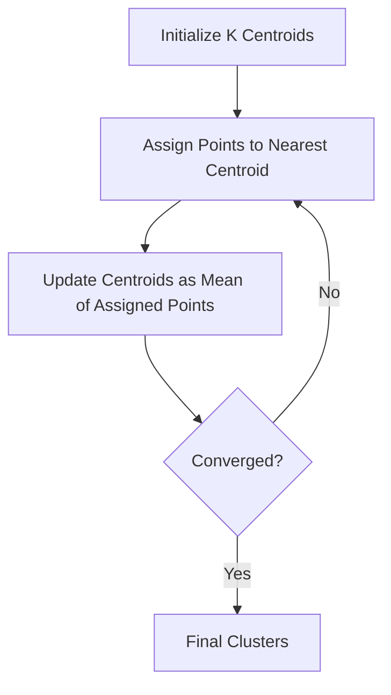

# 🔍 K-Means Clustering

<div align="center">


*A Classic and Powerful Unsupervised Learning Algorithm*

</div>

---

## 📚 Table of Contents

- [What is K-Means Clustering?](#what-is-k-means-clustering)
- [Mathematical Foundation](#mathematical-foundation)
- [How It Works](#how-it-works)
- [Choosing Optimal K](#choosing-optimal-k)
- [Variations of K-Means](#variations-of-k-means)
- [Implementation Guide](#implementation-guide)
- [Model Evaluation](#model-evaluation)
- [Pros and Cons](#pros-and-cons)
- [Real-World Examples](#real-world-examples)
- [Advanced Topics](#advanced-topics)
- [FAQ](#faq)

---

## 🎯 What is K-Means Clustering?

**K-Means Clustering** is an unsupervised machine learning algorithm that partitions data into K distinct, non-overlapping clusters by minimizing the sum of squared distances from data points to the centroids of their assigned clusters.

### Key Characteristics:
- **Unsupervised Learning**: Works without labeled data
- **Partitioning**: Assigns each data point to exactly one cluster
- **Centroid-Based**: Defines clusters by their center points
- **Iterative Algorithm**: Refines cluster assignments and centroids until convergence
- **Distance-Based**: Uses distance metrics (usually Euclidean) to determine similarity
- **Hard Clustering**: Each data point belongs to exactly one cluster

### The Goal:
Organize similar data points into groups while ensuring the points within each group are as similar as possible and the groups are as different as possible from each other.

---

## 🧮 Mathematical Foundation

### Objective Function

K-Means aims to minimize the Within-Cluster Sum of Squares (WCSS), also known as inertia:

```
WCSS = Σ Σ ||x_i - μ_k||²
       k i∈C_k
```

Where:
- x_i is data point i
- μ_k is the centroid of cluster C_k
- ||x_i - μ_k|| is the Euclidean distance between x_i and μ_k
- C_k is the set of data points in cluster k

### Cluster Assignment

Each data point is assigned to the cluster with the nearest centroid:

```
C_k = {x_i : ||x_i - μ_k||² ≤ ||x_i - μ_j||² for all j, 1 ≤ j ≤ K}
```

### Centroid Update

Centroids are updated to be the mean of all data points in the cluster:

```
μ_k = (1/|C_k|) * Σ x_i
                  i∈C_k
```

Where |C_k| is the number of data points in cluster k.

### Convergence

The algorithm converges when cluster assignments no longer change or when the change in WCSS falls below a threshold.

### Distance Metrics

The standard K-Means uses Euclidean distance:

```
d(x, y) = √(Σ (x_i - y_i)²)
```

But other distance metrics can be used in variants of the algorithm:
- **Manhattan Distance**: d(x, y) = Σ |x_i - y_i|
- **Cosine Similarity**: d(x, y) = 1 - (x·y)/(||x||·||y||)
- **Mahalanobis Distance**: d(x, y) = √((x-y)ᵀ Σ⁻¹ (x-y)) where Σ is the covariance matrix

---

## ⚙️ How It Works

### Step-by-Step Process:

<div align="center">



</div>

### 1. **Initialization**
```python
def initialize_centroids(X, K):
    """Initialize K centroids randomly from the data points."""
    # Randomly select K data points as initial centroids
    indices = np.random.choice(X.shape[0], K, replace=False)
    centroids = X[indices]
    return centroids
```

### 2. **Cluster Assignment**
```python
def assign_clusters(X, centroids):
    """Assign each data point to the nearest centroid."""
    # Calculate distance from each point to each centroid
    distances = np.sqrt(((X[:, np.newaxis, :] - centroids[np.newaxis, :, :]) ** 2).sum(axis=2))
    # Assign each point to the cluster with minimum distance
    clusters = np.argmin(distances, axis=1)
    return clusters
```

### 3. **Centroid Update**
```python
def update_centroids(X, clusters, K):
    """Update centroids as the mean of assigned points."""
    centroids = np.zeros((K, X.shape[1]))
    for k in range(K):
        if np.sum(clusters == k) > 0:  # Avoid empty clusters
            centroids[k] = np.mean(X[clusters == k], axis=0)
    return centroids
```

### 4. **Convergence Check**
```python
def has_converged(old_centroids, new_centroids, tol=1e-4):
    """Check if the algorithm has converged."""
    # Calculate distance between old and new centroids
    distance = np.sqrt(((new_centroids - old_centroids) ** 2).sum())
    return distance < tol
```

### 5. **Complete K-Means Algorithm**
```python
def kmeans(X, K, max_iters=100):
    """K-Means clustering algorithm."""
    # Initialize centroids
    centroids = initialize_centroids(X, K)
    
    for i in range(max_iters):
        # Assign clusters
        clusters = assign_clusters(X, centroids)
        
        # Store old centroids for convergence check
        old_centroids = centroids.copy()
        
        # Update centroids
        centroids = update_centroids(X, clusters, K)
        
        # Check for convergence
        if has_converged(old_centroids, centroids):
            break
    
    # Calculate final inertia (WCSS)
    distances = np.sqrt(((X - centroids[clusters]) ** 2).sum(axis=1))
    inertia = np.sum(distances ** 2)
    
    return clusters, centroids, inertia
```

---

## 🔢 Choosing Optimal K

Determining the optimal number of clusters is a critical step in K-Means clustering. Several methods can help:

### 1. **Elbow Method**

Plot the WCSS (Within-Cluster Sum of Squares) against different values of K. The "elbow" in the curve indicates a good value for K.

```python
def elbow_method(X, max_k=10):
    """Implement the elbow method to find the optimal K."""
    inertias = []
    
    for k in range(1, max_k + 1):
        # Run k-means with k clusters
        _, _, inertia = kmeans(X, k)
        inertias.append(inertia)
    
    # Plot the elbow curve
    plt.figure(figsize=(10, 6))
    plt.plot(range(1, max_k + 1), inertias, 'bo-')
    plt.xlabel('Number of Clusters (K)')
    plt.ylabel('Inertia (WCSS)')
    plt.title('Elbow Method For Optimal K')
    plt.grid(True)
    plt.show()
    
    return inertias
```

### 2. **Silhouette Score**

The silhouette score measures how similar an object is to its own cluster compared to other clusters. Values range from -1 to 1:
- +1: Data points are far from neighboring clusters
- 0: Data points are on or close to decision boundary
- -1: Data points might be assigned to the wrong cluster

```python
from sklearn.metrics import silhouette_score

def silhouette_analysis(X, max_k=10):
    """Implement silhouette analysis to find the optimal K."""
    silhouette_scores = []
    
    for k in range(2, max_k + 1):  # Silhouette score requires at least 2 clusters
        # Run k-means
        clusters, _, _ = kmeans(X, k)
        
        # Calculate silhouette score
        score = silhouette_score(X, clusters)
        silhouette_scores.append(score)
    
    # Plot silhouette scores
    plt.figure(figsize=(10, 6))
    plt.plot(range(2, max_k + 1), silhouette_scores, 'bo-')
    plt.xlabel('Number of Clusters (K)')
    plt.ylabel('Silhouette Score')
    plt.title('Silhouette Analysis For Optimal K')
    plt.grid(True)
    plt.show()
    
    # Return the K with highest silhouette score
    optimal_k = silhouette_scores.index(max(silhouette_scores)) + 2
    return optimal_k, silhouette_scores
```

### 3. **Gap Statistic**

The gap statistic compares the within-cluster dispersion to its expected value under a reference null distribution.

```python
def gap_statistic(X, max_k=10, n_refs=5):
    """Implement the gap statistic method for finding optimal K."""
    # Function to generate reference datasets
    def generate_reference(X):
        ref = np.zeros_like(X)
        for i in range(X.shape[1]):
            x_min, x_max = X[:, i].min(), X[:, i].max()
            ref[:, i] = np.random.uniform(x_min, x_max, X.shape[0])
        return ref
    
    gaps = []
    std_gaps = []
    
    # For each K
    for k in range(1, max_k + 1):
        # Within-cluster dispersion for the actual data
        _, _, inertia = kmeans(X, k)
        log_inertia = np.log(inertia)
        
        # Within-cluster dispersion for reference datasets
        ref_inertias = []
        for i in range(n_refs):
            ref_data = generate_reference(X)
            _, _, ref_inertia = kmeans(ref_data, k)
            ref_inertias.append(np.log(ref_inertia))
        
        # Calculate gap statistic
        gap = np.mean(ref_inertias) - log_inertia
        std_gap = np.std(ref_inertias) * np.sqrt(1 + 1/n_refs)
        
        gaps.append(gap)
        std_gaps.append(std_gap)
    
    # Plot gap statistic
    plt.figure(figsize=(10, 6))
    plt.errorbar(range(1, max_k + 1), gaps, yerr=std_gaps, fmt='bo-')
    plt.xlabel('Number of Clusters (K)')
    plt.ylabel('Gap Statistic')
    plt.title('Gap Statistic Method For Optimal K')
    plt.grid(True)
    plt.show()
    
    # Find the first K where gap[k] >= gap[k+1] - std_gap[k+1]
    for k in range(len(gaps) - 1):
        if gaps[k] >= gaps[k + 1] - std_gaps[k + 1]:
            return k + 1
    
    return max_k  # If no optimal K found, return max_k
```

### 4. **Davis-Bouldin Index**

The Davis-Bouldin index measures the average similarity between each cluster and its most similar one.

```python
from sklearn.metrics import davies_bouldin_score

def davies_bouldin_analysis(X, max_k=10):
    """Implement Davies-Bouldin index analysis to find the optimal K."""
    db_scores = []
    
    for k in range(2, max_k + 1):
        # Run k-means
        clusters, _, _ = kmeans(X, k)
        
        # Calculate Davies-Bouldin index
        score = davies_bouldin_score(X, clusters)
        db_scores.append(score)
    
    # Plot Davies-Bouldin scores
    plt.figure(figsize=(10, 6))
    plt.plot(range(2, max_k + 1), db_scores, 'bo-')
    plt.xlabel('Number of Clusters (K)')
    plt.ylabel('Davies-Bouldin Index')
    plt.title('Davies-Bouldin Analysis For Optimal K')
    plt.grid(True)
    plt.show()
    
    # Return the K with lowest Davies-Bouldin index
    optimal_k = db_scores.index(min(db_scores)) + 2
    return optimal_k, db_scores
```

### 5. **Calinski-Harabasz Index**

The Calinski-Harabasz index (Variance Ratio Criterion) is defined as the ratio of between-cluster dispersion to within-cluster dispersion.

```python
from sklearn.metrics import calinski_harabasz_score

def calinski_harabasz_analysis(X, max_k=10):
    """Implement Calinski-Harabasz index analysis to find the optimal K."""
    ch_scores = []
    
    for k in range(2, max_k + 1):
        # Run k-means
        clusters, _, _ = kmeans(X, k)
        
        # Calculate Calinski-Harabasz index
        score = calinski_harabasz_score(X, clusters)
        ch_scores.append(score)
    
    # Plot Calinski-Harabasz scores
    plt.figure(figsize=(10, 6))
    plt.plot(range(2, max_k + 1), ch_scores, 'bo-')
    plt.xlabel('Number of Clusters (K)')
    plt.ylabel('Calinski-Harabasz Index')
    plt.title('Calinski-Harabasz Analysis For Optimal K')
    plt.grid(True)
    plt.show()
    
    # Return the K with highest Calinski-Harabasz index
    optimal_k = ch_scores.index(max(ch_scores)) + 2
    return optimal_k, ch_scores
```

### Combined Approach

Using multiple methods together often provides more confidence in selecting the optimal K.

```python
def find_optimal_k(X, max_k=10):
    """Use multiple methods to find the optimal K."""
    # Run all methods
    elbow_inertias = elbow_method(X, max_k)
    silhouette_k, _ = silhouette_analysis(X, max_k)
    gap_k = gap_statistic(X, max_k)
    db_k, _ = davies_bouldin_analysis(X, max_k)
    ch_k, _ = calinski_harabasz_analysis(X, max_k)
    
    print(f"Silhouette Method suggests K = {silhouette_k}")
    print(f"Gap Statistic suggests K = {gap_k}")
    print(f"Davies-Bouldin Index suggests K = {db_k}")
    print(f"Calinski-Harabasz Index suggests K = {ch_k}")
    
    # Determine elbow point (this is subjective)
    # Here we use a simple heuristic: the point where the rate of inertia reduction slows down
    diffs = np.diff(elbow_inertias)
    elbow_k = np.argmax(-diffs) + 1  # +1 because diff reduces array length by 1
    print(f"Elbow Method suggests K around {elbow_k}")
    
    # You could take a vote among methods or use domain knowledge for final decision
    k_values = [silhouette_k, gap_k, db_k, ch_k, elbow_k]
    suggested_k = max(set(k_values), key=k_values.count)  # Most common value
    
    return suggested_k
```

---

## 🔄 Variations of K-Means

### 1. **K-Means++**

Improves the initialization step to select centroids that are far apart from each other.

```python
def initialize_kmeansplusplus(X, K):
    """Initialize K centroids using K-Means++ algorithm."""
    # Choose the first centroid randomly
    centroids = [X[np.random.choice(X.shape[0])]]
    
    # Choose the remaining K-1 centroids
    for _ in range(1, K):
        # Calculate distances from points to the nearest existing centroid
        distances = np.array([min([np.sum((x - c) ** 2) for c in centroids]) for x in X])
        
        # Choose next centroid with probability proportional to distance squared
        probabilities = distances / distances.sum()
        cumulative_probs = np.cumsum(probabilities)
        r = np.random.rand()
        
        for j, p in enumerate(cumulative_probs):
            if r < p:
                centroids.append(X[j])
                break
    
    return np.array(centroids)
```

### 2. **Mini-Batch K-Means**

Processes smaller batches of data at a time, making it suitable for large datasets.

```python
def minibatch_kmeans(X, K, batch_size=100, max_iters=100):
    """Mini-Batch K-Means clustering algorithm."""
    n_samples = X.shape[0]
    
    # Initialize centroids using K-Means++
    centroids = initialize_kmeansplusplus(X, K)
    
    # Keep track of per-centroid counts for proper averaging
    counts = np.zeros(K)
    
    for i in range(max_iters):
        # Sample a mini-batch
        indices = np.random.choice(n_samples, batch_size, replace=False)
        X_batch = X[indices]
        
        # Assign clusters to mini-batch
        distances = np.sqrt(((X_batch[:, np.newaxis, :] - centroids[np.newaxis, :, :]) ** 2).sum(axis=2))
        clusters = np.argmin(distances, axis=1)
        
        # Update centroids based on mini-batch assignments
        for j in range(batch_size):
            c = clusters[j]
            counts[c] += 1
            eta = 1.0 / counts[c]  # Learning rate
            centroids[c] = (1 - eta) * centroids[c] + eta * X_batch[j]
    
    # Final cluster assignment for all data
    clusters = assign_clusters(X, centroids)
    
    # Calculate inertia
    distances = np.sqrt(((X - centroids[clusters]) ** 2).sum(axis=1))
    inertia = np.sum(distances ** 2)
    
    return clusters, centroids, inertia
```

### 3. **K-Medoids (PAM - Partitioning Around Medoids)**

Uses actual data points (medoids) as cluster centers instead of mean values.

```python
def kmedoids(X, K, max_iters=100):
    """K-Medoids clustering algorithm."""
    n_samples = X.shape[0]
    
    # Initialize K medoids randomly
    medoid_indices = np.random.choice(n_samples, K, replace=False)
    medoids = X[medoid_indices]
    
    for _ in range(max_iters):
        # Assign points to nearest medoid
        distances = np.sqrt(((X[:, np.newaxis, :] - medoids[np.newaxis, :, :]) ** 2).sum(axis=2))
        clusters = np.argmin(distances, axis=1)
        
        # Store old medoids for convergence check
        old_medoids = medoids.copy()
        
        # Update medoids
        for k in range(K):
            if np.sum(clusters == k) > 0:
                # Find the point in cluster k that minimizes total distance to other points
                cluster_points = X[clusters == k]
                cluster_distances = np.sum(np.sqrt(((cluster_points[:, np.newaxis, :] - 
                                                   cluster_points[np.newaxis, :, :]) ** 2).sum(axis=2)), axis=1)
                medoid_idx = np.argmin(cluster_distances)
                medoids[k] = cluster_points[medoid_idx]
        
        # Check for convergence
        if np.allclose(old_medoids, medoids):
            break
    
    # Calculate total cost (sum of distances to medoids)
    total_cost = np.sum(np.sqrt(((X - medoids[clusters]) ** 2).sum(axis=1)))
    
    return clusters, medoids, total_cost
```

### 4. **Fuzzy C-Means**

Soft clustering where each data point has a degree of membership to each cluster.

```python
def fuzzy_cmeans(X, K, m=2, max_iters=100, tol=1e-4):
    """Fuzzy C-Means clustering algorithm."""
    n_samples, n_features = X.shape
    
    # Initialize membership matrix with random values
    U = np.random.rand(n_samples, K)
    # Normalize membership matrix
    U = U / np.sum(U, axis=1, keepdims=True)
    
    for _ in range(max_iters):
        # Store old membership matrix for convergence check
        U_old = U.copy()
        
        # Calculate centroids
        um = U ** m  # Membership matrix raised to fuzzifier m
        centroids = np.zeros((K, n_features))
        for k in range(K):
            centroids[k] = np.sum(um[:, k, np.newaxis] * X, axis=0) / np.sum(um[:, k])
        
        # Update membership matrix
        for i in range(n_samples):
            distances = np.sqrt(((X[i] - centroids) ** 2).sum(axis=1))
            # Handle potential division by zero
            distances = np.maximum(distances, np.finfo(float).eps)
            
            for k in range(K):
                U[i, k] = 1.0 / np.sum((distances[k] / distances) ** (2 / (m - 1)))
        
        # Check for convergence
        if np.linalg.norm(U - U_old) < tol:
            break
    
    # Get hard clusters (for convenience)
    clusters = np.argmax(U, axis=1)
    
    # Calculate fuzzy inertia
    inertia = 0
    for i in range(n_samples):
        for k in range(K):
            inertia += (U[i, k] ** m) * np.sum((X[i] - centroids[k]) ** 2)
    
    return clusters, centroids, U, inertia
```

### 5. **Spherical K-Means**

Uses cosine similarity instead of Euclidean distance, making it suitable for text and directional data.

```python
def spherical_kmeans(X, K, max_iters=100):
    """Spherical K-Means clustering algorithm."""
    # Normalize all vectors to unit length
    X_normalized = X / np.linalg.norm(X, axis=1, keepdims=True)
    
    # Initialize K centroids randomly
    centroid_indices = np.random.choice(X.shape[0], K, replace=False)
    centroids = X_normalized[centroid_indices]
    # Normalize centroids to unit length
    centroids = centroids / np.linalg.norm(centroids, axis=1, keepdims=True)
    
    for _ in range(max_iters):
        # Calculate cosine similarity (dot product of normalized vectors)
        similarities = np.dot(X_normalized, centroids.T)
        
        # Assign clusters based on maximum similarity
        clusters = np.argmax(similarities, axis=1)
        
        # Store old centroids for convergence check
        old_centroids = centroids.copy()
        
        # Update centroids
        for k in range(K):
            if np.sum(clusters == k) > 0:
                # Take mean direction of all vectors in the cluster
                centroids[k] = np.mean(X_normalized[clusters == k], axis=0)
                # Normalize to unit length
                centroids[k] = centroids[k] / np.linalg.norm(centroids[k])
        
        # Check for convergence
        if np.allclose(old_centroids, centroids):
            break
    
    # Calculate spherical inertia (1 - mean cosine similarity)
    mean_similarity = np.mean([similarities[i, clusters[i]] for i in range(X.shape[0])])
    inertia = 1 - mean_similarity
    
    return clusters, centroids, inertia
```

### 6. **K-Means with Automatic K Selection**

Automatically selects the best K using a penalty term for complexity.

```python
def kmeans_auto_k(X, max_k=10, criterion='bic'):
    """K-Means with automatic K selection using information criteria."""
    n_samples, n_features = X.shape
    best_score = float('inf')
    best_k = 1
    best_clusters = None
    best_centroids = None
    
    for k in range(1, max_k + 1):
        # Run k-means
        clusters, centroids, inertia = kmeans(X, k)
        
        # Calculate BIC or AIC
        if criterion == 'bic':
            # BIC = n*ln(inertia/n) + k*ln(n)
            score = n_samples * np.log(inertia / n_samples) + k * np.log(n_samples)
        else:  # AIC
            # AIC = n*ln(inertia/n) + 2*k
            score = n_samples * np.log(inertia / n_samples) + 2 * k
        
        if score < best_score:
            best_score = score
            best_k = k
            best_clusters = clusters
            best_centroids = centroids
    
    return best_k, best_clusters, best_centroids, best_score
```

---

## 💻 Implementation Guide

### From Scratch Implementation

```python
import numpy as np
import matplotlib.pyplot as plt

class KMeans:
    def __init__(self, n_clusters=8, max_iter=300, tol=1e-4, random_state=None):
        """
        K-Means clustering algorithm.
        
        Parameters:
        -----------
        n_clusters : int, default=8
            The number of clusters to form.
        
        max_iter : int, default=300
            Maximum number of iterations for a single run.
            
        tol : float, default=1e-4
            Tolerance for convergence.
            
        random_state : int or None, default=None
            Seed for random number generator.
        """
        self.n_clusters = n_clusters
        self.max_iter = max_iter
        self.tol = tol
        self.random_state = random_state
        
        self.centroids_ = None
        self.labels_ = None
        self.inertia_ = None
        self.n_iter_ = None
    
    def _initialize_centroids(self, X):
        """Initialize centroids using K-Means++ algorithm."""
        np.random.seed(self.random_state)
        n_samples, n_features = X.shape
        
        # Choose the first centroid randomly
        centroids = [X[np.random.choice(n_samples)]]
        
        # Choose the remaining K-1 centroids
        for _ in range(1, self.n_clusters):
            # Calculate distances from points to the nearest existing centroid
            distances = np.array([min([np.sum((x - c) ** 2) for c in centroids]) for x in X])
            
            # Choose next centroid with probability proportional to distance squared
            probabilities = distances / distances.sum()
            cumulative_probs = np.cumsum(probabilities)
            r = np.random.rand()
            
            for j, p in enumerate(cumulative_probs):
                if r < p:
                    centroids.append(X[j])
                    break
        
        return np.array(centroids)
    
    def fit(self, X):
        """
        Compute K-Means clustering.
        
        Parameters:
        -----------
        X : array-like of shape (n_samples, n_features)
            Training instances.
            
        Returns:
        --------
        self : object
            Fitted estimator.
        """
        X = np.array(X)
        
        # Initialize centroids
        self.centroids_ = self._initialize_centroids(X)
        
        # Main K-Means loop
        for iteration in range(self.max_iter):
            # Assign clusters
            distances = np.sqrt(((X[:, np.newaxis, :] - self.centroids_[np.newaxis, :, :]) ** 2).sum(axis=2))
            self.labels_ = np.argmin(distances, axis=1)
            
            # Store old centroids for convergence check
            old_centroids = self.centroids_.copy()
            
            # Update centroids
            for k in range(self.n_clusters):
                if np.sum(self.labels_ == k) > 0:
                    self.centroids_[k] = np.mean(X[self.labels_ == k], axis=0)
            
            # Check for convergence
            if np.sum((self.centroids_ - old_centroids) ** 2) < self.tol:
                break
        
        self.n_iter_ = iteration + 1
        
        # Calculate inertia
        distances = np.sqrt(((X - self.centroids_[self.labels_]) ** 2).sum(axis=1))
        self.inertia_ = np.sum(distances ** 2)
        
        return self
    
    def predict(self, X):
        """
        Predict the closest cluster for each sample in X.
        
        Parameters:
        -----------
        X : array-like of shape (n_samples, n_features)
            New data to predict.
            
        Returns:
        --------
        labels : array of shape (n_samples,)
            Index of the cluster each sample belongs to.
        """
        X = np.array(X)
        distances = np.sqrt(((X[:, np.newaxis, :] - self.centroids_[np.newaxis, :, :]) ** 2).sum(axis=2))
        return np.argmin(distances, axis=1)
    
    def fit_predict(self, X):
        """
        Compute cluster centers and predict cluster index for each sample.
        
        Parameters:
        -----------
        X : array-like of shape (n_samples, n_features)
            New data to transform.
            
        Returns:
        --------
        labels : array of shape (n_samples,)
            Index of the cluster each sample belongs to.
        """
        return self.fit(X).labels_
    
    def transform(self, X):
        """
        Transform X to a cluster-distance space.
        
        Parameters:
        -----------
        X : array-like of shape (n_samples, n_features)
            New data to transform.
            
        Returns:
        --------
        X_new : array of shape (n_samples, n_clusters)
            X transformed in the new space.
        """
        X = np.array(X)
        return np.sqrt(((X[:, np.newaxis, :] - self.centroids_[np.newaxis, :, :]) ** 2).sum(axis=2))
    
    def fit_transform(self, X):
        """
        Compute clustering and transform X to cluster-distance space.
        
        Parameters:
        -----------
        X : array-like of shape (n_samples, n_features)
            New data to transform.
            
        Returns:
        --------
        X_new : array of shape (n_samples, n_clusters)
            X transformed in the new space.
        """
        return self.fit(X).transform(X)
```

### Using scikit-learn

```python
from sklearn.cluster import KMeans
from sklearn.metrics import silhouette_score
from sklearn.preprocessing import StandardScaler
import matplotlib.pyplot as plt
import numpy as np

# Generate or load your data
# For example, generate synthetic data with 3 clusters
from sklearn.datasets import make_blobs
X, y_true = make_blobs(n_samples=300, centers=3, cluster_std=0.5, random_state=42)

# Scale the data (important for K-Means)
scaler = StandardScaler()
X_scaled = scaler.fit_transform(X)

# Find optimal K using silhouette score
silhouette_scores = []
K_range = range(2, 10)

for k in K_range:
    kmeans = KMeans(n_clusters=k, random_state=42)
    kmeans.fit(X_scaled)
    score = silhouette_score(X_scaled, kmeans.labels_)
    silhouette_scores.append(score)
    print(f"K={k}: Silhouette Score = {score:.3f}")

# Plot silhouette scores
plt.figure(figsize=(10, 6))
plt.plot(K_range, silhouette_scores, 'bo-')
plt.xlabel('Number of Clusters (K)')
plt.ylabel('Silhouette Score')
plt.title('Silhouette Analysis For Optimal K')
plt.grid(True)
plt.show()

# Get the optimal K
optimal_k = K_range[np.argmax(silhouette_scores)]
print(f"Optimal K = {optimal_k}")

# Train the final model with optimal K
kmeans = KMeans(n_clusters=optimal_k, init='k-means++', n_init=10, max_iter=300, random_state=42)
kmeans.fit(X_scaled)

# Get cluster assignments and centroids
labels = kmeans.labels_
centroids = scaler.inverse_transform(kmeans.cluster_centers_)

# Visualize the clusters (for 2D data)
plt.figure(figsize=(10, 8))
plt.scatter(X[:, 0], X[:, 1], c=labels, cmap='viridis', alpha=0.7)
plt.scatter(centroids[:, 0], centroids[:, 1], marker='X', s=200, color='red', label='Centroids')
plt.title(f'K-Means Clustering with {optimal_k} Clusters')
plt.legend()
plt.grid(True)
plt.show()

# Print cluster statistics
for i in range(optimal_k):
    cluster_points = X[labels == i]
    print(f"Cluster {i}:")
    print(f"  Number of points: {len(cluster_points)}")
    print(f"  Centroid: {centroids[i]}")
    print(f"  Cluster variance: {np.var(cluster_points, axis=0).mean():.3f}")
    print()

# Calculate overall performance metrics
print(f"Inertia (Within-cluster sum of squares): {kmeans.inertia_:.3f}")
print(f"Silhouette Score: {silhouette_score(X_scaled, labels):.3f}")
```

### Complete Example with Visualization

```python
import numpy as np
import pandas as pd
import matplotlib.pyplot as plt
from matplotlib.colors import ListedColormap
import seaborn as sns
from sklearn.cluster import KMeans
from sklearn.metrics import silhouette_score, silhouette_samples, davies_bouldin_score
from sklearn.preprocessing import StandardScaler
from sklearn.decomposition import PCA
from sklearn.datasets import make_blobs, make_moons, make_circles
import plotly.express as px
import plotly.graph_objects as go

# Set random seed for reproducibility
np.random.seed(42)

# Generate datasets with different structures
n_samples = 1000

# Dataset 1: Blobs (isotropic Gaussian blobs)
X_blobs, y_blobs = make_blobs(n_samples=n_samples, centers=4, random_state=42)

# Dataset 2: Moons
X_moons, y_moons = make_moons(n_samples=n_samples, noise=0.1, random_state=42)

# Dataset 3: Circles
X_circles, y_circles = make_circles(n_samples=n_samples, noise=0.05, factor=0.5, random_state=42)

# Dataset 4: Anisotropic blobs (elongated clusters)
transformation = [[0.6, -0.6], [-0.4, 0.8]]
X_aniso = np.dot(X_blobs, transformation)

# Combine into list for easier processing
datasets = [
    ("Blobs", X_blobs),
    ("Moons", X_moons),
    ("Circles", X_circles),
    ("Anisotropic Blobs", X_aniso)
]

# Visualize all datasets
fig, axes = plt.subplots(2, 2, figsize=(15, 12))
axes = axes.flatten()

for i, (name, X) in enumerate(datasets):
    axes[i].scatter(X[:, 0], X[:, 1], alpha=0.6)
    axes[i].set_title(f"Dataset: {name}")
    axes[i].grid(True)

plt.tight_layout()
plt.show()

# Function to perform K-Means and evaluate on datasets
def evaluate_kmeans(X, k_range=range(2, 11)):
    """Run K-Means for various K values and evaluate using multiple metrics."""
    results = []
    
    # Scale the data
    scaler = StandardScaler()
    X_scaled = scaler.fit_transform(X)
    
    # Try different K values
    for k in k_range:
        kmeans = KMeans(n_clusters=k, init='k-means++', n_init=10, random_state=42)
        labels = kmeans.fit_predict(X_scaled)
        
        # Calculate evaluation metrics
        inertia = kmeans.inertia_
        silhouette = silhouette_score(X_scaled, labels) if k > 1 else 0
        db_score = davies_bouldin_score(X_scaled, labels) if k > 1 else float('inf')
        
        results.append({
            'k': k,
            'inertia': inertia,
            'silhouette': silhouette,
            'davies_bouldin': db_score,
            'labels': labels,
            'model': kmeans,
            'centers_scaled': kmeans.cluster_centers_,
            'centers': scaler.inverse_transform(kmeans.cluster_centers_)
        })
    
    return results, X_scaled

# Evaluate K-Means on each dataset
evaluation_results = {}
scaled_datasets = {}

for name, X in datasets:
    results, X_scaled = evaluate_kmeans(X)
    evaluation_results[name] = results
    scaled_datasets[name] = X_scaled

# Create evaluation plots for each dataset
for name in evaluation_results:
    results = evaluation_results[name]
    k_values = [r['k'] for r in results]
    inertias = [r['inertia'] for r in results]
    silhouettes = [r['silhouette'] for r in results[1:]]  # Skip k=1
    db_scores = [r['davies_bouldin'] for r in results[1:]]  # Skip k=1
    
    # Create figure with subplots
    fig, axes = plt.subplots(1, 3, figsize=(18, 5))
    
    # Elbow method
    axes[0].plot(k_values, inertias, 'bo-')
    axes[0].set_xlabel('Number of Clusters (K)')
    axes[0].set_ylabel('Inertia')
    axes[0].set_title(f'Elbow Method - {name}')
    axes[0].grid(True)
    
    # Silhouette score
    axes[1].plot(k_values[1:], silhouettes, 'go-')
    axes[1].set_xlabel('Number of Clusters (K)')
    axes[1].set_ylabel('Silhouette Score')
    axes[1].set_title(f'Silhouette Analysis - {name}')
    axes[1].grid(True)
    
    # Davies-Bouldin index
    axes[2].plot(k_values[1:], db_scores, 'ro-')
    axes[2].set_xlabel('Number of Clusters (K)')
    axes[2].set_ylabel('Davies-Bouldin Index')
    axes[2].set_title(f'Davies-Bouldin Analysis - {name}')
    axes[2].grid(True)
    
    plt.tight_layout()
    plt.show()
    
    # Determine optimal K for this dataset
    # Use silhouette score which is a good general metric
    best_k_idx = np.argmax([r['silhouette'] for r in results[1:]]) + 1  # +1 because we skipped k=1
    best_k = k_values[best_k_idx]
    best_result = results[best_k_idx]
    
    print(f"\nDataset: {name}")
    print(f"Optimal K: {best_k}")
    print(f"Silhouette Score: {best_result['silhouette']:.4f}")
    print(f"Inertia: {best_result['inertia']:.4f}")
    print(f"Davies-Bouldin Index: {best_result['davies_bouldin']:.4f}")
    
    # Visualize clustering results for best K
    X = scaled_datasets[name]
    labels = best_result['labels']
    centers = best_result['centers_scaled']
    
    plt.figure(figsize=(10, 8))
    
    # Create color map with as many colors as clusters
    cmap = plt.cm.get_cmap('viridis', best_k)
    
    # Plot data points
    plt.scatter(X[:, 0], X[:, 1], c=labels, cmap=cmap, alpha=0.6)
    
    # Plot cluster centers
    plt.scatter(centers[:, 0], centers[:, 1], marker='X', s=200, 
               color='red', label='Centroids')
    
    plt.title(f'K-Means Clustering of {name} Dataset (K={best_k})')
    plt.legend()
    plt.grid(True)
    plt.show()
    
    # Create silhouette plot
    plt.figure(figsize=(12, 8))
    
    # Compute silhouette scores for each sample
    sample_silhouette_values = silhouette_samples(X, labels)
    
    y_lower = 10
    for i in range(best_k):
        # Aggregate silhouette scores for samples in cluster i
        ith_cluster_values = sample_silhouette_values[labels == i]
        ith_cluster_values.sort()
        
        size_cluster_i = ith_cluster_values.shape[0]
        y_upper = y_lower + size_cluster_i
        
        color = plt.cm.viridis(float(i) / best_k)
        plt.fill_betweenx(np.arange(y_lower, y_upper), 0, ith_cluster_values,
                         facecolor=color, edgecolor=color, alpha=0.7)
        
        # Label the silhouette plots with cluster numbers
        plt.text(-0.05, y_lower + 0.5 * size_cluster_i, str(i))
        
        # Compute the new y_lower for next plot
        y_lower = y_upper + 10
    
    # The vertical line for average silhouette score of all samples
    plt.axvline(x=best_result['silhouette'], color="red", linestyle="--")
    plt.title(f"Silhouette Plot for {name} Dataset (K={best_k})")
    plt.xlabel("Silhouette Coefficient Values")
    plt.ylabel("Cluster Labels")
    plt.yticks([])  # Clear the yaxis labels / ticks
    plt.xticks([-0.1, 0, 0.2, 0.4, 0.6, 0.8, 1])
    plt.grid(True)
    plt.show()

# Create 3D visualization for one dataset (Anisotropic Blobs)
X = datasets[3][1]  # Anisotropic Blobs
scaler = StandardScaler()
X_scaled = scaler.fit_transform(X)

# Apply PCA to add a third dimension if needed
pca = PCA(n_components=3)
X_pca = pca.fit_transform(X_scaled)

# Train K-Means
best_k = 4  # Use the previously determined best K
kmeans = KMeans(n_clusters=best_k, init='k-means++', n_init=10, random_state=42)
labels = kmeans.fit_predict(X_scaled)
centers = kmeans.cluster_centers_

# Project centers into PCA space
centers_pca = pca.transform(centers)

# Create 3D plotly figure
fig = px.scatter_3d(
    x=X_pca[:, 0], y=X_pca[:, 1], z=X_pca[:, 2],
    color=[f'Cluster {i}' for i in labels],
    title=f'3D Visualization of Clusters - Anisotropic Blobs (K={best_k})',
    labels={'x': 'PC1', 'y': 'PC2', 'z': 'PC3'},
    opacity=0.7
)

# Add cluster centers
fig.add_trace(
    go.Scatter3d(
        x=centers_pca[:, 0], y=centers_pca[:, 1], z=centers_pca[:, 2],
        mode='markers',
        marker=dict(
            size=10,
            color='black',
            symbol='x'
        ),
        name='Centroids'
    )
)

fig.update_layout(
    legend_title_text='Clusters',
    scene=dict(
        xaxis=dict(backgroundcolor="rgb(230, 230, 230)"),
        yaxis=dict(backgroundcolor="rgb(230, 230, 230)"),
        zaxis=dict(backgroundcolor="rgb(230, 230, 230)")
    ),
    width=900,
    height=700
)

fig.show()

# Create an interactive dashboard with plotly for exploring all datasets
# For brevity, creating just one interactive plot for the Blobs dataset
X = datasets[0][1]  # Blobs dataset
scaler = StandardScaler()
X_scaled = scaler.fit_transform(X)

# Create interactive plot
fig = go.Figure()

# Add the data points
for k in range(2, 7):
    kmeans = KMeans(n_clusters=k, init='k-means++', n_init=10, random_state=42)
    labels = kmeans.fit_predict(X_scaled)
    centers = scaler.inverse_transform(kmeans.cluster_centers_)
    
    # Add scatter trace for this K value
    fig.add_trace(
        go.Scatter(
            x=X[:, 0], y=X[:, 1],
            mode='markers',
            marker=dict(
                size=8,
                color=labels,
                colorscale='Viridis',
                showscale=False
            ),
            text=[f'Cluster {l}' for l in labels],
            name=f'K={k}',
            visible=(True if k == 4 else 'legendonly')  # Only show K=4 by default
        )
    )
    
    # Add centroids
    fig.add_trace(
        go.Scatter(
            x=centers[:, 0], y=centers[:, 1],
            mode='markers',
            marker=dict(
                symbol='x',
                size=15,
                color='red',
                line=dict(width=2)
            ),
            name=f'Centroids (K={k})',
            visible=(True if k == 4 else 'legendonly')
        )
    )

fig.update_layout(
    title='Interactive K-Means Clustering Visualization',
    xaxis=dict(title='Feature 1'),
    yaxis=dict(title='Feature 2'),
    legend_title_text='Clusters',
    height=600,
    width=800
)

fig.show()

# Create a comprehensive clustering report
report = []
for name in evaluation_results:
    results = evaluation_results[name]
    for r in results:
        # Calculate cluster statistics
        unique_labels = np.unique(r['labels'])
        cluster_sizes = [np.sum(r['labels'] == i) for i in unique_labels]
        avg_cluster_size = np.mean(cluster_sizes)
        std_cluster_size = np.std(cluster_sizes)
        
        # Check if clusters are balanced
        balance_ratio = min(cluster_sizes) / max(cluster_sizes) if max(cluster_sizes) > 0 else 0
        
        report.append({
            'Dataset': name,
            'K': r['k'],
            'Inertia': r['inertia'],
            'Silhouette': r['silhouette'],
            'Davies-Bouldin': r['davies_bouldin'],
            'Avg Cluster Size': avg_cluster_size,
            'Std Cluster Size': std_cluster_size,
            'Balance Ratio': balance_ratio
        })

# Convert report to DataFrame and display
report_df = pd.DataFrame(report)
print("\nClustering Performance Summary:")
print(report_df.to_string(index=False))

# Visualize the report metrics
datasets_list = list(set(report_df['Dataset']))
k_values = sorted(list(set(report_df['K'])))

# Create a grid of plots comparing metrics across datasets
fig, axes = plt.subplots(2, 2, figsize=(15, 12))
axes = axes.flatten()

# Plot inertia
for dataset in datasets_list:
    dataset_df = report_df[report_df['Dataset'] == dataset]
    axes[0].plot(dataset_df['K'], dataset_df['Inertia'], 'o-', label=dataset)
axes[0].set_xlabel('Number of Clusters (K)')
axes[0].set_ylabel('Inertia')
axes[0].set_title('Inertia vs K by Dataset')
axes[0].legend()
axes[0].grid(True)

# Plot silhouette score
for dataset in datasets_list:
    dataset_df = report_df[report_df['Dataset'] == dataset]
    axes[1].plot(dataset_df['K'], dataset_df['Silhouette'], 'o-', label=dataset)
axes[1].set_xlabel('Number of Clusters (K)')
axes[1].set_ylabel('Silhouette Score')
axes[1].set_title('Silhouette Score vs K by Dataset')
axes[1].legend()
axes[1].grid(True)

# Plot Davies-Bouldin index
for dataset in datasets_list:
    dataset_df = report_df[report_df['Dataset'] == dataset]
    axes[2].plot(dataset_df['K'], dataset_df['Davies-Bouldin'], 'o-', label=dataset)
axes[2].set_xlabel('Number of Clusters (K)')
axes[2].set_ylabel('Davies-Bouldin Index')
axes[2].set_title('Davies-Bouldin Index vs K by Dataset')
axes[2].legend()
axes[2].grid(True)

# Plot balance ratio
for dataset in datasets_list:
    dataset_df = report_df[report_df['Dataset'] == dataset]
    axes[3].plot(dataset_df['K'], dataset_df['Balance Ratio'], 'o-', label=dataset)
axes[3].set_xlabel('Number of Clusters (K)')
axes[3].set_ylabel('Balance Ratio')
axes[3].set_title('Cluster Balance Ratio vs K by Dataset')
axes[3].legend()
axes[3].grid(True)

plt.tight_layout()
plt.show()

# Final summary of best K for each dataset
print("\nBest K for each dataset based on Silhouette Score:")
for dataset in datasets_list:
    dataset_df = report_df[report_df['Dataset'] == dataset]
    best_row = dataset_df.loc[dataset_df['Silhouette'].idxmax()]
    print(f"{dataset}: K={int(best_row['K'])}, Silhouette={best_row['Silhouette']:.4f}")
```

---

## 📊 Model Evaluation

### Key Metrics for Clustering

#### 1. **Inertia (Within-Cluster Sum of Squares)**
```python
def calculate_inertia(X, labels, centroids):
    """Calculate inertia (within-cluster sum of squares)."""
    inertia = 0
    for i, label in enumerate(np.unique(labels)):
        cluster_points = X[labels == label]
        inertia += np.sum(np.square(np.linalg.norm(cluster_points - centroids[i], axis=1)))
    return inertia
```

#### 2. **Silhouette Score**
```python
def calculate_silhouette(X, labels):
    """Calculate silhouette score."""
    # For each point, calculate a (mean distance to points in same cluster)
    a_scores = []
    for i, point in enumerate(X):
        label = labels[i]
        cluster_points = X[labels == label]
        if len(cluster_points) > 1:  # Skip if point is in a singleton cluster
            a = np.mean([np.linalg.norm(point - other) for other in cluster_points if not np.array_equal(point, other)])
            a_scores.append(a)
        else:
            a_scores.append(0)  # a=0 for singleton clusters
    
    # For each point, calculate b (mean distance to nearest cluster)
    b_scores = []
    for i, point in enumerate(X):
        label = labels[i]
        min_mean_dist = float('inf')
        for other_label in np.unique(labels):
            if other_label != label:
                other_cluster_points = X[labels == other_label]
                mean_dist = np.mean([np.linalg.norm(point - other) for other in other_cluster_points])
                min_mean_dist = min(min_mean_dist, mean_dist)
        b_scores.append(min_mean_dist)
    
    # Calculate silhouette score for each point
    silhouette_scores = []
    for i in range(len(X)):
        if max(a_scores[i], b_scores[i]) > 0:
            silhouette_scores.append((b_scores[i] - a_scores[i]) / max(a_scores[i], b_scores[i]))
        else:
            silhouette_scores.append(0)
    
    # Return mean silhouette score
    return np.mean(silhouette_scores)
```

#### 3. **Davies-Bouldin Index**
```python
def calculate_davies_bouldin(X, labels, centroids):
    """Calculate Davies-Bouldin index."""
    n_clusters = len(np.unique(labels))
    
    # Calculate cluster dispersions (average distance to centroid)
    dispersions = []
    for i in range(n_clusters):
        cluster_points = X[labels == i]
        if len(cluster_points) > 0:
            dispersion = np.mean(np.linalg.norm(cluster_points - centroids[i], axis=1))
            dispersions.append(dispersion)
        else:
            dispersions.append(0)
    
    # Calculate Davies-Bouldin index
    db_index = 0
    for i in range(n_clusters):
        max_ratio = 0
        for j in range(n_clusters):
            if i != j:
                # Calculate centroid distance
                centroid_distance = np.linalg.norm(centroids[i] - centroids[j])
                if centroid_distance > 0:  # Avoid division by zero
                    ratio = (dispersions[i] + dispersions[j]) / centroid_distance
                    max_ratio = max(max_ratio, ratio)
        db_index += max_ratio
    
    return db_index / n_clusters
```

#### 4. **Calinski-Harabasz Index**
```python
def calculate_calinski_harabasz(X, labels, centroids):
    """Calculate Calinski-Harabasz index."""
    n_samples = X.shape[0]
    n_clusters = len(np.unique(labels))
    
    # Return 0 for edge cases
    if n_clusters == 1 or n_clusters == n_samples:
        return 0
    
    # Calculate overall centroid
    overall_centroid = np.mean(X, axis=0)
    
    # Calculate between-cluster dispersion
    between_disp = 0
    for i, centroid in enumerate(centroids):
        n_c = np.sum(labels == i)
        between_disp += n_c * np.sum(np.square(centroid - overall_centroid))
    
    # Calculate within-cluster dispersion
    within_disp = 0
    for i, centroid in enumerate(centroids):
        cluster_points = X[labels == i]
        within_disp += np.sum(np.square(np.linalg.norm(cluster_points - centroid, axis=1)))
    
    # Avoid division by zero
    if within_disp == 0:
        return 0
    
    # Calculate Calinski-Harabasz index
    ch_index = (between_disp / (n_clusters - 1)) / (within_disp / (n_samples - n_clusters))
    
    return ch_index
```

#### 5. **Adjusted Rand Index (if true labels are available)**
```python
def calculate_adjusted_rand_index(true_labels, pred_labels):
    """Calculate the Adjusted Rand Index."""
    from sklearn.metrics import adjusted_rand_score
    return adjusted_rand_score(true_labels, pred_labels)
```

### Visualization Techniques for Clustering

#### 1. **Silhouette Plot**
```python
def plot_silhouette(X, labels, centroids=None):
    """Create a silhouette plot for cluster evaluation."""
    from sklearn.metrics import silhouette_samples
    import matplotlib.pyplot as plt
    
    n_clusters = len(np.unique(labels))
    
    # Calculate silhouette scores
    silhouette_vals = silhouette_samples(X, labels)
    
    plt.figure(figsize=(12, 8))
    y_ticks = []
    y_lower, y_upper = 0, 0
    
    for i in range(n_clusters):
        # Get silhouette scores for points in cluster i
        cluster_silhouette_vals = silhouette_vals[labels == i]
        cluster_silhouette_vals.sort()
        
        y_upper += len(cluster_silhouette_vals)
        plt.barh(range(y_lower, y_upper), cluster_silhouette_vals, height=1.0, edgecolor='none')
        
        y_ticks.append((y_lower + y_upper) / 2)
        y_lower = y_upper
    
    # Get average silhouette score
    avg_silhouette = np.mean(silhouette_vals)
    
    # Plot a vertical line for the average silhouette score
    plt.axvline(avg_silhouette, color='red', linestyle='--', label=f'Avg: {avg_silhouette:.3f}')
    
    plt.yticks(y_ticks, [f'Cluster {i}' for i in range(n_clusters)])
    plt.xlabel('Silhouette Score')
    plt.ylabel('Cluster')
    plt.title('Silhouette Plot')
    plt.legend(loc='best')
    plt.tight_layout()
    plt.show()
```

#### 2. **Cluster Heatmap**
```python
def plot_cluster_heatmap(X, labels, feature_names=None):
    """Create a heatmap of cluster centers for each feature."""
    import matplotlib.pyplot as plt
    import seaborn as sns
    
    n_clusters = len(np.unique(labels))
    n_features = X.shape[1]
    
    # Compute cluster centers
    cluster_centers = np.zeros((n_clusters, n_features))
    for i in range(n_clusters):
        cluster_points = X[labels == i]
        if len(cluster_points) > 0:
            cluster_centers[i] = np.mean(cluster_points, axis=0)
    
    # Create feature names if not provided
    if feature_names is None:
        feature_names = [f'Feature {i}' for i in range(n_features)]
    
    # Create the heatmap
    plt.figure(figsize=(12, 8))
    sns.heatmap(cluster_centers, annot=True, fmt='.2f', 
               xticklabels=feature_names, 
               yticklabels=[f'Cluster {i}' for i in range(n_clusters)])
    plt.title('Cluster Centers Heatmap')
    plt.tight_layout()
    plt.show()
```

#### 3. **Cluster Distribution Plot**
```python
def plot_cluster_distribution(X, labels, feature_indices=(0, 1)):
    """Create scatter plots showing distribution of clusters for selected features."""
    import matplotlib.pyplot as plt
    import seaborn as sns
    
    n_clusters = len(np.unique(labels))
    
    # Plot scatter for selected features
    plt.figure(figsize=(12, 8))
    
    # Create a custom color map
    colors = plt.cm.viridis(np.linspace(0, 1, n_clusters))
    
    for i in range(n_clusters):
        cluster_points = X[labels == i]
        if len(cluster_points) > 0:
            plt.scatter(cluster_points[:, feature_indices[0]], 
                       cluster_points[:, feature_indices[1]], 
                       color=colors[i], label=f'Cluster {i}', alpha=0.7)
    
    # Compute and plot cluster centers
    cluster_centers = np.zeros((n_clusters, X.shape[1]))
    for i in range(n_clusters):
        cluster_points = X[labels == i]
        if len(cluster_points) > 0:
            cluster_centers[i] = np.mean(cluster_points, axis=0)
    
    plt.scatter(cluster_centers[:, feature_indices[0]], 
               cluster_centers[:, feature_indices[1]], 
               marker='X', s=200, color='red', label='Centroids')
    
        plt.xlabel(f'Feature {feature_indices[0]}')
    plt.ylabel(f'Feature {feature_indices[1]}')
    plt.title('Cluster Distribution')
    plt.legend()
    plt.grid(True, alpha=0.3)
    plt.show()
```

#### 4. **PCA Visualization**
```python
def plot_clusters_pca(X, labels, n_components=2):
    """Visualize clusters using Principal Component Analysis (PCA)."""
    from sklearn.decomposition import PCA
    import matplotlib.pyplot as plt
    import numpy as np
    
    # Apply PCA to reduce dimensions
    pca = PCA(n_components=n_components)
    X_pca = pca.fit_transform(X)
    
    # Calculate cluster centers in original space
    n_clusters = len(np.unique(labels))
    cluster_centers = np.zeros((n_clusters, X.shape[1]))
    for i in range(n_clusters):
        cluster_points = X[labels == i]
        if len(cluster_points) > 0:
            cluster_centers[i] = np.mean(cluster_points, axis=0)
    
    # Project cluster centers to PCA space
    centers_pca = pca.transform(cluster_centers)
    
    # Create scatter plot
    plt.figure(figsize=(12, 8))
    
    # Create a custom color map
    colors = plt.cm.viridis(np.linspace(0, 1, n_clusters))
    
    for i in range(n_clusters):
        cluster_points = X_pca[labels == i]
        if len(cluster_points) > 0:
            plt.scatter(cluster_points[:, 0], cluster_points[:, 1], 
                       color=colors[i], label=f'Cluster {i}', alpha=0.7)
    
    # Plot projected cluster centers
    plt.scatter(centers_pca[:, 0], centers_pca[:, 1], 
               marker='X', s=200, color='red', label='Centroids')
    
    # Add explanation of variance
    explained_variance = pca.explained_variance_ratio_
    plt.xlabel(f'PC1 ({explained_variance[0]:.2%} variance)')
    plt.ylabel(f'PC2 ({explained_variance[1]:.2%} variance)')
    plt.title('PCA Visualization of Clusters')
    plt.legend()
    plt.grid(True, alpha=0.3)
    plt.show()
    
    # Return PCA object and transformed data for further use
    return pca, X_pca
```

#### 5. **3D Visualization**
```python
def plot_clusters_3d(X, labels, feature_indices=(0, 1, 2)):
    """Create 3D scatter plot of clusters."""
    import matplotlib.pyplot as plt
    from mpl_toolkits.mplot3d import Axes3D
    import numpy as np
    
    n_clusters = len(np.unique(labels))
    
    # Create 3D plot
    fig = plt.figure(figsize=(12, 10))
    ax = fig.add_subplot(111, projection='3d')
    
    # Create a custom color map
    colors = plt.cm.viridis(np.linspace(0, 1, n_clusters))
    
    # Plot each cluster
    for i in range(n_clusters):
        cluster_points = X[labels == i]
        if len(cluster_points) > 0:
            ax.scatter(cluster_points[:, feature_indices[0]], 
                      cluster_points[:, feature_indices[1]], 
                      cluster_points[:, feature_indices[2]],
                      color=colors[i], label=f'Cluster {i}', alpha=0.7)
    
    # Compute and plot cluster centers
    cluster_centers = np.zeros((n_clusters, X.shape[1]))
    for i in range(n_clusters):
        cluster_points = X[labels == i]
        if len(cluster_points) > 0:
            cluster_centers[i] = np.mean(cluster_points, axis=0)
    
    ax.scatter(cluster_centers[:, feature_indices[0]], 
              cluster_centers[:, feature_indices[1]], 
              cluster_centers[:, feature_indices[2]],
              marker='X', s=200, color='red', label='Centroids')
    
    ax.set_xlabel(f'Feature {feature_indices[0]}')
    ax.set_ylabel(f'Feature {feature_indices[1]}')
    ax.set_zlabel(f'Feature {feature_indices[2]}')
    ax.set_title('3D Visualization of Clusters')
    ax.legend()
    plt.tight_layout()
    plt.show()
```

#### 6. **Parallel Coordinates Plot**
```python
def plot_parallel_coordinates(X, labels, feature_names=None):
    """Create parallel coordinates plot to visualize clusters across features."""
    import matplotlib.pyplot as plt
    import pandas as pd
    
    # Create feature names if not provided
    if feature_names is None:
        feature_names = [f'Feature {i}' for i in range(X.shape[1])]
    
    # Create DataFrame
    df = pd.DataFrame(X, columns=feature_names)
    df['Cluster'] = labels
    
    # Create parallel coordinates plot
    plt.figure(figsize=(14, 8))
    pd.plotting.parallel_coordinates(df, 'Cluster', colormap='viridis')
    plt.title('Parallel Coordinates Plot of Clusters')
    plt.grid(True, alpha=0.3)
    plt.tight_layout()
    plt.show()
```

---

## ✅ Pros and Cons

<div align="center">

| ✅ **Advantages** | ❌ **Disadvantages** |
|-------------------|---------------------|
| **Simple and Intuitive** | **Needs K to be Specified** |
| Easy to understand and implement | Requires prior knowledge or methods to determine K |
| **Scalable** | **Sensitive to Initial Centroids** |
| Works well with large datasets | Different initializations can lead to different results |
| **Efficient** | **Assumes Spherical Clusters** |
| Linear time complexity with respect to data size | Cannot handle well non-globular cluster shapes |
| **Guarantees Convergence** | **Sensitive to Outliers** |
| Will always converge to a local optimum | Outliers can significantly affect centroid positions |
| **Produces Tightly Packed Clusters** | **Not Suitable for Categorical Data** |
| Minimizes intra-cluster variance | Requires special encoding or distance measures |
| **Versatile in Applications** | **"Curse of Dimensionality"** |
| Used in many domains from biology to marketing | Performance degrades in high-dimensional spaces |
| **Works Well with Globular Clusters** | **Limited to Hard Clustering** |
| Excels with well-separated, spherical clusters | Each point must belong to exactly one cluster |
| **Parameter Tuning is Simple** | **Equal Cluster Size Bias** |
| Few hyperparameters to adjust | Tends to create clusters of similar size |

</div>

### When to Use K-Means:

✅ **Good Choice When:**
- You need a simple, fast clustering algorithm
- You know or can estimate the number of clusters
- Your clusters are expected to be roughly spherical and similar in size
- You're working with numerical data
- You need a scalable solution for large datasets
- Your data has well-separated clusters
- You need an initial clustering before applying more complex methods

❌ **Avoid When:**
- Clusters have complex shapes (elongated, nested, or irregular)
- Clusters have widely different sizes or densities
- Data contains many outliers
- Working primarily with categorical data
- You have no prior knowledge to estimate the number of clusters
- Your data has high dimensionality without clear cluster structure
- You need probabilistic cluster assignments

---

## 🌍 Real-World Examples

### Example 1: Customer Segmentation
```python
# Customer segmentation using K-Means
import numpy as np
import pandas as pd
import matplotlib.pyplot as plt
import seaborn as sns
from sklearn.preprocessing import StandardScaler
from sklearn.cluster import KMeans
from sklearn.decomposition import PCA
from sklearn.metrics import silhouette_score, davies_bouldin_score

# Load or generate synthetic customer data
np.random.seed(42)
n_customers = 1000

# Generate customer features
age = np.random.normal(40, 15, n_customers).clip(18, 85).astype(int)
income = np.random.gamma(shape=10, scale=5000, size=n_customers)
spending_score = np.random.gamma(shape=2, scale=20, size=n_customers)
frequency = np.random.poisson(lam=5, size=n_customers)
recency = np.random.exponential(scale=30, size=n_customers).clip(1, 365)

# Create correlations between features
spending_score = spending_score + income * 0.0001 + np.random.normal(0, 10, n_customers)
frequency = frequency + spending_score * 0.02 + np.random.normal(0, 2, n_customers)
frequency = frequency.clip(1, 30).astype(int)
recency = recency - frequency * 2 + np.random.normal(0, 20, n_customers)
recency = recency.clip(1, 365).astype(int)

# Create DataFrame
customer_data = pd.DataFrame({
    'Age': age,
    'Income': income,
    'SpendingScore': spending_score,
    'Frequency': frequency,
    'Recency': recency
})

# Display the first few rows
print("Customer Dataset (First 5 rows):")
print(customer_data.head())

# Descriptive statistics
print("\nDescriptive Statistics:")
print(customer_data.describe())

# Preprocess the data
scaler = StandardScaler()
X_scaled = scaler.fit_transform(customer_data)

# Determine optimal K using silhouette scores
silhouette_scores = []
db_scores = []
inertias = []
k_range = range(2, 11)

for k in k_range:
    kmeans = KMeans(n_clusters=k, random_state=42)
    kmeans.fit(X_scaled)
    labels = kmeans.labels_
    
    silhouette_scores.append(silhouette_score(X_scaled, labels))
    db_scores.append(davies_bouldin_score(X_scaled, labels))
    inertias.append(kmeans.inertia_)

# Plot the results
fig, axes = plt.subplots(1, 3, figsize=(18, 5))

# Silhouette Score
axes[0].plot(k_range, silhouette_scores, 'o-')
axes[0].set_xlabel('Number of Clusters (K)')
axes[0].set_ylabel('Silhouette Score')
axes[0].set_title('Silhouette Score vs. K')
axes[0].grid(True)

# Davies-Bouldin Index
axes[1].plot(k_range, db_scores, 'o-')
axes[1].set_xlabel('Number of Clusters (K)')
axes[1].set_ylabel('Davies-Bouldin Index')
axes[1].set_title('Davies-Bouldin Index vs. K')
axes[1].grid(True)

# Elbow Method
axes[2].plot(k_range, inertias, 'o-')
axes[2].set_xlabel('Number of Clusters (K)')
axes[2].set_ylabel('Inertia')
axes[2].set_title('Elbow Method')
axes[2].grid(True)

plt.tight_layout()
plt.show()

# Determine the optimal K
optimal_k = k_range[np.argmax(silhouette_scores)]
print(f"\nOptimal number of clusters based on silhouette score: {optimal_k}")

# Apply K-Means with the optimal K
kmeans = KMeans(n_clusters=optimal_k, random_state=42)
customer_data['Cluster'] = kmeans.fit_predict(X_scaled)

# Get cluster centers
cluster_centers = scaler.inverse_transform(kmeans.cluster_centers_)
cluster_centers_df = pd.DataFrame(cluster_centers, 
                                 columns=customer_data.columns[:-1],
                                 index=[f'Cluster {i}' for i in range(optimal_k)])
print("\nCluster Centers:")
print(cluster_centers_df)

# Create cluster profile
cluster_profile = customer_data.groupby('Cluster').mean()
print("\nCluster Profiles:")
print(cluster_profile)

# Visualize the clusters using PCA
pca = PCA(n_components=2)
X_pca = pca.fit_transform(X_scaled)

plt.figure(figsize=(12, 8))
scatter = plt.scatter(X_pca[:, 0], X_pca[:, 1], c=customer_data['Cluster'], 
                     cmap='viridis', alpha=0.7)

# Plot centroids in PCA space
centers_pca = pca.transform(kmeans.cluster_centers_)
plt.scatter(centers_pca[:, 0], centers_pca[:, 1], marker='X', s=200, 
           linewidth=2, c='red', label='Centroids')

plt.title('Customer Segments Visualization (PCA)')
plt.xlabel(f'Principal Component 1 ({pca.explained_variance_ratio_[0]:.2%} variance)')
plt.ylabel(f'Principal Component 2 ({pca.explained_variance_ratio_[1]:.2%} variance)')
plt.legend()
plt.colorbar(scatter, label='Cluster')
plt.grid(True)
plt.show()

# Create cluster profile visualization
plt.figure(figsize=(14, 8))
sns.heatmap(cluster_profile.T, annot=True, cmap='viridis', fmt='.1f', linewidths=0.5)
plt.title('Cluster Profiles Heatmap')
plt.show()

# Create radar chart for cluster profiles
from math import pi

# Normalize the data for radar chart
normalized_profile = (cluster_profile - cluster_profile.min()) / (cluster_profile.max() - cluster_profile.min())

# Create the radar chart
features = normalized_profile.columns
N = len(features)

# Create angles for each feature
angles = [n / N * 2 * pi for n in range(N)]
angles += angles[:1]  # Close the loop

fig, ax = plt.subplots(figsize=(12, 12), subplot_kw=dict(polar=True))

# Draw the radar chart for each cluster
for i, cluster in enumerate(normalized_profile.index):
    values = normalized_profile.loc[cluster].values.tolist()
    values += values[:1]  # Close the loop
    
    # Plot the cluster
    ax.plot(angles, values, linewidth=2, label=f'Cluster {cluster}')
    ax.fill(angles, values, alpha=0.1)

# Set labels and title
ax.set_xticks(angles[:-1])
ax.set_xticklabels(features)
ax.set_title('Customer Segments Profile Comparison', size=15)
ax.legend(loc='upper right')

plt.tight_layout()
plt.show()

# Create descriptive names for clusters based on profiles
cluster_names = []
for i in range(optimal_k):
    profile = cluster_profile.iloc[i]
    
    if profile['Income'] > cluster_profile['Income'].mean() and profile['SpendingScore'] > cluster_profile['SpendingScore'].mean():
        name = "High Value"
    elif profile['Frequency'] > cluster_profile['Frequency'].mean() and profile['Recency'] < cluster_profile['Recency'].mean():
        name = "Loyal Customers"
    elif profile['SpendingScore'] < cluster_profile['SpendingScore'].mean() and profile['Frequency'] < cluster_profile['Frequency'].mean():
        name = "Low Engagement"
    elif profile['Age'] < cluster_profile['Age'].mean():
        name = "Young Shoppers"
    else:
        name = f"Segment {i}"
    
    cluster_names.append(name)

# Map cluster numbers to names
cluster_mapping = {i: name for i, name in enumerate(cluster_names)}
customer_data['Segment'] = customer_data['Cluster'].map(cluster_mapping)

# Display counts per segment
segment_counts = customer_data['Segment'].value_counts()
print("\nCustomer Counts by Segment:")
print(segment_counts)

# Visualize segment sizes
plt.figure(figsize=(10, 6))
segment_counts.plot(kind='bar', color=plt.cm.viridis(np.linspace(0, 1, len(segment_counts))))
plt.title('Customer Count by Segment')
plt.xlabel('Segment')
plt.ylabel('Number of Customers')
plt.xticks(rotation=45)
plt.grid(axis='y', alpha=0.3)
plt.tight_layout()
plt.show()

# Create segment profiles with meaningful names
segment_profile = customer_data.groupby('Segment').mean()
print("\nSegment Profiles:")
print(segment_profile)

# Create marketing strategy recommendations based on segments
print("\nMarketing Strategy Recommendations:")
for segment, profile in segment_profile.iterrows():
    print(f"\nFor {segment} Segment:")
    
    if "High Value" in segment:
        print("- Implement loyalty rewards for continued high spending")
        print("- Offer premium products and services")
        print("- Create exclusive events and early access to new products")
    elif "Loyal" in segment:
        print("- Focus on retention through personalized communication")
        print("- Cross-sell complementary products")
        print("- Implement referral programs to leverage their loyalty")
    elif "Low Engagement" in segment:
        print("- Re-engagement campaigns with special offers")
        print("- Gather feedback to understand pain points")
        print("- Consider win-back promotions with significant value")
    elif "Young" in segment:
        print("- Focus on mobile and social media marketing")
        print("- Highlight trendy and innovative products")
        print("- Create shareable content for word-of-mouth marketing")
    else:
        print("- General engagement strategies to increase purchase frequency")
        print("- Targeted promotions based on past purchase behavior")
        print("- Regular communication to stay top-of-mind")
```

### Example 2: Image Compression
```python
# Image compression using K-Means
import numpy as np
import matplotlib.pyplot as plt
from sklearn.cluster import KMeans
from sklearn.metrics import davies_bouldin_score
import time

# Load an image
from PIL import Image
from urllib.request import urlopen

# Either use a URL or a local file
# For this example, we'll download an image from a URL
url = "https://raw.githubusercontent.com/scikit-learn/scikit-learn/main/doc/images/plot_cluster_iris_001.png"
image = Image.open(urlopen(url))

# Convert to numpy array
img_array = np.array(image)

# Display original image
plt.figure(figsize=(12, 8))
plt.subplot(2, 3, 1)
plt.imshow(img_array)
plt.title('Original Image')
plt.axis('off')

# Reshape the image to be a list of pixels
height, width, channels = img_array.shape
pixels = img_array.reshape(-1, channels)

# Convert to float for better computation
pixels = pixels.astype(float)

# Function to compress the image
def compress_image(pixels, k):
    """Compress image using K-Means with k colors."""
    start_time = time.time()
    
    # Apply K-Means
    kmeans = KMeans(n_clusters=k, random_state=42, n_init=10)
    kmeans.fit(pixels)
    
    # Replace each pixel with its nearest centroid
    compressed_pixels = kmeans.cluster_centers_[kmeans.labels_]
    
    # Reshape back to image dimensions
    compressed_img = compressed_pixels.reshape(height, width, channels)
    
    # Convert back to uint8
    compressed_img = np.clip(compressed_img, 0, 255).astype('uint8')
    
    end_time = time.time()
    
    # Calculate compression ratio
    original_size = pixels.shape[0] * pixels.shape[1] * 8  # 8 bits per color channel
    compressed_size = k * channels * 8 + pixels.shape[0] * np.log2(k)  # centroids + labels
    compression_ratio = original_size / compressed_size
    
    return compressed_img, kmeans.inertia_, end_time - start_time, compression_ratio

# Try different numbers of colors
k_values = [2, 4, 8, 16, 32, 64]
compressed_images = []
inertias = []
times = []
compression_ratios = []

for k in k_values:
    compressed_img, inertia, elapsed_time, ratio = compress_image(pixels, k)
    compressed_images.append(compressed_img)
    inertias.append(inertia)
    times.append(elapsed_time)
    compression_ratios.append(ratio)
    print(f"K={k}: Time={elapsed_time:.3f}s, Compression Ratio={ratio:.2f}")

# Display compressed images
for i, (k, img) in enumerate(zip(k_values, compressed_images)):
    plt.subplot(2, 3, i+2)
    plt.imshow(img)
    plt.title(f'K={k} Colors')
    plt.axis('off')

plt.tight_layout()
plt.show()

# Plot compression metrics
plt.figure(figsize=(15, 5))

plt.subplot(1, 3, 1)
plt.plot(k_values, inertias, 'o-')
plt.title('Image Quality (Inertia)')
plt.xlabel('Number of Colors (K)')
plt.ylabel('Inertia (lower is better)')
plt.xscale('log', base=2)
plt.yscale('log')
plt.grid(True)

plt.subplot(1, 3, 2)
plt.plot(k_values, times, 'o-')
plt.title('Compression Time')
plt.xlabel('Number of Colors (K)')
plt.ylabel('Time (seconds)')
plt.xscale('log', base=2)
plt.grid(True)

plt.subplot(1, 3, 3)
plt.plot(k_values, compression_ratios, 'o-')
plt.title('Compression Ratio')
plt.xlabel('Number of Colors (K)')
plt.ylabel('Compression Ratio')
plt.xscale('log', base=2)
plt.grid(True)

plt.tight_layout()
plt.show()

# Color palette visualization
plt.figure(figsize=(12, 8))

for i, k in enumerate(k_values):
    # Get the color palette
    kmeans = KMeans(n_clusters=k, random_state=42)
    kmeans.fit(pixels)
    colors = kmeans.cluster_centers_.astype(int)
    
    # Sort colors by brightness for better visualization
    brightness = np.sum(colors, axis=1)
    sorted_indices = np.argsort(brightness)
    sorted_colors = colors[sorted_indices]
    
    # Create a palette
    plt.subplot(len(k_values), 1, i+1)
    plt.imshow([sorted_colors], aspect='auto')
    plt.title(f'Color Palette with K={k}')
    plt.yticks([])
    
    # Add color values as text
    for j, color in enumerate(sorted_colors):
        plt.text(j, 0, f"RGB{tuple(color)}", 
                ha='center', va='center', fontsize=8,
                color='white' if np.sum(color) < 384 else 'black')

plt.tight_layout()
plt.show()

# Interactive image compression tool (code only - would work in Jupyter notebook)
from ipywidgets import interact, IntSlider

def interactive_compress(k):
    compressed_img, _, _, ratio = compress_image(pixels, k)
    plt.figure(figsize=(10, 5))
    
    plt.subplot(1, 2, 1)
    plt.imshow(img_array)
    plt.title('Original Image')
    plt.axis('off')
    
    plt.subplot(1, 2, 2)
    plt.imshow(compressed_img)
    plt.title(f'Compressed Image (K={k}, Ratio={ratio:.2f})')
    plt.axis('off')
    
    plt.tight_layout()
    plt.show()

# interact(interactive_compress, k=IntSlider(min=2, max=256, step=2, value=16))

# Create animation of compression levels (code only - would require additional libraries)
'''
import matplotlib.animation as animation

fig, ax = plt.subplots(figsize=(8, 8))
plt.axis('off')

def animate(k):
    k = 2 ** k  # Use powers of 2
    ax.clear()
    compressed_img, _, _, ratio = compress_image(pixels, k)
    ax.imshow(compressed_img)
    ax.set_title(f'K={k} Colors, Compression Ratio={ratio:.2f}')
    ax.axis('off')
    
    return [ax]

ani = animation.FuncAnimation(fig, animate, frames=range(1, 9), interval=1000)
plt.close()  # Prevent duplicate display

# To save animation:
# ani.save('kmeans_compression.gif', writer='pillow', fps=1)
'''
```

### Example 3: Anomaly Detection
```python
# Anomaly detection using K-Means
import numpy as np
import pandas as pd
import matplotlib.pyplot as plt
from sklearn.preprocessing import StandardScaler
from sklearn.cluster import KMeans
from sklearn.decomposition import PCA
from sklearn.metrics import silhouette_score
import seaborn as sns
from scipy import stats

# Generate synthetic data with anomalies
np.random.seed(42)
n_samples = 1000

# Generate normal data
X_normal = np.random.multivariate_normal(
    mean=[0, 0, 0, 0, 0],
    cov=np.diag([1, 1, 1, 1, 1]),
    size=n_samples
)

# Generate a few anomalies
n_anomalies = 50
X_anomalies = np.random.multivariate_normal(
    mean=[5, 5, 5, 5, 5],
    cov=np.diag([5, 5, 5, 5, 5]),
    size=n_anomalies
)

# Combine normal and anomaly data
X = np.vstack([X_normal, X_anomalies])

# Create labels for evaluation (not used in training)
y_true = np.zeros(n_samples + n_anomalies)
y_true[n_samples:] = 1  # Mark anomalies as 1

# Create DataFrame
feature_names = ['Feature_1', 'Feature_2', 'Feature_3', 'Feature_4', 'Feature_5']
data = pd.DataFrame(X, columns=feature_names)
data['true_label'] = y_true

# Display dataset info
print("Anomaly Detection Dataset:")
print(f"Total samples: {len(data)}")
print(f"Normal samples: {np.sum(y_true == 0)}")
print(f"Anomalies: {np.sum(y_true == 1)}")
print("\nData sample:")
print(data.head())

# Scale the data
scaler = StandardScaler()
X_scaled = scaler.fit_transform(X)

# Determine optimal K using silhouette score
silhouette_scores = []
inertias = []
k_range = range(2, 15)

for k in k_range:
    kmeans = KMeans(n_clusters=k, random_state=42)
    kmeans.fit(X_scaled)
    labels = kmeans.labels_
    
    silhouette_scores.append(silhouette_score(X_scaled, labels))
    inertias.append(kmeans.inertia_)

# Plot evaluation metrics
plt.figure(figsize=(12, 5))

plt.subplot(1, 2, 1)
plt.plot(k_range, silhouette_scores, 'o-')
plt.xlabel('Number of Clusters (K)')
plt.ylabel('Silhouette Score')
plt.title('Silhouette Score vs. K')
plt.grid(True)

plt.subplot(1, 2, 2)
plt.plot(k_range, inertias, 'o-')
plt.xlabel('Number of Clusters (K)')
plt.ylabel('Inertia')
plt.title('Elbow Method')
plt.grid(True)

plt.tight_layout()
plt.show()

# Choose optimal K (for anomaly detection, we often use a small number of clusters)
optimal_k = k_range[np.argmax(silhouette_scores)]
print(f"Optimal number of clusters: {optimal_k}")

# Apply K-Means with optimal K
kmeans = KMeans(n_clusters=optimal_k, random_state=42)
kmeans.fit(X_scaled)
labels = kmeans.labels_
centers = kmeans.cluster_centers_

# Calculate distance of each point to its centroid
distances = np.zeros(len(X_scaled))
for i in range(len(X_scaled)):
    centroid = centers[labels[i]]
    distances[i] = np.linalg.norm(X_scaled[i] - centroid)

# Add distances to DataFrame
data['cluster'] = labels
data['distance_to_centroid'] = distances

# Plot distance distribution
plt.figure(figsize=(12, 6))

plt.subplot(1, 2, 1)
sns.histplot(data['distance_to_centroid'], kde=True)
plt.xlabel('Distance to Centroid')
plt.ylabel('Frequency')
plt.title('Distance Distribution')
plt.grid(True)

plt.subplot(1, 2, 2)
sns.boxplot(x='cluster', y='distance_to_centroid', data=data)
plt.xlabel('Cluster')
plt.ylabel('Distance to Centroid')
plt.title('Distance by Cluster')
plt.grid(True)

plt.tight_layout()
plt.show()

# Define anomalies using distance threshold
# Use a statistical approach: points with distance > μ + 3σ are anomalies
threshold = data['distance_to_centroid'].mean() + 3 * data['distance_to_centroid'].std()
data['is_anomaly'] = (data['distance_to_centroid'] > threshold).astype(int)

# Evaluate anomaly detection performance
from sklearn.metrics import confusion_matrix, classification_report

print("\nAnomaly Detection Performance:")
print("\nConfusion Matrix:")
print(confusion_matrix(data['true_label'], data['is_anomaly']))
print("\nClassification Report:")
print(classification_report(data['true_label'], data['is_anomaly']))

# Visualize the results using PCA
pca = PCA(n_components=2)
X_pca = pca.fit_transform(X_scaled)

plt.figure(figsize=(15, 10))

# Plot by cluster
plt.subplot(2, 2, 1)
scatter = plt.scatter(X_pca[:, 0], X_pca[:, 1], c=data['cluster'], cmap='viridis', alpha=0.7)
plt.colorbar(scatter, label='Cluster')
plt.title('Clusters Visualization (PCA)')
plt.xlabel(f'PC1 ({pca.explained_variance_ratio_[0]:.2%} variance)')
plt.ylabel(f'PC2 ({pca.explained_variance_ratio_[1]:.2%} variance)')
plt.grid(True)

# Plot by true label
plt.subplot(2, 2, 2)
colors = ['blue', 'red']
for i, label in enumerate(['Normal', 'Anomaly']):
    mask = (data['true_label'] == i)
    plt.scatter(X_pca[mask, 0], X_pca[mask, 1], c=colors[i], label=label, alpha=0.7)
plt.title('True Anomalies Visualization')
plt.xlabel(f'PC1 ({pca.explained_variance_ratio_[0]:.2%} variance)')
plt.ylabel(f'PC2 ({pca.explained_variance_ratio_[1]:.2%} variance)')
plt.legend()
plt.grid(True)

# Plot by detected anomalies
plt.subplot(2, 2, 3)
colors = ['green', 'orange']
for i, label in enumerate(['Normal', 'Anomaly']):
    mask = (data['is_anomaly'] == i)
    plt.scatter(X_pca[mask, 0], X_pca[mask, 1], c=colors[i], label=label, alpha=0.7)
plt.title('Detected Anomalies Visualization')
plt.xlabel(f'PC1 ({pca.explained_variance_ratio_[0]:.2%} variance)')
plt.ylabel(f'PC2 ({pca.explained_variance_ratio_[1]:.2%} variance)')
plt.legend()
plt.grid(True)

# Plot distance vs. true label
plt.subplot(2, 2, 4)
sns.boxplot(x='true_label', y='distance_to_centroid', data=data)
plt.axhline(y=threshold, color='r', linestyle='--', label=f'Threshold ({threshold:.2f})')
plt.xlabel('True Label (0=Normal, 1=Anomaly)')
plt.ylabel('Distance to Centroid')
plt.title('Distance by True Label')
plt.legend()
plt.grid(True)

plt.tight_layout()
plt.show()

# Alternative approach: per-cluster thresholds
cluster_thresholds = {}
for cluster in range(optimal_k):
    cluster_data = data[data['cluster'] == cluster]
    mean_dist = cluster_data['distance_to_centroid'].mean()
    std_dist = cluster_data['distance_to_centroid'].std()
    cluster_thresholds[cluster] = mean_dist + 3 * std_dist

# Apply per-cluster thresholds
data['is_anomaly_per_cluster'] = data.apply(
    lambda row: 1 if row['distance_to_centroid'] > cluster_thresholds[row['cluster']] else 0,
    axis=1
)

# Evaluate per-cluster approach
print("\nPer-Cluster Threshold Approach:")
print("\nConfusion Matrix:")
print(confusion_matrix(data['true_label'], data['is_anomaly_per_cluster']))
print("\nClassification Report:")
print(classification_report(data['true_label'], data['is_anomaly_per_cluster']))

# Find examples of anomalies
print("\nExamples of Detected Anomalies:")
anomaly_examples = data[data['is_anomaly_per_cluster'] == 1].head(5)
print(anomaly_examples[feature_names])

# Plot distance vs. feature values for one feature
plt.figure(figsize=(15, 5))
for i, feature in enumerate(feature_names[:3]):  # Plot first 3 features
    plt.subplot(1, 3, i+1)
    plt.scatter(data[feature], data['distance_to_centroid'], c=data['true_label'], 
               cmap='coolwarm', alpha=0.7)
    plt.xlabel(feature)
    plt.ylabel('Distance to Centroid')
    plt.title(f'Distance vs. {feature}')
    plt.colorbar(label='True Label')
    plt.grid(True)

plt.tight_layout()
plt.show()

# Create an interactive anomaly threshold selector (for demonstration - code only)
'''
from ipywidgets import interact, FloatSlider

def interactive_threshold(z_score):
    # Calculate threshold based on Z-score
    threshold = data['distance_to_centroid'].mean() + z_score * data['distance_to_centroid'].std()
    is_anomaly = (data['distance_to_centroid'] > threshold).astype(int)
    
    # Calculate metrics
    from sklearn.metrics import accuracy_score, precision_score, recall_score, f1_score
    
    accuracy = accuracy_score(data['true_label'], is_anomaly)
    precision = precision_score(data['true_label'], is_anomaly)
    recall = recall_score(data['true_label'], is_anomaly)
    f1 = f1_score(data['true_label'], is_anomaly)
    
    # Plot results
    plt.figure(figsize=(12, 5))
    
    plt.subplot(1, 2, 1)
    plt.hist(data['distance_to_centroid'], bins=50, alpha=0.7)
    plt.axvline(x=threshold, color='r', linestyle='--', 
               label=f'Threshold (μ + {z_score}σ = {threshold:.2f})')
    plt.xlabel('Distance to Centroid')
    plt.ylabel('Frequency')
    plt.title('Distance Distribution with Threshold')
    plt.legend()
    plt.grid(True)
    
    plt.subplot(1, 2, 2)
    plt.scatter(X_pca[:, 0], X_pca[:, 1], c=is_anomaly, cmap='coolwarm', alpha=0.7)
    plt.colorbar(label='Is Anomaly')
    plt.title(f'Anomaly Detection Results\nAccuracy: {accuracy:.2f}, F1: {f1:.2f}, Recall: {recall:.2f}')
    plt.xlabel(f'PC1 ({pca.explained_variance_ratio_[0]:.2%} variance)')
    plt.ylabel(f'PC2 ({pca.explained_variance_ratio_[1]:.2%} variance)')
    plt.grid(True)
    
    plt.tight_layout()
    plt.show()

interact(interactive_threshold, z_score=FloatSlider(min=1.0, max=5.0, step=0.1, value=3.0))
'''
```

---

## 🔬 Advanced Topics

### 1. **K-Means with Missing Values**

Strategies for handling missing data in K-Means:

```python
import numpy as np
from sklearn.cluster import KMeans
from sklearn.impute import KNNImputer, SimpleImputer
from sklearn.metrics import silhouette_score
from sklearn.preprocessing import StandardScaler
import matplotlib.pyplot as plt

# Generate synthetic data with missing values
np.random.seed(42)
n_samples = 500
n_features = 5

# Create complete data
X_complete = np.random.randn(n_samples, n_features)

# Introduce missing values (~20%)
missing_mask = np.random.random(X_complete.shape) < 0.2
X_missing = X_complete.copy()
X_missing[missing_mask] = np.nan

print(f"Total values: {X_missing.size}")
print(f"Missing values: {np.sum(np.isnan(X_missing))}, {np.mean(np.isnan(X_missing)):.2%}")

# Method 1: Simple mean imputation
imputer_mean = SimpleImputer(strategy='mean')
X_imputed_mean = imputer_mean.fit_transform(X_missing)

# Method 2: KNN imputation
imputer_knn = KNNImputer(n_neighbors=5)
X_imputed_knn = imputer_knn.fit_transform(X_missing)

# Method 3: Iterative K-Means (custom implementation)
def kmeans_with_missing(X_missing, n_clusters=3, max_iter=100, tol=1e-4):
    """
    K-Means implementation that handles missing values.
    
    Strategy:
    1. Initialize by imputing missing values with column means
    2. Run K-Means to get clusters
    3. Update missing values with the cluster means
    4. Repeat until convergence
    """
    # Step 1: Initialize with mean imputation
    X = X_missing.copy()
    col_means = np.nanmean(X, axis=0)
    missing_mask = np.isnan(X)
    
    # Fill missing values with column means
    for col in range(X.shape[1]):
        X[missing_mask[:, col], col] = col_means[col]
    
    # Scale the data
    scaler = StandardScaler()
    X_scaled = scaler.fit_transform(X)
    
    # Step 2: Iterative process
    old_centroids = None
    for iteration in range(max_iter):
        # Run K-Means
        kmeans = KMeans(n_clusters=n_clusters, n_init=10, random_state=42)
        labels = kmeans.fit_predict(X_scaled)
        centroids = kmeans.cluster_centers_
        
        # Check for convergence
        if old_centroids is not None:
            centroid_shift = np.sum((centroids - old_centroids) ** 2)
            if centroid_shift < tol:
                break
        
        old_centroids = centroids.copy()
        
        # Step 3: Update missing values with cluster means
        for i in range(n_samples):
            cluster_id = labels[i]
            cluster_mask = (labels == cluster_id)
            
            for j in range(n_features):
                if missing_mask[i, j]:
                    # Use the mean of this feature in this cluster
                    feature_values = X[cluster_mask, j]
                    valid_values = feature_values[~np.isnan(feature_values)]
                    if len(valid_values) > 0:
                        X[i, j] = np.mean(valid_values)
                    else:
                        # Fallback to column mean if no valid values in cluster
                        X[i, j] = col_means[j]
        
        # Re-scale after updating
        X_scaled = scaler.transform(X)
    
    return labels, X, iteration + 1

# Apply iterative K-Means
labels_iterative, X_imputed_iterative, iterations = kmeans_with_missing(X_missing, n_clusters=3)
print(f"Iterative K-Means converged after {iterations} iterations")

# Evaluate different methods
def evaluate_imputation(X_original, X_imputed, missing_mask):
    """Calculate imputation error."""
    imputation_error = np.mean(np.abs(X_original[missing_mask] - X_imputed[missing_mask]))
    return imputation_error

# Calculate imputation errors
error_mean = evaluate_imputation(X_complete, X_imputed_mean, missing_mask)
error_knn = evaluate_imputation(X_complete, X_imputed_knn, missing_mask)
error_iterative = evaluate_imputation(X_complete, X_imputed_iterative, missing_mask)

print("\nImputation Mean Absolute Errors:")
print(f"Mean imputation: {error_mean:.4f}")
print(f"KNN imputation: {error_knn:.4f}")
print(f"Iterative K-Means imputation: {error_iterative:.4f}")

# Apply K-Means to each imputed dataset
k = 3
kmeans_mean = KMeans(n_clusters=k, random_state=42).fit(X_imputed_mean)
kmeans_knn = KMeans(n_clusters=k, random_state=42).fit(X_imputed_knn)
kmeans_iterative = KMeans(n_clusters=k, random_state=42).fit(X_imputed_iterative)

# Calculate silhouette scores
silhouette_mean = silhouette_score(X_imputed_mean, kmeans_mean.labels_)
silhouette_knn = silhouette_score(X_imputed_knn, kmeans_knn.labels_)
silhouette_iterative = silhouette_score(X_imputed_iterative, kmeans_iterative.labels_)

print("\nClustering Silhouette Scores:")
print(f"Mean imputation: {silhouette_mean:.4f}")
print(f"KNN imputation: {silhouette_knn:.4f}")
print(f"Iterative K-Means imputation: {silhouette_iterative:.4f}")

# Visualize the results using PCA
from sklearn.decomposition import PCA

pca = PCA(n_components=2)
X_complete_pca = pca.fit_transform(X_complete)
X_mean_pca = pca.transform(X_imputed_mean)
X_knn_pca = pca.transform(X_imputed_knn)
X_iterative_pca = pca.transform(X_imputed_iterative)

plt.figure(figsize=(15, 10))

plt.subplot(2, 2, 1)
plt.scatter(X_complete_pca[:, 0], X_complete_pca[:, 1], c='black', alpha=0.7)
plt.title('Original Data (PCA)')
plt.xlabel('PC1')
plt.ylabel('PC2')
plt.grid(True)

plt.subplot(2, 2, 2)
plt.scatter(X_mean_pca[:, 0], X_mean_pca[:, 1], c=kmeans_mean.labels_, cmap='viridis', alpha=0.7)
plt.title(f'Mean Imputation\nSilhouette: {silhouette_mean:.4f}')
plt.xlabel('PC1')
plt.ylabel('PC2')
plt.grid(True)

plt.subplot(2, 2, 3)
plt.scatter(X_knn_pca[:, 0], X_knn_pca[:, 1], c=kmeans_knn.labels_, cmap='viridis', alpha=0.7)
plt.title(f'KNN Imputation\nSilhouette: {silhouette_knn:.4f}')
plt.xlabel('PC1')
plt.ylabel('PC2')
plt.grid(True)

plt.subplot(2, 2, 4)
plt.scatter(X_iterative_pca[:, 0], X_iterative_pca[:, 1], c=kmeans_iterative.labels_, cmap='viridis', alpha=0.7)
plt.title(f'Iterative K-Means Imputation\nSilhouette: {silhouette_iterative:.4f}')
plt.xlabel('PC1')
plt.ylabel('PC2')
plt.grid(True)

plt.tight_layout()
plt.show()
```

### 2. **Kernel K-Means**

Extending K-Means to handle non-linearly separable clusters:

```python
import numpy as np
import matplotlib.pyplot as plt
from sklearn.datasets import make_moons, make_circles
from sklearn.preprocessing import StandardScaler
from sklearn.metrics import silhouette_score
from sklearn.cluster import KMeans

# Define Kernel K-Means
class KernelKMeans:
    def __init__(self, n_clusters=3, max_iter=100, tol=1e-4, random_state=None, 
                kernel='rbf', gamma=1.0):
        """
        Kernel K-Means implementation.
        
        Parameters:
        -----------
        n_clusters : int, default=3
            Number of clusters
        max_iter : int, default=100
            Maximum number of iterations
        tol : float, default=1e-4
            Tolerance for convergence
        random_state : int, default=None
            Random seed
        kernel : str, default='rbf'
            Kernel type ('rbf', 'polynomial', 'linear')
        gamma : float, default=1.0
            Parameter for RBF kernel
        """
        self.n_clusters = n_clusters
        self.max_iter = max_iter
        self.tol = tol
        self.random_state = random_state
        self.kernel = kernel
        self.gamma = gamma
        
        self.labels_ = None
        self.cluster_centers_ = None
        self.inertia_ = None
    
    def _compute_kernel(self, X, Y=None):
        """Compute the kernel matrix."""
        if Y is None:
            Y = X
        
        if self.kernel == 'rbf':
            # Radial Basis Function (RBF) kernel
            X_norm = np.sum(X ** 2, axis=1).reshape(-1, 1)
            Y_norm = np.sum(Y ** 2, axis=1).reshape(1, -1)
            K = np.exp(-self.gamma * (X_norm + Y_norm - 2 * np.dot(X, Y.T)))
        elif self.kernel == 'polynomial':
            # Polynomial kernel
            K = (np.dot(X, Y.T) + 1) ** self.gamma
        elif self.kernel == 'linear':
            # Linear kernel
            K = np.dot(X, Y.T)
        else:
            raise ValueError("Unknown kernel type")
        
        return K
    
    def fit(self, X):
        """Fit the model to the data."""
        np.random.seed(self.random_state)
        n_samples = X.shape[0]
        
        # Initialize labels randomly
        self.labels_ = np.random.randint(0, self.n_clusters, n_samples)
        old_labels = np.zeros(n_samples)
        
        # Compute kernel matrix once
        K = self._compute_kernel(X)
        
        # Iterative process
        for iteration in range(self.max_iter):
            # Check for convergence
            if np.all(self.labels_ == old_labels):
                break
                
            old_labels = self.labels_.copy()
            
            # Update cluster assignments
            for i in range(n_samples):
                # Compute distance to each cluster in feature space
                distances = np.zeros(self.n_clusters)
                
                for k in range(self.n_clusters):
                    cluster_size = np.sum(self.labels_ == k)
                    if cluster_size > 0:
                        # Points in cluster k
                        cluster_points = (self.labels_ == k)
                        
                        # Compute distance in feature space using the kernel trick
                        # ||phi(x_i) - c_k||^2 = K(x_i, x_i) - 2/|C_k| * sum_{x_j in C_k} K(x_i, x_j) + 
                        #                        1/|C_k|^2 * sum_{x_j, x_l in C_k} K(x_j, x_l)
                        
                        term1 = K[i, i]
                        term2 = 2 * np.sum(K[i, cluster_points]) / cluster_size
                        term3 = np.sum(K[np.ix_(cluster_points, cluster_points)]) / (cluster_size ** 2)
                        
                        distances[k] = term1 - term2 + term3
                    else:
                        distances[k] = float('inf')  # Empty cluster
                
                # Assign to nearest cluster
                self.labels_[i] = np.argmin(distances)
        
        # Calculate inertia (sum of squared distances to nearest centroid)
        self.inertia_ = 0
        for k in range(self.n_clusters):
            cluster_points = (self.labels_ == k)
            cluster_size = np.sum(cluster_points)
            
            if cluster_size > 0:
                # Calculate sum of squared distances for this cluster
                for i in np.where(cluster_points)[0]:
                    term1 = K[i, i]
                    term2 = 2 * np.sum(K[i, cluster_points]) / cluster_size
                    term3 = np.sum(K[np.ix_(cluster_points, cluster_points)]) / (cluster_size ** 2)
                    self.inertia_ += term1 - term2 + term3
        
        return self

# Generate non-linearly separable datasets
X_moons, _ = make_moons(n_samples=500, noise=0.1, random_state=42)
X_circles, _ = make_circles(n_samples=500, noise=0.05, factor=0.5, random_state=42)

# Scale the data
scaler = StandardScaler()
X_moons_scaled = scaler.fit_transform(X_moons)
X_circles_scaled = scaler.fit_transform(X_circles)

datasets = [
    ("Moons", X_moons_scaled, 2),
    ("Circles", X_circles_scaled, 2)
]

# Compare Standard K-Means vs Kernel K-Means
plt.figure(figsize=(15, 10))
plot_idx = 1

for name, X, k in datasets:
    # Standard K-Means
    kmeans = KMeans(n_clusters=k, random_state=42)
    y_kmeans = kmeans.fit_predict(X)
    silhouette_kmeans = silhouette_score(X, y_kmeans)
    
    # Kernel K-Means with RBF kernel
    kernel_kmeans = KernelKMeans(n_clusters=k, kernel='rbf', gamma=15.0, random_state=42)
    kernel_kmeans.fit(X)
    y_kernel = kernel_kmeans.labels_
    silhouette_kernel = silhouette_score(X, y_kernel)
    
    # Plot results
    plt.subplot(2, 2, plot_idx)
    plt.scatter(X[:, 0], X[:, 1], c=y_kmeans, cmap='viridis', alpha=0.7)
    plt.title(f'Standard K-Means on {name}\nSilhouette: {silhouette_kmeans:.3f}')
    plt.grid(True)
    
    plt.subplot(2, 2, plot_idx + 1)
    plt.scatter(X[:, 0], X[:, 1], c=y_kernel, cmap='viridis', alpha=0.7)
    plt.title(f'Kernel K-Means on {name}\nSilhouette: {silhouette_kernel:.3f}')
    plt.grid(True)
    
    plot_idx += 2

plt.tight_layout()
plt.show()

# Compare different kernels
plt.figure(figsize=(15, 10))
plot_idx = 1

# Define kernels to try
kernels = [
    ('rbf', 15.0),
    ('polynomial', 3.0),
    ('linear', 1.0)
]

for name, X, k in datasets:
    for kernel_name, gamma in kernels:
        # Apply Kernel K-Means
        kernel_kmeans = KernelKMeans(n_clusters=k, kernel=kernel_name, gamma=gamma, random_state=42)
        kernel_kmeans.fit(X)
        y_kernel = kernel_kmeans.labels_
        
        # Plot results
        plt.subplot(2, 3, plot_idx)
        plt.scatter(X[:, 0], X[:, 1], c=y_kernel, cmap='viridis', alpha=0.7)
        plt.title(f'{kernel_name.capitalize()} Kernel on {name}')
        plt.grid(True)
        
        plot_idx += 1

plt.tight_layout()
plt.show()
```

### 3. **K-Means Clustering with Automatic Feature Weighting**

Enhancing K-Means with feature importance determination:

```python
import numpy as np
import matplotlib.pyplot as plt
from sklearn.preprocessing import StandardScaler
from sklearn.datasets import make_blobs
from sklearn.metrics import silhouette_score
import seaborn as sns

class WeightedKMeans:
    def __init__(self, n_clusters=3, max_iter=100, n_init=10, beta=3.0, tol=1e-4, random_state=None):
        """
        K-Means with automatic feature weighting.
        
        Parameters:
        -----------
        n_clusters : int, default=3
            Number of clusters
        max_iter : int, default=100
            Maximum number of iterations for each run
        n_init : int, default=10
            Number of times the algorithm will be run with different initializations
        beta : float, default=3.0
            Parameter controlling the influence of feature weights
        tol : float, default=1e-4
            Tolerance for convergence
        random_state : int, default=None
            Random seed
        """
        self.n_clusters = n_clusters
        self.max_iter = max_iter
        self.n_init = n_init
        self.beta = beta
        self.tol = tol
        self.random_state = random_state
        
        self.centroids_ = None
        self.labels_ = None
        self.weights_ = None
        self.inertia_ = float('inf')
        
    def _init_centroids(self, X):
        """Initialize centroids using k-means++."""
        n_samples, n_features = X.shape
        
        # Choose first centroid randomly
        centroids = [X[np.random.randint(n_samples)]]
        
        # Choose remaining centroids based on distance
        for _ in range(1, self.n_clusters):
            # Calculate distances from points to the centroids
            dists = np.array([min([np.sum((x-c)**2) for c in centroids]) for x in X])
            
            # Choose next centroid with probability proportional to distance squared
            probs = dists / dists.sum()
            cumulative_probs = np.cumsum(probs)
            r = np.random.random()
            
            for j, p in enumerate(cumulative_probs):
                if r < p:
                    centroids.append(X[j])
                    break
        
        return np.array(centroids)
    
    def _update_weights(self, X, centroids, labels):
        """Update feature weights based on feature relevance."""
        n_features = X.shape[1]
        weights = np.ones(n_features)
        
        # Calculate dispersion of each feature within clusters
        for j in range(n_features):
            feature_dispersion = 0
            
            for k in range(self.n_clusters):
                # Get samples in this cluster
                cluster_samples = X[labels == k]
                
                if len(cluster_samples) > 0:
                    # Calculate dispersion for this feature in this cluster
                    feature_dispersion += np.sum((cluster_samples[:, j] - centroids[k, j])**2)
            
            # Update weight for this feature (smaller dispersion -> higher weight)
            # Add a small constant to avoid division by zero
            weights[j] = 1.0 / (feature_dispersion + 1e-10)
        
        # Normalize weights and apply beta exponent
        weights = weights / np.sum(weights)
        weights = weights ** self.beta
        weights = weights / np.sum(weights)  # Renormalize
        
        return weights
    
    def fit(self, X):
        """Fit the model to the data."""
        np.random.seed(self.random_state)
        X = np.array(X)
        
        best_inertia = float('inf')
        best_labels = None
        best_centroids = None
        best_weights = None
        
        # Run the algorithm multiple times with different initializations
        for init in range(self.n_init):
            # Initialize centroids
            centroids = self._init_centroids(X)
            
            # Initialize weights
            n_features = X.shape[1]
            weights = np.ones(n_features) / n_features
            
            # Iterative process
            for iteration in range(self.max_iter):
                # Store old centroids for convergence check
                old_centroids = centroids.copy()
                
                # Assign points to clusters
                labels = np.zeros(X.shape[0], dtype=int)
                for i, x in enumerate(X):
                    # Calculate weighted squared distances to each centroid
                    weighted_distances = np.sum(weights * (x - centroids)**2, axis=1)
                    labels[i] = np.argmin(weighted_distances)
                
                # Update centroids
                for k in range(self.n_clusters):
                    if np.sum(labels == k) > 0:
                        centroids[k] = np.mean(X[labels == k], axis=0)
                
                # Update weights
                weights = self._update_weights(X, centroids, labels)
                
                # Check for convergence
                if np.sum((centroids - old_centroids)**2) < self.tol:
                    break
            
            # Calculate weighted inertia
            inertia = 0
            for i, x in enumerate(X):
                inertia += np.sum(weights * (x - centroids[labels[i]])**2)
            
            # Keep best results
            if inertia < best_inertia:
                best_inertia = inertia
                best_labels = labels
                best_centroids = centroids
                best_weights = weights
        
        self.centroids_ = best_centroids
        self.labels_ = best_labels
        self.weights_ = best_weights
        self.inertia_ = best_inertia
        
        return self
    
    def predict(self, X):
        """Predict the closest cluster for each sample in X."""
        X = np.array(X)
        labels = np.zeros(X.shape[0], dtype=int)
        
        for i, x in enumerate(X):
            # Calculate weighted squared distances to each centroid
            weighted_distances = np.sum(self.weights_ * (x - self.centroids_)**2, axis=1)
            labels[i] = np.argmin(weighted_distances)
        
        return labels

# Generate synthetic data with informative and noise features
np.random.seed(42)

# Create informative features
X_informative, y_true = make_blobs(n_samples=500, centers=3, 
                                  cluster_std=[1.0, 1.5, 0.5],
                                  random_state=42,
                                  n_features=2)

# Create noise features
X_noise = np.random.randn(500, 3) * 5

# Combine informative and noise features
X = np.hstack([X_informative, X_noise])
feature_names = ['Informative 1', 'Informative 2', 'Noise 1', 'Noise 2', 'Noise 3']

# Scale the data
scaler = StandardScaler()
X_scaled = scaler.fit_transform(X)

# Apply standard K-Means
from sklearn.cluster import KMeans
kmeans = KMeans(n_clusters=3, random_state=42)
labels_kmeans = kmeans.fit_predict(X_scaled)
silhouette_kmeans = silhouette_score(X_scaled, labels_kmeans)

# Apply Weighted K-Means
weighted_kmeans = WeightedKMeans(n_clusters=3, random_state=42, beta=3.0)
weighted_kmeans.fit(X_scaled)
labels_weighted = weighted_kmeans.labels_
silhouette_weighted = silhouette_score(X_scaled, labels_weighted)

# Print results
print("Standard K-Means:")
print(f"Silhouette Score: {silhouette_kmeans:.4f}")

print("\nWeighted K-Means:")
print(f"Silhouette Score: {silhouette_weighted:.4f}")
print("Feature Weights:")
for feature, weight in zip(feature_names, weighted_kmeans.weights_):
    print(f"{feature}: {weight:.4f}")

# Visualize clustering results
plt.figure(figsize=(15, 12))

# Plot clustering
# Plot clustering results in the first two dimensions
plt.subplot(2, 2, 1)
plt.scatter(X_scaled[:, 0], X_scaled[:, 1], c=labels_kmeans, cmap='viridis', alpha=0.7)
plt.scatter(kmeans.cluster_centers_[:, 0], kmeans.cluster_centers_[:, 1], 
           marker='X', s=200, color='red', label='Centroids')
plt.title(f'Standard K-Means Clusters\nSilhouette: {silhouette_kmeans:.4f}')
plt.xlabel('Informative Feature 1')
plt.ylabel('Informative Feature 2')
plt.legend()
plt.grid(True)

plt.subplot(2, 2, 2)
plt.scatter(X_scaled[:, 0], X_scaled[:, 1], c=labels_weighted, cmap='viridis', alpha=0.7)
plt.scatter(weighted_kmeans.centroids_[:, 0], weighted_kmeans.centroids_[:, 1], 
           marker='X', s=200, color='red', label='Centroids')
plt.title(f'Weighted K-Means Clusters\nSilhouette: {silhouette_weighted:.4f}')
plt.xlabel('Informative Feature 1')
plt.ylabel('Informative Feature 2')
plt.legend()
plt.grid(True)

# Plot feature weights
plt.subplot(2, 2, 3)
plt.bar(feature_names, weighted_kmeans.weights_)
plt.title('Feature Weights from Weighted K-Means')
plt.ylabel('Weight')
plt.xticks(rotation=45)
plt.grid(True, alpha=0.3)

# Plot comparison of clusters with ground truth
plt.subplot(2, 2, 4)
plt.scatter(X_scaled[:, 0], X_scaled[:, 1], c=y_true, cmap='viridis', alpha=0.7)
plt.title('Ground Truth Clusters')
plt.xlabel('Informative Feature 1')
plt.ylabel('Informative Feature 2')
plt.grid(True)

plt.tight_layout()
plt.show()

# Visualize clustering results across different feature pairs
plt.figure(figsize=(15, 10))
feature_pairs = [(0, 1), (0, 2), (1, 3), (2, 4)]

for i, (f1, f2) in enumerate(feature_pairs):
    plt.subplot(2, 2, i+1)
    plt.scatter(X_scaled[:, f1], X_scaled[:, f2], c=labels_weighted, cmap='viridis', alpha=0.7)
    plt.scatter(weighted_kmeans.centroids_[:, f1], weighted_kmeans.centroids_[:, f2], 
               marker='X', s=200, color='red')
    plt.xlabel(f'{feature_names[f1]} (w={weighted_kmeans.weights_[f1]:.3f})')
    plt.ylabel(f'{feature_names[f2]} (w={weighted_kmeans.weights_[f2]:.3f})')
    plt.title(f'Clusters in Features {f1+1} and {f2+1}')
    plt.grid(True)

plt.tight_layout()
plt.show()
```

### 4. **Constrained K-Means**

Incorporating constraints into the clustering process:

```python
import numpy as np
import matplotlib.pyplot as plt
from sklearn.preprocessing import StandardScaler
from sklearn.metrics import silhouette_score
from sklearn.datasets import make_blobs

class ConstrainedKMeans:
    def __init__(self, n_clusters=3, max_iter=100, tol=1e-4, random_state=None):
        """
        Constrained K-Means that supports must-link and cannot-link constraints.
        
        Parameters:
        -----------
        n_clusters : int, default=3
            Number of clusters
        max_iter : int, default=100
            Maximum number of iterations
        tol : float, default=1e-4
            Tolerance for convergence
        random_state : int, default=None
            Random seed
        """
        self.n_clusters = n_clusters
        self.max_iter = max_iter
        self.tol = tol
        self.random_state = random_state
        
        self.centroids_ = None
        self.labels_ = None
        self.inertia_ = None
        self.n_iter_ = None
    
    def _init_centroids(self, X):
        """Initialize centroids using k-means++."""
        n_samples = X.shape[0]
        indices = np.random.choice(n_samples, size=self.n_clusters, replace=False)
        return X[indices].copy()
    
    def _find_connected_components(self, must_link_constraints, n_samples):
        """Find connected components based on must-link constraints."""
        # Initialize each point as its own component
        components = [{i} for i in range(n_samples)]
        
        # Merge components based on must-link constraints
        for a, b in must_link_constraints:
            component_a = None
            component_b = None
            
            # Find components containing a and b
            for i, component in enumerate(components):
                if a in component:
                    component_a = i
                if b in component:
                    component_b = i
                
                if component_a is not None and component_b is not None:
                    break
            
            # If a and b are in different components, merge them
            if component_a != component_b:
                components[component_a] = components[component_a].union(components[component_b])
                components.pop(component_b)
        
        # Convert sets to lists for easier indexing
        components = [list(component) for component in components]
        
        # Create a mapping from points to components
        point_to_component = {}
        for i, component in enumerate(components):
            for point in component:
                point_to_component[point] = i
        
        return components, point_to_component
    
    def _satisfy_constraints(self, labels, must_link, cannot_link):
        """Check if clustering satisfies the constraints."""
        # Check must-link constraints
        for a, b in must_link:
            if labels[a] != labels[b]:
                return False
        
        # Check cannot-link constraints
        for a, b in cannot_link:
            if labels[a] == labels[b]:
                return False
        
        return True
    
    def fit(self, X, must_link_constraints=None, cannot_link_constraints=None):
        """
        Fit the model to the data with constraints.
        
        Parameters:
        -----------
        X : array-like, shape (n_samples, n_features)
            Training instances
        must_link_constraints : list of tuples
            Pairs of samples that must be in the same cluster
        cannot_link_constraints : list of tuples
            Pairs of samples that cannot be in the same cluster
        """
        np.random.seed(self.random_state)
        X = np.array(X)
        n_samples, n_features = X.shape
        
        # Initialize with empty constraints if not provided
        if must_link_constraints is None:
            must_link_constraints = []
        if cannot_link_constraints is None:
            cannot_link_constraints = []
        
        # Find connected components based on must-link constraints
        components, point_to_component = self._find_connected_components(
            must_link_constraints, n_samples)
        
        # Initialize centroids
        self.centroids_ = self._init_centroids(X)
        
        # Initialize labels
        self.labels_ = np.zeros(n_samples, dtype=int)
        self.inertia_ = float('inf')
        
        # Main loop
        for iteration in range(self.max_iter):
            old_centroids = self.centroids_.copy()
            
            # Step 1: Assign points to clusters
            # First, initialize distances matrix
            distances = np.zeros((n_samples, self.n_clusters))
            for i in range(n_samples):
                for k in range(self.n_clusters):
                    distances[i, k] = np.sum((X[i] - self.centroids_[k])**2)
            
            # Handle must-link constraints by updating distances
            # For each component, all points must go to the same cluster
            for component in components:
                # Calculate the average distance from this component to each cluster
                component_distances = np.zeros(self.n_clusters)
                for k in range(self.n_clusters):
                    component_distances[k] = np.mean([distances[i, k] for i in component])
                
                # Assign the same best cluster to all points in the component
                best_cluster = np.argmin(component_distances)
                for i in component:
                    self.labels_[i] = best_cluster
            
            # Handle points not in any component
            # These are points that don't have any must-link constraints
            unassigned = set(range(n_samples)) - set([p for comp in components for p in comp])
            
            for i in unassigned:
                # Check cannot-link constraints
                valid_clusters = list(range(self.n_clusters))
                
                for a, b in cannot_link_constraints:
                    if i == a and b in point_to_component:
                        # Point b is in a component, so i cannot be in the same cluster
                        cluster_to_avoid = self.labels_[b]
                        if cluster_to_avoid in valid_clusters:
                            valid_clusters.remove(cluster_to_avoid)
                    elif i == b and a in point_to_component:
                        # Point a is in a component, so i cannot be in the same cluster
                        cluster_to_avoid = self.labels_[a]
                        if cluster_to_avoid in valid_clusters:
                            valid_clusters.remove(cluster_to_avoid)
                
                if valid_clusters:
                    # Choose the closest valid cluster
                    valid_distances = [distances[i, k] for k in valid_clusters]
                    self.labels_[i] = valid_clusters[np.argmin(valid_distances)]
                else:
                    # If no valid clusters, choose the closest one
                    self.labels_[i] = np.argmin(distances[i])
            
            # Step 2: Update centroids
            for k in range(self.n_clusters):
                if np.sum(self.labels_ == k) > 0:
                    self.centroids_[k] = np.mean(X[self.labels_ == k], axis=0)
            
            # Check for convergence
            centroid_shift = np.sum((self.centroids_ - old_centroids)**2)
            if centroid_shift < self.tol:
                break
        
        # Calculate inertia
        self.inertia_ = 0
        for i in range(n_samples):
            self.inertia_ += np.sum((X[i] - self.centroids_[self.labels_[i]])**2)
        
        self.n_iter_ = iteration + 1
        
        # Check if constraints are satisfied
        constraints_satisfied = self._satisfy_constraints(
            self.labels_, must_link_constraints, cannot_link_constraints)
        
        if not constraints_satisfied:
            print("Warning: Not all constraints could be satisfied.")
        
        return self
    
    def predict(self, X):
        """Predict the closest cluster for each sample in X."""
        X = np.array(X)
        labels = np.zeros(X.shape[0], dtype=int)
        
        for i, x in enumerate(X):
            # Calculate distance to each centroid
            distances = np.sum((x - self.centroids_)**2, axis=1)
            labels[i] = np.argmin(distances)
        
        return labels

# Generate synthetic data
np.random.seed(42)
X, y = make_blobs(n_samples=300, centers=3, cluster_std=0.6, random_state=42)

# Scale the data
scaler = StandardScaler()
X_scaled = scaler.fit_transform(X)

# Define constraints
must_link_constraints = []
cannot_link_constraints = []

# Create some must-link constraints (points from the same true cluster)
for i in range(10):
    # Find two points from cluster 0
    points_cluster0 = np.where(y == 0)[0]
    a, b = np.random.choice(points_cluster0, size=2, replace=False)
    must_link_constraints.append((a, b))
    
    # Find two points from cluster 1
    points_cluster1 = np.where(y == 1)[0]
    a, b = np.random.choice(points_cluster1, size=2, replace=False)
    must_link_constraints.append((a, b))

# Create some cannot-link constraints (points from different true clusters)
for i in range(10):
    a = np.random.choice(np.where(y == 0)[0])
    b = np.random.choice(np.where(y == 1)[0])
    cannot_link_constraints.append((a, b))
    
    a = np.random.choice(np.where(y == 1)[0])
    b = np.random.choice(np.where(y == 2)[0])
    cannot_link_constraints.append((a, b))

# Apply standard K-Means
kmeans = KMeans(n_clusters=3, random_state=42)
labels_kmeans = kmeans.fit_predict(X_scaled)
silhouette_kmeans = silhouette_score(X_scaled, labels_kmeans)

# Apply Constrained K-Means
constrained_kmeans = ConstrainedKMeans(n_clusters=3, random_state=42)
constrained_kmeans.fit(X_scaled, must_link_constraints, cannot_link_constraints)
labels_constrained = constrained_kmeans.labels_
silhouette_constrained = silhouette_score(X_scaled, labels_constrained)

# Print results
print("Standard K-Means:")
print(f"Silhouette Score: {silhouette_kmeans:.4f}")

print("\nConstrained K-Means:")
print(f"Silhouette Score: {silhouette_constrained:.4f}")

# Calculate constraint satisfaction
def constraint_satisfaction_rate(labels, must_link, cannot_link):
    """Calculate the percentage of constraints satisfied."""
    total_constraints = len(must_link) + len(cannot_link)
    satisfied = 0
    
    for a, b in must_link:
        if labels[a] == labels[b]:
            satisfied += 1
    
    for a, b in cannot_link:
        if labels[a] != labels[b]:
            satisfied += 1
    
    return satisfied / total_constraints if total_constraints > 0 else 1.0

standard_satisfaction = constraint_satisfaction_rate(labels_kmeans, must_link_constraints, cannot_link_constraints)
constrained_satisfaction = constraint_satisfaction_rate(labels_constrained, must_link_constraints, cannot_link_constraints)

print(f"\nConstraint Satisfaction Rate:")
print(f"Standard K-Means: {standard_satisfaction:.2%}")
print(f"Constrained K-Means: {constrained_satisfaction:.2%}")

# Visualize results
plt.figure(figsize=(15, 10))

# Plot original clusters
plt.subplot(2, 2, 1)
plt.scatter(X_scaled[:, 0], X_scaled[:, 1], c=y, cmap='viridis', alpha=0.7)
plt.title('Original Clusters (Ground Truth)')
plt.grid(True)

# Plot standard K-Means results
plt.subplot(2, 2, 2)
plt.scatter(X_scaled[:, 0], X_scaled[:, 1], c=labels_kmeans, cmap='viridis', alpha=0.7)
plt.scatter(kmeans.cluster_centers_[:, 0], kmeans.cluster_centers_[:, 1],
           marker='X', s=200, color='red')
plt.title(f'Standard K-Means\nSilhouette: {silhouette_kmeans:.4f}\nConstraint Satisfaction: {standard_satisfaction:.2%}')
plt.grid(True)

# Plot Constrained K-Means results
plt.subplot(2, 2, 3)
plt.scatter(X_scaled[:, 0], X_scaled[:, 1], c=labels_constrained, cmap='viridis', alpha=0.7)
plt.scatter(constrained_kmeans.centroids_[:, 0], constrained_kmeans.centroids_[:, 1],
           marker='X', s=200, color='red')
plt.title(f'Constrained K-Means\nSilhouette: {silhouette_constrained:.4f}\nConstraint Satisfaction: {constrained_satisfaction:.2%}')
plt.grid(True)

# Plot constraints
plt.subplot(2, 2, 4)
plt.scatter(X_scaled[:, 0], X_scaled[:, 1], c='lightgrey', alpha=0.5)

# Plot must-link constraints
for a, b in must_link_constraints:
    plt.plot([X_scaled[a, 0], X_scaled[b, 0]], 
             [X_scaled[a, 1], X_scaled[b, 1]], 
             'g-', alpha=0.7)

# Plot cannot-link constraints
for a, b in cannot_link_constraints:
    plt.plot([X_scaled[a, 0], X_scaled[b, 0]], 
             [X_scaled[a, 1], X_scaled[b, 1]], 
             'r--', alpha=0.7)

plt.title('Constraints Visualization\nGreen: Must-Link, Red: Cannot-Link')
plt.grid(True)

plt.tight_layout()
plt.show()
```

### 5. **Stream K-Means for Online Clustering**

Adapting K-Means for streaming data:

```python
import numpy as np
import matplotlib.pyplot as plt
from collections import deque
import time

class StreamKMeans:
    def __init__(self, n_clusters=3, window_size=1000, damping=0.9, random_state=None):
        """
        Online K-Means for streaming data.
        
        Parameters:
        -----------
        n_clusters : int, default=3
            Number of clusters
        window_size : int, default=1000
            Size of the sliding window for visualization
        damping : float, default=0.9
            Weight given to old centroids (smoothing factor)
        random_state : int, default=None
            Random seed
        """
        self.n_clusters = n_clusters
        self.window_size = window_size
        self.damping = damping
        self.random_state = random_state
        
        np.random.seed(random_state)
        
        self.centroids_ = None
        self.cluster_counts = None
        self.window = deque(maxlen=window_size)
        self.labels = deque(maxlen=window_size)
        self.initialized = False
    
    def _initialize_centroids(self, X_initial):
        """Initialize centroids using the first batch."""
        n_samples, n_features = X_initial.shape
        
        if n_samples >= self.n_clusters:
            # Choose random points as initial centroids
            indices = np.random.choice(n_samples, size=self.n_clusters, replace=False)
            self.centroids_ = X_initial[indices].copy()
        else:
            # If not enough points, use random initialization
            mean = np.mean(X_initial, axis=0)
            std = np.std(X_initial, axis=0) + 1e-8  # Avoid zero std
            self.centroids_ = np.random.randn(self.n_clusters, n_features) * std + mean
        
        # Initialize counts
        self.cluster_counts = np.ones(self.n_clusters)
        self.initialized = True
    
    def partial_fit(self, X):
        """Update the model with new data points."""
        X = np.atleast_2d(X)
        n_samples, n_features = X.shape
        
        # Initialize if needed
        if not self.initialized:
            self._initialize_centroids(X)
        
        # Process each point
        for i in range(n_samples):
            x = X[i]
            
            # Add to window
            self.window.append(x)
            
            # Find closest centroid
            distances = np.sum((x - self.centroids_)**2, axis=1)
            closest = np.argmin(distances)
            
            # Add label to window
            self.labels.append(closest)
            
            # Update centroid count
            self.cluster_counts[closest] += 1
            
            # Calculate learning rate based on cluster count
            lr = 1.0 / self.cluster_counts[closest]
            
            # Update centroid using online update rule
            self.centroids_[closest] = self.damping * self.centroids_[closest] + (1 - self.damping) * x
        
        return self
    
    def predict(self, X):
        """Predict the closest cluster for each sample in X."""
        X = np.atleast_2d(X)
        labels = np.zeros(X.shape[0], dtype=int)
        
        for i, x in enumerate(X):
            # Calculate distances to centroids
            distances = np.sum((x - self.centroids_)**2, axis=1)
            labels[i] = np.argmin(distances)
        
        return labels

# Simulate streaming data with concept drift
def generate_streaming_data(n_samples=10000, n_features=2, n_clusters=3, concept_drift=True, drift_speed=0.002):
    """Generate streaming data with optional concept drift."""
    np.random.seed(42)
    X = []
    y_true = []
    
    # Initial cluster centers
    centers = np.random.randn(n_clusters, n_features) * 5
    stds = np.random.uniform(0.5, 1.5, size=(n_clusters, n_features))
    
    # Generate data points
    for i in range(n_samples):
        # Determine which cluster this point belongs to
        cluster = i % n_clusters
        
        # Apply concept drift to centers if enabled
        if concept_drift and i > 0 and i % 10 == 0:
            drift = np.random.randn(n_features) * drift_speed
            centers[cluster] += drift
        
        # Generate point from cluster
        point = np.random.randn(n_features) * stds[cluster] + centers[cluster]
        X.append(point)
        y_true.append(cluster)
    
    return np.array(X), np.array(y_true)

# Generate streaming data
n_samples = 5000
X_stream, y_true = generate_streaming_data(n_samples=n_samples, concept_drift=True)

# Setup visualization
plt.ion()  # Turn on interactive mode
fig, ax = plt.subplots(figsize=(10, 8))
scatter = ax.scatter([], [], alpha=0.5)
centroid_scatter = ax.scatter([], [], marker='X', s=200, c='red')
title = ax.set_title('Online K-Means Clustering')
ax.set_xlabel('Feature 1')
ax.set_ylabel('Feature 2')
ax.grid(True)

# Create stream K-Means model
stream_kmeans = StreamKMeans(n_clusters=3, window_size=500, damping=0.9, random_state=42)

# Process the stream with visualization
batch_size = 10
for i in range(0, n_samples, batch_size):
    # Get batch of data
    batch = X_stream[i:i+batch_size]
    
    # Update model
    stream_kmeans.partial_fit(batch)
    
    # Every 50 points, update visualization
    if i % 50 == 0:
        # Clear previous scatter
        scatter.set_offsets(np.array(stream_kmeans.window))
        scatter.set_array(np.array(stream_kmeans.labels))
        
        # Update centroids
        centroid_scatter.set_offsets(stream_kmeans.centroids_)
        
        # Update title with progress
        title.set_text(f'Online K-Means Clustering (Processed {i+batch_size}/{n_samples} points)')
        
        # Set plot limits based on visible points
        window_array = np.array(stream_kmeans.window)
        if len(window_array) > 0:
            ax.set_xlim(np.min(window_array[:, 0]) - 1, np.max(window_array[:, 0]) + 1)
            ax.set_ylim(np.min(window_array[:, 1]) - 1, np.max(window_array[:, 1]) + 1)
        
        # Draw and pause
        fig.canvas.draw_idle()
        plt.pause(0.01)

# Turn off interactive mode
plt.ioff()

# Final visualization
plt.figure(figsize=(15, 10))

# Plot ground truth
plt.subplot(1, 2, 1)
window_indices = range(n_samples - len(stream_kmeans.window), n_samples)
plt.scatter(X_stream[window_indices, 0], X_stream[window_indices, 1], 
           c=y_true[window_indices], alpha=0.5, cmap='viridis')
plt.title('Ground Truth Clusters (Final Window)')
plt.xlabel('Feature 1')
plt.ylabel('Feature 2')
plt.grid(True)

# Plot predicted clusters
plt.subplot(1, 2, 2)
plt.scatter(np.array(stream_kmeans.window)[:, 0], np.array(stream_kmeans.window)[:, 1], 
           c=np.array(stream_kmeans.labels), alpha=0.5, cmap='viridis')
plt.scatter(stream_kmeans.centroids_[:, 0], stream_kmeans.centroids_[:, 1], 
           marker='X', s=200, color='red')
plt.title('Online K-Means Clusters (Final Window)')
plt.xlabel('Feature 1')
plt.ylabel('Feature 2')
plt.grid(True)

plt.tight_layout()
plt.show()

# Animate the concept drift (optional - requires additional libraries)
'''
import matplotlib.animation as animation

def animate_drift():
    """Create an animation showing how clusters drift over time."""
    # Generate data with more pronounced drift
    n_samples = 3000
    X_stream, y_true = generate_streaming_data(n_samples=n_samples, concept_drift=True, drift_speed=0.005)
    
    # Create stream K-Means model
    kmeans = StreamKMeans(n_clusters=3, window_size=200, damping=0.95, random_state=42)
    
    # Storage for animation frames
    frames = []
    centroids_history = []
    
    # Process the stream
    batch_size = 10
    for i in range(0, n_samples, batch_size):
        batch = X_stream[i:i+batch_size]
        kmeans.partial_fit(batch)
        
        # Store centroids every 50 points
        if i % 50 == 0:
            centroids_history.append(kmeans.centroids_.copy())
            frames.append(i + batch_size)
    
    # Create animation
    fig, ax = plt.subplots(figsize=(10, 8))
    
    def update(frame_idx):
        i = frames[frame_idx]
        ax.clear()
        
        # Get window at this point
        window_start = max(0, i - kmeans.window_size)
        window_indices = range(window_start, i)
        
        # Plot points
        ax.scatter(X_stream[window_indices, 0], X_stream[window_indices, 1], 
                 c=y_true[window_indices], alpha=0.3, cmap='viridis')
        
        # Plot centroids
        centroids = centroids_history[frame_idx]
        ax.scatter(centroids[:, 0], centroids[:, 1], marker='X', s=200, color='red')
        
        # Add tails to show centroid movement
        for k in range(3):
            if frame_idx > 5:  # Show some history
                history = [centroids_history[j][k] for j in range(max(0, frame_idx-5), frame_idx+1)]
                history_array = np.array(history)
                ax.plot(history_array[:, 0], history_array[:, 1], 'r--', alpha=0.5)
        
        ax.set_title(f'Cluster Drift Over Time (Point {i}/{n_samples})')
        ax.set_xlabel('Feature 1')
        ax.set_ylabel('Feature 2')
        ax.grid(True)
        
        # Set limits based on current window
        window_array = X_stream[window_indices]
        if len(window_array) > 0:
            ax.set_xlim(np.min(window_array[:, 0]) - 2, np.max(window_array[:, 0]) + 2)
            ax.set_ylim(np.min(window_array[:, 1]) - 2, np.max(window_array[:, 1]) + 2)
    
    ani = animation.FuncAnimation(fig, update, frames=len(frames), interval=100)
    plt.show()
    
    # To save animation:
    # ani.save('kmeans_drift.gif', writer='pillow', fps=10)
    
    return ani

# animate_drift()  # Uncomment to create animation
'''
```

---

## ❓ FAQ

### Q1: How do I determine the optimal number of clusters (K)?

**A:** Finding the optimal number of clusters is a critical step in K-Means clustering. Several methods can help:

1. **Elbow Method**: Plot the Within-Cluster Sum of Squares (WCSS or inertia) against different values of K. Look for an "elbow" point where adding more clusters provides diminishing returns.

   ```python
   from sklearn.cluster import KMeans
   import matplotlib.pyplot as plt
   
   inertias = []
   K_range = range(1, 11)
   
   for k in K_range:
       kmeans = KMeans(n_clusters=k, random_state=42)
       kmeans.fit(X)
       inertias.append(kmeans.inertia_)
   
   plt.figure(figsize=(10, 6))
   plt.plot(K_range, inertias, 'bo-')
   plt.xlabel('Number of Clusters (K)')
   plt.ylabel('Inertia (WCSS)')
   plt.title('Elbow Method for Optimal K')
   plt.grid(True)
   plt.show()
   ```

2. **Silhouette Method**: Calculate the average silhouette score for different values of K. Higher silhouette scores indicate better-defined clusters.

   ```python
   from sklearn.metrics import silhouette_score
   
   silhouette_scores = []
   K_range = range(2, 11)  # Silhouette requires at least 2 clusters
   
   for k in K_range:
       kmeans = KMeans(n_clusters=k, random_state=42)
       labels = kmeans.fit_predict(X)
       silhouette_scores.append(silhouette_score(X, labels))
   
   plt.figure(figsize=(10, 6))
   plt.plot(K_range, silhouette_scores, 'go-')
   plt.xlabel('Number of Clusters (K)')
   plt.ylabel('Silhouette Score')
   plt.title('Silhouette Method for Optimal K')
   plt.grid(True)
   plt.show()
   ```

3. **Gap Statistic**: Compares the change in within-cluster dispersion to that expected under a null reference distribution.

   ```python
   def calculate_gap_statistic(X, k_max=10, n_refs=10):
       """Calculate Gap statistic for determining optimal K."""
       gaps = []
       std_gaps = []
       
       # For each K value
       for k in range(1, k_max + 1):
           # Reference datasets (random uniform)
           ref_dispersions = []
           for i in range(n_refs):
               # Generate reference dataset
               ref_min = np.min(X, axis=0)
               ref_max = np.max(X, axis=0)
               ref_data = np.random.uniform(ref_min, ref_max, X.shape)
               
               # Cluster reference data and get dispersion
               kmeans_ref = KMeans(n_clusters=k, random_state=i).fit(ref_data)
               ref_dispersions.append(np.log(kmeans_ref.inertia_))
           
           # Cluster actual data and get dispersion
           kmeans_data = KMeans(n_clusters=k, random_state=42).fit(X)
           dispersion = np.log(kmeans_data.inertia_)
           
           # Calculate gap and standard deviation
           gap = np.mean(ref_dispersions) - dispersion
           std_gap = np.std(ref_dispersions) * np.sqrt(1 + 1/n_refs)
           
           gaps.append(gap)
           std_gaps.append(std_gap)
       
       # Find first K where gap[k] >= gap[k+1] - std_gap[k+1]
       for k in range(len(gaps)-1):
           if gaps[k] >= gaps[k+1] - std_gaps[k+1]:
               return k + 1
       
       return k_max
   ```

4. **Davies-Bouldin Index**: Measures the average similarity between each cluster and its most similar cluster.

   ```python
   from sklearn.metrics import davies_bouldin_score
   
   db_scores = []
   K_range = range(2, 11)  # Davies-Bouldin requires at least 2 clusters
   
   for k in K_range:
       kmeans = KMeans(n_clusters=k, random_state=42)
       labels = kmeans.fit_predict(X)
       db_scores.append(davies_bouldin_score(X, labels))
   
   plt.figure(figsize=(10, 6))
   plt.plot(K_range, db_scores, 'ro-')
   plt.xlabel('Number of Clusters (K)')
   plt.ylabel('Davies-Bouldin Index')
   plt.title('Davies-Bouldin Method for Optimal K (lower is better)')
   plt.grid(True)
   plt.show()
   ```

5. **Combined Approach**: Use multiple methods and look for consensus.

   ```python
   def find_optimal_k(X, max_k=10):
       """Use multiple methods to find the optimal K."""
       # Run methods
       elbow_k = find_elbow_point(inertias)
       silhouette_k = K_range[np.argmax(silhouette_scores)]
       db_k = K_range[np.argmin(db_scores)]
       gap_k = calculate_gap_statistic(X, k_max=max_k)
       
       print(f"Elbow Method suggests K = {elbow_k}")
       print(f"Silhouette Method suggests K = {silhouette_k}")
       print(f"Davies-Bouldin Index suggests K = {db_k}")
       print(f"Gap Statistic suggests K = {gap_k}")
       
       # Take vote (most common value)
       k_values = [elbow_k, silhouette_k, db_k, gap_k]
       optimal_k = max(set(k_values), key=k_values.count)
       
       return optimal_k
   ```

6. **Domain Knowledge**: Consider business context and interpretability - sometimes the mathematically optimal K may not be the most useful.

### Q2: How sensitive is K-Means to the initial centroids?

**A:** K-Means can be quite sensitive to initialization due to its tendency to converge to local optima. Here's how to address this:

1. **Multiple Initializations**:
   - Run K-Means multiple times with different random initializations and select the best result.
   - This is implemented in scikit-learn's `KMeans` as the `n_init` parameter (default: 10).

   ```python
   kmeans = KMeans(n_clusters=3, n_init=10, random_state=42)
   ```

2. **K-Means++**:
   - A smarter initialization method that selects initial centroids to be distant from each other.
   - This is the default initialization in scikit-learn's implementation (`init='k-means++'`).
   - It significantly improves convergence speed and result quality.

   ```python
   kmeans = KMeans(n_clusters=3, init='k-means++', random_state=42)
   ```

3. **Custom Initialization**:
   - You can provide your own initial centroids based on domain knowledge.

   ```python
   initial_centers = np.array([[0, 0], [5, 5], [10, 10]])
   kmeans = KMeans(n_clusters=3, init=initial_centers, n_init=1)
   ```

4. **Analysis of Initialization Impact**:
   ```python
   # Compare random vs k-means++ initialization
   results = []
   for init_method in ['random', 'k-means++']:
       inertias = []
       for i in range(20):  # Run 20 times with different seeds
           kmeans = KMeans(n_clusters=3, init=init_method, n_init=1, random_state=i)
           kmeans.fit(X)
           inertias.append(kmeans.inertia_)
       
       results.append({
           'method': init_method,
           'mean_inertia': np.mean(inertias),
           'std_inertia': np.std(inertias),
           'min_inertia': np.min(inertias),
           'max_inertia': np.max(inertias)
       })
   
   print("Initialization Method Comparison:")
   for r in results:
       print(f"{r['method']}: Mean={r['mean_inertia']:.2f}, Std={r['std_inertia']:.2f}")
   ```

5. **Visualization of Different Initializations**:
   ```python
   plt.figure(figsize=(15, 5))
   
   # Generate 3 different initializations
   for i, seed in enumerate([42, 100, 200]):
       plt.subplot(1, 3, i+1)
       kmeans = KMeans(n_clusters=3, n_init=1, random_state=seed)
       kmeans.fit(X)
       
       plt.scatter(X[:, 0], X[:, 1], c=kmeans.labels_, alpha=0.5)
       plt.scatter(kmeans.cluster_centers_[:, 0], kmeans.cluster_centers_[:, 1],
                  marker='X', s=100, c='red')
       plt.title(f'Seed {seed}, Inertia: {kmeans.inertia_:.2f}')
   
   plt.tight_layout()
   plt.show()
   ```

6. **Best Practices**:
   - Always use K-Means++ initialization
   - Run multiple initializations (`n_init` ≥ 10)
   - For large datasets, reduce `n_init` and increase `max_iter` if needed

### Q3: Can K-Means handle categorical data?

**A:** K-Means primarily works with numerical data as it relies on calculating Euclidean distances. However, there are approaches to handle categorical data:

1. **One-Hot Encoding**:
   - Convert categorical variables into binary columns.
   - This is the most common approach.

   ```python
   from sklearn.preprocessing import OneHotEncoder
   
   # Assuming X_cat contains categorical variables
   encoder = OneHotEncoder(drop='first', sparse=False)
   X_encoded = encoder.fit_transform(X_cat)
   
   # Then apply K-Means
   kmeans = KMeans(n_clusters=3)
   kmeans.fit(X_encoded)
   ```

2. **Distance Metrics for Mixed Data**:
   - Implement a custom distance function combining Euclidean distance for numeric variables and Hamming distance for categorical ones.
   - This requires using algorithms that accept custom distance metrics like K-Medoids.

   ```python
   from sklearn_extra.cluster import KMedoids
   
   def mixed_distance(x, y, cat_columns):
       """Custom distance for mixed numeric and categorical data."""
       numeric_dist = np.sqrt(np.sum(((x[~cat_columns] - y[~cat_columns]) ** 2)))
       
       # Hamming distance for categorical features (count of inequalities)
       categorical_dist = np.sum(x[cat_columns] != y[cat_columns])
       
       return numeric_dist + categorical_dist * scale_factor
   
   # Note: This example is conceptual - KMedoids in sklearn_extra doesn't directly support custom metrics this way
   ```

3. **Gower Distance**:
   - A specialized distance measure for mixed data types.
   - Not available in standard scikit-learn but can be implemented.

   ```python
   from scipy.spatial.distance import pdist, squareform
   
   def gower_distance(X, cat_features):
       """Compute Gower distance matrix for mixed data."""
       individual_dists = []
       
       # For continuous variables (using range-normalized Manhattan distance)
       if len(cat_features) < X.shape[1]:
           num_features = [i for i in range(X.shape[1]) if i not in cat_features]
           num_data = X[:, num_features]
           
           # Normalize by range
           ranges = np.max(num_data, axis=0) - np.min(num_data, axis=0)
           ranges[ranges == 0] = 1  # Prevent division by zero
           num_data = num_data / ranges
           
           # Manhattan distance for normalized numeric features
           num_dist = pdist(num_data, metric='cityblock')
           individual_dists.append(num_dist)
       
       # For categorical variables (using Dice distance)
       if len(cat_features) > 0:
           for i in cat_features:
               cat_dist = pdist(X[:, i].reshape(-1, 1), metric='dice')
               individual_dists.append(cat_dist)
       
       # Combine distances
       gower_dist = np.average(np.array(individual_dists), axis=0)
       
       # Convert to square form
       return squareform(gower_dist)
   ```

4. **K-Prototypes**:
   - A modification of K-Means specifically designed for mixed data types.
   - Available in the `kmodes` package.

   ```python
   from kmodes.kprototypes import KPrototypes
   
   # Specify which columns are categorical
   categorical_columns = [0, 2]  # Example: columns 0 and 2 are categorical
   
   # Run K-Prototypes
   kproto = KPrototypes(n_clusters=3, init='Huang', random_state=42)
   clusters = kproto.fit_predict(X, categorical=categorical_columns)
   
   print("Cluster Centers:")
   print(kproto.cluster_centroids_)
   ```

5. **K-Modes for Purely Categorical Data**:
   - A variation of K-Means that uses modes instead of means as centroids and a different dissimilarity measure.

   ```python
   from kmodes.kmodes import KModes
   
   # For purely categorical data
   kmodes = KModes(n_clusters=3, init='Huang', random_state=42)
   clusters = kmodes.fit_predict(X_categorical)
   
   print("Cluster Centers (Modes):")
   print(kmodes.cluster_centroids_)
   ```

6. **Target Encoding**:
   - Convert categorical variables to numerical ones by replacing categories with their statistical properties.

   ```python
   # Simple frequency encoding example
   for col in categorical_columns:
       freq = X_train[col].value_counts(normalize=True)
       X_train[f"{col}_freq"] = X_train[col].map(freq)
       X_test[f"{col}_freq"] = X_test[col].map(freq)
   ```

7. **Best Practices**:
   - For few categories with no meaningful ordering: Use one-hot encoding
   - For many categories: Consider embedding methods or target encoding
   - For mixed data: Use K-Prototypes or Gower distance with K-Medoids
   - Always scale numerical features before combining with encoded categorical features

### Q4: How can I evaluate the quality of K-Means clustering results?

**A:** Since clustering is unsupervised, evaluation is challenging. Here are several methods:

1. **Internal Evaluation Measures**:
   
   - **Silhouette Score**: Measures how similar an object is to its own cluster compared to other clusters.
     ```python
     from sklearn.metrics import silhouette_score, silhouette_samples
     
     silhouette_avg = silhouette_score(X, labels)
     print(f"Silhouette Score: {silhouette_avg:.3f}")
     
     # For detailed analysis
     sample_silhouette_values = silhouette_samples(X, labels)
     ```

   - **Calinski-Harabasz Index**: Ratio of between-cluster dispersion to within-cluster dispersion.
     ```python
     from sklearn.metrics import calinski_harabasz_score
     
     ch_score = calinski_harabasz_score(X, labels)
     print(f"Calinski-Harabasz Index: {ch_score:.3f}")
     ```
   
   - **Davies-Bouldin Index**: Measures average similarity between each cluster and its most similar cluster.
     ```python
     from sklearn.metrics import davies_bouldin_score
     
     db_score = davies_bouldin_score(X, labels)
     print(f"Davies-Bouldin Index: {db_score:.3f}")
     ```

   - **Inertia (WCSS)**: Sum of squared distances to centroids.
     ```python
     print(f"Inertia: {kmeans.inertia_:.3f}")
     ```

2. **External Evaluation Measures** (when true labels are available):
   
   - **Adjusted Rand Index**: Measures similarity between two clustering assignments.
     ```python
     from sklearn.metrics import adjusted_rand_score
     
     ari = adjusted_rand_score(true_labels, predicted_labels)
     print(f"Adjusted Rand Index: {ari:.3f}")
     ```
   
   - **Normalized Mutual Information**: Measures mutual information between two clustering assignments.
     ```python
     from sklearn.metrics import normalized_mutual_info_score
     
     nmi = normalized_mutual_info_score(true_labels, predicted_labels)
     print(f"Normalized Mutual Information: {nmi:.3f}")
     ```
   
   - **Homogeneity, Completeness, V-Measure**: Different aspects of cluster-label correspondence.
     ```python
     from sklearn.metrics import homogeneity_score, completeness_score, v_measure_score
     
     homogeneity = homogeneity_score(true_labels, predicted_labels)
     completeness = completeness_score(true_labels, predicted_labels)
     v_measure = v_measure_score(true_labels, predicted_labels)
     
     print(f"Homogeneity: {homogeneity:.3f}")
     print(f"Completeness: {completeness:.3f}")
     print(f"V-Measure: {v_measure:.3f}")
     ```

3. **Visual Evaluation**:
   
   - **Silhouette Plot**: Visualize silhouette scores for individual samples.
     ```python
     plt.figure(figsize=(10, 7))
     y_lower = 10
     
     for i in range(n_clusters):
         # Get silhouette scores for samples in cluster i
         cluster_silhouette_values = sample_silhouette_values[labels == i]
         cluster_silhouette_values.sort()
         
         cluster_size = cluster_silhouette_values.shape[0]
         y_upper = y_lower + cluster_size
         
         plt.fill_betweenx(np.arange(y_lower, y_upper), 0, cluster_silhouette_values,
                          alpha=0.7)
         
         plt.text(-0.05, y_lower + 0.5 * cluster_size, str(i))
         y_lower = y_upper + 10
     
     plt.axvline(x=silhouette_avg, color="red", linestyle="--")
     plt.title("Silhouette Plot")
     plt.xlabel("Silhouette Coefficient Values")
     plt.ylabel("Cluster Label")
     plt.show()
     ```
   
   - **Dimensionality Reduction**: Visualize clusters in 2D or 3D using PCA, t-SNE, or UMAP.
     ```python
     from sklearn.decomposition import PCA
     
     pca = PCA(n_components=2)
     X_pca = pca.fit_transform(X)
     
     plt.figure(figsize=(10, 7))
     plt.scatter(X_pca[:, 0], X_pca[:, 1], c=labels, cmap='viridis', alpha=0.7)
     plt.colorbar()
     plt.title('Clusters after PCA')
     plt.show()
     ```

4. **Business Validation**:
   
   - **Cluster Profiles**: Calculate and interpret descriptive statistics for each cluster.
     ```python
     cluster_profiles = pd.DataFrame()
     
     for i in range(n_clusters):
         cluster_data = X[labels == i]
         profile = {
             'count': len(cluster_data),
             'mean': np.mean(cluster_data, axis=0),
             'std': np.std(cluster_data, axis=0),
             'min': np.min(cluster_data, axis=0),
             'max': np.max(cluster_data, axis=0)
         }
         cluster_profiles[f'Cluster {i}'] = pd.Series(profile)
     
     print(cluster_profiles)
     ```
   
   - **Application Performance**: Evaluate how well the clusters serve the intended business purpose.

5. **Stability Assessment**:
   
   - **Bootstrap Evaluation**: Check clustering stability across different samples.
     ```python
     from sklearn.utils import resample
     
     def assess_clustering_stability(X, n_clusters, n_bootstraps=20):
         ari_scores = []
         
         # Get baseline clustering
         kmeans = KMeans(n_clusters=n_clusters, random_state=42)
         baseline_labels = kmeans.fit_predict(X)
         
         # Perform bootstrap resampling
         for i in range(n_bootstraps):
             # Create bootstrap sample
             X_boot, _ = resample(X, replace=True, random_state=i)
             
             # Cluster bootstrap sample
             kmeans_boot = KMeans(n_clusters=n_clusters, random_state=42)
             boot_labels = kmeans_boot.fit_predict(X_boot)
             
             # Calculate stability metric
             common_samples = np.intersect1d(range(len(X)), np.unique(np.arange(len(X_boot))))
             if len(common_samples) > 0:
                 ari = adjusted_rand_score(
                     baseline_labels[common_samples], 
                     boot_labels[common_samples]
                 )
                 ari_scores.append(ari)
         
         return np.mean(ari_scores), np.std(ari_scores)
     ```

6. **Ensemble Evaluation**:
   
   - **Consensus Clustering**: Run multiple clustering algorithms and check for agreement.
     ```python
     from sklearn.cluster import KMeans, AgglomerativeClustering
     from sklearn.mixture import GaussianMixture
     
     # Run different clustering algorithms
     kmeans_labels = KMeans(n_clusters=3, random_state=42).fit_predict(X)
     hierarchical_labels = AgglomerativeClustering(n_clusters=3).fit_predict(X)
     gmm_labels = GaussianMixture(n_components=3, random_state=42).fit_predict(X)
     
     # Calculate agreement between methods
     kmeans_hierarchical_ari = adjusted_rand_score(kmeans_labels, hierarchical_labels)
     kmeans_gmm_ari = adjusted_rand_score(kmeans_labels, gmm_labels)
     hierarchical_gmm_ari = adjusted_rand_score(hierarchical_labels, gmm_labels)
     
     print(f"KMeans-Hierarchical Agreement: {kmeans_hierarchical_ari:.3f}")
     print(f"KMeans-GMM Agreement: {kmeans_gmm_ari:.3f}")
     print(f"Hierarchical-GMM Agreement: {hierarchical_gmm_ari:.3f}")
     ```

### Q5: How do I handle outliers in K-Means clustering?

**A:** Outliers can significantly impact K-Means since it minimizes squared distances. Here are approaches to handle them:

1. **Detect and Remove Outliers Before Clustering**:
   ```python
   from scipy import stats
   import numpy as np
   
   def remove_outliers(X, threshold=3):
       """Remove outliers using Z-score method."""
       z_scores = np.abs(stats.zscore(X))
       non_outliers = (z_scores < threshold).all(axis=1)
       return X[non_outliers], non_outliers
   
   # Remove outliers
   X_clean, mask = remove_outliers(X)
   
   # Apply K-Means to clean data
   kmeans = KMeans(n_clusters=3)
   labels_clean = kmeans.fit_predict(X_clean)
   
   # Optionally assign outliers to nearest cluster
   outlier_indices = np.where(~mask)[0]
   if len(outlier_indices) > 0:
       outlier_data = X[outlier_indices]
       outlier_labels = kmeans.predict(outlier_data)
       
       # Combine clean and outlier labels
       labels = np.zeros(len(X), dtype=int)
       labels[mask] = labels_clean
       labels[~mask] = outlier_labels
   else:
       labels = labels_clean
   ```

2. **Use a More Robust Clustering Algorithm**:
   ```python
   from sklearn_extra.cluster import KMedoids
   
   # K-Medoids is more robust to outliers than K-Means
   kmedoids = KMedoids(n_clusters=3, random_state=42)
   labels = kmedoids.fit_predict(X)
   ```

3. **Use DBSCAN to Identify Outliers First**:
   ```python
   from sklearn.cluster import DBSCAN
   
   # Use DBSCAN to identify outliers
   dbscan = DBSCAN(eps=0.5, min_samples=5)
   dbscan_labels = dbscan.fit_predict(X)
   
   # Points with label -1 are considered outliers
   outliers = (dbscan_labels == -1)
   
   # Apply K-Means to non-outliers
   kmeans = KMeans(n_clusters=3)
   labels_clean = kmeans.fit_predict(X[~outliers])
   
   # Assign outliers to nearest cluster (optional)
   labels = np.zeros(len(X), dtype=int)
   labels[~outliers] = labels_clean
   if np.any(outliers):
       labels[outliers] = kmeans.predict(X[outliers])
   ```

4. **Use Weighted K-Means or Trimmed K-Means**:
   ```python
   def trimmed_kmeans(X, k, trim_percentage=0.05, max_iter=100):
       """Trimmed K-Means that ignores outliers during centroid updates."""
       n_samples = X.shape[0]
       n_trim = int(n_samples * trim_percentage)
       
       # Initialize with regular K-Means
       kmeans = KMeans(n_clusters=k, n_init=1, max_iter=1, random_state=42)
       labels = kmeans.fit_predict(X)
       centroids = kmeans.cluster_centers_
       
       for _ in range(max_iter):
           # Calculate distances to centroids
           distances = np.zeros((n_samples, k))
           for i in range(k):
               distances[:, i] = np.sum((X - centroids[i])**2, axis=1)
           
           # Assign points to nearest centroids
           new_labels = np.argmin(distances, axis=1)
           
           # If labels didn't change, we've converged
           if np.all(new_labels == labels):
               break
               
           labels = new_labels
           
           # Update centroids using trimmed means
           for i in range(k):
               cluster_points = X[labels == i]
               if len(cluster_points) > n_trim:
                   # Calculate distances from points to current centroid
                   point_distances = np.sum((cluster_points - centroids[i])**2, axis=1)
                   
                   # Keep all points except the furthest n_trim
                   kept_indices = np.argsort(point_distances)[:-n_trim]
                   kept_points = cluster_points[kept_indices]
                   
                   # Update centroid with trimmed mean
                   if len(kept_points) > 0:
                       centroids[i] = np.mean(kept_points, axis=0)
       
       return labels, centroids
   ```

5. **Use a Two-Step Process with Outlier Scores**:
   ```python
   def two_step_kmeans_with_outliers(X, k, outlier_threshold=0.95):
       """Two-step K-Means that identifies outliers based on distance to centroids."""
       # Step 1: Initial clustering
       kmeans = KMeans(n_clusters=k, random_state=42)
       labels = kmeans.fit_predict(X)
       centroids = kmeans.cluster_centers_
       
       # Calculate distance of each point to its centroid
       distances = np.zeros(len(X))
       for i in range(len(X)):
           cluster = labels[i]
           distances[i] = np.sum((X[i] - centroids[cluster])**2)
       
       # Identify outliers as points with distances above a threshold
       # Here using a percentile as threshold
       distance_threshold = np.percentile(distances, outlier_threshold * 100)
       outliers = distances > distance_threshold
       
       # Step 2: Re-cluster without outliers
       if np.sum(~outliers) >= k:  # Ensure we have enough points
           kmeans_clean = KMeans(n_clusters=k, random_state=42)
           kmeans_clean.fit(X[~outliers])
           
           # Final labels (including outliers)
           final_labels = kmeans_clean.predict(X)
           
           # Mark outliers with a special label
           final_labels_with_outliers = final_labels.copy()
           final_labels_with_outliers[outliers] = k  # k is the outlier label
           
           return final_labels_with_outliers, final_labels, outliers
       else:
           # Not enough clean points, return original clustering
           return labels, labels, outliers
   ```

6. **Visualization and Evaluation**:
   ```python
   # Apply the outlier-aware clustering
   labels_with_outliers, labels_clean, outlier_mask = two_step_kmeans_with_outliers(X, k=3)
   
   # Visualize results
   plt.figure(figsize=(15, 5))
   
   # Original data with outliers
   plt.subplot(1, 3, 1)
   plt.scatter(X[:, 0], X[:, 1], c=labels_with_outliers, cmap='viridis', alpha=0.7)
   plt.title('Clustering with Outliers')
   
   # Highlighting outliers
   plt.subplot(1, 3, 2)
   plt.scatter(X[~outlier_mask, 0], X[~outlier_mask, 1], c=labels_clean[~outlier_mask], 
              cmap='viridis', alpha=0.7)
   plt.scatter(X[outlier_mask, 0], X[outlier_mask, 1], c='red', marker='x', s=100)
   plt.title('Clean Clusters with Outliers Marked')
   
   # Clean data only
   plt.subplot(1, 3, 3)
   plt.scatter(X[~outlier_mask, 0], X[~outlier_mask, 1], c=labels_clean[~outlier_mask], 
              cmap='viridis', alpha=0.7)
   plt.title('Clean Clusters Only')
   
   plt.tight_layout()
   plt.show()
   ```

7. **Best Practices**:
   - Always visualize your data before clustering to check for obvious outliers
   - Use robust scaling methods (like Robust Scaler instead of Standard Scaler)
   - Consider using robust clustering algorithms like K-Medoids for data with known outliers
   - For exploratory analysis, try both with and without outlier handling to compare results
   - When using outlier detection, validate the identified outliers to avoid removing important data points

### Q6: How can I use K-Means for dimensionality reduction or feature engineering?

**A:** K-Means can be effectively used for dimensionality reduction and feature engineering:

1. **Cluster-Based Feature Engineering**:
   ```python
   from sklearn.cluster import KMeans
   
   # Generate cluster features
   def create_cluster_features(X, n_clusters=10, random_state=42):
       """Create new features based on cluster assignments and distances."""
       # Fit K-Means
       kmeans = KMeans(n_clusters=n_clusters, random_state=random_state)
       cluster_labels = kmeans.fit_predict(X)
       
       # Distance to each cluster center
       distances = np.zeros((X.shape[0], n_clusters))
       for i in range(n_clusters):
           distances[:, i] = np.linalg.norm(X - kmeans.cluster_centers_[i], axis=1)
       
       # Distance to assigned cluster center
       distance_to_own_cluster = np.array([distances[i, cluster_labels[i]] 
                                         for i in range(len(cluster_labels))])
       
       # Create features
       cluster_features = {
           'cluster_id': cluster_labels,
           'distance_to_center': distance_to_own_cluster
       }
       
       # Add distance to each cluster as a feature
       for i in range(n_clusters):
           cluster_features[f'dist_to_cluster_{i}'] = distances[:, i]
       
       return cluster_features
   
   # Add cluster features to original data
   cluster_feats = create_cluster_features(X_scaled)
   X_with_clusters = np.column_stack([X, list(cluster_feats.values())[0:2]])  # Add first 2 features
   ```

2. **Feature Quantization**:
   ```python
   def quantize_features(X, n_bins_per_feature=10, random_state=42):
       """Quantize each feature using 1D K-Means."""
       n_samples, n_features = X.shape
       X_quantized = np.zeros_like(X)
       
       for j in range(n_features):
           feature = X[:, j].reshape(-1, 1)
           kmeans = KMeans(n_clusters=n_bins
                      kmeans = KMeans(n_clusters=n_bins_per_feature, random_state=random_state)
           kmeans.fit(feature)
           
           # Replace feature values with closest centroid value
           X_quantized[:, j] = kmeans.cluster_centers_[kmeans.labels_].flatten()
       
       return X_quantized
   ```

3. **Feature Clustering**:
   ```python
   def cluster_features(X, n_feature_clusters=5, random_state=42):
       """Group similar features together."""
       # Transpose X to cluster features instead of samples
       X_t = X.T
       
       # Normalize each feature to have unit variance
       feature_std = np.std(X_t, axis=1, keepdims=True)
       feature_std[feature_std == 0] = 1  # Avoid division by zero
       X_t_normalized = X_t / feature_std
       
       # Cluster the features
       kmeans = KMeans(n_clusters=n_feature_clusters, random_state=random_state)
       feature_clusters = kmeans.fit_predict(X_t_normalized)
       
       # Create new features by averaging within clusters
       X_reduced = np.zeros((X.shape[0], n_feature_clusters))
       
       for i in range(n_feature_clusters):
           if np.sum(feature_clusters == i) > 0:
               X_reduced[:, i] = np.mean(X[:, feature_clusters == i], axis=1)
       
       return X_reduced, feature_clusters
   ```

4. **Vector Quantization**:
   ```python
   def vector_quantization(X, codebook_size=256, random_state=42):
       """Perform vector quantization using K-Means."""
       # Fit K-Means
       kmeans = KMeans(n_clusters=codebook_size, random_state=random_state)
       kmeans.fit(X)
       
       # Create codebook
       codebook = kmeans.cluster_centers_
       
       # Quantize each data point to nearest codebook entry
       quantized_indices = kmeans.predict(X)
       X_quantized = codebook[quantized_indices]
       
       return X_quantized, codebook, quantized_indices
   ```

5. **Cluster-Based Image Compression**:
   ```python
   def compress_image(image, n_colors=16, random_state=42):
       """Compress an image using K-Means color reduction."""
       # Reshape image to a list of pixels
       h, w, c = image.shape
       image_flattened = image.reshape(-1, c)
       
       # Apply K-Means
       kmeans = KMeans(n_clusters=n_colors, random_state=random_state)
       labels = kmeans.fit_predict(image_flattened)
       
       # Replace each pixel with its cluster center
       quantized_image = kmeans.cluster_centers_[labels].reshape(h, w, c)
       
       # Convert to proper image format
       quantized_image = np.clip(quantized_image, 0, 255).astype('uint8')
       
       return quantized_image, kmeans.cluster_centers_
   ```

6. **Feature Extraction for Text Data**:
   ```python
   from sklearn.feature_extraction.text import TfidfVectorizer
   
   def extract_text_clusters(documents, n_clusters=5, random_state=42):
       """Create cluster-based features from text documents."""
       # Convert text to TF-IDF vectors
       vectorizer = TfidfVectorizer(stop_words='english')
       X_tfidf = vectorizer.fit_transform(documents)
       
       # Cluster the documents
       kmeans = KMeans(n_clusters=n_clusters, random_state=random_state)
       clusters = kmeans.fit_predict(X_tfidf)
       
       # Get cluster centers
       centers = kmeans.cluster_centers_
       
       # Get most important terms per cluster
       cluster_terms = {}
       for i in range(n_clusters):
           # Get top terms for this cluster
           center = centers[i]
           terms = [(term, center[idx]) for term, idx in vectorizer.vocabulary_.items()]
           top_terms = sorted(terms, key=lambda x: x[1], reverse=True)[:10]
           cluster_terms[f'Cluster {i}'] = [term for term, _ in top_terms]
       
       # Create new feature: distance to each cluster center
       distances = np.zeros((X_tfidf.shape[0], n_clusters))
       for i in range(n_clusters):
           distances[:, i] = np.sqrt(np.sum(np.square(X_tfidf.toarray() - centers[i]), axis=1))
       
       # Create DataFrame with new features
       import pandas as pd
       cluster_df = pd.DataFrame({
           'cluster_id': clusters,
           'doc_text': documents
       })
       
       # Add distance features
       for i in range(n_clusters):
           cluster_df[f'distance_to_cluster_{i}'] = distances[:, i]
       
       return cluster_df, cluster_terms
   ```

7. **Evaluation of Dimensionality Reduction**:
   ```python
   from sklearn.metrics import silhouette_score
   from sklearn.model_selection import cross_val_score
   from sklearn.ensemble import RandomForestClassifier
   
   def evaluate_kmeans_reduction(X, y, n_components_list, random_state=42):
       """Evaluate K-Means as a dimensionality reduction technique."""
       results = []
       
       # Original data performance (baseline)
       baseline_scores = cross_val_score(
           RandomForestClassifier(random_state=random_state),
           X, y, cv=5, scoring='accuracy'
       )
       
       results.append({
           'method': 'Original',
           'dimensions': X.shape[1],
           'cv_score_mean': np.mean(baseline_scores),
           'cv_score_std': np.std(baseline_scores)
       })
       
       # For each number of clusters
       for n_components in n_components_list:
           # 1. Feature Clustering
           X_reduced, _ = cluster_features(X, n_feature_clusters=n_components, 
                                         random_state=random_state)
           
           # Evaluate with classifier
           scores = cross_val_score(
               RandomForestClassifier(random_state=random_state),
               X_reduced, y, cv=5, scoring='accuracy'
           )
           
           # Calculate clustering quality
           if n_components > 1:
               silhouette = silhouette_score(X_reduced, KMeans(n_clusters=min(n_components, 10), 
                                                            random_state=random_state)
                                         .fit_predict(X_reduced))
           else:
               silhouette = 0
           
           results.append({
               'method': f'K-Means ({n_components} components)',
               'dimensions': n_components,
               'cv_score_mean': np.mean(scores),
               'cv_score_std': np.std(scores),
               'silhouette': silhouette
           })
       
       return pd.DataFrame(results)
   ```

8. **Comparing with Other Dimensionality Reduction Techniques**:
   ```python
   from sklearn.decomposition import PCA
   from sklearn.manifold import TSNE
   
   def compare_dimension_reduction(X, y, n_components=2, random_state=42):
       """Compare K-Means to other dimensionality reduction techniques."""
       methods = {}
       
       # K-Means
       kmeans = KMeans(n_clusters=n_components, random_state=random_state)
       kmeans_labels = kmeans.fit_predict(X)
       
       # Get distances to centroids as new features
       distances = np.zeros((X.shape[0], n_components))
       for i in range(n_components):
           distances[:, i] = np.sum((X - kmeans.cluster_centers_[i])**2, axis=1)
       
       methods['K-Means'] = distances
       
       # PCA
       pca = PCA(n_components=n_components, random_state=random_state)
       methods['PCA'] = pca.fit_transform(X)
       
       # t-SNE (slower but powerful for visualization)
       tsne = TSNE(n_components=n_components, random_state=random_state)
       methods['t-SNE'] = tsne.fit_transform(X)
       
       # Visualize results
       fig, axes = plt.subplots(1, 3, figsize=(18, 6))
       
       for i, (name, X_reduced) in enumerate(methods.items()):
           scatter = axes[i].scatter(X_reduced[:, 0], X_reduced[:, 1], c=y, cmap='viridis', alpha=0.7)
           axes[i].set_title(f"{name} Reduction")
           axes[i].set_xlabel("Component 1")
           axes[i].set_ylabel("Component 2")
           axes[i].grid(True)
       
       plt.colorbar(scatter, ax=axes, label='Class')
       plt.tight_layout()
       plt.show()
       
       return methods
   ```

### Q7: What is the time and space complexity of K-Means?

**A:** Understanding K-Means complexity helps in selecting appropriate algorithms for different data sizes:

1. **Time Complexity**:
   - **Training**: O(t × k × n × d)
     - t = number of iterations
     - k = number of clusters
     - n = number of samples
     - d = number of features
   
   - **Prediction**: O(k × n × d)
     - Computing distances from each of n points to each of k centroids

2. **Space Complexity**:
   - O(k × d + n)
     - k × d for storing centroids
     - n for storing cluster assignments
   
   - Additional space may be required for distance calculations

3. **Factors Affecting Performance**:
   - **Number of Clusters (k)**: Linear impact on both time and space complexity
   - **Dataset Size (n)**: Linear impact on time complexity
   - **Number of Features (d)**: Linear impact on both time and space complexity
   - **Number of Iterations (t)**: Linear impact on time complexity
   - **Initialization Method**: K-means++ takes O(k × n × d) additional time compared to random initialization

4. **Benchmarking**:
   ```python
   import time
   import numpy as np
   from sklearn.cluster import KMeans
   from sklearn.datasets import make_blobs
   
   def benchmark_kmeans(n_samples_list, n_features_list, n_clusters_list):
       """Benchmark K-Means performance for different parameters."""
       results = []
       
       for n_samples in n_samples_list:
           for n_features in n_features_list:
               for n_clusters in n_clusters_list:
                   # Generate synthetic data
                   X, _ = make_blobs(n_samples=n_samples, n_features=n_features, 
                                  centers=n_clusters, random_state=42)
                   
                   # Measure training time
                   start_time = time.time()
                   kmeans = KMeans(n_clusters=n_clusters, random_state=42)
                   kmeans.fit(X)
                   train_time = time.time() - start_time
                   
                   # Measure prediction time
                   start_time = time.time()
                   kmeans.predict(X)
                   predict_time = time.time() - start_time
                   
                   # Record results
                   results.append({
                       'n_samples': n_samples,
                       'n_features': n_features,
                       'n_clusters': n_clusters,
                       'train_time': train_time,
                       'predict_time': predict_time,
                       'iterations': kmeans.n_iter_,
                       'inertia': kmeans.inertia_
                   })
       
       return pd.DataFrame(results)
   
   # Run benchmark
   samples = [1000, 10000, 100000]
   features = [10, 100, 1000]
   clusters = [3, 10, 50]
   
   benchmark_results = benchmark_kmeans(samples, features, clusters)
   print(benchmark_results)
   ```

5. **Optimization Strategies**:
   
   - **Mini-Batch K-Means**: Reduces time complexity to O(t × k × b × d) where b is the batch size
     ```python
     from sklearn.cluster import MiniBatchKMeans
     
     mbk = MiniBatchKMeans(n_clusters=3, batch_size=100, random_state=42)
     mbk.fit(X)
     ```
   
   - **Feature Reduction**: Apply dimensionality reduction before clustering
     ```python
     from sklearn.decomposition import PCA
     
     pca = PCA(n_components=min(X.shape[1], 50))  # Reduce to at most 50 features
     X_reduced = pca.fit_transform(X)
     kmeans = KMeans(n_clusters=3)
     kmeans.fit(X_reduced)
     ```
   
   - **Data Sampling**: Use a representative sample for large datasets
     ```python
     # Randomly sample 10% of data for initial clustering
     if X.shape[0] > 10000:
         indices = np.random.choice(X.shape[0], size=10000, replace=False)
         X_sample = X[indices]
         kmeans = KMeans(n_clusters=3).fit(X_sample)
         
         # Then assign all points to the nearest centroid
         labels = kmeans.predict(X)
     else:
         kmeans = KMeans(n_clusters=3).fit(X)
         labels = kmeans.labels_
     ```

6. **Parallel Processing**:
   ```python
   from sklearn.cluster import KMeans
   import multiprocessing
   
   # Use all available CPU cores
   n_cores = multiprocessing.cpu_count()
   kmeans = KMeans(n_clusters=3, n_jobs=n_cores)
   kmeans.fit(X)
   ```

7. **Memory Considerations**:
   
   - **Sparse Data**: Use sparse matrices for high-dimensional sparse data
     ```python
     from scipy.sparse import csr_matrix
     
     X_sparse = csr_matrix(X)
     kmeans = KMeans(n_clusters=3)
     kmeans.fit(X_sparse)
     ```
   
   - **Out-of-Core Learning**: For very large datasets that don't fit in memory
     ```python
     from sklearn.cluster import MiniBatchKMeans
     
     # Process data in chunks
     mbk = MiniBatchKMeans(n_clusters=3, batch_size=1000)
     
     for chunk in pd.read_csv('large_dataset.csv', chunksize=10000):
         X_chunk = chunk.values
         mbk.partial_fit(X_chunk)
     ```

8. **Complexity Comparison with Other Clustering Algorithms**:
   
   | Algorithm | Time Complexity | Space Complexity |
   |-----------|----------------|-----------------|
   | K-Means | O(t × k × n × d) | O(k × d + n) |
   | DBSCAN | O(n²) or O(n log n) with indexing | O(n) |
   | Hierarchical | O(n²d) or O(n³) | O(n²) |
   | Gaussian Mixture | O(t × k × n × d²) | O(k × d² + n) |
   | Mean Shift | O(t × n²) | O(n) |
   | Mini-Batch K-Means | O(t × k × b × d) | O(k × d + b) |

### Q8: How can K-Means be applied to real-world problems beyond simple clustering?

**A:** K-Means is versatile and can be used in many creative ways:

1. **Image Compression**:
   ```python
   from PIL import Image
   import numpy as np
   from sklearn.cluster import KMeans
   
   def compress_image(image_path, n_colors=16):
       # Load image
       image = Image.open(image_path)
       image_array = np.array(image)
       
       # Reshape to a list of pixels (removing alpha channel if present)
       if image_array.shape[2] > 3:
           image_array = image_array[:, :, :3]
       h, w, d = image_array.shape
       pixels = image_array.reshape(-1, d)
       
       # Apply K-Means
       kmeans = KMeans(n_clusters=n_colors, random_state=42)
       labels = kmeans.fit_predict(pixels)
       
       # Replace each pixel with its centroid
       compressed_pixels = kmeans.cluster_centers_[labels]
       
       # Reshape back to image dimensions
       compressed_image = compressed_pixels.reshape(h, w, d)
       compressed_image = np.clip(compressed_image, 0, 255).astype('uint8')
       
       # Create PIL Image
       compressed_pil = Image.fromarray(compressed_image)
       
       return compressed_pil, kmeans.cluster_centers_
   ```

2. **Anomaly Detection**:
   ```python
   def detect_anomalies(X, n_clusters=5, threshold_percentile=95):
       # Apply K-Means
       kmeans = KMeans(n_clusters=n_clusters, random_state=42)
       labels = kmeans.fit_predict(X)
       
       # Calculate distance of each point to its assigned centroid
       distances = np.zeros(X.shape[0])
       for i in range(X.shape[0]):
           distances[i] = np.linalg.norm(X[i] - kmeans.cluster_centers_[labels[i]])
       
       # Determine threshold
       threshold = np.percentile(distances, threshold_percentile)
       
       # Flag anomalies
       anomalies = distances > threshold
       
       return anomalies, distances, threshold
   ```

3. **Customer Segmentation for Targeted Marketing**:
   ```python
   def segment_customers(customer_data):
       # Select relevant features
       features = ['purchase_frequency', 'total_spent', 'avg_order_value', 
                  'days_since_last_purchase', 'total_visits']
       X = customer_data[features].values
       
       # Scale the data
       scaler = StandardScaler()
       X_scaled = scaler.fit_transform(X)
       
       # Determine optimal K using silhouette score
       best_k = 3
       best_score = -1
       for k in range(2, 11):
           kmeans = KMeans(n_clusters=k, random_state=42)
           labels = kmeans.fit_predict(X_scaled)
           score = silhouette_score(X_scaled, labels)
           if score > best_score:
               best_score = score
               best_k = k
       
       # Apply K-Means with optimal K
       kmeans = KMeans(n_clusters=best_k, random_state=42)
       customer_data['segment'] = kmeans.fit_predict(X_scaled)
       
       # Create segment profiles
       segment_profiles = customer_data.groupby('segment').agg({
           'purchase_frequency': 'mean',
           'total_spent': 'mean',
           'avg_order_value': 'mean',
           'days_since_last_purchase': 'mean',
           'total_visits': 'mean',
           'customer_id': 'count'  # Count customers per segment
       }).rename(columns={'customer_id': 'customer_count'})
       
       return customer_data, segment_profiles
   ```

4. **Document Clustering for Topic Modeling**:
   ```python
   from sklearn.feature_extraction.text import TfidfVectorizer
   
   def cluster_documents(documents, n_clusters=5):
       # Convert documents to TF-IDF vectors
       vectorizer = TfidfVectorizer(stop_words='english', max_features=1000)
       X = vectorizer.fit_transform(documents)
       
       # Apply K-Means
       kmeans = KMeans(n_clusters=n_clusters, random_state=42)
       labels = kmeans.fit_predict(X)
       
       # Extract top terms for each cluster
       order_centroids = kmeans.cluster_centers_.argsort()[:, ::-1]
       terms = vectorizer.get_feature_names_out()
       
       topics = {}
       for i in range(n_clusters):
           top_terms = [terms[idx] for idx in order_centroids[i, :10]]
           topics[f"Topic {i}"] = top_terms
       
       # Assign topics to documents
       document_topics = [f"Topic {label}" for label in labels]
       
       return document_topics, topics
   ```

5. **Image Segmentation**:
   ```python
   def segment_image(image_path, n_segments=5):
       # Load image
       image = Image.open(image_path)
       image_array = np.array(image)
       
       # Add pixel position information (x, y coordinates)
       h, w, c = image_array.shape
       x_coords = np.repeat(np.arange(w), h).reshape(w, h).T.flatten()
       y_coords = np.tile(np.arange(h), w).flatten()
       
       # Create feature vector: [R, G, B, x, y]
       position_weight = 0.1  # Weight for position features
       features = np.column_stack([
           image_array.reshape(-1, c),
           position_weight * x_coords,
           position_weight * y_coords
       ])
       
       # Apply K-Means
       kmeans = KMeans(n_clusters=n_segments, random_state=42)
       labels = kmeans.fit_predict(features)
       
       # Create segmented image
       segmented_image = labels.reshape(h, w)
       
       # Create color-coded segmentation
       color_map = plt.cm.viridis(np.linspace(0, 1, n_segments))[:, :3]
       segmented_rgb = color_map[segmented_image]
       
       return Image.fromarray((segmented_rgb * 255).astype('uint8')), segmented_image
   ```

6. **Recommendation System using K-Means**:
   ```python
   def kmeans_recommendations(user_item_matrix, active_user_idx, n_recommendations=5):
       """Simple recommendation system using K-Means clustering."""
       # Fill missing values with zeros
       filled_matrix = user_item_matrix.fillna(0).values
       
       # Apply K-Means to cluster users
       n_clusters = min(10, filled_matrix.shape[0] // 5 + 1)  # Heuristic for cluster count
       kmeans = KMeans(n_clusters=n_clusters, random_state=42)
       user_clusters = kmeans.fit_predict(filled_matrix)
       
       # Get active user's cluster
       active_user_cluster = user_clusters[active_user_idx]
       
       # Find users in the same cluster
       similar_users = np.where(user_clusters == active_user_cluster)[0]
       
       # Get active user's items
       active_user_items = set(np.where(filled_matrix[active_user_idx] > 0)[0])
       
       # Calculate item scores based on similar users
       item_scores = {}
       for user_idx in similar_users:
           if user_idx != active_user_idx:
               # Get items this user has that active user doesn't
               user_items = np.where(filled_matrix[user_idx] > 0)[0]
               for item_idx in user_items:
                   if item_idx not in active_user_items:
                       if item_idx not in item_scores:
                           item_scores[item_idx] = 0
                       item_scores[item_idx] += filled_matrix[user_idx, item_idx]
       
       # Sort and return top recommendations
       sorted_items = sorted(item_scores.items(), key=lambda x: x[1], reverse=True)
       recommendations = [item_idx for item_idx, score in sorted_items[:n_recommendations]]
       
       return recommendations
   ```

7. **Data Preprocessing and Binning**:
   ```python
   def kmeans_binning(X, n_bins=5):
       """Use K-Means to create data bins."""
       # Reshape to 1D array if needed
       X_reshaped = X.reshape(-1, 1) if len(X.shape) == 1 else X
       
       # Apply K-Means
       kmeans = KMeans(n_clusters=n_bins, random_state=42)
       bin_labels = kmeans.fit_predict(X_reshaped)
       
       # Sort bin centers for proper ordering
       sorted_indices = np.argsort(kmeans.cluster_centers_.flatten())
       
       # Create mapping from cluster to bin number
       cluster_to_bin = {cluster_idx: bin_idx for bin_idx, cluster_idx in enumerate(sorted_indices)}
       
       # Apply mapping to get ordered bin labels
       ordered_bins = np.array([cluster_to_bin[label] for label in bin_labels])
       
       return ordered_bins, kmeans.cluster_centers_[sorted_indices]
   ```

8. **Centroid-Based Feature Selection**:
   ```python
   def centroid_feature_selection(X, y, n_clusters_per_class=3, n_features=5):
       """Select features based on centroid separation."""
       # Apply K-Means separately for each class
       class_centroids = []
       for class_label in np.unique(y):
           X_class = X[y == class_label]
           if len(X_class) >= n_clusters_per_class:
               kmeans = KMeans(n_clusters=n_clusters_per_class, random_state=42)
               kmeans.fit(X_class)
               class_centroids.append(kmeans.cluster_centers_)
       
       # Stack all centroids
       all_centroids = np.vstack(class_centroids)
       
       # Calculate feature importance based on variance across centroids
       feature_variance = np.var(all_centroids, axis=0)
       
       # Select top features
       top_feature_indices = np.argsort(feature_variance)[-n_features:]
       
       return top_feature_indices, feature_variance
   ```

9. **Semi-Supervised Learning with K-Means**:
   ```python
   def semisupervised_kmeans(X_labeled, y_labeled, X_unlabeled, n_neighbors=5):
       """Use K-Means for semi-supervised learning."""
       from sklearn.neighbors import KNeighborsClassifier
       
       # Initialize predictions for unlabeled data
       knn = KNeighborsClassifier(n_neighbors=n_neighbors)
       knn.fit(X_labeled, y_labeled)
       y_unlabeled_pred = knn.predict(X_unlabeled)
       
       # Iterative refinement
       for _ in range(5):  # Number of refinement iterations
           # Combine labeled and unlabeled data
           X_combined = np.vstack([X_labeled, X_unlabeled])
           y_combined = np.concatenate([y_labeled, y_unlabeled_pred])
           
           # For each class, apply K-Means
           class_assignments = {}
           for class_label in np.unique(y_combined):
               X_class = X_combined[y_combined == class_label]
               kmeans = KMeans(n_clusters=min(10, len(X_class) // 5 + 1), random_state=42)
               class_assignments[class_label] = kmeans.fit(X_class)
           
           # Refine predictions by assigning to nearest cluster center
           for i, x in enumerate(X_unlabeled):
               best_distance = float('inf')
               best_class = None
               
               for class_label, model in class_assignments.items():
                   # Find distance to nearest cluster of this class
                   distances = np.min(np.sum((model.cluster_centers_ - x)**2, axis=1))
                   
                   if distances < best_distance:
                       best_distance = distances
                       best_class = class_label
               
               y_unlabeled_pred[i] = best_class
       
       return y_unlabeled_pred
   ```

10. **Time Series Segmentation**:
    ```python
    def segment_time_series(time_series, window_size=10, n_segments=5):
        """Segment time series data using sliding window and K-Means."""
        # Create sliding windows
        windows = []
        for i in range(len(time_series) - window_size + 1):
            windows.append(time_series[i:i+window_size])
        
        windows = np.array(windows)
        
        # Apply K-Means
        kmeans = KMeans(n_clusters=n_segments, random_state=42)
        segment_labels = kmeans.fit_predict(windows)
        
        # Extend labels to original time series
        # Each point gets the label of the last window it appears in
        extended_labels = np.zeros(len(time_series)) - 1
        for i, label in enumerate(segment_labels):
            extended_labels[i:i+window_size] = label
        
        # Handle the first points that might not have been assigned
        if extended_labels[0] == -1:
            extended_labels[0] = extended_labels[extended_labels != -1][0]
            
        # Forward fill any remaining -1 values
        for i in range(1, len(extended_labels)):
            if extended_labels[i] == -1:
                extended_labels[i] = extended_labels[i-1]
        
        return extended_labels.astype(int), kmeans.cluster_centers_
    ```

---

## 📚 Additional Resources

### Books:
- **"Pattern Recognition and Machine Learning"** by Christopher Bishop (Chapter 9)
- **"Introduction to Data Mining"** by Tan, Steinbach, and Kumar (Chapter 8)
- **"Data Mining: Concepts and Techniques"** by Han, Kamber, and Pei (Chapter 10)
- **"Data Science for Business"** by Provost and Fawcett (Chapter 6)

### Online Resources:
- [Scikit-learn Documentation on K-Means](https://scikit-learn.org/stable/modules/clustering.html#k-means)
- [Stanford CS229 Course Notes on Clustering](https://cs229.stanford.edu/notes-spring2019/cs229-notes7.pdf)
- [K-Means Tutorial - Towards Data Science](https://towardsdatascience.com/k-means-clustering-algorithm-applications-evaluation-methods-and-drawbacks-aa03e644b48a)

### Research Papers:
- **"Some Methods for Classification and Analysis of Multivariate Observations"** by MacQueen (1967) - The original K-means paper
- **"k-means++: The Advantages of Careful Seeding"** by Arthur and Vassilvitskii (2007)
- **"Web Scale K-means Clustering"** by Sculley (2010) - Mini-batch K-means
- **"Fast and Provably Good Seedings for k-Means"** by Bahmani et al. (2012)

### Python Libraries:
- **scikit-learn**: Standard implementation of K-Means
- **RAPIDS cuML**: GPU-accelerated K-Means
- **pyclustering**: Various clustering algorithms including K-Means variations
- **kmeans-pytorch**: PyTorch implementation of K-Means for GPU acceleration

### Tutorials and Courses:
- [K-Means Clustering in Python - DataCamp](https://www.datacamp.com/community/tutorials/k-means-clustering-python)
- [Clustering with scikit-learn - PyData](https://www.youtube.com/watch?v=tnt5IFGOsAI)
- [Coursera Machine Learning - Clustering](https://www.coursera.org/learn/machine-learning)
- [Visualization of K-Means - Interactive Demo](https://www.naftaliharris.com/blog/visualizing-k-means-clustering/)

---

## 🏗️ Project Structure

```
K-Means/
│
├── README.md                     # This comprehensive guide
├── kmeans_implementation.py      # Basic K-Means implementation
├── kmeans_evaluation.py          # Evaluation and visualization tools
├── optimal_k.py                  # Methods for determining optimal K
├── kmeans_variations.py          # Different variants of K-Means
└── applications/                 # Example applications
    ├── customer_segmentation.py  # Customer segmentation example
    ├── image_compression.py      # Image compression with K-Means
    └── document_clustering.py    # Text clustering example
```

---

<div align="center">

## 🌟 Key Takeaways

**K-Means is:**
- A simple yet powerful unsupervised clustering algorithm
- Effective for finding groups in unlabeled data
- Well-suited for large datasets with numerical features
- Versatile in application from image processing to customer segmentation
- The foundation for many advanced clustering techniques

**Remember:**
- Choose the right number of clusters using methods like the elbow method or silhouette analysis
- Initialize wisely with techniques like K-Means++
- Preprocess your data by scaling features and handling categorical variables appropriately
- K-Means works best with globular (spherical) clusters of similar sizes
- Verify clustering quality with appropriate evaluation metrics
- Consider K-Means variations for specific use cases (mini-batch for large datasets, K-Medoids for categorical data)

---

### 📖 Happy Clustering! 🚀

*Created by [@danialasim](https://github.com/danialasim) | Last updated: July 14, 2025*

</div>