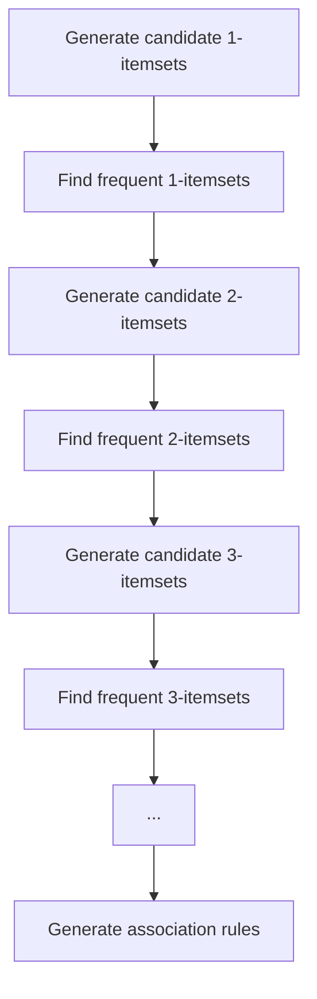

# 🛒 Apriori Algorithm

<div align="center">


*A Classic Association Rule Mining Algorithm for Discovering Interesting Relations Between Items*

</div>

---

## 📚 Table of Contents

- [What is the Apriori Algorithm?](#what-is-the-apriori-algorithm)
- [Mathematical Foundation](#mathematical-foundation)
- [How It Works](#how-it-works)
- [Implementation Guide](#implementation-guide)
- [Performance Optimization](#performance-optimization)
- [Evaluation Metrics](#evaluation-metrics)
- [Pros and Cons](#pros-and-cons)
- [Real-World Examples](#real-world-examples)
- [Advanced Topics](#advanced-topics)
- [FAQ](#faq)

---

## 🎯 What is the Apriori Algorithm?

**Apriori** is a classic algorithm for learning association rules in data mining. Developed by Rakesh Agrawal and Ramakrishnan Srikant in 1994, it identifies frequent itemsets in a dataset and derives association rules between them. The algorithm is widely used for market basket analysis, product recommendation, and discovering relationships in transaction data.

### Key Characteristics:
- **Frequent Pattern Mining**: Discovers items that frequently appear together
- **Association Rule Learning**: Establishes rules of the form "if A, then B" with confidence measures
- **Level-wise Search**: Uses a breadth-first approach to find increasingly larger itemsets
- **Downward Closure Property**: Utilizes the fact that all subsets of frequent itemsets must also be frequent
- **Support and Confidence**: Uses these metrics to identify significant patterns and rules

### The Goal:
The primary objective is to find relationships between items in large datasets that can be used to make informed decisions, such as:
- Product placement in retail stores
- Cross-selling strategies in e-commerce
- Recommendation systems
- Pattern discovery in various domains

---

## 🧮 Mathematical Foundation

### Core Concepts and Definitions

1. **Itemset**: A collection of one or more items.
   - Example: {milk, bread, eggs} is an itemset containing three items.

2. **Support**: The frequency of occurrence of an itemset.
   - For an itemset I, support(I) = (Number of transactions containing I) / (Total number of transactions)

3. **Frequent Itemset**: An itemset whose support exceeds a user-defined minimum support threshold.
   - Itemset I is frequent if support(I) ≥ min_support

4. **Association Rule**: An implication of the form X → Y, where X and Y are non-empty itemsets and X ∩ Y = ∅.
   - X is called the antecedent (left-hand side or LHS)
   - Y is called the consequent (right-hand side or RHS)

5. **Confidence**: The reliability of an association rule.
   - confidence(X → Y) = support(X ∪ Y) / support(X)
   - This represents the conditional probability P(Y|X)

6. **Lift**: A measure of the performance of an association rule.
   - lift(X → Y) = support(X ∪ Y) / (support(X) × support(Y))
   - Lift > 1 indicates X and Y appear more often together than expected by chance

7. **Conviction**: A measure of the implication strength of a rule.
   - conviction(X → Y) = (1 - support(Y)) / (1 - confidence(X → Y))
   - Conviction = ∞ for rules with confidence = 1

8. **Apriori Property (Downward Closure)**: If an itemset is frequent, then all of its subsets must also be frequent.
   - If {A, B, C} is frequent, then {A, B}, {B, C}, {A, C}, {A}, {B}, and {C} must also be frequent.
   - Conversely, if an itemset is not frequent, none of its supersets can be frequent.

### Mathematical Notation

For a formal definition of the Apriori algorithm:

- Let I = {i₁, i₂, ..., iₘ} be the set of all items
- Let D = {t₁, t₂, ..., tₙ} be the set of all transactions, where each transaction t is a set of items such that t ⊆ I
- Let X ⊆ I be an itemset
- The support of X is defined as: support(X) = |{t ∈ D | X ⊆ t}| / |D|
- An itemset X is frequent if support(X) ≥ min_support
- For an association rule X → Y, its confidence is: confidence(X → Y) = support(X ∪ Y) / support(X)

### Example Calculation

Consider the following transaction database:

| Transaction ID | Items |
|----------------|-------|
| T1 | {bread, milk} |
| T2 | {bread, diapers, beer, eggs} |
| T3 | {milk, diapers, beer, cola} |
| T4 | {bread, milk, diapers, beer} |
| T5 | {bread, milk, diapers, cola} |

For min_support = 0.4 (40%):

1. Calculate support for each individual item:
   - support({bread}) = 4/5 = 0.8
   - support({milk}) = 4/5 = 0.8
   - support({diapers}) = 4/5 = 0.8
   - support({beer}) = 3/5 = 0.6
   - support({eggs}) = 1/5 = 0.2
   - support({cola}) = 2/5 = 0.4

2. Frequent 1-itemsets: {bread}, {milk}, {diapers}, {beer}, {cola}

3. Calculate support for candidate 2-itemsets:
   - support({bread, milk}) = 3/5 = 0.6
   - support({bread, diapers}) = 3/5 = 0.6
   - etc.

4. For association rule {diapers} → {beer}:
   - support({diapers, beer}) = 3/5 = 0.6
   - confidence({diapers} → {beer}) = support({diapers, beer}) / support({diapers}) = 0.6/0.8 = 0.75
   - lift({diapers} → {beer}) = support({diapers, beer}) / (support({diapers}) × support({beer})) = 0.6/(0.8×0.6) = 1.25

---

## ⚙️ How It Works

The Apriori algorithm follows a level-wise approach to find frequent itemsets and generate association rules:

<div align="center">



</div>

### Step-by-Step Process:

1. **Generate candidate 1-itemsets**: Create a list of all individual items in the dataset.

2. **Find frequent 1-itemsets**: Scan the database to determine the support for each item. Keep only items that meet the minimum support threshold.

3. **Iterative Process for k ≥ 2**:
   - **Generate candidate k-itemsets**: Use frequent (k-1)-itemsets to generate candidate k-itemsets.
   - **Prune candidates**: Eliminate candidates that contain non-frequent (k-1)-itemsets.
   - **Find frequent k-itemsets**: Scan the database to determine the support for each candidate k-itemset.
   - **Terminate**: When no more frequent itemsets can be found.

4. **Generate association rules**: For each frequent itemset L, generate all non-empty subsets. For each subset S, output the rule S → (L - S) if the confidence meets the minimum confidence threshold.

### Example Algorithm Flow:

Let's use the transaction database from before with min_support = 0.4 (40%) and min_confidence = 0.7 (70%):

1. **Find frequent 1-itemsets**:
   - C₁ = {bread, milk, diapers, beer, eggs, cola} (all items)
   - Count occurrences: bread(4), milk(4), diapers(4), beer(3), eggs(1), cola(2)
   - L₁ = {bread, milk, diapers, beer, cola} (items with support ≥ 0.4)

2. **Find frequent 2-itemsets**:
   - Generate candidate 2-itemsets C₂ from L₁
   - C₂ = {{bread, milk}, {bread, diapers}, {bread, beer}, {bread, cola}, {milk, diapers}, {milk, beer}, {milk, cola}, {diapers, beer}, {diapers, cola}, {beer, cola}}
   - Count occurrences for each pair
   - L₂ = {{bread, milk}, {bread, diapers}, {milk, diapers}, {diapers, beer}, ...} (pairs with support ≥ 0.4)

3. **Find frequent 3-itemsets**:
   - Generate candidate 3-itemsets C₃ from L₂
   - Apply pruning using the Apriori property
   - Count occurrences for remaining candidates
   - L₃ = {...} (triplets with support ≥ 0.4)

4. **Continue until no more frequent itemsets are found**.

5. **Generate association rules**:
   - For each frequent itemset L with k ≥ 2:
     - Generate all non-empty subsets of L
     - For each subset S, calculate confidence(S → (L - S))
     - If confidence ≥ min_confidence, output the rule

### Python Implementation:

```python
from collections import defaultdict
from itertools import combinations

def apriori(transactions, min_support, min_confidence):
    """
    Apply the Apriori algorithm to find frequent itemsets and association rules.
    
    Parameters:
    -----------
    transactions : list of sets
        The transaction database, where each transaction is a set of items
    min_support : float
        Minimum support threshold
    min_confidence : float
        Minimum confidence threshold
    
    Returns:
    --------
    L : dict
        Dictionary containing frequent itemsets at each level
    rules : list
        List of association rules that meet the confidence threshold
    """
    # Count occurrences of each item
    item_counts = defaultdict(int)
    for transaction in transactions:
        for item in transaction:
            item_counts[frozenset([item])] += 1
    
    # Convert counts to support values
    n_transactions = len(transactions)
    item_support = {item: count/n_transactions for item, count in item_counts.items()}
    
    # Find frequent 1-itemsets
    L1 = {item: support for item, support in item_support.items() if support >= min_support}
    
    # Initialize collection of all frequent itemsets
    L = {1: L1}
    k = 2
    
    # Iteratively find frequent k-itemsets for k >= 2
    while L[k-1]:
        # Generate candidate k-itemsets
        Ck = {}
        
        # Join step: generate candidates by combining frequent (k-1)-itemsets
        for i in L[k-1]:
            for j in L[k-1]:
                # For 2-itemsets, i and j are frozensets with 1 item each
                # For k>2, generate candidates by joining itemsets with k-2 common elements
                if k == 2:
                    potential_candidate = i.union(j)
                    if len(potential_candidate) == k:
                        Ck[potential_candidate] = 0
                else:
                    # Convert frozensets to lists for indexing
                    i_list = list(i)
                    j_list = list(j)
                    # Sort to ensure deterministic behavior
                    i_list.sort()
                    j_list.sort()
                    
                    # If first k-2 elements are the same, join to create a new candidate
                    if i_list[:k-2] == j_list[:k-2]:
                        potential_candidate = i.union(j)
                        if len(potential_candidate) == k:
                            # Prune step: check if all subsets of size k-1 are frequent
                            should_prune = False
                            for subset in combinations(potential_candidate, k-1):
                                if frozenset(subset) not in L[k-1]:
                                    should_prune = True
                                    break
                            
                            if not should_prune:
                                Ck[potential_candidate] = 0
        
        # Count support for candidates
        for transaction in transactions:
            transaction_set = frozenset(transaction)
            for candidate in Ck:
                if candidate.issubset(transaction_set):
                    Ck[candidate] += 1
        
        # Find frequent k-itemsets
        Lk = {candidate: count/n_transactions for candidate, count in Ck.items() 
             if count/n_transactions >= min_support}
        
        # If we found any frequent k-itemsets, add to our collection
        if Lk:
            L[k] = Lk
            k += 1
        else:
            break
    
    # Generate association rules
    rules = []
    for k, frequent_itemsets in L.items():
        if k < 2:  # Skip 1-itemsets
            continue
            
        for itemset, support in frequent_itemsets.items():
            # Generate all non-empty proper subsets
            for i in range(1, k):
                for antecedent_items in combinations(itemset, i):
                    antecedent = frozenset(antecedent_items)
                    consequent = itemset - antecedent
                    
                    # Calculate confidence
                    confidence = support / L[len(antecedent)][antecedent]
                    
                    if confidence >= min_confidence:
                        # Calculate lift
                        consequent_support = L[len(consequent)][consequent]
                        lift = support / (L[len(antecedent)][antecedent] * consequent_support)
                        
                        rules.append((antecedent, consequent, support, confidence, lift))
    
    return L, rules
```

---

## 💻 Implementation Guide

### From Scratch Implementation

```python
class Apriori:
    """
    Apriori algorithm for finding frequent itemsets and association rules.
    
    Parameters:
    -----------
    min_support : float, default=0.1
        Minimum support threshold. Must be between 0 and 1.
    min_confidence : float, default=0.5
        Minimum confidence threshold. Must be between 0 and 1.
    min_lift : float, default=1.0
        Minimum lift threshold. Must be greater than or equal to 0.
    max_length : int, default=None
        Maximum length of the itemsets. If None, no limit is applied.
    verbose : bool, default=False
        If True, print progress information.
    """
    
    def __init__(self, min_support=0.1, min_confidence=0.5, min_lift=1.0, max_length=None, verbose=False):
        self.min_support = min_support
        self.min_confidence = min_confidence
        self.min_lift = min_lift
        self.max_length = max_length
        self.verbose = verbose
        self.frequent_itemsets_ = {}
        self.rules_ = []
        self.item_support_map_ = {}
        self.n_transactions_ = 0
        self.transaction_list_ = None
    
    def fit(self, transactions):
        """
        Find frequent itemsets and association rules in transaction data.
        
        Parameters:
        -----------
        transactions : list of lists or sets
            The transaction database, where each transaction is a list or set of items.
            
        Returns:
        --------
        self : object
            Returns the instance itself.
        """
        # Convert transactions to sets if they are lists
        self.transaction_list_ = [set(transaction) for transaction in transactions]
        self.n_transactions_ = len(self.transaction_list_)
        
        # Step 1: Find frequent 1-itemsets
        item_counts = self._get_item_counts()
        self.item_support_map_ = self._get_item_support(item_counts)
        
        # Filter by minimum support
        L1 = {frozenset([item]): support 
              for item, support in self.item_support_map_.items() 
              if support >= self.min_support}
        
        # Initialize with frequent 1-itemsets
        self.frequent_itemsets_ = {1: L1}
        k = 2
        
        # Step 2: Iteratively find frequent k-itemsets
        while self.frequent_itemsets_[k-1] and (self.max_length is None or k <= self.max_length):
            if self.verbose:
                print(f"Finding frequent {k}-itemsets...")
                
            # Generate candidates
            candidates = self._generate_candidates(self.frequent_itemsets_[k-1], k)
            
            # Count candidate occurrences
            candidate_counts = self._count_candidates(candidates)
            
            # Filter by minimum support
            Lk = {itemset: count / self.n_transactions_ 
                  for itemset, count in candidate_counts.items()
                  if count / self.n_transactions_ >= self.min_support}
            
            if Lk:
                self.frequent_itemsets_[k] = Lk
                k += 1
            else:
                break
        
        # Step 3: Generate association rules
        if self.verbose:
            print("Generating association rules...")
            
        self._generate_rules()
        
        return self
    
    def _get_item_counts(self):
        """Count occurrences of each individual item."""
        item_counts = {}
        for transaction in self.transaction_list_:
            for item in transaction:
                if item not in item_counts:
                    item_counts[item] = 1
                else:
                    item_counts[item] += 1
        return item_counts
    
    def _get_item_support(self, item_counts):
        """Convert item counts to support values."""
        return {item: count / self.n_transactions_ for item, count in item_counts.items()}
    
    def _generate_candidates(self, prev_frequent, k):
        """Generate candidate k-itemsets from frequent (k-1)-itemsets."""
        candidates = set()
        prev_itemsets = list(prev_frequent.keys())
        
        for i in range(len(prev_itemsets)):
            for j in range(i+1, len(prev_itemsets)):
                itemset1 = list(prev_itemsets[i])
                itemset2 = list(prev_itemsets[j])
                
                # Sort to ensure deterministic behavior
                itemset1.sort()
                itemset2.sort()
                
                # For k=2, or if first k-2 items are the same, join
                if k == 2 or itemset1[:k-2] == itemset2[:k-2]:
                    # Create a new candidate
                    candidate = frozenset(prev_itemsets[i] | prev_itemsets[j])
                    
                    # Only add if it has exactly k items
                    if len(candidate) == k:
                        # Check if all its (k-1)-subsets are frequent (Apriori property)
                        should_add = True
                        for subset in [frozenset(subset) for subset in self._get_subsets(candidate, k-1)]:
                            if subset not in prev_frequent:
                                should_add = False
                                break
                                
                        if should_add:
                            candidates.add(candidate)
        
        return candidates
    
    def _get_subsets(self, itemset, length):
        """Get all subsets of an itemset with the specified length."""
        return [frozenset(subset) for subset in combinations(itemset, length)]
    
    def _count_candidates(self, candidates):
        """Count occurrences of each candidate itemset in the transactions."""
        counts = {candidate: 0 for candidate in candidates}
        
        for transaction in self.transaction_list_:
            transaction_set = frozenset(transaction)
            for candidate in candidates:
                if candidate.issubset(transaction_set):
                    counts[candidate] += 1
        
        return counts
    
    def _generate_rules(self):
        """Generate association rules from frequent itemsets."""
        self.rules_ = []
        
        for k, frequent_itemsets in self.frequent_itemsets_.items():
            if k < 2:  # Skip 1-itemsets
                continue
                
            for itemset, support in frequent_itemsets.items():
                # Generate rules from all non-empty proper subsets
                for i in range(1, k):
                    for antecedent_items in combinations(itemset, i):
                        antecedent = frozenset(antecedent_items)
                        consequent = itemset - antecedent
                        
                        # Skip if consequent is empty
                        if not consequent:
                            continue
                            
                        # Get support values
                        antecedent_support = self.frequent_itemsets_[len(antecedent)][antecedent]
                        consequent_support = self.frequent_itemsets_[len(consequent)][consequent]
                        
                        # Calculate metrics
                        confidence = support / antecedent_support
                        lift = confidence / consequent_support
                        conviction = (1 - consequent_support) / (1 - confidence) if confidence < 1 else float('inf')
                        
                        # Filter by thresholds
                        if confidence >= self.min_confidence and lift >= self.min_lift:
                            self.rules_.append({
                                'antecedent': set(antecedent),
                                'consequent': set(consequent),
                                'support': support,
                                'confidence': confidence,
                                'lift': lift,
                                'conviction': conviction
                            })
    
    def get_frequent_itemsets(self):
        """Return frequent itemsets as a DataFrame."""
        if not self.frequent_itemsets_:
            return None
        
        itemsets = []
        for k, level_itemsets in self.frequent_itemsets_.items():
            for itemset, support in level_itemsets.items():
                itemsets.append({
                    'itemset': set(itemset),
                    'support': support,
                    'length': k
                })
        
        # Convert to DataFrame if pandas is available
        try:
            import pandas as pd
            return pd.DataFrame(itemsets)
        except ImportError:
            return itemsets
    
    def get_rules(self):
        """Return association rules as a DataFrame."""
        if not self.rules_:
            return None
            
        # Convert to DataFrame if pandas is available
        try:
            import pandas as pd
            return pd.DataFrame(self.rules_)
        except ImportError:
            return self.rules_
```

### Using External Libraries

#### With MLxtend

```python
import pandas as pd
import numpy as np
from mlxtend.preprocessing import TransactionEncoder
from mlxtend.frequent_patterns import apriori, association_rules

# Sample transaction data
transactions = [
    ['bread', 'milk'],
    ['bread', 'diaper', 'beer', 'eggs'],
    ['milk', 'diaper', 'beer', 'cola'],
    ['bread', 'milk', 'diaper', 'beer'],
    ['bread', 'milk', 'diaper', 'cola']
]

# Convert transactions to a suitable format for MLxtend
te = TransactionEncoder()
te_ary = te.fit(transactions).transform(transactions)
df = pd.DataFrame(te_ary, columns=te.columns_)

# Apply Apriori to find frequent itemsets
frequent_itemsets = apriori(df, min_support=0.4, use_colnames=True)
print("Frequent Itemsets:")
print(frequent_itemsets)

# Generate association rules
rules = association_rules(frequent_itemsets, metric="confidence", min_threshold=0.7)
print("\nAssociation Rules:")
print(rules[['antecedents', 'consequents', 'support', 'confidence', 'lift']])

# Filter rules by lift
high_lift_rules = rules[rules['lift'] > 1.2]
print("\nRules with High Lift (>1.2):")
print(high_lift_rules[['antecedents', 'consequents', 'support', 'confidence', 'lift']])
```

#### With Efficient Apriori

```python
from efficient_apriori import apriori

# Sample transaction data
transactions = [
    ['bread', 'milk'],
    ['bread', 'diaper', 'beer', 'eggs'],
    ['milk', 'diaper', 'beer', 'cola'],
    ['bread', 'milk', 'diaper', 'beer'],
    ['bread', 'milk', 'diaper', 'cola']
]

# Find frequent itemsets and association rules
itemsets, rules = apriori(transactions, min_support=0.4, min_confidence=0.7)

# Print frequent itemsets
print("Frequent Itemsets:")
for k, itemset_dict in itemsets.items():
    print(f"Length {k}:")
    for itemset, support in itemset_dict.items():
        print(f"  {itemset}: {support}")

# Print association rules
print("\nAssociation Rules:")
for rule in rules:
    print(f"{rule.lhs} -> {rule.rhs} (Support: {rule.support:.2f}, Confidence: {rule.confidence:.2f}, Lift: {rule.lift:.2f})")
```

### Complete Example with Visualization

```python
import pandas as pd
import numpy as np
import matplotlib.pyplot as plt
import seaborn as sns
from mlxtend.preprocessing import TransactionEncoder
from mlxtend.frequent_patterns import apriori, association_rules
import networkx as nx
from itertools import combinations

# Set random seed for reproducibility
np.random.seed(42)

# Generate synthetic transaction data
n_transactions = 1000
items = ['bread', 'milk', 'eggs', 'cheese', 'yogurt', 'butter', 'fruit', 
         'vegetables', 'meat', 'fish', 'pasta', 'rice', 'cereal', 'snacks', 'dessert']

# Create transactions with some built-in associations
transactions = []

for _ in range(n_transactions):
    # Random number of items per transaction (1 to 8)
    n_items = np.random.randint(1, 9)
    
    # Base transaction with random items
    transaction = set(np.random.choice(items, size=n_items, replace=False))
    
    # Add some common associations
    if 'bread' in transaction and np.random.random() < 0.7:
        transaction.add('butter')
        
    if 'pasta' in transaction and np.random.random() < 0.6:
        transaction.add('cheese')
        
    if 'cereal' in transaction and np.random.random() < 0.8:
        transaction.add('milk')
        
    if 'bread' in transaction and 'cheese' in transaction and np.random.random() < 0.7:
        transaction.add('eggs')
    
    transactions.append(list(transaction))

# Print a few example transactions
print("Sample Transactions:")
for i, transaction in enumerate(transactions[:5]):
    print(f"Transaction {i+1}: {transaction}")

# Convert transactions to a suitable format for MLxtend
te = TransactionEncoder()
te_ary = te.fit(transactions).transform(transactions)
df = pd.DataFrame(te_ary, columns=te.columns_)

# Apply Apriori to find frequent itemsets
print("\nFinding frequent itemsets...")
min_support = 0.05
frequent_itemsets = apriori(df, min_support=min_support, use_colnames=True)

# Print frequent itemsets statistics
print(f"Found {len(frequent_itemsets)} frequent itemsets with min_support={min_support}")
print("Itemset length distribution:")
length_counts = frequent_itemsets['itemsets'].apply(lambda x: len(x)).value_counts().sort_index()
print(length_counts)

# Generate association rules
print("\nGenerating association rules...")
min_confidence = 0.5
rules = association_rules(frequent_itemsets, metric="confidence", min_threshold=min_confidence)

# Print rule statistics
print(f"Found {len(rules)} rules with min_confidence={min_confidence}")
print("\nTop 5 rules by lift:")
top_rules = rules.sort_values('lift', ascending=False).head(5)
for _, rule in top_rules.iterrows():
    antecedents = ', '.join(list(rule['antecedents']))
    consequents = ', '.join(list(rule['consequents']))
    print(f"{antecedents} -> {consequents} (Support: {rule['support']:.3f}, Confidence: {rule['confidence']:.3f}, Lift: {rule['lift']:.3f})")

# Visualize frequent itemsets
plt.figure(figsize=(10, 6))
length_counts.plot(kind='bar', color='skyblue')
plt.xlabel('Itemset Size')
plt.ylabel('Count')
plt.title('Distribution of Frequent Itemset Sizes')
plt.grid(axis='y', alpha=0.3)
plt.tight_layout()
plt.show()

# Visualize support vs. confidence for rules
plt.figure(figsize=(10, 6))
scatter = plt.scatter(rules['support'], rules['confidence'], c=rules['lift'], 
                     cmap='viridis', s=rules['lift']*20, alpha=0.7)
plt.colorbar(scatter, label='Lift')
plt.xlabel('Support')
plt.ylabel('Confidence')
plt.title('Support vs. Confidence for Association Rules')
plt.grid(True, alpha=0.3)
plt.tight_layout()
plt.show()

# Visualize lift distribution
plt.figure(figsize=(10, 6))
plt.hist(rules['lift'], bins=20, color='skyblue', alpha=0.7)
plt.xlabel('Lift')
plt.ylabel('Count')
plt.title('Distribution of Lift Values')
plt.grid(axis='y', alpha=0.3)
plt.tight_layout()
plt.show()

# Visualize top rules as a network graph
def plot_rule_graph(rules, min_lift=1.2, max_rules=15):
    # Select top rules by lift
    top_rules = rules[rules['lift'] >= min_lift].sort_values('lift', ascending=False).head(max_rules)
    
    # Create a directed graph
    G = nx.DiGraph()
    
    # Add edges for each rule
    for _, rule in top_rules.iterrows():
        antecedents = list(rule['antecedents'])
        consequents = list(rule['consequents'])
        
        # Add all combinations of antecedent to consequent
        for ant in antecedents:
            for con in consequents:
                G.add_edge(ant, con, weight=rule['lift'], confidence=rule['confidence'])
    
    # Set up the plot
    plt.figure(figsize=(12, 10))
    
    # Define node positions using spring layout
    pos = nx.spring_layout(G, seed=42)
    
    # Get edge weights for edge width
    edge_weights = [G[u][v]['weight'] for u, v in G.edges()]
    
    # Get edge confidences for edge color
    edge_confidences = [G[u][v]['confidence'] for u, v in G.edges()]
    
    # Draw the graph
    nodes = nx.draw_networkx_nodes(G, pos, node_size=700, node_color='lightblue')
    edges = nx.draw_networkx_edges(G, pos, width=[w/2 for w in edge_weights], 
                                  edge_color=edge_confidences, edge_cmap=plt.cm.Blues,
                                  arrowstyle='->', arrowsize=15)
    labels = nx.draw_networkx_labels(G, pos, font_size=10, font_family='sans-serif')
    
    # Add a colorbar for edge confidence
    sm = plt.cm.ScalarMappable(cmap=plt.cm.Blues, norm=plt.Normalize(vmin=min(edge_confidences), vmax=max(edge_confidences)))
    sm.set_array([])
    cbar = plt.colorbar(sm, label='Confidence')
    
    plt.title('Association Rules Network')
    plt.axis('off')
    plt.tight_layout()
    plt.show()

# Plot the rule graph
plot_rule_graph(rules, min_lift=1.5)

# Create a heatmap of item co-occurrence
def create_cooccurrence_matrix(transactions, items):
    # Initialize co-occurrence matrix
    n_items = len(items)
    cooccur_matrix = np.zeros((n_items, n_items))
    
    # Fill the matrix
    for transaction in transactions:
        # Get all pairs of items in the transaction
        for i, item1 in enumerate(items):
            for j, item2 in enumerate(items):
                if i < j and item1 in transaction and item2 in transaction:
                    cooccur_matrix[i, j] += 1
                    cooccur_matrix[j, i] += 1
    
    # Convert to DataFrame for better visualization
    cooccur_df = pd.DataFrame(cooccur_matrix, index=items, columns=items)
    return cooccur_df

# Create co-occurrence matrix for top items
top_items = df.sum().sort_values(ascending=False).head(10).index.tolist()
cooccur_df = create_cooccurrence_matrix(transactions, top_items)

# Plot co-occurrence heatmap
plt.figure(figsize=(12, 10))
sns.heatmap(cooccur_df, annot=True, fmt='.0f', cmap='Blues', linewidths=0.5)
plt.title('Item Co-occurrence Matrix')
plt.tight_layout()
plt.show()

# Analyze the distribution of item frequencies
item_freq = df.sum() / len(df)
item_freq = item_freq.sort_values(ascending=False)

plt.figure(figsize=(12, 6))
item_freq.plot(kind='bar', color='skyblue')
plt.axhline(y=min_support, color='r', linestyle='--', label=f'Min Support: {min_support}')
plt.xlabel('Item')
plt.ylabel('Support (Frequency)')
plt.title('Item Support Distribution')
plt.legend()
plt.xticks(rotation=90)
plt.grid(axis='y', alpha=0.3)
plt.tight_layout()
plt.show()

# Create a function to make recommendations based on the rules
def recommend_items(basket, rules, top_n=5):
    """
    Recommend items based on the current basket using association rules.
    
    Parameters:
    -----------
    basket : list
        List of items in the current basket
    rules : DataFrame
        Association rules DataFrame from MLxtend
    top_n : int, default=5
        Number of recommendations to return
    
    Returns:
    --------
    recommendations : list
        List of recommended items with their confidence scores
    """
    # Convert basket to set for faster lookups
    basket_set = set(basket)
    
    # Store recommendations with their confidence scores
    recommendations = {}
    
    for _, rule in rules.iterrows():
        # Check if all antecedents are in the basket
        if basket_set.issuperset(rule['antecedents']):
            # For each consequent not already in the basket
            for item in rule['consequents']:
                if item not in basket_set:
                    # Use the highest confidence if the item appears in multiple rules
                    if item not in recommendations or rule['confidence'] > recommendations[item][0]:
                        recommendations[item] = (rule['confidence'], rule['lift'])
    
    # Sort by confidence and return top_n
    sorted_recommendations = sorted(recommendations.items(), key=lambda x: x[1][0], reverse=True)[:top_n]
    
    return [(item, conf, lift) for item, (conf, lift) in sorted_recommendations]

# Example basket
example_basket = ['bread', 'eggs']
print(f"\nExample basket: {example_basket}")

# Get recommendations
recommendations = recommend_items(example_basket, rules)
print("Recommended items:")
for item, confidence, lift in recommendations:
    print(f"  {item} (Confidence: {confidence:.3f}, Lift: {lift:.3f})")

# Visualize the recommendation
plt.figure(figsize=(10, 6))
items, confidences, lifts = zip(*recommendations) if recommendations else ([], [], [])
y_pos = range(len(items))

# Create a horizontal bar chart
bars = plt.barh(y_pos, confidences, align='center', alpha=0.7, color='skyblue')

# Add lift values as text annotations
for i, (bar, lift) in enumerate(zip(bars, lifts)):
    plt.text(bar.get_width() + 0.01, bar.get_y() + bar.get_height()/2, f'Lift: {lift:.2f}', 
             va='center', fontsize=10)

plt.yticks(y_pos, items)
plt.xlabel('Confidence')
plt.title(f'Recommended Items for {", ".join(example_basket)}')
plt.grid(axis='x', alpha=0.3)
plt.tight_layout()
plt.show()
```

---

## 🚀 Performance Optimization

The Apriori algorithm can be computationally intensive, especially for large datasets. Here are techniques to improve its performance:

### 1. **Candidate Generation Optimization**

```python
def optimized_candidate_generation(prev_frequent, k):
    """
    Generate k-itemset candidates more efficiently.
    
    Uses a hash-join approach to reduce the number of comparisons.
    """
    candidates = set()
    prev_itemsets = list(prev_frequent.keys())
    
    # Create a dictionary to group itemsets by their first k-2 items
    if k > 2:
        groups = {}
        for itemset in prev_itemsets:
            key = tuple(sorted(list(itemset))[:k-2])
            if key not in groups:
                groups[key] = []
            groups[key].append(itemset)
        
        # Generate candidates only from itemsets in the same group
        for key, group in groups.items():
            for i in range(len(group)):
                for j in range(i+1, len(group)):
                    # Create new candidate by joining
                    candidate = frozenset(group[i] | group[j])
                    if len(candidate) == k:
                        candidates.add(candidate)
    else:
        # For k=2, use the simple approach
        for i in range(len(prev_itemsets)):
            for j in range(i+1, len(prev_itemsets)):
                candidate = frozenset(prev_itemsets[i] | prev_itemsets[j])
                if len(candidate) == k:
                    candidates.add(candidate)
    
    return candidates
```

### 2. **Transaction Reduction**

```python
def transaction_reduction(transactions, frequent_items):
    """
    Remove infrequent items from transactions to reduce data size.
    
    This optimization is particularly effective for sparse datasets.
    """
    reduced_transactions = []
    for transaction in transactions:
        # Keep only frequent items in the transaction
        reduced = [item for item in transaction if item in frequent_items]
        if reduced:  # Only add non-empty transactions
            reduced_transactions.append(reduced)
    
    return reduced_transactions
```

### 3. **Hash-based Technique**

```python
def hash_based_pruning(transactions, k, hash_size=1000):
    """
    Use a hash table to reduce the number of candidate itemsets.
    
    This is particularly useful for pruning candidate 2-itemsets.
    """
    hash_table = [0] * hash_size
    
    # Fill the hash table
    for transaction in transactions:
        for pair in combinations(sorted(transaction), k):
            # Generate a hash value for the pair
            hash_value = sum(hash(item) for item in pair) % hash_size
            hash_table[hash_value] += 1
    
    return hash_table
```

### 4. **Partitioning Approach**

```python
def apriori_partitioning(transactions, min_support, min_confidence, n_partitions=4):
    """
    Apply Apriori algorithm using the partitioning technique.
    
    Divides the database into non-overlapping partitions and finds local frequent
    itemsets in each partition. Then combines the results and finds global frequent itemsets.
    """
    import math
    from collections import defaultdict
    
    n_transactions = len(transactions)
    partition_size = math.ceil(n_transactions / n_partitions)
    
    # Divide transactions into partitions
    partitions = [transactions[i:i+partition_size] for i in range(0, n_transactions, partition_size)]
    
    # Find local frequent itemsets in each partition
    local_frequent = defaultdict(set)
    
    for i, partition in enumerate(partitions):
        # Apply Apriori to the partition
        local_min_support = min_support  # Can be adjusted based on partition size
        L, _ = apriori(partition, local_min_support, 1.0)  # High confidence to focus on itemsets
        
        # Collect all frequent itemsets from this partition
        for k, frequent_itemsets in L.items():
            for itemset in frequent_itemsets:
                local_frequent[k].add(itemset)
    
    # Generate global candidate itemsets
    global_candidates = {}
    for k, itemsets in local_frequent.items():
        global_candidates[k] = itemsets
    
    # Count support for global candidates
    global_counts = defaultdict(int)
    for transaction in transactions:
        transaction_set = frozenset(transaction)
        for k, itemsets in global_candidates.items():
            for itemset in itemsets:
                if itemset.issubset(transaction_set):
                    global_counts[itemset] += 1
    
    # Find global frequent itemsets
    global_frequent = {}
    for k, itemsets in global_candidates.items():
        global_frequent[k] = {itemset: count/n_transactions 
                             for itemset, count in global_counts.items()
                             if itemset in itemsets and count/n_transactions >= min_support}
    
    # Generate association rules
    rules = []
    for k, frequent_itemsets in global_frequent.items():
        if k < 2:  # Skip 1-itemsets
            continue
            
        for itemset, support in frequent_itemsets.items():
            for i in range(1, k):
                for antecedent_items in combinations(itemset, i):
                    antecedent = frozenset(antecedent_items)
                    consequent = itemset - antecedent
                    
                    if antecedent in global_frequent[len(antecedent)] and consequent in global_frequent[len(consequent)]:
                        confidence = support / global_frequent[len(antecedent)][antecedent]
                        
                        if confidence >= min_confidence:
                            rules.append((antecedent, consequent, support, confidence))
    
    return global_frequent, rules
```

### 5. **FP-Growth Alternative**

FP-Growth is an alternative algorithm to Apriori that addresses some of its inefficiencies. Here's how to use it with MLxtend:

```python
from mlxtend.frequent_patterns import fpgrowth

# Compare performance: Apriori vs FP-Growth
import time

# Start timer for Apriori
start_time = time.time()
frequent_itemsets_apriori = apriori(df, min_support=0.05, use_colnames=True)
apriori_time = time.time() - start_time
print(f"Apriori time: {apriori_time:.3f} seconds")
print(f"Number of frequent itemsets found: {len(frequent_itemsets_apriori)}")

# Start timer for FP-Growth
start_time = time.time()
frequent_itemsets_fpgrowth = fpgrowth(df, min_support=0.05, use_colnames=True)
fpgrowth_time = time.time() - start_time
print(f"FP-Growth time: {fpgrowth_time:.3f} seconds")
print(f"Number of frequent itemsets found: {len(frequent_itemsets_fpgrowth)}")

# Calculate speedup
speedup = apriori_time / fpgrowth_time
print(f"Speedup: {speedup:.2f}x")
```

### 6. **Bitmap Representation**

```python
def bitmap_apriori(transactions, min_support, min_confidence):
    """
    Apply Apriori algorithm using bitmap representation for faster counting.
    
    Uses a bitmap to represent each item's presence in transactions,
    which allows for faster support counting through bit operations.
    """
    # Step 1: Convert transactions to bitmap representation
    items = set()
    for transaction in transactions:
        items.update(transaction)
    
    # Create item-to-index mapping
    item_indices = {item: i for i, item in enumerate(sorted(items))}
    n_items = len(items)
    n_transactions = len(transactions)
    
    # Create bitmap for each item
    item_bitmaps = {}
    for item in items:
        bitmap = 0
        for i, transaction in enumerate(transactions):
            if item in transaction:
                # Set the bit for this transaction
                bitmap |= (1 << i)
        item_bitmaps[item] = bitmap
    
    # Step 2: Find frequent 1-itemsets
    min_count = min_support * n_transactions
    frequent_1_items = {}
    for item, bitmap in item_bitmaps.items():
        # Count bits set to 1 (population count)
        count = bin(bitmap).count('1')
        if count >= min_count:
            frequent_1_items[frozenset([item])] = count / n_transactions
    
    # Initialize result
    frequent_itemsets = {1: frequent_1_items}
    k = 2
    
    # Step 3: Iteratively find frequent k-itemsets
    while frequent_itemsets[k-1]:
        # Generate candidates
        candidates = {}
        prev_itemsets = list(frequent_itemsets[k-1].keys())
        
        for i in range(len(prev_itemsets)):
            for j in range(i+1, len(prev_itemsets)):
                itemset1 = list(prev_itemsets[i])
                itemset2 = list(prev_itemsets[j])
                
                # Sort to ensure deterministic behavior
                itemset1.sort()
                itemset2.sort()
                
                # For k=2, or if first k-2 items are the same, join
                if k == 2 or itemset1[:k-2] == itemset2[:k-2]:
                    # Create a new candidate
                    candidate = frozenset(prev_itemsets[i] | prev_itemsets[j])
                    
                    # Only add if it has exactly k items
                    if len(candidate) == k:
                        # Check if all its (k-1)-subsets are frequent (Apriori property)
                        all_subsets_frequent = True
                        for item in candidate:
                            subset = candidate - frozenset([item])
                            if subset not in frequent_itemsets[k-1]:
                                all_subsets_frequent = False
                                break
                                
                        if all_subsets_frequent:
                            # Use bitmap operations to count support
                            bitmap = (1 << n_transactions) - 1  # All bits set to 1
                            for item in candidate:
                                bitmap &= item_bitmaps[item]
                                
                            count = bin(bitmap).count('1')
                            if count >= min_count:
                                candidates[candidate] = count / n_transactions
        
        if candidates:
            frequent_itemsets[k] = candidates
            k += 1
        else:
            break
    
    # Step 4: Generate association rules
    rules = []
    for k, itemsets in frequent_itemsets.items():
        if k < 2:  # Skip 1-itemsets
            continue
            
        for itemset, support in itemsets.items():
            for i in range(1, k):
                for antecedent_items in combinations(itemset, i):
                    antecedent = frozenset(antecedent_items)
                    consequent = itemset - antecedent
                    
                    antecedent_support = frequent_itemsets[len(antecedent)][antecedent]
                    confidence = support / antecedent_support
                    
                    if confidence >= min_confidence:
                        rules.append((antecedent, consequent, support, confidence))
    
    return frequent_itemsets, rules
```

### 7. **Parallel Processing**

```python
def parallel_apriori(transactions, min_support, min_confidence, n_jobs=-1):
    """
    Apply Apriori algorithm with parallel processing for better performance.
    
    Uses joblib for parallel execution of support counting.
    """
    from joblib import Parallel, delayed
    from collections import defaultdict
    import math
    
    # Step 1: Find frequent 1-itemsets (this step is simple, no need for parallelism)
    item_counts = defaultdict(int)
    for transaction in transactions:
        for item in transaction:
            item_counts[frozenset([item])] += 1
    
    n_transactions = len(transactions)
    min_count = math.ceil(min_support * n_transactions)
    
    # Filter by minimum support
    L1 = {itemset: count/n_transactions 
          for itemset, count in item_counts.items() 
          if count >= min_count}
    
    # Initialize result
    L = {1: L1}
    k = 2
    
    # Function to count support for a batch of candidates
    def count_candidate_batch(candidates_batch, transactions):
        counts = defaultdict(int)
        for transaction in transactions:
            transaction_set = frozenset(transaction)
            for candidate in candidates_batch:
                if candidate.issubset(transaction_set):
                    counts[candidate] += 1
        return counts
    
    # Step 2: Iteratively find frequent k-itemsets
    while L[k-1]:
        # Generate candidates
        candidates = set()
        prev_itemsets = list(L[k-1].keys())
        
        for i in range(len(prev_itemsets)):
            for j in range(i+1, len(prev_itemsets)):
                itemset1 = list(prev_itemsets[i])
                itemset2 = list(prev_itemsets[j])
                
                # Sort for deterministic behavior
                itemset1.sort()
                itemset2.sort()
                
                # For k=2, or if first k-2 items are the same, join
                if k == 2 or itemset1[:k-2] == itemset2[:k-2]:
                    # Create a new candidate
                    candidate = frozenset(prev_itemsets[i] | prev_itemsets[j])
                    
                    # Only add if it has exactly k items
                    if len(candidate) == k:
                        # Check if all its (k-1)-subsets are frequent (Apriori property)
                        all_subsets_frequent = True
                        for item in candidate:
                            subset = candidate - frozenset([item])
                            if subset not in L[k-1]:
                                all_subsets_frequent = False
                                break
                                
                        if all_subsets_frequent:
                            candidates.add(candidate)
        
        if not candidates:
            break
        
        # Split candidates into batches for parallel processing
        batch_size = max(1, min(1000, len(candidates) // (n_jobs * 2)))
        candidate_batches = [list(candidates)[i:i+batch_size] 
                           for i in range(0, len(candidates), batch_size)]
        
        # Count support in parallel
        batch_results = Parallel(n_jobs=n_jobs)(
            delayed(count_candidate_batch)(batch, transactions) 
            for batch in candidate_batches
        )
        
        # Combine results
        all_counts = defaultdict(int)
        for result in batch_results:
            for candidate, count in result.items():
                all_counts[candidate] += count
        
        # Filter by minimum support
        Lk = {itemset: count/n_transactions 
             for itemset, count in all_counts.items() 
             if count >= min_count}
        
        if Lk:
            L[k] = Lk
            k += 1
        else:
            break
    
    # Step 3: Generate association rules (can also be parallelized but usually not the bottleneck)
    rules = []
    for k, frequent_itemsets in L.items():
        if k < 2:  # Skip 1-itemsets
            continue
            
        for itemset, support in frequent_itemsets.items():
            for i in range(1, k):
                for antecedent_items in combinations(itemset, i):
                    antecedent = frozenset(antecedent_items)
                    consequent = itemset - antecedent
                    
                    antecedent_support = L[len(antecedent)][antecedent]
                    confidence = support / antecedent_support
                    
                    if confidence >= min_confidence:
                        rules.append((antecedent, consequent, support, confidence))
    
    return L, rules
```

### 8. **Memory Optimization Using Generators**

```python
def memory_efficient_apriori(transactions_iterator, min_support, min_confidence):
    """
    Memory-efficient implementation of Apriori that uses generators.
    
    Suitable for datasets that don't fit in memory.
    """
    from collections import defaultdict
    import math
    
    # First pass: Count 1-itemsets and find total number of transactions
    item_counts = defaultdict(int)
    n_transactions = 0
    
    print("First pass: counting items...")
    for transaction in transactions_iterator():
        n_transactions += 1
        for item in transaction:
            item_counts[frozenset([item])] += 1
    
    min_count = math.ceil(min_support * n_transactions)
    print(f"Minimum count threshold: {min_count} ({min_support * 100:.1f}% of {n_transactions} transactions)")
    
    # Filter by minimum support
    L1 = {itemset: count/n_transactions 
         for itemset, count in item_counts.items() 
         if count >= min_count}
    
    print(f"Found {len(L1)} frequent 1-itemsets")
    
    # Initialize result
    L = {1: L1}
    k = 2
    
    # Iteratively find frequent k-itemsets
    while L[k-1]:
        print(f"Finding frequent {k}-itemsets...")
        
        # Generate candidates
        candidates = set()
        prev_itemsets = list(L[k-1].keys())
        
        for i in range(len(prev_itemsets)):
            for j in range(i+1, len(prev_itemsets)):
                # Create a new candidate by joining two (k-1)-itemsets
                candidate = frozenset(prev_itemsets[i] | prev_itemsets[j])
                
                # Only add if it has exactly k items
                if len(candidate) == k:
                    # Check if all its (k-1)-subsets are frequent (Apriori property)
                    all_subsets_frequent = True
                    for item in candidate:
                        subset = candidate - frozenset([item])
                        if subset not in L[k-1]:
                            all_subsets_frequent = False
                            break
                            
                    if all_subsets_frequent:
                        candidates.add(candidate)
        
        print(f"Generated {len(candidates)} candidate {k}-itemsets")
        
        if not candidates:
            break
        
        # Count support for candidates
        candidate_counts = defaultdict(int)
        
        print("Counting support for candidates...")
        for transaction in transactions_iterator():
            transaction_set = frozenset(transaction)
            for candidate in candidates:
                if candidate.issubset(transaction_set):
                    candidate_counts[candidate] += 1
        
        # Filter by minimum support
        Lk = {itemset: count/n_transactions 
             for itemset, count in candidate_counts.items() 
             if count >= min_count}
        
        print(f"Found {len(Lk)} frequent {k}-itemsets")
        
        if Lk:
            L[k] = Lk
            k += 1
        else:
            break
    
    # Generate association rules
    print("Generating association rules...")
    rules = []
    
    for k, frequent_itemsets in L.items():
        if k < 2:  # Skip 1-itemsets
            continue
            
        for itemset, support in frequent_itemsets.items():
            for i in range(1, k):
                for antecedent_items in combinations(itemset, i):
                    antecedent = frozenset(antecedent_items)
                    consequent = itemset - antecedent
                    
                    antecedent_support = L[len(antecedent)][antecedent]
                    confidence = support / antecedent_support
                    
                    if confidence >= min_confidence:
                        consequent_support = L[len(consequent)][consequent]
                        lift = confidence / consequent_support
                        
                        rules.append((antecedent, consequent, support, confidence, lift))
    
    print(f"Generated {len(rules)} association rules")
    return L, rules

# Example usage with a file-based dataset
def transaction_generator(file_path):
    """Generator function to read transactions from a file."""
    def generator():
        with open(file_path, 'r') as file:
            for line in file:
                # Parse the line into a transaction
                transaction = line.strip().split(',')
                yield transaction
    return generator
```

---

## 📊 Evaluation Metrics

### Support

Support measures the frequency of an itemset in the dataset.

```python
def calculate_support(transactions, itemset):
    """Calculate support for an itemset."""
    count = 0
    for transaction in transactions:
        if itemset.issubset(transaction):
            count += 1
    
    return count / len(transactions)
```

### Confidence

Confidence measures the reliability of an association rule.

```python
def calculate_confidence(transactions, antecedent, consequent):
    """Calculate confidence for a rule: antecedent -> consequent."""
    antecedent_count = 0
    both_count = 0
    
    for transaction in transactions:
        if antecedent.issubset(transaction):
            antecedent_count += 1
            if consequent.issubset(transaction):
                both_count += 1
    
    return both_count / antecedent_count if antecedent_count > 0 else 0
```

### Lift

Lift measures how much more often antecedent and consequent occur together than expected if they were statistically independent.

```python
def calculate_lift(transactions, antecedent, consequent):
    """Calculate lift for a rule: antecedent -> consequent."""
    antecedent_support = calculate_support(transactions, antecedent)
    consequent_support = calculate_support(transactions, consequent)
    both_support = calculate_support(transactions, antecedent | consequent)
    
    confidence = both_support / antecedent_support if antecedent_support > 0 else 0
    
    return confidence / consequent_support if consequent_support > 0 else 0
```

### Conviction

Conviction measures the ratio of the expected frequency that the antecedent occurs without the consequent.

```python
def calculate_conviction(transactions, antecedent, consequent):
    """Calculate conviction for a rule: antecedent -> consequent."""
    antecedent_support = calculate_support(transactions, antecedent)
    consequent_support = calculate_support(transactions, consequent)
    both_support = calculate_support(transactions, antecedent | consequent)
    
    confidence = both_support / antecedent_support if antecedent_support > 0 else 0
    
    if confidence == 1:
        return float('inf')
    else:
        return (1 - consequent_support) / (1 - confidence) if confidence < 1 else float('inf')
```

### Leverage

Leverage measures the difference between the observed joint probability of antecedent and consequent and what would be expected if they were independent.

```python
def calculate_leverage(transactions, antecedent, consequent):
    """Calculate leverage for a rule: antecedent -> consequent."""
    antecedent_support = calculate_support(transactions, antecedent)
    consequent_support = calculate_support(transactions, consequent)
    both_support = calculate_support(transactions, antecedent | consequent)
    
    return both_support - (antecedent_support * consequent_support)
```

### Jaccard Coefficient

Jaccard coefficient measures the ratio of transactions that contain both antecedent and consequent to transactions that contain either.

```python
def calculate_jaccard(transactions, antecedent, consequent):
    """Calculate Jaccard coefficient for a rule: antecedent -> consequent."""
    both_count = 0
    either_count = 0
    
    for transaction in transactions:
        if antecedent.issubset(transaction) or consequent.issubset(transaction):
            either_count += 1
            if antecedent.issubset(transaction) and consequent.issubset(transaction):
                both_count += 1
    
    return both_count / either_count if either_count > 0 else 0
```

### All-Confidence

All-confidence is the minimum confidence of all possible association rules that can be generated from an itemset.

```python
def calculate_all_confidence(transactions, itemset):
    """Calculate all-confidence for an itemset."""
    if len(itemset) <= 1:
        return 1.0
    
    itemset_support = calculate_support(transactions, itemset)
    max_item_support = max(calculate_support(transactions, frozenset([item])) for item in itemset)
    
    return itemset_support / max_item_support if max_item_support > 0 else 0
```

### Cosine

Cosine measures the cosine of the angle between the binary vectors representing the antecedent and consequent.

```python
def calculate_cosine(transactions, antecedent, consequent):
    """Calculate cosine for a rule: antecedent -> consequent."""
    antecedent_support = calculate_support(transactions, antecedent)
    consequent_support = calculate_support(transactions, consequent)
    both_support = calculate_support(transactions, antecedent | consequent)
    
    denominator = math.sqrt(antecedent_support * consequent_support)
    
    return both_support / denominator if denominator > 0 else 0
```

### Comprehensive Metrics Calculator

```python
def calculate_rule_metrics(transactions, antecedent, consequent):
        """
    Calculate comprehensive metrics for association rule: antecedent -> consequent.
    
    Parameters:
    -----------
    transactions : list of sets
        The transaction database, where each transaction is a set of items
    antecedent : set
        The left-hand side of the rule
    consequent : set
        The right-hand side of the rule
        
    Returns:
    --------
    metrics : dict
        Dictionary containing various metrics for the rule
    """
    # Convert sets to frozensets for consistent handling
    antecedent = frozenset(antecedent)
    consequent = frozenset(consequent)
    
    # Calculate base counts
    n_transactions = len(transactions)
    antecedent_count = sum(1 for t in transactions if antecedent.issubset(t))
    consequent_count = sum(1 for t in transactions if consequent.issubset(t))
    both_count = sum(1 for t in transactions if antecedent.issubset(t) and consequent.issubset(t))
    either_count = sum(1 for t in transactions if antecedent.issubset(t) or consequent.issubset(t))
    
    # Calculate support values
    antecedent_support = antecedent_count / n_transactions
    consequent_support = consequent_count / n_transactions
    both_support = both_count / n_transactions
    
    # Calculate confidence
    confidence = both_count / antecedent_count if antecedent_count > 0 else 0
    
    # Calculate lift
    expected_conf = consequent_support
    lift = confidence / expected_conf if expected_conf > 0 else 0
    
    # Calculate conviction
    conviction = (1 - consequent_support) / (1 - confidence) if confidence < 1 else float('inf')
    
    # Calculate leverage
    leverage = both_support - (antecedent_support * consequent_support)
    
    # Calculate Jaccard coefficient
    jaccard = both_count / either_count if either_count > 0 else 0
    
    # Calculate cosine
    cosine = both_support / math.sqrt(antecedent_support * consequent_support) if antecedent_support > 0 and consequent_support > 0 else 0
    
    # Calculate kulczynski
    kulczynski = 0.5 * (both_count/antecedent_count + both_count/consequent_count) if antecedent_count > 0 and consequent_count > 0 else 0
    
    return {
        'support': both_support,
        'confidence': confidence,
        'lift': lift,
        'conviction': conviction,
        'leverage': leverage,
        'jaccard': jaccard,
        'cosine': cosine,
        'kulczynski': kulczynski,
        'antecedent_support': antecedent_support,
        'consequent_support': consequent_support
    }
```

### Metrics Comparison Table

| Metric | Formula | Interpretation | Good Value | Use When |
|--------|---------|----------------|------------|----------|
| Support | P(A ∩ B) | Frequency of itemsets appearing together | Domain specific | Need common patterns |
| Confidence | P(B\|A) = P(A ∩ B) / P(A) | Reliability of the inference | > 0.5 | Want reliable rules |
| Lift | P(A ∩ B) / (P(A) × P(B)) | Independence measure | > 1.0 | Want to find correlated items |
| Conviction | (1 - P(B)) / (1 - P(B\|A)) | Implication strength | > 1.0 | Want to find implications |
| Leverage | P(A ∩ B) - P(A) × P(B) | Difference from independence | > 0 | Want to quantify correlation |
| Jaccard | \|A ∩ B\| / \|A ∪ B\| | Similarity measure | Close to 1 | Want to measure similarity |
| Cosine | P(A ∩ B) / √(P(A) × P(B)) | Normalized correlation | Close to 1 | Want normalized similarity |
| All-Confidence | min(P(B\|A), P(A\|B)) | Minimum confidence both ways | Close to 1 | Want bidirectional rules |

### Visualization of Metrics

```python
def visualize_rule_metrics(rules, top_n=20):
    """
    Visualize metrics for top association rules.
    
    Parameters:
    -----------
    rules : list of dicts
        List of rules with their metrics
    top_n : int, default=20
        Number of top rules to visualize
    """
    import pandas as pd
    import matplotlib.pyplot as plt
    import seaborn as sns
    
    # Convert rules to DataFrame
    if not isinstance(rules, pd.DataFrame):
        rules_df = pd.DataFrame(rules)
    else:
        rules_df = rules.copy()
    
    # Sort by lift and take top_n
    top_rules = rules_df.sort_values('lift', ascending=False).head(top_n)
    
    # Create rule labels
    rule_labels = [f"{', '.join(str(x) for x in ant)} → {', '.join(str(x) for x in con)}" 
                  for ant, con in zip(top_rules['antecedents'], top_rules['consequents'])]
    
    # Select metrics to visualize
    metrics = ['support', 'confidence', 'lift']
    
    # Create plot
    plt.figure(figsize=(12, 8))
    
    # For each metric, create a subplot
    for i, metric in enumerate(metrics):
        plt.subplot(len(metrics), 1, i+1)
        
        # Create bar chart
        sns.barplot(x=top_rules[metric], y=rule_labels[:min(top_n, len(rule_labels))], palette='viridis')
        
        plt.title(f'Top Rules by {metric.capitalize()}')
        plt.xlabel(metric.capitalize())
        plt.ylabel('Rule')
        plt.grid(axis='x', alpha=0.3)
    
    plt.tight_layout()
    plt.show()
    
    # Create scatter plot of confidence vs support colored by lift
    plt.figure(figsize=(10, 6))
    scatter = plt.scatter(top_rules['support'], top_rules['confidence'], 
                         c=top_rules['lift'], s=100*top_rules['lift'], 
                         alpha=0.7, cmap='viridis')
    plt.colorbar(scatter, label='Lift')
    
    # Add rule labels as annotations
    for i, txt in enumerate(rule_labels[:min(top_n, len(rule_labels))]):
        plt.annotate(txt, 
                    (top_rules['support'].iloc[i], top_rules['confidence'].iloc[i]),
                    xytext=(5, 5), textcoords='offset points',
                    fontsize=8, alpha=0.8)
    
    plt.xlabel('Support')
    plt.ylabel('Confidence')
    plt.title('Support vs. Confidence for Top Rules (sized by Lift)')
    plt.grid(True, alpha=0.3)
    plt.tight_layout()
    plt.show()
```

### Metrics Selection Strategy

1. **For Initial Exploration**:
   - **Support**: Start with filtering by support to find common patterns
   - **Confidence**: Use confidence threshold to ensure rule reliability

2. **For Finding Correlations**:
   - **Lift**: Focus on rules with high lift to identify positively correlated items
   - **Leverage**: Consider positive leverage for statistical significance

3. **For Strong Implications**:
   - **Conviction**: High conviction indicates strong implication
   - **All-Confidence**: High all-confidence suggests strong relationships in both directions

4. **For Item Similarity**:
   - **Jaccard**: When interested in item co-occurrence similarity
   - **Cosine**: For normalized similarity measure

5. **Recommended Strategy**:
   - Filter by minimum support first (e.g., 0.01 to 0.05)
   - Filter by minimum confidence (e.g., 0.5 to 0.7)
   - Sort remaining rules by lift, conviction, or leverage depending on your goal
   - Analyze top rules and adjust thresholds as needed

---

## ✅ Pros and Cons

<div align="center">

| ✅ **Advantages** | ❌ **Disadvantages** |
|-------------------|---------------------|
| **Easy to Understand** | **Computationally Expensive** |
| Intuitive algorithm with clear steps | Multiple database scans required |
| **Multiple Metrics** | **Memory Intensive** |
| Various metrics for rule evaluation | Generates many candidate itemsets |
| **Complete** | **Poor Scalability** |
| Finds all rules that satisfy thresholds | Struggles with very large datasets |
| **No Prior Knowledge Required** | **Inefficient for Sparse Datasets** |
| Works without domain-specific information | Many candidates yield few frequent patterns |
| **Versatile Applications** | **Setting Good Thresholds is Difficult** |
| Useful in many domains and scenarios | Too high: miss patterns; too low: too many rules |
| **Interpretable Results** | **Low Minimum Support Issue** |
| Rules are easy to understand and explain | Can miss interesting but rare patterns |
| **Well-Established** | **Sensitive to Data Quality** |
| Thoroughly studied with many variants | Noisy data can lead to spurious rules |

</div>

### When to Use Apriori:

✅ **Good Choice When:**
- You need interpretable, explicit rules for business decision-making
- The dataset is relatively small to medium-sized
- You're looking for common associations between items
- You can afford multiple database scans
- Data is dense (many frequent patterns)
- You need to find all possible rules that satisfy criteria

❌ **Consider Alternatives When:**
- Working with very large datasets
- Data is sparse with few frequent patterns
- You need real-time results
- Memory efficiency is crucial
- You're interested in rare but significant associations

### Alternatives to Apriori:

1. **FP-Growth**: More efficient for large datasets; builds a frequent pattern tree structure
2. **ECLAT**: Uses vertical data format; faster than Apriori but more memory intensive
3. **GSP**: For sequential pattern mining where order matters
4. **CHARM**: Efficiently finds frequent closed itemsets
5. **H-Mine**: Uses a hyper-linked data structure for faster mining

---

## 🌍 Real-World Examples

### Example 1: Market Basket Analysis

```python
import pandas as pd
import numpy as np
from mlxtend.frequent_patterns import apriori, association_rules
from mlxtend.preprocessing import TransactionEncoder
import matplotlib.pyplot as plt
import seaborn as sns

# Load retail transaction data
# Using the Online Retail dataset from the UCI Machine Learning Repository
# (For demonstration, we'll generate synthetic data similar to retail transactions)

# Generate synthetic retail data
np.random.seed(42)
n_transactions = 1000
products = [
    'bread', 'milk', 'eggs', 'cheese', 'yogurt', 'butter', 'jam', 
    'honey', 'coffee', 'tea', 'sugar', 'cereal', 'pasta', 'rice', 
    'vegetables', 'fruit', 'meat', 'fish', 'chicken', 'wine',
    'beer', 'soda', 'water', 'juice', 'chips', 'cookies', 'chocolate'
]

# Create transaction patterns
patterns = {
    'breakfast': ['bread', 'eggs', 'milk', 'coffee', 'jam', 'butter'],
    'dairy': ['milk', 'cheese', 'yogurt', 'butter'],
    'baking': ['flour', 'sugar', 'eggs', 'butter'],
    'italian': ['pasta', 'tomatoes', 'cheese', 'wine'],
    'snacks': ['chips', 'soda', 'cookies', 'chocolate'],
    'healthy': ['vegetables', 'fruit', 'yogurt', 'water'],
    'protein': ['meat', 'eggs', 'fish', 'chicken']
}

# Generate transactions
transactions = []
for _ in range(n_transactions):
    # Select 1-3 patterns for this transaction
    n_patterns = np.random.randint(1, 4)
    selected_patterns = np.random.choice(list(patterns.keys()), size=n_patterns, replace=False)
    
    # Create transaction from patterns
    transaction = set()
    for pattern in selected_patterns:
        # Add 60-100% of items from the pattern
        n_items = max(1, int(np.random.uniform(0.6, 1.0) * len(patterns[pattern])))
        transaction.update(np.random.choice(patterns[pattern], size=n_items, replace=False))
    
    # Add some random products
    n_random = np.random.randint(0, 4)
    transaction.update(np.random.choice(products, size=n_random, replace=False))
    
    transactions.append(list(transaction))

# Convert transactions to one-hot encoded DataFrame
te = TransactionEncoder()
te_ary = te.fit(transactions).transform(transactions)
df = pd.DataFrame(te_ary, columns=te.columns_)

# Print dataset statistics
print(f"Dataset Statistics:")
print(f"Number of transactions: {len(df)}")
print(f"Number of unique products: {len(df.columns)}")
print(f"Average transaction size: {df.sum(axis=1).mean():.2f} items")
print(f"Sparsity: {1 - df.values.sum() / (df.shape[0] * df.shape[1]):.2%}")

# Print top 10 most frequent items
item_counts = df.sum().sort_values(ascending=False)
print("\nTop 10 most frequent items:")
for item, count in item_counts.head(10).items():
    print(f"{item}: {count} ({count/len(df):.2%})")

# Apply Apriori algorithm to find frequent itemsets
min_support = 0.03  # 3% minimum support
frequent_itemsets = apriori(df, min_support=min_support, use_colnames=True)
print(f"\nFound {len(frequent_itemsets)} frequent itemsets with min_support={min_support}")

# Generate association rules
min_confidence = 0.3  # 30% minimum confidence
rules = association_rules(frequent_itemsets, metric="confidence", min_threshold=min_confidence)
print(f"Found {len(rules)} rules with min_confidence={min_confidence}")

# Sort rules by lift
rules = rules.sort_values('lift', ascending=False)

# Print top 10 rules by lift
print("\nTop 10 rules by lift:")
for i, (_, rule) in enumerate(rules.head(10).iterrows(), 1):
    antecedents = ', '.join(list(rule['antecedents']))
    consequents = ', '.join(list(rule['consequents']))
    print(f"{i}. {antecedents} → {consequents}")
    print(f"   Support: {rule['support']:.3f}, Confidence: {rule['confidence']:.3f}, Lift: {rule['lift']:.3f}")

# Visualize itemset size distribution
plt.figure(figsize=(10, 6))
sizes = frequent_itemsets['itemsets'].apply(len)
sns.countplot(x=sizes, palette='viridis')
plt.title('Distribution of Frequent Itemset Sizes')
plt.xlabel('Itemset Size')
plt.ylabel('Count')
plt.grid(axis='y', alpha=0.3)
plt.tight_layout()
plt.show()

# Create network graph visualization of rules
import networkx as nx

# Create a graph from the rules
G = nx.DiGraph()

# Add edges for top 20 rules
for _, rule in rules.head(20).iterrows():
    for item1 in rule['antecedents']:
        for item2 in rule['consequents']:
            G.add_edge(item1, item2, weight=rule['lift'], confidence=rule['confidence'])

# Create the plot
plt.figure(figsize=(12, 10))
pos = nx.spring_layout(G, seed=42)

# Draw nodes
nx.draw_networkx_nodes(G, pos, node_size=800, node_color='lightblue', alpha=0.8)

# Draw edges with width based on lift
edges = G.edges()
weights = [G[u][v]['weight'] * 0.5 for u, v in edges]
nx.draw_networkx_edges(G, pos, width=weights, alpha=0.7, edge_color='gray', arrowsize=20)

# Draw labels
nx.draw_networkx_labels(G, pos, font_size=10, font_family='sans-serif')

plt.title('Association Rules Network (Top 20 Rules by Lift)')
plt.axis('off')
plt.tight_layout()
plt.show()

# Create a heatmap of lift values between top items
def create_lift_matrix(rules, top_n=15):
    # Get top items by frequency
    top_items = item_counts.head(top_n).index.tolist()
    
    # Create matrix
    lift_matrix = pd.DataFrame(index=top_items, columns=top_items)
    
    # Fill with lift values
    for _, rule in rules.iterrows():
        antecedents = list(rule['antecedents'])
        consequents = list(rule['consequents'])
        
        # Only consider rules between top items
        for ant in antecedents:
            if ant in top_items:
                for con in consequents:
                    if con in top_items:
                        lift_matrix.loc[ant, con] = rule['lift']
    
    return lift_matrix.fillna(1.0)  # Fill NA with 1.0 (no association)

# Create and plot the lift matrix
lift_matrix = create_lift_matrix(rules)
plt.figure(figsize=(12, 10))
sns.heatmap(lift_matrix, annot=True, cmap='Blues', fmt='.2f', linewidths=0.5)
plt.title('Lift Matrix for Top Items')
plt.tight_layout()
plt.show()

# Create a practical recommendation system based on rules
def recommend_products(basket, rules, top_n=5):
    """Recommend products based on current basket."""
    basket_set = set(basket)
    recommendations = {}
    
    for _, rule in rules.iterrows():
        antecedents = set(rule['antecedents'])
        # If all antecedents are in the basket
        if antecedents.issubset(basket_set):
            for item in rule['consequents']:
                if item not in basket_set:  # Don't recommend items already in basket
                    if item not in recommendations or rule['lift'] > recommendations[item][0]:
                        recommendations[item] = (rule['lift'], rule['confidence'])
    
    # Sort by lift and return top_n
    sorted_recommendations = sorted(recommendations.items(), key=lambda x: x[1][0], reverse=True)[:top_n]
    return sorted_recommendations

# Example recommendation
example_basket = ['bread', 'butter', 'milk']
print(f"\nExample basket: {example_basket}")
recommendations = recommend_products(example_basket, rules)

print("Recommended products:")
for product, (lift, confidence) in recommendations:
    print(f"{product} (Lift: {lift:.2f}, Confidence: {confidence:.2f})")

# Create a visualization of the basket and recommendations
plt.figure(figsize=(12, 6))

# Current basket
plt.subplot(1, 2, 1)
plt.bar(range(len(example_basket)), [1] * len(example_basket), color='lightblue')
plt.title('Current Basket')
plt.xticks(range(len(example_basket)), example_basket, rotation=45)
plt.ylim(0, 1.2)
plt.grid(axis='y', alpha=0.3)

# Recommendations
plt.subplot(1, 2, 2)
rec_products = [prod for prod, _ in recommendations]
rec_scores = [lift for _, (lift, _) in recommendations]
plt.bar(range(len(rec_products)), rec_scores, color='lightgreen')
plt.title('Recommended Products (by Lift)')
plt.xticks(range(len(rec_products)), rec_products, rotation=45)
plt.grid(axis='y', alpha=0.3)

plt.tight_layout()
plt.show()

# Analyze product purchase time patterns (for demonstration, we'll simulate timestamps)
import datetime

# Simulate purchase timestamps
start_date = datetime.datetime(2023, 1, 1)
timestamps = []
for _ in range(n_transactions):
    # Random timestamp within a year
    days_offset = np.random.randint(0, 365)
    hours_offset = np.random.randint(8, 22)  # Store hours 8 AM to 10 PM
    timestamp = start_date + datetime.timedelta(days=days_offset, hours=hours_offset)
    timestamps.append(timestamp)

# Add timestamps to transaction data
transaction_data = pd.DataFrame({'timestamp': timestamps})
transaction_data['transaction_id'] = range(n_transactions)

# Extract time components
transaction_data['hour'] = transaction_data['timestamp'].dt.hour
transaction_data['day_of_week'] = transaction_data['timestamp'].dt.dayofweek
transaction_data['weekend'] = transaction_data['day_of_week'] >= 5  # 5 and 6 are weekend days

# Analyze product purchases by day and time
day_names = ['Monday', 'Tuesday', 'Wednesday', 'Thursday', 'Friday', 'Saturday', 'Sunday']

# Create a product purchase matrix by time segment
purchase_by_day = {}

for product in products[:10]:  # Analyze top 10 products
    # Find transactions containing this product
    product_transactions = [i for i, t in enumerate(transactions) if product in t]
    
    # Count by day of week
    day_counts = [0] * 7
    for idx in product_transactions:
        day = transaction_data.loc[idx, 'day_of_week']
        day_counts[day] += 1
    
    purchase_by_day[product] = day_counts

# Plot product purchases by day of week
plt.figure(figsize=(14, 8))

products_to_plot = list(purchase_by_day.keys())
x = np.arange(len(day_names))
width = 0.08
multiplier = 0

for product, counts in purchase_by_day.items():
    offset = width * multiplier
    plt.bar(x + offset, counts, width, label=product)
    multiplier += 1

plt.xlabel('Day of Week')
plt.ylabel('Number of Purchases')
plt.title('Product Purchases by Day of Week')
plt.xticks(x + width * len(products_to_plot) / 2 - width/2, day_names)
plt.legend(loc='upper left', bbox_to_anchor=(1, 1))
plt.grid(axis='y', alpha=0.3)

plt.tight_layout()
plt.show()

# Generate business insights from the analysis
print("\nKey Business Insights:")

# 1. Top product combinations
top_itemsets = frequent_itemsets[frequent_itemsets['itemsets'].apply(len) > 1].sort_values('support', ascending=False)
print("\n1. Top product combinations:")
for i, (_, itemset) in enumerate(top_itemsets.head(5).iterrows(), 1):
    items = ', '.join(list(itemset['itemsets']))
    print(f"   {i}. {items} (Support: {itemset['support']:.3f})")

# 2. Cross-selling opportunities
print("\n2. Best cross-selling opportunities (highest lift):")
for i, (_, rule) in enumerate(rules.sort_values('lift', ascending=False).head(5).iterrows(), 1):
    antecedents = ', '.join(list(rule['antecedents']))
    consequents = ', '.join(list(rule['consequents']))
    print(f"   {i}. When customers buy {antecedents}, suggest {consequents} (Lift: {rule['lift']:.2f})")

# 3. Product placement recommendations
print("\n3. Product placement recommendations:")
for i, (_, rule) in enumerate(rules[rules['confidence'] > 0.5].sort_values('support', ascending=False).head(5).iterrows(), 1):
    antecedents = ', '.join(list(rule['antecedents']))
    consequents = ', '.join(list(rule['consequents']))
    print(f"   {i}. Place {consequents} near {antecedents} (Confidence: {rule['confidence']:.2f}, Support: {rule['support']:.3f})")

# 4. Weekend vs. Weekday patterns
weekend_data = transaction_data[transaction_data['weekend']]
weekday_data = transaction_data[~transaction_data['weekend']]

weekend_transactions = [transactions[i] for i in weekend_data['transaction_id']]
weekday_transactions = [transactions[i] for i in weekday_data['transaction_id']]

# Calculate product frequencies
weekend_counts = {}
weekday_counts = {}

for product in products:
    weekend_counts[product] = sum(1 for t in weekend_transactions if product in t) / len(weekend_transactions)
    weekday_counts[product] = sum(1 for t in weekday_transactions if product in t) / len(weekday_transactions)

# Find products with biggest weekend vs weekday differences
differences = []
for product in products:
    diff = weekend_counts[product] - weekday_counts[product]
    differences.append((product, diff))

print("\n4. Weekend vs. Weekday shopping patterns:")
differences.sort(key=lambda x: abs(x[1]), reverse=True)
for product, diff in differences[:5]:
    if diff > 0:
        print(f"   {product} is {abs(diff)*100:.1f}% more popular on weekends")
    else:
        print(f"   {product} is {abs(diff)*100:.1f}% more popular on weekdays")
```

### Example 2: Web Usage Mining

```python
import pandas as pd
import numpy as np
from mlxtend.frequent_patterns import apriori, association_rules
from mlxtend.preprocessing import TransactionEncoder
import matplotlib.pyplot as plt
import seaborn as sns
import networkx as nx
import datetime

# Generate synthetic web access log data
np.random.seed(43)
n_users = 1000
n_sessions = 5000

# Define website pages
pages = [
    'home', 'about', 'products', 'blog', 'contact',
    'login', 'signup', 'cart', 'checkout', 'payment',
    'profile', 'settings', 'product_category_1', 'product_category_2',
    'product_category_3', 'product_detail', 'blog_post_1', 'blog_post_2',
    'faq', 'support', 'search', 'wishlist', 'order_history'
]

# Define typical navigation patterns
patterns = {
    'product_browse': ['home', 'products', 'product_category_1', 'product_category_2', 'product_detail'],
    'purchase': ['product_detail', 'cart', 'checkout', 'payment'],
    'account': ['home', 'login', 'profile', 'settings', 'order_history'],
    'new_user': ['home', 'about', 'signup', 'products'],
    'blog_reader': ['home', 'blog', 'blog_post_1', 'blog_post_2'],
    'support_seeker': ['home', 'support', 'faq', 'contact']
}

# Generate user sessions
sessions = []
session_ids = []
timestamps = []
user_ids = []

start_date = datetime.datetime(2023, 1, 1)

for i in range(n_sessions):
    # Random user
    user_id = np.random.randint(1, n_users + 1)
    user_ids.append(user_id)
    
    # Random timestamp
    days_offset = np.random.randint(0, 180)
    hours_offset = np.random.randint(0, 24)
    minutes_offset = np.random.randint(0, 60)
    timestamp = start_date + datetime.timedelta(days=days_offset, hours=hours_offset, minutes=minutes_offset)
    timestamps.append(timestamp)
    
    # Session ID
    session_id = f"session_{i+1}"
    session_ids.append(session_id)
    
    # Select 1-3 patterns for this session
    n_patterns = np.random.randint(1, 4)
    selected_patterns = np.random.choice(list(patterns.keys()), size=n_patterns, replace=False)
    
    # Create session from patterns
    session_pages = set()
    for pattern in selected_patterns:
        # Add 50-100% of pages from the pattern in sequence
        n_pages = max(1, int(np.random.uniform(0.5, 1.0) * len(patterns[pattern])))
        pattern_pages = patterns[pattern][:n_pages]  # Take first n_pages to maintain sequence
        session_pages.update(pattern_pages)
    
    # Add some random pages
    n_random = np.random.randint(0, 3)
    session_pages.update(np.random.choice(pages, size=n_random, replace=False))
    
    # Convert to list and ensure 'home' is usually the first page
    session_list = list(session_pages)
    if 'home' in session_list and np.random.random() < 0.9:
        session_list.remove('home')
        session_list.insert(0, 'home')
    
    sessions.append(session_list)

# Create a DataFrame to represent the sessions
session_data = pd.DataFrame({
    'user_id': user_ids,
    'session_id': session_ids,
    'timestamp': timestamps
})

# Create a DataFrame for the web access logs
access_logs = []
for i, session in enumerate(sessions):
    user_id = user_ids[i]
    session_id = session_ids[i]
    base_timestamp = timestamps[i]
    
    # Generate timestamps for each page view within the session
    for j, page in enumerate(session):
        # Add a random interval between page views (1-60 seconds)
        page_timestamp = base_timestamp + datetime.timedelta(seconds=np.random.randint(1, 61) * j)
        
        access_logs.append({
            'user_id': user_id,
            'session_id': session_id,
            'page': page,
            'timestamp': page_timestamp
        })

access_logs_df = pd.DataFrame(access_logs)

# Print dataset statistics
print(f"Web Usage Mining Dataset:")
print(f"Number of users: {n_users}")
print(f"Number of sessions: {n_sessions}")
print(f"Number of page views: {len(access_logs_df)}")
print(f"Number of unique pages: {len(pages)}")
print(f"Average pages per session: {len(access_logs_df) / n_sessions:.2f}")

# Display some sample access logs
print("\nSample access logs:")
print(access_logs_df.head())

# Convert sessions to the format needed for association rule mining
te = TransactionEncoder()
te_ary = te.fit(sessions).transform(sessions)
sessions_df = pd.DataFrame(te_ary, columns=te.columns_)

# Apply Apriori to find frequent page sequences
min_support = 0.02  # 2% minimum support
frequent_itemsets = apriori(sessions_df, min_support=min_support, use_colnames=True)
print(f"\nFound {len(frequent_itemsets)} frequent page sequences with min_support={min_support}")

# Generate navigation rules
min_confidence = 0.2  # 20% minimum confidence
rules = association_rules(frequent_itemsets, metric="confidence", min_threshold=min_confidence)
print(f"Found {len(rules)} navigation rules with min_confidence={min_confidence}")

# Sort rules by lift
rules = rules.sort_values('lift', ascending=False)

# Print top 10 navigation rules by lift
print("\nTop 10 navigation rules by lift:")
for i, (_, rule) in enumerate(rules.head(10).iterrows(), 1):
    antecedents = ', '.join(list(rule['antecedents']))
    consequents = ', '.join(list(rule['consequents']))
    print(f"{i}. {antecedents} → {consequents}")
    print(f"   Support: {rule['support']:.3f}, Confidence: {rule['confidence']:.3f}, Lift: {rule['lift']:.3f}")

# Visualize page visit frequency
page_counts = sessions_df.sum().sort_values(ascending=False)
plt.figure(figsize=(14, 6))
page_counts.head(15).plot(kind='bar', color='skyblue')
plt.title('Top 15 Most Frequently Visited Pages')
plt.xlabel('Page')
plt.ylabel('Number of Sessions')
plt.xticks(rotation=45, ha='right')
plt.grid(axis='y', alpha=0.3)
plt.tight_layout()
plt.show()

# Create a navigation flow graph based on the rules
def create_navigation_graph(rules, min_lift=1.5, top_n=20):
    # Sort rules by lift and take top N
    top_rules = rules[rules['lift'] >= min_lift].sort_values('lift', ascending=False).head(top_n)
    
    # Create directed graph
    G = nx.DiGraph()
    
    # Add edges for each rule
    for _, rule in top_rules.iterrows():
        for page1 in rule['antecedents']:
            for page2 in rule['consequents']:
                G.add_edge(page1, page2, weight=rule['lift'], confidence=rule['confidence'])
    
    return G

# Create and visualize the navigation graph
nav_graph = create_navigation_graph(rules, min_lift=1.5, top_n=25)

plt.figure(figsize=(14, 12))
pos = nx.spring_layout(nav_graph, seed=42, k=0.3)  # k controls the spacing

# Get edge attributes for widths and colors
edges = nav_graph.edges()
weights = [nav_graph[u][v]['weight'] * 0.5 for u, v in edges]
confidences = [nav_graph[u][v]['confidence'] for u, v in edges]

# Draw the graph
nx.draw_networkx_nodes(nav_graph, pos, node_size=700, node_color='lightblue', alpha=0.8)
nx.draw_networkx_edges(nav_graph, pos, width=weights, edge_color=confidences, 
                      edge_cmap=plt.cm.Blues, arrows=True, arrowsize=15, arrowstyle='->')
nx.draw_networkx_labels(nav_graph, pos, font_size=10)

# Add a colorbar for edge confidence
sm = plt.cm.ScalarMappable(cmap=plt.cm.Blues, norm=plt.Normalize(vmin=min(confidences), vmax=max(confidences)))
sm.set_array([])
plt.colorbar(sm, label='Confidence')

plt.title('Website Navigation Flow (Based on Association Rules)')
plt.axis('off')
plt.tight_layout()
plt.show()

# Analyze bounce rate (sessions with only one page)
bounce_sessions = [i for i, session in enumerate(sessions) if len(session) == 1]
bounce_rate = len(bounce_sessions) / n_sessions
print(f"\nBounce rate: {bounce_rate:.2%}")

# Analyze entry and exit pages
entry_pages = [session[0] for session in sessions]
exit_pages = [session[-1] for session in sessions]

entry_counts = pd.Series(entry_pages).value_counts()
exit_counts = pd.Series(exit_pages).value_counts()

# Create entry-exit comparison
entry_exit_df = pd.DataFrame({
    'Entry Count': entry_counts,
    'Exit Count': exit_counts
}).fillna(0)

# Calculate entry-to-exit ratio
entry_exit_df['Entry/Exit Ratio'] = entry_exit_df['Entry Count'] / entry_exit_df['Exit Count'].replace(0, 1)

# Plot top entry and exit pages
plt.figure(figsize=(14, 10))

plt.subplot(2, 2, 1)
entry_counts.head(10).plot(kind='bar', color='green')
plt.title('Top 10 Entry Pages')
plt.xlabel('Page')
plt.ylabel('Count')
plt.xticks(rotation=45, ha='right')
plt.grid(axis='y', alpha=0.3)

plt.subplot(2, 2, 2)
exit_counts.head(10).plot(kind='bar', color='red')
plt.title('Top 10 Exit Pages')
plt.xlabel('Page')
plt.ylabel('Count')
plt.xticks(rotation=45, ha='right')
plt.grid(axis='y', alpha=0.3)

# Plot pages with highest entry/exit ratio (potential sticky pages)
plt.subplot(2, 1, 2)
entry_exit_df.sort_values('Entry/Exit Ratio', ascending=False).head(10)['Entry/Exit Ratio'].plot(kind='bar', color='purple')
plt.title('Top 10 Pages by Entry-to-Exit Ratio (Sticky Pages)')
plt.xlabel('Page')
plt.ylabel('Entry/Exit Ratio')
plt.xticks(rotation=45, ha='right')
plt.grid(axis='y', alpha=0.3)

plt.tight_layout()
plt.show()

# Analyze user behavior patterns based on time of day
access_logs_df['hour'] = access_logs_df['timestamp'].dt.hour
hourly_visits = access_logs_df.groupby('hour').size()

plt.figure(figsize=(12, 6))
hourly_visits.plot(kind='bar', color='skyblue')
plt.title('Website Traffic by Hour of Day')
plt.xlabel('Hour (24-hour format)')
plt.ylabel('Number of Page Views')
plt.grid(axis='y', alpha=0.3)
plt.tight_layout()
plt.show()

# Find pages often visited together (co-occurrence matrix)
def create_page_cooccurrence_matrix(sessions, top_pages=15):
    # Get top pages by frequency
    page_freq = sessions_df.sum().sort_values(ascending=False)
    top_page_list = page_freq.head(top_pages).index.tolist()
    
    # Initialize co-occurrence matrix
    cooccur = np.zeros((top_pages, top_pages))
    
    # Fill the matrix
    for session in sessions:
        session_set = set(session)
        for i, page1 in enumerate(top_page_list):
            if page1 in session_set:
                for j, page2 in enumerate(top_page_list):
                    if page2 in session_set:
                        cooccur[i, j] += 1
    
    # Convert to DataFrame
    cooccur_df = pd.DataFrame(cooccur, index=top_page_list, columns=top_page_list)
    
    return cooccur_df

# Create and visualize the co-occurrence matrix
cooccur_matrix = create_page_cooccurrence_matrix(sessions, top_pages=15)

plt.figure(figsize=(12, 10))
sns.heatmap(cooccur_matrix, annot=True, fmt='.0f', cmap='Blues')
plt.title('Page Co-occurrence Matrix (Top 15 Pages)')
plt.tight_layout()
plt.show()

# Identify potential conversion paths (paths leading to purchase)
# For this example, we'll consider 'payment' page as conversion

# Extract sessions with conversion
conversion_sessions = [session for session in sessions if 'payment' in session]
conversion_rate = len(conversion_sessions) / n_sessions
print(f"\nConversion rate: {conversion_rate:.2%}")

# Analyze common paths leading to conversion
def analyze_conversion_paths(sessions, conversion_page='payment'):
    conversion_sessions = [session for session in sessions if conversion_page in session]
    
    # Count pages that appear before conversion
    pre_conversion_pages = {}
    for session in conversion_sessions:
        conv_index = session.index(conversion_page)
        for page in session[:conv_index]:
            if page not in pre_conversion_pages:
                pre_conversion_pages[page] = 0
            pre_conversion_pages[page] += 1
    
    # Convert to percentage of conversion sessions
    n_conv_sessions = len(conversion_sessions)
    pre_conversion_pct = {page: count/n_conv_sessions for page, count in pre_conversion_pages.items()}
    
    return pre_conversion_pct, n_conv_sessions

pre_conversion_pct, n_conv_sessions = analyze_conversion_paths(sessions)

# Plot pages most commonly seen before conversion
plt.figure(figsize=(14, 6))
pd.Series(pre_conversion_pct).sort_values(ascending=False).head(10).plot(kind='bar', color='green')
plt.title(f'Top 10 Pages Seen Before Conversion ({n_conv_sessions} Conversion Sessions)')
plt.xlabel('Page')
plt.ylabel('Percentage of Conversion Sessions')
plt.grid(axis='y', alpha=0.3)
plt.xticks(rotation=45, ha='right')
plt.tight_layout()
plt.show()

# Generate web usage insights
print("\nKey Web Usage Insights:")

# 1. Critical conversion paths
print("\n1. Critical conversion paths:")
# Find rules leading to conversion pages
conversion_rules = rules[rules['consequents'].apply(lambda x: 'payment' in x or 'checkout' in x)]
conversion_rules = conversion_rules.sort_values('lift', ascending=False).head(5)

for i, (_, rule) in enumerate(conversion_rules.iterrows(), 1):
    antecedents = ', '.join(list(rule['antecedents']))
    consequents = ', '.join(list(rule['consequents']))
    print(f"   {i}. {antecedents} → {consequents} (Lift: {rule['lift']:.2f}, Confidence: {rule['confidence']:.2f})")

# 2. Navigation bottlenecks (pages frequently abandoned)
high_exit_ratio = exit_counts / page_counts
high_exit_pages = high_exit_ratio.sort_values(ascending=False).head(5)

print("\n2. Potential navigation bottlenecks (high exit ratio pages):")
for page, ratio in high_exit_pages.items():
    print(f"   {page}: {ratio:.2f} exit ratio")

# 3. Recommended site structure improvements
print("\n3. Recommended site structure improvements:")
# Pages that should have strong links based on rules
important_links = []
for _, rule in rules.nlargest(10, 'lift').iterrows():
    for ant in rule['antecedents']:
        for cons in rule['consequents']:
            important_links.append((ant, cons, rule['lift']))

# Group by source page and recommend top links
source_pages = set([link[0] for link in important_links])
for source in list(source_pages)[:5]:
    links = [link for link in important_links if link[0] == source]
    links.sort(key=lambda x: x[2], reverse=True)
    
    print(f"   For '{source}' page, strengthen links to: ", end="")
    targets = [link[1] for link in links[:3]]
    print(", ".join(targets))

# 4. Content engagement insights
print("\n4. Content engagement insights:")
# Pages with high view time (simulated based on session length and page count)
sessions_with_page = {}
for page in pages:
    sessions_containing_page = [i for i, session in enumerate(sessions) if page in session]
    avg_session_length = np.mean([len(sessions[i]) for i in sessions_containing_page]) if sessions_containing_page else 0
    sessions_with_page[page] = (len(sessions_containing_page), avg_session_length)

# Sort by average session length
engagement_data = pd.DataFrame.from_dict(sessions_with_page, orient='index', 
                                       columns=['Session Count', 'Avg Session Length'])
engagement_data = engagement_data[engagement_data['Session Count'] >= n_sessions * 0.05]  # Filter for pages with enough data
engagement_data = engagement_data.sort_values('Avg Session Length', ascending=False)

for page, row in engagement_data.head(5).iterrows():
    print(f"   '{page}' appears in longer sessions (avg {row['Avg Session Length']:.1f} pages) - consider expanding content")
```

### Example 3: Healthcare Diagnosis Patterns

```python
import pandas as pd
import numpy as np
from mlxtend.frequent_patterns import apriori, association_rules
from mlxtend.preprocessing import TransactionEncoder
import matplotlib.pyplot as plt
import seaborn as sns
import networkx as nx

# Generate synthetic medical diagnosis data
np.random.seed(44)
n_patients = 2000

# Define medical conditions and symptoms
conditions = [
    'hypertension', 'diabetes_type2', 'asthma', 'arthritis', 'depression',
    'anxiety', 'gerd', 'migraine', 'hypothyroidism', 'hyperlipidemia',
    'obesity', 'sleep_apnea', 'allergic_rhinitis', 'copd', 'osteoporosis'
]

symptoms = [
    'fatigue', 'headache', 'nausea', 'dizziness', 'chest_pain',
    'shortness_of_breath', 'joint_pain', 'back_pain', 'abdominal_pain',
    'fever', 'cough', 'sore_throat', 'rash', 'weight_loss', 'insomnia',
    'anxiety_symptom', 'depression_symptom', 'high_blood_pressure', 'wheezing',
    'sneezing', 'runny_nose', 'muscle_weakness', 'numbness', 'blurred_vision'
]

# Define common condition-symptom associations
condition_symptoms = {
    'hypertension': ['high_blood_pressure', 'headache', 'dizziness', 'fatigue'],
    'diabetes_type2': ['fatigue', 'weight_loss', 'blurred_vision', 'numbness'],
    'asthma': ['shortness_of_breath', 'wheezing', 'cough', 'chest_pain'],
    'arthritis': ['joint_pain', 'fatigue', 'muscle_weakness'],
    'depression': ['depression_symptom', 'fatigue', 'insomnia'],
    'anxiety': ['anxiety_symptom', 'chest_pain', 'insomnia'],
    'gerd': ['abdominal_pain', 'chest_pain', 'nausea'],
    'migraine': ['headache', 'nausea', 'blurred_vision'],
    'hypothyroidism': ['fatigue', 'weight_loss', 'muscle_weakness'],
    'hyperlipidemia': ['fatigue', 'chest_pain'],
    'obesity': ['fatigue', 'joint_pain', 'shortness_of_breath'],
    'sleep_apnea': ['fatigue', 'insomnia', 'headache'],
    'allergic_rhinitis': ['sneezing', 'runny_nose', 'cough'],
    'copd': ['shortness_of_breath', 'wheezing', 'cough', 'fatigue'],
    'osteoporosis': ['back_pain', 'joint_pain', 'muscle_weakness']
}

# Define common condition comorbidities
comorbidities = {
    'hypertension': ['diabetes_type2', 'hyperlipidemia', 'obesity'],
    'diabetes_type2': ['hypertension', 'obesity', 'sleep_apnea'],
    'asthma': ['allergic_rhinitis'],
    'arthritis': ['osteoporosis'],
    'depression': ['anxiety'],
    'anxiety': ['depression'],
    'gerd': ['obesity'],
    'sleep_apnea': ['obesity', 'hypertension'],
    'copd': ['asthma']
}

# Generate patient records with conditions and symptoms
patient_records = []

for i in range(n_patients):
    # Determine number of conditions for this patient (1-4)
    n_conditions = np.random.randint(1, 5)
    
    # Select initial condition
    patient_conditions = [np.random.choice(conditions)]
    
    # Add comorbidities with higher probability
    for _ in range(1, n_conditions):
        current_conditions = set(patient_conditions)
        # Collect potential comorbidities for current conditions
        potential_comorbidities = []
        for condition in current_conditions:
            if condition in comorbidities:
                potential_comorbidities.extend(comorbidities[condition])
        
        # Filter out conditions the patient already has
        potential_comorbidities = [c for c in potential_comorbidities if c not in current_conditions]
        
        if potential_comorbidities and np.random.random() < 0.7:
            # 70% chance to add a comorbidity
            patient_conditions.append(np.random.choice(potential_comorbidities))
        else:
            # Otherwise add a random condition
            remaining_conditions = [c for c in conditions if c not in current_conditions]
            if remaining_conditions:
                patient_conditions.append(np.random.choice(remaining_conditions))
    
    # Add symptoms based on conditions
    patient_symptoms = set()
    for condition in patient_conditions:
        if condition in condition_symptoms:
            # Add most symptoms for this condition
            related_symptoms = condition_symptoms[condition]
            n_symptoms = max(1, int(np.random.uniform(0.7, 1.0) * len(related_symptoms)))
            patient_symptoms.update(np.random.choice(related_symptoms, size=n_symptoms, replace=False))
    
    # Add some random symptoms
    n_random_symptoms = np.random.randint(0, 3)
    remaining_symptoms = [s for s in symptoms if s not in patient_symptoms]
    if remaining_symptoms and n_random_symptoms > 0:
        patient_symptoms.update(np.random.choice(remaining_symptoms, size=min(n_random_symptoms, len(remaining_symptoms)), replace=False))
    
    # Combine conditions and symptoms for the patient's record
    patient_record = list(patient_conditions) + list(patient_symptoms)
    patient_records.append(patient_record)

# Print dataset statistics
print(f"Healthcare Diagnosis Dataset:")
print(f"Number of patients: {n_patients}")
print(f"Number of unique conditions: {len(conditions)}")
print(f"Number of unique symptoms: {len(symptoms)}")
print(f"Average record length: {np.mean([len(record) for record in patient_records]):.2f} items")

# Display a few sample records
print("\nSample patient records:")
for i, record in enumerate(patient_records[:5]):
    print(f"Patient {i+1}: {', '.join(record)}")

# Prepare data for association rule mining
te = TransactionEncoder()
te_ary = te.fit(patient_records).transform(patient_records)
df = pd.DataFrame(te_ary, columns=te.columns_)

# Apply Apriori to find frequent itemsets
min_support = 0.03  # 3% minimum support
frequent_itemsets = apriori(df, min_support=min_support, use_colnames=True)
print(f"\nFound {len(frequent_itemsets)} frequent itemsets with min_support={min_support}")

# Generate association rules
min_confidence = 0.5  # 50% minimum confidence
rules = association_rules(frequent_itemsets, metric="confidence", min_threshold=min_confidence)
print(f"Found {len(rules)} rules with min_confidence={min_confidence}")

# Sort rules by lift
rules = rules.sort_values('lift', ascending=False)

# Print top 10 rules by lift
print("\nTop 10 diagnostic association rules by lift:")
for i, (_, rule) in enumerate(rules.head(10).iterrows(), 1):
    antecedents = ', '.join(list(rule['antecedents']))
    consequents = ', '.join(list(rule['consequents']))
    print(f"{i}. {antecedents} → {consequents}")
    print(f"   Support: {rule['support']:.3f}, Confidence: {rule['confidence']:.3f}, Lift: {rule['lift']:.3f}")

# Visualize condition and symptom frequencies
item_counts = df.sum().sort_values(ascending=False)

# Separate conditions and symptoms
condition_counts = {item: count for item, count in item_counts.items() if item in conditions}
symptom_counts = {item: count for item, count in item_counts.items() if item in symptoms}

plt.figure(figsize=(18, 12))

# Plot top conditions
plt.subplot(2, 1, 1)
pd.Series(condition_counts).sort_values(ascending=False).plot(kind='bar', color='skyblue')
plt.title('Condition Prevalence')
plt.xlabel('Condition')
plt.ylabel('Number of Patients')
plt.grid(axis='y', alpha=0.3)
plt.xticks(rotation=45, ha='right')

# Plot top symptoms
plt.subplot(2, 1, 2)
pd.Series(symptom_counts).sort_values(ascending=False).head(15).plot(kind='bar', color='lightgreen')
plt.title('Top 15 Symptom Frequencies')
plt.xlabel('Symptom')
plt.ylabel('Number of Patients')
plt.grid(axis='y', alpha=0.3)
plt.xticks(rotation=45, ha='right')

plt.tight_layout()
plt.show()

# Create a diagnostic relationship network based on the rules
def create_diagnostic_network(rules, min_lift=2.0, top_n=25):
    # Filter and sort rules
    filtered_rules = rules[rules['lift'] >= min_lift].sort_values('lift', ascending=False).head(top_n)
    
    # Create directed graph
    G = nx.DiGraph()
    
    # Add nodes with different colors for conditions and symptoms
    all_items = set()
    for _, rule in filtered_rules.iterrows():
        all_items.update(rule['antecedents'])
        all_items.update(rule['consequents'])
    
    for item in all_items:
        if item in conditions:
            G.add_node(item, type='condition')
        else:
            G.add_node(item, type='symptom')
    
    # Add edges for each rule
    for _, rule in filtered_rules.iterrows():
        for item1 in rule['antecedents']:
            for item2 in rule['consequents']:
                G.add_edge(item1, item2, weight=rule['lift'], confidence=rule['confidence'])
    
    return G

# Create and visualize the diagnostic network
diagnostic_network = create_diagnostic_network(rules, min_lift=2.0)

plt.figure(figsize=(14, 12))
pos = nx.spring_layout(diagnostic_network, seed=42, k=0.3)

# Get node colors based on type
node_colors = []
for node in diagnostic_network.nodes():
    if node in conditions:
        node_colors.append('lightcoral')  # Conditions in red
    else:
        node_colors.append('lightblue')   # Symptoms in blue

# Get edge attributes
edges = diagnostic_network.edges()
weights = [diagnostic_network[u][v]['weight'] * 0.5 for u, v in edges]
confidences = [diagnostic_network[u][v]['confidence'] for u, v in edges]

# Draw the graph
nx.draw_networkx_nodes(diagnostic_network, pos, node_size=700, node_color=node_colors, alpha=0.8)
nx.draw_networkx_edges(diagnostic_network, pos, width=weights, edge_color=confidences, 
                      edge_cmap=plt.cm.Reds, arrows=True, arrowsize=15)
nx.draw_networkx_labels(diagnostic_network, pos, font_size=10)

# Add a legend
condition_patch = plt.Line2D([0], [0], marker='o', color='w', markerfacecolor='lightcoral', markersize=15, label='Condition')
symptom_patch = plt.Line2D([0], [0], marker='o', color='w', markerfacecolor='lightblue', markersize=15, label='Symptom')
plt.legend(handles=[condition_patch, symptom_patch], loc='upper right')

# Add a colorbar for edge confidence
sm = plt.cm.ScalarMappable(cmap=plt.cm.Reds, norm=plt.Normalize(vmin=min(confidences), vmax=max(confidences)))
sm.set_array([])
plt.colorbar(sm, label='Confidence')

plt.title('Diagnostic Relationship Network')
plt.axis('off')
plt.tight_layout()
plt.show()

# Analyze comorbidity patterns
def extract_condition_pairs(patient_records, conditions_list):
    # Count co-occurrences of conditions
    condition_pairs = {}
    
    for record in patient_records:
        # Extract only conditions from the record
        record_conditions = [item for item in record if item in conditions_list]
        
        # Count all pairs of conditions
        for i, cond1 in enumerate(record_conditions):
            for cond2 in record_conditions[i+1:]:
                pair = tuple(sorted([cond1, cond2]))
                if pair not in condition_pairs:
                    condition_pairs[pair] = 0
                condition_pairs[pair] += 1
    
    return condition_pairs

# Extract and analyze condition pairs
condition_pairs = extract_condition_pairs(patient_records, conditions)
condition_pair_df = pd.DataFrame([
    {'condition1': pair[0], 'condition2': pair[1], 'count': count, 'percentage': count/n_patients}
    for pair, count in condition_pairs.items()
])

# Sort by frequency
condition_pair_df = condition_pair_df.sort_values('count', ascending=False)

# Display top comorbidities
print("\nTop 10 Condition Comorbidities:")
for i, (_, row) in enumerate(condition_pair_df.head(10).iterrows(), 1):
    print(f"{i}. {row['condition1']} + {row['condition2']}: {row['count']} patients ({row['percentage']:.1%})")

# Create a comorbidity heatmap
def create_comorbidity_matrix(condition_pairs, conditions_list):
    # Initialize matrix
    n_conditions = len(conditions_list)
    matrix = np.zeros((n_conditions, n_conditions))
    
    # Create mapping from condition to index
    condition_to_idx = {condition: i for i, condition in enumerate(conditions_list)}
    
    # Fill the matrix
    for pair, count in condition_pairs.items():
        i = condition_to_idx[pair[0]]
        j = condition_to_idx[pair[1]]
        matrix[i, j] = count
        matrix[j, i] = count  # Mirror the matrix
    
    # Convert to DataFrame
    df = pd.DataFrame(matrix, index=conditions_list, columns=conditions_list)
    return df

# Create and plot comorbidity heatmap
comorbidity_matrix = create_comorbidity_matrix(condition_pairs, conditions)

plt.figure(figsize=(14, 12))
sns.heatmap(comorbidity_matrix, annot=True, fmt='.0f', cmap='YlOrRd')
plt.title('Condition Comorbidity Matrix')
plt.tight_layout()
plt.show()

# Analyze symptom-to-condition relationships
# Find rules where symptoms predict conditions
symptom_to_condition_rules = rules[rules['consequents'].apply(
    lambda x: any(item in conditions for item in x)
) & rules['antecedents'].apply(
    lambda x: all(item in symptoms for item in x)
)]

# Sort by confidence
symptom_to_condition_rules = symptom_to_condition_rules.sort_values('confidence', ascending=False)

print("\nTop Symptom-to-Condition Predictive Rules:")
for i, (_, rule) in enumerate(symptom_to_condition_rules.head(10).iterrows(), 1):
    antecedents = ', '.join(list(rule['antecedents']))
    consequents = ', '.join(list(rule['consequents']))
    print(f"{i}. {antecedents} → {consequents}")
    print(f"   Confidence: {rule['confidence']:.3f}, Support: {rule['support']:.3f}, Lift: {rule['lift']:.3f}")

# Create a decision tree for symptom-based diagnosis
from sklearn.tree import DecisionTreeClassifier, plot_tree
from sklearn.model_selection import train_test_split

# Prepare data for a specific condition
def prepare_condition_prediction_data(patient_records, condition, symptoms_list):
    # Create feature matrix (symptoms) and target vector (condition presence)
    X = np.zeros((len(patient_records), len(symptoms_list)))
    y = np.zeros(len(patient_records))
    
    for i, record in enumerate(patient_records):
        # Check if condition is present
        y[i] = 1 if condition in record else 0
        
        # Mark symptoms that are present
        for j, symptom in enumerate(symptoms_list):
            X[i, j] = 1 if symptom in record else 0
    
    return X, y

# Select a common condition to analyze
target_condition = 'hypertension'
X, y = prepare_condition_prediction_data(patient_records, target_condition, symptoms)

# Split data
X_train, X_test, y_train, y_test = train_test_split(X, y, test_size=0.3, random_state=42)

# Train a decision tree
dt = DecisionTreeClassifier(max_depth=4, random_state=42)
dt.fit(X_train, y_train)

# Evaluate
train_score = dt.score(X_train, y_train)
test_score = dt.score(X_test, y_test)
print(f"\nDecision Tree for {target_condition} prediction:")
print(f"Training accuracy: {train_score:.2f}")
print(f"Testing accuracy: {test_score:.2f}")

# Plot the tree
plt.figure(figsize=(20, 12))
plot_tree(dt, feature_names=symptoms, class_names=['Negative', 'Positive'], 
         filled=True, rounded=True, fontsize=10)
plt.title(f'Decision Tree for {target_condition} Diagnosis')
plt.tight_layout()
plt.show()

# Feature importance for symptom prediction
importances = dt.feature_importances_
indices = np.argsort(importances)[::-1]

plt.figure(figsize=(12, 6))
plt.bar(range(10), importances[indices][:10], color='lightblue')
plt.xticks(range(10), [symptoms[i] for i in indices][:10], rotation=45, ha='right')
plt.title(f'Top 10 Symptoms for {target_condition} Prediction')
plt.xlabel('Symptoms')
plt.ylabel('Importance')
plt.grid(axis='y', alpha=0.3)
plt.tight_layout()
plt.show()

# Generate clinical insights
print("\nKey Clinical Insights:")

# 1. Strong diagnostic indicators
print("\n1. Strong diagnostic indicators:")
diagnostic_rules = rules[rules['lift'] > 3.0]
diagnostic_rules = diagnostic_rules[
    (diagnostic_rules['antecedents'].apply(lambda x: all(item in symptoms for item in x))) &
    (diagnostic_rules['consequents'].apply(lambda x: all(item in conditions for item in x)))
]

for i, (_, rule) in enumerate(diagnostic_rules.head(5).iterrows(), 1):
    antecedents = ', '.join(list(rule['antecedents']))
    consequents = ', '.join(list(rule['consequents']))
    print(f"   {i}. {antecedents} → {consequents} (Lift: {rule['lift']:.2f})")

# 2. Common comorbidities for treatment consideration
print("\n2. Common comorbidities for treatment consideration:")
for i, (_, row) in enumerate(condition_pair_df.head(5).iterrows(), 1):
    print(f"   {i}. {row['condition1']} + {row['condition2']}: {row['count']} patients ({row['percentage']:.1%})")

# 3. Symptom clusters that may indicate multiple conditions
print("\n3. Symptom clusters that may indicate multiple conditions:")
symptom_rules = rules[rules['antecedents'].apply(lambda x: all(item in symptoms for item in x))]
symptom_rules = symptom_rules[symptom_rules['consequents'].apply(
    lambda x: len([item for item in x if item in conditions]) > 1
)]
symptom_rules = symptom_rules.sort_values('lift', ascending=False)

for i, (_, rule) in enumerate(symptom_rules.head(5).iterrows(), 1):
    antecedents = ', '.join(list(rule['antecedents']))
    consequents = ', '.join([item for item in rule['consequents'] if item in conditions])
    print(f"   {i}. {antecedents} → {consequents} (Lift: {rule['lift']:.2f})")

# 4. Differential diagnosis considerations
print("\n4. Differential diagnosis considerations:")
symptom_groups = {}
for condition in conditions:
    if condition in condition_symptoms:
        key = frozenset(condition_symptoms[condition])
        if key not in symptom_groups:
            symptom_groups[key] = []
        symptom_groups[key].append(condition)

for symptoms_set, related_conditions in symptom_groups.items():
    if len(related_conditions) > 1:
        print(f"   - {', '.join(related_conditions)} share similar symptoms: {', '.join(list(symptoms_set)[:3])}...")

# 5. Risk prediction model performance
print("\n5. Risk prediction model performance:")
for condition in ['hypertension', 'diabetes_type2', 'asthma', 'depression', 'arthritis'][:3]:
    X, y = prepare_condition_prediction_data(patient_records, condition, symptoms)
    X_train, X_test, y_train, y_test = train_test_split(X, y, test_size=0.3, random_state=42)
    dt = DecisionTreeClassifier(max_depth=4, random_state=42)
    dt.fit(X_train, y_train)
    test_score = dt.score(X_test, y_test)
    print(f"   - {condition}: {test_score:.2f} accuracy")
```

---

## 🔬 Advanced Topics

### 1. **Constraint-Based Association Rule Mining**

Incorporating domain knowledge as constraints can greatly improve the mining process:

```python
def constrained_apriori(transactions, min_support, min_confidence, constraints=None):
    """
    Apply Apriori algorithm with constraints to guide the mining process.
    
    Parameters:
    -----------
    transactions : list of sets
        The transaction database
    min_support : float
        Minimum support threshold
    min_confidence : float
        Minimum confidence threshold
    constraints : dict, optional
        Dictionary containing various constraints:
        - 'include_items': Items that must be present in rules
        - 'exclude_items': Items that must not be present in rules
        - 'max_items': Maximum number of items in a rule
        - 'item_constraints': Function to filter itemsets
    
    Returns:
    --------
    L : dict
        Dictionary containing frequent itemsets
    rules : list
        Association rules meeting constraints
    """
    from collections import defaultdict
    
    # Default constraints
    if constraints is None:
        constraints = {}
    
    include_items = set(constraints.get('include_items', []))
    exclude_items = set(constraints.get('exclude_items', []))
    max_items = constraints.get('max_items', float('inf'))
    item_constraint_fn = constraints.get('item_constraints', lambda x: True)
    
    # Count occurrences of each item
    item_counts = defaultdict(int)
    for transaction in transactions:
        for item in transaction:
            if item not in exclude_items:  # Skip excluded items
                item_counts[frozenset([item])] += 1
    
    # Convert counts to support values
    n_transactions = len(transactions)
    item_support = {item: count/n_transactions for item, count in item_counts.items()}
    
    # Find frequent 1-itemsets
    L1 = {item: support for item, support in item_support.items() 
         if support >= min_support and item_constraint_fn(item)}
    
    # Initialize collection of all frequent itemsets
    L = {1: L1}
    k = 2
    
    # Iteratively find frequent k-itemsets
    while L[k-1] and k <= max_items:
        # Generate candidates
        Ck = {}
        
        # Join step: generate candidates by combining frequent (k-1)-itemsets
        for i in L[k-1]:
            for j in L[k-1]:
                # Create a new candidate
                candidate = i.union(j)
                
                # Only add if it has exactly k items
                if len(candidate) == k:
                    # Check constraints
                    if exclude_items and not candidate.isdisjoint(exclude_items):
                        continue
                        
                    if include_items and not include_items.issubset(candidate) and k >= len(include_items):
                        continue
                        
                    if not item_constraint_fn(candidate):
                        continue
                    
                    # Check if all (k-1)-subsets are frequent (Apriori property)
                    all_subsets_frequent = True
                    for item in candidate:
                        subset = candidate - frozenset([item])
                        if subset not in L[k-1]:
                            all_subsets_frequent = False
                            break
                    
                    if all_subsets_frequent:
                        Ck[candidate] = 0
        
        # Count support for candidates
        for transaction in transactions:
            transaction_set = frozenset(transaction)
            for candidate in Ck:
                if candidate.issubset(transaction_set):
                    Ck[candidate] += 1
        
        # Filter by minimum support
        Lk = {itemset: count/n_transactions for itemset, count in Ck.items() 
             if count/n_transactions >= min_support}
        
        # If we found any frequent k-itemsets, add to our collection
        if Lk:
            L[k] = Lk
            k += 1
        else:
            break
    
    # Generate association rules with constraints
    rules = []
    for k, frequent_itemsets in L.items():
        if k < 2:  # Skip 1-itemsets
            continue
            
        for itemset, support in frequent_itemsets.items():
            # For each non-empty proper subset as antecedent
            for i in range(1, k):
                for antecedent_items in combinations(itemset, i):
                    antecedent = frozenset(antecedent_items)
                    consequent = itemset - antecedent
                    
                    # Apply rule constraints
                    if include_items:
                        # If include_items are specified, they must be in either antecedent or consequent
                        if not include_items.issubset(antecedent) and not include_items.issubset(consequent):
                            continue
                    
                    # Calculate confidence
                    confidence = support / L[len(antecedent)][antecedent]
                    
                    if confidence >= min_confidence:
                        rules.append((antecedent, consequent, support, confidence))
    
    return L, rules
```

### 2. **Mining Quantitative Association Rules**

Extending Apriori to handle numeric attributes:

```python
def quantitative_apriori(data, numeric_cols, min_support=0.1, min_confidence=0.5, n_bins=3):
    """
    Apply Apriori algorithm to datasets with both categorical and numerical attributes.
    
    Parameters:
    -----------
    data : DataFrame
        Input data with both categorical and numerical columns
    numeric_cols : list
        List of column names containing numeric data
    min_support : float, default=0.1
        Minimum support threshold
    min_confidence : float, default=0.5
        Minimum confidence threshold
    n_bins : int, default=3
        Number of bins to discretize numeric columns
    
    Returns:
    --------
    L : dict
        Dictionary containing frequent itemsets
    rules : list
        List of association rules
    """
    import pandas as pd
    import numpy as np
    from mlxtend.preprocessing import TransactionEncoder
    from mlxtend.frequent_patterns import apriori, association_rules
    
    # Create a copy of the data
    df = data.copy()
    
    # Discretize numeric columns
    for col in numeric_cols:
        # Get column values
        values = df[col].values
        
        # Create bin labels
        bin_labels = [f"{col}_{i+1}" for i in range(n_bins)]
        
        # Discretize using quantiles
        df[col] = pd.qcut(values, q=n_bins, labels=bin_labels, duplicates='drop')
    
    # Convert data to transactions (one-hot encoding)
    transactions = []
    
    for _, row in df.iterrows():
        # Collect non-null items
        transaction = []
        for col in df.columns:
            if not pd.isna(row[col]):
                if col in numeric_cols:
                    # For numeric columns, use the discretized value
                    transaction.append(f"{row[col]}")
                else:
                    # For categorical columns, use "column=value" format
                    transaction.append(f"{col}={row[col]}")
        
        transactions.append(transaction)
    
    # Apply standard Apriori algorithm
    te = TransactionEncoder()
    te_ary = te.fit(transactions).transform(transactions)
    df_encoded = pd.DataFrame(te_ary, columns=te.columns_)
    
    # Find frequent itemsets
    frequent_itemsets = apriori(df_encoded, min_support=min_support, use_colnames=True)
    
    # Generate rules
    rules = association_rules(frequent_itemsets, metric='confidence', min_threshold=min_confidence)
    
    return frequent_itemsets, rules
```

### 3. **Multilevel Association Rules**

Mining rules at different levels of abstraction in hierarchical data:

```python
def multilevel_apriori(transactions, item_hierarchy, min_support_levels, min_confidence):
    """
    Apply Apriori algorithm at multiple levels of abstraction.
    
    Parameters:
    -----------
    transactions : list of sets
        The transaction database
    item_hierarchy : dict
        Dictionary representing the hierarchy of items
        {item: parent_item}
    min_support_levels : dict
        Minimum support threshold for each level
        {level: min_support}
    min_confidence : float
        Minimum confidence threshold
    
    Returns:
    --------
    rules_by_level : dict
        Dictionary containing rules at each level
    """
    # Create reversed hierarchy for efficient lookups
    children = {}
    for item, parent in item_hierarchy.items():
        if parent not in children:
            children[parent] = []
        children[parent].append(item)
    
    # Get unique hierarchy levels
    levels = set(min_support_levels.keys())
    
    # Find level of each item
    item_levels = {}
    for item in item_hierarchy:
        level = 1  # Leaf level
        current = item
        while current in item_hierarchy:
            level += 1
            current = item_hierarchy[current]
        item_levels[item] = level
    
    # Also add root items
    for item in children:
        if item not in item_hierarchy:
            item_levels[item] = max(levels)
    
    # Function to generalize a transaction to a specific level
    def generalize_transaction(transaction, target_level):
        generalized = set()
        for item in transaction:
            # Start with the original item
            current = item
            current_level = item_levels.get(current, 1)
            
            # Traverse up the hierarchy until we reach the target level or top
            while current_level < target_level and current in item_hierarchy:
                current = item_hierarchy[current]
                current_level = item_levels.get(current, current_level + 1)
            
            generalized.add(current)
        
        return generalized
    
    # Apply Apriori at each level
    rules_by_level = {}
    
    for level in sorted(levels):
        # Generalize transactions to this level
        generalized_transactions = [generalize_transaction(t, level) for t in transactions]
        
        # Apply standard Apriori
        min_support = min_support_levels[level]
        L, rules = apriori(generalized_transactions, min_support, min_confidence)
        
        rules_by_level[level] = rules
    
    return rules_by_level
```

### 4. **FP-Growth Algorithm**

A more efficient alternative to Apriori for large datasets:

```python
class FPNode:
    """
    Node for FP-tree.
    """
    def __init__(self, item=None, count=0, parent=None):
        self.item = item      # Item represented by the node
        self.count = count    # Count of the item
        self.parent = parent  # Parent node
        self.children = {}    # Dictionary of child nodes
        self.next = None      # Link to the next node with the same item
        
    def increment(self, count):
        """Increment the count of the node."""
        self.count += count

class FPGrowth:
    """
    FP-Growth algorithm for association rule mining.
    
    Parameters:
    -----------
    min_support : float, default=0.1
        Minimum support threshold
    min_confidence : float, default=0.5
        Minimum confidence threshold
    """
    def __init__(self, min_support=0.1, min_confidence=0.5):
        self.min_support = min_support
        self.min_confidence = min_confidence
        self.header_table = {}
        self.frequent_itemsets = {}
        self.rules = []
        
    def fit(self, transactions):
        """
        Apply FP-Growth to find frequent itemsets and association rules.
        
        Parameters:
        -----------
        transactions : list of lists or sets
            The transaction database
            
        Returns:
        --------
        self : object
            Returns the instance itself
        """
        # Count item occurrences
        item_counts = {}
        n_transactions = len(transactions)
        min_count = self.min_support * n_transactions
        
        for transaction in transactions:
            for item in transaction:
                if item not in item_counts:
                    item_counts[item] = 0
                item_counts[item] += 1
        
        # Keep only frequent items
        frequent_items = {item: count for item, count in item_counts.items() if count >= min_count}
        
        # If no frequent items, we're done
        if not frequent_items:
            return self
        
        # Sort frequent items by frequency
        ordered_items = sorted(frequent_items.items(), key=lambda x: (-x[1], x[0]))
        
        # Initialize header table
        self.header_table = {item: [count, None] for item, count in ordered_items}
        
        # Create FP-tree root
        root = FPNode()
        
        # Construct FP-tree
        for transaction in transactions:
            # Keep only frequent items
            frequent_transaction = [item for item in transaction if item in frequent_items]
            
            # Sort by frequency
            frequent_transaction.sort(key=lambda x: frequent_items[x], reverse=True)
            
            if frequent_transaction:
                self._insert_transaction(root, frequent_transaction)
        
        # Find frequent itemsets
        self._mine_fp_tree(root, set(), self.header_table)
        
        # Generate rules
        self._generate_rules()
        
        return self
    
    def _insert_transaction(self, node, transaction, count=1):
        """Insert a transaction into the FP-tree."""
        if transaction:
            item = transaction[0]
            child = node.children.get(item)
            
            if child is not None:
                # Increment count if node already exists
                child.increment(count)
            else:
                # Create a new node
                child = FPNode(item, count, node)
                node.children[item] = child
                
                # Link to header table
                if self.header_table[item][1] is None:
                    self.header_table[item][1] = child
                else:
                    current = self.header_table[item][1]
                    while current.next is not None:
                        current = current.next
                    current.next = child
            
            # Recursively process rest of the transaction
            if len(transaction) > 1:
                self._insert_transaction(child, transaction[1:], count)
    
    def _mine_fp_tree(self, node, prefix, header_table):
        """
        Mine the FP-tree to find frequent itemsets.
        
        Parameters:
        -----------
        node : FPNode
            Current node in the FP-tree
        prefix : set
            Current itemset prefix
        header_table : dict
            Header table for the tree
        """
        # Traverse the header table in ascending order of support
        for item, [support, head] in sorted(header_table.items(), key=lambda x: x[0]):
            # Create a new frequent itemset by combining item with prefix
            new_itemset = prefix.union({item})
            
            # Record the frequent itemset and its support
            itemset_key = frozenset(new_itemset)
            self.frequent_itemsets[itemset_key] = support
            
            # Construct conditional pattern base
            conditional_pattern_base = []
            conditional_pattern_support = {}
            
            # Follow the linked list of nodes with this item
            node_ptr = head
            while node_ptr is not None:
                prefix_path = []
                support = node_ptr.count
                
                # Traverse up to the root, collecting the path
                parent = node_ptr.parent
                while parent.parent is not None:  # Stop at the root
                    prefix_path.append(parent.item)
                    parent = parent.parent
                
                if prefix_path:
                    # Add the path to conditional pattern base
                    conditional_pattern_base.append(prefix_path)
                    
                    # Update support counts
                    for path_item in prefix_path:
                        if path_item not in conditional_pattern_support:
                            conditional_pattern_support[path_item] = 0
                        conditional_pattern_support[path_item] += support
                
                node_ptr = node_ptr.next
            
            # Recursively mine the conditional FP-tree
            if conditional_pattern_base:
                # Create a conditional header table
                cond_header_table = {}
                for path_item, path_support in conditional_pattern_support.items():
                    if path_support >= self.min_support * len(conditional_pattern_base):
                        cond_header_table[path_item] = [path_support, None]
                
                # If we have frequent items, create a conditional FP-tree
                if cond_header_table:
                    conditional_tree = FPNode()
                    
                    for pattern, count in zip(conditional_pattern_base, [p.count for p in node_ptr_list]):
                        # Filter by items in conditional header table
                        filtered_pattern = [item for item in pattern if item in cond_header_table]
                        
                        # Sort by support
                        filtered_pattern.sort(key=lambda x: cond_header_table[x][0], reverse=True)
                        
                        if filtered_pattern:
                            self._insert_transaction(conditional_tree, filtered_pattern, count)
                    
                    # Recursively mine the conditional tree
                    self._mine_fp_tree(conditional_tree, new_itemset, cond_header_table)
    
    def _generate_rules(self):
        """Generate association rules from frequent itemsets."""
        n_transactions = sum([count for item, [count, _] in self.header_table.items()])
        
        for itemset, support in self.frequent_itemsets.items():
            if len(itemset) < 2:
                continue
            
            # Generate all non-empty subsets
            for i in range(1, len(itemset)):
                for antecedent_items in combinations(itemset, i):
                    antecedent = frozenset(antecedent_items)
                    consequent = itemset - antecedent
                    
                    # Calculate confidence
                    if antecedent in self.frequent_itemsets:
                        confidence = support / self.frequent_itemsets[antecedent]
                        
                        if confidence >= self.min_confidence:
                            self.rules.append((antecedent, consequent, support, confidence))
        
        return self.rules
```

### 5. **Apriori with Genetic Algorithms**

Using genetic algorithms to optimize rule mining:

```python
def genetic_apriori(transactions, population_size=100, generations=50, 
                  fitness_weights=(0.4, 0.4, 0.2)):
    """
    Use genetic algorithms to find high-quality association rules.
    
    Parameters:
    -----------
    transactions : list of sets
        The transaction database
    population_size : int, default=100
        Size of the genetic algorithm population
    generations : int, default=50
        Number of generations to evolve
    fitness_weights : tuple, default=(0.4, 0.4, 0.2)
        Weights for (support, confidence, lift) in fitness calculation
    
    Returns:
    --------
    best_rules : list
        List of best association rules found
    """
    import random
    import numpy as np
    from collections import Counter
    
    # Get all unique items
    all_items = set()
    for transaction in transactions:
        all_items.update(transaction)
    all_items = list(all_items)
    
    # Function to calculate rule metrics
    def calculate_metrics(rule):
        antecedent, consequent = rule
        
        # Count occurrences
        ant_count = 0
        both_count = 0
        for transaction in transactions:
            if antecedent.issubset(transaction):
                ant_count += 1
                if consequent.issubset(transaction):
                    both_count += 1
        
        # Calculate metrics
        support = both_count / len(transactions)
        confidence = both_count / ant_count if ant_count > 0 else 0
        
        # Calculate lift
        cons_count = sum(1 for t in transactions if consequent.issubset(t))
        cons_support = cons_count / len(transactions)
        lift = confidence / cons_support if cons_support > 0 else 0
        
        return support, confidence, lift
    
    # Fitness function
    def fitness(rule):
        support, confidence, lift = calculate_metrics(rule)
        w1, w2, w3 = fitness_weights
        return w1 * support + w2 * confidence + w3 * lift
    
    # Generate a random rule
    def random_rule():
        # Random number of items for antecedent and consequent
        ant_size = random.randint(1, min(4, len(all_items) - 1))
        cons_size = random.randint(1, min(3, len(all_items) - ant_size))
        
        # Select random items
        items = random.sample(all_items, ant_size + cons_size)
        
        antecedent = frozenset(items[:ant_size])
        consequent = frozenset(items[ant_size:])
        
        return (antecedent, consequent)
    
    # Crossover operation
    def crossover(rule1, rule2):
        ant1, cons1 = rule1
        ant2, cons2 = rule2
        
        # Simple mixing of items
        all_ant_items = list(ant1.union(ant2))
        all_cons_items = list(cons1.union(cons2))
        
        # Prevent empty antecedent/consequent
        ant_size = random.randint(1, max(1, len(all_ant_items)))
        cons_size = random.randint(1, max(1, len(all_cons_items)))
        
        # Sample items for new rule
        new_ant = frozenset(random.sample(all_ant_items, min(ant_size, len(all_ant_items))))
        new_cons = frozenset(random.sample(all_cons_items, min(cons_size, len(all_cons_items))))
        
        # Ensure no overlap
        if not new_ant.isdisjoint(new_cons):
            overlap = new_ant.intersection(new_cons)
            if random.random() < 0.5:
                new_ant = new_ant - overlap
                if not new_ant:  # Prevent empty antecedent
                    new_ant = frozenset([random.choice(list(overlap))])
            else:
                new_cons = new_cons - overlap
                if not new_cons:  # Prevent empty consequent
                    new_cons = frozenset([random.choice(list(overlap))])
        
        return (new_ant, new_cons)
    
    # Mutation operation
    def mutate(rule, mutation_rate=0.2):
        ant, cons = rule
        
        # Determine if mutation occurs
        if random.random() > mutation_rate:
            return rule
        
        # Convert to lists for easier manipulation
        ant_list = list(ant)
        cons_list = list(cons)
        
        mutation_type = random.choice(['add', 'remove', 'swap'])
        
        if mutation_type == 'add':
            # Add an item to either antecedent or consequent
            available_items = [item for item in all_items if item not in ant and item not in cons]
            if available_items:
                new_item = random.choice(available_items)
                if random.random() < 0.5 and ant_list:
                    ant_list.append(new_item)
                else:
                    cons_list.append(new_item)
        
        elif mutation_type == 'remove':
            # Remove an item from either antecedent or consequent
            if len(ant_list) > 1 and random.random() < 0.5:
                ant_list.remove(random.choice(ant_list))
            elif len(cons_list) > 1:
                cons_list.remove(random.choice(cons_list))
        
        elif mutation_type == 'swap':
            # Swap an item between antecedent and consequent
            if ant_list and cons_list:
                ant_item = random.choice(ant_list)
                cons_item = random.choice(cons_list)
                ant_list.remove(ant_item)
                cons_list.remove(cons_item)
                ant_list.append(cons_item)
                cons_list.append(ant_item)
        
        return (frozenset(ant_list), frozenset(cons_list))
    
    # Initialize population
    population = [random_rule() for _ in range(population_size)]
    
    # Evolution
    for generation in range(generations):
        # Calculate fitness for each rule
        fitness_values = [fitness(rule) for rule in population]
        
        # Select best rules
        indices = np.argsort(fitness_values)[::-1]
        elite_size = max(2, int(population_size * 0.1))
        elite_indices = indices[:elite_size]
        elite_rules = [population[i] for i in elite_indices]
        
        # Generate new population
        new_population = elite_rules.copy()  # Keep elite rules
        
        while len(new_population) < population_size:
            # Select parents using tournament selection
            tournament_size = 3
            parent1_idx = random.choice(list(range(population_size)))
            for _ in range(tournament_size - 1):
                idx = random.choice(list(range(population_size)))
                if fitness_values[idx] > fitness_values[parent1_idx]:
                    parent1_idx = idx
                    
            parent2_idx = random.choice(list(range(population_size)))
            for _ in range(tournament_size - 1):
                idx = random.choice(list(range(population_size)))
                if fitness_values[idx] > fitness_values[parent2_idx]:
                    parent2_idx = idx
            
            # Crossover
            child = crossover(population[parent1_idx], population[parent2_idx])
            
            # Mutation
            child = mutate(child)
            
            new_population.append(child)
        
        # Replace population
        population = new_population
    
    # Calculate final fitness for all rules
    final_fitness = [(rule, fitness(rule), calculate_metrics(rule)) for rule in population]
    
    # Sort by fitness and return top rules
    final_fitness.sort(key=lambda x: x[1], reverse=True)
    
    # Format results
    best_rules = []
    seen_rules = set()
    
    for rule, fit_value, (support, confidence, lift) in final_fitness:
        antecedent, consequent = rule
        rule_tuple = (frozenset(antecedent), frozenset(consequent))
        
        if rule_tuple not in seen_rules and support > 0 and confidence > 0:
            seen_rules.add(rule_tuple)
            best_rules.append({
                'antecedent': set(antecedent),
                'consequent': set(consequent),
                'support': support,
                'confidence': confidence,
                'lift': lift,
                'fitness': fit_value
            })
    
    return best_rules[:min(20, len(best_rules))]
```

### 6. **Interactive Rule Mining**

Involving user feedback in the rule mining process:

```python
def interactive_apriori(transactions, initial_min_support=0.1, initial_min_confidence=0.5, 
                      max_iterations=5):
    """
    Interactive Apriori algorithm that refines rules based on user feedback.
    
    Parameters:
    -----------
    transactions : list of sets
        The transaction database
    initial_min_support : float, default=0.1
        Initial minimum support threshold
    initial_min_confidence : float, default=0.5
        Initial minimum confidence threshold
    max_iterations : int, default=5
        Maximum number of refinement iterations
        
    Returns:
    --------
    final_rules : list
        List of association rules after refinement
    """
    import numpy as np
    import matplotlib.pyplot as plt
    from mlxtend.preprocessing import TransactionEncoder
    from mlxtend.frequent_patterns import apriori, association_rules
    
    # Step 1: Initial mining
    min_support = initial_min_support
    min_confidence = initial_min_confidence
    
    # Convert transactions to one-hot encoding
    te = TransactionEncoder()
    te_ary = te.fit(transactions).transform(transactions)
    df = pd.DataFrame(te_ary, columns=te.columns_)
    
    # Apply Apriori algorithm
    frequent_itemsets = apriori(df, min_support=min_support, use_colnames=True)
    rules = association_rules(frequent_itemsets, metric='confidence', min_threshold=min_confidence)
    
    print(f"Initial mining found {len(rules)} rules")
    
    # Interactive refinement
    iteration = 0
    
    while iteration < max_iterations:
        iteration += 1
        print(f"\n--- Iteration {iteration} ---")
        
        # Display top rules by lift
        top_rules = rules.sort_values('lift', ascending=False).head(10)
        
        print("\nTop 10 rules by lift:")
        for i, (_, rule) in enumerate(top_rules.iterrows(), 1):
            antecedents = ', '.join(list(rule['antecedents']))
            consequents = ', '.join(list(rule['consequents']))
            print(f"{i}. {antecedents} → {consequents}")
            print(f"   Support: {rule['support']:.3f}, Confidence: {rule['confidence']:.3f}, Lift: {rule['lift']:.3f}")
        
        # Visualize current rule metrics
        plt.figure(figsize=(10, 6))
        plt.scatter(rules['support'], rules['confidence'], c=rules['lift'], cmap='viridis', alpha=0.7)
        plt.colorbar(label='Lift')
        plt.xlabel('Support')
        plt.ylabel('Confidence')
        plt.title(f'Rule Distribution (Iteration {iteration})')
        plt.grid(True, alpha=0.3)
        plt.show()
        
        # Get user feedback
        print("\nOptions:")
        print("1. Adjust support threshold")
        print("2. Adjust confidence threshold")
        print("3. Focus on specific items")
        print("4. Exclude certain items")
        print("5. Finish refinement")
        
        choice = input("Choose an option (1-5): ")
        
        if choice == '1':
            new_support = float(input(f"Enter new support threshold (current: {min_support}): "))
            min_support = new_support
            
            # Remine with new support
            frequent_itemsets = apriori(df, min_support=min_support, use_colnames=True)
            rules = association_rules(frequent_itemsets, metric='confidence', min_threshold=min_confidence)
            
        elif choice == '2':
            new_confidence = float(input(f"Enter new confidence threshold (current: {min_confidence}): "))
            min_confidence = new_confidence
            
            # Remine with new confidence
            rules = association_rules(frequent_itemsets, metric='confidence', min_threshold=min_confidence)
            
        elif choice == '3':
            items_str = input("Enter items to focus on (comma-separated): ")
            focus_items = [item.strip() for item in items_str.split(',')]
            
            # Filter rules containing focus items
            rules = rules[
                rules['antecedents'].apply(lambda x: any(item in focus_items for item in x)) | 
                rules['consequents'].apply(lambda x: any(item in focus_items for item in x))
            ]
            
        elif choice == '4':
            items_str = input("Enter items to exclude (comma-separated): ")
            exclude_items = [item.strip() for item in items_str.split(',')]
            
            # Filter out rules containing excluded items
            rules = rules[
                (~rules['antecedents'].apply(lambda x: any(item in exclude_items for item in x))) & 
                (~rules['consequents'].apply(lambda x: any(item in exclude_items for item in x)))
            ]
            
        elif choice == '5':
            print("Finishing refinement...")
            break
        
        print(f"Now have {len(rules)} rules after refinement")
    
    return rules
```

### 7. **Apriori for Temporal Association Rules**

Mining rules with temporal aspects:

```python
def temporal_apriori(transactions, timestamps, window_size, min_support=0.1, min_confidence=0.5):
    """
    Mine association rules with temporal aspects.
    
    Parameters:
    -----------
    transactions : list of sets
        The transaction database
    timestamps : list
        Timestamps corresponding to each transaction
    window_size : int
        Size of the sliding window (number of transactions)
    min_support : float, default=0.1
        Minimum support threshold
    min_confidence : float, default=0.5
        Minimum confidence threshold
        
    Returns:
    --------
    temporal_rules : dict
        Dictionary of rules at different time windows
    """
    import pandas as pd
    import numpy as np
    from mlxtend.preprocessing import TransactionEncoder
    from mlxtend.frequent_patterns import apriori, association_rules
    
    # Convert timestamps to datetime if they're not already
    if not isinstance(timestamps[0], pd.Timestamp):
        timestamps = pd.to_datetime(timestamps)
    
    # Sort transactions by timestamp
    sorted_indices = np.argsort(timestamps)
    sorted_transactions = [transactions[i] for i in sorted_indices]
    sorted_timestamps = [timestamps[i] for i in sorted_indices]
    
    # Initialize result
    temporal_rules = {}
    
    # Process each window
    n_transactions = len(transactions)
    n_windows = max(1, n_transactions - window_size + 1)
    
    for i in range(0, n_windows, max(1, window_size // 2)):  # 50% overlap between windows
        end_idx = min(i + window_size, n_transactions)
        start_idx = max(0, end_idx - window_size)
        
        # Get window transactions
        window_transactions = sorted_transactions[start_idx:end_idx]
        window_timestamps = sorted_timestamps[start_idx:end_idx]
        
        # Calculate time range for this window
        start_time = min(window_timestamps)
        end_time = max(window_timestamps)
        window_key = (start_time, end_time)
        
        # Convert to one-hot encoding
        te = TransactionEncoder()
        te_ary = te.fit(window_transactions).transform(window_transactions)
        df = pd.DataFrame(te_ary, columns=te.columns_)
        
        # Apply Apriori algorithm
        frequent_itemsets = apriori(df, min_support=min_support, use_colnames=True)
        
        # Generate rules
        if len(frequent_itemsets) > 0:
            rules = association_rules(frequent_itemsets, metric='confidence', min_threshold=min_confidence)
            temporal_rules[window_key] = rules
        else:
            temporal_rules[window_key] = pd.DataFrame()
    
    return temporal_rules
```

### 8. **Apriori for Sequential Pattern Mining**

Extending Apriori to find sequential patterns:

```python
def sequential_apriori(sequences, min_support=0.1, min_confidence=0.5, max_length=5):
    """
    Apply Apriori algorithm to mine sequential patterns.
    
    Parameters:
    -----------
    sequences : list of lists
        List of sequences, where each sequence is an ordered list of items
    min_support : float, default=0.1
        Minimum support threshold
    min_confidence : float, default=0.5
        Minimum confidence threshold
    max_length : int, default=5
        Maximum pattern length to consider
        
    Returns:
    --------
    patterns : dict
        Dictionary mapping frequent patterns to their support
    rules : list
        List of sequential rules
    """
    from collections import defaultdict
    
    # Find all unique items in sequences
    unique_items = set()
    for sequence in sequences:
        for item in sequence:
            unique_items.add(item)
    
    # Generate candidate 1-sequences
    candidates = {(item,): 0 for item in unique_items}
    
    # Count support for 1-sequences
    n_sequences = len(sequences)
    min_count = min_support * n_sequences
    
    for sequence in sequences:
        sequence_items = set(sequence)  # Convert to set to count each item once per sequence
        for item in sequence_items:
            if (item,) in candidates:
                candidates[(item,)] += 1
    
    # Filter to get frequent 1-sequences
    L1 = {pattern: count for pattern, count in candidates.items() if count >= min_count}
    
    # Initialize frequent patterns
    patterns = {}
    patterns.update(L1)
    
    # Current length of patterns being considered
    k = 2
    
    # Previous level's frequent patterns
    Lk_prev = L1
    
    # Iteratively find frequent k-sequences
    while k <= max_length and Lk_prev:
        # Generate candidates for k-sequences from (k-1)-sequences
        candidates = {}
        for seq1 in Lk_prev:
            for seq2 in Lk_prev:
                # Check if we can join these sequences
                if seq1[:-1] == seq2[1:]:  # All but last element of seq1 equals all but first of seq2
                    candidate = seq1 + (seq2[-1],)
                    
                    # Check if all subsequences are frequent
                    all_frequent = True
                    for i in range(len(candidate)):
                        subsequence = candidate[:i] + candidate[i+1:]
                        if subsequence and subsequence not in Lk_prev:
                            all_frequent = False
                            break
                    
                    if all_frequent:
                        candidates[candidate] = 0
        
        # Count support for candidates
        for sequence in sequences:
            # For each candidate, check if it's a subsequence
            for candidate in candidates:
                if is_subsequence(candidate, sequence):
                    candidates[candidate] += 1
        
        # Filter to get frequent k-sequences
        Lk = {pattern: count for pattern, count in candidates.items() if count >= min_count}
        patterns.update(Lk)
        
        # Prepare for next iteration
        Lk_prev = Lk
        k += 1
    
    # Convert counts to support
    patterns = {pattern: count / n_sequences for pattern, count in patterns.items()}
    
    # Generate sequential rules
    rules = []
    
    for pattern, support in patterns.items():
        if len(pattern) < 2:
            continue
        
        # Generate all possible antecedent-consequent splits
        for i in range(1, len(pattern)):
            antecedent = pattern[:i]
            consequent = pattern[i:]
            
            # Check if antecedent is a frequent pattern
            if antecedent in patterns:
                # Calculate confidence
                confidence = support / patterns[antecedent]
                
                if confidence >= min_confidence:
                    rules.append((antecedent, consequent, support, confidence))
    
    return patterns, rules

def is_subsequence(subseq, seq):
    """Check if subseq is a subsequence of seq, preserving order but not necessarily contiguity."""
    subseq_index = 0
    for item in seq:
        if item == subseq[subseq_index]:
            subseq_index += 1
            if subseq_index == len(subseq):
                return True
    return False
```

---

## ❓ FAQ

### Q1: How do I select appropriate support and confidence thresholds?

**A:** Choosing the right thresholds is crucial for effective rule mining:

1. **Support Threshold**:
   - **Start with a low value** (0.01-0.05) for exploratory analysis
   - **Increase gradually** if you get too many rules
   - **Consider data characteristics**:
     - Large, sparse datasets often need lower thresholds (0.001-0.01)
     - Small, dense datasets work better with higher thresholds (0.05-0.1)
   - **Domain-specific considerations**:
     - Retail: 0.01-0.05 (1-5% of transactions)
     - Medical: 0.005-0.02 (0.5-2% of cases)
     - Web usage: 0.002-0.01 (0.2-1% of sessions)

2. **Confidence Threshold**:
   - **Start around 0.5-0.7** (50-70% confidence)
   - **Higher values** (>0.8) for critical applications requiring high certainty
   - **Lower values** (0.3-0.5) for exploratory analysis

3. **Balanced Approach**:
   ```python
   def find_optimal_thresholds(transactions, support_range=(0.01, 0.1, 0.01), 
                             confidence_range=(0.3, 0.9, 0.1)):
       """Find optimal support and confidence thresholds based on rule counts."""
       import pandas as pd
       import numpy as np
       from mlxtend.preprocessing import TransactionEncoder
       from mlxtend.frequent_patterns import apriori, association_rules
       
       # Convert transactions to one-hot encoding
       te = TransactionEncoder()
       te_ary = te.fit(transactions).transform(transactions)
       df = pd.DataFrame(te_ary, columns=te.columns_)
       
       results = []
       
       # Try different threshold combinations
       for min_support in np.arange(*support_range):
           # Find frequent itemsets
           frequent_itemsets = apriori(df, min_support=min_support, use_colnames=True)
           
           if len(frequent_itemsets) == 0:
               continue
               
           for min_confidence in np.arange(*confidence_range):
               # Generate rules
               rules = association_rules(frequent_itemsets, metric='confidence', min_threshold=min_confidence)
               
               # Calculate average lift
               avg_lift = rules['lift'].mean() if len(rules) > 0 else 0
               
               results.append({
                   'min_support': min_support,
                   'min_confidence': min_confidence,
                   'n_itemsets': len(frequent_itemsets),
                   'n_rules': len(rules),
                   'avg_lift': avg_lift
               })
       
       # Convert to DataFrame
       results_df = pd.DataFrame(results)
       
       # Find best thresholds (maximize rules while keeping reasonable numbers)
       # This is a heuristic approach - adjust according to your needs
       if len(results_df) > 0:
           # Filter out cases with too many or too few rules
           filtered = results_df[(results_df['n_rules'] >= 10) & (results_df['n_rules'] <= 100)]
           
           if len(filtered) > 0:
               # Among reasonable rule counts, pick combination with highest average lift
               best_idx = filtered['avg_lift'].idxmax()
               best_params = filtered.loc[best_idx]
               
               print(f"Optimal thresholds:")
               print(f"min_support = {best_params['min_support']:.3f}")
               print(f"min_confidence = {best_params['min_confidence']:.3f}")
               print(f"Expected rules: {best_params['n_rules']}")
               print(f"Average lift: {best_params['avg_lift']:.2f}")
               
               return best_params['min_support'], best_params['min_confidence']
       
       # Default if no good combination found
       print("No optimal thresholds found. Using defaults.")
       return 0.05, 0.5
   ```

4. **Domain Expertise**:
   - **Consult domain experts** for threshold guidance
   - **Consider business requirements** (e.g., marketing campaigns may need higher confidence)
   - **Test with known patterns** to verify thresholds are appropriate

5. **Visual Analysis**:
   ```python
   def visualize_threshold_effects(transactions):
       """Visualize the effect of different thresholds on rule count and quality."""
       import pandas as pd
       import numpy as np
       import matplotlib.pyplot as plt
       from mpl_toolkits.mplot3d import Axes3D
       from mlxtend.preprocessing import TransactionEncoder
       from mlxtend.frequent_patterns import apriori, association_rules
       
       # Convert transactions to one-hot encoding
       te = TransactionEncoder()
       te_ary = te.fit(transactions).transform(transactions)
       df = pd.DataFrame(te_ary, columns=te.columns_)
       
       supports = np.linspace(0.01, 0.1, 10)
       confidences = np.linspace(0.1, 0.9, 9)
       
       # Initialize arrays to store results
       rule_counts = np.zeros((len(supports), len(confidences)))
       avg_lifts = np.zeros((len(supports), len(confidences)))
       
       # Compute values
       for i, support in enumerate(supports):
           frequent_itemsets = apriori(df, min_support=support, use_colnames=True)
           
           if len(frequent_itemsets) == 0:
               continue
               
           for j, confidence in enumerate(confidences):
               rules = association_rules(frequent_itemsets, metric='confidence', min_threshold=confidence)
               rule_counts[i, j] = len(rules)
               avg_lifts[i, j] = rules['lift'].mean() if len(rules) > 0 else 0
       
       # Create plots
       fig, axes = plt.subplots(1, 2, figsize=(18, 8))
       
       # Heatmap of rule counts
       im1 = axes[0].imshow(rule_counts, cmap='hot_r', aspect='auto', 
                          extent=[confidences.min(), confidences.max(), supports.max(), supports.min()])
       axes[0].set_title('Number of Rules')
       axes[0].set_xlabel('Min Confidence')
       axes[0].set_ylabel('Min Support')
       plt.colorbar(im1, ax=axes[0], label='Rule Count')
       
       # Heatmap of average lift
       im2 = axes[1].imshow(avg_lifts, cmap='viridis', aspect='auto',
                          extent=[confidences.min(), confidences.max(), supports.max(), supports.min()])
       axes[1].set_title('Average Lift')
       axes[1].set_xlabel('Min Confidence')
       axes[1].set_ylabel('Min Support')
       plt.colorbar(im2, ax=axes[1], label='Avg Lift')
       
       plt.tight_layout()
       plt.show()
       
       # 3D visualization
       fig = plt.figure(figsize=(12, 10))
       ax = fig.add_subplot(111, projection='3d')
       
       X, Y = np.meshgrid(confidences, supports)
       ax.plot_surface(X, Y, rule_counts, cmap='hot_r', alpha=0.8)
       
       ax.set_xlabel('Min Confidence')
       ax.set_ylabel('Min Support')
       ax.set_zlabel('Rule Count')
       ax.set_title('3D Visualization of Threshold Effects')
       
       plt.tight_layout()
       plt.show()
   ```

### Q2: How can I handle large transaction databases efficiently?

**A:** Large transaction databases require special techniques to handle efficiently:

1. **Sampling**:
   ```python
   def apriori_with_sampling(transactions, sample_size=1000, n_samples=5, min_support=0.05, min_confidence=0.5):
       """Apply Apriori on random samples and combine results."""
       import random
       from collections import Counter
       
       all_rules = []
       n_transactions = len(transactions)
       
       # Take multiple samples
       for i in range(n_samples):
           # Sample transactions
           if n_transactions > sample_size:
               sample_indices = random.sample(range(n_transactions), sample_size)
               sample = [transactions[i] for i in sample_indices]
           else:
               sample = transactions
           
           # Apply Apriori to the sample
           L, rules = apriori(sample, min_support, min_confidence)
           all_rules.extend(rules)
       
       # Count occurrences of each rule
       rule_counter = Counter()
       for rule in all_rules:
           rule_counter[rule[:2]] += 1  # Count based on antecedent and consequent
       
       # Keep rules that appear in multiple samples
       common_rules = []
       for rule, count in rule_counter.items():
           if count >= n_samples // 2:  # Rule appears in at least half of samples
               # Find a representative rule instance
               for r in all_rules:
                   if r[:2] == rule:
                       common_rules.append(r)
                       break
       
       return common_rules
   ```

2. **Partitioning**:
   ```python
   def partition_apriori(transactions, n_partitions=10, min_support=0.05, min_confidence=0.5):
       """Apply Apriori using the partitioning technique."""
       import math
       from collections import defaultdict
       
       n_transactions = len(transactions)
       partition_size = math.ceil(n_transactions / n_partitions)
       
       # Divide transactions into partitions
       partitions = [transactions[i:i+partition_size] for i in range(0, n_transactions, partition_size)]
       
       # Apply Apriori to each partition with local minimum support
       all_local_frequent = defaultdict(set)
       
       for i, partition in enumerate(partitions):
           local_min_support = min_support  # Can use same threshold or adjust
           local_min_count = max(1, int(local_min_support * len(partition)))
           
           # Count items in this partition
           item_counts = defaultdict(int)
           for transaction in partition:
               for item in transaction:
                   item_counts[frozenset([item])] += 1
           
           # Find frequent 1-itemsets in this partition
           L1 = {item: count for item, count in item_counts.items() 
                if count >= local_min_count}
           
           # Store frequent itemsets
           for item, count in L1.items():
               all_local_frequent[1].add(item)
           
           # Find larger itemsets (simplified)
           L = {1: L1}
           k = 2
           
           while L[k-1]:
               # Generate candidates and count support
               # (simplified - refer to full Apriori implementation)
               Ck = generate_candidates(L[k-1], k)
               Lk = {c: count_support(c, partition) for c in Ck 
                    if count_support(c, partition) >= local_min_count}
               
               # Store frequent itemsets
               for itemset in Lk:
                   all_local_frequent[k].add(itemset)
               
               L[k] = Lk
               k += 1
       
       # Find global frequent itemsets by counting support across all transactions
       global_frequent = {}
       for k, itemsets in all_local_frequent.items():
           global_frequent[k] = {}
           for itemset in itemsets:
               count = sum(1 for t in transactions if itemset.issubset(t))
               support = count / n_transactions
               if support >= min_support:
                   global_frequent[k][itemset] = support
       
       # Generate rules
       rules = []
       for k, itemsets in global_frequent.items():
           if k < 2:  # Skip 1-itemsets
               continue
               
           for itemset, support in itemsets.items():
               for i in range(1, k):
                   for antecedent_items in combinations(itemset, i):
                       antecedent = frozenset(antecedent_items)
                       consequent = itemset - antecedent
                       
                       if antecedent in global_frequent[len(antecedent)]:
                           antecedent_support = global_frequent[len(antecedent)][antecedent]
                           confidence = support / antecedent_support
                           
                           if confidence >= min_confidence:
                               rules.append((antecedent, consequent, support, confidence))
       
       return global_frequent, rules
   ```

3. **Database Projection**:
   ```python
   def projected_apriori(transactions, min_support=0.05, min_confidence=0.5):
       """Apply Apriori with database projection for better memory usage."""
       n_transactions = len(transactions)
       min_count = min_support * n_transactions
       
       # First pass to find frequent 1-itemsets
       item_counts = defaultdict(int)
       for transaction in transactions:
           for item in transaction:
               item_counts[frozenset([item])] += 1
       
       # Filter frequent 1-itemsets
       L1 = {item: count/n_transactions for item, count in item_counts.items() 
            if count >= min_count}
       
       # Initialize result
       L = {1: L1}
       k = 2
       
       # Transaction ID lists for each item
       tid_lists = {}
       for item in L1:
           tid_lists[item] = set()
           for i, transaction in enumerate(transactions):
               if item.issubset(transaction):
                   tid_lists[item].add(i)
       
       while L[k-1]:
           # Generate candidates
           Ck = {}
           
           for i in L[k-1]:
               for j in L[k-1]:
                   # Create candidate
                   candidate = i.union(j)
                   if len(candidate) == k:
                       # Check if all subsets are frequent
                       all_frequent = True
                       for item in candidate:
                           subset = candidate - frozenset([item])
                           if subset not in L[k-1]:
                               all_frequent = False
                               break
                       
                       if all_frequent:
                           # Calculate TID list by intersection
                           tid_list_i = tid_lists[i]
                           tid_list_j = tid_lists[j]
                           tid_list_candidate = tid_list_i.intersection(tid_list_j)
                           
                           # Check support
                           if len(tid_list_candidate) >= min_count:
                               Ck[candidate] = len(tid_list_candidate) / n_transactions
                               tid_lists[candidate] = tid_list_candidate
           
           if Ck:
               L[k] = Ck
               k += 1
           else:
               break
       
       # Generate rules (standard approach)
       rules = []
       for k, frequent_itemsets in L.items():
           if k < 2:  # Skip 1-itemsets
               continue
               
           for itemset, support in frequent_itemsets.items():
               for i in range(1, k):
                   for antecedent_items in combinations(itemset, i):
                       antecedent = frozenset(antecedent_items)
                       consequent = itemset - antecedent
                       
                       antecedent_support = L[len(antecedent)][antecedent]
                       confidence = support / antecedent_support
                       
                       if confidence >= min_confidence:
                           rules.append((antecedent, consequent, support, confidence))
       
       return L, rules
   ```

4. **Parallel Processing**:
   ```python
   def parallel_apriori(transactions, min_support=0.05, min_confidence=0.5, n_jobs=-1):
       """Apply Apriori algorithm with parallel processing."""
       from joblib import Parallel, delayed
       
       # Step 1: Find frequent 1-itemsets (this step is usually fast)
       item_counts = defaultdict(int)
       for transaction in transactions:
           for item in transaction:
               item_counts[frozenset([item])] += 1
       
       n_transactions = len(transactions)
       min_count = min_support * n_transactions
       
       # Filter by minimum support
       L1 = {itemset: count/n_transactions for itemset, count in item_counts.items() 
            if count >= min_count}
       
       # Initialize result
       L = {1: L1}
       k = 2
       
       # Function to count support for a batch of candidates
       def count_batch_support(candidates, transactions):
           counts = {}
           for candidate in candidates:
               count = sum(1 for t in transactions if candidate.issubset(t))
               if count >= min_count:
                   counts[candidate] = count / n_transactions
           return counts
       
       # Step 2: Iteratively find frequent k-itemsets
       while L[k-1]:
           # Generate candidates
           candidates = set()
           for i, j in combinations(L[k-1].keys(), 2):
               candidate = i.union(j)
               if len(candidate) == k:
                   # Check if all subsets are frequent
                   all_frequent = True
                   for item in candidate:
                       subset = candidate - frozenset([item])
                       if subset not in L[k-1]:
                           all_frequent = False
                           break
                   
                   if all_frequent:
                       candidates.add(candidate)
           
           if not candidates:
               break
           
           # Split candidates into batches for parallel processing
           batch_size = max(1, len(candidates) // (n_jobs * 2))
           candidate_batches = [list(candidates)[i:i+batch_size] 
                              for i in range(0, len(candidates), batch_size)]
           
           # Process batches in parallel
           results = Parallel(n_jobs=n_jobs)(
               delayed(count_batch_support)(batch, transactions) 
               for batch in candidate_batches
           )
           
           # Combine results
           Lk = {}
           for result in results:
               Lk.update(result)
           
           if Lk:
               L[k] = Lk
               k += 1
           else:
               break
       
       # Generate rules (can also be parallelized)
       rules = []
       for k, frequent_itemsets in L.items():
           if k < 2:  # Skip 1-itemsets
               continue
               
           for itemset, support in frequent_itemsets.items():
               for i in range(1, k):
                   for antecedent_items in combinations(itemset, i):
                       antecedent = frozenset(antecedent_items)
                       consequent = itemset - antecedent
                       
                       antecedent_support = L[len(antecedent)][antecedent]
                       confidence = support / antecedent_support
                       
                       if confidence >= min_confidence:
                           rules.append((antecedent, consequent, support, confidence))
       
       return L, rules
   ```

5. **FP-Growth Alternative**:
   ```python
   from mlxtend.frequent_patterns import fpgrowth

   # Apply FP-Growth instead of Apriori for large datasets
   frequent_itemsets = fpgrowth(df, min_support=min_support, use_colnames=True)
   rules = association_rules(frequent_itemsets, metric="confidence", min_threshold=min_confidence)
   ```

6. **Streaming Data Processing**:
   ```python
   def streaming_apriori(data_stream, window_size=1000, min_support=0.05, min_confidence=0.5):
       """Process a continuous stream of transactions with sliding window."""
       from collections import deque, defaultdict
       
       # Initialize sliding window
       window = deque(maxlen=window_size)
       
       # Current frequent itemsets and rules
       current_L = {}
       current_rules = []
       
       # Process stream
       for transaction in data_stream:
           # Add new transaction to window
           window.append(transaction)
           
           # Once window is full, mine patterns
           if len(window) == window_size:
               # Apply standard Apriori to current window
               L, rules = apriori(list(window), min_support, min_confidence)
               
               current_L = L
               current_rules = rules
               
               # Output current results
               yield current_L, current_rules
   ```

7. **Incremental Mining**:
   ```python
   def incremental_apriori(old_transactions, new_transactions, old_L, min_support, min_confidence):
              """Update frequent patterns when new transactions are added.
       
       Parameters:
       -----------
       old_transactions : list
           Original transaction database
       new_transactions : list
           New transactions to add
       old_L : dict
           Previously discovered frequent itemsets
       min_support : float
           Minimum support threshold
       min_confidence : float
           Minimum confidence threshold
       
       Returns:
       --------
       updated_L : dict
           Updated frequent itemsets
       updated_rules : list
           Updated association rules
       """
       # Combine transactions
       all_transactions = old_transactions + new_transactions
       n_transactions = len(all_transactions)
       min_count = min_support * n_transactions
       
       # Initialize new L with previous results
       updated_L = {}
       for k, itemsets in old_L.items():
           updated_L[k] = {}
           
           for itemset, old_support in itemsets.items():
               # Count occurrences in all transactions
               count = sum(1 for t in all_transactions if itemset.issubset(t))
               
               # Check if still frequent
               if count >= min_count:
                   updated_L[k][itemset] = count / n_transactions
               
       # Check if any previously infrequent itemsets are now frequent
       # This requires candidate generation similar to standard Apriori
       # For simplicity, we'll just rerun Apriori on the combined data
       # In a real implementation, you'd use more efficient incremental techniques
       
       # Generate association rules
       updated_rules = []
       for k, itemsets in updated_L.items():
           if k < 2:  # Skip 1-itemsets
               continue
               
           for itemset, support in itemsets.items():
               for i in range(1, k):
                   for antecedent_items in combinations(itemset, i):
                       antecedent = frozenset(antecedent_items)
                       consequent = itemset - antecedent
                       
                       if antecedent in updated_L[len(antecedent)]:
                           confidence = support / updated_L[len(antecedent)][antecedent]
                           
                           if confidence >= min_confidence:
                               updated_rules.append((antecedent, consequent, support, confidence))
       
       return updated_L, updated_rules
   ```

8. **Approximation Techniques**:
   ```python
   def approximate_apriori(transactions, sample_ratio=0.1, min_support=0.05, min_confidence=0.5):
       """Apply approximation techniques for faster mining."""
       import random
       
       # Take a sample of transactions
       n_transactions = len(transactions)
       sample_size = max(1000, int(n_transactions * sample_ratio))
       
       if n_transactions > sample_size:
           sample_indices = random.sample(range(n_transactions), sample_size)
           sample = [transactions[i] for i in sample_indices]
       else:
           sample = transactions
       
       # Lower support threshold for the sample to account for sampling error
       # This helps reduce false negatives
       sample_min_support = min_support * 0.8
       
       # Apply Apriori to the sample
       L, _ = apriori(sample, sample_min_support, min_confidence)
       
       # Verify support on the full dataset for the candidate frequent itemsets
       verified_L = {}
       for k, itemsets in L.items():
           verified_L[k] = {}
           for itemset in itemsets:
               # Count occurrences in the full dataset
               count = sum(1 for t in transactions if itemset.issubset(t))
               support = count / n_transactions
               
               # Keep if actually frequent
               if support >= min_support:
                   verified_L[k][itemset] = support
       
       # Generate rules
       rules = []
       for k, itemsets in verified_L.items():
           if k < 2:  # Skip 1-itemsets
               continue
               
           for itemset, support in itemsets.items():
               for i in range(1, k):
                   for antecedent_items in combinations(itemset, i):
                       antecedent = frozenset(antecedent_items)
                       consequent = itemset - antecedent
                       
                       if antecedent in verified_L[len(antecedent)]:
                           confidence = support / verified_L[len(antecedent)][antecedent]
                           
                           if confidence >= min_confidence:
                               rules.append((antecedent, consequent, support, confidence))
       
       return verified_L, rules
   ```

### Q3: What are the most common use cases for the Apriori algorithm?

**A:** Apriori finds applications in numerous domains:

1. **Retail and Market Basket Analysis**:
   - **Product Placement**: Arranging related items together in stores
   - **Promotional Bundling**: Creating product packages based on co-purchase patterns
   - **Cross-Selling**: Recommending complementary products during checkout
   - **Inventory Management**: Stocking related items efficiently
   
   ```python
   def retail_basket_analysis(sales_data):
       """
       Analyze retail transaction data to discover product associations.
       
       Parameters:
       -----------
       sales_data : DataFrame
           Sales data with columns like transaction_id, product_id, etc.
       
       Returns:
       --------
       insights : dict
           Dictionary with different retail insights
       """
       # Convert sales data to transaction format
       transactions = sales_data.groupby('transaction_id')['product_id'].apply(list).tolist()
       
       # Apply Apriori
       from mlxtend.preprocessing import TransactionEncoder
       from mlxtend.frequent_patterns import apriori, association_rules
       
       te = TransactionEncoder()
       te_ary = te.fit(transactions).transform(transactions)
       df = pd.DataFrame(te_ary, columns=te.columns_)
       
       # Find patterns
       frequent_itemsets = apriori(df, min_support=0.01, use_colnames=True)
       rules = association_rules(frequent_itemsets, metric="lift", min_threshold=1.5)
       
       # Organize insights
       insights = {
           'cross_sell_opportunities': [],
           'bundle_suggestions': [],
           'product_placement': []
       }
       
       # Cross-selling insights (high confidence rules)
       cross_sell_rules = rules[rules['confidence'] > 0.7].sort_values('lift', ascending=False)
       for _, rule in cross_sell_rules.head(10).iterrows():
           insights['cross_sell_opportunities'].append({
               'if_purchased': list(rule['antecedents']),
               'recommend': list(rule['consequents']),
               'confidence': rule['confidence'],
               'lift': rule['lift']
           })
       
       # Bundle suggestions (high lift combinations)
       bundle_rules = rules[rules['lift'] > 3.0].sort_values('support', ascending=False)
       for _, rule in bundle_rules.head(10).iterrows():
           bundle = list(rule['antecedents']) + list(rule['consequents'])
           insights['bundle_suggestions'].append({
               'products': bundle,
               'support': rule['support'],
               'lift': rule['lift']
           })
       
       # Product placement (most common co-occurrences)
       placement_rules = rules.sort_values('support', ascending=False)
       for _, rule in placement_rules.head(10).iterrows():
           insights['product_placement'].append({
               'product1': list(rule['antecedents']),
               'product2': list(rule['consequents']),
               'support': rule['support']
           })
       
       return insights
   ```

2. **E-commerce Recommendations**:
   - **Product Recommendations**: "Customers who bought this also bought..."
   - **Personalized Marketing**: Targeted email campaigns based on purchase patterns
   - **Shopping Cart Suggestions**: Real-time recommendations during browsing
   - **Upselling**: Suggesting premium alternatives based on browsing history
   
   ```python
   def generate_product_recommendations(user_id, user_purchase_history, all_rules):
       """Generate personalized product recommendations for a user."""
       user_items = set(user_purchase_history)
       recommendations = {}
       
       for antecedent, consequent, support, confidence, lift in all_rules:
           # If user has purchased items in antecedent but not in consequent
           if antecedent.issubset(user_items) and not consequent.issubset(user_items):
               for item in consequent:
                   if item not in recommendations:
                       recommendations[item] = {'confidence': confidence, 'lift': lift, 'support': support}
                   else:
                       # Update with higher confidence rule if applicable
                       if confidence > recommendations[item]['confidence']:
                           recommendations[item] = {'confidence': confidence, 'lift': lift, 'support': support}
       
       # Sort by confidence and lift
       sorted_recommendations = sorted(
           [(item, values) for item, values in recommendations.items()],
           key=lambda x: (x[1]['confidence'], x[1]['lift']),
           reverse=True
       )
       
       return sorted_recommendations
   ```

3. **Healthcare and Medical Analysis**:
   - **Disease Co-occurrence**: Identifying commonly co-occurring conditions
   - **Drug Interaction Patterns**: Finding medications often prescribed together
   - **Treatment Pathways**: Analyzing sequences of procedures and treatments
   - **Risk Factor Analysis**: Discovering combinations of factors associated with diseases
   
   ```python
   def analyze_comorbidity_patterns(patient_records):
       """
       Analyze patient records to discover disease comorbidity patterns.
       
       Parameters:
       -----------
       patient_records : list of dicts
           List of patient records with diagnosis codes
           
       Returns:
       --------
       comorbidity_patterns : dict
           Dictionary of disease comorbidity insights
       """
       # Extract diagnosis codes for each patient
       diagnoses = [set(record['diagnosis_codes']) for record in patient_records]
       
       # Apply Apriori with a low support threshold due to medical data sparsity
       from mlxtend.preprocessing import TransactionEncoder
       from mlxtend.frequent_patterns import apriori, association_rules
       
       te = TransactionEncoder()
       te_ary = te.fit(diagnoses).transform(diagnoses)
       df = pd.DataFrame(te_ary, columns=te.columns_)
       
       # Find patterns
       frequent_itemsets = apriori(df, min_support=0.005, use_colnames=True)
       rules = association_rules(frequent_itemsets, metric="confidence", min_threshold=0.3)
       
       # Focus on disease pairs with strong association
       comorbidity_patterns = {
           'common_comorbidities': [],
           'strong_associations': [],
           'unexpected_patterns': []
       }
       
       # Common comorbidities (high support)
       common = rules.sort_values('support', ascending=False).head(10)
       for _, rule in common.iterrows():
           comorbidity_patterns['common_comorbidities'].append({
               'disease1': list(rule['antecedents']),
               'disease2': list(rule['consequents']),
               'support': rule['support'],
               'confidence': rule['confidence']
           })
       
       # Strong associations (high confidence)
       strong = rules[rules['confidence'] > 0.8].sort_values('support', ascending=False).head(10)
       for _, rule in strong.iterrows():
           comorbidity_patterns['strong_associations'].append({
               'disease1': list(rule['antecedents']),
               'disease2': list(rule['consequents']),
               'confidence': rule['confidence'],
               'lift': rule['lift']
           })
       
       # Unexpected patterns (high lift, lower support)
       unexpected = rules[rules['lift'] > 5].sort_values('lift', ascending=False).head(10)
       for _, rule in unexpected.iterrows():
           comorbidity_patterns['unexpected_patterns'].append({
               'disease1': list(rule['antecedents']),
               'disease2': list(rule['consequents']),
               'lift': rule['lift'],
               'support': rule['support']
           })
       
       return comorbidity_patterns
   ```

4. **Web Usage Mining**:
   - **Page Sequencing**: Understanding navigation patterns
   - **Website Restructuring**: Improving information architecture
   - **Content Recommendations**: Suggesting related content
   - **Personalization**: Adapting websites based on browsing patterns
   
   ```python
   def analyze_web_navigation(session_data):
       """
       Analyze website navigation patterns from session data.
       
       Parameters:
       -----------
       session_data : DataFrame
           Session data with columns like session_id, page_url, timestamp
           
       Returns:
       --------
       navigation_insights : dict
           Dictionary with web usage insights
       """
       # Convert to sessions of page views
       sessions = session_data.sort_values(['session_id', 'timestamp'])\
                            .groupby('session_id')['page_url'].apply(list).tolist()
       
       # Apply Apriori
       from mlxtend.preprocessing import TransactionEncoder
       from mlxtend.frequent_patterns import apriori, association_rules
       
       te = TransactionEncoder()
       te_ary = te.fit(sessions).transform(sessions)
       df = pd.DataFrame(te_ary, columns=te.columns_)
       
       # Find patterns
       frequent_itemsets = apriori(df, min_support=0.02, use_colnames=True)
       rules = association_rules(frequent_itemsets, metric="confidence", min_threshold=0.3)
       
       # Organize insights
       navigation_insights = {
           'common_paths': [],
           'next_page_recommendations': [],
           'restructuring_suggestions': []
       }
       
       # Common paths (page sequences with high support)
       for _, itemset in frequent_itemsets[frequent_itemsets['itemsets'].apply(len) > 1]\
                        .sort_values('support', ascending=False).head(10).iterrows():
           navigation_insights['common_paths'].append({
               'pages': list(itemset['itemsets']),
               'support': itemset['support']
           })
       
       # Next page recommendations (high confidence rules)
       next_page_rules = rules.sort_values('confidence', ascending=False)
       for _, rule in next_page_rules.head(10).iterrows():
           navigation_insights['next_page_recommendations'].append({
               'from_pages': list(rule['antecedents']),
               'to_pages': list(rule['consequents']),
               'confidence': rule['confidence']
           })
       
       # Restructuring suggestions (pages often visited together but not linked)
       # This would require additional data about site structure
       # For this example, we'll use high lift rules
       restructure_rules = rules[rules['lift'] > 3].sort_values('lift', ascending=False)
       for _, rule in restructure_rules.head(10).iterrows():
           navigation_insights['restructuring_suggestions'].append({
               'page1': list(rule['antecedents']),
               'page2': list(rule['consequents']),
               'lift': rule['lift']
           })
       
       return navigation_insights
   ```

5. **Financial Services**:
   - **Fraud Detection**: Identifying suspicious transaction patterns
   - **Cross-Selling**: Recommending financial products based on current holdings
   - **Risk Assessment**: Evaluating combinations of risk factors
   - **Customer Segmentation**: Grouping customers with similar financial behaviors
   
   ```python
   def financial_product_analysis(customer_data):
       """
       Analyze financial product holdings to find cross-selling opportunities.
       
       Parameters:
       -----------
       customer_data : DataFrame
           Customer financial product holdings
           
       Returns:
       --------
       financial_insights : dict
           Dictionary with financial product insights
       """
       # Convert to customer-product format
       customer_products = customer_data.groupby('customer_id')['product_id'].apply(list).tolist()
       
       # Apply Apriori
       from mlxtend.preprocessing import TransactionEncoder
       from mlxtend.frequent_patterns import apriori, association_rules
       
       te = TransactionEncoder()
       te_ary = te.fit(customer_products).transform(customer_products)
       df = pd.DataFrame(te_ary, columns=te.columns_)
       
       # Find patterns
       frequent_itemsets = apriori(df, min_support=0.02, use_colnames=True)
       rules = association_rules(frequent_itemsets, metric="confidence", min_threshold=0.3)
       
       # Organize insights
       financial_insights = {
           'cross_selling': [],
           'product_bundles': [],
           'product_sequence': []
       }
       
       # Cross-selling opportunities (high confidence rules)
       for _, rule in rules.sort_values('confidence', ascending=False).head(10).iterrows():
           financial_insights['cross_selling'].append({
               'if_has': list(rule['antecedents']),
               'suggest': list(rule['consequents']),
               'confidence': rule['confidence'],
               'lift': rule['lift']
           })
       
       # Product bundles (sets of products commonly held together)
       for _, itemset in frequent_itemsets[frequent_itemsets['itemsets'].apply(len) > 2]\
                       .sort_values('support', ascending=False).head(10).iterrows():
           financial_insights['product_bundles'].append({
               'products': list(itemset['itemsets']),
               'support': itemset['support']
           })
       
       # Product sequence analysis would require temporal data
       # For this example, we'll use lift to suggest potential sequences
       for _, rule in rules[rules['lift'] > 2].sort_values('lift', ascending=False).head(10).iterrows():
           financial_insights['product_sequence'].append({
               'first_products': list(rule['antecedents']),
               'next_products': list(rule['consequents']),
               'lift': rule['lift']
           })
       
       return financial_insights
   ```

6. **Telecommunications**:
   - **Service Bundle Analysis**: Finding commonly subscribed service combinations
   - **Churn Prediction**: Identifying service patterns associated with customer attrition
   - **Network Usage Patterns**: Analyzing call, SMS, and data usage relationships
   - **Upgrade Recommendations**: Suggesting service upgrades based on usage patterns
   
   ```python
   def telecom_service_analysis(customer_services):
       """
       Analyze telecom service subscriptions and usage patterns.
       
       Parameters:
       -----------
       customer_services : DataFrame
           Customer service subscription and usage data
           
       Returns:
       --------
       telecom_insights : dict
           Dictionary with telecom service insights
       """
       # Convert to customer-service format
       service_combinations = customer_services.groupby('customer_id')['service_id'].apply(list).tolist()
       
       # Apply Apriori
       from mlxtend.preprocessing import TransactionEncoder
       from mlxtend.frequent_patterns import apriori, association_rules
       
       te = TransactionEncoder()
       te_ary = te.fit(service_combinations).transform(service_combinations)
       df = pd.DataFrame(te_ary, columns=te.columns_)
       
       # Find patterns
       frequent_itemsets = apriori(df, min_support=0.03, use_colnames=True)
       rules = association_rules(frequent_itemsets, metric="confidence", min_threshold=0.4)
       
       # Organize insights
       telecom_insights = {
           'service_bundles': [],
           'upsell_opportunities': [],
           'retention_strategies': []
       }
       
       # Service bundles (common service combinations)
       for _, itemset in frequent_itemsets[frequent_itemsets['itemsets'].apply(len) > 1]\
                       .sort_values('support', ascending=False).head(10).iterrows():
           telecom_insights['service_bundles'].append({
               'services': list(itemset['itemsets']),
               'adoption_rate': itemset['support']
           })
       
       # Upsell opportunities (high confidence rules)
       for _, rule in rules.sort_values('confidence', ascending=False).head(10).iterrows():
           telecom_insights['upsell_opportunities'].append({
               'current_services': list(rule['antecedents']),
               'recommended_services': list(rule['consequents']),
               'confidence': rule['confidence']
           })
       
       # Retention strategies would require additional churn data
       # For this example, we'll use high lift service combinations
       for _, rule in rules[rules['lift'] > 2].sort_values('lift', ascending=False).head(10).iterrows():
           telecom_insights['retention_strategies'].append({
               'service_combination': list(rule['antecedents']) + list(rule['consequents']),
               'relationship_strength': rule['lift']
           })
       
       return telecom_insights
   ```

7. **Education and Learning Analytics**:
   - **Course Selection Patterns**: Finding commonly co-selected courses
   - **Learning Path Analysis**: Identifying successful learning sequences
   - **Study Material Relationships**: Discovering related learning resources
   - **Student Behavior Patterns**: Understanding academic performance factors
   
   ```python
   def education_pattern_analysis(student_data):
       """
       Analyze patterns in course enrollment and performance.
       
       Parameters:
       -----------
       student_data : DataFrame
           Student enrollment and performance data
           
       Returns:
       --------
       education_insights : dict
           Dictionary with education pattern insights
       """
       # Convert to student-course format
       course_enrollments = student_data.groupby('student_id')['course_id'].apply(list).tolist()
       
       # Apply Apriori
       from mlxtend.preprocessing import TransactionEncoder
       from mlxtend.frequent_patterns import apriori, association_rules
       
       te = TransactionEncoder()
       te_ary = te.fit(course_enrollments).transform(course_enrollments)
       df = pd.DataFrame(te_ary, columns=te.columns_)
       
       # Find patterns
       frequent_itemsets = apriori(df, min_support=0.05, use_colnames=True)
       rules = association_rules(frequent_itemsets, metric="confidence", min_threshold=0.5)
       
       # Organize insights
       education_insights = {
           'course_combinations': [],
           'course_sequences': [],
           'curriculum_suggestions': []
       }
       
       # Common course combinations
       for _, itemset in frequent_itemsets[frequent_itemsets['itemsets'].apply(len) > 1]\
                        .sort_values('support', ascending=False).head(10).iterrows():
           education_insights['course_combinations'].append({
               'courses': list(itemset['itemsets']),
               'popularity': itemset['support']
           })
       
       # Course sequences (assuming some courses are prerequisites)
       sequence_rules = rules.sort_values('confidence', ascending=False)
       for _, rule in sequence_rules.head(10).iterrows():
           education_insights['course_sequences'].append({
               'prerequisite_courses': list(rule['antecedents']),
               'subsequent_courses': list(rule['consequents']),
               'progression_rate': rule['confidence']
           })
       
       # Curriculum suggestions based on strong associations
       curriculum_rules = rules[rules['lift'] > 2].sort_values('lift', ascending=False)
       for _, rule in curriculum_rules.head(10).iterrows():
           education_insights['curriculum_suggestions'].append({
               'course_group1': list(rule['antecedents']),
               'course_group2': list(rule['consequents']),
               'association_strength': rule['lift']
           })
       
       return education_insights
   ```

8. **Bioinformatics**:
   - **Gene Association Analysis**: Finding co-expressed genes
   - **Protein Interaction Networks**: Identifying protein complexes
   - **Disease Marker Discovery**: Uncovering biomarker combinations
   - **Drug Target Identification**: Finding gene-drug relationships
   
   ```python
   def gene_association_analysis(gene_expression_data):
       """
       Analyze gene expression patterns to find gene associations.
       
       Parameters:
       -----------
       gene_expression_data : DataFrame
           Gene expression data with samples and genes
           
       Returns:
       --------
       gene_insights : dict
           Dictionary with gene association insights
       """
       # Convert continuous expression data to binary (expressed/not expressed)
       # using median expression as threshold
       binary_expression = gene_expression_data.copy()
       for gene in binary_expression.columns:
           median = binary_expression[gene].median()
           binary_expression[gene] = binary_expression[gene] > median
       
       # Create transaction-like format (samples with expressed genes)
       gene_sets = []
       for _, row in binary_expression.iterrows():
           expressed_genes = [gene for gene, expressed in row.items() if expressed]
           gene_sets.append(expressed_genes)
       
       # Apply Apriori with low thresholds due to biological data characteristics
       from mlxtend.preprocessing import TransactionEncoder
       from mlxtend.frequent_patterns import apriori, association_rules
       
       te = TransactionEncoder()
       te_ary = te.fit(gene_sets).transform(gene_sets)
       df = pd.DataFrame(te_ary, columns=te.columns_)
       
       # Find patterns
       frequent_itemsets = apriori(df, min_support=0.1, use_colnames=True)
       rules = association_rules(frequent_itemsets, metric="confidence", min_threshold=0.6)
       
       # Organize insights
       gene_insights = {
           'co_expressed_genes': [],
           'gene_networks': [],
           'potential_pathways': []
       }
       
       # Co-expressed genes (gene pairs with high support)
       for _, itemset in frequent_itemsets[frequent_itemsets['itemsets'].apply(len) == 2]\
                        .sort_values('support', ascending=False).head(15).iterrows():
           gene_insights['co_expressed_genes'].append({
               'genes': list(itemset['itemsets']),
               'co_expression_rate': itemset['support']
           })
       
       # Gene networks (larger groups of related genes)
       for _, itemset in frequent_itemsets[frequent_itemsets['itemsets'].apply(len) > 2]\
                        .sort_values('support', ascending=False).head(10).iterrows():
           gene_insights['gene_networks'].append({
               'network_genes': list(itemset['itemsets']),
               'network_support': itemset['support']
           })
       
       # Potential pathways (genes with strong statistical relationships)
       for _, rule in rules[rules['lift'] > 3].sort_values('lift', ascending=False).head(10).iterrows():
           gene_insights['potential_pathways'].append({
               'upstream_genes': list(rule['antecedents']),
               'downstream_genes': list(rule['consequents']),
               'relationship_strength': rule['lift']
           })
       
       return gene_insights
   ```

9. **Social Network Analysis**:
   - **Interest Group Detection**: Finding related interests and activities
   - **Community Discovery**: Identifying user groups with similar behaviors
   - **Content Recommendations**: Suggesting content based on user activities
   - **Influence Analysis**: Discovering patterns of social influence
   
   ```python
   def social_network_analysis(user_activity_data):
       """
       Analyze social network activities to find patterns.
       
       Parameters:
       -----------
       user_activity_data : DataFrame
           User activity data with user_id and activity_type
           
       Returns:
       --------
       social_insights : dict
           Dictionary with social network insights
       """
       # Convert to user-activity format
       user_activities = user_activity_data.groupby('user_id')['activity_type'].apply(list).tolist()
       
       # Apply Apriori
       from mlxtend.preprocessing import TransactionEncoder
       from mlxtend.frequent_patterns import apriori, association_rules
       
       te = TransactionEncoder()
       te_ary = te.fit(user_activities).transform(user_activities)
       df = pd.DataFrame(te_ary, columns=te.columns_)
       
       # Find patterns
       frequent_itemsets = apriori(df, min_support=0.03, use_colnames=True)
       rules = association_rules(frequent_itemsets, metric="confidence", min_threshold=0.4)
       
       # Organize insights
       social_insights = {
           'activity_patterns': [],
           'content_recommendations': [],
           'community_interests': []
       }
       
       # Activity patterns (common combinations of activities)
       for _, itemset in frequent_itemsets[frequent_itemsets['itemsets'].apply(len) > 1]\
                        .sort_values('support', ascending=False).head(10).iterrows():
           social_insights['activity_patterns'].append({
               'activities': list(itemset['itemsets']),
               'occurrence_rate': itemset['support']
           })
       
       # Content recommendations (activities often followed by others)
       for _, rule in rules.sort_values('confidence', ascending=False).head(10).iterrows():
           social_insights['content_recommendations'].append({
               'current_activities': list(rule['antecedents']),
               'recommended_activities': list(rule['consequents']),
               'confidence': rule['confidence']
           })
       
       # Community interests (strongly associated activity groups)
       for _, rule in rules[rules['lift'] > 2].sort_values('lift', ascending=False).head(10).iterrows():
           social_insights['community_interests'].append({
               'primary_interests': list(rule['antecedents']),
               'related_interests': list(rule['consequents']),
               'relationship_strength': rule['lift']
           })
       
       return social_insights
   ```

10. **IoT and Sensor Networks**:
    - **Device Usage Patterns**: Finding related device activations
    - **Anomaly Detection**: Identifying unusual device behavior patterns
    - **Predictive Maintenance**: Discovering sensor patterns preceding failures
    - **Smart Home Automation**: Creating rules for automated actions
    
    ```python
    def iot_pattern_analysis(sensor_data):
        """
        Analyze IoT sensor activations to find device usage patterns.
        
        Parameters:
        -----------
        sensor_data : DataFrame
            IoT sensor activation data
            
        Returns:
        --------
        iot_insights : dict
            Dictionary with IoT pattern insights
        """
        # Convert to time windows with active sensors
        def extract_active_sensors(group):
            return group[group['value'] > group['threshold']]['sensor_id'].tolist()
            
        # Group by time window (e.g., 5-minute intervals)
        sensor_data['time_window'] = sensor_data['timestamp'].dt.floor('5min')
        active_sensors = sensor_data.groupby('time_window').apply(extract_active_sensors).tolist()
        
        # Apply Apriori
        from mlxtend.preprocessing import TransactionEncoder
        from mlxtend.frequent_patterns import apriori, association_rules
        
        te = TransactionEncoder()
        te_ary = te.fit(active_sensors).transform(active_sensors)
        df = pd.DataFrame(te_ary, columns=te.columns_)
        
        # Find patterns
        frequent_itemsets = apriori(df, min_support=0.02, use_colnames=True)
        rules = association_rules(frequent_itemsets, metric="confidence", min_threshold=0.5)
        
        # Organize insights
        iot_insights = {
            'device_correlations': [],
            'automation_rules': [],
            'usage_patterns': []
        }
        
        # Device correlations (sensors active together)
        for _, itemset in frequent_itemsets[frequent_itemsets['itemsets'].apply(len) > 1]\
                         .sort_values('support', ascending=False).head(10).iterrows():
            iot_insights['device_correlations'].append({
                'sensors': list(itemset['itemsets']),
                'co_activation_rate': itemset['support']
            })
        
        # Potential automation rules (high confidence rules)
        for _, rule in rules[rules['confidence'] > 0.8].sort_values('confidence', ascending=False).head(10).iterrows():
            iot_insights['automation_rules'].append({
                'trigger_sensors': list(rule['antecedents']),
                'action_sensors': list(rule['consequents']),
                'confidence': rule['confidence']
            })
        
        # Usage patterns (time-based sensor activations)
        # This would require additional time-based analysis
        # For this example, we'll use high lift rules
        for _, rule in rules[rules['lift'] > 3].sort_values('lift', ascending=False).head(10).iterrows():
            iot_insights['usage_patterns'].append({
                'primary_sensors': list(rule['antecedents']),
                'secondary_sensors': list(rule['consequents']),
                'relationship_strength': rule['lift']
            })
        
        return iot_insights
    ```

### Q4: How does Apriori compare to other association rule mining algorithms?

**A:** Apriori is one of several algorithms for association rule mining. Here's how it compares to other popular approaches:

1. **Apriori vs. FP-Growth**:

   | Aspect | Apriori | FP-Growth |
   |--------|---------|-----------|
   | **Memory Usage** | Higher (stores candidate itemsets) | Lower (uses compressed FP-tree) |
   | **Database Scans** | Multiple scans | Two scans |
   | **Performance on Sparse Data** | Poor (generates many candidates) | Better |
   | **Performance on Dense Data** | Decent | Excellent |
   | **Implementation Complexity** | Simple | Moderate |
   | **Scalability** | Limited for very large datasets | Better for large datasets |

   ```python
   def compare_apriori_fp_growth(df, min_support=0.1):
       """Compare performance of Apriori and FP-Growth algorithms."""
       import time
       from mlxtend.frequent_patterns import apriori, fpgrowth
       
       # Apriori
       start_time = time.time()
       apriori_result = apriori(df, min_support=min_support, use_colnames=True)
       apriori_time = time.time() - start_time
       
       # FP-Growth
       start_time = time.time()
       fpgrowth_result = fpgrowth(df, min_support=min_support, use_colnames=True)
       fpgrowth_time = time.time() - start_time
       
       # Compare results
       print(f"Apriori found {len(apriori_result)} frequent itemsets in {apriori_time:.4f} seconds")
       print(f"FP-Growth found {len(fpgrowth_result)} frequent itemsets in {fpgrowth_time:.4f} seconds")
       print(f"FP-Growth speedup: {apriori_time / fpgrowth_time:.2f}x")
       
       # Verify the results are the same
       apriori_set = set(frozenset(x) for x in apriori_result['itemsets'])
       fpgrowth_set = set(frozenset(x) for x in fpgrowth_result['itemsets'])
       
       if apriori_set == fpgrowth_set:
           print("Both algorithms found identical frequent itemsets.")
       else:
           print("Warning: The algorithms found different frequent itemsets.")
           
       return {
           'apriori_time': apriori_time,
           'fpgrowth_time': fpgrowth_time,
           'apriori_itemsets': len(apriori_result),
           'fpgrowth_itemsets': len(fpgrowth_result),
           'speedup': apriori_time / fpgrowth_time
       }
   ```

2. **Apriori vs. ECLAT**:

   | Aspect | Apriori | ECLAT |
   |--------|---------|-------|
   | **Data Representation** | Horizontal (transaction-item) | Vertical (item-transaction) |
   | **Memory Usage** | Moderate | Higher (stores TID lists) |
   | **Database Scans** | Multiple scans | One scan |
   | **Itemset Generation** | Breadth-first | Depth-first |
   | **Counting Method** | Transaction scanning | Set intersection |
   | **Performance** | Slower for large datasets | Faster but more memory intensive |

   ```python
   def eclat_algorithm(transactions, min_support=0.1):
       """
       Implementation of ECLAT algorithm for comparison with Apriori.
       
       Parameters:
       -----------
       transactions : list of sets
           The transaction database
       min_support : float, default=0.1
           Minimum support threshold
           
       Returns:
       --------
       frequent_itemsets : dict
           Dictionary of frequent itemsets with their support
       """
       n_transactions = len(transactions)
       min_count = min_support * n_transactions
       
       # Create item-transaction list (vertical database)
       item_tidsets = {}
       for tid, transaction in enumerate(transactions):
           for item in transaction:
               if item not in item_tidsets:
                   item_tidsets[item] = set()
               item_tidsets[item].add(tid)
       
       # Filter items by support
       frequent_items = {item: tidset for item, tidset in item_tidsets.items() 
                        if len(tidset) >= min_count}
       
       # Initialize with 1-itemsets
       frequent_itemsets = {frozenset([item]): len(tidset)/n_transactions 
                           for item, tidset in frequent_items.items()}
       
       # Function for recursive ECLAT
       def eclat_recursive(prefix, items, tidsets):
           for i, item_i in enumerate(items):
               # Create new itemset by adding item_i to prefix
               itemset_i = prefix.union({item_i})
               tidset_i = tidsets[i]
               
               # If support is sufficient, add to frequent itemsets
               support_i = len(tidset_i) / n_transactions
               if support_i >= min_support:
                   frequent_itemsets[itemset_i] = support_i
                   
                   # Create new list of items and tidsets for recursion
                   items_j = items[i+1:]
                   if not items_j:
                       continue
                       
                   tidsets_j = [tidsets[j] for j in range(i+1, len(items))]
                   
                   # Create new tidsets by intersection
                   new_tidsets = [tidset_i.intersection(tidsets[j]) for j in range(i+1, len(items))]
                   
                   # Recursive call to find larger itemsets
                   eclat_recursive(itemset_i, items_j, new_tidsets)
       
       # Start recursion with 1-itemsets
       eclat_recursive(frozenset(), list(frequent_items.keys()), list(frequent_items.values()))
       
       return frequent_itemsets
   ```

3. **Apriori vs. H-Mine**:

   | Aspect | Apriori | H-Mine |
   |--------|---------|--------|
   | **Memory Usage** | Higher | Lower (uses H-struct) |
   | **Data Structure** | Candidate generation | Hyperlinked structure |
   | **Performance on Sparse Data** | Poor | Very good |
   | **Performance on Dense Data** | Decent | Good (dynamically converts to FP-tree) |
   | **Implementation Complexity** | Simple | Complex |
   | **Scalability** | Limited | Better |

4. **Comparative Analysis**:

   ```python
   def algorithm_comparison(transactions, min_support_range=None):
       """
       Compare different association rule mining algorithms across parameters.
       
       Parameters:
       -----------
       transactions : list of sets
           The transaction database
       min_support_range : list, optional
           List of minimum support values to test
           
       Returns:
       --------
       comparison_results : DataFrame
           Comparison metrics for different algorithms
       """
       import time
       import pandas as pd
       from mlxtend.preprocessing import TransactionEncoder
       from mlxtend.frequent_patterns import apriori, fpgrowth
       
       if min_support_range is None:
           min_support_range = [0.1, 0.05, 0.025, 0.01]
       
       # Convert transactions to one-hot encoding
       te = TransactionEncoder()
       te_ary = te.fit(transactions).transform(transactions)
       df = pd.DataFrame(te_ary, columns=te.columns_)
       
       # Initialize results
       results = []
       
       for min_support in min_support_range:
           result = {'min_support': min_support}
           
           # Apriori
           start_time = time.time()
           try:
               apriori_result = apriori(df, min_support=min_support, use_colnames=True)
               result['apriori_time'] = time.time() - start_time
               result['apriori_itemsets'] = len(apriori_result)
           except Exception as e:
               result['apriori_time'] = None
               result['apriori_itemsets'] = None
               result['apriori_error'] = str(e)
           
           # FP-Growth
           start_time = time.time()
           try:
               fpgrowth_result = fpgrowth(df, min_support=min_support, use_colnames=True)
               result['fpgrowth_time'] = time.time() - start_time
               result['fpgrowth_itemsets'] = len(fpgrowth_result)
           except Exception as e:
               result['fpgrowth_time'] = None
               result['fpgrowth_itemsets'] = None
               result['fpgrowth_error'] = str(e)
           
           # ECLAT (custom implementation)
           start_time = time.time()
           try:
               eclat_result = eclat_algorithm(transactions, min_support=min_support)
               result['eclat_time'] = time.time() - start_time
               result['eclat_itemsets'] = len(eclat_result)
           except Exception as e:
               result['eclat_time'] = None
               result['eclat_itemsets'] = None
               result['eclat_error'] = str(e)
           
           results.append(result)
       
       # Convert to DataFrame
       comparison_df = pd.DataFrame(results)
       
       # Calculate speedups relative to Apriori
       for algo in ['fpgrowth', 'eclat']:
           comparison_df[f'{algo}_speedup'] = comparison_df['apriori_time'] / comparison_df[f'{algo}_time']
       
       # Visualize comparison
       import matplotlib.pyplot as plt
       
       plt.figure(figsize=(15, 10))
       
       # Execution time comparison
       plt.subplot(2, 2, 1)
       for algo in ['apriori', 'fpgrowth', 'eclat']:
           plt.plot(comparison_df['min_support'], comparison_df[f'{algo}_time'], 'o-', label=algo.capitalize())
       plt.xlabel('Minimum Support')
       plt.ylabel('Execution Time (seconds)')
       plt.title('Algorithm Execution Time Comparison')
       plt.legend()
       plt.grid(True, alpha=0.3)
       plt.xscale('log')
       
       # Speedup comparison
       plt.subplot(2, 2, 2)
       for algo in ['fpgrowth', 'eclat']:
           plt.plot(comparison_df['min_support'], comparison_df[f'{algo}_speedup'], 'o-', label=f'{algo.capitalize()} Speedup')
       plt.xlabel('Minimum Support')
       plt.ylabel('Speedup vs Apriori')
       plt.title('Algorithm Speedup Comparison')
       plt.legend()
       plt.grid(True, alpha=0.3)
       plt.xscale('log')
       
       # Number of itemsets comparison
       plt.subplot(2, 2, 3)
       for algo in ['apriori', 'fpgrowth', 'eclat']:
           plt.plot(comparison_df['min_support'], comparison_df[f'{algo}_itemsets'], 'o-', label=algo.capitalize())
       plt.xlabel('Minimum Support')
       plt.ylabel('Number of Frequent Itemsets')
       plt.title('Number of Frequent Itemsets Found')
       plt.legend()
       plt.grid(True, alpha=0.3)
       plt.xscale('log')
       plt.yscale('log')
       
       plt.tight_layout()
       plt.show()
       
       return comparison_df
   ```

5. **Algorithm Selection Guidelines**:

   - **Choose Apriori when**:
     - The dataset is small to medium-sized
     - You need a simple, well-understood algorithm
     - Memory is not a limiting factor
     - The implementation needs to be easy to understand and modify
   
   - **Choose FP-Growth when**:
     - The dataset is large
     - Performance is critical
     - You can afford the implementation complexity
     - Memory usage needs to be optimized
   
   - **Choose ECLAT when**:
     - The dataset is medium-sized
     - Memory is abundant
     - Depth-first approach is preferred
     - Fast set operations are available
   
   - **Choose H-Mine when**:
     - The dataset is sparse
     - Memory usage needs to be optimized
     - You need adaptive behavior for different data characteristics

### Q5: How can I interpret and validate the rules discovered by Apriori?

**A:** Interpreting and validating association rules requires both statistical evaluation and domain knowledge:

1. **Statistical Metrics for Evaluation**:
   ```python
   def evaluate_rule_quality(rule, transactions):
       """
       Calculate comprehensive metrics for a single association rule.
       
       Parameters:
       -----------
       rule : tuple
           Association rule as (antecedent, consequent)
       transactions : list of sets
           The transaction database
           
       Returns:
       --------
       metrics : dict
           Dictionary of rule quality metrics
       """
       antecedent, consequent = rule
       n_transactions = len(transactions)
       
       # Count occurrences
       count_antecedent = sum(1 for t in transactions if antecedent.issubset(t))
       count_consequent = sum(1 for t in transactions if consequent.issubset(t))
       count_both = sum(1 for t in transactions if antecedent.issubset(t) and consequent.issubset(t))
       
       # Basic metrics
       support = count_both / n_transactions
       confidence = count_both / count_antecedent if count_antecedent > 0 else 0
       
       # Expected confidence (consequent support)
       expected_confidence = count_consequent / n_transactions
       
       # Lift
       lift = confidence / expected_confidence if expected_confidence > 0 else float('inf')
       
       # Leverage (difference between observed and expected support)
       leverage = support - (count_antecedent / n_transactions) * (count_consequent / n_transactions)
       
       # Conviction
       conviction = (1 - expected_confidence) / (1 - confidence) if confidence < 1 else float('inf')
       
       # Jaccard coefficient
       union_count = sum(1 for t in transactions if antecedent.issubset(t) or consequent.issubset(t))
       jaccard = count_both / union_count if union_count > 0 else 0
       
       # Kulczynski measure
       kulczynski = 0.5 * (count_both / count_antecedent + count_both / count_consequent) if count_antecedent > 0 and count_consequent > 0 else 0
       
       # Cosine
       cosine = count_both / math.sqrt(count_antecedent * count_consequent) if count_antecedent > 0 and count_consequent > 0 else 0
       
       # All-confidence
       all_confidence = count_both / max(count_antecedent, count_consequent) if max(count_antecedent, count_consequent) > 0 else 0
       
       return {
           'support': support,
           'confidence': confidence,
           'lift': lift,
           'leverage': leverage,
           'conviction': conviction,
           'jaccard': jaccard,
           'kulczynski': kulczynski,
           'cosine': cosine,
           'all_confidence': all_confidence,
           'antecedent_support': count_antecedent / n_transactions,
           'consequent_support': count_consequent / n_transactions
       }
   ```

2. **Filtering Rules by Multiple Criteria**:
   ```python
   def filter_quality_rules(rules, min_metrics):
       """
       Filter rules based on multiple quality metrics.
       
       Parameters:
       -----------
       rules : list of dicts
           List of rules with metrics
       min_metrics : dict
           Minimum thresholds for different metrics
           
       Returns:
       --------
       filtered_rules : list
           Filtered list of high-quality rules
       """
       filtered_rules = []
       
       for rule in rules:
           # Check all thresholds
           meets_criteria = True
           
           for metric, threshold in min_metrics.items():
               if metric in rule and rule[metric] < threshold:
                   meets_criteria = False
                   break
           
           if meets_criteria:
               filtered_rules.append(rule)
       
       return filtered_rules
   ```

3. **Visual Interpretation of Rules**:
   ```python
   def visualize_rule_metrics(rules, top_n=20):
       """
       Create visualizations to help interpret association rules.
       
       Parameters:
       -----------
       rules : list or DataFrame
           List of association rules with metrics
       top_n : int, default=20
           Number of top rules to visualize
       """
       import pandas as pd
       import matplotlib.pyplot as plt
       import seaborn as sns
       
       # Convert to DataFrame if not already
       if not isinstance(rules, pd.DataFrame):
           rules = pd.DataFrame(rules)
       
       # Sort by lift and select top_n
       top_rules = rules.sort_values('lift', ascending=False).head(top_n)
       
       # Create rule labels
       if 'antecedents' in top_rules.columns and 'consequents' in top_rules.columns:
           rule_labels = [f"{', '.join(str(x) for x in ant)} → {', '.join(str(x) for x in con)}" 
                        for ant, con in zip(top_rules['antecedents'], top_rules['consequents'])]
       else:
           rule_labels = [f"Rule {i+1}" for i in range(len(top_rules))]
       
       # 1. Support vs Confidence scatter plot
       plt.figure(figsize=(10, 8))
       scatter = plt.scatter(top_rules['support'], top_rules['confidence'], 
                           c=top_rules['lift'], s=100*top_rules['lift'], 
                           cmap='viridis', alpha=0.7)
       plt.colorbar(scatter, label='Lift')
       plt.xlabel('Support')
       plt.ylabel('Confidence')
       plt.title('Support vs. Confidence for Top Rules')
       plt.grid(True, alpha=0.3)
       
       # Add annotations
       for i, txt in enumerate(rule_labels[:min(10, len(rule_labels))]):  # Limit to 10 annotations
           plt.annotate(txt, (top_rules['support'].iloc[i], top_rules['confidence'].iloc[i]),
                      xytext=(5, 5), textcoords='offset points', fontsize=8, alpha=0.7)
       
       plt.tight_layout()
       plt.show()
       
       # 2. Lift comparison bar chart
       plt.figure(figsize=(12, 8))
       plt.barh(range(min(top_n, len(top_rules))), top_rules['lift'], color='skyblue')
       plt.yticks(range(min(top_n, len(top_rules))), rule_labels[:min(top_n, len(rule_labels))])
       plt.xlabel('Lift')
       plt.title('Top Rules by Lift')
       plt.grid(axis='x', alpha=0.3)
       plt.tight_layout()
       plt.show()
       
       # 3. Multiple metrics comparison
       metrics = ['support', 'confidence', 'lift', 'leverage', 'conviction']
       available_metrics = [m for m in metrics if m in top_rules.columns]
       
       if len(available_metrics) >= 2:
           # Normalize metrics for comparison
           normalized_metrics = top_rules[available_metrics].copy()
           for metric in available_metrics:
               if metric == 'conviction' and normalized_metrics[metric].max() == float('inf'):
                   # Handle infinity in conviction
                   normalized_metrics[metric] = normalized_metrics[metric].replace(float('inf'), normalized_metrics[metric].replace(float('inf'), 0).max() * 1.5)
               normalized_metrics[metric] = (normalized_metrics[metric] - normalized_metrics[metric].min()) / (normalized_metrics[metric].max() - normalized_metrics[metric].min())
           
           # Plot radar chart for top 5 rules
           from matplotlib.path import Path
           from matplotlib.spines import Spine
           from matplotlib.transforms import Affine2D
           
           def radar_chart(df, metrics, rule_names, title):
               num_vars = len(metrics)
               num_rules = len(df)
               
               # Calculate angles for each metric
               angles = np.linspace(0, 2*np.pi, num_vars, endpoint=False).tolist()
               angles += angles[:1]  # Close the loop
               
               fig, ax = plt.subplots(figsize=(10, 10), subplot_kw=dict(polar=True))
               
               # Plot each rule
               for i, rule_name in enumerate(rule_names):
                   values = df.iloc[i].tolist()
                   values += values[:1]  # Close the loop
                   
                   ax.plot(angles, values, linewidth=2, linestyle='solid', label=rule_name)
                   ax.fill(angles, values, alpha=0.1)
               
               # Fix axis to go in the right order and start at 12 o'clock
               ax.set_theta_offset(np.pi / 2)
               ax.set_theta_direction(-1)
               
               # Set labels
               plt.xticks(angles[:-1], metrics)
               
               # Draw y-axis labels
               ax.set_rlabel_position(0)
               plt.yticks([0, 0.25, 0.5, 0.75, 1], ['0', '0.25', '0.5', '0.75', '1'], 
                        color='grey', size=8)
               plt.ylim(0, 1)
               
               plt.title(title, y=1.1, fontsize=15)
               plt.legend(loc='upper right', bbox_to_anchor=(0.1, 0.1))
           
           # Plot top 5 rules
           radar_chart(normalized_metrics.head(5), available_metrics, rule_labels[:5], 
                     'Rule Metrics Comparison (Top 5 Rules)')
           plt.tight_layout()
           plt.show()
   ```

4. **Statistical Validation**:
   ```python
   def statistical_rule_validation(rule, transactions, confidence_level=0.95):
       """
       Perform statistical validation of an association rule.
       
       Parameters:
       -----------
       rule : tuple
           Association rule as (antecedent, consequent)
       transactions : list of sets
           The transaction database
       confidence_level : float, default=0.95
           Confidence level for statistical tests
           
       Returns:
       --------
       validation : dict
           Statistical validation results
       """
       import scipy.stats as stats
       
       antecedent, consequent = rule
       n_transactions = len(transactions)
       
       # Observed frequencies
       n_antecedent = sum(1 for t in transactions if antecedent.issubset(t))
       n_consequent = sum(1 for t in transactions if consequent.issubset(t))
       n_both = sum(1 for t in transactions if antecedent.issubset(t) and consequent.issubset(t))
       
       # Expected frequency under independence
       expected_both = (n_antecedent * n_consequent) / n_transactions
       
       # Chi-square test for independence
       observed = np.array([[n_both, n_antecedent - n_both], 
                          [n_consequent - n_both, n_transactions - n_antecedent - n_consequent + n_both]])
       chi2, p_value, dof, expected = stats.chi2_contingency(observed)
       
       # Effect size (Cramer's V)
       cramer_v = np.sqrt(chi2 / (n_transactions * min(2-1, 2-1)))
       
       # Confidence interval for support
       support = n_both / n_transactions
       z = stats.norm.ppf((1 + confidence_level) / 2)
       margin = z * np.sqrt(support * (1 - support) / n_transactions)
       support_ci = (max(0, support - margin), min(1, support + margin))
       
       # Confidence interval for confidence
       confidence = n_both / n_antecedent if n_antecedent > 0 else 0
       margin = z * np.sqrt(confidence * (1 - confidence) / n_antecedent) if n_antecedent > 0 else 0
       confidence_ci = (max(0, confidence - margin), min(1, confidence + margin))
       
       return {
           'chi_square': chi2,
           'p_value': p_value,
           'significant': p_value < (1 - confidence_level),
           'effect_size': cramer_v,
           'support_ci': support_ci,
           'confidence_ci': confidence_ci,
           'sample_size': n_transactions
       }
   ```

5. **Domain-Specific Validation**:
   ```python
   def domain_expert_validation(rules, domain_knowledge):
       """
       Validate rules against domain knowledge.
       
       Parameters:
       -----------
       rules : list
           List of association rules
       domain_knowledge : dict
           Dictionary containing domain knowledge
           
       Returns:
       --------
       validated_rules : list
           Rules with domain validation information
       """
       validated_rules = []
       
       # Domain knowledge could include:
       # - expected_associations: List of item pairs expected to be associated
       # - impossible_associations: List of item pairs that shouldn't be associated
       # - item_categories: Dict mapping items to their categories
       # - category_relevance: Dict with relevance scores for different categories
       
       expected_pairs = domain_knowledge.get('expected_associations', [])
       impossible_pairs = domain_knowledge.get('impossible_associations', [])
       item_categories = domain_knowledge.get('item_categories', {})
       category_relevance = domain_knowledge.get('category_relevance', {})
       
       for rule in rules:
           antecedent, consequent = rule[:2]  # First two elements are the itemsets
           
           # Initialize validation info
           validation = {
               'matches_expected': False,
               'conflicts_with_domain': False,
               'relevance_score': 0.0,
               'cross_category': False
           }
           
           # Check if rule matches expected associations
           for a, c in expected_pairs:
               if (a in antecedent and c in consequent) or (a in consequent and c in antecedent):
                   validation['matches_expected'] = True
                   break
           
           # Check if rule conflicts with impossible associations
           for a, c in impossible_pairs:
               if (a in antecedent and c in consequent) or (a in consequent and c in antecedent):
                   validation['conflicts_with_domain'] = True
                   break
           
           # Calculate relevance based on item categories
           antecedent_categories = [item_categories.get(item, 'unknown') for item in antecedent]
           consequent_categories = [item_categories.get(item, 'unknown') for item in consequent]
           
           # Check if rule crosses categories
           if set(antecedent_categories) != set(consequent_categories):
               validation['cross_category'] = True
           
           # Calculate relevance score
           relevance = 0
           for category in set(antecedent_categories + consequent_categories):
               relevance += category_relevance.get(category, 0)
           
           validation['relevance_score'] = relevance / len(set(antecedent_categories + consequent_categories)) if antecedent_categories or consequent_categories else 0
           
           # Add validation to rule
           rule_with_validation = list(rule)
           rule_with_validation.append(validation)
           validated_rules.append(tuple(rule_with_validation))
       
       return validated_rules
   ```

6. **Cross-Validation Approach**:
   ```python
   def cross_validate_rules(transactions, min_support=0.1, min_confidence=0.5, n_folds=5):
       """
       Cross-validate association rules to test their stability.
       
       Parameters:
       -----------
       transactions : list of sets
           The transaction database
       min_support : float, default=0.1
           Minimum support threshold
       min_confidence : float, default=0.5
           Minimum confidence threshold
       n_folds : int, default=5
           Number of cross-validation folds
           
       Returns:
       --------
       stable_rules : list
           Rules that appear consistently across folds
       """
       import random
       
       # Shuffle transactions
       random.seed(42)
       shuffled = list(transactions)
       random.shuffle(shuffled)
       
       # Create folds
       fold_size = len(shuffled) // n_folds
       folds = [shuffled[i*fold_size:(i+1)*fold_size] for i in range(n_folds)]
       
       # For the last fold, include remaining transactions
       if len(shuffled) % n_folds != 0:
           folds[-1].extend(shuffled[n_folds*fold_size:])
       
       # Mine rules on each fold
       all_fold_rules = []
       
       for i, test_fold in enumerate(folds):
           # Create training set by combining all other folds
           train_folds = [f for j, f in enumerate(folds) if j != i]
           train_transactions = [t for fold in train_folds for t in fold]
           
           # Apply Apriori
           L, rules = apriori(train_transactions, min_support, min_confidence)
           
           # Convert rules to standard format for comparison
           fold_rules = []
           for antecedent, consequent, support, confidence in rules:
               fold_rules.append((frozenset(antecedent), frozenset(consequent)))
           
           all_fold_rules.append(fold_rules)
       
       # Count rule occurrences across folds
       rule_counts = {}
       for fold_rules in all_fold_rules:
           for rule in fold_rules:
               if rule not in rule_counts:
                   rule_counts[rule] = 0
               rule_counts[rule] += 1
       
       # Identify stable rules (those appearing in most folds)
       stability_threshold = n_folds * 0.6  # Rule must appear in at least 60% of folds
       stable_rules = [(rule, count/n_folds) for rule, count in rule_counts.items() 
                     if count >= stability_threshold]
       
       # Sort by stability
       stable_rules.sort(key=lambda x: x[1], reverse=True)
       
       return stable_rules
   ```

7. **A/B Testing for Rule Validation**:
   ```python
   def ab_test_rule(rule, control_group, test_group, confidence_level=0.95):
       """
       Validate an association rule through A/B testing.
       
       Parameters:
       -----------
       rule : tuple
           Association rule as (antecedent, consequent)
       control_group : list of sets
           Transactions from the control group
       test_group : list of sets
           Transactions from the test group (with intervention)
       confidence_level : float, default=0.95
           Confidence level for statistical tests
           
       Returns:
       --------
       test_results : dict
           Results of the A/B test
       """
       import scipy.stats as stats
       
       antecedent, consequent = rule
       
       # Control group metrics
       control_transactions = len(control_group)
       control_antecedent = sum(1 for t in control_group if antecedent.issubset(t))
       control_both = sum(1 for t in control_group if antecedent.issubset(t) and consequent.issubset(t))
       control_confidence = control_both / control_antecedent if control_antecedent > 0 else 0
       
       # Test group metrics
       test_transactions = len(test_group)
       test_antecedent = sum(1 for t in test_group if antecedent.issubset(t))
       test_both = sum(1 for t in test_group if antecedent.issubset(t) and consequent.issubset(t))
       test_confidence = test_both / test_antecedent if test_antecedent > 0 else 0
       
       # Calculate difference
       confidence_diff = test_confidence - control_confidence
       
       # Calculate standard error for confidence difference
       control_se = np.sqrt(control_confidence * (1 - control_confidence) / control_antecedent) if control_antecedent > 0 else 0
       test_se = np.sqrt(test_confidence * (1 - test_confidence) / test_antecedent) if test_antecedent > 0 else 0
       pooled_se = np.sqrt(control_se**2 + test_se**2)
       
       # Calculate z-score
       z_score = confidence_diff / pooled_se if pooled_se > 0 else 0
       
       # Calculate p-value
       p_value = 2 * (1 - stats.norm.cdf(abs(z_score)))
       
       # Calculate confidence interval
       z_critical = stats.norm.ppf((1 + confidence_level) / 2)
       margin = z_critical * pooled_se
       ci_lower = confidence_diff - margin
       ci_upper = confidence_diff + margin
       
       return {
           'control_confidence': control_confidence,
           'test_confidence': test_confidence,
           'confidence_difference': confidence_diff,
           'p_value': p_value,
           'significant': p_value < (1 - confidence_level),
           'confidence_interval': (ci_lower, ci_upper),
           'sample_sizes': (control_antecedent, test_antecedent)
       }
   ```

8. **Comprehensive Validation Framework**:
   ```python
   def validate_rules_framework(rules, transactions, domain_knowledge=None, n_folds=5):
       """
       Apply a comprehensive validation framework to association rules.
       
       Parameters:
       -----------
       rules : list
           List of association rules
       transactions : list of sets
           The transaction database
       domain_knowledge : dict, optional
           Dictionary containing domain knowledge
       n_folds : int, default=5
           Number of cross-validation folds
           
       Returns:
       --------
       validated_rules : DataFrame
           Rules with comprehensive validation metrics
       """
       import pandas as pd
       
       # Initialize results
       validation_results = []
       
       # If no domain knowledge provided, create empty template
       if domain_knowledge is None:
           domain_knowledge = {
               'expected_associations': [],
               'impossible_associations': [],
               'item_categories': {},
               'category_relevance': {}
           }
       
       # Cross-validate to get rule stability
       stable_rules = cross_validate_rules(transactions, n_folds=n_folds)
       stability_dict = {rule: stability for rule, stability in stable_rules}
       
       # Validate each rule
       for rule in rules:
           antecedent, consequent = rule[:2]
           rule_metrics = rule[2:] if len(rule) > 2 else {}
           
           # Convert to dict if it's not already
           if not isinstance(rule_metrics, dict):
               rule_metrics = {'support': rule_metrics[0], 'confidence': rule_metrics[1]}
           
           # Statistical validation
           stats_validation = statistical_rule_validation((antecedent, consequent), transactions)
           
           # Domain validation
           domain_validation = domain_expert_validation([(antecedent, consequent)], domain_knowledge)[0][-1]
           
           # Rule stability
           rule_key = (frozenset(antecedent), frozenset(consequent))
           stability = stability_dict.get(rule_key, 0.0)
           
           # Calculate a composite quality score
           # This is a simplified example - adjust weights based on your priorities
           quality_score = (
               0.2 * rule_metrics.get('support', 0) +
               0.2 * rule_metrics.get('confidence', 0) +
               0.2 * rule_metrics.get('lift', 1.0) +
               0.1 * (1.0 - stats_validation.get('p_value', 1.0)) +  # Lower p-value is better
               0.1 * domain_validation.get('relevance_score', 0) +
               0.2 * stability
           )
           
           # Combine results
           result = {
               'antecedent': antecedent,
               'consequent': consequent,
               'support': rule_metrics.get('support', 0),
               'confidence': rule_metrics.get('confidence', 0),
               'lift': rule_metrics.get('lift', 1.0),
               'p_value': stats_validation.get('p_value', 1.0),
               'significant': stats_validation.get('significant', False),
               'matches_expected': domain_validation.get('matches_expected', False),
               'conflicts_with_domain': domain_validation.get('conflicts_with_domain', False),
               'stability': stability,
               'quality_score': quality_score
           }
           
           validation_results.append(result)
       
       # Convert to DataFrame and sort by quality score
       validated_df = pd.DataFrame(validation_results)
       validated_df = validated_df.sort_values('quality_score', ascending=False)
       
       return validated_df
   ```

---

## 📚 Additional Resources

### Books:
- **"Data Mining: Concepts and Techniques"** by Jiawei Han, Micheline Kamber, and Jian Pei
- **"Introduction to Data Mining"** by Pang-Ning Tan, Michael Steinbach, and Vipin Kumar
- **"Mining of Massive Datasets"** by Jure Leskovec, Anand Rajaraman, and Jeff Ullman
- **"Data Science for Business"** by Foster Provost and Tom Fawcett
- **"Pattern Recognition and Machine Learning"** by Christopher Bishop (Chapter on Association Analysis)

### Online Resources:
- [Apriori Algorithm Tutorial - Towards Data Science](https://towardsdatascience.com/apriori-algorithm-for-association-rule-learning-8e131f38f443)
- [Association Rule Mining using Apriori Algorithm - GeeksforGeeks](https://www.geeksforgeeks.org/apriori-algorithm/)
- [MLxtend Library Documentation for Apriori](http://rasbt.github.io/mlxtend/user_guide/frequent_patterns/apriori/)
- [R Documentation for arules package](https://cran.r-project.org/web/packages/arules/vignettes/arules.pdf)
- [Association Rules in Python - DataCamp Tutorial](https://www.datacamp.com/community/tutorials/market-basket-analysis-r)

### Research Papers:
- **"Fast Algorithms for Mining Association Rules"** by Rakesh Agrawal and Ramakrishnan Srikant (1994) - The original Apriori paper
- **"Mining Association Rules between Sets of Items in Large Databases"** by Rakesh Agrawal, Tomasz Imieliński, and Arun Swami (1993)
- **"Mining Frequent Patterns without Candidate Generation"** by Jiawei Han, Jian Pei, and Yiwen Yin (2000) - The FP-Growth paper
- **"Scalable Frequent Pattern Mining"** by Mohammed J. Zaki (2000) - Covering ECLAT and other algorithms
- **"Interestingness Measures for Data Mining: A Survey"** by Liqiang Geng and Howard J. Hamilton (2006)

### Python Libraries:
- **MLxtend**: Comprehensive implementation of Apriori and related algorithms
- **Efficient Apriori**: Fast implementation focused on performance
- **Orange**: Data mining library with association rule functionality
- **PyFIM**: Fast implementation of frequent itemset mining algorithms
- **PAMI**: Pattern Mining library with various algorithm implementations

### Tutorials and Courses:
- [Market Basket Analysis with Python - Analytics Vidhya](https://www.analyticsvidhya.com/blog/2021/10/a-comprehensive-guide-on-market-basket-analysis/)
- [Coursera: Association Rule Mining](https://www.coursera.org/lecture/data-mining/2-1-1-association-rule-mining-NrOBX)
- [Association Rules Analysis with R - RPubs](https://rpubs.com/neros/203512)
- [Mining Association Rules in Python - KDnuggets](https://www.kdnuggets.com/2016/04/association-rules-apriori-algorithm-tutorial.html)
- [edX: Data Mining - Association Rule Mining](https://www.edx.org/course/data-mining-concepts-and-techniques)

---

## 🏗️ Project Structure

```
Apriori/
│
├── README.md                     # This comprehensive guide
├── apriori.py                    # Basic Apriori implementation
├── association_rules.py          # Rule generation and evaluation
├── metrics.py                    # Rule quality metrics calculations
├── visualization.py              # Visualization functions for rules
│
├── optimizations/
│   ├── fp_growth.py              # FP-Growth implementation
│   ├── eclat.py                  # ECLAT implementation
│   ├── parallel_apriori.py       # Parallel version of Apriori
│   └── incremental_mining.py     # Incremental update techniques
│
├── applications/
│   ├── market_basket.py          # Market basket analysis
│   ├── web_usage_mining.py       # Web usage pattern mining
│   ├── medical_diagnosis.py      # Medical pattern discovery
│   └── recommendation_engine.py  # Recommendation system
│
└── evaluation/
    ├── rule_validation.py        # Rule validation functions
    ├── cross_validation.py       # Cross-validation for rules
    ├── statistical_tests.py      # Statistical validation methods
    └── visualization_tools.py    # Advanced rule visualization
```

---

<div align="center">

## 🌟 Key Takeaways

**Apriori Algorithm is:**
- A fundamental technique for discovering frequent patterns in transaction data
- Based on the principle that all subsets of a frequent itemset must also be frequent
- Used to generate association rules showing relationships between items
- Widely applied in recommendation systems, market basket analysis, and pattern discovery
- Computationally challenging but with many optimizations and alternatives available

**Remember:**
- Choose appropriate support and confidence thresholds for your data
- Consider lift and other metrics beyond just support and confidence
- Use domain knowledge to filter and interpret discovered rules
- For large datasets, consider optimized algorithms like FP-Growth
- Validate discovered rules using statistical tests and domain expertise
- Focus on actionable insights rather than just finding patterns

---

### 📖 Happy Mining! 🚀

*Created by [@danialasim](https://github.com/danialasim) | Last updated: July 17, 2025*

</div>