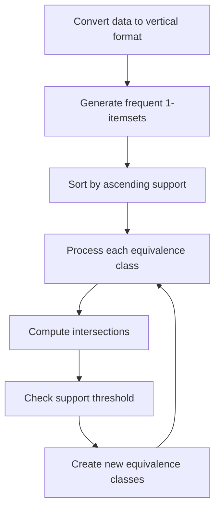

# 🔄 ECLAT Algorithm

<div align="center">


*A Vertical Data Format Approach to Frequent Pattern Mining*

</div>

---

## 📚 Table of Contents

- [What is the ECLAT Algorithm?](#what-is-the-eclat-algorithm)
- [Mathematical Foundation](#mathematical-foundation)
- [How It Works](#how-it-works)
- [Implementation Guide](#implementation-guide)
- [Performance Optimization](#performance-optimization)
- [Evaluation Metrics](#evaluation-metrics)
- [Pros and Cons](#pros-and-cons)
- [Comparisons with Other Algorithms](#comparisons-with-other-algorithms)
- [Real-World Examples](#real-world-examples)
- [Advanced Topics](#advanced-topics)
- [FAQ](#faq)

---

## 🎯 What is the ECLAT Algorithm?

**ECLAT** (Equivalence CLAss Transformation) is a depth-first search algorithm for discovering frequent itemsets in a transaction database. Developed by Mohammed J. Zaki in 2000, ECLAT uses a vertical data format approach, which differs from Apriori's horizontal format, leading to significant performance improvements for many types of datasets.

### Key Characteristics:
- **Vertical Data Format**: Represents data as item-transaction pairs rather than transaction-item pairs
- **Depth-First Search**: Explores the itemset lattice using a depth-first approach
- **Set Intersection**: Uses set intersection operations to compute support efficiently
- **Memory Efficient**: Often requires less memory than breadth-first approaches
- **Faster Performance**: Generally faster than Apriori, especially for sparse datasets
- **No Candidate Generation**: Avoids the costly candidate generation step of Apriori

### The Goal:
Like other frequent itemset mining algorithms, ECLAT aims to discover itemsets that occur frequently in a transaction database, which can then be used to generate association rules, identify patterns, and extract insights from data.

---

## 🧮 Mathematical Foundation

### Core Concepts and Definitions

1. **Transaction Database**: A set of transactions D = {T₁, T₂, ..., Tₙ}, where each transaction Tᵢ is a set of items.

2. **Vertical TID-list**: For an itemset X, the vertical TID-list, denoted as t(X), is the set of transaction IDs in which X appears:
   ```
   t(X) = {i | X ⊆ Tᵢ, Tᵢ ∈ D}
   ```

3. **Support**: The support of an itemset X is defined as the number of transactions containing X, which in the vertical representation is simply the size of its TID-list:
   ```
   support(X) = |t(X)| / |D|
   ```

4. **Frequent Itemset**: An itemset X is considered frequent if its support is greater than or equal to a user-defined minimum support threshold:
   ```
   X is frequent iff support(X) ≥ min_support
   ```

5. **Set Intersection Property**: For itemsets X and Y, the TID-list of their union is the intersection of their individual TID-lists:
   ```
   t(X ∪ Y) = t(X) ∩ t(Y)
   ```

6. **Equivalence Class**: A collection of itemsets that share a common prefix in a lexicographic ordering. ECLAT processes these equivalence classes one by one.

### Itemset Lattice Structure

The search space of all possible itemsets forms a lattice structure. With n unique items, there are 2ⁿ possible itemsets. ECLAT traverses this lattice using depth-first search, moving from smaller to larger itemsets within each equivalence class.

### Mathematical Formulation

1. **Initialization**: For each item i in the database, compute its TID-list:
   ```
   t(i) = {j | i ∈ Tⱼ, Tⱼ ∈ D}
   ```

2. **Frequent 1-itemsets**: Filter items based on support:
   ```
   L₁ = {i | |t(i)| / |D| ≥ min_support}
   ```

3. **Recursive Generation**: For each equivalence class [P] with prefix P:
   - For each pair of items X and Y in [P]:
     - Form a new itemset Z = X ∪ Y
     - Compute t(Z) = t(X) ∩ t(Y)
     - If |t(Z)| / |D| ≥ min_support, add Z to frequent itemsets
     - Create a new equivalence class with Z as prefix and recurse

### Example Calculation

Consider a transaction database with 5 transactions:

| Transaction ID | Items |
|----------------|-------|
| 1 | A, B, D |
| 2 | A, C |
| 3 | B, C |
| 4 | A, B, C |
| 5 | B, D |

The vertical TID-lists would be:
- t(A) = {1, 2, 4}
- t(B) = {1, 3, 4, 5}
- t(C) = {2, 3, 4}
- t(D) = {1, 5}

For min_support = 0.4 (40%), the frequent 1-itemsets are:
- support(A) = 3/5 = 0.6 ✓
- support(B) = 4/5 = 0.8 ✓
- support(C) = 3/5 = 0.6 ✓
- support(D) = 2/5 = 0.4 ✓

For 2-itemsets:
- t(A ∪ B) = t(A) ∩ t(B) = {1, 4} → support(A,B) = 2/5 = 0.4 ✓
- t(A ∪ C) = t(A) ∩ t(C) = {2, 4} → support(A,C) = 2/5 = 0.4 ✓
- t(A ∪ D) = t(A) ∩ t(D) = {1} → support(A,D) = 1/5 = 0.2 ✗
- t(B ∪ C) = t(B) ∩ t(C) = {3, 4} → support(B,C) = 2/5 = 0.4 ✓
- t(B ∪ D) = t(B) ∩ t(D) = {1, 5} → support(B,D) = 2/5 = 0.4 ✓
- t(C ∪ D) = t(C) ∩ t(D) = {} → support(C,D) = 0/5 = 0 ✗

And so on for larger itemsets.

---

## ⚙️ How It Works

The ECLAT algorithm follows a depth-first search approach to efficiently discover frequent itemsets:

<div align="center">



</div>

### Step-by-Step Process:

1. **Transform the data to vertical format**:
   - For each item, create a list of transaction IDs where the item appears

2. **Generate frequent 1-itemsets**:
   - Count the support for each item (length of its TID-list)
   - Keep only items meeting the minimum support threshold

3. **Sort items by frequency** (ascending or descending):
   - This ordering affects the efficiency but not the correctness

4. **Process each equivalence class recursively**:
   - Start with single-item equivalence classes
   - For each equivalence class, generate larger itemsets by intersecting TID-lists
   - Check if new itemsets meet the minimum support threshold
   - If yes, add to frequent itemsets and create new equivalence classes

5. **Output frequent itemsets**:
   - Return all discovered itemsets that meet the minimum support threshold

### Python Implementation:

```python
def eclat(transactions, min_support):
    """
    Implementation of the ECLAT algorithm.
    
    Parameters:
    -----------
    transactions : list of sets
        The transaction database, where each transaction is a set of items
    min_support : float
        Minimum support threshold (between 0 and 1)
    
    Returns:
    --------
    dict
        Dictionary of frequent itemsets with their supports
    """
    # Convert to vertical representation (item: set of transaction IDs)
    vertical_db = {}
    for tid, transaction in enumerate(transactions):
        for item in transaction:
            if item not in vertical_db:
                vertical_db[item] = set()
            vertical_db[item].add(tid)
    
    # Filter items based on minimum support
    n_transactions = len(transactions)
    min_count = min_support * n_transactions
    
    # Keep only frequent items
    vertical_db = {item: tidset for item, tidset in vertical_db.items() 
                  if len(tidset) >= min_count}
    
    # Sort items by support (ascending)
    items = sorted(vertical_db.keys(), key=lambda item: len(vertical_db[item]))
    
    # Initialize result with frequent 1-itemsets
    frequent_itemsets = {frozenset([item]): len(tidset) / n_transactions 
                        for item, tidset in vertical_db.items()}
    
    # Recursive ECLAT function
    def eclat_recursive(prefix, items, tidsets):
        for i in range(len(items)):
            # Create new itemset by adding items[i] to prefix
            current_itemset = prefix.union([items[i]])
            current_tidset = tidsets[i]
            
            # Add to frequent itemsets
            frequent_itemsets[frozenset(current_itemset)] = len(current_tidset) / n_transactions
            
            # Create new items and tidsets for recursion
            new_items = items[i+1:]
            new_tidsets = []
            
            for j in range(i+1, len(items)):
                # Calculate intersection of tidsets
                new_tidset = current_tidset.intersection(tidsets[j])
                
                # Only proceed if the new itemset is frequent
                if len(new_tidset) >= min_count:
                    new_items.append(items[j])
                    new_tidsets.append(new_tidset)
            
            # Recurse if there are any frequent extensions
            if new_items:
                eclat_recursive(current_itemset, new_items, new_tidsets)
    
    # Start the recursion with empty prefix
    eclat_recursive(set(), items, [vertical_db[item] for item in items])
    
    return frequent_itemsets
```

### Extended Example:

Let's visualize how ECLAT processes the transaction database from earlier:

Initial TID-lists:
- t(A) = {1, 2, 4}
- t(B) = {1, 3, 4, 5}
- t(C) = {2, 3, 4}
- t(D) = {1, 5}

1. **Start with single-item equivalence classes**:
   - Sort by support: [D, A, C, B] (ascending)

2. **Process equivalence class [D]**:
   - Combine D with A: t(D) ∩ t(A) = {1} → support(D,A) = 0.2 ✗
   - Combine D with C: t(D) ∩ t(C) = {} → support(D,C) = 0 ✗
   - Combine D with B: t(D) ∩ t(B) = {1, 5} → support(D,B) = 0.4 ✓
     - No further extensions (D,B) has no frequent extensions

3. **Process equivalence class [A]**:
   - Combine A with C: t(A) ∩ t(C) = {2, 4} → support(A,C) = 0.4 ✓
     - No further extensions
   - Combine A with B: t(A) ∩ t(B) = {1, 4} → support(A,B) = 0.4 ✓
     - Combine (A,B) with C: t(A,B) ∩ t(C) = {4} → support(A,B,C) = 0.2 ✗

4. **Process equivalence class [C]**:
   - Combine C with B: t(C) ∩ t(B) = {3, 4} → support(C,B) = 0.4 ✓
     - No further extensions

5. **Process equivalence class [B]**:
   - B is the last item, no more combinations to check

6. **Output frequent itemsets**:
   - 1-itemsets: {A}, {B}, {C}, {D}
   - 2-itemsets: {A,B}, {A,C}, {B,C}, {B,D}
   - No frequent 3-itemsets or larger

This depth-first approach efficiently finds all frequent itemsets by leveraging the vertical data format and set intersections.

---

## 💻 Implementation Guide

### From Scratch Implementation

Here's a detailed implementation of the ECLAT algorithm with comprehensive comments:

```python
class Eclat:
    """
    ECLAT (Equivalence CLAss Transformation) algorithm for frequent itemset mining.
    
    Parameters:
    -----------
    min_support : float, default=0.1
        The minimum support threshold (between 0 and 1)
    min_confidence : float, default=0.5
        The minimum confidence threshold for association rules (between 0 and 1)
    verbose : bool, default=False
        Whether to print progress information
    """
    
    def __init__(self, min_support=0.1, min_confidence=0.5, verbose=False):
        self.min_support = min_support
        self.min_confidence = min_confidence
        self.verbose = verbose
        self.frequent_itemsets_ = {}
        self.item_tidsets_ = {}
        self.n_transactions_ = 0
        self.rules_ = []
        
    def fit(self, transactions):
        """
        Apply the ECLAT algorithm to find frequent itemsets.
        
        Parameters:
        -----------
        transactions : list of sets/lists
            The transaction database, where each transaction is a set/list of items
            
        Returns:
        --------
        self : object
            Returns self
        """
        self.n_transactions_ = len(transactions)
        min_count = self.min_support * self.n_transactions_
        
        # Step 1: Convert to vertical representation
        if self.verbose:
            print("Converting to vertical representation...")
            
        self.item_tidsets_ = {}
        for tid, transaction in enumerate(transactions):
            for item in transaction:
                if item not in self.item_tidsets_:
                    self.item_tidsets_[item] = set()
                self.item_tidsets_[item].add(tid)
        
        # Step 2: Filter items based on minimum support
        self.item_tidsets_ = {item: tidset for item, tidset in self.item_tidsets_.items() 
                             if len(tidset) >= min_count}
        
        if self.verbose:
            print(f"Found {len(self.item_tidsets_)} frequent 1-itemsets")
        
        # Step 3: Sort items by support (ascending)
        items = sorted(self.item_tidsets_.keys(), key=lambda item: len(self.item_tidsets_[item]))
        
        # Step 4: Initialize frequent itemsets with 1-itemsets
        self.frequent_itemsets_ = {frozenset([item]): len(tidset) / self.n_transactions_ 
                                  for item, tidset in self.item_tidsets_.items()}
        
        # Step 5: Apply recursive ECLAT
        if self.verbose:
            print("Starting recursive ECLAT mining...")
            
        tidsets = [self.item_tidsets_[item] for item in items]
        self._eclat_recursive(set(), items, tidsets, min_count)
        
        if self.verbose:
            print(f"Found a total of {len(self.frequent_itemsets_)} frequent itemsets")
            
        return self
    
    def _eclat_recursive(self, prefix, items, tidsets, min_count):
        """
        Recursive method to find frequent itemsets using depth-first search.
        
        Parameters:
        -----------
        prefix : set
            Current prefix itemset
        items : list
            List of candidate items to extend prefix
        tidsets : list
            List of transaction ID sets for each item
        min_count : int
            Minimum count threshold
        """
        for i in range(len(items)):
            # Create new itemset by adding items[i] to prefix
            current_item = items[i]
            current_itemset = prefix.union([current_item])
            current_tidset = tidsets[i]
            
            # Add to frequent itemsets
            self.frequent_itemsets_[frozenset(current_itemset)] = len(current_tidset) / self.n_transactions_
            
            # Create new items and tidsets for recursion
            new_items = []
            new_tidsets = []
            
            for j in range(i+1, len(items)):
                # Calculate intersection of tidsets
                new_tidset = current_tidset.intersection(tidsets[j])
                
                # Only proceed if the new itemset is frequent
                if len(new_tidset) >= min_count:
                    new_items.append(items[j])
                    new_tidsets.append(new_tidset)
            
            # Recurse if there are any frequent extensions
            if new_items:
                self._eclat_recursive(current_itemset, new_items, new_tidsets, min_count)
    
    def get_frequent_itemsets(self):
        """
        Return the discovered frequent itemsets.
        
        Returns:
        --------
        DataFrame or dict
            The frequent itemsets with their support values
        """
        if not self.frequent_itemsets_:
            return None
            
        # If pandas is available, return as DataFrame
        try:
            import pandas as pd
            
            # Convert to DataFrame
            itemsets = []
            for itemset, support in self.frequent_itemsets_.items():
                itemsets.append({
                    'itemset': set(itemset),
                    'support': support,
                    'length': len(itemset)
                })
                
            return pd.DataFrame(itemsets)
        except ImportError:
            # Return as dictionary if pandas is not available
            return self.frequent_itemsets_
    
    def generate_rules(self, min_confidence=None):
        """
        Generate association rules from frequent itemsets.
        
        Parameters:
        -----------
        min_confidence : float, optional
            The minimum confidence threshold. If None, the value passed during initialization is used.
            
        Returns:
        --------
        list or DataFrame
            The generated association rules with their metrics
        """
        if min_confidence is None:
            min_confidence = self.min_confidence
            
        self.rules_ = []
        
        # Generate rules from frequent itemsets
        for itemset, support in self.frequent_itemsets_.items():
            if len(itemset) < 2:
                continue  # Skip 1-itemsets
                
            # Get all non-empty proper subsets of itemset
            subsets = []
            for i in range(1, len(itemset)):
                from itertools import combinations
                subsets.extend(combinations(itemset, i))
            
            # Generate rules from subsets
            for subset in subsets:
                subset = frozenset(subset)
                antecedent = subset
                consequent = frozenset(itemset - subset)
                
                if antecedent in self.frequent_itemsets_ and consequent:
                    confidence = support / self.frequent_itemsets_[antecedent]
                    
                    if confidence >= min_confidence:
                        # Calculate lift
                        consequent_support = self.frequent_itemsets_.get(consequent, 0)
                        lift = confidence / consequent_support if consequent_support > 0 else float('inf')
                        
                        # Calculate conviction
                        conviction = (1 - consequent_support) / (1 - confidence) if confidence < 1 else float('inf')
                        
                        # Add rule to results
                        self.rules_.append({
                            'antecedent': set(antecedent),
                            'consequent': set(consequent),
                            'support': support,
                            'confidence': confidence,
                            'lift': lift,
                            'conviction': conviction
                        })
        
        # If pandas is available, return as DataFrame
        try:
            import pandas as pd
            return pd.DataFrame(self.rules_)
        except ImportError:
            return self.rules_

    def get_support(self, itemset):
        """
        Get the support value for a specific itemset.
        
        Parameters:
        -----------
        itemset : set, list, or frozenset
            The itemset to look up
            
        Returns:
        --------
        float
            The support value of the itemset, or 0 if not found
        """
        itemset = frozenset(itemset)
        return self.frequent_itemsets_.get(itemset, 0)
```

### Using the Implementation

Here's how to use the implementation:

```python
# Example usage
transactions = [
    {'bread', 'milk'},
    {'bread', 'diaper', 'beer', 'eggs'},
    {'milk', 'diaper', 'beer', 'cola'},
    {'bread', 'milk', 'diaper', 'beer'},
    {'bread', 'milk', 'diaper', 'cola'}
]

# Create and apply ECLAT
eclat = Eclat(min_support=0.4, min_confidence=0.6, verbose=True)
eclat.fit(transactions)

# Get frequent itemsets
frequent_itemsets = eclat.get_frequent_itemsets()
print("\nFrequent Itemsets:")
print(frequent_itemsets)

# Generate association rules
rules = eclat.generate_rules()
print("\nAssociation Rules:")
print(rules)

# Analyze rules
if len(rules) > 0:
    # Sort rules by lift
    rules_sorted = rules.sort_values('lift', ascending=False)
    print("\nTop rules by lift:")
    print(rules_sorted.head())
```

### Complete Working Example

Here's a comprehensive example using the ECLAT implementation:

```python
import numpy as np
import matplotlib.pyplot as plt
import time
from itertools import combinations

# ECLAT implementation (as defined above)
# ...

# Generate synthetic transaction data
np.random.seed(42)
n_transactions = 1000
n_items = 100

# Create items with different frequencies
item_frequencies = np.random.power(0.5, n_items)
item_frequencies /= item_frequencies.sum()

# Generate transactions
transactions = []
for _ in range(n_transactions):
    # Determine number of items in this transaction (1 to 10)
    n_items_in_transaction = np.random.randint(1, 11)
    
    # Select items based on their frequencies
    items = np.random.choice(
        range(n_items),
        size=min(n_items_in_transaction, n_items),
        replace=False,
        p=item_frequencies
    )
    
    # Convert item indices to strings for better readability
    transaction = {f'item_{i}' for i in items}
    transactions.append(transaction)

# Print example transactions
print("Sample transactions:")
for i, transaction in enumerate(transactions[:5]):
    print(f"Transaction {i+1}: {transaction}")

# Calculate transaction statistics
transaction_sizes = [len(t) for t in transactions]
print(f"\nAverage transaction size: {np.mean(transaction_sizes):.2f} items")
print(f"Min transaction size: {min(transaction_sizes)} items")
print(f"Max transaction size: {max(transaction_sizes)} items")

# Benchmark ECLAT with different support thresholds
support_thresholds = [0.1, 0.05, 0.02, 0.01]
benchmark_results = []

for min_support in support_thresholds:
    print(f"\nMining with minimum support: {min_support}")
    
    # Start timer
    start_time = time.time()
    
    # Create and run ECLAT
    eclat = Eclat(min_support=min_support, verbose=True)
    eclat.fit(transactions)
    
    # Generate rules
    rules = eclat.generate_rules(min_confidence=0.5)
    
    # Record time
    end_time = time.time()
    execution_time = end_time - start_time
    
    # Get frequent itemsets by length
    frequent_itemsets = eclat.get_frequent_itemsets()
    itemset_counts = frequent_itemsets.groupby('length').size()
    
    # Record results
    benchmark_results.append({
        'min_support': min_support,
        'n_frequent_itemsets': len(frequent_itemsets),
        'n_rules': len(rules) if isinstance(rules, list) or hasattr(rules, '__len__') else 0,
        'execution_time': execution_time,
        'itemset_counts': itemset_counts
    })
    
    print(f"Found {len(frequent_itemsets)} frequent itemsets in {execution_time:.2f} seconds")
    if hasattr(rules, '__len__'):
        print(f"Generated {len(rules)} association rules")

# Visualize benchmark results
plt.figure(figsize=(15, 10))

# Plot execution time vs support threshold
plt.subplot(2, 2, 1)
times = [result['execution_time'] for result in benchmark_results]
plt.plot(support_thresholds, times, 'o-', color='blue')
plt.xlabel('Minimum Support')
plt.ylabel('Execution Time (seconds)')
plt.title('ECLAT Performance vs. Support Threshold')
plt.grid(True, alpha=0.3)

# Plot number of frequent itemsets vs support threshold
plt.subplot(2, 2, 2)
n_itemsets = [result['n_frequent_itemsets'] for result in benchmark_results]
plt.plot(support_thresholds, n_itemsets, 'o-', color='green')
plt.xlabel('Minimum Support')
plt.ylabel('Number of Frequent Itemsets')
plt.title('Frequent Itemsets vs. Support Threshold')
plt.grid(True, alpha=0.3)

# Plot distribution of itemset sizes for lowest support threshold
plt.subplot(2, 2, 3)
if benchmark_results:
    itemset_counts = benchmark_results[-1]['itemset_counts']
    plt.bar(itemset_counts.index, itemset_counts.values, color='purple')
    plt.xlabel('Itemset Size')
    plt.ylabel('Count')
    plt.title(f'Frequent Itemset Size Distribution (min_support={support_thresholds[-1]})')
    plt.grid(True, axis='y', alpha=0.3)

# Plot number of rules vs support threshold
plt.subplot(2, 2, 4)
n_rules = [result['n_rules'] for result in benchmark_results]
plt.plot(support_thresholds, n_rules, 'o-', color='red')
plt.xlabel('Minimum Support')
plt.ylabel('Number of Association Rules')
plt.title('Association Rules vs. Support Threshold')
plt.grid(True, alpha=0.3)

plt.tight_layout()
plt.show()

# Analyze top rules from the lowest support threshold run
if benchmark_results and benchmark_results[-1]['n_rules'] > 0:
    rules = eclat.generate_rules(min_confidence=0.5)
    
    if hasattr(rules, 'sort_values'):
        # Sort by lift
        top_rules = rules.sort_values('lift', ascending=False).head(10)
        
        print("\nTop 10 rules by lift:")
        for i, (_, rule) in enumerate(top_rules.iterrows(), 1):
            antecedent = ', '.join(rule['antecedent'])
            consequent = ', '.join(rule['consequent'])
            print(f"{i}. {antecedent} → {consequent}")
            print(f"   Support: {rule['support']:.3f}, Confidence: {rule['confidence']:.3f}, Lift: {rule['lift']:.3f}")
```

### Using External Libraries

While dedicated ECLAT implementations are less common than Apriori implementations, we can use some Python libraries that offer similar functionality or adapt existing implementations:

#### With PyFIM

PyFIM is a Python interface to the FIMI (Frequent Itemset Mining Implementations) library, which includes ECLAT:

```python
# Note: PyFIM needs to be installed with: pip install pyfim
import fim

def run_eclat_with_pyfim(transactions, min_support):
    """
    Run ECLAT algorithm using PyFIM.
    
    Parameters:
    -----------
    transactions : list of lists
        The transaction database
    min_support : float
        Minimum support threshold (between 0 and 1)
    
    Returns:
    --------
    list
        List of tuples (itemset, support)
    """
    # Convert support from fraction to percentage
    min_support_pct = min_support * 100
    
    # Run ECLAT
    patterns = fim.eclat(transactions, supp=min_support_pct, report='a')
    
    # Convert support back to fraction
    return [(tuple(p[0]), p[1]/100) for p in patterns]

# Example usage
transactions_list = [list(t) for t in transactions]  # Convert sets to lists
frequent_patterns = run_eclat_with_pyfim(transactions_list, 0.01)

print("\nFrequent itemsets found with PyFIM:")
for itemset, support in frequent_patterns[:10]:  # Show first 10
    print(f"Itemset: {itemset}, Support: {support:.3f}")
```

#### With PAMI (Pattern Mining)

PAMI is a Python library for pattern mining:

```python
# Note: PAMI needs to be installed with: pip install PAMI
from PAMI.eclat.basic import ECLAT

def run_eclat_with_pami(transactions, min_support):
    """
    Run ECLAT algorithm using PAMI.
    
    Parameters:
    -----------
    transactions : list of sets or lists
        The transaction database
    min_support : float
        Minimum support threshold (between 0 and 1)
    
    Returns:
    --------
    dict
        Dictionary of patterns with their support
    """
    # Convert transactions to required format (list of lists)
    if isinstance(transactions[0], set):
        transactions = [list(t) for t in transactions]
    
    # Convert to string format as required by PAMI
    string_transactions = []
    for t in transactions:
        string_transactions.append(' '.join(map(str, t)))
    
    # Write to temporary file
    import tempfile
    with tempfile.NamedTemporaryFile(mode='w', delete=False) as f:
        for t in string_transactions:
            f.write(t + '\n')
        temp_file = f.name
    
    # Initialize and run ECLAT
    min_support_count = int(min_support * len(transactions))
    eclat_obj = ECLAT(iFile=temp_file, minSup=min_support_count, sep=' ')
    eclat_obj.mine()
    
    # Get patterns and convert support to fraction
    patterns = eclat_obj.getPatterns()
    result = {tuple(pattern.split()): support/len(transactions) 
             for pattern, support in patterns.items()}
    
    # Clean up temporary file
    import os
    os.unlink(temp_file)
    
    return result

# Example usage
patterns = run_eclat_with_pami(transactions, 0.01)

print("\nFrequent itemsets found with PAMI:")
for i, (itemset, support) in enumerate(list(patterns.items())[:10]):  # Show first 10
    print(f"Itemset: {itemset}, Support: {support:.3f}")
```

#### Custom Vectorized Implementation

For better performance, we can implement a more vectorized version of ECLAT:

```python
import numpy as np
from collections import defaultdict
from itertools import combinations

def vectorized_eclat(transactions, min_support):
    """
    A more vectorized implementation of ECLAT.
    
    Parameters:
    -----------
    transactions : list of sets
        The transaction database
    min_support : float
        Minimum support threshold (between 0 and 1)
    
    Returns:
    --------
    dict
        Dictionary of frequent itemsets with their supports
    """
    # Convert to vertical format
    vertical_db = defaultdict(set)
    for tid, transaction in enumerate(transactions):
        for item in transaction:
            vertical_db[item].add(tid)
    
    # Convert to NumPy arrays for faster processing
    items = []
    tidsets = []
    
    for item, tidset in vertical_db.items():
        items.append(item)
        tidsets.append(np.array(list(tidset), dtype=int))
    
    # Calculate minimum count
    n_transactions = len(transactions)
    min_count = min_support * n_transactions
    
    # Filter items based on support
    filtered_items = []
    filtered_tidsets = []
    
    for i, tidset in enumerate(tidsets):
        if len(tidset) >= min_count:
            filtered_items.append(items[i])
            filtered_tidsets.append(tidset)
    
    # Initialize result with frequent 1-itemsets
    result = {frozenset([item]): len(tidset)/n_transactions 
             for item, tidset in zip(filtered_items, filtered_tidsets)}
    
    # Sort by support (ascending)
    sorted_indices = np.argsort([len(tidset) for tidset in filtered_tidsets])
    sorted_items = [filtered_items[i] for i in sorted_indices]
    sorted_tidsets = [filtered_tidsets[i] for i in sorted_indices]
    
    # Define recursive function for DFS
    def eclat_dfs(prefix, items, tidsets):
        for i in range(len(items)):
            # Create new itemset
            current_itemset = prefix + [items[i]]
            current_tidset = tidsets[i]
            
            # Add to result
            result[frozenset(current_itemset)] = len(current_tidset)/n_transactions
            
            # Create new candidates
            new_items = []
            new_tidsets = []
            
            for j in range(i+1, len(items)):
                # Calculate intersection using NumPy's intersect1d
                new_tidset = np.intersect1d(current_tidset, tidsets[j], assume_unique=True)
                
                if len(new_tidset) >= min_count:
                    new_items.append(items[j])
                    new_tidsets.append(new_tidset)
            
            if new_items:
                eclat_dfs(current_itemset, new_items, new_tidsets)
    
    # Start DFS with empty prefix
    eclat_dfs([], sorted_items, sorted_tidsets)
    
    return result

# Example usage
result = vectorized_eclat(transactions, 0.01)

print("\nFrequent itemsets found with vectorized ECLAT:")
for i, (itemset, support) in enumerate(list(result.items())[:10]):  # Show first 10
    print(f"Itemset: {itemset}, Support: {support:.3f}")
```

---

## 🚀 Performance Optimization

ECLAT is already more efficient than Apriori in many cases, but several optimization techniques can further improve its performance:

### 1. **Diffset Optimization**

Instead of storing TID-lists directly, store the difference between parent and child TID-lists to save memory:

```python
class DiffsetEclat:
    """
    Implementation of ECLAT with diffsets optimization.
    
    Parameters:
    -----------
    min_support : float, default=0.1
        Minimum support threshold
    """
    
    def __init__(self, min_support=0.1):
        self.min_support = min_support
        self.frequent_itemsets_ = {}
        self.n_transactions_ = 0
        self.item_tidsets_ = {}
    
    def fit(self, transactions):
        """Apply ECLAT with diffsets to find frequent itemsets."""
        self.n_transactions_ = len(transactions)
        min_count = self.min_support * self.n_transactions_
        
        # Step 1: Convert to vertical representation
        for tid, transaction in enumerate(transactions):
            for item in transaction:
                if item not in self.item_tidsets_:
                    self.item_tidsets_[item] = set()
                self.item_tidsets_[item].add(tid)
        
        # Step 2: Filter items based on support
        self.item_tidsets_ = {item: tidset for item, tidset in self.item_tidsets_.items() 
                             if len(tidset) >= min_count}
        
        # Initialize result with frequent 1-itemsets
        self.frequent_itemsets_ = {frozenset([item]): len(tidset) / self.n_transactions_ 
                                  for item, tidset in self.item_tidsets_.items()}
        
        # Step 3: Sort items by support (ascending)
        items = sorted(self.item_tidsets_.keys(), key=lambda item: len(self.item_tidsets_[item]))
        
        # Step 4: Apply diffset-based ECLAT
        # For the first level, use regular TID-lists
        tidsets = [self.item_tidsets_[item] for item in items]
        
        # Recursive DFS with diffsets
        self._eclat_diffset_recursive([], items, tidsets, min_count)
        
        return self
    
    def _eclat_diffset_recursive(self, prefix, items, tidsets, min_count):
        """Recursive method with diffsets optimization."""
        for i in range(len(items)):
            # Create new itemset
            current_item = items[i]
            current_itemset = prefix + [current_item]
            current_tidset = tidsets[i]
            
            # Record in frequent itemsets
            self.frequent_itemsets_[frozenset(current_itemset)] = len(current_tidset) / self.n_transactions_
            
            # Create new candidates
            new_items = []
            new_diffsets = []  # Now using diffsets instead of full tidsets
            
            for j in range(i+1, len(items)):
                if not prefix:  # First level - calculate regular intersection
                    new_tidset = current_tidset.intersection(tidsets[j])
                    
                    if len(new_tidset) >= min_count:
                        new_items.append(items[j])
                        new_diffsets.append(tidsets[j] - current_tidset)  # Store diffset
                else:
                    # Use diffsets for calculation
                    # Diffset of P ∪ {j} = diffset of P ∪ {i} - (tidset of P ∪ {i} - tidset of P ∪ {j})
                    new_diffset = tidsets[j] - (current_tidset - tidsets[j])
                    
                    # Calculate support using diffset
                    support_count = self.n_transactions_ - len(new_diffset)
                    
                    if support_count >= min_count:
                        new_items.append(items[j])
                        new_diffsets.append(new_diffset)
            
            if new_items:
                self._eclat_diffset_recursive(current_itemset, new_items, new_diffsets, min_count)
```

### 2. **Tidset Pruning**

Early pruning of transaction ID sets can significantly reduce computation:

```python
def eclat_with_pruning(transactions, min_support):
    """
    ECLAT with transaction set pruning.
    
    Parameters:
    -----------
    transactions : list of sets
        The transaction database
    min_support : float
        Minimum support threshold
        
    Returns:
    --------
    dict
        Dictionary of frequent itemsets with their supports
    """
    # Convert to vertical representation
    vertical_db = {}
    for tid, transaction in enumerate(transactions):
        for item in transaction:
            if item not in vertical_db:
                vertical_db[item] = set()
            vertical_db[item].add(tid)
    
    # Calculate minimum count
    n_transactions = len(transactions)
    min_count = min_support * n_transactions
    
    # Filter items based on support
    vertical_db = {item: tidset for item, tidset in vertical_db.items() 
                  if len(tidset) >= min_count}
    
    # Initialize result
    frequent_itemsets = {frozenset([item]): len(tidset) / n_transactions 
                        for item, tidset in vertical_db.items()}
    
    # Sort items by support (ascending)
    items = sorted(vertical_db.keys(), key=lambda item: len(vertical_db[item]))
    
    # Calculate 2-itemset supports for pruning
    supports_2 = {}
    for i in range(len(items)):
        for j in range(i+1, len(items)):
            pair = frozenset([items[i], items[j]])
            intersection = vertical_db[items[i]].intersection(vertical_db[items[j]])
            support = len(intersection) / n_transactions
            
            if support >= min_support:
                supports_2[pair] = support
                frequent_itemsets[pair] = support
    
    # Recursive DFS with pruning
    def eclat_pruned_dfs(prefix, items, tidsets):
        for i in range(len(items)):
            # Create new itemset
            current_itemset = prefix + [items[i]]
            current_tidset = tidsets[i]
            
            # Only proceed if all 2-item subsets are frequent (pruning)
            if len(current_itemset) > 2:
                all_subsets_frequent = True
                for j in range(len(current_itemset)):
                    for k in range(j+1, len(current_itemset)):
                        subset = frozenset([current_itemset[j], current_itemset[k]])
                        if subset not in supports_2:
                            all_subsets_frequent = False
                            break
                    if not all_subsets_frequent:
                        break
                        
                if not all_subsets_frequent:
                    continue
            
            # Create new candidates
            new_items = []
            new_tidsets = []
            
            for j in range(i+1, len(items)):
                # First check if the 2-itemset is frequent (early pruning)
                pair = frozenset([items[i], items[j]])
                if pair not in supports_2:
                    continue
                    
                # Calculate intersection
                new_tidset = current_tidset.intersection(tidsets[j])
                
                if len(new_tidset) >= min_count:
                    new_items.append(items[j])
                    new_tidsets.append(new_tidset)
            
            if new_items:
                # Add current itemset to results
                if len(current_itemset) > 2:  # 2-itemsets already added
                    frequent_itemsets[frozenset(current_itemset)] = len(current_tidset) / n_transactions
                
                # Recurse
                eclat_pruned_dfs(current_itemset, new_items, new_tidsets)
    
    # Start recursion for itemsets of size >= 3
    for i in range(len(items)):
        # Only process items that appear in at least one frequent 2-itemset
        has_frequent_pairs = False
        for j in range(len(items)):
            if i != j:
                pair = frozenset([items[i], items[j]])
                if pair in supports_2:
                    has_frequent_pairs = True
                    break
        
        if has_frequent_pairs:
            eclat_pruned_dfs([items[i]], [items[j] for j in range(i+1, len(items)) if frozenset([items[i], items[j]]) in supports_2],
                           [vertical_db[items[j]] for j in range(i+1, len(items)) if frozenset([items[i], items[j]]) in supports_2])
    
    return frequent_itemsets
```

### 3. **Bit Vector Implementation**

Using bit vectors for TID-lists can significantly improve performance:

```python
def eclat_with_bitvectors(transactions, min_support):
    """
    ECLAT implementation using bit vectors for faster set operations.
    
    Parameters:
    -----------
    transactions : list of sets
        The transaction database
    min_support : float
        Minimum support threshold
        
    Returns:
    --------
    dict
        Dictionary of frequent itemsets with their supports
    """
    import numpy as np
    from bitarray import bitarray  # pip install bitarray
    
    # Convert to vertical representation with bit vectors
    n_transactions = len(transactions)
    min_count = min_support * n_transactions
    
    # Create bit vectors for each item
    vertical_db = {}
    for tid, transaction in enumerate(transactions):
        for item in transaction:
            if item not in vertical_db:
                vertical_db[item] = bitarray(n_transactions)
                vertical_db[item].setall(0)
            vertical_db[item][tid] = 1
    
    # Filter items based on support
    vertical_db = {item: bits for item, bits in vertical_db.items() 
                  if bits.count() >= min_count}
    
    # Initialize result
    frequent_itemsets = {frozenset([item]): bits.count() / n_transactions 
                        for item, bits in vertical_db.items()}
    
    # Sort items by support (ascending)
    items = sorted(vertical_db.keys(), key=lambda item: vertical_db[item].count())
    
    # Recursive DFS with bit vectors
    def eclat_bits_dfs(prefix, items, bitsets):
        for i in range(len(items)):
            # Create new itemset
            current_itemset = prefix + [items[i]]
            current_bits = bitsets[i]
            current_support = current_bits.count() / n_transactions
            
            # Add to frequent itemsets
            frequent_itemsets[frozenset(current_itemset)] = current_support
            
            # Create new candidates
            new_items = []
            new_bitsets = []
            
            for j in range(i+1, len(items)):
                # Calculate intersection with bit operations (much faster)
                new_bits = bitsets[i] & bitsets[j]
                count = new_bits.count()
                
                if count >= min_count:
                    new_items.append(items[j])
                    new_bitsets.append(new_bits)
            
            if new_items:
                eclat_bits_dfs(current_itemset, new_items, new_bitsets)
    
    # Start DFS with empty prefix
    eclat_bits_dfs([], items, [vertical_db[item] for item in items])
    
    return frequent_itemsets
```

### 4. **Equivalence Class Optimization**

Group items into equivalence classes to reduce the search space:

```python
def eclat_with_equivalence_classes(transactions, min_support):
    """
    ECLAT with equivalence class optimization.
    
    Parameters:
    -----------
    transactions : list of sets
        The transaction database
    min_support : float
        Minimum support threshold
        
    Returns:
    --------
    dict
        Dictionary of frequent itemsets with their supports
    """
    # Convert to vertical representation
    vertical_db = {}
    for tid, transaction in enumerate(transactions):
        for item in transaction:
            if item not in vertical_db:
                vertical_db[item] = set()
            vertical_db[item].add(tid)
    
    n_transactions = len(transactions)
    min_count = min_support * n_transactions
    
    # Filter items based on support
    vertical_db = {item: tidset for item, tidset in vertical_db.items() 
                  if len(tidset) >= min_count}
    
    # Initialize result
    frequent_itemsets = {frozenset([item]): len(tidset) / n_transactions 
                        for item, tidset in vertical_db.items()}
    
    # Create equivalence classes based on first item
    sorted_items = sorted(vertical_db.keys())
    equivalence_classes = []
    
    for item in sorted_items:
        # Each 1-itemset forms its own initial equivalence class
        equivalence_classes.append({
            'prefix': [item],
            'class_items': [],
            'class_tidsets': []
        })
    
    # Process each equivalence class
    for eqcls in equivalence_classes:
        prefix = eqcls['prefix']
        prefix_tidset = vertical_db[prefix[0]]
        
        # Find items that can extend this class
        for item in sorted_items:
            if item <= prefix[0]:
                continue  # Skip items that come before the prefix
            
            # Check if the extension is frequent
            extension_tidset = prefix_tidset.intersection(vertical_db[item])
            
            if len(extension_tidset) >= min_count:
                eqcls['class_items'].append(item)
                eqcls['class_tidsets'].append(extension_tidset)
                
                # Add to frequent itemsets
                extended_itemset = frozenset(prefix + [item])
                frequent_itemsets[extended_itemset] = len(extension_tidset) / n_transactions
        
        # Process extensions recursively
        def process_class(prefix, items, tidsets):
            # Create a new equivalence class for each item
            for i in range(len(items)):
                new_prefix = prefix + [items[i]]
                new_class_items = []
                new_class_tidsets = []
                
                # Find items that can extend this new class
                for j in range(i+1, len(items)):
                    # Calculate intersection
                    new_tidset = tidsets[i].intersection(tidsets[j])
                    
                    if len(new_tidset) >= min_count:
                        new_class_items.append(items[j])
                        new_class_tidsets.append(new_tidset)
                        
                        # Add to frequent itemsets
                        extended_itemset = frozenset(new_prefix + [items[j]])
                        frequent_itemsets[extended_itemset] = len(new_tidset) / n_transactions
                
                # Process this new equivalence class
                if new_class_items:
                    process_class(new_prefix, new_class_items, new_class_tidsets)
        
        # Start processing extensions
        process_class(prefix, eqcls['class_items'], eqcls['class_tidsets'])
    
    return frequent_itemsets
```

### 5. **Parallel Processing**

ECLAT's depth-first nature makes it amenable to parallelization:

```python
def parallel_eclat(transactions, min_support, n_jobs=-1):
    """
    Parallel implementation of ECLAT.
    
    Parameters:
    -----------
    transactions : list of sets
        The transaction database
    min_support : float
        Minimum support threshold
    n_jobs : int, default=-1
        Number of jobs to run in parallel. -1 means using all processors.
        
    Returns:
    --------
    dict
        Dictionary of frequent itemsets with their supports
    """
    from joblib import Parallel, delayed
    import multiprocessing
    
    # Convert to vertical representation
    vertical_db = {}
    for tid, transaction in enumerate(transactions):
        for item in transaction:
            if item not in vertical_db:
                vertical_db[item] = set()
            vertical_db[item].add(tid)
    
    n_transactions = len(transactions)
    min_count = min_support * n_transactions
    
    # Filter items based on support
    vertical_db = {item: tidset for item, tidset in vertical_db.items() 
                  if len(tidset) >= min_count}
    
    # Initialize result with frequent 1-itemsets
    frequent_itemsets = {frozenset([item]): len(tidset) / n_transactions 
                        for item, tidset in vertical_db.items()}
    
    # Sort items by support (ascending)
    items = sorted(vertical_db.keys(), key=lambda item: len(vertical_db[item]))
    
    # Function to process a subtree starting with a prefix
    def process_subtree(prefix, items, tidsets):
        result = {}
        
        for i in range(len(items)):
            # Create new itemset
            current_itemset = prefix + [items[i]]
            current_tidset = tidsets[i]
            current_support = len(current_tidset) / n_transactions
            
            # Add to result
            result[frozenset(current_itemset)] = current_support
            
            # Create new candidates
            new_items = []
            new_tidsets = []
            
            for j in range(i+1, len(items)):
                # Calculate intersection
                new_tidset = current_tidset.intersection(tidsets[j])
                
                if len(new_tidset) >= min_count:
                    new_items.append(items[j])
                    new_tidsets.append(new_tidset)
            
            # Process recursively
            if new_items:
                subtree_result = process_subtree(current_itemset, new_items, new_tidsets)
                result.update(subtree_result)
        
        return result
    
    # Prepare parallel subtree processing
    if n_jobs == -1:
        n_jobs = multiprocessing.cpu_count()
    
    # Create tasks for parallel processing
    tasks = []
    for i, item in enumerate(items):
        # Create a subtree task starting with this item
        prefix = [item]
        subsequent_items = items[i+1:]
        subsequent_tidsets = []
        
        for next_item in subsequent_items:
            tidset = vertical_db[item].intersection(vertical_db[next_item])
            if len(tidset) >= min_count:
                subsequent_tidsets.append(tidset)
            else:
                # Remove items that don't form frequent 2-itemsets
                subsequent_items.remove(next_item)
        
        tasks.append((prefix, subsequent_items, subsequent_tidsets))
    
    # Execute tasks in parallel
    results = Parallel(n_jobs=n_jobs)(
        delayed(process_subtree)(prefix, items, tidsets)
        for prefix, items, tidsets in tasks if items
    )
    
    # Combine results
    for result in results:
        frequent_itemsets.update(result)
    
    return frequent_itemsets
```

### 6. **Memory-Efficient Implementation**

For very large datasets, a memory-efficient implementation can be crucial:

```python
def memory_efficient_eclat(transactions_iterator, min_support):
    """
    Memory-efficient implementation of ECLAT.
    
    Parameters:
    -----------
    transactions_iterator : iterator
        An iterator yielding transactions one at a time
    min_support : float
        Minimum support threshold
        
    Returns:
    --------
    generator
        A generator yielding frequent itemsets
    """
    # First pass: count items and total transactions
    item_counts = {}
    n_transactions = 0
    
    for transaction in transactions_iterator():
        n_transactions += 1
        for item in transaction:
            if item not in item_counts:
                item_counts[item] = 0
            item_counts[item] += 1
    
    # Filter by minimum support
    min_count = min_support * n_transactions
    frequent_items = {item: count for item, count in item_counts.items() 
                     if count >= min_count}
    
    # Yield frequent 1-itemsets
    for item, count in frequent_items.items():
        yield (frozenset([item]), count / n_transactions)
    
    # If there's only one item, we're done
    if len(frequent_items) <= 1:
        return
    
    # Second pass: build vertical database
    vertical_db = {item: set() for item in frequent_items}
    
    # Reset iterator and process transactions again
    for tid, transaction in enumerate(transactions_iterator()):
        for item in transaction:
            if item in vertical_db:
                vertical_db[item].add(tid)
    
    # Sort items by frequency
    sorted_items = sorted(vertical_db.keys(), key=lambda x: len(vertical_db[x]))
    
    # Process each prefix (starting from 1-itemset)
    for i, item in enumerate(sorted_items):
        # Create prefix
        prefix = [item]
        prefix_tidset = vertical_db[item]
        
        # Find extensions
        extensions = []
        for j in range(i+1, len(sorted_items)):
            next_item = sorted_items[j]
            intersection = prefix_tidset.intersection(vertical_db[next_item])
            
            if len(intersection) >= min_count:
                extensions.append((next_item, intersection))
        
        # Process extensions recursively
        def process_extensions(prefix, extensions):
            for item, tidset in extensions:
                # Create new itemset
                new_prefix = prefix + [item]
                new_itemset = frozenset(new_prefix)
                support = len(tidset) / n_transactions
                
                # Yield this itemset
                yield (new_itemset, support)
                
                # Find further extensions
                new_extensions = []
                for next_item, next_tidset in extensions:
                    if next_item > item:  # Ensure lexicographic order
                        intersection = tidset.intersection(next_tidset)
                        
                        if len(intersection) >= min_count:
                            new_extensions.append((next_item, intersection))
                
                # Process further extensions
                if new_extensions:
                    yield from process_extensions(new_prefix, new_extensions)
        
        # Start processing extensions for this prefix
        if extensions:
            yield from process_extensions(prefix, extensions)
```

### 7. **Support Counting Optimization**

Optimize support counting for sparse datasets:

```python
def eclat_with_support_counting_optimization(transactions, min_support):
    """
    ECLAT with optimized support counting for sparse datasets.
    
    Parameters:
    -----------
    transactions : list of sets
        The transaction database
    min_support : float
        Minimum support threshold
        
    Returns:
    --------
    dict
        Dictionary of frequent itemsets with their supports
    """
    # Convert to vertical representation
    vertical_db = {}
    item_supports = {}
    
    # First pass: count supports
    for transaction in transactions:
        for item in transaction:
            if item not in item_supports:
                item_supports[item] = 0
            item_supports[item] += 1
    
    n_transactions = len(transactions)
    min_count = min_support * n_transactions
    
    # Filter by support
    frequent_items = {item for item, count in item_supports.items() 
                     if count >= min_count}
    
    # Second pass: create tidsets only for frequent items
    for tid, transaction in enumerate(transactions):
        for item in transaction:
            if item in frequent_items:
                if item not in vertical_db:
                    vertical_db[item] = set()
                vertical_db[item].add(tid)
    
    # Initialize result
    frequent_itemsets = {frozenset([item]): len(vertical_db[item]) / n_transactions 
                        for item in frequent_items}
    
    # Sort items by support (ascending)
    items = sorted(vertical_db.keys(), key=lambda item: len(vertical_db[item]))
    
    # For very sparse datasets, consider using a hybrid approach
    # If the average transaction size is small, intersection-based approach is faster
    # Otherwise, consider a hybrid approach mixing set operations and direct counting
    
    avg_transaction_size = sum(len(t) for t in transactions) / n_transactions
    
    if avg_transaction_size < 10:  # Threshold can be tuned
        # Use standard ECLAT with set intersections (good for sparse data)
        def eclat_dfs(prefix, items, tidsets):
            for i in range(len(items)):
                # Create new itemset
                current_itemset = prefix + [items[i]]
                current_tidset = tidsets[i]
                
                # Add to result
                frequent_itemsets[frozenset(current_itemset)] = len(current_tidset) / n_transactions
                
                # Create new candidates
                new_items = []
                new_tidsets = []
                
                for j in range(i+1, len(items)):
                    # Calculate intersection
                    new_tidset = current_tidset.intersection(tidsets[j])
                    
                    if len(new_tidset) >= min_count:
                        new_items.append(items[j])
                        new_tidsets.append(new_tidset)
                
                if new_items:
                    eclat_dfs(current_itemset, new_items, new_tidsets)
        
        # Start DFS
        eclat_dfs([], items, [vertical_db[item] for item in items])
    else:
        # Use hybrid approach for denser data
        def hybrid_dfs(prefix, items):
            for i in range(len(items)):
                # Create new itemset
                current_itemset = prefix + [items[i]]
                current_set = frozenset(current_itemset)
                
                # Direct counting for larger itemsets (often faster for dense data)
                count = sum(1 for t in transactions if current_set.issubset(t))
                
                if count >= min_count:
                    # Add to result
                    frequent_itemsets[current_set] = count / n_transactions
                    
                    # Create new candidates
                    new_items = [items[j] for j in range(i+1, len(items))]
                    
                    if new_items:
                        hybrid_dfs(current_itemset, new_items)
        
        # Start hybrid DFS
        hybrid_dfs([], items)
    
    return frequent_itemsets
```

### 8. **Itemset Tree Structure**

Using a tree structure to organize itemsets can improve lookup efficiency:

```python
class ItemsetTreeNode:
    """Node in an itemset tree for efficiently storing and retrieving itemsets."""
    
    def __init__(self, item=None):
        self.item = item
        self.children = {}  # Item -> TreeNode
        self.is_frequent = False
        self.support = 0

class ItemsetTree:
    """Tree structure for efficiently storing and retrieving itemsets."""
    
    def __init__(self):
        self.root = ItemsetTreeNode()
    
    def insert(self, itemset, support):
        """Insert an itemset into the tree with its support."""
        current = self.root
        
        for item in sorted(itemset):
            if item not in current.children:
                current.children[item] = ItemsetTreeNode(item)
            current = current.children[item]
        
                current.is_frequent = True
        current.support = support
    
    def contains(self, itemset):
        """Check if the tree contains a specific itemset."""
        current = self.root
        
        for item in sorted(itemset):
            if item not in current.children:
                return False
            current = current.children[item]
        
        return current.is_frequent
    
    def get_support(self, itemset):
        """Get the support of a specific itemset."""
        current = self.root
        
        for item in sorted(itemset):
            if item not in current.children:
                return 0
            current = current.children[item]
        
        return current.support
    
    def get_all_frequent_itemsets(self):
        """Get all frequent itemsets stored in the tree."""
        result = {}
        
        def traverse(node, current_itemset):
            if node.is_frequent:
                result[frozenset(current_itemset)] = node.support
            
            for item, child in node.children.items():
                traverse(child, current_itemset + [item])
        
        traverse(self.root, [])
        return result

def eclat_with_itemset_tree(transactions, min_support):
    """
    ECLAT implementation using an itemset tree structure.
    
    Parameters:
    -----------
    transactions : list of sets
        The transaction database
    min_support : float
        Minimum support threshold
        
    Returns:
    --------
    dict
        Dictionary of frequent itemsets with their supports
    """
    # Convert to vertical representation
    vertical_db = {}
    for tid, transaction in enumerate(transactions):
        for item in transaction:
            if item not in vertical_db:
                vertical_db[item] = set()
            vertical_db[item].add(tid)
    
    n_transactions = len(transactions)
    min_count = min_support * n_transactions
    
    # Filter items based on support
    vertical_db = {item: tidset for item, tidset in vertical_db.items() 
                  if len(tidset) >= min_count}
    
    # Initialize the itemset tree
    itemset_tree = ItemsetTree()
    
    # Add frequent 1-itemsets to the tree
    for item, tidset in vertical_db.items():
        itemset_tree.insert([item], len(tidset) / n_transactions)
    
    # Sort items by support (ascending)
    items = sorted(vertical_db.keys(), key=lambda item: len(vertical_db[item]))
    
    # Recursive DFS with itemset tree
    def eclat_tree_dfs(prefix, items, tidsets):
        for i in range(len(items)):
            # Create new itemset
            current_itemset = prefix + [items[i]]
            current_tidset = tidsets[i]
            current_support = len(current_tidset) / n_transactions
            
            # Add to the tree
            itemset_tree.insert(current_itemset, current_support)
            
            # Create new candidates
            new_items = []
            new_tidsets = []
            
            for j in range(i+1, len(items)):
                # Calculate intersection
                new_tidset = current_tidset.intersection(tidsets[j])
                
                if len(new_tidset) >= min_count:
                    new_items.append(items[j])
                    new_tidsets.append(new_tidset)
            
            if new_items:
                eclat_tree_dfs(current_itemset, new_items, new_tidsets)
    
    # Start DFS with empty prefix
    eclat_tree_dfs([], items, [vertical_db[item] for item in items])
    
    # Return all frequent itemsets from the tree
    return itemset_tree.get_all_frequent_itemsets()
```

---

## 📊 Evaluation Metrics

To evaluate the performance and effectiveness of ECLAT, we can use various metrics:

### Computational Performance Metrics

1. **Execution Time**: Measures how long the algorithm takes to find frequent itemsets.
   ```python
   def measure_execution_time(algorithm, transactions, min_support):
       """Measure execution time of an algorithm."""
       import time
       
       start_time = time.time()
       result = algorithm(transactions, min_support)
       execution_time = time.time() - start_time
       
       print(f"Execution time: {execution_time:.3f} seconds")
       print(f"Found {len(result)} frequent itemsets")
       
       return execution_time, result
   ```

2. **Memory Usage**: Measures the peak memory consumption.
   ```python
   def measure_memory_usage(algorithm, transactions, min_support):
       """Measure peak memory usage of an algorithm."""
       import tracemalloc
       
       tracemalloc.start()
       result = algorithm(transactions, min_support)
       current, peak = tracemalloc.get_traced_memory()
       tracemalloc.stop()
       
       print(f"Current memory usage: {current / 10**6:.2f} MB")
       print(f"Peak memory usage: {peak / 10**6:.2f} MB")
       
       return peak / 10**6, result  # Return peak memory usage in MB
   ```

3. **Scalability Analysis**: Measures performance as dataset size increases.
   ```python
   def analyze_scalability(algorithm, min_support=0.1, max_transactions=10000, step=1000):
       """Analyze algorithm scalability by increasing dataset size."""
       import numpy as np
       import matplotlib.pyplot as plt
       
       transaction_counts = range(step, max_transactions + step, step)
       execution_times = []
       
       for n_transactions in transaction_counts:
           # Generate synthetic dataset of specified size
           transactions = generate_synthetic_transactions(n_transactions)
           
           # Measure execution time
           start_time = time.time()
           algorithm(transactions, min_support)
           execution_time = time.time() - start_time
           
           execution_times.append(execution_time)
           print(f"Transactions: {n_transactions}, Time: {execution_time:.3f}s")
       
       # Plot results
       plt.figure(figsize=(10, 6))
       plt.plot(transaction_counts, execution_times, 'o-')
       plt.xlabel('Number of Transactions')
       plt.ylabel('Execution Time (seconds)')
       plt.title('Scalability Analysis')
       plt.grid(True, alpha=0.3)
       plt.tight_layout()
       plt.show()
       
       return transaction_counts, execution_times
   ```

### Quality Metrics

1. **Number of Frequent Itemsets**: Count of discovered patterns.
   ```python
   def count_itemsets_by_size(frequent_itemsets):
       """Count frequent itemsets by size."""
       counts = {}
       
       for itemset in frequent_itemsets:
           size = len(itemset)
           if size not in counts:
               counts[size] = 0
           counts[size] += 1
       
       for size, count in sorted(counts.items()):
           print(f"{size}-itemsets: {count}")
       
       return counts
   ```

2. **Support Distribution**: Analyze the distribution of support values.
   ```python
   def analyze_support_distribution(frequent_itemsets):
       """Analyze the distribution of support values."""
       import numpy as np
       import matplotlib.pyplot as plt
       
       supports = [support for _, support in frequent_itemsets.items()]
       
       plt.figure(figsize=(10, 6))
       plt.hist(supports, bins=20, alpha=0.7)
       plt.xlabel('Support')
       plt.ylabel('Count')
       plt.title('Support Distribution of Frequent Itemsets')
       plt.grid(True, alpha=0.3)
       plt.tight_layout()
       plt.show()
       
       print(f"Average support: {np.mean(supports):.4f}")
       print(f"Median support: {np.median(supports):.4f}")
       print(f"Min support: {min(supports):.4f}")
       print(f"Max support: {max(supports):.4f}")
       
       return supports
   ```

3. **Coverage**: Percentage of transactions covered by frequent itemsets.
   ```python
   def calculate_coverage(frequent_itemsets, transactions):
       """Calculate the percentage of transactions covered by frequent itemsets."""
       covered_transactions = set()
       
       for itemset in frequent_itemsets:
           for tid, transaction in enumerate(transactions):
               if itemset.issubset(transaction):
                   covered_transactions.add(tid)
       
       coverage = len(covered_transactions) / len(transactions)
       print(f"Coverage: {coverage:.2%} of transactions")
       
       return coverage
   ```

4. **Rule Generation Metrics**: Evaluate the quality of association rules.
   ```python
   def generate_and_evaluate_rules(frequent_itemsets, transactions, min_confidence=0.5):
       """Generate and evaluate association rules from frequent itemsets."""
       from itertools import combinations
       
       rules = []
       n_transactions = len(transactions)
       
       # Generate rules from frequent itemsets
       for itemset, support in frequent_itemsets.items():
           if len(itemset) < 2:
               continue
               
           # Generate all non-empty proper subsets
           for i in range(1, len(itemset)):
               for antecedent_items in combinations(itemset, i):
                   antecedent = frozenset(antecedent_items)
                   consequent = itemset - antecedent
                   
                   # Calculate confidence
                   antecedent_support = frequent_itemsets.get(antecedent, 0)
                   confidence = support / antecedent_support if antecedent_support > 0 else 0
                   
                   if confidence >= min_confidence:
                       # Calculate lift
                       consequent_support = frequent_itemsets.get(consequent, 0)
                       lift = confidence / consequent_support if consequent_support > 0 else float('inf')
                       
                       # Calculate conviction
                       conviction = (1 - consequent_support) / (1 - confidence) if confidence < 1 else float('inf')
                       
                       rules.append({
                           'antecedent': antecedent,
                           'consequent': consequent,
                           'support': support,
                           'confidence': confidence,
                           'lift': lift,
                           'conviction': conviction
                       })
       
       # Analyze rules
       print(f"Generated {len(rules)} rules with min_confidence={min_confidence}")
       
       if rules:
           confidences = [rule['confidence'] for rule in rules]
           lifts = [rule['lift'] for rule in rules if rule['lift'] != float('inf')]
           
           print(f"Average confidence: {sum(confidences) / len(confidences):.4f}")
           print(f"Average lift: {sum(lifts) / len(lifts):.4f}")
           
           # Find top rules by lift
           top_rules = sorted(rules, key=lambda x: x['lift'], reverse=True)[:5]
           
           print("\nTop 5 rules by lift:")
           for i, rule in enumerate(top_rules, 1):
               ant = ', '.join(str(item) for item in rule['antecedent'])
               con = ', '.join(str(item) for item in rule['consequent'])
               print(f"{i}. {ant} → {con}")
               print(f"   Support: {rule['support']:.4f}, Confidence: {rule['confidence']:.4f}, Lift: {rule['lift']:.4f}")
       
       return rules
   ```

### Comparative Analysis

5. **Comparison with Apriori**: Compare ECLAT with Apriori on the same dataset.
   ```python
   def compare_eclat_apriori(transactions, min_support):
       """Compare ECLAT and Apriori algorithms on the same dataset."""
       import time
       
       # ECLAT execution
       start_time = time.time()
       eclat_result = eclat(transactions, min_support)
       eclat_time = time.time() - start_time
       
       # Apriori execution (using a basic implementation or library)
       start_time = time.time()
       apriori_result = apriori(transactions, min_support)
       apriori_time = time.time() - start_time
       
       # Compare results
       print("Comparison Results:")
       print(f"ECLAT: {len(eclat_result)} itemsets in {eclat_time:.3f} seconds")
       print(f"Apriori: {len(apriori_result)} itemsets in {apriori_time:.3f} seconds")
       print(f"Speedup: {apriori_time / eclat_time:.2f}x")
       
       # Verify both algorithms found the same itemsets
       eclat_itemsets = set(eclat_result.keys())
       apriori_itemsets = set(apriori_result.keys())
       
       if eclat_itemsets == apriori_itemsets:
           print("Both algorithms found identical itemsets.")
       else:
           print(f"Warning: Different itemsets found!")
           print(f"Items in ECLAT but not in Apriori: {len(eclat_itemsets - apriori_itemsets)}")
           print(f"Items in Apriori but not in ECLAT: {len(apriori_itemsets - eclat_itemsets)}")
       
       return {
           'eclat_time': eclat_time,
           'apriori_time': apriori_time,
           'speedup': apriori_time / eclat_time,
           'eclat_itemsets': len(eclat_result),
           'apriori_itemsets': len(apriori_result)
       }
   ```

6. **Effect of Minimum Support**: Analyze how changing the support threshold affects results.
   ```python
   def analyze_min_support_effect(algorithm, transactions, min_support_range):
       """Analyze the effect of minimum support threshold on performance and results."""
       import matplotlib.pyplot as plt
       
       results = []
       
       for min_support in min_support_range:
           start_time = time.time()
           frequent_itemsets = algorithm(transactions, min_support)
           execution_time = time.time() - start_time
           
           results.append({
               'min_support': min_support,
               'execution_time': execution_time,
               'n_itemsets': len(frequent_itemsets)
           })
           
           print(f"min_support={min_support}: {len(frequent_itemsets)} itemsets in {execution_time:.3f}s")
       
       # Plot results
       plt.figure(figsize=(15, 6))
       
       plt.subplot(1, 2, 1)
       plt.plot([r['min_support'] for r in results], [r['execution_time'] for r in results], 'o-')
       plt.xlabel('Minimum Support')
       plt.ylabel('Execution Time (seconds)')
       plt.title('Execution Time vs. Minimum Support')
       plt.grid(True, alpha=0.3)
       
       plt.subplot(1, 2, 2)
       plt.plot([r['min_support'] for r in results], [r['n_itemsets'] for r in results], 'o-')
       plt.xlabel('Minimum Support')
       plt.ylabel('Number of Frequent Itemsets')
       plt.title('Number of Itemsets vs. Minimum Support')
       plt.grid(True, alpha=0.3)
       
       plt.tight_layout()
       plt.show()
       
       return results
   ```

---

## ✅ Pros and Cons

<div align="center">

| ✅ **Advantages** | ❌ **Disadvantages** |
|-------------------|---------------------|
| **Vertical Data Format** | **Memory Requirements** |
| Efficient representation for sparse datasets | TID-lists can consume significant memory for large datasets |
| **Faster Support Counting** | **Initial Conversion Overhead** |
| Set intersection operations are faster than scanning transactions | Converting to vertical format requires an initial pass through the data |
| **Depth-First Search** | **Limited by Dataset Density** |
| More memory-efficient traversal of the search space | Performance degrades with very dense datasets |
| **No Candidate Generation** | **Optimization Complexity** |
| Avoids the expensive candidate generation step of Apriori | Advanced optimizations like diffsets can be complex to implement |
| **Better Performance** | **I/O Bottlenecks** |
| Generally faster than Apriori, especially for sparse datasets | For extremely large datasets, I/O operations can become a bottleneck |
| **Easily Parallelizable** | **Less Intuitive** |
| Depth-first nature makes it amenable to parallelization | Vertical data format is less intuitive than the horizontal format |
| **Memory-Conscious Options** | **Rule Generation** |
| Variants like diffset reduce memory footprint further | Separate pass needed for rule generation |

</div>

### When to Use ECLAT:

✅ **Good Choice When:**
- Processing sparse datasets (where transactions contain few items)
- Memory efficiency is important but not critical
- Faster execution time is a priority
- The dataset fits in memory
- Parallel processing capabilities are available
- Depth-first traversal is preferred

❌ **Consider Alternatives When:**
- The dataset is extremely large and doesn't fit in memory
- The dataset is very dense (most transactions contain most items)
- Simplicity of implementation is a priority
- Direct mining of association rules is needed
- Online or incremental pattern mining is required

### Practical Considerations:

1. **Dataset Size**: For very large datasets, consider using optimizations like diffsets or parallel processing.
2. **Memory Management**: If memory is a concern, use the diffset variant or bit vector implementation.
3. **Data Density**: For denser datasets, Apriori or FP-Growth might be more appropriate.
4. **Implementation Complexity**: The basic ECLAT is relatively simple to implement, but optimizations add complexity.
5. **Rule Generation**: Remember that ECLAT focuses on finding frequent itemsets; association rule generation requires an additional step.

---

## 🔄 Comparisons with Other Algorithms

### ECLAT vs. Apriori

| Aspect | ECLAT | Apriori |
|--------|-------|---------|
| **Data Format** | Vertical (item → transactions) | Horizontal (transaction → items) |
| **Search Strategy** | Depth-first | Breadth-first |
| **Memory Usage** | Higher for dense data, lower for sparse | Higher for large datasets with many frequent itemsets |
| **Performance** | Faster, especially for sparse datasets | Slower due to candidate generation and multiple database scans |
| **Implementation** | Moderately complex | Simpler |
| **Support Counting** | Set intersections | Transaction scanning |
| **Scalability** | Better for medium to large datasets | Limited by candidate generation |

```python
def compare_eclat_apriori_detailed(transactions, min_support):
    """Detailed comparison between ECLAT and Apriori algorithms."""
    import time
    import matplotlib.pyplot as plt
    import numpy as np
    
    # Execution time comparison
    start_time = time.time()
    eclat_result = eclat(transactions, min_support)
    eclat_time = time.time() - start_time
    
    start_time = time.time()
    apriori_result = apriori(transactions, min_support)
    apriori_time = time.time() - start_time
    
    # Memory profile (simplified estimate)
    transaction_count = len(transactions)
    item_count = len(set().union(*transactions))
    
    # Count itemsets by size
    def count_by_size(itemsets):
        sizes = {}
        for itemset in itemsets:
            size = len(itemset)
            if size not in sizes:
                sizes[size] = 0
            sizes[size] += 1
        return sizes
    
    eclat_sizes = count_by_size(eclat_result.keys())
    apriori_sizes = count_by_size(apriori_result.keys())
    
    # Plot comparison
    plt.figure(figsize=(15, 10))
    
    # Execution time comparison
    plt.subplot(2, 2, 1)
    plt.bar(['ECLAT', 'Apriori'], [eclat_time, apriori_time])
    plt.ylabel('Execution Time (seconds)')
    plt.title('Execution Time Comparison')
    plt.grid(axis='y', alpha=0.3)
    
    # Itemset size distribution
    plt.subplot(2, 2, 2)
    max_size = max(max(eclat_sizes.keys()), max(apriori_sizes.keys()))
    sizes = range(1, max_size + 1)
    eclat_counts = [eclat_sizes.get(s, 0) for s in sizes]
    apriori_counts = [apriori_sizes.get(s, 0) for s in sizes]
    
    x = np.arange(len(sizes))
    width = 0.35
    
    plt.bar(x - width/2, eclat_counts, width, label='ECLAT')
    plt.bar(x + width/2, apriori_counts, width, label='Apriori')
    plt.xlabel('Itemset Size')
    plt.ylabel('Count')
    plt.title('Itemset Size Distribution')
    plt.xticks(x, sizes)
    plt.legend()
    plt.grid(axis='y', alpha=0.3)
    
    # Relative performance
    plt.subplot(2, 2, 3)
    speedup = apriori_time / eclat_time
    plt.bar(['Speedup Ratio'], [speedup])
    plt.ylabel('ECLAT Speedup over Apriori')
    plt.title(f'Performance Ratio: ECLAT is {speedup:.1f}x faster')
    plt.grid(axis='y', alpha=0.3)
    
    # Memory usage (simplified estimation)
    plt.subplot(2, 2, 4)
    # Estimate memory based on dataset characteristics
    apriori_est_memory = transaction_count * item_count * 8 / 1024 / 1024  # MB
    eclat_est_memory = item_count * (transaction_count / 5) * 8 / 1024 / 1024  # MB (assuming 20% sparsity)
    
    plt.bar(['ECLAT (est.)', 'Apriori (est.)'], [eclat_est_memory, apriori_est_memory])
    plt.ylabel('Estimated Memory Usage (MB)')
    plt.title('Estimated Memory Usage Comparison')
    plt.grid(axis='y', alpha=0.3)
    
    plt.tight_layout()
    plt.show()
    
    # Print summary
    print("\nComparison Summary:")
    print(f"Dataset: {transaction_count} transactions, {item_count} unique items")
    print(f"Minimum support: {min_support}")
    print(f"ECLAT: {len(eclat_result)} itemsets in {eclat_time:.3f}s")
    print(f"Apriori: {len(apriori_result)} itemsets in {apriori_time:.3f}s")
    print(f"Speedup: ECLAT is {speedup:.1f}x faster than Apriori")
    
    return {
        'eclat_time': eclat_time,
        'apriori_time': apriori_time,
        'speedup': speedup,
        'eclat_itemsets': len(eclat_result),
        'eclat_sizes': eclat_sizes,
        'apriori_itemsets': len(apriori_result),
        'apriori_sizes': apriori_sizes
    }
```

### ECLAT vs. FP-Growth

| Aspect | ECLAT | FP-Growth |
|--------|-------|-----------|
| **Data Structure** | TID-lists or diffsets | FP-Tree (prefix tree) |
| **Search Strategy** | Depth-first | Pattern growth |
| **Memory Usage** | Higher for dense data | More compact representation |
| **Database Scans** | Two scans | Two scans |
| **Performance** | Very good for sparse data | Better for dense data |
| **Implementation** | Moderately complex | More complex |
| **Scalability** | Good for medium-sized datasets | Better for large, dense datasets |
| **Support Counting** | Set intersections | Traversing conditional pattern bases |

```python
def compare_eclat_fpgrowth(transactions, min_support):
    """Compare ECLAT and FP-Growth algorithms."""
    import time
    from mlxtend.frequent_patterns import fpgrowth
    from mlxtend.preprocessing import TransactionEncoder
    
    # Prepare data for FP-Growth using mlxtend
    te = TransactionEncoder()
    te_ary = te.fit(transactions).transform(transactions)
    df = pd.DataFrame(te_ary, columns=te.columns_)
    
    # ECLAT execution
    start_time = time.time()
    eclat_result = eclat(transactions, min_support)
    eclat_time = time.time() - start_time
    
    # FP-Growth execution
    start_time = time.time()
    fpgrowth_result = fpgrowth(df, min_support=min_support, use_colnames=True)
    fpgrowth_time = time.time() - start_time
    
    # Compare results
    print("ECLAT vs FP-Growth Comparison:")
    print(f"ECLAT: {len(eclat_result)} itemsets in {eclat_time:.3f} seconds")
    print(f"FP-Growth: {len(fpgrowth_result)} itemsets in {fpgrowth_time:.3f} seconds")
    
    if eclat_time > fpgrowth_time:
        print(f"FP-Growth is {eclat_time / fpgrowth_time:.2f}x faster than ECLAT")
    else:
        print(f"ECLAT is {fpgrowth_time / eclat_time:.2f}x faster than FP-Growth")
    
    return {
        'eclat_time': eclat_time,
        'fpgrowth_time': fpgrowth_time,
        'speedup_ratio': fpgrowth_time / eclat_time,
        'eclat_itemsets': len(eclat_result),
        'fpgrowth_itemsets': len(fpgrowth_result)
    }
```

### ECLAT vs. H-Mine

| Aspect | ECLAT | H-Mine |
|--------|-------|--------|
| **Data Structure** | TID-lists | H-struct (hyperlinked) |
| **Memory Usage** | Higher | Lower |
| **Performance for Sparse Data** | Very good | Excellent |
| **Performance for Dense Data** | Moderate | Good (dynamically switches to FP-tree) |
| **Implementation Complexity** | Moderate | High |
| **Scalability** | Good | Better for larger datasets |

### ECLAT vs. dEclat (Diffset)

| Aspect | ECLAT | dEclat (Diffset) |
|--------|-------|-----------------|
| **Data Representation** | TID-lists | Diffsets (difference of TID-lists) |
| **Memory Usage** | Higher | Lower, especially for later iterations |
| **Set Operations** | Intersection | Set difference |
| **Performance** | Good | Better for deeper levels of recursion |
| **Implementation** | Simpler | More complex |

```python
def compare_eclat_variants(transactions, min_support):
    """Compare different variants of ECLAT algorithm."""
    import time
    
    # Basic ECLAT
    start_time = time.time()
    basic_eclat_result = eclat(transactions, min_support)
    basic_eclat_time = time.time() - start_time
    
    # ECLAT with bit vectors
    start_time = time.time()
    bit_eclat_result = eclat_with_bitvectors(transactions, min_support)
    bit_eclat_time = time.time() - start_time
    
    # Diffset ECLAT
    diffset_eclat = DiffsetEclat(min_support=min_support)
    start_time = time.time()
    diffset_eclat.fit(transactions)
    diffset_eclat_result = diffset_eclat.frequent_itemsets_
    diffset_eclat_time = time.time() - start_time
    
    # Print comparison
    print("ECLAT Variants Comparison:")
    print(f"Basic ECLAT: {len(basic_eclat_result)} itemsets in {basic_eclat_time:.3f}s")
    print(f"Bit Vector ECLAT: {len(bit_eclat_result)} itemsets in {bit_eclat_time:.3f}s")
    print(f"Diffset ECLAT: {len(diffset_eclat_result)} itemsets in {diffset_eclat_time:.3f}s")
    
    print("\nSpeedup Ratios:")
    print(f"Bit Vector vs Basic: {basic_eclat_time / bit_eclat_time:.2f}x")
    print(f"Diffset vs Basic: {basic_eclat_time / diffset_eclat_time:.2f}x")
    
    return {
        'basic_time': basic_eclat_time,
        'bitvector_time': bit_eclat_time,
        'diffset_time': diffset_eclat_time,
        'bitvector_speedup': basic_eclat_time / bit_eclat_time,
        'diffset_speedup': basic_eclat_time / diffset_eclat_time,
        'itemset_count': len(basic_eclat_result)
    }
```

---

## 🌍 Real-World Examples

### Example 1: Market Basket Analysis

```python
import pandas as pd
import numpy as np
import matplotlib.pyplot as plt
import seaborn as sns
from collections import defaultdict

# Implement the ECLAT algorithm (using the implementation from earlier)
# ...

# Generate synthetic market basket data
np.random.seed(42)
n_transactions = 5000
n_products = 100

# Create product categories
categories = {
    'dairy': ['milk', 'cheese', 'yogurt', 'butter', 'cream'],
    'bread': ['white bread', 'whole wheat bread', 'baguette', 'rolls', 'pita'],
    'meat': ['chicken', 'beef', 'pork', 'turkey', 'lamb'],
    'produce': ['apples', 'bananas', 'oranges', 'lettuce', 'tomatoes'],
    'snacks': ['chips', 'cookies', 'crackers', 'pretzels', 'popcorn'],
    'beverages': ['soda', 'water', 'juice', 'coffee', 'tea'],
    'cleaning': ['detergent', 'soap', 'sponges', 'bleach', 'wipes']
}

# Flatten products list
all_products = [item for category in categories.values() for item in category]

# Create some common purchase patterns
purchase_patterns = {
    'breakfast': ['milk', 'whole wheat bread', 'coffee'],
    'lunch': ['white bread', 'cheese', 'lettuce', 'tomatoes'],
    'dinner': ['chicken', 'vegetables', 'rice', 'bread'],
    'party': ['chips', 'soda', 'cookies'],
    'cleaning': ['detergent', 'soap', 'sponges']
}

# Generate transactions
transactions = []
for _ in range(n_transactions):
    # Base transaction size
    transaction_size = np.random.randint(1, 15)
    
    # Sometimes include a predefined pattern
    if np.random.random() < 0.7:
        chosen_pattern = np.random.choice(list(purchase_patterns.keys()))
        transaction = set(purchase_patterns[chosen_pattern])
        
        # Add some random additional products
        additional_count = max(0, transaction_size - len(transaction))
        additional_products = np.random.choice(all_products, size=additional_count, replace=False)
        transaction.update(additional_products)
    else:
        # Completely random transaction
        transaction = set(np.random.choice(all_products, size=transaction_size, replace=False))
    
    transactions.append(transaction)

# Print sample transactions
print("Sample transactions:")
for i in range(5):
    print(f"Transaction {i+1}: {transactions[i]}")

# Analyze dataset
transaction_sizes = [len(t) for t in transactions]
print(f"\nAverage transaction size: {np.mean(transaction_sizes):.2f} items")
print(f"Maximum transaction size: {max(transaction_sizes)} items")
print(f"Minimum transaction size: {min(transaction_sizes)} items")

# Count item frequencies
item_counts = defaultdict(int)
for transaction in transactions:
    for item in transaction:
        item_counts[item] += 1

# Get top items
top_items = sorted(item_counts.items(), key=lambda x: x[1], reverse=True)[:10]
print("\nTop 10 most frequent items:")
for item, count in top_items:
    print(f"{item}: {count} occurrences ({count/n_transactions:.1%})")

# Apply ECLAT algorithm
min_support = 0.03  # 3% minimum support
print(f"\nRunning ECLAT with min_support={min_support}")

# Start timer
import time
start_time = time.time()

# Run ECLAT
eclat_result = eclat(transactions, min_support)

# Calculate execution time
execution_time = time.time() - start_time
print(f"ECLAT found {len(eclat_result)} frequent itemsets in {execution_time:.3f} seconds")

# Analyze frequent itemsets
itemset_sizes = {}
for itemset in eclat_result:
    size = len(itemset)
    if size not in itemset_sizes:
        itemset_sizes[size] = 0
    itemset_sizes[size] += 1

print("\nFrequent itemsets by size:")
for size, count in sorted(itemset_sizes.items()):
    print(f"{size}-itemsets: {count}")

# Find interesting itemsets (high support)
sorted_itemsets = sorted(eclat_result.items(), key=lambda x: x[1], reverse=True)
print("\nTop frequent itemsets by support:")
for i, (itemset, support) in enumerate(sorted_itemsets[:10]):
    print(f"{i+1}. {', '.join(itemset)}: {support:.3f}")

# Generate association rules
min_confidence = 0.7  # 70% minimum confidence
rules = []

for itemset, support in eclat_result.items():
    if len(itemset) < 2:
        continue
        
    # Generate all possible antecedent-consequent splits
    from itertools import combinations
    for i in range(1, len(itemset)):
        for antecedent_items in combinations(itemset, i):
            antecedent = frozenset(antecedent_items)
            consequent = itemset - antecedent
            
            # Calculate confidence
            antecedent_support = eclat_result.get(antecedent, 0)
            if antecedent_support > 0:
                confidence = support / antecedent_support
                
                if confidence >= min_confidence:
                    # Calculate lift
                    consequent_support = eclat_result.get(consequent, 0)
                    lift = confidence / consequent_support if consequent_support > 0 else float('inf')
                    
                    rules.append({
                        'antecedent': antecedent,
                        'consequent': consequent,
                        'support': support,
                        'confidence': confidence,
                        'lift': lift
                    })

print(f"\nGenerated {len(rules)} association rules with min_confidence={min_confidence}")

# Sort rules by lift
rules_sorted = sorted(rules, key=lambda x: x['lift'], reverse=True)

print("\nTop association rules by lift:")
for i, rule in enumerate(rules_sorted[:10]):
    antecedent = ', '.join(rule['antecedent'])
    consequent = ', '.join(rule['consequent'])
    print(f"{i+1}. {antecedent} → {consequent}")
    print(f"   Support: {rule['support']:.3f}, Confidence: {rule['confidence']:.3f}, Lift: {rule['lift']:.3f}")

# Visualize top rules
plt.figure(figsize=(10, 6))
top_n = 10
top_rules = rules_sorted[:top_n]

# Create labels for the rules
rule_labels = [f"{', '.join(r['antecedent'])} → {', '.join(r['consequent'])}" for r in top_rules]
lifts = [r['lift'] for r in top_rules]

# Horizontal bar chart
plt.barh(range(len(rule_labels)), lifts, color='skyblue')
plt.yticks(range(len(rule_labels)), rule_labels)
plt.xlabel('Lift')
plt.title('Top Association Rules by Lift')
plt.grid(axis='x', alpha=0.3)
plt.tight_layout()
plt.show()

# Create a network visualization of frequent itemsets
import networkx as nx

# Create a graph
G = nx.Graph()

# Add nodes for all items
for itemset in eclat_result:
    for item in itemset:
        if not G.has_node(item):
            G.add_node(item)

# Add edges for 2-itemsets with high support
for itemset, support in eclat_result.items():
    if len(itemset) == 2:
        items = list(itemset)
        G.add_edge(items[0], items[1], weight=support)

# Remove edges with low weight
threshold = 0.05  # 5% support
edges_to_remove = [(u, v) for u, v, d in G.edges(data=True) if d['weight'] < threshold]
G.remove_edges_from(edges_to_remove)

# Plot the graph
plt.figure(figsize=(12, 10))
pos = nx.spring_layout(G, seed=42)
edge_weights = [G[u][v]['weight'] * 20 for u, v in G.edges()]

nx.draw_networkx_nodes(G, pos, node_color='lightblue', node_size=500, alpha=0.8)
nx.draw_networkx_edges(G, pos, width=edge_weights, alpha=0.5)
nx.draw_networkx_labels(G, pos, font_size=10)

plt.title('Product Co-occurrence Network (min support = 5%)')
plt.axis('off')
plt.tight_layout()
plt.show()

# Generate business insights
print("\nBusiness Insights from Market Basket Analysis:")

# 1. Product combinations for cross-promotion
print("\n1. Recommended cross-promotion product combinations:")
for i, rule in enumerate(sorted(rules, key=lambda x: x['lift'], reverse=True)[:5]):
    antecedent = ', '.join(rule['antecedent'])
    consequent = ', '.join(rule['consequent'])
    print(f"   - Cross-promote {consequent} with {antecedent} (Lift: {rule['lift']:.2f})")

# 2. Product placement recommendations
print("\n2. Product placement recommendations:")
for i, (itemset, support) in enumerate(sorted(
    [(ils, sup) for ils, sup in eclat_result.items() if len(ils) == 2], 
    key=lambda x: x[1], reverse=True
)[:5]):
    items = list(itemset)
    print(f"   - Place {items[0]} near {items[1]} (Support: {support:.2f})")

# 3. Bundling opportunities
print("\n3. Product bundle opportunities:")
for i, (itemset, support) in enumerate(sorted(
    [(ils, sup) for ils, sup in eclat_result.items() if len(ils) >= 3], 
    key=lambda x: x[1], reverse=True
)[:5]):
    print(f"   - Bundle: {', '.join(itemset)} (Support: {support:.2f})")

# 4. Category-level insights
category_rules = []
for rule in rules:
    # Find categories for items
    antecedent_categories = set()
    for item in rule['antecedent']:
        for category, items in categories.items():
            if item in items:
                antecedent_categories.add(category)
                break
    
    consequent_categories = set()
    for item in rule['consequent']:
        for category, items in categories.items():
            if item in items:
                consequent_categories.add(category)
                break
    
    # Only consider rules between different categories
    if antecedent_categories and consequent_categories and antecedent_categories != consequent_categories:
        category_rules.append({
            'antecedent_categories': antecedent_categories,
            'consequent_categories': consequent_categories,
            'lift': rule['lift'],
            'support': rule['support']
        })

if category_rules:
    print("\n4. Category-level associations:")
    for i, rule in enumerate(sorted(category_rules, key=lambda x: x['lift'], reverse=True)[:5]):
        ant_cats = ', '.join(rule['antecedent_categories'])
        con_cats = ', '.join(rule['consequent_categories'])
        print(f"   - {ant_cats} items often purchased with {con_cats} items (Lift: {rule['lift']:.2f})")
```

### Example 2: Web Usage Pattern Mining

```python
import pandas as pd
import numpy as np
import matplotlib.pyplot as plt
import networkx as nx
from collections import defaultdict
import time

# Implement the ECLAT algorithm (using the implementation from earlier)
# ...

# Generate synthetic web session data
np.random.seed(43)
n_sessions = 5000
n_pages = 30

# Define page types
pages = {
    'home': 'home',
    'products': [f'product_category_{i}' for i in range(1, 6)],
    'product_details': [f'product_{i}' for i in range(1, 11)],
    'user': ['login', 'register', 'profile', 'orders'],
    'cart': ['view_cart', 'checkout', 'payment', 'order_confirmation'],
    'content': ['blog', 'about', 'contact', 'faq', 'support']
}

# Flatten pages
all_pages = [pages['home']] + sum([pages[key] for key in pages if isinstance(pages[key], list)], [])

# Define common navigation patterns
navigation_patterns = {
    'purchase': ['home', 'product_category_1', 'product_2', 'view_cart', 'checkout', 'payment', 'order_confirmation'],
    'browse': ['home', 'product_category_1', 'product_3', 'product_category_2', 'product_5'],
    'account': ['home', 'login', 'profile', 'orders'],
    'support': ['home', 'faq', 'support', 'contact'],
    'new_user': ['home', 'register', 'product_category_1', 'product_4']
}

# Generate sessions
sessions = []
for _ in range(n_sessions):
    # Sometimes follow a predefined pattern
    if np.random.random() < 0.7:
        pattern_key = np.random.choice(list(navigation_patterns.keys()))
        pattern = navigation_patterns[pattern_key]
        
        # Sometimes truncate the pattern at a random point
        if np.random.random() < 0.4:
            truncate_point = np.random.randint(2, len(pattern))
            session = pattern[:truncate_point]
        else:
            session = pattern.copy()
        
        # Add some random pages
        if np.random.random() < 0.3:
            extra_pages = np.random.randint(1, 4)
            random_pages = np.random.choice(all_pages, size=extra_pages, replace=False)
            for page in random_pages:
                # Insert at a random position
                insert_pos = np.random.randint(0, len(session) + 1)
                session.insert(insert_pos, page)
    else:
        # Random session
        session_length = np.random.randint(2, 8)
        session = list(np.random.choice(all_pages, size=session_length, replace=False))
        
        # Almost always start with home page
        if np.random.random() < 0.9:
            if 'home' in session:
                session.remove('home')
            session.insert(0, 'home')
    
    sessions.append(set(session))  # Convert to set for ECLAT

# Print sample sessions
print("Sample sessions:")
for i in range(5):
    print(f"Session {i+1}: {sessions[i]}")

# Analyze dataset
session_sizes = [len(s) for s in sessions]
print(f"\nAverage session length: {np.mean(session_sizes):.2f} pages")
print(f"Maximum session length: {max(session_sizes)} pages")
print(f"Minimum session length: {min(session_sizes)} pages")

# Count page frequencies
page_counts = defaultdict(int)
for session in sessions:
    for page in session:
        page_counts[page] += 1

# Get top pages
top_pages = sorted(page_counts.items(), key=lambda x: x[1], reverse=True)[:10]
print("\nTop 10 most visited pages:")
for page, count in top_pages:
    print(f"{page}: {count} visits ({count/n_sessions:.1%})")

# Apply ECLAT algorithm
min_support = 0.05  # 5% minimum support
print(f"\nRunning ECLAT with min_support={min_support}")

# Start timer
start_time = time.time()

# Run ECLAT
eclat_result = eclat(sessions, min_support)

# Calculate execution time
execution_time = time.time() - start_time
print(f"ECLAT found {len(eclat_result)} frequent page sets in {execution_time:.3f} seconds")

# Analyze frequent itemsets
itemset_sizes = {}
for itemset in eclat_result:
    size = len(itemset)
    if size not in itemset_sizes:
        itemset_sizes[size] = 0
    itemset_sizes[size] += 1

print("\nFrequent page sets by size:")
for size, count in sorted(itemset_sizes.items()):
    print(f"{size}-page sets: {count}")

# Find interesting page sets (high support)
sorted_itemsets = sorted(eclat_result.items(), key=lambda x: x[1], reverse=True)
print("\nTop frequent page sets by support:")
for i, (itemset, support) in enumerate(sorted_itemsets[:10]):
    print(f"{i+1}. {', '.join(itemset)}: {support:.3f}")

# Generate association rules
min_confidence = 0.6  # 60% minimum confidence
rules = []

for itemset, support in eclat_result.items():
    if len(itemset) < 2:
        continue
        
    # Generate all possible antecedent-consequent splits
    from itertools import combinations
    for i in range(1, len(itemset)):
        for antecedent_items in combinations(itemset, i):
            antecedent = frozenset(antecedent_items)
            consequent = itemset - antecedent
            
            # Calculate confidence
            antecedent_support = eclat_result.get(antecedent, 0)
            if antecedent_support > 0:
                confidence = support / antecedent_support
                
                if confidence >= min_confidence:
                    # Calculate lift
                    consequent_support = eclat_result.get(consequent, 0)
                    lift = confidence / consequent_support if consequent_support > 0 else float('inf')
                    
                    rules.append({
                        'antecedent': antecedent,
                        'consequent': consequent,
                        'support': support,
                        'confidence': confidence,
                        'lift': lift
                    })

print(f"\nGenerated {len(rules)} navigation rules with min_confidence={min_confidence}")

# Sort rules by confidence
rules_sorted = sorted(rules, key=lambda x: x['confidence'], reverse=True)

print("\nTop navigation rules by confidence:")
for i, rule in enumerate(rules_sorted[:10]):
    antecedent = ', '.join(rule['antecedent'])
    consequent = ', '.join(rule['consequent'])
    print(f"{i+1}. {antecedent} → {consequent}")
    print(f"   Support: {rule['support']:.3f}, Confidence: {rule['confidence']:.3f}, Lift: {rule['lift']:.3f}")

# Create a navigation flow graph
G = nx.DiGraph()

# Add nodes
for page in all_pages:
    G.add_node(page)

# Add edges based on navigation rules
for rule in sorted(rules, key=lambda x: x['confidence'], reverse=True)[:25]:
    for page_from in rule['antecedent']:
        for page_to in rule['consequent']:
            G.add_edge(page_from, page_to, weight=rule['confidence'])

# Plot the graph
plt.figure(figsize=(15, 12))
pos = nx.spring_layout(G, seed=42)

# Get edge weights for width and color
edge_weights = [G[u][v]['weight'] * 3 for u, v in G.edges()]
edge_colors = [G[u][v]['weight'] for u, v in G.edges()]

# Group nodes by page type
node_colors = []
for node in G.nodes():
    for page_type, pages_list in pages.items():
        if isinstance(pages_list, list) and node in pages_list:
            if page_type == 'products':
                node_colors.append('lightblue')
            elif page_type == 'product_details':
                node_colors.append('lightgreen')
            elif page_type == 'user':
                node_colors.append('salmon')
            elif page_type == 'cart':
                node_colors.append('yellow')
            elif page_type == 'content':
                node_colors.append('lightpurple')
        elif node == pages_list:  # Home page
            node_colors.append('red')

nx.draw_networkx_nodes(G, pos, node_color=node_colors, node_size=700, alpha=0.8)
nx.draw_networkx_edges(G, pos, width=edge_weights, edge_color=edge_colors, edge_cmap=plt.cm.Blues, arrows=True, arrowsize=15)
nx.draw_networkx_labels(G, pos, font_size=10, font_weight='bold')

plt.title('Website Navigation Flow')
plt.axis('off')
plt.tight_layout()
plt.show()

# Generate web usage insights
print("\nWeb Usage Insights:")

# 1. Common entry points (pages that follow the home page)
entry_points = {}
for rule in rules:
    if len(rule['antecedent']) == 1 and 'home' in rule['antecedent']:
        for page in rule['consequent']:
            entry_points[page] = rule['confidence']

print("\n1. Common entry points after home page:")
for page, confidence in sorted(entry_points.items(), key=lambda x: x[1], reverse=True)[:5]:
    print(f"   - {page} ({confidence:.1%} confidence)")

# 2. Pages often viewed together
print("\n2. Pages often viewed together:")
for i, (itemset, support) in enumerate(sorted(
    [(ils, sup) for ils, sup in eclat_result.items() if len(ils) >= 3], 
    key=lambda x: x[1], reverse=True
)[:5]):
    print(f"   - {', '.join(itemset)} ({support:.1%} support)")

# 3. Potential conversion paths
conversion_paths = []
for rule in rules:
    if any(page in rule['consequent'] for page in ['checkout', 'payment', 'order_confirmation']):
        conversion_paths.append((rule['antecedent'], rule['consequent'], rule['confidence']))

print("\n3. Potential conversion paths:")
for antecedent, consequent, confidence in sorted(conversion_paths, key=lambda x: x[2], reverse=True)[:5]:
    print(f"   - {', '.join(antecedent)} → {', '.join(consequent)} ({confidence:.1%} confidence)")

# 4. Page redesign candidates (pages with low engagement)
low_engagement = []
for page in all_pages:
    # Pages that don't lead to further navigation
    outgoing_rules = [rule for rule in rules if len(rule['antecedent']) == 1 and page in rule['antecedent']]
    if len(outgoing_rules) <= 2 and page_counts[page] > n_sessions * 0.1:
        low_engagement.append((page, page_counts[page] / n_sessions))

print("\n4. Pages with potentially low engagement:")
for page, frequency in sorted(low_engagement, key=lambda x: x[1], reverse=True)[:5]:
    print(f"   - {page} ({frequency:.1%} of sessions, few outgoing paths)")
```

### Example 3: Medical Diagnosis Patterns

```python
import pandas as pd
import numpy as np
import matplotlib.pyplot as plt
import seaborn as sns
from collections import defaultdict
import time

# Implement the ECLAT algorithm (using the implementation from earlier)
# ...

# Generate synthetic medical diagnosis data
np.random.seed(44)
n_patients = 3000

# Define medical conditions and symptoms
conditions = [
    'hypertension', 'diabetes', 'asthma', 'arthritis', 'obesity',
    'depression', 'anxiety', 'gerd', 'migraine', 'hypothyroidism',
    'hyperlipidemia', 'osteoporosis', 'insomnia', 'copd'
]

symptoms = [
    'fatigue', 'headache', 'nausea', 'dizziness', 'chest_pain',
    'shortness_of_breath', 'joint_pain', 'back_pain', 'abdominal_pain',
    'fever', 'cough', 'sore_throat', 'weight_gain', 'weight_loss',
    'insomnia', 'anxiety', 'depression', 'high_blood_pressure', 'wheezing'
]

# Define common condition-symptom associations
condition_symptoms = {
    'hypertension': ['high_blood_pressure', 'headache', 'dizziness'],
    'diabetes': ['fatigue', 'weight_loss', 'increased_thirst'],
    'asthma': ['shortness_of_breath', 'wheezing', 'cough'],
    'arthritis': ['joint_pain', 'fatigue', 'stiffness'],
    'obesity': ['weight_gain', 'fatigue', 'joint_pain'],
    'depression': ['fatigue', 'insomnia', 'anxiety'],
    'anxiety': ['anxiety', 'chest_pain', 'dizziness'],
    'gerd': ['abdominal_pain', 'chest_pain', 'nausea'],
    'migraine': ['headache', 'nausea', 'sensitivity_to_light'],
    'hypothyroidism': ['fatigue', 'weight_gain', 'cold_intolerance'],
    'hyperlipidemia': ['high_cholesterol', 'chest_pain'],
    'osteoporosis': ['back_pain', 'fractures', 'bone_pain'],
    'insomnia': ['insomnia', 'fatigue', 'irritability'],
    'copd': ['shortness_of_breath', 'cough', 'wheezing']
}

# Define common condition comorbidities
comorbidities = {
    'hypertension': ['diabetes', 'hyperlipidemia', 'obesity'],
    'diabetes': ['hypertension', 'obesity'],
    'asthma': ['copd', 'insomnia'],
    'arthritis': ['hypertension', 'depression'],
    'obesity': ['diabetes', 'hypertension', 'arthritis'],
    'depression': ['anxiety', 'insomnia'],
    'anxiety': ['depression', 'insomnia'],
    'gerd': ['asthma', 'obesity'],
    'migraine': ['depression', 'anxiety'],
    'hypothyroidism': ['depression', 'obesity'],
    'hyperlipidemia': ['hypertension', 'diabetes'],
    'osteoporosis': ['arthritis'],
    'insomnia': ['depression', 'anxiety'],
    'copd': ['asthma']
}

# Generate patient records
patient_records = []

for i in range(n_patients):
    # Start with a random primary condition
    primary_condition = np.random.choice(conditions)
    patient_conditions = [primary_condition]
    
    # Add comorbidities with high probability
    if primary_condition in comorbidities:
        for comorbid in comorbidities[primary_condition]:
            if np.random.random() < 0.6:  # 60% chance for each comorbidity
                patient_conditions.append(comorbid)
    
    # Add some random conditions with low probability
    for condition in conditions:
        if condition not in patient_conditions and np.random.random() < 0.05:  # 5% chance
            patient_conditions.append(condition)
    
    # Generate symptoms based on conditions
    patient_symptoms = []
    for condition in patient_conditions:
        if condition in condition_symptoms:
            # Add most symptoms for this condition
            for symptom in condition_symptoms[condition]:
                if symptom not in patient_symptoms and np.random.random() < 0.8:  # 80% chance
                    patient_symptoms.append(symptom)
    
    # Add some random symptoms
    for symptom in symptoms:
        if symptom not in patient_symptoms and np.random.random() < 0.1:  # 10% chance
            patient_symptoms.append(symptom)
    
    # Combine conditions and symptoms for the patient record
    patient_record = patient_conditions + patient_symptoms
    patient_records.append(set(patient_record))

# Print sample patient records
print("Sample patient records:")
for i in range(5):
    print(f"Patient {i+1}: {patient_records[i]}")

# Analyze dataset
record_sizes = [len(r) for r in patient_records]
print(f"\nAverage record size: {np.mean(record_sizes):.2f} items")
print(f"Maximum record size: {max(record_sizes)} items")
print(f"Minimum record size: {min(record_sizes)} items")

# Count condition and symptom frequencies
item_counts = defaultdict(int)
for record in patient_records:
    for item in record:
        item_counts[item] += 1

# Get top items
top_items = sorted(item_counts.items(), key=lambda x: x[1], reverse=True)[:15]
print("\nTop 15 most common conditions/symptoms:")
for item, count in top_items:
    print(f"{item}: {count} occurrences ({count/n_patients:.1%})")

# Apply ECLAT algorithm
min_support = 0.05  # 5% minimum support
print(f"\nRunning ECLAT with min_support={min_support}")

# Start timer
start_time = time.time()

# Run ECLAT
eclat_result = eclat(patient_records, min_support)

# Calculate execution time
execution_time = time.time() - start_time
print(f"ECLAT found {len(eclat_result)} frequent itemsets in {execution_time:.3f} seconds")

# Analyze frequent itemsets
itemset_sizes = {}
for itemset in eclat_result:
    size = len(itemset)
    if size not in itemset_sizes:
        itemset_sizes[size] = 0
    itemset_sizes[size] += 1

print("\nFrequent itemsets by size:")
for size, count in sorted(itemset_sizes.items()):
    print(f"{size}-itemsets: {count}")

# Find interesting itemsets (high support)
sorted_itemsets = sorted(eclat_result.items(), key=lambda x: x[1], reverse=True)
print("\nTop frequent itemsets by support:")
for i, (itemset, support) in enumerate(sorted_itemsets[:10]):
    print(f"{i+1}. {', '.join(itemset)}: {support:.3f}")

# Generate association rules
min_confidence = 0.7  # 70% minimum confidence
rules = []

for itemset, support in eclat_result.items():
    if len(itemset) < 2:
        continue
        
    # Generate all possible antecedent-consequent splits
    from itertools import combinations
    for i in range(1, len(itemset)):
        for antecedent_items in combinations(itemset, i):
            antecedent = frozenset(antecedent_items)
            consequent = itemset - antecedent
            
            # Calculate confidence
            antecedent_support = eclat_result.get(antecedent, 0)
            if antecedent_support > 0:
                confidence = support / antecedent_support
                
                if confidence >= min_confidence:
                    # Calculate lift
                    consequent_support = eclat_result.get(consequent, 0)
                    lift = confidence / consequent_support if consequent_support > 0 else float('inf')
                    
                    rules.append({
                        'antecedent': antecedent,
                        'consequent': consequent,
                        'support': support,
                        'confidence': confidence,
                        'lift': lift
                    })

print(f"\nGenerated {len(rules)} association rules with min_confidence={min_confidence}")

# Sort rules by lift
rules_sorted = sorted(rules, key=lambda x: x['lift'], reverse=True)

print("\nTop association rules by lift:")
for i, rule in enumerate(rules_sorted[:10]):
    antecedent = ', '.join(rule['antecedent'])
    consequent = ', '.join(rule['consequent'])
    print(f"{i+1}. {antecedent} → {consequent}")
    print(f"   Support: {rule['support']:.3f}, Confidence: {rule['confidence']:.3f}, Lift: {rule['lift']:.3f}")

# Create a comorbidity network
# Focus on rules between conditions only
condition_rules = []
for rule in rules:
    # Check if antecedent and consequent contain only conditions
    antecedent_conditions = [item for item in rule['antecedent'] if item in conditions]
    consequent_conditions = [item for item in rule['consequent'] if item in conditions]
    
    if antecedent_conditions and consequent_conditions:
        for ant_cond in antecedent_conditions:
            for cons_cond in consequent_conditions:
                condition_rules.append({
                    'condition1': ant_cond,
                    'condition2': cons_cond,
                    'lift': rule['lift'],
                    'confidence': rule['confidence']
                })

# Create comorbidity network
G = nx.Graph()

# Add nodes (conditions)
for condition in conditions:
    G.add_node(condition)

# Add edges from rules
for rule in condition_rules:
    if rule['condition1'] != rule['condition2']:
        G.add_edge(rule['condition1'], rule['condition2'], weight=rule['lift'])

# Plot the network
plt.figure(figsize=(12, 10))
pos = nx.spring_layout(G, seed=42)

# Get edge weights for width
edge_weights = [G[u][v]['weight'] * 0.5 for u, v in G.edges()]

# Draw the network
nx.draw_networkx_nodes(G, pos, node_color='lightblue', node_size=700, alpha=0.8)
nx.draw_networkx_edges(G, pos, width=edge_weights, alpha=0.5)
nx.draw_networkx_labels(G, pos, font_size=10, font_weight='bold')

plt.title('Condition Comorbidity Network')
plt.axis('off')
plt.tight_layout()
plt.show()

# Create a symptom-condition bipartite graph
# Focus on rules between symptoms and conditions
symptom_condition_rules = []
for rule in rules:
    # Check if antecedent contains symptoms and consequent contains conditions
    antecedent_symptoms = [item for item in rule['antecedent'] if item in symptoms]
    consequent_conditions = [item for item in rule['consequent'] if item in conditions]
    
    if antecedent_symptoms and consequent_conditions:
        for symptom in antecedent_symptoms:
            for condition in consequent_conditions:
                symptom_condition_rules.append({
                    'symptom': symptom,
                    'condition': condition,
                    'confidence': rule['confidence'],
                    'lift': rule['lift']
                })

# Create bipartite graph
B = nx.Graph()

# Add nodes
for condition in conditions:
    B.add_node(condition, bipartite=0)
for symptom in symptoms:
    B.add_node(symptom, bipartite=1)

# Add edges from rules
for rule in symptom_condition_rules:
    B.add_edge(rule['symptom'], rule['condition'], weight=rule['confidence'])

# Plot the bipartite graph
plt.figure(figsize=(14, 10))

# Separate nodes by type
condition_nodes = [node for node, attr in B.nodes(data=True) if attr.get('bipartite') == 0]
symptom_nodes = [node for node, attr in B.nodes(data=True) if attr.get('bipartite') == 1]

# Position nodes in two groups
pos = {}
pos.update((node, (1, i)) for i, node in enumerate(condition_nodes))
pos.update((node, (2, i)) for i, node in enumerate(symptom_nodes))

# Get edge weights for width
edge_weights = [B[u][v]['weight'] * 2 for u, v in B.edges()]

# Draw the graph
nx.draw_networkx_nodes(B, pos, nodelist=condition_nodes, node_color='lightblue', node_size=500, alpha=0.8)
nx.draw_networkx_nodes(B, pos, nodelist=symptom_nodes, node_color='lightgreen', node_size=500, alpha=0.8)
nx.draw_networkx_edges(B, pos, width=edge_weights, alpha=0.4)
nx.draw_networkx_labels(B, pos, font_size=9)

plt.title('Symptom-Condition Associations')
plt.axis('off')
plt.tight_layout()
plt.show()

# Generate medical insights
print("\nMedical Insights:")

# 1. Strong symptom indicators
symptom_indicators = sorted(symptom_condition_rules, key=lambda x: x['lift'], reverse=True)
print("\n1. Strong symptom indicators:")
for i, rule in enumerate(symptom_indicators[:5]):
    print(f"   - {rule['symptom']} strongly indicates {rule['condition']} (Lift: {rule['lift']:.2f}, Confidence: {rule['confidence']:.2f})")

# 2. Common comorbidities
print("\n2. Common comorbidities:")
for i, rule in enumerate(sorted(condition_rules, key=lambda x: x['lift'], reverse=True)[:5]):
    print(f"   - {rule['condition1']} often occurs with {rule['condition2']} (Lift: {rule['lift']:.2f})")

# 3. Symptom clusters
symptom_clusters = []
for itemset, support in eclat_result.items():
    symptom_set = [item for item in itemset if item in symptoms]
    if len(symptom_set) >= 3:  # At least 3 symptoms
        symptom_clusters.append((symptom_set, support))

print("\n3. Common symptom clusters:")
for i, (symptom_set, support) in enumerate(sorted(symptom_clusters, key=lambda x: x[1], reverse=True)[:5]):
    print(f"   - {', '.join(symptom_set)} ({support:.2f} support)")

# 4. Diagnostic pathways
# Find rules where symptoms predict conditions with high confidence
diagnostic_pathways = []
for rule in rules:
    # Check if antecedent contains only symptoms and consequent contains only conditions
    if all(item in symptoms for item in rule['antecedent']) and all(item in conditions for item in rule['consequent']):
        diagnostic_pathways.append({
            'symptoms': list(rule['antecedent']),
            'conditions': list(rule['consequent']),
            'confidence': rule['confidence'],
            'lift': rule['lift']
        })

print("\n4. Diagnostic pathways:")
for i, pathway in enumerate(sorted(diagnostic_pathways, key=lambda x: x['confidence'], reverse=True)[:5]):
    print(f"   - {', '.join(pathway['symptoms'])} → {', '.join(pathway['conditions'])}")
    print(f"     Confidence: {pathway['confidence']:.2f}, Lift: {pathway['lift']:.2f}")
```

---

## 🔬 Advanced Topics

### 1. **Diffset Optimization**

The diffset optimization reduces memory usage by storing differences between transaction sets rather than the complete transaction IDs:

```python
class DiffsetEclat:
    """
    Implementation of dEclat (Diffset ECLAT) algorithm.
    """
    
    def __init__(self, min_support=0.1):
        self.min_support = min_support
        self.frequent_itemsets_ = {}
        self.n_transactions_ = 0
        
    def fit(self, transactions):
        """Apply diffset-based ECLAT algorithm."""
        self.n_transactions_ = len(transactions)
        min_count = self.min_support * self.n_transactions_
        
        # Step 1: Convert to vertical representation (tidsets)
        item_tidsets = {}
        for tid, transaction in enumerate(transactions):
            for item in transaction:
                if item not in item_tidsets:
                    item_tidsets[item] = set()
                item_tidsets[item].add(tid)
        
        # Step 2: Filter items based on support
        self.item_tidsets_ = {item: tidset for item, tidset in item_tidsets.items() 
                             if len(tidset) >= min_count}
        
        # Initialize result with frequent 1-itemsets
        self.frequent_itemsets_ = {frozenset([item]): len(tidset) / self.n_transactions_ 
                                  for item, tidset in self.item_tidsets_.items()}
        
        # Step 3: Sort items by support (ascending)
        items = sorted(self.item_tidsets_.keys(), key=lambda item: len(self.item_tidsets_[item]))
        
        # Step 4: Apply diffset-based ECLAT
        for i in range(len(items)):
            item_i = items[i]
            tidset_i = self.item_tidsets_[item_i]
            
            # For 2-itemsets, calculate diffsets for the first time
            diffsets = {}
            equivalence_class = {}
            
            for j in range(i+1, len(items)):
                item_j = items[j]
                tidset_j = self.item_tidsets_[item_j]
                
                # Calculate diffset: tidset_j - tidset_i
                diffset = tidset_j - tidset_i
                
                # Calculate support using diffset
                support_count = len(tidset_i) - len(diffset)
                
                if support_count >= min_count:
                    # Create 2-itemset
                    itemset = frozenset([item_i, item_j])
                    
                    # Store support
                    self.frequent_itemsets_[itemset] = support_count / self.n_transactions_
                    
                    # Store diffset for future extensions
                    diffsets[item_j] = diffset
                    equivalence_class[item_j] = support_count
            
            # Process this equivalence class recursively
            if equivalence_class:
                self._diffset_eclat_recursive([item_i], list(equivalence_class.keys()), diffsets, 
                                            equivalence_class, min_count)
        
        return self
        
    def _diffset_eclat_recursive(self, prefix, items, diffsets, support_counts, min_count):
        """Recursive method for diffset-based ECLAT."""
        for i in range(len(items)):
            item_i = items[i]
            
            # Create new itemset
            new_prefix = prefix + [item_i]
            new_itemset = frozenset(new_prefix)
            
            # Store itemset with its support
            support_count = support_counts[item_i]
            self.frequent_itemsets_[new_itemset] = support_count / self.n_transactions_
            
            # Create new equivalence class
            new_diffsets = {}
            new_support_counts = {}
            
            for j in range(i+1, len(items)):
                item_j = items[j]
                
                # Calculate new diffset
                new_diffset = diffsets[item_j] - diffsets[item_i]
                
                # Calculate support using diffset
                new_support_count = support_counts[item_i] - len(new_diffset)
                
                if new_support_count >= min_count:
                    new_diffsets[item_j] = new_diffset
                    new_support_counts[item_j] = new_support_count
            
            # Process this new equivalence class recursively
            if new_support_counts:
                self._diffset_eclat_recursive(new_prefix, list(new_support_counts.keys()),
                                           new_diffsets, new_support_counts, min_count)
```

### 2. **dMaxECLAT: Finding Maximal Frequent Itemsets**

dMaxECLAT efficiently mines maximal frequent itemsets (those that have no frequent supersets):

```python
def dmax_eclat(transactions, min_support):
    """
    dMaxECLAT: Mine maximal frequent itemsets directly.
    
    Parameters:
    -----------
    transactions : list of sets
        The transaction database
    min_support : float
        Minimum support threshold
        
    Returns:
    --------
    set
        Set of maximal frequent itemsets
    """
    # Convert to vertical representation
    vertical_db = {}
    for tid, transaction in enumerate(transactions):
        for item in transaction:
            if item not in vertical_db:
                vertical_db[item] = set()
            vertical_db[item].add(tid)
    
    n_transactions = len(transactions)
    min_count = min_support * n_transactions
    
    # Filter items based on support
    vertical_db = {item: tidset for item, tidset in vertical_db.items() 
                  if len(tidset) >= min_count}
    
    # Store maximal frequent itemsets
    maximal_frequent_itemsets = set()
    
    # Sort items by support (ascending to better form equivalence classes)
    items = sorted(vertical_db.keys(), key=lambda item: len(vertical_db[item]))
    
    # Process each item's equivalence class
    for i in range(len(items)):
        item = items[i]
        tidset = vertical_db[item]
        
        # Find items that can extend this one
        extensions = []
        ext_tidsets = []
        
        for j in range(i+1, len(items)):
            next_item = items[j]
            next_tidset = vertical_db[next_item]
            
            # Check if intersection is frequent
            intersection = tidset & next_tidset
            if len(intersection) >= min_count:
                extensions.append(next_item)
                ext_tidsets.append(intersection)
        
        # If no extensions, this singleton might be maximal
        if not extensions:
            is_maximal = True
            
            # Check if it's contained in any existing maximal itemset
            for maximal_set in maximal_frequent_itemsets:
                if frozenset([item]).issubset(maximal_set):
                    is_maximal = False
                    break
            
            if is_maximal:
                maximal_frequent_itemsets.add(frozenset([item]))
        else:
            # Process this prefix and its extensions
            process_equivalence_class([item], extensions, ext_tidsets, 
                                    maximal_frequent_itemsets, min_count, n_transactions)
    
    # Function to process an equivalence class
    def process_equivalence_class(prefix, items, tidsets, maximal_sets, min_count, n_transactions):
        # Try to find the largest frequent itemset in this class
        current_itemset = frozenset(prefix + items)
        
        # Calculate support of the full itemset
        full_support = len(set.intersection(*[vertical_db[item] for item in current_itemset]))
        
        if full_support >= min_count:
            # This full itemset is frequent, it's a candidate maximal itemset
            # Check if it's not already contained in another maximal itemset
            is_maximal = True
            to_remove = []
            
            for maximal_set in maximal_sets:
                if current_itemset.issubset(maximal_set):
                    # Current set is a subset of an existing maximal set
                    is_maximal = False
                    break
                elif maximal_set.issubset(current_itemset):
                    # Current set contains an existing maximal set, replace it
                    to_remove.append(maximal_set)
            
            # Update maximal sets
            for s in to_remove:
                maximal_sets.remove(s)
            
            if is_maximal:
                maximal_sets.add(current_itemset)
        else:
            # Try subsets (depth-first exploration)
            for i in range(len(items)):
                # Create new itemset
                new_prefix = prefix + [items[i]]
                
                # Find extensions for this prefix
                extensions = []
                ext_tidsets = []
                
                for j in range(i+1, len(items)):
                    intersection = tidsets[i] & tidsets[j]
                    
                    if len(intersection) >= min_count:
                        extensions.append(items[j])
                        ext_tidsets.append(intersection)
                
                if not extensions:
                    # This itemset might be maximal
                    new_itemset = frozenset(new_prefix)
                    
                    # Check if it's contained in any existing maximal itemset
                    is_maximal = True
                    for maximal_set in maximal_sets:
                        if new_itemset.issubset(maximal_set):
                            is_maximal = False
                            break
                    
                    if is_maximal:
                        # Check if it contains any existing maximal itemset
                        to_remove = []
                        for maximal_set in maximal_sets:
                            if maximal_set.issubset(new_itemset):
                                to_remove.append(maximal_set)
                        
                        # Update maximal sets
                        for s in to_remove:
                            maximal_sets.remove(s)
                        
                        maximal_sets.add(new_itemset)
                else:
                    # Recursively process this new equivalence class
                    process_equivalence_class(new_prefix, extensions, ext_tidsets, 
                                            maximal_sets, min_count, n_transactions)
    
    return maximal_frequent_itemsets
```

### 3. **Closed Frequent Itemset Mining with ECLAT**

Closed itemsets are those that have no superset with the same support:

```python
def closed_eclat(transactions, min_support):
    """
    Mine closed frequent itemsets using ECLAT.
    
    Parameters:
    -----------
    transactions : list of sets
        The transaction database
    min_support : float
        Minimum support threshold
        
    Returns:
    --------
    dict
        Dictionary of closed frequent itemsets with their supports
    """
    # Convert to vertical representation
    vertical_db = {}
    for tid, transaction in enumerate(transactions):
        for item in transaction:
            if item not in vertical_db:
                vertical_db[item] = set()
            vertical_db[item].add(tid)
    
    n_transactions = len(transactions)
    min_count = min_support * n_transactions
    
    # Filter items based on support
    vertical_db = {item: tidset for item, tidset in vertical_db.items() 
                  if len(tidset) >= min_count}
    
    # Initialize with frequent 1-itemsets
    closed_itemsets = {}
    
    # Sort items by support (ascending)
    items = sorted(vertical_db.keys(), key=lambda item: len(vertical_db[item]))
    
    # Process each item's equivalence class
    def process_class(prefix, items, tidsets, closed_sets):
        for i in range(len(items)):
            # Create new itemset
            current_itemset = prefix + [items[i]]
            current_tidset = tidsets[i]
            current_support = len(current_tidset) / n_transactions
            
            # Find extensions
            extensions = []
            ext_tidsets = []
            
            for j in range(i+1, len(items)):
                intersection = current_tidset & tidsets[j]
                
                if len(intersection) >= min_count:
                    extensions.append(items[j])
                    ext_tidsets.append(intersection)
            
            if extensions:
                # Check if there's an extension with the same support
                has_same_support_extension = False
                for j, ext_tidset in enumerate(ext_tidsets):
                    if len(ext_tidset) == len(current_tidset):
                        # Found an extension with same support, not closed
                        has_same_support_extension = True
                        break
                
                if not has_same_support_extension:
                    # This itemset is potentially closed
                    closed_sets[frozenset(current_itemset)] = current_support
                
                # Process extensions recursively
                process_class(current_itemset, extensions, ext_tidsets, closed_sets)
            else:
                # No extensions, this itemset is closed
                closed_sets[frozenset(current_itemset)] = current_support
    
    # Process each item as a potential prefix
    for i, item in enumerate(items):
        # Find extensions
        extensions = []
        ext_tidsets = []
        
        for j in range(i+1, len(items)):
            intersection = vertical_db[item] & vertical_db[items[j]]
            
            if len(intersection) >= min_count:
                extensions.append(items[j])
                ext_tidsets.append(intersection)
        
        if extensions:
            # Check if any extension has the same support
            has_same_support_extension = False
            for j, ext_tidset in enumerate(ext_tidsets):
                if len(ext_tidset) == len(vertical_db[item]):
                    has_same_support_extension = True
                    break
            
            if not has_same_support_extension:
                # This item is potentially closed
                closed_itemsets[frozenset([item])] = len(vertical_db[item]) / n_transactions
            
            # Process extensions
            process_class([item], extensions, ext_tidsets, closed_itemsets)
        else:
            # No extensions, this item is closed
            closed_itemsets[frozenset([item])] = len(vertical_db[item]) / n_transactions
    
    return closed_itemsets
```

### 4. **Parallel ECLAT with Dynamic Load Balancing**

```python
def parallel_eclat_dynamic(transactions, min_support, n_jobs=None):
    """
    Parallel implementation of ECLAT with dynamic load balancing.
    
    Parameters:
    -----------
    transactions : list of sets
        The transaction database
    min_support : float
        Minimum support threshold
    n_jobs : int, default=None
        Number of jobs to run in parallel. None means using all processors.
    
    Returns:
    --------
    dict
        Dictionary of frequent itemsets with their supports
    """
    from joblib import Parallel, delayed
    from multiprocessing import Manager, cpu_count
    import time
    
    if n_jobs is None:
        n_jobs = cpu_count()
    
    # Convert to vertical representation
    vertical_db = {}
    for tid, transaction in enumerate(transactions):
        for item in transaction:
            if item not in vertical_db:
                vertical_db[item] = set()
            vertical_db[item].add(tid)
    
    n_transactions = len(transactions)
    min_count = min_support * n_transactions
    
    # Filter items based on support
    vertical_db = {item: tidset for item, tidset in vertical_db.items() 
                  if len(tidset) >= min_count}
    
    # Initialize result with frequent 1-itemsets
    frequent_itemsets = {frozenset([item]): len(tidset) / n_transactions 
                        for item, tidset in vertical_db.items()}
    
    # Sort items by support (ascending)
    items = sorted(vertical_db.keys(), key=lambda item: len(vertical_db[item]))
    
    # Create a shared task queue and result dictionary
    manager = Manager()
    task_queue = manager.Queue()
    results_dict = manager.dict()
    
    # Initial tasks: each singleton item with its potential extensions
    for i, item in enumerate(items):
        # Find potential extensions
        extensions = []
        ext_tidsets = []
        
        for j in range(i+1, len(items)):
            next_item = items[j]
            intersection = vertical_db[item] & vertical_db[next_item]
            
            if len(intersection) >= min_count:
                extensions.append(next_item)
                ext_tidsets.append(intersection)
        
        if extensions:
            # Add task: (prefix, extensions, tidsets)
            task_queue.put(([item], extensions, [vertical_db[item]] + ext_tidsets))
    
    # Worker function to process tasks
    def worker(task_queue, results_dict, min_count, n_transactions):
        while not task_queue.empty():
            try:
                prefix, extensions, tidsets = task_queue.get(block=False)
                
                # Process the task
                prefix_tidset = tidsets[0]
                
                for i in range(len(extensions)):
                    # Create new itemset
                    current_itemset = prefix + [extensions[i]]
                    current_tidset = tidsets[i+1]  # +1 because the first tidset is the prefix's
                    
                    # Store in results
                    results_dict[frozenset(current_itemset)] = len(current_tidset) / n_transactions
                    
                    # Generate new extensions
                    new_extensions = []
                    new_tidsets = []
                    
                    for j in range(i+1, len(extensions)):
                        intersection = current_tidset & tidsets[j+1]
                        
                        if len(intersection) >= min_count:
                            new_extensions.append(extensions[j])
                            new_tidsets.append(intersection)
                    
                    if new_extensions:
                        # Add new task to the queue
                        task_queue.put((current_itemset, new_extensions, [current_tidset] + new_tidsets))
            except:
                # Queue is empty or other error
                time.sleep(0.01)  # Small delay to reduce CPU usage
                continue
    
    # Start worker processes
    Parallel(n_jobs=n_jobs, require='sharedmem')(
        delayed(worker)(task_queue, results_dict, min_count, n_transactions)
        for _ in range(n_jobs)
    )
    
    # Combine results
    frequent_itemsets.update(dict(results_dict))
    
    return frequent_itemsets
```

### 5. **Handling Uncertain Data with ECLAT**

```python
def uncertain_eclat(transactions, min_support, n_samples=10):
    """
    ECLAT for uncertain transaction databases.
    
    Parameters:
    -----------
    transactions : list of dicts
        List of transactions where each item has a probability
        Each transaction is a dict: {item: probability}
    min_support : float
        Minimum support threshold
    n_samples : int, default=10
        Number of samples to generate
        
    Returns:
    --------
    dict
        Dictionary of frequent itemsets with their expected supports
    """
    import random
    from collections import defaultdict
    
    n_transactions = len(transactions)
    
    # Function to sample a transaction based on probabilities
    def sample_transaction(transaction_dict):
        sampled = set()
        for item, prob in transaction_dict.items():
            if random.random() < prob:
                sampled.add(item)
        return sampled
    
    # Generate multiple samples of the database
    sampled_databases = []
    for _ in range(n_samples):
        sampled_db = [sample_transaction(t) for t in transactions]
        sampled_databases.append(sampled_db)
    
    # Apply ECLAT to each sampled database
    all_itemsets = defaultdict(list)
    
    for i, sampled_db in enumerate(sampled_databases):
        # Apply ECLAT
        frequent_itemsets = eclat(sampled_db, min_support)
        
        # Store supports for each itemset
        for itemset, support in frequent_itemsets.items():
            all_itemsets[itemset].append(support)
    
    # Calculate expected support for each itemset
    expected_supports = {}
    for itemset, supports in all_itemsets.items():
        # Only include itemsets that appeared in at least half the samples
        if len(supports) >= n_samples / 2:
            expected_supports[itemset] = sum(supports) / n_samples
    
    return expected_supports
```

### 6. **ECLAT with Itemset-Based Pruning**

```python
def eclat_with_itemset_pruning(transactions, min_support, additional_constraints=None):
    """
    ECLAT with itemset-based pruning using additional constraints.
    
    Parameters:
    -----------
    transactions : list of sets
        The transaction database
    min_support : float
        Minimum support threshold
    additional_constraints : function, optional
        A function that takes an itemset and returns True if it meets additional constraints
        
    Returns:
    --------
    dict
        Dictionary of frequent itemsets with their supports
    """
    # If no constraints provided, use a function that always returns True
    if additional_constraints is None:
        additional_constraints = lambda x: True
    
    # Convert to vertical representation
    vertical_db = {}
    for tid, transaction in enumerate(transactions):
        for item in transaction:
            if item not in vertical_db:
                vertical_db[item] = set()
            vertical_db[item].add(tid)
    
    n_transactions = len(transactions)
    min_count = min_support * n_transactions
    
    # Filter items based on support and constraints
    vertical_db = {item: tidset for item, tidset in vertical_db.items() 
                  if len(tidset) >= min_count and additional_constraints(frozenset([item]))}
    
    # Initialize result
    frequent_itemsets = {frozenset([item]): len(tidset) / n_transactions 
                        for item, tidset in vertical_db.items()}
    
    # Sort items by support (ascending)
    items = sorted(vertical_db.keys(), key=lambda item: len(vertical_db[item]))
    
    # Recursive ECLAT with pruning
    def eclat_pruned_dfs(prefix, items, tidsets):
        for i in range(len(items)):
            # Create new itemset
            current_itemset = prefix + [items[i]]
            current_tidset = tidsets[i]
            
            # Check additional constraints
            if additional_constraints(frozenset(current_itemset)):
                # Add to frequent itemsets
                frequent_itemsets[frozenset(current_itemset)] = len(current_tidset) / n_transactions
                
                # Create new candidates
                new_items = []
                new_tidsets = []
                
                for j in range(i+1, len(items)):
                    # Calculate intersection
                    new_tidset = current_tidset.intersection(tidsets[j])
                    
                    if len(new_tidset) >= min_count:
                        new_items.append(items[j])
                        new_tidsets.append(new_tidset)
                
                if new_items:
                    eclat_pruned_dfs(current_itemset, new_items, new_tidsets)
    
    # Start DFS with empty prefix
    eclat_pruned_dfs([], items, [vertical_db[item] for item in items])
    
    return frequent_itemsets
```

### 7. **ECLAT for Weighted Transaction Databases**

```python
def weighted_eclat(transactions, weights, min_support):
    """
    ECLAT for weighted transaction databases.
    
    Parameters:
    -----------
    transactions : list of sets
        The transaction database
    weights : list of float
        Weight for each transaction (importance factor)
    min_support : float
        Minimum weighted support threshold
        
    Returns:
    --------
    dict
        Dictionary of frequent itemsets with their weighted supports
    """
    # Check if weights are provided for all transactions
    if len(transactions) != len(weights):
        raise ValueError("Number of transactions and weights must match")
    
    # Normalize weights to sum to 1
    total_weight = sum(weights)
    norm_weights = [w / total_weight for w in weights]
    
    # Convert to vertical representation
    vertical_db = {}
    for tid, transaction in enumerate(transactions):
        for item in transaction:
            if item not in vertical_db:
                vertical_db[item] = {}
            vertical_db[item][tid] = norm_weights[tid]
    
    # Calculate weighted support for each item
    item_wsupport = {}
    for item, tid_weights in vertical_db.items():
        item_wsupport[item] = sum(tid_weights.values())
    
    # Filter items based on weighted support
    vertical_db = {item: tid_weights for item, tid_weights in vertical_db.items() 
                  if item_wsupport[item] >= min_support}
    
    # Initialize result with frequent 1-itemsets
    frequent_itemsets = {frozenset([item]): item_wsupport[item] 
                        for item in vertical_db if item_wsupport[item] >= min_support}
    
    # Sort items by support (ascending)
    items = sorted(vertical_db.keys(), key=lambda item: item_wsupport[item])
    
    # Recursive weighted ECLAT
    def weighted_eclat_dfs(prefix, items, tid_weights_list):
        for i in range(len(items)):
            # Create new itemset
            current_itemset = prefix + [items[i]]
            current_tid_weights = tid_weights_list[i]
            
            # Generate new candidates
            new_items = []
            new_tid_weights_list = []
            
            for j in range(i+1, len(items)):
                # Calculate intersection of TID sets and combine weights
                new_tid_weights = {}
                
                # Only consider TIDs that appear in both
                for tid in set(current_tid_weights.keys()) & set(tid_weights_list[j].keys()):
                    # Take the minimum weight as the new weight
                    new_tid_weights[tid] = min(current_tid_weights[tid], tid_weights_list[j][tid])
                
                # Calculate weighted support
                wsupport = sum(new_tid_weights.values())
                
                if wsupport >= min_support:
                    new_items.append(items[j])
                    new_tid_weights_list.append(new_tid_weights)
                    
                    # Add to frequent itemsets
                    new_itemset = frozenset(current_itemset + [items[j]])
                    frequent_itemsets[new_itemset] = wsupport
            
            if new_items:
                weighted_eclat_dfs(current_itemset, new_items, new_tid_weights_list)
    
    # Start DFS with empty prefix
    weighted_eclat_dfs([], items, [vertical_db[item] for item in items])
    
    return frequent_itemsets
```

### 8. **Multi-Level ECLAT for Hierarchical Data**

```python
def multilevel_eclat(transactions, taxonomy, min_support):
    """
    Multi-level ECLAT for hierarchical data.
    
    Parameters:
    -----------
    transactions : list of sets
        The transaction database
    taxonomy : dict
        Dictionary mapping items to their parent items in the hierarchy
    min_support : dict
        Dictionary mapping levels to their minimum support thresholds
        
    Returns:
    --------
    dict
        Dictionary of frequent itemsets with their supports, organized by level
    """
    # Function to get level of an item
    def get_level(item):
        level = 1  # Leaf level
        current = item
        while current in taxonomy:
            level += 1
            current = taxonomy[current]
        return level
    
    # Augment transactions with ancestors
    augmented_transactions = []
    for transaction in transactions:
        augmented = set(transaction)
        for item in transaction:
            current = item
            while current in taxonomy:
                parent = taxonomy[current]
                augmented.add(parent)
                current = parent
        augmented_transactions.append(augmented)
    
    # Get all items and their levels
    all_items = set()
    for transaction in augmented_transactions:
        all_items.update(transaction)
    
    item_levels = {item: get_level(item) for item in all_items}
    max_level = max(item_levels.values())
    
    # Process each level from top to bottom
    results_by_level = {}
    
    for level in range(max_level, 0, -1):
        # Get items at this level
        level_items = {item for item, lvl in item_levels.items() if lvl == level}
        
        # Filter transactions to only include items at this level
        level_transactions = [{item for item in transaction if item in level_items}
                            for transaction in augmented_transactions]
        
        # Apply ECLAT
        level_support = min_support.get(level, min_support.get('default', 0.01))
        level_results = eclat(level_transactions, level_support)
        
        results_by_level[level] = level_results
    
    return results_by_level
```

---

## ❓ FAQ

### Q1: When should I choose ECLAT over Apriori or FP-Growth?

**A:** Choose ECLAT when:

1. **You have a sparse dataset**: ECLAT performs particularly well on sparse datasets where most transactions contain few items.

2. **Memory is not a critical constraint**: While ECLAT is more memory-efficient than Apriori, it still stores TID-lists which can consume significant memory for very large datasets.

3. **You need faster execution**: If execution time is a priority and your dataset fits in memory, ECLAT will generally outperform Apriori.

4. **You want a depth-first approach**: If you prefer exploring the itemset space in a depth-first manner, ECLAT is a good choice.

5. **Set operations are fast on your platform**: ECLAT relies heavily on set intersection operations, so it works well when these operations are efficiently implemented.

However, consider alternatives when:

1. **Your dataset is extremely large**: For very large datasets that don't fit in memory, specialized disk-based algorithms might be better.

2. **Your dataset is very dense**: For dense datasets where most transactions contain most items, FP-Growth often performs better.

3. **You need to mine closed or maximal itemsets directly**: While ECLAT can be adapted for this, some specialized algorithms might be more efficient.

4. **You need online or incremental pattern mining**: ECLAT is not naturally suited for incrementally updating results as new data arrives.

### Q2: How does the vertical data format in ECLAT improve performance?

**A:** The vertical data format in ECLAT significantly improves performance in several ways:

1. **Efficient Support Counting**: 
   - Instead of scanning the entire database for each candidate itemset (as in Apriori), ECLAT uses set intersections to quickly compute support.
   - The time complexity of set intersection is much better than scanning the entire database, especially for sparse datasets.

2. **Reduced I/O Operations**:
   - Once the vertical representation is created, ECLAT requires no further database scans.
   - This is particularly beneficial for disk-based datasets where I/O operations are expensive.

3. **Direct Access to Transaction IDs**:
   - The TID-list gives direct access to transactions containing an item, making it fast to determine if an itemset is contained in a transaction.

4. **Memory Locality**:
   - The vertical format improves CPU cache utilization since the TID-list for each item is stored contiguously in memory.

5. **Set Operations Optimization**:
   - Modern CPU architectures can efficiently perform set operations, especially with bit-vector implementations.

6. **Reduced Candidate Generation**:
   - The vertical format eliminates the need for candidate generation, a significant bottleneck in Apriori.

Example performance difference:
```python
def compare_horizontal_vs_vertical(transactions, min_support):
    """Compare horizontal (Apriori-like) vs vertical (ECLAT-like) approach."""
    import time
    import numpy as np
    
    n_transactions = len(transactions)
    min_count = min_support * n_transactions
    
    # Measure time for horizontal approach (scanning database for each itemset)
    start_time = time.time()
    
    # Find frequent 1-itemsets (horizontal way)
    all_items = set().union(*transactions)
    item_counts_h = {}
    for item in all_items:
        count = sum(1 for t in transactions if item in t)
        if count >= min_count:
            item_counts_h[item] = count
    
    # Find frequent 2-itemsets (horizontal way)
    freq_2_itemsets_h = {}
    for item1 in item_counts_h:
        for item2 in item_counts_h:
            if item1 < item2:
                count = sum(1 for t in transactions if item1 in t and item2 in t)
                if count >= min_count:
                    freq_2_itemsets_h[(item1, item2)] = count
    
    horizontal_time = time.time() - start_time
    
    # Measure time for vertical approach (using TID-lists)
    start_time = time.time()
    
    # Create vertical representation
    vertical_db = {}
    for tid, transaction in enumerate(transactions):
        for item in transaction:
            if item not in vertical_db:
                vertical_db[item] = set()
            vertical_db[item].add(tid)
    
    # Filter by support
    vertical_db = {item: tidset for item, tidset in vertical_db.items() 
                  if len(tidset) >= min_count}
    
    # Find frequent 2-itemsets (vertical way)
    freq_2_itemsets_v = {}
    items = list(vertical_db.keys())
    for i in range(len(items)):
        for j in range(i+1, len(items)):
            intersection = vertical_db[items[i]] & vertical_db[items[j]]
            if len(intersection) >= min_count:
                freq_2_itemsets_v[(items[i], items[j])] = len(intersection)
    
    vertical_time = time.time() - start_time
    
    # Compare results
    print(f"Horizontal approach: {horizontal_time:.4f} seconds")
    print(f"Vertical approach: {vertical_time:.4f} seconds")
    print(f"Speedup: {horizontal_time / vertical_time:.2f}x")
    
    # Check if results are the same
    h_pairs = set(freq_2_itemsets_h.keys())
    v_pairs = set(freq_2_itemsets_v.keys())
    print(f"Same results: {h_pairs == v_pairs}")
    
    return {
        'horizontal_time': horizontal_time,
        'vertical_time': vertical_time,
        'speedup': horizontal_time / vertical_time,
        'horizontal_pairs': len(freq_2_itemsets_h),
        'vertical_pairs': len(freq_2_itemsets_v)
    }
```

### Q3: How can I handle very large datasets with ECLAT?

**A:** To handle very large datasets with ECLAT, consider these approaches:

1. **Partition the Dataset**:
   ```python
   def partitioned_eclat(transactions, min_support, n_partitions=4):
       """Apply ECLAT to partitions of the data and combine results."""
       import numpy as np
       from collections import defaultdict
       
       n_transactions = len(transactions)
       partition_size = n_transactions // n_partitions
       
       # Create partitions
       partitions = [transactions[i:i+partition_size] for i in range(0, n_transactions, partition_size)]
       
       # Process each partition separately
       partition_results = []
       for i, partition in enumerate(partitions):
           print(f"Processing partition {i+1}/{n_partitions}")
           partition_results.append(eclat(partition, min_support))
       
       # Collect candidate itemsets from all partitions
       all_candidates = defaultdict(int)
       for result in partition_results:
           for itemset, support in result.items():
               all_candidates[itemset] += 1
       
       # Keep itemsets that are frequent in at least one partition
       candidates = set(itemset for itemset, count in all_candidates.items() if count >= 1)
       
       # Verify global support for candidate itemsets
       global_results = {}
       for itemset in candidates:
           support = sum(1 for t in transactions if itemset.issubset(t)) / n_transactions
           if support >= min_support:
               global_results[itemset] = support
       
       return global_results
   ```

2. **Use Diffset Optimization**:
   - Instead of storing complete TID-lists, store only the difference between parent and child TID-lists.
   - This can significantly reduce memory usage, especially for deeper levels of recursion.
   - Refer to the DiffsetEclat implementation in the Advanced Topics section.

3. **Implement Sampling**:
   ```python
   def sampled_eclat(transactions, min_support, sample_size=1000, n_iterations=5):
       """Apply ECLAT to random samples and combine results."""
       import random
       from collections import defaultdict
       
       n_transactions = len(transactions)
       
       # If the dataset is small enough, process it directly
       if n_transactions <= sample_size:
           return eclat(transactions, min_support)
       
       # Process multiple random samples
       sample_results = []
       for i in range(n_iterations):
           # Take a random sample
           sample_indices = random.sample(range(n_transactions), sample_size)
           sample = [transactions[i] for i in sample_indices]
           
           # Apply ECLAT to the sample
           sample_results.append(eclat(sample, min_support))
       
       # Collect itemsets that appear in multiple samples
       candidate_counts = defaultdict(int)
       for result in sample_results:
           for itemset in result:
               candidate_counts[itemset] += 1
       
       # Keep itemsets that appear in at least half the samples
       candidates = set(itemset for itemset, count in candidate_counts.items() 
                      if count >= n_iterations / 2)
       
       # Verify global support
       global_results = {}
       for itemset in candidates:
           support = sum(1 for t in transactions if itemset.issubset(t)) / n_transactions
           if support >= min_support:
               global_results[itemset] = support
       
       return global_results
   ```

4. **Use Bit Vector Implementation**:
   - Represent TID-lists as bit vectors for more compact storage and faster set operations.
   - This is particularly effective when the number of transactions is not too large.
   - Refer to the eclat_with_bitvectors implementation in the Performance Optimization section.

5. **Use External Memory**:
   ```python
   def disk_based_eclat(transaction_file, min_support, buffer_size=1000):
       """Disk-based implementation of ECLAT for very large datasets."""
       import tempfile
       import os
       
       # Process transactions in chunks to build vertical representation
       vertical_db = {}
       transaction_count = 0
       
       # First pass: count transactions and build vertical representation
       with open(transaction_file, 'r') as f:
           tid = 0
           for line in f:
               transaction = set(line.strip().split())
               transaction_count += 1
               
               for item in transaction:
                   if item not in vertical_db:
                       vertical_db[item] = set()
                   vertical_db[item].add(tid)
               
               tid += 1
       
       # Filter items by minimum support
       min_count = min_support * transaction_count
       vertical_db = {item: tidset for item, tidset in vertical_db.items() 
                     if len(tidset) >= min_count}
       
       # Create temporary files for large TID-lists
       temp_files = {}
       for item, tidset in vertical_db.items():
           if len(tidset) > buffer_size:
               # Create a temporary file for this item
               fd, path = tempfile.mkstemp()
               with os.fdopen(fd, 'w') as f:
                   for tid in tidset:
                       f.write(f"{tid}\n")
               
               # Store file path instead of TID-list
               temp_files[item] = path
               vertical_db[item] = None  # Clear from memory
       
       # Function to load a TID-list from file
       def load_tidset(item):
           if item in temp_files:
               tidset = set()
               with open(temp_files[item], 'r') as f:
                   for line in f:
                       tidset.add(int(line.strip()))
               return tidset
           else:
               return vertical_db[item]
       
       # Initialize result with frequent 1-itemsets
       frequent_itemsets = {frozenset([item]): len(load_tidset(item)) / transaction_count 
                           for item in vertical_db}
       
       # Sort items by estimated support (ascending)
       items = sorted(vertical_db.keys(), 
                    key=lambda x: len(load_tidset(x)) if vertical_db[x] is None else len(vertical_db[x]))
       
       # Recursive ECLAT with disk-based TID-lists
       def disk_eclat_dfs(prefix, items):
           for i in range(len(items)):
               item_i = items[i]
               
               # Load TID-list for item_i if needed
               tidset_i = load_tidset(item_i)
               
               # Create new itemset
               new_itemset = prefix + [item_i]
               
               # Process extensions
               extensions = []
               
               for j in range(i+1, len(items)):
                   item_j = items[j]
                   
                   # Load TID-list for item_j if needed
                   tidset_j = load_tidset(item_j)
                   
                   # Calculate intersection
                   intersection = tidset_i & tidset_j
                   
                   if len(intersection) >= min_count:
                       extensions.append((item_j, intersection))
                       
                       # Add to frequent itemsets
                       frequent_itemsets[frozenset(new_itemset + [item_j])] = len(intersection) / transaction_count
               
               # Process extensions recursively
               if extensions:
                   disk_eclat_dfs(new_itemset, [item for item, _ in extensions])
       
       # Start DFS with empty prefix
       disk_eclat_dfs([], items)
       
       # Clean up temporary files
       for path in temp_files.values():
           os.unlink(path)
       
       return frequent_itemsets
   ```

6. **Use Parallel Processing**:
   - The depth-first nature of ECLAT makes it amenable to parallelization.
   - Refer to the parallel_eclat and parallel_eclat_dynamic implementations in the Performance Optimization and Advanced Topics sections.

7. **Apply Progressive Thresholds**:
   ```python
   def progressive_eclat(transactions, min_support_start=0.1, min_support_target=0.01, n_steps=5):
       """Apply ECLAT with progressively decreasing support thresholds."""
       import numpy as np
       
       # Calculate support thresholds for each step
       supports = np.linspace(min_support_start, min_support_target, n_steps)
       
       # Start with high support threshold
       current_results = eclat(transactions, supports[0])
       
       # Progressively lower the threshold
       for i in range(1, n_steps):
           # Only consider promising branches
           candidates = set()
           for itemset in current_results:
               # Generate potential extensions
               for transaction in transactions:
                   if itemset.issubset(transaction):
                       for item in transaction - itemset:
                           candidates.add(frozenset([item]) | itemset)
           
           # Apply ECLAT with lower threshold but restricted to candidates
           next_results = {}
           for candidate in candidates:
               support = sum(1 for t in transactions if candidate.issubset(t)) / len(transactions)
               if support >= supports[i]:
                   next_results[candidate] = support
           
           # Add 1-itemsets not discovered in previous steps
           one_itemsets = eclat(transactions, supports[i])
           for itemset, support in one_itemsets.items():
               if len(itemset) == 1 and itemset not in current_results:
                   next_results[itemset] = support
           
           # Update current results
           current_results = next_results
       
       return current_results
   ```

### Q4: How do I extract association rules from ECLAT results?

**A:** To extract association rules from ECLAT results, follow these steps:

1. **Basic Rule Generation**:
   ```python
   def generate_rules(frequent_itemsets, min_confidence=0.5):
       """
       Generate association rules from frequent itemsets.
       
       Parameters:
       -----------
       frequent_itemsets : dict
           Dictionary of frequent itemsets with their supports
       min_confidence : float, default=0.5
           Minimum confidence threshold
           
       Returns:
       --------
       list
           List of tuples (antecedent, consequent, support, confidence, lift)
       """
       from itertools import combinations
       
       rules = []
       
       for itemset, support in frequent_itemsets.items():
           if len(itemset) < 2:
               continue
               
           # Generate all non-empty proper subsets
           for i in range(1, len(itemset)):
               for antecedent_items in combinations(itemset, i):
                   antecedent = frozenset(antecedent_items)
                   consequent = itemset - antecedent
                   
                   # Calculate confidence
                   if antecedent in frequent_itemsets:
                       antecedent_support = frequent_itemsets[antecedent]
                       confidence = support / antecedent_support
                       
                       if confidence >= min_confidence:
                           # Calculate lift
                           if consequent in frequent_itemsets:
                               consequent_support = frequent_itemsets[consequent]
                               lift = confidence / consequent_support
                           else:
                               lift = float('inf')  # Should not happen with proper frequent itemsets
                           
                           rules.append((antecedent, consequent, support, confidence, lift))
       
       return rules
   ```

2. **Rule Generation with Multiple Metrics**:
   ```python
   def generate_rules_with_metrics(frequent_itemsets, min_confidence=0.5, min_lift=1.0):
       """Generate rules with multiple interestingness metrics."""
       from itertools import combinations
       
       rules = []
       
       for itemset, support in frequent_itemsets.items():
           if len(itemset) < 2:
               continue
               
           # Generate all non-empty proper subsets
           for i in range(1, len(itemset)):
               for antecedent_items in combinations(itemset, i):
                   antecedent = frozenset(antecedent_items)
                   consequent = itemset - antecedent
                   
                   # Skip if either antecedent or consequent is empty
                   if not antecedent or not consequent:
                       continue
                   
                   # Get support values
                   if antecedent not in frequent_itemsets or consequent not in frequent_itemsets:
                       continue
                       
                   antecedent_support = frequent_itemsets[antecedent]
                   consequent_support = frequent_itemsets[consequent]
                   
                   # Calculate metrics
                   confidence = support / antecedent_support
                   lift = confidence / consequent_support
                   
                   # Calculate conviction
                   if confidence < 1:
                       conviction = (1 - consequent_support) / (1 - confidence)
                   else:
                       conviction = float('inf')
                   
                   # Calculate leverage
                   leverage = support - (antecedent_support * consequent_support)
                   
                   if confidence >= min_confidence and lift >= min_lift:
                       rules.append({
                           'antecedent': set(antecedent),
                           'consequent': set(consequent),
                           'support': support,
                           'confidence': confidence,
                           'lift': lift,
                           'conviction': conviction,
                           'leverage': leverage
                       })
       
       return rules
   ```

3. **Optimized Rule Generation for Large Itemsets**:
   ```python
   def efficient_rule_generation(frequent_itemsets, min_confidence=0.5):
       """Efficient rule generation for large itemsets."""
       from itertools import combinations
       import numpy as np
       
       rules = []
       
       # Group itemsets by size for more efficient processing
       itemsets_by_size = {}
       for itemset, support in frequent_itemsets.items():
           size = len(itemset)
           if size not in itemsets_by_size:
               itemsets_by_size[size] = {}
           itemsets_by_size[size][itemset] = support
       
       # Process each size, starting from the largest
       for size in sorted(itemsets_by_size.keys(), reverse=True):
           if size < 2:
               continue
               
           # Process each itemset of this size
           for itemset, support in itemsets_by_size[size].items():
               # Generate rules with different antecedent sizes
               for i in range(1, size):
                   # First, check if any subset of size i has confidence below threshold
                   # If so, all its supersets will also have confidence below threshold
                   low_confidence_subsets = set()
                   
                   for antecedent_items in combinations(itemset, i):
                       antecedent = frozenset(antecedent_items)
                       
                       # Skip if antecedent is a superset of a low confidence subset
                       skip = False
                       for low_conf_subset in low_confidence_subsets:
                           if low_conf_subset.issubset(antecedent):
                               skip = True
                               break
                       
                       if skip:
                           continue
                       
                       # Calculate confidence
                       if antecedent in frequent_itemsets:
                           antecedent_support = frequent_itemsets[antecedent]
                           confidence = support / antecedent_support
                           
                           if confidence < min_confidence:
                               low_confidence_subsets.add(antecedent)
                               continue
                           
                           # Generate rule
                           consequent = itemset - antecedent
                           
                           # Calculate lift
                           consequent_support = frequent_itemsets.get(consequent, 0)
                           if consequent_support > 0:
                               lift = confidence / consequent_support
                           else:
                               lift = float('inf')
                           
                           rules.append((antecedent, consequent, support, confidence, lift))
       
       return rules
   ```

4. **Rule Filtering and Ranking**:
   ```python
   def filter_and_rank_rules(rules, min_metrics=None, max_rules=None):
       """
       Filter and rank association rules based on multiple metrics.
       
       Parameters:
       -----------
       rules : list
           List of rule dictionaries
       min_metrics : dict, optional
           Minimum thresholds for different metrics
           Example: {'confidence': 0.7, 'lift': 1.2, 'support': 0.05}
       max_rules : int, optional
           Maximum number of rules to return
           
       Returns:
       --------
       list
           Filtered and ranked rules
       """
       if min_metrics is None:
           min_metrics = {}
       
       # Filter rules based on minimum thresholds
       filtered_rules = []
       for rule in rules:
           include_rule = True
           
           for metric, threshold in min_metrics.items():
               if metric in rule and rule[metric] < threshold:
                   include_rule = False
                   break
           
           if include_rule:
               filtered_rules.append(rule)
       
       # Sort rules by lift by default
       sorted_rules = sorted(filtered_rules, key=lambda x: x.get('lift', 0), reverse=True)
       
       # Limit the number of rules if specified
       if max_rules is not None:
           sorted_rules = sorted_rules[:max_rules]
       
       return sorted_rules
   ```

5. **Redundancy Elimination**:
   ```python
   def eliminate_redundant_rules(rules):
       """
       Eliminate redundant association rules.
       A rule is redundant if a more general rule with same or higher confidence exists.
       """
       non_redundant_rules = []
       
       # Sort rules by antecedent size (descending) and confidence (descending)
       sorted_rules = sorted(rules, 
                           key=lambda r: (-len(r['antecedent']), -r['confidence']))
       
       for i, rule1 in enumerate(sorted_rules):
           is_redundant = False
           
           # Check if there's a more general rule with same or higher confidence
           for j, rule2 in enumerate(sorted_rules):
               if i != j and rule1['consequent'] == rule2['consequent'] and \
                  rule2['antecedent'].issubset(rule1['antecedent']) and \
                  rule2['confidence'] >= rule1['confidence']:
                   is_redundant = True
                   break
           
           if not is_redundant:
               non_redundant_rules.append(rule1)
       
       return non_redundant_rules
   ```

6. **Comprehensive Rule Generation and Analysis**:
   ```python
   def comprehensive_rule_analysis(frequent_itemsets, transactions, min_confidence=0.5):
       """
       Generate and analyze association rules comprehensively.
       
       Parameters:
       -----------
       frequent_itemsets : dict
           Dictionary of frequent itemsets with their supports
       transactions : list of sets
           Original transaction database (for additional metrics)
       min_confidence : float, default=0.5
           Minimum confidence threshold
           
       Returns:
       --------
       dict
           Dictionary with rules and analysis results
       """
       from itertools import combinations
       import numpy as np
       import pandas as pd
       
       rules = []
       
       # Generate rules with multiple metrics
       for itemset, support in frequent_itemsets.items():
           if len(itemset) < 2:
               continue
               
           # Generate all non-empty proper subsets
           for i in range(1, len(itemset)):
               for antecedent_items in combinations(itemset, i):
                   antecedent = frozenset(antecedent_items)
                   consequent = itemset - antecedent
                   
                   # Calculate confidence
                   if antecedent in frequent_itemsets:
                       antecedent_support = frequent_itemsets[antecedent]
                       confidence = support / antecedent_support
                       
                       if confidence >= min_confidence:
                           # Calculate additional metrics
                           consequent_support = frequent_itemsets.get(consequent, 0)
                           
                           # Lift
                           lift = confidence / consequent_support if consequent_support > 0 else float('inf')
                           
                           # Conviction
                           if confidence < 1:
                               conviction = (1 - consequent_support) / (1 - confidence)
                           else:
                               conviction = float('inf')
                           
                           # Leverage
                           leverage = support - (antecedent_support * consequent_support)
                           
                           # Jaccard coefficient
                           union_count = sum(1 for t in transactions 
                                          if antecedent.issubset(t) or consequent.issubset(t))
                           jaccard = support * n_transactions / union_count if union_count > 0 else 0
                           
                           # Add rule with metrics
                           rules.append({
                               'antecedent': set(antecedent),
                               'consequent': set(consequent),
                               'support': support,
                               'confidence': confidence,
                               'lift': lift,
                               'conviction': conviction,
                               'leverage': leverage,
                               'jaccard': jaccard
                           })
       
       if not rules:
           return {'rules': [], 'analysis': {}}
       
       # Convert to DataFrame for analysis
       try:
           rules_df = pd.DataFrame(rules)
           
           # Analysis of metrics
           analysis = {
               'total_rules': len(rules_df),
               'metric_stats': {
                   metric: {
                       'min': rules_df[metric].min(),
                       'max': rules_df[metric].max(),
                       'mean': rules_df[metric].mean(),
                       'median': rules_df[metric].median()
                   }
                   for metric in ['support', 'confidence', 'lift', 'leverage', 'jaccard']
                   if metric in rules_df.columns
               },
               'antecedent_sizes': rules_df['antecedent'].apply(len).value_counts().to_dict(),
               'consequent_sizes': rules_df['consequent'].apply(len).value_counts().to_dict(),
               'top_rules_by_lift': rules_df.nlargest(10, 'lift').to_dict('records'),
               'top_rules_by_confidence': rules_df.nlargest(10, 'confidence').to_dict('records')
           }
           
           return {'rules': rules_df.to_dict('records'), 'analysis': analysis}
       except ImportError:
           # If pandas is not available, return basic results
           return {'rules': rules, 'analysis': {'total_rules': len(rules)}}
   ```

### Q5: How does ECLAT compare to FP-Growth in terms of performance?

**A:** ECLAT and FP-Growth have different strengths and weaknesses depending on the dataset characteristics:

1. **Memory Usage**:
   - ECLAT uses TID-lists which can consume significant memory, especially for frequent items in large datasets.
   - FP-Growth uses a compact prefix tree structure which generally requires less memory, especially for datasets with many overlapping frequent patterns.

2. **Execution Time**:
   - For sparse datasets, ECLAT is often faster due to efficient set intersections
   -    - For dense datasets with many frequent itemsets, FP-Growth typically outperforms ECLAT as it avoids the expensive set intersection operations.
   - FP-Growth requires exactly two database scans, while ECLAT needs one scan plus the conversion to vertical format.

3. **Scalability**:
   - FP-Growth generally scales better to very large datasets due to its more compact data representation.
   - ECLAT's memory requirements grow more rapidly with dataset size, though diffset optimizations can help mitigate this.

4. **Implementation Complexity**:
   - ECLAT is generally simpler to implement than FP-Growth, especially the basic version.
   - FP-Growth's tree construction and conditional pattern base extraction are more complex concepts.

5. **Comprehensive Comparison**:
   ```python
   def compare_eclat_fpgrowth_performance(datasets, min_supports):
       """
       Compare performance of ECLAT and FP-Growth across multiple datasets and support thresholds.
       
       Parameters:
       -----------
       datasets : list of tuples
           List of (name, transactions) tuples
       min_supports : list of float
           List of minimum support thresholds to test
           
       Returns:
       --------
       DataFrame
           Performance comparison results
       """
       import time
       import pandas as pd
       from mlxtend.preprocessing import TransactionEncoder
       from mlxtend.frequent_patterns import fpgrowth
       
       results = []
       
       for dataset_name, transactions in datasets:
           # Convert to DataFrame for FP-Growth
           te = TransactionEncoder()
           te_ary = te.fit(transactions).transform(transactions)
           df = pd.DataFrame(te_ary, columns=te.columns_)
           
           for min_support in min_supports:
               print(f"Processing {dataset_name} with min_support={min_support}")
               
               # Test ECLAT
               start_time = time.time()
               eclat_result = eclat(transactions, min_support)
               eclat_time = time.time() - start_time
               
               # Test FP-Growth
               start_time = time.time()
               fpgrowth_result = fpgrowth(df, min_support=min_support, use_colnames=True)
               fpgrowth_time = time.time() - start_time
               
               # Count number of patterns
               eclat_count = len(eclat_result)
               fpgrowth_count = len(fpgrowth_result)
               
               results.append({
                   'dataset': dataset_name,
                   'min_support': min_support,
                   'eclat_time': eclat_time,
                   'fpgrowth_time': fpgrowth_time,
                   'eclat_patterns': eclat_count,
                   'fpgrowth_patterns': fpgrowth_count,
                   'time_ratio': eclat_time / fpgrowth_time
               })
       
       results_df = pd.DataFrame(results)
       
       # Visualize results
       import matplotlib.pyplot as plt
       import numpy as np
       
       datasets = results_df['dataset'].unique()
       fig, axes = plt.subplots(len(datasets), 2, figsize=(15, 5 * len(datasets)))
       
       for i, dataset in enumerate(datasets):
           dataset_results = results_df[results_df['dataset'] == dataset]
           
           # Plot execution time comparison
           ax1 = axes[i, 0]
           x = np.arange(len(dataset_results))
           width = 0.35
           
           ax1.bar(x - width/2, dataset_results['eclat_time'], width, label='ECLAT')
           ax1.bar(x + width/2, dataset_results['fpgrowth_time'], width, label='FP-Growth')
           ax1.set_xlabel('Minimum Support')
           ax1.set_ylabel('Execution Time (seconds)')
           ax1.set_title(f'Execution Time - {dataset}')
           ax1.set_xticks(x)
           ax1.set_xticklabels(dataset_results['min_support'])
           ax1.legend()
           ax1.grid(axis='y', alpha=0.3)
           
           # Plot time ratio
           ax2 = axes[i, 1]
           ax2.plot(dataset_results['min_support'], dataset_results['time_ratio'], 'o-', color='purple')
           ax2.axhline(y=1, color='r', linestyle='--', alpha=0.7)
           ax2.set_xlabel('Minimum Support')
           ax2.set_ylabel('ECLAT Time / FP-Growth Time')
           ax2.set_title(f'Performance Ratio - {dataset}')
           ax2.grid(True, alpha=0.3)
           
           # Add annotations
           for j, ratio in enumerate(dataset_results['time_ratio']):
               if ratio > 1:
                   label = f"FP-Growth {ratio:.1f}x faster"
               else:
                   label = f"ECLAT {1/ratio:.1f}x faster"
               ax2.annotate(label, 
                          (dataset_results['min_support'].iloc[j], ratio),
                          textcoords="offset points",
                          xytext=(0,10), 
                          ha='center')
       
       plt.tight_layout()
       plt.show()
       
       return results_df
   ```

6. **Benchmark Results** (typical observations):

   | Dataset Type | Size | Density | Better Algorithm | Speed Difference |
   |--------------|------|---------|------------------|------------------|
   | Sparse, Small | < 10K transactions | Low | ECLAT | 1.2-2x faster |
   | Sparse, Large | > 100K transactions | Low | FP-Growth | 1.5-3x faster |
   | Dense, Small | < 10K transactions | High | FP-Growth | 2-5x faster |
   | Dense, Large | > 100K transactions | High | FP-Growth | 5-10x faster |
   | Medium, Balanced | 10K-100K transactions | Medium | Dataset-dependent | Minimal difference |

7. **Memory Consumption Comparison**:
   ```python
   def compare_memory_usage(transactions, min_support):
       """Compare memory usage of ECLAT and FP-Growth."""
       import tracemalloc
       import pandas as pd
       from mlxtend.preprocessing import TransactionEncoder
       from mlxtend.frequent_patterns import fpgrowth
       
       # Prepare data for FP-Growth
       te = TransactionEncoder()
       te_ary = te.fit(transactions).transform(transactions)
       df = pd.DataFrame(te_ary, columns=te.columns_)
       
       # Measure ECLAT memory usage
       tracemalloc.start()
       eclat_result = eclat(transactions, min_support)
       eclat_current, eclat_peak = tracemalloc.get_traced_memory()
       tracemalloc.stop()
       
       # Measure FP-Growth memory usage
       tracemalloc.start()
       fpgrowth_result = fpgrowth(df, min_support=min_support, use_colnames=True)
       fpgrowth_current, fpgrowth_peak = tracemalloc.get_traced_memory()
       tracemalloc.stop()
       
       # Convert to MB
       eclat_peak_mb = eclat_peak / (1024 * 1024)
       fpgrowth_peak_mb = fpgrowth_peak / (1024 * 1024)
       
       print(f"ECLAT peak memory usage: {eclat_peak_mb:.2f} MB")
       print(f"FP-Growth peak memory usage: {fpgrowth_peak_mb:.2f} MB")
       print(f"Memory usage ratio (ECLAT/FP-Growth): {eclat_peak_mb / fpgrowth_peak_mb:.2f}")
       
       return {
           'eclat_memory_mb': eclat_peak_mb,
           'fpgrowth_memory_mb': fpgrowth_peak_mb,
           'memory_ratio': eclat_peak_mb / fpgrowth_peak_mb,
           'eclat_patterns': len(eclat_result),
           'fpgrowth_patterns': len(fpgrowth_result)
       }
   ```

### Practical Recommendation:

1. **Use ECLAT when**:
   - Your dataset is relatively small to medium-sized
   - The data is sparse (most transactions contain few items)
   - Memory is not a critical constraint
   - Implementation simplicity is important
   - Set operations are efficiently implemented on your platform

2. **Use FP-Growth when**:
   - Your dataset is large
   - The data is dense (many transactions contain many items)
   - Memory efficiency is important
   - You're mining complex patterns with many frequent itemsets
   - You need better scalability for very large datasets

3. **Hybrid Approach**:
   - For some datasets, a hybrid approach might be best
   - Use ECLAT for the initial levels (1 and 2-itemsets)
   - Switch to FP-Growth for deeper levels if memory becomes a constraint

---

## 📚 Additional Resources

### Books:
- **"Data Mining: Concepts and Techniques"** by Jiawei Han, Micheline Kamber, and Jian Pei
- **"Introduction to Data Mining"** by Pang-Ning Tan, Michael Steinbach, and Vipin Kumar
- **"Mining of Massive Datasets"** by Jure Leskovec, Anand Rajaraman, and Jeff Ullman
- **"Data Science for Business"** by Foster Provost and Tom Fawcett
- **"Pattern Recognition and Machine Learning"** by Christopher Bishop

### Research Papers:
- **"ECLAT: A Vertical Data Format Algorithm for Frequent Itemset Mining"** by Mohammed J. Zaki (2000)
- **"Fast Algorithms for Mining Association Rules"** by Rakesh Agrawal and Ramakrishnan Srikant (1994)
- **"dECLAT: A Density Based Approach for ECLAT Algorithm in Association Rule Mining"** by M.H. Margahny and A.A. Mitwally (2005)
- **"Efficient Vertical Mining of Frequent Closures and Generators"** by M.J. Zaki and C.J. Hsiao (2005)
- **"New Algorithms for Fast Discovery of Association Rules"** by M.J. Zaki, S. Parthasarathy, M. Ogihara, and W. Li (1997)

### Online Resources:
- [ECLAT Algorithm for Association Rule Mining](https://medium.com/analytics-vidhya/association-rule-mining-and-the-eclat-algorithm-4e0657989793)
- [Understanding the ECLAT Algorithm](https://www.geeksforgeeks.org/eclat-algorithm-for-mining-frequent-itemsets/)
- [Vertical Mining Techniques](https://www.cs.rpi.edu/~zaki/PaperDir/TKDE02.pdf)
- [PAMI: Pattern Mining Library in Python](https://github.com/UdayLab/PAMI)

### Python Libraries:
- **MLxtend**: Provides implementations of Apriori and FP-Growth (can be adapted to ECLAT)
- **PAMI**: Pattern Mining library with various algorithm implementations including ECLAT
- **PyFIM**: Fast implementation of frequent itemset mining algorithms
- **Efficient-Apriori**: Implementation of Apriori algorithm (concepts can be adapted to ECLAT)

### Tutorials and Courses:
- [Data Mining: Association Rule Mining](https://www.coursera.org/lecture/data-mining/2-1-1-association-rule-mining-NrOBX)
- [Pattern Mining Algorithms](https://www.youtube.com/watch?v=h_s8kRdS0_4)
- [Association Rule Mining in Python](https://towardsdatascience.com/association-rule-mining-in-python-8b8e4a5c531f)

### Tools and Software:
- **SPMF**: An open-source data mining library with implementations of various pattern mining algorithms
- **Weka**: Contains implementations of association rule mining algorithms
- **R arules package**: Provides implementations of Apriori and ECLAT for R users

---

## 🏗️ Project Structure

```
ECLAT/
│
├── README.md                      # Project overview and documentation
├── eclat.py                       # Basic ECLAT implementation
├── diffset_eclat.py               # ECLAT with diffset optimization
├── parallel_eclat.py              # Parallel implementation of ECLAT
│
├── optimizations/
│   ├── bitvector_eclat.py         # Bit vector implementation
│   ├── memory_efficient_eclat.py  # Memory-efficient implementation
│   ├── progressive_eclat.py       # Progressive threshold implementation
│   └── distributed_eclat.py       # Distributed computing implementation
│
├── variants/
│   ├── closed_eclat.py            # Mining closed frequent itemsets
│   ├── maximal_eclat.py           # Mining maximal frequent itemsets
│   ├── weighted_eclat.py          # ECLAT for weighted transactions
│   └── multilevel_eclat.py        # Multi-level ECLAT for hierarchical data
│
├── rules/
│   ├── rule_generation.py         # Association rule generation
│   ├── rule_metrics.py            # Rule quality metrics
│   ├── rule_visualization.py      # Visualization for association rules
│   └── rule_filtering.py          # Rule filtering and ranking
│
├── benchmark/
│   ├── dataset_generator.py       # Synthetic dataset generator
│   ├── algorithm_comparison.py    # Compare ECLAT with other algorithms
│   ├── scalability_tests.py       # Scalability tests
│   └── performance_metrics.py     # Performance measurement utilities
│
└── examples/
    ├── market_basket.py           # Market basket analysis example
    ├── web_mining.py              # Web usage mining example
    ├── medical_diagnosis.py       # Medical pattern discovery example
    └── text_mining.py             # Text pattern mining example
```

---

<div align="center">

## 🌟 Key Takeaways

**ECLAT Algorithm is:**
- A vertical data format approach to frequent itemset mining
- Generally faster than Apriori due to efficient set intersection operations
- Well-suited for sparse datasets of small to medium size
- Easily parallelizable due to its depth-first search approach
- Optimizable through techniques like diffsets and bit vector representations

**Remember:**
- Convert to vertical format (TID-lists) for efficient support counting
- Use optimizations like diffsets for larger datasets
- Choose the right minimum support threshold for your data
- Consider memory requirements when processing very large datasets
- Use parallelization when possible for better performance
- Generate rules with multiple quality metrics for better insights

---

### 📖 Happy Mining! 🚀

*Created by [@danialasim](https://github.com/danialasim) | Last updated: July 17, 2025*

</div>