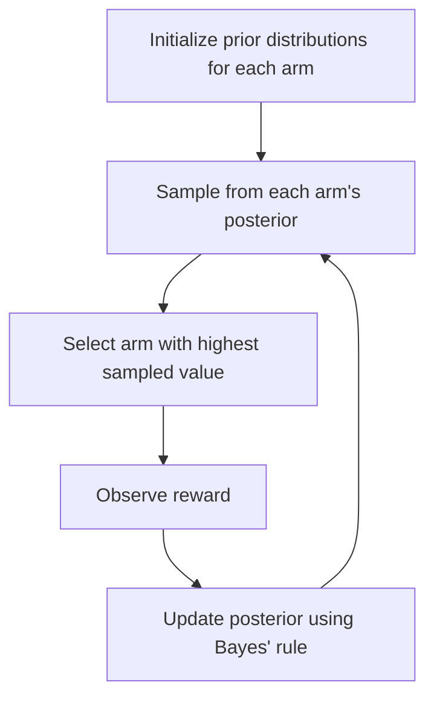

# 🎲 Thompson Sampling Algorithm

<div align="center">


*A Bayesian Approach to the Exploration-Exploitation Dilemma*

</div>

---

## 📚 Table of Contents

- [What is Thompson Sampling?](#what-is-thompson-sampling)
- [Mathematical Foundation](#mathematical-foundation)
- [How It Works](#how-it-works)
- [Implementation Guide](#implementation-guide)
- [Performance Optimization](#performance-optimization)
- [Evaluation Metrics](#evaluation-metrics)
- [Variants and Extensions](#variants-and-extensions)
- [Pros and Cons](#pros-and-cons)
- [Real-World Applications](#real-world-applications)
- [Comparison with Other Bandit Algorithms](#comparison-with-other-bandit-algorithms)
- [Advanced Topics](#advanced-topics)
- [FAQ](#faq)

---

## 🎯 What is Thompson Sampling?

**Thompson Sampling** (also known as **Posterior Sampling** or **Probability Matching**) is a Bayesian approach to the multi-armed bandit problem that addresses the exploration-exploitation dilemma through probabilistic sampling. Introduced by William R. Thompson in 1933, it has gained significant popularity in recent years due to its excellent empirical performance and theoretical guarantees.

### Key Characteristics:

- **Bayesian Framework**: Maintains a probability distribution over the unknown parameters of each arm
- **Probabilistic Exploration**: Explores by sampling from posterior distributions rather than using deterministic confidence bounds
- **Natural Adaptation**: Automatically adapts exploration based on uncertainty without explicit exploration parameters
- **Optimism Through Randomness**: Achieves optimism through the variance in posterior distributions
- **Simple Implementation**: Despite its sophistication, it's remarkably simple to implement
- **Strong Performance**: Often outperforms other bandit algorithms in practice

### The Core Principle:

Thompson Sampling follows the principle of **probability matching**: at each time step, it selects the arm that has the highest probability of being optimal according to the current posterior belief. This is achieved by:

1. Maintaining a posterior distribution for each arm's reward parameter
2. Sampling a value from each arm's posterior distribution
3. Selecting the arm with the highest sampled value
4. Updating the posterior distribution based on the observed reward

This approach naturally balances exploration and exploitation: arms with high expected rewards are selected more often (exploitation), while arms with high uncertainty (wide posterior distributions) have a chance of being selected when their sampled values are high (exploration).

---

## 🧮 Mathematical Foundation

### Bayesian Framework

Thompson Sampling operates within a Bayesian framework where we maintain beliefs about the unknown parameters of each arm's reward distribution.

#### Basic Setup

1. **Prior Beliefs**: For each arm $i$, we start with a prior distribution $P(\theta_i)$ over the unknown parameter $\theta_i$ of the reward distribution.

2. **Likelihood**: Given parameter $\theta_i$, the reward from arm $i$ follows a known distribution $P(r | \theta_i)$.

3. **Posterior Update**: After observing reward $r_t$ from arm $i_t$ at time $t$, we update the posterior using Bayes' rule:
   $$P(\theta_{i_t} | \text{data}) \propto P(r_t | \theta_{i_t}) \cdot P(\theta_{i_t} | \text{previous data})$$

#### Beta-Bernoulli Model

The most common formulation uses the Beta-Bernoulli conjugate pair:

- **Rewards**: Binary rewards $r \in \{0, 1\}$ (success/failure)
- **Parameter**: Success probability $\theta_i \in [0, 1]$ for arm $i$
- **Prior**: Beta distribution $\text{Beta}(\alpha_i, \beta_i)$
- **Likelihood**: Bernoulli distribution $\text{Bernoulli}(\theta_i)$
- **Posterior**: Also Beta distribution (conjugacy property)

**Posterior Update Rule**:
$$\theta_i | \text{data} \sim \text{Beta}(\alpha_i + S_i, \beta_i + F_i)$$

Where:
- $S_i$ = number of successes (rewards = 1) from arm $i$
- $F_i$ = number of failures (rewards = 0) from arm $i$
- $\alpha_i, \beta_i$ = prior parameters (often set to 1 for uniform prior)

#### Gaussian Model

For continuous rewards, we often use the Gaussian-Gaussian conjugate pair:

- **Rewards**: Continuous rewards $r \in \mathbb{R}$
- **Parameter**: Mean $\mu_i$ (assuming known variance $\sigma^2$)
- **Prior**: Gaussian distribution $\mathcal{N}(\mu_{0,i}, \sigma_{0,i}^2)$
- **Likelihood**: Gaussian distribution $\mathcal{N}(\mu_i, \sigma^2)$
- **Posterior**: Also Gaussian (conjugacy property)

**Posterior Update Rule**:
$$\mu_i | \text{data} \sim \mathcal{N}\left(\frac{\sigma^2 \mu_{0,i} + \sigma_{0,i}^2 \sum_{t} r_{i,t}}{\sigma^2 + n_i \sigma_{0,i}^2}, \frac{\sigma^2 \sigma_{0,i}^2}{\sigma^2 + n_i \sigma_{0,i}^2}\right)$$

Where $n_i$ is the number of times arm $i$ has been pulled.

### Thompson Sampling Algorithm

The algorithm proceeds as follows:

**For each time step $t$:**
1. **Sample**: For each arm $i$, sample $\tilde{\theta}_{i,t}$ from the posterior $P(\theta_i | \text{data}_{t-1})$
2. **Select**: Choose arm $I_t = \arg\max_i \tilde{\theta}_{i,t}$
3. **Observe**: Pull arm $I_t$ and observe reward $R_t$
4. **Update**: Update the posterior for arm $I_t$ using the observed reward

### Theoretical Properties

**Regret Bound**: For the Beta-Bernoulli case, Thompson Sampling achieves a regret bound of:
$$E[R_T] \leq (1 + \epsilon) \sum_{i: \Delta_i > 0} \frac{\ln T}{\Delta_i} + O\left(\frac{K \ln T}{\epsilon}\right)$$

Where $\Delta_i = \mu^* - \mu_i$ is the suboptimality gap of arm $i$.

This bound matches the lower bound up to constant factors, making Thompson Sampling asymptotically optimal.

### Example Calculation

Consider a 2-armed bandit with Beta priors:
- Arm 1: $\text{Beta}(2, 3)$ → 2 successes, 3 failures observed
- Arm 2: $\text{Beta}(1, 1)$ → uniform prior, no data yet

**Step 1: Sample**
- Sample from Arm 1: $\tilde{\theta}_1 \sim \text{Beta}(2, 3)$ → suppose we get 0.35
- Sample from Arm 2: $\tilde{\theta}_2 \sim \text{Beta}(1, 1)$ → suppose we get 0.67

**Step 2: Select**
- Since $\tilde{\theta}_2 = 0.67 > \tilde{\theta}_1 = 0.35$, we select Arm 2

**Step 3: Observe**
- Pull Arm 2 and observe reward (e.g., success)

**Step 4: Update**
- Update Arm 2's posterior: $\text{Beta}(1 + 1, 1 + 0) = \text{Beta}(2, 1)$

The beauty of Thompson Sampling is that this probabilistic selection naturally balances exploration and exploitation:
- Arms with higher expected success rates are more likely to be sampled
- Arms with higher uncertainty (wider posteriors) have more variability in their samples, leading to more exploration

---

## ⚙️ How It Works

Thompson Sampling follows an elegant Bayesian approach to sequential decision making:

<div align="center">



</div>

### Step-by-Step Process:

1. **Initialization**:
   - Choose prior distributions for each arm's parameter
   - Common choice: uniform priors (Beta(1,1) for Bernoulli rewards)

2. **At each time step**:
   - **Sample**: Draw one sample from each arm's current posterior distribution
   - **Decide**: Select the arm corresponding to the highest sampled value
   - **Act**: Pull the selected arm and observe the reward
   - **Learn**: Update the posterior distribution of the selected arm

3. **Posterior Update**:
   - Use conjugate priors for efficient closed-form updates
   - For non-conjugate cases, use approximation methods

### Intuitive Understanding:

- **High-performing arms**: Have posteriors concentrated around high values → frequently sampled as highest
- **Uncertain arms**: Have wide posteriors → occasionally sampled as highest due to variance
- **Poor-performing arms**: Have posteriors concentrated around low values → rarely sampled as highest

This creates a natural exploration-exploitation balance without explicit exploration parameters.

### Python Implementation:

```python
import numpy as np
import matplotlib.pyplot as plt
from scipy import stats

class ThompsonSampling:
    """
    Thompson Sampling for the multi-armed bandit problem.
    
    Parameters:
    -----------
    n_arms : int
        Number of arms (actions)
    prior_alpha : float or array-like, default=1.0
        Prior alpha parameter(s) for Beta distribution
    prior_beta : float or array-like, default=1.0
        Prior beta parameter(s) for Beta distribution
    """
    
    def __init__(self, n_arms, prior_alpha=1.0, prior_beta=1.0):
        self.n_arms = n_arms
        
        # Initialize Beta distribution parameters
        if np.isscalar(prior_alpha):
            self.alpha = np.ones(n_arms) * prior_alpha
        else:
            self.alpha = np.array(prior_alpha)
            
        if np.isscalar(prior_beta):
            self.beta = np.ones(n_arms) * prior_beta
        else:
            self.beta = np.array(prior_beta)
        
        # Tracking
        self.counts = np.zeros(n_arms)
        self.rewards = np.zeros(n_arms)
        
    def select_arm(self):
        """
        Select an arm using Thompson Sampling.
        
        Returns:
        --------
        int
            The selected arm index
        """
        # Sample from Beta distributions
        samples = np.random.beta(self.alpha, self.beta)
        
        # Select arm with highest sampled value
        return np.argmax(samples)
    
    def update(self, chosen_arm, reward):
        """
        Update posterior distribution based on the observed reward.
        
        Parameters:
        -----------
        chosen_arm : int
            The arm that was pulled
        reward : float
            The observed reward (should be 0 or 1 for Beta-Bernoulli)
        """
        # Update counts
        self.counts[chosen_arm] += 1
        self.rewards[chosen_arm] += reward
        
        # Update Beta parameters
        if reward == 1:
            self.alpha[chosen_arm] += 1
        else:
            self.beta[chosen_arm] += 1
    
    def get_expected_rewards(self):
        """
        Get the expected reward for each arm based on current posteriors.
        
        Returns:
        --------
        numpy.ndarray
            Expected rewards
        """
        return self.alpha / (self.alpha + self.beta)

# Example usage
def run_simulation(true_probs, n_steps=1000):
    """
    Run a simulation of Thompson Sampling on a multi-armed bandit.
    
    Parameters:
    -----------
    true_probs : array-like
        True success probabilities for each arm
    n_steps : int, default=1000
        Number of time steps to simulate
        
    Returns:
    --------
    dict
        Simulation results
    """
    n_arms = len(true_probs)
    ts = ThompsonSampling(n_arms)
    
    # Arrays to store results
    chosen_arms = np.zeros(n_steps, dtype=int)
    rewards = np.zeros(n_steps)
    cumulative_rewards = np.zeros(n_steps)
    regrets = np.zeros(n_steps)
    
    # Find optimal arm
    optimal_arm = np.argmax(true_probs)
    optimal_reward = true_probs[optimal_arm]
    
    # Run simulation
    for t in range(n_steps):
        # Select arm
        arm = ts.select_arm()
        chosen_arms[t] = arm
        
        # Generate reward (Bernoulli)
        reward = np.random.random() < true_probs[arm]
        rewards[t] = reward
        
        # Update algorithm
        ts.update(arm, reward)
        
        # Calculate cumulative reward and regret
        cumulative_rewards[t] = (cumulative_rewards[t-1] + reward) if t > 0 else reward
        regrets[t] = optimal_reward - true_probs[arm]
    
    # Calculate cumulative regret
    cumulative_regret = np.cumsum(regrets)
    
    return {
        'chosen_arms': chosen_arms,
        'rewards': rewards,
        'cumulative_rewards': cumulative_rewards,
        'cumulative_regret': cumulative_regret,
        'thompson_sampling': ts,
        'optimal_arm': optimal_arm
    }

# Visualize results
def plot_results(results, true_probs):
    """
    Plot the results of a Thompson Sampling simulation.
    
    Parameters:
    -----------
    results : dict
        Results from the simulation
    true_probs : array-like
        True success probabilities for each arm
    """
    n_steps = len(results['rewards'])
    n_arms = len(true_probs)
    
    # Create figure
    plt.figure(figsize=(15, 10))
    
    # Plot arm selection frequency
    plt.subplot(2, 2, 1)
    unique, counts = np.unique(results['chosen_arms'], return_counts=True)
    arm_counts = np.zeros(n_arms)
    for arm, count in zip(unique, counts):
        arm_counts[arm] = count
    arm_freqs = arm_counts / n_steps
    
    plt.bar(range(n_arms), arm_freqs)
    plt.axvline(results['optimal_arm'], color='r', linestyle='--', 
               label=f'Optimal arm: {results["optimal_arm"]}')
    plt.xlabel('Arm')
    plt.ylabel('Selection Frequency')
    plt.title('Arm Selection Frequency')
    plt.legend()
    plt.grid(True, alpha=0.3)
    
    # Plot cumulative regret
    plt.subplot(2, 2, 2)
    plt.plot(results['cumulative_regret'])
    plt.xlabel('Time Step')
    plt.ylabel('Cumulative Regret')
    plt.title('Cumulative Regret Over Time')
    plt.grid(True, alpha=0.3)
    
    # Plot cumulative reward
    plt.subplot(2, 2, 3)
    plt.plot(results['cumulative_rewards'])
    plt.xlabel('Time Step')
    plt.ylabel('Cumulative Reward')
    plt.title('Cumulative Reward Over Time')
    plt.grid(True, alpha=0.3)
    
    # Plot posterior distributions
    plt.subplot(2, 2, 4)
    x = np.linspace(0, 1, 1000)
    for arm in range(n_arms):
        alpha = results['thompson_sampling'].alpha[arm]
        beta = results['thompson_sampling'].beta[arm]
        y = stats.beta.pdf(x, alpha, beta)
        plt.plot(x, y, label=f'Arm {arm} (α={alpha:.1f}, β={beta:.1f})')
        plt.axvline(true_probs[arm], color=f'C{arm}', linestyle='--', alpha=0.5)
    
    plt.xlabel('Success Probability')
    plt.ylabel('Density')
    plt.title('Posterior Distributions')
    plt.legend()
    plt.grid(True, alpha=0.3)
    
    plt.tight_layout()
    plt.show()

# Example: 5-armed bandit with different success probabilities
true_probs = [0.1, 0.2, 0.3, 0.4, 0.25]
results = run_simulation(true_probs, n_steps=1000)
plot_results(results, true_probs)
```

This implementation demonstrates Thompson Sampling for a Bernoulli bandit problem:

1. We maintain Beta distributions for each arm's success probability
2. At each step, we sample from these distributions and select the arm with highest sample
3. We update the posterior of the selected arm based on the observed reward
4. The algorithm naturally balances exploration and exploitation

As we gather more data, the posteriors become more concentrated around the true values, and the algorithm increasingly selects the optimal arm.

---

## 💻 Implementation Guide

### Basic Implementation

Here's a detailed implementation of Thompson Sampling for various reward models:

```python
import numpy as np
import matplotlib.pyplot as plt
from scipy import stats
from typing import List, Tuple, Dict, Optional, Union, Any

class ThompsonSampling:
    """
    Base class for Thompson Sampling implementations.
    """
    
    def __init__(self, n_arms: int):
        self.n_arms = n_arms
        self.t = 0  # Time step counter
        
    def select_arm(self) -> int:
        """Select an arm using Thompson Sampling."""
        raise NotImplementedError("Subclasses must implement this method")
    
    def update(self, chosen_arm: int, reward: float) -> None:
        """Update posterior based on observed reward."""
        raise NotImplementedError("Subclasses must implement this method")
    
    def get_expected_rewards(self) -> np.ndarray:
        """Get expected rewards for each arm."""
        raise NotImplementedError("Subclasses must implement this method")


class BernoulliTS(ThompsonSampling):
    """
    Thompson Sampling for Bernoulli bandits.
    
    Parameters:
    -----------
    n_arms : int
        Number of arms
    alpha : float or array-like, default=1.0
        Prior alpha parameter(s)
    beta : float or array-like, default=1.0
        Prior beta parameter(s)
    """
    
    def __init__(self, n_arms: int, alpha: Union[float, np.ndarray] = 1.0, 
                beta: Union[float, np.ndarray] = 1.0):
        super().__init__(n_arms)
        
        # Initialize Beta distribution parameters
        if np.isscalar(alpha):
            self.alpha = np.ones(n_arms) * alpha
        else:
            self.alpha = np.array(alpha)
            
        if np.isscalar(beta):
            self.beta = np.ones(n_arms) * beta
        else:
            self.beta = np.array(beta)
        
        # For tracking
        self.successes = np.zeros(n_arms)
        self.failures = np.zeros(n_arms)
    
    def select_arm(self) -> int:
        """Select an arm using Thompson Sampling."""
        self.t += 1
        samples = np.random.beta(self.alpha, self.beta)
        return np.argmax(samples)
    
    def update(self, chosen_arm: int, reward: float) -> None:
        """Update posterior based on observed reward."""
        # Ensure reward is binary
        binary_reward = 1 if reward >= 0.5 else 0
        
        # Update counts
        if binary_reward == 1:
            self.successes[chosen_arm] += 1
            self.alpha[chosen_arm] += 1
        else:
            self.failures[chosen_arm] += 1
            self.beta[chosen_arm] += 1
    
    def get_expected_rewards(self) -> np.ndarray:
        """Get expected rewards for each arm."""
        return self.alpha / (self.alpha + self.beta)
    
    def get_uncertainty(self) -> np.ndarray:
        """Get uncertainty (variance) for each arm."""
        return (self.alpha * self.beta) / ((self.alpha + self.beta)**2 * (self.alpha + self.beta + 1))
    
    def get_posteriors(self) -> List[stats.beta]:
        """Get posterior distributions for each arm."""
        return [stats.beta(a, b) for a, b in zip(self.alpha, self.beta)]


class GaussianTS(ThompsonSampling):
    """
    Thompson Sampling for Gaussian bandits.
    
    Parameters:
    -----------
    n_arms : int
        Number of arms
    mu_0 : float or array-like, default=0.0
        Prior mean(s)
    sigma_0 : float or array-like, default=1.0
        Prior standard deviation(s)
    sigma : float, default=1.0
        Known reward noise (standard deviation)
    """
    
    def __init__(self, n_arms: int, mu_0: Union[float, np.ndarray] = 0.0, 
                sigma_0: Union[float, np.ndarray] = 1.0, sigma: float = 1.0):
        super().__init__(n_arms)
        
        self.sigma = sigma  # Known reward noise
        
        # Initialize prior parameters
        if np.isscalar(mu_0):
            self.mu_0 = np.ones(n_arms) * mu_0
        else:
            self.mu_0 = np.array(mu_0)
            
        if np.isscalar(sigma_0):
            self.sigma_0 = np.ones(n_arms) * sigma_0
        else:
            self.sigma_0 = np.array(sigma_0)
        
        # Current posterior parameters
        self.mu = self.mu_0.copy()
        self.sigma_n = self.sigma_0.copy()
        
        # Sufficient statistics
        self.sum_rewards = np.zeros(n_arms)
        self.sum_squares = np.zeros(n_arms)
        self.counts = np.zeros(n_arms)
    
    def select_arm(self) -> int:
        """Select an arm using Thompson Sampling."""
        self.t += 1
        samples = np.random.normal(self.mu, self.sigma_n)
        return np.argmax(samples)
    
    def update(self, chosen_arm: int, reward: float) -> None:
        """Update posterior based on observed reward."""
        # Update counts and sufficient statistics
        self.counts[chosen_arm] += 1
        self.sum_rewards[chosen_arm] += reward
        self.sum_squares[chosen_arm] += reward**2
        
        # Update posterior parameters
        n = self.counts[chosen_arm]
        
        # Posterior precision = prior precision + n * likelihood precision
        prior_precision = 1.0 / (self.sigma_0[chosen_arm]**2)
        likelihood_precision = 1.0 / (self.sigma**2)
        posterior_precision = prior_precision + n * likelihood_precision
        
        # Posterior mean = weighted average of prior mean and sample mean
        self.mu[chosen_arm] = (
            prior_precision * self.mu_0[chosen_arm] + 
            likelihood_precision * self.sum_rewards[chosen_arm]
        ) / posterior_precision
        
        # Posterior standard deviation
        self.sigma_n[chosen_arm] = 1.0 / np.sqrt(posterior_precision)
    
    def get_expected_rewards(self) -> np.ndarray:
        """Get expected rewards for each arm."""
        return self.mu
    
    def get_uncertainty(self) -> np.ndarray:
        """Get uncertainty (variance) for each arm."""
        return self.sigma_n**2
    
    def get_posteriors(self) -> List[stats.norm]:
        """Get posterior distributions for each arm."""
        return [stats.norm(loc=m, scale=s) for m, s in zip(self.mu, self.sigma_n)]


class BetaGammaTS(ThompsonSampling):
    """
    Thompson Sampling for rewards with unknown mean and variance.
    Uses Normal-Gamma conjugate prior.
    
    Parameters:
    -----------
    n_arms : int
        Number of arms
    mu_0 : float or array-like, default=0.0
        Prior mean(s)
    lambda_0 : float or array-like, default=1.0
        Prior precision scaling parameter(s)
    alpha_0 : float or array-like, default=1.0
        Prior shape parameter(s) for Gamma distribution
    beta_0 : float or array-like, default=1.0
        Prior rate parameter(s) for Gamma distribution
    """
    
    def __init__(self, n_arms: int, mu_0: Union[float, np.ndarray] = 0.0,
                lambda_0: Union[float, np.ndarray] = 1.0,
                alpha_0: Union[float, np.ndarray] = 1.0,
                beta_0: Union[float, np.ndarray] = 1.0):
        super().__init__(n_arms)
        
        # Initialize prior parameters
        if np.isscalar(mu_0):
            self.mu_0 = np.ones(n_arms) * mu_0
        else:
            self.mu_0 = np.array(mu_0)
            
        if np.isscalar(lambda_0):
            self.lambda_0 = np.ones(n_arms) * lambda_0
        else:
            self.lambda_0 = np.array(lambda_0)
            
        if np.isscalar(alpha_0):
            self.alpha_0 = np.ones(n_arms) * alpha_0
        else:
            self.alpha_0 = np.array(alpha_0)
            
        if np.isscalar(beta_0):
            self.beta_0 = np.ones(n_arms) * beta_0
        else:
            self.beta_0 = np.array(beta_0)
        
        # Current posterior parameters
        self.mu_n = self.mu_0.copy()
        self.lambda_n = self.lambda_0.copy()
        self.alpha_n = self.alpha_0.copy()
        self.beta_n = self.beta_0.copy()
        
        # Sufficient statistics
        self.sum_rewards = np.zeros(n_arms)
        self.sum_squares = np.zeros(n_arms)
        self.counts = np.zeros(n_arms)
    
    def select_arm(self) -> int:
        """Select an arm using Thompson Sampling."""
        self.t += 1
        samples = np.zeros(self.n_arms)
        
        for arm in range(self.n_arms):
            # Sample precision (inverse variance) from Gamma
            precision = np.random.gamma(self.alpha_n[arm], 1.0 / self.beta_n[arm])
            
            # Sample mean from Normal
            mean = np.random.normal(self.mu_n[arm], 1.0 / np.sqrt(self.lambda_n[arm] * precision))
            
            samples[arm] = mean
        
        return np.argmax(samples)
    
    def update(self, chosen_arm: int, reward: float) -> None:
        """Update posterior based on observed reward."""
        # Update counts and sufficient statistics
        self.counts[chosen_arm] += 1
        self.sum_rewards[chosen_arm] += reward
        self.sum_squares[chosen_arm] += reward**2
        
        # Update posterior parameters
        n = self.counts[chosen_arm]
        sample_mean = self.sum_rewards[chosen_arm] / n
        
        # Update lambda (precision scaling parameter)
        self.lambda_n[chosen_arm] = self.lambda_0[chosen_arm] + n
        
        # Update mu (mean parameter)
        self.mu_n[chosen_arm] = (
            self.lambda_0[chosen_arm] * self.mu_0[chosen_arm] + 
            n * sample_mean
        ) / self.lambda_n[chosen_arm]
        
        # Update alpha (shape parameter)
        self.alpha_n[chosen_arm] = self.alpha_0[chosen_arm] + n / 2
        
        # Update beta (rate parameter)
        sample_var = self.sum_squares[chosen_arm] / n - sample_mean**2 if n > 1 else 0
        self.beta_n[chosen_arm] = self.beta_0[chosen_arm] + 0.5 * (
            n * sample_var + 
            n * self.lambda_0[chosen_arm] * (sample_mean - self.mu_0[chosen_arm])**2 / 
            self.lambda_n[chosen_arm]
        )
    
    def get_expected_rewards(self) -> np.ndarray:
        """Get expected rewards for each arm."""
        return self.mu_n
    
    def get_uncertainty(self) -> np.ndarray:
        """Get uncertainty (variance) for each arm."""
        # Expected variance = E[1/precision] = beta / (alpha - 1) for alpha > 1
        variance = np.zeros(self.n_arms)
        for arm in range(self.n_arms):
            if self.alpha_n[arm] > 1:
                # Expected precision
                expected_precision = self.alpha_n[arm] / self.beta_n[arm]
                
                # Variance of the mean
                variance[arm] = 1.0 / (self.lambda_n[arm] * expected_precision)
            else:
                variance[arm] = np.inf  # Undefined variance
        
        return variance
```

### Using Thompson Sampling for Different Bandit Problems

Here's how to use the above implementations for different types of bandit problems:

```python
def run_bernoulli_experiment(true_probs: List[float], n_steps: int = 1000, 
                            seed: Optional[int] = None) -> Dict[str, Any]:
    """
    Run an experiment with Bernoulli Thompson Sampling.
    
    Parameters:
    -----------
    true_probs : List[float]
        True success probabilities for each arm
    n_steps : int, default=1000
        Number of time steps to simulate
    seed : int, optional
        Random seed
        
    Returns:
    --------
    Dict[str, Any]
        Experiment results
    """
    if seed is not None:
        np.random.seed(seed)
    
    n_arms = len(true_probs)
    ts = BernoulliTS(n_arms)
    
    # Arrays to store results
    chosen_arms = np.zeros(n_steps, dtype=int)
    rewards = np.zeros(n_steps)
    regrets = np.zeros(n_steps)
    
    # Optimal arm
    optimal_arm = np.argmax(true_probs)
    optimal_reward = true_probs[optimal_arm]
    
    # Run experiment
    for t in range(n_steps):
        # Select arm
        arm = ts.select_arm()
        chosen_arms[t] = arm
        
        # Generate reward
        reward = 1 if np.random.random() < true_probs[arm] else 0
        rewards[t] = reward
        
        # Update TS
        ts.update(arm, reward)
        
        # Calculate regret
        regrets[t] = optimal_reward - true_probs[arm]
    
    # Calculate cumulative metrics
    cumulative_rewards = np.cumsum(rewards)
    cumulative_regrets = np.cumsum(regrets)
    
    # Calculate arm selection frequencies
    arm_counts = np.zeros(n_arms)
    for arm in chosen_arms:
        arm_counts[arm] += 1
    arm_frequencies = arm_counts / n_steps
    
    return {
        'chosen_arms': chosen_arms,
        'rewards': rewards,
        'cumulative_rewards': cumulative_rewards,
        'regrets': regrets,
        'cumulative_regrets': cumulative_regrets,
        'arm_counts': arm_counts,
        'arm_frequencies': arm_frequencies,
        'model': ts,
        'optimal_arm': optimal_arm
    }

def run_gaussian_experiment(true_means: List[float], noise_std: float = 1.0,
                           n_steps: int = 1000, seed: Optional[int] = None) -> Dict[str, Any]:
    """
    Run an experiment with Gaussian Thompson Sampling.
    
    Parameters:
    -----------
    true_means : List[float]
        True mean rewards for each arm
    noise_std : float, default=1.0
        Standard deviation of reward noise
    n_steps : int, default=1000
        Number of time steps to simulate
    seed : int, optional
        Random seed
        
    Returns:
    --------
    Dict[str, Any]
        Experiment results
    """
    if seed is not None:
        np.random.seed(seed)
    
    n_arms = len(true_means)
    ts = GaussianTS(n_arms, sigma=noise_std)
    
    # Arrays to store results
    chosen_arms = np.zeros(n_steps, dtype=int)
    rewards = np.zeros(n_steps)
    regrets = np.zeros(n_steps)
    
    # Optimal arm
    optimal_arm = np.argmax(true_means)
    optimal_reward = true_means[optimal_arm]
    
    # Run experiment
    for t in range(n_steps):
        # Select arm
        arm = ts.select_arm()
        chosen_arms[t] = arm
        
        # Generate reward
        reward = np.random.normal(true_means[arm], noise_std)
        rewards[t] = reward
        
        # Update TS
        ts.update(arm, reward)
        
        # Calculate regret
        regrets[t] = optimal_reward - true_means[arm]
    
    # Calculate cumulative metrics
    cumulative_rewards = np.cumsum(rewards)
    cumulative_regrets = np.cumsum(regrets)
    
    # Calculate arm selection frequencies
    arm_counts = np.zeros(n_arms)
    for arm in chosen_arms:
        arm_counts[arm] += 1
    arm_frequencies = arm_counts / n_steps
    
    return {
        'chosen_arms': chosen_arms,
        'rewards': rewards,
        'cumulative_rewards': cumulative_rewards,
        'regrets': regrets,
        'cumulative_regrets': cumulative_regrets,
        'arm_counts': arm_counts,
        'arm_frequencies': arm_frequencies,
        'model': ts,
        'optimal_arm': optimal_arm
    }

def visualize_experiment(results: Dict[str, Any], true_params: List[float], 
                        param_type: str = 'probability') -> None:
    """
    Visualize the results of a Thompson Sampling experiment.
    
    Parameters:
    -----------
    results : Dict[str, Any]
        Experiment results
    true_params : List[float]
        True parameters (probabilities or means)
    param_type : str, default='probability'
        Type of parameter ('probability' or 'mean')
    """
    n_steps = len(results['rewards'])
    n_arms = len(true_params)
    model = results['model']
    optimal_arm = results['optimal_arm']
    
    # Create figure
    plt.figure(figsize=(15, 12))
    
    # Plot arm selection frequency
    plt.subplot(2, 2, 1)
    plt.bar(range(n_arms), results['arm_frequencies'], color='skyblue', alpha=0.7)
    plt.axvline(optimal_arm, color='r', linestyle='--', 
               label=f'Optimal arm: {optimal_arm}')
    plt.xlabel('Arm')
    plt.ylabel('Selection Frequency')
    plt.title('Arm Selection Frequency')
    plt.legend()
    plt.grid(True, alpha=0.3)
    
    # Plot cumulative regret
    plt.subplot(2, 2, 2)
    plt.plot(results['cumulative_regrets'], color='red')
    
    # Add logarithmic regret reference
    log_t = np.log(np.arange(1, n_steps + 1))
    scale_factor = results['cumulative_regrets'][-1] / (log_t[-1] * 5)
    plt.plot(scale_factor * log_t, 'k--', alpha=0.7, label='log(t) reference')
    
    plt.xlabel('Time Step')
    plt.ylabel('Cumulative Regret')
    plt.title('Cumulative Regret Over Time')
    plt.legend()
    plt.grid(True, alpha=0.3)
    
    # Plot posterior means vs true parameters
    plt.subplot(2, 2, 3)
    expected_rewards = model.get_expected_rewards()
    
    x = np.arange(n_arms)
    width = 0.35
    
    plt.bar(x - width/2, true_params, width, label=f'True {param_type}', 
           color='lightcoral', alpha=0.7)
    plt.bar(x + width/2, expected_rewards, width, label='Estimated', 
           color='lightblue', alpha=0.7)
    
    plt.xlabel('Arm')
    plt.ylabel(f'{param_type.capitalize()}')
    plt.title(f'True vs Estimated {param_type.capitalize()}')
    plt.legend()
    plt.grid(True, alpha=0.3)
    
    # Plot posterior distributions
    plt.subplot(2, 2, 4)
    
    if isinstance(model, BernoulliTS):
        # For Bernoulli bandits, plot Beta distributions
        x = np.linspace(0, 1, 1000)
        for arm in range(n_arms):
            y = stats.beta.pdf(x, model.alpha[arm], model.beta[arm])
            plt.plot(x, y, label=f'Arm {arm}')
            plt.axvline(true_params[arm], color=f'C{arm}', linestyle='--', alpha=0.5)
        
        plt.xlabel('Success Probability')
        plt.ylabel('Density')
        plt.title('Posterior Distributions')
        
    elif isinstance(model, GaussianTS):
        # For Gaussian bandits, plot Normal distributions
        x = np.linspace(min(true_params) - 3, max(true_params) + 3, 1000)
        for arm in range(n_arms):
            y = stats.norm.pdf(x, model.mu[arm], model.sigma_n[arm])
            plt.plot(x, y, label=f'Arm {arm}')
            plt.axvline(true_params[arm], color=f'C{arm}', linestyle='--', alpha=0.5)
        
        plt.xlabel('Mean Reward')
        plt.ylabel('Density')
        plt.title('Posterior Distributions')
    
    plt.legend()
    plt.grid(True, alpha=0.3)
    
    plt.tight_layout()
    plt.show()
    
    # Print summary statistics
    print("\nExperiment Summary:")
    print(f"Number of steps: {n_steps}")
    print(f"Optimal arm: {optimal_arm} (true {param_type}: {true_params[optimal_arm]:.4f})")
    print(f"Final cumulative regret: {results['cumulative_regrets'][-1]:.2f}")
    print(f"Average regret per step: {results['cumulative_regrets'][-1]/n_steps:.4f}")
    print(f"Final cumulative reward: {results['cumulative_rewards'][-1]:.2f}")
    
    print("\nArm statistics:")
    for arm in range(n_arms):
        count = results['arm_counts'][arm]
        frequency = results['arm_frequencies'][arm]
        estimated = model.get_expected_rewards()[arm]
        true_param = true_params[arm]
        
        print(f"Arm {arm}: {count} pulls ({frequency:.1%}), " + 
             f"estimated {param_type}: {estimated:.4f}, " + 
             f"true {param_type}: {true_param:.4f}")

# Example usage
if __name__ == "__main__":
    # Bernoulli bandit experiment
    print("=== Bernoulli Bandit Experiment ===")
    true_probs = [0.2, 0.5, 0.7, 0.4, 0.3]
    results = run_bernoulli_experiment(true_probs, n_steps=2000, seed=42)
    visualize_experiment(results, true_probs, param_type='probability')
    
    # Gaussian bandit experiment
    print("\n=== Gaussian Bandit Experiment ===")
    true_means = [1.0, 2.0, 3.0, 0.5, 2.5]
    results = run_gaussian_experiment(true_means, noise_std=1.0, n_steps=2000, seed=42)
    visualize_experiment(results, true_means, param_type='mean')
```

### Contextual Thompson Sampling Implementation

Here's an implementation of Contextual Thompson Sampling for linear bandits:

```python
class LinearThompsonSampling:
    """
    Linear Thompson Sampling for contextual bandits.
    
    Parameters:
    -----------
    n_arms : int
        Number of arms
    d : int
        Dimension of context features
    lambda_prior : float, default=1.0
        Regularization parameter
    v_sq : float, default=1.0
        Exploration parameter scaling variance
    """
    
    def __init__(self, n_arms: int, d: int, lambda_prior: float = 1.0, v_sq: float = 1.0):
        self.n_arms = n_arms
        self.d = d
        self.lambda_prior = lambda_prior
        self.v_sq = v_sq
        
        # Model parameters for each arm
        self.B = [lambda_prior * np.eye(d) for _ in range(n_arms)]  # Precision matrices
        self.mu_hat = [np.zeros(d) for _ in range(n_arms)]  # Mean parameters
        self.f = [np.zeros(d) for _ in range(n_arms)]  # Weighted feature sums
        
        # Tracking
        self.t = 0
        self.counts = np.zeros(n_arms)
    
    def select_arm(self, context_features: np.ndarray) -> int:
        """
        Select an arm based on context features.
        
        Parameters:
        -----------
        context_features : np.ndarray of shape (n_arms, d) or (d,)
            Features for each arm or shared features
            
        Returns:
        --------
        int
            Selected arm index
        """
        self.t += 1
        
        # Handle different context shapes
        if context_features.ndim == 1:
            # Same context for all arms
            context = np.tile(context_features.reshape(1, -1), (self.n_arms, 1))
        else:
            # Different context for each arm
            context = context_features
        
        # Sample model parameters and compute expected rewards
        expected_rewards = np.zeros(self.n_arms)
        
        for arm in range(self.n_arms):
            # Calculate posterior covariance
            B_inv = np.linalg.inv(self.B[arm])
            
            # Sample model parameters from posterior
            theta = np.random.multivariate_normal(self.mu_hat[arm], self.v_sq * B_inv)
            
            # Compute expected reward
            expected_rewards[arm] = np.dot(theta, context[arm])
        
        # Return arm with highest expected reward
        return np.argmax(expected_rewards)
    
    def update(self, chosen_arm: int, reward: float, context: np.ndarray) -> None:
        """
        Update model based on observed reward.
        
        Parameters:
        -----------
        chosen_arm : int
            Selected arm
        reward : float
            Observed reward
        context : np.ndarray of shape (d,)
            Context features for the selected arm
        """
        self.counts[chosen_arm] += 1
        
        # Update precision matrix
        self.B[chosen_arm] += np.outer(context, context)
        
        # Update weighted feature sum
        self.f[chosen_arm] += reward * context
        
        # Update mean parameter
        self.mu_hat[chosen_arm] = np.linalg.solve(self.B[chosen_arm], self.f[chosen_arm])
    
    def get_arm_uncertainties(self, context_features: np.ndarray) -> np.ndarray:
        """
        Get uncertainties for each arm given context.
        
        Parameters:
        -----------
        context_features : np.ndarray of shape (n_arms, d) or (d,)
            Features for each arm or shared features
            
        Returns:
        --------
        np.ndarray of shape (n_arms,)
            Uncertainty for each arm
        """
        # Handle different context shapes
        if context_features.ndim == 1:
            context = np.tile(context_features.reshape(1, -1), (self.n_arms, 1))
        else:
            context = context_features
        
        uncertainties = np.zeros(self.n_arms)
        
        for arm in range(self.n_arms):
            # Calculate posterior precision matrix inverse
            B_inv = np.linalg.inv(self.B[arm])
            
            # Uncertainty is proportional to x^T B^{-1} x
            uncertainties[arm] = np.sqrt(
                self.v_sq * context[arm].T.dot(B_inv).dot(context[arm])
            )
        
        return uncertainties

def run_contextual_bandit_experiment(true_thetas: np.ndarray, n_steps: int = 1000, 
                                   context_dim: int = 5, seed: Optional[int] = None) -> Dict[str, Any]:
    """
    Run an experiment with Linear Thompson Sampling on a contextual bandit.
    
    Parameters:
    -----------
    true_thetas : np.ndarray of shape (n_arms, d)
        True parameter vectors for each arm
    n_steps : int, default=1000
        Number of time steps to simulate
    context_dim : int, default=5
        Dimension of context features
    seed : int, optional
        Random seed
        
    Returns:
    --------
    Dict[str, Any]
        Experiment results
    """
    if seed is not None:
        np.random.seed(seed)
    
    n_arms, d = true_thetas.shape
    ts = LinearThompsonSampling(n_arms, d)
    
    # Arrays to store results
    chosen_arms = np.zeros(n_steps, dtype=int)
    rewards = np.zeros(n_steps)
    regrets = np.zeros(n_steps)
    contexts = np.zeros((n_steps, d))
    best_arms = np.zeros(n_steps, dtype=int)
    
    # Run experiment
    for t in range(n_steps):
        # Generate random context
        context = np.random.normal(0, 1, d)
        contexts[t] = context
        
        # Calculate expected rewards for each arm given context
        expected_rewards = np.array([np.dot(true_thetas[arm], context) for arm in range(n_arms)])
        
        # Determine best arm for this context
        best_arm = np.argmax(expected_rewards)
        best_arms[t] = best_arm
        
        # Select arm using Thompson Sampling
        arm = ts.select_arm(context)
        chosen_arms[t] = arm
        
        # Generate reward with noise
        noise = np.random.normal(0, 0.1)  # Small noise
        reward = np.dot(true_thetas[arm], context) + noise
        rewards[t] = reward
        
        # Update model
        ts.update(arm, reward, context)
        
        # Calculate regret
        regret = expected_rewards[best_arm] - expected_rewards[arm]
        regrets[t] = regret
    
    # Calculate cumulative metrics
    cumulative_rewards = np.cumsum(rewards)
    cumulative_regrets = np.cumsum(regrets)
    
    # Calculate arm selection frequencies
    arm_counts = np.zeros(n_arms)
    for arm in chosen_arms:
        arm_counts[arm] += 1
    arm_frequencies = arm_counts / n_steps
    
    # Calculate best arm selection frequency
    optimal_selections = (chosen_arms == best_arms)
    optimal_frequency = np.mean(optimal_selections)
    
    return {
        'chosen_arms': chosen_arms,
        'rewards': rewards,
        'cumulative_rewards': cumulative_rewards,
        'regrets': regrets,
        'cumulative_regrets': cumulative_regrets,
        'contexts': contexts,
        'best_arms': best_arms,
        'arm_counts': arm_counts,
        'arm_frequencies': arm_frequencies,
        'optimal_frequency': optimal_frequency,
        'model': ts
    }

def visualize_contextual_experiment(results: Dict[str, Any], true_thetas: np.ndarray) -> None:
    """
    Visualize the results of a contextual bandit experiment.
    
    Parameters:
    -----------
    results : Dict[str, Any]
        Experiment results
    true_thetas : np.ndarray of shape (n_arms, d)
        True parameter vectors for each arm
    """
    n_steps = len(results['rewards'])
    n_arms = true_thetas.shape[0]
    
    # Create figure
    plt.figure(figsize=(15, 12))
    
    # Plot arm selection frequency
    plt.subplot(2, 2, 1)
    plt.bar(range(n_arms), results['arm_frequencies'], color='skyblue', alpha=0.7)
    plt.xlabel('Arm')
    plt.ylabel('Selection Frequency')
    plt.title('Arm Selection Frequency')
    plt.grid(True, alpha=0.3)
    
    # Plot cumulative regret
    plt.subplot(2, 2, 2)
    plt.plot(results['cumulative_regrets'], color='red')
    
    # Add logarithmic regret reference
    log_t = np.log(np.arange(1, n_steps + 1))
    scale_factor = results['cumulative_regrets'][-1] / (log_t[-1] * 5)
    plt.plot(scale_factor * log_t, 'k--', alpha=0.7, label='log(t) reference')
    
    plt.xlabel('Time Step')
    plt.ylabel('Cumulative Regret')
    plt.title('Cumulative Regret Over Time')
    plt.legend()
    plt.grid(True, alpha=0.3)
    
    # Plot optimal arm selection rate over time
    plt.subplot(2, 2, 3)
    window_size = min(100, n_steps // 10)
    optimal_selections = (results['chosen_arms'] == results['best_arms'])
    
    # Calculate moving average of optimal selections
    optimal_rate = np.convolve(optimal_selections, np.ones(window_size)/window_size, mode='valid')
    
    plt.plot(range(window_size-1, n_steps), optimal_rate, color='green')
    plt.axhline(y=results['optimal_frequency'], color='k', linestyle='--', 
               label=f'Average: {results["optimal_frequency"]:.2f}')
    
    plt.xlabel('Time Step')
    plt.ylabel(f'Optimal Selection Rate (Window={window_size})')
    plt.title('Optimal Arm Selection Rate Over Time')
    plt.legend()
    plt.grid(True, alpha=0.3)
    
    # Plot parameter estimation error
    plt.subplot(2, 2, 4)
    
    # Compute parameter estimation error for each arm
    model = results['model']
    param_errors = np.zeros(n_arms)
    
    for arm in range(n_arms):
        # L2 norm of difference between true and estimated parameters
        error = np.linalg.norm(true_thetas[arm] - model.mu_hat[arm])
        param_errors[arm] = error
    
    plt.bar(range(n_arms), param_errors, color='purple', alpha=0.7)
    plt.xlabel('Arm')
    plt.ylabel('Parameter Estimation Error (L2 Norm)')
    plt.title('Parameter Estimation Error by Arm')
    plt.grid(True, alpha=0.3)
    
    plt.tight_layout()
    plt.show()
    
    # Print summary statistics
    print("\nContextual Bandit Experiment Summary:")
    print(f"Number of steps: {n_steps}")
    print(f"Final cumulative regret: {results['cumulative_regrets'][-1]:.2f}")
    print(f"Average regret per step: {results['cumulative_regrets'][-1]/n_steps:.4f}")
    print(f"Optimal arm selection rate: {results['optimal_frequency']:.2f}")
    
    print("\nArm selection frequencies:")
    for arm in range(n_arms):
        count = results['arm_counts'][arm]
        frequency = results['arm_frequencies'][arm]
        error = param_errors[arm]
        
        print(f"Arm {arm}: {count} pulls ({frequency:.1%}), " + 
             f"parameter error: {error:.4f}")

# Example usage
if __name__ == "__main__":
    # Contextual bandit experiment
    print("\n=== Contextual Bandit Experiment ===")
    n_arms = 5
    d = 6
    true_thetas = np.random.normal(0, 1, size=(n_arms, d))
    
    results = run_contextual_bandit_experiment(
        true_thetas, n_steps=2000, context_dim=d, seed=42
    )
    
    visualize_contextual_experiment(results, true_thetas)
```

---

## 🚀 Performance Optimization

Thompson Sampling can be optimized in several ways for better performance and scalability:

### 1. **Efficient Sampling Techniques**

For large numbers of arms, sampling can become a bottleneck. Here are optimization strategies:

```python
class EfficientThompsonSampling:
    """
    Optimized Thompson Sampling implementation for large-scale problems.
    
    Parameters:
    -----------
    n_arms : int
        Number of arms
    sampling_strategy : str, default='lazy'
        Sampling strategy ('lazy', 'batch', 'approximate')
    batch_size : int, default=100
        Batch size for batch sampling strategy
    """
    
    def __init__(self, n_arms, sampling_strategy='lazy', batch_size=100):
        self.n_arms = n_arms
        self.sampling_strategy = sampling_strategy
        self.batch_size = batch_size
        
        # Beta parameters
        self.alpha = np.ones(n_arms)
        self.beta = np.ones(n_arms)
        
        # For lazy sampling
        self.cached_samples = None
        self.is_sample_valid = np.zeros(n_arms, dtype=bool)
        
        # For batch sampling
        self.current_batch = None
        self.batch_index = 0
        
        # For approximate sampling
        self.approximate_values = None
        
        # Tracking
        self.t = 0
        self.counts = np.zeros(n_arms)
    
    def select_arm(self):
        """Select arm using the chosen sampling strategy."""
        self.t += 1
        
        if self.sampling_strategy == 'lazy':
            return self._lazy_select_arm()
        elif self.sampling_strategy == 'batch':
            return self._batch_select_arm()
        elif self.sampling_strategy == 'approximate':
            return self._approximate_select_arm()
        else:
            # Default to standard sampling
            samples = np.random.beta(self.alpha, self.beta)
            return np.argmax(samples)
    
    def _lazy_select_arm(self):
        """Lazy sampling: only resample arms when needed."""
        # Initialize cache if needed
        if self.cached_samples is None:
            self.cached_samples = np.random.beta(self.alpha, self.beta)
            self.is_sample_valid.fill(True)
        
        # Resample invalid arms
        invalid_mask = ~self.is_sample_valid
        if np.any(invalid_mask):
            self.cached_samples[invalid_mask] = np.random.beta(
                self.alpha[invalid_mask], 
                self.beta[invalid_mask]
            )
            self.is_sample_valid[invalid_mask] = True
        
        # Return arm with highest sampled value
        return np.argmax(self.cached_samples)
    
    def _batch_select_arm(self):
        """Batch sampling: generate multiple samples at once."""
        # Create new batch if needed
        if self.current_batch is None or self.batch_index >= len(self.current_batch):
            # Generate samples for all arms at once
            self.current_batch = []
            
            # For each arm, generate batch_size samples
            for arm in range(self.n_arms):
                samples = np.random.beta(self.alpha[arm], self.beta[arm], size=self.batch_size)
                self.current_batch.append(samples)
            
            # Reset batch index
            self.batch_index = 0
        
        # Get current samples
        current_samples = np.array([self.current_batch[arm][self.batch_index] 
                                  for arm in range(self.n_arms)])
        
        # Increment batch index
        self.batch_index += 1
        
        # Return arm with highest sampled value
        return np.argmax(current_samples)
    
    def _approximate_select_arm(self):
        """Approximate sampling: use normal approximation of Beta."""
        # Calculate mean and variance of Beta distributions
        means = self.alpha / (self.alpha + self.beta)
        variances = (self.alpha * self.beta) / ((self.alpha + self.beta)**2 * (self.alpha + self.beta + 1))
        
        # Use normal approximation
        samples = np.random.normal(means, np.sqrt(variances))
        
        # Clip to [0, 1] range
        samples = np.clip(samples, 0, 1)
        
        # Return arm with highest sampled value
        return np.argmax(samples)
    
    def update(self, chosen_arm, reward):
        """Update posterior with observed reward."""
        self.counts[chosen_arm] += 1
        
        # Update Beta parameters
        if reward == 1:
            self.alpha[chosen_arm] += 1
        else:
            self.beta[chosen_arm] += 1
        
        # Invalidate cached sample for the updated arm
        if self.sampling_strategy == 'lazy' and self.cached_samples is not None:
            self.is_sample_valid[chosen_arm] = False

# Benchmark different sampling strategies
def benchmark_sampling_strategies(n_arms=1000, n_steps=10000):
    """
    Benchmark different sampling strategies.
    
    Parameters:
    -----------
    n_arms : int, default=1000
        Number of arms
    n_steps : int, default=10000
        Number of time steps
        
    Returns:
    --------
    dict
        Benchmark results
    """
    import time
    
    # True probabilities
    true_probs = np.random.beta(1, 4, size=n_arms)  # Skewed distribution
    
    # Algorithms to benchmark
    algorithms = {
        'Standard': ThompsonSampling(n_arms),
        'Lazy': EfficientThompsonSampling(n_arms, sampling_strategy='lazy'),
        'Batch': EfficientThompsonSampling(n_arms, sampling_strategy='batch', batch_size=100),
        'Approximate': EfficientThompsonSampling(n_arms, sampling_strategy='approximate')
    }
    
    # Benchmark results
    results = {}
    
    for name, alg in algorithms.items():
        print(f"Benchmarking {name} sampling...")
        
        # Measure execution time
        start_time = time.time()
        
        # Run simulation
        rewards = []
        chosen_arms = []
        
        for t in range(n_steps):
            # Select arm
            arm = alg.select_arm()
            chosen_arms.append(arm)
            
            # Generate reward
            reward = 1 if np.random.random() < true_probs[arm] else 0
            rewards.append(reward)
            
            # Update algorithm
            alg.update(arm, reward)
        
        # Calculate metrics
        execution_time = time.time() - start_time
        cumulative_reward = np.sum(rewards)
        
        # Store results
        results[name] = {
            'execution_time': execution_time,
            'cumulative_reward': cumulative_reward,
            'reward_per_second': cumulative_reward / execution_time,
            'chosen_arms': chosen_arms
        }
        
        print(f"  Time: {execution_time:.2f} seconds")
        print(f"  Reward: {cumulative_reward}")
        print(f"  Reward/second: {cumulative_reward / execution_time:.2f}")
    
    # Compute regret for each algorithm
    optimal_arm = np.argmax(true_probs)
    optimal_reward = true_probs[optimal_arm]
    
    for name in results:
        chosen_arms = results[name]['chosen_arms']
        regret = sum(optimal_reward - true_probs[arm] for arm in chosen_arms)
        results[name]['regret'] = regret
        
        print(f"{name} regret: {regret:.2f}")
    
    return results

def plot_benchmark_results(results):
    """Plot benchmark results."""
    # Create figure
    plt.figure(figsize=(15, 6))
    
    # Plot execution time and regret
    plt.subplot(1, 2, 1)
    names = list(results.keys())
    times = [results[name]['execution_time'] for name in names]
    
    plt.bar(names, times, color='skyblue', alpha=0.7)
    plt.ylabel('Execution Time (seconds)')
    plt.title('Execution Time by Sampling Strategy')
    plt.grid(True, alpha=0.3, axis='y')
    
    plt.subplot(1, 2, 2)
    regrets = [results[name]['regret'] for name in names]
    
    plt.bar(names, regrets, color='salmon', alpha=0.7)
        plt.ylabel('Cumulative Regret')
    plt.title('Regret by Sampling Strategy')
    plt.grid(True, alpha=0.3, axis='y')
    
    plt.tight_layout()
    plt.show()
    
    # Print performance comparison
    best_time = min(times)
    best_regret = min(regrets)
    
    print("\nPerformance Summary:")
    for name in names:
        time_ratio = results[name]['execution_time'] / best_time
        regret_ratio = results[name]['regret'] / best_regret
        
        print(f"{name}:")
        print(f"  Time: {time_ratio:.2f}x (relative to best)")
        print(f"  Regret: {regret_ratio:.2f}x (relative to best)")
```

### 2. **Vectorized Implementation for Many Arms**

When dealing with a large number of arms, vectorized operations can significantly improve performance:

```python
class VectorizedThompsonSampling:
    """
    Thompson Sampling implementation using vectorized operations.
    
    Parameters:
    -----------
    n_arms : int
        Number of arms
    prior_alpha : float, default=1.0
        Prior alpha parameter
    prior_beta : float, default=1.0
        Prior beta parameter
    """
    
    def __init__(self, n_arms, prior_alpha=1.0, prior_beta=1.0):
        self.n_arms = n_arms
        
        # Initialize parameters using vectorized operations
        self.alpha = np.ones(n_arms) * prior_alpha
        self.beta = np.ones(n_arms) * prior_beta
        
        # Pre-allocate arrays for efficiency
        self._samples = np.zeros(n_arms)
        self._update_mask = np.zeros(n_arms, dtype=bool)
        
        # Tracking
        self.t = 0
        self.counts = np.zeros(n_arms)
    
    def select_arm(self):
        """Select arm using vectorized sampling."""
        self.t += 1
        
        # Vectorized sampling from Beta distributions
        self._samples = np.random.beta(self.alpha, self.beta)
        
        # Return arm with highest sampled value
        return np.argmax(self._samples)
    
    def select_multiple_arms(self, k):
        """
        Select multiple arms without replacement.
        
        Parameters:
        -----------
        k : int
            Number of arms to select
            
        Returns:
        --------
        numpy.ndarray
            Indices of selected arms in order of preference
        """
        self.t += 1
        k = min(k, self.n_arms)  # Can't select more arms than available
        
        # Vectorized sampling from Beta distributions
        self._samples = np.random.beta(self.alpha, self.beta)
        
        # Return top k arms
        return np.argsort(-self._samples)[:k]
    
    def update(self, chosen_arm, reward):
        """Update posterior for a single arm."""
        self.counts[chosen_arm] += 1
        
        # Update Beta parameters
        if reward == 1:
            self.alpha[chosen_arm] += 1
        else:
            self.beta[chosen_arm] += 1
    
    def update_batch(self, arms, rewards):
        """
        Update posteriors for multiple arms in a batch.
        
        Parameters:
        -----------
        arms : array-like
            Indices of arms that were pulled
        rewards : array-like
            Corresponding rewards (0 or 1)
        """
        # Convert to arrays
        arms = np.asarray(arms)
        rewards = np.asarray(rewards)
        
        # Update counts
        np.add.at(self.counts, arms, 1)
        
        # Reset update mask
        self._update_mask.fill(False)
        self._update_mask[arms] = True
        
        # Update alpha for successes
        success_mask = (rewards == 1) & self._update_mask[arms]
        np.add.at(self.alpha, arms[success_mask], 1)
        
        # Update beta for failures
        failure_mask = (rewards == 0) & self._update_mask[arms]
        np.add.at(self.beta, arms[failure_mask], 1)
```

### 3. **Memory-Efficient Implementation**

For problems with a huge number of arms, a sparse representation can save memory:

```python
class SparseThompsonSampling:
    """
    Memory-efficient Thompson Sampling using sparse storage.
    
    Only explicitly stores parameters for arms that have been pulled.
    
    Parameters:
    -----------
    n_arms : int
        Number of arms
    prior_alpha : float, default=1.0
        Prior alpha parameter
    prior_beta : float, default=1.0
        Prior beta parameter
    """
    
    def __init__(self, n_arms, prior_alpha=1.0, prior_beta=1.0):
        self.n_arms = n_arms
        self.prior_alpha = prior_alpha
        self.prior_beta = prior_beta
        
        # Only store parameters for pulled arms
        self.alpha_dict = {}  # arm -> alpha value
        self.beta_dict = {}   # arm -> beta value
        
        # Tracking
        self.t = 0
        self.active_arms = set()
    
    def _get_params(self, arm):
        """Get alpha and beta parameters for an arm."""
        alpha = self.alpha_dict.get(arm, self.prior_alpha)
        beta = self.beta_dict.get(arm, self.prior_beta)
        return alpha, beta
    
    def select_arm(self):
        """Select arm using Thompson Sampling."""
        self.t += 1
        
        # For arms we've seen, use stored parameters
        best_sample = -float('inf')
        best_arm = None
        
        # Sample from arms we've seen before
        for arm in self.active_arms:
            alpha, beta = self._get_params(arm)
            sample = np.random.beta(alpha, beta)
            
            if sample > best_sample:
                best_sample = sample
                best_arm = arm
        
        # Sample some random arms we haven't seen yet
        n_random = min(100, self.n_arms - len(self.active_arms))
        if n_random > 0:
            # Choose arms we haven't seen yet
            unseen_arms = [i for i in range(self.n_arms) if i not in self.active_arms]
            
            if len(unseen_arms) > 0:
                # Sample at most n_random unseen arms
                random_arms = np.random.choice(
                    unseen_arms, 
                    size=min(n_random, len(unseen_arms)), 
                    replace=False
                )
                
                # Sample from prior for these arms
                for arm in random_arms:
                    sample = np.random.beta(self.prior_alpha, self.prior_beta)
                    if sample > best_sample:
                        best_sample = sample
                        best_arm = arm
        
        # If we somehow don't have a best arm (e.g., n_arms=0), choose randomly
        if best_arm is None:
            best_arm = np.random.randint(self.n_arms)
        
        return best_arm
    
    def update(self, chosen_arm, reward):
        """Update posterior with observed reward."""
        # Add arm to active set
        self.active_arms.add(chosen_arm)
        
        # Get current parameters
        alpha, beta = self._get_params(chosen_arm)
        
        # Update parameters
        if reward == 1:
            self.alpha_dict[chosen_arm] = alpha + 1
            self.beta_dict[chosen_arm] = beta  # No change
        else:
            self.alpha_dict[chosen_arm] = alpha  # No change
            self.beta_dict[chosen_arm] = beta + 1
    
    def get_memory_usage(self):
        """Get memory usage statistics."""
        import sys
        
        alpha_size = sys.getsizeof(self.alpha_dict)
        beta_size = sys.getsizeof(self.beta_dict)
        active_size = sys.getsizeof(self.active_arms)
        
        total_size = alpha_size + beta_size + active_size
        
        return {
            'total_size_bytes': total_size,
            'total_size_mb': total_size / (1024 * 1024),
            'n_active_arms': len(self.active_arms),
            'active_ratio': len(self.active_arms) / self.n_arms if self.n_arms > 0 else 0
        }
```

### 4. **Parallel Implementation**

For systems with many cores, parallel processing can speed up Thompson Sampling:

```python
class ParallelThompsonSampling:
    """
    Parallel implementation of Thompson Sampling.
    
    Parameters:
    -----------
    n_arms : int
        Number of arms
    n_jobs : int, default=-1
        Number of parallel jobs (-1 means all cores)
    batch_size : int, default=100
        Size of batches for parallel processing
    """
    
    def __init__(self, n_arms, n_jobs=-1, batch_size=100):
        self.n_arms = n_arms
        self.batch_size = batch_size
        
        # Use joblib for parallelization
        from joblib import Parallel, delayed, cpu_count
        
        # Set up parallel processing
        if n_jobs == -1:
            self.n_jobs = cpu_count()
        else:
            self.n_jobs = n_jobs
        
        self.parallel = Parallel(n_jobs=self.n_jobs)
        self.delayed = delayed
        
        # Beta parameters
        self.alpha = np.ones(n_arms)
        self.beta = np.ones(n_arms)
        
        # Tracking
        self.t = 0
        self.counts = np.zeros(n_arms)
    
    def _sample_batch(self, arm_indices):
        """Sample from a batch of arms in parallel."""
        samples = {}
        
        for arm in arm_indices:
            samples[arm] = np.random.beta(self.alpha[arm], self.beta[arm])
        
        return samples
    
    def select_arm(self):
        """Select arm using parallel sampling."""
        self.t += 1
        
        # Split arms into batches
        arm_batches = []
        for i in range(0, self.n_arms, self.batch_size):
            batch = list(range(i, min(i + self.batch_size, self.n_arms)))
            arm_batches.append(batch)
        
        # Sample from each batch in parallel
        batch_results = self.parallel(
            self.delayed(self._sample_batch)(batch) for batch in arm_batches
        )
        
        # Combine results
        all_samples = {}
        for batch_result in batch_results:
            all_samples.update(batch_result)
        
        # Find arm with highest sampled value
        best_arm = max(all_samples, key=all_samples.get)
        
        return best_arm
    
    def update(self, chosen_arm, reward):
        """Update posterior with observed reward."""
        self.counts[chosen_arm] += 1
        
        # Update Beta parameters
        if reward == 1:
            self.alpha[chosen_arm] += 1
        else:
            self.beta[chosen_arm] += 1
```

### 5. **Thompson Sampling with GPU Acceleration**

For extremely large numbers of arms, GPU acceleration can provide significant speedup:

```python
# This implementation requires PyTorch
class GPUThompsonSampling:
    """
    Thompson Sampling implementation using GPU acceleration.
    
    Parameters:
    -----------
    n_arms : int
        Number of arms
    prior_alpha : float, default=1.0
        Prior alpha parameter
    prior_beta : float, default=1.0
        Prior beta parameter
    device : str, default='cuda'
        Device to use ('cuda' or 'cpu')
    """
    
    def __init__(self, n_arms, prior_alpha=1.0, prior_beta=1.0, device='cuda'):
        import torch
        
        self.n_arms = n_arms
        
        # Check if CUDA is available
        if device == 'cuda' and not torch.cuda.is_available():
            print("CUDA not available, falling back to CPU")
            device = 'cpu'
        
        self.device = device
        
        # Initialize parameters on GPU
        self.alpha = torch.ones(n_arms, device=device) * prior_alpha
        self.beta = torch.ones(n_arms, device=device) * prior_beta
        
        # Tracking
        self.t = 0
        self.counts = torch.zeros(n_arms, dtype=torch.int32, device=device)
    
    def select_arm(self):
        """Select arm using GPU-accelerated sampling."""
        import torch
        
        self.t += 1
        
        # Sample from Beta distributions on GPU
        # Note: PyTorch doesn't have a direct Beta sampler, so we use the relationship
        # between Beta and Gamma distributions:
        # If X ~ Gamma(α, 1) and Y ~ Gamma(β, 1), then X / (X + Y) ~ Beta(α, β)
        
        # Sample from Gamma distributions
        gamma_alpha = torch.distributions.Gamma(self.alpha, torch.ones_like(self.alpha)).sample()
        gamma_beta = torch.distributions.Gamma(self.beta, torch.ones_like(self.beta)).sample()
        
        # Convert to Beta samples
        samples = gamma_alpha / (gamma_alpha + gamma_beta)
        
        # Find arm with highest sampled value
        best_arm = torch.argmax(samples).item()
        
        return best_arm
    
    def update(self, chosen_arm, reward):
        """Update posterior with observed reward."""
        import torch
        
        # Convert to tensor if not already
        if not isinstance(chosen_arm, torch.Tensor):
            chosen_arm = torch.tensor(chosen_arm, device=self.device)
        
        if not isinstance(reward, torch.Tensor):
            reward = torch.tensor(reward, device=self.device)
        
        # Update count
        self.counts[chosen_arm] += 1
        
        # Update Beta parameters
        if reward == 1:
            self.alpha[chosen_arm] += 1
        else:
            self.beta[chosen_arm] += 1
```

---

## 📊 Evaluation Metrics

To properly evaluate Thompson Sampling algorithms, we need comprehensive metrics:

### 1. **Regret-Based Metrics**

```python
def calculate_regret_metrics(chosen_arms, true_params, cumulative=True):
    """
    Calculate regret-based performance metrics.
    
    Parameters:
    -----------
    chosen_arms : array-like
        Sequence of chosen arms
    true_params : array-like
        True parameters for each arm
    cumulative : bool, default=True
        Whether to return cumulative or instantaneous regret
        
    Returns:
    --------
    dict
        Regret metrics
    """
    n_steps = len(chosen_arms)
    
    # Find optimal arm
    optimal_arm = np.argmax(true_params)
    optimal_value = true_params[optimal_arm]
    
    # Calculate instantaneous regret
    instantaneous_regret = np.array([
        optimal_value - true_params[arm] for arm in chosen_arms
    ])
    
    # Calculate cumulative regret
    cumulative_regret = np.cumsum(instantaneous_regret)
    
    # Calculate regret statistics
    total_regret = cumulative_regret[-1]
    average_regret = total_regret / n_steps
    
    # Calculate percentage of optimal arm selections
    optimal_selections = np.sum(np.array(chosen_arms) == optimal_arm)
    optimal_percentage = optimal_selections / n_steps * 100
    
    # Calculate logarithmic bound (Lai and Robbins)
    suboptimal_gaps = optimal_value - true_params
    suboptimal_gaps[optimal_arm] = np.inf  # Avoid division by zero
    theoretical_bound = np.sum([
        (suboptimal_gaps[i] > 0) * np.log(n_steps) / suboptimal_gaps[i]
        for i in range(len(true_params))
    ])
    
    # Return different metrics based on parameter
    if cumulative:
        return {
            'cumulative_regret': cumulative_regret,
            'total_regret': total_regret,
            'average_regret': average_regret,
            'optimal_percentage': optimal_percentage,
            'theoretical_bound': theoretical_bound,
            'regret_ratio': total_regret / theoretical_bound if theoretical_bound > 0 else np.inf
        }
    else:
        return {
            'instantaneous_regret': instantaneous_regret,
            'total_regret': total_regret,
            'average_regret': average_regret,
            'optimal_percentage': optimal_percentage,
            'theoretical_bound': theoretical_bound
        }
```

### 2. **Learning Rate Metrics**

```python
def calculate_learning_metrics(chosen_arms, rewards, true_params):
    """
    Calculate metrics related to learning speed.
    
    Parameters:
    -----------
    chosen_arms : array-like
        Sequence of chosen arms
    rewards : array-like
        Sequence of observed rewards
    true_params : array-like
        True parameters for each arm
        
    Returns:
    --------
    dict
        Learning metrics
    """
    n_steps = len(chosen_arms)
    n_arms = len(true_params)
    
    # Find optimal arm
    optimal_arm = np.argmax(true_params)
    
    # Calculate time to first optimal selection
    first_optimal = np.where(np.array(chosen_arms) == optimal_arm)[0]
    time_to_first_optimal = first_optimal[0] if len(first_optimal) > 0 else n_steps
    
    # Calculate rate of convergence to optimal arm
    window_size = min(100, n_steps // 10)
    optimal_rate = []
    
    for t in range(window_size, n_steps + 1):
        window = chosen_arms[t - window_size:t]
        optimal_count = sum(1 for arm in window if arm == optimal_arm)
        optimal_rate.append(optimal_count / window_size)
    
    # Calculate time to "stable" optimal selection (e.g., 90% in a window)
    stable_threshold = 0.9
    stable_time = n_steps
    
    for t in range(len(optimal_rate)):
        if optimal_rate[t] >= stable_threshold:
            stable_time = t + window_size
            break
    
    # Calculate reward learning curve
    reward_curve = np.cumsum(rewards) / np.arange(1, n_steps + 1)
    
    # Calculate average reward in final window
    final_reward = np.mean(rewards[-window_size:]) if n_steps >= window_size else np.mean(rewards)
    
    # Calculate learning speed (time to reach 90% of final performance)
    learning_time = n_steps
    target_reward = 0.9 * final_reward
    
    for t in range(n_steps):
        if reward_curve[t] >= target_reward:
            learning_time = t
            break
    
    return {
        'time_to_first_optimal': time_to_first_optimal,
        'time_to_stable_optimal': stable_time,
        'learning_time': learning_time,
        'optimal_rate': optimal_rate,
        'reward_curve': reward_curve,
        'final_reward': final_reward
    }
```

### 3. **Posterior Quality Metrics**

```python
def calculate_posterior_metrics(model, true_params):
    """
    Calculate metrics related to posterior quality.
    
    Parameters:
    -----------
    model : ThompsonSampling
        The Thompson Sampling model
    true_params : array-like
        True parameters for each arm
        
    Returns:
    --------
    dict
        Posterior metrics
    """
    from scipy import stats
    
    n_arms = len(true_params)
    
    # Calculate estimated means
    if hasattr(model, 'get_expected_rewards'):
        estimated_means = model.get_expected_rewards()
    elif hasattr(model, 'alpha') and hasattr(model, 'beta'):
        estimated_means = model.alpha / (model.alpha + model.beta)
    else:
        raise ValueError("Model doesn't provide access to expected rewards")
    
    # Calculate estimation errors
    absolute_errors = np.abs(estimated_means - true_params)
    squared_errors = (estimated_means - true_params) ** 2
    
    mean_absolute_error = np.mean(absolute_errors)
    root_mean_squared_error = np.sqrt(np.mean(squared_errors))
    
    # Calculate posterior concentration
    if hasattr(model, 'alpha') and hasattr(model, 'beta'):
        # For Beta posteriors
        concentration = model.alpha + model.beta
        
        # Calculate credible intervals
        credible_intervals = []
        contains_true = []
        
        for arm in range(n_arms):
            alpha, beta = model.alpha[arm], model.beta[arm]
            lower = stats.beta.ppf(0.025, alpha, beta)
            upper = stats.beta.ppf(0.975, alpha, beta)
            credible_intervals.append((lower, upper))
            contains_true.append(lower <= true_params[arm] <= upper)
        
        # Calculate credible interval coverage
        coverage = np.mean(contains_true)
        
        # Calculate average interval width
        interval_widths = [upper - lower for lower, upper in credible_intervals]
        mean_interval_width = np.mean(interval_widths)
        
        return {
            'estimated_means': estimated_means,
            'absolute_errors': absolute_errors,
            'mean_absolute_error': mean_absolute_error,
            'root_mean_squared_error': root_mean_squared_error,
            'concentration': concentration,
            'credible_intervals': credible_intervals,
            'interval_coverage': coverage,
            'mean_interval_width': mean_interval_width
        }
    else:
        # For other models
        return {
            'estimated_means': estimated_means,
            'absolute_errors': absolute_errors,
            'mean_absolute_error': mean_absolute_error,
            'root_mean_squared_error': root_mean_squared_error
        }
```

### 4. **Comprehensive Evaluation Dashboard**

```python
def create_evaluation_dashboard(results, true_params, model):
    """
    Create a comprehensive evaluation dashboard.
    
    Parameters:
    -----------
    results : dict
        Experiment results
    true_params : array-like
        True parameters for each arm
    model : ThompsonSampling
        The Thompson Sampling model
    """
    # Extract data
    chosen_arms = results['chosen_arms']
    rewards = results['rewards']
    n_steps = len(chosen_arms)
    n_arms = len(true_params)
    
    # Calculate metrics
    regret_metrics = calculate_regret_metrics(chosen_arms, true_params)
    learning_metrics = calculate_learning_metrics(chosen_arms, rewards, true_params)
    posterior_metrics = calculate_posterior_metrics(model, true_params)
    
    # Create dashboard
    plt.figure(figsize=(18, 12))
    
    # 1. Cumulative regret
    plt.subplot(3, 3, 1)
    plt.plot(regret_metrics['cumulative_regret'], 'r-')
    
    # Add logarithmic reference
    log_t = np.log(np.arange(1, n_steps + 1))
    scale_factor = regret_metrics['cumulative_regret'][-1] / (log_t[-1] * 5)
    plt.plot(scale_factor * log_t, 'k--', alpha=0.7, label='log(t) reference')
    
    plt.xlabel('Time Step')
    plt.ylabel('Cumulative Regret')
    plt.title('Cumulative Regret')
    plt.legend()
    plt.grid(True, alpha=0.3)
    
    # 2. Arm selection frequency
    plt.subplot(3, 3, 2)
    
    # Count selections
    arm_counts = np.zeros(n_arms)
    for arm in chosen_arms:
        arm_counts[arm] += 1
    
    plt.bar(range(n_arms), arm_counts / n_steps, color='skyblue', alpha=0.7)
    plt.axvline(np.argmax(true_params), color='r', linestyle='--', 
               label=f'Optimal Arm ({np.argmax(true_params)})')
    
    plt.xlabel('Arm')
    plt.ylabel('Selection Frequency')
    plt.title('Arm Selection Frequency')
    plt.legend()
    plt.grid(True, alpha=0.3, axis='y')
    
    # 3. Optimal arm selection rate
    plt.subplot(3, 3, 3)
    plt.plot(
        range(len(learning_metrics['optimal_rate'])), 
        learning_metrics['optimal_rate'], 
        'g-'
    )
    
    # Add reference lines
    plt.axhline(0.9, color='r', linestyle='--', alpha=0.7, label='90% threshold')
    plt.axvline(
        learning_metrics['time_to_stable_optimal'] - len(learning_metrics['optimal_rate']), 
        color='k', linestyle=':', alpha=0.7, 
        label=f"Time to stable: {learning_metrics['time_to_stable_optimal']}"
    )
    
    plt.xlabel('Time Step')
    plt.ylabel('Optimal Arm Selection Rate')
    plt.title('Optimal Arm Selection Rate Over Time')
    plt.legend()
    plt.grid(True, alpha=0.3)
    
    # 4. Posterior distributions
    plt.subplot(3, 3, 4)
    
    if hasattr(model, 'alpha') and hasattr(model, 'beta'):
        # Plot Beta posteriors
        x = np.linspace(0, 1, 1000)
        
        for arm in range(n_arms):
            alpha, beta = model.alpha[arm], model.beta[arm]
            y = stats.beta.pdf(x, alpha, beta)
            plt.plot(x, y, label=f'Arm {arm}')
            plt.axvline(true_params[arm], color=f'C{arm}', linestyle='--', alpha=0.5)
        
        plt.xlabel('Parameter Value')
        plt.ylabel('Density')
        plt.title('Posterior Distributions')
        plt.legend()
        plt.grid(True, alpha=0.3)
    
    # 5. True vs. estimated parameters
    plt.subplot(3, 3, 5)
    estimated_means = posterior_metrics['estimated_means']
    
    x = np.arange(n_arms)
    width = 0.35
    
    plt.bar(x - width/2, true_params, width, label='True', color='lightcoral', alpha=0.7)
    plt.bar(x + width/2, estimated_means, width, label='Estimated', color='lightblue', alpha=0.7)
    
    plt.xlabel('Arm')
    plt.ylabel('Parameter Value')
    plt.title('True vs. Estimated Parameters')
    plt.legend()
    plt.grid(True, alpha=0.3, axis='y')
    
    # 6. Parameter estimation error
    plt.subplot(3, 3, 6)
    plt.bar(range(n_arms), posterior_metrics['absolute_errors'], color='purple', alpha=0.7)
    
    plt.xlabel('Arm')
    plt.ylabel('Absolute Error')
    plt.title(f'Parameter Estimation Error (MAE: {posterior_metrics["mean_absolute_error"]:.4f})')
    plt.grid(True, alpha=0.3, axis='y')
    
    # 7. Reward learning curve
    plt.subplot(3, 3, 7)
    plt.plot(learning_metrics['reward_curve'], 'b-')
    plt.axhline(learning_metrics['final_reward'], color='r', linestyle='--', 
               label=f'Final: {learning_metrics["final_reward"]:.3f}')
    
    plt.xlabel('Time Step')
    plt.ylabel('Average Reward')
    plt.title('Reward Learning Curve')
    plt.legend()
    plt.grid(True, alpha=0.3)
    
    # 8. Credible intervals
    plt.subplot(3, 3, 8)
    
    if 'credible_intervals' in posterior_metrics:
        intervals = posterior_metrics['credible_intervals']
        
        for arm in range(n_arms):
            lower, upper = intervals[arm]
            
            # Plot interval
            plt.plot([arm, arm], [lower, upper], 'b-', linewidth=2, alpha=0.7)
            
            # Plot true parameter
            plt.plot(arm, true_params[arm], 'ro', markersize=6)
        
        plt.xlabel('Arm')
        plt.ylabel('Parameter Value')
        plt.title(f'95% Credible Intervals (Coverage: {posterior_metrics["interval_coverage"]:.1%})')
        plt.grid(True, alpha=0.3)
    
    # 9. Summary statistics
    plt.subplot(3, 3, 9)
    plt.axis('off')
    
    summary_text = [
        f"Total Time Steps: {n_steps}",
        f"Number of Arms: {n_arms}",
        f"Optimal Arm: {np.argmax(true_params)}",
        f"Total Regret: {regret_metrics['total_regret']:.2f}",
        f"Average Regret: {regret_metrics['average_regret']:.4f}",
        f"Optimal Arm %: {regret_metrics['optimal_percentage']:.1f}%",
        f"Time to Stable: {learning_metrics['time_to_stable_optimal']}",
        f"Mean Abs Error: {posterior_metrics['mean_absolute_error']:.4f}"
    ]
    
    if 'interval_coverage' in posterior_metrics:
        summary_text.append(f"Interval Coverage: {posterior_metrics['interval_coverage']:.1%}")
    
    plt.text(0.5, 0.5, '\n'.join(summary_text), 
           horizontalalignment='center', verticalalignment='center',
           fontsize=10)
    
    plt.tight_layout()
    plt.show()
```

---

## 🔄 Variants and Extensions

Thompson Sampling has several important variants and extensions:

### 1. **Beta-Bernoulli Thompson Sampling**

For binary rewards (0 or 1):

```python
class BetaBernoulliTS:
    """
    Thompson Sampling for Bernoulli bandits using Beta priors.
    
    Parameters:
    -----------
    n_arms : int
        Number of arms
    alpha : float, default=1.0
        Prior alpha parameter
    beta : float, default=1.0
        Prior beta parameter
    """
    
    def __init__(self, n_arms, alpha=1.0, beta=1.0):
        self.n_arms = n_arms
        self.alpha = np.ones(n_arms) * alpha
        self.beta = np.ones(n_arms) * beta
    
    def select_arm(self):
        """Select arm based on samples from Beta distributions."""
        samples = np.random.beta(self.alpha, self.beta)
        return np.argmax(samples)
    
    def update(self, chosen_arm, reward):
        """Update Beta posteriors based on reward."""
        if reward == 1:
            self.alpha[chosen_arm] += 1
        else:
            self.beta[chosen_arm] += 1
```

### 2. **Gaussian Thompson Sampling**

For rewards with normally distributed noise:

```python
class GaussianTS:
    """
    Thompson Sampling for Gaussian bandits.
    
    Parameters:
    -----------
    n_arms : int
        Number of arms
    mu_0 : float, default=0.0
        Prior mean
    lambda_0 : float, default=1.0
        Prior precision scaling
    alpha_0 : float, default=1.0
        Prior shape parameter
    beta_0 : float, default=1.0
        Prior rate parameter
    """
    
    def __init__(self, n_arms, mu_0=0.0, lambda_0=1.0, alpha_0=1.0, beta_0=1.0):
        self.n_arms = n_arms
        
        # Prior hyperparameters
        self.mu_0 = mu_0
        self.lambda_0 = lambda_0
        self.alpha_0 = alpha_0
        self.beta_0 = beta_0
        
        # Posterior parameters for each arm
        self.mu = np.ones(n_arms) * mu_0
        self.lambda_n = np.ones(n_arms) * lambda_0
        self.alpha_n = np.ones(n_arms) * alpha_0
        self.beta_n = np.ones(n_arms) * beta_0
        
        # Sufficient statistics
        self.sum_x = np.zeros(n_arms)
        self.sum_x2 = np.zeros(n_arms)
        self.counts = np.zeros(n_arms)
    
    def select_arm(self):
        """Sample from Normal-Gamma posteriors."""
        samples = np.zeros(self.n_arms)
        
        for arm in range(self.n_arms):
            # Sample precision from Gamma
            precision = np.random.gamma(self.alpha_n[arm], 1.0 / self.beta_n[arm])
            
            # Sample mean from Normal
            mean = np.random.normal(self.mu[arm], 1.0 / np.sqrt(self.lambda_n[arm] * precision))
            
            samples[arm] = mean
        
        return np.argmax(samples)
    
    def update(self, chosen_arm, reward):
        """Update Normal-Gamma posterior."""
        # Update counts and statistics
        self.counts[chosen_arm] += 1
        self.sum_x[chosen_arm] += reward
        self.sum_x2[chosen_arm] += reward ** 2
        
        # Extract counts and sums for readability
        n = self.counts[chosen_arm]
        sum_x = self.sum_x[chosen_arm]
        sum_x2 = self.sum_x2[chosen_arm]
        
        # Update lambda
        self.lambda_n[chosen_arm] = self.lambda_0 + n
        
        # Update mu
        self.mu[chosen_arm] = (self.lambda_0 * self.mu_0 + sum_x) / self.lambda_n[chosen_arm]
        
        # Update alpha
        self.alpha_n[chosen_arm] = self.alpha_0 + n / 2
        
        # Update beta
        if n > 0:
            sample_mean = sum_x / n
            sample_var = (sum_x2 / n) - (sample_mean ** 2)
            
            self.beta_n[chosen_arm] = self.beta_0 + 0.5 * (
                n * sample_var + 
                (n * self.lambda_0 / self.lambda_n[chosen_arm]) * 
                (sample_mean - self.mu_0) ** 2
            )
```

### 3. **Contextual Thompson Sampling**

For problems where the best arm depends on a context:

```python
class ContextualTS:
    """
    Contextual Thompson Sampling with linear payoffs.
    
    Parameters:
    -----------
    n_arms : int
        Number of arms
    d : int
        Dimension of context features
    v_squared : float, default=1.0
        Prior variance parameter
    """
    
    def __init__(self, n_arms, d, v_squared=1.0):
        self.n_arms = n_arms
        self.d = d
        self.v_squared = v_squared
        
        # Model parameters for each arm
        self.B = [np.identity(d) for _ in range(n_arms)]  # Precision matrices
        self.mu_hat = [np.zeros(d) for _ in range(n_arms)]  # Mean parameters
        self.f = [np.zeros(d) for _ in range(n_arms)]  # Weighted feature sums
    
    def select_arm(self, context_features):
        """
        Select arm based on context.
        
        Parameters:
        -----------
        context_features : array-like of shape (n_arms, d) or (d,)
            Features for each arm or shared features
            
        Returns:
        --------
        int
            Selected arm index
        """
        # Handle different context shapes
        if len(np.array(context_features).shape) == 1:
            # Same context for all arms
            context = np.tile(np.array(context_features).reshape(1, -1), (self.n_arms, 1))
        else:
            # Different context for each arm
            context = np.array(context_features)
        
        # Sample model parameters and compute expected rewards
        samples = np.zeros(self.n_arms)
        
        for arm in range(self.n_arms):
            # Compute posterior covariance
            B_inv = np.linalg.inv(self.B[arm])
            
            # Sample model parameters
            theta = np.random.multivariate_normal(self.mu_hat[arm], self.v_squared * B_inv)
            
            # Compute expected reward for this context
            samples[arm] = np.dot(theta, context[arm])
        
        # Return arm with highest sampled value
        return np.argmax(samples)
    
    def update(self, chosen_arm, reward, context):
        """
        Update model based on observed reward.
        
        Parameters:
        -----------
        chosen_arm : int
            Selected arm
        reward : float
            Observed reward
        context : array-like of shape (d,)
            Context features for the selected arm
        """
        context = np.array(context).reshape(-1)
        
        # Update precision matrix
        self.B[chosen_arm] += np.outer(context, context)
        
        # Update weighted feature sum
        self.f[chosen_arm] += reward * context
        
        # Update mean parameter
        self.mu_hat[chosen_arm] = np.linalg.solve(self.B[chosen_arm], self.f[chosen_arm])
```

### 4. **Non-Stationary Thompson Sampling**

For environments where reward distributions change over time:

```python
class NonStationaryTS:
    """
    Thompson Sampling for non-stationary environments.
    
    Parameters:
    -----------
    n_arms : int
        Number of arms
    gamma : float, default=0.99
        Discount factor for old observations
    """
    
    def __init__(self, n_arms, gamma=0.99):
        self.n_arms = n_arms
        self.gamma = gamma
        
        # Beta parameters
        self.alpha = np.ones(n_arms)
        self.beta = np.ones(n_arms)
        
        # Effective counts (discounted)
        self.effective_n = np.zeros(n_arms)
    
    def select_arm(self):
        """Select arm using Thompson Sampling."""
        samples = np.random.beta(self.alpha, self.beta)
        return np.argmax(samples)
    
    def update(self, chosen_arm, reward):
        """Update with discounting of old observations."""
        # Apply discounting to all arms
        self.alpha = 1 + self.gamma * (self.alpha - 1)
        self.beta = 1 + self.gamma * (self.beta - 1)
        
        # Update effective counts
        self.effective_n = self.gamma * self.effective_n
        self.effective_n[chosen_arm] += 1
        
        # Update chosen arm
        if reward == 1:
            self.alpha[chosen_arm] += 1 - self.gamma
        else:
            self.beta[chosen_arm] += 1 - self.gamma
```

### 5. **Thompson Sampling with Risk Awareness**

For applications where risk sensitivity is important:

```python
class RiskAwareTS:
    """
    Risk-aware Thompson Sampling.
    
    Parameters:
    -----------
    n_arms : int
        Number of arms
    risk_param : float, default=0.0
        Risk sensitivity parameter (positive=risk-averse, negative=risk-seeking)
    """
    
    def __init__(self, n_arms, risk_param=0.0):
        self.n_arms = n_arms
        self.risk_param = risk_param
        
        # Beta parameters
        self.alpha = np.ones(n_arms)
        self.beta = np.ones(n_arms)
    
    def select_arm(self):
        """Select arm using risk-adjusted sampling."""
        # Sample from posterior
        samples = np.random.beta(self.alpha, self.beta)
        
        # Calculate posterior variance
        means = self.alpha / (self.alpha + self.beta)
        variances = (self.alpha * self.beta) / ((self.alpha + self.beta)**2 * (self.alpha + self.beta + 1))
        
        # Adjust samples based on risk preference
        # risk_param > 0: risk-averse (penalize uncertainty)
        # risk_param < 0: risk-seeking (favor uncertainty)
        adjusted_samples = samples - self.risk_param * np.sqrt(variances)
        
        return np.argmax(adjusted_samples)
    
    def update(self, chosen_arm, reward):
        """Update posterior with observed reward."""
        if reward == 1:
            self.alpha[chosen_arm] += 1
        else:
            self.beta[chosen_arm] += 1
```

### 6. **Information-Directed Thompson Sampling**

For better exploration when rewards are strongly correlated:

```python
class InformationDirectedTS:
    """
    Information-Directed Thompson Sampling.
    
    Parameters:
    -----------
    n_arms : int
        Number of arms
    n_samples : int, default=1000
        Number of samples for information gain estimation
    """
    
    def __init__(self, n_arms, n_samples=1000):
        self.n_arms = n_arms
        self.n_samples = n_samples
        
        # Beta parameters
        self.alpha = np.ones(n_arms)
        self.beta = np.ones(n_arms)
    
    def select_arm(self):
        """Select arm using information ratio criterion."""
        # Generate samples from posteriors
        theta_samples = np.zeros((self.n_samples, self.n_arms))
        
        for arm in range(self.n_arms):
            theta_samples[:, arm] = np.random.beta(self.alpha[arm], self.beta[arm], size=self.n_samples)
        
        # Estimate expected rewards
        means = self.alpha / (self.alpha + self.beta)
        
        # Find arm with highest mean in each sample
        optimal_arms = np.argmax(theta_samples, axis=1)
        
        # Calculate probability of each arm being optimal
        p_optimal = np.zeros(self.n_arms)
        for arm in range(self.n_arms):
            p_optimal[arm] = np.mean(optimal_arms == arm)
        
        # Calculate expected regret for each arm
        expected_regrets = np.zeros(self.n_arms)
        for arm in range(self.n_arms):
            expected_rewards = theta_samples[:, arm]
            optimal_rewards = np.array([theta_samples[i, optimal_arms[i]] for i in range(self.n_samples)])
            expected_regrets[arm] = np.mean(optimal_rewards - expected_rewards)
        
        # Calculate information gain for each arm
        information_gains = np.zeros(self.n_arms)
        for arm in range(self.n_arms):
            # Approximate information gain using entropy of optimal arm distribution
            if p_optimal[arm] > 0:
                information_gains[arm] = -(p_optimal[arm] * np.log(p_optimal[arm]))
        
        # Calculate information ratio: (expected regret)^2 / information gain
        # Avoid division by zero
        information_ratio = np.zeros(self.n_arms)
        for arm in range(self.n_arms):
            if information_gains[arm] > 0:
                information_ratio[arm] = (expected_regrets[arm]**2) / information_gains[arm]
            else:
                information_ratio[arm] = float('inf')
        
        # Select arm with minimum information ratio
        return np.argmin(information_ratio)
    
    def update(self, chosen_arm, reward):
        """Update posterior with observed reward."""
        if reward == 1:
            self.alpha[chosen_arm] += 1
        else:
            self.beta[chosen_arm] += 1
```

### 7. **Hierarchical Thompson Sampling**

For problems with group structure among arms:

```python
class HierarchicalTS:
    """
    Hierarchical Thompson Sampling.
    
    Parameters:
    -----------
    n_arms : int
        Number of arms
    n_groups : int
        Number of groups
    arm_to_group : array-like
        Mapping from arms to groups
    """
    
    def __init__(self, n_arms, n_groups, arm_to_group):
        self.n_arms = n_arms
        self.n_groups = n_groups
        self.arm_to_group = np.array(arm_to_group)
        
        # Prior hyperparameters
        self.mu_0 = 0.5
        self.kappa_0 = 1.0
        self.alpha_0 = 1.0
        self.beta_0 = 1.0
        
        # Group-level parameters
        self.group_mu = np.ones(n_groups) * self.mu_0
        self.group_kappa = np.ones(n_groups) * self.kappa_0
        self.group_alpha = np.ones(n_groups) * self.alpha_0
        self.group_beta = np.ones(n_groups) * self.beta_0
        
        # Arm-level parameters
        self.arm_alpha = np.ones(n_arms)
        self.arm_beta = np.ones(n_arms)
    
    def select_arm(self):
        """Select arm using hierarchical sampling."""
        # Sample group-level parameters
        group_thetas = np.zeros(self.n_groups)
        
        for g in range(self.n_groups):
            # Sample from group posterior
            group_precision = np.random.gamma(self.group_alpha[g], 1.0 / self.group_beta[g])
            group_thetas[g] = np.random.normal(self.group_mu[g], 1.0 / np.sqrt(self.group_kappa[g] * group_precision))
        
        # Sample arm-level parameters
        arm_samples = np.zeros(self.n_arms)
        
        for arm in range(self.n_arms):
            group = self.arm_to_group[arm]
            
            # Use group mean as prior mean
            prior_mean = group_thetas[group]
            
            # Sample from Beta distribution with adapted parameters
            alpha = self.arm_alpha[arm]
            beta = self.arm_beta[arm]
            
            # Adjust alpha and beta to shift the mean toward the group mean
            if alpha + beta > 2:  # Only adjust if we have some data
                current_mean = alpha / (alpha + beta)
                weight = 0.5  # Balance between group and arm-specific information
                
                adjusted_mean = (1 - weight) * current_mean + weight * prior_mean
                adjusted_sum = alpha + beta
                
                alpha = adjusted_mean * adjusted_sum
                beta = (1 - adjusted_mean) * adjusted_sum
            
            # Sample from adjusted Beta
            arm_samples[arm] = np.random.beta(alpha, beta)
        
        return np.argmax(arm_samples)
    
    def update(self, chosen_arm, reward):
        """Update both arm and group parameters."""
        # Update arm-level parameters
        if reward == 1:
            self.arm_alpha[chosen_arm] += 1
        else:
            self.arm_beta[chosen_arm] += 1
        
        # Update group statistics
        group = self.arm_to_group[chosen_arm]
        group_data = []
        
        # Collect data for all arms in this group
        for arm in np.where(self.arm_to_group == group)[0]:
            n = self.arm_alpha[arm] + self.arm_beta[arm] - 2  # Subtract prior
            if n > 0:
                mean = (self.arm_alpha[arm] - 1) / n  # Subtract prior
                group_data.append(mean)
        
        # Only update group if we have data
        if group_data:
            n_data = len(group_data)
            data_mean = np.mean(group_data)
            
            # Update group parameters
            self.group_kappa[group] = self.kappa_0 + n_data
            self.group_mu[group] = (self.kappa_0 * self.mu_0 + n_data * data_mean) / self.group_kappa[group]
            
            # Update group variance parameters (simplified)
            self.group_alpha[group] = self.alpha_0 + n_data / 2
            
            if n_data > 1:
                data_var = np.var(group_data)
                self.group_beta[group] = self.beta_0 + 0.5 * (
                    n_data * data_var + 
                    (n_data * self.kappa_0 / self.group_kappa[group]) * 
                    (data_mean - self.mu_0) ** 2
                )
```

### 8. **Bootstrapped Thompson Sampling**

A non-parametric approach using bootstrapping:

```python
class BootstrappedTS:
    """
    Thompson Sampling using bootstrapping.
    
    Parameters:
    -----------
    n_arms : int
        Number of arms
    buffer_size : int, default=1000
        Maximum number of observations to store per arm
    n_bootstrap : int, default=10
        Number of bootstrap samples
    """
    
    def __init__(self, n_arms, buffer_size=1000, n_bootstrap=10):
        self.n_arms = n_arms
        self.buffer_size = buffer_size
        self.n_bootstrap = n_bootstrap
        
        # Store observations for each arm
        self.observations = [[] for _ in range(n_arms)]
        
        # Count of pulls for each arm
        self.counts = np.zeros(n_arms)
    
    def select_arm(self):
        """Select arm using bootstrapped samples."""
        # If some arms haven't been pulled, prioritize them
        unpulled_arms = [arm for arm in range(self.n_arms) if self.counts[arm] == 0]
        if unpulled_arms:
            return np.random.choice(unpulled_arms)
        
        # Generate bootstrap estimates for each arm
        bootstrap_means = np.zeros(self.n_arms)
        
        for arm in range(self.n_arms):
            observations = self.observations[arm]
            
            if observations:
                # Generate bootstrap sample
                bootstrap_sample = np.random.choice(observations, size=self.n_bootstrap, replace=True)
                bootstrap_means[arm] = np.mean(bootstrap_sample)
            else:
                bootstrap_means[arm] = 0
        
        return np.argmax(bootstrap_means)
    
    def update(self, chosen_arm, reward):
        """Update observation history."""
        self.counts[chosen_arm] += 1
        
        # Add observation to buffer
        self.observations[chosen_arm].append(reward)
        
        # Trim buffer if needed
        if len(self.observations[chosen_arm]) > self.buffer_size:
            # Remove random old observation
            idx_to_remove = np.random.randint(len(self.observations[chosen_arm]) - 1)
            self.observations[chosen_arm].pop(idx_to_remove)
```

---

## ✅ Pros and Cons

<div align="center">

| ✅ **Advantages** | ❌ **Disadvantages** |
|-------------------|---------------------|
| **Probabilistic Exploration** | **Computational Cost** |
| Naturally balances exploration and exploitation | Sampling from posteriors can be expensive for complex models |
| **Strong Empirical Performance** | **Prior Sensitivity** |
| Often outperforms other bandit algorithms in practice | Performance can be affected by prior choice |
| **Bayesian Framework** | **Requires Sampling** |
| Incorporates prior knowledge and models uncertainty | Requires ability to sample from posterior distributions |
| **Flexibility** | **Non-Conjugate Cases** |
| Adaptable to various reward distributions | May require approximation methods when conjugate priors aren't available |
| **Randomized Decisions** | **Memory Requirements** |
| Randomness helps escape local optima | Storing full posteriors can be memory-intensive |
| **Theoretical Guarantees** | **Increased Variance** |
| Proven asymptotic optimality | Randomized decisions can lead to higher variance in performance |
| **No Explicit Exploration Parameter** | **Harder to Debug** |
| No parameter tuning required | Randomness makes behavior less predictable |
| **Handles Correlated Arms** | **Prior Specification** |
| Better performance when arms are related | Requires specifying appropriate priors |

</div>

### When to Use Thompson Sampling:

✅ **Good Choice When:**
- You want a principled Bayesian approach
- The problem has a natural conjugate prior
- You can incorporate prior knowledge
- Empirical performance is more important than theory
- You need a parameter-free approach
- Arms might be correlated
- You need to balance exploration and exploitation
- Adaptability to changing environments is important

❌ **Consider Alternatives When:**
- Computational efficiency is critical
- You need deterministic decisions
- The problem has complex, non-conjugate likelihoods
- Memory is severely constrained
- You have millions of arms
- You need full control over exploration
- Interpretability is a key requirement
- You can't specify reasonable priors

### Mitigation Strategies for Thompson Sampling Limitations:

1. **For Computational Cost**:
   - Use conjugate priors when possible
   - Implement efficient sampling techniques
   - Use approximation methods like Laplace approximation
   - Apply parallel/batch sampling

2. **For Prior Sensitivity**:
   - Use non-informative priors when in doubt
   - Implement empirical Bayes methods
   - Apply adaptive prior updates
   - Validate through simulation

3. **For Non-Conjugate Cases**:
   - Use MCMC sampling techniques
   - Apply variational inference
   - Use Laplace approximation
   - Implement particle filtering

4. **For Memory Requirements**:
   - Use sparse representations
   - Implement sufficient statistics instead of storing all data
   - Apply online learning techniques
   - Prune less promising arms

---

## 🚀 Real-World Applications

### 1. **Online Advertising**

Thompson Sampling can optimize ad placement to maximize click-through rates:

```python
class AdClickOptimizer:
    """
    Ad optimization system using Thompson Sampling.
    
    Parameters:
    -----------
    n_ads : int
        Number of available ads
    n_features : int, default=None
        Number of user features (for contextual model)
    """
    
    def __init__(self, n_ads, n_features=None):
        self.n_ads = n_ads
        
        if n_features is not None:
            # Contextual model
            self.contextual = True
            self.model = ContextualTS(n_ads, n_features)
        else:
            # Standard model
            self.contextual = False
            self.model = BetaBernoulliTS(n_ads)
        
        # Performance tracking
        self.impressions = np.zeros(n_ads)
        self.clicks = np.zeros(n_ads)
    
    def select_ad(self, user_features=None):
        """
        Select the best ad to show to a user.
        
        Parameters:
        -----------
        user_features : array-like, optional
            User features for contextual selection
            
        Returns:
        --------
        int
            Selected ad index
        """
        if self.contextual:
            if user_features is None:
                raise ValueError("User features required for contextual model")
            return self.model.select_arm(user_features)
        else:
            return self.model.select_arm()
    
    def update(self, ad_id, clicked, user_features=None):
        """
        Update model based on user feedback.
        
        Parameters:
        -----------
        ad_id : int
            ID of the displayed ad
        clicked : bool
            Whether the ad was clicked
        user_features : array-like, optional
            User features for contextual update
        """
        # Update tracking metrics
        self.impressions[ad_id] += 1
        self.clicks[ad_id] += clicked
        
        # Update model
        if self.contextual:
            if user_features is None:
                raise ValueError("User features required for contextual model")
            self.model.update(ad_id, int(clicked), user_features)
        else:
            self.model.update(ad_id, int(clicked))
    
    def get_stats(self):
        """Get current performance statistics."""
        with np.errstate(divide='ignore', invalid='ignore'):
            ctr = np.where(self.impressions > 0, 
                         self.clicks / self.impressions, 
                         0)
        
        overall_ctr = np.sum(self.clicks) / np.sum(self.impressions) if np.sum(self.impressions) > 0 else 0
        
        return {
            'impressions': self.impressions.tolist(),
            'clicks': self.clicks.tolist(),
            'ctr': ctr.tolist(),
            'overall_ctr': overall_ctr
        }

# Example simulation
def simulate_ad_campaign(n_ads=5, n_users=10000, conversion_rates=None):
    """
    Simulate an online ad campaign using Thompson Sampling.
    
    Parameters:
    -----------
    n_ads : int, default=5
        Number of ads
    n_users : int, default=10000
        Number of user impressions
    conversion_rates : array-like, optional
        True conversion rates for each ad
        
    Returns:
    --------
    dict
        Simulation results
    """
    # Set true conversion rates if not provided
    if conversion_rates is None:
        conversion_rates = np.random.beta(2, 5, size=n_ads)
    
    # Initialize optimizer
    optimizer = AdClickOptimizer(n_ads)
    
    # Tracking variables
    chosen_ads = []
    rewards = []
    
    # Run simulation
    for t in range(n_users):
        # Select ad
        ad = optimizer.select_ad()
        chosen_ads.append(ad)
        
        # Simulate click (Bernoulli trial)
        clicked = np.random.random() < conversion_rates[ad]
        rewards.append(clicked)
        
        # Update model
        optimizer.update(ad, clicked)
    
    # Calculate cumulative results
    cum_rewards = np.cumsum(rewards)
    
    # Calculate regret
    optimal_ad = np.argmax(conversion_rates)
    optimal_rate = conversion_rates[optimal_ad]
    regret = np.cumsum([optimal_rate - conversion_rates[ad] for ad in chosen_ads])
    
    # Get final statistics
    stats = optimizer.get_stats()
    
    # Visualize results
    plt.figure(figsize=(15, 10))
    
    # Plot ad selection frequency
    plt.subplot(2, 2, 1)
    plt.bar(range(n_ads), stats['impressions'], color='skyblue', alpha=0.7)
    plt.axvline(optimal_ad, color='r', linestyle='--', 
               label=f'Optimal Ad ({optimal_ad})')
    plt.xlabel('Ad ID')
    plt.ylabel('Number of Impressions')
    plt.title('Ad Selection Frequency')
    plt.legend()
    plt.grid(True, alpha=0.3, axis='y')
    
    # Plot CTR per ad
    plt.subplot(2, 2, 2)
    width = 0.35
    x = np.arange(n_ads)
    
    plt.bar(x - width/2, conversion_rates, width, label='True CTR', 
           color='lightcoral', alpha=0.7)
    plt.bar(x + width/2, stats['ctr'], width, label='Estimated CTR', 
           color='lightblue', alpha=0.7)
    
    plt.xlabel('Ad ID')
    plt.ylabel('Click-Through Rate')
    plt.title('True vs. Estimated CTR')
    plt.legend()
    plt.grid(True, alpha=0.3, axis='y')
    
    # Plot cumulative reward
    plt.subplot(2, 2, 3)
    plt.plot(cum_rewards, color='green')
    plt.xlabel('Impression')
    plt.ylabel('Cumulative Clicks')
    plt.title('Cumulative Clicks Over Time')
    plt.grid(True, alpha=0.3)
    
    # Plot cumulative regret
    plt.subplot(2, 2, 4)
    plt.plot(regret, color='red')
    plt.xlabel('Impression')
    plt.ylabel('Cumulative Regret')
    plt.title('Cumulative Regret Over Time')
    plt.grid(True, alpha=0.3)
    
    plt.tight_layout()
    plt.show()
    
    # Print summary
    print(f"Campaign Summary ({n_users} impressions):")
    print(f"Overall CTR: {stats['overall_ctr']:.4f}")
    print(f"Total Clicks: {int(np.sum(stats['clicks']))}")
    print(f"Optimal Ad: {optimal_ad} (CTR: {conversion_rates[optimal_ad]:.4f})")
    print(f"Regret: {regret[-1]:.2f}")
    
    print("\nAd Performance:")
    for i in range(n_ads):
        print(f"Ad {i}: {stats['impressions'][i]} impressions, {stats['clicks'][i]} clicks, " +
             f"CTR: {stats['ctr'][i]:.4f} (true: {conversion_rates[i]:.4f})")
    
    return {
        'chosen_ads': chosen_ads,
        'rewards': rewards,
        'cum_rewards': cum_rewards,
        'regret': regret,
        'stats': stats,
        'conversion_rates': conversion_rates,
        'optimal_ad': optimal_ad
    }
```

### 2. **Clinical Trials**

Thompson Sampling can optimize treatment assignments in adaptive clinical trials:

```python
class AdaptiveClinicalTrialTS:
    """
    Adaptive clinical trial system using Thompson Sampling.
    
    Parameters:
    -----------
    n_treatments : int
        Number of available treatments
    n_subgroups : int, default=1
        Number of patient subgroups
    """
    
        def __init__(self, n_treatments, n_subgroups=1):
        self.n_treatments = n_treatments
        self.n_subgroups = n_subgroups
        
        # Beta parameters for each (treatment, subgroup) pair
        self.alpha = np.ones((n_subgroups, n_treatments))
        self.beta = np.ones((n_subgroups, n_treatments))
        
        # Track assignments and outcomes
        self.assignments = np.zeros((n_subgroups, n_treatments), dtype=int)
        self.successes = np.zeros((n_subgroups, n_treatments), dtype=int)
        self.failures = np.zeros((n_subgroups, n_treatments), dtype=int)
    
    def assign_treatment(self, subgroup):
        """
        Assign treatment to a patient from the given subgroup.
        
        Parameters:
        -----------
        subgroup : int
            Patient subgroup index
            
        Returns:
        --------
        int
            Assigned treatment index
        """
        # Sample from Beta posteriors for this subgroup
        samples = np.random.beta(self.alpha[subgroup], self.beta[subgroup])
        treatment = np.argmax(samples)
        
        # Update assignment count
        self.assignments[subgroup, treatment] += 1
        
        return treatment
    
    def record_outcome(self, subgroup, treatment, outcome):
        """
        Record patient outcome.
        
        Parameters:
        -----------
        subgroup : int
            Patient subgroup index
        treatment : int
            Assigned treatment
        outcome : bool or float
            Treatment outcome (success=True/1, failure=False/0)
        """
        binary_outcome = 1 if outcome else 0
        
        # Update Beta parameters
        if binary_outcome == 1:
            self.alpha[subgroup, treatment] += 1
            self.successes[subgroup, treatment] += 1
        else:
            self.beta[subgroup, treatment] += 1
            self.failures[subgroup, treatment] += 1
    
    def get_trial_statistics(self):
        """Get current trial statistics."""
        # Calculate success rates
        with np.errstate(divide='ignore', invalid='ignore'):
            success_rates = np.where(
                self.assignments > 0,
                self.successes / self.assignments,
                0
            )
        
        # Calculate posterior means
        posterior_means = self.alpha / (self.alpha + self.beta)
        
        # Calculate 95% credible intervals
        lower_bounds = np.zeros((self.n_subgroups, self.n_treatments))
        upper_bounds = np.zeros((self.n_subgroups, self.n_treatments))
        
        for sg in range(self.n_subgroups):
            for tr in range(self.n_treatments):
                lower_bounds[sg, tr] = stats.beta.ppf(0.025, self.alpha[sg, tr], self.beta[sg, tr])
                upper_bounds[sg, tr] = stats.beta.ppf(0.975, self.alpha[sg, tr], self.beta[sg, tr])
        
        return {
            'assignments': self.assignments,
            'successes': self.successes,
            'failures': self.failures,
            'success_rates': success_rates,
            'posterior_means': posterior_means,
            'lower_bounds': lower_bounds,
            'upper_bounds': upper_bounds
        }
    
    def recommend_treatment(self, subgroup=None):
        """
        Recommend treatment based on current knowledge.
        
        Parameters:
        -----------
        subgroup : int, optional
            Patient subgroup (if None, recommend for all subgroups)
            
        Returns:
        --------
        list or int
            Recommended treatment(s)
        """
        # Calculate posterior means
        posterior_means = self.alpha / (self.alpha + self.beta)
        
        if subgroup is not None:
            # Recommend for specific subgroup
            return np.argmax(posterior_means[subgroup])
        else:
            # Recommend for all subgroups
            return [np.argmax(posterior_means[sg]) for sg in range(self.n_subgroups)]

# Simulation of adaptive clinical trial
def simulate_clinical_trial(n_treatments=3, n_subgroups=2, n_patients=500, true_efficacy=None):
    """
    Simulate an adaptive clinical trial using Thompson Sampling.
    
    Parameters:
    -----------
    n_treatments : int, default=3
        Number of treatments
    n_subgroups : int, default=2
        Number of patient subgroups
    n_patients : int, default=500
        Number of patients in the trial
    true_efficacy : array-like, optional
        True efficacy rates for each (subgroup, treatment) pair
        
    Returns:
    --------
    dict
        Trial results
    """
    # Set true efficacy rates if not provided
    if true_efficacy is None:
        true_efficacy = np.zeros((n_subgroups, n_treatments))
        for sg in range(n_subgroups):
            true_efficacy[sg] = np.random.beta(2, 3, size=n_treatments)
    
    # Initialize trial
    trial = AdaptiveClinicalTrialTS(n_treatments, n_subgroups)
    
    # Tracking variables
    patient_subgroups = []
    assigned_treatments = []
    outcomes = []
    regrets = []
    
    # Optimal treatments for each subgroup
    optimal_treatments = np.argmax(true_efficacy, axis=1)
    
    # Simulate patient enrollment and treatment
    for patient in range(n_patients):
        # Determine patient subgroup
        subgroup = np.random.randint(n_subgroups)
        patient_subgroups.append(subgroup)
        
        # Assign treatment
        treatment = trial.assign_treatment(subgroup)
        assigned_treatments.append(treatment)
        
        # Simulate outcome
        efficacy = true_efficacy[subgroup, treatment]
        outcome = np.random.random() < efficacy
        outcomes.append(outcome)
        
        # Record outcome
        trial.record_outcome(subgroup, treatment, outcome)
        
        # Calculate regret
        optimal_efficacy = true_efficacy[subgroup, optimal_treatments[subgroup]]
        regret = optimal_efficacy - efficacy
        regrets.append(regret)
    
    # Get final statistics
    stats = trial.get_trial_statistics()
    
    # Calculate cumulative regret
    cumulative_regret = np.cumsum(regrets)
    
    # Visualize results
    plt.figure(figsize=(15, 12))
    
    # Plot treatment assignments by subgroup
    plt.subplot(2, 2, 1)
    
    for sg in range(n_subgroups):
        sg_assignments = stats['assignments'][sg]
        plt.bar(
            np.arange(n_treatments) + sg * 0.25, 
            sg_assignments, 
            width=0.25,
            label=f'Subgroup {sg}'
        )
        
        # Mark optimal treatment
        plt.axvline(
            optimal_treatments[sg], 
            color=f'C{sg}', 
            linestyle='--', 
            alpha=0.7
        )
    
    plt.xlabel('Treatment')
    plt.ylabel('Number of Patients')
    plt.title('Treatment Assignments by Subgroup')
    plt.legend()
    plt.grid(True, alpha=0.3, axis='y')
    
    # Plot true vs. estimated efficacy
    plt.subplot(2, 2, 2)
    
    for sg in range(n_subgroups):
        plt.errorbar(
            true_efficacy[sg],
            stats['posterior_means'][sg],
            yerr=[
                stats['posterior_means'][sg] - stats['lower_bounds'][sg],
                stats['upper_bounds'][sg] - stats['posterior_means'][sg]
            ],
            fmt='o',
            label=f'Subgroup {sg}'
        )
    
    # Add diagonal line
    min_efficacy = np.min(true_efficacy)
    max_efficacy = np.max(true_efficacy)
    plt.plot([min_efficacy, max_efficacy], [min_efficacy, max_efficacy], 'k--', alpha=0.7)
    
    plt.xlabel('True Efficacy')
    plt.ylabel('Estimated Efficacy')
    plt.title('True vs. Estimated Efficacy')
    plt.legend()
    plt.grid(True, alpha=0.3)
    
    # Plot success rates over time
    plt.subplot(2, 2, 3)
    
    # Calculate moving average of outcomes
    window_size = min(50, n_patients // 10)
    if window_size > 0:
        success_rate = np.convolve(outcomes, np.ones(window_size)/window_size, mode='valid')
        plt.plot(success_rate, label='Overall')
        
        # Add success rates by subgroup if enough data
        for sg in range(n_subgroups):
            sg_indices = [i for i, s in enumerate(patient_subgroups) if s == sg]
            
            if len(sg_indices) >= window_size:
                sg_outcomes = [outcomes[i] for i in sg_indices]
                sg_success_rate = np.convolve(sg_outcomes, np.ones(window_size)/window_size, mode='valid')
                plt.plot(sg_success_rate, linestyle='--', label=f'Subgroup {sg}')
    
    plt.xlabel('Patient')
    plt.ylabel(f'Success Rate (Window={window_size})')
    plt.title('Treatment Success Rate Over Time')
    plt.legend()
    plt.grid(True, alpha=0.3)
    
    # Plot cumulative regret
    plt.subplot(2, 2, 4)
    plt.plot(cumulative_regret, color='red')
    plt.xlabel('Patient')
    plt.ylabel('Cumulative Regret')
    plt.title('Cumulative Regret Over Time')
    plt.grid(True, alpha=0.3)
    
    plt.tight_layout()
    plt.show()
    
    # Print summary
    print(f"Trial Summary ({n_patients} patients):")
    print(f"Total regret: {cumulative_regret[-1]:.2f}")
    print(f"Average regret per patient: {cumulative_regret[-1]/n_patients:.4f}")
    
    print("\nSubgroup analysis:")
    for sg in range(n_subgroups):
        recommended = trial.recommend_treatment(sg)
        optimal = optimal_treatments[sg]
        is_correct = recommended == optimal
        
        sg_patients = patient_subgroups.count(sg)
        
        print(f"Subgroup {sg} ({sg_patients} patients):")
        print(f"  Recommended treatment: {recommended}" + 
             (f" ✓" if is_correct else f" ✗ (optimal: {optimal})"))
        
        for tr in range(n_treatments):
            assignments = stats['assignments'][sg, tr]
            success_rate = stats['success_rates'][sg, tr]
            true_eff = true_efficacy[sg, tr]
            
            print(f"  Treatment {tr}: {assignments} patients, " +
                 f"success rate: {success_rate:.4f} (true: {true_eff:.4f})")
    
    return {
        'patient_subgroups': patient_subgroups,
        'assigned_treatments': assigned_treatments,
        'outcomes': outcomes,
        'regrets': regrets,
        'cumulative_regret': cumulative_regret,
        'stats': stats,
        'true_efficacy': true_efficacy,
        'optimal_treatments': optimal_treatments,
        'trial': trial
    }
```

### 3. **Website Optimization**

Thompson Sampling can optimize website design elements to maximize conversion:

```python
class WebsiteOptimizer:
    """
    Website optimization system using Thompson Sampling.
    
    Parameters:
    -----------
    n_variations : dict
        Dictionary mapping element names to number of variations
    """
    
    def __init__(self, n_variations):
        self.element_names = list(n_variations.keys())
        self.n_variations = n_variations
        
        # Create TS model for each element
        self.models = {}
        for element, n_vars in n_variations.items():
            self.models[element] = BetaBernoulliTS(n_vars)
        
        # Track impressions and conversions
        self.impressions = {element: np.zeros(n_vars) for element, n_vars in n_variations.items()}
        self.conversions = {element: np.zeros(n_vars) for element, n_vars in n_variations.items()}
    
    def get_variations(self):
        """
        Get the best variation for each element.
        
        Returns:
        --------
        dict
            Best variation index for each element
        """
        selected_variations = {}
        
        for element in self.element_names:
            selected_variations[element] = self.models[element].select_arm()
        
        return selected_variations
    
    def update(self, variations, converted):
        """
        Update models based on user behavior.
        
        Parameters:
        -----------
        variations : dict
            Dictionary of element names to selected variation indices
        converted : bool
            Whether the user converted
        """
        binary_outcome = 1 if converted else 0
        
        # Update each element's model
        for element, variation in variations.items():
            # Update tracking
            self.impressions[element][variation] += 1
            self.conversions[element][variation] += binary_outcome
            
            # Update model
            self.models[element].update(variation, binary_outcome)
    
    def get_stats(self):
        """Get current optimization statistics."""
        stats = {}
        
        for element in self.element_names:
            # Calculate conversion rates
            with np.errstate(divide='ignore', invalid='ignore'):
                conversion_rates = np.where(
                    self.impressions[element] > 0,
                    self.conversions[element] / self.impressions[element],
                    0
                )
            
            # Get posterior parameters
            model = self.models[element]
            
            stats[element] = {
                'impressions': self.impressions[element].tolist(),
                'conversions': self.conversions[element].tolist(),
                'conversion_rates': conversion_rates.tolist(),
                'alpha': model.alpha.tolist(),
                'beta': model.beta.tolist()
            }
        
        return stats

# Simulation of website optimization
def simulate_website_optimization(elements=None, n_users=10000, true_rates=None):
    """
    Simulate a website optimization experiment using Thompson Sampling.
    
    Parameters:
    -----------
    elements : dict, optional
        Dictionary mapping element names to number of variations
    n_users : int, default=10000
        Number of simulated users
    true_rates : dict, optional
        Dictionary of true conversion rates for each element variation
        
    Returns:
    --------
    dict
        Optimization results
    """
    # Default website elements if not provided
    if elements is None:
        elements = {
            'header': 3,
            'button_color': 4,
            'layout': 2
        }
    
    # Set true conversion rates if not provided
    if true_rates is None:
        true_rates = {}
        for element, n_vars in elements.items():
            true_rates[element] = np.random.beta(1, 4, size=n_vars)
    
    # Initialize optimizer
    optimizer = WebsiteOptimizer(elements)
    
    # Define base conversion rate
    base_rate = 0.05
    
    # Tracking variables
    selected_variations = []
    conversions = []
    expected_conversions = []
    regrets = []
    
    # Find optimal variations
    optimal_variations = {
        element: np.argmax(rates) for element, rates in true_rates.items()
    }
    
    # Calculate maximum possible conversion rate
    max_multiplier = 1.0
    for element, rates in true_rates.items():
        max_multiplier *= (1 + rates[optimal_variations[element]])
    
    max_rate = base_rate * max_multiplier
    
    # Simulate user visits
    for user in range(n_users):
        # Get variations for user
        variations = optimizer.get_variations()
        selected_variations.append(variations.copy())
        
        # Calculate conversion probability
        conversion_multiplier = 1.0
        for element, variation in variations.items():
            conversion_multiplier *= (1 + true_rates[element][variation])
        
        conversion_prob = base_rate * conversion_multiplier
        expected_conversions.append(conversion_prob)
        
        # Simulate conversion
        converted = np.random.random() < conversion_prob
        conversions.append(converted)
        
        # Update models
        optimizer.update(variations, converted)
        
        # Calculate regret
        regret = max_rate - conversion_prob
        regrets.append(regret)
    
    # Get final statistics
    stats = optimizer.get_stats()
    
    # Visualize results
    plt.figure(figsize=(15, 5 * len(elements)))
    
    for i, (element, n_vars) in enumerate(elements.items()):
        # Plot variation selection frequency
        plt.subplot(len(elements), 2, 2*i + 1)
        plt.bar(range(n_vars), stats[element]['impressions'], color='skyblue', alpha=0.7)
        plt.axvline(optimal_variations[element], color='r', linestyle='--', 
                   label=f'Optimal ({optimal_variations[element]})')
        plt.xlabel('Variation')
        plt.ylabel('Number of Impressions')
        plt.title(f'{element} Selection Frequency')
        plt.legend()
        plt.grid(True, alpha=0.3, axis='y')
        
        # Plot true vs. estimated conversion rates
        plt.subplot(len(elements), 2, 2*i + 2)
        width = 0.35
        x = np.arange(n_vars)
        
        plt.bar(x - width/2, true_rates[element], width, label='True', 
               color='lightcoral', alpha=0.7)
        plt.bar(x + width/2, stats[element]['conversion_rates'], width, label='Estimated', 
               color='lightblue', alpha=0.7)
        
        plt.xlabel('Variation')
        plt.ylabel('Conversion Rate Lift')
        plt.title(f'{element} True vs. Estimated Conversion Rates')
        plt.legend()
        plt.grid(True, alpha=0.3, axis='y')
    
    # Plot overall conversion rate
    plt.figure(figsize=(15, 10))
    
    # Conversion rate over time
    plt.subplot(2, 1, 1)
    window_size = min(500, n_users // 20)
    conversion_rate = np.convolve(conversions, np.ones(window_size)/window_size, mode='valid')
    expected_rate = np.convolve(expected_conversions, np.ones(window_size)/window_size, mode='valid')
    
    plt.plot(conversion_rate, label='Actual', color='blue')
    plt.plot(expected_rate, label='Expected', color='green', linestyle='--')
    plt.axhline(max_rate, color='r', linestyle='--', label=f'Optimal ({max_rate:.4f})')
    
    plt.xlabel('User')
    plt.ylabel(f'Conversion Rate (Window={window_size})')
    plt.title('Conversion Rate Over Time')
    plt.legend()
    plt.grid(True, alpha=0.3)
    
    # Cumulative regret
    plt.subplot(2, 1, 2)
    plt.plot(np.cumsum(regrets), color='red')
    plt.xlabel('User')
    plt.ylabel('Cumulative Regret')
    plt.title('Cumulative Regret Over Time')
    plt.grid(True, alpha=0.3)
    
    plt.tight_layout()
    plt.show()
    
    # Print summary
    print(f"Optimization Summary ({n_users} users):")
    print(f"Base conversion rate: {base_rate:.4f}")
    print(f"Optimal conversion rate: {max_rate:.4f}")
    print(f"Final average conversion rate: {np.mean(conversions[-1000:]):.4f}")
    print(f"Total conversions: {sum(conversions)}")
    print(f"Total regret: {sum(regrets):.2f}")
    
    print("\nElement analysis:")
    for element in elements:
        recommended = np.argmax(stats[element]['conversion_rates'])
        optimal = optimal_variations[element]
        is_correct = recommended == optimal
        
        print(f"{element}:")
        print(f"  Recommended variation: {recommended}" + 
             (f" ✓" if is_correct else f" ✗ (optimal: {optimal})"))
        
        for var in range(elements[element]):
            impressions = stats[element]['impressions'][var]
            conv_rate = stats[element]['conversion_rates'][var]
            true_rate = true_rates[element][var]
            
            print(f"  Variation {var}: {impressions} impressions, " +
                 f"rate lift: {conv_rate:.4f} (true: {true_rate:.4f})")
    
    return {
        'selected_variations': selected_variations,
        'conversions': conversions,
        'expected_conversions': expected_conversions,
        'regrets': regrets,
        'cumulative_regret': np.cumsum(regrets),
        'stats': stats,
        'true_rates': true_rates,
        'optimal_variations': optimal_variations,
        'optimizer': optimizer
    }
```

---

## 🔄 Comparison with Other Bandit Algorithms

Thompson Sampling is one of several popular approaches to multi-armed bandits. Here's how it compares:

### 1. **Thompson Sampling vs. UCB**

<div align="center">

| Aspect | Thompson Sampling | UCB |
|--------|-------------------|-----|
| **Exploration Approach** | Probabilistic (samples from posterior) | Deterministic (optimism in face of uncertainty) |
| **Decision Making** | Randomized | Deterministic |
| **Performance in Practice** | Often better empirical performance | Strong theoretical guarantees |
| **Computational Cost** | Can be higher (sampling) | Generally lower |
| **Parameter Tuning** | No parameters to tune | No parameters to tune |
| **Handling Correlations** | Naturally handles correlated arms | Less effective with correlations |
| **Adaptability** | Highly adaptable to changing environments | Less adaptable to non-stationarity |
| **Cold Start** | Can incorporate informative priors | Requires pulling each arm once |
| **Implementation** | Requires sampling capabilities | Simple formula-based implementation |

</div>

Here's a Python comparison of the two algorithms:

```python
def compare_ts_ucb(true_params, n_steps=5000, n_runs=10):
    """
    Compare Thompson Sampling and UCB.
    
    Parameters:
    -----------
    true_params : array-like
        True parameters for each arm
    n_steps : int, default=5000
        Number of time steps
    n_runs : int, default=10
        Number of runs to average over
        
    Returns:
    --------
    dict
        Comparison results
    """
    n_arms = len(true_params)
    optimal_arm = np.argmax(true_params)
    
    # Initialize results arrays
    ts_rewards = np.zeros((n_runs, n_steps))
    ts_regrets = np.zeros((n_runs, n_steps))
    ts_chosen_arms = np.zeros((n_runs, n_steps), dtype=int)
    
    ucb_rewards = np.zeros((n_runs, n_steps))
    ucb_regrets = np.zeros((n_runs, n_steps))
    ucb_chosen_arms = np.zeros((n_runs, n_steps), dtype=int)
    
    # Run simulations
    for run in range(n_runs):
        # Initialize algorithms
        ts = BetaBernoulliTS(n_arms)
        
        # UCB implementation
        class UCB:
            def __init__(self, n_arms):
                self.n_arms = n_arms
                self.counts = np.zeros(n_arms)
                self.values = np.zeros(n_arms)
                self.t = 0
                
            def select_arm(self):
                self.t += 1
                
                # Try each arm once
                for arm in range(self.n_arms):
                    if self.counts[arm] == 0:
                        return arm
                
                # Calculate UCB values
                ucb_values = self.values + np.sqrt(2 * np.log(self.t) / self.counts)
                return np.argmax(ucb_values)
                
            def update(self, chosen_arm, reward):
                self.counts[chosen_arm] += 1
                n = self.counts[chosen_arm]
                value = self.values[chosen_arm]
                self.values[chosen_arm] = ((n - 1) / n) * value + (1 / n) * reward
        
        ucb = UCB(n_arms)
        
        # Run algorithms
        for t in range(n_steps):
            # Thompson Sampling
            ts_arm = ts.select_arm()
            ts_chosen_arms[run, t] = ts_arm
            
            # Simulate reward
            ts_reward = 1 if np.random.random() < true_params[ts_arm] else 0
            ts_rewards[run, t] = ts_reward
            
            # Update TS
            ts.update(ts_arm, ts_reward)
            
            # Calculate TS regret
            ts_regrets[run, t] = true_params[optimal_arm] - true_params[ts_arm]
            
            # UCB
            ucb_arm = ucb.select_arm()
            ucb_chosen_arms[run, t] = ucb_arm
            
            # Simulate reward
            ucb_reward = 1 if np.random.random() < true_params[ucb_arm] else 0
            ucb_rewards[run, t] = ucb_reward
            
            # Update UCB
            ucb.update(ucb_arm, ucb_reward)
            
            # Calculate UCB regret
            ucb_regrets[run, t] = true_params[optimal_arm] - true_params[ucb_arm]
    
    # Calculate cumulative metrics
    ts_cum_regret = np.cumsum(ts_regrets, axis=1)
    ucb_cum_regret = np.cumsum(ucb_regrets, axis=1)
    
    ts_cum_reward = np.cumsum(ts_rewards, axis=1)
    ucb_cum_reward = np.cumsum(ucb_rewards, axis=1)
    
    # Calculate means and standard deviations
    ts_mean_regret = np.mean(ts_cum_regret, axis=0)
    ts_std_regret = np.std(ts_cum_regret, axis=0)
    
    ucb_mean_regret = np.mean(ucb_cum_regret, axis=0)
    ucb_std_regret = np.std(ucb_cum_regret, axis=0)
    
    ts_mean_reward = np.mean(ts_cum_reward, axis=0)
    ucb_mean_reward = np.mean(ucb_cum_reward, axis=0)
    
    # Calculate optimal arm selection rates
    ts_optimal_rate = np.mean(ts_chosen_arms == optimal_arm, axis=0)
    ucb_optimal_rate = np.mean(ucb_chosen_arms == optimal_arm, axis=0)
    
    # Visualize comparison
    plt.figure(figsize=(15, 10))
    
    # Plot cumulative regret
    plt.subplot(2, 2, 1)
    plt.plot(ts_mean_regret, label='Thompson Sampling', color='blue')
    plt.fill_between(
        range(n_steps),
        ts_mean_regret - ts_std_regret / np.sqrt(n_runs),
        ts_mean_regret + ts_std_regret / np.sqrt(n_runs),
        alpha=0.2,
        color='blue'
    )
    
    plt.plot(ucb_mean_regret, label='UCB', color='red')
    plt.fill_between(
        range(n_steps),
        ucb_mean_regret - ucb_std_regret / np.sqrt(n_runs),
        ucb_mean_regret + ucb_std_regret / np.sqrt(n_runs),
        alpha=0.2,
        color='red'
    )
    
    plt.xlabel('Time Step')
    plt.ylabel('Cumulative Regret')
    plt.title('Cumulative Regret Comparison')
    plt.legend()
    plt.grid(True, alpha=0.3)
    
    # Plot optimal arm selection rate
    plt.subplot(2, 2, 2)
    window_size = min(100, n_steps // 10)
    
    # Calculate moving average
    ts_opt_ma = np.array([
        np.mean(ts_optimal_rate[max(0, i-window_size):i+1])
        for i in range(n_steps)
    ])
    
    ucb_opt_ma = np.array([
        np.mean(ucb_optimal_rate[max(0, i-window_size):i+1])
        for i in range(n_steps)
    ])
    
    plt.plot(ts_opt_ma, label='Thompson Sampling', color='blue')
    plt.plot(ucb_opt_ma, label='UCB', color='red')
    
    plt.xlabel('Time Step')
    plt.ylabel(f'Optimal Arm Selection Rate (Window={window_size})')
    plt.title('Optimal Arm Selection Rate')
    plt.legend()
    plt.grid(True, alpha=0.3)
    
    # Plot cumulative reward
    plt.subplot(2, 2, 3)
    plt.plot(ts_mean_reward, label='Thompson Sampling', color='blue')
    plt.plot(ucb_mean_reward, label='UCB', color='red')
    
    plt.xlabel('Time Step')
    plt.ylabel('Cumulative Reward')
    plt.title('Cumulative Reward Comparison')
    plt.legend()
    plt.grid(True, alpha=0.3)
    
    # Plot regret ratio (TS/UCB)
    plt.subplot(2, 2, 4)
    regret_ratio = ts_mean_regret / ucb_mean_regret
    
    plt.plot(regret_ratio)
    plt.axhline(y=1.0, color='k', linestyle='--', alpha=0.7)
    
    plt.xlabel('Time Step')
    plt.ylabel('TS Regret / UCB Regret')
    plt.title('Relative Performance (Ratio < 1 means TS is better)')
    plt.grid(True, alpha=0.3)
    
    plt.tight_layout()
    plt.show()
    
    # Calculate final statistics
    ts_final_regret = ts_mean_regret[-1]
    ucb_final_regret = ucb_mean_regret[-1]
    
    ts_final_optimal = ts_opt_ma[-1]
    ucb_final_optimal = ucb_opt_ma[-1]
    
    # Print summary
    print(f"Comparison Summary ({n_steps} steps, {n_runs} runs):")
    print(f"Thompson Sampling:")
    print(f"  Final regret: {ts_final_regret:.2f}")
    print(f"  Final optimal arm rate: {ts_final_optimal:.2%}")
    
    print(f"\nUCB:")
    print(f"  Final regret: {ucb_final_regret:.2f}")
    print(f"  Final optimal arm rate: {ucb_final_optimal:.2%}")
    
    print(f"\nRelative Performance:")
    print(f"  TS/UCB regret ratio: {ts_final_regret/ucb_final_regret:.3f}")
    print(f"  TS/UCB optimal rate ratio: {ts_final_optimal/ucb_final_optimal:.3f}")
    
    return {
        'ts_mean_regret': ts_mean_regret,
        'ts_std_regret': ts_std_regret,
        'ucb_mean_regret': ucb_mean_regret,
        'ucb_std_regret': ucb_std_regret,
        'ts_mean_reward': ts_mean_reward,
        'ucb_mean_reward': ucb_mean_reward,
        'ts_optimal_rate': ts_optimal_rate,
        'ucb_optimal_rate': ucb_optimal_rate,
        'regret_ratio': regret_ratio,
        'ts_final_regret': ts_final_regret,
        'ucb_final_regret': ucb_final_regret,
        'ts_final_optimal': ts_final_optimal,
        'ucb_final_optimal': ucb_final_optimal
    }
```

### 2. **Thompson Sampling vs. Epsilon-Greedy**

<div align="center">

| Aspect | Thompson Sampling | Epsilon-Greedy |
|--------|-------------------|----------------|
| **Exploration Approach** | Posterior sampling | Random exploration with fixed probability |
| **Adaptivity** | Adaptive exploration based on uncertainty | Fixed exploration rate |
| **Parameter Tuning** | No parameters to tune | Requires tuning epsilon |
| **Efficiency** | Explores efficiently based on uncertainty | Uniform random exploration regardless of arm potential |
| **Theoretical Guarantees** | Asymptotically optimal | Suboptimal (linear regret) |
| **Implementation** | Requires sampling capabilities | Extremely simple to implement |
| **Cold Start** | Can incorporate priors | No prior knowledge integration |
| **Convergence** | Gradually focuses on optimal arm | Never fully converges (keeps exploring) |
| **Performance** | Generally better | Simple but less efficient |

</div>

### 3. **Thompson Sampling vs. EXP3**

<div align="center">

| Aspect | Thompson Sampling | EXP3 |
|--------|-------------------|------|
| **Environment Assumption** | Stochastic rewards | Adversarial rewards |
| **Approach** | Bayesian posteriors | Exponential weighting |
| **Adaptivity to Adversaries** | Less robust to adversarial settings | Designed for adversarial settings |
| **Empirical Performance** | Better in stochastic environments | Better in adversarial environments |
| **Parameter Tuning** | No parameters | Requires learning rate tuning |
| **Implementation** | Moderate complexity | Moderate complexity |
| **Memory Requirements** | Stores posterior parameters | Stores weights for each arm |
| **Theoretical Guarantees** | Optimal for stochastic bandits | Optimal for adversarial bandits |

</div>

### 4. **Comprehensive Algorithm Comparison**

```python
def comprehensive_bandit_comparison(true_params, n_steps=5000, n_runs=10):
    """
    Comprehensive comparison of multiple bandit algorithms.
    
    Parameters:
    -----------
    true_params : array-like
        True parameters for each arm
    n_steps : int, default=5000
        Number of time steps
    n_runs : int, default=10
        Number of runs to average over
        
    Returns:
    --------
    dict
        Comparison results
    """
    n_arms = len(true_params)
    optimal_arm = np.argmax(true_params)
    
    # Define algorithms to compare
    algorithms = {
        'Thompson Sampling': BetaBernoulliTS(n_arms),
        'UCB': UCB(n_arms),
        'Epsilon-Greedy (ε=0.1)': EpsilonGreedy(n_arms, epsilon=0.1),
        'EXP3 (γ=0.1)': EXP3(n_arms, gamma=0.1)
    }
    
    # Helper classes for other algorithms
    class UCB:
        def __init__(self, n_arms):
            self.n_arms = n_arms
            self.counts = np.zeros(n_arms)
            self.values = np.zeros(n_arms)
            self.t = 0
            
        def reset(self):
            self.counts = np.zeros(self.n_arms)
            self.values = np.zeros(self.n_arms)
            self.t = 0
            
        def select_arm(self):
            self.t += 1
            
            for arm in range(self.n_arms):
                if self.counts[arm] == 0:
                    return arm
            
            ucb_values = self.values + np.sqrt(2 * np.log(self.t) / self.counts)
            return np.argmax(ucb_values)
            
        def update(self, chosen_arm, reward):
            self.counts[chosen_arm] += 1
            n = self.counts[chosen_arm]
            value = self.values[chosen_arm]
            self.values[chosen_arm] = ((n - 1) / n) * value + (1 / n) * reward
    
    class EpsilonGreedy:
        def __init__(self, n_arms, epsilon=0.1):
            self.n_arms = n_arms
            self.epsilon = epsilon
            self.counts = np.zeros(n_arms)
            self.values = np.zeros(n_arms)
            
        def reset(self):
            self.counts = np.zeros(self.n_arms)
            self.values = np.zeros(self.n_arms)
            
        def select_arm(self):
            if np.random.random() < self.epsilon:
                return np.random.randint(self.n_arms)
            else:
                return np.argmax(self.values)
                
        def update(self, chosen_arm, reward):
            self.counts[chosen_arm] += 1
            n = self.counts[chosen_arm]
            value = self.values[chosen_arm]
            self.values[chosen_arm] = ((n - 1) / n) * value + (1 / n) * reward
    
    class EXP3:
        def __init__(self, n_arms, gamma=0.1):
            self.n_arms = n_arms
            self.gamma = gamma
            self.weights = np.ones(n_arms)
            
        def reset(self):
            self.weights = np.ones(self.n_arms)
            
        def select_arm(self):
            # Calculate probabilities
            probs = (1 - self.gamma) * (self.weights / np.sum(self.weights)) + self.gamma / self.n_arms
            
            # Sample arm according to probabilities
            return np.random.choice(self.n_arms, p=probs)
            
        def update(self, chosen_arm, reward):
            # Ensure reward is in [0, 1]
            reward = min(max(reward, 0), 1)
            
            # Calculate estimated reward
            probs = (1 - self.gamma) * (self.weights / np.sum(self.weights)) + self.gamma / self.n_arms
            estimated_reward = reward / probs[chosen_arm]
            
            # Update weight for chosen arm
            self.weights[chosen_arm] *= np.exp(self.gamma * estimated_reward / self.n_arms)
    
    # Initialize results arrays
    results = {}
    
    for name in algorithms:
        results[name] = {
            'rewards': np.zeros((n_runs, n_steps)),
            'regrets': np.zeros((n_runs, n_steps)),
            'chosen_arms': np.zeros((n_runs, n_steps), dtype=int)
        }
    
    # Run simulations
    for run in range(n_runs):
        # Reset algorithms
        for name, alg in algorithms.items():
            if hasattr(alg, 'reset'):
                alg.reset()
            elif name == 'Thompson Sampling':
                algorithms[name] = BetaBernoulliTS(n_arms)
        
        # Run each algorithm
        for t in range(n_steps):
            for name, alg in algorithms.items():
                # Select arm
                arm = alg.select_arm()
                results[name]['chosen_arms'][run, t] = arm
                
                # Simulate reward
                reward = 1 if np.random.random() < true_params[arm] else 0
                results[name]['rewards'][run, t] = reward
                
                # Update algorithm
                alg.update(arm, reward)
                
                # Calculate regret
                results[name]['regrets'][run, t] = true_params[optimal_arm] - true_params[arm]
    
    # Calculate metrics for each algorithm
    for name in algorithms:
        # Cumulative metrics
        results[name]['cum_regret'] = np.cumsum(results[name]['regrets'], axis=1)
        results[name]['cum_reward'] = np.cumsum(results[name]['rewards'], axis=1)
        
        # Mean and std
        results[name]['mean_cum_regret'] = np.mean(results[name]['cum_regret'], axis=0)
        results[name]['std_cum_regret'] = np.std(results[name]['cum_regret'], axis=0)
        
        results[name]['mean_cum_reward'] = np.mean(results[name]['cum_reward'], axis=0)
        
        # Optimal arm selection rate
        results[name]['optimal_rate'] = np.mean(results[name]['chosen_arms'] == optimal_arm, axis=0)
    
    # Visualize comparison
    plt.figure(figsize=(15, 12))
    
    # Plot cumulative regret
    plt.subplot(2, 2, 1)
    for name in algorithms:
        plt.plot(results[name]['mean_cum_regret'], label=name)
        plt.fill_between(
            range(n_steps),
            results[name]['mean_cum_regret'] - results[name]['std_cum_regret'] / np.sqrt(n_runs),
            results[name]['mean_cum_regret'] + results[name]['std_cum_regret'] / np.sqrt(n_runs),
            alpha=0.1
        )
    
    plt.xlabel('Time Step')
    plt.ylabel('Cumulative Regret')
    plt.title('Cumulative Regret Comparison')
    plt.legend()
    plt.grid(True, alpha=0.3)
    
    # Plot optimal arm selection rate
    plt.subplot(2, 2, 2)
    window_size = min(100, n_steps // 10)
    
    for name in algorithms:
        # Calculate moving average
        opt_ma = np.array([
            np.mean(results[name]['optimal_rate'][max(0, i-window_size):i+1])
            for i in range(n_steps)
        ])
        
        plt.plot(opt_ma, label=name)
    
    plt.xlabel('Time Step')
    plt.ylabel(f'Optimal Arm Selection Rate (Window={window_size})')
    plt.title('Optimal Arm Selection Rate')
    plt.legend()
    plt.grid(True, alpha=0.3)
    
    # Plot cumulative reward
    plt.subplot(2, 2, 3)
    for name in algorithms:
        plt.plot(results[name]['mean_cum_reward'], label=name)
    
    plt.xlabel('Time Step')
    plt.ylabel('Cumulative Reward')
    plt.title('Cumulative Reward Comparison')
    plt.legend()
    plt.grid(True, alpha=0.3)
    
    # Plot final statistics
    plt.subplot(2, 2, 4)
    
    # Calculate final metrics
    final_regrets = [results[name]['mean_cum_regret'][-1] for name in algorithms]
    final_optimal_rates = [np.mean(results[name]['optimal_rate'][-1000:]) for name in algorithms]
    
    x = np.arange(len(algorithms))
    width = 0.35
    
    ax1 = plt.gca()
    ax2 = ax1.twinx()
    
    ax1.bar(x - width/2, final_regrets, width, color='r', alpha=0.7, label='Final Regret')
    ax2.bar(x + width/2, final_optimal_rates, width, color='g', alpha=0.7, label='Optimal Arm Rate')
    
    ax1.set_xlabel('Algorithm')
    ax1.set_ylabel('Final Cumulative Regret', color='r')
    ax2.set_ylabel('Optimal Arm Selection Rate', color='g')
    
    plt.title('Final Performance Metrics')
    ax1.set_xticks(x)
    ax1.set_xticklabels(algorithms.keys(), rotation=45, ha='right')
    
    # Add legend
    lines1, labels1 = ax1.get_legend_handles_labels()
    lines2, labels2 = ax2.get_legend_handles_labels()
    ax1.legend(lines1 + lines2, labels1 + labels2, loc='upper left')
    
    plt.tight_layout()
    plt.show()
    
    # Print summary
    print(f"Algorithm Comparison Summary ({n_steps} steps, {n_runs} runs):")
    
    for name in algorithms:
        final_regret = results[name]['mean_cum_regret'][-1]
        final_optimal = np.mean(results[name]['optimal_rate'][-1000:])
        
        print(f"{name}:")
        print(f"  Final regret: {final_regret:.2f}")
        print(f"  Final optimal arm rate: {final_optimal:.2%}")
    
    return results
```

---

## 🧠 Advanced Topics

### 1. **Information-Directed Sampling**

Information-Directed Sampling improves on Thompson Sampling by explicitly balancing expected regret and information gain:

```python
class InformationDirectedSampling:
    """
    Information-Directed Sampling (IDS) algorithm.
    
    Parameters:
    -----------
    n_arms : int
        Number of arms
    n_samples : int, default=1000
        Number of posterior samples for expected regret and information gain estimation
    """
    
    def __init__(self, n_arms, n_samples=1000):
        self.n_arms = n_arms
        self.n_samples = n_samples
        
        # Beta parameters
        self.alpha = np.ones(n_arms)
        self.beta = np.ones(n_arms)
        
        # Tracking
        self.t = 0
        self.counts = np.zeros(n_arms)
    
    def select_arm(self):
        """Select arm using information ratio criterion."""
        self.t += 1
        
        # If some arms haven't been pulled, choose one of them
        unpulled_arms = np.where(self.counts == 0)[0]
        if len(unpulled_arms) > 0:
            return np.random.choice(unpulled_arms)
        
        # Generate samples from each arm's posterior
        samples = np.zeros((self.n_samples, self.n_arms))
        for arm in range(self.n_arms):
            samples[:, arm] = np.random.beta(self.alpha[arm], self.beta[arm], size=self.n_samples)
        
        # Find optimal arm for each sample
        optimal_arms = np.argmax(samples, axis=1)
        
        # Calculate probability of each arm being optimal
        p_optimal = np.zeros(self.n_arms)
        for arm in range(self.n_arms):
            p_optimal[arm] = np.mean(optimal_arms == arm)
        
        # Calculate expected regret for each arm
        expected_regret = np.zeros(self.n_arms)
        for arm in range(self.n_arms):
            regrets = np.zeros(self.n_samples)
            for s in range(self.n_samples):
                # Regret = reward of optimal arm - reward of selected arm
                regrets[s] = samples[s, optimal_arms[s]] - samples[s, arm]
            expected_regret[arm] = np.mean(regrets)
        
        # Calculate information gain (KL divergence between posterior and conditional posterior)
        information_gain = np.zeros(self.n_arms)
        for arm in range(self.n_arms):
            # Calculate entropy of the posterior distribution over optimal arm
            entropy_before = -np.sum(p_optimal * np.log2(p_optimal + 1e-10))
            
            # Calculate expected entropy after pulling arm
            # For each possible outcome (0 or 1), calculate updated belief and its entropy
            entropy_after = 0
            
            # Success outcome (reward = 1)
            p_success = self.alpha[arm] / (self.alpha[arm] + self.beta[arm])
            
            # Create temporary model with updated parameters for success
            temp_alpha = self.alpha.copy()
            temp_beta = self.beta.copy()
            temp_alpha[arm] += 1
            
            # Generate samples from updated posterior
            temp_samples = np.zeros((self.n_samples, self.n_arms))
            for a in range(self.n_arms):
                temp_samples[:, a] = np.random.beta(temp_alpha[a], temp_beta[a], size=self.n_samples)
            
            # Find optimal arm for each sample
            temp_optimal_arms = np.argmax(temp_samples, axis=1)
            
            # Calculate updated probability of each arm being optimal
            temp_p_optimal = np.zeros(self.n_arms)
            for a in range(self.n_arms):
                temp_p_optimal[a] = np.mean(temp_optimal_arms == a)
            
            # Calculate entropy after success
            entropy_success = -np.sum(temp_p_optimal * np.log2(temp_p_optimal + 1e-10))
            
            # Failure outcome (reward = 0)
            p_failure = 1 - p_success
            
            # Create temporary model with updated parameters for failure
            temp_alpha = self.alpha.copy()
            temp_beta = self.beta.copy()
            temp_beta[arm] += 1
            
            # Generate samples from updated posterior
            temp_samples = np.zeros((self.n_samples, self.n_arms))
            for a in range(self.n_arms):
                temp_samples[:, a] = np.random.beta(temp_alpha[a], temp_beta[a], size=self.n_samples)
            
            # Find optimal arm for each sample
            temp_optimal_arms = np.argmax(temp_samples, axis=1)
            
            # Calculate updated probability of each arm being optimal
            temp_p_optimal = np.zeros(self.n_arms)
            for a in range(self.n_arms):
                temp_p_optimal[a] = np.mean(temp_optimal_arms == a)
            
            # Calculate entropy after failure
            entropy_failure = -np.sum(temp_p_optimal * np.log2(temp_p_optimal + 1e-10))
            
            # Expected entropy after pulling arm
            entropy_after = p_success * entropy_success + p_failure * entropy_failure
            
            # Information gain = entropy before - entropy after
            information_gain[arm] = max(0, entropy_before - entropy_after)
        
        # Calculate information ratio: (expected regret)^2 / information gain
        information_ratio = np.zeros(self.n_arms)
        for arm in range(self.n_arms):
            if information_gain[arm] > 0:
                information_ratio[arm] = (expected_regret[arm]**2) / information_gain[arm]
            else:
                information_ratio[arm] = float('inf')
        
        # Select arm with minimum information ratio
        return np.argmin(information_ratio)
    
    def update(self, chosen_arm, reward):
        """Update posterior with observed reward."""
        self.counts[chosen_arm] += 1
        
        if reward == 1:
            self.alpha[chosen_arm] += 1
        else:
            self.beta[chosen_arm] += 1
```

### 2. **Thompson Sampling with Bounded Rewards**

For rewards with known bounds but unknown distributions:

```python
class BoundedRewardTS:
    """
    Thompson Sampling for rewards with known bounds.
    
    Parameters:
    -----------
    n_arms : int
        Number of arms
    lower_bound : float, default=0.0
        Lower bound on rewards
    upper_bound : float, default=1.0
        Upper bound on rewards
    """
    
    def __init__(self, n_arms, lower_bound=0.0, upper_bound=1.0):
        self.n_arms = n_arms
        self.lower_bound = lower_bound
        self.upper_bound = upper_bound
        
        # Normalize to [0, 1] internally
        self.range = upper_bound - lower_bound
        
        # Beta parameters
        self.alpha = np.ones(n_arms)
        self.beta = np.ones(n_arms)
        
        # Tracking
        self.counts = np.zeros(n_arms)
        self.sum_rewards = np.zeros(n_arms)
    
    def select_arm(self):
        """Select arm using Thompson Sampling."""
        samples = np.random.beta(self.alpha, self.beta)
        
        # Convert samples back to original range
        samples = self.lower_bound + samples * self.range
        
        return np.argmax(samples)
    
    def update(self, chosen_arm, reward):
        """Update posterior with observed reward."""
        self.counts[chosen_arm] += 1
        self.sum_rewards[chosen_arm] += reward
        
        # Normalize reward to [0, 1]
        normalized_reward = (reward - self.lower_bound) / self.range
        
        # Approximate Beta update for continuous rewards in [0, 1]
        # This is an approximation that works well in practice
        if normalized_reward >= 0.5:
            self.alpha[chosen_arm] += normalized_reward
            self.beta[chosen_arm] += (1 - normalized_reward)
        else:
            self.alpha[chosen_arm] += normalized_reward
            self.beta[chosen_arm] += (1 - normalized_reward)
```

### 3. **Thompson Sampling for Combinatorial Bandits**

For problems where actions involve selecting combinations of base arms:

```python
class CombinationalTS:
    """
    Thompson Sampling for combinatorial bandits.
    
    Parameters:
    -----------
    n_base_arms : int
        Number of base arms
    k : int
        Number of arms to select in each action
    """
    
    def __init__(self, n_base_arms, k):
        self.n_base_arms = n_base_arms
        self.k = min(k, n_base_arms)  # Can't select more arms than available
        
        # Beta parameters for each base arm
        self.alpha = np.ones(n_base_arms)
        self.beta = np.ones(n_base_arms)
        
        # Tracking
        self.counts = np.zeros(n_base_arms)
    
    def select_arms(self):
        """
        Select k arms using combinatorial Thompson Sampling.
        
        Returns:
        --------
        list
            Indices of selected arms
        """
        # Sample from Beta posteriors
        samples = np.random.beta(self.alpha, self.beta)
        
        # Select top k arms
        selected_arms = np.argsort(-samples)[:self.k]
        
        return selected_arms
    
    def update(self, chosen_arms, rewards):
        """
        Update posteriors based on observed rewards.
        
        Parameters:
        -----------
        chosen_arms : array-like
            Indices of selected arms
        rewards : array-like or float
            Rewards for each arm or overall reward
        """
        # Update counts
        for arm in chosen_arms:
            self.counts[arm] += 1
        
        # Handle different reward formats
        if np.isscalar(rewards):
            # If a single reward is provided, apply it to all chosen arms
            for arm in chosen_arms:
                if rewards == 1:
                    self.alpha[arm] += 1
                else:
                    self.beta[arm] += 1
        else:
            # If individual rewards are provided, update each arm accordingly
            for arm, reward in zip(chosen_arms, rewards):
                if reward == 1:
                    self.alpha[arm] += 1
                else:
                    self.beta[arm] += 1
```

### 4. **Variational Thompson Sampling**

For complex posterior distributions that are difficult to sample from directly:

```python
class VariationalTS:
    """
    Thompson Sampling with variational approximation.
    
    Parameters:
    -----------
    n_arms : int
        Number of arms
    n_iterations : int, default=100
        Number of iterations for variational inference
    learning_rate : float, default=0.01
        Learning rate for variational inference
    """
    
    def __init__(self, n_arms, n_iterations=100, learning_rate=0.01):
        import tensorflow as tf
        import tensorflow_probability as tfp
        
        self.n_arms = n_arms
        self.n_iterations = n_iterations
        self.learning_rate = learning_rate
        
        # TensorFlow setup
        self.tf = tf
        self.tfp = tfp
        
        # Initialize variational parameters
        # For Beta distribution, we use mean and concentration parametrization
        self.mean_params = tf.Variable(0.5 * tf.ones(n_arms))
        self.conc_params = tf.Variable(2.0 * tf.ones(n_arms))
        
        # Optimizer
        self.optimizer = tf.optimizers.Adam(learning_rate=learning_rate)
        
        # Data storage
        self.rewards = [[] for _ in range(n_arms)]
        
        # Tracking
        self.counts = np.zeros(n_arms)
    
    def select_arm(self):
        """Select arm using variational approximation."""
        # Convert to alpha, beta parameters
        alpha = self.mean_params * self.conc_params
        beta = (1 - self.mean_params) * self.conc_params
        
        # Sample from Beta distributions
        samples = np.random.beta(alpha.numpy(), beta.numpy())
        
        return np.argmax(samples)
    
    def update(self, chosen_arm, reward):
        """Update variational approximation with new data."""
        self.counts[chosen_arm] += 1
        self.rewards[chosen_arm].append(reward)
        
        # Perform variational inference
        self._variational_inference()
    
    def _variational_inference(self):
        """Run variational inference to approximate posterior."""
        # Define variational model
        def neg_elbo():
            # Variational distribution (Beta)
            alpha = self.mean_params * self.conc_params
            beta = (1 - self.mean_params) * self.conc_params
            
            q_dist = self.tfp.distributions.Beta(alpha, beta)
            
            # Prior (Beta(1, 1))
            prior = self.tfp.distributions.Beta(
                concentration1=tf.ones(self.n_arms),
                concentration0=tf.ones(self.n_arms)
            )
            
            # KL divergence from q to prior
            kl = self.tfp.distributions.kl_divergence(q_dist, prior)
            
            # Log likelihood
            log_likelihood = 0.0
            
            for arm in range(self.n_arms):
                if self.rewards[arm]:
                    # Convert rewards to tensor
                    arm_rewards = self.tf.constant(self.rewards[arm], dtype=self.tf.float32)
                    
                    # Log likelihood for Bernoulli observations
                    log_likelihood += self.tf.reduce_sum(
                        arm_rewards * self.tf.math.log(self.mean_params[arm] + 1e-10) +
                        (1 - arm_rewards) * self.tf.math.log(1 - self.mean_params[arm] + 1e-10)
                    )
            
            # Negative ELBO = KL - log_likelihood
            return self.tf.reduce_sum(kl) - log_likelihood
        
        # Optimization loop
        for _ in range(self.n_iterations):
            with self.tf.GradientTape() as tape:
                loss = neg_elbo()
            
            gradients = tape.gradient(loss, [self.mean_params, self.conc_params])
            self.optimizer.apply_gradients(zip(gradients, [self.mean_params, self.conc_params]))
            
            # Ensure constraints
            self.mean_params.assign(self.tf.clip_by_value(self.mean_params, 1e-5, 1-1e-5))
            self.conc_params.assign(self.tf.maximum(self.conc_params, 1e-5))
```

### 5. **Meta-Learning for Thompson Sampling**

Using past tasks to improve Thompson Sampling on new tasks:

```python
class MetaTS:
    """
    Meta-learning for Thompson Sampling.
    
    Parameters:
    -----------
    n_arms : int
        Number of arms
    meta_prior : dict, optional
        Meta-prior learned from previous tasks
    """
    
    def __init__(self, n_arms, meta_prior=None):
        self.n_arms = n_arms
        
        # Initialize parameters
        if meta_prior is None:
            # Default uniform prior
            self.alpha = np.ones(n_arms)
            self.beta = np.ones(n_arms)
        else:
            # Use meta-prior
            self.alpha = np.array(meta_prior.get('alpha', np.ones(n_arms)))
            self.beta = np.array(meta_prior.get('beta', np.ones(n_arms)))
        
        # Tracking
        self.counts = np.zeros(n_arms)
        self.rewards = np.zeros(n_arms)
    
    def select_arm(self):
        """Select arm using Thompson Sampling with meta-prior."""
        samples = np.random.beta(self.alpha, self.beta)
        return np.argmax(samples)
    
    def update(self, chosen_arm, reward):
        """Update posterior with observed reward."""
        self.counts[chosen_arm] += 1
        self.rewards[chosen_arm] += reward
        
        if reward == 1:
            self.alpha[chosen_arm] += 1
        else:
            self.beta[chosen_arm] += 1
    
    def get_meta_prior(self):
        """
        Get meta-prior from current model.
        
        Returns:
        --------
        dict
            Meta-prior parameters
        """
        return {
            'alpha': self.alpha.copy(),
            'beta': self.beta.copy()
        }

# Hierarchical meta-learning
class HierarchicalMetaTS:
    """
    Hierarchical meta-learning for Thompson Sampling.
    
    Parameters:
    -----------
    n_arms : int
        Number of arms
    n_tasks : int
        Number of tasks
    """
    
    def __init__(self, n_arms, n_tasks):
        self.n_arms = n_arms
        self.n_tasks = n_tasks
                # Hyperprior parameters (higher level)
        self.hyper_alpha = np.ones(n_arms)
        self.hyper_beta = np.ones(n_arms)
        
        # Task-specific parameters
        self.task_alpha = np.ones((n_tasks, n_arms))
        self.task_beta = np.ones((n_tasks, n_arms))
        
        # Tracking
        self.task_counts = np.zeros((n_tasks, n_arms))
    
    def select_arm(self, task_id):
        """
        Select arm for a specific task.
        
        Parameters:
        -----------
        task_id : int
            Task identifier
            
        Returns:
        --------
        int
            Selected arm index
        """
        # Sample from Beta posteriors for this task
        samples = np.random.beta(self.task_alpha[task_id], self.task_beta[task_id])
        return np.argmax(samples)
    
    def update(self, task_id, chosen_arm, reward):
        """
        Update task-specific posterior and hyperprior.
        
        Parameters:
        -----------
        task_id : int
            Task identifier
        chosen_arm : int
            Selected arm
        reward : float
            Observed reward (0 or 1)
        """
        # Update task-specific parameters
        self.task_counts[task_id, chosen_arm] += 1
        
        if reward == 1:
            self.task_alpha[task_id, chosen_arm] += 1
        else:
            self.task_beta[task_id, chosen_arm] += 1
        
        # Update hyperprior
        self._update_hyperprior()
    
    def _update_hyperprior(self):
        """Update hyperprior based on task-specific posteriors."""
        # For each arm, aggregate information across tasks
        for arm in range(self.n_arms):
            # Count number of tasks that have pulled this arm
            active_tasks = np.sum(self.task_counts[:, arm] > 0)
            
            if active_tasks > 0:
                # Calculate average alpha and beta across tasks
                avg_alpha = np.sum(self.task_alpha[:, arm] - 1) / active_tasks + 1
                avg_beta = np.sum(self.task_beta[:, arm] - 1) / active_tasks + 1
                
                # Update hyperprior with a small step size
                step_size = 0.1
                self.hyper_alpha[arm] = (1 - step_size) * self.hyper_alpha[arm] + step_size * avg_alpha
                self.hyper_beta[arm] = (1 - step_size) * self.hyper_beta[arm] + step_size * avg_beta
    
    def new_task(self):
        """
        Create a new task with current hyperprior.
        
        Returns:
        --------
        int
            New task ID
        """
        # Add a new task
        self.n_tasks += 1
        
        # Expand task arrays
        self.task_alpha = np.vstack([self.task_alpha, self.hyper_alpha.copy()])
        self.task_beta = np.vstack([self.task_beta, self.hyper_beta.copy()])
        self.task_counts = np.vstack([self.task_counts, np.zeros(self.n_arms)])
        
        # Return new task ID
        return self.n_tasks - 1
```

---

## ❓ FAQ

### Q1: When should I use Thompson Sampling instead of other bandit algorithms?

**A:** Thompson Sampling is particularly well-suited for these scenarios:

1. **When you have prior knowledge**: If you have domain knowledge that can inform your priors, Thompson Sampling lets you incorporate this naturally.

2. **For problems with correlated arms**: Thompson Sampling often performs better than UCB or epsilon-greedy when arms are correlated, as its Bayesian nature helps transfer knowledge between arms.

3. **When empirical performance matters more than theory**: While Thompson Sampling has good theoretical guarantees, its main strength is excellent empirical performance across many problems.

4. **In non-stationary environments**: Thompson Sampling's probabilistic exploration helps it adapt to changing reward distributions, especially when using discounting or sliding window variants.

5. **For risk-sensitive applications**: Thompson Sampling can be easily extended to account for risk considerations, making it suitable for domains like healthcare or finance.

6. **When parameter tuning is difficult**: Unlike epsilon-greedy, Thompson Sampling doesn't require explicit tuning of exploration parameters.

7. **For Bayesian decision frameworks**: If your broader system follows Bayesian principles, Thompson Sampling integrates naturally.

Consider alternatives like UCB for scenarios where deterministic decisions are required, epsilon-greedy for extreme simplicity, or EXP3 for truly adversarial environments.

### Q2: How do I choose appropriate priors for Thompson Sampling?

**A:** Choosing appropriate priors is important for Thompson Sampling's performance, especially in the early stages:

1. **Uninformative priors**: When you lack domain knowledge, use uniform priors (Beta(1,1) for Bernoulli bandits) that place equal probability on all possible parameter values.

2. **Informative priors**: When you have domain knowledge, encode it in your priors. For example:
   - If arm 3 is known to be generally better, use Beta(2,1) for arm 3 and Beta(1,1) for others.
   - If rewards are typically around 0.3, use Beta(3,7) as a starting point.

3. **Conservative priors**: For safety-critical applications, use priors that encourage more exploration before committing. Beta(1,2) expresses a conservative belief that success is less likely than failure.

4. **Prior strength**: The "strength" of a prior (α+β for Beta) determines how quickly it gets overwhelmed by data. Stronger priors require more data to change.

5. **Hierarchical priors**: For related groups of arms, consider hierarchical priors where arm-specific priors are drawn from a higher-level distribution.

6. **Empirical Bayes**: Use historical data to estimate good priors. For example, if similar tasks historically had a 20% success rate, Beta(2,8) might be appropriate.

7. **Sensitivity analysis**: When in doubt, try different priors and check if your conclusions are robust to these choices.

Remember that as more data is collected, the influence of the prior diminishes, so the choice of prior matters most in the early stages of learning.

### Q3: How does Thompson Sampling handle non-stationary environments?

**A:** Thompson Sampling can be adapted for non-stationary environments where reward distributions change over time:

1. **Discounted Thompson Sampling**: Apply a discount factor to past observations, giving more weight to recent data:
   ```python
   # Apply discounting before every update
   self.alpha = 1 + gamma * (self.alpha - 1)
   self.beta = 1 + gamma * (self.beta - 1)
   
   # Then update normally
   if reward == 1:
       self.alpha[chosen_arm] += 1
   else:
       self.beta[chosen_arm] += 1
   ```

2. **Sliding Window Thompson Sampling**: Only consider the most recent N observations:
   ```python
   # Store limited history per arm
   self.histories = [deque(maxlen=window_size) for _ in range(n_arms)]
   
   # Update adds new observation
   self.histories[chosen_arm].append(reward)
   
   # Recalculate alpha and beta from window
   self.alpha[arm] = 1 + sum(self.histories[arm])
   self.beta[arm] = 1 + len(self.histories[arm]) - sum(self.histories[arm])
   ```

3. **Reboot Thompson Sampling**: Periodically reset the model when changes are detected:
   ```python
   # Check if distribution has changed
   if detect_change(chosen_arm, reward):
       # Reset this arm's parameters
       self.alpha[chosen_arm] = 1
       self.beta[chosen_arm] = 1
   ```

4. **Dynamic Thompson Sampling**: Maintain multiple models with different learning rates:
   ```python
   # Maintain models with different discount factors
   predictions = [model.predict() for model in self.models]
   weights = [model.accuracy() for model in self.models]
   
   # Select based on weighted prediction
   return weighted_selection(predictions, weights)
   ```

5. **Particle Filtering**: Represent posterior with particles that evolve over time:
   ```python
   # Evolve particles to represent drift
   self.particles = np.random.normal(self.particles, drift_std)
   
   # Resample based on observed rewards
   weights = likelihood(self.particles, reward)
   self.particles = resample(self.particles, weights)
   ```

The choice depends on the nature of non-stationarity: gradual drift is handled well by discounting, while abrupt changes are better addressed by change detection and reboots.

### Q4: Can Thompson Sampling handle large or infinite action spaces?

**A:** Yes, Thompson Sampling can be extended to handle large or infinite action spaces through several approaches:

1. **Linear Thompson Sampling**: For linear reward functions over continuous features:
   ```python
   # Sample model parameters
   theta = np.random.multivariate_normal(self.mu, self.Sigma)
   
   # Evaluate actions and select best
   action_values = [np.dot(theta, feature_vector(a)) for a in candidate_actions]
   best_action = candidate_actions[np.argmax(action_values)]
   ```

2. **Gaussian Process Thompson Sampling**: For smooth reward functions over continuous spaces:
   ```python
   # Sample a function from posterior GP
   sampled_function = sample_from_gp(self.gp)
   
   # Optimize to find best action under sampled function
   best_action = optimize(sampled_function, bounds)
   ```

3. **Neural Thompson Sampling**: Using neural networks to approximate complex posteriors:
   ```python
   # Train ensemble of networks on observed data
   for network in self.ensemble:
       network.train(self.observations)
   
   # Sample one network and use it for prediction
   selected_network = random.choice(self.ensemble)
   best_action = optimize(selected_network.predict, bounds)
   ```

4. **Discretization**: Approximate continuous space with a fine grid:
   ```python
   # Create grid of actions
   grid_actions = create_grid(lower_bound, upper_bound, n_points)
   
   # Run standard Thompson Sampling on grid
   samples = np.random.beta(self.alpha, self.beta)
   best_grid_point = grid_actions[np.argmax(samples)]
   ```

5. **Thompson Sampling with Kernel Methods**: Using kernels to generalize across actions:
   ```python
   # Sample function with appropriate kernel
   f_sample = sample_gp_prior(kernel, action_space)
   
   # Find best action under sampled function
   best_action = action_space[np.argmax(f_sample)]
   ```

6. **Particle-Based Thompson Sampling**: Represent complex posterior with particles:
   ```python
   # Sample particle
   particle_idx = np.random.choice(len(self.particles), p=self.weights)
   theta = self.particles[particle_idx]
   
   # Find best action given sampled parameter
   best_action = optimize(lambda a: reward_model(a, theta), bounds)
   ```

For truly infinite spaces, Thompson Sampling is typically combined with function approximation methods (like Gaussian processes or neural networks) and optimization techniques to find the best action.

### Q5: How does Thompson Sampling compare to contextual bandits?

**A:** Thompson Sampling is not an alternative to contextual bandits, but rather an algorithm that can be applied to contextual bandit problems:

1. **Standard Bandits vs. Contextual Bandits**:
   - In standard bandits, the reward depends only on the arm chosen.
   - In contextual bandits, the reward depends on both the arm chosen and a context vector.

2. **Thompson Sampling for Contextual Bandits**: 
   Thompson Sampling can be extended to contextual problems through models like LinTS (Linear Thompson Sampling):
   
   ```python
   # For each arm, maintain a posterior over parameters
   # Sample parameter vector for each arm
   theta_samples = [np.random.multivariate_normal(mu[a], Sigma[a]) for a in arms]
   
   # Predict reward for each arm given context
   predicted_rewards = [np.dot(theta_samples[a], context) for a in arms]
   
   # Select arm with highest predicted reward
   best_arm = np.argmax(predicted_rewards)
   ```

3. **Advantages in Contextual Settings**:
   - Naturally handles exploration-exploitation in feature space
   - Can incorporate prior knowledge about feature relevance
   - Often performs better than UCB-based approaches in practice

4. **Linear vs. Nonlinear Contexts**:
   - Linear: LinTS assumes rewards are linear in features
   - Nonlinear: Can use kernels, Gaussian processes, or neural networks:
     ```python
     # Neural network Thompson Sampling
     # Train neural network on observed data
     model.train(contexts, arms, rewards)
     
     # Add noise to network parameters
     for layer in model.layers:
         layer.kernel = layer.kernel + np.random.normal(0, noise_scale, layer.kernel.shape)
     
     # Use perturbed network to predict rewards
     predictions = model.predict(current_context)
     best_arm = np.argmax(predictions)
     ```

5. **Comparison with Other Contextual Algorithms**:
   - LinUCB: Uses confidence bounds instead of sampling; more deterministic
   - EXP4: Handles adversarial settings but often has higher regret in stochastic environments
   - ε-greedy with function approximation: Simpler but less efficient exploration

Thompson Sampling provides a principled Bayesian approach to exploration in contextual bandits and generally performs well, especially when the context space is large or when there's correlation between different contexts.

### Q6: How do I implement Thompson Sampling for non-binary rewards?

**A:** Thompson Sampling can be adapted for various reward distributions beyond binary:

1. **Gaussian Rewards**: For normally distributed rewards with unknown mean:
   ```python
   class GaussianTS:
       def __init__(self, n_arms, mu_0=0, lambda_0=1, alpha_0=1, beta_0=1):
           # Prior parameters
           self.mu_0 = mu_0  # Prior mean
           self.lambda_0 = lambda_0  # Prior precision
           self.alpha_0 = alpha_0  # Prior shape
           self.beta_0 = beta_0  # Prior rate
           
           # Current parameters
           self.mu = np.ones(n_arms) * mu_0
           self.lambda_n = np.ones(n_arms) * lambda_0
           self.alpha_n = np.ones(n_arms) * alpha_0
           self.beta_n = np.ones(n_arms) * beta_0
           
           # Sufficient statistics
           self.sum_x = np.zeros(n_arms)
           self.sum_x2 = np.zeros(n_arms)
           self.counts = np.zeros(n_arms)
       
       def select_arm(self):
           samples = np.zeros(len(self.mu))
           
           for arm in range(len(samples)):
               # Sample precision from Gamma
               precision = np.random.gamma(self.alpha_n[arm], 1/self.beta_n[arm])
               
               # Sample mean from Normal
               mean = np.random.normal(self.mu[arm], 1/np.sqrt(self.lambda_n[arm] * precision))
               
               samples[arm] = mean
           
           return np.argmax(samples)
       
       def update(self, chosen_arm, reward):
           # Update sufficient statistics
           self.counts[chosen_arm] += 1
           self.sum_x[chosen_arm] += reward
           self.sum_x2[chosen_arm] += reward**2
           
           # Extract counts and sums for readability
           n = self.counts[chosen_arm]
           sum_x = self.sum_x[chosen_arm]
           sum_x2 = self.sum_x2[chosen_arm]
           
           # Update lambda (precision)
           self.lambda_n[chosen_arm] = self.lambda_0 + n
           
           # Update mu (mean)
           self.mu[chosen_arm] = (self.lambda_0 * self.mu_0 + sum_x) / self.lambda_n[chosen_arm]
           
           # Update alpha (shape)
           self.alpha_n[chosen_arm] = self.alpha_0 + n/2
           
           # Update beta (rate)
           if n > 0:
               sample_mean = sum_x / n
               sample_var = (sum_x2 / n) - (sample_mean ** 2)
               
               self.beta_n[chosen_arm] = self.beta_0 + 0.5 * (
                   n * sample_var + 
                   (n * self.lambda_0 / self.lambda_n[chosen_arm]) * 
                   (sample_mean - self.mu_0) ** 2
               )
   ```

2. **Bounded Continuous Rewards**: For rewards in a known range [a, b]:
   ```python
   # Scale reward to [0, 1]
   normalized_reward = (reward - lower_bound) / (upper_bound - lower_bound)
   
   # Use Beta-Bernoulli update as an approximation
   if np.random.random() < normalized_reward:
       self.alpha[chosen_arm] += 1
   else:
       self.beta[chosen_arm] += 1
   ```

3. **Poisson Rewards**: For count data (e.g., number of clicks):
   ```python
   class PoissonTS:
       def __init__(self, n_arms, alpha=1, beta=1):
           self.n_arms = n_arms
           self.alpha = np.ones(n_arms) * alpha
           self.beta = np.ones(n_arms) * beta
       
       def select_arm(self):
           # Sample rate parameters from Gamma distributions
           samples = np.random.gamma(self.alpha, 1/self.beta)
           return np.argmax(samples)
       
       def update(self, chosen_arm, count):
           # Update Gamma posterior
           self.alpha[chosen_arm] += count
           self.beta[chosen_arm] += 1
   ```

4. **Exponential Rewards**: For time-to-event data:
   ```python
   class ExponentialTS:
       def __init__(self, n_arms, alpha=1, beta=1):
           self.n_arms = n_arms
           self.alpha = np.ones(n_arms) * alpha
           self.beta = np.ones(n_arms) * beta
       
       def select_arm(self):
           # For exponential, smaller rate is better (longer time)
           samples = np.random.gamma(self.alpha, 1/self.beta)
           return np.argmin(samples)  # Note: argmin, not argmax
       
       def update(self, chosen_arm, time):
           # Update Gamma posterior
           self.alpha[chosen_arm] += 1
           self.beta[chosen_arm] += time
   ```

5. **Arbitrary Distributions**: Using particle filtering:
   ```python
   class ParticleTS:
       def __init__(self, n_arms, n_particles=1000, prior_sampler=None):
           self.n_arms = n_arms
           self.n_particles = n_particles
           
           # Initialize particles from prior
           self.particles = [
               prior_sampler(n_particles) for _ in range(n_arms)
           ]
           self.weights = [
               np.ones(n_particles) / n_particles for _ in range(n_arms)
           ]
       
       def select_arm(self):
           # Sample one particle from each arm
           samples = [
               np.random.choice(self.particles[arm], p=self.weights[arm])
               for arm in range(self.n_arms)
           ]
           return np.argmax(samples)
       
       def update(self, chosen_arm, reward):
           # Calculate likelihood of each particle
           likelihoods = self.likelihood(self.particles[chosen_arm], reward)
           
           # Update weights
           self.weights[chosen_arm] = likelihoods * self.weights[chosen_arm]
           self.weights[chosen_arm] /= np.sum(self.weights[chosen_arm])
           
           # Resample particles if effective sample size is too low
           if 1 / np.sum(self.weights[chosen_arm] ** 2) < self.n_particles / 2:
               indices = np.random.choice(
                   self.n_particles, 
                   size=self.n_particles, 
                   p=self.weights[chosen_arm]
               )
               self.particles[chosen_arm] = self.particles[chosen_arm][indices]
               self.weights[chosen_arm] = np.ones(self.n_particles) / self.n_particles
       
       def likelihood(self, particles, reward):
           # This function needs to be defined based on the reward distribution
           # Example for Gaussian:
           return np.exp(-0.5 * ((reward - particles) / self.sigma) ** 2)
   ```

The key is to choose a suitable likelihood model and prior for your specific reward distribution, leveraging conjugate priors when possible for computational efficiency.

---

<div align="center">

## 🌟 Key Takeaways

**Thompson Sampling is:**
- A Bayesian approach to the exploration-exploitation dilemma
- Based on probability matching through posterior sampling
- Widely applicable across different reward distributions and problem structures
- Often superior to other bandit algorithms in empirical performance
- Naturally adaptive to uncertainty without explicit tuning
- Extendable to contextual and non-stationary settings
- Backed by strong theoretical guarantees

**Remember:**
- Use conjugate priors when possible for computational efficiency
- Consider domain knowledge when specifying priors
- Posterior uncertainty naturally drives exploration without parameters
- For complex problems, approximation methods can be used
- Many variants exist for specialized scenarios like non-stationarity
- The probabilistic nature helps escape suboptimal solutions
- Different reward distributions require appropriate likelihood models

---

### 📖 Happy Exploring! 🚀

*Created by [@danialasim](https://github.com/danialasim) | Last updated: August 5, 2025*

</div>