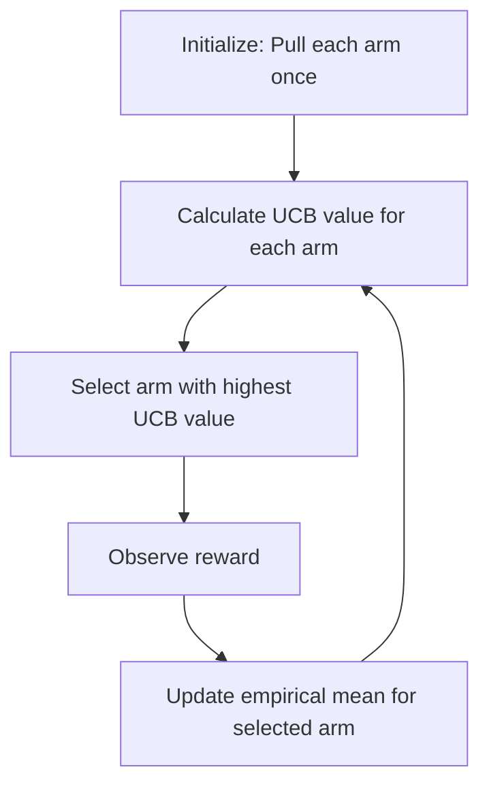

# 🎯 Upper Confidence Bound (UCB) Algorithm

<div align="center">


*A Principled Approach to the Exploration-Exploitation Dilemma*

</div>

---

## 📚 Table of Contents

- [What is the Upper Confidence Bound Algorithm?](#what-is-the-upper-confidence-bound-algorithm)
- [Mathematical Foundation](#mathematical-foundation)
- [How It Works](#how-it-works)
- [Implementation Guide](#implementation-guide)
- [Performance Optimization](#performance-optimization)
- [Evaluation Metrics](#evaluation-metrics)
- [Variants and Extensions](#variants-and-extensions)
- [Pros and Cons](#pros-and-cons)
- [Real-World Applications](#real-world-applications)
- [Comparison with Other Bandit Algorithms](#comparison-with-other-bandit-algorithms)
- [Advanced Topics](#advanced-topics)
- [FAQ](#faq)

---

## 🎯 What is the Upper Confidence Bound Algorithm?

The **Upper Confidence Bound (UCB)** algorithm is a decision-making strategy that addresses the classic **exploration-exploitation dilemma** in reinforcement learning and multi-armed bandit problems. It provides a principled approach to balancing the need to gather information about uncertain options (exploration) with the desire to select the best-known option (exploitation).

### Key Characteristics:

- **Optimism in the Face of Uncertainty**: UCB follows the principle of "optimism under uncertainty" by preferring options with potentially higher rewards
- **Confidence-Based Exploration**: Uses statistical confidence bounds to guide exploration
- **Regret Minimization**: Designed to minimize cumulative regret over time
- **Theoretical Guarantees**: Backed by strong mathematical foundations with proven upper bounds on regret
- **No Probabilistic Assumptions**: Unlike some other approaches, UCB doesn't require a probabilistic model of rewards
- **Online Learning**: Adapts decisions based on accumulated observations

### The Problem UCB Solves:

The multi-armed bandit problem is named after slot machines (one-armed bandits) in casinos. Imagine facing multiple slot machines (arms), each with an unknown probability of paying out. Your goal is to maximize your total reward over a series of pulls. The key challenge is balancing:

- **Exploration**: Trying different arms to learn their reward distributions
- **Exploitation**: Repeatedly pulling the arm that seems best based on current knowledge

UCB provides a systematic solution to this dilemma by maintaining an optimistic estimate of each arm's potential reward.

---

## 🧮 Mathematical Foundation

### Core Concepts and Definitions

1. **Multi-Armed Bandit Problem**:
   - K arms (actions), each with an unknown reward distribution
   - At each time step t, select an arm i and receive reward r_i(t)
   - Goal: Maximize cumulative reward over T time steps

2. **Expected Reward**:
   - For each arm i, there exists an unknown expected reward μ_i
   - The optimal arm i* has the highest expected reward: μ_* = max_i μ_i

3. **Regret**:
   - Instantaneous regret at time t: r_t = μ_* - μ_i(t)
   - Cumulative regret over T steps: R_T = Σ(t=1 to T) r_t
   - Goal is to minimize expected cumulative regret E[R_T]

4. **Uncertainty Estimation**:
   - UCB uses the principle that the true mean μ_i lies within a confidence interval around the empirical mean
   - As more samples are collected, this confidence interval shrinks

### The UCB1 Algorithm

The UCB1 algorithm, introduced by Auer, Cesa-Bianchi, and Fischer (2002), computes an upper confidence bound for each arm using the following formula:

$$UCB_i(t) = \bar{X}_i(t) + \sqrt{\frac{2\ln{t}}{n_i(t)}}$$

Where:
- $\bar{X}_i(t)$ is the empirical mean reward of arm i at time t
- $n_i(t)$ is the number of times arm i has been selected up to time t
- $\ln{t}$ is the natural logarithm of the current time step
- The second term represents the exploration bonus

### Theoretical Guarantees

UCB1 achieves a logarithmic regret bound:

$$E[R_T] \leq \sum_{i: \mu_i < \mu_*} \frac{8\ln{T}}{\Delta_i} + \sum_{i: \mu_i < \mu_*} \frac{\pi^2}{3}\Delta_i$$

Where $\Delta_i = \mu_* - \mu_i$ is the suboptimality gap of arm i.

This means that as T increases, the algorithm's performance approaches that of always selecting the best arm.

### Hoeffding's Inequality

UCB1 relies on Hoeffding's inequality, which provides a probability bound on the deviation of the empirical mean from the true mean:

$$P(|\bar{X}_i - \mu_i| > \epsilon) \leq 2e^{-2n_i\epsilon^2}$$

This allows us to construct confidence intervals with a guaranteed probability of containing the true mean.

### Example Calculation

Consider a 3-armed bandit with the following state after 10 pulls:

- Arm 1: Pulled 4 times, average reward = 2.0
- Arm 2: Pulled 3 times, average reward = 3.0
- Arm 3: Pulled 3 times, average reward = 1.5

To decide which arm to pull next, we calculate the UCB value for each arm:

$$UCB_1(10) = 2.0 + \sqrt{\frac{2\ln{10}}{4}} = 2.0 + 1.15 = 3.15$$

$$UCB_2(10) = 3.0 + \sqrt{\frac{2\ln{10}}{3}} = 3.0 + 1.33 = 4.33$$

$$UCB_3(10) = 1.5 + \sqrt{\frac{2\ln{10}}{3}} = 1.5 + 1.33 = 2.83$$

Based on these calculations, we would select Arm 2 for the next pull since it has the highest UCB value (4.33).

---

## ⚙️ How It Works

The UCB algorithm follows a systematic process to balance exploration and exploitation:

<div align="center">



</div>

### Step-by-Step Process:

1. **Initialization**:
   - Pull each arm once to get an initial estimate
   - Initialize counters and reward sums for each arm

2. **For each subsequent time step**:
   - Calculate the UCB value for each arm using the formula:
     $$UCB_i(t) = \bar{X}_i(t) + \sqrt{\frac{2\ln{t}}{n_i(t)}}$$
   - Select the arm with the highest UCB value
   - Observe the reward from the selected arm
   - Update the empirical mean and counter for the selected arm

3. **Decision Making**:
   - The first term in the UCB formula ($\bar{X}_i(t)$) encourages exploitation of arms with high observed rewards
   - The second term (exploration bonus) encourages exploration of arms with few pulls
   - The exploration bonus decreases as an arm is pulled more frequently
   - The logarithmic factor ensures that all arms are explored, but less promising arms are explored less frequently

### Exploration-Exploitation Balance:

- **Early stages**: The exploration term dominates, encouraging trying different arms
- **Later stages**: As more information is gathered, the empirical mean becomes more reliable, and the algorithm focuses more on the best-performing arms
- **Automatic adaptation**: No explicit exploration parameter needs to be tuned; the balance shifts naturally based on observed data

### Python Implementation:

```python
import numpy as np
import matplotlib.pyplot as plt

class UCB:
    """
    Upper Confidence Bound algorithm implementation for the multi-armed bandit problem.
    
    Parameters:
    -----------
    n_arms : int
        Number of arms (actions)
    """
    
    def __init__(self, n_arms):
        self.n_arms = n_arms
        self.counts = np.zeros(n_arms)  # Number of times each arm was pulled
        self.values = np.zeros(n_arms)  # Empirical mean reward for each arm
        self.t = 0  # Total number of pulls
        
    def select_arm(self):
        """
        Select an arm according to the UCB1 algorithm.
        
        Returns:
        --------
        int
            The selected arm index
        """
        # Initialization: try each arm once
        for arm in range(self.n_arms):
            if self.counts[arm] == 0:
                return arm
        
        # Calculate UCB for each arm
        ucb_values = np.zeros(self.n_arms)
        for arm in range(self.n_arms):
            exploration_bonus = np.sqrt(2 * np.log(self.t) / self.counts[arm])
            ucb_values[arm] = self.values[arm] + exploration_bonus
        
        # Select arm with highest UCB value
        return np.argmax(ucb_values)
    
    def update(self, chosen_arm, reward):
        """
        Update algorithm's state based on the arm pulled and reward received.
        
        Parameters:
        -----------
        chosen_arm : int
            The arm that was pulled
        reward : float
            The reward received
        """
        # Increment total pulls
        self.t += 1
        
        # Update counts and values for the chosen arm
        self.counts[chosen_arm] += 1
        n = self.counts[chosen_arm]
        
        # Incremental update of the empirical mean
        value = self.values[chosen_arm]
        new_value = ((n - 1) / n) * value + (1 / n) * reward
        self.values[chosen_arm] = new_value

# Example usage
def run_simulation(bandit_algorithm, true_rewards, n_steps):
    """Run a simulation of the bandit algorithm."""
    chosen_arms = []
    rewards = []
    cumulative_rewards = []
    regrets = []
    
    optimal_arm = np.argmax(true_rewards)
    cumulative_reward = 0
    cumulative_regret = 0
    
    for _ in range(n_steps):
        # Select arm
        arm = bandit_algorithm.select_arm()
        chosen_arms.append(arm)
        
        # Generate reward (true mean + noise)
        reward = np.random.normal(true_rewards[arm], 1.0)
        rewards.append(reward)
        
        # Update algorithm
        bandit_algorithm.update(arm, reward)
        
        # Track metrics
        cumulative_reward += reward
        cumulative_rewards.append(cumulative_reward)
        
        regret = true_rewards[optimal_arm] - true_rewards[arm]
        cumulative_regret += regret
        regrets.append(cumulative_regret)
    
    return {
        'chosen_arms': chosen_arms,
        'rewards': rewards,
        'cumulative_rewards': cumulative_rewards,
        'regrets': regrets
    }

# Set up a simulation
np.random.seed(42)
n_arms = 5
true_rewards = np.random.uniform(0, 10, n_arms)  # True mean rewards for each arm
print(f"True arm means: {true_rewards}")
print(f"Optimal arm: {np.argmax(true_rewards)} with mean {np.max(true_rewards):.4f}")

# Run simulation
ucb = UCB(n_arms)
n_steps = 1000
results = run_simulation(ucb, true_rewards, n_steps)

# Plot results
plt.figure(figsize=(15, 10))

# Plot arm selection frequency
plt.subplot(2, 2, 1)
arm_counts = np.zeros(n_arms)
for arm in results['chosen_arms']:
    arm_counts[arm] += 1
plt.bar(range(n_arms), arm_counts)
plt.xlabel('Arm')
plt.ylabel('Number of Pulls')
plt.title('Arm Selection Frequency')

# Plot reward history
plt.subplot(2, 2, 2)
plt.plot(results['rewards'])
plt.xlabel('Time Step')
plt.ylabel('Reward')
plt.title('Reward History')

# Plot cumulative reward
plt.subplot(2, 2, 3)
plt.plot(results['cumulative_rewards'])
plt.xlabel('Time Step')
plt.ylabel('Cumulative Reward')
plt.title('Cumulative Reward')

# Plot cumulative regret
plt.subplot(2, 2, 4)
plt.plot(results['regrets'])
plt.xlabel('Time Step')
plt.ylabel('Cumulative Regret')
plt.title('Cumulative Regret')

plt.tight_layout()
plt.show()

# Print final statistics
print("\nFinal statistics:")
print(f"Total reward: {results['cumulative_rewards'][-1]:.2f}")
print(f"Final arm values (UCB estimates): {ucb.values}")
for arm in range(n_arms):
    pulls = ucb.counts[arm]
    percentage = (pulls / n_steps) * 100
    print(f"Arm {arm}: {pulls} pulls ({percentage:.1f}%), estimated value: {ucb.values[arm]:.4f}, true value: {true_rewards[arm]:.4f}")
```

### Example Trace:

To illustrate how UCB evolves over time, let's trace through the first few steps of a simple 3-armed bandit problem:

1. **Initialization**:
   - Pull each arm once
   - Arm 1: Reward = 1.2, Count = 1, Value = 1.2
   - Arm 2: Reward = 0.7, Count = 1, Value = 0.7
   - Arm 3: Reward = 3.1, Count = 1, Value = 3.1

2. **Step 4 (t=4)**:
   - Calculate UCB values:
     - UCB₁ = 1.2 + √(2ln(3)/1) = 1.2 + 2.18 = 3.38
     - UCB₂ = 0.7 + √(2ln(3)/1) = 0.7 + 2.18 = 2.88
     - UCB₃ = 3.1 + √(2ln(3)/1) = 3.1 + 2.18 = 5.28
   - Select Arm 3 (highest UCB)
   - Receive reward 2.8
   - Update: Count₃ = 2, Value₃ = (3.1 + 2.8)/2 = 2.95

3. **Step 5 (t=5)**:
   - Calculate UCB values:
     - UCB₁ = 1.2 + √(2ln(4)/1) = 1.2 + 2.35 = 3.55
     - UCB₂ = 0.7 + √(2ln(4)/1) = 0.7 + 2.35 = 3.05
     - UCB₃ = 2.95 + √(2ln(4)/2) = 2.95 + 1.66 = 4.61
   - Select Arm 3 (highest UCB)
   - Receive reward 3.3
   - Update: Count₃ = 3, Value₃ = (2.95*2 + 3.3)/3 = 3.07

4. **Step 6 (t=6)**:
   - Calculate UCB values:
     - UCB₁ = 1.2 + √(2ln(5)/1) = 1.2 + 2.50 = 3.70
     - UCB₂ = 0.7 + √(2ln(5)/1) = 0.7 + 2.50 = 3.20
     - UCB₃ = 3.07 + √(2ln(5)/3) = 3.07 + 1.44 = 4.51
   - Select Arm 3 (highest UCB)
   - Receive reward 2.9
   - Update: Count₃ = 4, Value₃ = (3.07*3 + 2.9)/4 = 3.03

As the algorithm progresses, it continues to favor the arm with the highest UCB value, but will periodically explore less-pulled arms when their uncertainty (exploration bonus) becomes large enough.

---

## 💻 Implementation Guide

### Basic Implementation

Here's a complete implementation of the UCB1 algorithm with detailed explanations:

```python
import numpy as np
import matplotlib.pyplot as plt
from typing import List, Tuple, Dict, Any

class UCB1:
    """
    Implementation of the UCB1 algorithm for the multi-armed bandit problem.
    
    Parameters:
    -----------
    n_arms : int
        Number of arms (actions)
    """
    
    def __init__(self, n_arms: int):
        self.n_arms = n_arms
        self.reset()
        
    def reset(self):
        """Reset the algorithm's state."""
        self.counts = np.zeros(self.n_arms, dtype=int)
        self.values = np.zeros(self.n_arms, dtype=float)
        self.t = 0
        self.history = {
            'pulls': [],
            'rewards': [],
            'ucb_values': []
        }
        
    def select_arm(self) -> int:
        """
        Select an arm according to the UCB1 algorithm.
        
        Returns:
        --------
        int
            The selected arm index
        """
        # Handle initialization (each arm must be pulled once)
        for arm in range(self.n_arms):
            if self.counts[arm] == 0:
                return arm
        
        # Calculate UCB values for each arm
        ucb_values = np.zeros(self.n_arms)
        
        for arm in range(self.n_arms):
            # Exploitation term (empirical mean)
            exploitation = self.values[arm]
            
            # Exploration term (upper confidence bound)
            exploration = np.sqrt(2 * np.log(self.t) / self.counts[arm])
            
            # Combine for UCB value
            ucb_values[arm] = exploitation + exploration
        
        # Store UCB values for analysis
        self.history['ucb_values'].append(ucb_values.copy())
        
        # Return arm with highest UCB value (with random tiebreaking)
        return np.random.choice(np.flatnonzero(ucb_values == ucb_values.max()))
    
    def update(self, chosen_arm: int, reward: float):
        """
        Update the algorithm's state based on the arm pulled and reward received.
        
        Parameters:
        -----------
        chosen_arm : int
            The arm that was pulled
        reward : float
            The reward received
        """
        # Increment total time step
        self.t += 1
        
        # Update history
        self.history['pulls'].append(chosen_arm)
        self.history['rewards'].append(reward)
        
        # Update count for chosen arm
        self.counts[chosen_arm] += 1
        
        # Update empirical mean reward for chosen arm
        n = self.counts[chosen_arm]
        value = self.values[chosen_arm]
        
        # Incremental update formula: new_mean = old_mean + (reward - old_mean) / n
        self.values[chosen_arm] = value + (reward - value) / n

    def get_stats(self) -> Dict[str, Any]:
        """
        Get statistics about the algorithm's performance.
        
        Returns:
        --------
        dict
            Dictionary containing performance statistics
        """
        return {
            'arm_counts': self.counts.copy(),
            'arm_values': self.values.copy(),
            'total_pulls': self.t,
            'history': self.history
        }

class BanditEnvironment:
    """
    Environment for a multi-armed bandit problem.
    
    Parameters:
    -----------
    reward_means : array-like
        True mean rewards for each arm
    reward_stds : array-like or float, default=1.0
        Standard deviation of reward distributions
    """
    
    def __init__(self, reward_means: List[float], reward_stds: float = 1.0):
        self.reward_means = np.array(reward_means)
        
        # Handle different formats for standard deviations
        if np.isscalar(reward_stds):
            self.reward_stds = np.ones_like(self.reward_means) * reward_stds
        else:
            self.reward_stds = np.array(reward_stds)
            
        self.n_arms = len(reward_means)
        self.optimal_arm = np.argmax(self.reward_means)
        self.optimal_reward = self.reward_means[self.optimal_arm]
        
    def pull(self, arm: int) -> float:
        """
        Pull an arm and receive a reward.
        
        Parameters:
        -----------
        arm : int
            The arm to pull
            
        Returns:
        --------
        float
            The received reward
        """
        # Validate arm
        if arm < 0 or arm >= self.n_arms:
            raise ValueError(f"Invalid arm index: {arm}")
            
        # Generate reward as a random sample from the arm's distribution
        return np.random.normal(self.reward_means[arm], self.reward_stds[arm])
    
    def get_optimal_arm(self) -> int:
        """
        Get the index of the arm with the highest mean reward.
        
        Returns:
        --------
        int
            The optimal arm index
        """
        return self.optimal_arm

def run_ucb_simulation(
    reward_means: List[float], 
    n_steps: int, 
    reward_stds: float = 1.0,
    seed: int = None
) -> Dict[str, Any]:
    """
    Run a simulation of the UCB1 algorithm on a multi-armed bandit problem.
    
    Parameters:
    -----------
    reward_means : list of float
        True mean rewards for each arm
    n_steps : int
        Number of time steps to simulate
    reward_stds : float, default=1.0
        Standard deviation of reward distributions
    seed : int, optional
        Random seed for reproducibility
    
    Returns:
    --------
    dict
        Dictionary containing simulation results
    """
    # Set random seed if provided
    if seed is not None:
        np.random.seed(seed)
    
    # Initialize environment and algorithm
    env = BanditEnvironment(reward_means, reward_stds)
    ucb = UCB1(len(reward_means))
    
    # Store results
    rewards = np.zeros(n_steps)
    regrets = np.zeros(n_steps)
    chosen_arms = np.zeros(n_steps, dtype=int)
    cumulative_rewards = np.zeros(n_steps)
    cumulative_regrets = np.zeros(n_steps)
    
    # Run simulation
    for t in range(n_steps):
        # Select arm using UCB
        arm = ucb.select_arm()
        chosen_arms[t] = arm
        
        # Pull arm and get reward
        reward = env.pull(arm)
        rewards[t] = reward
        
        # Calculate regret
        regret = env.optimal_reward - env.reward_means[arm]
        regrets[t] = regret
        
        # Update UCB algorithm
        ucb.update(arm, reward)
        
        # Update cumulative metrics
        if t > 0:
            cumulative_rewards[t] = cumulative_rewards[t-1] + reward
            cumulative_regrets[t] = cumulative_regrets[t-1] + regret
        else:
            cumulative_rewards[t] = reward
            cumulative_regrets[t] = regret
    
    # Get final statistics
    final_stats = ucb.get_stats()
    
    # Combine all results
    results = {
        'chosen_arms': chosen_arms,
        'rewards': rewards,
        'regrets': regrets,
        'cumulative_rewards': cumulative_rewards,
        'cumulative_regrets': cumulative_regrets,
        'arm_counts': final_stats['arm_counts'],
        'estimated_values': final_stats['arm_values'],
        'true_values': env.reward_means,
        'optimal_arm': env.optimal_arm
    }
    
    return results

def plot_ucb_results(results: Dict[str, Any], title: str = "UCB1 Algorithm Performance"):
    """
    Plot results from a UCB simulation.
    
    Parameters:
    -----------
    results : dict
        Dictionary containing simulation results
    title : str, default="UCB1 Algorithm Performance"
        Title for the plot
    """
    n_arms = len(results['arm_counts'])
    n_steps = len(results['rewards'])
    
    # Create figure with multiple subplots
    plt.figure(figsize=(15, 12))
    plt.suptitle(title, fontsize=16)
    
    # Plot 1: Arm selection frequency
    plt.subplot(2, 2, 1)
    arm_percentages = results['arm_counts'] / n_steps * 100
    plt.bar(range(n_arms), arm_percentages, color='skyblue')
    plt.axvline(x=results['optimal_arm'], color='red', linestyle='--', 
                label=f'Optimal Arm ({results["optimal_arm"]})')
    plt.xlabel('Arm')
    plt.ylabel('Selection Percentage (%)')
    plt.title('Arm Selection Frequency')
    plt.xticks(range(n_arms))
    plt.legend()
    plt.grid(axis='y', alpha=0.3)
    
    # Plot 2: Moving average of rewards
    plt.subplot(2, 2, 2)
    window_size = min(100, n_steps // 10)  # Dynamic window size
    moving_avg = np.convolve(results['rewards'], np.ones(window_size)/window_size, mode='valid')
    plt.plot(moving_avg, color='green')
    plt.axhline(y=results['true_values'][results['optimal_arm']], color='red', linestyle='--',
                label=f'Optimal Reward ({results["true_values"][results["optimal_arm"]]:.2f})')
    plt.xlabel('Time Step')
    plt.ylabel(f'Average Reward (Window={window_size})')
    plt.title('Moving Average Reward')
    plt.legend()
    plt.grid(alpha=0.3)
    
    # Plot 3: Estimated vs true arm values
    plt.subplot(2, 2, 3)
    width = 0.35
    x = np.arange(n_arms)
    plt.bar(x - width/2, results['true_values'], width, label='True Values', color='lightcoral')
    plt.bar(x + width/2, results['estimated_values'], width, label='Estimated Values', color='lightblue')
    plt.xlabel('Arm')
    plt.ylabel('Value')
    plt.title('Estimated vs True Arm Values')
    plt.xticks(range(n_arms))
    plt.legend()
    plt.grid(axis='y', alpha=0.3)
    
    # Plot 4: Cumulative regret
    plt.subplot(2, 2, 4)
    plt.plot(results['cumulative_regrets'], color='red')
    plt.xlabel('Time Step')
    plt.ylabel('Cumulative Regret')
    plt.title('Cumulative Regret Over Time')
    # Add logarithmic reference line
    if n_steps > 100:
        log_line = 8 * np.log(np.arange(1, n_steps+1))
        plt.plot(log_line, 'k--', alpha=0.5, label='ln(t) reference')
        plt.legend()
    plt.grid(alpha=0.3)
    
    plt.tight_layout(rect=[0, 0.03, 1, 0.95])  # Adjust layout with room for suptitle
    plt.show()

# Example usage
if __name__ == "__main__":
    # Set up a bandit problem
    reward_means = [2.0, 3.0, 1.5, 4.0, 2.5]
    n_steps = 2000
    
    # Run simulation
    results = run_ucb_simulation(reward_means, n_steps, seed=42)
    
    # Plot results
    plot_ucb_results(results)
    
    # Print final statistics
    print("\nFinal Statistics:")
    print(f"Optimal arm: {results['optimal_arm']} with true value {results['true_values'][results['optimal_arm']]:.4f}")
    print("\nArm selection counts and percentages:")
    for arm in range(len(results['arm_counts'])):
        count = results['arm_counts'][arm]
        percentage = (count / n_steps) * 100
        estimated = results['estimated_values'][arm]
        true_value = results['true_values'][arm]
        error = estimated - true_value
        print(f"Arm {arm}: {count} pulls ({percentage:.1f}%), est={estimated:.4f}, true={true_value:.4f}, error={error:.4f}")
    
    print(f"\nTotal reward: {results['cumulative_rewards'][-1]:.2f}")
    print(f"Average reward per step: {results['cumulative_rewards'][-1]/n_steps:.4f}")
    print(f"Final regret: {results['cumulative_regrets'][-1]:.2f}")
    print(f"Average regret per step: {results['cumulative_regrets'][-1]/n_steps:.4f}")
```

### Contextual UCB Implementation

UCB can be extended to handle contextual information, where the best arm depends on an observed context:

```python
class ContextualLinUCB:
    """
    Implementation of Linear UCB algorithm for contextual bandits.
    
    Parameters:
    -----------
    n_arms : int
        Number of arms (actions)
    d : int
        Dimension of context feature vector
    alpha : float, default=1.0
        Exploration parameter
    """
    
    def __init__(self, n_arms, d, alpha=1.0):
        self.n_arms = n_arms
        self.d = d  # Dimension of context features
        self.alpha = alpha  # Exploration parameter
        
        # For each arm, maintain:
        # 1. A_a: d x d matrix (feature covariance matrix)
        # 2. b_a: d x 1 vector (weighted feature sum)
        # 3. theta_a: d x 1 vector (weights/coefficients)
        self.A = [np.identity(d) for _ in range(n_arms)]
        self.b = [np.zeros(d) for _ in range(n_arms)]
        self.theta = [np.zeros(d) for _ in range(n_arms)]
        
        # History
        self.history = {
            'pulls': [],
            'rewards': [],
            'contexts': []
        }
    
    def select_arm(self, context):
        """
        Select an arm based on context and UCB values.
        
        Parameters:
        -----------
        context : array-like of shape (d,)
            Context feature vector
            
        Returns:
        --------
        int
            The selected arm index
        """
        context = np.array(context).reshape(self.d)
        self.history['contexts'].append(context)
        
        ucb_values = np.zeros(self.n_arms)
        
        for arm in range(self.n_arms):
            # Compute theta: A^{-1} * b
            theta = np.linalg.solve(self.A[arm], self.b[arm])
            self.theta[arm] = theta
            
            # Calculate predicted reward: theta^T * context
            predicted_reward = np.dot(theta, context)
            
            # Calculate exploration bonus
            exploration_bonus = self.alpha * np.sqrt(
                np.dot(context, np.linalg.solve(self.A[arm], context))
            )
            
            # UCB value = predicted reward + exploration bonus
            ucb_values[arm] = predicted_reward + exploration_bonus
        
        # Select arm with highest UCB value
        chosen_arm = np.argmax(ucb_values)
        self.history['pulls'].append(chosen_arm)
        return chosen_arm
    
    def update(self, chosen_arm, reward, context):
        """
        Update model with new observation.
        
        Parameters:
        -----------
        chosen_arm : int
            The arm that was pulled
        reward : float
            The reward received
        context : array-like of shape (d,)
            Context feature vector used for the decision
        """
        context = np.array(context).reshape(self.d)
        self.history['rewards'].append(reward)
        
        # Update A: A += x * x^T
        self.A[chosen_arm] += np.outer(context, context)
        
        # Update b: b += r * x
        self.b[chosen_arm] += reward * context
        
        # Recompute theta: theta = A^{-1} * b
        self.theta[chosen_arm] = np.linalg.solve(self.A[chosen_arm], self.b[chosen_arm])

# Example usage
def run_contextual_bandit_simulation():
    """Run a simulation of contextual bandit with LinUCB."""
    # Parameters
    n_arms = 3
    d = 5  # context dimension
    n_steps = 1000
    
    # True coefficients for each arm (unknown to the algorithm)
    true_theta = [
        np.array([0.2, -0.3, 0.5, 0.1, -0.7]),  # Arm 0
        np.array([-0.5, 0.2, 0.1, 0.3, 0.8]),   # Arm 1
        np.array([0.1, 0.4, -0.2, -0.6, 0.3])   # Arm 2
    ]
    
    # Initialize algorithm
    linucb = ContextualLinUCB(n_arms, d, alpha=1.0)
    
    rewards = []
    regrets = []
    
    for t in range(n_steps):
        # Generate random context
        context = np.random.normal(0, 1, d)
        
        # Calculate expected rewards for each arm (unknown to the algorithm)
        expected_rewards = [np.dot(theta, context) for theta in true_theta]
        best_arm = np.argmax(expected_rewards)
        
        # Select arm using LinUCB
        chosen_arm = linucb.select_arm(context)
        
        # Generate reward with noise
        noise = np.random.normal(0, 0.1)
        reward = expected_rewards[chosen_arm] + noise
        rewards.append(reward)
        
        # Calculate regret
        regret = expected_rewards[best_arm] - expected_rewards[chosen_arm]
        regrets.append(regret)
        
        # Update algorithm
        linucb.update(chosen_arm, reward, context)
    
    # Plot results
    plt.figure(figsize=(12, 5))
    
    plt.subplot(1, 2, 1)
    plt.plot(np.cumsum(rewards))
    plt.xlabel('Time Step')
    plt.ylabel('Cumulative Reward')
    plt.title('Cumulative Reward Over Time')
    plt.grid(alpha=0.3)
    
    plt.subplot(1, 2, 2)
    plt.plot(np.cumsum(regrets), 'r')
    plt.xlabel('Time Step')
    plt.ylabel('Cumulative Regret')
    plt.title('Cumulative Regret Over Time')
    plt.grid(alpha=0.3)
    
    plt.tight_layout()
    plt.show()
    
    # Print arm selection statistics
    arm_counts = np.zeros(n_arms)
    for arm in linucb.history['pulls']:
        arm_counts[arm] += 1
    
    print("Arm selection counts:")
    for arm in range(n_arms):
        percentage = (arm_counts[arm] / n_steps) * 100
        print(f"Arm {arm}: {arm_counts[arm]} pulls ({percentage:.1f}%)")
```

### Batch UCB Implementation

In some applications, arms need to be selected in batches without immediate feedback:

```python
class BatchUCB:
    """
    UCB algorithm adapted for batch processing.
    
    Parameters:
    -----------
    n_arms : int
        Number of arms (actions)
    batch_size : int
        Number of arms to select in each batch
    """
    
    def __init__(self, n_arms, batch_size):
        self.n_arms = n_arms
        self.batch_size = min(batch_size, n_arms)  # Can't select more arms than available
        self.counts = np.zeros(n_arms)
        self.values = np.zeros(n_arms)
        self.t = 0
        self.pending_updates = {}  # Tracks arms pulled but not yet updated
        
    def select_batch(self):
        """
        Select a batch of arms according to the UCB algorithm.
        
        Returns:
        --------
        list
            The selected arm indices
        """
        # Start with all arms as candidates
        candidates = set(range(self.n_arms))
        
        # Remove arms that have pending updates
        candidates = candidates - set(self.pending_updates.keys())
        
        # If we have uninitialized arms, prioritize those
        uninitialized = [arm for arm in candidates if self.counts[arm] == 0]
        if uninitialized:
            # Select as many uninitialized arms as we can fit in the batch
            selected = uninitialized[:self.batch_size]
            # If we need more, add arms based on UCB values
            if len(selected) < self.batch_size:
                remaining_batch_size = self.batch_size - len(selected)
                # Remove selected arms from candidates
                candidates = candidates - set(selected)
                # Select remaining arms using UCB
                selected.extend(self._select_ucb_arms(candidates, remaining_batch_size))
        else:
            # Select arms based on UCB values
            selected = self._select_ucb_arms(candidates, self.batch_size)
        
        # Mark selected arms as pending
        for arm in selected:
            self.pending_updates[arm] = self.t
        
        self.t += 1
        return selected
    
    def _select_ucb_arms(self, candidates, n):
        """Helper function to select n arms based on UCB values."""
        # Calculate UCB values for all candidate arms
        ucb_values = {}
        for arm in candidates:
            if self.counts[arm] == 0:
                # Give uninitialized arms an infinite UCB value
                ucb_values[arm] = float('inf')
            else:
                # Regular UCB calculation
                exploration_bonus = np.sqrt(2 * np.log(self.t) / self.counts[arm])
                ucb_values[arm] = self.values[arm] + exploration_bonus
        
        # Select top n arms by UCB value
        sorted_arms = sorted(ucb_values.keys(), key=lambda x: ucb_values[x], reverse=True)
        return sorted_arms[:n]
    
    def update(self, updates):
        """
        Update algorithm with batch results.
        
        Parameters:
        -----------
        updates : dict
            Dictionary mapping arm indices to rewards
        """
        for arm, reward in updates.items():
            if arm in self.pending_updates:
                # Remove from pending updates
                del self.pending_updates[arm]
                
                # Update count and value
                self.counts[arm] += 1
                n = self.counts[arm]
                self.values[arm] = ((n - 1) / n) * self.values[arm] + (1 / n) * reward
            else:
                raise ValueError(f"Received update for arm {arm} which was not pending")
```

---

## 🚀 Performance Optimization

### 1. **Efficient Implementation Techniques**

UCB implementations can be optimized for better performance:

```python
class OptimizedUCB:
    """
    Memory and computationally optimized UCB implementation.
    
    Parameters:
    -----------
    n_arms : int
        Number of arms (actions)
    """
    
    def __init__(self, n_arms):
        self.n_arms = n_arms
        self.counts = np.zeros(n_arms, dtype=np.int32)
        self.sum_rewards = np.zeros(n_arms, dtype=np.float64)  # Use sum instead of mean
        self.t = 0
        self.log_t = 0  # Cache the logarithm
        
    def select_arm(self):
        """Select arm with highest UCB value."""
        # Handle initialization phase
        for arm in range(self.n_arms):
            if self.counts[arm] == 0:
                return arm
        
        # Compute UCB values using vectorized operations
        values = self.sum_rewards / self.counts
        exploration = np.sqrt(2 * self.log_t / self.counts)
        ucb_values = values + exploration
        
        # Return arm with highest UCB value
        return np.argmax(ucb_values)
    
    def update(self, chosen_arm, reward):
        """Update algorithm state."""
        # Update time step and cache log(t)
        self.t += 1
        self.log_t = np.log(self.t)
        
        # Update statistics for chosen arm
        self.counts[chosen_arm] += 1
        self.sum_rewards[chosen_arm] += reward
```

### 2. **Logarithm Caching**

Computing logarithms repeatedly is expensive. We can cache them:

```python
def optimized_ucb_with_log_cache(n_arms, n_steps):
    """UCB implementation with logarithm caching."""
    counts = np.zeros(n_arms, dtype=np.int32)
    values = np.zeros(n_arms, dtype=np.float64)
    
    # Pre-compute logarithms for common values
    log_cache = np.zeros(n_steps + 1)
    for t in range(2, n_steps + 1):  # Start from 2 as log(1) = 0
        log_cache[t] = np.log(t)
    
    chosen_arms = np.zeros(n_steps, dtype=np.int32)
    
    # Simulation
    for t in range(n_steps):
        # Initialization phase
        for arm in range(n_arms):
            if counts[arm] == 0:
                chosen_arm = arm
                break
        else:
            # Calculate UCB values using cached logarithms
            ucb_values = values + np.sqrt(2 * log_cache[t+1] / counts)
            chosen_arm = np.argmax(ucb_values)
        
        chosen_arms[t] = chosen_arm
        
        # Generate reward (in a real scenario, this would come from environment)
        reward = np.random.normal(true_means[chosen_arm], 1.0)
        
        # Update statistics
        counts[chosen_arm] += 1
        values[chosen_arm] += (reward - values[chosen_arm]) / counts[chosen_arm]
    
    return chosen_arms
```

### 3. **Batch Updates for Multiple Arms**

When selecting multiple arms in parallel, we can optimize:

```python
def optimized_batch_ucb(n_arms, batch_size, n_batches):
    """Optimized UCB for batch selections."""
    counts = np.zeros(n_arms, dtype=np.int32)
    sum_rewards = np.zeros(n_arms, dtype=np.float64)
    t = 0
    
    all_choices = []
    
    for batch in range(n_batches):
        # Increment time step
        t += 1
        log_t = np.log(t)
        
        # Calculate UCB values in one vectorized operation
        with np.errstate(divide='ignore'):  # Ignore division by zero
            values = np.divide(sum_rewards, counts, out=np.zeros_like(sum_rewards), where=counts!=0)
            exploration = np.sqrt(2 * log_t / counts)
            exploration[counts == 0] = float('inf')  # Ensure uninitialized arms are selected first
            ucb_values = values + exploration
        
        # Select batch_size arms with highest UCB values
        chosen_arms = np.argsort(-ucb_values)[:batch_size]
        all_choices.extend(chosen_arms)
        
        # Simulate pulling these arms
        for arm in chosen_arms:
            reward = np.random.normal(true_means[arm], 1.0)
            counts[arm] += 1
            sum_rewards[arm] += reward
    
    return all_choices
```

### 4. **Approximation Techniques for Large-Scale Problems**

For very large action spaces, exact UCB may be impractical. Approximation techniques can help:

```python
class ApproximateUCB:
    """
    UCB implementation using approximation techniques for large action spaces.
    
    Parameters:
    -----------
    arm_features : array-like of shape (n_arms, d)
        Feature vectors for each arm
    n_clusters : int, default=10
        Number of arm clusters to maintain
    """
    
    def __init__(self, arm_features, n_clusters=10):
        from sklearn.cluster import KMeans
        
        self.arm_features = np.array(arm_features)
        self.n_arms = self.arm_features.shape[0]
        self.n_clusters = min(n_clusters, self.n_arms)
        
        # Cluster arms based on features
        self.kmeans = KMeans(n_clusters=self.n_clusters, random_state=42)
        self.kmeans.fit(self.arm_features)
        self.arm_clusters = self.kmeans.predict(self.arm_features)
        self.cluster_centers = self.kmeans.cluster_centers_
        
        # Initialize statistics for each cluster
        self.cluster_counts = np.zeros(self.n_clusters)
        self.cluster_values = np.zeros(self.n_clusters)
        self.t = 0
        
    def select_arm(self):
        """Select an arm using clustered UCB approach."""
        # Increment time step
        self.t += 1
        
        # Handle initialization phase
        for cluster in range(self.n_clusters):
            if self.cluster_counts[cluster] == 0:
                # Choose a random arm from this cluster
                cluster_arms = np.where(self.arm_clusters == cluster)[0]
                return np.random.choice(cluster_arms)
        
        # Calculate UCB values for each cluster
        ucb_values = np.zeros(self.n_clusters)
        for cluster in range(self.n_clusters):
            exploration_bonus = np.sqrt(2 * np.log(self.t) / self.cluster_counts[cluster])
            ucb_values[cluster] = self.cluster_values[cluster] + exploration_bonus
        
        # Select best cluster
        best_cluster = np.argmax(ucb_values)
        
        # Choose a random arm from the best cluster
        cluster_arms = np.where(self.arm_clusters == best_cluster)[0]
        return np.random.choice(cluster_arms)
    
    def update(self, chosen_arm, reward):
        """Update statistics based on observed reward."""
        # Get the cluster of the chosen arm
        cluster = self.arm_clusters[chosen_arm]
        
        # Update cluster statistics
        self.cluster_counts[cluster] += 1
        n = self.cluster_counts[cluster]
        self.cluster_values[cluster] = ((n - 1) / n) * self.cluster_values[cluster] + (1 / n) * reward
```

### 5. **Optimized Memory Management for Large Numbers of Arms**

When dealing with millions of arms, memory-efficient data structures are crucial:

```python
class LargeScaleUCB:
    """
    Memory-efficient UCB for problems with millions of arms.
    
    Uses sparse data structures to store statistics only for arms that have been pulled.
    
    Parameters:
    -----------
    n_arms : int
        Total number of arms (can be very large)
    """
    
    def __init__(self, n_arms):
        from collections import defaultdict
        
        self.n_arms = n_arms
        self.counts = defaultdict(int)  # Only store counts for arms we've seen
        self.values = defaultdict(float)  # Only store values for arms we've seen
        self.t = 0
    
    def select_arm(self):
        """Select arm with highest UCB value."""
        # Increment time step
        self.t += 1
        
        # If we haven't tried all arms yet, select an untried one
        if len(self.counts) < self.n_arms:
            # Find an arm we haven't tried
            for arm in range(self.n_arms):
                if arm not in self.counts:
                    return arm
        
        # Calculate UCB values for arms we've seen
        ucb_values = {}
        log_t = np.log(self.t)
        
        for arm, count in self.counts.items():
            exploration_bonus = np.sqrt(2 * log_t / count)
            ucb_values[arm] = self.values[arm] + exploration_bonus
        
        # Return arm with highest UCB value
        return max(ucb_values, key=ucb_values.get)
    
    def update(self, chosen_arm, reward):
        """Update statistics for the chosen arm."""
        # Update count
        self.counts[chosen_arm] += 1
        count = self.counts[chosen_arm]
        
        # Update value
        self.values[chosen_arm] = ((count - 1) / count) * self.values[chosen_arm] + (1 / count) * reward
```

### 6. **Parallel Implementation for Distributed Computing**

For very large problems, a distributed implementation can be beneficial:

```python
# Note: This is a conceptual example that would need to be adapted to your specific
# distributed computing framework (e.g., Ray, Dask, PySpark)

def distributed_ucb(n_arms, n_steps, n_workers=4):
    """
    Conceptual implementation of distributed UCB.
    
    Parameters:
    -----------
    n_arms : int
        Number of arms
    n_steps : int
        Number of time steps
    n_workers : int, default=4
        Number of parallel workers
    """
    # This would be implemented using your distributed computing framework
    
    # 1. Initialize shared state
    shared_counts = np.zeros(n_arms)
    shared_rewards = np.zeros(n_arms)
    shared_pulls = 0
    
    # 2. Worker function
    def worker_function(worker_id, steps_per_worker):
        nonlocal shared_counts, shared_rewards, shared_pulls
        
        local_results = []
        
        for _ in range(steps_per_worker):
            # Get current state (with synchronization in real implementation)
            counts = shared_counts.copy()
            values = shared_rewards / np.maximum(counts, 1)  # Avoid division by zero
            t = shared_pulls
            
            # Select arm using UCB
            ucb_values = np.zeros(n_arms)
            for arm in range(n_arms):
                if counts[arm] == 0:
                    ucb_values[arm] = float('inf')
                else:
                    exploration_bonus = np.sqrt(2 * np.log(t) / counts[arm])
                    ucb_values[arm] = values[arm] + exploration_bonus
            
            chosen_arm = np.argmax(ucb_values)
            
            # Pull arm (in real scenario, this would interact with environment)
            reward = np.random.normal(0, 1)  # Placeholder
            
            # Update shared state (with proper locking in real implementation)
            shared_counts[chosen_arm] += 1
            shared_rewards[chosen_arm] += reward
            shared_pulls += 1
            
            local_results.append((chosen_arm, reward))
        
        return local_results
    
    # 3. Distribute work among workers
    steps_per_worker = n_steps // n_workers
    
    # In a real implementation, you would use your framework's parallel execution
    results = []
    for worker_id in range(n_workers):
        results.extend(worker_function(worker_id, steps_per_worker))
    
    return results
```

---

## 📊 Evaluation Metrics

To evaluate the performance of UCB algorithms, several metrics are commonly used:

### 1. **Cumulative Regret**

Regret measures the difference between the reward obtained and the reward that could have been obtained by always selecting the optimal arm:

```python
def calculate_cumulative_regret(chosen_arms, rewards, optimal_arm_value):
    """
    Calculate cumulative regret over time.
    
    Parameters:
    -----------
    chosen_arms : array-like
        Sequence of arms chosen by the algorithm
    rewards : array-like
        Rewards received for each arm pull
    optimal_arm_value : float
        Expected reward of the optimal arm
        
    Returns:
    --------
    numpy.ndarray
        Cumulative regret at each time step
    """
    # Calculate instantaneous regret at each step
    instantaneous_regret = optimal_arm_value - rewards
    
    # Calculate cumulative regret
    cumulative_regret = np.cumsum(instantaneous_regret)
    
    return cumulative_regret

def plot_regret_comparison(algorithms, env, n_steps, n_runs=10):
    """
    Compare regret of multiple algorithms.
    
    Parameters:
    -----------
    algorithms : list of tuples
        List of (algorithm_name, algorithm_instance) tuples
    env : BanditEnvironment
        Bandit environment to run simulations on
    n_steps : int
        Number of time steps per run
    n_runs : int, default=10
        Number of runs for each algorithm
    """
    optimal_arm = env.get_optimal_arm()
    optimal_reward = env.reward_means[optimal_arm]
    
    plt.figure(figsize=(12, 8))
    
    for name, algorithm in algorithms:
        # Run multiple simulations
        all_regrets = []
        
        for run in range(n_runs):
            algorithm.reset()  # Reset algorithm state
            
            # Run simulation
            regrets = []
            
            for t in range(n_steps):
                # Select arm
                arm = algorithm.select_arm()
                
                # Pull arm and get reward
                reward = env.pull(arm)
                
                # Update algorithm
                algorithm.update(arm, reward)
                
                # Calculate regret
                regret = optimal_reward - env.reward_means[arm]
                regrets.append(regret)
            
            # Calculate cumulative regret
            cum_regret = np.cumsum(regrets)
            all_regrets.append(cum_regret)
        
        # Calculate mean and confidence intervals
        mean_regret = np.mean(all_regrets, axis=0)
        std_regret = np.std(all_regrets, axis=0)
        
        # Plot mean regret with shaded 95% confidence interval
        plt.plot(mean_regret, label=name)
        plt.fill_between(
            range(n_steps),
            mean_regret - 1.96 * std_regret / np.sqrt(n_runs),
            mean_regret + 1.96 * std_regret / np.sqrt(n_runs),
            alpha=0.2
        )
    
    # Add logarithmic reference line
    log_line = 8 * np.log(np.arange(1, n_steps+1))
    plt.plot(log_line, 'k--', alpha=0.5, label='ln(t) reference')
    
    plt.xlabel('Time Step')
    plt.ylabel('Cumulative Regret')
    plt.title('Cumulative Regret Comparison')
    plt.legend()
    plt.grid(alpha=0.3)
    plt.show()
```

### 2. **Simple Regret**

Simple regret measures how far the algorithm's best guess of the optimal arm is from the true optimal arm:

```python
def calculate_simple_regret(algorithm, true_means):
    """
    Calculate simple regret based on algorithm's current estimates.
    
    Parameters:
    -----------
    algorithm : UCB instance
        The UCB algorithm instance
    true_means : array-like
        True mean rewards of each arm
        
    Returns:
    --------
    float
        Simple regret
    """
    # Get algorithm's current best arm
    best_arm_estimate = np.argmax(algorithm.values)
    
    # Get true best arm
    true_best_arm = np.argmax(true_means)
    
    # Calculate simple regret
    simple_regret = true_means[true_best_arm] - true_means[best_arm_estimate]
    
    return simple_regret
```

### 3. **Optimal Arm Selection Percentage**

This metric tracks how often the algorithm selects the optimal arm:

```python
def calculate_optimal_arm_percentage(chosen_arms, optimal_arm):
    """
    Calculate percentage of times the optimal arm was chosen.
    
    Parameters:
    -----------
    chosen_arms : array-like
        Sequence of arms chosen by the algorithm
    optimal_arm : int
        Index of the optimal arm
        
    Returns:
    --------
    float
        Percentage of optimal arm selections
    """
    optimal_selections = np.sum(np.array(chosen_arms) == optimal_arm)
    total_selections = len(chosen_arms)
    
    return optimal_selections / total_selections * 100

def plot_optimal_arm_percentage_over_time(chosen_arms, optimal_arm, window_size=100):
    """
    Plot the percentage of optimal arm selections over time using a sliding window.
    
    Parameters:
    -----------
    chosen_arms : array-like
        Sequence of arms chosen by the algorithm
    optimal_arm : int
        Index of the optimal arm
    window_size : int, default=100
        Size of the sliding window
    """
    n_steps = len(chosen_arms)
    optimal_percentage = []
    
    for t in range(window_size, n_steps + 1):
        window = chosen_arms[t - window_size:t]
        percentage = calculate_optimal_arm_percentage(window, optimal_arm)
        optimal_percentage.append(percentage)
    
    plt.figure(figsize=(10, 6))
    plt.plot(range(window_size, n_steps + 1), optimal_percentage)
    plt.xlabel('Time Step')
    plt.ylabel('Optimal Arm Selection Percentage (%)')
    plt.title(f'Optimal Arm Selection Rate (Window Size: {window_size})')
    plt.ylim(0, 100)
    plt.grid(alpha=0.3)
    plt.show()
```

### 4. **Arm Exploration Profile**

This metric shows how the algorithm explores different arms over time:

```python
def plot_arm_exploration_profile(chosen_arms, n_arms):
    """
    Plot the distribution of arm selections over time.
    
    Parameters:
    -----------
    chosen_arms : array-like
        Sequence of arms chosen by the algorithm
    n_arms : int
        Total number of arms
    """
    n_steps = len(chosen_arms)
    
    # Count cumulative selections for each arm
    cumulative_selections = np.zeros((n_steps, n_arms))
    
    for t in range(n_steps):
        # Copy previous step's counts
        if t > 0:
            cumulative_selections[t] = cumulative_selections[t-1].copy()
        
        # Increment count for chosen arm
        cumulative_selections[t, chosen_arms[t]] += 1
    
    # Convert to percentages
    percentages = cumulative_selections / np.arange(1, n_steps + 1).reshape(-1, 1) * 100
    
    # Plot
    plt.figure(figsize=(12, 6))
    
    for arm in range(n_arms):
        plt.plot(percentages[:, arm], label=f'Arm {arm}')
    
    plt.xlabel('Time Step')
    plt.ylabel('Selection Percentage (%)')
    plt.title('Arm Selection Distribution Over Time')
    plt.legend()
    plt.grid(alpha=0.3)
    plt.show()
```

### 5. **Confidence Bound Convergence**

This metric shows how confidence bounds tighten over time:

```python
def plot_confidence_bound_convergence(ucb_history, true_means):
    """
    Plot the convergence of UCB confidence bounds over time.
    
    Parameters:
    -----------
    ucb_history : list
        List of UCB values at each time step
    true_means : array-like
        True mean rewards of each arm
    """
    n_steps = len(ucb_history)
    n_arms = len(true_means)
    
    # Extract UCB values for each arm
    ucb_values = np.array(ucb_history)  # Shape: (n_steps, n_arms)
    
    plt.figure(figsize=(12, 8))
    
    for arm in range(n_arms):
        # Plot UCB values
        plt.plot(ucb_values[:, arm], 'b-', alpha=0.3)
        
        # Plot true mean as a horizontal line
        plt.axhline(y=true_means[arm], color='r', linestyle='-', alpha=0.5)
    
    plt.xlabel('Time Step')
    plt.ylabel('UCB Value')
    plt.title('Confidence Bound Convergence')
    plt.grid(alpha=0.3)
    plt.show()
```

### 6. **Estimation Error**

This metric tracks how well the algorithm estimates the true arm values:

```python
def plot_estimation_error(algorithm_values, true_means, log_scale=True):
    """
    Plot the error in estimating arm values over time.
    
    Parameters:
    -----------
    algorithm_values : array-like of shape (n_steps, n_arms)
        Algorithm's estimated values at each time step
    true_means : array-like
        True mean rewards of each arm
    log_scale : bool, default=True
        Whether to use a logarithmic scale for the y-axis
    """
    n_steps, n_arms = algorithm_values.shape
    
    # Calculate absolute error for each arm
    errors = np.abs(algorithm_values - true_means.reshape(1, -1))
    
    # Calculate mean error across all arms
    mean_error = np.mean(errors, axis=1)
    
    plt.figure(figsize=(10, 6))
    
    # Plot error over time
    plt.plot(mean_error)
    
    if log_scale:
        plt.yscale('log')
    
    plt.xlabel('Time Step')
    plt.ylabel('Mean Absolute Error')
    plt.title('Estimation Error Over Time')
    plt.grid(alpha=0.3)
    plt.show()
```

### 7. **Comprehensive Evaluation Framework**

Combining multiple metrics provides a more complete picture of algorithm performance:

```python
def comprehensive_evaluation(algorithms, env, n_steps, n_runs=10):
    """
    Comprehensive evaluation of multiple bandit algorithms.
    
    Parameters:
    -----------
    algorithms : list of tuples
        List of (algorithm_name, algorithm_class) tuples
    env : BanditEnvironment
        Bandit environment to run simulations on
    n_steps : int
        Number of time steps per run
    n_runs : int, default=10
        Number of runs for each algorithm
        
    Returns:
    --------
    dict
        Dictionary of evaluation results
    """
    optimal_arm = env.get_optimal_arm()
    optimal_reward = env.reward_means[optimal_arm]
    n_arms = env.n_arms
    
    # Initialize results
    results = {
        name: {
            'cumulative_regret': np.zeros((n_runs, n_steps)),
            'cumulative_reward': np.zeros((n_runs, n_steps)),
            'arm_counts': np.zeros((n_runs, n_arms)),
            'final_estimates': np.zeros((n_runs, n_arms)),
            'optimal_arm_rate': np.zeros(n_runs),
            'simple_regret': np.zeros(n_runs)
        }
        for name, _ in algorithms
    }
    
    # Run simulations
    for alg_name, alg_class in algorithms:
        print(f"Evaluating {alg_name}...")
        
        for run in range(n_runs):
            # Initialize algorithm
            alg = alg_class(n_arms)
            arm_counts = np.zeros(n_arms)
            
            rewards = np.zeros(n_steps)
            chosen_arms = np.zeros(n_steps, dtype=int)
            regrets = np.zeros(n_steps)
            
            # Run simulation
            for t in range(n_steps):
                # Select arm
                arm = alg.select_arm()
                chosen_arms[t] = arm
                arm_counts[arm] += 1
                
                # Pull arm and get reward
                reward = env.pull(arm)
                rewards[t] = reward
                
                # Update algorithm
                alg.update(arm, reward)
                
                # Calculate regret
                regret = optimal_reward - env.reward_means[arm]
                regrets[t] = regret
            
            # Calculate cumulative metrics
            cumulative_reward = np.cumsum(rewards)
            cumulative_regret = np.cumsum(regrets)
            
            # Calculate optimal arm selection rate
            optimal_arm_rate = arm_counts[optimal_arm] / n_steps
            
            # Calculate simple regret
            estimated_best_arm = np.argmax(alg.values)
            simple_regret = optimal_reward - env.reward_means[estimated_best_arm]
            
            # Store results
            results[alg_name]['cumulative_regret'][run] = cumulative_regret
            results[alg_name]['cumulative_reward'][run] = cumulative_reward
            results[alg_name]['arm_counts'][run] = arm_counts
            results[alg_name]['final_estimates'][run] = alg.values
            results[alg_name]['optimal_arm_rate'][run] = optimal_arm_rate
            results[alg_name]['simple_regret'][run] = simple_regret
    
    # Calculate summary statistics
    for name in results:
        for metric in ['cumulative_regret', 'cumulative_reward']:
            results[name][f'mean_{metric}'] = np.mean(results[name][metric], axis=0)
            results[name][f'std_{metric}'] = np.std(results[name][metric], axis=0)
            results[name][f'final_{metric}'] = results[name][f'mean_{metric}'][-1]
        
        results[name]['mean_optimal_arm_rate'] = np.mean(results[name]['optimal_arm_rate'])
        results[name]['mean_simple_regret'] = np.mean(results[name]['simple_regret'])
    
    return results

def plot_comprehensive_results(results, env):
    """
    Plot comprehensive evaluation results.
    
    Parameters:
    -----------
    results : dict
        Results dictionary from comprehensive_evaluation
    env : BanditEnvironment
        Bandit environment that was used
    """
    algorithm_names = list(results.keys())
    n_steps = len(results[algorithm_names[0]]['mean_cumulative_regret'])
    optimal_arm = env.get_optimal_arm()
    
    # Create figure with subplots
    fig, axes = plt.subplots(2, 2, figsize=(15, 12))
    
    # Plot cumulative regret
    ax = axes[0, 0]
    for name in algorithm_names:
        mean_regret = results[name]['mean_cumulative_regret']
        std_regret = results[name]['std_cumulative_regret']
        ax.plot(mean_regret, label=name)
        ax.fill_between(
            range(n_steps),
            mean_regret - std_regret,
            mean_regret + std_regret,
            alpha=0.2
        )
    ax.set_xlabel('Time Step')
    ax.set_ylabel('Cumulative Regret')
    ax.set_title('Cumulative Regret')
    ax.legend()
    ax.grid(alpha=0.3)
    
    # Plot cumulative reward
    ax = axes[0, 1]
    for name in algorithm_names:
        mean_reward = results[name]['mean_cumulative_reward']
        std_reward = results[name]['std_cumulative_reward']
        ax.plot(mean_reward, label=name)
        ax.fill_between(
            range(n_steps),
            mean_reward - std_reward,
            mean_reward + std_reward,
            alpha=0.2
        )
    ax.set_xlabel('Time Step')
    ax.set_ylabel('Cumulative Reward')
    ax.set_title('Cumulative Reward')
    ax.legend()
    ax.grid(alpha=0.3)
    
    # Plot arm selection counts
    ax = axes[1, 0]
    bar_width = 0.8 / len(algorithm_names)
    positions = np.arange(env.n_arms)
    
    for i, name in enumerate(algorithm_names):
        mean_counts = np.mean(results[name]['arm_counts'], axis=0)
        offset = (i - len(algorithm_names)/2 + 0.5) * bar_width
        ax.bar(positions + offset, mean_counts, width=bar_width, label=name)
    
    ax.axvline(x=optimal_arm, color='r', linestyle='--', alpha=0.7)
    ax.set_xlabel('Arm')
    ax.set_ylabel('Number of Pulls')
    ax.set_title('Arm Selection Distribution')
    ax.set_xticks(positions)
    ax.legend()
    ax.grid(axis='y', alpha=0.3)
    
    # Plot final metrics comparison
    ax = axes[1, 1]
    metrics = ['final_cumulative_regret', 'mean_optimal_arm_rate', 'mean_simple_regret']
    metric_labels = ['Final Regret', 'Optimal Arm Rate', 'Simple Regret']
    
    # Normalize metrics for comparison
    normalized_metrics = np.zeros((len(metrics), len(algorithm_names)))
    
    for i, metric in enumerate(metrics):
        values = [results[name][metric] for name in algorithm_names]
        
        if metric == 'mean_optimal_arm_rate':  # Higher is better
            normalized_metrics[i] = values / np.max(values)
        else:  # Lower is better
            normalized_metrics[i] = 1 - np.array(values) / np.max(values)
    
    # Plot radar chart
    angles = np.linspace(0, 2*np.pi, len(metrics), endpoint=False).tolist()
    angles += angles[:1]  # Close the loop
    
    for i, name in enumerate(algorithm_names):
        values = normalized_metrics[:, i].tolist()
        values += values[:1]  # Close the loop
        ax.plot(angles, values, label=name, marker='o')
    
    ax.set_xticks(angles[:-1])
    ax.set_xticklabels(metric_labels)
    ax.set_ylim(0, 1)
    ax.set_title('Performance Metrics')
    ax.legend(loc='upper right', bbox_to_anchor=(0.1, 0.1))
    
    plt.tight_layout()
    plt.show()
    
    # Print summary statistics
    print("\nSummary Statistics:")
    headers = ["Algorithm", "Final Regret", "Optimal Arm Rate", "Simple Regret"]
    rows = []
    
    for name in algorithm_names:
        row = [
            name,
            f"{results[name]['final_cumulative_regret']:.2f}",
            f"{results[name]['mean_optimal_arm_rate']:.2%}",
            f"{results[name]['mean_simple_regret']:.4f}"
        ]
        rows.append(row)
    
    # Print table
    print("+" + "-" * (sum(len(h) for h in headers) + len(headers) * 3 - 2) + "+")
    print("| " + " | ".join(headers) + " |")
    print("+" + "-" * (sum(len(h) for h in headers) + len(headers) * 3 - 2) + "+")
    for row in rows:
        print("| " + " | ".join(row) + " |")
    print("+" + "-" * (sum(len(h) for h in headers) + len(headers) * 3 - 2) + "+")
```

---

## 🔄 Variants and Extensions

UCB has several important variants and extensions that address specific challenges:

### 1. **UCB2**

UCB2 uses a more sophisticated exploration schedule:

```python
class UCB2:
    """
    Implementation of the UCB2 algorithm with improved regret bounds.
    
    Parameters:
    -----------
    n_arms : int
        Number of arms (actions)
    alpha : float, default=0.1
        Algorithm parameter controlling the exploration rate
    """
    
    def __init__(self, n_arms, alpha=0.1):
        self.n_arms = n_arms
        self.alpha = alpha
        self.reset()
        
    def reset(self):
        """Reset the algorithm's state."""
        self.counts = np.zeros(self.n_arms, dtype=int)
        self.values = np.zeros(self.n_arms, dtype=float)
        self.r = np.zeros(self.n_arms, dtype=int)  # Epoch counters
        self.t = 0
        
    def tau(self, r):
        """Calculate number of trials in epoch r."""
        return int(np.ceil((1 + self.alpha) ** r))
    
    def select_arm(self):
        """Select arm according to UCB2 algorithm."""
        # Try each arm once
        for arm in range(self.n_arms):
            if self.counts[arm] == 0:
                return arm
        
        # Select arm based on UCB2 formula
        ucb_values = np.zeros(self.n_arms)
        for arm in range(self.n_arms):
            bonus = np.sqrt((1 + self.alpha) * np.log(np.e * self.t / self.tau(self.r[arm])) / (2 * self.counts[arm]))
            ucb_values[arm] = self.values[arm] + bonus
        
        return np.argmax(ucb_values)
    
    def update(self, chosen_arm, reward):
        """Update algorithm's state based on observed reward."""
        self.t += 1
        self.counts[chosen_arm] += 1
        
        # Update empirical mean
        n = self.counts[chosen_arm]
        value = self.values[chosen_arm]
        self.values[chosen_arm] = ((n - 1) / n) * value + (1 / n) * reward
        
        # Check if we need to update epoch
        if self.counts[chosen_arm] == self.tau(self.r[chosen_arm] + 1):
            self.r[chosen_arm] += 1
```

### 2. **LinUCB**

LinUCB extends UCB to contextual bandits, where rewards depend on a context vector:

```python
class LinUCB:
    """
    Linear UCB algorithm for contextual bandits.
    
    Parameters:
    -----------
    n_arms : int
        Number of arms (actions)
    d : int
        Dimension of context feature vector
    alpha : float, default=1.0
        Exploration parameter
    """
    
    def __init__(self, n_arms, d, alpha=1.0):
        self.n_arms = n_arms
        self.d = d
        self.alpha = alpha
        self.reset()
        
    def reset(self):
        """Reset the algorithm's state."""
        # For each arm, maintain:
        # A: d×d matrix (ridge regression)
        # b: d-dimensional vector
        # theta: d-dimensional coefficient vector
        
        self.A = [np.identity(self.d) for _ in range(self.n_arms)]
        self.b = [np.zeros(self.d) for _ in range(self.n_arms)]
        self.theta = [np.zeros(self.d) for _ in range(self.n_arms)]
        self.t = 0
        
    def select_arm(self, context):
        """
        Select an arm based on context.
        
        Parameters:
        -----------
        context : array-like of shape (d,)
            Context features
            
        Returns:
        --------
        int
            Selected arm index
        """
        self.t += 1
        context = np.array(context).reshape(self.d)
        
        # Calculate UCB for each arm
        ucb_values = np.zeros(self.n_arms)
        
        for arm in range(self.n_arms):
            # Calculate theta using A^-1 * b
            self.theta[arm] = np.linalg.solve(self.A[arm], self.b[arm])
            
            # Calculate predicted reward
            predicted_reward = np.dot(self.theta[arm], context)
            
            # Calculate exploration bonus
            # p = x^T * A^-1 * x
            p = np.sqrt(np.dot(context, np.linalg.solve(self.A[arm], context)))
            
            # UCB = predicted_reward + alpha * p
            ucb_values[arm] = predicted_reward + self.alpha * p
        
        # Return arm with highest UCB
        return np.argmax(ucb_values)
    
    def update(self, chosen_arm, reward, context):
        """
        Update algorithm state based on observed reward.
        
        Parameters:
        -----------
        chosen_arm : int
            Selected arm
        reward : float
            Observed reward
        context : array-like of shape (d,)
            Context features
        """
        context = np.array(context).reshape(self.d)
        
        # Update A: A += x * x^T
        self.A[chosen_arm] += np.outer(context, context)
        
        # Update b: b += r * x
        self.b[chosen_arm] += reward * context
        
        # Update theta: theta = A^-1 * b
        self.theta[chosen_arm] = np.linalg.solve(self.A[chosen_arm], self.b[chosen_arm])
```

### 3. **KL-UCB**

KL-UCB uses Kullback-Leibler divergence to construct tighter confidence bounds:

```python
class KLUCB:
    """
    KL-UCB algorithm for Bernoulli rewards.
    
    Parameters:
    -----------
    n_arms : int
        Number of arms (actions)
    c : float, default=3.0
        Exploration parameter
    precision : float, default=1e-6
        Precision for binary search
    """
    
    def __init__(self, n_arms, c=3.0, precision=1e-6):
        self.n_arms = n_arms
        self.c = c
        self.precision = precision
        self.reset()
        
    def reset(self):
        """Reset the algorithm's state."""
        self.counts = np.zeros(self.n_arms, dtype=int)
        self.values = np.zeros(self.n_arms, dtype=float)
        self.t = 0
        
    def kl_divergence(self, p, q):
        """
        Kullback-Leibler divergence for Bernoulli distributions.
        
        Parameters:
        -----------
        p : float
            First probability
        q : float
            Second probability
            
        Returns:
        --------
        float
            KL divergence
        """
        eps = 1e-15  # To avoid numerical issues
        p = np.clip(p, eps, 1 - eps)
        q = np.clip(q, eps, 1 - eps)
        
        return p * np.log(p / q) + (1 - p) * np.log((1 - p) / (1 - q))
    
    def find_upper_bound(self, p, n, t):
        """
        Find q such that KL(p, q) = log(t) / n using binary search.
        
        Parameters:
        -----------
        p : float
            Empirical mean
        n : int
            Number of samples
        t : int
            Time step
            
        Returns:
        --------
        float
            Upper confidence bound
        """
        if p >= 1:
            return 1.0
        
        # Binary search for q such that KL(p, q) = log(t) / n
        target = np.log(t) / n
        low = p
        high = 1.0
        
        while high - low > self.precision:
            mid = (low + high) / 2
            if self.kl_divergence(p, mid) > target:
                high = mid
            else:
                low = mid
                
        return high
    
    def select_arm(self):
        """Select arm according to KL-UCB algorithm."""
        # Try each arm once
        for arm in range(self.n_arms):
            if self.counts[arm] == 0:
                return arm
        
        # Time increases by 1 in each round
        self.t += 1
        
        # Calculate upper bounds for each arm
        upper_bounds = np.zeros(self.n_arms)
        log_t = np.log(self.t) + self.c * np.log(np.log(self.t))
        
        for arm in range(self.n_arms):
            if self.counts[arm] > 0:
                upper_bounds[arm] = self.find_upper_bound(
                    self.values[arm],
                    self.counts[arm],
                    self.t
                )
            else:
                upper_bounds[arm] = 1.0
        
        # Return arm with highest upper bound
        return np.argmax(upper_bounds)
    
    def update(self, chosen_arm, reward):
        """Update algorithm state based on observed reward."""
        # Assume reward is either 0 or 1 for Bernoulli KL-UCB
        self.counts[chosen_arm] += 1
        n = self.counts[chosen_arm]
        
        # Update empirical mean
        self.values[chosen_arm] = ((n - 1) / n) * self.values[chosen_arm] + (1 / n) * reward
```

### 4. **Discounted UCB**

This variant gives more weight to recent observations, useful for non-stationary environments:

```python
class DiscountedUCB:
    """
    Discounted UCB algorithm for non-stationary environments.
    
    Parameters:
    -----------
    n_arms : int
        Number of arms (actions)
    gamma : float, default=0.95
        Discount factor (between 0 and 1)
    """
    
    def __init__(self, n_arms, gamma=0.95):
        self.n_arms = n_arms
        self.gamma = gamma
        self.reset()
        
    def reset(self):
        """Reset the algorithm's state."""
        self.counts = np.zeros(self.n_arms, dtype=float)
        self.sum_rewards = np.zeros(self.n_arms, dtype=float)
        self.t = 0
        
    def select_arm(self):
        """Select arm according to Discounted UCB algorithm."""
        # Try each arm once
        for arm in range(self.n_arms):
            if self.counts[arm] == 0:
                return arm
        
        # Time increases by 1
        self.t += 1
        
        # Calculate UCB values
        values = self.sum_rewards / self.counts
        
        # Modified exploration term for non-stationarity
        exploration = np.sqrt((1 - self.gamma) * np.log(
            np.sum(self.counts) / (1 - self.gamma)) / (2 * self.counts))
        
        ucb_values = values + exploration
        
        # Return arm with highest UCB
        return np.argmax(ucb_values)
    
    def update(self, chosen_arm, reward):
        """Update algorithm state with discounting."""
        # Apply discount to all counts and rewards
        self.counts *= self.gamma
        self.sum_rewards *= self.gamma
        
        # Update chosen arm
        self.counts[chosen_arm] += 1
        self.sum_rewards[chosen_arm] += reward
```

### 5. **UCB with Thompson Sampling**

This hybrid approach combines UCB's systematic exploration with Thompson Sampling's probabilistic approach:

```python
class UCBThompson:
    """
    Hybrid UCB-Thompson Sampling algorithm.
    
    Parameters:
    -----------
    n_arms : int
        Number of arms (actions)
    alpha : float, default=1.0
        UCB exploration parameter
    beta : float, default=1.0
        Thompson sampling weight
    """
    
    def __init__(self, n_arms, alpha=1.0, beta=1.0):
        self.n_arms = n_arms
        self.alpha = alpha
        self.beta = beta
        self.reset()
        
    def reset(self):
        """Reset the algorithm's state."""
        # Parameters for UCB
        self.counts = np.zeros(self.n_arms)
        self.values = np.zeros(self.n_arms)
        
        # Parameters for Thompson Sampling
        self.alpha_params = np.ones(self.n_arms)
        self.beta_params = np.ones(self.n_arms)
        
        self.t = 0
        
    def select_arm(self):
        """Select arm using hybrid approach."""
        # Try each arm once
        for arm in range(self.n_arms):
            if self.counts[arm] == 0:
                return arm
        
        self.t += 1
        
        # Calculate UCB values
        ucb_values = np.zeros(self.n_arms)
        for arm in range(self.n_arms):
            exploration_bonus = self.alpha * np.sqrt(2 * np.log(self.t) / self.counts[arm])
            ucb_values[arm] = self.values[arm] + exploration_bonus
        
        # Generate Thompson samples
        thompson_samples = np.random.beta(self.alpha_params, self.beta_params)
        
        # Combine UCB and Thompson
        combined_values = (1 - self.beta) * ucb_values + self.beta * thompson_samples
        
        return np.argmax(combined_values)
    
    def update(self, chosen_arm, reward):
        """Update both UCB and Thompson components."""
        # Update UCB statistics
        self.counts[chosen_arm] += 1
        n = self.counts[chosen_arm]
        value = self.values[chosen_arm]
        self.values[chosen_arm] = ((n - 1) / n) * value + (1 / n) * reward
        
        # Update Thompson parameters (assuming binary rewards)
        if reward > 0.5:  # Success
            self.alpha_params[chosen_arm] += 1
        else:  # Failure
            self.beta_params[chosen_arm] += 1
```

### 6. **Sliding Window UCB**

Adapts to non-stationarity by considering only the most recent observations:

```python
class SlidingWindowUCB:
    """
    Sliding Window UCB for non-stationary environments.
    
    Parameters:
    -----------
    n_arms : int
        Number of arms (actions)
    window_size : int
        Number of recent observations to consider
    """
    
    def __init__(self, n_arms, window_size=100):
        self.n_arms = n_arms
        self.window_size = window_size
        self.reset()
        
    def reset(self):
        """Reset the algorithm's state."""
        # For each arm, store recent rewards and timestamps
        self.rewards = [[] for _ in range(self.n_arms)]
        self.timestamps = [[] for _ in range(self.n_arms)]
        self.t = 0
        
    def select_arm(self):
        """Select arm using sliding window approach."""
        self.t += 1
        
        # Try each arm once
        for arm in range(self.n_arms):
            if not self.rewards[arm]:
                return arm
        
        # Calculate UCB values
        ucb_values = np.zeros(self.n_arms)
        
        for arm in range(self.n_arms):
            # Prune old observations outside the window
            while (self.timestamps[arm] and 
                  self.timestamps[arm][0] < self.t - self.window_size):
                self.timestamps[arm].pop(0)
                self.rewards[arm].pop(0)
            
            # Calculate statistics
            n = len(self.rewards[arm])
            
            if n > 0:
                value = np.mean(self.rewards[arm])
                exploration = np.sqrt(2 * np.log(self.t) / n)
                ucb_values[arm] = value + exploration
            else:
                ucb_values[arm] = float('inf')
        
        return np.argmax(ucb_values)
    
    def update(self, chosen_arm, reward):
        """Update sliding window statistics."""
        self.rewards[chosen_arm].append(reward)
        self.timestamps[chosen_arm].append(self.t)
```

### 7. **UCB-V**

UCB-V incorporates the empirical variance of rewards for tighter confidence bounds:

```python
class UCBV:
    """
    UCB-V algorithm that incorporates empirical variance.
    
    Parameters:
    -----------
    n_arms : int
        Number of arms (actions)
    c : float, default=1.0
        Exploration parameter
    zeta : float, default=1.0
        Second exploration parameter
    """
    
    def __init__(self, n_arms, c=1.0, zeta=1.0):
        self.n_arms = n_arms
        self.c = c
        self.zeta = zeta
        self.reset()
        
    def reset(self):
        """Reset the algorithm's state."""
        self.counts = np.zeros(self.n_arms)
        self.sum_rewards = np.zeros(self.n_arms)
        self.sum_squared_rewards = np.zeros(self.n_arms)
        self.t = 0
        
    def select_arm(self):
        """Select arm according to UCB-V algorithm."""
        # Try each arm once
        for arm in range(self.n_arms):
            if self.counts[arm] == 0:
                return arm
        
        self.t += 1
        
        # Calculate UCB-V values
        ucb_values = np.zeros(self.n_arms)
        
        for arm in range(self.n_arms):
            n = self.counts[arm]
            
            # Empirical mean
            mean = self.sum_rewards[arm] / n
            
            # Empirical variance
            variance = (self.sum_squared_rewards[arm] / n) - (mean ** 2)
            variance = max(0, variance)  # Ensure non-negative
            
            # UCB-V formula
            exploration = np.sqrt(2 * variance * self.c * np.log(self.t) / n)
            exploration += 3 * self.c * np.log(self.t) / n
            
            ucb_values[arm] = mean + exploration
        
        return np.argmax(ucb_values)
    
    def update(self, chosen_arm, reward):
        """Update statistics with new observation."""
        self.counts[chosen_arm] += 1
        self.sum_rewards[chosen_arm] += reward
        self.sum_squared_rewards[chosen_arm] += reward ** 2
```

### 8. **GP-UCB**

GP-UCB uses Gaussian Processes to model rewards for continuous action spaces:

```python
class GPUCB:
    """
    Gaussian Process UCB for continuous action spaces.
    
    Parameters:
    -----------
    action_space : array-like
        Discretized set of actions
    kernel : callable, default=None
        GP kernel function
    beta : float, default=2.0
        Exploration parameter
    noise : float, default=0.1
        Observation noise
    """
    
    def __init__(self, action_space, kernel=None, beta=2.0, noise=0.1):
        import sklearn.gaussian_process as gp
        
        self.action_space = np.array(action_space).reshape(-1, 1)
        self.beta = beta
        
        # Default to RBF kernel if none specified
        if kernel is None:
            self.kernel = gp.kernels.RBF(length_scale=1.0)
        else:
            self.kernel = kernel
            
        # Initialize Gaussian Process
        self.gp = gp.GaussianProcessRegressor(
            kernel=self.kernel,
            alpha=noise**2,
            normalize_y=True,
            n_restarts_optimizer=10
        )
        
        # Storage for observations
        self.X = np.empty((0, 1))
        self.y = np.empty((0, 1))
        
    def select_arm(self):
        """Select action using GP-UCB."""
        if len(self.X) == 0:
            # No observations yet, return a random action
            return np.random.choice(len(self.action_space))
        
        # Predict mean and std with GP
        mu, sigma = self.gp.predict(self.action_space, return_std=True)
        
        # Calculate UCB scores
        ucb_scores = mu + self.beta * sigma
        
        # Select action with highest UCB score
        return np.argmax(ucb_scores)
    
    def update(self, chosen_action_idx, reward):
        """Update GP with new observation."""
        chosen_action = self.action_space[chosen_action_idx].reshape(1, -1)
        observed_reward = np.array([[reward]])
        
        # Add observation to dataset
        self.X = np.vstack((self.X, chosen_action))
        self.y = np.vstack((self.y, observed_reward))
        
        # Update Gaussian Process
        self.gp.fit(self.X, self.y)
```

---

## ✅ Pros and Cons

<div align="center">

| ✅ **Advantages** | ❌ **Disadvantages** |
|-------------------|---------------------|
| **Theoretical Guarantees** | **Cold Start Problem** |
| Provably logarithmic regret bounds | Requires initial exploration of all arms |
| **No Parameter Tuning** | **Sensitivity to Reward Scaling** |
| Automatically balances exploration and exploitation | Performance can be affected by reward magnitude |
| **Optimal in Many Cases** | **Memory Requirements** |
| Achieves optimal regret in certain bandit settings | Must store statistics for all arms |
| **Well-Studied** | **Assumes Stationarity** |
| Extensive theoretical and empirical research | Basic version doesn't handle non-stationary environments |
| **Simple Implementation** | **Computational Complexity** |
| Easy to understand and implement | Specialized variants can be computationally intensive |
| **Deterministic Decisions** | **Not Always Sample-Efficient** |
| Decisions are repeatable, not random | May explore suboptimal arms more than necessary |
| **Adaptable** | **Limited Contextual Understanding** |
| Many variants for specific scenarios | Basic version doesn't use contextual information |

</div>

### When to Use UCB:

✅ **Good Choice When:**
- You need strong theoretical guarantees
- The environment is stationary (reward distributions don't change)
- You want a principled approach to exploration
- You need deterministic, reproducible decisions
- Your problem fits the multi-armed bandit formulation
- The number of arms is moderate

❌ **Consider Alternatives When:**
- The environment is highly non-stationary (though variants exist)
- You have millions of arms (scalability issues)
- You need to incorporate rich contextual information (use LinUCB instead)
- Exploration cost is very high (might want more sample-efficient methods)
- You need to handle complex dependencies between arms

### Mitigation Strategies for UCB Limitations:

1. **For Cold Start Issues**:
   - Use domain knowledge to guide initial exploration
   - Combine with other exploration strategies initially
   - Pre-train with offline data if available

2. **For Non-Stationarity**:
   - Use Sliding Window UCB or Discounted UCB variants
   - Reset algorithm periodically
   - Implement change detection to trigger resets

3. **For Scaling Issues**:
   - Use approximation techniques for large action spaces
   - Implement efficient data structures for sparse updates
   - Consider hierarchical approaches

4. **For Contextual Problems**:
   - Upgrade to LinUCB or Kernel-UCB
   - Incorporate feature engineering
   - Consider hybrid models with contextual bandits

---

## 🚀 Real-World Applications

### 1. **Online Advertising**

UCB algorithms can optimize ad placement by selecting which ads to show to maximize click-through rates:

```python
class AdSelectionSystem:
    """
    Online advertising system using UCB algorithm.
    
    Parameters:
    -----------
    n_ads : int
        Number of available advertisements
    """
    
    def __init__(self, n_ads):
        self.n_ads = n_ads
        self.ucb = UCB1(n_ads)
        self.total_impressions = 0
        self.total_clicks = 0
        self.ad_impressions = np.zeros(n_ads)
        self.ad_clicks = np.zeros(n_ads)
        
    def select_ad(self):
        """Select the next ad to display."""
        return self.ucb.select_arm()
    
    def record_feedback(self, ad_id, clicked):
        """
        Record user feedback for displayed ad.
        
        Parameters:
        -----------
        ad_id : int
            ID of the displayed ad
        clicked : bool
            Whether the ad was clicked
        """
        # Convert click to reward (0 or 1)
        reward = 1 if clicked else 0
        
        # Update UCB algorithm
        self.ucb.update(ad_id, reward)
        
        # Update statistics
        self.total_impressions += 1
        self.total_clicks += reward
        self.ad_impressions[ad_id] += 1
        self.ad_clicks[ad_id] += reward
        
    def get_statistics(self):
        """Get performance statistics."""
        # Calculate CTR (Click-Through Rate) for each ad
        with np.errstate(divide='ignore', invalid='ignore'):
            ad_ctrs = np.where(self.ad_impressions > 0, 
                             self.ad_clicks / self.ad_impressions, 
                             0)
        
        overall_ctr = self.total_clicks / self.total_impressions if self.total_impressions > 0 else 0
        
        return {
            'total_impressions': self.total_impressions,
            'total_clicks': self.total_clicks,
            'overall_ctr': overall_ctr,
            'ad_impressions': self.ad_impressions.tolist(),
            'ad_clicks': self.ad_clicks.tolist(),
            'ad_ctrs': ad_ctrs.tolist(),
            'best_ad': int(np.argmax(ad_ctrs)) if self.total_impressions > 0 else None,
            'best_ctr': float(np.max(ad_ctrs)) if self.total_impressions > 0 else None
        }

# Simulation of online advertising with UCB
def simulate_ad_campaign(n_ads=10, n_users=10000):
    """
    Simulate an online ad campaign using UCB for ad selection.
    
    Parameters:
    -----------
    n_ads : int, default=10
        Number of advertisements
    n_users : int, default=10000
        Number of user visits
        
    Returns:
    --------
    dict
        Campaign statistics
    """
    # True CTRs for each ad (unknown to the algorithm)
    true_ctrs = np.random.beta(2, 5, size=n_ads)  # Generate realistic CTR values
    best_ad = np.argmax(true_ctrs)
    best_ctr = true_ctrs[best_ad]
    
    # Initialize ad selection system
    ad_system = AdSelectionSystem(n_ads)
    
    # Track performance over time
    ctr_history = []
    regret_history = []
    ad_selections = []
    
    # Simulate user visits
    for user in range(n_users):
        # Select ad to show
        ad_id = ad_system.select_ad()
        ad_selections.append(ad_id)
        
        # Simulate user click based on true CTR
        clicked = np.random.random() < true_ctrs[ad_id]
        
        # Record feedback
        ad_system.record_feedback(ad_id, clicked)
        
        # Calculate regret
        regret = best_ctr - true_ctrs[ad_id]
        regret_history.append(regret)
        
        # Track overall CTR
        if (user + 1) % 100 == 0:
            stats = ad_system.get_statistics()
            ctr_history.append(stats['overall_ctr'])
    
    # Final statistics
    final_stats = ad_system.get_statistics()
    final_stats.update({
        'true_ctrs': true_ctrs.tolist(),
        'optimal_ad': int(best_ad),
        'optimal_ctr': float(best_ctr),
        'cumulative_regret': float(np.sum(regret_history)),
        'average_regret': float(np.mean(regret_history)),
        'ad_selection_counts': [int(np.sum(np.array(ad_selections) == i)) for i in range(n_ads)]
    })
    
    # Plot results
    plt.figure(figsize=(15, 10))
    
    # Plot 1: Ad selection distribution
    plt.subplot(2, 2, 1)
    selection_counts = np.bincount(ad_selections, minlength=n_ads)
    plt.bar(range(n_ads), selection_counts)
    plt.axvline(x=best_ad, color='r', linestyle='--', label=f'Optimal Ad (ID: {best_ad})')
    plt.xlabel('Ad ID')
    plt.ylabel('Number of Selections')
    plt.title('Ad Selection Distribution')
    plt.legend()
    plt.grid(axis='y', alpha=0.3)
    
    # Plot 2: CTR over time
    plt.subplot(2, 2, 2)
    plt.plot(range(100, n_users+1, 100), ctr_history, label='Overall CTR')
    plt.axhline(y=best_ctr, color='r', linestyle='--', label=f'Optimal CTR ({best_ctr:.4f})')
    plt.xlabel('Number of Users')
    plt.ylabel('Click-Through Rate')
    plt.title('CTR Evolution Over Time')
    plt.legend()
    plt.grid(alpha=0.3)
    
    # Plot 3: True vs. Estimated CTRs
    plt.subplot(2, 2, 3)
    width = 0.35
    plt.bar(np.arange(n_ads) - width/2, true_ctrs, width, label='True CTR')
    plt.bar(np.arange(n_ads) + width/2, final_stats['ad_ctrs'], width, label='Estimated CTR')
    plt.xlabel('Ad ID')
    plt.ylabel('Click-Through Rate')
    plt.title('True vs. Estimated CTRs')
    plt.legend()
    plt.grid(axis='y', alpha=0.3)
    
    # Plot 4: Cumulative regret
    plt.subplot(2, 2, 4)
    plt.plot(np.cumsum(regret_history))
    plt.xlabel('Number of Users')
    plt.ylabel('Cumulative Regret')
    plt.title('Cumulative Regret Over Time')
    plt.grid(alpha=0.3)
    
    plt.tight_layout()
    plt.show()
    
    return final_stats
```

### 2. **Clinical Trials**

UCB algorithms can optimize treatment assignment in adaptive clinical trials:

```python
class AdaptiveClinicalTrial:
    """
    Adaptive clinical trial using UCB algorithm.
    
    Parameters:
    -----------
    n_treatments : int
        Number of treatment options
    safety_threshold : float, default=0.2
        Minimum safety level for treatments
    """
    
    def __init__(self, n_treatments, safety_threshold=0.2):
        self.n_treatments = n_treatments
        self.safety_threshold = safety_threshold
        
        # UCB for efficacy
        self.efficacy_ucb = UCB1(n_treatments)
        
        # UCB for safety
        self.safety_ucb = UCB1(n_treatments)
        
        # Tracking statistics
        self.treatment_counts = np.zeros(n_treatments)
        self.efficacy_outcomes = np.zeros(n_treatments)
        self.safety_outcomes = np.zeros(n_treatments)
        
    def select_treatment(self):
        """Select treatment based on both efficacy and safety."""
        # Calculate safety lower bounds
        safety_values = np.zeros(self.n_treatments)
        
        for treatment in range(self.n_treatments):
            if self.treatment_counts[treatment] > 0:
                # Mean safety
                mean_safety = self.safety_outcomes[treatment] / self.treatment_counts[treatment]
                
                # Exploration penalty for safety (lower bound)
                if self.treatment_counts[treatment] > 1:
                    exploration = np.sqrt(2 * np.log(sum(self.treatment_counts)) / self.treatment_counts[treatment])
                    safety_values[treatment] = mean_safety - exploration
                else:
                    safety_values[treatment] = 0
            else:
                safety_values[treatment] = 0
        
        # Identify treatments meeting safety threshold
        safe_treatments = np.where(safety_values >= self.safety_threshold)[0]
        
        if len(safe_treatments) == 0:
            # If no treatment meets safety threshold, choose least unsafe
            return np.argmax(safety_values)
        
        # Among safe treatments, use UCB to select based on efficacy
        selected_treatment = self.efficacy_ucb.select_arm()
        
        # If selected treatment is not safe, choose best safe treatment
        if selected_treatment not in safe_treatments:
            # Find efficacy UCB values for safe treatments
            efficacy_values = np.zeros(len(safe_treatments))
            
            for i, treatment in enumerate(safe_treatments):
                if self.treatment_counts[treatment] > 0:
                    mean_efficacy = self.efficacy_outcomes[treatment] / self.treatment_counts[treatment]
                    exploration = np.sqrt(2 * np.log(sum(self.treatment_counts)) / self.treatment_counts[treatment])
                    efficacy_values[i] = mean_efficacy + exploration
                else:
                    efficacy_values[i] = float('inf')  # Encourage trying untested treatments
            
            selected_treatment = safe_treatments[np.argmax(efficacy_values)]
        
        return selected_treatment
    
    def record_outcome(self, treatment, efficacy, safety):
        """
        Record patient outcome for the selected treatment.
        
        Parameters:
        -----------
        treatment : int
            Selected treatment
        efficacy : float
            Efficacy outcome (higher is better)
        safety : float
            Safety outcome (higher is better)
        """
        # Update counts
        self.treatment_counts[treatment] += 1
        self.efficacy_outcomes[treatment] += efficacy
        self.safety_outcomes[treatment] += safety
        
        # Update UCB algorithms
        self.efficacy_ucb.update(treatment, efficacy)
        self.safety_ucb.update(treatment, safety)
        
    def get_statistics(self):
        """Get current trial statistics."""
        stats = {
            'total_patients': int(np.sum(self.treatment_counts)),
            'treatment_counts': self.treatment_counts.tolist(),
            'efficacy_means': [],
            'safety_means': [],
            'recommended_treatment': None
        }
        
        # Calculate means
        for treatment in range(self.n_treatments):
            if self.treatment_counts[treatment] > 0:
                efficacy_mean = self.efficacy_outcomes[treatment] / self.treatment_counts[treatment]
                safety_mean = self.safety_outcomes[treatment] / self.treatment_counts[treatment]
            else:
                efficacy_mean = 0
                safety_mean = 0
                
            stats['efficacy_means'].append(float(efficacy_mean))
            stats['safety_means'].append(float(safety_mean))
        
        # Determine recommended treatment (highest efficacy among safe treatments)
        safe_treatments = [i for i, safety in enumerate(stats['safety_means']) 
                         if safety >= self.safety_threshold]
        
        if safe_treatments:
            efficacy_among_safe = [stats['efficacy_means'][i] for i in safe_treatments]
            best_safe_idx = np.argmax(efficacy_among_safe)
            stats['recommended_treatment'] = int(safe_treatments[best_safe_idx])
        
        return stats

# Simulation of an adaptive clinical trial
def simulate_clinical_trial(n_treatments=5, n_patients=500):
    """
    Simulate an adaptive clinical trial using UCB.
    
    Parameters:
    -----------
    n_treatments : int, default=5
        Number of treatment options
    n_patients : int, default=500
        Number of patients in the trial
        
    Returns:
    --------
    dict
        Trial results
    """
    # Generate true treatment parameters (unknown to the algorithm)
    np.random.seed(42)
    true_efficacy = np.random.beta(2, 3, size=n_treatments) * 0.6 + 0.2  # Scale to [0.2, 0.8]
    true_safety = np.random.beta(5, 2, size=n_treatments) * 0.5 + 0.5   # Scale to [0.5, 1.0]
    
    # Find optimal treatment (highest efficacy among safe treatments)
    safety_threshold = 0.7
    safe_treatments = np.where(true_safety >= safety_threshold)[0]
    if len(safe_treatments) > 0:
        optimal_treatment = safe_treatments[np.argmax(true_efficacy[safe_treatments])]
    else:
        optimal_treatment = np.argmax(true_safety)  # If no safe treatment, choose safest
    
    # Initialize trial
    trial = AdaptiveClinicalTrial(n_treatments, safety_threshold=safety_threshold)
    
    # Tracking metrics
    treatment_history = []
    efficacy_history = []
    safety_history = []
    regret_history = []
    
    # Simulate patient outcomes
    for patient in range(n_patients):
        # Select treatment
        treatment = trial.select_treatment()
        treatment_history.append(treatment)
        
        # Generate outcomes with noise
        efficacy = np.random.normal(true_efficacy[treatment], 0.1)
        efficacy = np.clip(efficacy, 0, 1)  # Bound to [0, 1]
        
        safety = np.random.normal(true_safety[treatment], 0.05)
        safety = np.clip(safety, 0, 1)  # Bound to [0, 1]
        
        # Record outcomes
        trial.record_outcome(treatment, efficacy, safety)
        
        # Track history
        efficacy_history.append(efficacy)
        safety_history.append(safety)
        
        # Calculate regret
        if treatment != optimal_treatment:
            regret = true_efficacy[optimal_treatment] - true_efficacy[treatment]
        else:
            regret = 0
        regret_history.append(regret)
    
    # Analyze results
    final_stats = trial.get_statistics()
    final_stats.update({
        'true_efficacy': true_efficacy.tolist(),
        'true_safety': true_safety.tolist(),
        'optimal_treatment': int(optimal_treatment),
        'cumulative_regret': float(np.sum(regret_history)),
        'average_regret': float(np.mean(regret_history)),
        'safe_percentage': float(np.mean([1 if s >= safety_threshold else 0 for s in safety_history]))
    })
    
    # Visualize results
    plt.figure(figsize=(15, 12))
    
    # Plot 1: Treatment assignment distribution
    plt.subplot(2, 2, 1)
    assignment_counts = np.bincount(treatment_history, minlength=n_treatments)
    plt.bar(range(n_treatments), assignment_counts)
    plt.axvline(x=optimal_treatment, color='r', linestyle='--', 
                label=f'Optimal Treatment ({optimal_treatment})')
    plt.xlabel('Treatment ID')
    plt.ylabel('Number of Patients')
    plt.title('Treatment Assignment Distribution')
    plt.xticks(range(n_treatments))
    plt.legend()
    plt.grid(axis='y', alpha=0.3)
    
    # Plot 2: True vs. estimated efficacy
    plt.subplot(2, 2, 2)
    width = 0.35
    plt.bar(np.arange(n_treatments) - width/2, true_efficacy, width, label='True Efficacy')
    plt.bar(np.arange(n_treatments) + width/2, final_stats['efficacy_means'], width, label='Estimated Efficacy')
    plt.axhline(y=true_efficacy[optimal_treatment], color='r', linestyle='--', 
                label=f'Optimal Efficacy ({true_efficacy[optimal_treatment]:.3f})')
    plt.xlabel('Treatment ID')
    plt.ylabel('Efficacy')
    plt.title('True vs. Estimated Efficacy')
    plt.xticks(range(n_treatments))
    plt.legend()
    plt.grid(axis='y', alpha=0.3)
    
    # Plot 3: Safety levels
    plt.subplot(2, 2, 3)
    plt.bar(range(n_treatments), true_safety, color='green', alpha=0.7, label='True Safety')
    plt.bar(range(n_treatments), final_stats['safety_means'], color='blue', alpha=0.3, label='Estimated Safety')
    plt.axhline(y=safety_threshold, color='r', linestyle='--', label=f'Safety Threshold ({safety_threshold})')
    plt.xlabel('Treatment ID')
    plt.ylabel('Safety Level')
    plt.title('Treatment Safety Profile')
    plt.xticks(range(n_treatments))
    plt.legend()
    plt.grid(axis='y', alpha=0.3)
    
    # Plot 4: Cumulative regret
    plt.subplot(2, 2, 4)
    plt.plot(np.cumsum(regret_history))
    plt.xlabel('Number of Patients')
    plt.ylabel('Cumulative Regret')
    plt.title('Cumulative Regret Over Time')
    plt.grid(alpha=0.3)
    
    plt.tight_layout()
    plt.show()
    
    return final_stats
```

### 3. **Content Recommendation**

UCB algorithms can personalize content recommendations while exploring new items:

```python
class ContentRecommender:
    """
    Content recommendation system using contextual UCB.
    
    Parameters:
    -----------
    n_items : int
        Number of content items
    n_features : int
        Number of user and content features
    """
    
    def __init__(self, n_items, n_features):
        self.n_items = n_items
        self.n_features = n_features
        
        # Initialize contextual UCB
        self.linucb = ContextualLinUCB(n_items, n_features, alpha=1.0)
        
        # Tracking metrics
        self.total_recommendations = 0
        self.total_engagement = 0
        self.item_counts = np.zeros(n_items)
        self.item_engagement = np.zeros(n_items)
        
    def recommend_item(self, user_features):
        """
        Recommend a content item for a specific user.
        
        Parameters:
        -----------
        user_features : array-like
            Feature vector representing the user
            
        Returns:
        --------
        int
            Recommended item ID
        """
        # Select item using contextual UCB
        selected_item = self.linucb.select_arm(user_features)
        
        # Update counts
        self.item_counts[selected_item] += 1
        self.total_recommendations += 1
        
        return selected_item
        
    def record_feedback(self, item_id, user_features, engagement_score):
        """
        Record user engagement with recommended content.
        
        Parameters:
        -----------
        item_id : int
            ID of the recommended item
        user_features : array-like
            Feature vector representing the user
        engagement_score : float
            User engagement score (e.g., time spent, rating)
        """
        # Update UCB algorithm
        self.linucb.update(item_id, engagement_score, user_features)
        
        # Update statistics
        self.item_engagement[item_id] += engagement_score
        self.total_engagement += engagement_score
        
    def get_statistics(self):
        """Get recommendation system statistics."""
        # Calculate engagement rates
        with np.errstate(divide='ignore', invalid='ignore'):
            item_engagement_rates = np.where(self.item_counts > 0,
                                          self.item_engagement / self.item_counts,
                                          0)
        
        overall_engagement = self.total_engagement / self.total_recommendations if self.total_recommendations > 0 else 0
        
        return {
            'total_recommendations': self.total_recommendations,
            'total_engagement': float(self.total_engagement),
            'overall_engagement_rate': float(overall_engagement),
            'item_counts': self.item_counts.tolist(),
            'item_engagement_rates': item_engagement_rates.tolist(),
            'best_item': int(np.argmax(item_engagement_rates)) if self.total_recommendations > 0 else None,
            'best_engagement_rate': float(np.max(item_engagement_rates)) if self.total_recommendations > 0 else None
        }

# Simulation of content recommendation
def simulate_content_recommendation(n_items=20, n_features=5, n_users=1000):
    """
    Simulate a content recommendation system using contextual UCB.
    
    Parameters:
    -----------
    n_items : int, default=20
        Number of content items
    n_features : int, default=5
        Number of features
    n_users : int, default=1000
        Number of user interactions
        
    Returns:
    --------
    dict
        Recommendation system statistics
    """
    np.random.seed(42)
    
    # Generate true item quality vectors (unknown to the algorithm)
    true_item_vectors = np.random.normal(0, 1, (n_items, n_features))
    
    # Initialize recommender
    recommender = ContentRecommender(n_items, n_features)
    
    # Track performance
    engagement_history = []
    item_selections = []
    regret_history = []
    
    # Simulate user interactions
    for _ in range(n_users):
        # Generate user features
        user_features = np.random.normal(0, 1, n_features)
        
        # Calculate true expected engagement for each item
        true_engagement = np.dot(true_item_vectors, user_features)
        best_item = np.argmax(true_engagement)
        best_engagement = true_engagement[best_item]
        
        # Get recommendation
        recommended_item = recommender.recommend_item(user_features)
        item_selections.append(recommended_item)
        
        # Simulate engagement (dot product + noise)
        engagement = np.dot(true_item_vectors[recommended_item], user_features)
        engagement += np.random.normal(0, 0.1)  # Add noise
        engagement = np.clip(engagement, 0, None)  # Ensure non-negative
        
        # Record feedback
        recommender.record_feedback(recommended_item, user_features, engagement)
        engagement_history.append(engagement)
        
        # Calculate regret
        regret = best_engagement - true_engagement[recommended_item]
        regret_history.append(regret)
    
    # Final statistics
    final_stats = recommender.get_statistics()
    
    # Add true engagement data
    # For simplified visualization, calculate average engagement for each item
    avg_true_engagement = np.zeros(n_items)
    n_samples = 100
    
    for _ in range(n_samples):
        user = np.random.normal(0, 1, n_features)
        engagements = np.dot(true_item_vectors, user)
        avg_true_engagement += engagements
    
    avg_true_engagement /= n_samples
    
    final_stats.update({
        'true_avg_engagement': avg_true_engagement.tolist(),
        'cumulative_regret': float(np.sum(regret_history)),
        'average_regret': float(np.mean(regret_history))
    })
    
    # Visualize results
    plt.figure(figsize=(15, 10))
    
    # Plot 1: Item selection distribution
    plt.subplot(2, 2, 1)
    selection_counts = np.bincount(item_selections, minlength=n_items)
    plt.bar(range(n_items), selection_counts)
    plt.xlabel('Item ID')
    plt.ylabel('Number of Recommendations')
    plt.title('Item Recommendation Distribution')
    plt.grid(axis='y', alpha=0.3)
    
    # Plot 2: Average engagement over time
    plt.subplot(2, 2, 2)
    window_size = 50
    engagement_moving_avg = np.convolve(engagement_history, 
                                       np.ones(window_size)/window_size,
                                       mode='valid')
    plt.plot(engagement_moving_avg)
    plt.xlabel('User Interaction')
    plt.ylabel(f'Average Engagement (Window={window_size})')
    plt.title('Engagement Over Time')
    plt.grid(alpha=0.3)
    
    # Plot 3: True vs. estimated engagement rates
    plt.subplot(2, 2, 3)
    width = 0.35
    norm_true = avg_true_engagement - np.min(avg_true_engagement)
    norm_true = norm_true / np.max(norm_true)
    
    norm_est = np.array(final_stats['item_engagement_rates'])
    if np.max(norm_est) > 0:
        norm_est = norm_est / np.max(norm_est)
    
    plt.bar(np.arange(n_items) - width/2, norm_true, width, label='True Relative Engagement')
    plt.bar(np.arange(n_items) + width/2, norm_est, width, label='Estimated Relative Engagement')
    plt.xlabel('Item ID')
    plt.ylabel('Normalized Engagement Rate')
    plt.title('True vs. Estimated Item Quality')
    plt.legend()
    plt.grid(axis='y', alpha=0.3)
    
    # Plot 4: Cumulative regret
    plt.subplot(2, 2, 4)
    plt.plot(np.cumsum(regret_history))
    plt.xlabel('User Interaction')
    plt.ylabel('Cumulative Regret')
    plt.title('Cumulative Regret Over Time')
    plt.grid(alpha=0.3)
    
    plt.tight_layout()
    plt.show()
    
    return final_stats
```

### 4. **Network Routing**

UCB algorithms can optimize network path selection to minimize latency:

```python
class NetworkRouter:
    """
    Network router using UCB for path selection.
    
    Parameters:
    -----------
    n_paths : int
        Number of available network paths
    sliding_window : int, default=1000
        Size of the sliding window for non-stationarity
    """
    
    def __init__(self, n_paths, sliding_window=1000):
        self.n_paths = n_paths
        
        # Use sliding window UCB for non-stationarity
        self.router = SlidingWindowUCB(n_paths, window_size=sliding_window)
        
        # Tracking metrics
        self.total_packets = 0
        self.total_latency = 0
        self.path_counts = np.zeros(n_paths)
        self.path_latencies = np.zeros(n_paths)
        
    def select_path(self):
        """Select a network path for packet routing."""
        selected_path = self.router.select_arm()
        self.path_counts[selected_path] += 1
        self.total_packets += 1
        return selected_path
    
    def record_latency(self, path, latency):
        """
        Record observed latency for the selected path.
        
        Parameters:
        -----------
        path : int
            Selected network path
        latency : float
            Observed latency (lower is better)
        """
        # Convert latency to reward (negative latency, higher is better)
        reward = -latency
        
        # Update UCB algorithm
        self.router.update(path, reward)
        
        # Update statistics
        self.path_latencies[path] += latency
        self.total_latency += latency
        
    def get_statistics(self):
        """Get routing statistics."""
        # Calculate average latencies
        with np.errstate(divide='ignore', invalid='ignore'):
            path_avg_latencies = np.where(self.path_counts > 0,
                                        self.path_latencies / self.path_counts,
                                        float('inf'))
        
        overall_avg_latency = self.total_latency / self.total_packets if self.total_packets > 0 else float('inf')
        
        return {            'total_packets': self.total_packets,
            'total_latency': float(self.total_latency),
            'overall_avg_latency': float(overall_avg_latency),
            'path_counts': self.path_counts.tolist(),
            'path_avg_latencies': path_avg_latencies.tolist(),
            'best_path': int(np.argmin(path_avg_latencies)) if self.total_packets > 0 else None,
            'best_latency': float(np.min(path_avg_latencies)) if self.total_packets > 0 else None
        }

# Simulation of network routing
def simulate_network_routing(n_paths=5, n_packets=10000):
    """
    Simulate network routing with changing path conditions using UCB.
    
    Parameters:
    -----------
    n_paths : int, default=5
        Number of network paths
    n_packets : int, default=10000
        Number of packets to route
        
    Returns:
    --------
    dict
        Routing statistics
    """
    np.random.seed(42)
    
    # Initialize base latencies for each path
    base_latencies = np.random.uniform(10, 100, n_paths)
    
    # Initialize router
    router = NetworkRouter(n_paths, sliding_window=500)
    
    # Tracking metrics
    latency_history = []
    path_selections = []
    regret_history = []
    
    # Simulate changing network conditions
    # We'll use a sine wave to modulate latencies over time
    for packet in range(n_packets):
        # Calculate current latencies with time-varying component
        time_factor = np.sin(packet / 1000) * 30  # Sine wave with period ~6280 packets
        
        current_latencies = base_latencies.copy()
        
        # Add congestion to different paths at different times
        for path in range(n_paths):
            # Each path has a different phase shift
            phase_shift = path * 2 * np.pi / n_paths
            current_latencies[path] += 20 * np.sin(packet / 1000 + phase_shift)
            
            # Add some random noise
            current_latencies[path] += np.random.normal(0, 5)
            
            # Ensure minimum latency
            current_latencies[path] = max(5, current_latencies[path])
        
        # Find best path at current time
        best_path = np.argmin(current_latencies)
        best_latency = current_latencies[best_path]
        
        # Select path using UCB
        selected_path = router.select_path()
        path_selections.append(selected_path)
        
        # Observe latency
        observed_latency = current_latencies[selected_path]
        latency_history.append(observed_latency)
        
        # Record feedback
        router.record_latency(selected_path, observed_latency)
        
        # Calculate regret
        regret = observed_latency - best_latency
        regret_history.append(regret)
    
    # Final statistics
    final_stats = router.get_statistics()
    final_stats.update({
        'cumulative_regret': float(np.sum(regret_history)),
        'average_regret': float(np.mean(regret_history)),
        'base_latencies': base_latencies.tolist()
    })
    
    # Visualize results
    plt.figure(figsize=(15, 10))
    
    # Plot 1: Path selection distribution
    plt.subplot(2, 2, 1)
    selection_counts = np.bincount(path_selections, minlength=n_paths)
    plt.bar(range(n_paths), selection_counts)
    plt.xlabel('Path ID')
    plt.ylabel('Number of Packets')
    plt.title('Path Selection Distribution')
    plt.grid(axis='y', alpha=0.3)
    
    # Plot 2: Latency over time
    plt.subplot(2, 2, 2)
    window_size = 100
    latency_moving_avg = np.convolve(latency_history, 
                                    np.ones(window_size)/window_size,
                                    mode='valid')
    plt.plot(latency_moving_avg)
    plt.xlabel('Packet')
    plt.ylabel(f'Average Latency (Window={window_size})')
    plt.title('Latency Over Time')
    plt.grid(alpha=0.3)
    
    # Plot 3: Path selection over time (heatmap-style)
    plt.subplot(2, 2, 3)
    # Create a matrix of selected paths over time
    chunk_size = 100
    n_chunks = n_packets // chunk_size
    path_selection_matrix = np.zeros((n_paths, n_chunks))
    
    for chunk in range(n_chunks):
        start = chunk * chunk_size
        end = (chunk + 1) * chunk_size
        chunk_selections = path_selections[start:end]
        
        for path in range(n_paths):
            path_selection_matrix[path, chunk] = np.sum(np.array(chunk_selections) == path) / chunk_size
    
    plt.imshow(path_selection_matrix, aspect='auto', cmap='viridis')
    plt.colorbar(label='Selection Frequency')
    plt.xlabel('Time (chunks of 100 packets)')
    plt.ylabel('Path ID')
    plt.title('Path Selection Over Time')
    
    # Plot 4: Cumulative regret
    plt.subplot(2, 2, 4)
    plt.plot(np.cumsum(regret_history))
    plt.xlabel('Packet')
    plt.ylabel('Cumulative Regret (ms)')
    plt.title('Cumulative Regret Over Time')
    plt.grid(alpha=0.3)
    
    plt.tight_layout()
    plt.show()
    
    return final_stats
```

### 5. **Energy Management**

UCB algorithms can optimize energy allocation across different sources:

```python
class EnergyManager:
    """
    Energy management system using UCB for source selection.
    
    Parameters:
    -----------
    n_sources : int
        Number of energy sources
    demand_factor : float, default=0.8
        Factor determining energy demand level
    """
    
    def __init__(self, n_sources, demand_factor=0.8):
        self.n_sources = n_sources
        self.demand_factor = demand_factor
        
        # Use UCB1 for source selection
        self.manager = UCB1(n_sources)
        
        # Tracking metrics
        self.total_decisions = 0
        self.total_efficiency = 0
        self.source_counts = np.zeros(n_sources)
        self.source_efficiencies = np.zeros(n_sources)
        
    def select_source(self, current_demand):
        """
        Select energy source based on current demand.
        
        Parameters:
        -----------
        current_demand : float
            Current energy demand
            
        Returns:
        --------
        int
            Selected source ID
        """
        # Scale demand to factor
        scaled_demand = current_demand * self.demand_factor
        
        # Select source using UCB
        selected_source = self.manager.select_arm()
        self.source_counts[selected_source] += 1
        self.total_decisions += 1
        
        return selected_source
    
    def record_efficiency(self, source, efficiency):
        """
        Record efficiency of the selected energy source.
        
        Parameters:
        -----------
        source : int
            Selected energy source
        efficiency : float
            Observed efficiency (higher is better)
        """
        # Update UCB algorithm
        self.manager.update(source, efficiency)
        
        # Update statistics
        self.source_efficiencies[source] += efficiency
        self.total_efficiency += efficiency
        
    def get_statistics(self):
        """Get energy management statistics."""
        # Calculate average efficiencies
        with np.errstate(divide='ignore', invalid='ignore'):
            source_avg_efficiencies = np.where(self.source_counts > 0,
                                             self.source_efficiencies / self.source_counts,
                                             0)
        
        overall_avg_efficiency = self.total_efficiency / self.total_decisions if self.total_decisions > 0 else 0
        
        return {
            'total_decisions': self.total_decisions,
            'total_efficiency': float(self.total_efficiency),
            'overall_avg_efficiency': float(overall_avg_efficiency),
            'source_counts': self.source_counts.tolist(),
            'source_avg_efficiencies': source_avg_efficiencies.tolist(),
            'best_source': int(np.argmax(source_avg_efficiencies)) if self.total_decisions > 0 else None,
            'best_efficiency': float(np.max(source_avg_efficiencies)) if self.total_decisions > 0 else None
        }

# Simulation of energy management
def simulate_energy_management(n_sources=4, n_decisions=5000):
    """
    Simulate energy management using UCB for source selection.
    
    Parameters:
    -----------
    n_sources : int, default=4
        Number of energy sources
    n_decisions : int, default=5000
        Number of energy allocation decisions
        
    Returns:
    --------
    dict
        Energy management statistics
    """
    np.random.seed(42)
    
    # Generate source characteristics
    # Each source has different efficiency curves based on demand
    # Parameters: base_efficiency, optimal_demand, sensitivity
    source_params = []
    for _ in range(n_sources):
        base_efficiency = np.random.uniform(0.5, 0.8)
        optimal_demand = np.random.uniform(0.3, 0.7)
        sensitivity = np.random.uniform(0.1, 0.5)
        source_params.append((base_efficiency, optimal_demand, sensitivity))
    
    # Initialize energy manager
    manager = EnergyManager(n_sources)
    
    # Tracking metrics
    efficiency_history = []
    source_selections = []
    regret_history = []
    demand_history = []
    
    # Simulate decisions
    for decision in range(n_decisions):
        # Generate current demand (varies over time)
        current_demand = 0.5 + 0.3 * np.sin(decision / 500)  # Oscillate between 0.2 and 0.8
        demand_history.append(current_demand)
        
        # Calculate optimal source for current demand
        best_efficiency = 0
        best_source = 0
        
        for source in range(n_sources):
            base, optimal, sensitivity = source_params[source]
            
            # Efficiency model: decreases as demand deviates from optimal point
            efficiency = base - sensitivity * ((current_demand - optimal) ** 2)
            efficiency = max(0.1, efficiency)  # Minimum efficiency
            
            if efficiency > best_efficiency:
                best_efficiency = efficiency
                best_source = source
        
        # Select source using UCB
        selected_source = manager.select_source(current_demand)
        source_selections.append(selected_source)
        
        # Calculate observed efficiency (with noise)
        base, optimal, sensitivity = source_params[selected_source]
        observed_efficiency = base - sensitivity * ((current_demand - optimal) ** 2)
        observed_efficiency += np.random.normal(0, 0.02)  # Add noise
        observed_efficiency = max(0.1, observed_efficiency)  # Minimum efficiency
        
        efficiency_history.append(observed_efficiency)
        
        # Record feedback
        manager.record_efficiency(selected_source, observed_efficiency)
        
        # Calculate regret
        regret = best_efficiency - observed_efficiency
        regret_history.append(regret)
    
    # Final statistics
    final_stats = manager.get_statistics()
    final_stats.update({
        'source_params': source_params,
        'cumulative_regret': float(np.sum(regret_history)),
        'average_regret': float(np.mean(regret_history))
    })
    
    # Visualize results
    plt.figure(figsize=(15, 12))
    
    # Plot 1: Source selection distribution
    plt.subplot(2, 2, 1)
    selection_counts = np.bincount(source_selections, minlength=n_sources)
    plt.bar(range(n_sources), selection_counts)
    plt.xlabel('Source ID')
    plt.ylabel('Number of Selections')
    plt.title('Source Selection Distribution')
    plt.grid(axis='y', alpha=0.3)
    
    # Plot 2: Efficiency over time
    plt.subplot(2, 2, 2)
    window_size = 100
    efficiency_moving_avg = np.convolve(efficiency_history, 
                                      np.ones(window_size)/window_size,
                                      mode='valid')
    plt.plot(efficiency_moving_avg)
    plt.xlabel('Decision')
    plt.ylabel(f'Average Efficiency (Window={window_size})')
    plt.title('Efficiency Over Time')
    plt.grid(alpha=0.3)
    
    # Plot 3: Efficiency curves for each source
    plt.subplot(2, 2, 3)
    demand_range = np.linspace(0, 1, 100)
    for source in range(n_sources):
        base, optimal, sensitivity = source_params[source]
        efficiencies = [base - sensitivity * ((d - optimal) ** 2) for d in demand_range]
        plt.plot(demand_range, efficiencies, label=f'Source {source}')
    
    # Highlight actual demand range
    plt.axvspan(min(demand_history), max(demand_history), color='yellow', alpha=0.2, 
               label='Actual Demand Range')
    
    plt.xlabel('Demand')
    plt.ylabel('Efficiency')
    plt.title('Source Efficiency Curves')
    plt.legend()
    plt.grid(alpha=0.3)
    
    # Plot 4: Cumulative regret
    plt.subplot(2, 2, 4)
    plt.plot(np.cumsum(regret_history))
    plt.xlabel('Decision')
    plt.ylabel('Cumulative Regret')
    plt.title('Cumulative Regret Over Time')
    plt.grid(alpha=0.3)
    
    plt.tight_layout()
    plt.show()
    
    return final_stats
```

---

## 🔄 Comparison with Other Bandit Algorithms

UCB is one of several approaches to the multi-armed bandit problem. Here's how it compares with other popular algorithms:

### 1. **UCB vs. Thompson Sampling**

| Aspect | UCB | Thompson Sampling |
|--------|-----|-------------------|
| **Approach** | Deterministic, optimism under uncertainty | Probabilistic, Bayesian sampling |
| **Exploration** | Uses confidence bounds | Samples from posterior distributions |
| **Performance** | Strong theoretical guarantees | Often better empirical performance |
| **Complexity** | Simple to implement | Requires maintaining distributions |
| **Cold Start** | Systematically tries all arms once | Can start with informative priors |
| **Adaptivity** | Can be slow to adapt | Naturally adaptive |

```python
def compare_ucb_thompson(true_means, n_steps=5000, n_runs=10):
    """
    Compare UCB and Thompson Sampling on the same bandit problem.
    
    Parameters:
    -----------
    true_means : array-like
        True mean rewards of each arm
    n_steps : int, default=5000
        Number of time steps
    n_runs : int, default=10
        Number of independent runs
        
    Returns:
    --------
    dict
        Comparison results
    """
    import matplotlib.pyplot as plt
    import numpy as np
    
    n_arms = len(true_means)
    optimal_arm = np.argmax(true_means)
    
    # UCB implementation
    class UCB:
        def __init__(self, n_arms):
            self.n_arms = n_arms
            self.reset()
            
        def reset(self):
            self.counts = np.zeros(self.n_arms)
            self.values = np.zeros(self.n_arms)
            self.t = 0
            
        def select_arm(self):
            self.t += 1
            
            # Try each arm once
            for arm in range(self.n_arms):
                if self.counts[arm] == 0:
                    return arm
            
            # Calculate UCB values
            ucb_values = self.values + np.sqrt(2 * np.log(self.t) / self.counts)
            return np.argmax(ucb_values)
        
        def update(self, chosen_arm, reward):
            self.counts[chosen_arm] += 1
            n = self.counts[chosen_arm]
            value = self.values[chosen_arm]
            self.values[chosen_arm] = ((n - 1) / n) * value + (1 / n) * reward
    
    # Thompson Sampling implementation (Beta distribution for Bernoulli rewards)
    class ThompsonSampling:
        def __init__(self, n_arms):
            self.n_arms = n_arms
            self.reset()
            
        def reset(self):
            self.alpha = np.ones(self.n_arms)  # Success count + 1
            self.beta = np.ones(self.n_arms)   # Failure count + 1
            
        def select_arm(self):
            # Sample from Beta distributions
            samples = np.random.beta(self.alpha, self.beta)
            return np.argmax(samples)
        
        def update(self, chosen_arm, reward):
            # Update Beta distribution parameters
            if reward > 0.5:  # Success
                self.alpha[chosen_arm] += 1
            else:  # Failure
                self.beta[chosen_arm] += 1
    
    # Arrays to store results
    ucb_rewards = np.zeros((n_runs, n_steps))
    ucb_regrets = np.zeros((n_runs, n_steps))
    ucb_optimal = np.zeros((n_runs, n_steps))
    
    thompson_rewards = np.zeros((n_runs, n_steps))
    thompson_regrets = np.zeros((n_runs, n_steps))
    thompson_optimal = np.zeros((n_runs, n_steps))
    
    # Run simulations
    for run in range(n_runs):
        # Initialize algorithms
        ucb = UCB(n_arms)
        thompson = ThompsonSampling(n_arms)
        
        # Run UCB
        for t in range(n_steps):
            # Select arm
            arm = ucb.select_arm()
            
            # Get reward (binary for Thompson)
            mean_reward = true_means[arm]
            reward = np.random.random() < mean_reward  # Bernoulli reward
            
            # Update algorithm
            ucb.update(arm, reward)
            
            # Store metrics
            ucb_rewards[run, t] = reward
            ucb_regrets[run, t] = true_means[optimal_arm] - true_means[arm]
            ucb_optimal[run, t] = 1 if arm == optimal_arm else 0
        
        # Run Thompson Sampling
        for t in range(n_steps):
            # Select arm
            arm = thompson.select_arm()
            
            # Get reward (binary for Thompson)
            mean_reward = true_means[arm]
            reward = np.random.random() < mean_reward  # Bernoulli reward
            
            # Update algorithm
            thompson.update(arm, reward)
            
            # Store metrics
            thompson_rewards[run, t] = reward
            thompson_regrets[run, t] = true_means[optimal_arm] - true_means[arm]
            thompson_optimal[run, t] = 1 if arm == optimal_arm else 0
    
    # Calculate means and confidence intervals
    ucb_cum_regret = np.cumsum(ucb_regrets, axis=1)
    thompson_cum_regret = np.cumsum(thompson_regrets, axis=1)
    
    ucb_mean_regret = np.mean(ucb_cum_regret, axis=0)
    ucb_std_regret = np.std(ucb_cum_regret, axis=0)
    
    thompson_mean_regret = np.mean(thompson_cum_regret, axis=0)
    thompson_std_regret = np.std(thompson_cum_regret, axis=0)
    
    # Calculate optimal arm selection rate over time
    window_size = min(500, n_steps // 10)
    ucb_optimal_rate = np.zeros((n_runs, n_steps - window_size + 1))
    thompson_optimal_rate = np.zeros((n_runs, n_steps - window_size + 1))
    
    for run in range(n_runs):
        for t in range(n_steps - window_size + 1):
            ucb_optimal_rate[run, t] = np.mean(ucb_optimal[run, t:t+window_size])
            thompson_optimal_rate[run, t] = np.mean(thompson_optimal[run, t:t+window_size])
    
    # Plot results
    plt.figure(figsize=(15, 10))
    
    # Plot 1: Cumulative regret
    plt.subplot(2, 2, 1)
    plt.plot(ucb_mean_regret, label='UCB')
    plt.fill_between(
        range(n_steps),
        ucb_mean_regret - ucb_std_regret / np.sqrt(n_runs),
        ucb_mean_regret + ucb_std_regret / np.sqrt(n_runs),
        alpha=0.2
    )
    plt.plot(thompson_mean_regret, label='Thompson Sampling')
    plt.fill_between(
        range(n_steps),
        thompson_mean_regret - thompson_std_regret / np.sqrt(n_runs),
        thompson_mean_regret + thompson_std_regret / np.sqrt(n_runs),
        alpha=0.2
    )
    plt.xlabel('Time Step')
    plt.ylabel('Cumulative Regret')
    plt.title('Cumulative Regret Comparison')
    plt.legend()
    plt.grid(alpha=0.3)
    
    # Plot 2: Optimal arm selection rate
    plt.subplot(2, 2, 2)
    ucb_optimal_mean = np.mean(ucb_optimal_rate, axis=0)
    thompson_optimal_mean = np.mean(thompson_optimal_rate, axis=0)
    
    plt.plot(range(window_size-1, n_steps), ucb_optimal_mean, label='UCB')
    plt.plot(range(window_size-1, n_steps), thompson_optimal_mean, label='Thompson Sampling')
    plt.xlabel('Time Step')
    plt.ylabel(f'Optimal Arm Rate (Window={window_size})')
    plt.title('Optimal Arm Selection Rate')
    plt.legend()
    plt.grid(alpha=0.3)
    
    # Plot 3: Instantaneous regret over time
    plt.subplot(2, 2, 3)
    window_size_small = min(200, n_steps // 20)
    ucb_inst_regret = np.zeros((n_runs, n_steps - window_size_small + 1))
    thompson_inst_regret = np.zeros((n_runs, n_steps - window_size_small + 1))
    
    for run in range(n_runs):
        for t in range(n_steps - window_size_small + 1):
            ucb_inst_regret[run, t] = np.mean(ucb_regrets[run, t:t+window_size_small])
            thompson_inst_regret[run, t] = np.mean(thompson_regrets[run, t:t+window_size_small])
    
    ucb_inst_regret_mean = np.mean(ucb_inst_regret, axis=0)
    thompson_inst_regret_mean = np.mean(thompson_inst_regret, axis=0)
    
    plt.plot(range(window_size_small-1, n_steps), ucb_inst_regret_mean, label='UCB')
    plt.plot(range(window_size_small-1, n_steps), thompson_inst_regret_mean, label='Thompson Sampling')
    plt.xlabel('Time Step')
    plt.ylabel(f'Average Instantaneous Regret (Window={window_size_small})')
    plt.title('Instantaneous Regret Over Time')
    plt.legend()
    plt.grid(alpha=0.3)
    
    # Plot 4: Arm selection distribution
    plt.subplot(2, 2, 4)
    ucb_arm_counts = np.zeros((n_runs, n_arms))
    thompson_arm_counts = np.zeros((n_runs, n_arms))
    
    for run in range(n_runs):
        for t in range(n_steps):
            if ucb_optimal[run, t] == 1:
                ucb_arm_counts[run, optimal_arm] += 1
            if thompson_optimal[run, t] == 1:
                thompson_arm_counts[run, optimal_arm] += 1
    
    ucb_arm_counts_mean = np.mean(ucb_arm_counts, axis=0) / n_steps * 100
    thompson_arm_counts_mean = np.mean(thompson_arm_counts, axis=0) / n_steps * 100
    
    width = 0.35
    plt.bar(np.arange(n_arms) - width/2, ucb_arm_counts_mean, width, label='UCB')
    plt.bar(np.arange(n_arms) + width/2, thompson_arm_counts_mean, width, label='Thompson Sampling')
    plt.axvline(x=optimal_arm, color='r', linestyle='--', label=f'Optimal Arm ({optimal_arm})')
    plt.xlabel('Arm')
    plt.ylabel('Selection Percentage (%)')
    plt.title('Optimal Arm Selection Percentage')
    plt.legend()
    plt.grid(axis='y', alpha=0.3)
    
    plt.tight_layout()
    plt.show()
    
    # Return summary statistics
    return {
        'ucb_final_regret': float(ucb_mean_regret[-1]),
        'thompson_final_regret': float(thompson_mean_regret[-1]),
        'ucb_final_optimal_rate': float(ucb_optimal_mean[-1]),
        'thompson_final_optimal_rate': float(thompson_optimal_mean[-1]),
        'regret_ratio': float(ucb_mean_regret[-1] / thompson_mean_regret[-1])
    }
```

### 2. **UCB vs. Epsilon-Greedy**

| Aspect | UCB | Epsilon-Greedy |
|--------|-----|----------------|
| **Approach** | Systematic exploration via confidence bounds | Random exploration with fixed probability |
| **Exploration Rate** | Decreases automatically | Fixed (requires tuning) |
| **Regret Bound** | Logarithmic | Linear (for fixed epsilon) |
| **Implementation** | Slightly more complex | Very simple |
| **Parameter Tuning** | No parameters to tune | Requires tuning epsilon |
| **Adaptivity** | Adapts exploration to uncertainty | Does not adapt exploration |

```python
def compare_ucb_epsilon_greedy(true_means, n_steps=5000, n_runs=10, epsilon=0.1):
    """
    Compare UCB and Epsilon-Greedy on the same bandit problem.
    
    Parameters:
    -----------
    true_means : array-like
        True mean rewards of each arm
    n_steps : int, default=5000
        Number of time steps
    n_runs : int, default=10
        Number of independent runs
    epsilon : float, default=0.1
        Exploration rate for epsilon-greedy
        
    Returns:
    --------
    dict
        Comparison results
    """
    # UCB implementation (as before)
    class UCB:
        # ... (same as above)
    
    # Epsilon-Greedy implementation
    class EpsilonGreedy:
        def __init__(self, n_arms, epsilon=0.1):
            self.n_arms = n_arms
            self.epsilon = epsilon
            self.reset()
            
        def reset(self):
            self.counts = np.zeros(self.n_arms)
            self.values = np.zeros(self.n_arms)
            
        def select_arm(self):
            # Explore with probability epsilon
            if np.random.random() < self.epsilon:
                return np.random.randint(self.n_arms)
            # Exploit with probability 1-epsilon
            else:
                return np.argmax(self.values)
        
        def update(self, chosen_arm, reward):
            self.counts[chosen_arm] += 1
            n = self.counts[chosen_arm]
            value = self.values[chosen_arm]
            self.values[chosen_arm] = ((n - 1) / n) * value + (1 / n) * reward
    
    # Arrays to store results
    # ... (similar to the previous comparison)
    
    # Plot results
    # ... (similar to the previous comparison)
    
    # Return summary statistics
    return {
        'ucb_final_regret': float(ucb_mean_regret[-1]),
        'epsilon_greedy_final_regret': float(eg_mean_regret[-1]),
        'ucb_final_optimal_rate': float(ucb_optimal_mean[-1]),
        'epsilon_greedy_final_optimal_rate': float(eg_optimal_mean[-1]),
        'regret_ratio': float(ucb_mean_regret[-1] / eg_mean_regret[-1])
    }
```

### 3. **UCB vs. EXP3**

| Aspect | UCB | EXP3 |
|--------|-----|------|
| **Environment** | Stochastic bandits | Adversarial bandits |
| **Approach** | Optimism in face of uncertainty | Exponential weighting |
| **Robustness** | Vulnerable to adversarial settings | Robust to adversarial rewards |
| **Theoretical Guarantees** | Optimal for stochastic settings | Optimal for adversarial settings |
| **Implementation** | Moderate complexity | Moderate complexity |
| **Parameter Tuning** | No parameters | Learning rate requires tuning |

```python
def compare_ucb_exp3(true_means, n_steps=5000, n_runs=10, adversarial=False, gamma=0.1):
    """
    Compare UCB and EXP3 on the same bandit problem.
    
    Parameters:
    -----------
    true_means : array-like
        True mean rewards of each arm
    n_steps : int, default=5000
        Number of time steps
    n_runs : int, default=10
        Number of independent runs
    adversarial : bool, default=False
        Whether to simulate an adversarial environment
    gamma : float, default=0.1
        Exploration parameter for EXP3
        
    Returns:
    --------
    dict
        Comparison results
    """
    # UCB implementation (as before)
    class UCB:
        # ... (same as above)
    
    # EXP3 implementation
    class EXP3:
        def __init__(self, n_arms, gamma=0.1):
            self.n_arms = n_arms
            self.gamma = gamma
            self.reset()
            
        def reset(self):
            self.weights = np.ones(self.n_arms)
            
        def select_arm(self):
            # Calculate probabilities
            probs = (1 - self.gamma) * (self.weights / np.sum(self.weights)) + self.gamma / self.n_arms
            
            # Sample arm according to probabilities
            return np.random.choice(self.n_arms, p=probs)
        
        def update(self, chosen_arm, reward):
            # Scale reward to [0, 1]
            scaled_reward = reward
            
            # Estimate of reward for chosen arm
            estimated_reward = scaled_reward / (
                (1 - self.gamma) * (self.weights[chosen_arm] / np.sum(self.weights)) + self.gamma / self.n_arms
            )
            
            # Update weight for chosen arm
            self.weights[chosen_arm] *= np.exp(self.gamma * estimated_reward / self.n_arms)
    
    # Simulate adversarial environment
    def get_reward(arm, t, adversarial=False):
        if adversarial:
            # In adversarial setting, the best arm changes periodically
            period = 1000
            shift = (t // period) % len(true_means)
            shifted_arm = (arm + shift) % len(true_means)
            return np.random.normal(true_means[shifted_arm], 1.0)
        else:
            # Standard stochastic setting
            return np.random.normal(true_means[arm], 1.0)
    
    # Arrays to store results
    # ... (similar to previous comparisons)
    
    # Run simulations with adversarial option
    for run in range(n_runs):
        # Initialize algorithms
        ucb = UCB(n_arms)
        exp3 = EXP3(n_arms, gamma=gamma)
        
        # Run UCB
        for t in range(n_steps):
            arm = ucb.select_arm()
            reward = get_reward(arm, t, adversarial)
            ucb.update(arm, reward)
            # ... (store metrics)
        
        # Run EXP3
        for t in range(n_steps):
            arm = exp3.select_arm()
            reward = get_reward(arm, t, adversarial)
            exp3.update(arm, reward)
            # ... (store metrics)
    
    # Plot results
    # ... (similar to previous comparisons)
    
    # Return summary statistics
    return {
        'ucb_final_regret': float(ucb_mean_regret[-1]),
        'exp3_final_regret': float(exp3_mean_regret[-1]),
        'ucb_final_optimal_rate': float(ucb_optimal_mean[-1]),
        'exp3_final_optimal_rate': float(exp3_optimal_mean[-1]),
        'regret_ratio': float(ucb_mean_regret[-1] / exp3_mean_regret[-1])
    }
```

### 4. **Comprehensive Algorithm Comparison**

```python
def comprehensive_bandit_comparison(
    true_means, 
    n_steps=5000, 
    n_runs=10,
    algorithms=None
):
    """
    Comprehensive comparison of multiple bandit algorithms.
    
    Parameters:
    -----------
    true_means : array-like
        True mean rewards of each arm
    n_steps : int, default=5000
        Number of time steps
    n_runs : int, default=10
        Number of independent runs
    algorithms : dict, optional
        Dictionary mapping algorithm names to instances
        
    Returns:
    --------
    dict
        Comprehensive comparison results
    """
    import matplotlib.pyplot as plt
    import numpy as np
    
    n_arms = len(true_means)
    optimal_arm = np.argmax(true_means)
    
    # Default algorithms if none provided
    if algorithms is None:
        algorithms = {
            'UCB1': UCB1(n_arms),
            'Thompson Sampling': ThompsonSampling(n_arms),
            'Epsilon-Greedy (ε=0.1)': EpsilonGreedy(n_arms, 0.1),
            'EXP3 (γ=0.1)': EXP3(n_arms, 0.1)
        }
    
    # Arrays to store results
    results = {
        name: {
            'rewards': np.zeros((n_runs, n_steps)),
            'regrets': np.zeros((n_runs, n_steps)),
            'optimal': np.zeros((n_runs, n_steps))
        }
        for name in algorithms
    }
    
    # Run simulations
    for run in range(n_runs):
        # Reset all algorithms
        for name, alg in algorithms.items():
            alg.reset()
        
        # Run each algorithm
        for name, alg in algorithms.items():
            for t in range(n_steps):
                # Select arm
                arm = alg.select_arm()
                
                # Get reward
                reward = np.random.normal(true_means[arm], 1.0)
                
                # Update algorithm
                alg.update(arm, reward)
                
                # Store metrics
                results[name]['rewards'][run, t] = reward
                results[name]['regrets'][run, t] = true_means[optimal_arm] - true_means[arm]
                results[name]['optimal'][run, t] = 1 if arm == optimal_arm else 0
    
    # Calculate summary statistics
    summary = {}
    for name in algorithms:
        # Cumulative regret
        cum_regret = np.cumsum(results[name]['regrets'], axis=1)
        mean_cum_regret = np.mean(cum_regret, axis=0)
        std_cum_regret = np.std(cum_regret, axis=0)
        
        # Optimal arm selection rate
        window_size = min(500, n_steps // 10)
        optimal_rate = np.zeros((n_runs, n_steps - window_size + 1))
        for run in range(n_runs):
            for t in range(n_steps - window_size + 1):
                optimal_rate[run, t] = np.mean(results[name]['optimal'][run, t:t+window_size])
        mean_optimal_rate = np.mean(optimal_rate, axis=0)
        
        # Store summary statistics
        summary[name] = {
            'final_regret': float(mean_cum_regret[-1]),
            'final_optimal_rate': float(mean_optimal_rate[-1]),
            'mean_cum_regret': mean_cum_regret,
            'std_cum_regret': std_cum_regret,
            'mean_optimal_rate': mean_optimal_rate
        }
    
    # Plotting
    plt.figure(figsize=(15, 10))
    
    # Plot 1: Cumulative regret
    plt.subplot(2, 2, 1)
    for name, stats in summary.items():
        plt.plot(stats['mean_cum_regret'], label=name)
        plt.fill_between(
            range(n_steps),
            stats['mean_cum_regret'] - stats['std_cum_regret'] / np.sqrt(n_runs),
            stats['mean_cum_regret'] + stats['std_cum_regret'] / np.sqrt(n_runs),
            alpha=0.1
        )
    plt.xlabel('Time Step')
    plt.ylabel('Cumulative Regret')
    plt.title('Cumulative Regret Comparison')
    plt.legend()
    plt.grid(alpha=0.3)
    
    # Plot 2: Optimal arm selection rate
    plt.subplot(2, 2, 2)
    for name, stats in summary.items():
        plt.plot(range(window_size-1, n_steps), stats['mean_optimal_rate'], label=name)
    plt.xlabel('Time Step')
    plt.ylabel(f'Optimal Arm Rate (Window={window_size})')
    plt.title('Optimal Arm Selection Rate')
    plt.legend()
    plt.grid(alpha=0.3)
    
    # Plot 3: Final performance comparison
    plt.subplot(2, 2, 3)
    alg_names = list(algorithms.keys())
    final_regrets = [summary[name]['final_regret'] for name in alg_names]
    final_optimal_rates = [summary[name]['final_optimal_rate'] * 100 for name in alg_names]
    
    x = np.arange(len(alg_names))
    width = 0.35
    
    ax1 = plt.gca()
    ax2 = ax1.twinx()
    
    bars1 = ax1.bar(x - width/2, final_regrets, width, color='r', alpha=0.7, label='Final Regret')
    bars2 = ax2.bar(x + width/2, final_optimal_rates, width, color='b', alpha=0.7, label='Optimal Arm %')
    
    ax1.set_xlabel('Algorithm')
    ax1.set_ylabel('Final Cumulative Regret')
    ax2.set_ylabel('Optimal Arm Selection %')
    plt.title('Final Performance Comparison')
    ax1.set_xticks(x)
    ax1.set_xticklabels(alg_names, rotation=45, ha='right')
    
    # Add legend
    lines1, labels1 = ax1.get_legend_handles_labels()
    lines2, labels2 = ax2.get_legend_handles_labels()
    ax1.legend(lines1 + lines2, labels1 + labels2, loc='upper left')
    
    plt.grid(axis='y', alpha=0.3)
    
    # Plot 4: Algorithm comparison across different metrics
    plt.subplot(2, 2, 4)
    
    # Normalize metrics for radar chart
    metrics = ['Regret', 'Optimal %', 'Early Performance', 'Consistency']
    n_metrics = len(metrics)
    
    # Calculate metrics
    values = np.zeros((len(alg_names), n_metrics))
    for i, name in enumerate(alg_names):
        # Lower regret is better, so invert the value
        values[i, 0] = 1.0 - (summary[name]['final_regret'] / max([summary[n]['final_regret'] for n in alg_names]))
        # Higher optimal % is better
        values[i, 1] = summary[name]['final_optimal_rate']
        # Early performance: optimal % in first 20% of steps
        early_window = n_steps // 5
        values[i, 2] = np.mean(results[name]['optimal'][:, :early_window])
        # Consistency: inverse of standard deviation of regret
        values[i, 3] = 1.0 - (np.mean(summary[name]['std_cum_regret']) / max([np.mean(summary[n]['std_cum_regret']) for n in alg_names]))
    
    # Create radar chart
    angles = np.linspace(0, 2*np.pi, n_metrics, endpoint=False).tolist()
    angles += angles[:1]  # Close the loop
    
    ax = plt.subplot(2, 2, 4, polar=True)
    
    for i, name in enumerate(alg_names):
        values_plot = values[i].tolist()
        values_plot += values_plot[:1]  # Close the loop
        ax.plot(angles, values_plot, 'o-', label=name)
    
    ax.set_xticks(angles[:-1])
    ax.set_xticklabels(metrics)
    ax.set_ylim(0, 1)
    ax.set_title('Algorithm Performance Profile')
    ax.legend(loc='upper right', bbox_to_anchor=(0.1, 0.1))
    
    plt.tight_layout()
    plt.show()
    
    return summary
```

---

## 🧠 Advanced Topics

### 1. **Theoretical Analysis of UCB**

Understanding the theoretical foundations of UCB helps explain its effectiveness:

```python
def demonstrate_ucb_regret_bound(n_steps=10000, n_arms=5):
    """
    Demonstrate the logarithmic regret bound of UCB.
    
    Parameters:
    -----------
    n_steps : int, default=10000
        Number of time steps
    n_arms : int, default=5
        Number of arms
        
    Returns:
    --------
    None
    """
    import matplotlib.pyplot as plt
    import numpy as np
    
    # Generate true means with clear gaps
    true_means = np.linspace(0.3, 0.8, n_arms)
    optimal_arm = np.argmax(true_means)
    
    # Calculate suboptimality gaps
    gaps = true_means[optimal_arm] - true_means
    gaps[optimal_arm] = 0  # No gap for optimal arm
    
    # Theoretical regret bound
    # R(T) <= sum_i: Delta_i * (8 * log(T) / Delta_i^2 + 1 + pi^2/3)
    def theoretical_bound(t):
        return sum([
            gap * (8 * np.log(t) / gap**2 + 1 + np.pi**2/3)
            for gap in gaps if gap > 0
        ])
    
    # Logarithmic reference
    log_reference = 8 * np.log(np.arange(1, n_steps+1))
    
    # Run UCB
    ucb = UCB1(n_arms)
    regrets = []
    
    for t in range(n_steps):
        arm = ucb.select_arm()
        reward = np.random.normal(true_means[arm], 0.1)
        ucb.update(arm, reward)
        regret = true_means[optimal_arm] - true_means[arm]
        regrets.append(regret)
    
    # Calculate cumulative regret
    cum_regret = np.cumsum(regrets)
    
    # Calculate theoretical bound
    bounds = np.array([theoretical_bound(t) for t in range(1, n_steps+1)])
    
    # Plot results
    plt.figure(figsize=(10, 6))
    plt.plot(cum_regret, label='Actual Regret')
    plt.plot(bounds, 'r--', label='Theoretical Upper Bound')
    plt.plot(log_reference, 'k:', label='log(t) Reference')
    plt.xlabel('Time Step')
    plt.ylabel('Cumulative Regret')
    plt.title('UCB Regret vs. Theoretical Bound')
    plt.legend()
    plt.grid(alpha=0.3)
    plt.show()
    
    # Print key statistics
    print(f"Final actual regret: {cum_regret[-1]:.2f}")
    print(f"Final theoretical bound: {bounds[-1]:.2f}")
    print(f"Ratio (actual/bound): {cum_regret[-1]/bounds[-1]:.2f}")
```

### 2. **UCB for Contextual Bandits with Neural Networks**

Neural networks can be combined with UCB principles for complex contextual problems:

```python
class NeuralUCB:
    """
    Neural UCB: combining neural networks with UCB for contextual bandits.
    
    Parameters:
    -----------
    n_arms : int
        Number of arms
    context_dim : int
        Dimension of context features
    hidden_size : int, default=50
        Size of hidden layer
    lambda_reg : float, default=1.0
        Regularization parameter
    nu : float, default=1.0
        Exploration parameter
    """
    
    def __init__(self, n_arms, context_dim, hidden_size=50, lambda_reg=1.0, nu=1.0):
        import tensorflow as tf
        
        self.n_arms = n_arms
        self.context_dim = context_dim
        self.hidden_size = hidden_size
        self.lambda_reg = lambda_reg
        self.nu = nu
        
        # Create a neural network for each arm
        self.models = []
        self.optimizers = []
        
        for _ in range(n_arms):
            model = tf.keras.Sequential([
                tf.keras.layers.Dense(hidden_size, activation='relu', input_shape=(context_dim,)),
                tf.keras.layers.Dense(1)
            ])
            optimizer = tf.keras.optimizers.Adam()
            self.models.append(model)
            self.optimizers.append(optimizer)
        
        # Initialize covariance matrices
        self.A = [lambda_reg * np.eye(hidden_size) for _ in range(n_arms)]
        
        # History
        self.t = 0
        self.arm_contexts = [[] for _ in range(n_arms)]
        self.arm_rewards = [[] for _ in range(n_arms)]
    
    def select_arm(self, context):
        """
        Select arm based on context using Neural UCB.
        
        Parameters:
        -----------
        context : array-like
            Context features
            
        Returns:
        --------
        int
            Selected arm index
        """
        import tensorflow as tf
        
        self.t += 1
        context = np.array(context).reshape(1, -1)
        ucb_values = np.zeros(self.n_arms)
        
        # For each arm, calculate UCB
        for arm in range(self.n_arms):
            # Get prediction
            with tf.GradientTape() as tape:
                prediction = self.models[arm](context)
            
            # Get gradient of output with respect to last hidden layer
            last_hidden_layer = self.models[arm].layers[-2].output
            gradients = tape.gradient(prediction, last_hidden_layer)
            
            # Calculate exploration bonus
            A_inv = np.linalg.inv(self.A[arm])
            exploration = self.nu * np.sqrt(np.sum(np.dot(gradients, A_inv) * gradients))
            
            ucb_values[arm] = prediction.numpy()[0, 0] + exploration
        
        # Select arm with highest UCB
        return np.argmax(ucb_values)
    
    def update(self, chosen_arm, reward, context):
        """
        Update Neural UCB with new observation.
        
        Parameters:
        -----------
        chosen_arm : int
            Selected arm
        reward : float
            Observed reward
        context : array-like
            Context features
        """
        import tensorflow as tf
        
        context = np.array(context).reshape(1, -1)
        
        # Store context and reward
        self.arm_contexts[chosen_arm].append(context)
        self.arm_rewards[chosen_arm].append(reward)
        
        # Update model for the chosen arm
        with tf.GradientTape() as tape:
            prediction = self.models[chosen_arm](context)
            loss = tf.keras.losses.MSE(reward, prediction)
        
        # Get gradients and update the model
        gradients = tape.gradient(loss, self.models[chosen_arm].trainable_variables)
        self.optimizers[chosen_arm].apply_gradients(zip(gradients, self.models[chosen_arm].trainable_variables))
        
        # Update covariance matrix
        last_hidden_layer = self.models[chosen_arm].layers[-2].output
        feature_gradients = tape.gradient(prediction, last_hidden_layer)
        feature_gradients = feature_gradients.numpy()
        
        self.A[chosen_arm] += np.outer(feature_gradients, feature_gradients)
```

### 3. **Risk-Aware UCB**

Incorporating risk sensitivity into UCB:

```python
class RiskAwareUCB:
    """
    Risk-aware UCB that considers both mean and variance.
    
    Parameters:
    -----------
    n_arms : int
        Number of arms
    risk_aversion : float, default=1.0
        Risk aversion parameter (higher values are more risk-averse)
    """
    
    def __init__(self, n_arms, risk_aversion=1.0):
        self.n_arms = n_arms
        self.risk_aversion = risk_aversion
        self.reset()
        
    def reset(self):
        """Reset algorithm state."""
        self.counts = np.zeros(self.n_arms)
        self.values = np.zeros(self.n_arms)
        self.sum_squares = np.zeros(self.n_arms)  # Sum of squared rewards
        self.t = 0
        
    def select_arm(self):
        """Select arm using risk-aware UCB."""
        self.t += 1
        
        # Try each arm once
        for arm in range(self.n_arms):
            if self.counts[arm] == 0:
                return arm
        
        # Calculate variances
        variances = np.zeros(self.n_arms)
        for arm in range(self.n_arms):
            mean = self.values[arm]
            mean_square = self.sum_squares[arm] / self.counts[arm]
            variances[arm] = mean_square - mean**2
            variances[arm] = max(0, variances[arm])  # Ensure non-negative
        
        # Calculate UCB values with risk adjustment
        exploration = np.sqrt(2 * np.log(self.t) / self.counts)
        
        # Risk-adjusted UCB = mean - risk_aversion * std_dev + exploration
        ucb_values = self.values - self.risk_aversion * np.sqrt(variances) + exploration
        
        return np.argmax(ucb_values)
    
    def update(self, chosen_arm, reward):
        """Update algorithm state with new observation."""
        self.counts[chosen_arm] += 1
        n = self.counts[chosen_arm]
        
        # Update mean estimate
        value = self.values[chosen_arm]
        new_value = ((n - 1) / n) * value + (1 / n) * reward
        self.values[chosen_arm] = new_value
        
        # Update sum of squares for variance calculation
        self.sum_squares[chosen_arm] += reward**2
```

### 4. **UCB for Combinatorial Bandits**

Extending UCB to problems where actions involve selecting combinations of base arms:

```python
class CombinatorialUCB:
    """
    UCB algorithm for combinatorial bandits.
    
    Parameters:
    -----------
    n_base_arms : int
        Number of base arms
    k : int
        Number of arms to select in each action
    """
    
    def __init__(self, n_base_arms, k):
        self.n_base_arms = n_base_arms
        self.k = k  # Number of arms to select
        self.reset()
        
    def reset(self):
        """Reset algorithm state."""
        self.counts = np.zeros(self.n_base_arms)
        self.values = np.zeros(self.n_base_arms)
        self.t = 0
        
    def select_arms(self):
        """
        Select k arms using combinatorial UCB.
        
        Returns:
        --------
        list
            Indices of selected arms
        """
        self.t += 1
        
        # If some arms haven't been pulled, prioritize them
        unpulled_arms = [arm for arm in range(self.n_base_arms) if self.counts[arm] == 0]
        if len(unpulled_arms) > 0:
            # If we have fewer unpulled arms than k, select them all plus some pulled arms
            if len(unpulled_arms) < self.k:
                selected_unpulled = unpulled_arms
                
                # For remaining selections, use UCB on pulled arms
                remaining_arms = [arm for arm in range(self.n_base_arms) if self.counts[arm] > 0]
                remaining_k = self.k - len(selected_unpulled)
                
                if remaining_arms:
                    ucb_values = np.zeros(len(remaining_arms))
                    for i, arm in enumerate(remaining_arms):
                        exploration_bonus = np.sqrt(2 * np.log(self.t) / self.counts[arm])
                        ucb_values[i] = self.values[arm] + exploration_bonus
                    
                    # Select top remaining_k arms by UCB value
                    top_indices = np.argsort(-ucb_values)[:remaining_k]
                    selected_pulled = [remaining_arms[i] for i in top_indices]
                    
                    return selected_unpulled + selected_pulled
                else:
                    # If no remaining arms have been pulled, select random ones
                    remaining_candidates = [arm for arm in range(self.n_base_arms) 
                                          if arm not in selected_unpulled]
                    selected_pulled = np.random.choice(
                        remaining_candidates, 
                        size=remaining_k, 
                        replace=False
                    ).tolist()
                    return selected_unpulled + selected_pulled
            else:
                # If we have more unpulled arms than k, select k of them randomly
                return np.random.choice(unpulled_arms, size=self.k, replace=False).tolist()
        
        # All arms have been pulled at least once, use UCB
        ucb_values = np.zeros(self.n_base_arms)
        for arm in range(self.n_base_arms):
            exploration_bonus = np.sqrt(2 * np.log(self.t) / self.counts[arm])
            ucb_values[arm] = self.values[arm] + exploration_bonus
        
        # Select top k arms by UCB value
        top_k_indices = np.argsort(-ucb_values)[:self.k]
        return top_k_indices.tolist()
    
    def update(self, chosen_arms, rewards):
        """
        Update algorithm state with new observations.
        
        Parameters:
        -----------
        chosen_arms : list
            Indices of selected arms
        rewards : list or float
            Rewards for each selected arm or a single reward value for the combination
        """
        # If a single reward is provided, assume it's distributed equally among chosen arms
        if np.isscalar(rewards):
            rewards = [rewards / len(chosen_arms)] * len(chosen_arms)
        
        # Update statistics for each chosen arm
        for arm, reward in zip(chosen_arms, rewards):
            self.counts[arm] += 1
            n = self.counts[arm]
            value = self.values[arm]
            self.values[arm] = ((n - 1) / n) * value + (1 / n) * reward
```

### 5. **Distributed UCB**

Implementing UCB for distributed systems where multiple agents act in parallel:

```python
class DistributedUCB:
    """
    Distributed UCB algorithm for multi-agent bandits.
    
    Parameters:
    -----------
    n_arms : int
        Number of arms
    n_agents : int
        Number of agents acting in parallel
    communication_rounds : int
        How often agents share information (in steps)
    """
    
    def __init__(self, n_arms, n_agents=5, communication_rounds=10):
        self.n_arms = n_arms
        self.n_agents = n_agents
        self.communication_rounds = communication_rounds
        
        # Create individual UCB algorithms for each agent
        self.agents = [UCB1(n_arms) for _ in range(n_agents)]
        
        # Tracking variables
        self.steps = 0
    
    def select_arms(self):
        """
        Select arms for all agents.
        
        Returns:
        --------
        list
            Arm selected by each agent
        """
        return [agent.select_arm() for agent in self.agents]
    
    def update(self, chosen_arms, rewards):
        """
        Update algorithm state with new observations.
        
        Parameters:
        -----------
        chosen_arms : list
            Arm selected by each agent
        rewards : list
            Reward received by each agent
        """
        # Update each agent with its own observation
        for i, (arm, reward) in enumerate(zip(chosen_arms, rewards)):
            self.agents[i].update(arm, reward)
        
        self.steps += 1
        
        # Periodic communication and state sharing
        if self.steps % self.communication_rounds == 0:
            self._share_information()
    
    def _share_information(self):
        """Share information among agents."""
        # Aggregate counts and values across all agents
        total_counts = np.zeros(self.n_arms)
        weighted_values = np.zeros(self.n_arms)
        
        for agent in self.agents:
            total_counts += agent.counts
            weighted_values += agent.values * agent.counts
        
        # Calculate new aggregate values
        with np.errstate(divide='ignore', invalid='ignore'):
            aggregate_values = np.where(total_counts > 0,
                                      weighted_values / total_counts,
                                      0)
        
        # Update each agent's state
        for agent in self.agents:
            agent.counts = total_counts.copy()
            agent.values = aggregate_values.copy()
            agent.t = self.steps
```

### 6. **UCB for Dueling Bandits**

Adapting UCB for preference-based feedback:

```python
class DuelingUCB:
    """
    UCB for dueling bandits with preference feedback.
    
    Parameters:
    -----------
    n_arms : int
        Number of arms
    alpha : float, default=0.5
        Exploration parameter
    """
    
    def __init__(self, n_arms, alpha=0.5):
        self.n_arms = n_arms
        self.alpha = alpha
        self.reset()
        
    def reset(self):
        """Reset algorithm state."""
        # Borda scores for each arm
        self.scores = np.zeros(self.n_arms)
        
        # Comparison matrix: wins[i, j] = times i won against j
        self.wins = np.zeros((self.n_arms, self.n_arms))
        self.comparisons = np.zeros((self.n_arms, self.n_arms))
        
        self.t = 0
    
    def select_duel(self):
        """
        Select a pair of arms to duel.
        
        Returns:
        --------
        tuple
            Indices of selected arms (arm1, arm2)
        """
        self.t += 1
        
        # Calculate Borda scores for each arm
        for i in range(self.n_arms):
            wins_i = np.sum(self.wins[i, :])
            comparisons_i = np.sum(self.comparisons[i, :])
            
            if comparisons_i > 0:
                self.scores[i] = wins_i / comparisons_i
            else:
                self.scores[i] = 0.5  # Default score
        
        # Calculate UCB values
        ucb_values = np.zeros(self.n_arms)
        
        for i in range(self.n_arms):
            comparisons_i = np.sum(self.comparisons[i, :])
            
            if comparisons_i > 0:
                # Exploration term
                exploration = self.alpha * np.sqrt(np.log(self.t) / comparisons_i)
                ucb_values[i] = self.scores[i] + exploration
            else:
                ucb_values[i] = float('inf')  # Encourage exploration of uncompared arms
        
        # Select arm with highest UCB value
        arm1 = np.argmax(ucb_values)
        
        # For second arm, temporarily set the UCB of the first arm to -inf
        ucb_values_copy = ucb_values.copy()
        ucb_values_copy[arm1] = -float('inf')
        
        # Select arm with second highest UCB value
        arm2 = np.argmax(ucb_values_copy)
        
        return arm1, arm2
    
    def update(self, arm1, arm2, winner):
        """
        Update algorithm state with duel result.
        
        Parameters:
        -----------
        arm1 : int
            First arm in the duel
        arm2 : int
            Second arm in the duel
        winner : int
            Index of the winning arm (either arm1 or arm2)
        """
        # Update comparison count
        self.comparisons[arm1, arm2] += 1
        self.comparisons[arm2, arm1] += 1
        
        # Update win count for the winner
        if winner == arm1:
            self.wins[arm1, arm2] += 1
        elif winner == arm2:
            self.wins[arm2, arm1] += 1
        else:
            # In case of a tie, both get half a win
            self.wins[arm1, arm2] += 0.5
            self.wins[arm2, arm1] += 0.5
```

### 7. **Multi-Objective UCB**

Extending UCB to handle multiple objectives:

```python
class MultiObjectiveUCB:
    """
    UCB for multi-objective bandits.
    
    Parameters:
    -----------
    n_arms : int
        Number of arms
    n_objectives : int
        Number of objectives
    weights : array-like, default=None
        Weights for each objective (if None, equal weights are used)
    """
    
    def __init__(self, n_arms, n_objectives, weights=None):
        self.n_arms = n_arms
        self.n_objectives = n_objectives
        
        # Set weights for objectives
        if weights is None:
            self.weights = np.ones(n_objectives) / n_objectives
        else:
            weights = np.array(weights)
            self.weights = weights / np.sum(weights)
        
        self.reset()
        
    def reset(self):
        """Reset algorithm state."""
        self.counts = np.zeros(self.n_arms)
        
        # For each arm, store values for each objective
        self.values = np.zeros((self.n_arms, self.n_objectives))
        self.t = 0
        
    def select_arm(self):
        """
        Select arm using multi-objective UCB.
        
        Returns:
        --------
        int
            Selected arm index
        """
        self.t += 1
        
        # Try each arm once
        for arm in range(self.n_arms):
            if self.counts[arm] == 0:
                return arm
        
        # Calculate UCB values for each arm and objective
        ucb_values = np.zeros((self.n_arms, self.n_objectives))
        
        for arm in range(self.n_arms):
            for obj in range(self.n_objectives):
                exploration_bonus = np.sqrt(2 * np.log(self.t) / self.counts[arm])
                ucb_values[arm, obj] = self.values[arm, obj] + exploration_bonus
        
        # Compute weighted sum of UCB values across objectives
        weighted_ucb = np.sum(ucb_values * self.weights.reshape(1, -1), axis=1)
        
        # Select arm with highest weighted UCB
        return np.argmax(weighted_ucb)
    
    def update(self, chosen_arm, rewards):
        """
        Update algorithm state with multi-objective rewards.
        
        Parameters:
        -----------
        chosen_arm : int
            Selected arm
        rewards : array-like
            Observed rewards for each objective
        """
        rewards = np.array(rewards)
        self.counts[chosen_arm] += 1
        
        # Update values for each objective
        n = self.counts[chosen_arm]
        for obj in range(self.n_objectives):
            self.values[chosen_arm, obj] = ((n - 1) / n) * self.values[chosen_arm, obj] + (1 / n) * rewards[obj]
```

### 8. **Cascading UCB for Rank-Based Feedback**

Adapting UCB for applications with rank-based feedback:

```python
class CascadingUCB:
    """
    Cascading UCB for learning to rank problems.
    
    Parameters:
    -----------
    n_items : int
        Total number of items
    k : int
        Number of items to rank (size of the displayed list)
    alpha : float, default=1.0
        Exploration parameter
    """
    
    def __init__(self, n_items, k, alpha=1.0):
        self.n_items = n_items
        self.k = min(k, n_items)  # Cannot rank more items than available
        self.alpha = alpha
        self.reset()
        
    def reset(self):
        """Reset algorithm state."""
        # For each item, track clicks and views
        self.clicks = np.zeros(self.n_items)
        self.views = np.zeros(self.n_items)
        self.t = 0
        
    def select_ranking(self):
        """
        Select a ranking of k items.
        
        Returns:
        --------
        list
            Indices of selected items in rank order
        """
        self.t += 1
        
        # Calculate UCB values
        ucb_values = np.zeros(self.n_items)
        
        for item in range(self.n_items):
            if self.views[item] > 0:
                # Click-through rate estimate
                ctr = self.clicks[item] / self.views[item]
                
                # Exploration bonus
                exploration = self.alpha * np.sqrt(np.log(self.t) / self.views[item])
                
                ucb_values[item] = ctr + exploration
            else:
                ucb_values[item] = float('inf')  # Encourage exploration of unviewed items
        
        # Select top k items by UCB value
        top_k_indices = np.argsort(-ucb_values)[:self.k]
        
        return top_k_indices.tolist()
    
    def update(self, ranking, clicked_indices):
        """
        Update algorithm state based on user clicks.
        
        Parameters:
        -----------
        ranking : list
            Indices of items that were presented
        clicked_indices : list
            Indices into the ranking list indicating which items were clicked
        """
        # Convert clicked_indices to actual item indices
        clicked_items = [ranking[i] for i in clicked_indices]
        
        # In cascade model, assume user views items in order until first click or end
        viewed_until = len(ranking)
        if clicked_indices:
            viewed_until = clicked_indices[0] + 1
        
        # Update views and clicks
        for i, item in enumerate(ranking[:viewed_until]):
            self.views[item] += 1
            
            if i in clicked_indices:
                self.clicks[item] += 1
```

---

## ❓ FAQ

### Q1: How does UCB handle the exploration-exploitation tradeoff?

**A:** UCB addresses the exploration-exploitation tradeoff through its upper confidence bound formula:

$$UCB_i(t) = \bar{X}_i(t) + \sqrt{\frac{2\ln{t}}{n_i(t)}}$$

This formula has two components:
1. **Exploitation term** ($\bar{X}_i(t)$): The empirical mean reward encourages selecting arms that have performed well in the past.
2. **Exploration term** ($\sqrt{\frac{2\ln{t}}{n_i(t)}}$): This bonus term encourages exploring arms that have been pulled less frequently.

The exploration term automatically balances exploration and exploitation by:
- Providing a larger bonus to arms that have been pulled fewer times ($n_i(t)$ in the denominator)
- Gradually increasing the importance of exploration as time progresses (logarithmic factor in the numerator)
- Naturally decreasing the exploration bonus as more information is gathered about an arm

This principled approach ensures that all arms are explored sufficiently while still favoring arms with higher estimated rewards. Unlike methods that require explicit tuning of exploration parameters (like epsilon-greedy), UCB's exploration-exploitation balance is automatic and adapts to the uncertainty in the estimated rewards.

### Q2: When should I choose UCB over other bandit algorithms?

**A:** Choose UCB when:

1. **You need theoretical guarantees**: UCB has provable logarithmic regret bounds, making it a good choice when performance guarantees are important.

2. **The environment is stochastic**: UCB assumes that each arm's rewards come from a fixed (but unknown) probability distribution, so it works best in stochastic environments where reward distributions don't change over time.

3. **You prefer deterministic decisions**: Unlike probabilistic methods like Thompson Sampling, UCB makes deterministic decisions based on upper confidence bounds, which can be helpful for reproducibility and auditing.

4. **You want a parameter-free approach**: Basic UCB doesn't require tuning exploration parameters, unlike epsilon-greedy where you need to set the exploration rate.

5. **You're dealing with small to medium action spaces**: UCB efficiently handles problems with a reasonable number of arms (tens to hundreds).

Consider alternatives when:
- The environment is highly non-stationary (use variants like Sliding Window UCB)
- You need to handle very large action spaces (millions of arms)
- Your problem has complex dependencies between arms
- You need to incorporate rich contextual information (use LinUCB or more advanced contextual methods)
- Exploration is particularly expensive (Thompson Sampling may be more sample-efficient)

### Q3: How do I implement UCB for non-stationary environments?

**A:** For non-stationary environments where reward distributions change over time, you can use these UCB variants:

1. **Sliding Window UCB**:
   - Only considers the most recent observations
   - Forgets old data that may no longer be relevant
   ```python
   def sliding_window_ucb(window_size=1000):
       # Keep only the most recent window_size observations for each arm
       recent_rewards = [[] for _ in range(n_arms)]
       recent_times = [[] for _ in range(n_arms)]
       
       for t in range(n_steps):
           # Select arm with highest UCB based on recent observations
           # ...
           
           # Update and maintain only the most recent observations
           recent_rewards[arm].append(reward)
           recent_times[arm].append(t)
           
           # Remove observations outside the window
           while recent_times[arm] and recent_times[arm][0] < t - window_size + 1:
               recent_rewards[arm].pop(0)
               recent_times[arm].pop(0)
   ```

2. **Discounted UCB**:
   - Applies a discount factor to past rewards, giving more weight to recent observations
   - Discounts both the counts and reward sums
   ```python
   def discounted_ucb(gamma=0.95):
       # Initialize
       counts = np.zeros(n_arms)
       values = np.zeros(n_arms)
       
       for t in range(n_steps):
           # Apply discount to all arms
           counts *= gamma
           values *= gamma
           
           # Select arm with highest UCB
           # ...
           
           # Update chosen arm
           counts[arm] += 1
           values[arm] += reward
   ```

3. **Restart-UCB**:
   - Periodically resets the algorithm
   - Simple but effective approach
   ```python
   def restart_ucb(reset_interval=1000):
       # Initialize
       counts = np.zeros(n_arms)
       values = np.zeros(n_arms)
       
       for t in range(n_steps):
           # Reset periodically
           if t % reset_interval == 0:
               counts = np.zeros(n_arms)
               values = np.zeros(n_arms)
           
           # Standard UCB algorithm
           # ...
   ```

4. **Change-Detection UCB**:
   - Monitors for significant changes in reward distributions
   - Resets arm statistics when a change is detected
   ```python
   def change_detection_ucb():
       # Initialize
       counts = np.zeros(n_arms)
       values = np.zeros(n_arms)
       recent_rewards = [[] for _ in range(n_arms)]
       
       for t in range(n_steps):
           # Standard UCB selection
           # ...
           
           # Store recent rewards for change detection
           recent_rewards[arm].append(reward)
           if len(recent_rewards[arm]) > 50:  # Window size
               recent_rewards[arm].pop(0)
           
           # Check for distribution change
           if len(recent_rewards[arm]) >= 50:
               # Example: use a statistical test to detect change
               p_value = statistical_test(recent_rewards[arm][:25], recent_rewards[arm][25:])
               if p_value < 0.05:  # Change detected
                   # Reset this arm's statistics
                   counts[arm] = 1
                   values[arm] = reward
   ```

Choose the approach based on your specific non-stationarity pattern:
- For gradual changes: Discounted UCB works well
- For abrupt changes: Change-Detection UCB or Restart-UCB
- For recent history dependence: Sliding Window UCB

### Q4: How should I tune the UCB exploration parameter?

**A:** The standard UCB1 algorithm uses an exploration parameter of 2 in the formula:

$$UCB_i(t) = \bar{X}_i(t) + \sqrt{\frac{2\ln{t}}{n_i(t)}}$$

This value is theoretically justified to provide a logarithmic regret bound. However, in practice, you might want to adjust this parameter based on your specific problem:

1. **Higher exploration parameter (> 2)**:
   - More exploration
   - Good when you suspect high variance in rewards
   - Useful when finding the optimal arm is critical
   - Example: `sqrt(3 * log(t) / n)`

2. **Lower exploration parameter (< 2)**:
   - Less exploration, more exploitation
   - Good when rewards have low variance
   - Useful when early returns are more important
   - Example: `sqrt(0.5 * log(t) / n)`

You can implement a parametrized version:

```python
class ParameterizedUCB:
    def __init__(self, n_arms, alpha=2.0):
        self.n_arms = n_arms
        self.alpha = alpha  # Exploration parameter
        self.reset()
        
    def select_arm(self):
        # Try each arm once
        for arm in range(self.n_arms):
            if self.counts[arm] == 0:
                return arm
        
        # Calculate UCB with tunable parameter
        ucb_values = self.values + np.sqrt(self.alpha * np.log(self.t) / self.counts)
        return np.argmax(ucb_values)
```

Practical approaches to tuning:
1. **Cross-validation**: Test different values on a subset of your data
2. **Grid search**: Try a range of values (e.g., 0.1, 0.5, 1.0, 2.0, 4.0)
3. **Problem-specific knowledge**: Use domain expertise to determine if exploration should be increased or decreased
4. **Online adaptation**: Adjust the parameter based on observed performance

Remember that the need to tune this parameter somewhat goes against UCB's parameter-free philosophy. If you find yourself extensively tuning the exploration parameter, you might want to consider other algorithms like Thompson Sampling, which can be more robust to different reward distributions.

### Q5: Can UCB be used for continuous action spaces?

**A:** Standard UCB is designed for discrete action spaces (finite number of arms). However, several extensions enable its use for continuous action spaces:

1. **Discretization Approach**:
   - The simplest approach is to discretize the continuous space into a finite set of actions
   - More refined discretization gives better approximation but increases computational cost
   ```python
   def discretized_ucb(continuous_range=(0, 1), n_bins=100):
       # Discretize continuous range into n_bins
       actions = np.linspace(continuous_range[0], continuous_range[1], n_bins)
       
       # Use standard UCB on the discretized actions
       ucb = UCB1(n_bins)
       
       for t in range(n_steps):
           # Select bin using UCB
           bin_idx = ucb.select_arm()
           
           # Convert bin to continuous action
           continuous_action = actions[bin_idx]
           
           # Execute action and observe reward
           reward = environment.get_reward(continuous_action)
           
           # Update UCB
           ucb.update(bin_idx, reward)
   ```

2. **GP-UCB (Gaussian Process UCB)**:
   - Models the reward function using a Gaussian Process
   - Provides a principled way to handle continuous spaces
   ```python
   def gp_ucb(beta=2.0):
       from sklearn.gaussian_process import GaussianProcessRegressor
       from sklearn.gaussian_process.kernels import RBF
       
       # Initialize GP
       kernel = RBF(length_scale=1.0)
       gp = GaussianProcessRegressor(kernel=kernel, alpha=0.01)
       
       # Storage for observations
       X_observed = []
       y_observed = []
       
       for t in range(n_steps):
           if t == 0:
               # First action: random selection
               action = np.random.uniform(0, 1)
           else:
               # Predict mean and standard deviation for a grid of actions
               X_grid = np.linspace(0, 1, 100).reshape(-1, 1)
               mu, sigma = gp.predict(X_grid, return_std=True)
               
               # Calculate UCB values
               ucb_values = mu + beta * sigma
               
               # Select action with highest UCB
               action = X_grid[np.argmax(ucb_values)][0]
           
           # Execute action and observe reward
           reward = environment.get_reward(action)
           
           # Update GP model
           X_observed.append([action])
           y_observed.append(reward)
           gp.fit(np.array(X_observed), np.array(y_observed))
   ```

3. **HOO (Hierarchical Optimistic Optimization)**:
   - Uses a tree-based approach to adaptively partition the continuous space
   - More efficient than uniform discretization
   ```python
   # Simplified conceptual implementation of HOO
   class TreeNode:
       def __init__(self, lower, upper, depth):
           self.lower = lower
           self.upper = upper
           self.depth = depth
           self.count = 0
           self.value = 0
           self.left = None
           self.right = None
       
       def split(self):
           mid = (self.lower + self.upper) / 2
           self.left = TreeNode(self.lower, mid, self.depth + 1)
           self.right = TreeNode(mid, self.upper, self.depth + 1)
   
   def hoo_ucb():
       # Initialize root node
       root = TreeNode(0, 1, 0)
       
       for t in range(n_steps):
           # Traverse tree to select action
           node = root
           while node.left is not None:  # Internal node
               # Calculate UCB for children
               left_ucb = calculate_ucb(node.left, t)
               right_ucb = calculate_ucb(node.right, t)
               
               # Select path with higher UCB
               node = node.left if left_ucb > right_ucb else node.right
           
           # Reached a leaf node
           action = (node.lower + node.upper) / 2
           
           # Execute action and observe reward
           reward = environment.get_reward(action)
           
           # Update statistics along the path
           update_path(root, action, reward)
           
           # Split leaf if needed
           if node.count >= split_threshold(node.depth):
               node.split()
   ```

4. **Kernelized UCB**:
   - Uses kernel methods to model similarity between actions
   - Especially useful when the reward function is smooth
   ```python
   def kernelized_ucb():
       from sklearn.metrics.pairwise import rbf_kernel
       
       # Storage for observations
       X_observed = []
       y_observed = []
       
       for t in range(n_steps):
           if len(X_observed) == 0:
               # First action: random selection
               action = np.random.uniform(0, 1)
           else:
               # Generate candidate actions
               candidates = np.linspace(0, 1, 100)
               
               # Calculate kernel between candidates and observed actions
               K = rbf_kernel(candidates.reshape(-1, 1), np.array(X_observed).reshape(-1, 1))
               
               # Calculate weighted mean and variance for UCB
               weights = np.linalg.solve(
                   rbf_kernel(np.array(X_observed).reshape(-1, 1)) + 0.01 * np.eye(len(X_observed)), 
                   np.array(y_observed)
               )
               
               mu = K.dot(weights)
               var = 1 - np.sum(K * np.linalg.solve(
                   rbf_kernel(np.array(X_observed).reshape(-1, 1)) + 0.01 * np.eye(len(X_observed)),
                   K.T
               ), axis=0)
               
               # Calculate UCB
               ucb_values = mu + 2.0 * np.sqrt(var)
               
               # Select action with highest UCB
               action = candidates[np.argmax(ucb_values)]
           
           # Execute action and observe reward
           reward = environment.get_reward(action)
           
           # Update observations
           X_observed.append(action)
           y_observed.append(reward)
   ```

Each approach has trade-offs:
- Discretization: Simple but may miss optimal actions
- GP-UCB: Powerful but computationally expensive
- HOO: Efficient partitioning but requires careful implementation
- Kernelized UCB: Good for smooth rewards but requires kernel selection

For most practical applications with continuous actions, GP-UCB is the recommended approach due to its strong theoretical guarantees and ability to model complex reward functions.

---

<div align="center">

## 🌟 Key Takeaways

**Upper Confidence Bound is:**
- A principled algorithm for the multi-armed bandit problem
- Based on the principle of "optimism in the face of uncertainty"
- Designed to balance exploration and exploitation automatically
- Backed by strong theoretical guarantees with logarithmic regret bounds
- Applicable to a wide range of sequential decision-making problems
- Extendable to various settings including contextual, risk-aware, and combinatorial problems

**Remember:**
- UCB provides a systematic approach to exploration that adapts to uncertainty
- It requires no parameter tuning in its basic form
- Its performance is particularly strong in stochastic environments
- Many variants exist to handle specific challenges like non-stationarity
- The algorithm makes deterministic decisions, aiding reproducibility
- Understanding the theory helps in applying UCB effectively to real-world problems

---

### 📖 Happy Exploring! 🚀

*Created by [@danialasim](https://github.com/danialasim) | Last updated: July 19, 2025*

</div>