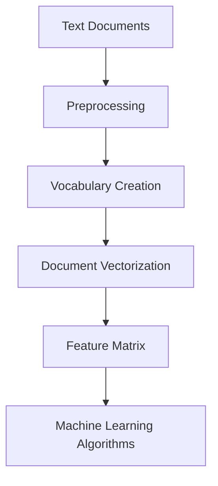

# 📝 Bag-of-Words (BoW) Model

<div align="center">


*A Fundamental Text Representation Technique in Natural Language Processing*

</div>

---

## 📚 Table of Contents

- [What is Bag-of-Words?](#what-is-bag-of-words)
- [Mathematical Foundation](#mathematical-foundation)
- [How It Works](#how-it-works)
- [Implementation Guide](#implementation-guide)
- [Variants and Extensions](#variants-and-extensions)
- [Performance Optimization](#performance-optimization)
- [Evaluation Metrics](#evaluation-metrics)
- [Pros and Cons](#pros-and-cons)
- [Real-World Applications](#real-world-applications)
- [Comparison with Other Text Representation Techniques](#comparison-with-other-text-representation-techniques)
- [Advanced Topics](#advanced-topics)
- [FAQ](#faq)

---

## 🎯 What is Bag-of-Words?

The **Bag-of-Words (BoW)** model is a fundamental text representation technique in Natural Language Processing (NLP) that transforms a text document into a fixed-length numerical vector. The name "bag-of-words" comes from the fact that this model represents text as an unordered collection (bag) of words, disregarding grammar, word order, and semantic meaning while retaining word frequency.

### Key Characteristics:

- **Simplicity**: Conceptually straightforward and easy to implement
- **Frequency-Based**: Captures word occurrence patterns in documents
- **Dimensionality**: Creates high-dimensional but sparse vector representations
- **Order-Independent**: Ignores word order and linguistic structure
- **Scalability**: Can be applied to documents of varying lengths
- **Foundation**: Serves as a building block for more sophisticated NLP models
- **Versatility**: Applicable to various text classification and retrieval tasks

### The Core Principle:

The BoW model converts text into numerical features by:

1. Creating a vocabulary of all unique words across the document collection
2. For each document, counting how many times each vocabulary word appears
3. Representing each document as a vector of these word counts

This process essentially "vectorizes" text data, making it suitable for machine learning algorithms that require numerical inputs.

---

## 🧮 Mathematical Foundation

### Vector Space Model

The Bag-of-Words approach is based on the Vector Space Model (VSM), where documents are represented as vectors in a high-dimensional space:

#### Basic Setup

1. **Vocabulary Construction**: Given a corpus of $D$ documents, we construct a vocabulary $V = \{w_1, w_2, ..., w_{|V|}\}$ containing all unique words.

2. **Document Representation**: Each document $d$ is represented as a vector $\vec{d} \in \mathbb{R}^{|V|}$, where each dimension corresponds to a word in the vocabulary.

3. **Term Weighting**: The value of each element in the vector depends on the weighting scheme chosen.

#### Common Weighting Schemes

1. **Binary Representation**:
   $$\vec{d_i} = \begin{cases} 
   1 & \text{if word } w_i \text{ appears in document } d \\
   0 & \text{otherwise}
   \end{cases}$$

2. **Term Frequency (TF)**:
   $$\vec{d_i} = \text{tf}(w_i, d) = \text{count of } w_i \text{ in document } d$$

3. **Term Frequency-Inverse Document Frequency (TF-IDF)**:
   $$\vec{d_i} = \text{tf}(w_i, d) \times \text{idf}(w_i)$$
   
   Where:
   $$\text{idf}(w_i) = \log\frac{|D|}{|\{d \in D: w_i \in d\}|}$$

### Probabilistic Interpretation

The BoW model can be viewed through a probabilistic lens:

1. **Multinomial Distribution**: Word counts in a document can be modeled as draws from a multinomial distribution.

2. **Probability of a document** $d$ given a class $c$:
   $$P(d|c) = P(w_1, w_2, ..., w_n|c)$$
   
   Assuming word independence (the "naïve" assumption):
   $$P(d|c) = \prod_{i=1}^{n} P(w_i|c)$$

3. **Conditional probabilities** are estimated from counts:
   $$P(w_i|c) = \frac{\text{count of } w_i \text{ in class } c + \alpha}{\text{total words in class } c + \alpha|V|}$$
   
   Where $\alpha$ is the smoothing parameter (usually 1, called Laplace smoothing).

### Distance Metrics

Documents represented as BoW vectors can be compared using various distance/similarity metrics:

1. **Euclidean Distance**:
   $$d(\vec{a}, \vec{b}) = \sqrt{\sum_{i=1}^{|V|} (a_i - b_i)^2}$$

2. **Cosine Similarity**:
   $$\text{sim}(\vec{a}, \vec{b}) = \frac{\vec{a} \cdot \vec{b}}{|\vec{a}||\vec{b}|} = \frac{\sum_{i=1}^{|V|} a_i b_i}{\sqrt{\sum_{i=1}^{|V|} a_i^2} \sqrt{\sum_{i=1}^{|V|} b_i^2}}$$

3. **Jaccard Similarity** (for binary vectors):
   $$J(\vec{a}, \vec{b}) = \frac{|\vec{a} \cap \vec{b}|}{|\vec{a} \cup \vec{b}|} = \frac{\sum_i \min(a_i, b_i)}{\sum_i \max(a_i, b_i)}$$

### Example Calculation

Consider a tiny corpus with two documents:
- Document 1: "The cat sat on the mat"
- Document 2: "The dog ran across the mat"

1. **Vocabulary**: {"the", "cat", "sat", "on", "mat", "dog", "ran", "across"}

2. **Binary representation**:
   - Doc 1: [1, 1, 1, 1, 1, 0, 0, 0]
   - Doc 2: [1, 0, 0, 0, 1, 1, 1, 1]

3. **Term frequency**:
   - Doc 1: [2, 1, 1, 1, 1, 0, 0, 0]
   - Doc 2: [2, 0, 0, 0, 1, 1, 1, 1]

4. **TF-IDF** (calculating IDF first):
   - "the": $\log(2/2) = 0$ (appears in both docs)
   - "cat", "sat", "on": $\log(2/1) = 0.693$ (appears in one doc)
   - "mat": $\log(2/2) = 0$ (appears in both docs)
   - "dog", "ran", "across": $\log(2/1) = 0.693$ (appears in one doc)

   TF-IDF for Doc 1: [2×0, 1×0.693, 1×0.693, 1×0.693, 1×0, 0×0.693, 0×0.693, 0×0.693] = [0, 0.693, 0.693, 0.693, 0, 0, 0, 0]

   TF-IDF for Doc 2: [2×0, 0×0.693, 0×0.693, 0×0.693, 1×0, 1×0.693, 1×0.693, 1×0.693] = [0, 0, 0, 0, 0, 0.693, 0.693, 0.693]

---

## ⚙️ How It Works

The Bag-of-Words model transforms text into numerical features through a systematic process:

<div align="center">



</div>

### Step-by-Step Process:

1. **Text Preprocessing**:
   - Tokenization: Split text into individual words
   - Normalization: Convert to lowercase, remove punctuation
   - Stop word removal: Filter out common words with little semantic value
   - Stemming/Lemmatization: Reduce words to their root form

2. **Vocabulary Creation**:
   - Collect all unique words from the preprocessed documents
   - Optionally filter words based on frequency (remove rare or too common terms)
   - Assign an index to each unique word

3. **Document Vectorization**:
   - For each document, create a vector of length equal to vocabulary size
   - Calculate the value for each position based on the chosen weighting scheme
   - Store these vectors in a document-term matrix

4. **Feature Engineering**:
   - Apply dimensionality reduction techniques if needed
   - Normalize vectors
   - Apply weighting schemes (TF-IDF, etc.)

### Python Implementation:

```python
import re
import numpy as np
from collections import Counter
from typing import List, Dict, Tuple, Set, Optional

class BagOfWords:
    """
    Implementation of the Bag-of-Words model.
    
    Parameters:
    -----------
    lowercase : bool, default=True
        Convert all text to lowercase
    remove_punctuation : bool, default=True
        Remove punctuation marks
    remove_stopwords : bool, default=False
        Remove common stopwords
    min_df : int, default=1
        Minimum document frequency for a term to be included in vocabulary
    max_df : float, default=1.0
        Maximum document frequency for a term as a fraction of total documents
    """
    
    def __init__(self, 
                 lowercase: bool = True, 
                 remove_punctuation: bool = True,
                 remove_stopwords: bool = False,
                 min_df: int = 1,
                 max_df: float = 1.0):
        self.lowercase = lowercase
        self.remove_punctuation = remove_punctuation
        self.remove_stopwords = remove_stopwords
        self.min_df = min_df
        self.max_df = max_df
        
        # Common English stopwords
        self.stopwords = {'a', 'an', 'the', 'and', 'or', 'but', 'in', 'on', 
                          'at', 'to', 'for', 'with', 'by', 'about', 'as',
                          'of', 'is', 'was', 'were', 'be', 'been', 'being',
                          'am', 'are', 'this', 'that', 'these', 'those',
                          'it', 'its', 'i', 'me', 'my', 'mine', 'myself',
                          'you', 'your', 'yours', 'yourself', 'he', 'him',
                          'his', 'himself', 'she', 'her', 'hers', 'herself'}
        
        # Vocabulary and related attributes
        self.vocabulary: Dict[str, int] = {}  # word -> index
        self.inverse_vocabulary: Dict[int, str] = {}  # index -> word
        self.document_freq: Dict[str, int] = {}  # word -> document frequency
        self.n_docs: int = 0
        
    def preprocess(self, text: str) -> List[str]:
        """
        Preprocess a text document.
        
        Parameters:
        -----------
        text : str
            Input text
            
        Returns:
        --------
        List[str]
            List of processed tokens
        """
        # Convert to lowercase if required
        if self.lowercase:
            text = text.lower()
        
        # Remove punctuation if required
        if self.remove_punctuation:
            text = re.sub(r'[^\w\s]', '', text)
        
        # Tokenize by splitting on whitespace
        tokens = text.split()
        
        # Remove stopwords if required
        if self.remove_stopwords:
            tokens = [t for t in tokens if t not in self.stopwords]
            
        return tokens
    
    def build_vocabulary(self, documents: List[str]) -> None:
        """
        Build the vocabulary from a list of documents.
        
        Parameters:
        -----------
        documents : List[str]
            List of text documents
        """
        self.n_docs = len(documents)
        
        # Count document frequency for each word
        doc_freq = {}
        
        for doc in documents:
            tokens = self.preprocess(doc)
            # Count each word once per document
            unique_tokens = set(tokens)
            
            for token in unique_tokens:
                doc_freq[token] = doc_freq.get(token, 0) + 1
        
        self.document_freq = doc_freq
        
        # Filter vocabulary based on document frequency
        max_df_count = int(self.max_df * self.n_docs)
        vocabulary_words = [
            word for word, freq in doc_freq.items()
            if self.min_df <= freq <= max_df_count
        ]
        
        # Create vocabulary mappings
        self.vocabulary = {word: idx for idx, word in enumerate(vocabulary_words)}
        self.inverse_vocabulary = {idx: word for word, idx in self.vocabulary.items()}
        
    def transform_binary(self, documents: List[str]) -> np.ndarray:
        """
        Transform documents to binary BoW vectors.
        
        Parameters:
        -----------
        documents : List[str]
            List of text documents
            
        Returns:
        --------
        np.ndarray
            Document-term matrix with binary weights
        """
        n_docs = len(documents)
        n_features = len(self.vocabulary)
        X = np.zeros((n_docs, n_features), dtype=np.int32)
        
        for i, doc in enumerate(documents):
            tokens = self.preprocess(doc)
            for token in set(tokens):  # Use set to count each word once
                if token in self.vocabulary:
                    X[i, self.vocabulary[token]] = 1
                    
        return X
    
    def transform_count(self, documents: List[str]) -> np.ndarray:
        """
        Transform documents to count-based BoW vectors.
        
        Parameters:
        -----------
        documents : List[str]
            List of text documents
            
        Returns:
        --------
        np.ndarray
            Document-term matrix with term frequency weights
        """
        n_docs = len(documents)
        n_features = len(self.vocabulary)
        X = np.zeros((n_docs, n_features), dtype=np.int32)
        
        for i, doc in enumerate(documents):
            tokens = self.preprocess(doc)
            counter = Counter(tokens)
            
            for token, count in counter.items():
                if token in self.vocabulary:
                    X[i, self.vocabulary[token]] = count
                    
        return X
    
    def transform_tfidf(self, documents: List[str]) -> np.ndarray:
        """
        Transform documents to TF-IDF weighted BoW vectors.
        
        Parameters:
        -----------
        documents : List[str]
            List of text documents
            
        Returns:
        --------
        np.ndarray
            Document-term matrix with TF-IDF weights
        """
        # Get term frequency matrix
        tf_matrix = self.transform_count(documents)
        n_docs, n_features = tf_matrix.shape
        
        # Calculate IDF values
        idf = np.zeros(n_features)
        for term_idx in range(n_features):
            term = self.inverse_vocabulary[term_idx]
            df = self.document_freq.get(term, 0)
            idf[term_idx] = np.log(self.n_docs / (1 + df))  # Add 1 for smoothing
        
        # Apply TF-IDF weighting
        tfidf_matrix = tf_matrix * idf
        
        return tfidf_matrix
    
    def fit_transform(self, documents: List[str], weighting: str = 'binary') -> np.ndarray:
        """
        Build vocabulary and transform documents in one step.
        
        Parameters:
        -----------
        documents : List[str]
            List of text documents
        weighting : str, default='binary'
            Weighting scheme: 'binary', 'count', or 'tfidf'
            
        Returns:
        --------
        np.ndarray
            Document-term matrix with chosen weighting
        """
        self.build_vocabulary(documents)
        
        if weighting == 'binary':
            return self.transform_binary(documents)
        elif weighting == 'count':
            return self.transform_count(documents)
        elif weighting == 'tfidf':
            return self.transform_tfidf(documents)
        else:
            raise ValueError("Weighting must be one of: 'binary', 'count', 'tfidf'")

# Example usage
def example_bag_of_words():
    """Demonstrate the Bag-of-Words implementation."""
    # Sample documents
    documents = [
        "The cat sat on the mat",
        "The dog ran across the mat",
        "The bird flew over the mat",
        "A cat and a dog played on the mat"
    ]
    
    # Create and fit the BoW model
    bow = BagOfWords(remove_stopwords=True)
    
    # Get different representations
    binary_matrix = bow.fit_transform(documents, weighting='binary')
    count_matrix = bow.transform_count(documents)
    tfidf_matrix = bow.transform_tfidf(documents)
    
    # Print vocabulary
    print("Vocabulary:")
    print(bow.vocabulary)
    
    print("\nBinary representation:")
    print(binary_matrix)
    
    print("\nCount-based representation:")
    print(count_matrix)
    
    print("\nTF-IDF representation:")
    print(tfidf_matrix)
    
    # Demonstrate document similarity
    doc1_idx, doc2_idx = 0, 3  # Compare "The cat sat on the mat" with "A cat and a dog played on the mat"
    
    # Binary similarity (Jaccard)
    binary_intersection = np.sum(np.minimum(binary_matrix[doc1_idx], binary_matrix[doc2_idx]))
    binary_union = np.sum(np.maximum(binary_matrix[doc1_idx], binary_matrix[doc2_idx]))
    jaccard_sim = binary_intersection / binary_union if binary_union > 0 else 0
    
    # TF-IDF similarity (Cosine)
    doc1_vec = tfidf_matrix[doc1_idx]
    doc2_vec = tfidf_matrix[doc2_idx]
    cosine_sim = np.dot(doc1_vec, doc2_vec) / (np.linalg.norm(doc1_vec) * np.linalg.norm(doc2_vec))
    
    print(f"\nJaccard similarity between documents {doc1_idx+1} and {doc2_idx+1}: {jaccard_sim:.4f}")
    print(f"Cosine similarity between documents {doc1_idx+1} and {doc2_idx+1}: {cosine_sim:.4f}")

if __name__ == "__main__":
    example_bag_of_words()
```

This implementation demonstrates the three main BoW representations:

1. **Binary BoW**: Just indicates presence (1) or absence (0) of a word
2. **Count-Based BoW**: Indicates how many times each word appears
3. **TF-IDF BoW**: Weights words by their frequency in the document and rarity in the corpus

The example also shows how to calculate document similarity using both Jaccard similarity (for binary vectors) and cosine similarity (for TF-IDF vectors), which are common ways to measure how similar documents are based on their BoW representations.

---

## 💻 Implementation Guide

Here's a detailed implementation guide for the Bag-of-Words model using Python and various libraries:

### 1. Scikit-learn Implementation

```python
from sklearn.feature_extraction.text import CountVectorizer, TfidfVectorizer
import pandas as pd
import numpy as np

# Sample documents
documents = [
    "The cat sat on the mat",
    "The dog ran across the mat",
    "The bird flew over the mat",
    "A cat and a dog played on the mat"
]

def sklearn_bow_example():
    """Demonstrate Bag-of-Words using scikit-learn."""
    # Binary Bag-of-Words
    print("Binary Bag-of-Words:")
    binary_vectorizer = CountVectorizer(binary=True)
    binary_X = binary_vectorizer.fit_transform(documents)
    binary_feature_names = binary_vectorizer.get_feature_names_out()
    
    # Create DataFrame for better visualization
    binary_df = pd.DataFrame(
        binary_X.toarray(),
        columns=binary_feature_names,
        index=[f"Document {i+1}" for i in range(len(documents))]
    )
    print(binary_df)
    
    # Count-based Bag-of-Words
    print("\nCount-based Bag-of-Words:")
    count_vectorizer = CountVectorizer()
    count_X = count_vectorizer.fit_transform(documents)
    count_feature_names = count_vectorizer.get_feature_names_out()
    
    count_df = pd.DataFrame(
        count_X.toarray(),
        columns=count_feature_names,
        index=[f"Document {i+1}" for i in range(len(documents))]
    )
    print(count_df)
    
    # TF-IDF Bag-of-Words
    print("\nTF-IDF Bag-of-Words:")
    tfidf_vectorizer = TfidfVectorizer()
    tfidf_X = tfidf_vectorizer.fit_transform(documents)
    tfidf_feature_names = tfidf_vectorizer.get_feature_names_out()
    
    tfidf_df = pd.DataFrame(
        tfidf_X.toarray(),
        columns=tfidf_feature_names,
        index=[f"Document {i+1}" for i in range(len(documents))]
    )
    print(tfidf_df)
    
    # Demonstrate additional options
    print("\nCustomized Bag-of-Words:")
    custom_vectorizer = CountVectorizer(
        lowercase=True,
        token_pattern=r'\b[a-zA-Z]{2,}\b',  # Words with at least 2 letters
        stop_words='english',               # Remove English stopwords
        max_features=10,                    # Limit to top 10 features
        ngram_range=(1, 2)                  # Include unigrams and bigrams
    )
    
    custom_X = custom_vectorizer.fit_transform(documents)
    custom_feature_names = custom_vectorizer.get_feature_names_out()
    
    custom_df = pd.DataFrame(
        custom_X.toarray(),
        columns=custom_feature_names,
        index=[f"Document {i+1}" for i in range(len(documents))]
    )
    print(custom_df)
    
    return {
        "binary_vectorizer": binary_vectorizer,
        "count_vectorizer": count_vectorizer,
        "tfidf_vectorizer": tfidf_vectorizer,
        "custom_vectorizer": custom_vectorizer
    }
```

### 2. Document Classification with BoW

```python
from sklearn.model_selection import train_test_split
from sklearn.naive_bayes import MultinomialNB
from sklearn.linear_model import LogisticRegression
from sklearn.svm import SVC
from sklearn.metrics import classification_report, accuracy_score

def text_classification_with_bow(X, y, test_size=0.2, random_state=42):
    """
    Demonstrate text classification using Bag-of-Words features.
    
    Parameters:
    -----------
    X : list of str
        List of text documents
    y : list or array
        Target labels
    test_size : float, default=0.2
        Proportion of data to use for testing
    random_state : int, default=42
        Random seed for reproducibility
        
    Returns:
    --------
    dict
        Results dictionary with models and metrics
    """
    # Split data into train and test sets
    X_train, X_test, y_train, y_test = train_test_split(
        X, y, test_size=test_size, random_state=random_state, stratify=y
    )
    
    # Create Bag-of-Words representations
    count_vectorizer = CountVectorizer()
    X_train_counts = count_vectorizer.fit_transform(X_train)
    X_test_counts = count_vectorizer.transform(X_test)
    
    tfidf_vectorizer = TfidfVectorizer()
    X_train_tfidf = tfidf_vectorizer.fit_transform(X_train)
    X_test_tfidf = tfidf_vectorizer.transform(X_test)
    
    # Train and evaluate models
    models = {
        "Multinomial Naive Bayes (Counts)": MultinomialNB(),
        "Multinomial Naive Bayes (TF-IDF)": MultinomialNB(),
        "Logistic Regression (Counts)": LogisticRegression(max_iter=1000),
        "Logistic Regression (TF-IDF)": LogisticRegression(max_iter=1000),
        "SVM (TF-IDF)": SVC()
    }
    
    results = {}
    
    for name, model in models.items():
        # Select appropriate features
        if "(Counts)" in name:
            X_train_feat = X_train_counts
            X_test_feat = X_test_counts
        else:
            X_train_feat = X_train_tfidf
            X_test_feat = X_test_tfidf
        
        # Train model
        model.fit(X_train_feat, y_train)
        
        # Make predictions
        y_pred = model.predict(X_test_feat)
        
        # Evaluate
        accuracy = accuracy_score(y_test, y_pred)
        report = classification_report(y_test, y_pred)
        
        # Store results
        results[name] = {
            "model": model,
            "accuracy": accuracy,
            "report": report,
            "y_pred": y_pred
        }
        
        print(f"\n{name}:")
        print(f"Accuracy: {accuracy:.4f}")
        print("Classification Report:")
        print(report)
    
    return {
        "count_vectorizer": count_vectorizer,
        "tfidf_vectorizer": tfidf_vectorizer,
        "results": results
    }

# Example with a sample dataset
from sklearn.datasets import fetch_20newsgroups

def newsgroups_classification_example():
    """Run classification example with 20 Newsgroups dataset."""
    # Load a subset of the 20 Newsgroups dataset
    categories = ['alt.atheism', 'soc.religion.christian', 'comp.graphics', 'sci.med']
    newsgroups = fetch_20newsgroups(
        subset='all',
        categories=categories,
        shuffle=True,
        random_state=42,
        remove=('headers', 'footers', 'quotes')
    )
    
    X = newsgroups.data
    y = newsgroups.target
    
    print(f"Dataset loaded: {len(X)} documents, {len(categories)} categories")
    
    # Limit to 2000 samples for speed
    if len(X) > 2000:
        indices = np.random.choice(len(X), 2000, replace=False)
        X = [X[i] for i in indices]
        y = y[indices]
    
    # Run classification
    results = text_classification_with_bow(X, y)
    return results
```

### 3. Document Similarity with BoW

```python
from sklearn.metrics.pairwise import cosine_similarity
import matplotlib.pyplot as plt
import seaborn as sns

def document_similarity_example():
    """Demonstrate document similarity using Bag-of-Words."""
    # Sample documents
    documents = [
        "Machine learning is a subset of artificial intelligence",
        "Deep learning is a subset of machine learning",
        "Neural networks are used in deep learning",
        "Natural language processing deals with text data",
        "Computer vision focuses on image data",
        "Reinforcement learning is about taking actions in an environment",
        "Supervised learning requires labeled data",
        "Unsupervised learning works with unlabeled data",
        "Classification is a supervised learning task",
        "Clustering is an unsupervised learning task"
    ]
    
    # Create TF-IDF representation
    tfidf_vectorizer = TfidfVectorizer()
    tfidf_matrix = tfidf_vectorizer.fit_transform(documents)
    
    # Compute cosine similarity between all documents
    cosine_sim = cosine_similarity(tfidf_matrix, tfidf_matrix)
    
    # Visualize similarity matrix
    plt.figure(figsize=(10, 8))
    sns.heatmap(
        cosine_sim,
        annot=True,
        cmap='Blues',
        xticklabels=[f'Doc {i+1}' for i in range(len(documents))],
        yticklabels=[f'Doc {i+1}' for i in range(len(documents))],
        fmt='.2f'
    )
    plt.title('Document Similarity Matrix (Cosine Similarity)')
    plt.tight_layout()
    plt.show()
    
    # Find most similar document pairs
    n_docs = len(documents)
    most_similar = []
    
    for i in range(n_docs):
        for j in range(i+1, n_docs):
            most_similar.append((i, j, cosine_sim[i, j]))
    
    # Sort by similarity (descending)
    most_similar.sort(key=lambda x: x[2], reverse=True)
    
    print("Most similar document pairs:")
    for i, j, sim in most_similar[:3]:
        print(f"Document {i+1} and Document {j+1}: {sim:.4f}")
        print(f"- Doc {i+1}: {documents[i][:50]}...")
        print(f"- Doc {j+1}: {documents[j][:50]}...")
        print()
    
    # Find least similar document pairs
    least_similar = sorted(most_similar, key=lambda x: x[2])
    
    print("Least similar document pairs:")
    for i, j, sim in least_similar[:3]:
        print(f"Document {i+1} and Document {j+1}: {sim:.4f}")
        print(f"- Doc {i+1}: {documents[i][:50]}...")
        print(f"- Doc {j+1}: {documents[j][:50]}...")
        print()
    
    # Analyze feature importance
    feature_names = tfidf_vectorizer.get_feature_names_out()
    
    print("Top terms for each document:")
    for i, doc in enumerate(documents):
        # Get TF-IDF scores for this document
        tfidf_scores = tfidf_matrix[i].toarray()[0]
        
        # Get indices of top terms
        top_indices = tfidf_scores.argsort()[-5:][::-1]
        
        # Get top terms and their scores
        top_terms = [(feature_names[idx], tfidf_scores[idx]) for idx in top_indices]
        
        print(f"Document {i+1}:")
        for term, score in top_terms:
            print(f"- {term}: {score:.4f}")
        print()
    
    return {
        "tfidf_vectorizer": tfidf_vectorizer,
        "tfidf_matrix": tfidf_matrix,
        "cosine_sim": cosine_sim
    }
```

### 4. BoW with NLTK for Advanced Preprocessing

```python
import nltk
from nltk.tokenize import word_tokenize
from nltk.corpus import stopwords
from nltk.stem import PorterStemmer, WordNetLemmatizer
from sklearn.feature_extraction.text import CountVectorizer, TfidfVectorizer

# Download necessary NLTK resources
nltk.download('punkt')
nltk.download('stopwords')
nltk.download('wordnet')

class NltkPreprocessor:
    """
    Text preprocessor using NLTK for advanced preprocessing.
    
    Parameters:
    -----------
    use_stemming : bool, default=False
        Whether to use stemming
    use_lemmatization : bool, default=True
        Whether to use lemmatization
    remove_stopwords : bool, default=True
        Whether to remove stopwords
    min_word_length : int, default=2
        Minimum word length to keep
    """
    
    def __init__(self, use_stemming=False, use_lemmatization=True, 
                 remove_stopwords=True, min_word_length=2):
        self.use_stemming = use_stemming
        self.use_lemmatization = use_lemmatization
        self.remove_stopwords = remove_stopwords
        self.min_word_length = min_word_length
        
        # Initialize tools
        self.stopwords = set(stopwords.words('english'))
        self.stemmer = PorterStemmer() if use_stemming else None
        self.lemmatizer = WordNetLemmatizer() if use_lemmatization else None
    
    def preprocess(self, text):
        """
        Preprocess text using NLTK.
        
        Parameters:
        -----------
        text : str
            Input text
            
        Returns:
        --------
        str
            Preprocessed text
        """
        # Tokenize
        tokens = word_tokenize(text.lower())
        
        # Filter by word length
        tokens = [t for t in tokens if len(t) >= self.min_word_length]
        
        # Remove stopwords
        if self.remove_stopwords:
            tokens = [t for t in tokens if t not in self.stopwords]
        
        # Apply stemming
        if self.use_stemming:
            tokens = [self.stemmer.stem(t) for t in tokens]
        
        # Apply lemmatization
        if self.use_lemmatization:
            tokens = [self.lemmatizer.lemmatize(t) for t in tokens]
        
        # Join tokens back into text
        return " ".join(tokens)
    
    def __call__(self, documents):
        """Make the class callable for use with scikit-learn."""
        if isinstance(documents, str):
            return self.preprocess(documents)
        else:
            return [self.preprocess(doc) for doc in documents]

def nltk_bow_example():
    """Demonstrate Bag-of-Words with NLTK preprocessing."""
    # Sample documents
    documents = [
        "The quick brown fox jumps over the lazy dog.",
        "The fox and the dog are running in the park.",
        "Quickly, the brown dog chased the fox around the park.",
        "The lazy dog was sleeping under the tree while the fox watched."
    ]
    
    # Create preprocessor
    preprocessor = NltkPreprocessor(
        use_stemming=False,
        use_lemmatization=True,
        remove_stopwords=True
    )
    
    # Preprocess documents
    preprocessed_docs = preprocessor(documents)
    
    print("Original documents:")
    for i, doc in enumerate(documents):
        print(f"{i+1}: {doc}")
    
    print("\nPreprocessed documents:")
    for i, doc in enumerate(preprocessed_docs):
        print(f"{i+1}: {doc}")
    
    # Create TF-IDF vectors with custom preprocessing
    tfidf_vectorizer = TfidfVectorizer(preprocessor=preprocessor)
    tfidf_matrix = tfidf_vectorizer.fit_transform(documents)
    
    # Get feature names
    feature_names = tfidf_vectorizer.get_feature_names_out()
    
    print(f"\nVocabulary size: {len(feature_names)}")
    print(f"Vocabulary: {', '.join(feature_names)}")
    
    # Create DataFrame for better visualization
    tfidf_df = pd.DataFrame(
        tfidf_matrix.toarray(),
        columns=feature_names,
        index=[f"Document {i+1}" for i in range(len(documents))]
    )
    
    print("\nTF-IDF Matrix:")
    print(tfidf_df)
    
    return {
        "preprocessor": preprocessor,
        "tfidf_vectorizer": tfidf_vectorizer,
        "tfidf_matrix": tfidf_matrix,
        "preprocessed_docs": preprocessed_docs
    }
```

---

## 🔄 Variants and Extensions

The basic Bag-of-Words model has several important variants and extensions that address some of its limitations:

### 1. **N-gram Models**

N-gram models extend BoW by considering sequences of N consecutive words:

```python
from sklearn.feature_extraction.text import CountVectorizer

def ngram_bow_example():
    """Demonstrate N-gram Bag-of-Words."""
    # Sample documents
    documents = [
        "The cat sat on the mat",
        "The dog ran across the mat",
        "The bird flew over the mat",
        "A cat and a dog played on the mat"
    ]
    
    # Create unigram (standard BoW) representation
    unigram_vectorizer = CountVectorizer(ngram_range=(1, 1))
    unigram_X = unigram_vectorizer.fit_transform(documents)
    
    # Create bigram representation
    bigram_vectorizer = CountVectorizer(ngram_range=(2, 2))
    bigram_X = bigram_vectorizer.fit_transform(documents)
    
    # Create combined unigram + bigram representation
    combined_vectorizer = CountVectorizer(ngram_range=(1, 2))
    combined_X = combined_vectorizer.fit_transform(documents)
    
    # Print results
    print("Unigram (standard BoW) features:")
    print(unigram_vectorizer.get_feature_names_out())
    print(f"Shape: {unigram_X.shape}")
    
    print("\nBigram features:")
    print(bigram_vectorizer.get_feature_names_out())
    print(f"Shape: {bigram_X.shape}")
    
    print("\nCombined unigram + bigram features:")
    print(combined_vectorizer.get_feature_names_out())
    print(f"Shape: {combined_X.shape}")
    
    # Create DataFrames for visualization
    combined_df = pd.DataFrame(
        combined_X.toarray(),
        columns=combined_vectorizer.get_feature_names_out(),
        index=[f"Document {i+1}" for i in range(len(documents))]
    )
    
    print("\nCombined unigram + bigram matrix:")
    print(combined_df)
    
    return {
        "unigram_vectorizer": unigram_vectorizer,
        "bigram_vectorizer": bigram_vectorizer,
        "combined_vectorizer": combined_vectorizer
    }
```

### 2. **Hashing Vectorizer**

For very large vocabularies, the hashing trick can be more memory-efficient:

```python
from sklearn.feature_extraction.text import HashingVectorizer

def hashing_vectorizer_example():
    """Demonstrate the Hashing Vectorizer."""
    # Sample documents
    documents = [
        "The cat sat on the mat",
        "The dog ran across the mat",
        "The bird flew over the mat",
        "A cat and a dog played on the mat"
    ]
    
    # Regular CountVectorizer
    count_vectorizer = CountVectorizer()
    count_X = count_vectorizer.fit_transform(documents)
    
    # HashingVectorizer with various n_features
    hash_sizes = [2**8, 2**10, 2**12]
    hash_vectorizers = {}
    
    for n_features in hash_sizes:
        vectorizer = HashingVectorizer(n_features=n_features)
        X = vectorizer.fit_transform(documents)
        
        hash_vectorizers[n_features] = {
            "vectorizer": vectorizer,
            "matrix": X
        }
        
        print(f"\nHashingVectorizer with {n_features} features:")
        print(f"Shape: {X.shape}")
        print(f"Non-zero elements: {X.nnz}")
        
        # Note: HashingVectorizer doesn't provide feature names
        # since it uses a hash function instead of a vocabulary
    
    # Compare memory usage
    from sys import getsizeof
    
    count_vocab_size = getsizeof(count_vectorizer.vocabulary_)
    print(f"\nCountVectorizer vocabulary size: {count_vocab_size} bytes")
    print("HashingVectorizer doesn't store a vocabulary (constant memory regardless of corpus size)")
    
    return {
        "count_vectorizer": count_vectorizer,
        "hash_vectorizers": hash_vectorizers
    }
```

### 3. **BM25 (Best Matching 25)**

BM25 is a ranking function used in information retrieval that improves on TF-IDF:

```python
import numpy as np
from sklearn.feature_extraction.text import CountVectorizer, TfidfVectorizer

class BM25Vectorizer:
    """
    BM25 vectorizer implementation based on scikit-learn's vectorizers.
    
    Parameters:
    -----------
    k1 : float, default=1.5
        Term frequency scaling parameter
    b : float, default=0.75
        Length normalization parameter
    """
    
    def __init__(self, k1=1.5, b=0.75):
        self.k1 = k1
        self.b = b
        self.vectorizer = CountVectorizer()
        self.idf_vectorizer = TfidfVectorizer(use_idf=True, smooth_idf=True)
        self.doc_len = None
        self.avg_doc_len = None
        self.idf = None
        self.vocabulary_ = None
    
    def fit(self, documents):
        """
        Fit the BM25 vectorizer to a list of documents.
        
        Parameters:
        -----------
        documents : list of str
            List of text documents
            
        Returns:
        --------
        self
            Fitted vectorizer
        """
        # Fit the CountVectorizer to get term frequencies
        X = self.vectorizer.fit_transform(documents)
        self.vocabulary_ = self.vectorizer.vocabulary_
        
        # Calculate document lengths (sum of term frequencies for each document)
        self.doc_len = X.sum(axis=1).A1
        self.avg_doc_len = self.doc_len.mean()
        
        # Fit IDF vectorizer to get IDF values
        self.idf_vectorizer.fit(documents)
        self.idf = self.idf_vectorizer._tfidf.idf_
        
        return self
    
    def transform(self, documents):
        """
        Transform documents to BM25 vectors.
        
        Parameters:
        -----------
        documents : list of str
            List of text documents
            
        Returns:
        --------
        scipy.sparse.csr_matrix
            Document-term matrix with BM25 weights
        """
        # Get term frequencies
        X = self.vectorizer.transform(documents)
        
        # Convert to array for easier manipulation
        X_array = X.toarray()
        
        # Calculate BM25 scores
        rows, cols = X.shape
        for i in range(rows):
            doc_len = X_array[i].sum()
            
            # Length normalization component
            len_norm = (1 - self.b) + self.b * (doc_len / self.avg_doc_len)
            
            for j in range(cols):
                tf = X_array[i, j]
                
                # BM25 term frequency component
                tf_scaled = (tf * (self.k1 + 1)) / (tf + self.k1 * len_norm)
                
                # Multiply by IDF
                X_array[i, j] = tf_scaled * self.idf[j]
        
        # Convert back to sparse matrix
        from scipy.sparse import csr_matrix
        return csr_matrix(X_array)
    
    def fit_transform(self, documents):
        """
        Fit the vectorizer and transform documents in one step.
        
        Parameters:
        -----------
        documents : list of str
            List of text documents
            
        Returns:
        --------
        scipy.sparse.csr_matrix
            Document-term matrix with BM25 weights
        """
        self.fit(documents)
        return self.transform(documents)

def bm25_example():
    """Demonstrate BM25 vectorization."""
    # Sample documents
    documents = [
        "The cat sat on the mat",
        "The dog ran across the mat",
        "The bird flew over the mat",
        "A cat and a dog played on the mat"
    ]
    
    # Create BM25 vectorizer
    bm25_vectorizer = BM25Vectorizer(k1=1.5, b=0.75)
    bm25_matrix = bm25_vectorizer.fit_transform(documents)
    
    # Create TF-IDF vectorizer for comparison
    tfidf_vectorizer = TfidfVectorizer()
    tfidf_matrix = tfidf_vectorizer.fit_transform(documents)
    
    # Create DataFrames for visualization
    feature_names = bm25_vectorizer.vectorizer.get_feature_names_out()
    
    bm25_df = pd.DataFrame(
        bm25_matrix.toarray(),
        columns=feature_names,
        index=[f"Document {i+1}" for i in range(len(documents))]
    )
    
    tfidf_df = pd.DataFrame(
        tfidf_matrix.toarray(),
        columns=tfidf_vectorizer.get_feature_names_out(),
        index=[f"Document {i+1}" for i in range(len(documents))]
    )
    
    print("BM25 Matrix:")
    print(bm25_df)
    
    print("\nTF-IDF Matrix:")
    print(tfidf_df)
    
    # Compare document similarities
    from sklearn.metrics.pairwise import cosine_similarity
    
    bm25_sim = cosine_similarity(bm25_matrix)
    tfidf_sim = cosine_similarity(tfidf_matrix)
    
    print("\nBM25 Cosine Similarity Matrix:")
    print(bm25_sim)
    
    print("\nTF-IDF Cosine Similarity Matrix:")
    print(tfidf_sim)
    
    return {
        "bm25_vectorizer": bm25_vectorizer,
        "tfidf_vectorizer": tfidf_vectorizer,
        "bm25_matrix": bm25_matrix,
        "tfidf_matrix": tfidf_matrix
    }
```

### 4. **Word Embeddings Integration**

Combining BoW with word embeddings can capture both frequency and semantic information:

```python
import numpy as np
from sklearn.feature_extraction.text import CountVectorizer
import gensim.downloader as api

def embeddings_bow_example():
    """Demonstrate integration of word embeddings with Bag-of-Words."""
    # Load pre-trained word embeddings
    try:
        word_vectors = api.load("glove-wiki-gigaword-100")
        embedding_size = word_vectors.vector_size
    except Exception as e:
        print(f"Could not load embeddings: {e}")
        # Create dummy embeddings for demonstration
        word_vectors = {}
        embedding_size = 50
        
        class DummyWordVectors:
            def __init__(self):
                self.vector_size = embedding_size
            
            def __getitem__(self, word):
                if word not in word_vectors:
                    word_vectors[word] = np.random.random(embedding_size)
                return word_vectors[word]
            
            def __contains__(self, word):
                return True
        
        word_vectors = DummyWordVectors()
    
    # Sample documents
    documents = [
        "The cat sat on the mat",
        "The dog ran across the mat",
        "The bird flew over the mat",
        "A cat and a dog played on the mat"
    ]
    
    # Create standard BoW representation
    vectorizer = CountVectorizer()
    bow_matrix = vectorizer.fit_transform(documents)
    
    # Get vocabulary and feature names
    vocabulary = vectorizer.vocabulary_
    feature_names = vectorizer.get_feature_names_out()
    
    print(f"Vocabulary: {feature_names}")
    
    # Create document embeddings by combining BoW with word vectors
    def get_document_embedding(doc, method='weighted'):
        """
        Generate document embedding by combining word embeddings.
        
        Parameters:
        -----------
        doc : str
            Text document
        method : str, default='weighted'
            Method for combining word embeddings:
            - 'mean': Simple average of word vectors
            - 'weighted': TF-IDF weighted average
            - 'concatenate': Concatenate BoW with document vector
            
        Returns:
        --------
        numpy.ndarray
            Document embedding vector
        """
        # Tokenize and get counts
        bow = vectorizer.transform([doc]).toarray()[0]
        
        if method == 'mean':
            # Simple average of word vectors
            doc_vector = np.zeros(embedding_size)
            word_count = 0
            
            for token in doc.lower().split():
                if token in word_vectors:
                    doc_vector += word_vectors[token]
                    word_count += 1
            
            if word_count > 0:
                doc_vector /= word_count
            
            return doc_vector
        
        elif method == 'weighted':
            # Weighted average based on term frequency
            doc_vector = np.zeros(embedding_size)
            total_weight = 0
            
            for i, term in enumerate(feature_names):
                if term in word_vectors and bow[i] > 0:
                    weight = bow[i]
                    doc_vector += weight * word_vectors[term]
                    total_weight += weight
            
            if total_weight > 0:
                doc_vector /= total_weight
            
            return doc_vector
        
        elif method == 'concatenate':
            # Concatenate BoW with average word vector
            mean_vector = get_document_embedding(doc, method='mean')
            return np.concatenate([bow, mean_vector])
        
        else:
            raise ValueError(f"Unknown method: {method}")
    
    # Generate embeddings for each document
    embedding_methods = ['mean', 'weighted', 'concatenate']
    document_embeddings = {}
    
    for method in embedding_methods:
        embeddings = [get_document_embedding(doc, method) for doc in documents]
        document_embeddings[method] = np.array(embeddings)
        
        print(f"\n{method.capitalize()} embeddings shape: {document_embeddings[method].shape}")
    
    # Compute similarities between documents
    from sklearn.metrics.pairwise import cosine_similarity
    
    print("\nCosine similarities between documents:")
    for method in embedding_methods:
        sim_matrix = cosine_similarity(document_embeddings[method])
        
        print(f"\n{method.capitalize()} embedding similarity matrix:")
        print(sim_matrix)
    
    # Compare with standard BoW similarity
    bow_sim = cosine_similarity(bow_matrix)
    print("\nStandard BoW similarity matrix:")
    print(bow_sim)
    
    return {
        "vectorizer": vectorizer,
        "bow_matrix": bow_matrix,
        "word_vectors": word_vectors,
        "document_embeddings": document_embeddings
    }
```

### 5. **Topic Modeling Extensions**

Topic modeling techniques like Latent Dirichlet Allocation (LDA) build on the BoW model:

```python
from sklearn.decomposition import LatentDirichletAllocation
from sklearn.feature_extraction.text import CountVectorizer
import matplotlib.pyplot as plt
import numpy as np

def lda_topic_modeling_example():
    """Demonstrate topic modeling with LDA based on Bag-of-Words."""
    # Sample documents with clear topics
    documents = [
        # Technology
        "Computers use processors and memory to run software applications",
        "Programming languages allow developers to write code for computers",
        "Machine learning algorithms can learn from data without explicit programming",
        "Artificial intelligence systems can perform tasks that require human intelligence",
        
        # Sports
        "Football players score goals by kicking the ball into the net",
        "Basketball involves shooting a ball through a hoop to score points",
        "Tennis is played with rackets and a ball on a court with a net",
        "Swimming competitions take place in pools with different stroke styles",
        
        # Food
        "Cooking involves preparing food by combining ingredients and applying heat",
        "Baking requires an oven to make bread, cakes, and pastries",
        "Vegetables and fruits are essential components of a healthy diet",
        "Different cuisines use various spices and cooking techniques"
    ]
    
    # Create BoW representation
    vectorizer = CountVectorizer(
        stop_words='english',
        min_df=2,  # Minimum document frequency
        max_df=0.9  # Maximum document frequency as a fraction
    )
    
    X = vectorizer.fit_transform(documents)
    feature_names = vectorizer.get_feature_names_out()
    
    print(f"Vocabulary size: {len(feature_names)}")
    print(f"Document-term matrix shape: {X.shape}")
    
    # Train LDA model
    n_topics = 3
    lda = LatentDirichletAllocation(
        n_components=n_topics,
        random_state=42,
        max_iter=20,
        learning_method='online'
    )
    
    lda.fit(X)
    
    # Get topics
    n_top_words = 10
    
    topic_words = []
    for topic_idx, topic in enumerate(lda.components_):
        # Get top words for this topic
        top_word_indices = topic.argsort()[:-n_top_words-1:-1]
        top_words = [feature_names[i] for i in top_word_indices]
        topic_words.append(top_words)
        
        print(f"Topic {topic_idx+1}:")
        print(f"  {', '.join(top_words)}")
    
    # Get document-topic distributions
    doc_topic_dists = lda.transform(X)
    
    print("\nDocument-topic distributions:")
    for i, doc_dist in enumerate(doc_topic_dists):
        # Get main topic
        main_topic = np.argmax(doc_dist) + 1
        topic_prob = doc_dist[main_topic-1]
        
        print(f"Document {i+1}: Main topic = {main_topic} ({topic_prob:.2f})")
        print(f"  {documents[i][:50]}...")
    
    # Visualize document-topic distribution
    plt.figure(figsize=(12, 8))
    
    # Create a heatmap
    plt.imshow(doc_topic_dists, cmap='Blues', aspect='auto')
    plt.colorbar(label='Topic Probability')
    
    # Add labels and title
    plt.xlabel('Topic')
    plt.ylabel('Document')
    plt.title('Document-Topic Distribution')
    
    # Set ticks
    plt.xticks(range(n_topics), [f'Topic {i+1}' for i in range(n_topics)])
    plt.yticks(range(len(documents)), [f'Doc {i+1}' for i in range(len(documents))])
    
    plt.tight_layout()
    plt.show()
    
    return {
        "vectorizer": vectorizer,
        "lda_model": lda,
        "feature_names": feature_names,
        "doc_topic_dists": doc_topic_dists,
        "topic_words": topic_words
    }
```

---

## 🚀 Performance Optimization

For large text corpora, optimizing Bag-of-Words implementations is crucial:

### 1. **Memory-Efficient Representations**

```python
from sklearn.feature_extraction.text import HashingVectorizer, TfidfVectorizer
import numpy as np
import time
import matplotlib.pyplot as plt
from memory_profiler import profile

def generate_random_documents(n_docs, words_per_doc, vocabulary_size):
    """Generate random documents for benchmarking."""
    vocabulary = [f"word_{i}" for i in range(vocabulary_size)]
    documents = []
    
    for _ in range(n_docs):
        # Sample random words from vocabulary
        doc_words = np.random.choice(vocabulary, size=words_per_doc)
        documents.append(" ".join(doc_words))
    
    return documents

@profile
def memory_usage_benchmark():
    """Benchmark memory usage of different vectorizers."""
    print("Generating documents...")
    documents = generate_random_documents(
        n_docs=10000,
        words_per_doc=50,
        vocabulary_size=10000
    )
    
    print("Documents generated. Starting benchmark...")
    
    # Standard CountVectorizer
    from sklearn.feature_extraction.text import CountVectorizer
    
    print("\nTesting CountVectorizer...")
    t0 = time.time()
    count_vectorizer = CountVectorizer()
    count_X = count_vectorizer.fit_transform(documents)
    count_time = time.time() - t0
    
    # TfidfVectorizer
    print("\nTesting TfidfVectorizer...")
    t0 = time.time()
    tfidf_vectorizer = TfidfVectorizer()
    tfidf_X = tfidf_vectorizer.fit_transform(documents)
    tfidf_time = time.time() - t0
    
    # HashingVectorizer
    print("\nTesting HashingVectorizer...")
    t0 = time.time()
    hash_vectorizer = HashingVectorizer(n_features=2**15)
    hash_X = hash_vectorizer.fit_transform(documents)
    hash_time = time.time() - t0
    
    # Print results
    print("\nResults:")
    print(f"CountVectorizer: {count_time:.2f}s, shape={count_X.shape}, nnz={count_X.nnz}")
    print(f"TfidfVectorizer: {tfidf_time:.2f}s, shape={tfidf_X.shape}, nnz={tfidf_X.nnz}")
    print(f"HashingVectorizer: {hash_time:.2f}s, shape={hash_X.shape}, nnz={hash_X.nnz}")
    
    return {
        "count": {"time": count_time, "matrix": count_X, "vectorizer": count_vectorizer},
        "tfidf": {"time": tfidf_time, "matrix": tfidf_X, "vectorizer": tfidf_vectorizer},
        "hash": {"time": hash_time, "matrix": hash_X, "vectorizer": hash_vectorizer}
    }
```

### 2. **Incremental Learning**

```python
from sklearn.feature_extraction.text import HashingVectorizer
from sklearn.linear_model import SGDClassifier
import numpy as np
import time

def incremental_learning_example():
    """Demonstrate incremental learning with Bag-of-Words."""
    # Parameters
    n_samples = 100000
    batch_size = 1000
    vocabulary_size = 5000
    
    # Prepare data generator
    def generate_data_batch(batch_size, vocabulary_size, n_classes=2):
        """Generate a batch of documents and labels."""
        documents = []
        labels = []
        
        for _ in range(batch_size):
            # Generate a document
            doc_len = np.random.randint(10, 30)
            words = [f"word_{np.random.randint(vocabulary_size)}" for _ in range(doc_len)]
            documents.append(" ".join(words))
            
            # Generate a label (based on presence of certain words)
            if any(w.endswith("_1") for w in words) or any(w.endswith("_2") for w in words):
                labels.append(1)
            else:
                labels.append(0)
        
        return documents, np.array(labels)
    
    # Set up vectorizer and classifier
    vectorizer = HashingVectorizer(n_features=2**12)
    
    classifier = SGDClassifier(
        loss='log_loss',
        alpha=1e-4,
        max_iter=5,
        tol=None,
        n_jobs=-1,
        random_state=42
    )
    
    # Incremental learning
    n_batches = n_samples // batch_size
    batch_accuracies = []
    processing_times = []
    
    print(f"Starting incremental learning with {n_batches} batches...")
    
    for i in range(n_batches):
        # Generate batch
        batch_docs, batch_labels = generate_data_batch(batch_size, vocabulary_size)
        
        # Process batch
        t0 = time.time()
        
        # Transform documents
        batch_features = vectorizer.transform(batch_docs)
        
        # Partial fit classifier
        if i == 0:
            classifier.partial_fit(batch_features, batch_labels, classes=[0, 1])
        else:
            classifier.partial_fit(batch_features, batch_labels)
        
        # Measure processing time
        batch_time = time.time() - t0
        processing_times.append(batch_time)
        
        # Evaluate on this batch
        batch_accuracy = classifier.score(batch_features, batch_labels)
        batch_accuracies.append(batch_accuracy)
        
        if (i+1) % 10 == 0:
            print(f"Batch {i+1}/{n_batches}: accuracy={batch_accuracy:.4f}, time={batch_time:.4f}s")
    
    # Plot results
    plt.figure(figsize=(12, 6))
    
    plt.subplot(1, 2, 1)
    plt.plot(batch_accuracies)
    plt.xlabel('Batch')
    plt.ylabel('Accuracy')
    plt.title('Accuracy Over Batches')
    plt.grid(True, alpha=0.3)
    
    plt.subplot(1, 2, 2)
    plt.plot(processing_times)
    plt.xlabel('Batch')
    plt.ylabel('Processing Time (s)')
    plt.title('Processing Time Per Batch')
    plt.grid(True, alpha=0.3)
        plt.tight_layout()
    plt.show()
    
    # Print summary statistics
    print("\nSummary:")
    print(f"Total samples processed: {n_samples}")
    print(f"Final accuracy: {batch_accuracies[-1]:.4f}")
    print(f"Average processing time per batch: {np.mean(processing_times):.4f}s")
    
    return {
        "vectorizer": vectorizer,
        "classifier": classifier,
        "batch_accuracies": batch_accuracies,
        "processing_times": processing_times
    }
```

### 3. **Feature Selection**

```python
from sklearn.feature_extraction.text import TfidfVectorizer
from sklearn.feature_selection import SelectKBest, chi2
import numpy as np
import matplotlib.pyplot as plt
import time
from sklearn.datasets import fetch_20newsgroups
from sklearn.model_selection import train_test_split
from sklearn.naive_bayes import MultinomialNB
from sklearn.metrics import accuracy_score

def feature_selection_example():
    """Demonstrate feature selection for Bag-of-Words."""
    # Load data
    print("Loading 20 Newsgroups dataset...")
    newsgroups = fetch_20newsgroups(
        subset='all', 
        remove=('headers', 'footers', 'quotes'),
        categories=['alt.atheism', 'sci.space', 'comp.graphics', 'rec.sport.baseball']
    )
    
    X, y = newsgroups.data, newsgroups.target
    
    # Split into train and test sets
    X_train, X_test, y_train, y_test = train_test_split(
        X, y, test_size=0.2, random_state=42
    )
    
    print(f"Training set size: {len(X_train)}, Test set size: {len(X_test)}")
    
    # Create TF-IDF vectorizer
    tfidf_vectorizer = TfidfVectorizer(
        max_df=0.95,  # Filter out very common terms
        min_df=2,     # Filter out very rare terms
        stop_words='english'
    )
    
    # Transform the data
    t0 = time.time()
    X_train_tfidf = tfidf_vectorizer.fit_transform(X_train)
    X_test_tfidf = tfidf_vectorizer.transform(X_test)
    
    print(f"Vectorization time: {time.time() - t0:.2f}s")
    print(f"Full feature matrix shape: {X_train_tfidf.shape}")
    
    # Try different feature counts with feature selection
    feature_counts = [100, 500, 1000, 5000, 10000, X_train_tfidf.shape[1]]
    accuracies = []
    training_times = []
    feature_densities = []
    
    for k in feature_counts:
        print(f"\nTesting with {k} features...")
        
        # Skip feature selection if using all features
        if k == X_train_tfidf.shape[1]:
            X_train_selected = X_train_tfidf
            X_test_selected = X_test_tfidf
            selection_time = 0
        else:
            # Select top k features using chi-squared test
            t0 = time.time()
            selector = SelectKBest(chi2, k=k)
            X_train_selected = selector.fit_transform(X_train_tfidf, y_train)
            X_test_selected = selector.transform(X_test_tfidf)
            selection_time = time.time() - t0
        
        print(f"Feature selection time: {selection_time:.2f}s")
        print(f"Selected feature matrix shape: {X_train_selected.shape}")
        
        # Calculate feature density (non-zero elements / total elements)
        density = X_train_selected.nnz / (X_train_selected.shape[0] * X_train_selected.shape[1])
        feature_densities.append(density)
        print(f"Feature density: {density:.6f}")
        
        # Train a classifier
        t0 = time.time()
        clf = MultinomialNB()
        clf.fit(X_train_selected, y_train)
        training_time = time.time() - t0
        training_times.append(training_time)
        
        print(f"Training time: {training_time:.2f}s")
        
        # Evaluate
        y_pred = clf.predict(X_test_selected)
        accuracy = accuracy_score(y_test, y_pred)
        accuracies.append(accuracy)
        
        print(f"Accuracy with {k} features: {accuracy:.4f}")
    
    # Plot results
    plt.figure(figsize=(15, 5))
    
    plt.subplot(1, 3, 1)
    plt.plot(feature_counts, accuracies, 'o-')
    plt.xlabel('Number of Features')
    plt.ylabel('Accuracy')
    plt.title('Accuracy vs. Number of Features')
    plt.xscale('log')
    plt.grid(True, alpha=0.3)
    
    plt.subplot(1, 3, 2)
    plt.plot(feature_counts, training_times, 'o-')
    plt.xlabel('Number of Features')
    plt.ylabel('Training Time (s)')
    plt.title('Training Time vs. Number of Features')
    plt.xscale('log')
    plt.grid(True, alpha=0.3)
    
    plt.subplot(1, 3, 3)
    plt.plot(feature_counts, feature_densities, 'o-')
    plt.xlabel('Number of Features')
    plt.ylabel('Feature Density')
    plt.title('Feature Density vs. Number of Features')
    plt.xscale('log')
    plt.grid(True, alpha=0.3)
    
    plt.tight_layout()
    plt.show()
    
    # Find optimal feature count (best trade-off between accuracy and complexity)
    accuracy_diffs = np.diff(accuracies)
    diminishing_returns_idx = np.argmin(accuracy_diffs) + 1
    optimal_count = feature_counts[diminishing_returns_idx]
    
    print("\nOptimal feature count analysis:")
    print(f"Optimal feature count: {optimal_count}")
    print(f"Accuracy at optimal count: {accuracies[diminishing_returns_idx]:.4f}")
    print(f"Accuracy with all features: {accuracies[-1]:.4f}")
    print(f"Accuracy difference: {accuracies[-1] - accuracies[diminishing_returns_idx]:.4f}")
    print(f"Training time reduction: {(training_times[-1] - training_times[diminishing_returns_idx]) / training_times[-1]:.2%}")
    
    return {
        "feature_counts": feature_counts,
        "accuracies": accuracies,
        "training_times": training_times,
        "feature_densities": feature_densities,
        "optimal_count": optimal_count
    }
```

### 4. **Parallel Processing**

```python
from sklearn.feature_extraction.text import CountVectorizer
from joblib import Parallel, delayed
import numpy as np
import time
import matplotlib.pyplot as plt

def parallel_bow_processing():
    """Demonstrate parallel processing for Bag-of-Words."""
    # Generate a large corpus
    n_docs = 50000
    doc_size = 500
    vocab_size = 10000
    
    print(f"Generating {n_docs} documents...")
    
    # Generate random documents
    documents = []
    for _ in range(n_docs):
        words = np.random.randint(0, vocab_size, size=doc_size)
        doc = ' '.join([f'word_{w}' for w in words])
        documents.append(doc)
    
    print("Documents generated.")
    
    # Function to process a batch of documents
    def process_batch(docs):
        vectorizer = CountVectorizer()
        X = vectorizer.fit_transform(docs)
        return X.shape
    
    # Test with different number of jobs
    n_jobs_options = [1, 2, 4, 8, -1]
    batch_size = 1000
    n_batches = n_docs // batch_size
    
    times = []
    
    for n_jobs in n_jobs_options:
        print(f"\nTesting with {n_jobs} jobs...")
        
        # Start timer
        t0 = time.time()
        
        # Create batches
        batches = [documents[i:i+batch_size] for i in range(0, n_docs, batch_size)]
        
        # Process batches in parallel
        results = Parallel(n_jobs=n_jobs)(
            delayed(process_batch)(batch) for batch in batches
        )
        
        # End timer
        elapsed = time.time() - t0
        times.append(elapsed)
        
        print(f"Time with {n_jobs} jobs: {elapsed:.2f}s")
        print(f"Processed {len(results)} batches")
    
    # Convert -1 to number of CPU cores for plotting
    import multiprocessing
    n_cores = multiprocessing.cpu_count()
    plot_labels = [str(n) if n != -1 else f'All ({n_cores})' for n in n_jobs_options]
    
    # Plot results
    plt.figure(figsize=(10, 6))
    plt.bar(plot_labels, times, color='skyblue')
    plt.xlabel('Number of Jobs')
    plt.ylabel('Processing Time (s)')
    plt.title('Processing Time vs. Number of Jobs')
    plt.grid(True, alpha=0.3, axis='y')
    
    # Add speedup labels
    base_time = times[0]  # Time with 1 job
    for i, time_val in enumerate(times):
        speedup = base_time / time_val
        plt.text(i, time_val + 0.5, f'{speedup:.2f}x', 
                ha='center', va='bottom', fontweight='bold')
    
    plt.tight_layout()
    plt.show()
    
    return {
        "n_jobs_options": n_jobs_options,
        "times": times
    }
```

---

## 📏 Evaluation Metrics

To properly evaluate Bag-of-Words models and representations, several metrics can be used:

### 1. **Classification Metrics**

```python
from sklearn.feature_extraction.text import CountVectorizer, TfidfVectorizer
from sklearn.model_selection import train_test_split
from sklearn.naive_bayes import MultinomialNB
from sklearn.linear_model import LogisticRegression
from sklearn.metrics import accuracy_score, precision_recall_fscore_support, confusion_matrix
from sklearn.metrics import classification_report, roc_curve, auc
import matplotlib.pyplot as plt
import seaborn as sns
import numpy as np

def classification_metrics_evaluation(X, y, test_size=0.2, random_state=42):
    """
    Evaluate Bag-of-Words representations using classification metrics.
    
    Parameters:
    -----------
    X : list of str
        Text documents
    y : array-like
        Target labels
    test_size : float, default=0.2
        Size of the test set
    random_state : int, default=42
        Random seed for reproducibility
    """
    # Split data
    X_train, X_test, y_train, y_test = train_test_split(
        X, y, test_size=test_size, random_state=random_state, stratify=y
    )
    
    # Define vectorizers to compare
    vectorizers = {
        "Count Vectorizer": CountVectorizer(min_df=2, max_df=0.95),
        "TF-IDF Vectorizer": TfidfVectorizer(min_df=2, max_df=0.95),
        "Binary Vectorizer": CountVectorizer(min_df=2, max_df=0.95, binary=True),
        "Count + Bigrams": CountVectorizer(min_df=2, max_df=0.95, ngram_range=(1, 2))
    }
    
    # Define classifiers to compare
    classifiers = {
        "Multinomial Naive Bayes": MultinomialNB(),
        "Logistic Regression": LogisticRegression(max_iter=1000)
    }
    
    # Store results
    results = {}
    
    for vec_name, vectorizer in vectorizers.items():
        print(f"\nEvaluating {vec_name}...")
        
        # Transform data
        X_train_vec = vectorizer.fit_transform(X_train)
        X_test_vec = vectorizer.transform(X_test)
        
        for clf_name, classifier in classifiers.items():
            print(f"  Training {clf_name}...")
            
            # Train classifier
            classifier.fit(X_train_vec, y_train)
            
            # Make predictions
            y_pred = classifier.predict(X_test_vec)
            
            # Calculate probability predictions if available
            if hasattr(classifier, "predict_proba"):
                y_prob = classifier.predict_proba(X_test_vec)
            else:
                y_prob = None
            
            # Calculate metrics
            accuracy = accuracy_score(y_test, y_pred)
            precision, recall, f1, _ = precision_recall_fscore_support(
                y_test, y_pred, average='weighted'
            )
            
            report = classification_report(y_test, y_pred)
            cm = confusion_matrix(y_test, y_pred)
            
            # Store results
            results[f"{vec_name} + {clf_name}"] = {
                "accuracy": accuracy,
                "precision": precision,
                "recall": recall,
                "f1": f1,
                "report": report,
                "confusion_matrix": cm,
                "y_pred": y_pred,
                "y_prob": y_prob
            }
            
            print(f"    Accuracy: {accuracy:.4f}")
            print(f"    F1 Score: {f1:.4f}")
    
    # Visualize results
    # 1. Accuracy comparison
    plt.figure(figsize=(12, 6))
    
    # Extract data for plotting
    model_names = list(results.keys())
    accuracies = [results[model]["accuracy"] for model in model_names]
    f1_scores = [results[model]["f1"] for model in model_names]
    
    # Sort by accuracy
    sort_idx = np.argsort(accuracies)[::-1]
    model_names = [model_names[i] for i in sort_idx]
    accuracies = [accuracies[i] for i in sort_idx]
    f1_scores = [f1_scores[i] for i in sort_idx]
    
    x = np.arange(len(model_names))
    width = 0.35
    
    plt.bar(x - width/2, accuracies, width, label='Accuracy', color='skyblue')
    plt.bar(x + width/2, f1_scores, width, label='F1 Score', color='lightcoral')
    
    plt.xlabel('Model')
    plt.ylabel('Score')
    plt.title('Accuracy and F1 Score Comparison')
    plt.xticks(x, model_names, rotation=45, ha='right')
    plt.legend()
    plt.grid(True, alpha=0.3, axis='y')
    plt.tight_layout()
    plt.show()
    
    # 2. Confusion Matrix for the best model
    best_model = model_names[0]
    cm = results[best_model]["confusion_matrix"]
    
    plt.figure(figsize=(8, 6))
    sns.heatmap(cm, annot=True, fmt='d', cmap='Blues')
    plt.xlabel('Predicted Label')
    plt.ylabel('True Label')
    plt.title(f'Confusion Matrix for {best_model}')
    plt.tight_layout()
    plt.show()
    
    # 3. ROC curve (if binary classification)
    if y_prob is not None and len(np.unique(y)) == 2:
        plt.figure(figsize=(8, 6))
        
        for model_name in model_names:
            if results[model_name]["y_prob"] is not None:
                y_prob = results[model_name]["y_prob"][:, 1]
                fpr, tpr, _ = roc_curve(y_test, y_prob)
                roc_auc = auc(fpr, tpr)
                
                plt.plot(fpr, tpr, lw=2, label=f'{model_name} (AUC = {roc_auc:.3f})')
        
        plt.plot([0, 1], [0, 1], 'k--', lw=2)
        plt.xlim([0.0, 1.0])
        plt.ylim([0.0, 1.05])
        plt.xlabel('False Positive Rate')
        plt.ylabel('True Positive Rate')
        plt.title('Receiver Operating Characteristic (ROC) Curves')
        plt.legend(loc="lower right")
        plt.grid(True, alpha=0.3)
        plt.tight_layout()
        plt.show()
    
    return results
```

### 2. **Information Retrieval Metrics**

```python
from sklearn.feature_extraction.text import TfidfVectorizer
from sklearn.metrics.pairwise import cosine_similarity
import numpy as np
import matplotlib.pyplot as plt

def information_retrieval_metrics(documents, queries, relevance_judgments):
    """
    Evaluate Bag-of-Words for information retrieval tasks.
    
    Parameters:
    -----------
    documents : list of str
        Collection of documents
    queries : list of str
        Search queries
    relevance_judgments : list of list of int
        For each query, a list of indices of relevant documents
    """
    # Create TF-IDF representation for documents
    vectorizer = TfidfVectorizer()
    doc_vectors = vectorizer.fit_transform(documents)
    
    # Results to store
    precision_at_k = {1: [], 3: [], 5: [], 10: []}
    recall_at_k = {1: [], 3: [], 5: [], 10: []}
    avg_precision = []
    ndcg_at_k = {1: [], 3: [], 5: [], 10: []}
    
    # Process each query
    for i, query in enumerate(queries):
        # Transform query
        query_vector = vectorizer.transform([query])
        
        # Calculate similarity with all documents
        similarities = cosine_similarity(query_vector, doc_vectors)[0]
        
        # Get top documents
        top_indices = similarities.argsort()[::-1]
        
        # Get relevant documents for this query
        relevant_docs = set(relevance_judgments[i])
        
        # Calculate precision and recall at different k values
        for k in precision_at_k.keys():
            if k <= len(documents):
                # Get top k documents
                top_k = top_indices[:k]
                
                # Count relevant documents in top k
                relevant_in_top_k = sum(1 for doc_idx in top_k if doc_idx in relevant_docs)
                
                # Calculate precision@k and recall@k
                precision = relevant_in_top_k / k
                recall = relevant_in_top_k / len(relevant_docs) if relevant_docs else 1.0
                
                precision_at_k[k].append(precision)
                recall_at_k[k].append(recall)
        
        # Calculate average precision
        if relevant_docs:
            ap = 0.0
            relevant_count = 0
            
            for j, doc_idx in enumerate(top_indices):
                if doc_idx in relevant_docs:
                    relevant_count += 1
                    ap += relevant_count / (j + 1)
            
            ap /= len(relevant_docs)
            avg_precision.append(ap)
        
        # Calculate NDCG
        for k in ndcg_at_k.keys():
            if k <= len(documents):
                # Get top k documents
                top_k = top_indices[:k]
                
                # Calculate DCG
                dcg = 0.0
                for j, doc_idx in enumerate(top_k):
                    # Assume binary relevance (1 if relevant, 0 if not)
                    rel = 1 if doc_idx in relevant_docs else 0
                    dcg += rel / np.log2(j + 2)  # +2 because j is 0-indexed
                
                # Calculate ideal DCG
                ideal_ranking = sorted([1 if doc_idx in relevant_docs else 0 
                                      for doc_idx in range(len(documents))], reverse=True)
                idcg = sum(rel / np.log2(j + 2) for j, rel in enumerate(ideal_ranking[:k]))
                
                # Calculate NDCG
                ndcg = dcg / idcg if idcg > 0 else 0.0
                ndcg_at_k[k].append(ndcg)
    
    # Calculate mean values
    mean_precision = {k: np.mean(v) for k, v in precision_at_k.items()}
    mean_recall = {k: np.mean(v) for k, v in recall_at_k.items()}
    mean_avg_precision = np.mean(avg_precision) if avg_precision else 0.0
    mean_ndcg = {k: np.mean(v) for k, v in ndcg_at_k.items()}
    
    # Print results
    print("Information Retrieval Metrics:")
    print(f"Mean Average Precision (MAP): {mean_avg_precision:.4f}")
    
    print("\nPrecision@k:")
    for k, value in mean_precision.items():
        print(f"  P@{k}: {value:.4f}")
    
    print("\nRecall@k:")
    for k, value in mean_recall.items():
        print(f"  R@{k}: {value:.4f}")
    
    print("\nNDCG@k:")
    for k, value in mean_ndcg.items():
        print(f"  NDCG@{k}: {value:.4f}")
    
    # Visualize results
    plt.figure(figsize=(15, 5))
    
    # Plot Precision@k and Recall@k
    plt.subplot(1, 3, 1)
    k_values = list(precision_at_k.keys())
    plt.plot(k_values, [mean_precision[k] for k in k_values], 'bo-', label='Precision')
    plt.plot(k_values, [mean_recall[k] for k in k_values], 'ro-', label='Recall')
    plt.xlabel('k')
    plt.ylabel('Score')
    plt.title('Precision and Recall at k')
    plt.legend()
    plt.grid(True, alpha=0.3)
    
    # Plot Average Precision per query
    plt.subplot(1, 3, 2)
    plt.bar(range(len(avg_precision)), avg_precision, color='skyblue')
    plt.axhline(mean_avg_precision, color='r', linestyle='--', 
               label=f'MAP: {mean_avg_precision:.4f}')
    plt.xlabel('Query')
    plt.ylabel('Average Precision')
    plt.title('Average Precision per Query')
    plt.legend()
    plt.grid(True, alpha=0.3, axis='y')
    
    # Plot NDCG@k
    plt.subplot(1, 3, 3)
    plt.plot(k_values, [mean_ndcg[k] for k in k_values], 'go-')
    plt.xlabel('k')
    plt.ylabel('NDCG')
    plt.title('NDCG at k')
    plt.grid(True, alpha=0.3)
    
    plt.tight_layout()
    plt.show()
    
    return {
        "precision_at_k": precision_at_k,
        "recall_at_k": recall_at_k,
        "avg_precision": avg_precision,
        "ndcg_at_k": ndcg_at_k,
        "mean_precision": mean_precision,
        "mean_recall": mean_recall,
        "mean_avg_precision": mean_avg_precision,
        "mean_ndcg": mean_ndcg
    }

# Example information retrieval evaluation
def ir_evaluation_example():
    """Run an example information retrieval evaluation."""
    # Sample documents
    documents = [
        "The quick brown fox jumps over the lazy dog",
        "A fast fox jumps over a sleepy dog",
        "The lazy brown dog sleeps in the sun",
        "A quick brown fox runs through the forest",
        "Dogs chase cats in the park",
        "Cats climb trees to escape dogs",
        "The slow turtle watches the quick rabbit",
        "Foxes are known for their quickness and agility",
        "Brown bears and foxes live in the forest",
        "Dogs are man's best friend and come in many breeds"
    ]
    
    # Sample queries
    queries = [
        "quick fox",
        "lazy dog",
        "animals in forest"
    ]
    
    # Relevance judgments (indices of relevant documents for each query)
    relevance_judgments = [
        [0, 1, 3, 7],  # Relevant documents for "quick fox"
        [0, 2],        # Relevant documents for "lazy dog"
        [3, 8, 9]      # Relevant documents for "animals in forest"
    ]
    
    # Run evaluation
    results = information_retrieval_metrics(documents, queries, relevance_judgments)
    return results
```

### 3. **Feature Quality Metrics**

```python
from sklearn.feature_extraction.text import CountVectorizer, TfidfVectorizer
from sklearn.decomposition import PCA
from sklearn.manifold import TSNE
import numpy as np
import matplotlib.pyplot as plt
import pandas as pd
import seaborn as sns

def feature_quality_evaluation(X, y, n_features=1000):
    """
    Evaluate quality of Bag-of-Words features.
    
    Parameters:
    -----------
    X : list of str
        Text documents
    y : array-like
        Target labels
    n_features : int, default=1000
        Maximum number of features to consider
    """
    # Create different vectorizers
    vectorizers = {
        "Count": CountVectorizer(max_features=n_features),
        "Binary": CountVectorizer(max_features=n_features, binary=True),
        "TF-IDF": TfidfVectorizer(max_features=n_features)
    }
    
    # Transform data with each vectorizer
    vectors = {}
    features = {}
    
    for name, vectorizer in vectorizers.items():
        vectors[name] = vectorizer.fit_transform(X)
        features[name] = vectorizer.get_feature_names_out()
    
    # 1. Feature distribution analysis
    plt.figure(figsize=(15, 5))
    
    for i, (name, X_vec) in enumerate(vectors.items()):
        plt.subplot(1, 3, i+1)
        
        # Convert to dense for analysis
        X_dense = X_vec.toarray()
        
        # Calculate feature means and variances
        feature_means = np.mean(X_dense, axis=0)
        feature_variances = np.var(X_dense, axis=0)
        
        # Plot the feature distributions
        if name == "TF-IDF":
            # For TF-IDF, create a 2D histogram
            plt.hist2d(feature_means, feature_variances, bins=30, cmap='Blues')
            plt.colorbar(label='Count')
        else:
            # For Count and Binary, show scatter plot
            plt.scatter(feature_means, feature_variances, alpha=0.5, s=5)
        
        plt.xlabel('Mean')
        plt.ylabel('Variance')
        plt.title(f'{name} Feature Distribution')
        plt.grid(True, alpha=0.3)
    
    plt.tight_layout()
    plt.show()
    
    # 2. Feature informativeness (calculate information gain for each feature)
    from sklearn.feature_selection import mutual_info_classif
    
    plt.figure(figsize=(15, 5))
    
    for i, (name, X_vec) in enumerate(vectors.items()):
        plt.subplot(1, 3, i+1)
        
        # Calculate mutual information
        mi_scores = mutual_info_classif(X_vec, y)
        
        # Sort features by mutual information
        sorted_idx = np.argsort(mi_scores)[::-1]
        sorted_scores = mi_scores[sorted_idx]
        sorted_features = features[name][sorted_idx]
        
        # Plot top features
        top_n = 20
        plt.barh(range(top_n), sorted_scores[:top_n], color='skyblue')
        plt.yticks(range(top_n), sorted_features[:top_n])
        plt.xlabel('Mutual Information')
        plt.ylabel('Feature')
        plt.title(f'Top {top_n} Informative Features ({name})')
        plt.tight_layout()
    
    plt.show()
    
    # 3. Dimensionality reduction visualization
    plt.figure(figsize=(15, 10))
    
    for i, (name, X_vec) in enumerate(vectors.items()):
        # Reduce dimensionality with PCA
        pca = PCA(n_components=2)
        X_pca = pca.fit_transform(X_vec.toarray())
        
        # Reduce dimensionality with t-SNE
        tsne = TSNE(n_components=2, random_state=42)
        X_tsne = tsne.fit_transform(X_vec.toarray())
        
        # Plot PCA
        plt.subplot(2, 3, i+1)
        scatter = plt.scatter(X_pca[:, 0], X_pca[:, 1], c=y, cmap='tab10', alpha=0.7)
        plt.xlabel('PCA Component 1')
        plt.ylabel('PCA Component 2')
        plt.title(f'{name} - PCA')
        plt.colorbar(scatter, label='Class')
        plt.grid(True, alpha=0.3)
        
        # Plot t-SNE
        plt.subplot(2, 3, i+4)
        scatter = plt.scatter(X_tsne[:, 0], X_tsne[:, 1], c=y, cmap='tab10', alpha=0.7)
        plt.xlabel('t-SNE Component 1')
        plt.ylabel('t-SNE Component 2')
        plt.title(f'{name} - t-SNE')
        plt.colorbar(scatter, label='Class')
        plt.grid(True, alpha=0.3)
    
    plt.tight_layout()
    plt.show()
    
    # 4. Feature sparsity analysis
    sparsity = {}
    for name, X_vec in vectors.items():
        # Calculate sparsity (percentage of zero values)
        sparsity[name] = 1.0 - (X_vec.nnz / (X_vec.shape[0] * X_vec.shape[1]))
    
    plt.figure(figsize=(8, 5))
    plt.bar(sparsity.keys(), sparsity.values(), color='skyblue')
    plt.ylabel('Sparsity (% of zeros)')
    plt.title('Feature Matrix Sparsity')
    for i, (name, value) in enumerate(sparsity.items()):
        plt.text(i, value/2, f'{value:.2%}', ha='center', fontweight='bold')
    plt.grid(True, alpha=0.3, axis='y')
    plt.tight_layout()
    plt.show()
    
    return {
        "vectors": vectors,
        "features": features,
        "sparsity": sparsity
    }
```

---

## ✅ Pros and Cons

<div align="center">

| ✅ **Advantages** | ❌ **Disadvantages** |
|-------------------|---------------------|
| **Simplicity** | **Loss of Word Order** |
| Easy to understand and implement | Disregards the order and structure of words |
| **Efficiency** | **Semantic Blindness** |
| Fast to compute for moderate vocabularies | Cannot capture semantic meaning or context |
| **Effectiveness** | **Dimensionality** |
| Works well for many text classification tasks | Creates high-dimensional, sparse feature vectors |
| **Interpretability** | **Out-of-Vocabulary** |
| Features correspond directly to words | Cannot handle words not seen during training |
| **No Training Required** | **Language Dependency** |
| Just counts frequencies, no model parameters to learn | Not equally effective across all languages |
| **Model Flexibility** | **Curse of Dimensionality** |
| Can be used with various machine learning algorithms | Sparse features can lead to overfitting |
| **Statistical Foundation** | **Common Words Dominance** |
| Built on solid probabilistic principles | Common but uninformative words can dominate |
| **Scalability** | **Fixed Vocabulary** |
| Can be scaled through hashing and other techniques | Vocabulary must be predefined for inference |

</div>

### When to Use Bag-of-Words:

✅ **Good Choice When:**
- You need a simple, fast baseline model
- Text classification is the primary task
- Documents are well-structured and consistent
- You're working with short to medium-length texts
- The relationships between specific words and categories are strong
- Computational efficiency is important
- You need interpretable features
- Language is primarily topical rather than semantic

❌ **Consider Alternatives When:**
- Word order and context are critical (use sequence models)
- Documents have complex linguistic structure (use parse trees)
- Semantic meaning is paramount (use word embeddings)
- You're dealing with very short texts or tweets (use character-level features)
- Working with multiple languages (use cross-lingual embeddings)
- The dataset is very large (use neural approaches)
- Working with conversational data (use dialogue models)
- Handling creative language with many novel words (use subword techniques)

### Mitigation Strategies for BoW Limitations:

1. **For Loss of Word Order**:
   - Use n-grams to capture local word order
   - Combine BoW with sequence features
   - Incorporate parse tree information
   - Use positional encoding alongside BoW

2. **For Semantic Blindness**:
   - Combine with word embeddings
   - Use topic modeling as an intermediate layer
   - Apply dimensionality reduction techniques
   - Integrate with semantic knowledge bases

3. **For High Dimensionality**:
   - Apply feature selection (chi-squared, mutual information)
   - Use dimensionality reduction (PCA, SVD)
   - Implement hashing techniques
   - Apply regularization to downstream models

4. **For Out-of-Vocabulary Words**:
   - Use character n-grams
   - Implement subword tokenization
   - Apply word normalization techniques
   - Use hash-based feature extraction

5. **For Common Words Dominance**:
   - Apply TF-IDF weighting
   - Remove stopwords
   - Use BM25 ranking
   - Implement feature scaling techniques

---

## 🚀 Real-World Applications

### 1. **Document Classification**

Bag-of-Words is extensively used for categorizing documents into predefined classes:

```python
from sklearn.datasets import fetch_20newsgroups
from sklearn.feature_extraction.text import TfidfVectorizer
from sklearn.model_selection import train_test_split
from sklearn.ensemble import RandomForestClassifier
from sklearn.metrics import classification_report, confusion_matrix
import matplotlib.pyplot as plt
import seaborn as sns
import numpy as np

def document_classification_example():
    """Demonstrate document classification with Bag-of-Words."""
    # Load 20 Newsgroups dataset
    categories = [
        'alt.atheism',
        'talk.religion.misc',
        'comp.graphics',
        'sci.space'
    ]
    
    print("Loading 20 Newsgroups dataset...")
    newsgroups = fetch_20newsgroups(
        subset='all',
        categories=categories,
        shuffle=True,
        random_state=42,
        remove=('headers', 'footers', 'quotes')
    )
    
    X = newsgroups.data
    y = newsgroups.target
    target_names = newsgroups.target_names
    
    print(f"Loaded {len(X)} documents from {len(categories)} categories")
    
    # Split data
    X_train, X_test, y_train, y_test = train_test_split(
        X, y, test_size=0.3, random_state=42, stratify=y
    )
    
    # Create TF-IDF representation
    print("Vectorizing documents...")
    vectorizer = TfidfVectorizer(
        max_features=5000,
        min_df=5,
        max_df=0.7,
        stop_words='english'
    )
    
    X_train_tfidf = vectorizer.fit_transform(X_train)
    X_test_tfidf = vectorizer.transform(X_test)
    
    # Train a classifier
    print("Training classifier...")
    clf = RandomForestClassifier(n_estimators=100, random_state=42)
    clf.fit(X_train_tfidf, y_train)
    
    # Make predictions
    y_pred = clf.predict(X_test_tfidf)
    
    # Evaluate
    print("\nClassification Report:")
    print(classification_report(y_test, y_pred, target_names=target_names))
    
    # Confusion Matrix
    cm = confusion_matrix(y_test, y_pred)
    plt.figure(figsize=(10, 8))
    sns.heatmap(cm, annot=True, fmt='d', cmap='Blues',
               xticklabels=target_names, yticklabels=target_names)
    plt.xlabel('Predicted')
    plt.ylabel('True')
    plt.title('Confusion Matrix')
    plt.tight_layout()
    plt.show()
    
    # Feature importance
    feature_names = vectorizer.get_feature_names_out()
    
    # Get feature importances from Random Forest
    importances = clf.feature_importances_
    indices = np.argsort(importances)[::-1]
    
    # Print top features
    print("\nTop 20 features:")
    for i in range(20):
        print(f"{feature_names[indices[i]]}: {importances[indices[i]]:.6f}")
    
    # Plot feature importances
    plt.figure(figsize=(12, 6))
    plt.bar(range(20), importances[indices[:20]], align='center', color='skyblue')
    plt.xticks(range(20), [feature_names[i] for i in indices[:20]], rotation=90)
    plt.xlabel('Feature')
    plt.ylabel('Importance')
    plt.title('Top 20 Features by Importance')
    plt.tight_layout()
    plt.show()
    
    # Classify new examples
    print("\nClassifying new examples:")
    new_docs = [
        "NASA is planning a new mission to Mars with a rover to search for signs of life",
        "The new computer graphics card can render 3D images in real-time",
        "The debate between atheists and religious groups continues on campus",
        "Christians and Muslims discuss the historical origins of their religions"
    ]
    
    # Transform and predict
    new_docs_tfidf = vectorizer.transform(new_docs)
    new_predictions = clf.predict(new_docs_tfidf)
    
    # Display results
    for doc, prediction in zip(new_docs, new_predictions):
        print(f"Document: {doc[:50]}...")
        print(f"Predicted category: {target_names[prediction]}\n")
    
    return {
        "vectorizer": vectorizer,
        "classifier": clf,
        "feature_names": feature_names,
        "importances": importances,
        "indices": indices
    }
```

### 2. **Sentiment Analysis**

BoW is widely used for sentiment analysis of product reviews, social media posts, etc.:

```python
from sklearn.feature_extraction.text import CountVectorizer
from sklearn.model_selection import train_test_split
from sklearn.linear_model import LogisticRegression
from sklearn.metrics import accuracy_score, classification_report
import matplotlib.pyplot as plt
import seaborn as sns
import numpy as np
import pandas as pd

def sentiment_analysis_example():
    """Demonstrate sentiment analysis with Bag-of-Words."""
    # Load sample dataset (or you can use real sentiment datasets)
    try:
        from sklearn.datasets import load_files
        review_data = load_files("path_to_dataset")  # Replace with actual path
        X = review_data.data
        y = review_data.target
    except:
        # Create a synthetic dataset if real data is not available
        print("Creating synthetic sentiment dataset...")
        
        # Positive examples
        positive_examples = [
            "I love this product, it works great!",
            "The best movie I've seen in years, amazing acting.",
            "Excellent service and friendly staff, highly recommend.",
            "This restaurant has delicious food and great atmosphere.",
            "The hotel was clean, comfortable and the staff was helpful.",
            "I'm very satisfied with my purchase, good quality for the price.",
            "The app is user-friendly and has all the features I need.",
            "Great experience overall, will definitely come back.",
            "The customer support was quick to resolve my issue.",
            "This book is fascinating, couldn't put it down."
        ]
        
        # Negative examples
        negative_examples = [
            "Terrible product, broke after one use.",
            "The worst movie I've ever seen, waste of money.",
            "Poor service and rude staff, avoid this place.",
            "The food was cold and tasteless, very disappointing.",
            "The hotel room was dirty and the staff was unhelpful.",
            "I regret buying this, low quality and overpriced.",
            "The app keeps crashing and missing basic features.",
            "Awful experience, will never return to this place.",
            "Customer service never responded to my complaint.",
            "This book is boring, couldn't finish it."
        ]
        
        # Combine examples
        X = positive_examples + negative_examples
        y = [1] * len(positive_examples) + [0] * len(negative_examples)
    
    # Split data
    X_train, X_test, y_train, y_test = train_test_split(
        X, y, test_size=0.3, random_state=42, stratify=y
    )
    
    # Create BoW representation with bigrams
    print("Vectorizing text...")
    vectorizer = CountVectorizer(
        ngram_range=(1, 2),  # Unigrams and bigrams
        min_df=2,
        max_df=0.8,
        binary=True  # Binary BoW often works well for sentiment
    )
    
    X_train_bow = vectorizer.fit_transform(X_train)
    X_test_bow = vectorizer.transform(X_test)
    
    # Train a classifier
    print("Training sentiment classifier...")
    classifier = LogisticRegression(
        C=10.0,  # Less regularization
        class_weight='balanced',  # Handle class imbalance
        max_iter=1000,
        random_state=42
    )
    
    classifier.fit(X_train_bow, y_train)
    
    # Make predictions
    y_pred = classifier.predict(X_test_bow)
    
    # Get prediction probabilities
    y_prob = classifier.predict_proba(X_test_bow)[:, 1]
    
    # Evaluate
    accuracy = accuracy_score(y_test, y_pred)
    report = classification_report(y_test, y_pred, target_names=['Negative', 'Positive'])
    
    print(f"Accuracy: {accuracy:.4f}")
    print("\nClassification Report:")
    print(report)
    
    # Visualize results
    # 1. ROC Curve
    from sklearn.metrics import roc_curve, auc
    
    fpr, tpr, _ = roc_curve(y_test, y_prob)
    roc_auc = auc(fpr, tpr)
    
    plt.figure(figsize=(10, 6))
    plt.plot(fpr, tpr, color='darkorange', lw=2, 
             label=f'ROC curve (area = {roc_auc:.2f})')
    plt.plot([0, 1], [0, 1], color='navy', lw=2, linestyle='--')
    plt.xlim([0.0, 1.0])
    plt.ylim([0.0, 1.05])
    plt.xlabel('False Positive Rate')
    plt.ylabel('True Positive Rate')
    plt.title('Receiver Operating Characteristic (ROC) Curve')
    plt.legend(loc="lower right")
    plt.grid(True, alpha=0.3)
    plt.show()
    
    # 2. Feature coefficients
    feature_names = vectorizer.get_feature_names_out()
    
    # Get coefficients from the model
    coefficients = classifier.coef_[0]
    
    # Get top positive and negative features
    top_positive_idx = np.argsort(coefficients)[-15:]
    top_negative_idx = np.argsort(coefficients)[:15]
    
    top_positive_features = [(feature_names[i], coefficients[i]) for i in top_positive_idx]
    top_negative_features = [(feature_names[i], coefficients[i]) for i in top_negative_idx]
    
    # Plot top features
    plt.figure(figsize=(12, 8))
    
    # Plot positive features
    plt.subplot(1, 2, 1)
    plt.barh([f[0] for f in reversed(top_positive_features)], 
            [f[1] for f in reversed(top_positive_features)], 
            color='green')
    plt.xlabel('Coefficient')
    plt.title('Top Positive Features')
    plt.grid(True, alpha=0.3)
    
    # Plot negative features
    plt.subplot(1, 2, 2)
    plt.barh([f[0] for f in top_negative_features], 
            [f[1] for f in top_negative_features], 
            color='red')
    plt.xlabel('Coefficient')
    plt.title('Top Negative Features')
    plt.grid(True, alpha=0.3)
    
    plt.tight_layout()
    plt.show()
    
    # 3. Analyze misclassified examples
    misclassified_indices = np.where(y_pred != y_test)[0]
    
    if len(misclassified_indices) > 0:
        print("\nMisclassified examples:")
        for idx in misclassified_indices[:5]:  # Show first 5 misclassified examples
            original_idx = np.where(np.array(X) == X_test[idx])[0][0]
            true_label = 'Positive' if y_test[idx] == 1 else 'Negative'
            pred_label = 'Positive' if y_pred[idx] == 1 else 'Negative'
            
            print(f"Text: {X_test[idx][:100]}...")
            print(f"True label: {true_label}, Predicted: {pred_label}")
            print(f"Probability: {y_prob[idx]:.4f}\n")
    
    # 4. Sentiment prediction function
    def predict_sentiment(text):
        """Predict sentiment of a text."""
        # Transform text
        text_bow = vectorizer.transform([text])
        
        # Predict
        prediction = classifier.predict(text_bow)[0]
        probability = classifier.predict_proba(text_bow)[0, 1]
        
        # Return result
        label = 'Positive' if prediction == 1 else 'Negative'
        return {
            'text': text,
            'sentiment': label,
            'probability': probability
        }
    
    # Test with some new examples
    test_texts = [
        "I absolutely love this product, it exceeded my expectations!",
        "The quality is terrible and it stopped working after a week.",
        "It's okay, not great but not terrible either.",
        "I would recommend this to others, good value for money."
    ]
    
    print("\nPredicting sentiment for new examples:")
    for text in test_texts:
        result = predict_sentiment(text)
        print(f"Text: {result['text']}")
        print(f"Sentiment: {result['sentiment']} (probability: {result['probability']:.4f})\n")
    
    return {
        "vectorizer": vectorizer,
        "classifier": classifier,
        "feature_names": feature_names,
        "coefficients": coefficients,
        "predict_sentiment": predict_sentiment
    }
```

### 3. **Spam Detection**

Bag-of-Words is effective for detecting spam emails:

```python
from sklearn.feature_extraction.text import TfidfVectorizer
from sklearn.model_selection import train_test_split, cross_val_score
from sklearn.svm import LinearSVC
from sklearn.metrics import classification_report, confusion_matrix, roc_curve, auc
from sklearn.pipeline import Pipeline
from sklearn.model_selection import GridSearchCV
import matplotlib.pyplot as plt
import seaborn as sns
import numpy as np
import pandas as pd

def spam_detection_example():
    """Demonstrate spam detection using Bag-of-Words."""
    # Load data (use a spam dataset if available)
    try:
        # Try to load a real spam dataset
        import pandas as pd
        df = pd.read_csv("spam_dataset.csv")  # Replace with actual path
        X = df['text'].values
        y = df['label'].values
    except:
        # Create a synthetic dataset if real data is not available
        print("Creating synthetic spam dataset...")
        
        # Ham (non-spam) examples
        ham_examples = [
            "Meeting scheduled for tomorrow at 10am, please confirm your attendance",
            "Here are the quarterly reports you requested, let me know if you need anything else",
            "Happy birthday! Hope you have a wonderful day",
            "The project deadline has been extended to next Friday",
            "Can we reschedule our call to 3pm tomorrow?",
            "Thanks for your email, I'll get back to you soon",
            "Please find attached the documents you requested",
            "Your order has been shipped and will arrive on Tuesday",
            "The conference call dial-in details are as follows",
            "Just checking in to see how you're doing with the project"
        ]
        
        # Spam examples
        spam_examples = [
            "CONGRATULATIONS! You've won a $1,000,000 prize! Click here to claim now!",
            "Limited time offer: Buy one get two free! Act now!",
            "Your account has been compromised. Verify your details immediately",
            "Make $5000 working from home with this simple trick",
            "Hot singles in your area want to meet you tonight",
            "You have been selected for a free iPhone, click here",
            "Increase your performance with this miracle pill",
            "Urgent: Your payment is overdue, click to pay now",
            "Your computer has a virus! Download this software now",
            "Congratulations, you're our 1,000,000th visitor! Claim your prize"
        ]
        
        # Combine examples
        X = ham_examples + spam_examples
        y = [0] * len(ham_examples) + [1] * len(spam_examples)  # 0 for ham, 1 for spam
    
    # Split data
    X_train, X_test, y_train, y_test = train_test_split(
        X, y, test_size=0.3, random_state=42, stratify=y
    )
    
    # Create a pipeline with TF-IDF and SVM
    pipeline = Pipeline([
        ('tfidf', TfidfVectorizer(
            max_features=5000,
            min_df=2,
            max_df=0.8,
            ngram_range=(1, 2),
            stop_words='english'
        )),
        ('classifier', LinearSVC(class_weight='balanced'))
    ])
    
    # Parameter tuning with GridSearchCV
    print("Tuning hyperparameters...")
    param_grid = {
        'tfidf__ngram_range': [(1, 1), (1, 2), (1, 3)],
        'tfidf__use_idf': [True, False],
        'classifier__C': [0.1, 1.0, 10.0]
    }
    
    grid_search = GridSearchCV(
        pipeline,
        param_grid,
        cv=5,
        scoring='f1',
        verbose=1,
        n_jobs=-1
    )
    
    grid_search.fit(X_train, y_train)
    
    # Get best model
    best_model = grid_search.best_estimator_
    print(f"Best parameters: {grid_search.best_params_}")
    
    # Evaluate on test set
    y_pred = best_model.predict(X_test)
    
    # For ROC curve, we need probability estimates
    # LinearSVC doesn't provide predict_proba, so we'll use decision_function
    try:
        y_score = best_model.decision_function(X_test)
    except:
        # If decision_function is not available, create a dummy score
        y_score = y_pred
    
    # Print classification report
    print("\nClassification Report:")
    print(classification_report(y_test, y_pred, target_names=['Ham', 'Spam']))
    
    # Confusion matrix
    cm = confusion_matrix(y_test, y_pred)
    plt.figure(figsize=(8, 6))
    sns.heatmap(cm, annot=True, fmt='d', cmap='Blues',
               xticklabels=['Ham', 'Spam'], yticklabels=['Ham', 'Spam'])
    plt.xlabel('Predicted')
    plt.ylabel('True')
    plt.title('Confusion Matrix')
    plt.show()
    
    # ROC curve
    fpr, tpr, _ = roc_curve(y_test, y_score)
    roc_auc = auc(fpr, tpr)
    
    plt.figure(figsize=(8, 6))
    plt.plot(fpr, tpr, color='darkorange', lw=2, 
             label=f'ROC curve (area = {roc_auc:.2f})')
    plt.plot([0, 1], [0, 1], color='navy', lw=2, linestyle='--')
    plt.xlim([0.0, 1.0])
    plt.ylim([0.0, 1.05])
    plt.xlabel('False Positive Rate')
    plt.ylabel('True Positive Rate')
    plt.title('Receiver Operating Characteristic (ROC) Curve')
    plt.legend(loc="lower right")
    plt.grid(True, alpha=0.3)
    plt.show()
    
    # Extract and visualize important features
    tfidf_vectorizer = best_model.named_steps['tfidf']
    classifier = best_model.named_steps['classifier']
    
    # Get feature names
    feature_names = tfidf_vectorizer.get_feature_names_out()
    
    # Get coefficients
    coefficients = classifier.coef_[0]
    
    # Get top spam and ham indicators
    top_spam_indices = np.argsort(coefficients)[-15:]
    top_ham_indices = np.argsort(coefficients)[:15]
    
    top_spam_features = [(feature_names[i], coefficients[i]) for i in top_spam_indices]
    top_ham_features = [(feature_names[i], coefficients[i]) for i in top_ham_indices]
    
    # Plot top features
    plt.figure(figsize=(12, 8))
    
    # Plot spam features
    plt.subplot(1, 2, 1)
    plt.barh([f[0] for f in reversed(top_spam_features)], 
            [f[1] for f in reversed(top_spam_features)], 
            color='red')
    plt.xlabel('Coefficient')
    plt.title('Top Spam Indicators')
    plt.grid(True, alpha=0.3)
    
    # Plot ham features
    plt.subplot(1, 2, 2)
    plt.barh([f[0] for f in top_ham_features], 
            [f[1] for f in top_ham_features], 
            color='green')
    plt.xlabel('Coefficient')
    plt.title('Top Ham Indicators')
    plt.grid(True, alpha=0.3)
    
    plt.tight_layout()
    plt.show()
    
    # Create a spam detection function
    def detect_spam(text):
        """Predict if a message is spam."""
        # Make prediction
        prediction = best_model.predict([text])[0]
        
        # Get decision score
        try:
            score = best_model.decision_function([text])[0]
        except:
            score = 0
        
        # Return result
        label = 'Spam' if prediction == 1 else 'Ham'
        return {
            'text': text,
            'prediction': label,
            'confidence': abs(score)
        }
    
    # Test with some new examples
    test_messages = [
        "Hey, can we meet tomorrow at 2pm to discuss the project?",
        "CONGRATULATIONS! You've been selected to receive a free vacation!",
        "Please find attached the report you requested yesterday",
        "Claim your FREE prize now! Limited time offer!"
    ]
    
    print("\nTesting spam detection on new messages:")
    for message in test_messages:
        result = detect_spam(message)
        print(f"Message: {result['text']}")
        print(f"Prediction: {result['prediction']} (confidence: {result['confidence']:.4f})\n")
    
    return {
        "model": best_model,
        "tfidf_vectorizer": tfidf_vectorizer,
        "classifier": classifier,
        "feature_names": feature_names,
        "coefficients": coefficients,
        "detect_spam": detect_spam
    }
```

### 4. **Information Retrieval**

BoW is used as the basis for many document retrieval systems:

```python
from sklearn.feature_extraction.text import TfidfVectorizer
from sklearn.metrics.pairwise import cosine_similarity
import numpy as np
import matplotlib.pyplot as plt
import pandas as pd

def information_retrieval_system():
    """Implement a simple information retrieval system using Bag-of-Words."""
    # Sample document collection
    documents = [
        "Machine learning is a subset of artificial intelligence that provides systems the ability to automatically learn and improve from experience.",
        "Deep learning is a subset of machine learning that uses neural networks with multiple layers.",
        "Natural language processing (NLP) is a field of AI that focuses on the interaction between computers and human language.",
        "Computer vision is an interdisciplinary field that deals with how computers can gain understanding from digital images or videos.",
        "Reinforcement learning is a type of machine learning where an agent learns to make decisions by taking actions in an environment.",
        "Supervised learning is the machine learning task of learning a function that maps an input to an output based on example input-output pairs.",
        "Unsupervised learning is a type of machine learning that looks for previously undetected patterns in a data set with no pre-existing labels.",
        "Neural networks are computing systems inspired by the biological neural networks that constitute animal brains.",
        "The Transformer is a deep learning model introduced in 2017, used primarily in the field of natural language processing.",
        "Random forests are an ensemble learning method for classification, regression and other tasks that operate by constructing multiple decision trees."
    ]
    
    # Create document IDs
    doc_ids = [f"doc_{i+1}" for i in range(len(documents))]
    
    # Create TF-IDF vectorizer
    vectorizer = TfidfVectorizer(
        min_df=1,
        max_df=0.9,
        stop_words='english',
        ngram_range=(1, 2)
    )
    
    # Transform documents
    tfidf_matrix = vectorizer.fit_transform(documents)
    
    # Create a search function
    def search(query, top_n=3):
        """
        Search for documents relevant to the query.
        
        Parameters:
        -----------
        query : str
            Search query
        top_n : int, default=3
            Number of top results to return
            
        Returns:
        --------
        list
            Top matching documents with similarity scores
        """
        # Transform query
        query_vec = vectorizer.transform([query])
        
        # Calculate similarity with all documents
        similarity_scores = cosine_similarity(query_vec, tfidf_matrix)[0]
        
        # Get top matching documents
        top_indices = similarity_scores.argsort()[::-1][:top_n]
        
        # Create result list
        results = []
        for idx in top_indices:
            results.append({
                'doc_id': doc_ids[idx],
                'similarity': similarity_scores[idx],
                'text': documents[idx]
            })
        
        return results
    
    # Example searches
    example_queries = [
        "machine learning and artificial intelligence",
        "neural networks and deep learning",
        "computer vision applications",
        "natural language processing",
        "supervised vs unsupervised learning"
    ]
    
    for query in example_queries:
        print(f"Query: '{query}'")
        results = search(query, top_n=3)
        
        for i, result in enumerate(results):
            print(f"{i+1}. {result['doc_id']} (Score: {result['similarity']:.4f})")
            print(f"   {result['text'][:100]}...")
        print()
    
    # Create a simple search interface
    def interactive_search():
        """Interactive search interface."""
        print("=== Document Search System ===")
        print(f"Collection: {len(documents)} documents about AI and ML")
        print("Type your query (or 'q' to quit):")
        
        while True:
            query = input("> ")
            
            if query.lower() == 'q':
                break
            
            if not query.strip():
                continue
            
            results = search(query, top_n=5)
            
            if not results:
                print("No relevant documents found.")
                continue
            
            print("\nSearch Results:")
            for i, result in enumerate(results):
                print(f"{i+1}. {result['doc_id']} (Score: {result['similarity']:.4f})")
                print(f"   {result['text'][:100]}...")
            print()
    
    # Analyze document similarities
    def analyze_document_similarities():
        """Analyze and visualize document similarities."""
        # Calculate pairwise similarities
        similarity_matrix = cosine_similarity(tfidf_matrix)
        
        # Create a dataframe for better visualization
        similarity_df = pd.DataFrame(
            similarity_matrix,
            index=doc_ids,
            columns=doc_ids
        )
        
        # Plot heatmap
        plt.figure(figsize=(10, 8))
        sns.heatmap(
            similarity_df,
            annot=True,
            cmap='Blues',
            fmt='.2f'
        )
        plt.title('Document Similarity Matrix (Cosine Similarity)')
                plt.tight_layout()
        plt.show()
        
        # Find most similar document pairs
        most_similar_pairs = []
        
        for i in range(len(documents)):
            for j in range(i+1, len(documents)):
                most_similar_pairs.append((
                    doc_ids[i],
                    doc_ids[j],
                    similarity_matrix[i, j]
                ))
        
        # Sort by similarity (descending)
        most_similar_pairs.sort(key=lambda x: x[2], reverse=True)
        
        print("Most similar document pairs:")
        for doc1, doc2, sim in most_similar_pairs[:3]:
            print(f"{doc1} and {doc2}: {sim:.4f}")
        
        return similarity_df
    
    # Analyze term importance
    def analyze_term_importance():
        """Analyze and visualize term importance."""
        # Get feature names
        feature_names = vectorizer.get_feature_names_out()
        
        # Calculate global term importance (sum of TF-IDF scores across documents)
        global_importance = np.array(tfidf_matrix.sum(axis=0)).flatten()
        
        # Get top terms
        top_indices = global_importance.argsort()[::-1][:20]
        top_terms = [(feature_names[i], global_importance[i]) for i in top_indices]
        
        # Plot top terms
        plt.figure(figsize=(10, 6))
        plt.bar([t[0] for t in top_terms], [t[1] for t in top_terms], color='skyblue')
        plt.xlabel('Term')
        plt.ylabel('Global Importance (Sum of TF-IDF)')
        plt.title('Top 20 Terms by Global Importance')
        plt.xticks(rotation=45, ha='right')
        plt.tight_layout()
        plt.show()
        
        # Analyze term distribution across documents
        term_doc_matrix = pd.DataFrame(
            tfidf_matrix.toarray(),
            index=doc_ids,
            columns=feature_names
        )
        
        # Select top 10 terms for visualization
        top_10_terms = [t[0] for t in top_terms[:10]]
        term_dist = term_doc_matrix[top_10_terms]
        
        plt.figure(figsize=(12, 8))
        sns.heatmap(
            term_dist,
            cmap='YlGnBu',
            cbar_kws={'label': 'TF-IDF Score'}
        )
        plt.title('Distribution of Top Terms Across Documents')
        plt.tight_layout()
        plt.show()
        
        return {
            'feature_names': feature_names,
            'global_importance': global_importance,
            'top_terms': top_terms,
            'term_doc_matrix': term_doc_matrix
        }
    
    # Call the analysis functions
    similarity_df = analyze_document_similarities()
    term_analysis = analyze_term_importance()
    
    # Optionally start the interactive search
    # interactive_search()
    
    return {
        'documents': documents,
        'doc_ids': doc_ids,
        'vectorizer': vectorizer,
        'tfidf_matrix': tfidf_matrix,
        'search': search,
        'similarity_df': similarity_df,
        'term_analysis': term_analysis
    }
```

---

## 🔄 Comparison with Other Text Representation Techniques

Bag-of-Words is one of several text representation techniques in NLP. Here's how it compares:

<div align="center">

| Technique | Description | Pros | Cons | Best For |
|-----------|-------------|------|------|----------|
| **Bag-of-Words** | Represents text as word frequency counts | Simple, efficient, interpretable | Ignores word order, high dimensionality | Text classification, topic modeling |
| **TF-IDF** | BoW extension that weights terms by importance | Better for distinguishing documents | Still ignores word order and semantics | Information retrieval, document ranking |
| **Word Embeddings** | Dense vector representations of words | Captures semantic relationships | Requires training, less interpretable | Semantic tasks, transfer learning |
| **N-grams** | Sequences of N consecutive words | Captures local word order | Higher dimensionality, sparsity | Phrase detection, language modeling |
| **Character-level** | Text as sequence of characters | Handles OOV words, language-agnostic | Requires more data, less interpretable | Robust to misspellings, multilingual tasks |
| **One-Hot Encoding** | Binary vector for each word | Simple, no assumptions | Extreme sparsity, no semantics | Very small vocabularies, preprocessing step |
| **Topic Models** | Discovers abstract topics in documents | Reduces dimensionality, interpretable | Computationally intensive, requires tuning | Document exploration, thematic analysis |

</div>

```python
from sklearn.feature_extraction.text import CountVectorizer, TfidfVectorizer, HashingVectorizer
from sklearn.decomposition import LatentDirichletAllocation, TruncatedSVD
from sklearn.model_selection import train_test_split
from sklearn.linear_model import LogisticRegression
from sklearn.pipeline import Pipeline
from sklearn.metrics import accuracy_score
import numpy as np
import matplotlib.pyplot as plt
import time
import pandas as pd

def compare_text_representations():
    """Compare different text representation techniques."""
    # Load a sample dataset
    try:
        from sklearn.datasets import fetch_20newsgroups
        data = fetch_20newsgroups(
            subset='all',
            categories=['alt.atheism', 'sci.space', 'comp.graphics', 'rec.sport.baseball'],
            shuffle=True,
            random_state=42,
            remove=('headers', 'footers', 'quotes')
        )
        X = data.data
        y = data.target
    except:
        # Create a minimal synthetic dataset if real data isn't available
        X = [
            "The quick brown fox jumps over the lazy dog",
            "Machine learning is a subset of artificial intelligence",
            "Deep learning uses neural networks with multiple layers",
            "Natural language processing deals with text analysis",
            "Computer vision focuses on image and video analysis",
            "Reinforcement learning is about taking actions in an environment",
            "Neural networks are inspired by the human brain",
            "Text classification is a common NLP task",
            "Convolutional neural networks are used for image recognition",
            "Recurrent neural networks process sequential data"
        ] * 10  # Duplicate to get more samples
        
        y = [0, 1, 1, 2, 2, 1, 1, 2, 0, 0] * 10
    
    # Split data
    X_train, X_test, y_train, y_test = train_test_split(
        X, y, test_size=0.2, random_state=42, stratify=y
    )
    
    # Define representation techniques to compare
    representations = {
        "Count Vectorizer (BoW)": CountVectorizer(min_df=2, max_df=0.9),
        "Binary Vectorizer": CountVectorizer(min_df=2, max_df=0.9, binary=True),
        "TF-IDF Vectorizer": TfidfVectorizer(min_df=2, max_df=0.9),
        "Character N-grams": CountVectorizer(analyzer='char', ngram_range=(3, 5)),
        "Word N-grams (1-2)": CountVectorizer(ngram_range=(1, 2)),
        "Hashing Vectorizer": HashingVectorizer(n_features=2**10),
        "LDA (5 topics)": Pipeline([
            ('vect', CountVectorizer(min_df=2, max_df=0.9)),
            ('lda', LatentDirichletAllocation(n_components=5, random_state=42))
        ]),
        "LSA (100 dims)": Pipeline([
            ('tfidf', TfidfVectorizer(min_df=2, max_df=0.9)),
            ('svd', TruncatedSVD(n_components=100, random_state=42))
        ])
    }
    
    # Compare representations on a classification task
    results = {}
    
    for name, vectorizer in representations.items():
        print(f"Testing {name}...")
        
        # Measure vectorization time
        start_time = time.time()
        X_train_vec = vectorizer.fit_transform(X_train)
        X_test_vec = vectorizer.transform(X_test)
        vectorization_time = time.time() - start_time
        
        # Get vectorization dimensions
        dimensions = X_train_vec.shape[1]
        
        # Get density (non-zero elements)
        density = X_train_vec.nnz / (X_train_vec.shape[0] * X_train_vec.shape[1])
        
        # Train a classifier
        start_time = time.time()
        clf = LogisticRegression(max_iter=1000, random_state=42)
        clf.fit(X_train_vec, y_train)
        training_time = time.time() - start_time
        
        # Evaluate
        y_pred = clf.predict(X_test_vec)
        accuracy = accuracy_score(y_test, y_pred)
        
        # Store results
        results[name] = {
            'accuracy': accuracy,
            'vectorization_time': vectorization_time,
            'training_time': training_time,
            'dimensions': dimensions,
            'density': density
        }
        
        print(f"  Accuracy: {accuracy:.4f}")
        print(f"  Dimensions: {dimensions}")
        print(f"  Density: {density:.6f}")
        print(f"  Vectorization time: {vectorization_time:.4f}s")
        print(f"  Training time: {training_time:.4f}s")
    
    # Create a results dataframe
    results_df = pd.DataFrame.from_dict(results, orient='index')
    
    # Visualize comparison
    plt.figure(figsize=(15, 10))
    
    # Plot accuracy
    plt.subplot(2, 2, 1)
    results_df['accuracy'].sort_values().plot(kind='barh', color='skyblue')
    plt.xlabel('Accuracy')
    plt.title('Classification Accuracy')
    plt.grid(True, alpha=0.3)
    
    # Plot vectorization time
    plt.subplot(2, 2, 2)
    results_df['vectorization_time'].sort_values().plot(kind='barh', color='lightgreen')
    plt.xlabel('Time (seconds)')
    plt.title('Vectorization Time')
    plt.grid(True, alpha=0.3)
    
    # Plot dimensions
    plt.subplot(2, 2, 3)
    results_df['dimensions'].sort_values().plot(kind='barh', color='salmon')
    plt.xlabel('Dimensions')
    plt.title('Feature Dimensions')
    plt.grid(True, alpha=0.3)
    
    # Plot density
    plt.subplot(2, 2, 4)
    results_df['density'].sort_values().plot(kind='barh', color='purple')
    plt.xlabel('Density (non-zero ratio)')
    plt.title('Feature Density')
    plt.grid(True, alpha=0.3)
    
    plt.tight_layout()
    plt.show()
    
    # Print summary
    print("\nPerformance Summary:")
    
    # Best accuracy
    best_accuracy = results_df['accuracy'].max()
    best_accuracy_method = results_df['accuracy'].idxmax()
    print(f"Best accuracy: {best_accuracy:.4f} ({best_accuracy_method})")
    
    # Fastest vectorization
    fastest_vec = results_df['vectorization_time'].idxmin()
    fastest_vec_time = results_df.loc[fastest_vec, 'vectorization_time']
    print(f"Fastest vectorization: {fastest_vec_time:.4f}s ({fastest_vec})")
    
    # Most compact representation
    most_compact = results_df['dimensions'].idxmin()
    most_compact_dims = results_df.loc[most_compact, 'dimensions']
    print(f"Most compact representation: {most_compact_dims} dimensions ({most_compact})")
    
    return {
        'results': results,
        'results_df': results_df
    }
```

---

## 🧠 Advanced Topics

### 1. **Distributed Bag-of-Words**

The Distributed Bag-of-Words model (DBOW) is used in the Doc2Vec algorithm to generate document embeddings:

```python
from gensim.models.doc2vec import Doc2Vec, TaggedDocument
from sklearn.metrics.pairwise import cosine_similarity
import numpy as np
import matplotlib.pyplot as plt
import umap

def doc2vec_example():
    """Demonstrate the Distributed Bag-of-Words model for document embeddings."""
    # Sample documents
    documents = [
        "Machine learning is a subset of artificial intelligence",
        "Deep learning uses neural networks with multiple layers",
        "Natural language processing deals with text analysis",
        "Computer vision focuses on image and video analysis",
        "Reinforcement learning is about taking actions in an environment",
        "Neural networks are inspired by the human brain",
        "Text classification is a common NLP task",
        "Convolutional neural networks are used for image recognition",
        "Recurrent neural networks process sequential data",
        "Transformers have revolutionized natural language processing"
    ]
    
    # Preprocess documents
    from nltk.tokenize import word_tokenize
    
    try:
        tagged_docs = [TaggedDocument(words=word_tokenize(doc.lower()), tags=[str(i)]) 
                     for i, doc in enumerate(documents)]
    except:
        # Fallback if nltk not available
        tagged_docs = [TaggedDocument(words=doc.lower().split(), tags=[str(i)]) 
                     for i, doc in enumerate(documents)]
    
    # Train Doc2Vec model using Distributed Bag-of-Words (DBOW)
    model_dbow = Doc2Vec(
        vector_size=50,
        min_count=2,
        dm=0,  # 0 for DBOW, 1 for DM
        epochs=100,
        seed=42
    )
    
    # Build vocabulary
    model_dbow.build_vocab(tagged_docs)
    
    # Train model
    model_dbow.train(tagged_docs, total_examples=model_dbow.corpus_count, epochs=model_dbow.epochs)
    
    # Train Doc2Vec model using Distributed Memory (DM) for comparison
    model_dm = Doc2Vec(
        vector_size=50,
        min_count=2,
        dm=1,  # 0 for DBOW, 1 for DM
        epochs=100,
        seed=42
    )
    
    # Build vocabulary
    model_dm.build_vocab(tagged_docs)
    
    # Train model
    model_dm.train(tagged_docs, total_examples=model_dm.corpus_count, epochs=model_dm.epochs)
    
    # Get document vectors
    dbow_vectors = np.array([model_dbow.dv[str(i)] for i in range(len(documents))])
    dm_vectors = np.array([model_dm.dv[str(i)] for i in range(len(documents))])
    
    # Calculate similarity matrices
    dbow_sim = cosine_similarity(dbow_vectors)
    dm_sim = cosine_similarity(dm_vectors)
    
    # Visualize similarity matrices
    plt.figure(figsize=(12, 6))
    
    plt.subplot(1, 2, 1)
    plt.imshow(dbow_sim, cmap='Blues')
    plt.colorbar()
    plt.title('DBOW Document Similarity')
    
    plt.subplot(1, 2, 2)
    plt.imshow(dm_sim, cmap='Blues')
    plt.colorbar()
    plt.title('DM Document Similarity')
    
    plt.tight_layout()
    plt.show()
    
    # Visualize document embeddings using UMAP
    try:
        # Reduce dimensionality for visualization
        reducer = umap.UMAP(n_neighbors=5, min_dist=0.3, random_state=42)
        
        # Project DBOW vectors
        dbow_umap = reducer.fit_transform(dbow_vectors)
        
        # Project DM vectors
        dm_umap = reducer.fit_transform(dm_vectors)
        
        # Plot projections
        plt.figure(figsize=(12, 6))
        
        plt.subplot(1, 2, 1)
        plt.scatter(dbow_umap[:, 0], dbow_umap[:, 1], s=100)
        for i, doc in enumerate(documents):
            plt.annotate(f"Doc {i}", (dbow_umap[i, 0], dbow_umap[i, 1]), fontsize=8)
        plt.title('DBOW Document Embeddings')
        
        plt.subplot(1, 2, 2)
        plt.scatter(dm_umap[:, 0], dm_umap[:, 1], s=100)
        for i, doc in enumerate(documents):
            plt.annotate(f"Doc {i}", (dm_umap[i, 0], dm_umap[i, 1]), fontsize=8)
        plt.title('DM Document Embeddings')
        
        plt.tight_layout()
        plt.show()
    except:
        print("UMAP visualization requires the 'umap-learn' package")
    
    # Document similarity example
    query_idx = 0  # "Machine learning is a subset of artificial intelligence"
    
    print(f"Query document: {documents[query_idx]}")
    
    # Get similarities using DBOW
    dbow_similarities = dbow_sim[query_idx]
    dbow_ranking = np.argsort(dbow_similarities)[::-1]
    
    print("\nMost similar documents (DBOW):")
    for i, idx in enumerate(dbow_ranking[1:4]):  # Skip the first one (self)
        print(f"{i+1}. {documents[idx]} (Score: {dbow_similarities[idx]:.4f})")
    
    # Get similarities using DM
    dm_similarities = dm_sim[query_idx]
    dm_ranking = np.argsort(dm_similarities)[::-1]
    
    print("\nMost similar documents (DM):")
    for i, idx in enumerate(dm_ranking[1:4]):  # Skip the first one (self)
        print(f"{i+1}. {documents[idx]} (Score: {dm_similarities[idx]:.4f})")
    
    # Infer vector for a new document
    new_doc = "Artificial intelligence is revolutionizing many fields"
    
    try:
        new_doc_tokens = word_tokenize(new_doc.lower())
    except:
        new_doc_tokens = new_doc.lower().split()
    
    # Infer vector using DBOW
    dbow_vector = model_dbow.infer_vector(new_doc_tokens)
    
    # Calculate similarities to existing documents
    dbow_new_sims = cosine_similarity([dbow_vector], dbow_vectors)[0]
    dbow_new_ranking = np.argsort(dbow_new_sims)[::-1]
    
    print(f"\nNew document: {new_doc}")
    print("\nMost similar documents to new document (DBOW):")
    for i, idx in enumerate(dbow_new_ranking[:3]):
        print(f"{i+1}. {documents[idx]} (Score: {dbow_new_sims[idx]:.4f})")
    
    return {
        'model_dbow': model_dbow,
        'model_dm': model_dm,
        'dbow_vectors': dbow_vectors,
        'dm_vectors': dm_vectors,
        'dbow_sim': dbow_sim,
        'dm_sim': dm_sim
    }
```

### 2. **Neural Bag-of-Words**

The Neural Bag-of-Words model combines BoW with neural networks:

```python
import tensorflow as tf
import numpy as np
from sklearn.feature_extraction.text import CountVectorizer
from sklearn.model_selection import train_test_split
import matplotlib.pyplot as plt

def neural_bow_example():
    """Demonstrate Neural Bag-of-Words for text classification."""
    # Create a synthetic dataset
    categories = ['technology', 'sports', 'politics', 'entertainment']
    
    # Sample documents for each category
    documents = {
        'technology': [
            "Machine learning algorithms are transforming many industries",
            "Cloud computing provides scalable infrastructure for businesses",
            "Artificial intelligence is advancing rapidly in recent years",
            "Data science combines statistics and programming skills",
            "Software engineering practices continue to evolve"
        ],
        'sports': [
            "The basketball team won the championship last season",
            "Soccer players transfer between clubs during the summer",
            "Tennis tournaments are held on different surfaces",
            "Athletes train rigorously for the Olympics",
            "The football match ended in a dramatic tie"
        ],
        'politics': [
            "Elections are scheduled for next month in several states",
            "The government announced a new economic policy",
            "International relations between countries remain complex",
            "Political debates focus on key national issues",
            "Voter turnout is expected to be high this year"
        ],
        'entertainment': [
            "The new movie broke box office records last weekend",
            "Music festivals attract thousands of fans each summer",
            "Television series are increasingly popular on streaming platforms",
            "Celebrity interviews reveal behind-the-scenes insights",
            "Award shows celebrate achievements in the arts"
        ]
    }
    
    # Combine documents and create labels
    all_docs = []
    labels = []
    
    for i, category in enumerate(categories):
        all_docs.extend(documents[category])
        labels.extend([i] * len(documents[category]))
    
    # Convert to numpy arrays
    X = np.array(all_docs)
    y = np.array(labels)
    
    # Create train/test split
    X_train, X_test, y_train, y_test = train_test_split(
        X, y, test_size=0.3, random_state=42, stratify=y
    )
    
    # Create BoW representation
    vectorizer = CountVectorizer(min_df=1, max_df=1.0)
    X_train_bow = vectorizer.fit_transform(X_train)
    X_test_bow = vectorizer.transform(X_test)
    
    # Get vocabulary size
    vocab_size = len(vectorizer.get_feature_names_out())
    print(f"Vocabulary size: {vocab_size}")
    
    # Convert to dense for TensorFlow
    X_train_bow = X_train_bow.toarray()
    X_test_bow = X_test_bow.toarray()
    
    # Create Neural BoW model
    def create_neural_bow_model(vocab_size, hidden_units, num_classes):
        model = tf.keras.Sequential([
            tf.keras.layers.Input(shape=(vocab_size,)),
            tf.keras.layers.Dense(hidden_units, activation='relu'),
            tf.keras.layers.Dropout(0.5),
            tf.keras.layers.Dense(num_classes, activation='softmax')
        ])
        
        model.compile(
            optimizer='adam',
            loss='sparse_categorical_crossentropy',
            metrics=['accuracy']
        )
        
        return model
    
    # Create and train model
    model = create_neural_bow_model(
        vocab_size=vocab_size,
        hidden_units=64,
        num_classes=len(categories)
    )
    
    # Train model
    history = model.fit(
        X_train_bow,
        y_train,
        epochs=50,
        batch_size=8,
        validation_split=0.2,
        verbose=0,
        callbacks=[
            tf.keras.callbacks.EarlyStopping(
                monitor='val_loss',
                patience=5,
                restore_best_weights=True
            )
        ]
    )
    
    # Evaluate model
    test_loss, test_accuracy = model.evaluate(X_test_bow, y_test)
    print(f"Test accuracy: {test_accuracy:.4f}")
    
    # Plot training history
    plt.figure(figsize=(12, 5))
    
    plt.subplot(1, 2, 1)
    plt.plot(history.history['accuracy'], label='Train')
    plt.plot(history.history['val_accuracy'], label='Validation')
    plt.xlabel('Epoch')
    plt.ylabel('Accuracy')
    plt.title('Model Accuracy')
    plt.legend()
    plt.grid(True, alpha=0.3)
    
    plt.subplot(1, 2, 2)
    plt.plot(history.history['loss'], label='Train')
    plt.plot(history.history['val_loss'], label='Validation')
    plt.xlabel('Epoch')
    plt.ylabel('Loss')
    plt.title('Model Loss')
    plt.legend()
    plt.grid(True, alpha=0.3)
    
    plt.tight_layout()
    plt.show()
    
    # Make predictions
    y_pred = model.predict(X_test_bow)
    y_pred_classes = np.argmax(y_pred, axis=1)
    
    # Display confusion matrix
    from sklearn.metrics import confusion_matrix
    import seaborn as sns
    
    cm = confusion_matrix(y_test, y_pred_classes)
    plt.figure(figsize=(8, 6))
    sns.heatmap(cm, annot=True, fmt='d', cmap='Blues',
               xticklabels=categories, yticklabels=categories)
    plt.xlabel('Predicted')
    plt.ylabel('True')
    plt.title('Confusion Matrix')
    plt.tight_layout()
    plt.show()
    
    # Create a prediction function
    def predict_category(text):
        # Convert to BoW
        bow = vectorizer.transform([text]).toarray()
        
        # Get prediction probabilities
        pred = model.predict(bow)[0]
        
        # Get top category
        top_category_idx = np.argmax(pred)
        top_category = categories[top_category_idx]
        
        # Get probability
        probability = pred[top_category_idx]
        
        return {
            'text': text,
            'category': top_category,
            'probability': probability,
            'all_probabilities': {cat: float(p) for cat, p in zip(categories, pred)}
        }
    
    # Test with new examples
    test_examples = [
        "The new smartphone features advanced AI capabilities",
        "The team scored in the final minutes of the game",
        "The president will address the nation tomorrow",
        "The actor won an award for best performance"
    ]
    
    print("\nPredicting categories for new examples:")
    for example in test_examples:
        result = predict_category(example)
        print(f"Text: {result['text']}")
        print(f"Predicted category: {result['category']} ({result['probability']:.4f})")
        print(f"All probabilities: {result['all_probabilities']}\n")
    
    # Compare with traditional classifiers
    from sklearn.naive_bayes import MultinomialNB
    from sklearn.linear_model import LogisticRegression
    
    # Train and evaluate traditional models
    models = {
        "Multinomial Naive Bayes": MultinomialNB(),
        "Logistic Regression": LogisticRegression(max_iter=1000)
    }
    
    results = {}
    
    for name, clf in models.items():
        # Train
        clf.fit(X_train_bow, y_train)
        
        # Predict
        y_pred = clf.predict(X_test_bow)
        
        # Calculate accuracy
        accuracy = np.mean(y_pred == y_test)
        
        results[name] = accuracy
        print(f"{name} accuracy: {accuracy:.4f}")
    
    # Add Neural BoW result
    results["Neural BoW"] = test_accuracy
    
    # Plot comparison
    plt.figure(figsize=(8, 5))
    plt.bar(results.keys(), results.values(), color=['skyblue', 'lightgreen', 'salmon'])
    plt.ylabel('Accuracy')
    plt.title('Model Comparison')
    plt.ylim(0, 1)
    
    # Add accuracy values on bars
    for i, (model, acc) in enumerate(results.items()):
        plt.text(i, acc + 0.02, f'{acc:.4f}', ha='center')
    
    plt.grid(True, alpha=0.3, axis='y')
    plt.tight_layout()
    plt.show()
    
    return {
        'model': model,
        'vectorizer': vectorizer,
        'categories': categories,
        'predict_category': predict_category,
        'history': history,
        'results': results
    }
```

### 3. **Dynamic Vocabulary in BoW**

Handling dynamic vocabularies in production environments:

```python
from sklearn.feature_extraction.text import CountVectorizer, TfidfVectorizer
import numpy as np
import joblib
import os
import time

class DynamicVocabularyBOW:
    """
    Bag-of-Words model with dynamic vocabulary updates.
    
    Parameters:
    -----------
    min_df : int, default=1
        Minimum document frequency
    max_df : float, default=1.0
        Maximum document frequency as a fraction
    use_tfidf : bool, default=True
        Whether to use TF-IDF weighting
    vocab_update_threshold : int, default=100
        Number of new documents before vocabulary update
    """
    
    def __init__(self, min_df=1, max_df=1.0, use_tfidf=True, vocab_update_threshold=100):
        self.min_df = min_df
        self.max_df = max_df
        self.use_tfidf = use_tfidf
        self.vocab_update_threshold = vocab_update_threshold
        
        # Create vectorizer
        if use_tfidf:
            self.vectorizer = TfidfVectorizer(min_df=min_df, max_df=max_df)
        else:
            self.vectorizer = CountVectorizer(min_df=min_df, max_df=max_df)
        
        # Initialize tracking variables
        self.is_fitted = False
        self.new_docs_since_update = []
        self.n_updates = 0
        self.last_update_time = None
        self.vocabulary_sizes = []
        
    def fit(self, documents):
        """Fit the vectorizer to initial documents."""
        # Fit vectorizer
        self.vectorizer.fit(documents)
        
        # Update state
        self.is_fitted = True
        self.vocabulary_sizes.append(len(self.vectorizer.get_feature_names_out()))
        self.last_update_time = time.time()
        
        return self
    
    def transform(self, documents):
        """Transform documents to BoW representation."""
        if not self.is_fitted:
            raise ValueError("Vectorizer is not fitted yet")
        
        return self.vectorizer.transform(documents)
    
    def fit_transform(self, documents):
        """Fit and transform documents."""
        self.fit(documents)
        return self.transform(documents)
    
    def partial_fit(self, documents):
        """
        Update the vocabulary with new documents if needed.
        
        Parameters:
        -----------
        documents : list of str
            New documents to process
            
        Returns:
        --------
        scipy.sparse.csr_matrix
            Transformed documents
        """
        # If not fitted yet, just do a normal fit
        if not self.is_fitted:
            return self.fit_transform(documents)
        
        # Add documents to buffer
        self.new_docs_since_update.extend(documents)
        
        # Check if we need to update vocabulary
        if len(self.new_docs_since_update) >= self.vocab_update_threshold:
            # Create a new vectorizer with combined vocabulary
            print(f"Updating vocabulary (update #{self.n_updates + 1})...")
            
            # Get existing vocabulary
            old_vocab = self.vectorizer.vocabulary_
            
            # Create new vectorizer
            if self.use_tfidf:
                new_vectorizer = TfidfVectorizer(min_df=self.min_df, max_df=self.max_df)
            else:
                new_vectorizer = CountVectorizer(min_df=self.min_df, max_df=self.max_df)
            
            # Fit on new documents
            new_vectorizer.fit(self.new_docs_since_update)
            
            # Merge vocabularies
            merged_vocab = old_vocab.copy()
            
            # Add new terms
            for term, idx in new_vectorizer.vocabulary_.items():
                if term not in merged_vocab:
                    merged_vocab[term] = len(merged_vocab)
            
            # Update vectorizer with new vocabulary
            self.vectorizer.vocabulary_ = merged_vocab
            
            if hasattr(self.vectorizer, 'idf_'):
                # For TF-IDF, we need to update IDF values
                # This is a simplified approach - in practice, you would recompute IDFs
                # based on both old and new documents
                self.vectorizer._tfidf._idf_diag = None
            
            # Reset buffer
            self.new_docs_since_update = []
            
            # Update tracking variables
            self.n_updates += 1
            self.vocabulary_sizes.append(len(self.vectorizer.get_feature_names_out()))
            self.last_update_time = time.time()
        
        # Transform documents with current vocabulary
        return self.transform(documents)
    
    def save(self, path):
        """
        Save the model to disk.
        
        Parameters:
        -----------
        path : str
            File path
        """
        joblib.dump(self, path)
    
    @staticmethod
    def load(path):
        """
        Load a model from disk.
        
        Parameters:
        -----------
        path : str
            File path
            
        Returns:
        --------
        DynamicVocabularyBOW
            Loaded model
        """
        return joblib.load(path)
    
    def get_vocabulary_stats(self):
        """Get statistics about the vocabulary."""
        if not self.is_fitted:
            return {"status": "not fitted"}
        
        vocab = self.vectorizer.vocabulary_
        feature_names = self.vectorizer.get_feature_names_out()
        
        return {
            "vocabulary_size": len(vocab),
            "n_updates": self.n_updates,
            "update_history": self.vocabulary_sizes,
            "sample_terms": list(feature_names[:10]) if len(feature_names) > 10 else list(feature_names)
        }

def dynamic_bow_example():
    """Demonstrate the dynamic vocabulary BoW model."""
    # Initial training documents
    initial_docs = [
        "Machine learning algorithms are transforming industries",
        "Cloud computing provides scalable infrastructure",
        "Artificial intelligence is advancing rapidly",
        "Data science combines statistics and programming",
        "Software engineering practices continue to evolve"
    ]
    
    # Create model
    dynamic_bow = DynamicVocabularyBOW(
        min_df=1,
        max_df=1.0,
        use_tfidf=True,
        vocab_update_threshold=3
    )
    
    # Fit initial model
    X_initial = dynamic_bow.fit_transform(initial_docs)
    
    print("Initial vocabulary:")
    print(dynamic_bow.get_vocabulary_stats())
    
    # Simulate streaming documents in batches
    batches = [
        # Batch 1: More tech content
        [
            "Neural networks are revolutionizing artificial intelligence",
            "Big data processing requires distributed computing"
        ],
        # Batch 2: New domain (finance)
        [
            "Stock markets fluctuate based on economic indicators",
            "Investment strategies should consider risk tolerance"
        ],
        # Batch 3: Mixed content
        [
            "Machine learning models need careful validation",
            "Cryptocurrency markets are highly volatile"
        ]
    ]
    
    # Process batches
    X_batches = []
    
    for i, batch in enumerate(batches):
        print(f"\nProcessing batch {i+1}...")
        X_batch = dynamic_bow.partial_fit(batch)
        X_batches.append(X_batch)
        
        print("Updated vocabulary:")
        print(dynamic_bow.get_vocabulary_stats())
    
    # Save and load model
    model_path = "dynamic_bow_model.pkl"
    
    try:
        # Save model
        dynamic_bow.save(model_path)
        
        # Load model
        loaded_model = DynamicVocabularyBOW.load(model_path)
        
        print("\nLoaded model vocabulary:")
        print(loaded_model.get_vocabulary_stats())
        
        # Clean up
        if os.path.exists(model_path):
            os.remove(model_path)
    except:
        print("Note: Model saving/loading was skipped (joblib may not be available)")
    
    # Demonstrate vocabulary growth
    print("\nVocabulary growth:")
    for i, size in enumerate(dynamic_bow.vocabulary_sizes):
        if i == 0:
            print(f"Initial vocabulary size: {size}")
        else:
            print(f"After update {i}: {size} terms")
    
    return dynamic_bow
```

---

## ❓ FAQ

### Q1: When should I use Bag-of-Words versus more advanced NLP techniques?

**A:** Bag-of-Words remains a valuable technique despite the emergence of more advanced NLP models:

1. **Use BoW when**:
   - You need a **simple, interpretable baseline** to benchmark more complex models against
   - You're working on **text classification** tasks where word frequency is highly indicative (e.g., spam detection, topic categorization)
   - You have **limited computational resources** or need very fast inference
   - Your data consists of **short, independent documents** with clear topical differences
   - You need an **explainable model** where feature importance is transparent
   - You're working with **specialized domain text** where pre-trained embeddings might not be available
   - You have a **small dataset** (a few hundred to a few thousand documents)

2. **Use more advanced techniques when**:
   - Word **order and context** are critical (use RNNs, Transformers)
   - You need to capture **semantic relationships** between words (use word embeddings)
   - Your task involves **language generation** or complex understanding (use seq2seq models)
   - You have **very large corpora** that can benefit from deep learning
   - You're dealing with **ambiguous language** where context determines meaning
   - Your application needs to **understand linguistic nuances** like sarcasm or sentiment
   - You're working with **multilingual content** (use cross-lingual models)

In practice, a hybrid approach often works best—using BoW features alongside more advanced representations to get the benefits of both simplicity and semantic understanding.

### Q2: How do I handle out-of-vocabulary words in production?

**A:** Handling out-of-vocabulary (OOV) words is crucial for production BoW systems:

1. **Using Hashing Vectorizer**:
   ```python
   from sklearn.feature_extraction.text import HashingVectorizer
   
   # Create a hashing vectorizer (no explicit vocabulary)
   vectorizer = HashingVectorizer(n_features=2**16)
   
   # Transform any text, even with OOV words
   X = vectorizer.transform(["Text with never before seen words"])
   ```

2. **Subword Tokenization**:
   ```python
   # Using character n-grams
   from sklearn.feature_extraction.text import CountVectorizer
   
   vectorizer = CountVectorizer(analyzer='char_wb', ngram_range=(3, 4))
   
   # New words will be broken into character n-grams
   X = vectorizer.fit_transform(["Known", "Unknown"])
   ```

3. **Incremental Vocabulary Updates**:
   ```python
   # Set up a system to periodically update the vocabulary
   
   def update_vocabulary(vectorizer, new_documents):
       # Extract current vocabulary
       old_vocab = vectorizer.vocabulary_
       
       # Create temp vectorizer and fit on new docs
       temp_vectorizer = CountVectorizer()
       temp_vectorizer.fit(new_documents)
       
       # Merge vocabularies
       for word, idx in temp_vectorizer.vocabulary_.items():
           if word not in old_vocab:
               old_vocab[word] = len(old_vocab)
       
       # Update vectorizer
       vectorizer.vocabulary_ = old_vocab
       
       return vectorizer
   ```

4. **Special OOV Token**:
   ```python
   # Preprocess to replace rare words with <UNK>
   
   def preprocess_with_unk(text, vocabulary, min_count=5):
       words = text.split()
       return ' '.join([w if w in vocabulary and vocabulary[w] >= min_count else '<UNK>' for w in words])
   ```

5. **Word Similarity Fallback**:
   ```python
   # Replace OOV words with the most similar in-vocabulary word
   
   import spacy
   nlp = spacy.load('en_core_web_md')
   
   def replace_oov(text, vocabulary):
       doc = nlp(text)
       result = []
       
       for token in doc:
           if token.text in vocabulary:
               result.append(token.text)
           else:
               # Find most similar in-vocabulary word
               most_similar = None
               highest_sim = -1
               
               for voc_word in vocabulary:
                   voc_token = nlp(voc_word)[0]
                   sim = token.similarity(voc_token)
                   
                   if sim > highest_sim:
                       highest_sim = sim
                       most_similar = voc_word
               
               result.append(most_similar if highest_sim > 0.5 else token.text)
       
       return ' '.join(result)
   ```

The best approach depends on your specific application, but a combination of hashing vectorizer and character n-grams often provides good robustness to OOV words in production systems.

### Q3: How can I reduce the dimensionality of BoW vectors?

**A:** High dimensionality is a common issue with BoW. Here are effective dimensionality reduction techniques:

1. **Vocabulary Pruning**:
   ```python
   from sklearn.feature_extraction.text import CountVectorizer
   
   # Remove rare and common words
   vectorizer = CountVectorizer(min_df=5, max_df=0.7)
   
   # Or limit to top N features
   vectorizer = CountVectorizer(max_features=5000)
   ```

2. **Feature Selection**:
   ```python
   from sklearn.feature_extraction.text import TfidfVectorizer
   from sklearn.feature_selection import SelectKBest, chi2
   
   # Create pipeline with feature selection
   from sklearn.pipeline import Pipeline
   
   pipeline = Pipeline([
       ('tfidf', TfidfVectorizer()),
       ('select', SelectKBest(chi2, k=1000))  # Select top 1000 features
   ])
   
   X_reduced = pipeline.fit_transform(documents, labels)
   ```

3. **Singular Value Decomposition (SVD)**:
   ```python
   from sklearn.feature_extraction.text import TfidfVectorizer
   from sklearn.decomposition import TruncatedSVD
   
   # Create a pipeline with LSA (Latent Semantic Analysis)
   pipeline = Pipeline([
       ('tfidf', TfidfVectorizer()),
       ('svd', TruncatedSVD(n_components=100))
   ])
   
   X_lsa = pipeline.fit_transform(documents)
   ```

4. **Non-negative Matrix Factorization (NMF)**:
   ```python
   from sklearn.decomposition import NMF
   
   # Apply NMF to TF-IDF matrix
   tfidf_vectorizer = TfidfVectorizer()
   X_tfidf = tfidf_vectorizer.fit_transform(documents)
   
   nmf = NMF(n_components=50, random_state=42)
   X_nmf = nmf.fit_transform(X_tfidf)
   ```

5. **Random Projections**:
   ```python
   from sklearn.random_projection import GaussianRandomProjection
   
   # Project to lower dimension randomly
   transformer = GaussianRandomProjection(n_components=100)
   X_projected = transformer.fit_transform(X_tfidf)
   ```

6. **Topic Modeling**:
   ```python
   from sklearn.decomposition import LatentDirichletAllocation
   
   # Apply LDA for topic-based dimensionality reduction
   lda = LatentDirichletAllocation(n_components=20, random_state=42)
   X_lda = lda.fit_transform(X_counts)  # Use counts, not TF-IDF
   ```

7. **Autoencoders**:
   ```python
   import tensorflow as tf
   
   # Create a simple autoencoder
   input_dim = X_tfidf.shape[1]
   
   autoencoder = tf.keras.Sequential([
       tf.keras.layers.Dense(input_dim, activation='relu'),
       tf.keras.layers.Dense(100, activation='relu'),  # Bottleneck layer
       tf.keras.layers.Dense(input_dim, activation='sigmoid')
   ])
   
   autoencoder.compile(optimizer='adam', loss='binary_crossentropy')
   
   # Train
   autoencoder.fit(X_tfidf.toarray(), X_tfidf.toarray(), 
                 epochs=50, batch_size=32, verbose=0)
   
   # Create encoder model for dimensionality reduction
   encoder = tf.keras.Model(inputs=autoencoder.input, 
                          outputs=autoencoder.layers[1].output)
   
   # Reduce dimensions
   X_encoded = encoder.predict(X_tfidf.toarray())
   ```

The best method depends on your specific needs—SVD/LSA works well for semantic relationships, feature selection preserves interpretability, and topic modeling gives meaningful dimensions.

### Q4: How effective is Bag-of-Words for sentiment analysis?

**A:** Bag-of-Words can be surprisingly effective for sentiment analysis despite its simplicity:

1. **Strengths for sentiment analysis**:
   - Many sentiment cues are **lexical** ("excellent", "terrible"), which BoW captures well
   - **Word frequency** often correlates with sentiment intensity
   - Sentiment is often expressed through **specific vocabulary** rather than complex structures
   - **N-grams** can capture important sentiment phrases ("not good", "really amazing")
   - **TF-IDF weighting** can highlight distinctive sentiment terms

2. **Limitations for sentiment analysis**:
   - Cannot handle **negation** properly ("not good" vs "good")
   - Misses **sarcasm** and **irony** ("Just what I needed, another problem")
   - Struggles with **comparative sentiment** ("better than expected but worse than advertised")
   - Cannot capture **aspect-based sentiment** ("The screen is great but the battery is terrible")
   - Difficult to model **sentiment intensity** differences

3. **Improving BoW for sentiment**:
   ```python
   # Use character n-grams alongside word n-grams
   vectorizer = CountVectorizer(
       ngram_range=(1, 3),  # Unigrams, bigrams, trigrams
       analyzer='word',
       binary=True  # Binary features often work better for sentiment
   )
   
   # Explicitly handle negation
   def mark_negation(text):
       import re
       negation_words = ['not', "n't", 'no', 'never', 'none', 'neither', 'nor', 'hardly']
       tokens = text.split()
       result = []
       
       negated = False
       for token in tokens:
           if token in negation_words or token.endswith("n't"):
               negated = True
               result.append(token)
           elif token in ['.', '!', '?', ',', ';', ':']:
               negated = False
               result.append(token)
           elif negated:
               result.append('NOT_' + token)  # Mark as negated
           else:
               result.append(token)
       
       return ' '.join(result)
   ```

4. **Hybrid approaches**:
   ```python
   # Combine BoW with sentiment lexicons
   def extract_lexicon_features(text, positive_words, negative_words):
       tokens = text.lower().split()
       
       # Count sentiment words
       pos_count = sum(1 for t in tokens if t in positive_words)
       neg_count = sum(1 for t in tokens if t in negative_words)
       
       # Calculate sentiment ratio
       total_sentiment_words = pos_count + neg_count
       if total_sentiment_words > 0:
           pos_ratio = pos_count / total_sentiment_words
       else:
           pos_ratio = 0.5  # Neutral
       
       return [pos_count, neg_count, pos_ratio]
   ```

In practice, BoW with n-grams and negation handling can achieve 80-85% accuracy on many sentiment analysis tasks, which is sufficient for many applications. For more complex sentiment analysis, combining BoW with embeddings or deep learning approaches can yield better results.

### Q5: How can I make Bag-of-Words more semantically aware?

**A:** While BoW inherently ignores semantics, several approaches can make it more semantically aware:

1. **Word Clustering**:
   ```python
   from sklearn.feature_extraction.text import CountVectorizer
   import nltk
   from nltk.corpus import wordnet
   
   # Group synonyms
   def get_synonym_group(word):
       synsets = wordnet.synsets(word)
       if not synsets:
           return word
       
       return synsets[0].name().split('.')[0]
   
   # Custom analyzer that maps words to synonym groups
   def synonym_analyzer(text):
       words = nltk.word_tokenize(text.lower())
       return [get_synonym_group(word) for word in words if len(word) > 2]
   
   # Create vectorizer with synonym grouping
   vectorizer = CountVectorizer(analyzer=synonym_analyzer)
   ```

2. **Word Embeddings + BoW**:
   ```python
   # Load pre-trained word vectors
   import gensim.downloader as api
   word_vectors = api.load("glove-wiki-gigaword-100")
   
   # Create document vectors by averaging word vectors
   def document_embedding(doc, word_vectors):
       words = doc.lower().split()
       vectors = [word_vectors[word] for word in words if word in word_vectors]
       
       if vectors:
           return np.mean(vectors, axis=0)
       else:
           return np.zeros(word_vectors.vector_size)
   
   # Combine with traditional BoW
   from scipy.sparse import hstack
   
   # Create BoW representation
   bow_vectorizer = CountVectorizer()
   X_bow = bow_vectorizer.fit_transform(documents)
   
   # Create embedding representation
   X_emb = np.array([document_embedding(doc, word_vectors) for doc in documents])
   
   # Combine features
   X_combined = hstack([X_bow, X_emb])
   ```

3. **Topic Modeling as Semantic Features**:
   ```python
   from sklearn.feature_extraction.text import CountVectorizer
   from sklearn.decomposition import LatentDirichletAllocation
   
   # Create BoW representation
   vectorizer = CountVectorizer()
   X_bow = vectorizer.fit_transform(documents)
   
   # Apply LDA
   lda = LatentDirichletAllocation(n_components=20)
   X_topics = lda.fit_transform(X_bow)
   
   # Combine original BoW with topic features
   X_semantic = hstack([X_bow, X_topics])
   ```

4. **Semantic Similarity Expansion**:
   ```python
   import spacy
   nlp = spacy.load('en_core_web_md')
   
   def expand_with_similar_words(text, top_n=3):
       doc = nlp(text)
       expansion = []
       
       for token in doc:
           expansion.append(token.text)
           
           # Find similar words
           if token.has_vector and token.is_alpha and len(token.text) > 3:
               most_similar = token.vocab.vectors.most_similar(
                   token.vector, n=top_n
               )
               
               similar_words = [token.vocab.strings[w] for w in most_similar[0]]
               expansion.extend(similar_words)
       
       return ' '.join(expansion)
   
   # Preprocess documents with semantic expansion
   expanded_docs = [expand_with_similar_words(doc) for doc in documents]
   
   # Create BoW from expanded documents
   vectorizer = CountVectorizer()
   X_expanded = vectorizer.fit_transform(expanded_docs)
   ```

5. **Contextual Weighting**:
   ```python
   from sklearn.feature_extraction.text import TfidfVectorizer
   
   # Custom TF-IDF weighting based on word context
   class ContextualTfidfVectorizer(TfidfVectorizer):
       def _tfidf_transform(self, X, idf, norm):
           # Original TF-IDF transformation
           X = super()._tfidf_transform(X, idf, norm)
           
           # Apply contextual weights
           # (This is a simplified example - in practice you would implement
           # a more sophisticated contextual weighting mechanism)
           feature_names = self.get_feature_names_out()
           important_contexts = ['technology', 'finance', 'health']
           
           for context in important_contexts:
               if context in self.vocabulary_:
                   context_idx = self.vocabulary_[context]
                   
                   # Find documents containing this context
                   context_docs = X[:, context_idx].nonzero()[0]
                   
                   # Boost weights for certain terms in these documents
                   for term in ['innovative', 'advanced', 'modern']:
                       if term in self.vocabulary_:
                           term_idx = self.vocabulary_[term]
                           X[context_docs, term_idx] *= 1.5
           
           return X
   ```

Each of these approaches adds a layer of semantic awareness to the traditional BoW model, making it more effective for tasks where meaning and context are important.

---

<div align="center">

## 🌟 Key Takeaways

**Bag-of-Words is:**
- A simple yet powerful text representation technique
- Based on word frequencies rather than word order
- The foundation for many text classification and retrieval systems
- Easy to implement and interpret
- Computationally efficient for many NLP tasks
- Extensible through weighting schemes like TF-IDF
- Compatible with most machine learning algorithms
- A valuable baseline for more complex NLP models

**Remember:**
- The simplicity of BoW is both its strength and limitation
- Preprocessing decisions significantly impact performance
- Feature selection is crucial for efficiency and effectiveness
- Different weighting schemes serve different purposes
- N-grams can capture local word order information
- Domain-specific adaptations often yield significant improvements
- Combining BoW with other techniques can provide the best results

---

### 📖 Happy Text Processing! 🚀

*Created by [@danialasim](https://github.com/danialasim) | Last updated: August 5, 2025*

</div>