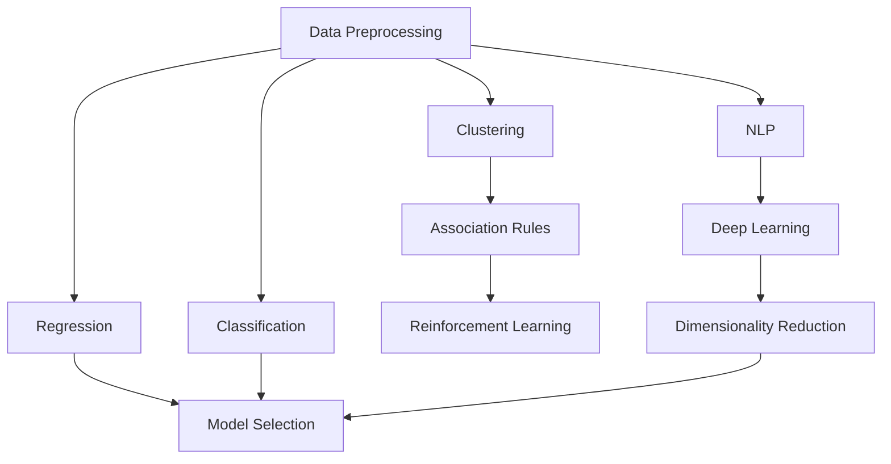

# Machine Learning A-Z: AI, Python & R + ChatGPT Prize [2025] 🚀


## 📚 Course Overview

This repository contains comprehensive implementations and documentation for the complete Machine Learning A-Z course. Each section includes Python code implementations, datasets, detailed explanations, and practical examples to master machine learning from fundamentals to advanced techniques.

## 🎯 What You'll Learn

This course covers the entire machine learning landscape, from data preprocessing to deep learning and model optimization. Perfect for beginners wanting to master ML and experienced developers looking to solidify their knowledge.

## 📋 Course Structure

### 📊 Part 1 - Data Preprocessing
**Foundation of ML Success**
- Handling missing data
- Encoding categorical variables
- Feature scaling and normalization
- Train-test splitting strategies

**Key Files:**
- `data_preprocessing.py` - Complete preprocessing pipeline
- `Data.csv` - Sample dataset for practice
- `README.md` - Detailed concept explanation

---

### 📈 Part 2 - Regression
**Predicting Continuous Values**

| Algorithm | Use Case | Complexity |
|-----------|----------|------------|
| **Simple Linear Regression** | Single feature prediction | Beginner |
| **Multiple Linear Regression** | Multiple features prediction | Beginner |
| **Polynomial Regression** | Non-linear relationships | Intermediate |
| **Support Vector Regression (SVR)** | Complex non-linear patterns | Advanced |
| **Decision Tree Regression** | Rule-based predictions | Intermediate |
| **Random Forest Regression** | Ensemble method for accuracy | Advanced |

---

### 🎯 Part 3 - Classification
**Predicting Categories**

| Algorithm | Best For | Interpretability |
|-----------|----------|------------------|
| **Logistic Regression** | Binary classification | High |
| **K-Nearest Neighbors (K-NN)** | Simple pattern recognition | Medium |
| **Support Vector Machine (SVM)** | High-dimensional data | Low |
| **Kernel SVM** | Non-linear classification | Low |
| **Naive Bayes** | Text classification | High |
| **Decision Tree Classification** | Rule-based decisions | High |
| **Random Forest Classification** | High accuracy needs | Medium |

---

### 🔍 Part 4 - Clustering
**Discovering Hidden Patterns**
- **K-Means Clustering**: Partition-based clustering
- **Hierarchical Clustering**: Tree-based clustering approach

**Applications**: Customer segmentation, market research, data exploration

---

### 🛒 Part 5 - Association Rule Learning
**Market Basket Analysis**
- **Apriori Algorithm**: Frequent itemset mining
- **Eclat Algorithm**: Efficient association rules

**Applications**: Recommendation systems, cross-selling strategies

---

### 🎮 Part 6 - Reinforcement Learning
**Learning Through Actions**
- **Upper Confidence Bound (UCB)**: Multi-armed bandit problem
- **Thompson Sampling**: Bayesian approach to exploration

**Applications**: Ad optimization, game playing, autonomous systems

---

### 💬 Part 7 - Natural Language Processing
**Understanding Human Language**
- **Bag-of-Words Model**: Text vectorization
- **NLP Algorithms**: Sentiment analysis, text classification

**Applications**: Sentiment analysis, spam detection, chatbots

---

### 🧠 Part 8 - Deep Learning
**Neural Networks & AI**
- **Artificial Neural Networks (ANN)**: Foundation of deep learning
- **Convolutional Neural Networks (CNN)**: Image recognition and computer vision

**Applications**: Image recognition, pattern detection, AI systems

---

### 📉 Part 9 - Dimensionality Reduction
**Simplifying Complex Data**
- **Principal Component Analysis (PCA)**: Linear dimensionality reduction
- **Linear Discriminant Analysis (LDA)**: Supervised dimensionality reduction
- **Kernel PCA**: Non-linear dimensionality reduction

**Applications**: Data visualization, feature selection, noise reduction

---

### ⚡ Part 10 - Model Selection & Boosting
**Optimizing Model Performance**
- **K-Fold Cross Validation**: Robust model evaluation
- **Parameter Tuning**: Finding optimal hyperparameters
- **Grid Search**: Systematic parameter optimization
- **XGBoost**: Gradient boosting for superior performance

---

## 🛠️ Repository Structure

```
Machine-Learning-A-Z/
│
├── 01-Data-Preprocessing/
│   ├── data_preprocessing.py
│   ├── Data.csv
│   └── README.md
│
├── 02-Regression/
│   ├── Simple-Linear-Regression/
│   ├── Multiple-Linear-Regression/
│   ├── Polynomial-Regression/
│   ├── SVR/
│   ├── Decision-Tree-Regression/
│   └── Random-Forest-Regression/
│
├── 03-Classification/
│   ├── Logistic-Regression/
│   ├── K-NN/
│   ├── SVM/
│   ├── Kernel-SVM/
│   ├── Naive-Bayes/
│   ├── Decision-Tree-Classification/
│   └── Random-Forest-Classification/
│
├── 04-Clustering/
│   ├── K-Means/
│   └── Hierarchical-Clustering/
│
├── 05-Association-Rule-Learning/
│   ├── Apriori/
│   └── Eclat/
│
├── 06-Reinforcement-Learning/
│   ├── Upper-Confidence-Bound/
│   └── Thompson-Sampling/
│
├── 07-Natural-Language-Processing/
│   └── Bag-of-Words/
│
├── 08-Deep-Learning/
│   ├── Artificial-Neural-Networks/
│   └── Convolutional-Neural-Networks/
│
├── 09-Dimensionality-Reduction/
│   ├── PCA/
│   ├── LDA/
│   └── Kernel-PCA/
│
└── 10-Model-Selection-Boosting/
    ├── K-Fold-Cross-Validation/
    ├── Grid-Search/
    └── XGBoost/
```

## 🔧 Setup & Installation

### Prerequisites
```bash
Python 3.8+
pip (Python package manager)
```

### Required Libraries
```bash
pip install numpy pandas matplotlib seaborn scikit-learn
pip install tensorflow keras xgboost
pip install nltk wordcloud
pip install plotly dash
```

### Quick Start
```bash
# Clone the repository
git clone https://github.com/yourusername/Machine-Learning-A-Z.git

# Navigate to project directory
cd Machine-Learning-A-Z

# Install dependencies
pip install -r requirements.txt

# Start with data preprocessing
cd 01-Data-Preprocessing
python data_preprocessing.py
```

## 📖 How to Use This Repository

### For Beginners 🌱
1. **Start with Part 1** - Master data preprocessing first
2. **Follow the sequence** - Each part builds on previous knowledge
3. **Read the README** in each folder for concept explanations
4. **Run the code** - Practice with provided datasets
5. **Experiment** - Modify parameters and observe changes

### For Experienced Developers 💼
1. **Jump to specific topics** - Use as a reference guide
2. **Compare implementations** - See different approaches
3. **Adapt to your projects** - Use code as templates
4. **Contribute improvements** - Submit pull requests

### Each Folder Contains:
- **📄 Python Implementation** - Clean, commented code
- **📊 Dataset** - Real-world data for practice
- **📚 README.md** - Detailed concept explanation
- **📈 Visualizations** - Graphs and plots for understanding
- **🔍 Analysis** - Results interpretation

## 🎓 Learning Path



## 🏆 Key Features

- ✅ **Complete Implementation** - Every algorithm coded from scratch
- ✅ **Real Datasets** - Practice with actual data
- ✅ **Detailed Documentation** - Understand the 'why' behind each technique
- ✅ **Visual Results** - See your models in action
- ✅ **Best Practices** - Industry-standard approaches
- ✅ **Beginner Friendly** - Clear explanations and comments
- ✅ **Advanced Techniques** - State-of-the-art methods included

## 🤝 Contributing

Contributions are welcome! Here's how you can help:

1. **🐛 Report Bugs** - Open an issue describing the problem
2. **💡 Suggest Features** - Share ideas for improvements
3. **📝 Improve Documentation** - Help make explanations clearer
4. **🔧 Submit Code** - Fix bugs or add new features
5. **⭐ Star the Repo** - Show your support!

### Contribution Guidelines
- Follow PEP 8 style guidelines
- Add comments to explain complex logic
- Include docstrings for functions
- Test your code before submitting
- Update documentation as needed

## 📊 Progress Tracking

- [x] Part 1: Data Preprocessing
- [x] Part 2: Regression (In Progress)
- [x] Part 3: Classification
- [x] Part 4: Clustering
- [x] Part 5: Association Rule Learning
- [x] Part 6: Reinforcement Learning
- [x] Part 7: Natural Language Processing
- [x] Part 8: Deep Learning
- [x] Part 9: Dimensionality Reduction
- [x] Part 10: Model Selection & Boosting

## 📞 Support & Contact

- **Issues**: [GitHub Issues](https://github.com/yourusername/Machine-Learning-A-Z/issues)
- **Discussions**: [GitHub Discussions](https://github.com/yourusername/Machine-Learning-A-Z/discussions)
- **Email**: danialasimbashir@gmail.com

## 📄 License

This project is licensed under the MIT License - see the [LICENSE](LICENSE) file for details.

## 🙏 Acknowledgments

- Original course creators for the comprehensive curriculum
- Scikit-learn team for amazing ML library
- Python community for excellent data science ecosystem
- Contributors who help improve this repository

## ⭐ Show Your Support

If this repository helps you learn machine learning, please give it a star! ⭐

---

**Happy Learning! 🚀 Master Machine Learning from A to Z!**

*Last Updated: June 2025*
